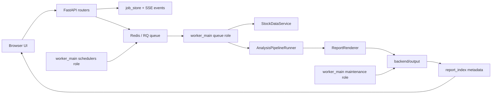
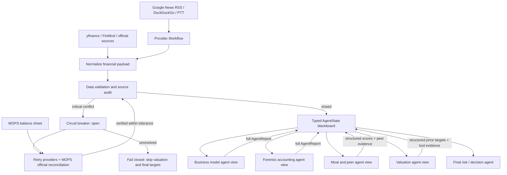
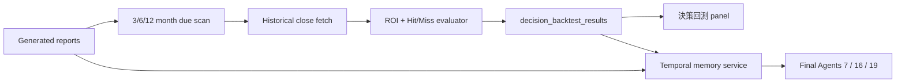
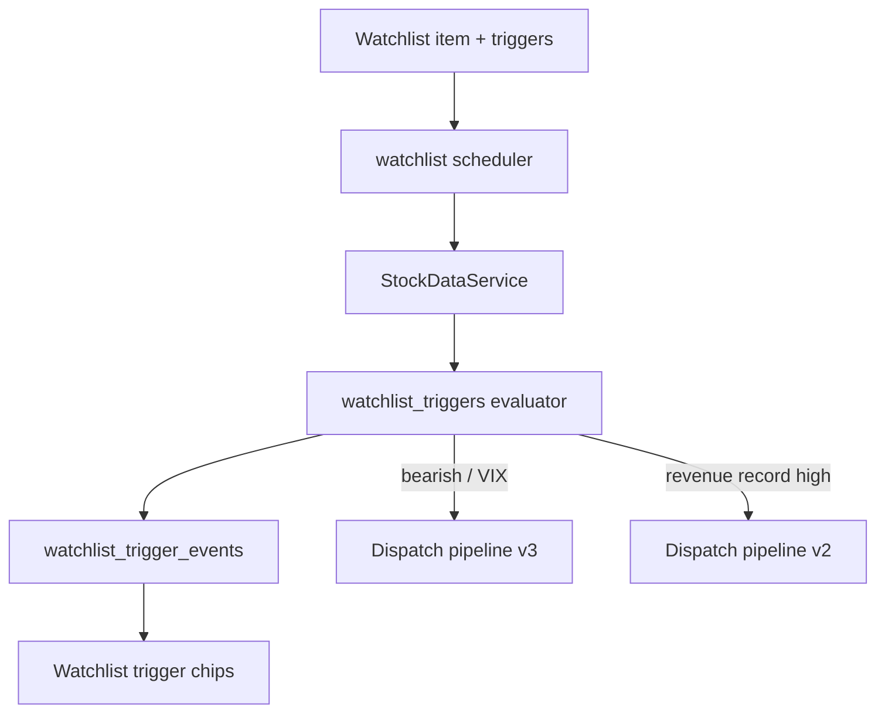

# Architecture

This system is a local-first stock research workstation. FastAPI owns the HTTP boundary, static assets render the operator UI, and backend services keep long-running analysis, report metadata, data snapshots, and observability separate.

## Runtime Flow

## Main Boundaries

- `backend/api.py` wires HTTP dependencies and app lifespan only. Route behavior lives in `backend/api_routes/`.
- `backend/worker_main.py` owns background process roles: `queue / schedulers / maintenance`. The API process never starts queue consumers, watchlist schedulers, decision tracking schedulers, or cleanup loops.
- `StockDataService` is the canonical market/fundamental data fetch boundary.
- `AnalysisPipelineRunner` is the canonical multi-agent analysis boundary.
- `report_index` and `report_history_service` expose report listing metadata instead of making callers parse files directly.
- `decision_freshness` separates conclusion freshness from data freshness. A refreshed snapshot can be newer than the HTML/Markdown conclusion, so the API marks that report as `needs_rerun`.
- Mutation endpoints require a mutation token header. If `MUTATION_API_TOKEN` is not set, the server generates a runtime mutation token and exposes it to the same-origin UI through `/api/client-config`.

## Operational State

- Analysis and rerun jobs emit events to SQLite so SSE clients can resume progress.
- Web/API mode requires Redis/RQ. `TASK_QUEUE_BACKEND=local` is reserved for embedded tests and is rejected at the API boundary with `API task queue requires Redis and RQ`.
- RQ retries are configured by `RQ_JOB_MAX_RETRIES` and `RQ_JOB_RETRY_INTERVALS`; retry-delayed jobs use `waiting_retry`, which remains active for duplicate-job checks and observability.
- Maintenance routes default to dry-run unless `write=true` is provided.
- Long-running maintenance also runs in the worker `maintenance` role. `worker_main.py --role all` starts queue, scheduler, and maintenance children with multiprocessing `spawn` and forwards `SIGTERM` / `SIGINT` for shutdown.
- Provider SLA and API quota dashboards are local observations, not provider billing truth.
- Decision backtests live in `decision_backtest_results` and are keyed by report filename plus horizon to make reruns idempotent.
- Watchlist trigger configuration and trigger events live beside the watchlist SQLite store, keeping event-radar state separate from report metadata.

## Agent Blackboard

The existing DAG runner remains the orchestration layer, but every run now owns a typed `AgentState` at `context["agent_state"]`. This compatibility layer provides StateGraph-style shared memory without requiring an immediate LangGraph migration.

`AgentState` stores:

- raw and normalized financial data
- provider-level values and source audit records
- validation issues and circuit-breaker status
- selected peer context and deterministic quant metrics
- complete `AgentReport` records, structured outputs, and risk flags

Prompt construction uses `state_view_for(role, state)` to expose only the paths needed by that role. Valuation agents receive normalized financials, quant metrics, peer context, validation issues, risk flags, and tool results. Final risk agents also receive the complete upstream report map. The old `{prev}` text remains only as a compatibility aid and is not the primary evidence source.

## Decision Learning Loop

`temporal_memory` is injected into the stock data payload before `AnalysisPipelineRunner` starts. Prompt routing treats it as least-privilege external context: only final decision agents 7, 16, and 19 can see it. The data snapshot persists the same block, allowing report preview to show the prior recommendation, target price, and backtest outcome later.

## Event-Driven Radar

The scheduler still runs regular pre/post-market watchlist batches. After post-market time it also evaluates event triggers. Every trigger has a deterministic `trigger_key`; the event table prevents duplicate jobs for the same date, while `find_active_job` prevents concurrent duplicate analysis for the selected pipeline.

## Data Circuit Breaker

Revenue, Net Income, Total Debt, and Free Cash Flow are critical fields. A cross-provider difference above the configured threshold opens the circuit breaker before RAG or agent execution. The run then creates a deterministic reconciliation plan:

1. bypass cache and retry yfinance and FinMind
2. locate the matching MOPS quarterly or annual filing
3. reconcile period, unit, currency, and consolidated-versus-parent-only scope
4. resume only when an API source agrees with the official filing within tolerance

Unresolved conflicts fail closed and block valuation and target-price generation.

Free recent-catalyst enrichment is registered as the first `recent_catalysts` provider. Its waterfall records Google News RSS, DuckDuckGo News, and PTT layer audits under `source_audit`, then merges unique news by link first and title second alongside Google Search, FMP, and Yahoo Finance records.

For `total_debt` conflicts, the pipeline can execute MOPS reconciliation before agent execution. MOPS values are written into `AgentState.provider_values` and `raw_financial_data["official_filings"]` only when the official filing is consolidated, uses the expected unit, matches the requested period, and agrees with at least one API provider within tolerance. Unsupported or mixed blocking fields remain open.

## Peer Selection

Profile-aware peer selection applies GICS proximity, a 0.2x-5.0x market-cap band, a revenue-scale check, and business/product/segment overlap scoring. When qualified local peers are insufficient, the selector expands to global candidates. If profile metadata is unavailable, the previous heuristic path remains available as a degraded fallback.

## Structured Outputs And Tools

Pydantic models define moat scores, price targets, valuation summaries, and recommendations. Google GenAI continues to receive native `response_schema` models. OpenAI Chat Completions callers use a separate strict JSON Schema adapter, preventing provider-specific schema rules from leaking into the Google path.

Valuation agents can call deterministic CAGR, WACC, DCF, DDM, and implied-revenue-growth tools. Extreme Forward EPS assumptions must be checked with `calculate_implied_revenue_growth`; final reports cite the returned parameters and `implied_revenue_cagr_pct` instead of relying on model arithmetic.
