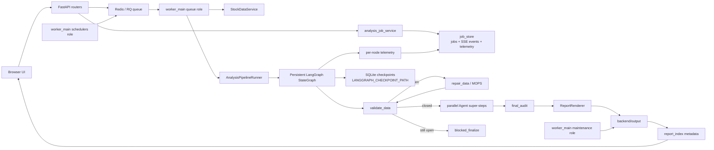
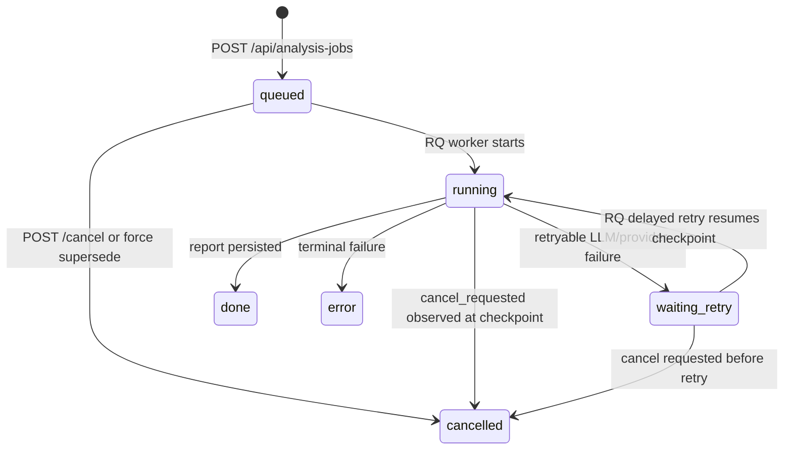
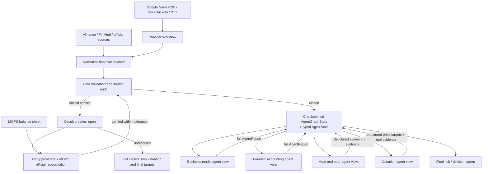
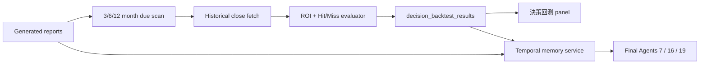
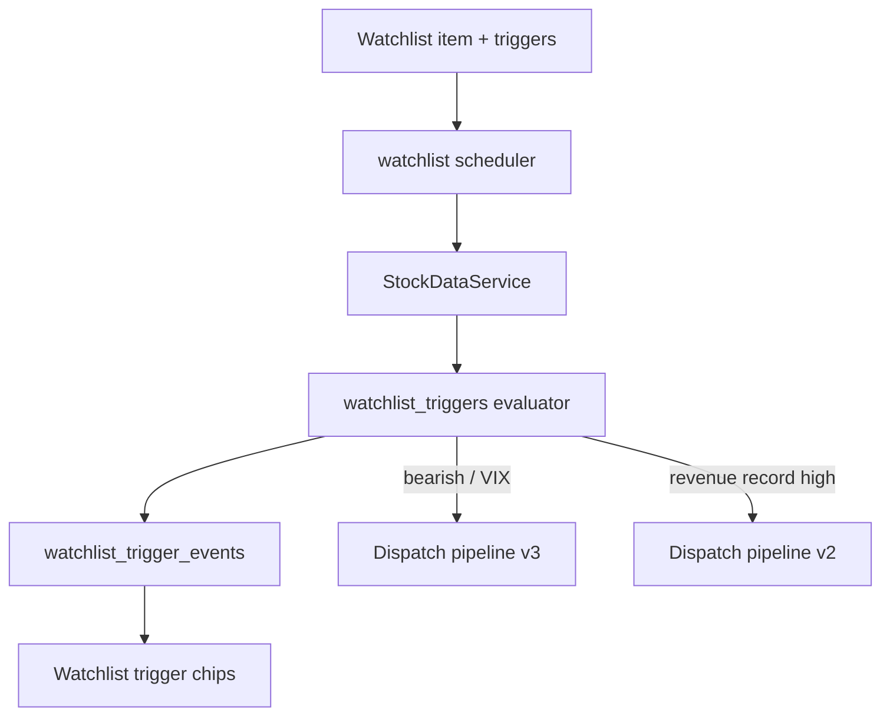

# Architecture

This system is a local-first stock research workstation. FastAPI owns the HTTP boundary, static assets render the operator UI, and backend services keep long-running analysis, report metadata, data snapshots, and observability separate.

## Runtime Flow

## Main Boundaries

- `backend/api.py` wires HTTP dependencies and app lifespan only. Route behavior lives in `backend/api_routes/`.
- `backend/analysis_job_service.py` owns the formal analysis job lifecycle: create-or-attach, force supersede, enqueue, cancel, and API serialization. Routes do not duplicate queue/store orchestration.
- `backend/worker_main.py` owns background process roles: `queue / schedulers / maintenance`. The API process never starts queue consumers, watchlist schedulers, decision tracking schedulers, or cleanup loops.
- `StockDataService` is the canonical market/fundamental data fetch boundary.
- `AnalysisPipelineRunner` is the canonical multi-agent analysis boundary and invokes `backend/workflow_graph.py`, not the retired manual DAG group loop.
- `report_index` and `report_history_service` expose report listing metadata instead of making callers parse files directly.
- `decision_freshness` separates conclusion freshness from data freshness. A refreshed snapshot can be newer than the HTML/Markdown conclusion, so the API marks that report as `needs_rerun`.
- Mutation endpoints require `X-Mutation-Token`. Local mode can generate a runtime mutation token and expose it to the same-origin UI through `/api/client-config`; production/server profiles require `MUTATION_API_TOKEN` and explicit CORS origins. The legacy `X-Admin-Token` alias is disabled by default and only accepted when `ALLOW_LEGACY_ADMIN_TOKEN=true`. The same auth boundary applies an in-memory rate limit controlled by `MUTATION_RATE_LIMIT_MAX_REQUESTS` and `MUTATION_RATE_LIMIT_WINDOW_SECONDS`.

## Operational State

- Analysis and rerun jobs emit events to SQLite so SSE clients can resume progress.
- Analysis job creation is a POST mutation at `/api/analysis-jobs`; the older `GET /api/analyze/{ticker}` remains a deprecated compatibility wrapper for existing UI flows.
- `analysis_jobs(ticker, pipeline_id)` has an active-job uniqueness guard for `queued`, `running`, and `waiting_retry` rows. The create flow uses a SQLite `BEGIN IMMEDIATE` transaction plus a partial unique index so concurrent producers attach to one active job instead of creating duplicate reports.
- SSE event readers use `/api/analysis-jobs/{job_id}/events`; they never create jobs. Reconnect uses `Last-Event-ID`, `last_event_id`, or `since_id`, idle polling backs off from 0.5s to 5s, and heartbeat events keep proxies/browsers from treating the stream as idle.
- Web/API mode requires Redis/RQ. `TASK_QUEUE_BACKEND=local` is reserved for embedded tests and is rejected at the API boundary with `API task queue requires Redis and RQ`.
- RQ can be tiered with `TASK_QUEUE_NAMES`. Manual `analysis:*` jobs route to `analysis.high`, `report-rerun:*` jobs route to `analysis.normal`, and watchlist scheduler jobs explicitly route to `watchlist`; the queue worker consumes all configured queues so legacy `TASK_QUEUE_NAME` jobs still drain.
- RQ retries are configured by `RQ_JOB_MAX_RETRIES` and `RQ_JOB_RETRY_INTERVALS`; retry-delayed jobs use `waiting_retry`, which remains active for duplicate-job checks and observability.
- LangGraph threads use `job_id:pipeline_id` so continuous runs keep separate durable checkpoints per pipeline segment. Worker execution uses `LANGGRAPH_CHECKPOINT_PATH` with SQLite WAL, `busy_timeout=30000`, and `synchronous=NORMAL`.
- LangGraph node retry is short and in-process for transient LLM/network errors. When retries are exhausted, RQ records `waiting_retry` and later invokes the same thread id with `None` input so successful checkpointed nodes are not repeated.
- Agent step cache lives behind the existing JSON cache facade. A successful agent output is keyed by ticker, data snapshot hash/fingerprint, agent id, prompt version, model id, and prompt hash; cache hits skip provider calls, restore structured output, and emit `agent_step_cache_hit` runtime events.
- Maintenance routes default to dry-run unless `write=true` is provided.
- Long-running maintenance also runs in the worker `maintenance` role. `worker_main.py --role all` starts queue, scheduler, and maintenance children with multiprocessing `spawn` and forwards `SIGTERM` / `SIGINT` for shutdown.
- Provider SLA and API quota dashboards are local observations, not provider billing truth.
- Decision backtests live in `decision_backtest_results` and are keyed by report filename plus horizon to make reruns idempotent.
- Watchlist trigger configuration and trigger events live beside the watchlist SQLite store, keeping event-radar state separate from report metadata.

## Analysis Job Lifecycle

The public job API maps internal `done/error` to `completed/failed` while preserving existing worker/UI status names internally. `force=true` does not let two active jobs race to overwrite the same report: old active jobs are marked `cancelled` with a superseded event before the new queued row is inserted.

## Telemetry Flow

Every LangGraph node is wrapped by a thin telemetry adapter. On success or failure it records:

- `job_id`, `ticker`, `pipeline_id`, and `node_name`
- model id when known
- start/end timestamps and latency
- `success/failed` status, retry count, token placeholders, cache hit, quality gate result
- sanitized exception class/message on failure

The worker writes telemetry to `analysis_node_telemetry` and also emits non-breaking SSE events with `type=telemetry`. Existing frontends can ignore the new event type. Operators can read the stable schema from `GET /api/analysis-jobs/{job_id}/telemetry`.

## Security Boundary

Local-first mode is intended for `127.0.0.1` workstation use. `UNSTUCK_ENV=local` may use a runtime mutation token for the bundled browser UI. `UNSTUCK_ENV=production`, `DEPLOYMENT_MODE=server`, and `DEPLOYMENT_MODE=lan` require an explicit `MUTATION_API_TOKEN`; wildcard CORS is rejected and CORS methods/headers are restricted to the API surface. Network-exposed profiles must also use built-in Basic Auth or explicitly set `EXTERNAL_ACCESS_CONTROLLED=true` when protected by an OAuth proxy, Tailscale ACL, or equivalent outer boundary. Report HTML is served with CSP (`script-src 'none'`), `X-Content-Type-Options: nosniff`, and `Referrer-Policy: no-referrer`. Error and telemetry serialization sanitize token-like strings before they reach API/SSE clients.

## Durable LangGraph Agent Workflow

Every run owns a checkpoint-safe `AgentGraphState` plus a validated Pydantic `AgentState`. `AgentGraphState` contains only JSON-compatible data: raw/normalized financial payloads, provider values, validation issues, circuit-breaker state, quant metrics, RAG payload metadata, complete Agent reports, structured outputs, report filename, status, and execution trace. Process-local objects such as callbacks, LLM clients, Redis connections, SQLite handles, compiled graphs, and in-memory RAG indexes are reconstructed in node services and never written to checkpoints.

Mode A group 並行策略：Agent 1/2 同組（商業模式與財務分析互不依賴），Agent 6/21 同組（多空辯論與 SEC 整合可並行），可縮短總執行時間約 30–90 秒。

`AgentState` / `AgentGraphState` store:

- raw and normalized financial data
- provider-level values and source audit records
- validation issues and circuit-breaker status
- selected peer context and deterministic quant metrics
- complete `AgentReport` records, structured outputs, and risk flags

Prompt construction uses `state_view_for(role, state)` to expose only the paths needed by that role. Valuation agents receive normalized financials, quant metrics, peer context, validation issues, risk flags, and tool results. Final risk agents also receive the complete upstream report map. The old `{prev}` text remains only as a compatibility aid and is not the primary evidence source.

Checkpoint lifecycle:

1. Initial Worker invocation builds `AgentGraphState` and uses `thread_id = job_id:pipeline_id`.
2. `execute_persistent_workflow()` opens the SQLite checkpointer, compiles the graph, and inspects the saved snapshot.
3. If a prior attempt failed mid-run, the next RQ attempt invokes the same graph with `None` input and the same thread id. LangGraph resumes from pending nodes.
4. If the snapshot is already terminal, the saved state is returned directly.
5. Stable report filenames are derived from `job_id:pipeline_id`, so retrying an already completed pipeline overwrites the same report bundle rather than creating duplicates.

## Decision Learning Loop

`temporal_memory` is injected into the stock data payload before `AnalysisPipelineRunner` starts. Prompt routing treats it as least-privilege external context: only final decision agents 7, 16, and 19 can see it. The data snapshot persists the same block, allowing report preview to show the prior recommendation, target price, and backtest outcome later.

## Free Mode And Qlib-Lite Artifacts

`FREE_MODE=true` is the default operating contract. Provider modules expose a capability contract with `source`, `markets`, `cost_tier`, `capabilities`, `requires_env`, and request support. The ops dashboard includes a `free_mode` summary so optional paid or key-backed enrichment cannot quietly become the only path for a source. `free` and `free_with_key` providers are allowed in free mode; paid providers may exist only as optional enrichment when another free-compatible provider covers the same source/market.

The Qlib-inspired layer is intentionally lightweight. `backend/factor_store.py` builds deterministic `factor_snapshot.v1` payloads from local/free price and fundamental inputs. `backend/backtest_artifacts.py` links a report decision, alpha model id, price path, benchmark path, and factor snapshot into `backtest_artifact.v1`, including strategy ROI, benchmark return, excess return, and drawdown. `backend/alpha_model_registry.py` wraps pipeline modes as versioned alpha models with minimum data confidence, required outputs, and free-mode debate limits. `backend/strategy_evaluator.py` then aggregates artifacts by alpha model, Quality Funnel outcome, and watchlist trigger source so Mode A/B/C/D and trigger-led ideas can be compared without a paid quant platform.

The daily decision dashboard (`GET /api/watchlist/daily-dashboard`) consumes recent reports, watchlist alerts, auto-screener candidates, decision backtest stats, and free-mode status to produce one next-action surface. Its `notification_plan` keeps local UI notifications always available and treats SMTP/Telegram/Discord/Slack only as user-supplied free integrations. Portfolio CSV risk (`POST /api/watchlist/portfolio/risk`) stays broker-free: it parses pasted/exported CSV and returns concentration, sector/country exposure, and thesis-health risk flags. Symbol suggestions (`GET /api/watchlist/symbols`) and watchlist paste/CSV import (`POST /api/watchlist/import`) use local parsing and the existing mutation-token boundary.

## Event-Driven Radar

The scheduler still runs regular pre/post-market watchlist batches. After post-market time it also evaluates event triggers. Every trigger has a deterministic `trigger_key`; the event table prevents duplicate jobs for the same date, while `find_active_job` prevents concurrent duplicate analysis for the selected pipeline.

## Data Circuit Breaker

Revenue, Net Income, Total Debt, and Free Cash Flow are critical fields. A cross-provider difference above the configured threshold opens the circuit breaker before RAG or agent execution. The run then creates a deterministic reconciliation plan:

1. bypass cache and retry yfinance and FinMind
2. locate the matching MOPS quarterly or annual filing
3. reconcile period, unit, currency, and consolidated-versus-parent-only scope
4. resume only when an API source agrees with the official filing within tolerance

Unresolved conflicts fail closed and block valuation and target-price generation.

Free recent-catalyst enrichment is registered as the first `recent_catalysts` provider. Its waterfall records Google News RSS, DuckDuckGo News, and PTT layer audits under `source_audit`, then merges unique news by link first and title second alongside Google Search, FMP, and Yahoo Finance records.

For `total_debt` conflicts, the pipeline can execute MOPS reconciliation before agent execution. MOPS values are written into `AgentState.provider_values` and `raw_financial_data["official_filings"]` only when the official filing is consolidated, uses the expected unit, matches the requested period, and agrees with at least one API provider within tolerance. Unsupported or mixed blocking fields remain open.

## Peer Selection

Profile-aware peer selection applies GICS proximity, a 0.2x-5.0x market-cap band, a revenue-scale check, and business/product/segment overlap scoring. When qualified local peers are insufficient, the selector expands to global candidates. If profile metadata is unavailable, the previous heuristic path remains available as a degraded fallback.

## Structured Outputs And Tools

Pydantic models define moat scores, price targets, valuation summaries, and recommendations. Google GenAI continues to receive native `response_schema` models. OpenAI Chat Completions callers use a separate strict JSON Schema adapter, preventing provider-specific schema rules from leaking into the Google path.

Valuation agents can call deterministic CAGR, WACC, DCF, DDM, and implied-revenue-growth tools. Extreme Forward EPS assumptions must be checked with `calculate_implied_revenue_growth`; final reports cite the returned parameters and `implied_revenue_cagr_pct` instead of relying on model arithmetic.

## Decision Discipline Modules

The AI Berkshire comparison is implemented as local, deterministic decision discipline around the existing multi-agent system rather than as another free-form agent.

- `backend/research_playbooks.py` is the canonical registry for pipeline playbooks and non-pipeline discipline workflows such as investment checklist, thesis tracker, portfolio review, and quality screen.
- `backend/investment_thesis.py` turns final synthesis context into a durable investment thesis: core assumptions, red lines, valuation anchor, data gaps, mirror-test lines, and next review trigger. The chief editor writes it into workflow state and Markdown reports.
- `backend/evidence_exit_gate.py` samples numeric claims from generated Markdown against the report data snapshot before final metadata is persisted. The result is stored under `metadata.evidence_exit_gate` and folded into snapshot integrity.
- `backend/report_reproducibility.py` derives `data_confidence_score`, target-price guardrails, and the reproducibility packet from deterministic context. `reproducibility_packet.data_snapshot_hash` is excluded from hash input and then populated with the final snapshot hash, avoiding recursive hash drift while preserving traceability.
- `backend/quality_funnel.py` is a fast pass/gray/reject screen for business quality. The daily market screener attaches this result to each candidate and watchlist trigger, using `gray` when fundamentals are missing rather than rejecting technical or event-driven candidates prematurely.
