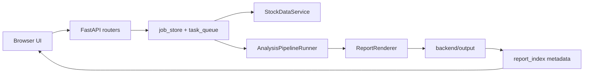

# Architecture

This system is a local-first stock research workstation. FastAPI owns the HTTP boundary, static assets render the operator UI, and backend services keep long-running analysis, report metadata, data snapshots, and observability separate.

## Runtime Flow

## Main Boundaries

- `backend/api.py` wires dependencies and app lifespan only. Route behavior lives in `backend/api_routes/`.
- `StockDataService` is the canonical market/fundamental data fetch boundary.
- `AnalysisPipelineRunner` is the canonical multi-agent analysis boundary.
- `report_index` and `report_history_service` expose report listing metadata instead of making callers parse files directly.
- `decision_freshness` separates conclusion freshness from data freshness. A refreshed snapshot can be newer than the HTML/Markdown conclusion, so the API marks that report as `needs_rerun`.
- Mutation endpoints require a mutation token header. If `MUTATION_API_TOKEN` is not set, the server generates a runtime mutation token and exposes it to the same-origin UI through `/api/client-config`.

## Operational State

- Analysis and rerun jobs emit events to SQLite so SSE clients can resume progress.
- Maintenance routes default to dry-run unless `write=true` is provided.
- Provider SLA and API quota dashboards are local observations, not provider billing truth.
