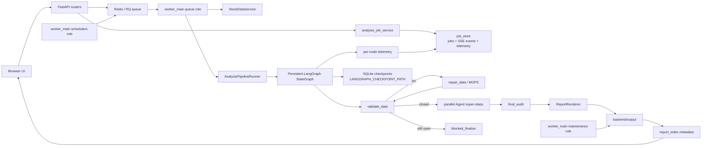
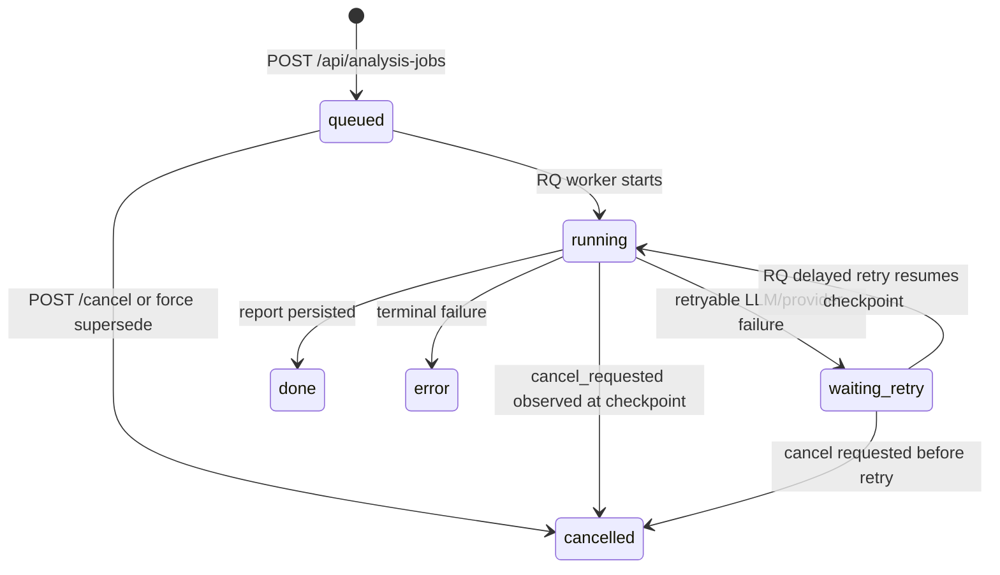
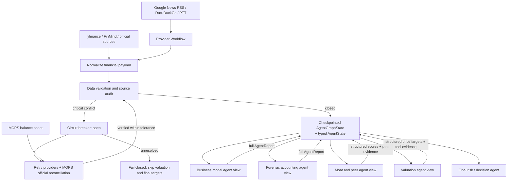
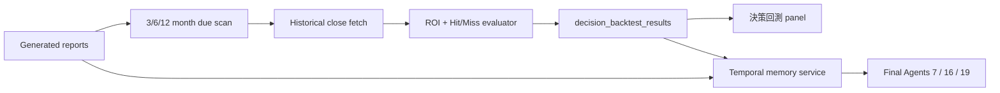
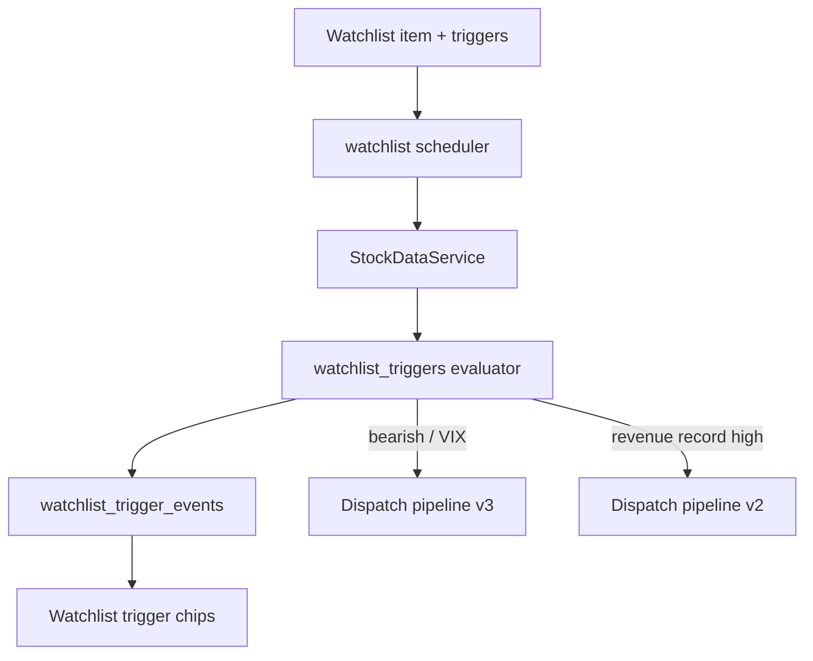

# Architecture

This system is a local-first stock research workstation. FastAPI owns the HTTP boundary, static assets render the operator UI, and backend services keep long-running analysis, report metadata, data snapshots, and observability separate.

For day-to-day maintenance navigation, see [系統架構關聯圖](system-architecture-map.md). It maps UI/API/service/storage relationships and the canonical runtime paths so operators do not confuse current state with legacy SQLite files or flat report-output paths.

## Runtime Flow

```mermaid
flowchart LR
    UI["Browser UI"] --> API["FastAPI routers"]
    API --> JobSvc["analysis_job_service"]
    JobSvc --> Jobs["job_store\njobs + SSE events + telemetry"]
    API --> Queue["Redis / RQ queue"]
    Queue --> Worker["worker_main queue role"]
    Worker --> Data["StockDataService"]
    Worker --> Runner["AnalysisPipelineRunner"]
    Runner --> Graph["Persistent LangGraph StateGraph"]
    Graph --> Telemetry["per-node telemetry"]
    Telemetry --> Jobs
    Graph --> Checkpoints["SQLite checkpoints\nLANGGRAPH_CHECKPOINT_PATH"]
    Graph --> Validate["validate_data"]
    Validate -->|"open"| Repair["repair_data / MOPS"]
    Repair --> Validate
    Validate -->|"closed"| Agents["parallel Agent super-steps"]
    Validate -->|"still open"| Blocked["blocked_finalize"]
    Agents --> Audit["final_audit"]
    Audit --> Reports["ReportRenderer"]
    Reports --> Output["backend/output"]
    Output --> Index["report_index metadata"]
    Index --> UI
    Scheduler["worker_main schedulers role"] --> Queue
    Maintenance["worker_main maintenance role"] --> Output
```

## Main Boundaries

- `backend/api.py` wires HTTP dependencies and app lifespan only. Route behavior lives in `backend/api_routes/`.
- `backend/analysis_job_service.py` owns the formal analysis job lifecycle: create-or-attach, force supersede, enqueue, cancel, and API serialization. Routes do not duplicate queue/store orchestration.
- `backend/worker_main.py` owns background process roles: `queue / schedulers / maintenance`. The API process never starts queue consumers, watchlist schedulers, decision tracking schedulers, or cleanup loops.
- `StockDataService` is the canonical market/fundamental data fetch boundary.
- `AnalysisPipelineRunner` is the canonical multi-agent analysis boundary and invokes `backend/workflow_graph.py`, not the retired manual DAG group loop.
- `report_index` and `report_history_service` expose report listing metadata instead of making callers parse files directly.
- `decision_freshness` separates conclusion freshness from data freshness. A refreshed snapshot can be newer than the HTML/Markdown conclusion, so the API marks that report as `needs_rerun`.
- Mutation endpoints require `X-Mutation-Token`. Local mode can generate a runtime mutation token and expose it to the same-origin UI through `/api/client-config`; production/server profiles require `MUTATION_API_TOKEN` and explicit CORS origins. The legacy `X-Admin-Token` alias is disabled by default and only accepted when `ALLOW_LEGACY_ADMIN_TOKEN=true`. The same auth boundary applies an in-memory rate limit controlled by `MUTATION_RATE_LIMIT_MAX_REQUESTS` and `MUTATION_RATE_LIMIT_WINDOW_SECONDS`.

## Operational State

- Analysis and rerun jobs emit events to SQLite so SSE clients can resume progress.
- Analysis job creation is a POST mutation at `/api/analysis-jobs`; the older `GET /api/analyze/{ticker}` remains a deprecated compatibility wrapper for existing UI flows.
- `analysis_jobs(ticker, pipeline_id)` has an active-job uniqueness guard for `queued`, `running`, and `waiting_retry` rows. The create flow uses a SQLite `BEGIN IMMEDIATE` transaction plus a partial unique index so concurrent producers attach to one active job instead of creating duplicate reports.
- SSE event readers use `/api/analysis-jobs/{job_id}/events`; they never create jobs. Reconnect uses `Last-Event-ID`, `last_event_id`, or `since_id`, idle polling backs off from 0.5s to 5s, and heartbeat events keep proxies/browsers from treating the stream as idle.
- Web/API mode requires Redis/RQ. `TASK_QUEUE_BACKEND=local` is reserved for embedded tests and is rejected at the API boundary with `API task queue requires Redis and RQ`.
- RQ can be tiered with `TASK_QUEUE_NAMES`. Manual `analysis:*` jobs route to `analysis.high`, `report-rerun:*` jobs route to `analysis.normal`, and watchlist scheduler jobs explicitly route to `watchlist`; the queue worker consumes all configured queues so legacy `TASK_QUEUE_NAME` jobs still drain.
- RQ retries are configured by `RQ_JOB_MAX_RETRIES` and `RQ_JOB_RETRY_INTERVALS`; retry-delayed jobs use `waiting_retry`, which remains active for duplicate-job checks and observability.
- Stale RQ failed jobs remain visible as maintenance evidence but are not auto-retried or auto-deleted. The explicit `queue_maintenance.cleanup_stale_failed_jobs` path is dry-run by default and requires the mutation boundary plus `write=true` before deleting only jobs with verifiable `ended_at` or `created_at` age.
- All four maintenance-panel cleanup buttons use the same preview-confirmation boundary: the UI first calls the existing maintenance endpoint with `write=false`, and only a positive candidate count plus an operator confirmation can call the matching `write=true` action. Cancelled, empty, or unavailable confirmation paths do not write.
- LangGraph threads use `job_id:pipeline_id` so continuous runs keep separate durable checkpoints per pipeline segment. Worker execution uses `LANGGRAPH_CHECKPOINT_PATH` with SQLite WAL, `busy_timeout=30000`, and `synchronous=NORMAL`.
- LangGraph node retry is short and in-process for transient LLM/network errors. When retries are exhausted, RQ records `waiting_retry` and later invokes the same thread id with `None` input so successful checkpointed nodes are not repeated.
- Agent step cache lives behind the existing JSON cache facade. A successful agent output is keyed by ticker, data snapshot hash/fingerprint, agent id, prompt version, model id, and prompt hash; cache hits skip provider calls, restore structured output, and emit `agent_step_cache_hit` runtime events.
- Maintenance routes default to dry-run unless `write=true` is provided.
- Long-running maintenance also runs in the worker `maintenance` role. `worker_main.py --role all` starts queue, scheduler, and maintenance children with multiprocessing `spawn` and forwards `SIGTERM` / `SIGINT` for shutdown.
- Provider SLA and API quota dashboards are local observations, not provider billing truth. Gemini quota panels retain model-level call and quota/rate-limit error maps so routing review can distinguish a concentrated model failure from aggregate traffic; the derived error rate does not authorize automatic key/model disable.
- Decision backtests live in `decision_backtest_results` and are keyed by report filename plus horizon to make reruns idempotent.
- Watchlist trigger configuration and trigger events live beside the watchlist SQLite store, keeping event-radar state separate from report metadata.

## Analysis Job Lifecycle

```mermaid
stateDiagram-v2
    [*] --> queued: POST /api/analysis-jobs
    queued --> running: RQ worker starts
    running --> waiting_retry: retryable LLM/provider failure
    waiting_retry --> running: RQ delayed retry resumes checkpoint
    queued --> cancelled: POST /cancel or force supersede
    running --> cancelled: cancel_requested observed at checkpoint
    running --> done: report persisted
    running --> error: terminal failure
    waiting_retry --> cancelled: cancel requested before retry
```

The public job API maps internal `done/error` to `completed/failed` while preserving existing worker/UI status names internally. `force=true` does not let two active jobs race to overwrite the same report: old active jobs are marked `cancelled` with a superseded event before the new queued row is inserted.

## Telemetry Flow

Every LangGraph node is wrapped by a thin telemetry adapter. On success or failure it records:

- `job_id`, `ticker`, `pipeline_id`, and `node_name`
- model id when known
- start/end timestamps and latency
- `success/failed` status, retry count, token placeholders, cache hit, quality gate result
- sanitized exception class/message on failure

The worker writes telemetry to `analysis_node_telemetry` and also emits non-breaking SSE events with `type=telemetry`. Existing frontends can ignore the new event type. Operators can read the stable schema from `GET /api/analysis-jobs/{job_id}/telemetry`.

The ops dashboard summarizes the same telemetry into `model_route_budget.v1`, and `GET /api/observability/model-routes` exposes that section without requiring the full dashboard payload. Routes are grouped by `pipeline_id/model`, cache hits are excluded from billable token totals, and estimated USD cost stays `null` until a verified price table exists. Retry storms, slow p95 routes, and quality-gate failures become operator warnings instead of hidden latency or cost drift. The operator panel shows those warnings for maintenance triage; `slow_route` remains excluded from the daily decision queue because latency alone does not establish a report rerun need.

## Security Boundary

Local-first mode is intended for `127.0.0.1` workstation use. `UNSTUCK_ENV=local` may use a runtime mutation token for the bundled browser UI. `UNSTUCK_ENV=production`, `DEPLOYMENT_MODE=server`, and `DEPLOYMENT_MODE=lan` require an explicit `MUTATION_API_TOKEN`; wildcard CORS is rejected and CORS methods/headers are restricted to the API surface. Network-exposed profiles must also use built-in Basic Auth or explicitly set `EXTERNAL_ACCESS_CONTROLLED=true` when protected by an OAuth proxy, Tailscale ACL, or equivalent outer boundary. Report HTML is served with CSP (`script-src 'none'`), `X-Content-Type-Options: nosniff`, and `Referrer-Policy: no-referrer`. Error and telemetry serialization sanitize token-like strings before they reach API/SSE clients.

## Durable LangGraph Agent Workflow

Every run owns a checkpoint-safe `AgentGraphState` plus a validated Pydantic `AgentState`. `AgentGraphState` contains only JSON-compatible data: raw/normalized financial payloads, provider values, validation issues, circuit-breaker state, quant metrics, RAG payload metadata, complete Agent reports, structured outputs, report filename, status, and execution trace. Process-local objects such as callbacks, LLM clients, Redis connections, SQLite handles, compiled graphs, and in-memory RAG indexes are reconstructed in node services and never written to checkpoints.

Mode A group 並行策略：Agent 1/2 同組（商業模式與財務分析互不依賴），Agent 6/21 同組（多空辯論與 SEC 整合可並行），可縮短總執行時間約 30–90 秒。

```mermaid
flowchart TD
    Providers["yfinance / FinMind / official sources"] --> Normalize["Normalize financial payload"]
    FreeNews["Google News RSS / DuckDuckGo / PTT"] --> ProviderWorkflow["Provider Workflow"]
    ProviderWorkflow --> Normalize
    Normalize --> Validate["Data validation and source audit"]
    Validate -->|"critical conflict"| Breaker["Circuit breaker: open"]
    Breaker --> Reconcile["Retry providers + MOPS official reconciliation"]
    MOPS["MOPS balance sheet"] --> Reconcile
    Reconcile -->|"verified within tolerance"| Validate
    Breaker -->|"unresolved"| Block["Fail closed: skip valuation and final targets"]
    Validate -->|"closed"| State["Checkpointed AgentGraphState\n+ typed AgentState"]

    State --> Business["Business model agent view"]
    State --> Forensic["Forensic accounting agent view"]
    State --> Moat["Moat and peer agent view"]
    State --> Valuation["Valuation agent view"]

    Business -->|"full AgentReport"| State
    Forensic -->|"full AgentReport"| State
    Moat -->|"structured scores + peer evidence"| State
    Valuation -->|"structured price targets + tool evidence"| State

    State --> Final["Final risk / decision agent"]
```

`AgentState` / `AgentGraphState` store:

- raw and normalized financial data
- provider-level values and source audit records
- validation issues and circuit-breaker status
- selected peer context and deterministic quant metrics
- complete `AgentReport` records, structured outputs, and risk flags

Prompt construction uses `state_view_for(role, state)` to expose only the paths needed by that role. Valuation agents receive normalized financials, quant metrics, peer context, validation issues, risk flags, and tool results. Final risk agents also receive the complete upstream report map. The old `{prev}` text remains only as a compatibility aid and is not the primary evidence source.

Checkpoint lifecycle:

1. Initial Worker invocation builds `AgentGraphState` and uses `thread_id = job_id:pipeline_id`.
2. `execute_persistent_workflow()` opens the SQLite checkpointer, compiles the graph, and inspects the saved snapshot.
3. If a prior attempt failed mid-run, the next RQ attempt invokes the same graph with `None` input and the same thread id. LangGraph resumes from pending nodes.
4. If the snapshot is already terminal, the saved state is returned directly.
5. Stable report filenames are derived from `job_id:pipeline_id`, so retrying an already completed pipeline overwrites the same report bundle rather than creating duplicates.

## Decision Learning Loop

```mermaid
flowchart LR
    Reports["Generated reports"] --> DueScan["3/6/12 month due scan"]
    DueScan --> Prices["Historical close fetch"]
    Prices --> Backtest["ROI + Hit/Miss evaluator"]
    Backtest --> Store["decision_backtest_results"]
    Store --> PerfUI["決策回測 panel"]
    Store --> Memory["Temporal memory service"]
    Reports --> Memory
    Memory --> FinalAgents["Final Agents 7 / 16 / 19"]
```

`temporal_memory` is injected into the stock data payload before `AnalysisPipelineRunner` starts. Prompt routing treats it as least-privilege external context: only final decision agents 7, 16, and 19 can see it. The data snapshot persists the same block, allowing report preview to show the prior recommendation, target price, and backtest outcome later.

## Free Mode And Qlib-Lite Artifacts

`FREE_MODE=true` is the default operating contract. Provider modules expose a capability contract with `source`, `markets`, `cost_tier`, `capabilities`, `requires_env`, and request support. Provider SLA window normalization stays in `provider_sla_observability`; alert/source-health projection is owned by `provider_sla_dashboard_payload`, while shape-safe stuck/queue payload helpers are owned by `api_observability_payload_helpers`. `api_observability_service` remains the aggregation layer. The ops dashboard includes a `free_mode` summary so optional paid or key-backed enrichment cannot quietly become the only path for a source. It also includes `notification_delivery` health from `notification_delivery_audit`, raising dashboard `status` to `warning` when failed or retry-exhausted sender rows exist and exposing capped `attention_contexts` from failed rows for local triage. `free` and `free_with_key` providers are allowed in free mode; paid providers may exist only as optional enrichment when another free-compatible provider covers the same source/market.

The Qlib-inspired layer is intentionally lightweight. `backend/factor_store.py` builds deterministic `factor_snapshot.v1` payloads from local/free price and fundamental inputs. `backend/backtest_artifacts.py` links a report decision, alpha model id, price path, benchmark path, and factor snapshot into `backtest_artifact.v1`, including strategy ROI, benchmark return, excess return, and drawdown. `backend/alpha_model_registry.py` wraps pipeline modes as versioned alpha models with minimum data confidence, required outputs, and free-mode debate limits. `backend/strategy_evaluator.py` then aggregates artifacts by alpha model, Quality Funnel outcome, and watchlist trigger source so Mode A/B/C/D and trigger-led ideas can be compared without a paid quant platform.

The daily decision dashboard (`GET /api/watchlist/daily-dashboard`) consumes recent reports, watchlist alerts, auto-screener candidates, decision backtest stats, report repair actions, provider impact, outcome calibration, model route warnings, notification delivery health, and free-mode status to produce one next-action surface. Its `decision_queue.v1` ranks free-mode blockers, blocked report repairs, provider recovery waits, notification delivery repair, due backtests, reruns, model route budget warnings, watchlist runs, and screener candidates by explicit priority score. Provider impact maps `provider_sla_alerts` and `data_trust.reason_codes` to core-versus-optional source impact, whether auto-rerun should be blocked, and whether the operator should wait for provider recovery. Outcome calibration joins backtest results with report-time quality signals (`data_trust`, `content_credibility`, `report_conformance`, and `decision_freshness`) so misses can be grouped as data-quality issues, insufficient evidence, thesis errors, timing errors, risk events, or unknown instead of being judged from price movement alone. Its `notification_plan` keeps local UI notifications always available, uses `decision_queue.items` as the primary message source when present, preserves action-specific metadata, operator workspace targets, CTA metadata, displayed rank metadata, and stable dedupe/message identifiers for route warnings, backtest horizons, provider waits and report repair actions, exposes `queue_context` for hidden secondary work, and treats SMTP/Telegram/Discord/Slack only as user-supplied free integrations. `fix_notification_delivery` stays in the in-app queue with `suppress_notification = true`, so notification channel repairs do not create external `notification_plan.messages` or `delivery_outbox` entries. Dedupe identifiers are based on stable source/type/report/route/horizon/pipeline fields rather than mutable title, detail, priority, or rank text so external channels can avoid duplicate pushes for the same underlying action. `delivery_outbox` is a side-effect-free handoff contract: it creates pending per-channel delivery records only for enabled channels, with channel-specific `delivery_key` values for audit and later sender idempotency. Before an external sender posts, `reconcile_outbox_with_audit()` overlays audit state and marks already sent rows as `should_send = false`; failed rows wait through the retry backoff with `skip_reason = retry_wait`, `retry_wait_seconds`, and `next_retry_at`, then remain retryable until the retry budget is exhausted and return `retry_exhausted = true` with `should_send = false`. Actual sender outcomes belong to `notification_delivery_audit` in `operational.sqlite3`, where retries update one row per `delivery_key` with status, attempt count, last error, response id, success timestamp, and a context snapshot copied from the outbox entry. Portfolio CSV risk (`POST /api/watchlist/portfolio/risk`) stays broker-free: it parses pasted/exported CSV and returns concentration, sector/country exposure, and thesis-health risk flags. Symbol suggestions (`GET /api/watchlist/symbols`) and watchlist paste/CSV import (`POST /api/watchlist/import`) use local parsing and the existing mutation-token boundary.

獨立的 `GET /api/watchlist/report-quality-audit/historical` 會以 `scope=all_historical_indexed_reports`、`selection_basis=all_indexed_versions` 讀取符合 `q`/`pipeline` 篩選的索引版本品質 coverage；它維持 read-only，不進每日 decision queue，也不寫入 artifact、report index 或 rerun 任務。

歷史品質缺口的人工決策另走 `report_quality_review_store`：它使用 canonical `operational.sqlite3` 的 append-only `report_quality_review_events`，以 report-index/artifact fingerprint 綁定 `report_quality_revision`。`approved_with_gap`、`rejected`、`deferred` 只記錄操作人員對目前 evidence 的決策與理由；revision 改變時舊決策不會套用。audit item 可讀取同一 revision 最近 20 筆事件，讓操作人員回看事件編號、時間、操作人與理由，但不混入舊 revision。mutation endpoint 不回寫 artifact、quality gate、report index，也不 enqueue rerun。

歷史頁勾選「顯示舊版報告」後，前端以目前搜尋與 pipeline 篩選呼叫同一 historical endpoint；追蹤工作台在 latest-per-ticker/pipeline audit 有品質缺口時提供唯讀 shortcut，只切換工作區並開啟既有 checkbox，不建立 action。`history_quality_audit` 只負責摘要、五筆一批的 report preview target 與 `item_offset` 分頁，並在背景載入，不阻塞既有歷史報告列表；每筆 target 顯示缺少的 gate 與品質 provenance，並同步提供 accessible title/aria context。摘要明示 `verified_snapshot_reports` 分母，並在 invalid/unverified snapshot 存在時顯示排除警示；history workspace 會固定每次 load 的 filter snapshot，並以 generation 同時保護稽核與報告列表，避免快速切換時舊回應覆蓋新範圍。

品質稽核 envelope 的 `missing_quality_field_counts` 會在 verified snapshot 範圍內按三個品質 gate 分組缺口，讓操作人員能排序人工核對；indexed audit 的 `artifact_quality_summary` 只標示 Markdown/HTML 是否仍有可見 gate 摘要與欄位，不重建 structured gate，也不被解讀成通過率或觸發重跑。

同一 envelope 的 `artifact_quality_summary_by_status` 會在 `items[]` 分頁前統計所有缺 metadata row 的 artifact marker 狀態（`present`、`not_found`、`unavailable`），讓 daily 與 historical UI 顯示完整 evidence availability；它仍只代表可查的文字摘要，不代表 structured gate 通過，也不改 coverage 分母或 read-only 邊界。

同一 envelope 的 `artifact_quality_summary_by_field` 會按三個品質欄位統計可見 marker，且保留 `0`；因此 `present` 高於某一欄的 field count 時，操作員能辨識這是部分 artifact evidence，而不是完整 gate evidence。

品質 audit 對相同 report-index fingerprint 使用最多 15 秒的 bounded process cache，避免 daily/history 反覆重讀未變更的 snapshot 與 Markdown；fingerprint 或 TTL 失效時重新讀取，cache 不跨重啟、不產生任何 side effect。

同一 envelope 的 `quality_metadata_missing_by_provenance` 會把缺 metadata 的報告分成 `after_refresh` 與 `no_refresh_provenance`；後者只表示沒有 `refreshed_from_report` attribution，不能推論「從未刷新」。audit item 會保留 provenance、刷新來源檔名與 `snapshot_refreshed_at`，但不從 HTML/Markdown 重建 gate payload。

同一 envelope 的 `quality_metadata_by_pipeline` 會保留每個模式的 verified 分母與 coverage，daily board 只顯示有缺口的模式；歷史稽核摘要會把有缺口的模式轉成唯讀快速篩選鈕，沿用 history workspace 的 `pipeline` filter、重設頁碼與 preview 後重新載入，不新增另一套查詢或 action。需要深入時仍可使用 `q`/`pipeline` filtered historical audit。

同一 envelope 的 `quality_review_by_status` 只統計缺 metadata 報告的當前 revision-scoped review state，並在每個 pipeline 重複；`pending` 是沒有 review event 的明確狀態，不是 gate pass/fail。前端將 `quality_metadata_missing_reports` 與 review state 分開呈現，避免把 `approved_with_gap`、`rejected` 或 `deferred` 誤報成待人工核對。這個摘要只讀取 review ledger，不寫 artifact/index、不 enqueue rerun，也不改每日決策 queue。

daily target 只複用同一筆 `quality_review.status` 做可見與 accessible context，不複製 review mutation 或 ledger 寫入；歷史 workspace 仍是 review action 的唯一 UI owner。

歷史 audit 的 `review_status` filter 在 attach current revision review 後才縮小 rows，再由同一套 coverage/pagination builder 產生 envelope；因此 filtered response 的 `audited_reports`、分母與 `items[]` 都有一致範圍，且仍維持 GET-only。

前端對 `review_status_filter != all` 的 envelope 只呈現「審核範圍：<狀態>」，隱藏一般全庫 coverage 文案；這是避免篩選集合被誤讀的呈現責任，不改 backend 計算、review ledger、artifact/index 或任何 queue/rerun 副作用。

歷史 review control 由 `history_quality_audit` 保留一個 page-level submission lock；成功 mutation 後重新載入目前範圍，失敗則經 notification center 呈現並解除 lock。這只降低瀏覽器連點造成的重複請求，不取代 server 的 mutation token、revision fingerprint 或 append-only ledger 約束。

在 review note 通過空值檢查後，前端還會要求操作員確認要把決策寫入目前 revision；取消時不呼叫 mutation endpoint。這是防止誤觸的 UX gate，不是授權邊界；server 仍以 mutation token、current revision、decision 與 note 驗證作為唯一寫入依據。

`history_panel_quality_helpers` 對 review status filter 採用 recoverable empty-state 規則：非目前且 count 為零的狀態可隱藏，目前狀態即使為零仍保留，並在 filtered view 一律保留 `all` 入口；這只影響導覽呈現，不改 status aggregate 或 historical query。

`history_quality_audit_render` 在 filtered empty response 使用 status-specific empty copy，而非套用 unfiltered 的 complete-report 文案；這避免把「沒有匹配的審核狀態」錯當成 quality gate 已完成的統計。

同一 renderer 只從 `quality_review_by_status` 派生目前範圍的人工審核進度；complete rows 不在該 map 中，因此不會被誤放入 review denominator，且切換 filter 會自然重新計算。

daily `watchlist_panel_helpers` 複用同樣的四狀態分子/分母規則，只替 latest-per-ticker/pipeline audit 做呈現；它不把 read-only quality summary 轉成 `decision_queue` action。

## Event-Driven Radar

```mermaid
flowchart TD
    Watchlist["Watchlist item + triggers"] --> Scheduler["watchlist scheduler"]
    Scheduler --> Data["StockDataService"]
    Data --> Eval["watchlist_triggers evaluator"]
    Eval --> Events["watchlist_trigger_events"]
    Eval -->|"bearish / VIX"| ModeC["Dispatch pipeline v3"]
    Eval -->|"revenue record high"| ModeB["Dispatch pipeline v2"]
    Events --> UI["Watchlist trigger chips"]
```

The scheduler still runs regular pre/post-market watchlist batches. After post-market time it also evaluates event triggers. Every trigger has a deterministic `trigger_key`; the event table prevents duplicate jobs for the same date, while `find_active_job` prevents concurrent duplicate analysis for the selected pipeline.

## Data Circuit Breaker

Revenue, Net Income, Total Debt, and Free Cash Flow are critical fields. A cross-provider difference above the configured threshold opens the circuit breaker before RAG or agent execution. The run then creates a deterministic reconciliation plan:

1. bypass cache and retry yfinance and FinMind
2. locate the matching MOPS quarterly or annual filing
3. reconcile period, unit, currency, and consolidated-versus-parent-only scope
4. resume only when an API source agrees with the official filing within tolerance

Unresolved conflicts fail closed and block valuation and target-price generation.

Free recent-catalyst enrichment is registered as the first `recent_catalysts` provider. Its waterfall records Google News RSS, DuckDuckGo News, and PTT layer audits under `source_audit`, then merges unique news by link first and title second alongside Alternative Search, FMP, and Yahoo Finance records.

For `total_debt` conflicts, the pipeline can execute MOPS reconciliation before agent execution. MOPS values are written into `AgentState.provider_values` and `raw_financial_data["official_filings"]` only when the official filing is consolidated, uses the expected unit, matches the requested period, and agrees with at least one API provider within tolerance. Unsupported or mixed blocking fields remain open.

## Peer Selection

Profile-aware peer selection applies GICS proximity, a 0.2x-5.0x market-cap band, a revenue-scale check, and business/product/segment overlap scoring. When qualified local peers are insufficient, the selector expands to global candidates. If profile metadata is unavailable, the previous heuristic path remains available as a degraded fallback.

## Structured Outputs And Tools

Pydantic models define moat scores, price targets, valuation summaries, and recommendations. Google GenAI continues to receive native `response_schema` models. OpenAI Chat Completions callers use a separate strict JSON Schema adapter, preventing provider-specific schema rules from leaking into the Google path.

Valuation agents can call deterministic CAGR, WACC, DCF, DDM, and implied-revenue-growth tools. Extreme Forward EPS assumptions must be checked with `calculate_implied_revenue_growth`; final reports cite the returned parameters and `implied_revenue_cagr_pct` instead of relying on model arithmetic.

## Decision Discipline Modules

The AI Berkshire comparison is implemented as local, deterministic decision discipline around the existing multi-agent system rather than as another free-form agent.

- `backend/research_playbooks.py` is the canonical registry for pipeline playbooks and non-pipeline discipline workflows such as investment checklist, thesis tracker, portfolio review, and quality screen.
- `backend/investment_thesis.py` turns final synthesis context into a durable investment thesis: core assumptions, red lines, valuation anchor, data gaps, mirror-test lines, and next review trigger. The chief editor writes it into workflow state and Markdown reports.
- `backend/evidence_exit_gate.py` samples numeric claims from generated Markdown against the report data snapshot before final metadata is persisted. The result is stored under `metadata.evidence_exit_gate` and folded into snapshot integrity. Report index rows expose `snapshot_integrity` as `verified`, `unverified`, or `invalid`; invalid snapshots become blocked report-repair actions instead of silently remaining reusable.
- Report artifacts may be stored in partitioned、分層的 `backend/output/YYYY-MM/TICKER/` directories or a legacy flat path; snapshot maintenance and storage inventory scan this partitioned set recursively without following symlink files.
- `backend/runtime_code_identity.py` captures Git commit and dirty state once per repository path; workflow initialization copies that process-stable identity into checkpoint state so report generation does not infer provenance from a later worktree state.
- `backend/report_reproducibility.py` derives `data_confidence_score`, target-price guardrails, and the reproducibility packet from deterministic context. `reproducibility_packet.data_snapshot_hash` is excluded from hash input and then populated with the final snapshot hash, avoiding recursive hash drift while preserving traceability; `code_dirty` distinguishes clean, dirty, and unknown code provenance.
- `backend/quality_funnel.py` is a fast pass/gray/reject screen for business quality. The daily market screener attaches this result to each candidate and watchlist trigger, using `gray` when fundamentals are missing rather than rejecting technical or event-driven candidates prematurely.
