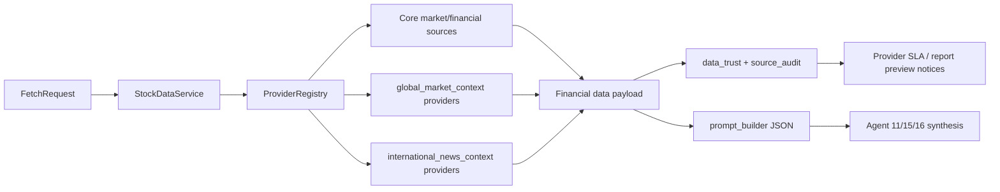

# Global Market And International News Context Design

## Mission

Add structured global market and international major-news context to stock reports so Taiwan-stock conclusions can account for US equity leadership, macro risk, FX/rates, and global supply-chain events without confusing operators about core data freshness.

## Context

Current reports already fetch core market data, financial statements, local valuation context, institutional trading, company-specific `recent_catalysts`, and limited global peer metrics. The prompt payload exposes these through `market_catalysts`, `peer_context`, and `local_valuation_context`.

The missing piece is a first-class, structured context layer for broad external factors:

- US market regime: S&P 500, Nasdaq, semiconductor/AI proxies, VIX, US rates, USD/TWD.
- Industry-linked US leaders: for Taiwan technology names, examples include NVDA, AMD, AVGO, TSM, ASML, QQQ/SMH/SOX-like proxies.
- International major news: macro, geopolitics, trade policy, supply-chain, AI/semiconductor, central-bank, energy, and China/US/Taiwan cross-border headlines.

References checked on 2026-06-12:

- FRED API supports retrieving economic observations and requires API keys for web-service requests: https://fred.stlouisfed.org/docs/api/fred/
- GDELT is a near-real-time global news graph and DOC 2.0 supports article search/list style use cases: https://www.gdeltproject.org/ and https://blog.gdeltproject.org/gdelt-doc-2-0-api-debuts/
- FMP offers stock/general news endpoints and market-data APIs: https://site.financialmodelingprep.com/developer/docs/stable/stock-news
- yfinance provides research-oriented access to Yahoo Finance market data and ticker history: https://ranaroussi.github.io/yfinance/

## Goals

1. Feed reports deterministic external context instead of relying on model prior knowledge for global market claims.
2. Make Agent 11, Agent 15, and Agent 16 explicitly cite global context or disclose that it is unavailable.
3. Keep missing global context as a contextual coverage notice, not a core `data_trust=stale` or rerun trigger by itself.
4. Surface source health in the existing Provider SLA dashboard with labels that do not imply core financial data is broken.
5. Start with a Taiwan-tech MVP while leaving the mapping extensible by sector/industry.

## Non-Goals

- Do not replace existing company-specific `recent_catalysts`.
- Do not turn global market context into an automated trading signal.
- Do not add paid-provider hard dependencies for basic report generation.
- Do not make every missing optional source block report creation.
- Do not change final recommendation authority boundaries; final agents still synthesize the data.

## Recommended Approach

Use two new optional enrichment sources:

1. `global_market_context`
   - Fetches broad market, FX, rates, volatility, and sector-proxy snapshots.
   - Primary implementation should use yfinance for market proxies available there.
   - Optional FRED support can enrich rates/macro when `FRED_API_KEY` is configured.
   - Output is a compact list of observations plus source metadata and timestamps.

2. `international_news_context`
   - Fetches recent global macro/sector news independent of the target company's own news.
   - Primary implementation should use GDELT because it is broad and not company-only.
   - Optional FMP general/news endpoints can supplement when configured.
   - Output is grouped by topic tags: `macro`, `semiconductors_ai`, `rates_fx`, `geopolitics`, `policy_trade`, `energy`, `supply_chain`.

This is preferred over overloading `recent_catalysts` because it keeps company-specific catalysts separate from broad context. It also avoids telling operators to refresh the report when only optional global context is unavailable.

## Architecture



### Data Model

Add these top-level fields to the data payload:

```json
{
  "global_market_context": {
    "as_of": "ISO-8601",
    "lookback_days": 5,
    "items": [
      {
        "symbol": "QQQ",
        "label": "Nasdaq 100 ETF",
        "category": "us_growth",
        "latest": 0.0,
        "change_1d_pct": 0.0,
        "change_5d_pct": 0.0,
        "source": "yfinance",
        "fetched_at": "ISO-8601"
      }
    ],
    "coverage_notes": []
  },
  "international_news_context": {
    "lookback_days": 7,
    "topics": [
      {
        "tag": "semiconductors_ai",
        "headline": "string",
        "summary": "string",
        "published_at": "ISO-8601 or source date",
        "source": "GDELT",
        "url": "https://..."
      }
    ],
    "coverage_notes": []
  }
}
```

Compact prompt mode may cap `items` and `topics`, but should preserve enough metadata to cite source, timestamp, category, and limitation.

### Source Selection

MVP market proxy set:

- Broad risk: `SPY`, `QQQ`, `^VIX`
- Semiconductor/AI: `SMH`, `NVDA`, `AMD`, `AVGO`, `TSM`, `ASML`
- Taiwan FX proxy: `TWD=X` or an equivalent USD/TWD ticker supported by the provider
- Optional rates: FRED `DGS10` when `FRED_API_KEY` exists; otherwise use a yfinance treasury proxy only if already reliable in tests

Initial sector mapping:

- Semiconductor, AI server, electronics cooling, foundry, IC design, networking, PCB: use the full tech proxy set.
- Finance, shipping, traditional industrials: MVP uses only broad risk, USD/TWD, and rates; sector-specific extensions are out of scope for this slice.

### Data Trust Semantics

The new sources are optional contextual sources:

- Successful fetches enter `source_audit`, `source_freshness`, and Provider SLA as normal.
- Missing `global_market_context` or `international_news_context` adds a `coverage_notes` entry and a prompt warning.
- Missing optional context must not make core `market_data` or `financial_statements` stale.
- Missing optional context must not set `decision_freshness.status=needs_rerun` after manual data refresh unless a report previously used materially different context and the refreshed context changes.
- Provider SLA labels should read like `全球市場脈絡` and `國際新聞脈絡`; zero samples should follow the existing `無檢查樣本` behavior.

### Prompt Rules

Add prompt payload sections:

- `global_market_context`
- `international_news_context`

Add runtime rules:

- Agent 11 must cite global market context for macro/industry cycle claims, or explicitly say global context is unavailable.
- Agent 15 must distinguish local institutional trading from global risk appetite/news sentiment.
- Agent 16 must mention whether final risk/reward was affected by global market context.
- No agent may use generic phrases like "美股帶動" or "國際局勢影響" without either citing provided context or marking it as unverified.

### Frontend And Operator UX

The operator-facing goal is clarity, not more alerts.

- Provider SLA source labels:
  - `global_market_context` -> `全球市場脈絡`
  - `international_news_context` -> `國際新聞脈絡`
- Report data trust chips should not say `建議刷新資料` solely because these optional sources are unavailable.
- Report preview may show a small context coverage note only when the report actually lacks the new sections:
  - `全球/國際脈絡不足：報告仍可讀，但總經與產業結論信心需保守。`
- If global context exists, do not add extra noise to the default card; it should be visible in report evidence/prompt-derived text, not as another dashboard burden.

## Testing Strategy

Use TDD in vertical slices:

1. Provider and merge tests
   - Failing tests for provider registry exposing both new sources.
   - Failing tests for yfinance/GDELT parser output shape.
   - Failing tests that missing optional context records `not_configured` or `unavailable` without core data failure.

2. Prompt tests
   - Failing tests that `build_financial_prompt_context` includes both new sections.
   - Failing tests that runtime rules mention Agent 11/15/16 obligations.

3. Data trust and refresh tests
   - Failing tests that optional-context-only missing data does not create a refresh/rerun action.
   - Failing tests that Provider SLA can display the new sources with `無檢查樣本`.

4. Integration tests
   - Update existing frontend static tests for the new labels.
   - Run `scripts/ci_gate.sh`, JS syntax checks, visual regression, and snapshot verifier after implementation.

## Rollout Plan

1. Add schema and provider stubs behind optional provider behavior.
2. Add deterministic yfinance market proxy fetcher and GDELT/FMP news fetcher with parser tests.
3. Merge context into data payload and prompt builder.
4. Update runtime prompt rules and report/data-trust UX copy.
5. Verify existing reports still render and no old report is forced into a misleading refresh state.

## Acceptance Criteria

- A report payload can contain `global_market_context` and `international_news_context`.
- Prompt JSON includes both sections in normal and compact modes.
- Missing optional global/news context does not mark core data stale and does not create a misleading refresh or rerun action.
- Provider SLA dashboard can show `全球市場脈絡` and `國際新聞脈絡` with correct zero-sample wording.
- Agent rules require cited or disclosed use of global context.
- Full verification passes after implementation.

## Open Risks

- Provider tickers for USD/TWD and rates may vary by data source; implementation must tolerate empty history.
- GDELT broad queries can be noisy; initial queries should be narrow and capped.
- FMP plan limits may vary; FMP should be supplemental, not required.
- More context can lengthen prompts; compact mode must cap items aggressively.
