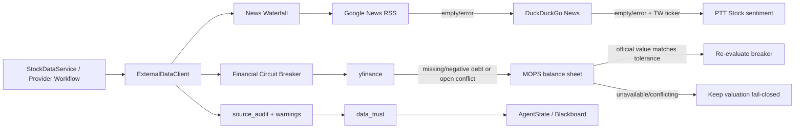

# 免費外部資料瀑布流整合設計

## 目標

以免費且可稽核的來源補強股票分析系統，讓新聞、散戶情緒、新聞正文、法人籌碼與官方財報具備明確的降級路徑。所有結果必須進入既有 `ProviderRegistry`、`source_audit`、資料信任評分與 Blackboard，而不是成為 Pipeline 外的孤立工具。

系統不保證外部網站永遠有資料；它保證每次失敗都可見、可追蹤，且關鍵財務欄位無法核對時維持 fail-closed。

## 架構



## 模組與契約

### `news_fetchers.py`

提供：

- `fetch_google_news_rss(query, limit=10)`：使用 `feedparser` 解析 Google News RSS。
- `fetch_duckduckgo_news(query, limit=10)`：優先使用目前套件名稱 `ddgs`，保留舊版 `duckduckgo_search` import 相容性。
- `fetch_ptt_stock_sentiment(ticker, limit=10)`：使用 `requests` 與 `BeautifulSoup` 讀取 PTT Stock 首頁，依台股代號或提供的搜尋詞過濾標題。

三者皆回傳 `list[dict]`，每筆固定包含：

```json
{
  "title": "string",
  "link": "https://...",
  "published_date": "ISO-8601 string or empty string",
  "source": "Google News RSS | DuckDuckGo News | PTT Stock",
  "summary": "string"
}
```

抓取器負責輸入清理、limit 限制、URL 正規化與單一來源內去重。網路錯誤、timeout、解析錯誤或 optional dependency 缺失時記錄 warning 並回傳空陣列，不向 Pipeline 拋出例外。

### `text_extractor.py`

`extract_article_text(url, timeout=10, max_chars=20000)` 使用受 timeout 控制的 HTTP 下載，再交由 `trafilatura.extract` 移除導覽、廣告與樣板文字。僅接受 HTTP/HTTPS URL，拒絕 localhost、私有位址與非 HTTP scheme，避免 SSRF。回傳純文字或 `None`；正文在正規化空白後限制長度，避免無界 token 輸入。

### `official_financials.py`

- `fetch_twse_institutional_trades(ticker, date)` 呼叫 TWSE OpenAPI `/v1/fund/TWT38U13`，依股票代號與日期篩選，將帶逗號數值轉為整數，回傳外資、投信、自營商與合計買賣超，以及 `source`、`as_of_date`。
- `fetch_mops_balance_sheet(ticker, year, season)` POST 至 `ajax_t164sb03`，設定 browser-like User-Agent、Referer、timeout 與 MOPS 表單欄位。使用 `pandas.read_html(StringIO(...))`，扁平化 MultiIndex 欄名、移除空白與 footnote，輸出標準化 `line_items`，並從別名辨識 `total_assets`、`total_liabilities`、`total_equity`、`total_debt`。

MOPS 回傳值保留原始列名、原始單位、民國/西元期間與 consolidated scope。無法確認單位或報表期間時，不可拿來關閉 breaker。

### `external_data_client.py`

`ExternalDataClient` 以 constructor injection 接受各抓取函數，讓測試不碰網路。

`get_news(query, ticker=None, limit=10)` 依序執行 Google RSS、DuckDuckGo；兩者皆空時，只有在可辨識台股代號時才執行 PTT。它會跨來源依 canonical link 或正規化標題去重，並記錄每一層的結果與 fallback warning。

`get_financial_data(ticker, year=None, season=None)` 先取得 yfinance payload。若 `total_debt`/`totalDebt` 缺失、非數字或小於零，或呼叫端傳入既有 breaker 已開啟的訊號，則查詢 MOPS。年度與季度優先由現有資料期間推導；未提供時使用最近已結束季度。MOPS 成功時只覆蓋已確認口徑的欄位，保留 provenance，不可整包覆蓋 yfinance。

## Provider 與 State 整合

新增免費新聞 Provider，source 使用既有 `recent_catalysts`。預設順序為免費新聞 waterfall，其後才是 Alternative Search/FMP；已有可信快取且未過期時沿用現行 freshness policy。

TWSE 法人資料改為 FinMind 優先、TWSE OpenAPI 備援。MOPS reconciliation 在資料驗證 circuit breaker 開啟時實際執行，不再只產生文字計畫。官方結果寫入：

- payload 對應財務欄位與 `source_audit`
- `AgentState.provider_values`
- `AgentState.raw_financial_data.official_filings`
- reconciliation 結果與 risk flags

只有單位、期間、幣別與 consolidated scope 相容，且官方值使差異回到允許範圍時，才可關閉 breaker。否則維持 `open` 並阻擋估值 Agent。

## 錯誤處理與可觀測性

每個外部呼叫都有 connect/read timeout、有限重試與明確 User-Agent。429、403、5xx、timeout、解析失敗及空資料分別記錄 warning；日誌不得包含 API key、cookie 或完整 response body。

每一層產生 `source_audit`：provider、status、duration、record_count、fallback reason、fetch timestamp 與 stale 狀態。降級不是 success 的別名；前一層失敗仍保留 audit，後一層成功另記一筆。

## 依賴

新增並鎖定：`feedparser`、`ddgs`、`beautifulsoup4`、`requests`、`trafilatura`。既有 `pandas` 與 `yfinance` 沿用。README/operator guide 提供：

```bash
python -m pip install feedparser ddgs beautifulsoup4 requests trafilatura
```

## 測試策略

所有 production behavior 先寫失敗測試：

- Google RSS、DuckDuckGo、PTT 正規化與 timeout/error behavior。
- 正文萃取、長度限制、無效 URL 與私網 URL 防護。
- TWSE 欄位轉換與日期/代號篩選。
- MOPS POST payload、headers、MultiIndex/單層表格清理、別名與單位辨識。
- 新聞三層 waterfall、去重與 warning logging。
- yfinance debt 異常觸發 MOPS、有效資料不誤觸、MOPS 失敗維持 fail-closed。
- Provider Workflow、`source_audit`、Blackboard 與 breaker reconciliation integration。

一般 CI 完全 mock 網路邊界。另新增 opt-in live smoke tests，只有設定明確環境變數時才對 Google RSS、TWSE 或 MOPS 發送請求；外站暫時不可用不得使一般 CI 不穩定。

## 不納入範圍

- 繞過登入、CAPTCHA、付費牆或網站存取限制。
- 將 PTT 標題視為已驗證新聞或財務證據。
- 在無法確認 MOPS 單位與期間時猜測數值。
- 保證任何外部來源永遠回傳資料；系統以可觀測降級與 fail-closed 取代假資料。
