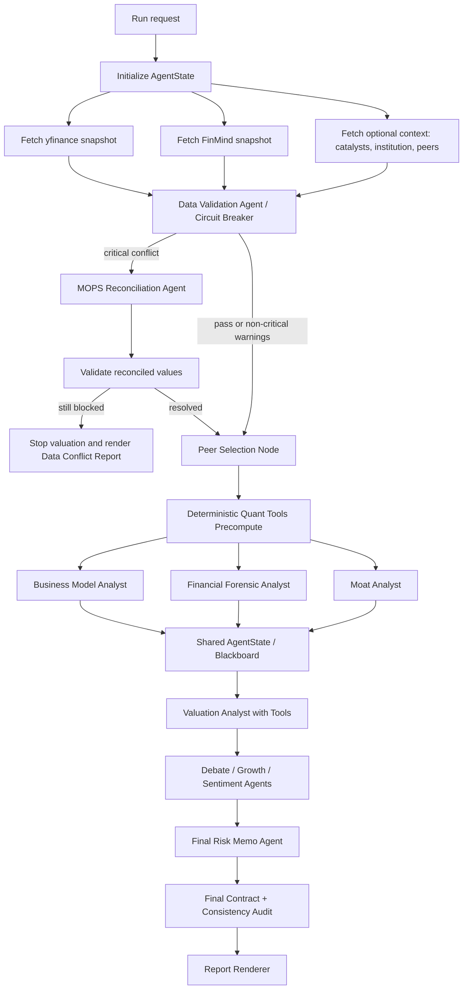

# Multi-Agent StateGraph 與資料信任重設計

## 背景

目前 `backend/pipeline_async.py` 已有 DAG group 執行能力，但 `backend/agent_runtime/prompting.py` 仍把 `{fin_data}` 與 `{prev}` 塞進每個 Agent prompt。`{prev}` 由 `backend/assistant_context.py` 依關鍵字與字元預算抽取前序分析片段，因此最後決策 Agent 看到的是「摘要的摘要」，早期微弱訊號、資料衝突細節與同業口徑很容易流失。

現有系統也已有可延伸基礎：

- `backend/structured_output_models.py` 已定義 Pydantic structured outputs，並由 Google GenAI `response_schema` 使用。
- `backend/financial_tools.py` 已有 deterministic tools，例如 `calculate_dcf`、`calculate_wacc`。
- `backend/data_financial_metric_validator.py` 可標示跨來源差異，但目前仍是 annotation，不是 blocking circuit breaker。
- `backend/data_fetch/market_sources/peers.py` 的 peer discovery 仍偏產業代碼與 heuristic，尚未納入市值與營收規模。

## 方案比較

### 方案 A：保留現有 DAG，加入 Shared State / Blackboard facade

在現有 `AnalysisContext` 外新增 typed `AgentState`，每個節點只透過 state lens 讀取需要的欄位，寫入完整報告、結構化 facts、risk flags 與 tool results。這是推薦方案，因為可以逐步落地，不必一次替換整個 runtime。

### 方案 B：完整遷移到 LangGraph StateGraph

直接引入 LangGraph，以 node + conditional edge 實作 fetch、validate、agent、audit、render。長期最乾淨，但會碰到現有報表、SSE、retry、quality gate 與 provider routing 的大面積整合。

### 方案 C：只強化 `{prev}` 摘要與 RAG retrieval

把前序 agent 完整報告丟入 RAG，後序 agent 以 task query 抽取。這能緩解 context 問題，但資料真偽、斷路器、工具呼叫與輸出 contract 仍分散，不能解決根因。

推薦採用方案 A，並把介面設計成未來可搬到方案 B。

## 新架構



核心改變：Agent 不再依賴 `{prev}`，而是依賴 `state_view`。`state_view` 由 runtime 根據 Agent role 從 `AgentState` 切片產生，包含原始資料路徑、已驗證欄位、前序完整報告索引、risk flags 與 tool results。

## AgentState 設計

```python
from __future__ import annotations

from datetime import datetime
from enum import Enum
from typing import Any, Literal
from pydantic import BaseModel, ConfigDict, Field


class Severity(str, Enum):
    info = "info"
    warning = "warning"
    high = "high"
    critical = "critical"


class ProviderValue(BaseModel):
    provider: str
    field: str
    value: float | str | None
    unit: str
    period: str | None = None
    statement_type: Literal["consolidated", "parent_only", "unknown"] = "unknown"
    fetched_at: datetime | None = None
    source_url: str | None = None
    confidence: float = Field(default=0.5, ge=0, le=1)


class ValidationIssue(BaseModel):
    field: str
    severity: Severity
    providers: list[str]
    values: list[ProviderValue]
    diff_pct: float
    threshold_pct: float
    likely_cause: str | None = None
    resolution: str | None = None


class RiskFlag(BaseModel):
    id: str
    severity: Severity
    category: Literal[
        "data_quality",
        "accounting",
        "liquidity",
        "valuation",
        "moat",
        "growth",
        "sentiment",
        "peer_selection",
    ]
    title: str
    evidence_refs: list[str] = Field(default_factory=list)
    source_agents: list[str] = Field(default_factory=list)
    impact: str
    confidence: float = Field(ge=0, le=1)


class AgentReport(BaseModel):
    agent_id: str
    role: str
    markdown: str
    extracted_facts: dict[str, Any] = Field(default_factory=dict)
    risk_flags: list[RiskFlag] = Field(default_factory=list)
    citations: list[str] = Field(default_factory=list)
    token_usage: dict[str, int] = Field(default_factory=dict)


class CircuitBreakerState(BaseModel):
    status: Literal["closed", "open", "half_open"] = "closed"
    blocking_fields: list[str] = Field(default_factory=list)
    attempts: int = 0
    reason: str | None = None


class AgentState(BaseModel):
    model_config = ConfigDict(extra="forbid")

    run_id: str
    ticker: str
    company_name: str
    company_identity: dict[str, Any] = Field(default_factory=dict)

    raw_financial_data: dict[str, dict[str, Any]] = Field(default_factory=dict)
    provider_values: dict[str, list[ProviderValue]] = Field(default_factory=dict)
    normalized_financials: dict[str, Any] = Field(default_factory=dict)
    source_audit: list[dict[str, Any]] = Field(default_factory=list)
    validation_issues: list[ValidationIssue] = Field(default_factory=list)
    circuit_breaker: CircuitBreakerState = Field(default_factory=CircuitBreakerState)

    peer_context: dict[str, Any] = Field(default_factory=dict)
    quant_metrics: dict[str, Any] = Field(default_factory=dict)
    tool_results: dict[str, Any] = Field(default_factory=dict)

    agent_reports: dict[str, AgentReport] = Field(default_factory=dict)
    risk_flags: list[RiskFlag] = Field(default_factory=list)
    execution_trace: list[dict[str, Any]] = Field(default_factory=list)
```

建議把現有 `AnalysisContext` 保留為 runtime envelope，`AgentState` 放在 `context["agent_state"]`。舊報表 renderer 可先讀 `context["analyses"]`，新節點則寫 `agent_state.agent_reports`，再由 compatibility layer 同步必要欄位。

## StateGraph 虛擬碼

```python
CRITICAL_FIELDS = ("revenue", "net_income", "total_debt", "free_cash_flow")


async def run_stategraph(data: dict, llm_router, tools) -> AgentState:
    state = initialize_state(data)

    state = await fetch_provider_snapshots(state, providers=["yfinance", "finmind"])
    state = validate_provider_values(state, fields=CRITICAL_FIELDS, threshold_pct=5.0)

    if state.circuit_breaker.status == "open":
        state = await reconcile_from_mops(state)
        state = validate_provider_values(state, fields=CRITICAL_FIELDS, threshold_pct=5.0)
        if state.circuit_breaker.status == "open":
            return render_data_conflict_report(state)

    state.peer_context = select_peers(
        target=build_company_profile(state),
        universe=load_peer_universe(state),
    )
    state.quant_metrics = precompute_quant_metrics(state.normalized_financials)

    parallel_outputs = await gather(
        run_agent("business_model", state_view_for("business_model", state), llm_router),
        run_agent("forensic_accounting", state_view_for("forensic_accounting", state), llm_router),
        run_agent("moat", state_view_for("moat", state), llm_router),
    )
    state = merge_agent_reports(state, parallel_outputs)

    valuation_report = await run_agent_with_tools(
        "valuation",
        state_view_for("valuation", state),
        tools=[tools.calculate_dcf, tools.calculate_implied_revenue_growth],
        llm_router=llm_router,
    )
    state = merge_agent_reports(state, [valuation_report])

    final_report = await run_agent("final_risk_memo", state_view_for("final_risk_memo", state), llm_router)
    state = merge_agent_reports(state, [final_report])
    return final_contract_audit(state)
```

`state_view_for()` 是重點。它不是摘要器，而是白名單切片器：

```python
STATE_VIEW_POLICY = {
    "business_model": [
        "company_identity",
        "normalized_financials.revenue_history",
        "normalized_financials.segment_revenue",
        "normalized_financials.gross_margin_history",
        "peer_context.selected_peers",
        "raw_financial_data.news_catalysts",
        "validation_issues",
    ],
    "forensic_accounting": [
        "provider_values.revenue",
        "provider_values.net_income",
        "provider_values.total_debt",
        "provider_values.free_cash_flow",
        "normalized_financials",
        "quant_metrics.calculations.latest_fcf_conversion",
        "validation_issues",
        "source_audit",
    ],
    "valuation": [
        "normalized_financials",
        "quant_metrics",
        "peer_context",
        "risk_flags",
        "agent_reports.business_model.extracted_facts",
        "agent_reports.forensic_accounting.markdown",
        "agent_reports.moat.extracted_facts",
        "validation_issues",
    ],
    "final_risk_memo": [
        "normalized_financials",
        "quant_metrics",
        "peer_context",
        "risk_flags",
        "agent_reports",
        "tool_results",
        "validation_issues",
    ],
}
```

## Data Validation Agent / Circuit Breaker

### Blocking 規則

關鍵欄位不取中位數遮醜。若 `Revenue`、`Net Income`、`Total Debt`、`Free Cash Flow` 任一欄位在 provider 間差異超過 5%，把該欄位 quarantine，打開 circuit breaker，暫停 DCF、WACC、Forward EPS implied growth 與最終風險結論。

```python
from decimal import Decimal


class CircuitBreakerOpen(Exception):
    def __init__(self, issues: list[ValidationIssue]):
        super().__init__("Critical financial data conflict")
        self.issues = issues


def rel_diff_pct(a: float, b: float) -> float:
    denom = max(abs(a), abs(b), 1.0)
    return abs(a - b) / denom * 100


def validate_provider_values(
    state: AgentState,
    *,
    fields: tuple[str, ...],
    threshold_pct: float = 5.0,
    raise_on_open: bool = False,
) -> AgentState:
    blocking: list[ValidationIssue] = []

    for field in fields:
        values = [
            item for item in state.provider_values.get(field, [])
            if isinstance(item.value, (int, float, Decimal))
        ]
        if len(values) < 2:
            continue

        numeric_values = [(v, float(v.value)) for v in values]
        max_pair = max(
            ((a, b, rel_diff_pct(av, bv)) for a, av in numeric_values for b, bv in numeric_values if a.provider < b.provider),
            key=lambda row: row[2],
            default=None,
        )
        if not max_pair:
            continue

        left, right, diff = max_pair
        if diff > threshold_pct:
            issue = ValidationIssue(
                field=field,
                severity=Severity.critical,
                providers=[left.provider, right.provider],
                values=[left, right],
                diff_pct=round(diff, 2),
                threshold_pct=threshold_pct,
                likely_cause=infer_data_conflict_cause(left, right),
            )
            state.validation_issues.append(issue)
            state.risk_flags.append(RiskFlag(
                id=f"data_conflict:{field}",
                severity=Severity.critical,
                category="data_quality",
                title=f"{field} provider conflict {diff:.2f}%",
                evidence_refs=[f"provider_values.{field}"],
                source_agents=["data_validation"],
                impact="Block valuation and final decision until reconciled.",
                confidence=0.95,
            ))
            blocking.append(issue)

    if blocking:
        state.circuit_breaker.status = "open"
        state.circuit_breaker.blocking_fields = [issue.field for issue in blocking]
        state.circuit_breaker.reason = "critical_provider_conflict"
        if raise_on_open:
            raise CircuitBreakerOpen(blocking)
        return state

    state.circuit_breaker.status = "closed"
    return state
```

### 備用處理策略

1. Quarantine：衝突欄位不可進入 `normalized_financials`，不可被 quant tools 使用。
2. Fresh retry：對衝突 provider 重新抓取，強制跳過 cache，檢查單位、幣別、年度/季度、合併/個體口徑。
3. MOPS reconciliation：啟動搜尋與文件解析節點，抓公開資訊觀測站最新季報或年報 PDF/XBRL/HTML，抽取同期間欄位。
4. Source ranking：官方申報文件優先於 API；合併報表優先於母公司個體；期間完全一致優先於 trailing estimate；幣別與單位可驗證者優先。
5. Half-open：若 MOPS 數值與其中一個 provider 差異在 2% 內，採 MOPS 校準值並保留 warning。
6. Fail closed：若仍無法 reconciled，停止估值與最終風險結論，產出 Data Conflict Report。

### Data Validation Agent System Prompt

```text
你是 Data Validation Agent，角色是法證會計師與資料審計員。你的任務不是分析股票好壞，而是判斷輸入資料是否足以讓後續估值與風險 Agent 使用。

你必須直接讀取 AgentState：
- provider_values：各 provider 對同一欄位的原始值、單位、期間與來源。
- source_audit：資料抓取時間、cache、錯誤與 stale 狀態。
- validation_issues：系統已偵測的差異。
- raw_financial_data：原始 API payload，必要時檢查欄位口徑。

判斷原則：
1. Revenue、Net Income、Total Debt、Free Cash Flow 任一 provider 差異超過 5%，必須標記 critical，不得用平均值或中位數掩蓋。
2. 優先檢查單位、幣別、期間、TTM vs annual、合併 vs 個體、IFRS 欄位 mapping。
3. 官方申報資料優先於第三方 API；但若官方資料期間較舊，必須明確標示 freshness 風險。
4. 你的輸出只允許是結構化 JSON：validation_status、blocking_fields、likely_causes、recommended_retries、source_ranking、risk_flags。
5. 不得產生目標價、投資建議或估值結論。
```

## Peer Selection 演算法

### 設計原則

Peer selection 應從「同產業」升級為「同商業問題」。產業代碼只是入口，真正要比較的是規模、產品、客戶、毛利結構與區域市場。

```python
from dataclasses import dataclass
from math import log


@dataclass
class CompanyProfile:
    ticker: str
    name: str
    gics_code: str | None
    market: str
    market_cap_twd: float | None
    revenue_twd: float | None
    business_tags: set[str]
    product_keywords: set[str]
    segment_revenue_tags: set[str]


def gics_distance(a: str | None, b: str | None) -> int:
    if not a or not b:
        return 99
    if a == b:
        return 0
    if a[:6] == b[:6]:
        return 1
    if a[:4] == b[:4]:
        return 2
    if a[:2] == b[:2]:
        return 3
    return 99


def ratio_in_band(value: float | None, target: float | None, low: float, high: float) -> bool:
    if not value or not target or target <= 0:
        return False
    ratio = value / target
    return low <= ratio <= high


def overlap_score(a: set[str], b: set[str]) -> float:
    if not a or not b:
        return 0.0
    return len(a & b) / len(a | b)


def peer_score(target: CompanyProfile, candidate: CompanyProfile) -> float:
    gics = gics_distance(target.gics_code, candidate.gics_code)
    if gics > 2:
        return -1
    if not ratio_in_band(candidate.market_cap_twd, target.market_cap_twd, 0.2, 5.0):
        return -1

    market_cap_ratio = candidate.market_cap_twd / target.market_cap_twd
    market_cap_score = 1 - min(abs(log(market_cap_ratio)), log(5)) / log(5)

    revenue_score = 0.0
    if ratio_in_band(candidate.revenue_twd, target.revenue_twd, 0.2, 5.0):
        revenue_ratio = candidate.revenue_twd / target.revenue_twd
        revenue_score = 1 - min(abs(log(revenue_ratio)), log(5)) / log(5)

    business_score = max(
        overlap_score(target.business_tags, candidate.business_tags),
        overlap_score(target.product_keywords, candidate.product_keywords),
        overlap_score(target.segment_revenue_tags, candidate.segment_revenue_tags),
    )

    gics_score = {0: 1.0, 1: 0.85, 2: 0.65}.get(gics, 0.0)
    return round(0.30 * gics_score + 0.25 * market_cap_score + 0.20 * revenue_score + 0.25 * business_score, 4)


def select_peers(
    target: CompanyProfile,
    universe: list[CompanyProfile],
    *,
    min_peers: int = 5,
) -> dict:
    local = rank_candidates(target, [c for c in universe if c.market == target.market])
    selected = [row for row in local if row["score"] >= 0.55]

    expansion_used = False
    if len(selected) < min_peers:
        global_candidates = [c for c in universe if c.market != target.market]
        global_ranked = rank_candidates(target, global_candidates)
        selected.extend(row for row in global_ranked if row["score"] >= 0.55)
        expansion_used = True

    selected = sorted(selected, key=lambda row: row["score"], reverse=True)[:min_peers]
    return {
        "selected_peers": selected,
        "expansion_used": expansion_used,
        "selection_policy": {
            "gics_distance_max": 2,
            "market_cap_band": "0.2x-5.0x",
            "revenue_band_preferred": "0.2x-5.0x",
            "minimum_business_overlap_score": 0.25,
        },
    }


def rank_candidates(target: CompanyProfile, candidates: list[CompanyProfile]) -> list[dict]:
    rows = []
    for candidate in candidates:
        score = peer_score(target, candidate)
        if score < 0:
            continue
        rows.append({
            "ticker": candidate.ticker,
            "name": candidate.name,
            "market": candidate.market,
            "score": score,
            "market_cap_ratio": (
                round(candidate.market_cap_twd / target.market_cap_twd, 3)
                if candidate.market_cap_twd and target.market_cap_twd else None
            ),
            "business_overlap": overlap_score(target.business_tags, candidate.business_tags),
            "product_overlap": overlap_score(target.product_keywords, candidate.product_keywords),
        })
    return sorted(rows, key=lambda row: row["score"], reverse=True)
```

若台股找不到足夠 peers，全球擴展邏輯不應是隨機補大公司，而是用相同 GICS + business tags。例如台達電應擴展到全球電源管理、散熱、工業自動化、資料中心電源供應鏈公司，而不是只因電子零組件代碼接近就拿微型股比較。

## Structured Outputs

OpenAI 官方文件區分兩種用法：最終回覆要符合 schema 時使用 Structured Outputs；模型需要呼叫你系統內的函式或工具時使用 function calling。Structured Outputs 比 JSON mode 更強，因為它要求 schema adherence。若使用 Chat Completions，可用 `response_format`；若使用 Responses API，官方 Python SDK 也提供 `client.responses.parse(..., text_format=YourPydanticModel)`。

建議在本專案保留 provider-neutral Pydantic models，另外做 OpenAI adapter。現有 Google GenAI tests 要求 schema 不含 `additionalProperties`，但 OpenAI strict JSON Schema 通常需要 `additionalProperties: false`，因此不要直接共用同一份 provider-specific schema 轉換邏輯。

```python
from typing import Literal
from pydantic import BaseModel, ConfigDict, Field


class OpenAIStructuredModel(BaseModel):
    model_config = ConfigDict(extra="forbid", populate_by_name=True)


class PriceScenario(OpenAIStructuredModel):
    price_twd: float = Field(..., ge=0)
    upside_pct: float | None = None
    method: Literal["dcf", "relative_pe", "pb", "blended"]
    assumptions: list[str]
    evidence_refs: list[str]


class ValuationOutput(OpenAIStructuredModel):
    dcf_reasoning_summary: str
    peer_reasoning_summary: str
    scenario_reasoning_summary: str
    bear_case: PriceScenario
    base_case: PriceScenario
    bull_case: PriceScenario
    data_quality_blockers: list[str] = Field(default_factory=list)
    tool_result_refs: list[str] = Field(default_factory=list)


class MoatDimension(OpenAIStructuredModel):
    score: float = Field(..., ge=1, le=10)
    evidence_refs: list[str]
    counter_evidence: list[str] = Field(default_factory=list)
    confidence: float = Field(..., ge=0, le=1)


class MoatOutput(OpenAIStructuredModel):
    reasoning_summary: list[str] = Field(..., min_length=3, max_length=6)
    brand: MoatDimension
    network_effect: MoatDimension
    switching_cost: MoatDimension
    cost_advantage: MoatDimension
    intangible_assets: MoatDimension
    overall_score: float = Field(..., ge=1, le=10)
```

Chat Completions 寫法：

```python
from openai import OpenAI

client = OpenAI()

completion = client.chat.completions.parse(
    model="gpt-5.5",
    messages=[
        {"role": "system", "content": valuation_system_prompt},
        {"role": "user", "content": json.dumps(state_view, ensure_ascii=False)},
    ],
    response_format=ValuationOutput,
)

valuation = completion.choices[0].message.parsed
```

Responses API 寫法：

```python
response = client.responses.parse(
    model="gpt-5.5",
    input=[
        {"role": "system", "content": valuation_system_prompt},
        {"role": "user", "content": json.dumps(state_view, ensure_ascii=False)},
    ],
    text_format=ValuationOutput,
)

valuation = response.output_parsed
```

若不用 SDK parse helper，可傳 JSON Schema：

```python
response_format = {
    "type": "json_schema",
    "json_schema": {
        "name": "valuation_output",
        "strict": True,
        "schema": ValuationOutput.model_json_schema(),
    },
}
```

### 估值 Agent Prompt 改寫

```text
你是估值分析師 Agent 4。你不再讀取前序摘要 {prev}，而是讀取本次提供的 AgentState view。

可讀 State path：
- normalized_financials：已通過資料審計或被 MOPS 校準的財務數據。
- quant_metrics：系統預先計算的 WACC、DCF、FCF conversion、Forward EPS implied checks。
- peer_context：同業選擇結果、篩選理由、同業估值與毛利率。
- agent_reports.*：前序 Agent 完整報告或 extracted_facts。
- risk_flags：所有 Agent 與 Data Validation Agent 寫入的風險旗標。
- validation_issues：資料衝突與處理狀態。

規則：
1. 若 circuit_breaker.status 不是 closed，必須輸出 data_quality_blockers，不得產生目標價。
2. 不得要求或輸出完整 hidden chain-of-thought。你可以輸出 dcf_reasoning_summary、peer_reasoning_summary、scenario_reasoning_summary，這些必須是可給使用者看的簡短推論摘要。
3. 任何數字都必須引用 State path，例如 quant_metrics.calculations.dcf_scenarios_default.base.scenarios。
4. 若 Forward EPS 隱含極端成長，必須呼叫 calculate_implied_revenue_growth 工具驗證，並把 tool_result_refs 寫入最終 JSON。
5. 最終輸出只能符合 ValuationOutput JSON schema，不得輸出 Markdown、舊式 [目標股價] 標籤或額外說明。
```

## Function Calling / Tool Use

新增三個金融工具。這些工具由後端執行，LLM 只能提出工具呼叫與解讀結果。

```python
FINANCIAL_TOOLS = [
    {
        "type": "function",
        "name": "calculate_dcf",
        "description": "Calculate DCF equity value and per-share value from explicit FCF forecasts.",
        "parameters": {
            "type": "object",
            "properties": {
                "fcf_array_billion_twd": {"type": "array", "items": {"type": "number"}},
                "wacc_pct": {"type": "number"},
                "terminal_growth_rate_pct": {"type": "number"},
                "shares_outstanding": {"type": "number"},
                "net_debt_billion_twd": {"type": "number"},
            },
            "required": [
                "fcf_array_billion_twd",
                "wacc_pct",
                "terminal_growth_rate_pct",
                "shares_outstanding",
                "net_debt_billion_twd",
            ],
            "additionalProperties": False,
        },
        "strict": True,
    },
    {
        "type": "function",
        "name": "calculate_implied_revenue_growth",
        "description": "Reverse-engineer revenue CAGR implied by a target EPS and current margin structure.",
        "parameters": {
            "type": "object",
            "properties": {
                "target_eps_twd": {"type": "number"},
                "current_net_margin_pct": {"type": "number"},
                "shares_outstanding": {"type": "number"},
                "current_revenue_billion_twd": {"type": "number"},
                "forecast_years": {"type": "integer", "minimum": 1, "maximum": 10},
            },
            "required": [
                "target_eps_twd",
                "current_net_margin_pct",
                "shares_outstanding",
                "current_revenue_billion_twd",
                "forecast_years",
            ],
            "additionalProperties": False,
        },
        "strict": True,
    },
    {
        "type": "function",
        "name": "calculate_margin_sensitivity",
        "description": "Estimate EPS impact from gross margin or operating margin changes.",
        "parameters": {
            "type": "object",
            "properties": {
                "revenue_billion_twd": {"type": "number"},
                "gross_margin_delta_bps": {"type": "number"},
                "opex_ratio_pct": {"type": "number"},
                "tax_rate_pct": {"type": "number"},
                "shares_outstanding": {"type": "number"},
            },
            "required": [
                "revenue_billion_twd",
                "gross_margin_delta_bps",
                "opex_ratio_pct",
                "tax_rate_pct",
                "shares_outstanding",
            ],
            "additionalProperties": False,
        },
        "strict": True,
    },
]
```

工具 loop：

```python
def run_valuation_with_tools(client, state_view: dict) -> ValuationOutput:
    input_items = [
        {"role": "system", "content": valuation_system_prompt},
        {"role": "user", "content": json.dumps(state_view, ensure_ascii=False)},
    ]

    while True:
        response = client.responses.create(
            model="gpt-5.5",
            input=input_items,
            tools=FINANCIAL_TOOLS,
            text={"format": {"type": "json_schema", "name": "valuation_output", "strict": True, "schema": ValuationOutput.model_json_schema()}},
        )

        tool_calls = [item for item in response.output if item.type == "function_call"]
        if not tool_calls:
            return ValuationOutput.model_validate_json(response.output_text)

        input_items.extend(response.output)
        for call in tool_calls:
            args = json.loads(call.arguments)
            result = dispatch_financial_tool(call.name, args)
            input_items.append({
                "type": "function_call_output",
                "call_id": call.call_id,
                "output": json.dumps(result, ensure_ascii=False),
            })
```

估值 Agent 的 tool-use prompt：

```text
遇到以下情況必須主動呼叫工具，而不是心算：
- Forward EPS 或市場共識 EPS 隱含的營收成長率可能超過 30%。
- 你想調整 WACC、terminal growth、normalized FCF 或 margin。
- DCF 與相對估值結論衝突，需要量化敏感度。

若市場給出極端 Forward EPS：
1. 從 State 讀取 target_eps_twd、current_net_margin_pct、shares_outstanding、current_revenue_billion_twd。
2. 呼叫 calculate_implied_revenue_growth。
3. 將工具回傳的 implied_revenue_cagr_pct 寫入 scenario_reasoning_summary 與 tool_result_refs。
4. 若 implied CAGR 超過公司歷史 CAGR 或產能/CapEx 支撐不足，降低 base_case 信心或改採 bear/base 權重。
```

## Agent Prompt 通用改寫規則

每個 Agent 的 prompt 都應從「讀前人摘要」改為「讀 State、寫 State」。

```text
你會收到 AgentState view，而不是前序摘要。你只能引用 view 中存在的資料。

讀取規則：
- 先列出你實際使用的 State path。
- 若某個必要 path 不存在，明確寫資料不足，不得用常識補數字。
- 前序 Agent 的內容只可作為 agent_reports.* 的 evidence，不可取代 raw / normalized financials。

寫入規則：
- 你的完整分析寫入 agent_reports.<agent_id>.markdown。
- 你發現的事實寫入 extracted_facts，必須附 evidence_refs。
- 你發現的風險寫入 risk_flags，必須包含 severity、category、impact、confidence。
- 不得覆寫其他 Agent 的報告或分數；若不同意，只能新增 counter_evidence risk flag。
```

角色差異：

- 商業模式分析師：讀 `company_identity`、`segment_revenue`、`revenue_history`、`peer_context`、`market_catalysts`；寫商業模式、供應鏈位置、客戶集中與產品 ASP 風險。
- 財務排雷專家：讀 `provider_values`、`validation_issues`、`normalized_financials`、`quant_metrics`；寫 FCF、杜邦、槓桿、庫存/應收帳款、資料品質紅旗。
- 護城河專家：讀 `peer_context.selected_peers`、margin peer stats、business extracted facts；寫每個護城河維度分數與反證。
- 估值專家：讀所有 verified data、risk flags、peer valuation、quant metrics；必要時呼叫工具；寫 structured JSON，不寫舊式文字標籤。
- 最終風險 Agent：讀完整 `agent_reports`、`risk_flags`、`tool_results`、`validation_issues`；只能整合，不得新增未驗證數字。

## 實作落地順序

1. 新增 `backend/agent_state.py` 與 `backend/state_memory.py`，先把現有 `AnalysisContext` 包成 typed state。
2. 新增 `state_view_for(agent_id, state)`，並讓 `build_prompt()` 支援 `{state_view}`，逐步降低 `{prev}` 權重。
3. 把 `data_financial_metric_validator.py` 升級為 blocking circuit breaker，critical conflict 時中止估值 agent。
4. 擴充 `financial_tools.py`：加入 `calculate_implied_revenue_growth` 與 margin sensitivity。
5. 改寫 `backend/data_fetch/market_sources/peers.py`：加入 GICS、市值、營收與 business overlap ranking。
6. 將 `structured_output_models.py` 拆出 provider-neutral model 與 provider adapters：Google response_schema、OpenAI strict JSON schema 各自轉換。
7. 增加測試：state view policy、circuit breaker、peer ranking、structured schema、tool calling trigger。

## 驗收標準

- Agent 4 / 7 / 14 / 16 不再依賴 `{prev}` 才能取得早期財務紅旗。
- 關鍵欄位跨 provider 差異大於 5% 時，DCF 與 WACC 不會執行或不會進入正式報告。
- Peer list 不會把市值差距超過 5 倍或低於 0.2 倍的公司列為主要比較對象。
- 目標價、護城河評分與最終風險輸出都能以 Pydantic model parse，不需 regex。
- Forward EPS 極端情境會留下 tool result，可追溯 implied revenue growth。

## 參考來源

- OpenAI Structured Outputs guide: https://developers.openai.com/api/docs/guides/structured-outputs
- OpenAI Function Calling guide: https://developers.openai.com/api/docs/guides/function-calling
- OpenAI Tools guide: https://developers.openai.com/api/docs/guides/tools
