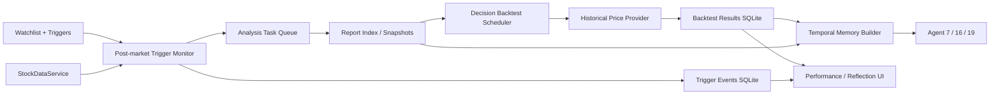

# 決策學習閉環與事件雷達設計

## 目標

把既有報告、決策追蹤與 Watchlist 串成可稽核閉環：報告到期後自動回測，新報告必須讀取上一期決策與失誤，Watchlist 在盤後遇到重大市場事件時自動選擇適合的 Pipeline 產生新報告。

## 架構

## 回測契約

- 每份報告分別建立 3、6、12 個月到期點，唯一鍵為 `(report_filename, horizon_months)`。
- 到期日使用曆月加法；若落在非交易日，價格 provider 取到期日前後可取得的最近收盤價並記錄實際交易日。
- 同時保存市場報酬與策略 ROI：買入/買進為市場報酬；避免/強烈放空為反向報酬；持有視為未建倉，策略 ROI 為 0。
- Hit 判定：買進需正報酬且實際價達目標價 90% 以上；放空/避免需負市場報酬且實際價不高於目標價 110%；持有需市場絕對波動不超過 10%。目標價缺漏時只使用方向判定。
- Scheduler 每日可重跑；已存在結果不再抓價或覆寫。

## 跨期記憶契約

- 新分析取得當期資料後，讀取同 ticker 最新一份舊報告的摘要、建議、三個目標價與可用回測。
- `temporal_memory` 保存於當次 data snapshot，但 Prompt 路由只允許最終決策 Agent 7、16、19 讀取。
- Prompt 明確要求比較舊假設與當期股價/財務；有 Miss 時必須指出錯誤假設並調整本次模型，無成熟回測時則標示尚待驗證。

## 事件雷達契約

- Watchlist trigger 類型：`price_below_sma`、`foreign_sell_streak`、`vix_above`、`revenue_record_high`。
- 偏空條件固定派送 V3；營收創高固定派送 V2；VIX 僅在超過門檻時派 V3。
- Trigger evaluation 依 ticker、trigger key、evaluation date 寫入事件表，避免 scheduler 重啟或重跑造成重複任務。
- 資料不足時寫入 `unavailable` 事件，不猜測、不派送任務。

## 前端

- `報告與維運` 顯示整體 Hit Rate、平均策略 ROI、各期統計與最近回測。
- Watchlist 表單可設定四類 trigger；每個項目顯示 trigger 摘要與最近事件/Pipeline。
- 報告預覽顯示本次使用的上一期記憶、舊建議與舊回測結果。

## 失敗處理

- 價格、籌碼、FRED 或月營收不足時記錄原因並保留下一次重試能力。
- 任務已在執行時，trigger event 記錄為 `skipped_active_job`，不重複 enqueue。
- 所有 scheduler 例外只記錄事件與 log，不終止背景迴圈。

## 驗收

- 3/6/12 月結果可冪等寫入 SQLite，績效 API 回傳真實統計。
- Agent 7/16/19 Prompt 含歷史反思，其他 Agent 不含。
- 四類 trigger 均有純函式測試，Pipeline 路由符合 V2/V3 規則。
- 前端在桌面與手機沒有重疊，能看到回測、反思與 trigger 狀態。
