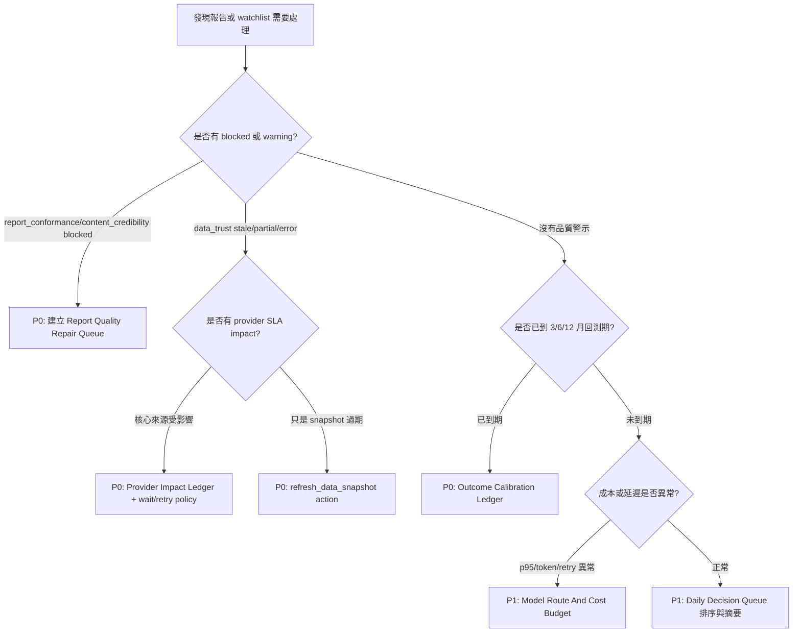

# Stock Agent 系統下一輪優化方案

更新時間：2026-07-08

## HCS Plus 專案狀態

| 欄位 | 目前狀態 |
|---|---|
| 專案目標 | 把 Stock Agent 從「能產出高品質報告」推進到「能自我校準、知道何時不該輸出、並能引導操作者修復」的決策工作站。 |
| 成功標準 | 報告品質、資料來源、決策結果、成本延遲與 operator action 形成閉環；每個 warning/blocked 都有可追溯原因與下一步動作。 |
| 已完成基線 | 架構已具備 data trust、provider SLA、report conformance、evidence exit gate、content credibility、decision backtest、temporal memory、job telemetry 與 operator dashboard。 |
| 主要缺口 | 多數訊號仍是「顯示給人看」，尚未完全轉成排序、修復、路由與下次決策的機器可用回饋。 |
| 不能誤解 | 測試通過只代表契約未回退，不代表投資建議正確；provider SLA 是本地觀測，不是外部供應商帳單或全域健康真相。 |
| HCS Plus 進度 | 本文件延續上一份 content credibility 方案，進入第 1 輪第二批：#偏誤辨識、#偏誤降低、#決策樹、#目的。 |

## 一句話結論

這套系統下一輪最值得優化的不是再加更多 Agent，而是建立「品質閉環」：

1. 報告產出時判斷內容是否可信。
2. 報告到期後回測決策是否有效。
3. 將回測、資料可信度、provider SLA、成本延遲回寫成可排序的修復隊列。
4. 讓下一次 prompt、pipeline routing、rerun action 和 operator dashboard 都使用同一組品質訊號。

## #偏誤辨識

### 目前最容易誤判的地方

| 偏誤 | 具體風險 | 需要的優化 |
|---|---|---|
| 測試綠燈偏誤 | 全測試通過後，容易把「契約穩定」誤看成「投資判斷正確」。 | 建立 outcome calibration，把報告後續績效和當時品質訊號連回來。 |
| 報告中心偏誤 | 系統把完成報告當終點，但使用者真正需要的是下一步行動。 | 建立 report quality repair queue，將 blocked/warning 轉成 refresh/rerun/wait/manual review。 |
| 最新價格錨定 | tracking refresh 會更新 snapshot，但舊 Markdown 結論可能仍被閱讀成最新判斷。 | 將 `decision_freshness`、`needs_rerun`、content credibility 合併成單一 action priority。 |
| Provider 可用性偏誤 | 有 provider SLA alert 時，畫面知道來源不穩，但報告與修復優先級未必受影響。 | 建立 provider impact ledger，記錄哪些報告、ticker、pipeline 被哪個來源影響。 |
| 模型能力偏誤 | 增加 Agent 或 prompt 可能讓文字更完整，但不一定降低錯誤或成本。 | 先用 deterministic gates、telemetry、backtest artifact 決定何時需要模型重跑。 |
| 儀表板堆疊偏誤 | 面板越多，操作者越可能不知道今天該先處理哪一件事。 | 建立 Daily Decision Queue，只排序最需要行動的報告與 watchlist items。 |

### 落地修改

本文件新增偏誤清單，將「系統還能怎麼優化」從抽象品質提升，改寫成六個可驗證的閉環缺口。

## #偏誤降低

### 降低偏誤的設計原則

1. 所有品質訊號都要可被機器排序，不只可被人閱讀。
2. 所有自動重跑都要說明觸發原因，避免 provider 不穩時反覆燒成本。
3. 所有回測結果都要保留當時上下文，例如 pipeline、data trust、content credibility、recommendation、target price、provider impact。
4. 所有 dashboard 都應回答「今天先做什麼」，而不是只展示更多資料。
5. 所有 prompt 或 Agent 擴充前，先確認 deterministic gate 是否已能描述失敗型態。

### 降低偏誤的資料契約

下一輪建議新增一個共用的 `quality_signal` payload，讓報告、追蹤、回測、operator dashboard 用同一套語言：

| 欄位 | 說明 |
|---|---|
| `report_filename` | 使用 storage helper 找 artifact，不假設 flat path。 |
| `ticker` / `pipeline_id` | 用於同股多模式比較。 |
| `generated_at` / `data_as_of` | 區分報告生成時間和資料時間。 |
| `data_trust_status` / `data_trust_score` | 判斷資料是否可支撐明確結論。 |
| `provider_impact` | 來源異常是否影響核心欄位、補充欄位或僅為通知。 |
| `report_conformance_status` | 報告格式與契約狀態。 |
| `content_credibility_status` | 建議、目標價、資料限制是否自洽。 |
| `decision_freshness_status` | 結論是否落後於最新 data snapshot。 |
| `backtest_outcome` | 到期後 Hit/Miss/ROI。 |
| `recommended_action` | `refresh_data_snapshot`、`rerun_analysis`、`wait_provider_recovery`、`manual_review`、`archive_ok`。 |
| `priority_score` | 排序 operator queue。 |

### 落地修改

本文件新增 `quality_signal` 契約草案，作為後續 `report_quality_repair_queue`、`outcome_calibration` 與 dashboard 的共同輸入。

## #決策樹

### 下一輪優化優先級決策樹



### 使用規則

1. 如果報告本身 blocked，先修報告契約，不做投資結果解讀。
2. 如果資料或 provider 不穩，先判斷是等待、刷新 snapshot，還是重跑完整分析。
3. 如果報告品質通過且已到期，才進入 outcome calibration。
4. 如果品質與結果都正常，再看成本、延遲與 UX 效率。

### 落地修改

本文件新增機器可執行的優先級決策樹，避免下一輪優化被「看起來最想做的功能」牽走。

## #目的

Stock Agent 的目的不只是生成股票研究報告，而是提供一個本地優先、可追溯、可停止、可學習的決策工作站。

下一輪優化的北極星：

> 系統應該在正確的時候產出報告，在不確定時明確降級，在錯誤後能學習，在資料不穩時能等待，在成本過高時能改路由，並且每天告訴操作者最值得處理的下一件事。

因此，不建議優先做的事情：

1. 不先新增更多自由發揮 Agent。
2. 不先擴大 prompt 長度來掩蓋資料契約問題。
3. 不先做更多裝飾性 UI 面板。
4. 不把 provider SLA 當成外部供應商絕對真相。
5. 不把回測 ROI 當作單一勝負指標，還要看當時資料可信度、品質閘門和風險限制。

## 優化路線圖

### P0-1：Report Quality Repair Queue

目標：把報告的品質狀態轉成操作者可直接執行的下一步。

建議實作：

- 新增 `backend/report_quality_repair_queue.py`。
- 輸入 report index rows、data snapshot 摘要、`report_conformance`、`content_credibility`、`decision_freshness`、`data_trust`、provider impact。
- 輸出排序後的 repair items。
- 每個 item 包含原因、嚴重度、推薦 action、可執行 API、是否需要等 provider 恢復。
- 在 `backend/static/operator_summary_panel.js` 或既有維運 dashboard 顯示最高優先級 5 件。

建議測試：

```bash
$(scripts/project_python.sh) -m pytest \
  tests/test_report_quality_repair_queue.py \
  tests/test_report_conformance.py \
  tests/test_content_credibility.py \
  tests/test_tracking_refresh_workflow.py \
  -q
```

驗收標準：

1. content credibility blocked 的報告排在 stale snapshot 前面。
2. `decision_freshness=needs_rerun` 只推薦 rerun，不把舊 Markdown 當最新建議。
3. provider critical 且影響核心欄位時，action 是 `wait_provider_recovery` 或延遲重試，而不是盲目重跑。
4. route 不直接查 SQLite，不直接拼 report artifact path。

### P0-2：Outcome Calibration Ledger

目標：讓回測結果反向校準 pipeline、gate、data trust 和推薦語氣。

建議實作：

- 新增 `backend/outcome_calibration.py`。
- 從 `decision_backtest_results`、report metadata、data snapshot、`strategy_evaluator` 聚合校準結果。
- 記錄 report 當時的 `quality_signal`，避免只看事後價格。
- 產出 pipeline/ticker/sector/horizon 的 calibration summary。
- 將 miss 的主要原因分類為 `data_quality_issue`、`thesis_wrong`、`timing_wrong`、`risk_event`、`insufficient_evidence`、`unknown`。

建議測試：

```bash
$(scripts/project_python.sh) -m pytest \
  tests/test_outcome_calibration.py \
  tests/test_decision_backtest.py \
  tests/test_strategy_evaluator.py \
  tests/test_temporal_memory.py \
  -q
```

驗收標準：

1. 同一份 report、同一 horizon 的校準結果 idempotent。
2. 低 data trust 的 miss 不會被錯誤歸因為純模型失敗。
3. content credibility warning 的報告可以在績效統計中分群。
4. temporal memory 只路由到 final decision agents，維持 least privilege。

### P0-3：Provider Impact Ledger

目標：讓 provider SLA 從「健康度提醒」變成「哪些報告與決策受影響」的影響帳本。

建議實作：

- 擴充 `backend/data_trust_sla_policy.py` 或新增 `backend/provider_impact.py`。
- 將 provider alert 映射到資料欄位、ticker、pipeline、report filename。
- 在 repair queue 和 report preview 顯示「核心來源受影響」或「補充來源提醒」。
- 對核心欄位受影響的 report，阻止自動 final-only rerun，優先刷新資料或等待來源恢復。

建議測試：

```bash
$(scripts/project_python.sh) -m pytest \
  tests/test_provider_workflow.py \
  tests/test_report_data_trust.py \
  tests/test_report_quality_repair_queue.py \
  -q
```

驗收標準：

1. provider SLA critical 只在影響核心欄位時提高 priority。
2. optional enrichment failure 不會錯誤阻擋所有報告。
3. data trust reason codes 和 provider impact 保持一致。
4. operator UI 能說明「為什麼現在不應重跑」。

### P1-1：Model Route And Cost Budget

目標：用實際 telemetry 管控成本、延遲、retry 和 cache hit，而不是憑感覺調模型。

建議實作：

- 擴充 `analysis_node_telemetry` 的 token/cost 欄位，保留未知值為 null，不填假數。
- 在 `backend/job_ops_dashboard.py` 增加 route budget summary。
- 對 pipeline/mode 建立延遲與 retry 門檻。
- 若同一 node 重複 retry 且 gate fail，建議降級成 deterministic fallback 或等待。

建議測試：

```bash
$(scripts/project_python.sh) -m pytest \
  tests/test_job_ops_dashboard.py \
  tests/test_analysis_job_service.py \
  tests/test_worker_main.py \
  -q
```

驗收標準：

1. dashboard 能看出哪個 node/model 造成 p95 延遲。
2. cache hit 不被計入模型成本。
3. token/cost 未知時不顯示假精準。
4. retry storm 會轉成 operator warning。

### P1-2：Daily Decision Queue

目標：把 watchlist、report repair、backtest due、provider impact、成本警示整合成每日操作順序。

建議實作：

- 擴充 `backend/daily_decision_dashboard.py`。
- 將 repair queue、backtest due、watchlist trigger、provider impact、free mode status 放進同一個 priority list。
- UI 只顯示最值得處理的少數任務，其他放次要區塊。

建議測試：

```bash
$(scripts/project_python.sh) -m pytest \
  tests/test_daily_decision_dashboard.py \
  tests/test_watchlist_service.py \
  tests/test_decision_tracking_workflow.py \
  -q
```

驗收標準：

1. blocked report 優先於普通 watchlist trigger。
2. 到期回測優先於低價值重跑。
3. provider 影響可改變排序。
4. UI 不需要使用者在多個 tab 間自行推理優先級。

### P2：CI Lane And Contract Map

目標：讓工程修改依風險跑對測試，而不是小改跑太少、大改跑太慢。

建議實作：

- 更新 `docs/pipeline-mode-contract.md`，加入 quality signal 與 repair queue 契約。
- 新增 docs 表格，將修改類型映射到測試 lane。
- 若新增 module，補 architecture guard test，避免 route 直接查 DB 或拼 artifact path。

建議測試：

```bash
$(scripts/project_python.sh) -m pytest \
  tests/test_docs_contract.py \
  tests/test_import_boundaries.py \
  tests/test_runtime_paths.py \
  tests/test_report_artifacts.py \
  -q
```

驗收標準：

1. 高顯著性報告契約改動有固定測試 lane。
2. runtime/storage 改動不會誤用 legacy DB。
3. report artifact 查找仍走 locator/storage helper。
4. docs 與測試命令一致。

## 建議實作順序

1. 先做 `Report Quality Repair Queue`，因為它能立即把現有 gate 的價值變成可操作行動。
2. 再做 `Outcome Calibration Ledger`，把已經存在的 backtest 和 temporal memory 升級成真正的系統學習。
3. 接著做 `Provider Impact Ledger`，降低資料來源不穩時的錯誤重跑。
4. 最後補 `Model Route And Cost Budget` 和 `Daily Decision Queue`，改善長期維運效率。

## 本輪驗證命令

本文件是規格與路線圖，無 runtime 行為變更。文件落地後至少做：

```bash
rg -n "Report Quality Repair Queue|Outcome Calibration Ledger|Provider Impact Ledger|quality_signal|#偏誤辨識|#偏誤降低|#決策樹|#目的" \
  docs/superpowers/specs/2026-07-08-system-optimization-next-round.md

git diff --check
```

## 下一步

若要開始實作，建議第一張工程票是：

> 建立 `backend/report_quality_repair_queue.py`，用現有 report metadata、data trust、decision freshness、report conformance、content credibility 與 provider impact，輸出 operator 可排序的 repair actions。

這張票風險最低，因為它優先讀取現有訊號，不需要改 provider、不需要改報告生成、不需要改長流程 scheduler，卻能立刻讓系統從「會產生警示」前進到「會告訴你該怎麼修」。

## P0-1 執行紀錄

執行時間：2026-07-08

已完成第一張工程票：`Report Quality Repair Queue`。

落地檔案：

- `backend/report_quality_repair_queue.py`：新增純計算 repair queue，將 report metadata 中的 `content_credibility`、`report_conformance`、`evidence_exit_gate`、`data_trust`、`decision_freshness` 轉成排序後的 repair actions。
- `backend/daily_decision_dashboard.py`：將 repair queue 接入每日 dashboard，並讓 repair actions 優先於一般 watchlist actions。
- `backend/report_index_rows.py`：讓 `/api/reports` row 暴露 snapshot 中的 `content_credibility`，供 repair queue 與 operator UI 使用。
- `backend/static/operator_summary_panel.js`：支援 `manual_review`、`refresh_data_snapshot`、`wait_provider_recovery` 與 repair count 的前端 action mapping。
- `tests/test_report_quality_repair_queue.py`、`tests/test_daily_decision_dashboard.py`、`tests/test_frontend_http_e2e.py`、`tests/test_static_history_filters.py`：補上 TDD 覆蓋。

已固定的行為：

1. `content_credibility=blocked` 會排在 stale snapshot 前面，action 為 `manual_review`。
2. `decision_freshness.requires_rerun=true` 會推薦 `rerun_analysis`，避免把舊 Markdown 當最新結論。
3. `provider_sla_critical` 影響核心資料時會推薦 `wait_provider_recovery`，避免盲目重跑。
4. provider critical 但本次抓取已有健康核心資料時，不會被誤判為急件。
5. Daily dashboard payload 會包含 `repair_queue` 與 `summary.report_repairs_required`。

已執行驗證：

```bash
$(scripts/project_python.sh) -m pytest tests/test_report_quality_repair_queue.py -q
$(scripts/project_python.sh) -m pytest tests/test_daily_decision_dashboard.py -q
$(scripts/project_python.sh) -m pytest tests/test_frontend_http_e2e.py::test_report_history_exposes_content_credibility_for_repair_queue -q
$(scripts/project_python.sh) -m pytest tests/test_static_history_filters.py::test_operator_workbench_surfaces_actionable_daily_workflow -q
node --check backend/static/operator_summary_panel.js
```

## P0-2 執行紀錄

執行時間：2026-07-08

已完成第二張工程票：`Outcome Calibration Ledger` 第一版。

落地檔案：

- `backend/outcome_calibration.py`：新增純計算 outcome calibration ledger，將 `decision_backtest_results` 形狀的 backtest rows 與 report metadata 合併，產出 `quality_signal`、miss attribution、pipeline/horizon 分群、quality group 分群與 `strategy_evaluation` 摘要。
- `backend/daily_decision_dashboard.py`：將 `performance.details` 與近期 report rows 送入 outcome calibration，dashboard payload 新增 `outcome_calibration`。
- `tests/test_outcome_calibration.py`、`tests/test_daily_decision_dashboard.py`：補上 TDD 覆蓋。
- `docs/architecture.md`、`docs/operator-guide.md`：補充 daily dashboard 與 decision tracking 的 outcome calibration 行為。

已固定的行為：

1. 低 data trust 的 miss 會歸因為 `data_quality_issue`，不會誤判成純模型或 thesis 失敗。
2. `content_credibility=warning/blocked` 的 miss 可被分群，並歸因為 `insufficient_evidence`。
3. 缺少 report metadata 時，miss attribution 保持 `unknown`，避免過度推論。
4. ledger 依 pipeline、horizon、data trust status、content credibility status、report conformance status 聚合。
5. Daily dashboard payload 會包含 `outcome_calibration`，供 UI 或後續 prompt/ops 流程使用。

已執行驗證：

```bash
$(scripts/project_python.sh) -m pytest tests/test_outcome_calibration.py -q
$(scripts/project_python.sh) -m pytest tests/test_daily_decision_dashboard.py -q
```

## P0-3 執行紀錄

執行時間：2026-07-08

已完成第三張工程票：`Provider Impact Ledger` 第一版。

落地檔案：

- `backend/provider_impact.py`：新增 report-level provider SLA impact ledger，將 `provider_sla_alerts` 與 `reason_codes` 轉成核心/補充來源影響、是否阻擋自動重跑、建議 action 與 report-level ledger。
- `backend/report_quality_repair_queue.py`：`wait_provider_recovery` 現在由 provider impact summary 驅動，並在 repair item 內附上 `provider_impact`。
- `backend/daily_decision_dashboard.py`：dashboard payload 新增 `provider_impact_ledger`。
- `tests/test_provider_impact.py`、`tests/test_report_quality_repair_queue.py`、`tests/test_daily_decision_dashboard.py`：補上 TDD 覆蓋。
- `docs/architecture.md`、`docs/operator-guide.md`：補充 provider impact ledger 與 provider 不穩時的操作判斷。

已固定的行為：

1. 核心來源 `provider_sla_critical` 且本次抓取不健康時，`blocks_auto_rerun=true`，建議 `wait_provider_recovery`。
2. 補充來源 critical 只列為 `monitor_provider`，不阻擋報告或自動重跑。
3. 核心來源有 SLA critical 但本次抓取成功時，只列為健康提醒，不阻擋。
4. Daily dashboard payload 會包含 `provider_impact_ledger`，並可統計 impacted reports 與 blocked reports。

已執行驗證：

```bash
$(scripts/project_python.sh) -m pytest tests/test_provider_impact.py tests/test_report_quality_repair_queue.py -q
$(scripts/project_python.sh) -m pytest tests/test_daily_decision_dashboard.py -q
```

## P1-1 執行紀錄

執行時間：2026-07-08

已完成第四張工程票：`Model Route And Cost Budget` 第一版。

落地檔案：

- `backend/model_route_budget.py`：新增純計算 route/model budget summary，依 `pipeline_id/model` 和 model 聚合 calls、retry、latency、cache hit、quality gate failures、總 token 與 billable token。
- `backend/job_ops_dashboard.py`：`/api/observability/dashboard` payload 新增 `model_route_budget`，並從 `analysis_node_telemetry` 讀取 `pipeline_id`。
- `tests/test_model_route_budget.py`、`tests/test_runtime_observability.py`：補上 TDD 覆蓋。
- `docs/architecture.md`、`docs/operator-guide.md`：補充 model route budget contract 與成本未知值政策。

已固定的行為：

1. route key 使用 `pipeline_id/model`，可看出不同 pipeline 的模型路由負擔。
2. cache hit 仍列入總 token 觀察，但不列入 `billable_*_tokens`。
3. 沒有 verified price table 時，`estimated_cost_available=false` 且 `estimated_cost_usd=null`，不顯示假精準。
4. retry storm、slow p95 route、quality gate failures 會轉成 operator warnings。
5. `backend/job_ops_dashboard.py` 維持低於後端模組行數門檻。

已執行驗證：

```bash
$(scripts/project_python.sh) -m pytest tests/test_model_route_budget.py tests/test_runtime_observability.py::test_ops_dashboard_summarizes_latency_stuck_jobs_and_node_telemetry tests/test_import_boundaries.py::test_backend_python_modules_stay_split_below_threshold -q
```

## P1-2 執行紀錄

執行時間：2026-07-08

已完成第五張工程票：`Daily Decision Queue` 第一版。

落地檔案：

- `backend/daily_decision_queue.py`：新增純計算 `daily_decision_queue.v1`，把 free-mode blocker、report repair、provider impact、due backtest、rerun、model route warning、watchlist 與 screener candidate 排成單一 priority queue。
- `backend/daily_decision_dashboard.py`：dashboard payload 新增 `decision_queue`，並以 queue top items 產生相容的 `actions`。
- `backend/api_routes/watchlist.py`：`/api/watchlist/daily-dashboard` 讀取本機 ops telemetry snapshot，將 `model_route_budget` warnings 接入 daily queue。
- `backend/api_observability_service.py`：`/api/observability/dashboard` payload 轉送 `model_route_budget`。
- `tests/test_daily_decision_queue.py`、`tests/test_daily_decision_dashboard.py`、`tests/test_runtime_observability.py`：補上 TDD 覆蓋。
- `docs/architecture.md`、`docs/operator-guide.md`：補充 decision queue 操作 contract。

已固定的行為：

1. blocked report repair / core provider recovery wait 優先於一般 watchlist trigger。
2. due backtest 可優先於同一報告的 routine rerun，避免先重跑後才發現舊 thesis 已到評估期。
3. provider impact 會透過 repair queue 或 provider ledger 改變排序，而不是只停在觀察面板。
4. model route budget warning 會進入 daily queue，讓 retry storm / slow route / quality gate route issue 可被日常處理。
5. `actions` 保持相容，來源改為 `decision_queue.items[:5]`。

已執行驗證：

```bash
$(scripts/project_python.sh) -m pytest tests/test_daily_decision_queue.py tests/test_daily_decision_dashboard.py tests/test_runtime_observability.py::test_ops_dashboard_payload_exposes_model_route_budget -q
$(scripts/project_python.sh) -m pytest tests/test_import_boundaries.py::test_backend_python_modules_stay_split_below_threshold -q
```

## P2 執行紀錄

執行時間：2026-07-08

已完成第六張工程票：`CI Lane And Contract Map` 第一版。

落地檔案：

- `docs/pipeline-mode-contract.md`：新增 `Quality Signal 與 Repair Queue CI Lane Map`，把 content quality gate、repair/provider impact、outcome calibration、model route budget、daily decision queue、runtime/storage 分成測試 lane。
- `tests/test_docs_contract.py`：新增 contract test，鎖住 P0/P1 quality signal 與測試 lane 必須出現在文件。
- `tests/test_import_boundaries.py`：新增 API route architecture guard，避免 route 直接 import `sqlite3`、使用 legacy/current DB 檔名、手拼 `backend/output` 或直接操作 `.data.json`。

已固定的行為：

1. 高顯著性報告契約改動有固定測試 lane。
2. runtime/storage 改動必須跑 `runtime_paths`、`report_artifacts` 與 import boundary guard。
3. 文件明確禁止用 `backend/cache/decision_tracking.sqlite3` 驗證 current state。
4. 文件明確禁止手拼 `backend/output/<filename>`，report artifact 查找仍需走 locator/storage helper。
5. API routes 不能直接查 SQLite 或繞過 storage/service 邊界。

已執行驗證：

```bash
$(scripts/project_python.sh) -m pytest tests/test_docs_contract.py::test_pipeline_mode_contract_maps_quality_signals_to_ci_lanes tests/test_import_boundaries.py::test_api_routes_do_not_bypass_storage_or_operational_boundaries -q
```

## P3-1 執行紀錄

執行時間：2026-07-08

已完成第七張工程票：`Operator Queue Visibility` 第一版。

落地檔案：

- `backend/static/operator_summary_panel.js`：operator summary 現在優先讀取 `decision_queue.items`，摘要顯示 total/displayed/secondary count，action detail 顯示 queue source 與 `priority_score`。
- `tests/test_static_history_filters.py`：補上前端契約測試，鎖住 `decision_queue`、`secondary_count`、`priority_score`、`model_route_warning`、來源文案與次要待辦文案。
- `docs/operator-guide.md`：補充 daily queue 在 UI 的判讀方式。

已固定的行為：

1. 前端不再只依賴舊 `actions` / `repair_queue` fallback；新 payload 會優先使用 `decision_queue.items`。
2. `secondary_count` 會顯示成「次要待辦」，避免 top 5 以外的工作被誤認為不存在。
3. action detail 會顯示「來源」與 `priority_score`，讓操作者知道排序理由。
4. `model_route_warning` 可在 operator summary 變成可點的系統維護/路由檢查行動。
5. `operator_summary_panel.js` 維持在 frontend size guard 以內。

已執行驗證：

```bash
$(scripts/project_python.sh) -m pytest tests/test_static_history_filters.py -q
node --check backend/static/operator_summary_panel.js
```

## P3-2 執行紀錄

執行時間：2026-07-08

已完成第八張工程票：`Watchlist Daily Board Queue` 第一版。

落地檔案：

- `backend/static/watchlist_panel.js`：watchlist `今日工作台` 現在同時讀取 `fetchWatchlist()` 與 `fetchDailyDecisionDashboard()`，若 daily dashboard 有 `decision_queue`，優先顯示 top queue、來源、`priority_score` 與 `secondary_count`。
- `tests/test_static_history_filters.py`：補上前端契約測試，鎖住 watchlist panel 必須使用 `decision_queue`、`secondary_count`、`priority_score`、`fetchDailyDecisionDashboard` 與來源文案。
- `docs/operator-guide.md`：補充 watchlist `今日工作台` 與 operator summary 共用同一個 daily queue 判讀。

已固定的行為：

1. watchlist 主面板不再只用 watchlist item priority 推導今日工作台。
2. 若 daily dashboard 讀取失敗，watchlist 仍保留原本 watchlist priority fallback。
3. `secondary_count` 會在 watchlist `今日工作台` 顯示成「次要待辦」。
4. top queue 會顯示「最高優先」、來源與 `priority_score`，避免 watchlist 面板與 operator summary 排序語意不一致。
5. `watchlist_panel.js` 維持在 frontend size guard 以內。

已執行驗證：

```bash
$(scripts/project_python.sh) -m pytest tests/test_static_history_filters.py -q
node --check backend/static/watchlist_panel.js
```

## P3-3 執行紀錄

執行時間：2026-07-08

已完成第九張工程票：`Operator Action Deep Links` 第一版。

落地檔案：

- `backend/static/operator_summary_panel.js`：operator summary 的 dashboard queue actions 現在帶有 `data-target-tab` 與 `data-target-panel`，非報告型 action 會切到對應工作區並捲到目標 panel。
- `tests/test_static_history_filters.py`：補上前端契約測試，鎖住 target tab/panel metadata、provider SLA、決策回測、模型路由、market screener、watchlist 與 `scrollIntoView`。
- `docs/operator-guide.md`：補充 operator summary quick actions 的深連結行為。

已固定的行為：

1. provider recovery / provider monitor action 會導向 `provider-sla-panel`。
2. backtest due action 會導向 `performance-panel`。
3. model route warning action 會導向 `api-quota-panel`。
4. screener candidate action 會導向 `market-screener-panel`，watchlist action metadata 會對應 `watchlist-panel`。
5. `operator_summary_panel.js` 維持在 frontend size guard 以內。

已執行驗證：

```bash
$(scripts/project_python.sh) -m pytest tests/test_static_history_filters.py::test_operator_workbench_surfaces_actionable_daily_workflow -q
node --check backend/static/operator_summary_panel.js
```

## P3-7 執行紀錄

執行時間：2026-07-09

已完成第十三張工程票：`Notification Queue Context` 第一版。

落地檔案：

- `backend/free_notification_plan.py`：notification message 現在保留 real queue action 的 `source`、`priority_score`、`ticker`、`filename` 與 `pipeline_id`，並仍跳過 `monitor` fallback。
- `tests/test_free_notification_plan.py`：補上 TDD 覆蓋，鎖住 notification plan 不得丟失 queue context。
- `docs/operator-guide.md`：補充真實 queue action 的通知訊息需保留來源、排序與報告識別脈絡。

已固定的行為：

1. provider impact、repair、backtest、rerun、model route、watchlist 或 screener action 送入 notification plan 時，通知訊息保留來源與 priority context。
2. 沒有真實待辦時，`monitor` fallback 仍不產生 notification message。
3. 既有 `type`、`title`、`detail` 欄位保持相容。

已執行驗證：

```bash
$(scripts/project_python.sh) -m pytest tests/test_free_notification_plan.py tests/test_daily_decision_dashboard.py -q
```

## P3-8 執行紀錄

執行時間：2026-07-09

已完成第十四張工程票：`Notification Queue Primary Source` 第一版。

落地檔案：

- `backend/free_notification_plan.py`：notification plan 現在優先讀取 `decision_queue.items`，只有缺少 daily queue contract 時才退回 legacy `actions`。
- `backend/free_notification_plan.py`：payload 新增 `queue_context`，保留 `total_actionable`、`displayed_count`、`secondary_count`、`top_priority_score` 與 `sources`，讓通知層知道 top 5 之外仍有多少次要待辦。
- `tests/test_free_notification_plan.py`：補上 TDD 覆蓋，鎖住 legacy `actions` 不得覆蓋 `decision_queue` 的權威排序與上下文。
- `docs/operator-guide.md`、`docs/api.md`、`docs/architecture.md`：補充 notification plan 的 primary source 與 queue context 契約。

已固定的行為：

1. `decision_queue.items` 存在時，notification messages 以 daily queue 為權威來源，不被 legacy `actions` 回退覆蓋。
2. `queue_context.source = decision_queue` 時，通知 payload 可保留總待辦、顯示件數、次要待辦與來源分布。
3. 缺少 `decision_queue` 的相容呼叫仍可用 legacy `actions` 產生通知與 fallback context。
4. `monitor` fallback 仍不會產生 notification messages。

已執行驗證：

```bash
$(scripts/project_python.sh) -m pytest tests/test_free_notification_plan.py -q
```

## P3-9 執行紀錄

執行時間：2026-07-09

已完成第十五張工程票：`Notification Action Metadata` 第一版。

落地檔案：

- `backend/free_notification_plan.py`：notification message context 白名單新增 `route`、`warning_id`、`horizon_months`、`recommended_action`、`blocks_auto_rerun`、`severity` 與 `action_label`。
- `tests/test_free_notification_plan.py`：補上 TDD 覆蓋，鎖住模型路由警示、到期回測與 provider wait action 的 metadata 不得在通知層遺失。
- `docs/operator-guide.md`、`docs/api.md`、`docs/architecture.md`：補充 notification message 的 action-specific metadata 契約。

已固定的行為：

1. `model_route_warning` notification message 會保留 `route` 與 `warning_id`，讓外部 channel 可導向模型路由健康檢查。
2. `backtest_due` notification message 會保留 `horizon_months`，讓操作者知道是哪個回測期到期。
3. `wait_provider_recovery` notification message 會保留 `recommended_action` 與 `blocks_auto_rerun`，避免通知只剩 provider 文字提醒。
4. message context 仍採白名單，不把整個 queue action 原樣外流。

已執行驗證：

```bash
$(scripts/project_python.sh) -m pytest tests/test_free_notification_plan.py -q
```

## P3-10 執行紀錄

執行時間：2026-07-09

已完成第十六張工程票：`Notification Action Targets` 第一版。

落地檔案：

- `backend/free_notification_plan.py`：notification message 現在會補上 `target_panel` 與 `target_tab`，並允許 queue action 自帶 target 覆寫。
- `tests/test_free_notification_plan.py`：補上 TDD 覆蓋，鎖住 provider wait、model route warning 與 watchlist action 的通知導向面板。
- `docs/operator-guide.md`、`docs/api.md`、`docs/architecture.md`：補充 notification target metadata 契約。

已固定的行為：

1. `wait_provider_recovery` / `monitor_provider` / `fix_free_mode` notification 會導向 `provider-sla-panel` / `ops`。
2. `backtest_due` notification 會導向 `performance-panel` / `ops`。
3. `model_route_warning` notification 會導向 `api-quota-panel` / `ops`。
4. `review_candidate` notification 會導向 `market-screener-panel` / `screener`，`run_watchlist` 則導向 `watchlist-panel` / `tracking`。
5. 未知或報告型 action 仍保留 `active-jobs-panel` / `ops` fallback，避免 target 缺失。

已執行驗證：

```bash
$(scripts/project_python.sh) -m pytest tests/test_free_notification_plan.py -q
```

## P3-11 執行紀錄

執行時間：2026-07-09

已完成第十七張工程票：`Notification CTA Metadata` 第一版。

落地檔案：

- `backend/free_notification_plan.py`：notification message 現在會補上 `operator_action` 與 `operator_action_label`，並允許 queue action 自帶 CTA 覆寫。
- `tests/test_free_notification_plan.py`：補上 TDD 覆蓋，鎖住 provider wait、watchlist run 與 manual review 的通知 CTA。
- `docs/operator-guide.md`、`docs/api.md`、`docs/architecture.md`：補充 notification CTA metadata 契約。

已固定的行為：

1. `wait_provider_recovery` notification 會帶 `operator_action = open-ops`、`operator_action_label = 查看來源`。
2. `run_watchlist` notification 會帶 `operator_action = run-watchlist`、`operator_action_label = 建立/更新報告`。
3. `manual_review` notification 會帶 `operator_action = view-report`、`operator_action_label = 查看報告`。
4. queue action 自帶 `operator_action`、`operatorAction`、`operator_action_label`、`operatorActionLabel` 或 `action_label` 時可以覆寫預設 CTA。

已執行驗證：

```bash
$(scripts/project_python.sh) -m pytest tests/test_free_notification_plan.py -q
```

## P3-12 執行紀錄

執行時間：2026-07-09

已完成第十八張工程票：`Notification Queue Rank Metadata` 第一版。

落地檔案：

- `backend/free_notification_plan.py`：notification message 現在會補上 `queue_rank`、`queue_displayed_count` 與 `is_top_priority`。
- `tests/test_free_notification_plan.py`：補上 TDD 覆蓋，鎖住 `monitor` fallback 被排除後的真實通知排序。
- `docs/operator-guide.md`、`docs/api.md`、`docs/architecture.md`：補充 notification rank metadata 契約。

已固定的行為：

1. `monitor` fallback 不進 notification messages，也不佔用 `queue_rank`。
2. 實際送出的通知最多 5 則，`queue_rank` 使用 1-based rank。
3. `queue_displayed_count` 代表本次通知訊息數，`is_top_priority` 只在第一則為 `true`。
4. 外部 channel 可以不用重新排序就知道每則通知在每日 queue 的顯示順位。

已執行驗證：

```bash
$(scripts/project_python.sh) -m pytest tests/test_free_notification_plan.py -q
```

## P3-13 執行紀錄

執行時間：2026-07-09

已完成第十九張工程票：`Notification Dedupe Keys` 第一版。

落地檔案：

- `backend/free_notification_plan.py`：notification message 現在會補上穩定 `dedupe_key` 與 `message_id`，並允許 queue action 自帶 key 覆寫。
- `tests/test_free_notification_plan.py`：補上 TDD 覆蓋，鎖住 provider wait、model route warning 與 due backtest 的 dedupe key。
- `docs/operator-guide.md`、`docs/api.md`、`docs/architecture.md`：補充 notification dedupe metadata 契約。

已固定的行為：

1. `dedupe_key` 以 `notification_plan.v1|source|type|identity...` 形成。
2. report/provider 類 action 使用 ticker、filename、pipeline 形成穩定識別。
3. `model_route_warning` 使用 route 與 warning id；`backtest_due` 使用 filename、horizon 與 pipeline。
4. title、detail 與 priority score 不進入 key，避免文案或排序變動造成重複推播。
5. `message_id` 預設等於 `dedupe_key`，外部 channel 可用任一欄位做 idempotency。

已執行驗證：

```bash
$(scripts/project_python.sh) -m pytest tests/test_free_notification_plan.py -q
```

## P3-15 執行紀錄

執行時間：2026-07-09

已完成第二十一張工程票：`Notification Delivery Audit Store` 第一版。

落地檔案：

- `backend/notification_delivery_audit.py`：新增 operational SQLite store，針對 `delivery_key` upsert sender delivery attempt 結果。
- `tests/test_notification_delivery_audit.py`：補上 TDD 覆蓋，鎖住 failed 後 sent 只保留一筆 row、attempt count 累加、summary 按 status/channel 回報。
- `docs/system-architecture-map.md`、`docs/operator-guide.md`、`docs/architecture.md`：補充 notification delivery audit 的 runtime 歸屬與維運規則。

已固定的行為：

1. `notification_delivery_audit` 使用 `current_runtime_paths().task_db`，也就是 canonical `operational.sqlite3`。
2. `record_delivery_attempt()` 以 `delivery_key` 為主鍵；同一 delivery 重試只更新同一筆 audit row。
3. 每次 record 會累加 `attempt_count`，並更新 `delivery_status`、`last_attempt_at`、`last_error`、`last_response_id` 與 `last_success_at`。
4. `get_delivery_audit_summary()` 回傳 total/sent/failed/pending count 與 channel distribution，供後續 operator dashboard 或 sender health 使用。
5. Delivery 結果不得寫入 report index，也不應只仰賴外部 channel dashboard。

已執行驗證：

```bash
$(scripts/project_python.sh) -m pytest tests/test_notification_delivery_audit.py -q
```

## P3-16 執行紀錄

執行時間：2026-07-09

已完成第二十二張工程票：`Notification Outbox Audit Reconciliation` 第一版。

落地檔案：

- `backend/notification_delivery_audit.py`：新增 `reconcile_outbox_with_audit()`，讓 sender 發送前將 pending outbox entries 與 `notification_delivery_audit` 既有狀態對齊。
- `tests/test_notification_delivery_audit.py`：補上 TDD 覆蓋，鎖住已 sent 的 `delivery_key` 會標記 `already_sent = true` 與 `should_send = false`，未見過的 outbox entry 則保持可送。
- `docs/operator-guide.md`、`docs/architecture.md`：補充 sender 發送前 reconciliation 的操作契約。

已固定的行為：

1. Reconciliation 不寫 DB，只讀取既有 audit rows。
2. 已有 `delivery_status = sent` 的 delivery 會回傳 `already_sent = true`、`should_send = false`。
3. 未見過的 delivery 會回傳 `audit_status = not_seen`、`audit_attempt_count = 0`、`should_send = true`。
4. Reconciled entry 保留原 outbox 欄位，並附加 `last_error`、`last_response_id` 與 `last_success_at` 供 sender/維運判斷。
5. 外部 sender 應先 reconcile，再依 `should_send` 過濾，最後用 `record_delivery_attempt()` 寫回結果。

已執行驗證：

```bash
$(scripts/project_python.sh) -m pytest tests/test_notification_delivery_audit.py -q
```

## P3-17 執行紀錄

執行時間：2026-07-09

已完成第二十三張工程票：`Notification Retry Budget` 第一版。

落地檔案：

- `backend/notification_delivery_audit.py`：reconciliation 現在會套用預設 retry budget，並在 summary 回報 `retry_exhausted_count`。
- `tests/test_notification_delivery_audit.py`：補上 TDD 覆蓋，鎖住失敗 3 次後不再 `should_send`，未達上限的 failed delivery 仍可重試。
- `docs/operator-guide.md`、`docs/architecture.md`：補充 retry exhausted 的 sender/維運契約。

已固定的行為：

1. 預設 `DEFAULT_MAX_DELIVERY_ATTEMPTS = 3`。
2. 未見過的 delivery 回傳 `next_attempt_count = 1`、`retry_exhausted = false`。
3. failed delivery 未達上限時仍回傳 `should_send = true`，並提供下一次 attempt number。
4. failed delivery 達上限時回傳 `retry_exhausted = true`、`skip_reason = retry_exhausted`、`should_send = false`。
5. `get_delivery_audit_summary()` 回傳 `retry_exhausted_count`，避免外部 channel 長期失敗時只留下靜默重試。

已執行驗證：

```bash
$(scripts/project_python.sh) -m pytest tests/test_notification_delivery_audit.py -q
```

## P3-18 執行紀錄

執行時間：2026-07-09

已完成第二十四張工程票：`Notification Retry Backoff` 第一版。

落地檔案：

- `backend/notification_delivery_audit.py`：reconciliation 現在會在 failed delivery 未達 retry budget 時套用預設 backoff，避免 sender loop 立刻重送同一外部 channel。
- `tests/test_notification_delivery_audit.py`：補上 TDD 覆蓋，鎖住 backoff 窗口內 `should_send = false`，窗口後恢復可送。
- `docs/operator-guide.md`、`docs/architecture.md`：補充 `retry_wait` 的 sender/維運契約。
- `tests/test_docs_contract.py`：鎖定文件必須描述 `skip_reason = retry_wait`、`retry_wait_seconds` 與 `next_retry_at`。

已固定的行為：

1. 預設 `DEFAULT_RETRY_BACKOFF_SECONDS = 900`。
2. failed delivery 未達 retry budget 且仍在 backoff 內時，reconcile 回傳 `skip_reason = retry_wait`、`retry_wait_seconds`、`next_retry_at` 與 `should_send = false`。
3. backoff 窗口結束後，同一 failed delivery 回復 `should_send = true`，並保留 `next_attempt_count`。
4. 已 sent 與 retry exhausted 仍優先阻擋，不受 backoff 改變。
5. Reconciliation 仍不寫 DB；actual sender outcome 仍透過 `record_delivery_attempt()` 寫回 audit store。

已執行驗證：

```bash
$(scripts/project_python.sh) -m pytest tests/test_notification_delivery_audit.py -q
```

## P3-19 執行紀錄

執行時間：2026-07-09

已完成第二十五張工程票：`Notification Delivery Ops Health` 第一版。

落地檔案：

- `backend/api_observability_service.py`：`/api/observability/dashboard` 與 `/api/ops/dashboard` payload 現在會包含 `notification_delivery` audit health，並在 failed 或 retry-exhausted delivery rows 存在時把 dashboard `status` 升為 `warning`。
- `tests/test_runtime_observability.py`：補上 TDD 覆蓋，鎖住 jobs、queue、provider 都正常時，delivery failure 仍會讓 ops dashboard 警示。
- `docs/api.md`、`docs/operator-guide.md`、`docs/architecture.md`：補充 notification delivery health 的 API 與維運契約。
- `tests/test_docs_contract.py`：鎖定 docs 必須描述 `notification_delivery`、`failed_count`、`retry_exhausted_count` 與 dashboard warning 行為。

已固定的行為：

1. Ops dashboard 回傳 `notification_delivery.total_count`、`sent_count`、`failed_count`、`pending_count`、`retry_exhausted_count`、`channel_counts`、`attention_required` 與 `health`。
2. `failed_count > 0` 或 `retry_exhausted_count > 0` 時，`notification_delivery.health = warning` 且 top-level `status = warning`，除非已有更高優先的 `critical` 狀態。
3. Provider core critical 仍可把 dashboard 升到 `critical`；delivery failure 不會覆蓋 queue unavailable 或 core provider critical。
4. 這一層只讀 audit summary，不寫入 `notification_delivery_audit`。

已執行驗證：

```bash
$(scripts/project_python.sh) -m pytest tests/test_runtime_observability.py::test_ops_dashboard_warns_on_notification_delivery_failures -q
```

## P3-20 執行紀錄

執行時間：2026-07-09

已完成第二十六張工程票：`Notification Delivery Daily Queue Repair` 第一版。

落地檔案：

- `backend/daily_decision_queue.py`：`decision_queue` 現在會把 `ops.notification_delivery` 的 failed / retry-exhausted 狀態轉成 `fix_notification_delivery` repair action。
- `backend/api_routes/watchlist.py`：`GET /api/watchlist/daily-dashboard` 會讀取 `get_delivery_audit_summary()` 並注入 daily dashboard 的 ops payload。
- `backend/free_notification_plan.py`：`fix_notification_delivery` 或帶 `suppress_notification` 的 action 不會產生 `notification_plan.messages` 或 `delivery_outbox`。
- `tests/test_daily_decision_queue.py`、`tests/test_daily_decision_dashboard.py`、`tests/test_free_notification_plan.py`：補上 TDD 覆蓋，鎖住 queue item、route wiring 與 suppression 行為。
- `docs/api.md`、`docs/operator-guide.md`、`docs/architecture.md`、`docs/pipeline-mode-contract.md`：補充 notification delivery repair action 與 suppress contract。

已固定的行為：

1. `failed_count > 0`、`retry_exhausted_count > 0` 或 `notification_delivery.health = warning` 時，daily queue 會產生 `source = notification_delivery`、`type = fix_notification_delivery` 的 action。
2. 該 action 保留 `failed_count`、`retry_exhausted_count`、`channel_counts` 與 `operator_action = open-ops`，讓操作者能從每日工作台進入維運檢查。
3. 該 action 帶 `suppress_notification = true`；notification plan 會保留 queue context，但不建立 message/outbox，避免外部通知通道故障時嘗試透過同一通道發送修復提醒。
4. `/api/watchlist/daily-dashboard` 的 route 會讀取 canonical `operational.sqlite3` 內的 delivery audit summary；不讀 report index 或外部 channel dashboard。

已執行驗證：

```bash
$(scripts/project_python.sh) -m pytest tests/test_daily_decision_queue.py::test_daily_decision_queue_surfaces_notification_delivery_health tests/test_daily_decision_dashboard.py::test_watchlist_daily_dashboard_route tests/test_free_notification_plan.py::test_notification_plan_suppresses_notification_delivery_repair_actions -q
```

## P3-21 執行紀錄

執行時間：2026-07-09

已完成第二十七張工程票：`Notification Delivery Frontend Action Mapping` 第一版。

落地檔案：

- `backend/static/operator_summary_panel.js`：operator summary 現在認得 `notification_delivery` source 與 `fix_notification_delivery` action，顯示 `通知通道` / `查看通知通道`，並預設導向 ops 的 `maintenance-panel`。
- `backend/static/operator_summary_panel.js`：`mappedDashboardAction()` 現在尊重後端 queue item 的 `operator_action`、`operator_action_label`、`target_panel` 與 `target_tab`，避免前端覆蓋後端定義好的 CTA。
- `backend/static/watchlist_panel.js`：watchlist `今日工作台` 會把 `notification_delivery` 顯示為 `通知通道`。
- `tests/test_static_history_filters.py`：補上 TDD 覆蓋，鎖住 frontend action/source/target contract。
- `docs/operator-guide.md`：補充 `fix_notification_delivery` 在 operator summary 與 watchlist 工作台中的呈現與導向。

已固定的行為：

1. `fix_notification_delivery` 不再落回 generic `active-jobs-panel`，而是用 `open-ops` + `查看通知通道` 指向 ops 維運區。
2. Operator summary action source detail 顯示 `來源：通知通道`。
3. Watchlist `今日工作台` 的最高優先來源顯示 `通知通道`，不露出 raw `notification_delivery`。
4. 若後端 action 已提供 `operator_action_label` 或 target override，前端會優先採用後端欄位。

已執行驗證：

```bash
$(scripts/project_python.sh) -m pytest tests/test_static_history_filters.py::test_operator_workbench_surfaces_actionable_daily_workflow -q
```

## P3-22 執行紀錄

執行時間：2026-07-09

已完成第二十八張工程票：`Notification Delivery Maintenance Visibility` 第一版。

落地檔案：

- `backend/static/api_client.js`：新增 read-only `fetchOpsDashboard()`，讀取 `/api/observability/dashboard`。
- `backend/static/maintenance_panel.js`：本機維護摘要現在會合併 `notification_delivery` audit health，並在 maintenance chips 顯示 `failed_count`、`retry_exhausted_count`、`pending_count` 與 `channel_counts`。
- `tests/test_static_history_filters.py`：補上 TDD 覆蓋，鎖住 maintenance panel 必須渲染通知通道健康摘要，並維持 frontend module size guard。
- `docs/operator-guide.md`：補充 ops maintenance area 會直接顯示通知通道 audit 摘要。

已固定的行為：

1. 操作者從 `fix_notification_delivery` CTA 進入 `maintenance-panel` 後，會看到「通知通道」chip，而不是只看到 storage cleanup 資訊。
2. `failed_count > 0`、`retry_exhausted_count > 0` 或 `notification_delivery.health = warning` 時，maintenance summary 顯示「通知通道異常」。
3. `/api/observability/dashboard` 讀取失敗不會阻斷 `/api/maintenance/storage-summary` 的既有本機維護摘要。
4. `maintenance_panel.js` 仍維持在 frontend size guard 以內。

已執行驗證：

```bash
$(scripts/project_python.sh) -m pytest tests/test_static_history_filters.py::test_provider_sla_and_manual_refresh_controls_are_wired tests/test_static_history_filters.py::test_operator_workbench_surfaces_actionable_daily_workflow tests/test_static_history_filters.py::test_maintenance_panel_renders_notification_delivery_audit_health tests/test_static_history_filters.py::test_frontend_static_modules_are_sized -q
node --check backend/static/maintenance_panel.js
node --check backend/static/api_client.js
```

## P3-23 執行紀錄

執行時間：2026-07-09

已完成第二十九張工程票：`Notification Delivery Prometheus Metrics` 第一版。

落地檔案：

- `backend/api_observability_service.py`：`build_prometheus_metrics()` 現在讀取 `get_delivery_audit_summary()`，輸出 notification delivery audit count、channel count 與 health gauges。
- `backend/notification_delivery_observability.py`：將 notification delivery dashboard summary、attention 判斷與 Prometheus line 生成拆成小 module，避免 observability service 超過 backend module size guard。
- `tests/test_runtime_observability.py`：補上 TDD 覆蓋，鎖住 `/metrics` 必須包含 `stock_agent_notification_delivery_count`、`stock_agent_notification_delivery_channel_count` 與 `stock_agent_notification_delivery_health`。
- `docs/api.md`、`docs/operator-guide.md`、`tests/test_docs_contract.py`：補充並鎖住外部監控可用的 notification delivery 指標名稱。
- `docs/hcs-plus-optimization-state.md`：新增 D129 決策紀錄。

已固定的行為：

1. `/metrics` 會輸出 `status = total / sent / failed / pending / retry_exhausted` 的 notification delivery audit row gauges。
2. `/metrics` 會以 `channel` label 輸出每個通知通道的 audit row count。
3. `/metrics` 會輸出 `stock_agent_notification_delivery_health{state="warning"} 1` 或目前健康狀態的 gauge，使用與 ops dashboard 相同的 failed / retry-exhausted 判斷。
4. 指標只讀 canonical `operational.sqlite3` 的 audit summary，不寫入 report index，也不觸發外部通知發送。

已執行驗證：

```bash
$(scripts/project_python.sh) -m pytest tests/test_runtime_observability.py::test_prometheus_metrics_endpoint_exports_provider_sla_and_queue -q
```

## P3-24 執行紀錄

執行時間：2026-07-09

已完成第三十張工程票：`Notification Delivery Stable Health Metrics` 第一版。

落地檔案：

- `backend/notification_delivery_observability.py`：`notification_delivery_prometheus_lines()` 現在固定輸出 `state = ok` 與 `state = warning` 兩條 one-hot health gauges。
- `tests/test_runtime_observability.py`：補上 TDD 覆蓋，鎖住 warning 狀態時 `ok = 0 / warning = 1`，healthy 狀態時 `ok = 1 / warning = 0`。
- `docs/api.md`、`docs/operator-guide.md`、`tests/test_docs_contract.py`：補充並鎖住 stable health series 的告警語意。
- `docs/hcs-plus-optimization-state.md`：新增 D130 決策紀錄。

已固定的行為：

1. `/metrics` 不再只輸出目前 health state，而是固定輸出 `stock_agent_notification_delivery_health{state="ok"}` 與 `{state="warning"}`。
2. failed 或 retry-exhausted delivery 存在時，`ok = 0`、`warning = 1`。
3. 通知通道健康時，`ok = 1`、`warning = 0`。
4. 這讓 Prometheus alert rule 可以直接看 warning series，不需要依賴缺席 series 或 stale marker 判讀恢復狀態。

已執行驗證：

```bash
$(scripts/project_python.sh) -m pytest tests/test_runtime_observability.py::test_prometheus_metrics_endpoint_exports_provider_sla_and_queue tests/test_runtime_observability.py::test_prometheus_notification_delivery_health_exports_stable_ok_and_warning_series -q
```

## P3-25 執行紀錄

執行時間：2026-07-09

已完成第三十一張工程票：`Notification Delivery Failure Reason Buckets` 第一版。

落地檔案：

- `backend/notification_delivery_reason.py`：新增 deterministic failure reason bucket 分類，將 raw sender error 收斂成 `timeout`、`auth`、`rate_limited`、`configuration`、`network`、`other` 或 `unknown`。
- `backend/notification_delivery_audit.py`：`get_delivery_audit_summary()` 現在回傳 `failure_reason_counts`，只統計 `delivery_status = failed` 的 audit rows。
- `backend/notification_delivery_observability.py`：Prometheus metrics 新增 `stock_agent_notification_delivery_failure_reason_count{reason="..."}`。
- `tests/test_notification_delivery_audit.py`、`tests/test_runtime_observability.py`：補上 TDD 覆蓋，鎖住 summary 與 `/metrics` 的 reason bucket contract。
- `docs/api.md`、`docs/operator-guide.md`、`tests/test_docs_contract.py`：補充 reason bucket 是低基數分類，不把 raw `last_error` 放進 metric label。
- `docs/hcs-plus-optimization-state.md`：新增 D131 決策紀錄。

已固定的行為：

1. Audit summary 會回傳 `failure_reason_counts`，讓 operator/dashboard/metrics 可知道主要失敗類型。
2. `/metrics` 會輸出 `stock_agent_notification_delivery_failure_reason_count`，以低基數 `reason` label 呈現 timeout、auth、rate limit、configuration、network 等類型。
3. Raw `last_error` 仍只留在 audit row，供本機詳細 triage；不進 Prometheus label，避免 high-cardinality metrics。
4. `notification_delivery_audit.py` 仍低於 backend module size guard。

已執行驗證：

```bash
$(scripts/project_python.sh) -m pytest tests/test_notification_delivery_audit.py::test_notification_delivery_audit_upserts_delivery_results tests/test_notification_delivery_audit.py::test_notification_delivery_audit_summarizes_failure_reason_buckets tests/test_runtime_observability.py::test_prometheus_metrics_endpoint_exports_provider_sla_and_queue -q
```

## P3-26 執行紀錄

執行時間：2026-07-09

已完成第三十二張工程票：`Notification Delivery Failure Reason Operator Visibility` 第一版。

落地檔案：

- `backend/daily_decision_queue.py`：`fix_notification_delivery` queue item 現在保留 `failure_reason_counts`，並在 `detail` 加入 reason 摘要。
- `backend/static/maintenance_panel.js`：ops maintenance `通知通道` chip 現在顯示低基數 failure reason buckets。
- `tests/test_daily_decision_queue.py`、`tests/test_static_history_filters.py`：補上 TDD 覆蓋，鎖住 queue contract 與 maintenance render 行為。
- `docs/api.md`、`docs/operator-guide.md`、`tests/test_docs_contract.py`：補充 dashboard / queue / maintenance panel 都使用 `failure_reason_counts` 做 operator triage。
- `docs/hcs-plus-optimization-state.md`：新增 D132 決策紀錄。

已固定的行為：

1. `fix_notification_delivery` 會把 audit summary 的 `failure_reason_counts` 帶進 daily queue，但仍以 `suppress_notification = true` 留在 in-app repair flow。
2. Queue item 的 `detail` 會包含 `reason=timeout 2, auth 1` 這類低基數摘要，避免 operator 只看到 failed count。
3. Ops maintenance chip 會顯示「失敗原因 timeout 2 · auth 1」，仍不暴露 raw `last_error`。
4. `maintenance_panel.js` 與 `daily_decision_queue.py` 仍維持在既有 size guard 內。

已執行驗證：

```bash
$(scripts/project_python.sh) -m pytest tests/test_daily_decision_queue.py::test_daily_decision_queue_surfaces_notification_delivery_health tests/test_static_history_filters.py::test_provider_sla_and_manual_refresh_controls_are_wired tests/test_static_history_filters.py::test_maintenance_panel_renders_notification_delivery_audit_health tests/test_static_history_filters.py::test_frontend_static_modules_are_sized -q
node --check backend/static/maintenance_panel.js
```

## P3-27 執行紀錄

執行時間：2026-07-09

已完成第三十三張工程票：`Daily Decision Queue Module Headroom` 第一版。

落地檔案：

- `backend/daily_decision_queue.py`：移除 notification delivery repair action builder，只保留主 daily queue 排序與組裝職責。
- `backend/daily_decision_queue_notifications.py`：新增 notification delivery queue item helper，保留 `failure_reason_counts`、reason detail、CTA 與 suppress notification 契約。
- `tests/test_import_boundaries.py`：新增 `daily_decision_queue.py < 340` 的 focused size guard，避免主 module 再次貼近 350 行全域上限。
- `docs/hcs-plus-optimization-state.md`：新增 D133 決策紀錄。

已固定的行為：

1. `fix_notification_delivery` 行為不變，仍會保留 failed/retry/channel/reason/suppress notification/ops CTA metadata。
2. `daily_decision_queue.py` 從 349 行降到 326 行，重新低於 focused size guard。
3. `daily_decision_queue_notifications.py` 維持 47 行，讓 notification delivery repair item 可獨立演化。
4. 這是結構性優化，不改 API payload shape 或 UI 顯示文案。

已執行驗證：

```bash
$(scripts/project_python.sh) -m pytest tests/test_import_boundaries.py::test_validation_and_provider_facades_are_sized tests/test_import_boundaries.py::test_backend_python_modules_stay_split_below_threshold tests/test_daily_decision_queue.py -q
```

## P3-28 執行紀錄

執行時間：2026-07-09

已完成第三十四張工程票：`Maintenance Notification Delivery Frontend Headroom` 第一版。

落地檔案：

- `backend/static/maintenance_panel.js`：移除通知通道 chip render 細節，只保留 maintenance panel orchestration、summary loading 與 action binding。
- `backend/static/maintenance_notification_delivery.js`：新增通知通道 chip / warning helper，保留 failed、retry exhausted、pending、channel counts 與 `failure_reason_counts` 顯示契約。
- `backend/static/index.html`：在 `maintenance_panel.js` 前載入 `maintenance_notification_delivery.js`。
- `tests/test_static_history_filters.py`：將 `maintenance_panel.js` focused size guard 從 150 收到 130，新增 helper script 載入順序與 helper contract 檢查。
- `docs/hcs-plus-optimization-state.md`：新增 D134 決策紀錄。

已固定的行為：

1. Ops maintenance `通知通道` chip 顯示文案不變，仍呈現 failed、retry exhausted、pending、channel 與低基數 failure reason 摘要。
2. `maintenance_panel.js` 從 148 行降到 128 行，重新低於 focused size guard。
3. `maintenance_notification_delivery.js` 維持 27 行，讓 notification delivery chip 可獨立演化。
4. 靜態入口保證 helper 先於 panel 載入；Node render 測試覆蓋缺少外部瀏覽器時的渲染契約。

已執行驗證：

```bash
$(scripts/project_python.sh) -m pytest tests/test_static_history_filters.py::test_frontend_static_modules_are_sized tests/test_static_history_filters.py::test_provider_sla_and_manual_refresh_controls_are_wired tests/test_static_history_filters.py::test_maintenance_panel_renders_notification_delivery_audit_health -q
node --check backend/static/maintenance_panel.js && node --check backend/static/maintenance_notification_delivery.js
```

## P3-29 執行紀錄

執行時間：2026-07-09

已完成第三十五張工程票：`Operator Dashboard Actions Frontend Headroom` 第一版。

落地檔案：

- `backend/static/operator_summary_panel.js`：移除 daily dashboard action mapping、target panel 與 fallback queue 細節，只保留值班摘要讀取、渲染與點擊處理。
- `backend/static/operator_dashboard_actions.js`：新增 daily dashboard queue summary、action mapping、source labels、target panel/tab 與 fallback action helper。
- `backend/static/index.html`：在 `operator_summary_panel.js` 前載入 `operator_dashboard_actions.js`。
- `tests/test_static_history_filters.py`：將 `operator_summary_panel.js` focused size guard 從 150 收到 135，新增 helper script 載入順序與 helper contract 檢查。
- `docs/hcs-plus-optimization-state.md`：新增 D135 決策紀錄。

已固定的行為：

1. Operator summary 仍以 `decision_queue.items` 作為 daily dashboard action 權威來源，保留 `priority_score`、source label、target panel/tab 與 action label。
2. Legacy fallback 的 `rerun_reports`、`repair_queue.items` 與 `actions` mapping 行為維持不變。
3. `operator_summary_panel.js` 從 149 行降到 127 行，重新低於 focused size guard。
4. `operator_dashboard_actions.js` 維持 51 行，讓 daily dashboard action mapping 可獨立演化。

已執行驗證：

```bash
$(scripts/project_python.sh) -m pytest tests/test_static_history_filters.py::test_provider_sla_and_manual_refresh_controls_are_wired tests/test_static_history_filters.py::test_operator_workbench_surfaces_actionable_daily_workflow tests/test_static_history_filters.py::test_frontend_static_modules_are_sized -q
node --check backend/static/operator_summary_panel.js && node --check backend/static/operator_dashboard_actions.js
```

## P3-30 執行紀錄

執行時間：2026-07-09

已完成第三十六張工程票：`App Bootstrap Frontend Headroom` 第一版。

落地檔案：

- `backend/static/app.js`：移除 DOM element collection 細節，只保留 app bootstrap、panel wiring、event binding 與 analysis stream orchestration。
- `backend/static/app_elements.js`：新增 `StockAgentAppElements.collect()`，集中首頁、報告、歷史追蹤、preview、compare 與 download controls 的 DOM reference 收集。
- `backend/static/index.html`：在 `app.js` 前載入 `app_elements.js`。
- `tests/test_static_history_filters.py`：將 `app.js` focused size guard 從 300 收到 260，新增 helper script 載入順序與 helper contract 檢查。
- `docs/hcs-plus-optimization-state.md`：新增 D136 決策紀錄。

已固定的行為：

1. `app.js` 仍負責建立 notification center、view controller、ops workspace、operator summary、market screener、stock snapshot、history workspace、report actions、home tabs 與 analysis stream。
2. DOM id 與 query selector 收斂到 `app_elements.js`，後續新增首頁控制項時不會讓 bootstrap 主檔繼續貼著 300 行全域上限。
3. `app.js` 從 298 行降到 254 行，重新低於 focused size guard。
4. `app_elements.js` 維持 74 行，讓 element collection 可獨立演化與測試。

已執行驗證：

```bash
$(scripts/project_python.sh) -m pytest tests/test_static_history_filters.py::test_provider_sla_and_manual_refresh_controls_are_wired tests/test_static_history_filters.py::test_frontend_static_modules_are_sized -q
node --check backend/static/app.js && node --check backend/static/app_elements.js
```

## P3-31 執行紀錄

執行時間：2026-07-09

已完成第三十七張工程票：`Decision Tracking Frontend Headroom` 第一版。

落地檔案：

- `backend/static/decision_tracking_panel.js`：移除 tracked group、tracked ticker set 與 recommended action 去重細節，只保留追蹤資料讀取、summary、refresh、一鍵處理與 toggle orchestration。
- `backend/static/decision_tracking_helpers.js`：新增 `StockAgentDecisionTrackingHelpers`，集中 `trackedGroups()`、`trackedSet()`、`recommendedActionForReport()` 與 `uniqueRecommendedActions()`。
- `backend/static/index.html`：在 `decision_tracking_panel.js` 前載入 `decision_tracking_helpers.js`。
- `tests/test_static_history_filters.py`：將 `decision_tracking_panel.js` focused size guard 從 160 收到 125，新增 helper script 載入順序與 helper contract 檢查。
- `docs/hcs-plus-optimization-state.md`：新增 D137 決策紀錄。

已固定的行為：

1. Decision tracking summary 仍以 enabled tracking items 與 deduped recommended actions 計算「每日決策追蹤」文案。
2. `latest_reports` 仍優先用於 tracked group display，保留完整 ticker 顯示，例如 `1623.TW` 優先於 tracking item 的 `1623`。
3. 一鍵處理仍依 `refresh_data_snapshot` 與 `rerun_full_report` 執行相同 API mutation，失敗計數與通知文案不變。
4. `decision_tracking_panel.js` 從 158 行降到 110 行；`decision_tracking_helpers.js` 維持 57 行，讓追蹤 payload 純轉換可獨立演化。

已執行驗證：

```bash
$(scripts/project_python.sh) -m pytest tests/test_static_history_filters.py::test_provider_sla_and_manual_refresh_controls_are_wired tests/test_static_history_filters.py::test_decision_tracking_bulk_actions_and_compact_colors_are_wired tests/test_static_history_filters.py::test_decision_tracking_groups_prefer_full_report_ticker_for_display tests/test_static_history_filters.py::test_decision_tracking_controls_and_target_statuses_are_wired tests/test_static_history_filters.py::test_frontend_static_modules_are_sized -q
node --check backend/static/decision_tracking_panel.js && node --check backend/static/decision_tracking_helpers.js
```

## P3-32 執行紀錄

執行時間：2026-07-09

已完成第三十八張工程票：`Report Compare Frontend Headroom` 第一版。

落地檔案：

- `backend/static/report_compare_panel.js`：移除 delta/date/status/warning/summary label 純格式化細節，只保留 report compare selection、API compare、result render 與 button binding。
- `backend/static/report_compare_helpers.js`：新增 `StockAgentReportCompareHelpers`，集中 `formatDelta()`、`dateOrderLabel()`、`decisionStatusLabel()`、`compareWarningMessage()` 與 `compareSummaryLabel()`。
- `backend/static/index.html`：在 `report_compare_panel.js` 前載入 `report_compare_helpers.js`。
- `tests/test_static_history_filters.py`：將 `report_compare_panel.js` focused size guard 從 160 收到 125，新增 helper script 載入順序與 helper contract 檢查。
- `docs/hcs-plus-optimization-state.md`：新增 D138 決策紀錄。

已固定的行為：

1. 報告比較仍呈現比較結論、比較基準、比較樣本、使用提醒、判讀層次、報告建議變化、資料可信度、決策狀態、追蹤報酬與最新股價。
2. 不同 pipeline 的 warning 仍用 `pipelineModeLabel` 顯示模式名稱，保留「兩份報告模式不同」與「跨視角比較」文案。
3. `decision_needs_rerun` warning 仍提示左側或右側報告需先重跑結論再比較投資判斷。
4. `report_compare_panel.js` 從 156 行降到 122 行；`report_compare_helpers.js` 維持 40 行，讓報告比較純格式化可獨立演化。

已執行驗證：

```bash
$(scripts/project_python.sh) -m pytest tests/test_static_history_filters.py::test_provider_sla_and_manual_refresh_controls_are_wired tests/test_static_history_filters.py::test_frontend_static_modules_are_sized -q
node --check backend/static/report_compare_panel.js && node --check backend/static/report_compare_helpers.js
```

## P3-33 執行紀錄

執行時間：2026-07-09

已完成第三十九張工程票：`Ops Workspace Frontend Headroom` 第一版。

落地檔案：

- `backend/static/ops_workspace.js`：移除維運工作台 DOM element collection 與共用 load/fail 重複流程，只保留 provider SLA、active jobs、API quota、performance、watchlist 與 portfolio panel orchestration。
- `backend/static/ops_workspace_elements.js`：新增 `StockAgentOpsWorkspaceElements.collect()`，集中 provider SLA、active jobs、API quota、performance、watchlist snapshot、watchlist form 與 portfolio risk 的 DOM references。
- `backend/static/ops_workspace_loaders.js`：新增 `StockAgentOpsWorkspaceLoaders.loadPanel()`，集中 disable refresh、fetch、render、錯誤 chip 與 restore refresh 的共用流程。
- `backend/static/index.html`：在 `ops_workspace.js` 前載入 `ops_workspace_elements.js` 與 `ops_workspace_loaders.js`。
- `tests/test_static_history_filters.py`：將 `ops_workspace.js` focused size guard 從 160 收到 125，新增 helper script 載入順序與 helper contract 檢查。
- `docs/hcs-plus-optimization-state.md`：新增 D139 決策紀錄。

已固定的行為：

1. Provider SLA 仍使用 `limit: 100` 與 window selector，不回退到只讀 12 筆。
2. Active jobs、API quota 與 performance panel 仍使用原本 renderers 與錯誤文案，refresh button 仍在 loading 時 disabled 並於完成後復原。
3. Watchlist snapshot、latest report 開啟與 tracking tab lazy load 行為不變。
4. Portfolio risk panel 仍在 tracking tab 初始化並綁定事件，不回到 `app.js`。
5. `ops_workspace.js` 從 158 行降到 123 行；`ops_workspace_elements.js` 50 行，`ops_workspace_loaders.js` 21 行。

已執行驗證：

```bash
$(scripts/project_python.sh) -m pytest tests/test_static_history_filters.py::test_provider_sla_and_manual_refresh_controls_are_wired tests/test_static_history_filters.py::test_watchlist_is_first_class_tracking_tab_for_consumers tests/test_static_history_filters.py::test_portfolio_risk_panel_is_wired_into_tracking_tab tests/test_static_history_filters.py::test_ops_provider_sla_loads_enough_rows_for_whole_system_status tests/test_static_history_filters.py::test_frontend_static_modules_are_sized -q
node --check backend/static/ops_workspace.js && node --check backend/static/ops_workspace_elements.js && node --check backend/static/ops_workspace_loaders.js
```

## P3-34 執行紀錄

執行時間：2026-07-09

已完成第四十張工程票：`Report Navigation Frontend Headroom` 第一版。

落地檔案：

- `backend/static/report_navigation.js`：移除報告導覽 target lookup、section label 與 nav label DOM helper，只保留 iframe bind、watchlist radar bind、click scroll、active state 與 IntersectionObserver orchestration。
- `backend/static/report_navigation_targets.js`：新增 `StockAgentReportNavigationTargets`，集中 `targetForItem()`、`labelForTarget()` 與 `ensureLabel()`。
- `backend/static/index.html`：在 `report_navigation.js` 前載入 `report_navigation_targets.js`。
- `tests/test_static_history_filters.py`：新增 helper 存在、script 載入順序與 helper contract 檢查，並把 `report_navigation.js` focused size guard 從 100 收到 75。
- `docs/hcs-plus-optimization-state.md`：新增 D140 決策紀錄。

已固定的行為：

1. 報告 iframe 仍會在載入後強化 `.nav-item`，缺少 target 的項目仍 hidden 並加 `aria-disabled`。
2. 報告內部點擊仍尊重 reduced motion，使用 `scrollIntoView` 捲到對應 section，並同步 active nav 與 hash。
3. `StockAgentReportActions.bindWatchlistRadarButtons` 仍由 `report_navigation.js` 綁定，不把 watchlist side effect 放進純 target helper。
4. `report_navigation.js` 從 98 行降到 74 行；`report_navigation_targets.js` 27 行。

已執行驗證：

```bash
$(scripts/project_python.sh) -m pytest tests/test_static_history_filters.py::test_provider_sla_and_manual_refresh_controls_are_wired tests/test_static_history_filters.py::test_frontend_static_modules_are_sized -q
node --check backend/static/report_navigation.js && node --check backend/static/report_navigation_targets.js
```

## P3-35 執行紀錄

執行時間：2026-07-09

已完成第四十一張工程票：`Watchlist Panel Frontend Headroom` 第一版。

落地檔案：

- `backend/static/watchlist_panel.js`：移除 watchlist 表單 payload/reset、priority label、latest report button、daily board 與 suggestions render helper，只保留 watchlist panel 的 load/save/import/delete/run 與事件綁定流程。
- `backend/static/watchlist_panel_helpers.js`：新增 `StockAgentWatchlistPanelHelpers`，集中 `itemPayload()`、`resetForm()`、`priorityLabel()`、`reportButton()`、`watchlistDailyBoard()`、`slotLabel()` 與 `renderSuggestions()`。
- `backend/static/index.html`：在 `watchlist_panel.js` 前載入 `watchlist_panel_helpers.js`。
- `tests/test_static_history_filters.py`：新增 helper 存在、script 載入順序與 helper contract 檢查，並把 `watchlist_panel.js` focused size guard 從 180 收到 155。
- `docs/hcs-plus-optimization-state.md`：新增 D141 決策紀錄。

已固定的行為：

1. Watchlist 仍同時讀取 `fetchWatchlist()` 與 `fetchDailyDecisionDashboard()`，daily queue 存在時仍優先顯示 top queue、來源、`priority_score` 與 `secondary_count`。
2. `monitor` fallback 仍不會被當成 actionable queue top item；daily dashboard 讀取失敗時仍回到 watchlist priority fallback。
3. 每列仍保留 ticker snapshot、最新報告、trigger event render 與刪除按鈕。
4. `watchlist_panel.js` 從 175 行降到 147 行；`watchlist_panel_helpers.js` 46 行。

已執行驗證：

```bash
$(scripts/project_python.sh) -m pytest tests/test_static_history_filters.py::test_provider_sla_and_manual_refresh_controls_are_wired tests/test_static_history_filters.py::test_operator_workbench_surfaces_actionable_daily_workflow tests/test_static_history_filters.py::test_watchlist_panel_opens_snapshot_and_latest_report_from_row tests/test_static_history_filters.py::test_frontend_static_modules_are_sized -q
node --check backend/static/watchlist_panel.js && node --check backend/static/watchlist_panel_helpers.js
```

## P3-36 執行紀錄

執行時間：2026-07-09

已完成第四十二張工程票：`Market Screener Frontend Headroom` 第一版。

落地檔案：

- `backend/static/market_screener_panel.js`：移除 screener category labels、table columns、default filters、query param key map、number controls、pipeline fallback 與 metric formatting helper，只保留 `MarketScreenerPanel` 的 loading、filtering、sorting、pagination、rendering 與 event orchestration。
- `backend/static/market_screener_helpers.js`：新增 `StockAgentMarketScreenerHelpers`，集中 category/filter/metric helpers、fallback pipeline choices、number parsing、compact number 與 signed metric formatting。
- `backend/static/index.html`：在 `market_screener_panel.js` 前載入 `market_screener_helpers.js`。
- `tests/test_static_history_filters.py`：新增 helper 存在、script 載入順序與 helper contract 檢查，並把 `market_screener_panel.js` focused size guard 從 140 收到 120。
- `docs/hcs-plus-optimization-state.md`：新增 D142 決策紀錄。

已固定的行為：

1. Screener 仍能用 category/min score/fundamental/technical/institutional filters 建出原本 API params。
2. 類別文案仍保留「外資投信同步」與「股價大漲跌/成交量暴增」，不回退成舊的「技術/量能異常」。
3. Mode picker 仍使用 `ui.pipelineChoices()`，缺少 UI helper 時仍有模式 A-D fallback。
4. `market_screener_panel.js` 從 134 行降到 115 行；`market_screener_helpers.js` 24 行。

已執行驗證：

```bash
$(scripts/project_python.sh) -m pytest tests/test_static_history_filters.py::test_provider_sla_and_manual_refresh_controls_are_wired tests/test_static_history_filters.py::test_market_screener_frontend_tab_is_wired tests/test_static_history_filters.py::test_market_screener_panel_builds_commercial_filter_params tests/test_static_history_filters.py::test_frontend_static_modules_are_sized -q
node --check backend/static/market_screener_panel.js && node --check backend/static/market_screener_helpers.js
```

## P3-37 執行紀錄

執行時間：2026-07-09

已完成第四十三張工程票：`UI Data Trust Helper Headroom` 第一版。

落地檔案：

- `backend/static/ui_helpers.js`：移除 provider SLA partial 判斷、data trust label/class/reason/score 語意函式，只保留 pipeline metadata、recommendation normalization、escape HTML 與 badge render orchestration。
- `backend/static/ui_data_trust.js`：新增 `StockAgentUiDataTrust`，集中 `providerSlaOnlyPartial()`、`dataTrustLabel()`、`dataTrustClass()`、`dataTrustReasonSummary()` 與 `dataTrustScoreLabel()`。
- `backend/static/index.html`：在 `ui_helpers.js` 前載入 `ui_data_trust.js`。
- `tests/test_static_history_filters.py`：新增 helper 存在、script 載入順序與 helper contract 檢查，並把 `ui_helpers.js` focused size guard 從 140 收到 100。
- `docs/hcs-plus-optimization-state.md`：新增 D143 決策紀錄。

已固定的行為：

1. `StockAgentUi` 對外仍暴露 `dataTrustLabel`、`dataTrustClass`、`dataTrustReasonSummary`、`dataTrustScoreLabel` 與 `providerSlaOnlyPartial`。
2. Provider SLA only partial 仍顯示「本報告來源提醒」，不回退為「本報告部分異常」或一般資料過期行動。
3. data trust badge/reason render 仍由 `ui_helpers.js` 組 HTML，文案與分類語意由 `ui_data_trust.js` 維護。
4. `ui_helpers.js` 從 137 行降到 83 行；`ui_data_trust.js` 38 行。

已執行驗證：

```bash
$(scripts/project_python.sh) -m pytest tests/test_static_history_filters.py::test_provider_sla_and_manual_refresh_controls_are_wired tests/test_static_history_filters.py::test_report_actions_do_not_prompt_refresh_for_provider_sla_only_partial_reports tests/test_static_history_filters.py::test_frontend_static_modules_are_sized -q
node --check backend/static/ui_helpers.js && node --check backend/static/ui_data_trust.js
```

## P3-38 執行紀錄

執行時間：2026-07-09

已完成第四十四張工程票：`API Request Frontend Headroom` 第一版。

落地檔案：

- `backend/static/api_client.js`：移除 client config cache、mutation token header、response text parsing 與 JSON error normalization，只保留 provider SLA、active jobs、maintenance、report list/refresh/delete 等 endpoint wrapper。
- `backend/static/api_request.js`：新增 `StockAgentApiRequest`，集中 `requestJson()` 的 mutation header 與 error normalization，讓其他 API client module 可共用同一個 request transport。
- `backend/static/index.html`：在 `api_client.js` 前載入 `api_request.js`。
- `tests/test_static_history_filters.py`：新增 helper 存在、script 載入順序與 helper contract 檢查，並把 `api_client.js` focused size guard 從 110 收到 90、`api_request.js` 控制在 80 行內。
- `docs/hcs-plus-optimization-state.md`：新增 D144 決策紀錄。

已固定的行為：

1. `window.StockAgentApiClient.requestJson` 仍存在，`api_client_extensions.js` 可繼續共用它。
2. Mutation request 仍會讀取 `/api/client-config`，並用 `mutation_token` 與 fallback header `X-Mutation-Token`。
3. 非 JSON response 仍會被截斷成 `payload.message`，API error 仍優先使用 `error`、`detail`、`message` 或 `HTTP <status>`。
4. `api_client.js` 從 104 行降到 65 行；`api_request.js` 45 行。

已執行驗證：

```bash
$(scripts/project_python.sh) -m pytest tests/test_static_history_filters.py::test_history_data_trust_filter_is_wired_to_api_params tests/test_static_history_filters.py::test_provider_sla_and_manual_refresh_controls_are_wired tests/test_static_history_filters.py::test_frontend_static_modules_are_sized -q
node --check backend/static/api_request.js && node --check backend/static/api_client.js
```

## P3-39 執行紀錄

執行時間：2026-07-09

已完成第四十五張工程票：`History Workspace Panel Factory Headroom` 第一版。

落地檔案：

- `backend/static/history_workspace.js`：移除 history filters、history panel、preview panel、compare panel、stock snapshot panel 與 decision tracking panel 的建構細節，只保留 history state、load flow、preview refresh/rerun/delete、tracking compact 與 event orchestration。
- `backend/static/history_workspace_panels.js`：新增 `StockAgentHistoryWorkspacePanels`，集中 workspace 內所有 panel factory wiring，並讓 decision tracking `onChange` 同步更新 history panel tracked tickers 與 workspace 狀態。
- `backend/static/index.html`：在 `history_workspace.js` 前載入 `history_workspace_panels.js`。
- `tests/test_static_history_filters.py`：新增 helper 存在、script 載入順序、helper contract 與 tracking change wiring 測試，並把 `history_workspace.js` focused size guard 從 260 收到 220、`history_workspace_panels.js` 控制在 100 行內。
- `docs/hcs-plus-optimization-state.md`：新增 D145 決策紀錄。

已固定的行為：

1. History workspace 仍建立相同 filters、history list、preview、compare、stock snapshot 與 decision tracking panels。
2. Decision tracking ticker 變更仍會呼叫 `historyPanel.setTrackedTickers()`，並同步 workspace 的 `trackedTickers` 狀態。
3. Preview refresh、rerun、delete、tracking compact 與 history pagination 仍留在主 workspace orchestrator。
4. `history_workspace.js` 從 256 行降到 218 行；`history_workspace_panels.js` 72 行。

已執行驗證：

```bash
$(scripts/project_python.sh) -m pytest tests/test_static_history_filters.py::test_provider_sla_and_manual_refresh_controls_are_wired tests/test_static_history_filters.py::test_decision_tracking_controls_and_target_statuses_are_wired tests/test_static_history_filters.py::test_history_workspace_panel_helper_wires_tracking_changes tests/test_static_history_filters.py::test_frontend_static_modules_are_sized -q
node --check backend/static/history_workspace_panels.js && node --check backend/static/history_workspace.js
```

## P3-40 執行紀錄

執行時間：2026-07-09

已完成第四十六張工程票：`History Panel Helper Headroom` 第一版。

落地檔案：

- `backend/static/history_panel.js`：移除追蹤報酬格式、data trust repair 判斷、report action badge、tracking action note、pipeline label、target comparison 與 keyboard activation helper，只保留 history list/tracking table render、selection、pagination 與事件綁定。
- `backend/static/history_panel_helpers.js`：新增 `StockAgentHistoryPanelHelpers`，集中 `formatPct()`、`formatNumber()`、`trackingTone()`、`renderTrackingBadge()`、`reportActionBadge()`、`trackingActionNote()`、`trackingPipelineLabel()`、`targetComparisonCell()`、`trackingSummaryTone()` 與 `isActivationKey()`。
- `backend/static/index.html`：在 `history_panel.js` 前載入 `history_panel_helpers.js`。
- `tests/test_static_history_filters.py`：新增 helper script order、helper behavior 與 size guard 檢查；所有 Node harness 在 `history_panel.js` 前先載入 helper。
- `docs/hcs-plus-optimization-state.md`：新增 D146 決策紀錄。

已固定的行為：

1. History list 仍顯示 report action badge、data trust/quality warning、tracking badge 與 report preview metrics。
2. Decision tracking table 仍呈現 3/6/12 月 target comparison chip，compact mode 仍用 `trackingSummaryTone()` 的 above/near/below 顏色。
3. Provider SLA only partial 仍顯示「來源提醒」，不回退為需要刷新資料。
4. `history_panel.js` 從 418 行降到 246 行；`history_panel_helpers.js` 152 行。

已執行驗證：

```bash
$(scripts/project_python.sh) -m pytest tests/test_static_history_filters.py::test_provider_sla_and_manual_refresh_controls_are_wired tests/test_static_history_filters.py::test_decision_tracking_bulk_actions_and_compact_colors_are_wired tests/test_static_history_filters.py::test_operator_workbench_surfaces_actionable_daily_workflow tests/test_static_history_filters.py::test_report_actions_do_not_prompt_refresh_for_provider_sla_only_partial_reports tests/test_static_history_filters.py::test_decision_tracking_controls_and_target_statuses_are_wired tests/test_static_history_filters.py::test_history_panel_helpers_render_quality_and_target_chips tests/test_static_history_filters.py::test_decision_tracking_dense_layout_uses_workspace_efficiently tests/test_static_history_filters.py::test_frontend_static_modules_are_sized -q
$(scripts/project_python.sh) -m pytest tests/test_static_history_filters.py tests/test_docs_contract.py -q
node --check backend/static/history_panel_helpers.js && node --check backend/static/history_panel.js
git diff --check
$(scripts/project_python.sh) -m pytest -q
```

結果：focused static/docs suite `130 passed`，完整 suite `1662 passed, 5 skipped`。

## P3-41 執行紀錄

執行時間：2026-07-09

已完成第四十七張工程票：`Report Preview Helper Headroom` 第一版。

落地檔案：

- `backend/static/report_preview_panel.js`：移除報告品質 badge、legacy preview fallback、tracking return/gap 格式化、tracking waiting-price 判斷、metrics render 與 rerun button 文案 helper，只保留 preview create/show/hide 流程。
- `backend/static/report_preview_helpers.js`：新增 `StockAgentReportPreviewHelpers`，集中 `formatNumber()`、`formatPct()`、`pctTone()`、`awaitingTrackingPrice()`、`trackingView()`、`renderTracking()`、`legacyPreview()`、`renderMetrics()`、`configureRerunButtons()` 與 `reportQualityBadge()`。
- `backend/static/index.html`：在 `report_preview_panel.js` 前載入 `report_preview_helpers.js`，並更新 preview panel cache key。
- `tests/test_static_history_filters.py`：新增 preview helper script order、helper behavior 與 size guard 檢查；所有 Node harness 在 `report_preview_panel.js` 前先載入 helper。
- `docs/hcs-plus-optimization-state.md`：新增 D147 決策紀錄。

已固定的行為：

1. 報告預覽仍顯示 report conformance / evidence exit gate 的品質 badge，blocked/caution 文案維持不變。
2. legacy report preview 仍使用「報告建議」語彙與 fallback summary，不回退為「投資建議」。
3. 尚未刷新 tracking snapshot 時，preview tracking return 仍顯示「待新價格」與「尚待新價格更新後計算建議後報酬。」。
4. 已刷新且價格相等時，preview tracking return 仍顯示 `0.00%`，不誤判為等待新價格。
5. `report_preview_panel.js` 從 175 行降到 70 行；`report_preview_helpers.js` 127 行。

已執行驗證：

```bash
$(scripts/project_python.sh) -m pytest tests/test_static_history_filters.py::test_provider_sla_and_manual_refresh_controls_are_wired tests/test_static_history_filters.py::test_report_preview_panel_renders_mode_specific_preview_metrics tests/test_static_history_filters.py::test_report_preview_panel_uses_decision_boundary_for_legacy_preview tests/test_static_history_filters.py::test_report_preview_helpers_render_quality_and_tracking_states tests/test_static_history_filters.py::test_tracking_equal_prices_show_zero_after_snapshot_refresh tests/test_static_history_filters.py::test_decision_tracking_dense_layout_uses_workspace_efficiently tests/test_static_history_filters.py::test_operator_signals_avoid_misleading_health_and_tracking_copy tests/test_static_history_filters.py::test_frontend_static_modules_are_sized -q
$(scripts/project_python.sh) -m pytest tests/test_static_history_filters.py tests/test_docs_contract.py -q
node --check backend/static/report_preview_helpers.js && node --check backend/static/report_preview_panel.js
git diff --check
$(scripts/project_python.sh) -m pytest -q
```

結果：focused preview suite `8 passed`，focused static/docs suite `131 passed`，完整 suite `1663 passed, 5 skipped`。

## P3-42 執行紀錄

執行時間：2026-07-09

已完成第四十八張工程票：`Stock Snapshot Formatting Helper Headroom` 第一版。

落地檔案：

- `backend/static/stock_snapshot_panel.js`：移除股票快照底層價格、百分比、倍數、事件時序、籌碼文字、sparkline points 與 performance range chart helper；主 panel 保留資料載入、事件綁定與各 section render 流程，並透過 `StockAgentStockSnapshotHelpers.panelMethods` 掛回既有 method 介面。
- `backend/static/stock_snapshot_helpers.js`：新增 `StockAgentStockSnapshotHelpers`，集中 `priceLabel()`、`returnLabel()`、`percentDeltaLabel()`、`compact()`、`eventTimingLabel()`、`sparklinePoints()`、`performanceRange()`、`performanceRangeChart()` 等格式化與圖表 helper。
- `backend/static/index.html`：在 `stock_snapshot_panel.js` 前載入 `stock_snapshot_helpers.js`，並更新 stock snapshot cache key。
- `tests/test_static_history_filters.py`：新增 stock snapshot helper script order、helper behavior 與 size guard 檢查；所有 stock snapshot Node harness 在 `stock_snapshot_panel.js` 前先載入 helper。
- `docs/hcs-plus-optimization-state.md`：新增 D148 決策紀錄。

已固定的行為：

1. 股票快照仍可渲染價格趨勢 sparkline、多週期 performance chart 與 range switching。
2. 台股四碼輸入仍會正規化為 `.TW`，最近/常用 shortcuts 仍維持原本 localStorage 行為。
3. 格式化 helper 直接鎖住 `+3.3%`、`-4.4%`、`+1.3pp`、`1.3億`、`3 天後`、`2 天前`、`買超` 與 `<polyline>` chart 輸出。
4. `stock_snapshot_panel.js` 從 832 行降到 649 行；`stock_snapshot_helpers.js` 160 行。

已執行驗證：

```bash
$(scripts/project_python.sh) -m pytest tests/test_static_history_filters.py::test_stock_snapshot_panel_is_wired_for_consumer_stock_page tests/test_static_history_filters.py::test_stock_snapshot_helpers_format_labels_and_range_chart tests/test_static_history_filters.py::test_stock_snapshot_panel_renders_price_trend_sparkline tests/test_static_history_filters.py::test_stock_snapshot_panel_renders_performance_history_ranges tests/test_static_history_filters.py::test_stock_snapshot_panel_switches_performance_history_range tests/test_static_history_filters.py::test_frontend_static_modules_are_sized -q
$(scripts/project_python.sh) -m pytest tests/test_static_history_filters.py tests/test_docs_contract.py -q
node --check backend/static/stock_snapshot_helpers.js && node --check backend/static/stock_snapshot_panel.js
git diff --check
$(scripts/project_python.sh) -m pytest -q
```

結果：focused stock snapshot suite `6 passed`，focused static/docs suite `132 passed`，完整 suite `1664 passed, 5 skipped`。

## P3-43 執行紀錄

執行時間：2026-07-09

已完成第四十九張工程票：`Stock Snapshot Fragment Helper Headroom` 第一版。

落地檔案：

- `backend/static/stock_snapshot_panel.js`：移除 metric card、financial trend row、dividend bars、calendar event、alert suggestion、ownership metric、valuation band、peer row 與 balance detail 等小片段 renderer；主 panel 保留 section-level render 與資料組裝流程，並透過 `StockAgentStockSnapshotHelpers.fragmentMethods` 掛回既有 method 介面。
- `backend/static/stock_snapshot_helpers.js`：新增 `fragmentMethods`，與既有 `panelMethods` 分開承擔股票快照格式化 helper 與 HTML fragment helper。
- `tests/test_static_history_filters.py`：新增 fragment helper behavior 檢查，鎖住 financial row、dividend bars、peer row、metric card 與 balance detail 輸出；並把 `stock_snapshot_panel.js` focused size guard 收到 560 行。
- `docs/hcs-plus-optimization-state.md`：新增 D149 決策紀錄。

已固定的行為：

1. 股票快照的財報趨勢 row 仍顯示 revenue/net income/free cash flow yoy 顏色與百分比。
2. 股利 bars 仍以最大股利年為 54px 高度基準，空資料仍回傳空字串。
3. 同業比較 target row 仍帶 `is-target` class，P/E、P/S 與 margin/ROE 格式不變。
4. `stock_snapshot_panel.js` 從 649 行降到 547 行；`stock_snapshot_helpers.js` 224 行。

已執行驗證：

```bash
$(scripts/project_python.sh) -m pytest tests/test_static_history_filters.py::test_stock_snapshot_panel_is_wired_for_consumer_stock_page tests/test_static_history_filters.py::test_stock_snapshot_helpers_render_fragment_rows tests/test_static_history_filters.py::test_stock_snapshot_panel_renders_financial_trends_table tests/test_static_history_filters.py::test_stock_snapshot_panel_renders_peer_comparison_table tests/test_static_history_filters.py::test_stock_snapshot_panel_renders_dividend_profile tests/test_static_history_filters.py::test_frontend_static_modules_are_sized -q
$(scripts/project_python.sh) -m pytest tests/test_static_history_filters.py tests/test_docs_contract.py -q
node --check backend/static/stock_snapshot_helpers.js && node --check backend/static/stock_snapshot_panel.js
git diff --check
$(scripts/project_python.sh) -m pytest -q
```

結果：focused stock snapshot fragment suite `6 passed`，focused static/docs suite `133 passed`，完整 suite `1665 passed, 5 skipped`。

## P3-44 執行紀錄

執行時間：2026-07-09

已完成第五十張工程票：`Stock Snapshot Section Helper Headroom` 第一版。

落地檔案：

- `backend/static/stock_snapshot_sections.js`：新增 `sectionMethods`，承接財務健康、財報趨勢、同業比較與籌碼結構四個 section-level renderer，保留原本 HTML 與資料格式行為。
- `backend/static/stock_snapshot_panel.js`：移除上述四個 section renderer，只保留股票快照資料流、事件與整體組裝，並透過 `StockAgentStockSnapshotSections.sectionMethods` 掛回既有 method 介面。
- `backend/static/index.html`：在 `stock_snapshot_helpers.js` 與 `stock_snapshot_panel.js` 之間載入 `stock_snapshot_sections.js`，確保 helpers 先於 sections、sections 先於 panel。
- `tests/test_static_history_filters.py`：新增 sections module script order、direct section behavior test 與 Node harness sections require；並把 `stock_snapshot_panel.js` focused size guard 收到 500 行，新增 `stock_snapshot_sections.js` 160 行 guard。
- `docs/hcs-plus-optimization-state.md`：新增 D150 決策紀錄。

已固定的行為：

1. 財務健康 section 仍顯示基本面、財務健康摘要、TTM 營收、自由現金流與 highlights。
2. 財報趨勢 section 仍使用 `financialTrendRow` 呈現 revenue/net income/free cash flow 與利潤率欄位。
3. 同業比較 section 仍顯示 P/E vs 同業中位、毛利差與 target row 的 `is-target` class。
4. 籌碼結構 section 仍顯示法人分類、融資/融券、大戶與散戶比例，買超/賣超語意不變。
5. `stock_snapshot_panel.js` 從 547 行降到 496 行；`stock_snapshot_sections.js` 58 行。

已執行驗證：

```bash
$(scripts/project_python.sh) -m pytest tests/test_static_history_filters.py::test_stock_snapshot_panel_is_wired_for_consumer_stock_page tests/test_static_history_filters.py::test_stock_snapshot_sections_render_financial_peer_and_ownership_sections tests/test_static_history_filters.py::test_stock_snapshot_panel_renders_financial_health_summary tests/test_static_history_filters.py::test_stock_snapshot_panel_renders_financial_trends_table tests/test_static_history_filters.py::test_stock_snapshot_panel_renders_peer_comparison_table tests/test_static_history_filters.py::test_stock_snapshot_panel_renders_ownership_flow_summary tests/test_static_history_filters.py::test_frontend_static_modules_are_sized -q
node --check backend/static/stock_snapshot_helpers.js && node --check backend/static/stock_snapshot_sections.js && node --check backend/static/stock_snapshot_panel.js
$(scripts/project_python.sh) -m pytest tests/test_static_history_filters.py tests/test_docs_contract.py -q
git diff --check
$(scripts/project_python.sh) -m pytest -q
```

結果：focused stock snapshot section suite `7 passed`，focused static/docs suite `134 passed`，完整 suite `1666 passed, 5 skipped`。

## P3-45 執行紀錄

執行時間：2026-07-09

已完成第五十一張工程票：`Stock Snapshot Overview Section Headroom` 第一版。

落地檔案：

- `backend/static/stock_snapshot_overview_sections.js`：新增 `overviewSectionMethods`，承接公司檔案、今日行情、價格趨勢、多週期走勢與技術面五個上半部 overview renderer，保留原本 HTML 與資料格式行為。
- `backend/static/stock_snapshot_panel.js`：移除上述五個 overview section renderer；`selectPerformanceRange` 因為負責 DOM 互動狀態仍留在 panel，panel 透過 `StockAgentStockSnapshotOverviewSections.overviewSectionMethods` 掛回既有 method 介面。
- `backend/static/index.html`：在 `stock_snapshot_sections.js` 與 `stock_snapshot_panel.js` 之間載入 `stock_snapshot_overview_sections.js`，確保 helpers/section modules 先於 panel。
- `tests/test_static_history_filters.py`：新增 overview sections script order、direct overview behavior test 與 Node harness overview require；並把 `stock_snapshot_panel.js` focused size guard 收到 460 行，新增 `stock_snapshot_overview_sections.js` 130 行 guard。
- `docs/hcs-plus-optimization-state.md`：新增 D151 決策紀錄。

已固定的行為：

1. 公司檔案 section 仍顯示摘要、官網連結與 facts grid。
2. 今日行情 section 仍顯示現價、漲跌、開盤、昨收、日內區間與成交量語意。
3. 價格趨勢 section 仍輸出 sparkline 與 1M/3M/1Y 報酬。
4. 多週期走勢 section 仍輸出 range buttons 與 active range chart；range 切換互動仍由 panel 的 `selectPerformanceRange` 處理。
5. 技術面 section 仍顯示 3M/6M 均線、52 週位置、3M/1Y 動能與 signals。
6. `stock_snapshot_panel.js` 從 496 行降到 447 行；`stock_snapshot_overview_sections.js` 56 行。

已執行驗證：

```bash
$(scripts/project_python.sh) -m pytest tests/test_static_history_filters.py::test_stock_snapshot_panel_is_wired_for_consumer_stock_page tests/test_static_history_filters.py::test_stock_snapshot_overview_sections_render_profile_market_trend_and_technical_sections tests/test_static_history_filters.py::test_stock_snapshot_panel_renders_company_profile tests/test_static_history_filters.py::test_stock_snapshot_panel_renders_market_session_summary tests/test_static_history_filters.py::test_stock_snapshot_panel_renders_price_trend_sparkline tests/test_static_history_filters.py::test_stock_snapshot_panel_renders_performance_history_ranges tests/test_static_history_filters.py::test_stock_snapshot_panel_renders_technical_summary tests/test_static_history_filters.py::test_frontend_static_modules_are_sized -q
node --check backend/static/stock_snapshot_helpers.js && node --check backend/static/stock_snapshot_sections.js && node --check backend/static/stock_snapshot_overview_sections.js && node --check backend/static/stock_snapshot_panel.js
$(scripts/project_python.sh) -m pytest tests/test_static_history_filters.py tests/test_docs_contract.py -q
git diff --check
$(scripts/project_python.sh) -m pytest -q
```

結果：focused stock snapshot overview suite `8 passed`，focused static/docs suite `135 passed`，完整 suite `1667 passed, 5 skipped`。

## P3-46 執行紀錄

執行時間：2026-07-09

已完成第五十二張工程票：`Stock Snapshot Research Section Headroom` 第一版。

落地檔案：

- `backend/static/stock_snapshot_research_sections.js`：新增 `researchSectionMethods`，承接估值區間、分析師展望與盈餘預估三個 research renderer，保留原本 HTML 與資料格式行為。
- `backend/static/stock_snapshot_panel.js`：移除上述三個 research section renderer；panel 透過 `StockAgentStockSnapshotResearchSections.researchSectionMethods` 掛回既有 method 介面。
- `backend/static/index.html`：在 `stock_snapshot_overview_sections.js` 與 `stock_snapshot_panel.js` 之間載入 `stock_snapshot_research_sections.js`，確保 helpers/section modules 先於 panel。
- `tests/test_static_history_filters.py`：新增 research sections script order、direct research behavior test 與 Node harness research require；並把 `stock_snapshot_panel.js` focused size guard 收到 430 行，新增 `stock_snapshot_research_sections.js` 100 行 guard。
- `docs/hcs-plus-optimization-state.md`：新增 D152 決策紀錄。

已固定的行為：

1. 估值區間 section 仍顯示距中位、來源、bands 與目前價/中位估值。
2. 分析師展望 section 仍顯示目標價、上行空間、共識、Forward P/E 與 EPS 成長。
3. 盈餘預估 section 仍顯示 Trailing EPS、Forward EPS、EPS 成長與下次財報細節。
4. `stock_snapshot_panel.js` 從 447 行降到 419 行；`stock_snapshot_research_sections.js` 35 行。

已執行驗證：

```bash
$(scripts/project_python.sh) -m pytest tests/test_static_history_filters.py::test_stock_snapshot_panel_is_wired_for_consumer_stock_page tests/test_static_history_filters.py::test_stock_snapshot_research_sections_render_valuation_analyst_and_earnings_sections tests/test_static_history_filters.py::test_stock_snapshot_panel_renders_valuation_range_reference tests/test_static_history_filters.py::test_stock_snapshot_panel_renders_analyst_outlook tests/test_static_history_filters.py::test_stock_snapshot_panel_renders_earnings_forecast tests/test_static_history_filters.py::test_frontend_static_modules_are_sized -q
node --check backend/static/stock_snapshot_helpers.js && node --check backend/static/stock_snapshot_sections.js && node --check backend/static/stock_snapshot_overview_sections.js && node --check backend/static/stock_snapshot_research_sections.js && node --check backend/static/stock_snapshot_panel.js
$(scripts/project_python.sh) -m pytest tests/test_static_history_filters.py tests/test_docs_contract.py -q
git diff --check
$(scripts/project_python.sh) -m pytest -q
```

結果：focused stock snapshot research suite `6 passed`，focused static/docs suite `136 passed`，完整 suite `1668 passed, 5 skipped`。

## P3-47 執行紀錄

執行時間：2026-07-09

已完成第五十三張工程票：`Stock Snapshot Signal Section Headroom` 第一版。

落地檔案：

- `backend/static/stock_snapshot_signal_sections.js`：新增 `signalSectionMethods`，承接股本結構、風險與流動性、獲利品質、股利品質、關鍵日期與提醒建議六個 signal renderer，保留原本 HTML 與資料格式行為。
- `backend/static/stock_snapshot_panel.js`：移除上述六個 signal section renderer；panel 透過 `StockAgentStockSnapshotSignalSections.signalSectionMethods` 掛回既有 method 介面。
- `backend/static/index.html`：在 `stock_snapshot_research_sections.js` 與 `stock_snapshot_panel.js` 之間載入 `stock_snapshot_signal_sections.js`，確保 helpers/section modules 先於 panel。
- `tests/test_static_history_filters.py`：新增 signal sections script order、direct signal behavior test 與 Node harness signal require；並把 `stock_snapshot_panel.js` focused size guard 收到 380 行，新增 `stock_snapshot_signal_sections.js` 120 行 guard。
- `docs/hcs-plus-optimization-state.md`：新增 D153 決策紀錄。

已固定的行為：

1. 股本結構 section 仍顯示在外股數、流通股數、機構/內部人持股與放空壓力。
2. 風險與流動性 section 仍顯示 Beta、52 週回撤、成交量/均量、負債權益比與流動比率。
3. 獲利品質與股利品質 section 仍顯示各自的 margin、ROE/ROA、FCF margin、股利、殖利率、配息率與 FCF 覆蓋。
4. 關鍵日期與提醒建議 section 仍顯示 next event timing、calendar events 與可套用提醒的 `data-stock-snapshot-alert` button。
5. `stock_snapshot_panel.js` 從 419 行降到 370 行；`stock_snapshot_signal_sections.js` 56 行。

已執行驗證：

```bash
$(scripts/project_python.sh) -m pytest tests/test_static_history_filters.py::test_stock_snapshot_panel_is_wired_for_consumer_stock_page tests/test_static_history_filters.py::test_stock_snapshot_signal_sections_render_share_risk_dividend_events_and_alerts tests/test_static_history_filters.py::test_stock_snapshot_panel_renders_share_statistics tests/test_static_history_filters.py::test_stock_snapshot_panel_renders_risk_liquidity tests/test_static_history_filters.py::test_stock_snapshot_panel_renders_profitability_quality tests/test_static_history_filters.py::test_stock_snapshot_panel_renders_dividend_profile tests/test_static_history_filters.py::test_stock_snapshot_panel_renders_event_calendar tests/test_static_history_filters.py::test_stock_snapshot_panel_renders_alert_suggestions tests/test_static_history_filters.py::test_stock_snapshot_panel_applies_alert_suggestion_to_watchlist tests/test_static_history_filters.py::test_frontend_static_modules_are_sized -q
node --check backend/static/stock_snapshot_helpers.js && node --check backend/static/stock_snapshot_sections.js && node --check backend/static/stock_snapshot_overview_sections.js && node --check backend/static/stock_snapshot_research_sections.js && node --check backend/static/stock_snapshot_signal_sections.js && node --check backend/static/stock_snapshot_panel.js
$(scripts/project_python.sh) -m pytest tests/test_static_history_filters.py tests/test_docs_contract.py -q
git diff --check
$(scripts/project_python.sh) -m pytest -q
```

結果：focused stock snapshot signal suite `10 passed`，focused static/docs suite `137 passed`，完整 suite `1669 passed, 5 skipped`。

## P3-48 執行紀錄

執行時間：2026-07-09

已完成第五十四張工程票：`Stock Snapshot Supplemental Section Headroom` 第一版。

落地檔案：

- `backend/static/stock_snapshot_supplemental_sections.js`：新增 `supplementalSectionMethods`，承接底部 metric grid、事件 strip、新聞列表與模式建議按鈕四個 supplemental renderer，保留原本 HTML 與資料格式行為。
- `backend/static/stock_snapshot_panel.js`：移除上述四個 supplemental renderer；panel 透過 `StockAgentStockSnapshotSupplementalSections.supplementalSectionMethods` 掛回既有 method 介面。
- `backend/static/index.html`：在 `stock_snapshot_signal_sections.js` 與 `stock_snapshot_panel.js` 之間載入 `stock_snapshot_supplemental_sections.js`，確保 helpers/section modules 先於 panel。
- `tests/test_static_history_filters.py`：新增 supplemental sections script order、direct supplemental behavior test 與 Node harness supplemental require；並把 `stock_snapshot_panel.js` focused size guard 收到 360 行，新增 `stock_snapshot_supplemental_sections.js` 90 行 guard。
- `docs/hcs-plus-optimization-state.md`：新增 D154 決策紀錄。

已固定的行為：

1. 底部 metric grid 仍顯示現價、市值、分析師目標、股利、Beta 與籌碼摘要。
2. 事件 strip 仍顯示最多四筆事件與事件類型 label。
3. 新聞列表仍顯示最多三筆新聞標題、來源與發布時間。
4. 模式建議仍輸出 `data-stock-snapshot-pipeline` button，讓 panel click handler 可觸發 pipeline 選擇。
5. `stock_snapshot_panel.js` 從 370 行降到 342 行；`stock_snapshot_supplemental_sections.js` 35 行。

已執行驗證：

```bash
$(scripts/project_python.sh) -m pytest tests/test_static_history_filters.py::test_stock_snapshot_panel_is_wired_for_consumer_stock_page tests/test_static_history_filters.py::test_stock_snapshot_supplemental_sections_render_grid_events_news_and_modes tests/test_static_history_filters.py::test_stock_snapshot_panel_renders_price_trend_sparkline tests/test_static_history_filters.py::test_frontend_static_modules_are_sized -q
node --check backend/static/stock_snapshot_helpers.js && node --check backend/static/stock_snapshot_sections.js && node --check backend/static/stock_snapshot_overview_sections.js && node --check backend/static/stock_snapshot_research_sections.js && node --check backend/static/stock_snapshot_signal_sections.js && node --check backend/static/stock_snapshot_supplemental_sections.js && node --check backend/static/stock_snapshot_panel.js
$(scripts/project_python.sh) -m pytest tests/test_static_history_filters.py tests/test_docs_contract.py -q
git diff --check
$(scripts/project_python.sh) -m pytest -q
```

結果：focused stock snapshot supplemental suite `4 passed`，focused static/docs suite `138 passed`，完整 suite `1670 passed, 5 skipped`。

## P3-49 執行紀錄

執行時間：2026-07-09

已完成第五十五張工程票：`Stock Snapshot Input Helper Headroom` 第一版。

落地檔案：

- `backend/static/stock_snapshot_input_helpers.js`：新增 `inputMethods`，承接 ticker 正規化、input 回填、recent tickers localStorage 與 shortcut rendering，保留原本快捷鍵 HTML 與儲存 key。
- `backend/static/stock_snapshot_panel.js`：移除上述 input/shortcut helpers；panel 透過 `StockAgentStockSnapshotInputHelpers.inputMethods` 掛回既有 method 介面。
- `backend/static/index.html`：在 `stock_snapshot_helpers.js` 與 section modules 之間載入 `stock_snapshot_input_helpers.js`，確保 input methods 先於 panel。
- `tests/test_static_history_filters.py`：新增 input helpers script order、direct input behavior test 與 Node harness input helper require；並把 `stock_snapshot_panel.js` focused size guard 收到 310 行，新增 `stock_snapshot_input_helpers.js` 100 行 guard。
- `docs/hcs-plus-optimization-state.md`：新增 D155 決策紀錄。

已固定的行為：

1. `2330` 仍正規化為 `2330.TW`，含空白的 ticker 仍會 trim、upper-case 並移除內部空白。
2. recent tickers 仍使用 `stockAgent.stockSnapshot.recentTickers`，並會正規化、去重與限制最多 5 筆。
3. shortcuts 仍輸出「最近 / 常用」兩組，並排除已在最近清單中的常用 ticker。
4. Enter 載入仍會回填正規化後 ticker，並阻止預設 submit 行為。
5. `stock_snapshot_panel.js` 從 342 行降到 285 行；`stock_snapshot_input_helpers.js` 65 行。

已執行驗證：

```bash
$(scripts/project_python.sh) -m pytest tests/test_static_history_filters.py::test_stock_snapshot_panel_is_wired_for_consumer_stock_page tests/test_static_history_filters.py::test_stock_snapshot_input_helpers_normalize_recent_and_render_shortcuts tests/test_static_history_filters.py::test_stock_snapshot_enter_loads_normalized_taiwan_ticker tests/test_static_history_filters.py::test_stock_snapshot_panel_renders_shortcuts_with_recent_tickers tests/test_static_history_filters.py::test_frontend_static_modules_are_sized -q
node --check backend/static/stock_snapshot_helpers.js && node --check backend/static/stock_snapshot_input_helpers.js && node --check backend/static/stock_snapshot_sections.js && node --check backend/static/stock_snapshot_overview_sections.js && node --check backend/static/stock_snapshot_research_sections.js && node --check backend/static/stock_snapshot_signal_sections.js && node --check backend/static/stock_snapshot_supplemental_sections.js && node --check backend/static/stock_snapshot_panel.js
$(scripts/project_python.sh) -m pytest tests/test_static_history_filters.py tests/test_docs_contract.py -q
git diff --check
$(scripts/project_python.sh) -m pytest -q
```

結果：focused stock snapshot input suite `5 passed`，focused static/docs suite `139 passed`，完整 suite `1671 passed, 5 skipped`。

## P3-50 執行紀錄

執行時間：2026-07-09

已完成第五十六張工程票：`Stock Snapshot Action Helper Headroom` 第一版。

落地檔案：

- `backend/static/stock_snapshot_action_helpers.js`：新增 `actionMethods`，承接加入追蹤、套用提醒建議、watchlist pipeline fallback，以及 watchlist/alert loading state，保留原本 `saveWatchlistItem` payload 與成功/失敗訊息。
- `backend/static/stock_snapshot_panel.js`：移除上述 action methods；panel 透過 `StockAgentStockSnapshotActionHelpers.actionMethods` 掛回既有 method 介面，主檔保留資料載入、summary rail、render orchestration 與 click event delegation。
- `backend/static/index.html`：在 `stock_snapshot_input_helpers.js` 與 section modules 之間載入 `stock_snapshot_action_helpers.js`，並更新 panel cache key。
- `tests/test_static_history_filters.py`：新增 action helpers script order、direct action behavior test 與 Node harness action helper require；並把 `stock_snapshot_panel.js` focused size guard 收到 250 行，新增 `stock_snapshot_action_helpers.js` 120 行 guard。
- `docs/hcs-plus-optimization-state.md`：新增 D156 決策紀錄。

已固定的行為：

1. 加入追蹤仍會把 ticker 正規化成大寫，使用選定 pipeline；若未選擇 pipeline，會 fallback 到 snapshot mode suggestion 第一筆或 `v1`。
2. watchlist item 仍以 `enabled: true`、`schedule_slots: ['pre_market']` 與空 `triggers` 建立。
3. 套用提醒建議仍會使用 suggestion pipeline、schedule slots、triggers，並標記 `trigger_source: stock_snapshot_suggestion`。
4. watchlist 與 alert buttons 在 action 執行期間仍會 disabled，完成後恢復。
5. `stock_snapshot_panel.js` 從 285 行降到 210 行；`stock_snapshot_action_helpers.js` 82 行。

紅燈證據：

```bash
$(scripts/project_python.sh) -m pytest tests/test_static_history_filters.py::test_stock_snapshot_panel_is_wired_for_consumer_stock_page tests/test_static_history_filters.py::test_stock_snapshot_action_helpers_save_watchlist_and_alert_suggestions tests/test_static_history_filters.py::test_stock_snapshot_panel_applies_alert_suggestion_to_watchlist tests/test_static_history_filters.py::test_stock_snapshot_can_add_current_ticker_to_watchlist tests/test_static_history_filters.py::test_frontend_static_modules_are_sized -q
```

結果：`3 failed, 2 passed`，失敗點是缺少 `stock_snapshot_action_helpers.js`、direct require 找不到模組、`stock_snapshot_panel.js` 仍為 285 行超過 250 行 guard。

已執行驗證：

```bash
$(scripts/project_python.sh) -m pytest tests/test_static_history_filters.py::test_stock_snapshot_panel_is_wired_for_consumer_stock_page tests/test_static_history_filters.py::test_stock_snapshot_action_helpers_save_watchlist_and_alert_suggestions tests/test_static_history_filters.py::test_stock_snapshot_panel_applies_alert_suggestion_to_watchlist tests/test_static_history_filters.py::test_stock_snapshot_can_add_current_ticker_to_watchlist tests/test_static_history_filters.py::test_frontend_static_modules_are_sized -q
node --check backend/static/stock_snapshot_helpers.js && node --check backend/static/stock_snapshot_input_helpers.js && node --check backend/static/stock_snapshot_action_helpers.js && node --check backend/static/stock_snapshot_sections.js && node --check backend/static/stock_snapshot_overview_sections.js && node --check backend/static/stock_snapshot_research_sections.js && node --check backend/static/stock_snapshot_signal_sections.js && node --check backend/static/stock_snapshot_supplemental_sections.js && node --check backend/static/stock_snapshot_panel.js
$(scripts/project_python.sh) -m pytest tests/test_static_history_filters.py tests/test_docs_contract.py -q
git diff --check
$(scripts/project_python.sh) -m pytest -q
```

結果：focused stock snapshot action suite `5 passed`，focused static/docs suite `140 passed`，完整 suite `1672 passed, 5 skipped`。

## P3-51 執行紀錄

執行時間：2026-07-09

已完成第五十七張工程票：`Stock Snapshot Summary Helper Headroom` 第一版。

落地檔案：

- `backend/static/stock_snapshot_summary_helpers.js`：新增 `summaryMethods`，承接 header、summary rail item、summary rail 與 error view，保留原本品質分數、watchlist button、首屏五格摘要與讀取失敗 HTML。
- `backend/static/stock_snapshot_panel.js`：移除上述 summary/error render methods；panel 透過 `StockAgentStockSnapshotSummaryHelpers.summaryMethods` 掛回既有 method 介面，主檔只保留 event binding、load flow、render orchestration 與 performance range interaction。
- `backend/static/index.html`：在 `stock_snapshot_action_helpers.js` 與 section modules 之間載入 `stock_snapshot_summary_helpers.js`，並更新 panel cache key。
- `tests/test_static_history_filters.py`：新增 summary helpers script order、direct summary behavior test 與 Node harness summary helper require；並把 `stock_snapshot_panel.js` focused size guard 收到 180 行，新增 `stock_snapshot_summary_helpers.js` 120 行 guard。
- `docs/hcs-plus-optimization-state.md`：新增 D157 決策紀錄。

已固定的行為：

1. Header 仍顯示 ticker、公司名稱、sector/industry、品質狀態與四捨五入品質分數。
2. Header 的加入追蹤按鈕仍輸出 `data-stock-snapshot-watchlist`，由 panel event delegation 串回 action helper。
3. Summary rail 仍顯示現價、估值、展望、獲利與事件五格，並沿用既有 price/return/percent/event label helper。
4. Error view 仍會取消 root hidden 並輸出「股票快照讀取失敗」與錯誤訊息。
5. `stock_snapshot_panel.js` 從 210 行降到 171 行；`stock_snapshot_summary_helpers.js` 46 行。

紅燈證據：

```bash
$(scripts/project_python.sh) -m pytest tests/test_static_history_filters.py::test_stock_snapshot_panel_is_wired_for_consumer_stock_page tests/test_static_history_filters.py::test_stock_snapshot_summary_helpers_render_header_rail_and_error tests/test_static_history_filters.py::test_stock_snapshot_panel_renders_summary_rail tests/test_static_history_filters.py::test_frontend_static_modules_are_sized -q
```

結果：`4 failed`，失敗點是缺少 `stock_snapshot_summary_helpers.js`、direct require 找不到模組、既有 panel summary rail 測試無法載入新依賴、`stock_snapshot_panel.js` 仍為 210 行超過 180 行 guard。

已執行驗證：

```bash
$(scripts/project_python.sh) -m pytest tests/test_static_history_filters.py::test_stock_snapshot_panel_is_wired_for_consumer_stock_page tests/test_static_history_filters.py::test_stock_snapshot_summary_helpers_render_header_rail_and_error tests/test_static_history_filters.py::test_stock_snapshot_panel_renders_summary_rail tests/test_static_history_filters.py::test_frontend_static_modules_are_sized -q
node --check backend/static/stock_snapshot_helpers.js && node --check backend/static/stock_snapshot_input_helpers.js && node --check backend/static/stock_snapshot_action_helpers.js && node --check backend/static/stock_snapshot_summary_helpers.js && node --check backend/static/stock_snapshot_sections.js && node --check backend/static/stock_snapshot_overview_sections.js && node --check backend/static/stock_snapshot_research_sections.js && node --check backend/static/stock_snapshot_signal_sections.js && node --check backend/static/stock_snapshot_supplemental_sections.js && node --check backend/static/stock_snapshot_panel.js
$(scripts/project_python.sh) -m pytest tests/test_static_history_filters.py tests/test_docs_contract.py -q
git diff --check
$(scripts/project_python.sh) -m pytest -q
```

結果：focused stock snapshot summary suite `4 passed`，focused static/docs suite `141 passed`，完整 suite `1673 passed, 5 skipped`。

## P3-52 執行紀錄

執行時間：2026-07-09

已完成第五十八張工程票：`Stock Snapshot Load Helper Headroom` 第一版。

落地檔案：

- `backend/static/stock_snapshot_load_helpers.js`：新增 `loadMethods`，承接 `loadFromInput`、`load` 與 `setLoading`，保留 ticker 正規化後 fetch、recent ticker 記憶、shortcut refresh、render/renderError 與 load button label/disabled 行為。
- `backend/static/stock_snapshot_panel.js`：移除上述 load lifecycle methods；panel 透過 `StockAgentStockSnapshotLoadHelpers.loadMethods` 掛回既有 method 介面，主檔聚焦 event delegation、render orchestration 與 performance range interaction。
- `backend/static/index.html`：在 `stock_snapshot_input_helpers.js` 與 action/summary/section modules 之前載入 `stock_snapshot_load_helpers.js`，並更新 panel cache key。
- `tests/test_static_history_filters.py`：新增 load helpers script order、direct load lifecycle behavior test 與 Node harness load helper require；並把 `stock_snapshot_panel.js` focused size guard 收到 145 行，新增 `stock_snapshot_load_helpers.js` 90 行 guard。
- `docs/hcs-plus-optimization-state.md`：新增 D158 決策紀錄。

已固定的行為：

1. Enter/input 載入仍會把 `2330` 正規化為 `2330.TW`，回填 input，並呼叫 `/api/stocks/{ticker}/snapshot` 前端 client。
2. 空 ticker 仍顯示「請輸入股票代號。」且不發出 fetch。
3. 成功 fetch 後仍記住 recent ticker、重新 render shortcuts，並 render snapshot。
4. fetch 失敗仍進入 `renderError`，且最後恢復 load button disabled/label。
5. `stock_snapshot_panel.js` 從 171 行降到 136 行；`stock_snapshot_load_helpers.js` 42 行。

紅燈證據：

```bash
$(scripts/project_python.sh) -m pytest tests/test_static_history_filters.py::test_stock_snapshot_panel_is_wired_for_consumer_stock_page tests/test_static_history_filters.py::test_stock_snapshot_load_helpers_manage_fetch_loading_and_errors tests/test_static_history_filters.py::test_stock_snapshot_enter_loads_normalized_taiwan_ticker tests/test_static_history_filters.py::test_frontend_static_modules_are_sized -q
```

結果：`4 failed`，失敗點是缺少 `stock_snapshot_load_helpers.js`、direct require 找不到模組、既有 Enter 載入測試無法載入新依賴、`stock_snapshot_panel.js` 仍為 171 行超過 145 行 guard。

已執行驗證：

```bash
$(scripts/project_python.sh) -m pytest tests/test_static_history_filters.py::test_stock_snapshot_panel_is_wired_for_consumer_stock_page tests/test_static_history_filters.py::test_stock_snapshot_load_helpers_manage_fetch_loading_and_errors tests/test_static_history_filters.py::test_stock_snapshot_enter_loads_normalized_taiwan_ticker tests/test_static_history_filters.py::test_frontend_static_modules_are_sized -q
node --check backend/static/stock_snapshot_helpers.js && node --check backend/static/stock_snapshot_input_helpers.js && node --check backend/static/stock_snapshot_load_helpers.js && node --check backend/static/stock_snapshot_action_helpers.js && node --check backend/static/stock_snapshot_summary_helpers.js && node --check backend/static/stock_snapshot_sections.js && node --check backend/static/stock_snapshot_overview_sections.js && node --check backend/static/stock_snapshot_research_sections.js && node --check backend/static/stock_snapshot_signal_sections.js && node --check backend/static/stock_snapshot_supplemental_sections.js && node --check backend/static/stock_snapshot_panel.js
$(scripts/project_python.sh) -m pytest tests/test_static_history_filters.py tests/test_docs_contract.py -q
git diff --check
$(scripts/project_python.sh) -m pytest -q
```

結果：focused stock snapshot load suite `4 passed`，focused static/docs suite `142 passed`，完整 suite `1674 passed, 5 skipped`。

## P3-53 執行紀錄

執行時間：2026-07-09

已完成第五十九張工程票：`Stock Snapshot Interaction Helper Headroom` 第一版。

落地檔案：

- `backend/static/stock_snapshot_interaction_helpers.js`：新增 `interactionMethods.selectPerformanceRange`，承接 performance range chart 重畫與 range button active class 切換。
- `backend/static/stock_snapshot_panel.js`：移除 class 內的 `selectPerformanceRange`；panel 透過 `StockAgentStockSnapshotInteractionHelpers.interactionMethods` 掛回既有 method 介面，主檔聚焦 event delegation 與 render orchestration。
- `backend/static/index.html`：在 `stock_snapshot_supplemental_sections.js` 與 `stock_snapshot_panel.js` 之間載入 `stock_snapshot_interaction_helpers.js`，並更新 panel cache key。
- `tests/test_static_history_filters.py`：新增 interaction helpers script order、direct range interaction behavior test、所有 stock snapshot panel Node harness 的 interaction helper require；並把 `stock_snapshot_panel.js` focused size guard 收到 130 行，新增 `stock_snapshot_interaction_helpers.js` 70 行 guard。
- `docs/hcs-plus-optimization-state.md`：新增 D159 決策紀錄。

已固定的行為：

1. 點選 performance range 後仍使用既有 `performanceRange` 與 `performanceRangeChart` 格式化邏輯重畫 chart。
2. 選到的 range button 仍會加上 `is-active`，其他 range button 會移除 active 狀態。
3. 找不到 range key 時不清空既有 chart，避免誤點或資料缺口造成 UI 閃空。
4. `stock_snapshot_panel.js` 從 136 行降到 126 行；`stock_snapshot_interaction_helpers.js` 17 行。

紅燈證據：

```bash
$(scripts/project_python.sh) -m pytest tests/test_static_history_filters.py::test_stock_snapshot_panel_is_wired_for_consumer_stock_page tests/test_static_history_filters.py::test_stock_snapshot_interaction_helpers_select_performance_range tests/test_static_history_filters.py::test_frontend_static_modules_are_sized -q
```

結果：`3 failed`，失敗點是缺少 `stock_snapshot_interaction_helpers.js`、direct require 找不到模組、`stock_snapshot_panel.js` 仍為 136 行超過 130 行 guard。

已執行驗證：

```bash
$(scripts/project_python.sh) -m pytest tests/test_static_history_filters.py::test_stock_snapshot_panel_is_wired_for_consumer_stock_page tests/test_static_history_filters.py::test_stock_snapshot_interaction_helpers_select_performance_range tests/test_static_history_filters.py::test_frontend_static_modules_are_sized -q
$(scripts/project_python.sh) -m pytest tests/test_static_history_filters.py -k stock_snapshot -q
node --check backend/static/stock_snapshot_helpers.js && node --check backend/static/stock_snapshot_input_helpers.js && node --check backend/static/stock_snapshot_load_helpers.js && node --check backend/static/stock_snapshot_action_helpers.js && node --check backend/static/stock_snapshot_summary_helpers.js && node --check backend/static/stock_snapshot_sections.js && node --check backend/static/stock_snapshot_overview_sections.js && node --check backend/static/stock_snapshot_research_sections.js && node --check backend/static/stock_snapshot_signal_sections.js && node --check backend/static/stock_snapshot_supplemental_sections.js && node --check backend/static/stock_snapshot_interaction_helpers.js && node --check backend/static/stock_snapshot_panel.js
$(scripts/project_python.sh) -m pytest tests/test_static_history_filters.py tests/test_docs_contract.py -q
git diff --check
$(scripts/project_python.sh) -m pytest -q
```

結果：focused interaction suite `3 passed`，stock snapshot suite `38 passed`，focused static/docs suite `143 passed`，完整 suite `1675 passed, 5 skipped`。

## P3-54 執行紀錄

執行時間：2026-07-09

已完成第六十張工程票：`Stock Snapshot Render Helper Headroom` 第一版。

落地檔案：

- `backend/static/stock_snapshot_render_helpers.js`：新增 `renderMethods.render`，承接 Stock Snapshot 的 section 組裝順序、`lastSnapshot` 更新、root 顯示與 `innerHTML` 寫入。
- `backend/static/stock_snapshot_panel.js`：移除 class 內的 `render(snapshot)`；panel 透過 `StockAgentStockSnapshotRenderHelpers.renderMethods` 掛回既有 method 介面，主檔收斂為 constructor、event delegation 與 helper method 掛載。
- `backend/static/index.html`：在 `stock_snapshot_interaction_helpers.js` 與 `stock_snapshot_panel.js` 之間載入 `stock_snapshot_render_helpers.js`，並更新 panel cache key。
- `tests/test_static_history_filters.py`：新增 render helpers script order、direct render composition behavior test、所有 stock snapshot panel Node harness 的 render helper require；並把 `stock_snapshot_panel.js` focused size guard 收到 115 行，新增 `stock_snapshot_render_helpers.js` 80 行 guard。
- `docs/hcs-plus-optimization-state.md`：新增 D160 決策紀錄。

已固定的行為：

1. `render(snapshot)` 仍依序組裝 header、summary rail、overview、research、signal、section、supplemental modes 等 24 個區塊。
2. 有 root 時仍會設定 `lastSnapshot`、顯示 root，並寫入合併後的 HTML。
3. 沒有 root 時直接返回，不寫入 `lastSnapshot`，避免測試或非完整 DOM 啟動時留下半初始化狀態。
4. `stock_snapshot_panel.js` 從 126 行降到 95 行；`stock_snapshot_render_helpers.js` 38 行。

紅燈證據：

```bash
$(scripts/project_python.sh) -m pytest tests/test_static_history_filters.py::test_stock_snapshot_panel_is_wired_for_consumer_stock_page tests/test_static_history_filters.py::test_stock_snapshot_render_helpers_compose_sections_in_order tests/test_static_history_filters.py::test_frontend_static_modules_are_sized -q
```

結果：`3 failed`，失敗點是缺少 `stock_snapshot_render_helpers.js`、direct require 找不到模組、`stock_snapshot_panel.js` 仍為 126 行超過 115 行 guard。

已執行驗證：

```bash
$(scripts/project_python.sh) -m pytest tests/test_static_history_filters.py::test_stock_snapshot_panel_is_wired_for_consumer_stock_page tests/test_static_history_filters.py::test_stock_snapshot_render_helpers_compose_sections_in_order tests/test_static_history_filters.py::test_frontend_static_modules_are_sized -q
$(scripts/project_python.sh) -m pytest tests/test_static_history_filters.py -k stock_snapshot -q
node --check backend/static/stock_snapshot_helpers.js && node --check backend/static/stock_snapshot_input_helpers.js && node --check backend/static/stock_snapshot_load_helpers.js && node --check backend/static/stock_snapshot_action_helpers.js && node --check backend/static/stock_snapshot_summary_helpers.js && node --check backend/static/stock_snapshot_sections.js && node --check backend/static/stock_snapshot_overview_sections.js && node --check backend/static/stock_snapshot_research_sections.js && node --check backend/static/stock_snapshot_signal_sections.js && node --check backend/static/stock_snapshot_supplemental_sections.js && node --check backend/static/stock_snapshot_interaction_helpers.js && node --check backend/static/stock_snapshot_render_helpers.js && node --check backend/static/stock_snapshot_panel.js
$(scripts/project_python.sh) -m pytest tests/test_static_history_filters.py tests/test_docs_contract.py -q
git diff --check
$(scripts/project_python.sh) -m pytest -q
```

結果：focused render suite `3 passed`，stock snapshot suite `39 passed`，focused static/docs suite `144 passed`，完整 suite `1676 passed, 5 skipped`。

## P3-55 執行紀錄

執行時間：2026-07-09

已完成第六十一張工程票：`Stock Snapshot Event Helper Headroom` 第一版。

落地檔案：

- `backend/static/stock_snapshot_event_helpers.js`：新增 `eventMethods.bindEvents`，承接 load button、ticker Enter、recent shortcut、watchlist、alert suggestion、performance range 與 pipeline delegation。
- `backend/static/stock_snapshot_panel.js`：移除 class 內的 `bindEvents()`；panel 透過 `StockAgentStockSnapshotEventHelpers.eventMethods` 掛回既有 method 介面，主檔收斂為 constructor 與 helper method 掛載。
- `backend/static/index.html`：在 `stock_snapshot_render_helpers.js` 與 `stock_snapshot_panel.js` 之間載入 `stock_snapshot_event_helpers.js`，並更新 panel cache key。
- `tests/test_static_history_filters.py`：新增 event helpers script order、direct event binding behavior test、所有 stock snapshot panel Node harness 的 event helper require；並把 `stock_snapshot_panel.js` focused size guard 收到 80 行，新增 `stock_snapshot_event_helpers.js` 80 行 guard。
- `docs/hcs-plus-optimization-state.md`：新增 D161 決策紀錄。

已固定的行為：

1. load button click 仍呼叫 `loadFromInput()`。
2. ticker input 只有無 modifier 的 Enter 會 prevent/stop 並觸發 `loadFromInput()`。
3. shortcut click 仍正規化 ticker、回填 input，並呼叫 `load(ticker)`。
4. root delegation 仍依序處理 watchlist、alert suggestion、performance range 與 pipeline selection。
5. `stock_snapshot_panel.js` 從 95 行降到 56 行；`stock_snapshot_event_helpers.js` 37 行。

紅燈證據：

```bash
$(scripts/project_python.sh) -m pytest tests/test_static_history_filters.py::test_stock_snapshot_panel_is_wired_for_consumer_stock_page tests/test_static_history_filters.py::test_stock_snapshot_event_helpers_bind_panel_actions tests/test_static_history_filters.py::test_frontend_static_modules_are_sized -q
```

結果：`3 failed`，失敗點是缺少 `stock_snapshot_event_helpers.js`、direct require 找不到模組、`stock_snapshot_panel.js` 仍為 95 行超過 80 行 guard。

已執行驗證：

```bash
$(scripts/project_python.sh) -m pytest tests/test_static_history_filters.py::test_stock_snapshot_panel_is_wired_for_consumer_stock_page tests/test_static_history_filters.py::test_stock_snapshot_event_helpers_bind_panel_actions tests/test_static_history_filters.py::test_frontend_static_modules_are_sized -q
$(scripts/project_python.sh) -m pytest tests/test_static_history_filters.py -k stock_snapshot -q
node --check backend/static/stock_snapshot_helpers.js && node --check backend/static/stock_snapshot_input_helpers.js && node --check backend/static/stock_snapshot_load_helpers.js && node --check backend/static/stock_snapshot_action_helpers.js && node --check backend/static/stock_snapshot_summary_helpers.js && node --check backend/static/stock_snapshot_sections.js && node --check backend/static/stock_snapshot_overview_sections.js && node --check backend/static/stock_snapshot_research_sections.js && node --check backend/static/stock_snapshot_signal_sections.js && node --check backend/static/stock_snapshot_supplemental_sections.js && node --check backend/static/stock_snapshot_interaction_helpers.js && node --check backend/static/stock_snapshot_render_helpers.js && node --check backend/static/stock_snapshot_event_helpers.js && node --check backend/static/stock_snapshot_panel.js
$(scripts/project_python.sh) -m pytest tests/test_static_history_filters.py tests/test_docs_contract.py -q
git diff --check
$(scripts/project_python.sh) -m pytest -q
```

結果：focused event suite `3 passed`，stock snapshot suite `40 passed`，focused static/docs suite `145 passed`，完整 suite `1677 passed, 5 skipped`。

## P3-56 執行紀錄

執行時間：2026-07-09

已完成第六十二張工程票：`History Workspace Action Helper Headroom` 第一版。

落地檔案：

- `backend/static/history_workspace_actions.js`：新增 history workspace action helper，承接預覽資料快照刷新、預覽報告重跑、刪除報告與追蹤切換。
- `backend/static/history_workspace.js`：移除 action 細節，改由 `StockAgentHistoryWorkspaceActions.create()` 注入 state getter/setter、report map 存取與 workflow callback，主檔保留 history load、preview show/hide、tracking compact 與 event wiring。
- `backend/static/index.html`：在 `history_workspace_panels.js` 與 `history_workspace.js` 之間載入 `history_workspace_actions.js`。
- `tests/test_static_history_filters.py`：新增 action helper 存在與 script order 契約、direct preview snapshot refresh Node harness，並把 `history_workspace.js` size guard 從 220 行收到 180 行、新增 `history_workspace_actions.js` 120 行 guard。
- `docs/hcs-plus-optimization-state.md`：新增 D162 決策紀錄。

已固定的行為：

1. 預覽資料快照刷新仍會更新 `data_trust`、`data_snapshot_filename`、`analysis_text_stale`、`analysis_text_stale_message` 與 `decision_freshness`。
2. 刷新成功後仍會重畫預覽、重載 history、刷新 provider SLA，並把 refresh diff 前三項合併成通知摘要。
3. 預覽重跑仍委派給 `StockAgentReportRerun.rerunPreviewReport`，保留 cancel button、status element、history reload、provider SLA refresh 與 open report callback。
4. 刪除報告與追蹤切換仍由 history panel event delegation 觸發，但 action helper 透過 workspace 提供的 getter 讀最新 preview/report state，避免持有過期 `Map`。
5. `history_workspace.js` 從 218 行降到 153 行；`history_workspace_actions.js` 107 行。

紅燈證據：

```bash
$(scripts/project_python.sh) -m pytest tests/test_static_history_filters.py::test_provider_sla_and_manual_refresh_controls_are_wired tests/test_static_history_filters.py::test_history_workspace_actions_refresh_preview_snapshot_state tests/test_static_history_filters.py::test_decision_tracking_controls_and_target_statuses_are_wired tests/test_static_history_filters.py::test_frontend_static_modules_are_sized -q
```

結果：`4 failed`，失敗點是缺少 `history_workspace_actions.js`、direct require 找不到模組、`history_workspace.js` 仍為 218 行超過 180 行 guard。

已執行驗證：

```bash
node --check backend/static/history_workspace_actions.js && node --check backend/static/history_workspace.js
$(scripts/project_python.sh) -m pytest tests/test_static_history_filters.py::test_provider_sla_and_manual_refresh_controls_are_wired tests/test_static_history_filters.py::test_history_workspace_actions_refresh_preview_snapshot_state tests/test_static_history_filters.py::test_decision_tracking_controls_and_target_statuses_are_wired tests/test_static_history_filters.py::test_frontend_static_modules_are_sized -q
$(scripts/project_python.sh) -m pytest tests/test_static_history_filters.py -q
$(scripts/project_python.sh) -m pytest tests/test_static_history_filters.py tests/test_docs_contract.py -q
git diff --check
$(scripts/project_python.sh) -m pytest -q
```

結果：focused action suite `4 passed`，frontend static suite `84 passed`，focused static/docs suite `146 passed`，完整 suite `1678 passed, 5 skipped`。

## P3-57 執行紀錄

執行時間：2026-07-09

已完成第六十三張工程票：`App Pipeline Controls Headroom` 第一版。

落地檔案：

- `backend/static/app_pipeline_controls.js`：新增 app pipeline controls helper，承接 selected pipeline 讀取、pipeline option label 同步、分析 CTA 文案、decision intent hint 與外部 select pipeline 流程。
- `backend/static/app.js`：移除 pipeline DOM 同步細節，改由 `StockAgentAppPipelineControls.create()` 注入 `ui`、`document`、pipeline inputs、CTA、hint 與 history filter；主入口保留 panel 建構、report state 與 analysis stream wiring。
- `backend/static/index.html`：在 `app_elements.js` 與 `app.js` 之間載入 `app_pipeline_controls.js`。
- `tests/test_static_history_filters.py`：新增 helper 存在與 script order 契約、direct pipeline selection/label sync Node harness，並把 `app.js` size guard 從 260 行收到 230 行、新增 `app_pipeline_controls.js` 90 行 guard。
- `docs/hcs-plus-optimization-state.md`：新增 D163 決策紀錄。

已固定的行為：

1. `getSelectedPipeline()` 仍優先讀目前 checked radio，沒有 checked 時 fallback 到 `pipelineInputs` 或 `v1`。
2. pipeline option label 仍由 `StockAgentUi.pipelineChoices()` / `pipelineModeLabel()` 單一 metadata 來源同步到首頁、history filter 與 watchlist select。
3. `selectPipelineMode()` 仍會更新 checked 狀態、分析 CTA 與 decision intent hint。
4. app entrypoint 仍把 `getSelectedPipeline` / `selectPipelineMode` 注入 ops workspace、stock snapshot panel 與 analysis stream。
5. `app.js` 從 254 行降到 223 行；`app_pipeline_controls.js` 58 行。

紅燈證據：

```bash
$(scripts/project_python.sh) -m pytest tests/test_static_history_filters.py::test_provider_sla_and_manual_refresh_controls_are_wired tests/test_static_history_filters.py::test_pipeline_selection_updates_decision_intent_hint tests/test_static_history_filters.py::test_pipeline_mode_frontend_labels_share_single_metadata_source tests/test_static_history_filters.py::test_app_pipeline_controls_sync_labels_and_selection tests/test_static_history_filters.py::test_frontend_static_modules_are_sized -q
```

結果：`5 failed`，失敗點是缺少 `app_pipeline_controls.js`、direct require 找不到模組、`app.js` 仍為 254 行超過 230 行 guard。

已執行驗證：

```bash
node --check backend/static/app_pipeline_controls.js && node --check backend/static/app.js
$(scripts/project_python.sh) -m pytest tests/test_static_history_filters.py::test_provider_sla_and_manual_refresh_controls_are_wired tests/test_static_history_filters.py::test_pipeline_selection_updates_decision_intent_hint tests/test_static_history_filters.py::test_pipeline_mode_frontend_labels_share_single_metadata_source tests/test_static_history_filters.py::test_app_pipeline_controls_sync_labels_and_selection tests/test_static_history_filters.py::test_frontend_static_modules_are_sized -q
$(scripts/project_python.sh) -m pytest tests/test_static_history_filters.py -q
$(scripts/project_python.sh) -m pytest tests/test_v4_pipeline_mode.py::test_v4_is_available_in_ui_history_and_report_filenames -q
$(scripts/project_python.sh) -m pytest tests/test_static_history_filters.py tests/test_docs_contract.py tests/test_v4_pipeline_mode.py -q
git diff --check
$(scripts/project_python.sh) -m pytest -q
```

結果：focused app pipeline suite `5 passed`，frontend static suite `85 passed`，v4 contract single test `1 passed`，focused static/docs/v4 suite `156 passed`，完整 suite `1679 passed, 5 skipped`。

## P3-476 執行紀錄

執行時間：2026-07-11

完成 `Canonical Pipeline Mode Catalog`，把前一輪僅能偵測漂移的 guard 推進到實際 runtime contract。

落地檔案：

- `backend/pipeline_mode_catalog.py`：由後端 pipeline definitions 組裝 `v1` 到 `v4` 與 `both` 的完整顯示 catalog，固定 schema version、決策語意、Agent/模組數與 CTA 欄位。
- `backend/api_routes/pipeline_modes.py`、`backend/api.py`：新增唯讀 `/api/pipeline-modes`，使用 `Cache-Control: no-store`，避免前端拿到過期模式契約。
- `backend/static/pipeline_mode_catalog.js`、`backend/static/app.js`、`backend/static/index.html`：先用靜態 fallback 完成首屏，再非阻塞載入 API catalog；失敗時保留既有模式選擇與分析流程。
- `tests/test_pipeline_mode_catalog.py`、`tests/test_pipeline_mode_metadata_sync.py`、`tests/test_static_history_filters.py`：覆蓋 catalog shape、API schema、loader success/error、前後端欄位同步、script order 與新模組大小上限。

已固定的行為：

1. runtime catalog 的 canonical schema 是 `pipeline_modes.v1`，模式順序固定為 `v1`、`v2`、`v3`、`v4`、`both`。
2. API 成功後只更新已知模式，未知 id 或錯誤 schema 不會污染前端 metadata；API 失敗不阻擋既有 fallback。
3. drift guard 保留作為 fallback 與 backend contract 的回歸檢查；不把「有 runtime API」誤解成完全移除靜態 fallback。

驗證：catalog/sync/docs/static focused suite `136 passed`，Node syntax check 通過；完整 suite 與 8080 live endpoint 驗證列入本輪收尾。

## P3-477 執行紀錄

執行時間：2026-07-11

完成 `Frontend Design System Baseline`，把散落在 CSS、checkpoint 與測試中的設計判斷收斂成可引用的正式基線。

落地檔案：

- `DESIGN.md`：記錄受眾與工作流、證據優先原則、Inter/Outfit 字體層級、CSS token、資料狀態、版面密度、可及性、mobile 與驗證門檻。
- `docs/frontend-design-checkpoints.md`、`README.md`：將 checkpoint 改為操作入口，並把正式設計基線加入文件導航。
- `tests/test_docs_contract.py`：驗證 DESIGN.md 的核心章節、實際 CSS token、字體、44px 觸控門檻與 reduced-motion 規則可被找到。

已固定的行為：

1. 新 UI 不可只靠顏色傳達資料可信度、來源狀態或阻擋原因；限制與下一步要有文字。
2. 新 operational 元件以 8px 以下卡片圓角、44px 控制項、可見 focus 與 mobile 無水平溢出為基線；既有 shell 的例外要明確保留。
3. 視覺測試的 skip 必須如實回報，不得把靜態測試綠燈外推成完整視覺驗收。

驗證：先以 `test_design_system_contract_is_discoverable_and_operational` 建立 RED，再完成文件後轉為 GREEN；完整前端/文件回歸與 `scripts/visual_regression.sh` 列入本輪收尾。

## P3-478 執行紀錄

執行時間：2026-07-11

完成 `Generated Pipeline Mode Fallback`，將前一輪 runtime catalog 的 fallback 從 `ui_helpers.js` 手寫資料移出，改由 backend canonical catalog 產生。

落地檔案：

- `scripts/generate_pipeline_mode_fallback.py`：提供 deterministic generator 與 `--check` stale artifact 閘門。
- `backend/static/pipeline_mode_fallback.js`：由 `build_pipeline_mode_catalog()` 產生的首屏 metadata artifact。
- `backend/static/ui_helpers.js`、`backend/static/index.html`：前端依序載入 generated fallback、helper、runtime API merge；helper 不再保存模式顯示資料。
- `scripts/ci_gate.sh`、`tests/test_pipeline_mode_catalog.py`、`tests/test_pipeline_mode_metadata_sync.py`、前端 HTTP/static tests：把 generator、CI、script order、asset delivery 與欄位同步納入回歸。

已固定的行為：

1. 修改 backend pipeline presentation 後，未重新生成 fallback 時，`--check` 會失敗。
2. 首屏可在 API 不可用時使用 generated fallback；API 成功後仍可非阻塞套用 runtime canonical catalog。
3. `ui_helpers.js` 只負責查詢與渲染 metadata，不再成為第三份手寫模式來源。

驗證：generator `--check`、Node syntax 與 pipeline/static/HTTP focused suite `287 passed`；視覺回歸 `2 passed`；完整 suite `1733 passed, 5 skipped`；live 8080 generated fallback、HTML script order 與 `pipeline_modes.v1` API 驗證通過。

## P3-479 執行紀錄

執行時間：2026-07-11

完成 `CI Visual Regression Default Gate`，讓視覺檢查不再只依賴維護者手動設定環境變數。

落地檔案：

- `scripts/ci_gate.sh`：辨識 `CI=1`、`CI=true`、`CI=yes`；未設定 `RUN_VISUAL_REGRESSION` 時自動以 required 模式執行 `scripts/visual_regression.sh`，明確設定 `RUN_VISUAL_REGRESSION=0` 可保留受控例外。
- `README.md`：補充 CI runner 必須先執行 `scripts/setup_visual_regression.sh` 的依賴準備與本機/CI 行為差異。
- `tests/test_supply_chain_audit.py`、`tests/test_static_history_filters.py`：鎖住 CI 條件、required visual command 與視覺腳本文件契約。

已固定的行為：

1. CI 環境缺少 Playwright/Chromium 時會失敗並揭露環境缺口，不會把 visual skip 當成成功。
2. 非 CI 本機執行不會自動啟動瀏覽器；需要時仍可使用 `RUN_VISUAL_REGRESSION=1`。
3. 這個 gate 只證明既有視覺 regression checks 通過，不外推成完整使用者研究或所有 viewport 安全。

驗證：CI gate/static focused test `144 passed`，視覺回歸 `2 passed`，完整 suite `1734 passed, 5 skipped`；`bash -n scripts/ci_gate.sh`、generator check、runtime doctor、live 8080 與 `git diff --check` 通過。CI runner 的 Playwright/Chromium 安裝仍需由 `scripts/setup_visual_regression.sh` 或等效 CI image preparation 提供。

## P3-480 執行紀錄

執行時間：2026-07-11

完成 `Home Workspace Grouping`，把首頁平鋪導覽分成分析與監控兩個工作台，並將鍵盤導覽範圍與視覺分組同步。

落地檔案：

- `backend/static/index.html`：保留 `analysis`、`screener`、`tracking`、`commercial`、`ops` 五個既有 tab/panel ID，改用兩個 labelled workspace groups 包裝。
- `backend/static/home_tabs.js`：Arrow/Home/End 導覽以所屬 `[role="tablist"]` 為範圍，避免從分析組跳入監控組造成不預期焦點移動。
- `backend/static/styles/history_shell_tabs.css`、`backend/static/styles/responsive.css`、`backend/static/style.css`：桌面兩組並排、手機單欄，並更新 cache-busting query。
- `tests/test_static_history_filters.py`、`tests/test_frontend_visual_optional.py`、`docs/frontend-design-checkpoints.md`：補上 workspace/group、CSS ownership、keyboard contract、桌面/手機無水平溢出與截圖驗收。

已固定的行為：

1. 分析工作台包含 `分析`、`市場掃描`；監控工作台包含 `追蹤`、`商業版`、`報告與維運`。
2. 既有 deep link 與 panel ID 不變；預設商業版仍可直接作為首頁 active tab。
3. 桌面兩組並排，`max-width:920px` 轉單欄，`max-width:560px` 內各 tab 仍維持觸控尺寸與可換行。

驗證：home/group focused suite `4 passed`、視覺回歸 `3 passed`、完整 suite `1736 passed, 5 skipped`；Node syntax、live HTML/CSS cache-busting 與 `git diff --check` 通過。

## P3-481 執行紀錄

執行時間：2026-07-11

完成 `Report Body Reading Boundary`，把完整報告正文的用途與品質狀態提前到使用者看得到的第一段，降低「有投資建議就等於即時行動指令」的誤讀風險；既有 `[投資建議]`、`最終投資建議` 與 report conformance 可見段落契約不改名。

落地檔案：

- `backend/reporting/reading_notice.py`：新增 HTML/Markdown 共用的 deterministic reading notice，聚合資料可信度、證據抽查、內容一致性與輸出契約狀態；缺 gate 時顯示 pending，partial gate 顯示 warning，只有完整通過才顯示 passed。
- `backend/reporting/html_renderer.py`、`backend/reporting/markdown_renderer.py`、`backend/templates/includes/report_main.html.j2`：在報告頂部插入用途、限制、品質狀態與四項檢查摘要。
- `backend/templates/includes/report_styles_overview.html.j2`：補上 passed/warning/blocked/pending 狀態樣式與窄版可堆疊 layout。
- `tests/test_report_reading_notice.py`、`tests/test_report_data_trust.py`：以 TDD 鎖住缺漏、阻斷、通過與 partial gate 不得升格等行為。

已固定的行為：

1. 報告會明確說明它是研究摘要、資料整理與情境分析，不是即時下單訊號，也不保證未來報酬。
2. `report_conformance`、`evidence_exit_gate`、`content_credibility` 任一缺漏時，不會顯示完整通過；資料非 fresh 時也至少維持 warning。
3. 綠燈只表示已知自動檢查通過，不宣稱投資語意一定正確、使用者一定理解或結果有保證。
4. 既有 parser/conformance 依賴的 `[投資建議]` 與 `最終投資建議` 契約詞維持不變。

驗證：reading notice `4 passed`；高顯著性報告契約組（content credibility、preview、conformance、audit、prompt routing、report data trust、report lint）`250 passed`；完整 suite `1740 passed, 5 skipped`。

## P3-482 執行紀錄

執行時間：2026-07-11

完成 `History Preview Reading Boundary`，讓歷史報告 preview 在使用者先看到建議數字前，先顯示與完整報告一致的採用前品質邊界；不要求舊 HTML artifact 重新生成，也不改變既有 recommendation、report quality badge 或 parser contract。

落地檔案：

- `backend/static/report_reading_boundary_policy.js`：新增前端 deterministic boundary policy，依 `data_trust`、`evidence_exit_gate`、`content_credibility`、`report_conformance` 判定 pending、warning、blocked、passed。
- `backend/static/report_quality_policy.js`、`backend/static/report_preview_helpers.js`、`backend/static/report_preview_panel.js`：將 boundary policy 接到既有品質 policy 與 preview renderer，blocked/partial gate 不再只靠小 badge 暗示。
- `backend/static/index.html`、`backend/static/app_elements.js`、`backend/static/history_workspace_panels.js`：新增 preview notice DOM 與 explicit element wiring，保留既有 preview controls。
- `backend/static/style.css`、`backend/static/styles/preview_panel_quality.css`：獨立 preview boundary 樣式，避免膨脹既有 preview facade。
- `tests/test_report_preview_reading_boundary.py`、`tests/test_static_history_filters.py`、`docs/frontend-design-checkpoints.md`：補上四種狀態、Node preview rendering、script order、DOM wiring、size guard 與 accessibility contract。

已固定的行為：

1. 舊報告或缺少三個品質 gate 的 snapshot 顯示 `品質 gate 尚未記錄`，不會靜默呈現建議數字。
2. 任何 gate 阻斷顯示 `品質 gate 未通過`；partial gate 或非 fresh data 顯示 `品質 gate 有警示`。
3. 只有三個 gate 完整通過且資料為 fresh 才顯示 `已通過已知檢查`，並保留不等於投資保證的限制句。
4. preview 仍使用既有 API row 的 `data_trust`、`evidence_exit_gate`、`content_credibility`、`report_conformance`，沒有另建第二套 snapshot 讀取路徑。

驗證：preview boundary `2 passed`、static/accessibility/size focused `4 passed`；report/preview group `54 passed`、完整 static/history `135 passed`、frontend HTTP + docs/HCS `137 passed`、視覺回歸 `3 passed`；live 8080 asset/script-order/API row 驗證通過；Node syntax、`git diff --check` 通過；完整 suite `1742 passed, 5 skipped`。

## P3-483 執行紀錄

執行時間：2026-07-11

完成 `Visual Regression Runtime Preflight`，把 browser dependency 的可用性從「visual suite 最後才知道」前移成明確、可重跑的 runtime gate；不在正式 CI 中自動安裝未鎖版本的 Playwright，避免把環境漂移藏在測試命令裡。

落地檔案：

- `scripts/check_visual_regression.py`：實際 import Python Playwright 並 headless launch Chromium；輸出 human-readable 或 `--json` 結果，失敗時附上 `scripts/setup_visual_regression.sh`。
- `scripts/ci_gate.sh`：required visual lane 在執行 suite 前先做 preflight。
- `scripts/visual_regression.sh`、`scripts/setup_visual_regression.sh`：直接執行與安裝完成後都使用相同 preflight，避免入口之間的環境判定漂移。
- `README.md`、`tests/test_visual_regression_preflight.py`、`tests/test_static_history_filters.py`：補上命令、順序與 runtime contract。

已固定的行為：

1. Playwright 套件缺少或 Chromium 無法啟動時，visual lane 會在 expensive coverage/visual suite 前失敗，且列出可執行修復命令。
2. `pytest` 的 optional visual skip 行為不變；只有 required visual lane 使用 preflight 與 fail-fast gate。
3. setup script 安裝後立即驗證實際 browser launch；direct visual script 與 CI gate 使用同一檢查邏輯。

驗證：preflight `3 passed`、正式 `CI=1 RUN_VISUAL_REGRESSION=1 scripts/ci_gate.sh` 通過（`1744 passed, 4 skipped, 1 deselected`、coverage `84%`、visual regression `3 passed`）；direct `scripts/visual_regression.sh` `3 passed`；bash syntax、`git diff --check` 通過。

## P3-475 執行紀錄

執行時間：2026-07-11

完成 `Frontend/Backend Pipeline Metadata Drift Guard`。

落地檔案：

- `tests/test_pipeline_mode_metadata_sync.py`：按正式前端 dependency order 載入 `ui_data_trust.js`、`ui_helpers.js`，用 Node 取得實際 `PIPELINE_META`，再對照後端 `pipeline_modes` 的四種 pipeline 與 `both` run contract。
- `docs/pipeline-mode-contract.md`、`docs/hcs-plus-optimization-state.md`：記錄 drift guard 的能力與限制，不把測試誤解為 single source。

已固定的行為：

1. `v1` 到 `v4` 的 label、short label、hint 與 Agent 數若前後端漂移，pytest 會失敗。
2. `both` 的 label、hint、short label 與三模式總模組數同樣受驗證。
3. 測試只證明已知欄位同步，不宣稱前端與後端已共用同一份 runtime source。

驗證：`$(scripts/project_python.sh) -m pytest tests/test_pipeline_mode_metadata_sync.py -q`，結果 `1 passed`。

## P3-474 執行紀錄

執行時間：2026-07-11

完成 `Provider Monitor Queue Boundary` 的 runtime projection audit。

證據：

- focused route/provider/dashboard/notification/static suite `209 passed`。
- 正式 8080 runtime 的 `provider_impact_ledger.summary.monitor_reports = 13`，證明 non-blocking monitor 沒有從 ledger 消失。
- 同一份 live dashboard 的 decision queue 沒有 `monitor_provider`；blocking `wait_provider_recovery` 仍以 `blocks_auto_rerun = true` 為條件保留。

HCS 對應：`#系統圖像` 確認 ledger 與 frontstage queue 是不同證據層；`#可驗證性` 以 focused tests 與 live projection 同時驗收；`#責任` 將不提交既有 dirty worktree 的邊界寫入 implementation plan。

## P3-473 執行紀錄

執行時間：2026-07-11

完成 `Daily Decision Frontstage Noise Boundary` 的 runtime projection audit。

證據：

- `model_route_budget` 底層仍產生 `slow_route`，維運遙測沒有被刪除。
- 正式 8080 runtime 的 frontstage route-warning projection 與 decision queue 都不含 `slow_route` / `retry_storm`。
- quality/future route warning 仍可進入 queue，避免把所有模型路由警示一律靜音。

HCS 對應：`#受眾` 保留每日待辦的注意力預算；`#偏誤降低` 避免把效能遙測誤讀成前台待辦；`#可驗證性` 以 `209 passed` 與 live projection 共同支持同層宣稱。

## P3-472 執行紀錄

執行時間：2026-07-11

已完成第四百七十八張工程票 `Candidate Next Actions` 的 implementation 與 live browser QA。

落地檔案：

- `backend/daily_decision_dashboard.py`、`backend/daily_decision_queue.py`：保留候選 ticker、公司名稱、入選理由與 score；queue detail 以真實 reason 為主，不再把 raw score 當成主要說明。
- `backend/static/operator_dashboard_actions.js`、`backend/static/operator_summary_panel.js`、`backend/static/styles/operator_summary.css`：新增候選專用 action model、三按鈕 renderer 與 44px responsive touch target。
- `backend/static/app_panels.js`、`backend/static/app.js`：把候選操作接回既有 StockSnapshotPanel 與 pipeline controls；snapshot、watchlist、analysis 都先帶入候選 ticker，analysis 不自動提交。
- `tests/test_daily_decision_queue.py`、`tests/test_daily_decision_dashboard.py`、`tests/test_static_history_filters.py`：補後端 context、renderer、callback、缺少 ticker 與 CSS contract。
- `README.md`、`docs/operator-guide.md`、`docs/hcs-plus-optimization-state.md`：補使用者可理解的候選操作契約與 D578 決策紀錄。

已固定的行為：

1. 候選卡顯示 ticker、公司名稱與入選理由；score 保留為資料欄位，不取代 reason。
2. 「查看股票快照」呼叫既有 `StockSnapshotPanel.load(ticker)`；「加入追蹤」呼叫既有 `addToWatchlist(ticker)`，不新增第二套 API。
3. 「選擇分析模式」只切到分析頁、填入 ticker、套用目前 pipeline 並聚焦控制區，不觸發 `analyzeBtn`。
4. 缺少 ticker 時顯示可讀錯誤，不送出空請求；手機版三個操作按鈕可換行且不水平溢出。

HCS 對應：

- `#受眾`、`#溝通設計`：把內部 queue action 改成可直接理解的下一步，並保留真實入選理由。
- `#形塑行為`、`#倫理判斷`：分析模式採預填而非自動送出，避免候選瀏覽意外消耗額度或建立任務。
- `#可驗證性`、`#限制條件`：以後端、Node static contract、live Playwright 桌機/390px 手機與 overflow 檢查共同驗收。

紅燈證據：

```bash
$(scripts/project_python.sh) -m pytest tests/test_daily_decision_queue.py -k candidate -q
$(scripts/project_python.sh) -m pytest tests/test_static_history_filters.py::test_app_panels_candidate_actions_reuse_snapshot_and_analysis_workflows -q
```

結果：初始 queue contract 因缺少 `company_name` 失敗；初始 app callback contract 因 `candidateAction` 尚未提供失敗。

已執行驗證：

```bash
$(scripts/project_python.sh) -m pytest tests/test_daily_decision_dashboard.py::test_daily_decision_dashboard_prioritizes_reruns_watchlist_and_free_mode tests/test_daily_decision_queue.py::test_daily_decision_candidate_preserves_company_and_reason_context tests/test_static_history_filters.py::test_candidate_actions_render_three_safe_next_steps tests/test_static_history_filters.py::test_app_panels_candidate_actions_reuse_snapshot_and_analysis_workflows -q
node --check backend/static/operator_dashboard_actions.js
node --check backend/static/operator_summary_panel.js
node --check backend/static/app_panels.js
node --check backend/static/app.js
```

結果：candidate contract `6 passed`，focused daily/frontend/commercial suite `202 passed`；live Playwright 在桌機與 390px 手機確認三個操作、無水平 overflow、分析交接保留 ticker 且 URL 不離開首頁；完整 suite `1720 passed, 5 skipped`。

## P3-471 執行紀錄

執行時間：2026-07-11

已完成第四百七十七張工程票 `Commercial Operator Controls First-Viewport Recovery` 的 implementation 與 visual regression。

落地檔案：

- `backend/static/commercial/styles/responsive.css`：新增 desktop-only two-column policy row，讓折疊設定與操作護欄共用首屏垂直空間；同步縮短 desktop page top spacing 與 portfolio CSV editor，mobile/tablet 保持原堆疊布局。
- `docs/hcs-plus-optimization-state.md`：新增 D577 決策紀錄。

已固定的行為：

1. 1280×720 下，今日決策、單股研究與組合健檢的唯一主要 CTA 都完整位於首屏內。
2. Desktop 設定 summary 保留 44px minimum target，操作護欄四格仍完整可掃讀，沒有把設定入口隱藏或移除。
3. 375×812 與 768×900 維持單欄/雙欄 responsive policy layout，CTA 仍在既有可接受流程高度，且沒有水平 overflow。
4. Portfolio CSV editor 在 desktop 固定為 112px，仍可編輯與捲動；mobile 保留原高度。

HCS 對應：

- `#限制條件`：以 720px desktop viewport 作為不可突破的首屏高度預算。
- `#受眾`：讓每日重複操作的投資者先看到可執行 CTA，而不是被設定與說明推離首屏。
- `#可驗證性`：以 Playwright bounding boxes、三 viewport contract、screenshots 與 overflow checks 驗證。

紅燈證據：

```bash
$(scripts/project_python.sh) -m pytest tests/test_commercial_visual_optional.py::test_commercial_pages_keep_operator_flow_visible_and_responsive -q
```

結果：desktop case 失敗；portfolio 主要 CTA 的底部超過 720px viewport。加入 CSV input 後量測 normal-flow CTA 一度位於 `y=827`。

已執行驗證：

```bash
$(scripts/project_python.sh) -m pytest tests/test_commercial_visual_optional.py::test_commercial_pages_keep_operator_flow_visible_and_responsive -q
$(scripts/project_python.sh) -m pytest tests/test_commercial_layout_pages.py tests/test_commercial_visual_optional.py -q
git diff --check
$(scripts/project_python.sh) -m pytest -q
```

結果：three-viewport first-screen regression `3 passed`，commercial layout/Playwright suite `17 passed`；desktop portfolio CTA 位於 `y=607`，mobile 位於 `y=888`，兩者皆無水平 overflow；完整 suite `1710 passed, 5 skipped` 且無 warning summary。

## P3-470 執行紀錄

執行時間：2026-07-11

已完成第四百七十六張工程票 `Runtime Code Dirty Provenance` 的 implementation 與 focused regression。

落地檔案：

- `backend/runtime_code_identity.py`：新增 process-stable Git provenance helper，優先讀取 `GIT_COMMIT` / `GIT_DIRTY`，本機缺省時以有 timeout 的只讀 Git 命令取得 commit 與 worktree dirty state；Git 不可用時降級為 unknown。
- `backend/workflow_services.py`、`backend/workflow_state.py`、`backend/analysis_types.py`：在 workflow 初始化時固定 `code_commit` / `code_dirty`，並傳入 checkpoint-safe GraphState 與 AnalysisContext。
- `backend/report_reproducibility.py`、`backend/reporting/trust_controls.py`：reproducibility packet 保留 tri-state `code_dirty`，HTML/Markdown 顯示短 commit 與乾淨、含未提交變更或未知狀態。
- `tests/test_workflow_agent_adapter.py`、`tests/test_data_trust.py`、`tests/test_report_data_trust.py`：新增真實暫存 Git repo、workflow propagation、snapshot packet 與報告顯示四層契約。
- `README.md`、`docs/api.md`、`docs/operator-guide.md`、`docs/architecture.md`、`tests/test_docs_contract.py`：記錄 code provenance 與 tri-state 語意。
- `docs/hcs-plus-optimization-state.md`：新增 D576 決策紀錄。

已固定的行為：

1. 每個 workflow 只在初始化時捕捉一次 code identity，長流程中途的 worktree 變化不會改寫該報告 provenance。
2. `code_dirty = true` 代表初始化時存在未提交變更，`false` 代表乾淨，`null` 代表無法證明；unknown 不得被解讀為 clean。
3. 本機沒有 `GIT_COMMIT` / `GIT_DIRTY` 時會以只讀 Git 命令補足；部署環境沒有 Git repository 時安全降級，不中斷報告。
4. 報告只顯示短 commit 與狀態，不輸出本機路徑、變更檔名或 diff 內容。

HCS 對應：

- `#研究複製`：commit 只有在 worktree clean 時才能單獨代表可重現程式碼狀態。
- `#證據基礎`：dirty、clean、unknown 使用不同證據狀態，不把缺證據漂白成乾淨。
- `#倫理判斷`：報告直接揭露未提交程式碼，避免稽核資訊製造過度可信感。

紅燈證據：

```bash
$(scripts/project_python.sh) -m pytest tests/test_workflow_agent_adapter.py::test_runtime_code_identity_marks_dirty_git_worktree tests/test_workflow_agent_adapter.py::test_initialize_graph_state_captures_runtime_code_identity tests/test_data_trust.py::test_reproducibility_packet_preserves_dirty_code_state tests/test_report_data_trust.py::test_html_and_markdown_include_data_trust_and_source_audit -q
```

結果：`4 failed`；舊系統沒有 runtime code identity helper、GraphState/AnalysisContext 缺少 code provenance、packet 不含 `code_dirty`，報告也無法揭露未提交變更。

已執行驗證：

```bash
$(scripts/project_python.sh) -m pytest tests/test_workflow_agent_adapter.py tests/test_data_trust.py tests/test_report_data_trust.py tests/test_report_lint.py tests/test_report_conformance.py -q -W error::DeprecationWarning
$(scripts/project_python.sh) -m pytest tests/test_workflow_agent_adapter.py tests/test_data_trust.py tests/test_report_data_trust.py tests/test_report_lint.py tests/test_report_conformance.py tests/test_docs_contract.py tests/test_hcs_plus_state.py tests/test_architecture_services.py tests/test_import_boundaries.py -q -W error::DeprecationWarning
$(scripts/project_python.sh) -m mypy --follow-imports=skip backend/runtime_code_identity.py
$(scripts/project_python.sh) -m py_compile backend/runtime_code_identity.py backend/workflow_services.py backend/workflow_state.py backend/analysis_types.py backend/report_reproducibility.py backend/reporting/trust_controls.py
git diff --check
$(scripts/project_python.sh) -m pytest -q
```

結果：focused workflow/snapshot/report warnings-as-errors lane `98 passed`，focused workflow/data-trust/report/docs/architecture lane `266 passed`，isolated helper mypy、`py_compile` 與 `git diff --check` 通過；完整 suite `1710 passed, 5 skipped` 且無 warning summary。專案級 mypy 仍有既有 `543 errors in 87 files` baseline，未作為本票完成證據。

## P3-469 執行紀錄

執行時間：2026-07-11

已完成第四百七十五張工程票 `Canonical Runtime Rule Snapshot` 的 implementation 與 focused regression。

落地檔案：

- `backend/prompt_rules.py`：將 runtime-rule JSON 解析、root-shape validation 與 path-keyed process snapshot 收斂為 canonical loader；替代規則路徑不再逐出正式快照。
- `backend/prompt_loader.py`：移除第二套 runtime-rule 開檔邏輯，effective prompt fingerprint 改為委派 canonical loader。
- `tests/test_agent_output_quality.py`：新增 A/B 磁碟切換回歸，鎖住 config identity 建立後，實際 output-cleanliness prompt injection 必須繼續使用同一份 A 快照。
- `README.md`、`docs/api.md`、`docs/operator-guide.md`、`tests/test_docs_contract.py`：記錄 process-stable snapshot 與重載邊界。
- `docs/hcs-plus-optimization-state.md`：新增 D575 決策紀錄。

已固定的行為：

1. 同一 process 內，prompt identity 與 runtime-rule injection 使用同一 canonical snapshot。
2. Runtime-rule JSON root validation 只由 canonical loader 負責，loader 使用者不再各自實作不同檢查。
3. 不同 rules path 各自保留快照，測試或維護工具載入替代檔不會把正式快照逐出。
4. 正式規則檔修改後需重啟 process 或明確清除 canonical cache，避免 workflow 執行中途無聲切換規則。

HCS 對應：

- `#系統圖像`：將 prompt config identity 與 prompt rule injection 收斂到單一資料來源。
- `#複雜因果`：移除兩次獨立讀檔造成的啟動競態與不可追溯輸出差異。
- `#研究複製`：同一 workflow 記錄的 fingerprint 現在對應 process 內實際注入的規則快照。

紅燈證據：

```bash
$(scripts/project_python.sh) -m pytest tests/test_agent_output_quality.py::test_prompt_identity_and_injection_share_runtime_rules_snapshot -q
```

結果：`1 failed`；舊版 config loader 記錄規則 A 後，prompt injection 的獨立 loader 會從磁碟讀到後來的規則 B。

已執行驗證：

```bash
$(scripts/project_python.sh) -m pytest tests/test_agent_output_quality.py::test_prompt_identity_and_injection_share_runtime_rules_snapshot -q
$(scripts/project_python.sh) -m pytest tests/test_agent_output_quality.py tests/test_prompt_context_routing.py tests/test_workflow_agent_adapter.py tests/test_data_trust.py tests/test_report_data_trust.py tests/test_docs_contract.py -q -W error::DeprecationWarning
$(scripts/project_python.sh) -m py_compile backend/prompt_rules.py backend/prompt_loader.py
git diff --check
$(scripts/project_python.sh) -m pytest -q
```

結果：focused canonical snapshot regression `1 passed`，focused effective-prompt/workflow/data-trust/docs warnings-as-errors lane `267 passed`，`py_compile` 與 `git diff --check` 通過；完整 suite `1702 passed, 5 skipped` 且無 warning summary。

## P3-468 執行紀錄

執行時間：2026-07-11

已完成第四百七十四張工程票 `Effective Prompt Bundle Fingerprint` 的 implementation 與 focused regression。

落地檔案：

- `backend/prompt_loader.py`：新增 canonical `runtime_rules.json` 載入，將規則 bundle 納入 prompt fingerprint；可選 `runtime_rules_file` 供測試與維護工具驗證替代規則檔。
- `tests/test_agent_output_quality.py`：新增同 agents config、不同 runtime rules 必須產生不同 identity，以及非 object 規則根節點必須 fail-fast 的契約。
- `README.md`、`docs/api.md`、`docs/operator-guide.md`、`tests/test_docs_contract.py`：將 fingerprint 定義更新為 effective prompt bundle。
- `docs/hcs-plus-optimization-state.md`：新增 D574 決策紀錄。

已固定的行為：

1. `runtime_rules.json` 中會實際注入 Agent prompt 的規則變更，現在會切換完整 fingerprint 與 `prompt_version`。
2. Fingerprint 範圍包含 agents config version、state-view policy、system prompts、analysis prompts 與 runtime prompt rules。
3. `audit_rules.json` 屬輸出審核引擎且不直接注入 Agent prompt，本票不把它混入 prompt identity。
4. Runtime rules 根節點若不是 JSON object，prompt config 載入直接失敗，不產生看似合法的報告 identity。

HCS 對應：

- `#系統圖像`：identity 範圍與真正組成 Agent prompt 的多檔資料流一致。
- `#複雜因果`：報告輸出變化可能來自主模板或附加規則，兩者都納入因果追溯。
- `#來源品質`：runtime rule bundle 先通過 root-shape validation 才能參與 identity。

紅燈證據：

```bash
$(scripts/project_python.sh) -m pytest tests/test_agent_output_quality.py::test_prompt_identity_changes_when_runtime_rules_change -q
```

結果：`1 failed`；舊 loader 不接受 runtime rules input，也無法讓規則內容參與 fingerprint。

已執行驗證：

```bash
$(scripts/project_python.sh) -m pytest tests/test_agent_output_quality.py -q
$(scripts/project_python.sh) -m pytest tests/test_prompt_context_routing.py -k 'runtime_rule or prompt_template or production_analysis_prompts' -q -W error::DeprecationWarning
$(scripts/project_python.sh) -m py_compile backend/prompt_loader.py
$(scripts/project_python.sh) -m pytest tests/test_docs_contract.py -q
git diff --check
$(scripts/project_python.sh) -m pytest -q
```

結果：prompt config/effective-bundle suite `11 passed`，runtime-rule injection focused lane `3 passed`，focused effective-prompt/workflow/data-trust/docs warnings-as-errors lane `266 passed`，`py_compile` 與 `git diff --check` 通過；完整 suite `1701 passed, 5 skipped` 且無 warning summary。

## P3-467 執行紀錄

執行時間：2026-07-11

已完成第四百七十三張工程票 `Full Prompt Fingerprint Propagation` 的 implementation 與 focused regression。

落地檔案：

- `backend/workflow_services.py`、`backend/workflow_state.py`、`backend/analysis_types.py`：將 loader 的完整 `prompt_fingerprint` 傳入 typed graph state 與 legacy analysis context；舊 checkpoint 缺欄位時保持空值，不誤套目前 config fingerprint。
- `backend/report_reproducibility.py`：在 reproducibility packet 新增經 SHA-256 shape 驗證的完整 prompt fingerprint。
- `backend/data_trust_constants.py`、`backend/data_trust_snapshot.py`：新增共用 SHA-256 regex，snapshot sanitizer 僅允許合法 fingerprint，任意同名文字仍被清除。
- `tests/test_workflow_agent_adapter.py`、`tests/test_data_trust.py`：新增 workflow、snapshot packet 與 sanitizer 正反例契約。
- `README.md`、`docs/api.md`、`docs/operator-guide.md`、`tests/test_docs_contract.py`：記錄短版版本與完整 fingerprint 的不同用途。
- `docs/hcs-plus-optimization-state.md`：新增 D573 決策紀錄。

已固定的行為：

1. 新 workflow 的 graph state 與 analysis context 同時攜帶 `prompt_version` 和完整 `prompt_fingerprint`。
2. Data snapshot 的 `reproducibility_packet.prompt_fingerprint` 保留 64 位 SHA-256，支援精確 prompt config 稽核。
3. Snapshot sanitizer 會將合法 fingerprint 正規化為小寫，並丟棄非 SHA-256 的 `prompt_fingerprint` 值。
4. 主要報告 UI 繼續顯示可讀的短版 `prompt_version`，完整 hash 只留在稽核 artifact，不增加畫面噪音。

HCS 對應：

- `#系統圖像`：補齊 loader、workflow、context、snapshot 與 report audit 的完整資料流。
- `#倫理判斷`：只允許結構可驗證的 hash 穿過 prompt 敏感欄位防線，不放寬任意 prompt 內容輸出。
- `#研究複製`：報告 artifact 現在保留可核對的完整 prompt config 身份。

紅燈證據：

```bash
$(scripts/project_python.sh) -m pytest tests/test_workflow_agent_adapter.py::test_initialize_graph_state_sets_versioned_prompt_cache_key tests/test_data_trust.py::test_data_snapshot_adds_confidence_guardrail_and_repro_packet -q
```

結果：`2 failed`；GraphState 與 snapshot reproducibility packet 都缺少 `prompt_fingerprint`。

已執行驗證：

```bash
$(scripts/project_python.sh) -m pytest tests/test_data_trust.py -q
$(scripts/project_python.sh) -m pytest tests/test_workflow_agent_adapter.py tests/test_report_data_trust.py tests/test_agent_output_quality.py -q
$(scripts/project_python.sh) -m py_compile backend/workflow_services.py backend/report_reproducibility.py backend/data_trust_snapshot.py
$(scripts/project_python.sh) -m pytest tests/test_docs_contract.py -q
$(scripts/project_python.sh) -m pytest tests/test_import_boundaries.py::test_backend_python_modules_stay_split_below_threshold -q
git diff --check
$(scripts/project_python.sh) -m pytest -q
```

結果：data trust suite `67 passed`，workflow/reproducibility/config lane `23 passed`，focused fingerprint/data-trust/workflow/docs warnings-as-errors lane `173 passed`，module size gate `1 passed`，`py_compile` 與 `git diff --check` 通過；第一次完整 suite 揭露 `data_trust_snapshot.py` 351 行超過 `< 350`，將重複 fingerprint validation 收斂至 `report_reproducibility.validated_prompt_fingerprint()` 後主 module 降至 349 行，最終完整 suite `1699 passed, 5 skipped` 且無 warning summary。

## P3-466 執行紀錄

執行時間：2026-07-11

已完成第四百七十二張工程票 `Agent Prompt Content Fingerprint` 的 implementation 與 focused regression。

落地檔案：

- `backend/prompt_loader.py`：對 execution-relevant prompt config 產生 canonical SHA-256；輸出完整 `prompt_fingerprint`，並將前 16 碼附加到人類版本形成 `agents:v2:<fingerprint>`。
- `tests/test_agent_output_quality.py`：新增同版本內容變更必須切換 identity，以及 description/key order 不得造成假變更的 canonical 契約。
- `tests/test_workflow_agent_adapter.py`：workflow graph state 與 legacy context 改為精確承接 loader 產生的內容版本。
- `README.md`：區分人類語意版本與自動內容 fingerprint，記錄其 cache/reproducibility 用途。
- `docs/hcs-plus-optimization-state.md`：新增 D572 決策紀錄。

已固定的行為：

1. 兩份 `version = 2` 但 prompt 本文或 state-view policy 不同的 config，會產生不同 `prompt_version` 與 `prompt_fingerprint`。
2. JSON key 順序或純 description 文字變動不影響 identity，避免無執行差異的 cache/reproducibility churn。
3. workflow state、Agent step cache metadata、report execution summary 與 reproducibility packet 沿用同一個 `agents:v2:<fingerprint>` identity。
4. Agent step cache 原本已有 rendered `prompt_hash`；本票主要補足跨報告的精確 prompt traceability，不宣稱修正不存在的 stale-cache 問題。

HCS 對應：

- `#證據基礎`：報告不再只以人工版本聲稱 prompt 身份，而有內容雜湊可核對。
- `#研究複製`：相同資料與模型之外，重現報告時也能辨識實際 prompt config。
- `#合理性`：canonical identity 排除 description 與 key order，避免把無執行影響的差異當成新 prompt。

紅燈證據：

```bash
$(scripts/project_python.sh) -m pytest tests/test_agent_output_quality.py::test_prompt_identity_changes_when_same_version_content_changes -q
```

結果：`1 failed`；兩份內容不同但同為 version 2 的 config 都回傳 `agents:v2`。

已執行驗證：

```bash
$(scripts/project_python.sh) -m pytest tests/test_agent_output_quality.py -q
$(scripts/project_python.sh) -m pytest tests/test_agent_output_quality.py tests/test_workflow_agent_adapter.py -q
$(scripts/project_python.sh) -m pytest tests/test_architecture_services.py::test_agent_step_cache_key_changes_when_prompt_changes tests/test_report_data_trust.py -q
$(scripts/project_python.sh) -m py_compile backend/prompt_loader.py tests/test_workflow_agent_adapter.py
git diff --check
$(scripts/project_python.sh) -m pytest -q
```

結果：prompt config/fingerprint suite `9 passed`，prompt config/workflow lane `17 passed`，step-cache/reproducibility lane `6 passed`，focused prompt/workflow/cache/reproducibility/docs warnings-as-errors lane `169 passed`，`py_compile` 與 `git diff --check` 通過；完整 suite `1698 passed, 5 skipped` 且無 warning summary。

## P3-465 執行紀錄

執行時間：2026-07-11

已完成第四百七十一張工程票 `Agent Prompt Jinja Validation Guard` 的 implementation 與 focused regression。

落地檔案：

- `backend/prompt_loader.py`：在 Pydantic analysis prompt validator 中解析 Jinja AST，允許 `build_prompt()` 實際提供的八個頂層變數，並用帶 prompt key 的錯誤拒絕未知變數與語法錯誤。
- `tests/test_agent_output_quality.py`：新增 unknown variable、invalid syntax 與 legacy custom config compatibility 三個 loader-level 契約。
- `README.md`：記錄正式 analysis prompt 可用變數與 fail-fast 載入規則。
- `docs/hcs-plus-optimization-state.md`：新增 D571 決策紀錄。

已固定的行為：

1. `{{ typo_field }}` 不再由 `ChainableUndefined` 靜默變成空字串，而是在 prompt config 載入時指出 prompt key 與未知變數。
2. 未閉合或其他無效 Jinja 語法不再延遲到分析任務執行時才失敗。
3. 白名單與 `build_prompt()` runtime variables 一致：`ticker`、`name`、`fin_data`、`prev`、`rag_context`、`data`、`context`、`agent_num`。
4. Legacy `{ticker}` 自訂模板不會被 Jinja AST guard 誤判；renderer 的相容與 deprecation 行為維持不變。

HCS 對應：

- `#偏誤降低`：避免把缺少輸出誤認成資料真的不存在，實際原因可能只是 template typo。
- `#可驗證性`：錯誤從 LLM 執行期提前到 deterministic config validation，並提供可定位訊息。
- `#限制條件`：白名單直接取自 runtime 注入邊界，不允許模板假設不存在的資料入口。

紅燈證據：

```bash
$(scripts/project_python.sh) -m pytest tests/test_agent_output_quality.py::test_agent_prompt_config_rejects_unknown_jinja_variables tests/test_agent_output_quality.py::test_agent_prompt_config_rejects_invalid_jinja_syntax -q
```

結果：`2 failed`；舊 loader 對未知變數與破損 Jinja 語法都成功載入，沒有 fail-fast validation。

已執行驗證：

```bash
$(scripts/project_python.sh) -m pytest tests/test_agent_output_quality.py -q
$(scripts/project_python.sh) -m pytest tests/test_prompt_context_routing.py tests/test_prompt_template_cache.py tests/test_workflow_agent_adapter.py -q -W error::DeprecationWarning
$(scripts/project_python.sh) -m py_compile backend/prompt_loader.py
git diff --check
$(scripts/project_python.sh) -m pytest -q
```

結果：prompt config suite `7 passed`，prompt/workflow/legacy warnings-as-errors lane `122 passed`，focused prompt/data-trust/workflow/docs warnings-as-errors lane `211 passed`，`py_compile` 與 `git diff --check` 通過；完整 suite `1695 passed, 5 skipped` 且無 warning summary。

## P3-464 執行紀錄

執行時間：2026-07-11

已完成第四百七十張工程票 `Agent Prompt Jinja Migration` 的 implementation 與 focused regression。

落地檔案：

- `backend/prompts/agents.json`：將 22 個正式 analysis templates 的 84 個 `{ticker}` / `{name}` / `{fin_data}` / `{prev}` legacy tokens 遷移為 Jinja，config version 從 1 升為 2。
- `tests/test_prompt_context_routing.py`：新增 production analysis prompts 不得匹配 legacy placeholder regex 的契約。
- `tests/test_agent_output_quality.py`、`tests/test_workflow_agent_adapter.py`：將 prompt config 與 workflow cache identity 鎖定為 `agents:v2`。
- `tests/test_audit_rules.py`：mixed legacy/Jinja compatibility 測試改為明確捕捉 DeprecationWarning，不讓刻意的相容性警告污染 suite summary。
- `README.md`：記錄正式 prompt config 使用 Jinja，legacy 語法只屬 renderer 相容層。
- `docs/hcs-plus-optimization-state.md`：新增 D570 決策紀錄。

已固定的行為：

1. 正式 analysis prompts 不再走 deprecated normalization，每次 `build_prompt()` 不再發出 legacy placeholder warning。
2. prompt config 升為 `agents:v2`，workflow cache key 與 reproducibility metadata 能區分遷移前後模板。
3. `render_prompt_template()` 仍接受 legacy `{ticker}` 等語法，並維持 DeprecationWarning，沒有破壞外部或歷史自訂模板相容性。
4. JSON prompt 本文除四種 placeholder 語法外不變；runtime rules 的 `.format()` tokens 不在本票修改範圍。

HCS 對應：

- `#來源品質`：正式 config 不再依賴已標記 deprecated 的輸入語法。
- `#可驗證性`：以 no-legacy regex contract、warnings-as-errors build lane 與 versioned cache identity 共同驗證。
- `#學習科學`：README 明確區分正式 Jinja 路徑與 legacy compatibility path，降低維護者複製舊語法的機率。

紅燈證據：

```bash
$(scripts/project_python.sh) -m pytest tests/test_prompt_context_routing.py::test_production_analysis_prompts_use_jinja_placeholders -q
$(scripts/project_python.sh) -m pytest tests/test_agent_output_quality.py tests/test_workflow_agent_adapter.py -q
```

結果：no-legacy contract `1 failed` 並列出 22 個 legacy templates；版本 lane `2 failed`，runtime 仍回報 `agents:v1`。

已執行驗證：

```bash
$(scripts/project_python.sh) -m pytest tests/test_prompt_context_routing.py -q -W error::DeprecationWarning
$(scripts/project_python.sh) -m pytest tests/test_agent_output_quality.py tests/test_workflow_agent_adapter.py -q
$(scripts/project_python.sh) -m pytest tests/test_audit_rules.py::AuditRuleTests::test_prompt_builder_supports_jinja_and_legacy_placeholders tests/test_prompt_template_cache.py -q
$(scripts/project_python.sh) -m json.tool backend/prompts/agents.json
git diff --check
$(scripts/project_python.sh) -m pytest -q
```

結果：prompt routing warnings-as-errors lane `112 passed`，prompt version/workflow lane `13 passed`，legacy compatibility/cache lane `2 passed`，focused prompt/reproducibility warnings-as-errors lane `146 passed`，JSON parse 與 `git diff --check` 通過；完整 suite `1692 passed, 5 skipped`，pytest warning summary 從前一輪 358 個降為 0。

## P3-463 執行紀錄

執行時間：2026-07-11

已完成第四百六十九張工程票 `Daily Decision Route Warning Policy Boundary`。

落地檔案：

- `backend/daily_decision_queue.py`：移除 route-warning 篩選與 payload builder，只保留跨來源 queue 組裝、去重、排序與摘要責任；主 module 從 345 行降至 319 行。
- `backend/daily_decision_route_warnings.py`：新增前台 route-warning policy boundary，保留 `slow_route` / `retry_storm` 靜音規則與其餘 warning 的 priority、route、title、detail、warning id payload 契約。
- `tests/test_import_boundaries.py`：保留主 queue `< 340` guard，並新增 route-warning policy module `< 80` headroom guard。
- `docs/hcs-plus-optimization-state.md`：新增 D569 決策紀錄。

已固定的行為：

1. `slow_route` 與 `retry_storm` 仍存在於 `model_route_budget` 維運資料，但不進入 operator daily decision queue。
2. `quality_gate_failures` 與未知的未靜音 warning 仍依原 priority 與 payload shape 進入 queue。
3. 主 queue 不再同時承擔模型路由前台政策；新 helper 39 行且有獨立 headroom，避免只把 size 問題搬家。
4. 本票不改 daily dashboard API、watchlist、通知計畫或商業頁 UI。

HCS 對應：

- `#組織結構`：依「跨來源排序」與「route warning 前台政策」切開 Module 責任。
- `#責任`：把使用者要求的效能警示靜音邊界集中在單一可審查位置。
- `#可驗證性`：同時驗證 queue 排除政策、底層 warnings 保留與兩個 Module 的 size headroom。

紅燈證據：

```bash
$(scripts/project_python.sh) -m pytest tests/test_import_boundaries.py::test_validation_and_provider_facades_are_sized -q
```

結果：`1 failed`；`backend/daily_decision_queue.py` 為 345 行，超過 `< 340` focused size guard。

已執行驗證：

```bash
$(scripts/project_python.sh) -m pytest tests/test_daily_decision_queue.py -q
$(scripts/project_python.sh) -m pytest tests/test_import_boundaries.py -q
$(scripts/project_python.sh) -m pytest tests/test_model_route_budget.py -q
$(scripts/project_python.sh) -m py_compile backend/daily_decision_queue.py backend/daily_decision_route_warnings.py
git diff --check
$(scripts/project_python.sh) -m pytest -q
```

結果：daily decision queue `33 passed`，import boundaries `21 passed`，model route budget `3 passed`，focused queue/docs/boundaries/model-route lane `119 passed`，`py_compile` 與 `git diff --check` 通過；完整 suite `1691 passed, 5 skipped`，P3-462 留下的唯一全域 queue size gate 已收斂。

## P3-462 執行紀錄

執行時間：2026-07-11

已完成第四百六十八張工程票 `Data Trust Shared Mapping First-Next Fallback Guard` 的 scoped implementation 與 regression；全域 suite gate 仍受 concurrent worktree 的 queue size 變更影響。

落地檔案：

- `backend/mapping_fields.py`：讓 `safe_mapping_items()` 在 custom items iterator 第一次 `next()` 失敗且尚未取得任何 item 時，回退到 base `dict.items()`；部分讀取後的失敗仍保留既有項目並停止。
- `tests/test_data_trust.py`：新增 first-next mapping regression，鎖住 wrapped snapshot 的 content hash 與 integrity verification 不得因 custom iterator 失敗而遺失原生 dict evidence。
- `docs/api.md`、`docs/operator-guide.md`、`tests/test_docs_contract.py`：補上 shared mapping first-next fallback 的 API/operator 契約。
- `docs/hcs-plus-optimization-state.md`：新增 D568 決策紀錄。

已固定的行為：

1. `.items()` 回傳可建立 iterator、但第一個 `next()` 就失敗時，shared traversal 會改讀底層原生 dict items。
2. 若 custom iterator 已產出任何有效 item 後才失敗，helper 仍回傳已取得的項目，不重跑 native iterator，也不製造重複 evidence。
3. snapshot hashing、sanitizer、report repair 與 provider evidence 共用相同 traversal 邊界；本票不改 hash canonicalization、snapshot schema 或 queue/UI 行為。

HCS 對應：

- `#證據基礎`：wrapper iterator 故障時仍保留底層原生 mapping evidence。
- `#可驗證性`：用公開 snapshot hash 與 integrity verification 鎖住錯誤路徑，不只測 helper implementation detail。
- `#系統圖像`：在 shared mapping boundary 一次修正 snapshot、repair 與 provider caller 的共同失效模式。

紅燈證據：

```bash
$(scripts/project_python.sh) -m pytest tests/test_data_trust.py::test_data_snapshot_content_hash_survives_first_next_mapping_failures -q
```

結果：`1 failed`；custom items iterator 第一次取值失敗後，舊實作把 wrapped snapshot 當成空 mapping，產生 `{}` 的 SHA-256，而不是既有 `snapshot_hash`。

已執行驗證：

```bash
$(scripts/project_python.sh) -m pytest tests/test_data_trust.py::test_data_snapshot_content_hash_survives_first_next_mapping_failures -q
$(scripts/project_python.sh) -m pytest tests/test_data_trust.py -q
$(scripts/project_python.sh) -m pytest tests/test_docs_contract.py -q
$(scripts/project_python.sh) -m pytest tests/test_data_trust.py tests/test_report_data_trust.py tests/test_docs_contract.py -q
$(scripts/project_python.sh) -m pytest tests/test_import_boundaries.py::test_backend_python_modules_stay_split_below_threshold -q
$(scripts/project_python.sh) -m py_compile backend/mapping_fields.py backend/data_trust_snapshot.py
git diff --check
$(scripts/project_python.sh) -m pytest -q
```

結果：first-next mapping regression `1 passed`，data trust suite `66 passed`，docs contract `62 passed`，data-trust/report/docs lane `133 passed`，import boundary split test `1 passed`，`py_compile` 與 `git diff --check` 通過；完整 suite 為 `1 failed, 1689 passed, 5 skipped`，唯一失敗是 concurrent `backend/daily_decision_queue.py` 345 行超過 `< 340` 的 size guard。P3-462 不宣稱全域完成。

## P3-461 執行紀錄

執行時間：2026-07-11

已完成第四百六十七張工程票 `Data Trust Snapshot Content Hash Mapping Iterator Guard` 的 scoped implementation 與 regression；全域 suite gate 仍與 P3-460 共用 concurrent worktree pending 狀態。

落地檔案：

- `backend/data_trust_snapshot.py`：讓 `snapshot_content_hash()` 透過 shared `_safe_mapping_items()` 讀取 snapshot mapping，避免可覆寫 `.items()` accessor 中斷 integrity generation/verification。
- `tests/test_data_trust.py`：新增 content-hash mapping accessor regression，鎖住 wrapped snapshot 的 content hash 與 integrity verification 保持一致。
- `docs/api.md`、`docs/operator-guide.md`、`tests/test_docs_contract.py`：補上 Data trust snapshot content hashing uses iterator-safe mapping traversal 的 API/operator 契約。
- `docs/hcs-plus-optimization-state.md`：新增 D567 決策紀錄。

已固定的行為：

1. content hash traversal 不再直接執行 snapshot dict subclass 覆寫的 `.items()`。
2. string-safe key conversion、hash metadata exclusions、reproducibility packet hash exclusion 與 canonical JSON hashing 維持不變。
3. 這張票不改 snapshot validators、size governance、integrity metadata setting 或 filesystem read/write。

HCS 對應：

- `#可驗證性`：確保完整性 hash 本身能在 malformed mapping accessor 下穩定重算。
- `#證據基礎`：保留底層 snapshot mapping evidence，不因 wrapper accessor 失真而誤報 integrity mismatch。
- `#系統圖像`：重用 sanitizer 已驗證的 shared mapping traversal，統一 snapshot sanitize 與 hash 的容錯邊界。

紅燈證據：

```bash
$(scripts/project_python.sh) -m pytest tests/test_data_trust.py::test_data_snapshot_content_hash_uses_safe_mapping_items -q
```

結果：`1 failed`，失敗點是 `snapshot_content_hash()` 直接呼叫 snapshot 覆寫的 `.items()`，拋出 `RuntimeError: native snapshot mapping items accessor unavailable`。

已執行驗證：

```bash
$(scripts/project_python.sh) -m pytest tests/test_data_trust.py::test_data_snapshot_content_hash_uses_safe_mapping_items -q
$(scripts/project_python.sh) -m py_compile backend/data_trust_snapshot.py
$(scripts/project_python.sh) -m pytest tests/test_data_trust.py -q
$(scripts/project_python.sh) -m pytest tests/test_docs_contract.py -q
$(scripts/project_python.sh) -m pytest tests/test_import_boundaries.py::test_backend_python_modules_stay_split_below_threshold -q
$(scripts/project_python.sh) -m pytest tests/test_data_trust.py tests/test_report_data_trust.py tests/test_docs_contract.py -q
$(scripts/project_python.sh) -m pytest tests/test_import_boundaries.py::test_validation_and_provider_facades_are_sized 'tests/test_commercial_visual_optional.py::test_commercial_pages_keep_answer_and_primary_action_in_first_viewport[375-812]' -q
```

結果：content-hash mapping accessor regression `1 passed`，`py_compile` 通過，data trust suite `65 passed`，docs contract `62 passed`，import boundary `1 passed`，data-trust/report/docs lane `132 passed`；全域已知 gates 仍為 `2 failed`：`backend/daily_decision_queue.py` 345 行超過 340 行上限，以及 commercial mobile primary action 位於 812px viewport 外。P3-461 不宣稱全域完成。

## P3-460 執行紀錄

執行時間：2026-07-11

已完成第四百六十六張工程票 `Data Trust Snapshot Validator Mapping Accessor Guard` 的 scoped implementation 與 regression；全域 suite gate 尚待 concurrent worktree 收斂。

落地檔案：

- `backend/data_trust_snapshot.py`：讓 `verify_data_snapshot_integrity()` 與 `validate_data_snapshot()` 以 base `dict.get()` 讀取 hash、schema、source audit 與 trust 欄位，避免 snapshot dict subclass 的可覆寫 `.get()` 中斷公開 validation API。
- `tests/test_data_trust.py`：新增 snapshot validator mapping regression，鎖住同一個有效 wrapped snapshot 能同時通過 integrity 與 schema validation。
- `docs/api.md`、`docs/operator-guide.md`、`tests/test_docs_contract.py`：補上 Data trust snapshot integrity and schema validators use dict-native snapshot field reads 的 API/operator 契約。
- `docs/hcs-plus-optimization-state.md`：新增 D566 決策紀錄。

已固定的行為：

1. integrity/schema validators 不再執行 snapshot dict subclass 覆寫的 `.get()`。
2. legacy snapshot 無 hash 的相容語意、supported schema checks、required keys、source-audit/trust types 與 tamper detection 維持不變。
3. 這張票不改 snapshot hash traversal、integrity setting、size governance 或 filesystem read/write。

HCS 對應：

- `#可驗證性`：確保 validator 本身不會被 accessor wrapper 中斷，且仍能辨識有效與遭竄改 snapshot。
- `#證據基礎`：保留 snapshot hash 與 schema evidence，不把 accessor failure 誤報成資料損壞。
- `#合理性`：只繞過覆寫 accessor，不放寬 schema、required-field 或 integrity 判定規則。

紅燈證據：

```bash
$(scripts/project_python.sh) -m pytest tests/test_data_trust.py::test_data_snapshot_validators_use_dict_native_field_reads -q
```

結果：`1 failed`，失敗點是 snapshot mapping 的覆寫 `.get()` 在讀取 `snapshot_hash` 時拋出 `RuntimeError: mapping get unavailable`，integrity validation 尚未執行。

已執行驗證：

```bash
$(scripts/project_python.sh) -m pytest tests/test_data_trust.py::test_data_snapshot_validators_use_dict_native_field_reads -q
$(scripts/project_python.sh) -m py_compile backend/data_trust_snapshot.py
$(scripts/project_python.sh) -m pytest tests/test_data_trust.py -q
$(scripts/project_python.sh) -m pytest tests/test_docs_contract.py -q
$(scripts/project_python.sh) -m pytest tests/test_import_boundaries.py::test_backend_python_modules_stay_split_below_threshold -q
$(scripts/project_python.sh) -m pytest tests/test_data_trust.py tests/test_report_data_trust.py tests/test_docs_contract.py -q
```

結果：data snapshot validator mapping regression `1 passed`，`py_compile` 通過，data trust suite `64 passed`，docs contract `62 passed`，import boundary `1 passed`，data-trust/report/docs lane `131 passed`。

全域 gate 證據：

```bash
$(scripts/project_python.sh) -m pytest -q
$(scripts/project_python.sh) -m pytest tests/test_daily_decision_dashboard.py::test_daily_decision_dashboard_exposes_prioritized_decision_queue tests/test_import_boundaries.py::test_validation_and_provider_facades_are_sized 'tests/test_commercial_visual_optional.py::test_commercial_pages_keep_answer_and_primary_action_in_first_viewport[375-812]' -q
```

結果：完整 suite `4 failed, 1683 passed, 5 skipped, 358 warnings`；在 concurrent daily-decision commits 落地後重跑相關 gates，daily decision queue ordering 已轉綠，尚有 `backend/daily_decision_queue.py` 345 行超過 340 行上限，以及 commercial mobile primary action 位於 812px viewport 外兩個非 P3-460 failures。P3-460 不宣稱全域完成，待這兩個 concurrent gates 收斂後重跑完整 suite。

## P3-459 執行紀錄

執行時間：2026-07-11

已完成第四百六十五張工程票：`Data Trust Snapshot Build Mapping Accessor Guard` 第一版。

落地檔案：

- `backend/data_trust_snapshot.py`：讓 `build_data_snapshot()` 與 `sanitize_rerun_context()` 以 base `dict.get()` 讀取 context/data 欄位，避免可覆寫 `.get()` accessor 中斷 snapshot generation 或抹掉 identity、refresh、freshness、quality 與 rerun metadata。
- `tests/test_data_trust.py`：新增 end-to-end snapshot mapping regression，鎖住 identity、refresh/freshness、quality fields、rerun context、confidence score 與 integrity。
- `docs/api.md`、`docs/operator-guide.md`、`tests/test_docs_contract.py`：補上 Data trust snapshot builds use dict-native context and data field reads 的 API/operator 契約。
- `docs/hcs-plus-optimization-state.md`：新增 D565 決策紀錄。

已固定的行為：

1. snapshot build 與 rerun-context projection 不再執行 context/data dict subclass 覆寫的 `.get()`。
2. context-over-data identity precedence、refresh defaults、snapshot schema、confidence controls、reproducibility packet 與 integrity hash 語意維持不變。
3. 這張票不改 snapshot validation、size governance、integrity verification 或 filesystem write/read。

HCS 對應：

- `#證據基礎`：保全 snapshot 中的 identity、source freshness、quality gates 與 rerun evidence，不因 accessor wrapper 被誤判為缺失。
- `#可驗證性`：以端到端 snapshot assertions 與 integrity verification 做 RED/GREEN regression。
- `#系統圖像`：穩定 context/data 經 normalizer、guardrail、reproducibility packet 到 persisted snapshot 的完整資料流。

紅燈證據：

```bash
$(scripts/project_python.sh) -m pytest tests/test_data_trust.py::test_data_snapshot_build_uses_dict_native_context_and_data_reads -q
```

結果：`1 failed`，失敗點是 context mapping 的覆寫 `.get()` 在讀取 `data` 時拋出 `RuntimeError: mapping get unavailable`，snapshot 尚未開始組裝。

已執行驗證：

```bash
$(scripts/project_python.sh) -m pytest tests/test_data_trust.py::test_data_snapshot_build_uses_dict_native_context_and_data_reads -q
$(scripts/project_python.sh) -m py_compile backend/data_trust_snapshot.py
$(scripts/project_python.sh) -m pytest tests/test_data_trust.py -q
$(scripts/project_python.sh) -m pytest tests/test_docs_contract.py -q
$(scripts/project_python.sh) -m pytest tests/test_import_boundaries.py::test_backend_python_modules_stay_split_below_threshold -q
$(scripts/project_python.sh) -m pytest tests/test_data_trust.py tests/test_report_data_trust.py tests/test_docs_contract.py -q
$(scripts/project_python.sh) -m pytest -q
```

結果：data snapshot build mapping regression `1 passed`，`py_compile` 通過，data trust suite `63 passed`，docs contract `62 passed`，import boundary `1 passed`，data-trust/report/docs lane `130 passed`，完整 suite `1680 passed, 5 skipped, 358 warnings`；warnings 為既有 legacy prompt placeholder deprecation。

## P3-458 執行紀錄

執行時間：2026-07-11

已完成第四百六十四張工程票：`Data Trust Normalization Mapping Accessor Guard` 第一版。

落地檔案：

- `backend/data_trust_scoring.py`：讓 `normalize_data_trust()` 以 base `dict.get()` 讀取 status、score、freshness、notes/reasons 與 provider SLA alerts，避免既有 trust dict subclass 的可覆寫 `.get()` 中斷 normalization 或抹掉有效 trust evidence。
- `tests/test_data_trust.py`：新增完整 trust mapping regression，鎖住 normalized payload 的 status、critical/stale sources、market-data time、notes、reason codes、score/reasons 與 provider alerts。
- `docs/api.md`、`docs/operator-guide.md`、`tests/test_docs_contract.py`：補上 Data trust normalization uses dict-native trust field reads 的 API/operator 契約。
- `docs/hcs-plus-optimization-state.md`：新增 D564 決策紀錄。

已固定的行為：

1. `normalize_data_trust()` 不再執行輸入 trust dict subclass 覆寫的 `.get()`。
2. status validation、score clamp/fallback、string-list conversion、notes sanitization 與 provider SLA alerts 10 筆上限維持不變。
3. 這張票不改新 trust 建構、provider SLA downgrade policy、snapshot hashing 或 report guardrail threshold。

HCS 對應：

- `#證據基礎`：保留既有 trust snapshot 的 score、reason、freshness 與 SLA evidence，不因 accessor wrapper 被誤判為缺失。
- `#可驗證性`：用完整 normalized dict equality 做 RED/GREEN regression，避免只驗證單一 score 欄位。
- `#系統動力學`：穩定 normalizer 對 snapshot、reproducibility、report trust controls 與 final audit 的共用輸出。

紅燈證據：

```bash
$(scripts/project_python.sh) -m pytest tests/test_data_trust.py::test_normalize_data_trust_uses_dict_native_field_reads -q
```

結果：`1 failed`，失敗點是 trust mapping 的覆寫 `.get()` 在讀取 `status` 時拋出 `RuntimeError: mapping get unavailable`，normalizer 尚未產出任何欄位。

已執行驗證：

```bash
$(scripts/project_python.sh) -m pytest tests/test_data_trust.py::test_normalize_data_trust_uses_dict_native_field_reads -q
$(scripts/project_python.sh) -m py_compile backend/data_trust_scoring.py
$(scripts/project_python.sh) -m pytest tests/test_data_trust.py -q
$(scripts/project_python.sh) -m pytest tests/test_docs_contract.py -q
$(scripts/project_python.sh) -m pytest tests/test_import_boundaries.py::test_backend_python_modules_stay_split_below_threshold -q
$(scripts/project_python.sh) -m pytest tests/test_data_trust.py tests/test_report_data_trust.py tests/test_docs_contract.py -q
$(scripts/project_python.sh) -m pytest -q
```

結果：data trust normalization mapping regression `1 passed`，`py_compile` 通過，data trust suite `62 passed`，docs contract `62 passed`，import boundary `1 passed`，data-trust/report/docs lane `129 passed`，完整 suite `1679 passed, 5 skipped, 358 warnings`；warnings 為既有 legacy prompt placeholder deprecation。

## P3-457 執行紀錄

執行時間：2026-07-11

已完成第四百六十三張工程票：`Data Trust Reproducibility Packet Mapping Accessor Guard` 第一版。

落地檔案：

- `backend/report_reproducibility.py`：讓 `build_reproducibility_packet()`、`provider_list_from_audit()`、`source_data_time()`、`_first_text()` 與 `_model_id()` 以 base `dict.get()` 讀取 context、data、source audit entry 與 metadata，避免可覆寫 `.get()` accessor 中斷 provenance generation 或抹掉 traceability evidence。
- `tests/test_data_trust.py`：新增 end-to-end reproducibility packet mapping regression，同時鎖住 ticker、pipeline、prompt/model、commit、provider 與 source time 欄位。
- `docs/api.md`、`docs/operator-guide.md`、`tests/test_docs_contract.py`：補上 Data trust reproducibility packets use dict-native context, data, source audit, and metadata field reads 的 API/operator 契約。
- `docs/hcs-plus-optimization-state.md`：新增 D563 決策紀錄。

已固定的行為：

1. reproducibility packet 不再執行 context、data、source audit entry 或 metadata dict subclass 覆寫的 `.get()`。
2. provenance 欄位的 context-over-data precedence、model fallback order、provider 去重與 source time 最大值語意維持不變。
3. 這張票不改 data confidence scoring、target-price detection、snapshot hashing 或 report rendering。

HCS 對應：

- `#來源品質`：保全 identity、model、provider 與 source-time provenance，不讓 accessor wrapper 改寫底層 mapping evidence。
- `#可驗證性`：用單一端到端 RED/GREEN packet assertion 驗證完整 traceability payload，而非只檢查第一個 crash 點。
- `#系統動力學`：維持 snapshot、HTML/Markdown trust controls 與 final audit 共用 reproducibility packet 的一致資料流。

紅燈證據：

```bash
$(scripts/project_python.sh) -m pytest tests/test_data_trust.py::test_reproducibility_packet_uses_dict_native_mapping_reads -q
```

結果：`1 failed`，失敗點是 root context 的覆寫 `.get()` 在讀取 `data` 時拋出 `RuntimeError: mapping get unavailable`，packet 尚未建立任何 provenance 欄位。

已執行驗證：

```bash
$(scripts/project_python.sh) -m pytest tests/test_data_trust.py::test_reproducibility_packet_uses_dict_native_mapping_reads -q
$(scripts/project_python.sh) -m py_compile backend/report_reproducibility.py
$(scripts/project_python.sh) -m pytest tests/test_data_trust.py -q
$(scripts/project_python.sh) -m pytest tests/test_docs_contract.py -q
$(scripts/project_python.sh) -m pytest tests/test_import_boundaries.py::test_backend_python_modules_stay_split_below_threshold -q
$(scripts/project_python.sh) -m pytest tests/test_data_trust.py tests/test_report_data_trust.py tests/test_docs_contract.py -q
$(scripts/project_python.sh) -m pytest -q
```

結果：reproducibility packet mapping regression `1 passed`，`py_compile` 通過，data trust suite `61 passed`，docs contract `62 passed`，import boundary `1 passed`，data-trust/report/docs lane `128 passed`，完整 suite `1678 passed, 5 skipped, 358 warnings`；warnings 為既有 legacy prompt placeholder deprecation。

## P3-456 執行紀錄

執行時間：2026-07-11

已完成第四百六十二張工程票：`Data Trust Explicit Target Price Detector Root Mapping Guard` 第一版。

落地檔案：

- `backend/report_reproducibility.py`：讓 `detect_explicit_target_price_fields()` 以 base `dict.get()` 讀取 `parsed` 與 `structured_outputs`，避免 root context dict subclass 的可覆寫 `.get()` accessor 中斷 target-price guardrail generation 或抹掉底層有效 evidence。
- `tests/test_data_trust.py`：新增 explicit target price detector root mapping regression，同時鎖住 `parsed` 與 `structured_outputs` 兩條入口的 dict-native field reads。
- `docs/api.md`、`docs/operator-guide.md`、`tests/test_docs_contract.py`：補上 Data trust explicit target price detection uses dict-native root field reads 的 API/operator 契約。
- `docs/hcs-plus-optimization-state.md`：新增 D562 決策紀錄。

已固定的行為：

1. explicit target price detector 不再執行 root context dict subclass 覆寫的 `.get()`；底層 `parsed` 與 `structured_outputs` 仍可被掃描。
2. 非 dict context 仍視為沒有 structured target-price evidence，不新增任意 mapping protocol 或 truthiness fallback。
3. 這張票不改 nested mapping/list traversal、target price value parsing、range/insufficient-data filtering 或 low-confidence threshold。

HCS 對應：

- `#來源品質`：從 base dict state 讀取 structured evidence，避免可覆寫 accessor 讓有效來源在 guardrail 前失真。
- `#可驗證性`：用同時包含 `parsed` 與 `structured_outputs` 的 RED/GREEN regression 鎖定兩條根入口。
- `#系統圖像`：維持 structured output、data-confidence guardrail、content credibility 與 final audit 共用 detector 的一致輸入語意。

紅燈證據：

```bash
$(scripts/project_python.sh) -m pytest tests/test_data_trust.py::test_explicit_target_price_detector_uses_native_root_mapping_reads -q
```

結果：`1 failed`，失敗點是 root context 的覆寫 `.get()` 在讀取 `parsed` 時拋出 `RuntimeError: mapping get unavailable`，detector 尚未進入 target-price traversal。

已執行驗證：

```bash
$(scripts/project_python.sh) -m pytest tests/test_data_trust.py::test_explicit_target_price_detector_uses_native_root_mapping_reads -q
$(scripts/project_python.sh) -m py_compile backend/report_reproducibility.py
$(scripts/project_python.sh) -m pytest tests/test_data_trust.py -q
$(scripts/project_python.sh) -m pytest tests/test_docs_contract.py -q
$(scripts/project_python.sh) -m pytest tests/test_import_boundaries.py::test_backend_python_modules_stay_split_below_threshold -q
$(scripts/project_python.sh) -m pytest tests/test_data_trust.py tests/test_report_data_trust.py tests/test_docs_contract.py -q
$(scripts/project_python.sh) -m pytest -q
```

結果：explicit target price root mapping regression `1 passed`，`py_compile` 通過，data trust suite `60 passed`，docs contract `62 passed`，import boundary `1 passed`，data-trust/report/docs lane `127 passed`，完整 suite `1677 passed, 5 skipped, 358 warnings`；warnings 為既有 legacy prompt placeholder deprecation。

## P3-455 執行紀錄

執行時間：2026-07-11

已完成第四百六十一張工程票：`Data Trust Explicit Target Price Detector Mapping Items Iterable Fallback Guard` 第一版。

落地檔案：

- `backend/report_reproducibility.py`：讓 `_safe_dict_items()` 在 parsed/structured output mapping `.items()` 回傳的 custom items iterable 無法建立 iterator 時 fallback 到 native `dict.items()`，避免底層有效 target-price guardrail evidence 被空集合取代；已成功解析 item 後再失敗的 partial-preservation 語意維持不變。
- `tests/test_data_trust.py`：新增 explicit target price detector mapping items-iterable regression，鎖住 malformed mapping items iterable 不會讓底層有效 `target_price` path 消失。
- `docs/api.md`、`docs/operator-guide.md`、`tests/test_docs_contract.py`：補上 Data trust explicit target price detection uses native dict items when custom items iterables fail to create iterators 的 API/operator 契約。
- `docs/hcs-plus-optimization-state.md`：新增 D561 決策紀錄。

已固定的行為：

1. explicit target price detector 不再因 parsed/structured output mapping items iterable 的 `__iter__()` 失敗而漏掉底層 `target_price` evidence。
2. P3-442 的 `.items()` accessor fallback 與 P3-454 的 first-next fallback 維持不變；P3-455 補的是 accessor 成功、但 items iterable 無法建立 iterator 的中間層破口。
3. 這張票只在尚未解析任何 mapping item 時 fallback，不改 partial-preservation、list traversal、target price value parsing、range/insufficient-data filtering 或 low-confidence threshold。

HCS 對應：

- `#證據基礎`：保全底層 parsed/structured output 中的明確目標價證據，避免 malformed wrapper 造成假陰性。
- `#可驗證性`：用可重現的 RED/GREEN regression 與 API/operator contract 鎖定行為。
- `#系統動力學`：維持 parsed output、data-confidence guardrail、報告結論限制與操作文件之間的一致傳遞鏈。

紅燈證據：

```bash
$(scripts/project_python.sh) -m pytest tests/test_data_trust.py::test_explicit_target_price_detector_mappings_survive_items_iterable_failures -q
```

結果：`1 failed`，失敗點是 `detect_explicit_target_price_fields()` 回傳 `[]`，沒有保留預期的 `parsed.recommendation.target_price`。

已執行驗證：

```bash
$(scripts/project_python.sh) -m pytest tests/test_data_trust.py::test_explicit_target_price_detector_mappings_survive_items_iterable_failures -q
$(scripts/project_python.sh) -m py_compile backend/report_reproducibility.py
$(scripts/project_python.sh) -m pytest tests/test_data_trust.py -q
$(scripts/project_python.sh) -m pytest tests/test_docs_contract.py -q
$(scripts/project_python.sh) -m pytest tests/test_import_boundaries.py::test_backend_python_modules_stay_split_below_threshold -q
$(scripts/project_python.sh) -m pytest tests/test_data_trust.py tests/test_report_data_trust.py tests/test_docs_contract.py -q
$(scripts/project_python.sh) -m pytest -q
```

結果：explicit target price mapping items-iterable regression `1 passed`，`py_compile` 通過，data trust suite `59 passed`，docs contract `62 passed`，import boundary `1 passed`，data-trust/report/docs lane `126 passed`，完整 suite `1675 passed, 5 skipped, 358 warnings`；warnings 為既有 legacy prompt placeholder deprecation。

## P3-454 執行紀錄

執行時間：2026-07-11

已完成第四百六十張工程票：`Data Trust Explicit Target Price Detector Mapping First-Next Fallback Guard` 第一版。

落地檔案：

- `backend/report_reproducibility.py`：讓 `_safe_dict_items()` 在 parsed/structured output mapping `.items()` 回傳的 custom items iterator 建立成功但第一個 `next()` 失敗時 fallback 到 native `dict.items()`，避免底層有效 target-price guardrail evidence 被空集合取代；已成功解析 item 後再失敗的 partial-preservation 語意維持不變。
- `tests/test_data_trust.py`：新增 explicit target price detector mapping first-next regression，鎖住 malformed mapping items iterator 不會讓底層有效 `target_price` path 消失。
- `docs/api.md`、`docs/operator-guide.md`、`tests/test_docs_contract.py`：補上 Data trust explicit target price detection uses native dict items when custom items iterators fail before yielding 的 API/operator 契約。
- `docs/hcs-plus-optimization-state.md`：新增 D560 決策紀錄。

已固定的行為：

1. explicit target price detector 不再因 parsed/structured output mapping items iterator 第一個 `next()` 失敗而漏掉底層 `target_price` evidence。
2. P3-442 的 `.items()` accessor fallback 維持不變；P3-454 補的是 accessor 成功、items iterator 第一個 `next()` 才失敗的下一層破口。
3. 這張票不改 list traversal、target price value parsing、range/insufficient-data filtering 或 low-confidence threshold。

紅燈證據：

```bash
$(scripts/project_python.sh) -m pytest tests/test_data_trust.py::test_explicit_target_price_detector_mappings_survive_first_next_iterator_failures -q
```

結果：`1 failed`，失敗點是 `detect_explicit_target_price_fields()` 回傳 `[]`，沒有保留預期的 `parsed.recommendation.target_price`。

已執行驗證：

```bash
$(scripts/project_python.sh) -m pytest tests/test_data_trust.py::test_explicit_target_price_detector_mappings_survive_first_next_iterator_failures -q
$(scripts/project_python.sh) -m py_compile backend/report_reproducibility.py
$(scripts/project_python.sh) -m pytest tests/test_data_trust.py -q
$(scripts/project_python.sh) -m pytest tests/test_docs_contract.py -q
$(scripts/project_python.sh) -m pytest tests/test_import_boundaries.py::test_backend_python_modules_stay_split_below_threshold -q
$(scripts/project_python.sh) -m pytest tests/test_data_trust.py tests/test_report_data_trust.py tests/test_docs_contract.py -q
$(scripts/project_python.sh) -m pytest -q
```

結果：explicit target price mapping first-next regression `1 passed`，`py_compile` 通過，data trust suite `58 passed`，docs contract `62 passed`，import boundary `1 passed`，data-trust/report/docs lane `125 passed`，完整 suite `1673 passed, 5 skipped, 358 warnings`；warnings 為既有 legacy prompt placeholder deprecation。

## P3-453 執行紀錄

執行時間：2026-07-11

已完成第四百五十九張工程票：`Data Trust Explicit Target Price Detector List First-Next Fallback Guard` 第一版。

落地檔案：

- `backend/report_reproducibility.py`：讓 `_safe_enumerate_list()` 在 parsed/structured output list custom iterator 建立成功但第一個 `next()` 失敗時 fallback 到 native `list.__iter__()`，避免底層有效 target-price guardrail evidence 被空集合取代；已成功解析 item 後再失敗的 partial-preservation 語意維持不變。
- `tests/test_data_trust.py`：新增 explicit target price detector list first-next regression，鎖住 malformed recommendation-target list iterator 不會讓底層有效 `target_price` path 消失。
- `docs/api.md`、`docs/operator-guide.md`、`tests/test_docs_contract.py`：補上 Data trust explicit target price detection uses native list iterators when custom iterators fail before yielding 的 API/operator 契約。
- `docs/hcs-plus-optimization-state.md`：新增 D559 決策紀錄。

已固定的行為：

1. explicit target price detector 不再因 recommendation-target list custom iterator 第一個 `next()` 失敗而漏掉底層 `target_price` evidence。
2. P3-441 的 iterator accessor fallback 維持不變；P3-453 補的是 accessor 成功、第一個 `next()` 才失敗的下一層破口。
3. 這張票不改 mapping traversal、target price value parsing、range/insufficient-data filtering 或 low-confidence threshold。

紅燈證據：

```bash
$(scripts/project_python.sh) -m pytest tests/test_data_trust.py::test_explicit_target_price_detector_lists_survive_first_next_iterator_failures -q
```

結果：`1 failed`，失敗點是 `detect_explicit_target_price_fields()` 回傳 `[]`，沒有保留預期的 `parsed.recommendation_targets.0.target_price`。

已執行驗證：

```bash
$(scripts/project_python.sh) -m pytest tests/test_data_trust.py::test_explicit_target_price_detector_lists_survive_first_next_iterator_failures -q
$(scripts/project_python.sh) -m py_compile backend/report_reproducibility.py
$(scripts/project_python.sh) -m pytest tests/test_data_trust.py -q
$(scripts/project_python.sh) -m pytest tests/test_docs_contract.py -q
$(scripts/project_python.sh) -m pytest tests/test_import_boundaries.py::test_backend_python_modules_stay_split_below_threshold -q
$(scripts/project_python.sh) -m pytest tests/test_data_trust.py tests/test_report_data_trust.py tests/test_docs_contract.py -q
$(scripts/project_python.sh) -m pytest -q
```

結果：explicit target price list first-next regression `1 passed`，`py_compile` 通過，data trust suite `57 passed`，docs contract `62 passed`，import boundary `1 passed`，data-trust/report/docs lane `124 passed`，完整 suite `1672 passed, 5 skipped, 358 warnings`；warnings 為既有 legacy prompt placeholder deprecation。

## P3-452 執行紀錄

執行時間：2026-07-11

已完成第四百五十八張工程票：`Data Trust Provider SLA Text List First-Next Fallback Guard` 第一版。

落地檔案：

- `backend/data_trust_sla_policy.py`：讓本地 `_safe_text_list()` 在 list/tuple subclass custom iterator 建立成功但第一個 `next()` 失敗時 fallback 到 native `list.__iter__()` / `tuple.__iter__()`，避免 existing reason codes 或 notes 被空集合取代；已成功解析文字後再失敗的 partial-preservation 語意維持不變。
- `tests/test_data_trust.py`：新增 trust metadata first-next regression，鎖住 malformed reason-code/note iterator 不會讓既有 report trust context 消失。
- `docs/api.md`、`docs/operator-guide.md`、`tests/test_docs_contract.py`：補上 Data trust provider SLA text list conversions use native list and tuple iterators when custom iterators fail before yielding 的 API/operator 契約。
- `docs/hcs-plus-optimization-state.md`：新增 D558 決策紀錄。

已固定的行為：

1. Data trust provider SLA trust metadata conversion 不再因 reason-code list custom iterator 第一個 `next()` 失敗而抹掉既有 `existing_manual_review`。
2. Notes conversion 不再因 note list custom iterator 第一個 `next()` 失敗而抹掉既有人工備註。
3. 這張票不改 source-audit/provider-alert row conversion、provider SLA evidence threshold、downgrade status 規則或 provider alert matching 規則。

紅燈證據：

```bash
$(scripts/project_python.sh) -m pytest tests/test_data_trust.py::test_provider_sla_trust_metadata_survives_first_next_iterator_failures -q
```

結果：`1 failed`，失敗點是 `existing_manual_review` 從 `result["reason_codes"]` 消失，只剩 `provider_sla_critical`。

已執行驗證：

```bash
$(scripts/project_python.sh) -m pytest tests/test_data_trust.py::test_provider_sla_trust_metadata_survives_first_next_iterator_failures -q
$(scripts/project_python.sh) -m py_compile backend/data_trust_sla_policy.py
$(scripts/project_python.sh) -m pytest tests/test_data_trust.py -q
$(scripts/project_python.sh) -m pytest tests/test_docs_contract.py -q
$(scripts/project_python.sh) -m pytest tests/test_import_boundaries.py::test_backend_python_modules_stay_split_below_threshold -q
$(scripts/project_python.sh) -m pytest tests/test_data_trust.py tests/test_report_data_trust.py tests/test_provider_impact.py tests/test_report_quality_repair_queue.py tests/test_docs_contract.py -q
$(scripts/project_python.sh) -m pytest -q
```

結果：data trust provider SLA trust metadata first-next regression `1 passed`，`py_compile` 通過，data trust suite `56 passed`，docs contract `62 passed`，import boundary `1 passed`，data-trust/report-provider/docs lane `164 passed`，完整 suite `1671 passed, 5 skipped, 358 warnings`；warnings 為既有 legacy prompt placeholder deprecation。

## P3-451 執行紀錄

執行時間：2026-07-11

已完成第四百五十七張工程票：`Data Trust Provider SLA Dict Rows First-Next Fallback Guard` 第一版。

落地檔案：

- `backend/data_trust_sla_policy.py`：讓本地 `_safe_dict_rows()` 在 list/tuple subclass custom iterator 建立成功但第一個 `next()` 失敗時 fallback 到 native `list.__iter__()` / `tuple.__iter__()`，避免 source-audit 或 provider-alert rows 被空集合取代；已成功解析 rows 後再失敗的 partial-preservation 語意維持不變。
- `tests/test_data_trust.py`：新增 source-audit rows 與 provider alert rows first-next regressions，鎖住 malformed row iterator 不會讓 provider SLA trust downgrade evidence 消失。
- `docs/api.md`、`docs/operator-guide.md`、`tests/test_docs_contract.py`：補上 Data trust provider SLA dict row conversions use native list and tuple iterators when custom iterators fail before yielding 的 API/operator 契約。
- `docs/hcs-plus-optimization-state.md`：新增 D557 決策紀錄。

已固定的行為：

1. Data trust provider SLA source-audit conversion 不再因 row list custom iterator 第一個 `next()` 失敗而把目前 provider rows 視為空資料。
2. Data trust provider SLA alert conversion 不再因 alert list custom iterator 第一個 `next()` 失敗而漏掉 matched critical alert。
3. 這張票不改 trust metadata text-list conversion、provider SLA evidence threshold、downgrade status 規則或 provider alert matching 規則。

紅燈證據：

```bash
$(scripts/project_python.sh) -m pytest tests/test_data_trust.py::test_provider_sla_source_audit_rows_survive_first_next_iterator_failures tests/test_data_trust.py::test_provider_sla_alert_rows_survive_first_next_iterator_failures -q
```

結果：`2 failed`，失敗點是兩個案例的 `result["status"]` 都從預期 `partial` 留在 `fresh`，代表 provider SLA trust downgrade evidence 被空集合取代。

已執行驗證：

```bash
$(scripts/project_python.sh) -m pytest tests/test_data_trust.py::test_provider_sla_source_audit_rows_survive_first_next_iterator_failures tests/test_data_trust.py::test_provider_sla_alert_rows_survive_first_next_iterator_failures -q
$(scripts/project_python.sh) -m py_compile backend/data_trust_sla_policy.py
$(scripts/project_python.sh) -m pytest tests/test_data_trust.py -q
$(scripts/project_python.sh) -m pytest tests/test_docs_contract.py -q
$(scripts/project_python.sh) -m pytest tests/test_import_boundaries.py::test_backend_python_modules_stay_split_below_threshold -q
$(scripts/project_python.sh) -m pytest tests/test_data_trust.py tests/test_report_data_trust.py tests/test_provider_impact.py tests/test_report_quality_repair_queue.py tests/test_docs_contract.py -q
$(scripts/project_python.sh) -m pytest -q
```

結果：data trust provider SLA row first-next regressions `2 passed`，`py_compile` 通過，data trust suite `55 passed`，docs contract `62 passed`，import boundary `1 passed`，data-trust/report-provider/docs lane `163 passed`，完整 suite `1670 passed, 5 skipped, 358 warnings`；warnings 為既有 legacy prompt placeholder deprecation。

## P3-450 執行紀錄

執行時間：2026-07-11

已完成第四百五十六張工程票：`Provider Impact Text List First-Next Fallback Guard` 第一版。

落地檔案：

- `backend/provider_impact.py`：讓本地 `_safe_text_list()` 在 list/tuple subclass custom iterator 建立成功但第一個 `next()` 失敗時 fallback 到 native `list.__iter__()` / `tuple.__iter__()`，避免 provider-impact reason-code evidence 被空集合取代；已成功解析文字後再失敗的 partial-preservation 語意維持不變。
- `tests/test_provider_impact.py`：新增 provider-impact reason-code first-next regression，鎖住 malformed reason-code iterator 不會讓 `provider_sla_critical` blocking evidence 消失。
- `docs/api.md`、`docs/operator-guide.md`、`tests/test_docs_contract.py`：補上 Provider impact text list conversions use native list and tuple iterators when custom iterators fail before yielding 的 API/operator 契約。
- `docs/hcs-plus-optimization-state.md`：新增 D556 決策紀錄。

已固定的行為：

1. Provider impact 不再因 reason-code text list custom iterator 第一個 `next()` 失敗而把 core critical alert 降成 monitor-only。
2. P3-439 的 iterator accessor failure fallback 維持不變；P3-450 補的是 accessor 成功但 iterator 尚未 yield 前就失敗的下一層故障。
3. 這張票不改 provider alert dict-list conversion、provider impact scoring、data trust downgrade 或 daily decision queue priority 規則。

紅燈證據：

```bash
$(scripts/project_python.sh) -m pytest tests/test_provider_impact.py::test_provider_impact_reason_codes_survive_first_next_iterator_failures -q
```

結果：`1 failed`，失敗點是 `reason_codes` 從預期 `["provider_sla_critical"]` 變成 `[]`，代表 provider recovery blocking evidence 被空集合取代。

已執行驗證：

```bash
$(scripts/project_python.sh) -m pytest tests/test_provider_impact.py::test_provider_impact_reason_codes_survive_first_next_iterator_failures -q
$(scripts/project_python.sh) -m py_compile backend/provider_impact.py
$(scripts/project_python.sh) -m pytest tests/test_provider_impact.py -q
$(scripts/project_python.sh) -m pytest tests/test_docs_contract.py -q
$(scripts/project_python.sh) -m pytest tests/test_import_boundaries.py::test_backend_python_modules_stay_split_below_threshold -q
$(scripts/project_python.sh) -m pytest tests/test_provider_impact.py tests/test_report_quality_repair_queue.py tests/test_docs_contract.py -q
$(scripts/project_python.sh) -m pytest -q
```

結果：provider-impact reason-code first-next regression `1 passed`，`py_compile` 通過，provider impact suite `22 passed`，docs contract `62 passed`，import boundary `1 passed`，provider/repair/docs lane `103 passed`，完整 suite `1668 passed, 5 skipped, 358 warnings`；warnings 為既有 legacy prompt placeholder deprecation。

## P3-449 執行紀錄

執行時間：2026-07-11

已完成第四百五十五張工程票：`Provider Impact Dict List First-Next Fallback Guard` 第一版。

落地檔案：

- `backend/provider_impact.py`：讓本地 `_safe_dict_list()` 在 list/tuple subclass custom iterator 建立成功但第一個 `next()` 失敗時 fallback 到 native `list.__iter__()` / `tuple.__iter__()`，避免 provider-impact alert evidence 被空集合取代；已成功解析 dict 後再失敗的 partial-preservation 語意維持不變。
- `tests/test_provider_impact.py`：新增 provider-impact alert first-next regression，鎖住 malformed provider-alert iterator 不會讓 core-source critical impact evidence 消失。
- `docs/api.md`、`docs/operator-guide.md`、`tests/test_docs_contract.py`：補上 Provider impact dict list conversions use native list and tuple iterators when custom iterators fail before yielding 的 API/operator 契約。
- `docs/hcs-plus-optimization-state.md`：新增 D555 決策紀錄。

已固定的行為：

1. Provider impact 不再因 provider-alert dict list custom iterator 第一個 `next()` 失敗而漏判 `wait_provider_recovery`。
2. P3-439 的 iterator accessor failure fallback 維持不變；P3-449 補的是 accessor 成功但 iterator 尚未 yield 前就失敗的下一層故障。
3. 這張票不改 reason-code text-list conversion、provider impact scoring、data trust downgrade 或 daily decision queue priority 規則。

紅燈證據：

```bash
$(scripts/project_python.sh) -m pytest tests/test_provider_impact.py::test_provider_impact_alerts_survive_first_next_iterator_failures -q
```

結果：`1 failed`，失敗點是 `max_severity` 從預期 `critical` 變成 `none`，代表 provider-alert evidence 被空集合取代。

已執行驗證：

```bash
$(scripts/project_python.sh) -m pytest tests/test_provider_impact.py::test_provider_impact_alerts_survive_first_next_iterator_failures -q
$(scripts/project_python.sh) -m py_compile backend/provider_impact.py
$(scripts/project_python.sh) -m pytest tests/test_provider_impact.py -q
$(scripts/project_python.sh) -m pytest tests/test_docs_contract.py -q
$(scripts/project_python.sh) -m pytest tests/test_import_boundaries.py::test_backend_python_modules_stay_split_below_threshold -q
$(scripts/project_python.sh) -m pytest tests/test_provider_impact.py tests/test_report_quality_repair_queue.py tests/test_docs_contract.py -q
$(scripts/project_python.sh) -m pytest -q
```

結果：provider-impact alert first-next regression `1 passed`，`py_compile` 通過，provider impact suite `21 passed`，docs contract `62 passed`，import boundary `1 passed`，provider/repair/docs lane `102 passed`，完整 suite `1667 passed, 5 skipped, 358 warnings`；warnings 為既有 legacy prompt placeholder deprecation。

## P3-448 執行紀錄

執行時間：2026-07-11

已完成第四百五十四張工程票：`Shared Mapping Dict List First-Next Fallback Guard` 第一版。

落地檔案：

- `backend/mapping_fields.py`：讓 shared `safe_dict_list()` 在 list/tuple subclass custom iterator 建立成功但第一個 `next()` 失敗時 fallback 到 native `list.__iter__()` / `tuple.__iter__()`，避免 report repair provider-alert evidence 被空集合取代；已成功解析 dict 後再失敗的 partial-preservation 語意維持不變。
- `tests/test_report_quality_repair_queue.py`：新增 repair queue provider-alert first-next regression，鎖住 malformed provider-alert iterator 不會讓 provider SLA impact evidence 消失並錯排 `rerun_analysis` action。
- `docs/api.md`、`docs/operator-guide.md`、`tests/test_docs_contract.py`：補上 Shared mapping dict list conversions use native list and tuple iterators when custom iterators fail before yielding 的 API/operator 契約。
- `docs/hcs-plus-optimization-state.md`：新增 D554 決策紀錄。

已固定的行為：

1. Report quality repair queue 不再因 provider-alert dict list custom iterator 第一個 `next()` 失敗而漏判 `wait_provider_recovery`。
2. P3-438 的 iterator accessor failure fallback 維持不變；P3-448 補的是 accessor 成功但 iterator 尚未 yield 前就失敗的下一層故障。
3. 這張票不改 text-list conversion、snapshot sanitizer、provider impact scoring 或 repair action priority 規則。

紅燈證據：

```bash
$(scripts/project_python.sh) -m pytest tests/test_report_quality_repair_queue.py::test_repair_queue_provider_alerts_survive_first_next_iterator_failures -q
```

結果：`1 failed`，失敗點是 recommended action 從預期 `wait_provider_recovery` 變成 `rerun_analysis`，代表 provider-alert evidence 被空集合取代。

已執行驗證：

```bash
$(scripts/project_python.sh) -m pytest tests/test_report_quality_repair_queue.py::test_repair_queue_provider_alerts_survive_first_next_iterator_failures -q
$(scripts/project_python.sh) -m py_compile backend/mapping_fields.py backend/report_quality_repair_queue.py
$(scripts/project_python.sh) -m pytest tests/test_report_quality_repair_queue.py -q
$(scripts/project_python.sh) -m pytest tests/test_docs_contract.py -q
$(scripts/project_python.sh) -m pytest tests/test_import_boundaries.py::test_backend_python_modules_stay_split_below_threshold -q
$(scripts/project_python.sh) -m pytest tests/test_report_quality_repair_queue.py tests/test_strategy_evaluator.py tests/test_outcome_calibration.py -q
$(scripts/project_python.sh) -m pytest tests/test_report_quality_repair_queue.py tests/test_data_trust.py tests/test_report_data_trust.py tests/test_docs_contract.py -q
$(scripts/project_python.sh) -m pytest -q
```

結果：repair queue provider-alert first-next regression `1 passed`，`py_compile` 通過，repair queue suite `19 passed`，docs contract `62 passed`，import boundary `1 passed`，shared mapping consumer suite `37 passed`，report repair/data/docs lane `139 passed`，完整 suite `1666 passed, 5 skipped, 358 warnings`；warnings 為既有 legacy prompt placeholder deprecation。

## P3-447 執行紀錄

執行時間：2026-07-11

已完成第四百五十三張工程票：`Shared Mapping Text List First-Next Fallback Guard` 第一版。

落地檔案：

- `backend/mapping_fields.py`：讓 shared `safe_text_list()` 在 list/tuple subclass custom iterator 建立成功但第一個 `next()` 失敗時 fallback 到 native `list.__iter__()` / `tuple.__iter__()`，避免 report repair reason-code 或 stale-source evidence 被空集合取代；已成功解析文字後再失敗的 partial-preservation 語意維持不變。
- `tests/test_report_quality_repair_queue.py`：新增 repair queue stale-source first-next regression，鎖住 malformed text-list iterator 不會讓 stale-source evidence 消失並跳過 refresh-data action。
- `docs/api.md`、`docs/operator-guide.md`、`tests/test_docs_contract.py`：補上 Shared mapping text list conversions use native list and tuple iterators when custom iterators fail before yielding 的 API/operator 契約。
- `docs/hcs-plus-optimization-state.md`：新增 D553 決策紀錄。

已固定的行為：

1. Report quality repair queue 不再因 stale-source text list custom iterator 第一個 `next()` 失敗而漏排 `refresh_data_snapshot` action。
2. P3-438 的 iterator accessor failure fallback 維持不變；P3-447 補的是 accessor 成功但 iterator 尚未 yield 前就失敗的下一層故障。
3. 這張票不改 dict-list conversion、snapshot sanitizer、provider impact 或 repair action priority 規則。

紅燈證據：

```bash
$(scripts/project_python.sh) -m pytest tests/test_report_quality_repair_queue.py::test_repair_queue_stale_sources_survive_first_next_iterator_failures -q
```

結果：`1 failed`，失敗點是 `queue["summary"]["action_required"]` 從預期 `1` 變成 `0`，代表 stale-source evidence 被空集合取代。

已執行驗證：

```bash
$(scripts/project_python.sh) -m pytest tests/test_report_quality_repair_queue.py::test_repair_queue_stale_sources_survive_first_next_iterator_failures -q
$(scripts/project_python.sh) -m py_compile backend/mapping_fields.py backend/report_quality_repair_queue.py
$(scripts/project_python.sh) -m pytest tests/test_report_quality_repair_queue.py -q
$(scripts/project_python.sh) -m pytest tests/test_docs_contract.py -q
$(scripts/project_python.sh) -m pytest tests/test_import_boundaries.py::test_backend_python_modules_stay_split_below_threshold -q
$(scripts/project_python.sh) -m pytest tests/test_report_quality_repair_queue.py tests/test_strategy_evaluator.py tests/test_outcome_calibration.py -q
$(scripts/project_python.sh) -m pytest tests/test_report_quality_repair_queue.py tests/test_data_trust.py tests/test_report_data_trust.py tests/test_docs_contract.py -q
$(scripts/project_python.sh) -m pytest -q
```

結果：repair queue stale-source first-next regression `1 passed`，`py_compile` 通過，repair queue suite `18 passed`，docs contract `62 passed`，import boundary `1 passed`，shared mapping consumer suite `36 passed`，report repair/data/docs lane `138 passed`，完整 suite `1665 passed, 5 skipped, 358 warnings`；warnings 為既有 legacy prompt placeholder deprecation。

## P3-446 執行紀錄

執行時間：2026-07-11

已完成第四百五十二張工程票：`Data Trust Snapshot Sanitizer Sequence First-Next Fallback Guard` 第一版。

落地檔案：

- `backend/mapping_fields.py`：讓 shared `safe_sequence_items()` 在 list/tuple subclass custom iterator 建立成功但第一個 `next()` 失敗時 fallback 到 native `list.__iter__()` / `tuple.__iter__()`，避免底層有效 sequence evidence 被空陣列取代；已 yield 過的 partial-preservation 語意維持不變。
- `tests/test_data_trust.py`：新增 snapshot sanitizer sequence first-next regression，鎖住 malformed iterator object 不會讓 snapshot list evidence 被清空。
- `docs/api.md`、`docs/operator-guide.md`、`tests/test_docs_contract.py`：補上 Data trust snapshot sanitizer falls back to native list and tuple iterators when custom sequence iterators fail before yielding 的 API/operator 契約。
- `docs/hcs-plus-optimization-state.md`：新增 D552 決策紀錄。

已固定的行為：

1. Data snapshot sanitizer 不再因 custom sequence iterator 第一個 `next()` 失敗而把 list/tuple evidence 轉成空陣列。
2. P3-443 的 iterator accessor failure fallback 維持不變；P3-446 補的是 accessor 成功但 iterator 尚未 yield 前就失敗的下一層故障。
3. 這張票不改 mapping sanitizer、sensitive-key 過濾、scalar fallback、snapshot hash 或 size governance 規則。

紅燈證據：

```bash
$(scripts/project_python.sh) -m pytest tests/test_data_trust.py::test_data_snapshot_sanitizer_native_sequences_preserve_items_when_first_next_fails -q
```

結果：`1 failed`，失敗點是 sanitized result 從預期 `{"list_rows": [{"provider": "TPEX"}]}` 變成 `{"list_rows": []}`。

已執行驗證：

```bash
$(scripts/project_python.sh) -m pytest tests/test_data_trust.py::test_data_snapshot_sanitizer_native_sequences_preserve_items_when_first_next_fails -q
$(scripts/project_python.sh) -m py_compile backend/data_trust_snapshot.py backend/mapping_fields.py
$(scripts/project_python.sh) -m pytest tests/test_data_trust.py -q
$(scripts/project_python.sh) -m pytest tests/test_docs_contract.py -q
$(scripts/project_python.sh) -m pytest tests/test_import_boundaries.py::test_backend_python_modules_stay_split_below_threshold -q
$(scripts/project_python.sh) -m pytest tests/test_report_quality_repair_queue.py tests/test_strategy_evaluator.py tests/test_outcome_calibration.py -q
$(scripts/project_python.sh) -m pytest tests/test_data_trust.py tests/test_report_data_trust.py tests/test_docs_contract.py -q
$(scripts/project_python.sh) -m pytest -q
```

結果：snapshot sanitizer sequence first-next regression `1 passed`，`py_compile` 通過，data trust suite `53 passed`，docs contract `62 passed`，import boundary `1 passed`，shared mapping consumer suite `35 passed`，data snapshot/report rendering/docs lane `120 passed`，完整 suite `1664 passed, 5 skipped, 358 warnings`；warnings 為既有 legacy prompt placeholder deprecation。

## P3-445 執行紀錄

執行時間：2026-07-11

已完成第四百五十一張工程票：`Data Trust Snapshot Sanitizer Mapping Items Iterable Fallback Guard` 第一版。

落地檔案：

- `backend/mapping_fields.py`：讓 shared `safe_mapping_items()` 在 dict subclass `.items()` 回傳的 custom items iterable 無法建立 iterator 時 fallback 到 native `dict.items(value)`，避免底層有效 mapping evidence 被空集合取代。
- `tests/test_data_trust.py`：新增 snapshot sanitizer items-iterable regression，鎖住 malformed items view 不會讓 snapshot mapping evidence 被清空。
- `docs/api.md`、`docs/operator-guide.md`、`tests/test_docs_contract.py`：補上 Data trust snapshot sanitizer falls back to native dict items when custom items iterables fail 的 API/operator 契約。
- `docs/hcs-plus-optimization-state.md`：新增 D551 決策紀錄。

已固定的行為：

1. Data snapshot sanitizer 不再因 custom mapping items iterable 無法 `iter()` 而把 mapping evidence 轉成空物件。
2. P3-444 的 `.items()` accessor failure fallback 維持不變；P3-445 補的是 accessor 成功但 items iterable 建立失敗的下一層故障。
3. 這張票不改 sensitive-key 過濾、sequence sanitizer、scalar fallback、snapshot hash 或 size governance 規則。

紅燈證據：

```bash
$(scripts/project_python.sh) -m pytest tests/test_data_trust.py::test_data_snapshot_sanitizer_native_mappings_preserve_items_when_items_iterable_fails -q
```

結果：`1 failed`，失敗點是 sanitized result 從預期 `{"provider": "TWSE", "nested": {"fetched_at": "2026-06-07T01:00:00+00:00"}}` 變成 `{}`。

已執行驗證：

```bash
$(scripts/project_python.sh) -m pytest tests/test_data_trust.py::test_data_snapshot_sanitizer_native_mappings_preserve_items_when_items_iterable_fails -q
$(scripts/project_python.sh) -m py_compile backend/data_trust_snapshot.py backend/mapping_fields.py
$(scripts/project_python.sh) -m pytest tests/test_data_trust.py -q
$(scripts/project_python.sh) -m pytest tests/test_docs_contract.py -q
$(scripts/project_python.sh) -m pytest tests/test_import_boundaries.py::test_backend_python_modules_stay_split_below_threshold -q
$(scripts/project_python.sh) -m pytest tests/test_report_quality_repair_queue.py tests/test_strategy_evaluator.py tests/test_outcome_calibration.py -q
$(scripts/project_python.sh) -m pytest tests/test_data_trust.py tests/test_report_data_trust.py tests/test_docs_contract.py -q
$(scripts/project_python.sh) -m pytest -q
```

結果：snapshot sanitizer items-iterable regression `1 passed`，`py_compile` 通過，data trust suite `52 passed`，docs contract `62 passed`，import boundary `1 passed`，shared mapping consumer suite `35 passed`，data snapshot/report rendering/docs lane `119 passed`，完整 suite `1663 passed, 5 skipped, 358 warnings`；warnings 為既有 legacy prompt placeholder deprecation。

## P3-444 執行紀錄

執行時間：2026-07-11

已完成第四百五十張工程票：`Data Trust Snapshot Sanitizer Native Mapping Fallback Guard` 第一版。

落地檔案：

- `backend/mapping_fields.py`：新增 shared `safe_mapping_items()`，讓 dict subclass `.items()` accessor 建立失敗時 fallback 到 native `dict.items(value)`，並保留 mapping iterator 中途失敗前已解析的項目。
- `backend/data_trust_snapshot.py`：讓 `sanitize_for_snapshot()` 的 dict sanitization 改用 shared safe mapping helper，避免 snapshot mapping subclass 把整份 `.data.json` generation 中斷。
- `tests/test_data_trust.py`：新增 snapshot sanitizer native-mapping regression，鎖住 malformed dict subclass 底層有效 snapshot mapping evidence 不會被整批抹掉。
- `docs/api.md`、`docs/operator-guide.md`、`tests/test_docs_contract.py`：補上 Data trust snapshot sanitizer uses native dict items when items accessors fail 的 API/operator 契約。
- `docs/hcs-plus-optimization-state.md`：新增 D550 決策紀錄。

已固定的行為：

1. Data snapshot sanitizer 不再因 dict subclass `.items()` accessor failure 中斷 snapshot generation。
2. Snapshot dict sanitization 會保留底層 native mapping 裡可用的 evidence fields；items iterator 成功 yield 後才失敗時，仍保留 failure 前已解析項目。
3. 這張票不改 sensitive-key 過濾、sequence sanitizer、scalar fallback、snapshot hash 或 size governance 規則。

紅燈證據：

```bash
$(scripts/project_python.sh) -m pytest tests/test_data_trust.py::test_data_snapshot_sanitizer_native_mappings_preserve_items -q
```

結果：`1 failed`，失敗點是 `sanitize_for_snapshot()` 直接呼叫 malformed `BrokenNativeSnapshotMapping.items()` 時拋出 `RuntimeError: native snapshot mapping items accessor unavailable`。

已執行驗證：

```bash
$(scripts/project_python.sh) -m pytest tests/test_data_trust.py::test_data_snapshot_sanitizer_native_mappings_preserve_items -q
$(scripts/project_python.sh) -m py_compile backend/data_trust_snapshot.py backend/mapping_fields.py
$(scripts/project_python.sh) -m pytest tests/test_data_trust.py -q
$(scripts/project_python.sh) -m pytest tests/test_docs_contract.py -q
$(scripts/project_python.sh) -m pytest tests/test_import_boundaries.py::test_backend_python_modules_stay_split_below_threshold -q
$(scripts/project_python.sh) -m pytest tests/test_report_quality_repair_queue.py tests/test_strategy_evaluator.py tests/test_outcome_calibration.py -q
$(scripts/project_python.sh) -m pytest tests/test_data_trust.py tests/test_report_data_trust.py tests/test_docs_contract.py -q
$(scripts/project_python.sh) -m pytest -q
```

結果：snapshot sanitizer native-mapping regression `1 passed`，`py_compile` 通過，data trust suite `51 passed`，docs contract `62 passed`，import boundary `1 passed`，shared mapping consumer suite `35 passed`，data snapshot/report rendering/docs lane `118 passed`，完整 suite `1662 passed, 5 skipped, 358 warnings`；warnings 為既有 legacy prompt placeholder deprecation。

## P3-443 執行紀錄

執行時間：2026-07-11

已完成第四百四十九張工程票：`Data Trust Snapshot Sanitizer Native Sequence Fallback Guard` 第一版。

落地檔案：

- `backend/mapping_fields.py`：新增 shared `safe_sequence_items()`，讓 list/tuple iterator accessor 建立失敗時 fallback 到 native sequence iterator，並保留 iterator 中途失敗前已解析的項目。
- `backend/data_trust_snapshot.py`：讓 `sanitize_for_snapshot()` 的 list/tuple sanitization 改用 shared safe sequence helper，避免 snapshot sequence subclass 把整份 `.data.json` generation 中斷。
- `tests/test_data_trust.py`：新增 snapshot sanitizer native sequence regression，鎖住 malformed list/tuple subclass 底層有效 snapshot evidence 不會被整批抹掉。
- `docs/api.md`、`docs/operator-guide.md`、`tests/test_docs_contract.py`：補上 Data trust snapshot sanitizer uses native list and tuple iterators when iterator accessors fail 的 API/operator 契約。
- `docs/hcs-plus-optimization-state.md`：新增 D549 決策紀錄。

已固定的行為：

1. Data snapshot sanitizer 不再因 list/tuple subclass iterator accessor failure 中斷 snapshot generation。
2. Snapshot list/tuple sanitization 會保留底層 native sequence 裡可用的 evidence rows；iterator 成功 yield 後才失敗時，仍保留 failure 前已解析項目。
3. 這張票不改 dict sanitizer、sensitive-key 過濾、scalar fallback、snapshot hash 或 size governance 規則。

紅燈證據：

```bash
$(scripts/project_python.sh) -m pytest tests/test_data_trust.py::test_data_snapshot_sanitizer_native_sequences_preserve_items -q
```

結果：`1 failed`，失敗點是 `sanitize_for_snapshot()` 直接迭代 malformed `BrokenNativeRowsList` 時拋出 `RuntimeError: native row list iterator accessor unavailable`。

已執行驗證：

```bash
$(scripts/project_python.sh) -m pytest tests/test_data_trust.py::test_data_snapshot_sanitizer_native_sequences_preserve_items -q
$(scripts/project_python.sh) -m py_compile backend/data_trust_snapshot.py backend/mapping_fields.py
$(scripts/project_python.sh) -m pytest tests/test_data_trust.py -q
$(scripts/project_python.sh) -m pytest tests/test_docs_contract.py -q
$(scripts/project_python.sh) -m pytest tests/test_data_trust.py tests/test_report_data_trust.py tests/test_docs_contract.py -q
$(scripts/project_python.sh) -m pytest tests/test_import_boundaries.py::test_backend_python_modules_stay_split_below_threshold -q
$(scripts/project_python.sh) -m pytest tests/test_report_quality_repair_queue.py tests/test_strategy_evaluator.py tests/test_outcome_calibration.py -q
$(scripts/project_python.sh) -m pytest -q
```

結果：snapshot sanitizer native sequence regression `1 passed`，`py_compile` 通過，data trust suite `50 passed`，docs contract `62 passed`，data snapshot/report rendering/docs lane `117 passed`，import boundary `1 passed`，shared mapping consumer suite `35 passed`，完整 suite `1661 passed, 5 skipped, 358 warnings`；warnings 為既有 legacy prompt placeholder deprecation。

## P3-442 執行紀錄

執行時間：2026-07-11

已完成第四百四十八張工程票：`Data Trust Explicit Target Price Detector Native Mapping Fallback Guard` 第一版。

落地檔案：

- `backend/report_reproducibility.py`：讓 `_safe_dict_items()` 在 dict subclass `.items()` accessor 建立失敗時 fallback 到 native `dict.items(value)`，同時保留既有 mapping iterator 已 yield 後失敗的 partial-preservation 語意。
- `tests/test_data_trust.py`：新增 explicit target-price detector native-mapping regression，鎖住 parsed / structured output mapping subclass 底層有效 target-price 欄位不會因 malformed `.items()` 被整批抹掉。
- `docs/api.md`、`docs/operator-guide.md`、`tests/test_docs_contract.py`：補上 Data trust explicit target price detection uses native dict items when items accessors fail 的 API/operator 契約。
- `docs/hcs-plus-optimization-state.md`：新增 D548 決策紀錄。

已固定的行為：

1. Low-confidence report guardrail 的 explicit target-price detection 不再因 dict subclass items accessor failure 漏掉底層有效 target fields。
2. 已存在的 mapping iterator partial-preservation 行為保持不變：若 iterator 成功 yield 後才失敗，仍保留 failure 前已解析的 target fields。
3. 這張票不改目標價判斷規則、list traversal、range/資料不足過濾或非 dict input fallback。

紅燈證據：

```bash
$(scripts/project_python.sh) -m pytest tests/test_data_trust.py::test_explicit_target_price_detector_native_mappings_preserve_valid_items -q
```

結果：`1 failed`，失敗點是 detected fields 從預期 `["parsed.recommendation.target_price"]` 變成 `[]`。

已執行驗證：

```bash
$(scripts/project_python.sh) -m pytest tests/test_data_trust.py::test_explicit_target_price_detector_native_mappings_preserve_valid_items -q
$(scripts/project_python.sh) -m py_compile backend/report_reproducibility.py
$(scripts/project_python.sh) -m pytest tests/test_data_trust.py -q
$(scripts/project_python.sh) -m pytest tests/test_docs_contract.py -q
$(scripts/project_python.sh) -m pytest tests/test_data_trust.py tests/test_report_data_trust.py tests/test_docs_contract.py -q
$(scripts/project_python.sh) -m pytest -q
```

結果：explicit target-price detector native-mapping regression `1 passed`，`py_compile` 通過，data trust suite `49 passed`，docs contract `62 passed`，data snapshot/report rendering/docs lane `116 passed`，完整 suite `1660 passed, 5 skipped, 358 warnings`；warnings 為既有 legacy prompt placeholder deprecation。

## P3-441 執行紀錄

執行時間：2026-07-11

已完成第四百四十七張工程票：`Data Trust Explicit Target Price Detector Native List Fallback Guard` 第一版。

落地檔案：

- `backend/report_reproducibility.py`：讓 `_safe_enumerate_list()` 在 list iterator accessor 建立失敗時 fallback 到 native `list.__iter__()`，同時保留既有 iterator 已 yield 後失敗的 partial-preservation 語意。
- `tests/test_data_trust.py`：新增 explicit target-price detector native-list regression，鎖住 parsed / structured output list subclass 底層有效 target row 不會因 malformed `__iter__` 被整批抹掉。
- `docs/api.md`、`docs/operator-guide.md`、`tests/test_docs_contract.py`：補上 Data trust explicit target price detection uses native list iterators when iterator accessors fail 的 API/operator 契約。
- `docs/hcs-plus-optimization-state.md`：新增 D547 決策紀錄。

已固定的行為：

1. Low-confidence report guardrail 的 explicit target-price detection 不再因 list subclass iterator accessor failure 漏掉底層有效 target row。
2. 已存在的 list iterator partial-preservation 行為保持不變：若 iterator 成功 yield 後才失敗，仍保留 failure 前已解析的 target fields。
3. 這張票不改目標價判斷規則、range/資料不足過濾、mapping traversal 或非 list input fallback。

紅燈證據：

```bash
$(scripts/project_python.sh) -m pytest tests/test_data_trust.py::test_explicit_target_price_detector_native_lists_preserve_valid_items -q
```

結果：`1 failed`，失敗點是 detected fields 從預期 `["parsed.recommendation_targets.0.target_price"]` 變成 `[]`。

已執行驗證：

```bash
$(scripts/project_python.sh) -m pytest tests/test_data_trust.py::test_explicit_target_price_detector_native_lists_preserve_valid_items -q
$(scripts/project_python.sh) -m py_compile backend/report_reproducibility.py
$(scripts/project_python.sh) -m pytest tests/test_data_trust.py -q
$(scripts/project_python.sh) -m pytest tests/test_docs_contract.py -q
$(scripts/project_python.sh) -m pytest tests/test_data_trust.py tests/test_report_data_trust.py tests/test_docs_contract.py -q
$(scripts/project_python.sh) -m pytest -q
```

結果：explicit target-price detector native-list regression `1 passed`，`py_compile` 通過，data trust suite `48 passed`，docs contract `62 passed`，data snapshot/report rendering/docs lane `115 passed`，完整 suite `1659 passed, 5 skipped, 358 warnings`；warnings 為既有 legacy prompt placeholder deprecation。

## P3-440 執行紀錄

執行時間：2026-07-11

已完成第四百四十六張工程票：`Data Trust Provider SLA Native Iterator Fallback Guard` 第一版。

落地檔案：

- `backend/data_trust_sla_policy.py`：新增本地 `_safe_iterator()`，讓 `_safe_text_list()` 與 `_safe_dict_rows()` 在 list/tuple iterator accessor 建立失敗時 fallback 到 native `list.__iter__()` / `tuple.__iter__()`，同時保留既有 iterator 已 yield 後失敗的 partial-preservation 語意。
- `tests/test_data_trust.py`：新增 source audit native-list、provider SLA alert native-list 與 trust metadata native-list regressions，鎖住底層有效 source-audit rows、provider alerts、既有 reason codes 與 notes 不會因 malformed `__iter__` 被整批抹掉。
- `docs/api.md`、`docs/operator-guide.md`、`tests/test_docs_contract.py`：補上 Data trust provider SLA list conversions use native list and tuple iterators when iterator accessors fail 的 API/operator 契約。
- `docs/hcs-plus-optimization-state.md`：新增 D546 決策紀錄。

已固定的行為：

1. Data trust provider SLA source-audit conversion 不再因 list/tuple subclass iterator accessor failure 抹掉 current provider rows，避免 trust downgrade 被誤跳過。
2. Data trust provider SLA alert conversion 不再因 list/tuple subclass iterator accessor failure 抹掉 matched provider alerts，避免 core-source provider SLA critical 無法調降 trust。
3. Data trust provider SLA trust metadata conversion 不再因 list/tuple subclass iterator accessor failure 抹掉既有 reason codes 或 notes，保留人工 review 脈絡再追加 provider SLA reason。
4. 這張票不改 provider SLA evidence attempt 門檻、downgrade status 規則、alert matching 規則或非 list/tuple fallback。

紅燈證據：

```bash
$(scripts/project_python.sh) -m pytest tests/test_data_trust.py::test_provider_sla_source_audit_native_lists_preserve_downgrade_evidence tests/test_data_trust.py::test_provider_sla_alert_native_lists_preserve_downgrade_evidence tests/test_data_trust.py::test_provider_sla_trust_metadata_native_lists_preserve_existing_context -q
```

結果：`3 failed`，失敗點是 source audit native list 與 alert native list 讓 `result["status"]` 從預期 `partial` 留在 `fresh`，trust metadata native list 則讓既有 `existing_manual_review` reason code 被抹掉。

已執行驗證：

```bash
$(scripts/project_python.sh) -m pytest tests/test_data_trust.py::test_provider_sla_source_audit_native_lists_preserve_downgrade_evidence tests/test_data_trust.py::test_provider_sla_alert_native_lists_preserve_downgrade_evidence tests/test_data_trust.py::test_provider_sla_trust_metadata_native_lists_preserve_existing_context -q
$(scripts/project_python.sh) -m py_compile backend/data_trust_sla_policy.py
$(scripts/project_python.sh) -m pytest tests/test_data_trust.py -q
$(scripts/project_python.sh) -m pytest tests/test_docs_contract.py -q
$(scripts/project_python.sh) -m pytest tests/test_data_trust.py tests/test_report_data_trust.py tests/test_report_quality_repair_queue.py tests/test_provider_impact.py tests/test_docs_contract.py -q
$(scripts/project_python.sh) -m pytest -q
```

結果：data trust provider SLA native fallback regressions `3 passed`，`py_compile` 通過，data trust suite `47 passed`，docs contract `62 passed`，data-trust/report-quality/provider/docs lane `151 passed`，完整 suite `1658 passed, 5 skipped, 358 warnings`；warnings 為既有 legacy prompt placeholder deprecation。

## P3-439 執行紀錄

執行時間：2026-07-11

已完成第四百四十五張工程票：`Provider Impact Native Iterator Fallback Guard` 第一版。

落地檔案：

- `backend/provider_impact.py`：新增本地 `_sequence_iterator()`，讓 `_safe_dict_list()` 與 `_safe_text_list()` 在 list/tuple iterator accessor 建立失敗時 fallback 到 native `list.__iter__()` / `tuple.__iter__()`，同時保留既有 custom iterator 已 yield 後失敗的 partial-preservation 語意。
- `tests/test_provider_impact.py`：新增 ledger report native-list、reason code native-list 與 provider alert native-list regressions，鎖住底層有效 provider impact evidence 不會因 malformed `__iter__` 被整批抹掉。
- `docs/api.md`、`docs/operator-guide.md`、`tests/test_docs_contract.py`：補上 Provider impact list conversions use native list and tuple iterators when iterator accessors fail 的 API/operator 契約。
- `docs/hcs-plus-optimization-state.md`：新增 D545 決策紀錄。

已固定的行為：

1. Provider impact ledger 不再因 list/tuple subclass iterator accessor failure 抹掉底層有效 report rows 或 sampled report counts。
2. Provider impact reason-code conversion 不再因 list/tuple subclass iterator accessor failure 抹掉 `provider_sla_critical` blocking evidence。
3. Provider impact alert conversion 不再因 list/tuple subclass iterator accessor failure 抹掉 core-source provider alert evidence。
4. 這張票不改 severity scoring、current fetch health 判斷、tuple support 或 non-list/tuple fallback。

紅燈證據：

```bash
$(scripts/project_python.sh) -m pytest tests/test_provider_impact.py::test_provider_impact_ledger_native_report_lists_survive_iterator_accessor_failures tests/test_provider_impact.py::test_provider_impact_reason_code_native_lists_preserve_blocking_evidence tests/test_provider_impact.py::test_provider_impact_alert_native_lists_preserve_blocking_evidence -q
```

結果：`3 failed`，失敗點是 ledger `sampled_reports` 從預期 `1` 變成 `0`，reason codes 從 `["provider_sla_critical"]` 變成 `[]`，provider alert summary `max_severity` 從預期 `critical` 降成 `none`。

已執行驗證：

```bash
$(scripts/project_python.sh) -m pytest tests/test_provider_impact.py::test_provider_impact_ledger_native_report_lists_survive_iterator_accessor_failures tests/test_provider_impact.py::test_provider_impact_reason_code_native_lists_preserve_blocking_evidence tests/test_provider_impact.py::test_provider_impact_alert_native_lists_preserve_blocking_evidence -q
$(scripts/project_python.sh) -m py_compile backend/provider_impact.py
$(scripts/project_python.sh) -m pytest tests/test_provider_impact.py -q
$(scripts/project_python.sh) -m pytest tests/test_docs_contract.py -q
$(scripts/project_python.sh) -m pytest tests/test_report_quality_repair_queue.py tests/test_provider_impact.py tests/test_daily_decision_queue.py tests/test_daily_decision_dashboard.py tests/test_docs_contract.py -q
$(scripts/project_python.sh) -m pytest -q
```

結果：provider impact native fallback regressions `3 passed`，`py_compile` 通過，provider impact suite `20 passed`，docs contract `62 passed`，repair/provider/daily/docs quality lane `142 passed`，完整 suite `1655 passed, 5 skipped, 358 warnings`；warnings 為既有 legacy prompt placeholder deprecation。

## P3-438 執行紀錄

執行時間：2026-07-11

已完成第四百四十四張工程票：`Shared Mapping Native Iterator Fallback Guard` 第一版。

落地檔案：

- `backend/mapping_fields.py`：新增 shared `_sequence_iterator()`，讓 `safe_text_list()` 與 `safe_dict_list()` 在 list/tuple iterator accessor 建立失敗時 fallback 到 native `list.__iter__()` / `tuple.__iter__()`，同時保留既有 custom iterator 已 yield 後失敗的 partial-preservation 語意。
- `tests/test_report_quality_repair_queue.py`：新增 reason code native-list iterator accessor regression，鎖住底層 list 有效文字不會因 malformed `__iter__` 被降級成 generic repair reason。
- `tests/test_strategy_evaluator.py`：新增 artifact native-list iterator accessor regression，鎖住底層 list 有效 artifact 不會因 malformed `__iter__` 被當成 empty strategy evidence。
- `docs/api.md`、`docs/operator-guide.md`、`tests/test_docs_contract.py`：補上 Shared mapping list conversions use native list and tuple iterators when iterator accessors fail 的 API/operator 契約。
- `docs/hcs-plus-optimization-state.md`：新增 D544 決策紀錄。

已固定的行為：

1. Shared text-list conversion 不再因 list/tuple subclass iterator accessor failure 抹掉底層有效 reason-code 或 stale-source evidence。
2. Shared dict-list conversion 不再因 list/tuple subclass iterator accessor failure 抹掉底層有效 artifact/report row evidence。
3. 若 custom iterator 已成功 yield 部分有效資料後才失敗，仍保留 failure 前已解析的 items，不改既有 partial-preservation 行為。
4. 這張票不改非 list/tuple input 的空列表 fallback，也不改 string-safe 或 dict filtering 規則。

紅燈證據：

```bash
$(scripts/project_python.sh) -m pytest tests/test_report_quality_repair_queue.py::test_repair_queue_reason_code_native_lists_survive_iterator_accessor_failures tests/test_strategy_evaluator.py::test_strategy_evaluator_artifact_native_lists_survive_iterator_accessor_failures -q
```

結果：`2 failed`，失敗點是 list subclass iterator accessor failure 讓 repair queue reason code 降級成 `["data_trust_error"]`，strategy evaluator 則讓 `summary.total_artifacts` 從預期 `1` 變成 `0`。

已執行驗證：

```bash
$(scripts/project_python.sh) -m pytest tests/test_report_quality_repair_queue.py::test_repair_queue_reason_code_native_lists_survive_iterator_accessor_failures tests/test_strategy_evaluator.py::test_strategy_evaluator_artifact_native_lists_survive_iterator_accessor_failures -q
$(scripts/project_python.sh) -m py_compile backend/mapping_fields.py backend/report_quality_repair_queue.py backend/strategy_evaluator.py backend/outcome_calibration.py
$(scripts/project_python.sh) -m pytest tests/test_report_quality_repair_queue.py -q
$(scripts/project_python.sh) -m pytest tests/test_strategy_evaluator.py -q
$(scripts/project_python.sh) -m pytest tests/test_outcome_calibration.py -q
$(scripts/project_python.sh) -m pytest tests/test_docs_contract.py -q
$(scripts/project_python.sh) -m pytest tests/test_outcome_calibration.py tests/test_daily_decision_dashboard.py tests/test_report_quality_repair_queue.py tests/test_provider_impact.py tests/test_strategy_evaluator.py tests/test_decision_backtest.py tests/test_docs_contract.py -q
$(scripts/project_python.sh) -m pytest tests/test_import_boundaries.py::test_backend_python_modules_stay_split_below_threshold -q
git diff --check
$(scripts/project_python.sh) -m pytest -q
```

結果：native iterator fallback regressions `2 passed`，`py_compile` 通過，repair queue suite `17 passed`，strategy evaluator suite `7 passed`，outcome calibration suite `11 passed`，docs contract `62 passed`，outcome/daily/repair/provider/strategy/backtest/docs suite `137 passed`，backend module size guard `1 passed`，`git diff --check` 通過，完整 suite `1652 passed, 5 skipped, 358 warnings`；warnings 為既有 legacy prompt placeholder deprecation。

## P3-437 執行紀錄

執行時間：2026-07-11

已完成第四百四十三張工程票：`Provider Impact Tuple Sequence Guard` 第一版。

落地檔案：

- `backend/provider_impact.py`：本地 `_safe_dict_list()` 與 `_safe_text_list()` 支援 tuple collections，沿用原本 iterator-safe conversion 與 failure-before-end partial preservation。
- `tests/test_provider_impact.py`：新增 ledger report tuple、reason code tuple 與 provider alert tuple regressions，鎖住 immutable provider-impact evidence 仍會進入 recovery decision，而不是被誤判成 empty evidence。
- `docs/api.md`、`docs/operator-guide.md`、`tests/test_docs_contract.py`：補上 Provider impact tuple sequences are evaluated before provider recovery decisions 的 API/operator 契約。
- `docs/hcs-plus-optimization-state.md`：新增 D543 決策紀錄。

已固定的行為：

1. Provider impact ledger 會評估 tuple report batches，不會把 immutable report collection 視為空資料。
2. Provider impact 會保留 tuple `reason_codes`，使 `provider_sla_critical` 仍能阻擋盲目重跑。
3. Provider impact 會保留 tuple `provider_sla_alerts`，使 core critical alert 仍能輸出 `wait_provider_recovery` blocking decision。
4. 這張票不改 severity scoring、current fetch health 判斷或 report identity fallback。

紅燈證據：

```bash
$(scripts/project_python.sh) -m pytest tests/test_provider_impact.py::test_provider_impact_ledger_report_tuple_sequences_are_evaluated tests/test_provider_impact.py::test_provider_impact_reason_code_tuple_sequences_preserve_blocking_evidence tests/test_provider_impact.py::test_provider_impact_alert_tuple_sequences_preserve_blocking_evidence -q
```

結果：`3 failed`，失敗點是 tuple reports 讓 `sampled_reports` 從預期 `1` 變成 `0`，tuple `reason_codes` 被降級為空 list，tuple `provider_sla_alerts` 讓 `summary.max_severity` 從預期 `critical` 變成 `none`。

已執行驗證：

```bash
$(scripts/project_python.sh) -m pytest tests/test_provider_impact.py::test_provider_impact_ledger_report_tuple_sequences_are_evaluated tests/test_provider_impact.py::test_provider_impact_reason_code_tuple_sequences_preserve_blocking_evidence tests/test_provider_impact.py::test_provider_impact_alert_tuple_sequences_preserve_blocking_evidence -q
$(scripts/project_python.sh) -m py_compile backend/provider_impact.py
$(scripts/project_python.sh) -m pytest tests/test_provider_impact.py -q
$(scripts/project_python.sh) -m pytest tests/test_docs_contract.py -q
$(scripts/project_python.sh) -m pytest tests/test_report_quality_repair_queue.py tests/test_provider_impact.py tests/test_daily_decision_queue.py tests/test_daily_decision_dashboard.py tests/test_docs_contract.py -q
$(scripts/project_python.sh) -m pytest tests/test_import_boundaries.py::test_backend_python_modules_stay_split_below_threshold -q
git diff --check
$(scripts/project_python.sh) -m pytest -q
```

結果：tuple regressions `3 passed`，`py_compile` 通過，provider impact suite `17 passed`，docs contract `62 passed`，repair/provider/daily/docs suite `138 passed`，backend module size guard `1 passed`，`git diff --check` 通過，完整 suite `1650 passed, 5 skipped, 358 warnings`；warnings 為既有 legacy prompt placeholder deprecation。

## P3-436 執行紀錄

執行時間：2026-07-11

已完成第四百四十二張工程票：`Report Quality Repair Queue Text Tuple Sequence Guard` 第一版。

落地檔案：

- `backend/mapping_fields.py`：shared `safe_text_list()` 支援 tuple text collections，沿用原本 iterator-safe string conversion 與 failure-before-end partial preservation。
- `tests/test_report_quality_repair_queue.py`：新增 reason code tuple 與 stale source tuple regressions，鎖住 immutable text batch 仍會進入 action prioritization，而不是被誤判成 empty repair evidence。
- `docs/api.md`、`docs/operator-guide.md`、`tests/test_docs_contract.py`：補上 Report quality repair queue text list tuple sequences are evaluated before action prioritization 的 API/operator 契約。
- `docs/hcs-plus-optimization-state.md`：新增 D542 決策紀錄。

已固定的行為：

1. Report quality repair queue 會保留 tuple `reason_codes`，不會把 `source_error:*` evidence 降級成 generic `data_trust_error`。
2. Report quality repair queue 會保留 tuple `stale_sources`，不會讓 refresh-data action 消失。
3. list 與 tuple 都走相同 iterator-safe text conversion，保留 iterator failure 前已解析的有效文字。
4. 這張票不改 action priority、provider impact scoring 或 stale/data-trust status 規則。

紅燈證據：

```bash
$(scripts/project_python.sh) -m pytest tests/test_report_quality_repair_queue.py::test_repair_queue_reason_code_tuple_sequences_preserve_repair_reasons tests/test_report_quality_repair_queue.py::test_repair_queue_stale_source_tuple_sequences_trigger_refresh_data -q
```

結果：`2 failed`，失敗點是 tuple `reason_codes` 經過 list-only `safe_text_list()` 後被降級成 `["data_trust_error"]`，tuple `stale_sources` 則讓 `summary.action_required` 從預期 `1` 變成 `0`。

已執行驗證：

```bash
$(scripts/project_python.sh) -m pytest tests/test_report_quality_repair_queue.py::test_repair_queue_reason_code_tuple_sequences_preserve_repair_reasons tests/test_report_quality_repair_queue.py::test_repair_queue_stale_source_tuple_sequences_trigger_refresh_data -q
$(scripts/project_python.sh) -m py_compile backend/report_quality_repair_queue.py backend/mapping_fields.py
$(scripts/project_python.sh) -m pytest tests/test_report_quality_repair_queue.py -q
$(scripts/project_python.sh) -m pytest tests/test_docs_contract.py -q
$(scripts/project_python.sh) -m pytest tests/test_outcome_calibration.py tests/test_daily_decision_dashboard.py tests/test_report_quality_repair_queue.py tests/test_strategy_evaluator.py tests/test_decision_backtest.py tests/test_docs_contract.py -q
$(scripts/project_python.sh) -m pytest tests/test_import_boundaries.py::test_backend_python_modules_stay_split_below_threshold -q
git diff --check
$(scripts/project_python.sh) -m pytest -q
```

結果：tuple regressions `2 passed`，`py_compile` 通過，repair queue suite `16 passed`，docs contract `62 passed`，outcome/daily/repair/strategy/backtest/docs suite `118 passed`，backend module size guard `1 passed`，`git diff --check` 通過，完整 suite `1647 passed, 5 skipped, 358 warnings`；warnings 為既有 legacy prompt placeholder deprecation。

## P3-435 執行紀錄

執行時間：2026-07-11

已完成第四百四十一張工程票：`Strategy Evaluator Artifact Tuple Sequence Guard` 第一版。

落地檔案：

- `backend/mapping_fields.py`：shared `safe_dict_list()` 支援 tuple collections，沿用原本 iterator-safe dict filtering 與 failure-before-end partial preservation。
- `tests/test_strategy_evaluator.py`：新增 tuple artifact regression，鎖住 immutable artifact batch 仍會進入 alpha model comparison，而不是被誤判成 empty backtest evidence。
- `docs/api.md`、`docs/operator-guide.md`、`tests/test_docs_contract.py`：補上 Strategy evaluator artifact tuple sequences are evaluated before alpha model comparison 的 API/operator 契約。
- `docs/hcs-plus-optimization-state.md`：新增 D541 決策紀錄。

已固定的行為：

1. Strategy evaluator 會評估 tuple artifact batches，不會把 immutable sequence 視為空資料。
2. tuple collection 仍只接收 dict artifact，非 dict item 會被 shared conversion 忽略。
3. list 與 tuple 都走相同 iterator-safe path，保留 iterator failure 前已解析的有效 dict row。
4. 這張票不改 scoring、grouping、hit flag fallback 或 numeric conversion 規則。

紅燈證據：

```bash
$(scripts/project_python.sh) -m pytest tests/test_strategy_evaluator.py::test_strategy_evaluator_artifact_tuple_sequences_are_evaluated -q
```

結果：`1 failed`，失敗點是 tuple artifacts 經過 list-only `safe_dict_list()` 後被降級為空 collection，`summary.total_artifacts` 從預期 `1` 變成 `0`。

已執行驗證：

```bash
$(scripts/project_python.sh) -m pytest tests/test_strategy_evaluator.py::test_strategy_evaluator_artifact_tuple_sequences_are_evaluated -q
$(scripts/project_python.sh) -m py_compile backend/strategy_evaluator.py backend/mapping_fields.py
$(scripts/project_python.sh) -m pytest tests/test_strategy_evaluator.py -q
$(scripts/project_python.sh) -m pytest tests/test_docs_contract.py -q
$(scripts/project_python.sh) -m pytest tests/test_report_quality_repair_queue.py tests/test_outcome_calibration.py -q
$(scripts/project_python.sh) -m pytest tests/test_outcome_calibration.py tests/test_daily_decision_dashboard.py tests/test_strategy_evaluator.py tests/test_decision_backtest.py tests/test_docs_contract.py -q
$(scripts/project_python.sh) -m pytest tests/test_import_boundaries.py::test_backend_python_modules_stay_split_below_threshold -q
git diff --check
$(scripts/project_python.sh) -m pytest -q
```

結果：single regression `1 passed`，`py_compile` 通過，strategy evaluator suite `6 passed`，docs contract `62 passed`，shared helper consumers suite `25 passed`，outcome/daily/strategy/backtest/docs suite `102 passed`，backend module size guard `1 passed`，`git diff --check` 通過，完整 suite `1645 passed, 5 skipped, 358 warnings`；warnings 為既有 legacy prompt placeholder deprecation。

## P3-434 執行紀錄

執行時間：2026-07-11

已完成第四百四十張工程票：`Strategy Evaluator Artifact Iterator Guard` 第一版。

落地檔案：

- `backend/strategy_evaluator.py`：`evaluate_strategy_artifacts()` 改用 shared `mapping_fields.safe_dict_list()` 正規化 artifact collections，讓 malformed iterator 在已吐出有效 artifact 後失敗時不會中斷 alpha model comparison。
- `tests/test_strategy_evaluator.py`：新增 artifact iterator regression，鎖住 valid artifact 在 iterator failure 前已被收集時仍會保留 model、hit-rate 與 excess return evidence。
- `docs/api.md`、`docs/operator-guide.md`、`tests/test_docs_contract.py`：補上 Strategy evaluator artifact iterators preserve valid entries before alpha model comparison 的 API/operator 契約。
- `docs/hcs-plus-optimization-state.md`：新增 D540 決策紀錄。

已固定的行為：

1. Strategy evaluator 不再因 malformed artifact collection iteration 中斷。
2. iterator failure 前已解析的 valid dict artifact 仍會進入 model comparison。
3. 有效 model、trigger、quality 與 hit-rate evidence 不會因後續 iterator failure 被整批抹掉。
4. 這張票只處理 artifact collection normalization，不改 alpha model scoring、hit flag fallback 或 quality funnel grouping 規則。

紅燈證據：

```bash
$(scripts/project_python.sh) -m pytest tests/test_strategy_evaluator.py::test_strategy_evaluator_artifact_iterators_preserve_valid_items_before_failures -q
```

結果：`1 failed`，失敗點是 `evaluate_strategy_artifacts()` 直接迭代 malformed artifact collection 時觸發 `RuntimeError: strategy evaluator artifact iterator unavailable`。

已執行驗證：

```bash
$(scripts/project_python.sh) -m pytest tests/test_strategy_evaluator.py::test_strategy_evaluator_artifact_iterators_preserve_valid_items_before_failures -q
$(scripts/project_python.sh) -m py_compile backend/strategy_evaluator.py
$(scripts/project_python.sh) -m pytest tests/test_strategy_evaluator.py -q
$(scripts/project_python.sh) -m pytest tests/test_docs_contract.py -q
$(scripts/project_python.sh) -m pytest tests/test_outcome_calibration.py tests/test_daily_decision_dashboard.py tests/test_strategy_evaluator.py tests/test_decision_backtest.py tests/test_docs_contract.py -q
$(scripts/project_python.sh) -m pytest tests/test_import_boundaries.py::test_backend_python_modules_stay_split_below_threshold -q
git diff --check
$(scripts/project_python.sh) -m pytest -q
```

結果：single regression `1 passed`，`py_compile` 通過，strategy evaluator suite `5 passed`，docs contract `62 passed`，outcome/daily/strategy/backtest/docs suite `101 passed`，backend module size guard `1 passed`，`git diff --check` 通過，完整 suite `1644 passed, 5 skipped, 358 warnings`；warnings 為既有 legacy prompt placeholder deprecation。

## P3-433 執行紀錄

執行時間：2026-07-11

已完成第四百三十九張工程票：`Strategy Evaluator Hit Flag Truthiness Guard` 第一版。

落地檔案：

- `backend/strategy_evaluator.py`：新增 `_bool_or_none()`，讓 `_is_hit()` 在 `metrics.hit` truthiness malformed 時安全 fallback 到 `metrics.outcome`，同時保留正常 `True` / `False` hit flag 語意。
- `tests/test_strategy_evaluator.py`：新增 hit flag truthiness regression，鎖住 malformed hit flag 不會中斷 strategy evaluation，且 outcome-based hit evidence 仍能算進 hit rate。
- `docs/api.md`、`docs/operator-guide.md`、`tests/test_docs_contract.py`：補上 Strategy evaluator hit flags use bool-safe fallback 的 API/operator 契約。
- `docs/hcs-plus-optimization-state.md`：新增 D539 決策紀錄。

已固定的行為：

1. Strategy evaluator 不再因 malformed `metrics.hit` truthiness 中斷。
2. `metrics.hit` 無法安全轉成 bool 時，會 fallback 到 `metrics.outcome == "hit"`。
3. 有效 outcome-based hit evidence 仍會保留，model hit rate 與 average excess return 仍可產生。
4. `strategy_evaluator.py` 保持 134 行，低於全域 backend module 350 行門檻。

紅燈證據：

```bash
$(scripts/project_python.sh) -m pytest tests/test_strategy_evaluator.py::test_strategy_evaluator_hit_flag_truthiness_falls_back_to_outcome -q
```

結果：`1 failed`，失敗點是 `_is_hit()` 對 malformed hit flag 執行 `bool(_field(metrics, "hit"))` 時觸發 `RuntimeError: strategy evaluator bool truthiness unavailable`。

已執行驗證：

```bash
$(scripts/project_python.sh) -m pytest tests/test_strategy_evaluator.py::test_strategy_evaluator_hit_flag_truthiness_falls_back_to_outcome -q
$(scripts/project_python.sh) -m py_compile backend/strategy_evaluator.py
$(scripts/project_python.sh) -m pytest tests/test_strategy_evaluator.py -q
$(scripts/project_python.sh) -m pytest tests/test_docs_contract.py -q
$(scripts/project_python.sh) -m pytest tests/test_outcome_calibration.py tests/test_daily_decision_dashboard.py tests/test_strategy_evaluator.py tests/test_decision_backtest.py tests/test_docs_contract.py -q
$(scripts/project_python.sh) -m pytest tests/test_import_boundaries.py::test_backend_python_modules_stay_split_below_threshold -q
git diff --check
$(scripts/project_python.sh) -m pytest -q
```

結果：single regression `1 passed`，`py_compile` 通過，strategy evaluator suite `4 passed`，docs contract `62 passed`，outcome/daily/strategy/backtest/docs suite `100 passed`，backend module size guard `1 passed`，`git diff --check` 通過，完整 suite `1643 passed, 5 skipped, 358 warnings`；warnings 為既有 legacy prompt placeholder deprecation。

## P3-432 執行紀錄

執行時間：2026-07-11

已完成第四百三十八張工程票：`Strategy Evaluator Artifact Mapping Guard` 第一版。

落地檔案：

- `backend/strategy_evaluator.py`：`_normalize_artifact()` 改用 dict-native `_field()` 讀取 artifact、metrics 與 quality funnel 欄位，並新增 `_dict()`、`_text()` helper，避免外部 dict-like payload 的 `.get()` accessor failure 中斷 alpha model comparison。
- `tests/test_strategy_evaluator.py`：新增 artifact mapping regression，鎖住 malformed artifact / metrics / quality accessor 不會抹掉 pipeline-to-model fallback、watchlist trigger、quality funnel 與 hit-rate evidence。
- `docs/api.md`、`docs/operator-guide.md`、`tests/test_docs_contract.py`：補上 Strategy evaluator artifact fields use dict-native field reads 的 API/operator 契約。
- `docs/hcs-plus-optimization-state.md`：新增 D538 決策紀錄。

已固定的行為：

1. Strategy evaluator 不再因 malformed artifact、metrics 或 quality funnel `.get()` accessor 中斷。
2. 缺少 explicit `alpha_model_id` 時仍能透過 `pipeline_id` fallback 到 alpha model。
3. 有效 trigger、quality funnel 與 hit evidence 仍會保留並進入比較群組。
4. `strategy_evaluator.py` 保持 125 行，低於全域 backend module 350 行門檻。

紅燈證據：

```bash
$(scripts/project_python.sh) -m pytest tests/test_strategy_evaluator.py::test_strategy_evaluator_uses_dict_native_field_reads_for_artifact_mappings -q
```

結果：`1 failed`，失敗點是 `_normalize_artifact()` 對 malformed artifact 執行 `item.get("metrics")` 時觸發 `AssertionError: strategy evaluator must not use artifact.get('metrics')`。

已執行驗證：

```bash
$(scripts/project_python.sh) -m pytest tests/test_strategy_evaluator.py::test_strategy_evaluator_uses_dict_native_field_reads_for_artifact_mappings -q
$(scripts/project_python.sh) -m py_compile backend/strategy_evaluator.py
$(scripts/project_python.sh) -m pytest tests/test_strategy_evaluator.py -q
$(scripts/project_python.sh) -m pytest tests/test_docs_contract.py -q
$(scripts/project_python.sh) -m pytest tests/test_outcome_calibration.py tests/test_daily_decision_dashboard.py tests/test_strategy_evaluator.py tests/test_decision_backtest.py tests/test_docs_contract.py -q
$(scripts/project_python.sh) -m pytest tests/test_import_boundaries.py::test_backend_python_modules_stay_split_below_threshold -q
git diff --check
$(scripts/project_python.sh) -m pytest -q
```

結果：single regression `1 passed`，`py_compile` 通過，strategy evaluator suite `3 passed`，docs contract `62 passed`，outcome/daily/strategy/backtest/docs suite `99 passed`，backend module size guard `1 passed`，`git diff --check` 通過，完整 suite `1642 passed, 5 skipped, 358 warnings`；warnings 為既有 legacy prompt placeholder deprecation。

## P3-431 執行紀錄

執行時間：2026-07-11

已完成第四百三十七張工程票：`Strategy Evaluator Numeric Conversion Guard` 第一版。

落地檔案：

- `backend/strategy_evaluator.py`：`_number()` 擴大 malformed numeric conversion 的例外防護，讓 ROI、excess return 與 max drawdown 無法 `float()` 時回到 `None`，避免中斷 alpha model comparison。
- `tests/test_strategy_evaluator.py`：新增 numeric conversion regression，鎖住 malformed metric conversion 不會中斷 strategy evaluation，且仍保留有效 hit-rate evidence。
- `docs/api.md`、`docs/operator-guide.md`、`tests/test_docs_contract.py`：補上 Strategy evaluator numeric fields use conversion-safe fallback 的 API/operator 契約。
- `docs/hcs-plus-optimization-state.md`：新增 D537 決策紀錄。

已固定的行為：

1. Strategy evaluator 不再因 malformed ROI / excess return / drawdown payload 的 `float()` failure 中斷。
2. 無法轉換的數字欄位會保留為缺值，不污染 average ROI、average excess return 或 worst drawdown。
3. 有效 hit evidence 仍會保留，model hit rate 與 best model comparison 仍可產生。
4. `strategy_evaluator.py` 保持 103 行，低於全域 backend module 350 行門檻。

紅燈證據：

```bash
$(scripts/project_python.sh) -m pytest tests/test_strategy_evaluator.py::test_strategy_evaluator_numeric_conversion_failures_do_not_interrupt_comparison -q
```

結果：`1 failed`，失敗點是 `_number()` 對 malformed strategy ROI 執行 `float(value)` 時觸發 `RuntimeError: strategy evaluator numeric conversion unavailable`。

已執行驗證：

```bash
$(scripts/project_python.sh) -m pytest tests/test_strategy_evaluator.py::test_strategy_evaluator_numeric_conversion_failures_do_not_interrupt_comparison -q
$(scripts/project_python.sh) -m py_compile backend/strategy_evaluator.py
$(scripts/project_python.sh) -m pytest tests/test_strategy_evaluator.py -q
$(scripts/project_python.sh) -m pytest tests/test_docs_contract.py -q
$(scripts/project_python.sh) -m pytest tests/test_outcome_calibration.py tests/test_daily_decision_dashboard.py tests/test_strategy_evaluator.py tests/test_decision_backtest.py tests/test_docs_contract.py -q
$(scripts/project_python.sh) -m pytest tests/test_import_boundaries.py::test_backend_python_modules_stay_split_below_threshold -q
git diff --check
$(scripts/project_python.sh) -m pytest -q
```

結果：single regression `1 passed`，`py_compile` 通過，strategy evaluator suite `2 passed`，docs contract `62 passed`，outcome/daily/strategy/backtest/docs suite `98 passed`，backend module size guard `1 passed`，`git diff --check` 通過，完整 suite `1641 passed, 5 skipped, 358 warnings`；warnings 為既有 legacy prompt placeholder deprecation。

## P3-430 執行紀錄

執行時間：2026-07-11

已完成第四百三十六張工程票：`Outcome Calibration Numeric Conversion Guard` 第一版。

落地檔案：

- `backend/outcome_calibration.py`：`_number()` 擴大 malformed numeric conversion 的例外防護，讓 ROI、market return、data trust score 或 confidence score 無法 `float()` 時回到 `None`，避免中斷 quality-signal learning。
- `tests/test_outcome_calibration.py`：新增 numeric conversion regression，鎖住 strategy ROI、market return、data trust score 與 fallback confidence score 轉換失敗時仍能保留 stale report-time evidence 並完成 miss attribution。
- `docs/api.md`、`docs/operator-guide.md`、`tests/test_docs_contract.py`：補上 Outcome calibration numeric fields use conversion-safe fallback 的 API/operator 契約。
- `docs/hcs-plus-optimization-state.md`：新增 D536 決策紀錄。

已固定的行為：

1. Outcome calibration 不再因 malformed numeric payload 的 `float()` failure 中斷。
2. 無法轉換的 ROI / market return / data trust score 會保留為缺值，不用錯誤數字污染平均值。
3. Stale data trust status 仍會保留，miss 仍歸因為 `data_quality_issue`。
4. `outcome_calibration.py` 保持 244 行，低於全域 backend module 350 行門檻。

紅燈證據：

```bash
$(scripts/project_python.sh) -m pytest tests/test_outcome_calibration.py::test_outcome_calibration_numeric_conversion_failures_do_not_interrupt_learning -q
```

結果：`1 failed`，失敗點是 `_number()` 對 malformed data trust score 執行 `float(value)` 時觸發 `RuntimeError: outcome calibration numeric conversion unavailable`。

已執行驗證：

```bash
$(scripts/project_python.sh) -m pytest tests/test_outcome_calibration.py::test_outcome_calibration_numeric_conversion_failures_do_not_interrupt_learning -q
$(scripts/project_python.sh) -m py_compile backend/outcome_calibration.py
$(scripts/project_python.sh) -m pytest tests/test_outcome_calibration.py -q
$(scripts/project_python.sh) -m pytest tests/test_docs_contract.py -q
$(scripts/project_python.sh) -m pytest tests/test_outcome_calibration.py tests/test_daily_decision_dashboard.py tests/test_docs_contract.py -q
$(scripts/project_python.sh) -m pytest tests/test_import_boundaries.py::test_backend_python_modules_stay_split_below_threshold -q
git diff --check
$(scripts/project_python.sh) -m pytest -q
```

結果：single regression `1 passed`，`py_compile` 通過，outcome calibration suite `11 passed`，docs contract `62 passed`，outcome/daily/docs suite `84 passed`，backend module size guard `1 passed`，`git diff --check` 通過，完整 suite `1640 passed, 5 skipped, 358 warnings`；warnings 為既有 legacy prompt placeholder deprecation。

## P3-429 執行紀錄

執行時間：2026-07-11

已完成第四百三十五張工程票：`Outcome Calibration Matched Report Truthiness Guard` 第一版。

落地檔案：

- `backend/outcome_calibration.py`：`_detail()` 改用 explicit dict-safe fallback 傳遞 matched report，避免 `report or {}` 觸發 malformed report truthiness；有效 dict/subclass report 仍會被送入 quality-signal mapping。
- `tests/test_outcome_calibration.py`：新增 matched report truthiness regression，鎖住已匹配 report 的 `__bool__` 壞掉時，仍能保留 stale data trust evidence 並完成 miss attribution。
- `docs/api.md`、`docs/operator-guide.md`、`tests/test_docs_contract.py`：補上 Outcome calibration matched reports use dict-safe fallback 的 API/operator 契約。
- `docs/hcs-plus-optimization-state.md`：新增 D535 決策紀錄。

已固定的行為：

1. Outcome calibration 不再因 matched report mapping truthiness failure 中斷。
2. 有效 matched report 仍會被用於 data trust、content credibility、report conformance 與 freshness signal mapping。
3. Miss 仍能連回 stale report-time evidence，並歸因為 `data_quality_issue`。
4. `outcome_calibration.py` 保持 244 行，低於全域 backend module 350 行門檻。

紅燈證據：

```bash
$(scripts/project_python.sh) -m pytest tests/test_outcome_calibration.py::test_outcome_calibration_matched_report_does_not_depend_on_truthiness -q
```

結果：`1 failed`，失敗點是 `_detail()` 執行 `report or {}` 時觸發 `RuntimeError: outcome calibration report truthiness unavailable`。

已執行驗證：

```bash
$(scripts/project_python.sh) -m pytest tests/test_outcome_calibration.py::test_outcome_calibration_matched_report_does_not_depend_on_truthiness -q
$(scripts/project_python.sh) -m py_compile backend/outcome_calibration.py
$(scripts/project_python.sh) -m pytest tests/test_outcome_calibration.py -q
$(scripts/project_python.sh) -m pytest tests/test_docs_contract.py -q
$(scripts/project_python.sh) -m pytest tests/test_outcome_calibration.py tests/test_daily_decision_dashboard.py tests/test_docs_contract.py -q
$(scripts/project_python.sh) -m pytest tests/test_import_boundaries.py::test_backend_python_modules_stay_split_below_threshold -q
git diff --check
$(scripts/project_python.sh) -m pytest -q
```

結果：single regression `1 passed`，`py_compile` 通過，outcome calibration suite `10 passed`，docs contract `62 passed`，outcome/daily/docs suite `83 passed`，backend module size guard `1 passed`，`git diff --check` 通過，完整 suite `1639 passed, 5 skipped, 358 warnings`；warnings 為既有 legacy prompt placeholder deprecation。

## P3-428 執行紀錄

執行時間：2026-07-11

已完成第四百三十四張工程票：`Outcome Calibration Decision Freshness Flag Truthiness Guard` 第一版。

落地檔案：

- `backend/outcome_calibration.py`：新增局部 `_safe_bool()`，並讓 `decision_freshness.requires_rerun` fallback 透過 bool-safe conversion 判斷，避免 malformed flag truthiness 中斷 outcome calibration；既有 truthy value 仍會輸出 `needs_rerun`。
- `tests/test_outcome_calibration.py`：新增 decision freshness flag truthiness regression，鎖住 malformed `requires_rerun` 不會中斷 miss attribution，且無可用 status 時安全回到 `unknown`。
- `docs/api.md`、`docs/operator-guide.md`、`tests/test_docs_contract.py`：補上 Outcome calibration decision freshness flags use bool-safe conversion 的 API/operator 契約。
- `docs/hcs-plus-optimization-state.md`：新增 D534 決策紀錄。

已固定的行為：

1. Outcome calibration 不再因 `decision_freshness.requires_rerun` 的 truthiness failure 中斷。
2. 無可用 freshness status 且 rerun flag malformed 時，`decision_freshness_status` 安全回到 `unknown`。
3. Stale data trust evidence 仍會保留，miss 仍歸因為 `data_quality_issue`。
4. `outcome_calibration.py` 保持 244 行，低於全域 backend module 350 行門檻。

紅燈證據：

```bash
$(scripts/project_python.sh) -m pytest tests/test_outcome_calibration.py::test_outcome_calibration_decision_freshness_flag_does_not_depend_on_truthiness -q
```

結果：`1 failed`，失敗點是 `_quality_signal()` 對 `_field(freshness, "requires_rerun")` 做條件判斷時觸發 `RuntimeError: outcome calibration bool truthiness unavailable`。

已執行驗證：

```bash
$(scripts/project_python.sh) -m pytest tests/test_outcome_calibration.py::test_outcome_calibration_decision_freshness_flag_does_not_depend_on_truthiness -q
$(scripts/project_python.sh) -m py_compile backend/outcome_calibration.py
$(scripts/project_python.sh) -m pytest tests/test_outcome_calibration.py -q
$(scripts/project_python.sh) -m pytest tests/test_docs_contract.py -q
$(scripts/project_python.sh) -m pytest tests/test_outcome_calibration.py tests/test_daily_decision_dashboard.py tests/test_docs_contract.py -q
$(scripts/project_python.sh) -m pytest tests/test_import_boundaries.py::test_backend_python_modules_stay_split_below_threshold -q
git diff --check
$(scripts/project_python.sh) -m pytest -q
```

結果：single regression `1 passed`，`py_compile` 通過，outcome calibration suite `9 passed`，docs contract `62 passed`，outcome/daily/docs suite `82 passed`，backend module size guard `1 passed`，`git diff --check` 通過，完整 suite `1638 passed, 5 skipped, 358 warnings`；warnings 為既有 legacy prompt placeholder deprecation。

## P3-427 執行紀錄

執行時間：2026-07-11

已完成第四百三十三張工程票：`Outcome Calibration Row Collection Truthiness Guard` 第一版。

落地檔案：

- `backend/outcome_calibration.py`：`_rows()` 改用 shared `mapping_fields.safe_dict_list()` 正規化 backtest/report row collections，避免 `rows or []` 觸發 malformed collection truthiness；同時延續既有 iterator-safe dict row filtering。
- `tests/test_outcome_calibration.py`：新增 row collection truthiness regression，鎖住 truthiness 壞掉的 backtests/reports list 仍能讓 miss 對上 stale report evidence。
- `docs/api.md`、`docs/operator-guide.md`、`tests/test_docs_contract.py`：補上 Outcome calibration row collections use list-safe normalization 的 API/operator 契約。
- `docs/hcs-plus-optimization-state.md`：新增 D533 決策紀錄。

已固定的行為：

1. Outcome calibration 不再因 backtests/reports collection truthiness failure 中斷。
2. 有效 dict rows 仍會被保留並進入 report matching 與 miss attribution。
3. Miss 仍能連回 stale data trust report-time evidence，並歸因為 `data_quality_issue`。
4. `outcome_calibration.py` 保持 237 行，低於全域 backend module 350 行門檻。

紅燈證據：

```bash
$(scripts/project_python.sh) -m pytest tests/test_outcome_calibration.py::test_outcome_calibration_row_collections_do_not_depend_on_truthiness -q
```

結果：`1 failed`，失敗點是 `_rows()` 執行 `rows or []` 時觸發 `RuntimeError: outcome calibration row collection truthiness unavailable`。

已執行驗證：

```bash
$(scripts/project_python.sh) -m pytest tests/test_outcome_calibration.py::test_outcome_calibration_row_collections_do_not_depend_on_truthiness -q
$(scripts/project_python.sh) -m py_compile backend/outcome_calibration.py backend/mapping_fields.py
$(scripts/project_python.sh) -m pytest tests/test_outcome_calibration.py -q
$(scripts/project_python.sh) -m pytest tests/test_outcome_calibration.py tests/test_daily_decision_dashboard.py tests/test_docs_contract.py -q
$(scripts/project_python.sh) -m pytest tests/test_import_boundaries.py::test_backend_python_modules_stay_split_below_threshold -q
git diff --check
$(scripts/project_python.sh) -m pytest -q
```

結果：single regression `1 passed`，`py_compile` 通過，outcome calibration suite `8 passed`，outcome/daily/docs suite `81 passed`，backend module size guard `1 passed`，`git diff --check` 通過，完整 suite `1637 passed, 5 skipped, 358 warnings`；warnings 為既有 legacy prompt placeholder deprecation。

## P3-426 執行紀錄

執行時間：2026-07-11

已完成第四百三十二張工程票：`Outcome Calibration Data Trust Score Truthiness Guard` 第一版。

落地檔案：

- `backend/outcome_calibration.py`：新增 `_first_number()`，讓 `data_trust.score` 與 `data_confidence_score` 的 fallback 先嘗試 float conversion，只有轉換失敗才落到下一個欄位，不再透過 raw `score or data_confidence_score` truthiness。
- `tests/test_outcome_calibration.py`：新增 data trust score truthiness regression，鎖住可 `__float__` 但壞掉 truthiness 的 `score=0.0` 仍被保留，不被 fallback confidence 覆蓋。
- `docs/api.md`、`docs/operator-guide.md`、`tests/test_docs_contract.py`：補上 Outcome calibration data trust score fields use float-safe fallback 的 API/operator 契約。
- `docs/hcs-plus-optimization-state.md`：新增 D532 決策紀錄。

已固定的行為：

1. Outcome calibration 不再因 data trust score truthiness failure 中斷。
2. 有效 `0.0` score 仍會保留為 report-time quality evidence，不會被 `data_confidence_score` fallback 覆蓋。
3. Low-trust miss 仍歸因為 `data_quality_issue`，quality group summary 不受 score fallback 影響。
4. `outcome_calibration.py` 保持 237 行，低於全域 backend module 350 行門檻。

紅燈證據：

```bash
$(scripts/project_python.sh) -m pytest tests/test_outcome_calibration.py::test_outcome_calibration_data_trust_score_does_not_depend_on_truthiness -q
```

結果：`1 failed`，失敗點是 `_quality_signal()` 執行 `score or data_confidence_score` 時觸發 `RuntimeError: outcome calibration number truthiness unavailable`。

已執行驗證：

```bash
$(scripts/project_python.sh) -m pytest tests/test_outcome_calibration.py::test_outcome_calibration_data_trust_score_does_not_depend_on_truthiness -q
$(scripts/project_python.sh) -m py_compile backend/outcome_calibration.py backend/mapping_fields.py
$(scripts/project_python.sh) -m pytest tests/test_outcome_calibration.py -q
$(scripts/project_python.sh) -m pytest tests/test_outcome_calibration.py tests/test_daily_decision_dashboard.py tests/test_docs_contract.py -q
$(scripts/project_python.sh) -m pytest tests/test_import_boundaries.py::test_backend_python_modules_stay_split_below_threshold -q
git diff --check
$(scripts/project_python.sh) -m pytest -q
```

結果：single regression `1 passed`，`py_compile` 通過，outcome calibration suite `7 passed`，outcome/daily/docs suite `80 passed`，backend module size guard `1 passed`，`git diff --check` 通過，完整 suite `1636 passed, 5 skipped, 358 warnings`；warnings 為既有 legacy prompt placeholder deprecation。

## P3-425 執行紀錄

執行時間：2026-07-11

已完成第四百三十一張工程票：`Outcome Calibration Report Identity Truthiness Guard` 第一版。

落地檔案：

- `backend/outcome_calibration.py`：引入 `mapping_fields.safe_text()`，新增 `_text()`、`_first_text()` 與 `_first_status()`，讓 report matching、detail identity、quality signal identity 與 status fallback 不再透過 raw `value or ""` truthiness；report filename、ticker、pipeline、horizon、reason 與 outcome fallback 會保留可轉字串的有效值。
- `tests/test_outcome_calibration.py`：新增 identity truthiness regression，鎖住可 `__str__` 但壞掉 truthiness 的 report/backtest identity fields 仍能讓 miss 對上 report-time data trust evidence。
- `docs/api.md`、`docs/operator-guide.md`、`tests/test_docs_contract.py`：補上 Outcome calibration report identity fields use string-safe conversion 的 API/operator 契約。
- `docs/hcs-plus-optimization-state.md`：新增 D531 決策紀錄。

已固定的行為：

1. Outcome calibration 不再因 report/backtest filename truthiness failure 中斷 report matching。
2. 可轉字串的 ticker、pipeline、horizon 與 reason identity fields 仍會保留到 detail 與 quality signal。
3. Miss 仍能連回 stale data trust report-time evidence，並歸因為 `data_quality_issue`。
4. `outcome_calibration.py` 保持 229 行，低於全域 backend module 350 行門檻。

紅燈證據：

```bash
$(scripts/project_python.sh) -m pytest tests/test_outcome_calibration.py::test_outcome_calibration_report_identity_does_not_depend_on_truthiness -q
```

結果：`1 failed`，失敗點是 `_reports_by_filename()` 執行 `filename or report_filename` 時觸發 `RuntimeError: outcome calibration text truthiness unavailable`。

已執行驗證：

```bash
$(scripts/project_python.sh) -m pytest tests/test_outcome_calibration.py::test_outcome_calibration_report_identity_does_not_depend_on_truthiness -q
$(scripts/project_python.sh) -m py_compile backend/outcome_calibration.py backend/mapping_fields.py
$(scripts/project_python.sh) -m pytest tests/test_outcome_calibration.py -q
$(scripts/project_python.sh) -m pytest tests/test_outcome_calibration.py tests/test_daily_decision_dashboard.py tests/test_docs_contract.py -q
$(scripts/project_python.sh) -m pytest tests/test_import_boundaries.py::test_backend_python_modules_stay_split_below_threshold -q
git diff --check
$(scripts/project_python.sh) -m pytest -q
```

結果：single regression `1 passed`，`py_compile` 通過，outcome calibration suite `6 passed`，outcome/daily/docs suite `79 passed`，backend module size guard `1 passed`，`git diff --check` 通過，完整 suite `1635 passed, 5 skipped, 358 warnings`；warnings 為既有 legacy prompt placeholder deprecation。

## P3-424 執行紀錄

執行時間：2026-07-11

已完成第四百三十張工程票：`Report Quality Repair Queue Limit Truthiness Guard` 第一版。

落地檔案：

- `backend/mapping_fields.py`：新增 shared `safe_int()`，用 integer-safe conversion 保留可轉整數的值，無法轉換時降級為 `0`，不依賴 raw truthiness。
- `backend/report_quality_repair_queue.py`：`build_report_quality_repair_queue()` 的 limit slicing 改用 `safe_int(limit)`，避免 `int(limit or 0)` 在 prioritized actions 已建立後被 malformed limit truthiness 中斷。
- `tests/test_report_quality_repair_queue.py`：新增 limit truthiness regression，鎖住可 `__int__` 但壞掉 truthiness 的 limit 仍能保留 `limit=1` 並只回傳最高優先 repair item。
- `docs/api.md`、`docs/operator-guide.md`、`tests/test_docs_contract.py`：補上 Report quality repair queue limit uses integer-safe conversion 的 API/operator 契約。
- `docs/hcs-plus-optimization-state.md`：新增 D530 決策紀錄。

已固定的行為：

1. Repair queue 不再因 `limit` 的 truthiness failure 中斷。
2. 可轉整數的 malformed limit 仍會被保留，用於 prioritized action slicing。
3. `summary.action_required` 仍反映全部 actionable items，不被 limit slicing 改寫。
4. `report_quality_repair_queue.py` 保持 348 行，低於全域 backend module 350 行門檻。

紅燈證據：

```bash
$(scripts/project_python.sh) -m pytest tests/test_report_quality_repair_queue.py::test_repair_queue_limit_does_not_depend_on_truthiness -q
```

結果：`1 failed`，失敗點是 `build_report_quality_repair_queue()` 執行 `int(limit or 0)` 時觸發 `RuntimeError: repair queue limit truthiness unavailable`。

已執行驗證：

```bash
$(scripts/project_python.sh) -m pytest tests/test_report_quality_repair_queue.py::test_repair_queue_limit_does_not_depend_on_truthiness -q
$(scripts/project_python.sh) -m py_compile backend/report_quality_repair_queue.py backend/mapping_fields.py
$(scripts/project_python.sh) -m pytest tests/test_report_quality_repair_queue.py -q
$(scripts/project_python.sh) -m pytest tests/test_report_quality_repair_queue.py tests/test_provider_impact.py tests/test_docs_contract.py -q
$(scripts/project_python.sh) -m pytest tests/test_import_boundaries.py::test_backend_python_modules_stay_split_below_threshold -q
git diff --check
$(scripts/project_python.sh) -m pytest -q
```

結果：single regression `1 passed`，`py_compile` 通過，repair queue suite `14 passed`，repair/provider/docs suite `90 passed`，backend module size guard `1 passed`，`git diff --check` 通過，完整 suite `1634 passed, 5 skipped, 358 warnings`；warnings 為既有 legacy prompt placeholder deprecation。

## P3-423 執行紀錄

執行時間：2026-07-11

已完成第四百二十九張工程票：`Report Quality Repair Queue Decision Freshness Flag Truthiness Guard` 第一版。

落地檔案：

- `backend/report_quality_repair_queue.py`：`_decision_freshness_item()` 改用 `_safe_bool()` 讀取 `decision_freshness.requires_rerun`、report-level `requires_rerun` 與 `analysis_text_stale`，避免 malformed flag truthiness 在 rerun action prioritization 前中斷；同步收斂 `_report_filename()` fallback，讓 module 維持低於 350 行門檻。
- `tests/test_report_quality_repair_queue.py`：新增 decision freshness flag truthiness regression，鎖住壞掉的 freshness flag 不會阻斷 report-level rerun fallback。
- `docs/api.md`、`docs/operator-guide.md`、`tests/test_docs_contract.py`：補上 Report quality repair queue decision freshness flags use bool-safe conversion 的 API/operator 契約。
- `docs/hcs-plus-optimization-state.md`：新增 D529 決策紀錄。

已固定的行為：

1. Repair queue 不再因 `decision_freshness.requires_rerun` 的 truthiness failure 中斷。
2. 壞掉的 rerun flag 會被視為 false，其他有效 report-level rerun flags 仍可觸發 `rerun_analysis`。
3. rerun detail 仍沿用既有 string-safe fallback，保留 freshness repair context。
4. `report_quality_repair_queue.py` 保持 348 行，低於全域 backend module 350 行門檻。

紅燈證據：

```bash
$(scripts/project_python.sh) -m pytest tests/test_report_quality_repair_queue.py::test_repair_queue_decision_freshness_flags_do_not_depend_on_truthiness -q
```

結果：`1 failed`，失敗點是 `_decision_freshness_item()` 直接讀取 malformed `requires_rerun` truthiness 時拋出 `RuntimeError: repair queue bool truthiness unavailable`。

已執行驗證：

```bash
$(scripts/project_python.sh) -m pytest tests/test_report_quality_repair_queue.py::test_repair_queue_decision_freshness_flags_do_not_depend_on_truthiness -q
$(scripts/project_python.sh) -m py_compile backend/report_quality_repair_queue.py backend/mapping_fields.py
$(scripts/project_python.sh) -m pytest tests/test_report_quality_repair_queue.py -q
$(scripts/project_python.sh) -m pytest tests/test_report_quality_repair_queue.py tests/test_provider_impact.py tests/test_docs_contract.py -q
$(scripts/project_python.sh) -m pytest tests/test_import_boundaries.py::test_backend_python_modules_stay_split_below_threshold -q
git diff --check
$(scripts/project_python.sh) -m pytest -q
```

結果：single regression `1 passed`，`py_compile` 通過，repair queue suite `13 passed`，repair/provider/docs suite `89 passed`，backend module size guard `1 passed`，`git diff --check` 通過，完整 suite `1633 passed, 5 skipped, 358 warnings`；warnings 為既有 legacy prompt placeholder deprecation。

## P3-422 執行紀錄

執行時間：2026-07-11

已完成第四百二十八張工程票：`Report Quality Repair Queue Report Iterator Guard` 第一版。

落地檔案：

- `backend/report_quality_repair_queue.py`：`_report_rows()` 改用 `mapping_fields.safe_dict_list()` 正規化 report collections，iterator 中途 failure 時保留已解析的有效 report row。
- `tests/test_report_quality_repair_queue.py`：新增 report iterator regression，鎖住 malformed report collection 不會抹掉已解析的 manual review repair item。
- `docs/api.md`、`docs/operator-guide.md`、`tests/test_docs_contract.py`：補上 Report quality repair queue report collections preserve valid reports before iterator failures 的 API/operator 契約。
- `docs/hcs-plus-optimization-state.md`：新增 D528 決策紀錄。

已固定的行為：

1. Repair queue 不再因 report collection iterator 中途 failure 中斷。
2. 已解析的有效 report row 會保留，並繼續產生 content credibility blocked `manual_review` repair item。
3. `sampled_reports` 使用安全 rows 的長度，避免 iterator failure 後誤報整批中斷。
4. `report_quality_repair_queue.py` 保持 339 行，低於全域 backend module 350 行門檻。

紅燈證據：

```bash
$(scripts/project_python.sh) -m pytest tests/test_report_quality_repair_queue.py::test_repair_queue_preserves_valid_reports_before_iterator_failures -q
```

結果：`1 failed`，失敗點是 `_report_rows()` 迭代 malformed report collection 時拋出 `RuntimeError: repair queue report iterator unavailable`。

已執行驗證：

```bash
$(scripts/project_python.sh) -m pytest tests/test_report_quality_repair_queue.py::test_repair_queue_preserves_valid_reports_before_iterator_failures -q
$(scripts/project_python.sh) -m py_compile backend/report_quality_repair_queue.py backend/mapping_fields.py
$(scripts/project_python.sh) -m pytest tests/test_report_quality_repair_queue.py -q
$(scripts/project_python.sh) -m pytest tests/test_report_quality_repair_queue.py tests/test_provider_impact.py tests/test_docs_contract.py -q
$(scripts/project_python.sh) -m pytest tests/test_import_boundaries.py::test_backend_python_modules_stay_split_below_threshold -q
git diff --check
$(scripts/project_python.sh) -m pytest -q
```

結果：single regression `1 passed`，`py_compile` 通過，repair queue suite `12 passed`，repair/provider/docs suite `88 passed`，backend module size guard `1 passed`，`git diff --check` 通過，完整 suite `1632 passed, 5 skipped, 358 warnings`；warnings 為既有 legacy prompt placeholder deprecation。

## P3-421 執行紀錄

執行時間：2026-07-11

已完成第四百二十七張工程票：`Report Quality Repair Queue Decision Freshness Detail Truthiness Guard` 第一版。

落地檔案：

- `backend/report_quality_repair_queue.py`：`_decision_freshness_item()` 改用 `_first_text()` 安全選取 rerun reason / stale message fallback，避免 raw truthiness 中斷 `rerun_analysis` action 建立。
- `tests/test_report_quality_repair_queue.py`：新增 decision freshness detail truthiness regression，鎖住 malformed rerun reason 不會抹掉完整重跑 repair item。
- `docs/api.md`、`docs/operator-guide.md`、`tests/test_docs_contract.py`：補上 Report quality repair queue decision freshness detail fields use string-safe conversion 的 API/operator 契約。
- `docs/hcs-plus-optimization-state.md`：新增 D527 決策紀錄。

已固定的行為：

1. Repair queue 不再因 rerun reason truthiness failure 中斷。
2. 有效 rerun reason text 仍會保留在 `detail`，讓 operator 知道為何需要完整重跑。
3. 無有效 reason 時仍維持既有 fallback 文案。
4. `report_quality_repair_queue.py` 保持 341 行，低於全域 backend module 350 行門檻。

紅燈證據：

```bash
$(scripts/project_python.sh) -m pytest tests/test_report_quality_repair_queue.py::test_repair_queue_decision_freshness_detail_does_not_depend_on_truthiness -q
```

結果：`1 failed`，失敗點是 `_decision_freshness_item()` 對 malformed `requires_rerun_reason` 做 raw truthiness fallback 時拋出 `RuntimeError: repair queue text truthiness unavailable`。

已執行驗證：

```bash
$(scripts/project_python.sh) -m pytest tests/test_report_quality_repair_queue.py::test_repair_queue_decision_freshness_detail_does_not_depend_on_truthiness -q
$(scripts/project_python.sh) -m py_compile backend/report_quality_repair_queue.py backend/mapping_fields.py
$(scripts/project_python.sh) -m pytest tests/test_report_quality_repair_queue.py -q
$(scripts/project_python.sh) -m pytest tests/test_report_quality_repair_queue.py tests/test_provider_impact.py tests/test_docs_contract.py -q
$(scripts/project_python.sh) -m pytest tests/test_import_boundaries.py::test_backend_python_modules_stay_split_below_threshold -q
git diff --check
$(scripts/project_python.sh) -m pytest -q
```

結果：single regression `1 passed`，`py_compile` 通過，repair queue suite `11 passed`，repair/provider/docs suite `87 passed`，backend module size guard `1 passed`，`git diff --check` 通過，完整 suite `1631 passed, 5 skipped, 358 warnings`；warnings 為既有 legacy prompt placeholder deprecation。

## P3-420 執行紀錄

執行時間：2026-07-11

已完成第四百二十六張工程票：`Report Quality Repair Queue Provider Alert Iterator Guard` 第一版。

落地檔案：

- `backend/mapping_fields.py`：新增 shared `safe_dict_list()`，讓 list-of-dict 欄位可保留有效 dict row 並在 iterator failure 時停止解析。
- `backend/report_quality_repair_queue.py`：`_provider_impact_alerts()` 改用 `mapping_fields.safe_dict_list()`，在 provider-impact handoff 前安全讀取 provider SLA alerts。
- `tests/test_report_quality_repair_queue.py`：新增 provider alert iterator regression，鎖住 malformed provider alert iterator 不會抹掉已解析的 core critical alert。
- `docs/api.md`、`docs/operator-guide.md`、`tests/test_docs_contract.py`：補上 Report quality repair queue provider alert lists preserve valid entries before iterator failures 的 API/operator 契約。
- `docs/hcs-plus-optimization-state.md`：新增 D526 決策紀錄。

已固定的行為：

1. Repair queue 不再因 provider SLA alert iterator 中途 failure 中斷。
2. 已解析的有效 core critical alert 會保留並交給 provider impact，繼續產生 `wait_provider_recovery` repair item。
3. `safe_dict_list()` 放在 shared mapping helper，後續其他 list-of-dict handoff 可重用。
4. `report_quality_repair_queue.py` 保持 333 行，低於全域 backend module 350 行門檻。

紅燈證據：

```bash
$(scripts/project_python.sh) -m pytest tests/test_report_quality_repair_queue.py::test_repair_queue_provider_alerts_preserve_valid_items_before_iterator_failures -q
```

結果：`1 failed`，失敗點是 `_provider_impact_alerts()` 迭代 malformed provider alert list 時拋出 `RuntimeError: repair queue provider alert iterator unavailable`。

已執行驗證：

```bash
$(scripts/project_python.sh) -m pytest tests/test_report_quality_repair_queue.py::test_repair_queue_provider_alerts_preserve_valid_items_before_iterator_failures -q
$(scripts/project_python.sh) -m py_compile backend/report_quality_repair_queue.py backend/mapping_fields.py
$(scripts/project_python.sh) -m pytest tests/test_report_quality_repair_queue.py -q
$(scripts/project_python.sh) -m pytest tests/test_report_quality_repair_queue.py tests/test_provider_impact.py tests/test_docs_contract.py -q
$(scripts/project_python.sh) -m pytest tests/test_import_boundaries.py::test_backend_python_modules_stay_split_below_threshold -q
git diff --check
$(scripts/project_python.sh) -m pytest -q
```

結果：single regression `1 passed`，`py_compile` 通過，repair queue suite `10 passed`，repair/provider/docs suite `86 passed`，backend module size guard `1 passed`，`git diff --check` 通過，完整 suite `1630 passed, 5 skipped, 358 warnings`；warnings 為既有 legacy prompt placeholder deprecation。

## P3-419 執行紀錄

執行時間：2026-07-11

已完成第四百二十五張工程票：`Report Quality Repair Queue Stale Source String Guard` 第一版。

落地檔案：

- `backend/report_quality_repair_queue.py`：`_has_stale_source()` 改用 `mapping_fields.safe_text_list()` 讀取 `stale_sources`，避免 raw `str(source)` failure 中斷 refresh-data action 建立。
- `tests/test_report_quality_repair_queue.py`：新增 stale source string regression，鎖住 malformed stale source 不會抹掉後續有效 stale source evidence。
- `docs/api.md`、`docs/operator-guide.md`、`tests/test_docs_contract.py`：補上 Report quality repair queue stale source lists use string-safe conversion 的 API/operator 契約。
- `docs/hcs-plus-optimization-state.md`：新增 D525 決策紀錄。

已固定的行為：

1. Repair queue 不再因單一 stale source `str(...)` failure 中斷。
2. 已解析的有效 stale source 會保留為 refresh-data evidence，並繼續產生 `refresh_data_snapshot` repair item。
3. `stale_sources` 與 `reason_codes` 現在共用 `mapping_fields.safe_text_list()`，list-of-text 欄位有一致安全轉換語意。
4. `report_quality_repair_queue.py` 保持 336 行，低於全域 backend module 350 行門檻。

紅燈證據：

```bash
$(scripts/project_python.sh) -m pytest tests/test_report_quality_repair_queue.py::test_repair_queue_stale_sources_preserve_valid_items_before_string_failures -q
```

結果：`1 failed`，失敗點是 `_has_stale_source()` 對 malformed stale source 呼叫 `str(source)` 時拋出 `RuntimeError: repair queue reason code string unavailable`。

已執行驗證：

```bash
$(scripts/project_python.sh) -m pytest tests/test_report_quality_repair_queue.py::test_repair_queue_stale_sources_preserve_valid_items_before_string_failures -q
$(scripts/project_python.sh) -m py_compile backend/report_quality_repair_queue.py backend/mapping_fields.py
$(scripts/project_python.sh) -m pytest tests/test_report_quality_repair_queue.py -q
$(scripts/project_python.sh) -m pytest tests/test_report_quality_repair_queue.py tests/test_provider_impact.py tests/test_docs_contract.py -q
$(scripts/project_python.sh) -m pytest tests/test_import_boundaries.py::test_backend_python_modules_stay_split_below_threshold -q
git diff --check
$(scripts/project_python.sh) -m pytest -q
```

結果：single regression `1 passed`，`py_compile` 通過，repair queue suite `9 passed`，repair/provider/docs suite `85 passed`，backend module size guard `1 passed`，`git diff --check` 通過，完整 suite `1629 passed, 5 skipped, 358 warnings`；warnings 為既有 legacy prompt placeholder deprecation。

## P3-418 執行紀錄

執行時間：2026-07-11

已完成第四百二十四張工程票：`Report Quality Repair Queue Reason Code String Guard` 第一版。

落地檔案：

- `backend/mapping_fields.py`：新增 shared `safe_text()` 與 `safe_text_list()`，讓 list-of-text 欄位可保留有效項目並跳過 malformed string conversion。
- `backend/report_quality_repair_queue.py`：`_reason_codes()` 改用 `mapping_fields.safe_text_list()`，在 action prioritization 前安全讀取 data trust reason codes。
- `tests/test_report_quality_repair_queue.py`：新增 reason code string regression，鎖住單一 malformed reason code 不會中斷 data-trust blocked repair item。
- `docs/api.md`、`docs/operator-guide.md`、`tests/test_docs_contract.py`：補上 Report quality repair queue reason codes use string-safe conversion 的 API/operator 契約。
- `docs/hcs-plus-optimization-state.md`：新增 D524 決策紀錄。

已固定的行為：

1. Repair queue 不再因單一 reason code `str(...)` failure 中斷。
2. 已解析的有效 `source_error:*` reason code 會保留，並繼續產生 blocked `manual_review` repair item。
3. `safe_text_list()` 放在 shared mapping helper，後續其他 list-of-text 欄位可重用，不增加 repair queue module 壓力。
4. `report_quality_repair_queue.py` 保持 340 行，低於全域 backend module 350 行門檻。

紅燈證據：

```bash
$(scripts/project_python.sh) -m pytest tests/test_report_quality_repair_queue.py::test_repair_queue_reason_codes_preserve_valid_items_before_string_failures -q
```

結果：`1 failed`，失敗點是 `_reason_codes()` 對 malformed reason code 呼叫 `str(code)` 時拋出 `RuntimeError: repair queue reason code string unavailable`。

已執行驗證：

```bash
$(scripts/project_python.sh) -m pytest tests/test_report_quality_repair_queue.py::test_repair_queue_reason_codes_preserve_valid_items_before_string_failures -q
$(scripts/project_python.sh) -m py_compile backend/report_quality_repair_queue.py backend/mapping_fields.py
$(scripts/project_python.sh) -m pytest tests/test_report_quality_repair_queue.py -q
$(scripts/project_python.sh) -m pytest tests/test_report_quality_repair_queue.py tests/test_provider_impact.py tests/test_docs_contract.py -q
$(scripts/project_python.sh) -m pytest tests/test_import_boundaries.py::test_backend_python_modules_stay_split_below_threshold -q
git diff --check
$(scripts/project_python.sh) -m pytest -q
```

結果：single regression `1 passed`，`py_compile` 通過，repair queue suite `8 passed`，repair/provider/docs suite `84 passed`，backend module size guard `1 passed`，`git diff --check` 通過，完整 suite `1628 passed, 5 skipped, 358 warnings`；warnings 為既有 legacy prompt placeholder deprecation。

## P3-417 執行紀錄

執行時間：2026-07-11

已完成第四百二十三張工程票：`Report Quality Repair Queue Quality Gate Text Truthiness Guard` 第一版。

落地檔案：

- `backend/report_quality_repair_queue.py`：`_status()` 與 `_summary()` 改用 `_safe_text()` 讀取 gate `status`、`summary` 與 `message`，避免 raw truthiness 中斷 manual review action 建立。
- `tests/test_report_quality_repair_queue.py`：新增 quality gate text truthiness regression，鎖住 malformed content credibility status/summary 不會抹掉 blocked manual review repair item。
- `docs/api.md`、`docs/operator-guide.md`、`tests/test_docs_contract.py`：補上 Report quality repair queue quality gate text fields use string-safe conversion 的 API/operator 契約。
- `docs/hcs-plus-optimization-state.md`：新增 D523 決策紀錄。

已固定的行為：

1. Repair queue 不再因 gate `status` truthiness failure 中斷。
2. Repair queue 不再因 gate `summary` 或 `message` truthiness failure 抹掉人工審核 detail。
3. 有效 content credibility blocked evidence 仍會產生 `manual_review`、`content_credibility_blocked` 與 `blocks_auto_rerun = true`。
4. `report_quality_repair_queue.py` 保持 341 行，低於全域 backend module 350 行門檻。

紅燈證據：

```bash
$(scripts/project_python.sh) -m pytest tests/test_report_quality_repair_queue.py::test_repair_queue_quality_gate_text_fields_do_not_depend_on_truthiness -q
```

結果：`1 failed`，失敗點是 `_status()` 對 malformed `status` 呼叫 raw truthiness 時拋出 `RuntimeError: repair queue text truthiness unavailable`。

已執行驗證：

```bash
$(scripts/project_python.sh) -m pytest tests/test_report_quality_repair_queue.py::test_repair_queue_quality_gate_text_fields_do_not_depend_on_truthiness -q
$(scripts/project_python.sh) -m py_compile backend/report_quality_repair_queue.py
$(scripts/project_python.sh) -m pytest tests/test_report_quality_repair_queue.py -q
$(scripts/project_python.sh) -m pytest tests/test_report_quality_repair_queue.py tests/test_provider_impact.py tests/test_docs_contract.py -q
$(scripts/project_python.sh) -m pytest tests/test_import_boundaries.py::test_backend_python_modules_stay_split_below_threshold -q
git diff --check
$(scripts/project_python.sh) -m pytest -q
```

結果：single regression `1 passed`，`py_compile` 通過，repair queue suite `7 passed`，repair/provider/docs suite `83 passed`，backend module size guard `1 passed`，`git diff --check` 通過，完整 suite `1627 passed, 5 skipped, 358 warnings`；warnings 為既有 legacy prompt placeholder deprecation。

## P3-416 執行紀錄

執行時間：2026-07-11

已完成第四百二十二張工程票：`Report Quality Repair Queue Report Identity Truthiness Guard` 第一版。

落地檔案：

- `backend/report_quality_repair_queue.py`：`_base_item()` 與 `_provider_impact_report()` 改用 `_report_ticker()`、`_report_filename()` 與 `_pipeline_id()`，在 provider-impact handoff 與 action prioritization 前把 report identity 轉成 string-safe payload。
- `tests/test_report_quality_repair_queue.py`：新增 report identity truthiness regression，鎖住 malformed ticker、filename 與 pipeline id 不會中斷 manual review repair action，也不會抹掉 blocking repair reasons。
- `docs/api.md`、`docs/operator-guide.md`、`tests/test_docs_contract.py`：補上 Report quality repair queue report identity fields use string-safe conversion 的 API/operator 契約。
- `docs/hcs-plus-optimization-state.md`：新增 D522 決策紀錄。

已固定的行為：

1. Repair queue 不再因 `ticker`、`filename` 或 `pipeline_id` truthiness failure 中斷。
2. Provider impact handoff 也會收到 string-safe `ticker`、`filename`、`report_filename` 與 `pipeline_id`。
3. `filename` 優先使用安全轉字串後的 `filename`，空值時 fallback 到 `report_filename`；`pipeline_id` 空值時維持既有 `v1` default。
4. `report_quality_repair_queue.py` 保持 335 行，低於全域 backend module 350 行門檻。

紅燈證據：

```bash
$(scripts/project_python.sh) -m pytest tests/test_report_quality_repair_queue.py::test_repair_queue_report_identity_fields_do_not_depend_on_truthiness -q
```

結果：`1 failed`，失敗點是 `_provider_impact_report()` 對 malformed `pipeline_id` 呼叫 raw truthiness 時拋出 `RuntimeError: repair queue text truthiness unavailable`。

已執行驗證：

```bash
$(scripts/project_python.sh) -m pytest tests/test_report_quality_repair_queue.py::test_repair_queue_report_identity_fields_do_not_depend_on_truthiness -q
$(scripts/project_python.sh) -m py_compile backend/report_quality_repair_queue.py
$(scripts/project_python.sh) -m pytest tests/test_report_quality_repair_queue.py -q
$(scripts/project_python.sh) -m pytest tests/test_report_quality_repair_queue.py tests/test_provider_impact.py tests/test_docs_contract.py -q
$(scripts/project_python.sh) -m pytest tests/test_import_boundaries.py::test_backend_python_modules_stay_split_below_threshold -q
git diff --check
$(scripts/project_python.sh) -m pytest -q
```

結果：single regression `1 passed`，`py_compile` 通過，repair queue suite `6 passed`，repair/provider/docs suite `82 passed`，backend module size guard `1 passed`，`git diff --check` 通過，完整 suite `1626 passed, 5 skipped, 358 warnings`；warnings 為既有 legacy prompt placeholder deprecation。

## P3-415 執行紀錄

執行時間：2026-07-11

已完成第四百二十一張工程票：`Provider Impact Ticker JSON Safety Guard` 第一版。

落地檔案：

- `backend/provider_impact.py`：`build_provider_impact()` 改用 `_report_ticker()` 輸出 ticker identity，透過 `_safe_text()` 將 ticker 正規化成 JSON-safe 字串。
- `tests/test_provider_impact.py`：新增 ticker output JSON-safe regression，鎖住 malformed string-like ticker 不會以 raw object 留在 provider impact payload，也不會破壞 `wait_provider_recovery` blocking evidence。
- `docs/api.md`、`docs/operator-guide.md`、`tests/test_docs_contract.py`：補上 Provider impact ticker identity uses string-safe conversion before provider recovery output 的 API/operator 契約。
- `docs/hcs-plus-optimization-state.md`：新增 D521 決策紀錄。

已固定的行為：

1. Provider impact payload 的 `ticker` 現在是安全字串，不再保留可能無法 JSON serialization 的原始物件。
2. Malformed string-like ticker 仍能保留有效 ticker text，並保留 provider recovery blocking 判斷。
3. `filename`、`pipeline_id` 與 `ticker` identity output 現在都走 string-safe conversion。
4. `provider_impact.py` 保持 230 行，低於全域 backend module 350 行門檻。

紅燈證據：

```bash
$(scripts/project_python.sh) -m pytest tests/test_provider_impact.py::test_provider_impact_ticker_output_is_json_safe -q
```

結果：`1 failed`，失敗點是 `impact["ticker"]` 仍為 malformed wrapper object，未正規化成 `"NVDA"`，後續 JSON serialization 也會不安全。

已執行驗證：

```bash
$(scripts/project_python.sh) -m pytest tests/test_provider_impact.py::test_provider_impact_ticker_output_is_json_safe -q
$(scripts/project_python.sh) -m py_compile backend/provider_impact.py
$(scripts/project_python.sh) -m pytest tests/test_provider_impact.py -q
$(scripts/project_python.sh) -m pytest tests/test_provider_impact.py tests/test_docs_contract.py -q
$(scripts/project_python.sh) -m pytest tests/test_import_boundaries.py::test_backend_python_modules_stay_split_below_threshold -q
git diff --check
$(scripts/project_python.sh) -m pytest -q
```

結果：single regression `1 passed`，`py_compile` 通過，provider impact suite `14 passed`，provider-impact/docs suite `76 passed`，backend module size guard `1 passed`，`git diff --check` 通過，完整 suite `1625 passed, 5 skipped, 358 warnings`；warnings 為既有 legacy prompt placeholder deprecation。

## P3-414 執行紀錄

執行時間：2026-07-11

已完成第四百二十張工程票：`Provider Impact Report Identity Truthiness Guard` 第一版。

落地檔案：

- `backend/provider_impact.py`：`build_provider_impact()` 改用 `_report_filename()` 與 `_pipeline_id()` 產生 output identity，先以 `_safe_text()` 讀取 `filename` / `report_filename` / `pipeline_id`，避免 raw identity truthiness 中斷 provider recovery output。
- `tests/test_provider_impact.py`：新增 report identity truthiness regression，鎖住 malformed filename 與 pipeline id 不會抹掉已算出的 `wait_provider_recovery` blocking evidence。
- `docs/api.md`、`docs/operator-guide.md`、`tests/test_docs_contract.py`：補上 Provider impact report identity fields use string-safe conversion before provider recovery output 的 API/operator 契約。
- `docs/hcs-plus-optimization-state.md`：新增 D520 決策紀錄。

已固定的行為：

1. Provider impact 不再因 `filename` / `pipeline_id` truthiness failure 中斷。
2. `filename` 優先使用安全轉字串後的 `filename`，空值時 fallback 到 `report_filename`。
3. `pipeline_id` 使用安全轉字串後的值，空值時維持既有 `v1` default。
4. `provider_impact.py` 保持 226 行，低於全域 backend module 350 行門檻。

紅燈證據：

```bash
$(scripts/project_python.sh) -m pytest tests/test_provider_impact.py::test_provider_impact_report_identity_fields_do_not_depend_on_truthiness -q
```

結果：`1 failed`，失敗點是 `build_provider_impact()` 回傳 payload 時對 malformed `filename` 呼叫 raw truthiness，拋出 `RuntimeError: provider impact text truthiness unavailable`。

已執行驗證：

```bash
$(scripts/project_python.sh) -m pytest tests/test_provider_impact.py::test_provider_impact_report_identity_fields_do_not_depend_on_truthiness -q
$(scripts/project_python.sh) -m py_compile backend/provider_impact.py
$(scripts/project_python.sh) -m pytest tests/test_provider_impact.py -q
$(scripts/project_python.sh) -m pytest tests/test_provider_impact.py tests/test_docs_contract.py -q
$(scripts/project_python.sh) -m pytest tests/test_import_boundaries.py::test_backend_python_modules_stay_split_below_threshold -q
git diff --check
$(scripts/project_python.sh) -m pytest -q
```

結果：single regression `1 passed`，`py_compile` 通過，provider impact suite `13 passed`，provider-impact/docs suite `75 passed`，backend module size guard `1 passed`，`git diff --check` 通過，完整 suite `1624 passed, 5 skipped, 358 warnings`；warnings 為既有 legacy prompt placeholder deprecation。

## P3-413 執行紀錄

執行時間：2026-07-11

已完成第四百一十九張工程票：`Provider Impact Ledger Sort Key Guard` 第一版。

落地檔案：

- `backend/provider_impact.py`：`build_provider_impact_ledger()` 改用 `_ledger_sort_key()` 排序 impact items，排序 key 以 `_safe_text()` 讀取 ticker 與 severity，避免 raw ticker truthiness 中斷 ledger output。
- `tests/test_provider_impact.py`：新增 ledger sort-key regression，鎖住 ticker truthiness failure 不會中斷已算出的 `wait_provider_recovery` impact ledger。
- `docs/api.md`、`docs/operator-guide.md`、`tests/test_docs_contract.py`：補上 Provider impact ledger sort keys use string-safe conversion before ordering 的 API/operator 契約。
- `docs/hcs-plus-optimization-state.md`：新增 D519 決策紀錄。

已固定的行為：

1. Provider impact ledger 不再因 ticker sort-key truthiness failure 中斷。
2. 已算出的 provider recovery impact item 會在排序階段保留，不會因 ticker display/sort key malformed 被抹掉。
3. Sort key 使用安全文字 conversion；ledger item payload 本身維持既有輸出，不在本票擴大改動 identity 欄位。
4. `provider_impact.py` 保持 215 行，低於全域 backend module 350 行門檻。

紅燈證據：

```bash
$(scripts/project_python.sh) -m pytest tests/test_provider_impact.py::test_provider_impact_ledger_sort_key_does_not_depend_on_ticker_truthiness -q
```

結果：`1 failed`，失敗點是 `items.sort(...)` 的 ticker sort key 對 malformed ticker 呼叫 raw truthiness 時拋出 `RuntimeError: provider impact text truthiness unavailable`。

已執行驗證：

```bash
$(scripts/project_python.sh) -m pytest tests/test_provider_impact.py::test_provider_impact_ledger_sort_key_does_not_depend_on_ticker_truthiness -q
$(scripts/project_python.sh) -m py_compile backend/provider_impact.py
$(scripts/project_python.sh) -m pytest tests/test_provider_impact.py -q
$(scripts/project_python.sh) -m pytest tests/test_provider_impact.py tests/test_docs_contract.py -q
$(scripts/project_python.sh) -m pytest tests/test_import_boundaries.py::test_backend_python_modules_stay_split_below_threshold -q
git diff --check
$(scripts/project_python.sh) -m pytest -q
```

結果：single regression `1 passed`，`py_compile` 通過，provider impact suite `12 passed`，provider-impact/docs suite `74 passed`，backend module size guard `1 passed`，`git diff --check` 通過，完整 suite `1623 passed, 5 skipped, 358 warnings`；warnings 為既有 legacy prompt placeholder deprecation。

## P3-412 執行紀錄

執行時間：2026-07-11

已完成第四百一十八張工程票：`Provider Impact Ledger Report Iterator Guard` 第一版。

落地檔案：

- `backend/provider_impact.py`：`build_provider_impact_ledger()` 先用 `_safe_dict_list()` 正規化 report collection，再以同一份安全 rows 產生 impact items 與 `sampled_reports`。
- `tests/test_provider_impact.py`：新增 ledger report iterator regression，鎖住 report iterator 在 yield 有效 report 後失敗時，ledger 仍保留已解析的 provider recovery impact row。
- `docs/api.md`、`docs/operator-guide.md`、`tests/test_docs_contract.py`：補上 Provider impact ledger report iterators preserve valid reports before failures 的 API/operator 契約。
- `docs/hcs-plus-optimization-state.md`：新增 D518 決策紀錄。

已固定的行為：

1. Provider impact ledger 不再因 report collection iterator failure 中斷。
2. Report iterator 已產出的 valid report 會被保留，並產出對應 `wait_provider_recovery` impact item。
3. `sampled_reports` 與 `reports_with_impacts` 使用同一份安全 report rows，不會因第二次迭代失敗抹掉 summary evidence。
4. `provider_impact.py` 保持 209 行，低於全域 backend module 350 行門檻。

紅燈證據：

```bash
$(scripts/project_python.sh) -m pytest tests/test_provider_impact.py::test_provider_impact_ledger_preserves_valid_reports_before_iterator_failures -q
```

結果：`1 failed`，失敗點是 `build_provider_impact_ledger()` 迭代 malformed report collection 時拋出 `RuntimeError: provider impact report iterator unavailable`。

已執行驗證：

```bash
$(scripts/project_python.sh) -m pytest tests/test_provider_impact.py::test_provider_impact_ledger_preserves_valid_reports_before_iterator_failures -q
$(scripts/project_python.sh) -m py_compile backend/provider_impact.py
$(scripts/project_python.sh) -m pytest tests/test_provider_impact.py -q
$(scripts/project_python.sh) -m pytest tests/test_provider_impact.py tests/test_docs_contract.py -q
$(scripts/project_python.sh) -m pytest tests/test_import_boundaries.py::test_backend_python_modules_stay_split_below_threshold -q
git diff --check
$(scripts/project_python.sh) -m pytest -q
```

結果：single regression `1 passed`，`py_compile` 通過，provider impact suite `11 passed`，provider-impact/docs suite `73 passed`，backend module size guard `1 passed`，`git diff --check` 通過，完整 suite `1622 passed, 5 skipped, 358 warnings`；warnings 為既有 legacy prompt placeholder deprecation。

## P3-411 執行紀錄

執行時間：2026-07-11

已完成第四百一十七張工程票：`Provider Impact Alert Iterator Guard` 第一版。

落地檔案：

- `backend/provider_impact.py`：`_alerts()` 改走 `_safe_dict_list()`，provider SLA alert iterator 建立或取下一筆失敗時會停止解析並保留已收集的有效 alert dict。
- `tests/test_provider_impact.py`：新增 provider alert iterator regression，鎖住 iterator 在 yield 有效 core critical alert 後失敗時，provider impact 仍保留 blocking evidence。
- `docs/api.md`、`docs/operator-guide.md`、`tests/test_docs_contract.py`：補上 Provider impact alert iterators preserve valid entries before failures 的 API/operator 契約。
- `docs/hcs-plus-optimization-state.md`：新增 D517 決策紀錄。

已固定的行為：

1. Provider impact 不再因 provider SLA alert iterator failure 中斷。
2. Provider alert iterator 已產出的 core `market_data` critical alert 會被保留，讓報告仍能分類為 `wait_provider_recovery`。
3. Wait-provider-recovery blocking evidence、`blocks_auto_rerun` 與 impact source payload 不會因後續 malformed provider alert iteration 被抹掉。
4. `provider_impact.py` 保持 210 行，低於全域 backend module 350 行門檻。

紅燈證據：

```bash
$(scripts/project_python.sh) -m pytest tests/test_provider_impact.py::test_provider_impact_alerts_preserve_valid_items_before_iterator_failures -q
```

結果：`1 failed`，失敗點是 `_alerts()` 迭代 malformed provider SLA alert list 時拋出 `RuntimeError: provider impact alert iterator unavailable`。

已執行驗證：

```bash
$(scripts/project_python.sh) -m pytest tests/test_provider_impact.py::test_provider_impact_alerts_preserve_valid_items_before_iterator_failures -q
$(scripts/project_python.sh) -m py_compile backend/provider_impact.py
$(scripts/project_python.sh) -m pytest tests/test_provider_impact.py -q
$(scripts/project_python.sh) -m pytest tests/test_provider_impact.py tests/test_docs_contract.py -q
$(scripts/project_python.sh) -m pytest tests/test_import_boundaries.py::test_backend_python_modules_stay_split_below_threshold -q
git diff --check
$(scripts/project_python.sh) -m pytest -q
```

結果：single regression `1 passed`，`py_compile` 通過，provider impact suite `10 passed`，provider-impact/docs suite `72 passed`，backend module size guard `1 passed`，`git diff --check` 通過，完整 suite `1621 passed, 5 skipped, 358 warnings`；warnings 為既有 legacy prompt placeholder deprecation。

## P3-410 執行紀錄

執行時間：2026-07-11

已完成第四百一十六張工程票：`Provider Impact Reason Code Iterator Guard` 第一版。

落地檔案：

- `backend/provider_impact.py`：`_safe_text_list()` 改成 iterator-safe conversion，reason code iterator 建立或取下一筆失敗時會停止解析並保留已收集的有效文字。
- `tests/test_provider_impact.py`：新增 reason code iterator regression，鎖住 iterator 在 yield 有效 `provider_sla_critical` 後失敗時，provider impact 仍保留 blocking evidence。
- `docs/api.md`、`docs/operator-guide.md`、`tests/test_docs_contract.py`：補上 Provider impact reason code iterators preserve valid entries before failures 的 API/operator 契約。
- `docs/hcs-plus-optimization-state.md`：新增 D516 決策紀錄。

已固定的行為：

1. Provider impact 不再因 reason code iterator failure 中斷。
2. Reason code iterator 已產出的 `provider_sla_critical` 會被保留，讓 core critical provider SLA alert 仍能分類為 `wait_provider_recovery`。
3. Wait-provider-recovery blocking evidence 與 `blocks_auto_rerun` 不會因後續 malformed reason-code iteration 被抹掉。
4. `provider_impact.py` 保持 192 行，低於全域 backend module 350 行門檻。

紅燈證據：

```bash
$(scripts/project_python.sh) -m pytest tests/test_provider_impact.py::test_provider_impact_reason_codes_preserve_valid_items_before_iterator_failures -q
```

結果：`1 failed`，失敗點是 `_safe_text_list()` 迭代 malformed reason code list 時拋出 `RuntimeError: provider impact reason code iterator unavailable`。

已執行驗證：

```bash
$(scripts/project_python.sh) -m pytest tests/test_provider_impact.py::test_provider_impact_reason_codes_preserve_valid_items_before_iterator_failures -q
$(scripts/project_python.sh) -m py_compile backend/provider_impact.py
$(scripts/project_python.sh) -m pytest tests/test_provider_impact.py -q
$(scripts/project_python.sh) -m pytest tests/test_provider_impact.py tests/test_docs_contract.py -q
$(scripts/project_python.sh) -m pytest tests/test_import_boundaries.py::test_backend_python_modules_stay_split_below_threshold -q
git diff --check
$(scripts/project_python.sh) -m pytest -q
```

結果：single regression `1 passed`，`py_compile` 通過，provider impact suite `9 passed`，provider-impact/docs suite `71 passed`，backend module size guard `1 passed`，`git diff --check` 通過，完整 suite `1620 passed, 5 skipped, 358 warnings`；warnings 為既有 legacy prompt placeholder deprecation。

## P3-409 執行紀錄

執行時間：2026-07-11

已完成第四百一十五張工程票：`Provider Impact Reason Code String Guard` 第一版。

落地檔案：

- `backend/provider_impact.py`：`_reason_codes()` 改用 `_safe_text_list()` 讀取 reason code list，避免單一 reason code 字串化失敗中斷 provider recovery decision。
- `tests/test_provider_impact.py`：新增 reason code string regression，鎖住有效的 `provider_sla_critical` 會被保留，malformed reason-code text 會被略過。
- `docs/api.md`、`docs/operator-guide.md`、`tests/test_docs_contract.py`：補上 Provider impact reason codes use string-safe conversion 的 API/operator 契約。
- `docs/hcs-plus-optimization-state.md`：新增 D515 決策紀錄。

已固定的行為：

1. Provider impact 不再因 reason code item `str(...)` failure 中斷。
2. reason code list 會保留前面有效的 `provider_sla_critical`，讓 core critical provider SLA alert 仍能分類為 `wait_provider_recovery`。
3. Wait-provider-recovery blocking evidence 與 `blocks_auto_rerun` 仍被保留，不會因 malformed reason-code text 被抹掉。
4. `provider_impact.py` 保持 182 行，低於全域 backend module 350 行門檻。

紅燈證據：

```bash
$(scripts/project_python.sh) -m pytest tests/test_provider_impact.py::test_provider_impact_reason_codes_preserve_valid_items_before_string_failures -q
```

結果：`1 failed`，失敗點是 `_reason_codes()` 對 malformed reason code 呼叫 `str(code)` 時拋出 `RuntimeError: provider impact reason code string unavailable`。

已執行驗證：

```bash
$(scripts/project_python.sh) -m pytest tests/test_provider_impact.py::test_provider_impact_reason_codes_preserve_valid_items_before_string_failures -q
$(scripts/project_python.sh) -m py_compile backend/provider_impact.py
$(scripts/project_python.sh) -m pytest tests/test_provider_impact.py -q
$(scripts/project_python.sh) -m pytest tests/test_provider_impact.py tests/test_docs_contract.py -q
$(scripts/project_python.sh) -m pytest tests/test_import_boundaries.py::test_backend_python_modules_stay_split_below_threshold -q
git diff --check
$(scripts/project_python.sh) -m pytest -q
```

結果：single regression `1 passed`，`py_compile` 通過，provider impact suite `8 passed`，provider-impact/docs suite `70 passed`，backend module size guard `1 passed`，`git diff --check` 通過，完整 suite `1619 passed, 5 skipped, 358 warnings`；warnings 為既有 legacy prompt placeholder deprecation。

## P3-408 執行紀錄

執行時間：2026-07-11

已完成第四百一十四張工程票：`Provider Impact Alert Text Truthiness Guard` 第一版。

落地檔案：

- `backend/provider_impact.py`：`_impact_for_alert()` 改用 `_safe_text()` 讀取 provider alert 的 `source`、`provider` 與 `alert_level`，避免 provider recovery decision 依賴 raw truthiness。
- `tests/test_provider_impact.py`：新增 alert text truthiness regression，鎖住可字串化但 truthiness 失敗的 source/provider/alert_level 仍能保留 core critical impact。
- `docs/api.md`、`docs/operator-guide.md`、`tests/test_docs_contract.py`：補上 Provider impact alert text fields use string-safe conversion 的 API/operator 契約。
- `docs/hcs-plus-optimization-state.md`：新增 D514 決策紀錄。

已固定的行為：

1. Provider impact 不再因 provider alert source/provider/alert_level truthiness failure 中斷。
2. Core `market_data` critical alert 即使使用 malformed truthiness text wrapper，仍會被辨識為 core critical impact。
3. Wait-provider-recovery blocking evidence、source/provider/level payload 與 message 仍被保留。
4. `provider_impact.py` 保持 173 行，低於全域 backend module 350 行門檻。

紅燈證據：

```bash
$(scripts/project_python.sh) -m pytest tests/test_provider_impact.py::test_provider_impact_alert_text_fields_do_not_depend_on_truthiness -q
```

結果：`1 failed`，失敗點是 `_impact_for_alert()` 對 malformed `source` 呼叫 `value or "unknown"` 時觸發 `RuntimeError: provider impact text truthiness unavailable`。

已執行驗證：

```bash
$(scripts/project_python.sh) -m pytest tests/test_provider_impact.py::test_provider_impact_alert_text_fields_do_not_depend_on_truthiness -q
$(scripts/project_python.sh) -m py_compile backend/provider_impact.py
$(scripts/project_python.sh) -m pytest tests/test_provider_impact.py -q
$(scripts/project_python.sh) -m pytest tests/test_docs_contract.py -q
$(scripts/project_python.sh) -m pytest tests/test_provider_impact.py tests/test_docs_contract.py -q
$(scripts/project_python.sh) -m pytest tests/test_import_boundaries.py::test_backend_python_modules_stay_split_below_threshold -q
git diff --check
$(scripts/project_python.sh) -m pytest -q
```

結果：single regression `1 passed`，`py_compile` 通過，provider impact suite `7 passed`，docs contract `62 passed`，provider-impact/docs suite `69 passed`，backend module size guard `1 passed`，`git diff --check` 通過，完整 suite `1618 passed, 5 skipped, 358 warnings`；warnings 為既有 legacy prompt placeholder deprecation。

## P3-407 執行紀錄

執行時間：2026-07-11

已完成第四百一十三張工程票：`Provider Impact Current Fetch Truthiness Guard` 第一版。

落地檔案：

- `backend/provider_impact.py`：`_current_fetch_healthy()` 改用 `_safe_bool()`、`_safe_int()` 與 `_safe_text()` 讀取 `current_source_has_healthy_entry`、`current_status`、`current_record_count` 與 `current_stale`，避免 provider impact decision 依賴 raw truthiness。
- `tests/test_provider_impact.py`：新增 current fetch truthiness regression，鎖住 malformed current fetch values 不會中斷 provider recovery blocking 判斷。
- `docs/api.md`、`docs/operator-guide.md`、`tests/test_docs_contract.py`：補上 Provider impact current fetch fields use bool-, integer-, and string-safe conversion 的 API/operator 契約。
- `docs/hcs-plus-optimization-state.md`：新增 D513 決策紀錄。

已固定的行為：

1. Provider impact 不再因 current fetch field truthiness failure 中斷。
2. Core critical provider SLA alert 在 current fetch health 欄位 malformed truthiness 時仍會判斷為不健康，保留 `wait_provider_recovery` blocking action。
3. `provider_impact.py` 保持 173 行，低於全域 backend module 350 行門檻。

紅燈證據：

```bash
$(scripts/project_python.sh) -m pytest tests/test_provider_impact.py::test_provider_impact_current_fetch_fields_do_not_depend_on_truthiness -q
```

結果：`1 failed`，失敗點是 `_current_fetch_healthy()` 對 malformed `current_source_has_healthy_entry` 呼叫 `bool(...)` 時拋出 `RuntimeError: provider impact bool truthiness unavailable`。

已執行驗證：

```bash
$(scripts/project_python.sh) -m pytest tests/test_provider_impact.py::test_provider_impact_current_fetch_fields_do_not_depend_on_truthiness -q
$(scripts/project_python.sh) -m py_compile backend/provider_impact.py
$(scripts/project_python.sh) -m pytest tests/test_provider_impact.py -q
$(scripts/project_python.sh) -m pytest tests/test_provider_impact.py tests/test_docs_contract.py -q
$(scripts/project_python.sh) -m pytest tests/test_import_boundaries.py::test_backend_python_modules_stay_split_below_threshold -q
git diff --check
$(scripts/project_python.sh) -m pytest -q
```

結果：single regression `1 passed`，`py_compile` 通過，provider impact suite `6 passed`，provider-impact/docs suite `68 passed`，backend module size guard `1 passed`，`git diff --check` 通過，完整 suite `1617 passed, 5 skipped, 358 warnings`；warnings 為既有 legacy prompt placeholder deprecation。

## P3-406 執行紀錄

執行時間：2026-07-11

已完成第四百一十二張工程票：`Data Trust Provider SLA Nested Window Mapping Guard` 第一版。

落地檔案：

- `backend/data_trust_sla_policy.py`：`_evidence_attempts()` 讀取 provider SLA alert 的 nested `windows` 與 selected `windows[alert_basis]` 前先以 `_safe_dict()` 正規化，當 nested window accessor 壞掉時 fallback 到 alert top-level `attempts`。
- `tests/test_data_trust.py`：新增 direct policy regression，鎖住 provider SLA alert nested `windows.get()` failure 時，不會中斷 data-trust downgrade，且仍保留 top-level attempts 作為 evidence。
- `docs/api.md`、`docs/operator-guide.md`、`tests/test_docs_contract.py`：補上 Data trust provider SLA nested window maps use dict-safe conversion before evidence attempts 的 API/operator 契約。
- `docs/hcs-plus-optimization-state.md`：新增 D512 決策紀錄。

已固定的行為：

1. Data trust provider SLA evidence attempts 不再依賴 nested `windows` mapping 的 `.get()` accessor 可用。
2. 當 nested window map 無法安全讀取時，仍 fallback 到 alert top-level `attempts`，避免有效 critical provider SLA evidence 被抹掉。
3. Core critical provider SLA alert 在 nested window accessor failure 時仍會保留 evidence attempts、reason code 與 note，並在本次 fetch 不健康時調降為 `partial`。
4. `backend/data_trust_sla_policy.py` 保持 286 行，低於全域 backend module 350 行門檻。

紅燈證據：

```bash
$(scripts/project_python.sh) -m pytest tests/test_data_trust.py::test_provider_sla_nested_window_get_failure_falls_back_to_alert_attempts -q
```

結果：`1 failed`，失敗點是 `_evidence_attempts()` 對 malformed nested `windows` map 呼叫 `windows.get(basis)` 時拋出 `RuntimeError: mapping get unavailable`。

已執行驗證：

```bash
$(scripts/project_python.sh) -m pytest tests/test_data_trust.py::test_provider_sla_nested_window_get_failure_falls_back_to_alert_attempts -q
$(scripts/project_python.sh) -m py_compile backend/data_trust_sla_policy.py
$(scripts/project_python.sh) -m pytest tests/test_data_trust.py::test_provider_sla_warning_notes_current_provider_without_downgrade tests/test_data_trust.py::test_core_provider_sla_critical_is_notice_when_current_fetch_succeeded tests/test_data_trust.py::test_core_provider_sla_critical_for_failed_secondary_provider_is_notice_when_source_succeeded tests/test_data_trust.py::test_optional_provider_sla_critical_is_notice_without_global_downgrade tests/test_data_trust.py::test_provider_sla_critical_downgrades_current_provider_trust tests/test_data_trust.py::test_provider_sla_row_mapping_get_failures_do_not_interrupt_trust_downgrade tests/test_data_trust.py::test_provider_sla_source_data_get_failure_does_not_interrupt_trust_downgrade tests/test_data_trust.py::test_provider_sla_nested_window_get_failure_falls_back_to_alert_attempts -q
$(scripts/project_python.sh) -m pytest tests/test_data_trust.py tests/test_report_data_trust.py tests/test_docs_contract.py -q
$(scripts/project_python.sh) -m pytest tests/test_import_boundaries.py::test_backend_python_modules_stay_split_below_threshold -q
git diff --check
$(scripts/project_python.sh) -m pytest -q
```

結果：single regression `1 passed`，`py_compile` 通過，provider SLA trust focused suite `8 passed`，data-trust/docs suite `111 passed`，backend module size guard `1 passed`，`git diff --check` 通過，完整 suite `1616 passed, 5 skipped, 358 warnings`；warnings 為既有 legacy prompt placeholder deprecation。

## P3-405 執行紀錄

執行時間：2026-07-11

已完成第四百一十一張工程票：`Data Trust Provider SLA Source Data Mapping Guard` 第一版。

落地檔案：

- `backend/data_trust_sla_policy.py`：`current_provider_entries()` 在讀取 `source_audit` 前先以 `_safe_dict()` 正規化根 source data payload，避免 dict subclass 的 malformed `.get()` accessor 中斷 provider SLA trust downgrade。
- `tests/test_data_trust.py`：新增 direct policy regression，鎖住根 payload `.get()` accessor failure 時，仍能讀到 current source audit rows、匹配 provider SLA critical alert，並調降為 partial trust。
- `docs/api.md`、`docs/operator-guide.md`、`tests/test_docs_contract.py`：補上 Data trust provider SLA source data uses dict-safe conversion before reading current source audit rows 的 API/operator 契約。
- `docs/hcs-plus-optimization-state.md`：新增 D511 決策紀錄。

已固定的行為：

1. Data trust provider SLA policy 不再依賴根 source data payload 的 `.get()` accessor 可用。
2. 根 payload 正規化後仍交由既有 `_safe_dict_rows()` 處理 source audit rows，延續 P3-404 的 row-level guard。
3. 有足夠 evidence attempts 的 core critical provider SLA alert 在根 payload accessor failure 時仍會保留 provider SLA evidence 並調降為 `partial`。
4. `backend/data_trust_sla_policy.py` 保持 286 行，低於全域 backend module 350 行門檻。

紅燈證據：

```bash
$(scripts/project_python.sh) -m pytest tests/test_data_trust.py::test_provider_sla_source_data_get_failure_does_not_interrupt_trust_downgrade -q
```

結果：`1 failed`，失敗點是 `current_provider_entries()` 對 malformed root source data payload 呼叫 `data.get("source_audit")` 時拋出 `RuntimeError: mapping get unavailable`。

已執行驗證：

```bash
$(scripts/project_python.sh) -m pytest tests/test_data_trust.py::test_provider_sla_source_data_get_failure_does_not_interrupt_trust_downgrade -q
$(scripts/project_python.sh) -m py_compile backend/data_trust_sla_policy.py
$(scripts/project_python.sh) -m pytest tests/test_data_trust.py::test_provider_sla_warning_notes_current_provider_without_downgrade tests/test_data_trust.py::test_core_provider_sla_critical_is_notice_when_current_fetch_succeeded tests/test_data_trust.py::test_core_provider_sla_critical_for_failed_secondary_provider_is_notice_when_source_succeeded tests/test_data_trust.py::test_optional_provider_sla_critical_is_notice_without_global_downgrade tests/test_data_trust.py::test_provider_sla_critical_downgrades_current_provider_trust tests/test_data_trust.py::test_provider_sla_row_mapping_get_failures_do_not_interrupt_trust_downgrade tests/test_data_trust.py::test_provider_sla_source_data_get_failure_does_not_interrupt_trust_downgrade -q
$(scripts/project_python.sh) -m pytest tests/test_data_trust.py tests/test_report_data_trust.py tests/test_docs_contract.py -q
$(scripts/project_python.sh) -m pytest tests/test_import_boundaries.py::test_backend_python_modules_stay_split_below_threshold -q
git diff --check
$(scripts/project_python.sh) -m pytest -q
```

結果：single regression `1 passed`，`py_compile` 通過，provider SLA trust focused suite `7 passed`，data-trust/docs suite `110 passed`，backend module size guard `1 passed`，`git diff --check` 通過，完整 suite `1615 passed, 5 skipped, 358 warnings`；warnings 為既有 legacy prompt placeholder deprecation。

## P3-404 執行紀錄

執行時間：2026-07-11

已完成第四百一十張工程票：`Data Trust Provider SLA Row Mapping Guard` 第一版。

落地檔案：

- `backend/data_trust_sla_policy.py`：`_safe_dict_rows()` 在 current source audit 與 provider alert matching 前先以 `_safe_dict()` 複製 row input，避免 dict subclass 的 malformed `.get()` accessor 中斷 data-trust downgrade。
- `tests/test_data_trust.py`：新增 direct policy regression，鎖住 source audit row 與 provider SLA alert row 都有 `.get()` accessor failure 時，仍能保留 provider SLA evidence 並把 core critical SLA 降級為 partial trust。
- `docs/api.md`、`docs/operator-guide.md`、`tests/test_docs_contract.py`：補上 Data trust provider SLA rows use dict-safe conversion before matching current source audit entries and provider alerts 的 API/operator 契約。
- `docs/hcs-plus-optimization-state.md`：新增 D510 決策紀錄。

已固定的行為：

1. Data trust provider SLA current source audit rows 與 provider alert rows 進入 matching 前會正規化為普通 dict。
2. Malformed row `.get()` accessors 不會中斷 `current_provider_entries()`、`matched_provider_sla_alerts()` 或 `apply_provider_sla_to_trust()`。
3. 有足夠 evidence attempts 的 core critical provider SLA alert 仍會保留 provider、evidence attempts、reason code 與 note，並在本次 fetch 不健康時調降為 `partial`。
4. `backend/data_trust_sla_policy.py` 保持 285 行，低於全域 backend module 350 行門檻。

紅燈證據：

```bash
$(scripts/project_python.sh) -m pytest tests/test_data_trust.py::test_provider_sla_row_mapping_get_failures_do_not_interrupt_trust_downgrade -q
```

結果：`1 failed`，失敗點是 `current_provider_entries()` 對 malformed source audit row 呼叫 `entry.get("source")` 時拋出 `RuntimeError: mapping get unavailable`。

已執行驗證：

```bash
$(scripts/project_python.sh) -m pytest tests/test_data_trust.py::test_provider_sla_row_mapping_get_failures_do_not_interrupt_trust_downgrade -q
$(scripts/project_python.sh) -m py_compile backend/data_trust_sla_policy.py
$(scripts/project_python.sh) -m pytest tests/test_data_trust.py::test_provider_sla_warning_notes_current_provider_without_downgrade tests/test_data_trust.py::test_core_provider_sla_critical_is_notice_when_current_fetch_succeeded tests/test_data_trust.py::test_core_provider_sla_critical_for_failed_secondary_provider_is_notice_when_source_succeeded tests/test_data_trust.py::test_optional_provider_sla_critical_is_notice_without_global_downgrade tests/test_data_trust.py::test_provider_sla_critical_downgrades_current_provider_trust tests/test_data_trust.py::test_provider_sla_row_mapping_get_failures_do_not_interrupt_trust_downgrade -q
$(scripts/project_python.sh) -m pytest tests/test_data_trust.py tests/test_report_data_trust.py tests/test_docs_contract.py -q
$(scripts/project_python.sh) -m pytest tests/test_import_boundaries.py::test_backend_python_modules_stay_split_below_threshold -q
```

結果：single regression `1 passed`，`py_compile` 通過，provider SLA trust focused suite `6 passed`，data-trust/docs suite `109 passed`，backend module size guard `1 passed`。

## P3-403 執行紀錄

執行時間：2026-07-11

已完成第四百零九張工程票：`Provider SLA Numeric Field Shape Mapping Guard` 第一版。

落地檔案：

- `backend/provider_sla_payload_shape.py`：`normalize_provider_sla_numeric_fields()` 在 attempts、counts、success rate、duration、total records 與 nested `windows` shaping 前先以 `safe_dict()` 正規化 row input，避免 direct helper caller 傳入 malformed mapping 時中斷 numeric shaping。
- `tests/test_runtime_observability.py`：新增 direct helper regression，鎖住 provider SLA numeric field helper 遇到 row mapping conversion failure 時降級為 `{}`，而不是丟出例外。
- `docs/api.md`、`docs/operator-guide.md`、`tests/test_docs_contract.py`：補上 Provider SLA numeric field shaping uses dict-safe row conversion 的 API/operator 契約。
- `docs/hcs-plus-optimization-state.md`：新增 D509 決策紀錄。

已固定的行為：

1. Direct caller 呼叫 `normalize_provider_sla_numeric_fields()` 時，不會因 malformed row mapping conversion 中斷。
2. Provider SLA cumulative provider rows、selected-window rows 與 nested `windows.*` stats 仍維持 integer-safe / finite-float-safe conversion。
3. Malformed direct helper row 降級為空 row，避免輸出半正規化或非 JSON-safe numeric fields。
4. `backend/provider_sla_payload_shape.py` 保持 54 行，低於全域 backend module 350 行門檻。

紅燈證據：

```bash
$(scripts/project_python.sh) -m pytest tests/test_runtime_observability.py::test_provider_sla_numeric_fields_ignore_row_mapping_failures -q
```

結果：`1 failed`，失敗點是 `normalize_provider_sla_numeric_fields()` 對 direct helper row 呼叫 `dict(row)` 時拋出 `RuntimeError: provider sla numeric row mapping unavailable`。

已執行驗證：

```bash
$(scripts/project_python.sh) -m pytest tests/test_runtime_observability.py::test_provider_sla_numeric_fields_ignore_row_mapping_failures tests/test_runtime_observability.py::test_provider_sla_all_window_provider_stats_use_safe_output_conversion tests/test_runtime_observability.py::test_provider_sla_provider_windows_use_safe_numeric_output_conversion tests/test_runtime_observability.py::test_provider_sla_window_stats_use_safe_output_conversion tests/test_runtime_observability.py::test_provider_sla_apply_window_normalizes_nested_windows_output tests/test_runtime_observability.py::test_provider_sla_api_applies_window_server_side -q
$(scripts/project_python.sh) -m py_compile backend/provider_sla_payload_shape.py
$(scripts/project_python.sh) -m pytest tests/test_runtime_observability.py::test_provider_sla_numeric_fields_ignore_row_mapping_failures tests/test_runtime_observability.py::test_provider_sla_all_window_provider_stats_use_safe_output_conversion tests/test_runtime_observability.py::test_provider_sla_provider_windows_use_safe_numeric_output_conversion tests/test_runtime_observability.py::test_provider_sla_window_stats_use_safe_output_conversion tests/test_runtime_observability.py::test_provider_sla_apply_window_normalizes_nested_windows_output tests/test_runtime_observability.py::test_provider_sla_api_applies_window_server_side tests/test_docs_contract.py -q
$(scripts/project_python.sh) -m pytest tests/test_runtime_observability.py tests/test_docs_contract.py -q
$(scripts/project_python.sh) -m pytest tests/test_import_boundaries.py::test_backend_python_modules_stay_split_below_threshold -q
git diff --check
$(scripts/project_python.sh) -m pytest -q
```

結果：provider SLA numeric focused suite `6 passed`，`py_compile` 通過，focused runtime/docs suite `68 passed`，runtime/docs suite `174 passed`，backend module size guard `1 passed`，`git diff --check` 通過，完整 suite `1613 passed, 5 skipped, 358 warnings`；warnings 為既有 legacy prompt placeholder deprecation。

## P3-402 執行紀錄

執行時間：2026-07-11

已完成第四百零八張工程票：`Provider SLA Dashboard Alert Payload Mapping Guard` 第一版。

落地檔案：

- `backend/provider_sla_observability.py`：dashboard alert payload、alert projection 與 selected-window alert helper 讀取 provider alert fields 時改用 `mapping_field()`，避免 malformed `.get()` accessor 中斷 core/enrichment impact classification 或 status projection。
- `tests/test_runtime_observability.py`：新增 provider SLA dashboard alert payload mapping regression，鎖住 direct helper caller 傳入 `.get()` accessor failure payload 時仍能保留 provider、critical level、window stats 與 core impact。
- `docs/api.md`、`docs/operator-guide.md`、`tests/test_docs_contract.py`：補上 Provider SLA dashboard alert payload fields use dict-native field reads 的 API/operator 契約。
- `docs/hcs-plus-optimization-state.md`：新增 D508 決策紀錄。

已固定的行為：

1. `dashboard_provider_alert_payload()` 不再直接依賴 provider alert `.get()` accessor。
2. Provider SLA alert projection 仍會以 string-safe / finite-float-safe / dict-safe conversion 輸出 source、provider、alert level、message、success rate、status、basis、selected window 與 nested window stats。
3. Core source alert 仍會被分類為 `impact = core`，enrichment source 仍保留 enrichment impact，不因 accessor failure 中斷 status aggregation。
4. `backend/provider_sla_observability.py` 保持 166 行，低於全域 backend module 350 行門檻。

紅燈證據：

```bash
$(scripts/project_python.sh) -m pytest tests/test_runtime_observability.py::test_provider_sla_dashboard_alert_payload_ignores_mapping_get_failures -q
```

結果：`1 failed`，失敗點是 `dashboard_provider_alert_payload()` 對 provider alert mapping 呼叫 `.get("source")` 時拋出 `RuntimeError: provider alert get accessor unavailable`。

已執行驗證：

```bash
$(scripts/project_python.sh) -m pytest tests/test_runtime_observability.py::test_provider_sla_dashboard_alert_payload_ignores_mapping_get_failures tests/test_runtime_observability.py::test_ops_dashboard_provider_alert_source_truthiness_does_not_break_payload tests/test_runtime_observability.py::test_ops_dashboard_provider_alert_level_comparison_does_not_break_payload tests/test_runtime_observability.py::test_ops_dashboard_provider_alert_success_rate_uses_finite_output_conversion tests/test_runtime_observability.py::test_ops_dashboard_provider_alert_text_fields_use_safe_output_conversion tests/test_runtime_observability.py::test_provider_sla_api_applies_window_server_side -q
$(scripts/project_python.sh) -m py_compile backend/provider_sla_observability.py backend/mapping_fields.py
$(scripts/project_python.sh) -m pytest tests/test_runtime_observability.py::test_provider_sla_dashboard_alert_payload_ignores_mapping_get_failures tests/test_runtime_observability.py::test_ops_dashboard_provider_alert_source_truthiness_does_not_break_payload tests/test_runtime_observability.py::test_ops_dashboard_provider_alert_level_comparison_does_not_break_payload tests/test_runtime_observability.py::test_ops_dashboard_provider_alert_success_rate_uses_finite_output_conversion tests/test_runtime_observability.py::test_ops_dashboard_provider_alert_text_fields_use_safe_output_conversion tests/test_runtime_observability.py::test_provider_sla_api_applies_window_server_side tests/test_docs_contract.py -q
$(scripts/project_python.sh) -m pytest tests/test_runtime_observability.py tests/test_docs_contract.py -q
$(scripts/project_python.sh) -m pytest tests/test_import_boundaries.py::test_backend_python_modules_stay_split_below_threshold -q
git diff --check
$(scripts/project_python.sh) -m pytest -q
```

結果：provider SLA focused suite `6 passed`，`py_compile` 通過，focused runtime/docs suite `68 passed`，runtime/docs suite `173 passed`，backend module size guard `1 passed`，`git diff --check` 通過，完整 suite `1612 passed, 5 skipped, 358 warnings`；warnings 為既有 legacy prompt placeholder deprecation。

## P3-401 執行紀錄

執行時間：2026-07-11

已完成第四百零七張工程票：`Notification Delivery Observability Mapping Guard` 第一版。

落地檔案：

- `backend/notification_delivery_observability.py`：attention、dashboard summary 與 Prometheus rendering 讀取 delivery summary fields 時改用 `mapping_field()`，避免 malformed `.get()` accessor 中斷 notification health visibility。
- `tests/test_runtime_observability.py`：新增 observability mapping regression，鎖住 `.get()` accessor failure 不會中斷 `notification_delivery_attention_required()`，且 failed delivery 仍會被判斷為需要 operator attention。
- `docs/api.md`、`docs/operator-guide.md`、`tests/test_docs_contract.py`：補上 Notification delivery observability fields use dict-native field reads 的 API/operator 契約。
- `docs/hcs-plus-optimization-state.md`：新增 D507 決策紀錄。

已固定的行為：

1. Notification delivery attention 判斷不再直接依賴 summary `.get()` accessor。
2. Dashboard summary 的 failed、pending、retry-exhausted、channel counts 與 reason counts 仍先經 dict-safe / integer-safe conversion，再用 dict-native lookup 讀取。
3. Prometheus notification delivery count、channel、failure reason 與 health gauges 維持原本輸出格式，同時避開 malformed summary accessor。
4. `backend/notification_delivery_observability.py` 保持 70 行，低於全域 backend module 350 行門檻。

紅燈證據：

```bash
$(scripts/project_python.sh) -m pytest tests/test_runtime_observability.py::test_notification_delivery_attention_required_ignores_summary_get_failures -q
```

結果：`1 failed`，失敗點是 `notification_delivery_attention_required()` 對 summary mapping 呼叫 `.get("failed_count")` 時拋出 `RuntimeError: notification delivery summary get unavailable`。

已執行驗證：

```bash
$(scripts/project_python.sh) -m pytest tests/test_runtime_observability.py::test_notification_delivery_attention_required_ignores_summary_get_failures tests/test_runtime_observability.py::test_notification_delivery_metrics_ignore_summary_truthiness_failures tests/test_runtime_observability.py::test_notification_delivery_metrics_ignore_count_conversion_failures tests/test_runtime_observability.py::test_notification_delivery_metrics_sanitize_label_truthiness_failures -q
$(scripts/project_python.sh) -m pytest tests/test_runtime_observability.py::test_notification_delivery_attention_required_ignores_summary_get_failures tests/test_runtime_observability.py::test_prometheus_metrics_endpoint_exports_provider_sla_and_queue tests/test_runtime_observability.py::test_ops_dashboard_warns_on_notification_delivery_failures tests/test_runtime_observability.py::test_notification_delivery_metrics_ignore_summary_truthiness_failures tests/test_docs_contract.py -q
$(scripts/project_python.sh) -m pytest tests/test_runtime_observability.py::test_notification_delivery_attention_required_ignores_summary_get_failures tests/test_runtime_observability.py::test_prometheus_metrics_endpoint_exports_provider_sla_and_queue tests/test_runtime_observability.py::test_ops_dashboard_warns_on_notification_delivery_failures tests/test_runtime_observability.py::test_notification_delivery_metrics_ignore_summary_truthiness_failures tests/test_runtime_observability.py::test_notification_delivery_metrics_ignore_count_conversion_failures tests/test_runtime_observability.py::test_notification_delivery_metrics_sanitize_label_truthiness_failures tests/test_notification_delivery_audit.py tests/test_free_notification_plan.py tests/test_daily_decision_queue.py tests/test_docs_contract.py -q
$(scripts/project_python.sh) -m py_compile backend/notification_delivery_observability.py backend/mapping_fields.py
$(scripts/project_python.sh) -m pytest tests/test_import_boundaries.py::test_backend_python_modules_stay_split_below_threshold -q
git diff --check
$(scripts/project_python.sh) -m pytest -q
```

結果：observability mapping focused suite `4 passed`，focused runtime/docs suite `66 passed`，notification/audit/queue/docs suite `165 passed`，`py_compile` 通過，backend module size guard `1 passed`，`git diff --check` 通過，完整 suite `1611 passed, 5 skipped, 358 warnings`；warnings 為既有 legacy prompt placeholder deprecation。

## P3-400 執行紀錄

執行時間：2026-07-11

已完成第四百零六張工程票：`Notification Delivery Audit Context Mapping Guard` 第一版。

落地檔案：

- `backend/notification_delivery_audit.py`：record/reconcile/summary/retry helper 讀取 outbox entry 與 audit record fields 時改用 `mapping_field()`，避免 malformed `.get()` accessor 中斷 sender audit write、retry reconciliation 或 summary aggregation。
- `backend/notification_delivery_audit_context.py`：context snapshot source enrichment 與 attention context projection 改用 `mapping_field()`，讓 operational audit context 不因 outbox/record accessor failure 掉失 source、report、CTA 與 rank。
- `tests/test_notification_delivery_audit.py`：新增 audit context mapping regression，鎖住 malformed outbox accessor failure 不會中斷 persistence/reconciliation，且 source label/text、report filename alias、target panel、CTA 與 queue rank 仍保留。
- `docs/api.md`、`docs/operator-guide.md`、`tests/test_docs_contract.py`：補上 Notification delivery audit context fields use dict-native field reads 的契約。
- `docs/hcs-plus-optimization-state.md`：新增 D506 決策紀錄。

已固定的行為：

1. Notification delivery audit 不再因 outbox entry 或 audit record `.get()` accessor failure 中斷。
2. `record_delivery_attempt()` 仍會把 outbox context snapshot 寫入 `operational.sqlite3` 的 audit row，並補齊 `source_label` / `source_text`。
3. `reconcile_outbox_with_audit()` 仍會回傳 `audit_context`，讓 sender loop 可在重試前取回 source、report artifact、CTA、queue rank 與 retry 狀態。
4. `attention_contexts` summary 仍能從 failed audit records 投影受影響 delivery context。
5. `backend/notification_delivery_audit.py` 保持 349 行，低於全域 backend module 350 行門檻。

紅燈證據：

```bash
$(scripts/project_python.sh) -m pytest tests/test_notification_delivery_audit.py::test_notification_delivery_audit_reads_outbox_context_without_mapping_get_accessors -q
```

結果：第一次 `1 failed`，失敗點是 `_required_text()` 對 outbox entry mapping 呼叫 `.get("delivery_key")` 時拋出 `RuntimeError: audit context get accessor unavailable`。

已執行驗證：

```bash
$(scripts/project_python.sh) -m pytest tests/test_notification_delivery_audit.py::test_notification_delivery_audit_reads_outbox_context_without_mapping_get_accessors -q
$(scripts/project_python.sh) -m pytest tests/test_notification_delivery_audit.py -q
$(scripts/project_python.sh) -m py_compile backend/notification_delivery_audit.py backend/notification_delivery_audit_context.py backend/mapping_fields.py
$(scripts/project_python.sh) -m pytest tests/test_notification_delivery_audit.py tests/test_free_notification_plan.py tests/test_daily_decision_queue.py tests/test_daily_decision_dashboard.py tests/test_runtime_observability.py::test_prometheus_metrics_endpoint_exports_provider_sla_and_queue tests/test_runtime_observability.py::test_ops_dashboard_warns_on_notification_delivery_failures tests/test_docs_contract.py -q
$(scripts/project_python.sh) -m pytest tests/test_import_boundaries.py::test_free_notification_identity_helpers_are_split_from_plan tests/test_import_boundaries.py::test_validation_and_provider_facades_are_sized -q
git diff --check
$(scripts/project_python.sh) -m pytest tests/test_import_boundaries.py::test_backend_python_modules_stay_split_below_threshold tests/test_notification_delivery_audit.py -q
$(scripts/project_python.sh) -m pytest -q
```

結果：audit context mapping regression `1 passed`，notification delivery audit suite `26 passed`，`py_compile` 通過，focused notification/audit/queue/dashboard/runtime/docs suite `172 passed`，focused size guards `2 passed`，`git diff --check` 通過；第一次完整 suite 抓到 `notification_delivery_audit.py` 350 行等於全域 350 行上限，刪除尾端多餘空白後 size guard + audit suite `27 passed`，fresh 完整 suite `1610 passed, 5 skipped, 358 warnings`；warnings 為既有 legacy prompt placeholder deprecation。

## P3-399 執行紀錄

執行時間：2026-07-11

已完成第四百零五張工程票：`Notification Plan Action Mapping Guard` 第一版。

落地檔案：

- `backend/free_notification_plan.py`：notification plan 在讀取 decision queue / legacy action、queue context、message context、delivery outbox context、source counts、CTA 與 target metadata 時改用 `mapping_field()` dict-native lookup，避免 action `.get()` accessor failure 中斷通知計畫。
- `backend/free_notification_identity.py`：dedupe key、message id 與 action identity parts 改用 `mapping_field()`，讓 delivery identity handoff 不會在 message/outbox 組裝後半段重新依賴 action `.get()`。
- `tests/test_free_notification_plan.py`：新增 notification plan action mapping regression，鎖住 malformed decision queue action accessor failure 不會中斷 message/outbox handoff，且 source、source text、filename/report filename、horizon、target panel、CTA、queue rank 與 stable dedupe identity 仍保留。
- `docs/api.md`、`docs/operator-guide.md`、`tests/test_docs_contract.py`：補上 Notification plan action fields use dict-native field reads 的契約。
- `docs/hcs-plus-optimization-state.md`：新增 D505 決策紀錄。

已固定的行為：

1. Notification plan 不再因 decision queue 或 legacy action `.get()` accessor failure 中斷。
2. Message 與 delivery outbox 仍保留 daily queue 的 source/source text、report artifact alias、backtest horizon、operator CTA、target panel/tab 與 queue rank。
3. Delivery identity 仍以 stable source/type/report/horizon/pipeline 形成，不受 title/detail/priority 文案變動影響。
4. `free_notification_plan.py` 保持 293 行，低於 `tests/test_import_boundaries.py::test_free_notification_identity_helpers_are_split_from_plan` 的 300 行門檻。

紅燈證據：

```bash
$(scripts/project_python.sh) -m pytest tests/test_free_notification_plan.py::test_notification_plan_reads_decision_queue_action_fields_without_mapping_get_accessors -q
```

結果：第一次 `1 failed`，失敗點是 `_suppress_notification()` 對 queue action mapping 呼叫 `.get("type")` 時拋出 `RuntimeError: notification action get accessor unavailable`。

已執行驗證：

```bash
$(scripts/project_python.sh) -m pytest tests/test_free_notification_plan.py::test_notification_plan_reads_decision_queue_action_fields_without_mapping_get_accessors -q
$(scripts/project_python.sh) -m pytest tests/test_free_notification_plan.py -q
$(scripts/project_python.sh) -m py_compile backend/free_notification_plan.py backend/free_notification_identity.py backend/mapping_fields.py
$(scripts/project_python.sh) -m pytest tests/test_import_boundaries.py::test_free_notification_identity_helpers_are_split_from_plan -q
$(scripts/project_python.sh) -m pytest tests/test_free_notification_plan.py tests/test_notification_delivery_audit.py tests/test_daily_decision_queue.py tests/test_daily_decision_dashboard.py tests/test_docs_contract.py -q
$(scripts/project_python.sh) -m pytest tests/test_import_boundaries.py::test_free_notification_identity_helpers_are_split_from_plan tests/test_import_boundaries.py::test_validation_and_provider_facades_are_sized -q
git diff --check
$(scripts/project_python.sh) -m pytest -q
```

結果：notification plan action mapping regression `1 passed`，notification plan suite `39 passed`，`py_compile` 通過，focused notification plan size guard `1 passed`，focused notification/audit/queue/dashboard/docs suite `169 passed`，focused size guards `2 passed`，`git diff --check` 通過，完整 suite `1609 passed, 5 skipped, 358 warnings`；warnings 為既有 legacy prompt placeholder deprecation。

## P3-398 執行紀錄

執行時間：2026-07-11

已完成第四百零四張工程票：`Daily Decision Queue Action Mapping Guard` 第一版。

落地檔案：

- `backend/mapping_fields.py`：新增共用 `mapping_field()`，以 dict-native lookup 讀取 upstream payload 欄位，避開 malformed `.get()` accessor。
- `backend/daily_decision_queue.py`：將 repair、provider impact、backtest、rerun、model route、watchlist、screener 與 summary/sort 欄位讀取改用 `mapping_field()`，並維持主 module 339 行低於 focused size guard。
- `backend/daily_decision_queue_notifications.py`：notification delivery repair action 也改用 `mapping_field()`，避免同一 queue 入口被 ops summary `.get()` accessor failure 中斷。
- `tests/test_daily_decision_queue.py`：新增 daily decision queue mapping regression，鎖住 malformed queue action accessor failure 不會中斷每日 priority ordering，且有效 filename、provider detail、route、horizon 與 source summary 仍保留。
- `docs/api.md`、`docs/operator-guide.md`、`tests/test_docs_contract.py`：補上 Daily decision queue action fields use dict-native field reads 的契約。
- `docs/hcs-plus-optimization-state.md`：新增 D504 決策紀錄。

已固定的行為：

1. Daily decision queue 不再因 repair、provider impact、notification delivery、explicit backtest due、rerun、model route warning、watchlist 或 screener action `.get()` accessor failure 中斷。
2. Queue 仍依 priority score 排序：blocked repair 高於 provider recovery，高於 model route warning、高於 due backtest、rerun、watchlist 與 screener candidate。
3. 有效 queue context 仍保留，包括 report filename、provider impact detail、model route、backtest horizon 與 source distribution。
4. `daily_decision_queue.py` 保持 339 行，低於 `tests/test_import_boundaries.py::test_validation_and_provider_facades_are_sized` 的 340 行門檻。

紅燈證據：

```bash
$(scripts/project_python.sh) -m pytest tests/test_daily_decision_queue.py::test_daily_decision_queue_reads_action_fields_without_mapping_get_accessors -q
```

結果：第一次 `1 failed`，失敗點是 `_repair_action_payload()` 對 repair item mapping 呼叫 `.get("recommended_action")` 時拋出 `RuntimeError: mapping get accessor unavailable`。

已執行驗證：

```bash
$(scripts/project_python.sh) -m pytest tests/test_daily_decision_queue.py::test_daily_decision_queue_reads_action_fields_without_mapping_get_accessors -q
$(scripts/project_python.sh) -m pytest tests/test_daily_decision_queue.py -q
$(scripts/project_python.sh) -m py_compile backend/daily_decision_queue.py backend/daily_decision_queue_notifications.py backend/mapping_fields.py
$(scripts/project_python.sh) -m pytest tests/test_daily_decision_queue.py tests/test_daily_decision_dashboard.py tests/test_report_quality_repair_queue.py tests/test_provider_impact.py tests/test_free_notification_plan.py tests/test_docs_contract.py -q
$(scripts/project_python.sh) -m pytest tests/test_import_boundaries.py::test_validation_and_provider_facades_are_sized -q
git diff --check
$(scripts/project_python.sh) -m pytest -q
```

結果：daily decision queue mapping regression `1 passed`，daily decision queue suite `32 passed`，`py_compile` 通過，focused queue/dashboard/repair/provider/notification/docs suite `153 passed`，focused size guard `1 passed`，`git diff --check` 通過，完整 suite `1608 passed, 5 skipped, 358 warnings`；warnings 為既有 legacy prompt placeholder deprecation。

## P3-397 執行紀錄

執行時間：2026-07-11

已完成第四百零三張工程票：`Provider Impact Report Mapping Guard` 第一版。

落地檔案：

- `backend/provider_impact.py`：新增 `_field()` dict-native lookup，讓 provider impact 在讀取 report identity、data trust、reason codes、provider SLA alerts、current fetch health 與 ledger summary 時避開 malformed `.get()` accessor。
- `tests/test_provider_impact.py`：新增 provider impact mapping regression，鎖住 malformed report/trust/alert accessor failure 不會中斷 core-source critical impact classification，且有效 ticker、filename、pipeline 與 `wait_provider_recovery` blocking evidence 仍保留。
- `docs/api.md`、`docs/operator-guide.md`、`tests/test_docs_contract.py`：補上 Provider impact report fields use dict-native field reads 的契約。
- `docs/hcs-plus-optimization-state.md`：新增 D503 決策紀錄。

已固定的行為：

1. Provider impact 不再因 report、data trust、reason codes 或 provider SLA alert `.get()` accessor failure 中斷。
2. 核心來源 `provider_sla_critical` 且本次抓取不健康時，仍會輸出 `recommended_action = wait_provider_recovery` 與 `blocks_auto_rerun = true`。
3. Optional critical 和 current healthy fallback 的既有 monitor-only 語意不變，避免把補充來源或健康 fallback 誤升級成阻斷。

紅燈證據：

```bash
$(scripts/project_python.sh) -m pytest tests/test_provider_impact.py::test_provider_impact_keeps_core_critical_mapping_when_accessor_fails -q
```

結果：第一次 `1 failed`，失敗點是 `build_provider_impact()` 對 report mapping 呼叫 `.get("data_trust")` 時拋出 `AssertionError: provider impact must not use report.get('data_trust')`。

已執行驗證：

```bash
$(scripts/project_python.sh) -m pytest tests/test_provider_impact.py::test_provider_impact_keeps_core_critical_mapping_when_accessor_fails -q
$(scripts/project_python.sh) -m pytest tests/test_provider_impact.py -q
$(scripts/project_python.sh) -m pytest tests/test_provider_impact.py tests/test_report_quality_repair_queue.py tests/test_daily_decision_dashboard.py tests/test_daily_decision_queue.py -q
$(scripts/project_python.sh) -m py_compile backend/provider_impact.py
$(scripts/project_python.sh) -m pytest tests/test_docs_contract.py -q
git diff --check
$(scripts/project_python.sh) -m pytest -q
```

結果：provider impact mapping regression `1 passed`，provider impact suite `5 passed`，focused provider/repair/daily dashboard/daily queue suite `52 passed`，`py_compile` 通過，docs contract `62 passed`，`git diff --check` 通過，完整 suite `1607 passed, 5 skipped, 358 warnings`；warnings 為既有 legacy prompt placeholder deprecation。

## P3-396 執行紀錄

執行時間：2026-07-11

已完成第四百零二張工程票：`Outcome Calibration Quality Signal Mapping Guard` 第一版。

落地檔案：

- `backend/outcome_calibration.py`：新增 `_field()` dict-native lookup，讓 outcome calibration 在 report indexing、quality signal extraction、miss attribution、grouping 與 average calculation 時避開 malformed `.get()` accessor。
- `tests/test_outcome_calibration.py`：新增 outcome calibration quality signal mapping regression，鎖住 malformed backtest/report/gate accessor failure 不會中斷 low-trust miss attribution，且有效 ticker、pipeline、data trust status、score 與 quality group 仍保留。
- `docs/api.md`、`docs/operator-guide.md`、`tests/test_docs_contract.py`：補上 Outcome calibration quality signal fields use dict-native field reads 的契約。
- `docs/hcs-plus-optimization-state.md`：新增 D502 決策紀錄。

已固定的行為：

1. Outcome calibration 不再因 backtest、report、data trust、content credibility、report conformance 或 decision freshness `.get()` accessor failure 中斷。
2. 低 data trust 的 miss 仍會歸因為 `data_quality_issue`，不會被錯歸成 thesis failure。
3. quality group summary 仍會保留 `data_trust_status=stale` 的 miss count，供 daily dashboard 與後續學習流程使用。

紅燈證據：

```bash
$(scripts/project_python.sh) -m pytest tests/test_outcome_calibration.py::test_outcome_calibration_keeps_quality_signal_mappings_when_accessor_fails -q
```

結果：第一次 `1 failed`，失敗點是 `_reports_by_filename()` 對 report mapping 呼叫 `.get("filename")` 時拋出 `AssertionError: outcome calibration must not use report.get('filename')`。

已執行驗證：

```bash
$(scripts/project_python.sh) -m pytest tests/test_outcome_calibration.py::test_outcome_calibration_keeps_quality_signal_mappings_when_accessor_fails -q
$(scripts/project_python.sh) -m pytest tests/test_outcome_calibration.py -q
$(scripts/project_python.sh) -m pytest tests/test_outcome_calibration.py tests/test_daily_decision_dashboard.py tests/test_strategy_evaluator.py tests/test_decision_backtest.py -q
$(scripts/project_python.sh) -m py_compile backend/outcome_calibration.py
$(scripts/project_python.sh) -m pytest tests/test_docs_contract.py -q
git diff --check
$(scripts/project_python.sh) -m pytest -q
```

結果：outcome calibration mapping regression `1 passed`，outcome calibration suite `5 passed`，focused outcome/daily dashboard/strategy/backtest suite `29 passed`，`py_compile` 通過，docs contract `62 passed`，`git diff --check` 通過，完整 suite `1606 passed, 5 skipped, 358 warnings`；warnings 為既有 legacy prompt placeholder deprecation。

## P3-395 執行紀錄

執行時間：2026-07-11

已完成第四百零一張工程票：`Report Quality Repair Queue Mapping Guard` 第一版。

落地檔案：

- `backend/report_quality_repair_queue.py`：新增 `_field()` dict-native lookup，讓 repair queue 讀取 report identity、content credibility、report conformance、evidence exit gate、data trust、decision freshness 與 provider impact handoff 時避開 malformed `.get()` accessor。
- `tests/test_report_quality_repair_queue.py`：新增 repair queue quality gate mapping regression，鎖住 malformed report/gate accessor failure 不會中斷 manual-review action prioritization，且有效 ticker、filename、pipeline、reason code 與 detail 仍保留。
- `docs/api.md`、`docs/operator-guide.md`、`tests/test_docs_contract.py`：補上 Report quality repair queue quality gate fields use dict-native field reads 的契約。
- `docs/hcs-plus-optimization-state.md`：新增 D501 決策紀錄。

已固定的行為：

1. Repair queue 不再因 envelope、report、content credibility、report conformance、evidence gate、data trust 或 decision freshness `.get()` accessor failure 中斷。
2. blocked content credibility 仍會排成 `manual_review`，保留 `content_credibility_blocked`、ticker、filename、pipeline 與 detail。
3. Provider SLA handoff 先轉成 plain payload，再交給 provider impact，避免 repair queue 自身的 mapping guard 被跨模組 `.get()` 打破。

紅燈證據：

```bash
$(scripts/project_python.sh) -m pytest tests/test_report_quality_repair_queue.py::test_repair_queue_keeps_quality_gate_mappings_when_accessor_fails -q
```

結果：第一次 `1 failed`，失敗點是 `_report_rows()` 對 envelope 呼叫 `.get("reports")` 時拋出 `AssertionError: repair queue must not use envelope.get()`。

已執行驗證：

```bash
$(scripts/project_python.sh) -m pytest tests/test_report_quality_repair_queue.py::test_repair_queue_keeps_quality_gate_mappings_when_accessor_fails -q
$(scripts/project_python.sh) -m pytest tests/test_report_quality_repair_queue.py -q
$(scripts/project_python.sh) -m pytest tests/test_report_quality_repair_queue.py tests/test_daily_decision_dashboard.py tests/test_static_history_filters.py::test_report_quality_gate_policy_is_split_from_core_policy tests/test_static_history_filters.py::test_report_preview_quality_badge_uses_report_quality_policy_gate_action tests/test_static_history_filters.py::test_operator_summary_report_action_quality_gate_uses_report_quality_policy tests/test_static_history_filters.py::test_history_report_action_badge_quality_gate_uses_report_quality_policy -q
$(scripts/project_python.sh) -m pytest tests/test_docs_contract.py -q
$(scripts/project_python.sh) -m py_compile backend/report_quality_repair_queue.py
git diff --check
$(scripts/project_python.sh) -m pytest -q
```

結果：repair queue mapping regression `1 passed`，repair queue suite `5 passed`，focused repair/daily dashboard/static gate suite `20 passed`，docs contract `62 passed`，`py_compile` 通過，`git diff --check` 通過，完整 suite `1605 passed, 5 skipped, 358 warnings`；warnings 為既有 legacy prompt placeholder deprecation。

## P3-394 執行紀錄

執行時間：2026-07-11

已完成第四百張工程票：`Report Execution Summary Quality Mapping Guard` 第一版。

落地檔案：

- `backend/reporting/execution_summary.py`：讓 `_execution_summary_values()` 以 dict-native field reads 讀取 context data、pipeline id、final audit、evidence exit gate、report conformance、report lint、data trust 與 model fields，避開 malformed gate `.get()` accessor。
- `tests/test_report_data_trust.py`：新增 execution summary quality gate mapping regression，鎖住 malformed quality gate accessor failure 不會中斷 HTML/Markdown execution summary output，且有效 final audit、evidence gate、report conformance 與 report lint status 仍會顯示。
- `docs/api.md`、`docs/operator-guide.md`、`tests/test_docs_contract.py`：補上 Report execution summary quality gate fields use dict-native field reads 的契約。
- `docs/hcs-plus-optimization-state.md`：新增 D500 決策紀錄。

已固定的行為：

1. Report execution summary 不再因 final audit、evidence gate、report conformance 或 report lint `.get()` accessor failure 中斷。
2. HTML 與 Markdown 報告仍會顯示有效的 quality gate status evidence。
3. Evidence summary 與 conformance summary 仍依既有規則揭露，不改報告版型文案。

紅燈證據：

```bash
$(scripts/project_python.sh) -m pytest tests/test_report_data_trust.py::test_execution_summary_keeps_quality_gate_mappings_when_accessor_fails -q
```

結果：第一次 `1 failed`，在 `_execution_summary_values()` 對 final audit mapping 呼叫 `.get("status")` 時拋出 `RuntimeError: execution summary gate get unavailable`。

已執行驗證：

```bash
$(scripts/project_python.sh) -m pytest tests/test_report_data_trust.py::test_execution_summary_keeps_quality_gate_mappings_when_accessor_fails -q
$(scripts/project_python.sh) -m pytest tests/test_report_data_trust.py -q
$(scripts/project_python.sh) -m pytest tests/test_report_conformance.py tests/test_content_credibility.py tests/test_report_lint.py -q
$(scripts/project_python.sh) -m pytest tests/test_docs_contract.py -q
$(scripts/project_python.sh) -m py_compile backend/reporting/execution_summary.py backend/reporting/html_renderer.py backend/reporting/markdown_renderer.py
$(scripts/project_python.sh) -m pytest tests/test_report_quality_repair_queue.py tests/test_static_history_filters.py::test_report_quality_gate_policy_is_split_from_core_policy tests/test_static_history_filters.py::test_report_preview_quality_badge_uses_report_quality_policy_gate_action tests/test_static_history_filters.py::test_operator_summary_report_action_quality_gate_uses_report_quality_policy tests/test_static_history_filters.py::test_history_report_action_badge_quality_gate_uses_report_quality_policy -q
git diff --check
$(scripts/project_python.sh) -m pytest -q
```

結果：execution summary quality gate mapping regression `1 passed`，report data trust suite `5 passed`，report conformance/content/lint suite `20 passed`，docs contract `62 passed`，`py_compile` 通過，focused report quality repair/static gate suite `8 passed`，`git diff --check` 通過，完整 suite `1604 passed, 5 skipped, 358 warnings`。

## P3-393 執行紀錄

執行時間：2026-07-11

已完成第三百九十九張工程票：`Report Renderer Lint Repair Mapping Guard` 第一版。

落地檔案：

- `backend/reporting/renderer.py`：新增 `_lint_blocking_labels()`，讓 `_lint_or_repair()` 在 structured-key scrubbing 前以 dict-native field reads 讀取 `ReportLintError.result.blocking_issues` 與 issue `label`，避開 malformed lint result/issue `.get()` accessor。
- `tests/test_report_lint.py`：新增 renderer lint repair mapping regression，鎖住 malformed lint result/issue accessor failure 不會中斷 structured JSON key leak scrub repair flow。
- `docs/api.md`、`docs/operator-guide.md`、`tests/test_docs_contract.py`：補上 Report renderer lint repair result fields use dict-native field reads 的契約。
- `docs/hcs-plus-optimization-state.md`：新增 D499 決策紀錄。

已固定的行為：

1. Report renderer 的可修復 structured JSON key leak 不再因 lint result `.get()` accessor failure 中斷。
2. Lint issue `label` 欄位以 dict-native field read 讀取，讓有效 `structured_json_key_leak` label 仍能觸發 scrub。
3. 非 structured lint issue 仍照既有規則阻擋報告輸出，避免自動修復範圍擴張。

紅燈證據：

```bash
$(scripts/project_python.sh) -m pytest tests/test_report_lint.py::test_report_renderer_lint_repair_keeps_result_mapping_when_accessor_fails -q
```

結果：第一次 `1 failed`，在 `_lint_or_repair()` 對 lint result mapping 呼叫 `.get("blocking_issues")` 時拋出 `RuntimeError: renderer lint result get unavailable`。

已執行驗證：

```bash
$(scripts/project_python.sh) -m pytest tests/test_report_lint.py::test_report_renderer_lint_repair_keeps_result_mapping_when_accessor_fails -q
$(scripts/project_python.sh) -m pytest tests/test_report_lint.py -q
$(scripts/project_python.sh) -m pytest tests/test_report_conformance.py tests/test_content_credibility.py -q
$(scripts/project_python.sh) -m pytest tests/test_docs_contract.py -q
$(scripts/project_python.sh) -m py_compile backend/reporting/renderer.py backend/reporting/lint.py backend/reporting/conformance.py
$(scripts/project_python.sh) -m pytest tests/test_report_quality_repair_queue.py tests/test_static_history_filters.py::test_report_quality_gate_policy_is_split_from_core_policy tests/test_static_history_filters.py::test_report_preview_quality_badge_uses_report_quality_policy_gate_action tests/test_static_history_filters.py::test_operator_summary_report_action_quality_gate_uses_report_quality_policy tests/test_static_history_filters.py::test_history_report_action_badge_quality_gate_uses_report_quality_policy -q
git diff --check
$(scripts/project_python.sh) -m pytest -q
```

結果：renderer lint repair mapping regression `1 passed`，report lint suite `9 passed`，report conformance/content credibility suite `11 passed`，docs contract `62 passed`，`py_compile` 通過，focused report quality repair/static gate suite `8 passed`，`git diff --check` 通過，完整 suite `1603 passed, 5 skipped, 358 warnings`。

## P3-392 執行紀錄

執行時間：2026-07-11

已完成第三百九十八張工程票：`Report Conformance Quality Gate Mapping Guard` 第一版。

落地檔案：

- `backend/reporting/conformance.py`：讓 `evaluate_report_conformance()` 在 decision-tree evaluation 前以 dict-native field reads 讀取 report lint、final audit、evidence exit gate、content credibility、context/snapshot 與 template profile 欄位，避開 malformed gate `.get()` accessor。
- `tests/test_report_conformance.py`：新增 report conformance quality gate mapping regression，鎖住 malformed gate accessor failure 不會中斷 report quality classification，且有效 blocking/warning evidence 仍會進入 decision tree。
- `docs/api.md`、`docs/operator-guide.md`、`tests/test_docs_contract.py`：補上 Report conformance quality gate inputs use dict-native field reads 的契約。
- `docs/hcs-plus-optimization-state.md`：新增 D498 決策紀錄。

已固定的行為：

1. Report conformance decision tree 不再因 report lint、final audit、evidence exit gate 或 content credibility `.get()` accessor failure 中斷。
2. 有效的 report lint/final audit warnings 與 evidence/content credibility blocking evidence 會保留在 `warnings` / `blocking_issues`。
3. 既有 required visibility、mode-specific decision discipline、data trust warning 與 renderer attachment 行為保持相容。

紅燈證據：

```bash
$(scripts/project_python.sh) -m pytest tests/test_report_conformance.py::test_report_conformance_keeps_quality_gate_mappings_when_accessor_fails -q
```

結果：第一次 `1 failed`，在 `evaluate_report_conformance()` 對 report lint mapping 呼叫 `.get("status")` 時拋出 `RuntimeError: report conformance gate get unavailable`。

已執行驗證：

```bash
$(scripts/project_python.sh) -m pytest tests/test_report_conformance.py::test_report_conformance_keeps_quality_gate_mappings_when_accessor_fails -q
$(scripts/project_python.sh) -m pytest tests/test_report_conformance.py -q
$(scripts/project_python.sh) -m pytest tests/test_content_credibility.py -q
$(scripts/project_python.sh) -m pytest tests/test_docs_contract.py -q
$(scripts/project_python.sh) -m py_compile backend/reporting/conformance.py backend/reporting/renderer.py
git diff --check
$(scripts/project_python.sh) -m pytest tests/test_report_quality_repair_queue.py -q
$(scripts/project_python.sh) -m pytest tests/test_report_conformance.py tests/test_content_credibility.py tests/test_report_quality_repair_queue.py tests/test_static_history_filters.py::test_report_quality_gate_policy_is_split_from_core_policy tests/test_static_history_filters.py::test_report_preview_quality_badge_uses_report_quality_policy_gate_action tests/test_static_history_filters.py::test_operator_summary_report_action_quality_gate_uses_report_quality_policy tests/test_static_history_filters.py::test_history_report_action_badge_quality_gate_uses_report_quality_policy -q
$(scripts/project_python.sh) -m pytest -q
```

結果：quality gate mapping regression `1 passed`，report conformance suite `5 passed`，content credibility suite `6 passed`，docs contract `62 passed`，`py_compile` 通過，`git diff --check` 通過，report quality repair queue `4 passed`，focused report-quality/conformance/content/static gate suite `19 passed`，完整 suite `1602 passed, 5 skipped, 358 warnings`。

## P3-391 執行紀錄

執行時間：2026-07-11

已完成第三百九十七張工程票：`Prompt Source Audit Entry Field Mapping Guard` 第一版。

落地檔案：

- `backend/prompt_source_audit.py`：讓 `prompt_source_audit_summary()` 以 dict-native field reads 讀取 source audit entry 的 `source`、`provider`、`status`、`record_count`、`cache_hit`、`stale`、`message` 與 `error_kind`，避開 malformed entry `.get()` accessor。
- `tests/test_prompt_context_routing.py`：新增 source audit entry field mapping regression，鎖住 malformed source audit entry accessor failure 不會在 prompt output 前中斷 source audit summary provider、status、record count、merged count、mismatch、cache/stale 與 message evidence。
- `docs/api.md`、`docs/operator-guide.md`、`tests/test_docs_contract.py`：補上 Prompt source audit entry fields use dict-native field reads 的契約。
- `docs/hcs-plus-optimization-state.md`：新增 D497 決策紀錄。

已固定的行為：

1. Prompt source audit entry field lookup 不再因 `.get()` accessor failure 中斷。
2. Prompt JSON 會保留有效的 source audit provider、status、record count、merged count、mismatch、cache/stale 與 message evidence。
3. 既有 root source data、field conversion、financial history/company metadata/growth/balance sheet/cash flow/TTM financials/valuation metrics/market data guards 保持相容，且 `prompt_builder.py` 維持 349 行。

紅燈證據：

```bash
$(scripts/project_python.sh) -m pytest tests/test_prompt_context_routing.py::test_source_audit_summary_keeps_entry_field_mapping_when_accessor_fails -q
```

結果：第一次 `1 failed`，在 `prompt_source_audit_summary()` 對 source audit entry mapping 呼叫 `.get("source")` 時拋出 `RuntimeError: prompt source audit entry get unavailable`。

已執行驗證：

```bash
$(scripts/project_python.sh) -m pytest tests/test_prompt_context_routing.py::test_source_audit_summary_keeps_entry_field_mapping_when_accessor_fails -q
$(scripts/project_python.sh) -m pytest tests/test_prompt_context_routing.py::test_source_audit_summary_keeps_entry_field_mapping_when_accessor_fails tests/test_prompt_context_routing.py::test_source_audit_summary_keeps_root_source_data_mapping_when_accessor_fails tests/test_prompt_context_routing.py::test_source_audit_summary_uses_safe_prompt_field_conversion tests/test_prompt_context_routing.py::test_prompt_financial_history_keeps_source_data_mapping_when_accessor_fails tests/test_prompt_context_routing.py::test_prompt_company_metadata_keeps_source_data_mapping_when_accessor_fails tests/test_prompt_context_routing.py::test_prompt_growth_keeps_source_data_mapping_when_accessor_fails tests/test_prompt_context_routing.py::test_prompt_balance_sheet_keeps_source_data_mapping_when_accessor_fails tests/test_prompt_context_routing.py::test_prompt_cash_flow_keeps_source_data_mapping_when_accessor_fails tests/test_prompt_context_routing.py::test_prompt_ttm_financials_keep_source_data_mapping_when_accessor_fails tests/test_prompt_context_routing.py::test_prompt_valuation_metrics_keep_source_data_mapping_when_accessor_fails tests/test_prompt_context_routing.py::test_prompt_market_data_keeps_source_data_mapping_when_accessor_fails tests/test_prompt_context_routing.py::test_source_audit_summary_counts_are_derived_from_merged_payload_not_audit_claims -q
$(scripts/project_python.sh) -m pytest tests/test_docs_contract.py -q
$(scripts/project_python.sh) -m pytest tests/test_prompt_context_routing.py tests/test_prompt_data_trust.py -q
$(scripts/project_python.sh) -m py_compile backend/prompt_builder.py backend/prompt_source_audit.py backend/financial_tools.py
git diff --check
$(scripts/project_python.sh) -m pytest tests/test_import_boundaries.py::test_backend_python_modules_stay_split_below_threshold -q
wc -l backend/prompt_builder.py backend/prompt_source_audit.py backend/financial_tools.py tests/test_prompt_context_routing.py
$(scripts/project_python.sh) -m pytest tests/test_commercial_layout_pages.py -q
$(scripts/project_python.sh) -m pytest tests/test_static_history_filters.py::test_home_commercial_tab_is_a_restart_safe_product_launchpad tests/test_commercial_home_entry.py -q
$(scripts/project_python.sh) -m pytest -q
```

結果：entry field mapping regression `1 passed`，focused source-audit-entry/root/field-conversion/financial-history/company-metadata/growth/balance/cash-flow/TTM/valuation/market/merged-count suite `20 passed`，docs contract `62 passed`，prompt/data-trust suite `131 passed, 357 warnings`，`py_compile` 通過，`git diff --check` 通過，backend module size targeted test `1 passed`，`prompt_builder.py` 維持 349 行、`prompt_source_audit.py` 83 行、`financial_tools.py` 288 行、`test_prompt_context_routing.py` 2886 行，commercial layout contract `8 passed`，commercial home restart contract `2 passed`，完整 suite `1601 passed, 5 skipped, 358 warnings`。

## P3-390 執行紀錄

執行時間：2026-07-11

已完成第三百九十六張工程票：`Prompt Source Audit Root Source Data Mapping Guard` 第一版。

落地檔案：

- `backend/prompt_source_audit.py`：讓 `prompt_source_audit_summary()` 以 dict-native field read 取得 root `source_audit` collection，避開 malformed source data `.get()` accessor。
- `tests/test_prompt_context_routing.py`：新增 source audit root source data mapping regression，鎖住 malformed source audit root accessor failure 不會在 prompt output 前中斷 source audit summary provider、status、record count、merged count、mismatch、cache/stale 與 message evidence。
- `docs/api.md`、`docs/operator-guide.md`、`tests/test_docs_contract.py`：補上 Prompt source audit root source data uses dict-native field reads 的契約。
- `docs/hcs-plus-optimization-state.md`：新增 D496 決策紀錄。

已固定的行為：

1. Prompt source audit summary root lookup 不再因 `.get()` accessor failure 中斷。
2. Prompt JSON 會保留有效的 source audit provider、status、record count、merged count、mismatch、cache/stale 與 message evidence。
3. 既有 source audit field conversion、financial history/company metadata/growth/balance sheet/cash flow/TTM financials/valuation metrics/market data guards 保持相容，且 `prompt_builder.py` 維持 349 行。

紅燈證據：

```bash
$(scripts/project_python.sh) -m pytest tests/test_prompt_context_routing.py::test_source_audit_summary_keeps_root_source_data_mapping_when_accessor_fails -q
```

結果：第一次 `1 failed`，在 `prompt_source_audit_summary()` 對 source data mapping 呼叫 `.get("source_audit")` 時拋出 `RuntimeError: prompt source audit root get unavailable`。

已執行驗證：

```bash
$(scripts/project_python.sh) -m pytest tests/test_prompt_context_routing.py::test_source_audit_summary_keeps_root_source_data_mapping_when_accessor_fails -q
$(scripts/project_python.sh) -m pytest tests/test_prompt_context_routing.py::test_source_audit_summary_keeps_root_source_data_mapping_when_accessor_fails tests/test_prompt_context_routing.py::test_source_audit_summary_uses_safe_prompt_field_conversion tests/test_prompt_context_routing.py::test_prompt_financial_history_keeps_source_data_mapping_when_accessor_fails tests/test_prompt_context_routing.py::test_prompt_company_metadata_keeps_source_data_mapping_when_accessor_fails tests/test_prompt_context_routing.py::test_prompt_growth_keeps_source_data_mapping_when_accessor_fails tests/test_prompt_context_routing.py::test_prompt_balance_sheet_keeps_source_data_mapping_when_accessor_fails tests/test_prompt_context_routing.py::test_prompt_cash_flow_keeps_source_data_mapping_when_accessor_fails tests/test_prompt_context_routing.py::test_prompt_ttm_financials_keep_source_data_mapping_when_accessor_fails tests/test_prompt_context_routing.py::test_prompt_valuation_metrics_keep_source_data_mapping_when_accessor_fails tests/test_prompt_context_routing.py::test_prompt_market_data_keeps_source_data_mapping_when_accessor_fails tests/test_prompt_context_routing.py::test_source_audit_summary_counts_are_derived_from_merged_payload_not_audit_claims -q
$(scripts/project_python.sh) -m pytest tests/test_docs_contract.py -q
$(scripts/project_python.sh) -m pytest tests/test_prompt_context_routing.py tests/test_prompt_data_trust.py -q
$(scripts/project_python.sh) -m py_compile backend/prompt_builder.py backend/prompt_source_audit.py backend/financial_tools.py
git diff --check
$(scripts/project_python.sh) -m pytest tests/test_import_boundaries.py::test_backend_python_modules_stay_split_below_threshold -q
wc -l backend/prompt_builder.py backend/prompt_source_audit.py backend/financial_tools.py tests/test_prompt_context_routing.py
$(scripts/project_python.sh) -m pytest tests/test_commercial_layout_pages.py -q
$(scripts/project_python.sh) -m pytest tests/test_static_history_filters.py::test_home_commercial_tab_is_a_restart_safe_product_launchpad tests/test_commercial_home_entry.py -q
$(scripts/project_python.sh) -m pytest -q
```

結果：source data regression `1 passed`，focused source-audit-root/source-audit-field/financial-history/company-metadata/growth/balance/cash-flow/TTM/valuation/market/merged-count suite `19 passed`，docs contract `62 passed`，prompt/data-trust suite `130 passed, 357 warnings`，`py_compile` 通過，`git diff --check` 通過，backend module size targeted test `1 passed`，`prompt_builder.py` 維持 349 行、`prompt_source_audit.py` 83 行、`financial_tools.py` 288 行、`test_prompt_context_routing.py` 2835 行，commercial layout contract `7 passed`，commercial home restart contract `2 passed`，完整 suite `1595 passed, 5 skipped, 358 warnings`。

## P3-389 執行紀錄

執行時間：2026-07-11

已完成第三百九十五張工程票：`Prompt Financial History Source Data Mapping Guard` 第一版。

落地檔案：

- `backend/financial_tools.py`：讓 deterministic financial tool context 以 dict-native field reads 取得 `revenue_history`、`net_income_history` 與 `fcf_history`，避開 malformed source data `.get()` accessor。
- `tests/test_prompt_context_routing.py`：新增 financial history source data mapping regression，鎖住 malformed financial history source accessor failure 不會在 full 或 compact prompt output 前中斷 history rows、revenue CAGR、latest annual revenue growth 與 FCF conversion evidence。
- `docs/api.md`、`docs/operator-guide.md`、`tests/test_docs_contract.py`：補上 Prompt financial history source data uses dict-native field reads 的契約。
- `docs/hcs-plus-optimization-state.md`：新增 D495 決策紀錄。

已固定的行為：

1. Deterministic financial tool context history source lookup 不再因 `.get()` accessor failure 中斷。
2. Full 與 compact prompt 都會保留有效的 revenue/net income/FCF history rows evidence。
3. Deterministic financial tool results 會保留 revenue CAGR、latest annual revenue growth 與 FCF conversion evidence。
4. 既有 company metadata/growth/balance sheet/cash flow/TTM financials/valuation metrics/market data/source audit guards 保持相容，且 `prompt_builder.py` 維持 349 行。

紅燈證據：

```bash
$(scripts/project_python.sh) -m pytest tests/test_prompt_context_routing.py::test_prompt_financial_history_keeps_source_data_mapping_when_accessor_fails -q
```

結果：第一次 `2 failed`，full 與 compact 分支都在 `build_financial_tool_context()` 對 source data mapping 呼叫 `.get("revenue_history")` 時拋出 `RuntimeError: prompt financial history source get unavailable`。

已執行驗證：

```bash
$(scripts/project_python.sh) -m pytest tests/test_prompt_context_routing.py::test_prompt_financial_history_keeps_source_data_mapping_when_accessor_fails -q
$(scripts/project_python.sh) -m pytest tests/test_prompt_context_routing.py::test_prompt_financial_history_keeps_source_data_mapping_when_accessor_fails tests/test_prompt_context_routing.py::test_prompt_company_metadata_keeps_source_data_mapping_when_accessor_fails tests/test_prompt_context_routing.py::test_prompt_growth_keeps_source_data_mapping_when_accessor_fails tests/test_prompt_context_routing.py::test_prompt_balance_sheet_keeps_source_data_mapping_when_accessor_fails tests/test_prompt_context_routing.py::test_prompt_cash_flow_keeps_source_data_mapping_when_accessor_fails tests/test_prompt_context_routing.py::test_prompt_ttm_financials_keep_source_data_mapping_when_accessor_fails tests/test_prompt_context_routing.py::test_prompt_valuation_metrics_keep_source_data_mapping_when_accessor_fails tests/test_prompt_context_routing.py::test_prompt_market_data_keeps_source_data_mapping_when_accessor_fails tests/test_prompt_context_routing.py::test_source_audit_summary_counts_are_derived_from_merged_payload_not_audit_claims -q
$(scripts/project_python.sh) -m pytest tests/test_docs_contract.py -q
$(scripts/project_python.sh) -m pytest tests/test_prompt_context_routing.py tests/test_prompt_data_trust.py -q
$(scripts/project_python.sh) -m py_compile backend/prompt_builder.py backend/financial_tools.py
git diff --check
$(scripts/project_python.sh) -m pytest tests/test_import_boundaries.py::test_backend_python_modules_stay_split_below_threshold -q
wc -l backend/prompt_builder.py backend/financial_tools.py tests/test_prompt_context_routing.py
$(scripts/project_python.sh) -m pytest tests/test_commercial_layout_pages.py -q
$(scripts/project_python.sh) -m pytest -q
```

結果：source data regression `2 passed`，focused financial-history/company-metadata/growth/balance/cash-flow/TTM/valuation/market/source-audit suite `17 passed`，docs contract `62 passed`，prompt/data-trust suite `129 passed, 357 warnings`，`py_compile` 通過，`git diff --check` 通過，backend module size targeted test `1 passed`，`prompt_builder.py` 維持 349 行、`financial_tools.py` 288 行、`test_prompt_context_routing.py` 2793 行，commercial layout contract `5 passed`，完整 suite `1589 passed, 5 skipped, 358 warnings`。

## P3-388 執行紀錄

執行時間：2026-07-11

已完成第三百九十四張工程票：`Prompt Company Metadata Source Data Mapping Guard` 第一版。

落地檔案：

- `backend/prompt_builder.py`：讓 `format_data_for_prompt()` 的 schema version 與 `company` metadata 以 dict-native field reads 取得 `data_schema_version`、`sector`、`industry`、`country`、`employees` 與 `fetch_date`，避開 malformed source data `.get()` accessor。
- `backend/financial_tools.py`：讓 deterministic financial tool context 的 `sector` 與 `industry` 入口同樣以 dict-native field reads 讀取，避免金融業 DDM/PB cross-check context 在 prompt JSON generation 階段被同一個 malformed accessor 中斷。
- `tests/test_prompt_context_routing.py`：新增 company metadata source data mapping regression，鎖住 malformed company metadata source accessor failure 不會在 full 或 compact prompt output 前中斷 schema、sector、industry、country、employees 與 fetch date evidence。
- `docs/api.md`、`docs/operator-guide.md`、`tests/test_docs_contract.py`：補上 Prompt company metadata source data uses dict-native field reads 的契約。
- `docs/hcs-plus-optimization-state.md`：新增 D494 決策紀錄。

已固定的行為：

1. Prompt JSON company metadata source lookup 不再因 `.get()` accessor failure 中斷。
2. Full 與 compact prompt 都會保留有效的 schema version、sector、industry、country、employees 與 fetch date evidence。
3. Deterministic financial tool context 不再因 malformed `sector` 或 `industry` accessor 中斷金融業估值 cross-check context。
4. 既有 growth/balance sheet/cash flow/TTM financials/valuation metrics/market data/source audit guards 保持相容，且 `prompt_builder.py` 維持 349 行。

紅燈證據：

```bash
$(scripts/project_python.sh) -m pytest tests/test_prompt_context_routing.py::test_prompt_company_metadata_keeps_source_data_mapping_when_accessor_fails -q
```

結果：第一次 `2 failed`，full 與 compact 分支都在 `format_data_for_prompt()` 對 source data mapping 呼叫 `.get("data_schema_version")` 時拋出 `RuntimeError: prompt company metadata source get unavailable`。修補 prompt company metadata 後，同一測試揭露 deterministic financial tool context 在 `backend/financial_tools.py` 對 `.get("sector")` 呼叫相同 malformed accessor；同步修補後 source data regression 通過。

已執行驗證：

```bash
$(scripts/project_python.sh) -m pytest tests/test_prompt_context_routing.py::test_prompt_company_metadata_keeps_source_data_mapping_when_accessor_fails -q
$(scripts/project_python.sh) -m pytest tests/test_prompt_context_routing.py::test_prompt_company_metadata_keeps_source_data_mapping_when_accessor_fails tests/test_prompt_context_routing.py::test_prompt_growth_keeps_source_data_mapping_when_accessor_fails tests/test_prompt_context_routing.py::test_prompt_balance_sheet_keeps_source_data_mapping_when_accessor_fails tests/test_prompt_context_routing.py::test_prompt_cash_flow_keeps_source_data_mapping_when_accessor_fails tests/test_prompt_context_routing.py::test_prompt_ttm_financials_keep_source_data_mapping_when_accessor_fails tests/test_prompt_context_routing.py::test_prompt_valuation_metrics_keep_source_data_mapping_when_accessor_fails tests/test_prompt_context_routing.py::test_prompt_market_data_keeps_source_data_mapping_when_accessor_fails tests/test_prompt_context_routing.py::test_source_audit_summary_counts_are_derived_from_merged_payload_not_audit_claims -q
$(scripts/project_python.sh) -m pytest tests/test_docs_contract.py -q
$(scripts/project_python.sh) -m pytest tests/test_prompt_context_routing.py tests/test_prompt_data_trust.py -q
$(scripts/project_python.sh) -m py_compile backend/prompt_builder.py backend/financial_tools.py
git diff --check
$(scripts/project_python.sh) -m pytest tests/test_import_boundaries.py::test_backend_python_modules_stay_split_below_threshold -q
wc -l backend/prompt_builder.py backend/financial_tools.py tests/test_prompt_context_routing.py
$(scripts/project_python.sh) -m pytest tests/test_commercial_layout_pages.py -q
$(scripts/project_python.sh) -m pytest -q
```

結果：source data regression `2 passed`，focused company-metadata/growth/balance/cash-flow/TTM/valuation/market/source-audit suite `15 passed`，docs contract `62 passed`，prompt/data-trust suite `127 passed, 357 warnings`，`py_compile` 通過，`git diff --check` 通過，backend module size targeted test `1 passed`，`prompt_builder.py` 維持 349 行、`financial_tools.py` 288 行、`test_prompt_context_routing.py` 2761 行，commercial layout contract `3 passed`，完整 suite 最終重跑 `1585 passed, 5 skipped, 358 warnings`。

## P3-387 執行紀錄

執行時間：2026-07-11

已完成第三百九十三張工程票：`Prompt Growth Source Data Mapping Guard` 第一版。

落地檔案：

- `backend/prompt_builder.py`：讓 `format_data_for_prompt()` 的 `growth` 區塊以 dict-native field reads 取得 annual revenue growth、annual net income growth、TTM revenue change、Yahoo revenue/earnings growth 與 5-year revenue CAGR，避開 malformed source data `.get()` accessor。
- `tests/test_prompt_context_routing.py`：新增 growth source data mapping regression，鎖住 malformed growth source accessor failure 不會在 full 或 compact prompt output 前中斷成長證據。
- `docs/api.md`、`docs/operator-guide.md`、`tests/test_docs_contract.py`：補上 Prompt growth source data uses dict-native field reads 的契約。
- `docs/hcs-plus-optimization-state.md`：新增 D493 決策紀錄。

已固定的行為：

1. Prompt JSON growth source lookup 不再因 `.get()` accessor failure 中斷。
2. Full 與 compact prompt 都會保留有效的 annual revenue growth、annual net income growth、TTM revenue change、Yahoo revenue/earnings growth 與 5-year revenue CAGR evidence。
3. 既有 balance sheet/cash flow/TTM financials/valuation metrics/market data/source audit guards 保持相容，且 `prompt_builder.py` 維持 349 行。

紅燈證據：

```bash
$(scripts/project_python.sh) -m pytest tests/test_prompt_context_routing.py::test_prompt_growth_keeps_source_data_mapping_when_accessor_fails -q
```

結果：第一次 `2 failed`，full 與 compact 分支都在 `format_data_for_prompt()` 對 source data mapping 呼叫 `.get("latest_annual_revenue_growth")` 時拋出 `RuntimeError: prompt growth source get unavailable`。

已執行驗證：

```bash
$(scripts/project_python.sh) -m pytest tests/test_prompt_context_routing.py::test_prompt_growth_keeps_source_data_mapping_when_accessor_fails -q
$(scripts/project_python.sh) -m pytest tests/test_prompt_context_routing.py::test_prompt_growth_keeps_source_data_mapping_when_accessor_fails tests/test_prompt_context_routing.py::test_prompt_balance_sheet_keeps_source_data_mapping_when_accessor_fails tests/test_prompt_context_routing.py::test_prompt_cash_flow_keeps_source_data_mapping_when_accessor_fails tests/test_prompt_context_routing.py::test_prompt_ttm_financials_keep_source_data_mapping_when_accessor_fails tests/test_prompt_context_routing.py::test_prompt_valuation_metrics_keep_source_data_mapping_when_accessor_fails tests/test_prompt_context_routing.py::test_prompt_market_data_keeps_source_data_mapping_when_accessor_fails tests/test_prompt_context_routing.py::test_source_audit_summary_counts_are_derived_from_merged_payload_not_audit_claims -q
$(scripts/project_python.sh) -m pytest tests/test_docs_contract.py -q
$(scripts/project_python.sh) -m pytest tests/test_prompt_context_routing.py tests/test_prompt_data_trust.py -q
$(scripts/project_python.sh) -m py_compile backend/prompt_builder.py backend/financial_tools.py
git diff --check
$(scripts/project_python.sh) -m pytest tests/test_import_boundaries.py::test_backend_python_modules_stay_split_below_threshold -q
wc -l backend/prompt_builder.py backend/financial_tools.py tests/test_prompt_context_routing.py
$(scripts/project_python.sh) -m pytest -q
```

結果：source data regression `2 passed`，focused growth/balance/cash-flow/TTM/valuation/market/source-audit suite `13 passed`，docs contract `62 passed`，prompt/data-trust suite `125 passed, 357 warnings`，`py_compile` 通過，`git diff --check` 通過，backend module size targeted test `1 passed`，`prompt_builder.py` 維持 349 行、`financial_tools.py` 288 行、`test_prompt_context_routing.py` 2729 行，完整 suite `2001 passed, 5 skipped, 358 warnings`。

## P3-386 執行紀錄

執行時間：2026-07-11

已完成第三百九十二張工程票：`Prompt Balance Sheet Source Data Mapping Guard` 第一版。

落地檔案：

- `backend/prompt_builder.py`：讓 `format_data_for_prompt()` 的淨負債前置計算與 `balance_sheet` 欄位以 dict-native field reads 取得 `total_debt_raw`、`total_cash_raw`、`debt_to_equity`、`current_ratio` 與 `equity_multiplier`，避開 malformed source data `.get()` accessor。
- `backend/financial_tools.py`：讓 deterministic financial tool context 的 `total_debt_raw` 與 `total_cash_raw` 入口同樣以 dict-native field reads 讀取，避免 WACC 與 DCF net debt context 在 prompt JSON generation 階段被同一個 malformed accessor 中斷。
- `tests/test_prompt_context_routing.py`：新增 balance sheet source data mapping regression，鎖住 malformed balance sheet source accessor failure 不會在 full 或 compact prompt output 前中斷 debt、cash、net debt、current ratio、equity multiplier、WACC 與 deterministic DCF net debt evidence。
- `docs/api.md`、`docs/operator-guide.md`、`tests/test_docs_contract.py`：補上 Prompt balance sheet source data uses dict-native field reads 的契約。
- `docs/hcs-plus-optimization-state.md`：新增 D492 決策紀錄。

已固定的行為：

1. Prompt JSON balance sheet source lookup 不再因 `.get()` accessor failure 中斷。
2. Full 與 compact prompt 都會保留有效的 total debt、total cash、net debt、debt-to-equity、current ratio 與 equity multiplier evidence。
3. Deterministic financial tool context 不再因 malformed `total_debt_raw` 或 `total_cash_raw` accessor 中斷 WACC 或 DCF net debt context。
4. 既有 cash flow/TTM financials/valuation metrics/market data/cross-check/PE river/supplemental/peer/market catalyst/institutional trading/freshness/data trust/history/company identity/agent context guards 保持相容，且 `prompt_builder.py` 維持 349 行。

紅燈證據：

```bash
$(scripts/project_python.sh) -m pytest tests/test_prompt_context_routing.py::test_prompt_balance_sheet_keeps_source_data_mapping_when_accessor_fails -q
```

結果：第一次 `2 failed`，full 與 compact 分支都在 `format_data_for_prompt()` 對 source data mapping 呼叫 `.get("total_debt_raw")` 時拋出 `RuntimeError: prompt balance sheet source get unavailable`。修補 prompt balance sheet 後，同一測試揭露 deterministic financial tool context 在 `backend/financial_tools.py` 對 `.get("total_debt_raw")` 呼叫相同 malformed accessor；同步修補後 source data regression 通過。

已執行驗證：

```bash
$(scripts/project_python.sh) -m pytest tests/test_prompt_context_routing.py::test_prompt_balance_sheet_keeps_source_data_mapping_when_accessor_fails -q
$(scripts/project_python.sh) -m pytest tests/test_prompt_context_routing.py::test_prompt_balance_sheet_keeps_source_data_mapping_when_accessor_fails tests/test_prompt_context_routing.py::test_prompt_cash_flow_keeps_source_data_mapping_when_accessor_fails tests/test_prompt_context_routing.py::test_prompt_ttm_financials_keep_source_data_mapping_when_accessor_fails tests/test_prompt_context_routing.py::test_prompt_valuation_metrics_keep_source_data_mapping_when_accessor_fails tests/test_prompt_context_routing.py::test_prompt_market_data_keeps_source_data_mapping_when_accessor_fails tests/test_prompt_context_routing.py::test_source_audit_summary_counts_are_derived_from_merged_payload_not_audit_claims -q
$(scripts/project_python.sh) -m pytest tests/test_docs_contract.py -q
$(scripts/project_python.sh) -m pytest tests/test_prompt_context_routing.py tests/test_prompt_data_trust.py -q
$(scripts/project_python.sh) -m py_compile backend/prompt_builder.py backend/financial_tools.py
git diff --check
$(scripts/project_python.sh) -m pytest tests/test_import_boundaries.py::test_backend_python_modules_stay_split_below_threshold -q
wc -l backend/prompt_builder.py backend/financial_tools.py tests/test_prompt_context_routing.py
$(scripts/project_python.sh) -m pytest -q
```

結果：source data regression `2 passed`，focused balance/cash-flow/TTM/valuation/market/source-audit suite `11 passed`，docs contract `62 passed`，prompt/data-trust suite `123 passed, 357 warnings`，`py_compile` 通過，`git diff --check` 通過，backend module size targeted test `1 passed`，`prompt_builder.py` 維持 349 行、`financial_tools.py` 288 行、`test_prompt_context_routing.py` 2689 行，完整 suite `1999 passed, 5 skipped, 358 warnings`。

## P3-385 執行紀錄

執行時間：2026-07-11

已完成第三百九十一張工程票：`Prompt Cash Flow Source Data Mapping Guard` 第一版。

落地檔案：

- `backend/prompt_builder.py`：讓 `format_data_for_prompt()` 的 `cash_flow.free_cash_flow_billion_twd` 與 `operating_cash_flow_billion_twd` 以 dict-native field reads 取得 `free_cash_flow_raw` 與 `operating_cash_flow_raw`，避開 malformed source data `.get()` accessor。
- `backend/financial_tools.py`：讓 deterministic financial tool context 的 `free_cash_flow_raw` DCF base FCF 入口同樣以 dict-native field read 讀取，避免 DCF context 在 prompt JSON generation 階段被同一個 malformed accessor 中斷。
- `tests/test_prompt_context_routing.py`：新增 cash flow source data mapping regression，鎖住 malformed cash flow source accessor failure 不會在 full 或 compact prompt output 前中斷 FCF、operating cash flow 與 deterministic DCF base FCF evidence。
- `docs/api.md`、`docs/operator-guide.md`、`tests/test_docs_contract.py`：補上 Prompt cash flow source data uses dict-native field reads 的契約。
- `docs/hcs-plus-optimization-state.md`：新增 D491 決策紀錄。

已固定的行為：

1. Prompt JSON cash flow source lookup 不再因 `.get()` accessor failure 中斷。
2. Full 與 compact prompt 都會保留有效的 free cash flow 與 operating cash flow evidence。
3. Deterministic financial tool context 不再因 malformed `free_cash_flow_raw` accessor 中斷 DCF base FCF context。
4. 既有 TTM financials/valuation metrics/market data/cross-check/PE river/supplemental/peer/market catalyst/institutional trading/freshness/data trust/history/company identity/agent context guards 保持相容，且 `prompt_builder.py` 維持 349 行。

紅燈證據：

```bash
$(scripts/project_python.sh) -m pytest tests/test_prompt_context_routing.py::test_prompt_cash_flow_keeps_source_data_mapping_when_accessor_fails -q
```

結果：第一次 `2 failed`，full 與 compact 分支都在 `format_data_for_prompt()` 對 source data mapping 呼叫 `.get("free_cash_flow_raw")` 時拋出 `RuntimeError: prompt cash flow source get unavailable`。修補 prompt cash flow 後，同一測試揭露 deterministic financial tool context 在 `backend/financial_tools.py` 對 `.get("free_cash_flow_raw")` 呼叫相同 malformed accessor；同步修補後 source data regression 通過。

已執行驗證：

```bash
$(scripts/project_python.sh) -m pytest tests/test_prompt_context_routing.py::test_prompt_cash_flow_keeps_source_data_mapping_when_accessor_fails -q
$(scripts/project_python.sh) -m pytest tests/test_prompt_context_routing.py::test_prompt_cash_flow_keeps_source_data_mapping_when_accessor_fails tests/test_prompt_context_routing.py::test_prompt_ttm_financials_keep_source_data_mapping_when_accessor_fails tests/test_prompt_context_routing.py::test_prompt_valuation_metrics_keep_source_data_mapping_when_accessor_fails tests/test_prompt_context_routing.py::test_prompt_market_data_keeps_source_data_mapping_when_accessor_fails tests/test_prompt_context_routing.py::test_source_audit_summary_counts_are_derived_from_merged_payload_not_audit_claims -q
$(scripts/project_python.sh) -m pytest tests/test_docs_contract.py -q
$(scripts/project_python.sh) -m pytest tests/test_prompt_context_routing.py tests/test_prompt_data_trust.py -q
$(scripts/project_python.sh) -m py_compile backend/prompt_builder.py backend/financial_tools.py
git diff --check
$(scripts/project_python.sh) -m pytest tests/test_import_boundaries.py::test_backend_python_modules_stay_split_below_threshold -q
wc -l backend/prompt_builder.py backend/financial_tools.py tests/test_prompt_context_routing.py
$(scripts/project_python.sh) -m pytest -q
```

結果：source data regression `2 passed`，focused cash-flow/TTM/valuation/market/source-audit suite `9 passed`，docs contract `62 passed`，prompt/data-trust suite `121 passed, 357 warnings`，`py_compile` 通過，`git diff --check` 通過，backend module size targeted test `1 passed`，`prompt_builder.py` 維持 349 行、`financial_tools.py` 288 行、`test_prompt_context_routing.py` 2651 行，完整 suite `1997 passed, 5 skipped, 358 warnings`。

## P3-384 執行紀錄

執行時間：2026-07-11

已完成第三百九十張工程票：`Prompt TTM Financials Source Data Mapping Guard` 第一版。

落地檔案：

- `backend/prompt_builder.py`：讓 `format_data_for_prompt()` 的 forward EPS implied revenue 前置計算與 `ttm_financials` 欄位以 dict-native field reads 取得 `revenue_ttm_raw`、`net_income_ttm_raw`、`net_income_ttm_source`、`ebitda_raw`、`gross_margin_raw`、`operating_margin_raw`、`profit_margin_raw` 與 `profit_margin_provider_raw`，避開 malformed source data `.get()` accessor。
- `tests/test_prompt_context_routing.py`：新增 TTM financials source data mapping regression，鎖住 malformed TTM source accessor failure 不會在 full 或 compact prompt output 前中斷 trailing revenue、net income、EBITDA、margin 與 forward EPS implied revenue evidence。
- `docs/api.md`、`docs/operator-guide.md`、`tests/test_docs_contract.py`：補上 Prompt TTM financials source data uses dict-native field reads 的契約。
- `docs/hcs-plus-optimization-state.md`：新增 D490 決策紀錄。

已固定的行為：

1. Prompt JSON TTM financials source lookup 不再因 `.get()` accessor failure 中斷。
2. Full 與 compact prompt 都會保留有效的 trailing revenue、net income、net income source、EBITDA、gross margin、operating margin 與 calibrated/provider profit margin evidence。
3. Forward EPS implied revenue cross-check 不再因 malformed `profit_margin_raw` 或 `revenue_ttm_raw` accessor 中斷。
4. 既有 valuation metrics/market data/cross-check/PE river/supplemental/peer/market catalyst/institutional trading/freshness/data trust/history/company identity/agent context guards 保持相容，且 `prompt_builder.py` 維持 349 行。

紅燈證據：

```bash
$(scripts/project_python.sh) -m pytest tests/test_prompt_context_routing.py::test_prompt_ttm_financials_keep_source_data_mapping_when_accessor_fails -q
```

結果：第一次 `2 failed`，full 與 compact 分支都在 `format_data_for_prompt()` 對 source data mapping 呼叫 `.get("profit_margin_raw")` 時拋出 `RuntimeError: prompt ttm financials source get unavailable`。

已執行驗證：

```bash
$(scripts/project_python.sh) -m pytest tests/test_prompt_context_routing.py::test_prompt_ttm_financials_keep_source_data_mapping_when_accessor_fails -q
$(scripts/project_python.sh) -m pytest tests/test_prompt_context_routing.py::test_prompt_ttm_financials_keep_source_data_mapping_when_accessor_fails tests/test_prompt_context_routing.py::test_prompt_valuation_metrics_keep_source_data_mapping_when_accessor_fails tests/test_prompt_context_routing.py::test_prompt_market_data_keeps_source_data_mapping_when_accessor_fails tests/test_prompt_context_routing.py::test_source_audit_summary_counts_are_derived_from_merged_payload_not_audit_claims -q
$(scripts/project_python.sh) -m pytest tests/test_docs_contract.py -q
$(scripts/project_python.sh) -m pytest tests/test_prompt_context_routing.py tests/test_prompt_data_trust.py -q
$(scripts/project_python.sh) -m py_compile backend/prompt_builder.py backend/financial_tools.py
git diff --check
$(scripts/project_python.sh) -m pytest tests/test_import_boundaries.py::test_backend_python_modules_stay_split_below_threshold -q
wc -l backend/prompt_builder.py backend/financial_tools.py tests/test_prompt_context_routing.py
$(scripts/project_python.sh) -m pytest -q
```

結果：source data regression `2 passed`，focused TTM/valuation/market/source-audit suite `7 passed`，docs contract `62 passed`，prompt/data-trust suite `119 passed, 357 warnings`，`py_compile` 通過，`git diff --check` 通過，backend module size targeted test `1 passed`，`prompt_builder.py` 維持 349 行、`financial_tools.py` 288 行、`test_prompt_context_routing.py` 2620 行，完整 suite `1995 passed, 5 skipped, 358 warnings`。

## P3-383 執行紀錄

執行時間：2026-07-11

已完成第三百八十九張工程票：`Prompt Valuation Metrics Source Data Mapping Guard` 第一版。

落地檔案：

- `backend/prompt_builder.py`：讓 `format_data_for_prompt()` 的估值前置計算與 `valuation_metrics` 欄位以 dict-native field reads 取得 `shares_raw`、`forward_eps`、`pe_ratio_raw`、`forward_pe_raw`、`pb_ratio`、`ps_ratio`、`ev_ebitda`、`trailing_eps`、`dividend_yield_raw`、`dividend_rate_raw` 與 `payout_ratio_raw`，避開 malformed source data `.get()` accessor。
- `backend/financial_tools.py`：讓 deterministic financial tool context 的 `shares_raw`、`dividend_rate_raw` 與 `dividend_yield_raw` 入口同樣以 dict-native field reads 讀取，避免 DCF/DDM context 在 prompt JSON generation 階段被同一個 malformed accessor 中斷。
- `tests/test_prompt_context_routing.py`：新增 valuation metrics source data mapping regression，鎖住 malformed valuation source accessor failure 不會在 full 或 compact prompt output 前中斷估值倍數、股本、EPS、殖利率、配息與 DDM 證據輸出。
- `docs/api.md`、`docs/operator-guide.md`、`tests/test_docs_contract.py`：補上 Prompt valuation metrics source data uses dict-native field reads 的契約。
- `docs/hcs-plus-optimization-state.md`：新增 D489 決策紀錄。

已固定的行為：

1. Prompt JSON valuation metrics source lookup 不再因 `.get()` accessor failure 中斷。
2. Full 與 compact prompt 都會保留有效的 PE、Forward PE、PB、PS、EV/EBITDA、shares、EPS、dividend yield、dividend per share 與 payout ratio evidence。
3. Deterministic financial tool context 不再因 malformed `shares_raw`、`dividend_rate_raw` 或 `dividend_yield_raw` accessor 中斷 DCF/DDM context。
4. 既有 market data/cross-check/PE river/supplemental/peer/market catalyst/institutional trading/freshness/data trust/history/company identity/agent context guards 保持相容，且 `prompt_builder.py` 維持 349 行。

紅燈證據：

```bash
$(scripts/project_python.sh) -m pytest tests/test_prompt_context_routing.py::test_prompt_valuation_metrics_keep_source_data_mapping_when_accessor_fails -q
```

結果：第一次 `2 failed`，full 與 compact 分支都在 `format_data_for_prompt()` 對 source data mapping 呼叫 `.get("shares_raw")` 時拋出 `RuntimeError: prompt valuation metrics source get unavailable`。修補 prompt valuation metrics 後，同一測試揭露 deterministic financial tool context 在 `backend/financial_tools.py` 對 `.get("shares_raw")` 呼叫相同 malformed accessor；同步修補後 source data regression 通過。

已執行驗證：

```bash
$(scripts/project_python.sh) -m pytest tests/test_prompt_context_routing.py::test_prompt_valuation_metrics_keep_source_data_mapping_when_accessor_fails -q
$(scripts/project_python.sh) -m pytest tests/test_prompt_context_routing.py::test_prompt_valuation_metrics_keep_source_data_mapping_when_accessor_fails tests/test_prompt_context_routing.py::test_prompt_market_data_keeps_source_data_mapping_when_accessor_fails tests/test_prompt_context_routing.py::test_source_audit_summary_counts_are_derived_from_merged_payload_not_audit_claims -q
$(scripts/project_python.sh) -m pytest tests/test_docs_contract.py -q
$(scripts/project_python.sh) -m pytest tests/test_prompt_context_routing.py tests/test_prompt_data_trust.py -q
$(scripts/project_python.sh) -m py_compile backend/prompt_builder.py backend/financial_tools.py
git diff --check
$(scripts/project_python.sh) -m pytest tests/test_import_boundaries.py::test_backend_python_modules_stay_split_below_threshold -q
wc -l backend/prompt_builder.py backend/financial_tools.py tests/test_prompt_context_routing.py
$(scripts/project_python.sh) -m pytest -q
```

結果：source data regression `2 passed`，focused valuation/market/source-audit suite `5 passed`，docs contract `62 passed`，prompt/data-trust suite `117 passed, 357 warnings`，`py_compile` 通過，`git diff --check` 通過，backend module size targeted test `1 passed`，`prompt_builder.py` 維持 349 行、`financial_tools.py` 288 行、`test_prompt_context_routing.py` 2570 行，完整 suite `1993 passed, 5 skipped, 358 warnings`。

## P3-382 執行紀錄

執行時間：2026-07-11

已完成第三百八十八張工程票：`Prompt Market Data Source Data Mapping Guard` 第一版。

落地檔案：

- `backend/prompt_builder.py`：讓 `format_data_for_prompt()` 的 `market_data.current_price_twd`、`market_cap_billion_twd`、`week_52_high_twd` 與 `week_52_low_twd` 以 dict-native field reads 取得 source data，避開 malformed source data `.get()` accessor。
- `backend/financial_tools.py`：讓 deterministic financial tool context 的 `market_cap_raw` 入口同樣以 dict-native field read 讀取，避免 WACC/default valuation context 在 prompt JSON generation 階段被同一個 malformed accessor 中斷。
- `tests/test_prompt_context_routing.py`：新增 market data source data mapping regression，鎖住 malformed market source accessor failure 不會在 full 或 compact prompt output 前中斷價格、市值與 52 週區間證據輸出。
- `docs/api.md`、`docs/operator-guide.md`、`tests/test_docs_contract.py`：補上 Prompt market data source data uses dict-native field reads 的契約。
- `docs/hcs-plus-optimization-state.md`：新增 D488 決策紀錄。

已固定的行為：

1. Prompt JSON market data source lookup 不再因 `.get()` accessor failure 中斷。
2. Full 與 compact prompt 都會保留有效的 current price、market cap 與 52-week range evidence。
3. Deterministic financial tool context 不再因 malformed `market_cap_raw` accessor 中斷 WACC/default valuation context。
4. 既有 cross-check/PE river/supplemental/peer/market catalyst/institutional trading/freshness/data trust/history/company identity/agent context guards 保持相容，且 `prompt_builder.py` 維持 349 行。

紅燈證據：

```bash
$(scripts/project_python.sh) -m pytest tests/test_prompt_context_routing.py::test_prompt_market_data_keeps_source_data_mapping_when_accessor_fails -q
```

結果：第一次 `2 failed`，full 與 compact 分支都在 `format_data_for_prompt()` 對 source data mapping 呼叫 `.get("current_price")` 時拋出 `RuntimeError: prompt market data source get unavailable`。修補 prompt market data 後，同一測試揭露 deterministic financial tool context 在 `backend/financial_tools.py` 對 `.get("market_cap_raw")` 呼叫相同 malformed accessor；同步修補後 source data regression 通過。

已執行驗證：

```bash
$(scripts/project_python.sh) -m pytest tests/test_prompt_context_routing.py::test_prompt_market_data_keeps_source_data_mapping_when_accessor_fails -q
$(scripts/project_python.sh) -m pytest tests/test_prompt_context_routing.py::test_prompt_market_data_keeps_source_data_mapping_when_accessor_fails tests/test_prompt_context_routing.py::test_source_audit_summary_counts_are_derived_from_merged_payload_not_audit_claims -q
$(scripts/project_python.sh) -m pytest tests/test_docs_contract.py -q
$(scripts/project_python.sh) -m pytest tests/test_prompt_context_routing.py tests/test_prompt_data_trust.py -q
$(scripts/project_python.sh) -m py_compile backend/prompt_builder.py backend/financial_tools.py
git diff --check
$(scripts/project_python.sh) -m pytest tests/test_import_boundaries.py::test_backend_python_modules_stay_split_below_threshold -q
wc -l backend/prompt_builder.py backend/financial_tools.py
$(scripts/project_python.sh) -m pytest -q
```

結果：source data regression `2 passed`，focused market/source-audit suite `3 passed`，docs contract `62 passed`，prompt/data-trust suite `115 passed, 357 warnings`，`py_compile` 通過，`git diff --check` 通過，backend module size targeted test `1 passed`，`prompt_builder.py` 維持 349 行、`financial_tools.py` 288 行，完整 suite `1991 passed, 5 skipped, 358 warnings`。

## P3-381 執行紀錄

執行時間：2026-07-11

已完成第三百八十七張工程票：`Prompt Cross-check Source Data Mapping Guard` 第一版。

落地檔案：

- `backend/prompt_builder.py`：讓 `format_data_for_prompt()` 的 `cross_checks.dupont_identity_note`、`equity_multiplier_note` fallback 與 `wacc_capital_structure_note` 以 dict-native field reads 取得 source data，避開 malformed source data `.get()` accessor，同時保留既有 DuPont fallback 語意。
- `tests/test_prompt_context_routing.py`：新增 cross-check source data mapping regression，鎖住 malformed cross-check source accessor failure 不會在 prompt JSON generation 前中斷 DuPont fallback 與 WACC 資本結構註記輸出。
- `docs/api.md`、`docs/operator-guide.md`、`tests/test_docs_contract.py`：補上 Prompt cross-check source data uses dict-native field reads 的契約。
- `docs/hcs-plus-optimization-state.md`：新增 D487 決策紀錄。

已固定的行為：

1. Prompt JSON cross-check source data lookup 不再因 `.get()` accessor failure 中斷。
2. `dupont_identity_note` 缺值時仍 fallback 到 `equity_multiplier_note`。
3. `wacc_capital_structure_note` 仍保留在 `cross_checks`，供正式報告說明資本結構口徑限制。
4. 既有 PE river/supplemental/peer/market catalyst/institutional trading/freshness/data trust/history/company identity/agent context guards 保持相容。

紅燈證據：

```bash
$(scripts/project_python.sh) -m pytest tests/test_prompt_context_routing.py::test_prompt_cross_checks_keep_source_data_mapping_when_accessor_fails -q
```

結果：第一次 `2 failed`，full 與 compact 分支都在 `format_data_for_prompt()` 對 source data mapping 呼叫 `.get("dupont_identity_note")` 時拋出 `RuntimeError: prompt cross-check source get unavailable`。

已執行驗證：

```bash
$(scripts/project_python.sh) -m pytest tests/test_prompt_context_routing.py::test_prompt_cross_checks_keep_source_data_mapping_when_accessor_fails -q
$(scripts/project_python.sh) -m pytest tests/test_prompt_context_routing.py::test_prompt_cross_checks_keep_source_data_mapping_when_accessor_fails tests/test_prompt_context_routing.py::test_prompt_pe_river_chart_keeps_source_data_mapping_when_accessor_fails tests/test_prompt_context_routing.py::test_source_audit_summary_counts_are_derived_from_merged_payload_not_audit_claims -q
$(scripts/project_python.sh) -m pytest tests/test_docs_contract.py -q
$(scripts/project_python.sh) -m pytest tests/test_prompt_context_routing.py tests/test_prompt_data_trust.py -q
$(scripts/project_python.sh) -m py_compile backend/prompt_builder.py
git diff --check
$(scripts/project_python.sh) -m pytest tests/test_import_boundaries.py::test_backend_python_modules_stay_split_below_threshold -q
wc -l backend/prompt_builder.py
$(scripts/project_python.sh) -m pytest -q
```

結果：source data regression `2 passed`，focused cross-check/PE/source-audit suite `5 passed`，docs contract `62 passed`，prompt/data-trust suite `113 passed, 357 warnings`，`py_compile` 通過，`git diff --check` 通過，backend module size targeted test `1 passed`，`prompt_builder.py` 維持 349 行，完整 suite `1989 passed, 5 skipped, 358 warnings`。

## P3-380 執行紀錄

執行時間：2026-07-11

已完成第三百八十六張工程票：`Prompt PE River Chart Source Data Mapping Guard` 第一版。

落地檔案：

- `backend/prompt_builder.py`：讓 `format_data_for_prompt()` 先以 dict-native field read 取得 `pe_river_chart` 並讓 full/compact branch 共用同一個 safe lookup，避開 malformed source data `.get()` accessor，同時保留 full prompt 原始本益比河流圖 mapping 與 compact prompt shaping。
- `tests/test_prompt_context_routing.py`：新增 PE river chart source data mapping regression，鎖住 malformed valuation chart source accessor failure 不會在 prompt JSON generation 前中斷 full 或 compact 本地估值證據輸出。
- `docs/api.md`、`docs/operator-guide.md`、`tests/test_docs_contract.py`：補上 Prompt PE river chart source data uses dict-native field reads 的契約。
- `docs/hcs-plus-optimization-state.md`：新增 D486 決策紀錄。

已固定的行為：

1. Prompt JSON PE river chart source data lookup 不再因 `.get()` accessor failure 中斷。
2. Full prompt 仍保留有效的 raw `pe_river_chart` mapping，包括 source、years、multiples、bands 與 note。
3. Compact prompt 仍透過 `_compact_pe_river()` 輸出 source、trailing years、limited multiples 與 band labels。
4. 既有 PE river chart truthiness guard、compact field guard、supplemental/peer/market catalyst/institutional trading/freshness/data trust/history/company identity/agent context guards 保持相容。

紅燈證據：

```bash
$(scripts/project_python.sh) -m pytest tests/test_prompt_context_routing.py::test_prompt_pe_river_chart_keeps_source_data_mapping_when_accessor_fails -q
```

結果：第一次 `2 failed`，full 與 compact 分支都在 `format_data_for_prompt()` 對 source data mapping 呼叫 `.get("pe_river_chart")` 時拋出 `RuntimeError: prompt pe river chart source get unavailable`。

已執行驗證：

```bash
$(scripts/project_python.sh) -m pytest tests/test_prompt_context_routing.py::test_prompt_pe_river_chart_keeps_source_data_mapping_when_accessor_fails -q
$(scripts/project_python.sh) -m pytest tests/test_prompt_context_routing.py::test_prompt_pe_river_chart_keeps_source_data_mapping_when_accessor_fails tests/test_prompt_context_routing.py::test_full_prompt_pe_river_chart_keeps_truthiness_broken_mapping tests/test_prompt_context_routing.py::test_compact_pe_river_chart_keeps_truthiness_broken_mapping tests/test_prompt_context_routing.py::test_compact_pe_river_chart_keeps_field_mapping_when_accessor_fails tests/test_prompt_context_routing.py::test_compact_pe_river_years_preserve_tail_before_iterator_failures -q
$(scripts/project_python.sh) -m pytest tests/test_docs_contract.py -q
$(scripts/project_python.sh) -m pytest tests/test_prompt_context_routing.py tests/test_prompt_data_trust.py -q
$(scripts/project_python.sh) -m py_compile backend/prompt_builder.py
git diff --check
$(scripts/project_python.sh) -m pytest tests/test_import_boundaries.py::test_backend_python_modules_stay_split_below_threshold -q
wc -l backend/prompt_builder.py
$(scripts/project_python.sh) -m pytest -q
```

結果：source data regression `2 passed`，focused PE river suite `6 passed`，docs contract `62 passed`，prompt/data-trust suite `111 passed, 357 warnings`，`py_compile` 通過，`git diff --check` 通過；第一次完整 suite 暴露 `backend/prompt_builder.py has 350 lines; limit is 350`，收斂 safe lookup 後 import-boundary targeted test `1 passed`，`prompt_builder.py` 為 349 行，重跑完整 suite `1987 passed, 5 skipped, 358 warnings`。

## P3-379 執行紀錄

執行時間：2026-07-11

已完成第三百八十五張工程票：`Prompt Supplemental Source Data Mapping Guard` 第一版。

落地檔案：

- `backend/prompt_builder.py`：讓 `format_data_for_prompt()` 以 dict-native field reads 讀取 `data_source_notes` 與 `recent_monthly_revenue`，避開 malformed source data `.get()` accessor，同時保留 full prompt 的完整補充脈絡與 compact prompt 的既有筆數上限。
- `tests/test_prompt_context_routing.py`：新增 data quality notes 與 monthly revenue source data mapping regressions，鎖住 malformed supplemental source accessor failure 不會在 prompt JSON generation 前中斷資料品質註記與月營收脈絡證據輸出。
- `docs/api.md`、`docs/operator-guide.md`、`tests/test_docs_contract.py`：補上 Prompt supplemental source data uses dict-native field reads 的契約。
- `docs/hcs-plus-optimization-state.md`：新增 D485 決策紀錄。

已固定的行為：

1. Prompt JSON supplemental source data lookup 不再因 `.get()` accessor failure 中斷。
2. Full prompt 會保留有效的 data quality notes 與 monthly revenue evidence。
3. Compact prompt 仍保留 data quality notes 5 筆上限與 recent monthly revenue 4 筆上限。
4. 既有 supplemental iterator guards、prompt peer/market catalyst/institutional trading/freshness/data trust/history/company identity/agent context 與 PE river chart guards 保持相容。

紅燈證據：

```bash
$(scripts/project_python.sh) -m pytest tests/test_prompt_context_routing.py::test_prompt_monthly_revenue_keeps_source_data_mapping_when_accessor_fails tests/test_prompt_context_routing.py::test_prompt_data_quality_notes_keep_source_data_mapping_when_accessor_fails -q
```

結果：第一次 `4 failed`，full 與 compact monthly revenue 分支都在 `format_data_for_prompt()` 對 source data mapping 呼叫 `.get("recent_monthly_revenue")` 時拋出 `RuntimeError: prompt monthly revenue source get unavailable`；full 與 compact data quality notes 分支在 `.get("data_source_notes")` 時拋出 `RuntimeError: prompt data quality notes source get unavailable`。

已執行驗證：

```bash
$(scripts/project_python.sh) -m pytest tests/test_prompt_context_routing.py::test_prompt_monthly_revenue_keeps_source_data_mapping_when_accessor_fails tests/test_prompt_context_routing.py::test_prompt_data_quality_notes_keep_source_data_mapping_when_accessor_fails -q
$(scripts/project_python.sh) -m pytest tests/test_prompt_context_routing.py::test_full_prompt_monthly_revenue_preserve_items_before_iterator_failures tests/test_prompt_context_routing.py::test_prompt_monthly_revenue_keeps_source_data_mapping_when_accessor_fails tests/test_prompt_context_routing.py::test_full_prompt_data_quality_notes_preserve_items_before_iterator_failures tests/test_prompt_context_routing.py::test_prompt_data_quality_notes_keep_source_data_mapping_when_accessor_fails -q
$(scripts/project_python.sh) -m pytest tests/test_docs_contract.py -q
$(scripts/project_python.sh) -m pytest tests/test_prompt_context_routing.py tests/test_prompt_data_trust.py -q
$(scripts/project_python.sh) -m py_compile backend/prompt_builder.py
git diff --check
$(scripts/project_python.sh) -m pytest -q
```

結果：source data regression `4 passed`，focused supplemental suite `6 passed`，docs contract `62 passed`，prompt/data-trust suite `109 passed, 357 warnings`，`py_compile` 通過，`git diff --check` 通過，完整 suite `1985 passed, 5 skipped, 358 warnings`。

## P3-378 執行紀錄

執行時間：2026-07-11

已完成第三百八十四張工程票：`Prompt Peer Context Source Data Mapping Guard` 第一版。

落地檔案：

- `backend/prompt_builder.py`：讓 `format_data_for_prompt()` 以 dict-native field reads 讀取 `dynamic_peer_metrics` 與 `peer_discovery_results`，避開 malformed source data `.get()` accessor，同時保留 full prompt 的完整同業證據與 compact prompt 的 dynamic peer metrics 5 筆上限。
- `tests/test_prompt_context_routing.py`：新增 dynamic peer metrics 與 peer discovery source data mapping regressions，鎖住 malformed peer context source accessor failure 不會在 prompt JSON generation 前中斷同業比較與同業探索證據輸出。
- `docs/api.md`、`docs/operator-guide.md`、`tests/test_docs_contract.py`：補上 Prompt peer context source data uses dict-native field reads 的契約。
- `docs/hcs-plus-optimization-state.md`：新增 D484 決策紀錄。

已固定的行為：

1. Prompt JSON peer context source data lookup 不再因 `.get()` accessor failure 中斷。
2. Full prompt 會保留有效的 dynamic peer metrics 與 peer discovery evidence。
3. Compact prompt 仍輸出 dynamic peer metrics 並套用 5 筆上限；peer discovery results 仍依既有 compact contract 不輸出。
4. 既有 peer context iterator guards、prompt market catalyst/institutional trading/freshness/data trust/history/company identity/agent context 與 PE river chart guards 保持相容。

紅燈證據：

```bash
$(scripts/project_python.sh) -m pytest tests/test_prompt_context_routing.py::test_prompt_dynamic_peer_metrics_keep_source_data_mapping_when_accessor_fails tests/test_prompt_context_routing.py::test_full_prompt_peer_discovery_keeps_source_data_mapping_when_accessor_fails -q
```

結果：第一次 `3 failed`，full 與 compact dynamic peer metrics 分支都在 `format_data_for_prompt()` 對 source data mapping 呼叫 `.get("dynamic_peer_metrics")` 時拋出 `RuntimeError: prompt dynamic peer metrics source get unavailable`；full peer discovery 分支在 `.get("peer_discovery_results")` 時拋出 `RuntimeError: prompt peer discovery source get unavailable`。

已執行驗證：

```bash
$(scripts/project_python.sh) -m pytest tests/test_prompt_context_routing.py::test_prompt_dynamic_peer_metrics_keep_source_data_mapping_when_accessor_fails tests/test_prompt_context_routing.py::test_full_prompt_peer_discovery_keeps_source_data_mapping_when_accessor_fails -q
$(scripts/project_python.sh) -m pytest tests/test_prompt_context_routing.py::test_full_prompt_dynamic_peer_metrics_preserve_items_before_iterator_failures tests/test_prompt_context_routing.py::test_prompt_dynamic_peer_metrics_keep_source_data_mapping_when_accessor_fails tests/test_prompt_context_routing.py::test_full_prompt_peer_discovery_preserve_items_before_iterator_failures tests/test_prompt_context_routing.py::test_full_prompt_peer_discovery_keeps_source_data_mapping_when_accessor_fails -q
$(scripts/project_python.sh) -m pytest tests/test_docs_contract.py -q
$(scripts/project_python.sh) -m pytest tests/test_prompt_context_routing.py tests/test_prompt_data_trust.py -q
$(scripts/project_python.sh) -m py_compile backend/prompt_builder.py
git diff --check
$(scripts/project_python.sh) -m pytest -q
```

結果：source data regression `3 passed`，focused peer context suite `5 passed`，docs contract `62 passed`，prompt/data-trust suite `105 passed, 357 warnings`，`py_compile` 通過，`git diff --check` 通過，完整 suite `1981 passed, 5 skipped, 358 warnings`。

## P3-377 執行紀錄

執行時間：2026-07-11

已完成第三百八十三張工程票：`Prompt Market Catalyst Source Data Mapping Guard` 第一版。

落地檔案：

- `backend/prompt_builder.py`：讓 `format_data_for_prompt()` 以 dict-native field reads 讀取 `recent_catalysts`，避開 malformed source data `.get()` accessor，同時保留 full 與 compact prompt branch。
- `tests/test_prompt_context_routing.py`：新增 prompt market catalyst source data mapping regression，鎖住 malformed catalyst source accessor failure 不會在 prompt JSON generation 前中斷近期催化事件與新聞證據輸出。
- `docs/api.md`、`docs/operator-guide.md`、`tests/test_docs_contract.py`：補上 Prompt market catalyst source data uses dict-native field reads 的契約。
- `docs/hcs-plus-optimization-state.md`：新增 D483 決策紀錄。

已固定的行為：

1. Prompt JSON market catalyst source data lookup 不再因 `.get()` accessor failure 中斷。
2. Full prompt 會保留有效的 recent catalyst/news evidence；compact prompt 仍套用 3 筆上限。
3. 既有 market catalyst iterator guard、prompt institutional trading/freshness/data trust/history/company identity/agent context 與 PE river chart guards 保持相容。

紅燈證據：

```bash
$(scripts/project_python.sh) -m pytest tests/test_prompt_context_routing.py::test_prompt_market_catalysts_keep_source_data_mapping_when_accessor_fails -q
```

結果：第一次 `2 failed`，full 與 compact 兩個分支都在 `format_data_for_prompt()` 對 source data mapping 呼叫 `.get("recent_catalysts")` 時拋出 `RuntimeError: prompt market catalyst source get unavailable`。

已執行驗證：

```bash
$(scripts/project_python.sh) -m pytest tests/test_prompt_context_routing.py::test_prompt_market_catalysts_keep_source_data_mapping_when_accessor_fails -q
$(scripts/project_python.sh) -m pytest tests/test_prompt_context_routing.py::test_compact_prompt_lists_preserve_items_before_iterator_failures tests/test_prompt_context_routing.py::test_full_prompt_market_catalysts_preserve_items_before_iterator_failures tests/test_prompt_context_routing.py::test_prompt_market_catalysts_keep_source_data_mapping_when_accessor_fails -q
$(scripts/project_python.sh) -m pytest tests/test_docs_contract.py -q
$(scripts/project_python.sh) -m pytest tests/test_prompt_context_routing.py tests/test_prompt_data_trust.py -q
$(scripts/project_python.sh) -m py_compile backend/prompt_builder.py
git diff --check
$(scripts/project_python.sh) -m pytest -q
```

結果：source data regression `2 passed`，focused market catalyst suite `4 passed`，docs contract `62 passed`，prompt/data-trust suite `102 passed, 357 warnings`，`py_compile` 通過，`git diff --check` 通過，完整 suite `1978 passed, 5 skipped, 358 warnings`。

## P3-376 執行紀錄

執行時間：2026-07-11

已完成第三百八十二張工程票：`Prompt Institutional Trading Source Data Mapping Guard` 第一版。

落地檔案：

- `backend/prompt_builder.py`：讓 `format_data_for_prompt()` 以 dict-native field reads 讀取 `institutional_trading`，避開 malformed source data `.get()` accessor。
- `tests/test_prompt_context_routing.py`：新增 prompt institutional trading source data mapping regression，鎖住 malformed institutional trading source accessor failure 不會在 prompt JSON generation 前中斷法人籌碼證據輸出。
- `docs/api.md`、`docs/operator-guide.md`、`tests/test_docs_contract.py`：補上 Prompt institutional trading source data uses dict-native field reads 的契約。
- `docs/hcs-plus-optimization-state.md`：新增 D482 決策紀錄。

已固定的行為：

1. Prompt JSON institutional trading source data lookup 不再因 `.get()` accessor failure 中斷。
2. 有效的 institutional trading chip-flow evidence 會透過 dict-native field reads 保留。
3. 既有 institutional trading mapping truthiness guard、prompt freshness/data trust/history/company identity/agent context 與 PE river chart guards 保持相容。

紅燈證據：

```bash
$(scripts/project_python.sh) -m pytest tests/test_prompt_context_routing.py::test_prompt_institutional_trading_keeps_source_data_mapping_when_accessor_fails -q
```

結果：第一次 `1 failed`，失敗點是 `format_data_for_prompt()` 對 source data mapping 呼叫 `.get("institutional_trading")` 時拋出 `RuntimeError: prompt institutional trading source get unavailable`。

已執行驗證：

```bash
$(scripts/project_python.sh) -m pytest tests/test_prompt_context_routing.py::test_prompt_institutional_trading_keeps_source_data_mapping_when_accessor_fails -q
$(scripts/project_python.sh) -m pytest tests/test_prompt_context_routing.py::test_prompt_institutional_trading_keeps_truthiness_broken_mapping tests/test_prompt_context_routing.py::test_prompt_institutional_trading_keeps_source_data_mapping_when_accessor_fails tests/test_prompt_context_routing.py::test_every_workflow_source_has_ai_visible_prompt_path -q
$(scripts/project_python.sh) -m pytest tests/test_docs_contract.py -q
$(scripts/project_python.sh) -m pytest tests/test_prompt_context_routing.py tests/test_prompt_data_trust.py -q
$(scripts/project_python.sh) -m py_compile backend/prompt_builder.py
git diff --check
$(scripts/project_python.sh) -m pytest -q
```

結果：單點 regression `1 passed`，focused institutional trading suite `3 passed, 315 warnings`，docs contract `62 passed`，prompt/data-trust suite `100 passed, 357 warnings`，`py_compile` 通過，`git diff --check` 通過，完整 suite `1976 passed, 5 skipped, 358 warnings`。

## P3-375 執行紀錄

執行時間：2026-07-11

已完成第三百八十一張工程票：`Prompt Freshness Source Data Mapping Guard` 第一版。

落地檔案：

- `backend/prompt_builder.py`：讓 `format_data_for_prompt()` 以 dict-native field reads 讀取 `data_freshness` 與 `source_freshness`，避開 malformed source data `.get()` accessor。
- `tests/test_prompt_context_routing.py`：新增 prompt freshness source data mapping regression，鎖住 malformed freshness source accessor failure 不會在 prompt JSON generation 前中斷資料時效與來源時效證據輸出。
- `docs/api.md`、`docs/operator-guide.md`、`tests/test_docs_contract.py`：補上 Prompt freshness source data uses dict-native field reads 的契約。
- `docs/hcs-plus-optimization-state.md`：新增 D481 決策紀錄。

已固定的行為：

1. Prompt JSON freshness source data lookup 不再因 `.get()` accessor failure 中斷。
2. 有效的 `data_freshness` 與 `source_freshness` recency evidence 會透過 dict-native field reads 保留。
3. 既有 freshness mapping truthiness guard、prompt data trust/history/company identity/agent context 與 PE river chart guards 保持相容。

紅燈證據：

```bash
$(scripts/project_python.sh) -m pytest tests/test_prompt_context_routing.py::test_prompt_freshness_keeps_source_data_mapping_when_accessor_fails -q
```

結果：第一次 `1 failed`，失敗點是 `format_data_for_prompt()` 對 source data mapping 呼叫 `.get("data_freshness")` 時拋出 `RuntimeError: prompt freshness source get unavailable`。

已執行驗證：

```bash
$(scripts/project_python.sh) -m pytest tests/test_prompt_context_routing.py::test_prompt_freshness_keeps_source_data_mapping_when_accessor_fails -q
$(scripts/project_python.sh) -m pytest tests/test_prompt_context_routing.py::test_prompt_data_freshness_keeps_truthiness_broken_mapping tests/test_prompt_context_routing.py::test_prompt_source_freshness_keeps_truthiness_broken_mapping tests/test_prompt_context_routing.py::test_prompt_freshness_keeps_source_data_mapping_when_accessor_fails -q
$(scripts/project_python.sh) -m pytest tests/test_docs_contract.py -q
$(scripts/project_python.sh) -m pytest tests/test_prompt_context_routing.py tests/test_prompt_data_trust.py -q
$(scripts/project_python.sh) -m py_compile backend/prompt_builder.py
git diff --check
$(scripts/project_python.sh) -m pytest -q
```

結果：單點 regression `1 passed`，focused freshness suite `3 passed`，docs contract `62 passed`，prompt/data-trust suite `99 passed, 357 warnings`，`py_compile` 通過，`git diff --check` 通過，完整 suite `1975 passed, 5 skipped, 358 warnings`。

## P3-374 執行紀錄

執行時間：2026-07-11

已完成第三百八十張工程票：`Prompt Compact PE River Chart Field Mapping Guard` 第一版。

落地檔案：

- `backend/prompt_builder.py`：讓 `_compact_pe_river()` 以 dict-native field reads 讀取 PE river chart 的 source、years、multiples 與 bands，避開 malformed chart `.get()` accessor。
- `tests/test_prompt_context_routing.py`：新增 compact PE river chart field mapping regression，鎖住 malformed chart field accessor failure 不會在 compact prompt JSON generation 前中斷本益比河流圖估值脈絡輸出。
- `docs/api.md`、`docs/operator-guide.md`、`tests/test_docs_contract.py`：補上 Prompt compact PE river chart fields use dict-native field reads 的契約。
- `docs/hcs-plus-optimization-state.md`：新增 D480 決策紀錄。

已固定的行為：

1. Compact prompt 的 PE river chart 欄位讀取不再因 `.get()` accessor failure 中斷。
2. 有效的 source、years、multiples 與 band labels 會透過 dict-native field reads 保留。
3. 既有 compact PE river chart truthiness guard、year iterator guard、prompt history/data trust/company identity/agent context guards 保持相容。

紅燈證據：

```bash
$(scripts/project_python.sh) -m pytest tests/test_prompt_context_routing.py::test_compact_pe_river_chart_keeps_field_mapping_when_accessor_fails -q
```

結果：第一次 `1 failed`，失敗點是 `_compact_pe_river()` 對 PE river chart mapping 呼叫 `.get("bands")` 時拋出 `RuntimeError: prompt pe river chart get unavailable`。

已執行驗證：

```bash
$(scripts/project_python.sh) -m pytest tests/test_prompt_context_routing.py::test_compact_pe_river_chart_keeps_field_mapping_when_accessor_fails -q
$(scripts/project_python.sh) -m pytest tests/test_prompt_context_routing.py::test_compact_pe_river_years_preserve_tail_before_iterator_failures tests/test_prompt_context_routing.py::test_compact_pe_river_chart_keeps_truthiness_broken_mapping tests/test_prompt_context_routing.py::test_compact_pe_river_chart_keeps_field_mapping_when_accessor_fails tests/test_prompt_context_routing.py::test_full_prompt_pe_river_chart_keeps_truthiness_broken_mapping -q
$(scripts/project_python.sh) -m pytest tests/test_docs_contract.py -q
$(scripts/project_python.sh) -m pytest tests/test_prompt_context_routing.py tests/test_prompt_data_trust.py -q
$(scripts/project_python.sh) -m py_compile backend/prompt_builder.py
git diff --check
$(scripts/project_python.sh) -m pytest -q
```

結果：單點 regression `1 passed`，focused PE river suite `4 passed`，docs contract `62 passed`，prompt/data-trust suite `98 passed, 357 warnings`，`py_compile` 通過，`git diff --check` 通過，完整 suite `1974 passed, 5 skipped, 358 warnings`。

## P3-373 執行紀錄

執行時間：2026-07-11

已完成第三百七十九張工程票：`Prompt Agent Context Source Data Mapping Guard` 第一版。

落地檔案：

- `backend/prompt_builder.py`：讓 `_agent_context()` 以 dict-native field reads 讀取 routed agent context source data，避開 malformed source data `.get()` accessor。
- `tests/test_prompt_context_routing.py`：新增 prompt agent context source data mapping regression，鎖住 malformed source data accessor failure 不會在 prompt JSON generation 前中斷總經、籌碼、替代資料、情緒、申報、開放資料或法說會脈絡輸出。
- `docs/api.md`、`docs/operator-guide.md`、`tests/test_docs_contract.py`：補上 Prompt agent context source data uses dict-native field reads 的契約。
- `docs/hcs-plus-optimization-state.md`：新增 D479 決策紀錄。

已固定的行為：

1. Prompt JSON agent context source data lookup 不再因 `.get()` accessor failure 中斷。
2. 有效的 macro indicators、chip data、alternative data、sentiment/social sentiment、SEC EDGAR、Taiwan open data 與 earnings call context 會透過 dict-native field reads 保留。
3. 既有 agent context value truthiness guard、prompt history source data guard、data trust guard 與 company identity guard 保持相容。

紅燈證據：

```bash
$(scripts/project_python.sh) -m pytest tests/test_prompt_context_routing.py::test_agent_context_keeps_source_data_mapping_when_accessor_fails -q
```

結果：第一次 `1 failed`，失敗點是 `_agent_context()` 對 source data mapping 呼叫 `.get("macro_indicators")` 時拋出 `RuntimeError: prompt rules mapping get unavailable`。

已執行驗證：

```bash
$(scripts/project_python.sh) -m pytest tests/test_prompt_context_routing.py::test_agent_context_keeps_source_data_mapping_when_accessor_fails -q
$(scripts/project_python.sh) -m pytest tests/test_prompt_context_routing.py::test_agent_context_keeps_truthiness_broken_context_values tests/test_prompt_context_routing.py::test_agent_context_keeps_source_data_mapping_when_accessor_fails tests/test_prompt_context_routing.py::test_format_data_for_prompt_exposes_only_agent_routed_external_context -q
$(scripts/project_python.sh) -m pytest tests/test_docs_contract.py -q
$(scripts/project_python.sh) -m pytest tests/test_prompt_context_routing.py tests/test_prompt_data_trust.py -q
$(scripts/project_python.sh) -m py_compile backend/prompt_builder.py
git diff --check
$(scripts/project_python.sh) -m pytest -q
```

結果：單點 regression `1 passed`，focused agent context suite `3 passed`，docs contract `62 passed`，prompt/data-trust suite `97 passed, 357 warnings`，`py_compile` 通過，`git diff --check` 通過，完整 suite `1973 passed, 5 skipped, 358 warnings`。

## P3-372 執行紀錄

執行時間：2026-07-11

已完成第三百七十八張工程票：`Prompt History Source Data Mapping Guard` 第一版。

落地檔案：

- `backend/prompt_builder.py`：讓 `_prompt_history_rows()` 與 `_history_value_at()` 以 dict-native field reads 讀取 source data 的 `years`、history value sequences 與 `_prompt_history_year_limit`，避開 malformed source data `.get()` accessor。
- `tests/test_prompt_context_routing.py`：新增 prompt history source data mapping regression，鎖住 malformed source data accessor failure 不會在 prompt JSON generation 前中斷財務歷史列輸出。
- `docs/api.md`、`docs/operator-guide.md`、`tests/test_docs_contract.py`：補上 Prompt history source data uses dict-native field reads 的契約。
- `docs/hcs-plus-optimization-state.md`：新增 D478 決策紀錄。

已固定的行為：

1. Prompt JSON financial history source data lookup 不再因 `.get()` accessor failure 中斷。
2. 有效的 years、revenue history 與 net income history 會透過 dict-native field reads 保留。
3. 既有 prompt history year iterator guard、history value iterator guard、financial tool context sequence guard 與 data trust/company identity mapping guards 保持相容。

紅燈證據：

```bash
$(scripts/project_python.sh) -m pytest tests/test_prompt_context_routing.py::test_history_rows_keep_source_data_mapping_when_accessor_fails -q
```

結果：第一次 `1 failed`，失敗點是 `_prompt_history_rows()` 對 source data mapping 呼叫 `.get("years")` 時拋出 `RuntimeError: prompt rules mapping get unavailable`。

已執行驗證：

```bash
$(scripts/project_python.sh) -m pytest tests/test_prompt_context_routing.py::test_history_rows_keep_source_data_mapping_when_accessor_fails tests/test_prompt_context_routing.py::test_history_rows_preserve_years_before_iterator_failures tests/test_prompt_context_routing.py::test_history_rows_preserve_values_before_iterator_failures -q
$(scripts/project_python.sh) -m pytest tests/test_docs_contract.py -q
$(scripts/project_python.sh) -m pytest tests/test_prompt_context_routing.py tests/test_prompt_data_trust.py -q
$(scripts/project_python.sh) -m pytest tests/test_import_boundaries.py::test_agent_runtime_prompt_safety_helpers_are_split_from_prompting tests/test_import_boundaries.py::test_backend_python_modules_stay_split_below_threshold -q
$(scripts/project_python.sh) -m py_compile backend/prompt_builder.py
wc -l backend/prompt_builder.py backend/prompt_rules.py backend/agent_runtime/prompting.py backend/agent_runtime/prompt_safety.py tests/test_prompt_context_routing.py
git diff --check
$(scripts/project_python.sh) -m pytest -q
```

結果：prompt history source data mapping focused suite `3 passed`，docs contract `62 passed`，prompt/data-trust suite `96 passed, 357 warnings`，import boundary focused suite `2 passed`，`prompt_builder.py` 語法檢查通過，`prompt_builder.py` 349 行、`prompt_rules.py` 206 行、`prompting.py` 283 行、`prompt_safety.py` 110 行、`test_prompt_context_routing.py` 2126 行，diff whitespace check 通過，完整 suite `1972 passed, 5 skipped, 358 warnings`；warnings 為既有 legacy prompt placeholder deprecation。

## P3-371 執行紀錄

執行時間：2026-07-11

已完成第三百七十七張工程票：`Prompt Data Trust Field Mapping Guard` 第一版。

落地檔案：

- `backend/prompt_builder.py`：讓 `_prompt_data_trust()` 以 dict-native field reads 讀取 `status`、`critical_failures`、`stale_sources`、`last_market_data_at`、`notes` 與 `reason_codes`，避開 malformed data trust `.get()` accessor。
- `tests/test_prompt_context_routing.py`：新增 prompt data trust field mapping regression，鎖住 malformed data trust field accessor failure 不會抹掉 prompt JSON 的資料可信度證據。
- `docs/api.md`、`docs/operator-guide.md`、`tests/test_docs_contract.py`：補上 Prompt data trust fields use dict-native field reads 的契約。
- `docs/hcs-plus-optimization-state.md`：新增 D477 決策紀錄。

已固定的行為：

1. Prompt JSON data trust field lookup 不再因 `.get()` accessor failure 中斷。
2. 有效的 status、critical failures、stale sources、market data timestamp、notes 與 reason codes 會透過 dict-native field reads 保留。
3. 既有 prompt data trust source data guard、list iterator guard 與 prompt company identity mapping guards 保持相容。

紅燈證據：

```bash
$(scripts/project_python.sh) -m pytest tests/test_prompt_context_routing.py::test_prompt_data_trust_keeps_field_mapping_when_accessor_fails -q
```

結果：第一次 `1 failed`，失敗點是 `_prompt_data_trust()` 對 data trust mapping 呼叫 `.get("status")` 時拋出 `RuntimeError: prompt data trust get unavailable`。

已執行驗證：

```bash
$(scripts/project_python.sh) -m pytest tests/test_prompt_context_routing.py::test_prompt_data_trust_keeps_field_mapping_when_accessor_fails tests/test_prompt_context_routing.py::test_prompt_data_trust_keeps_source_data_mapping_when_accessor_fails tests/test_prompt_context_routing.py::test_prompt_data_trust_lists_preserve_items_before_iterator_failures -q
$(scripts/project_python.sh) -m pytest tests/test_docs_contract.py -q
$(scripts/project_python.sh) -m pytest tests/test_prompt_context_routing.py tests/test_prompt_data_trust.py -q
$(scripts/project_python.sh) -m pytest tests/test_import_boundaries.py::test_agent_runtime_prompt_safety_helpers_are_split_from_prompting tests/test_import_boundaries.py::test_backend_python_modules_stay_split_below_threshold -q
$(scripts/project_python.sh) -m py_compile backend/prompt_builder.py
wc -l backend/prompt_builder.py backend/prompt_rules.py backend/agent_runtime/prompting.py backend/agent_runtime/prompt_safety.py tests/test_prompt_context_routing.py
git diff --check
$(scripts/project_python.sh) -m pytest -q
```

結果：prompt data trust field mapping focused suite `6 passed`，docs contract `62 passed`，prompt/data-trust suite `95 passed, 357 warnings`，import boundary focused suite `2 passed`，`prompt_builder.py` 語法檢查通過，`prompt_builder.py` 349 行、`prompt_rules.py` 206 行、`prompting.py` 283 行、`prompt_safety.py` 110 行、`test_prompt_context_routing.py` 2081 行，diff whitespace check 通過，完整 suite `1971 passed, 5 skipped, 358 warnings`；warnings 為既有 legacy prompt placeholder deprecation。

## P3-370 執行紀錄

執行時間：2026-07-11

已完成第三百七十六張工程票：`Prompt Data Trust Source Data Mapping Guard` 第一版。

落地檔案：

- `backend/prompt_builder.py`：讓 `_prompt_data_trust()` 以 dict-native field read 讀取 source data 的 `data_trust`，避開 malformed source data `.get()` accessor。
- `tests/test_prompt_context_routing.py`：新增 prompt data trust source data mapping regression，鎖住 malformed source data accessor failure 不會在 prompt JSON generation 前中斷資料可信度證據輸出。
- `docs/api.md`、`docs/operator-guide.md`、`tests/test_docs_contract.py`：補上 Prompt data trust source data uses dict-native field reads 的契約。
- `docs/hcs-plus-optimization-state.md`：新增 D476 決策紀錄。

已固定的行為：

1. Prompt JSON data trust source data lookup 不再因 `.get()` accessor failure 中斷。
2. 有效的 `status`、`critical_failures`、`stale_sources`、`last_market_data_at`、`notes` 與 `reason_codes` 會在 source data 入口 accessor 壞掉時保留。
3. 既有 prompt data trust list iterator guard、prompt company identity source data guard 與 agent runtime identity source data guard 保持相容。

紅燈證據：

```bash
$(scripts/project_python.sh) -m pytest tests/test_prompt_context_routing.py::test_prompt_data_trust_keeps_source_data_mapping_when_accessor_fails -q
```

結果：第一次 `1 failed`，失敗點是 `_prompt_data_trust()` 對 source data mapping 呼叫 `.get("data_trust")` 時拋出 `RuntimeError: prompt rules mapping get unavailable`。

已執行驗證：

```bash
$(scripts/project_python.sh) -m pytest tests/test_prompt_context_routing.py::test_prompt_data_trust_keeps_source_data_mapping_when_accessor_fails tests/test_prompt_context_routing.py::test_prompt_data_trust_lists_preserve_items_before_iterator_failures tests/test_prompt_context_routing.py::test_prompt_company_identity_keeps_source_data_mapping_when_accessor_fails -q
$(scripts/project_python.sh) -m pytest tests/test_docs_contract.py -q
$(scripts/project_python.sh) -m pytest tests/test_prompt_context_routing.py tests/test_prompt_data_trust.py -q
$(scripts/project_python.sh) -m pytest tests/test_import_boundaries.py::test_agent_runtime_prompt_safety_helpers_are_split_from_prompting tests/test_import_boundaries.py::test_backend_python_modules_stay_split_below_threshold -q
$(scripts/project_python.sh) -m py_compile backend/prompt_builder.py
wc -l backend/prompt_builder.py backend/prompt_rules.py backend/agent_runtime/prompting.py backend/agent_runtime/prompt_safety.py tests/test_prompt_context_routing.py
git diff --check
$(scripts/project_python.sh) -m pytest -q
```

結果：prompt data trust source data mapping focused suite `6 passed`，docs contract `62 passed`，prompt/data-trust suite `94 passed, 357 warnings`，import boundary focused suite `2 passed`，`prompt_builder.py` 語法檢查通過，`prompt_builder.py` 349 行、`prompt_rules.py` 206 行、`prompting.py` 283 行、`prompt_safety.py` 110 行、`test_prompt_context_routing.py` 2050 行，diff whitespace check 通過，完整 suite `1970 passed, 5 skipped, 358 warnings`；warnings 為既有 legacy prompt placeholder deprecation。

## P3-369 執行紀錄

執行時間：2026-07-11

已完成第三百七十五張工程票：`Terminal Checkpoint Maintenance Implementation Guard` 第一版。

落地檔案：

- `backend/checkpoint_maintenance.py`：補齊 `cleanup_terminal_checkpoints()` 的終態 checkpoint 清理實作，保留 missing path/schema 診斷、sanitized SQLite error 回報、完整 terminal/active job set 分類、candidate thread 統計，以及 writes -> checkpoints 的批次刪除順序。
- `docs/hcs-plus-optimization-state.md`：新增 D475 決策紀錄。
- `docs/superpowers/specs/2026-07-08-system-optimization-next-round.md`：新增本執行紀錄，保留全套測試收集缺口的根因與修補證據。

已固定的行為：

1. `tests/test_checkpoint_maintenance.py` 不再因缺少 `checkpoint_maintenance` 模組而阻斷完整測試收集。
2. `cleanup_terminal_checkpoints()` 只把對應 `done`、`error`、`cancelled` jobs 的 checkpoint threads 列為 candidate；`queued`、`running`、`waiting_retry` 或 unmatched threads 保留。
3. dry-run 不刪除資料；`write=True` 以 200 筆批次先刪 `writes`、再刪 `checkpoints`，並回報刪除列數與 batch count。

紅燈證據：

```bash
$(scripts/project_python.sh) -m pytest -q
```

結果：第一次完整測試在 collection 階段 `1 error`，失敗點是 `tests/test_checkpoint_maintenance.py` import `checkpoint_maintenance` 時出現 `ModuleNotFoundError: No module named 'checkpoint_maintenance'`。

已執行驗證：

```bash
$(scripts/project_python.sh) -m pytest tests/test_checkpoint_maintenance.py -q
$(scripts/project_python.sh) -m pytest tests/test_checkpoint_maintenance.py tests/test_maintenance_commands.py tests/test_runtime_paths.py tests/test_storage_inventory.py -q
$(scripts/project_python.sh) -m py_compile backend/checkpoint_maintenance.py backend/maintenance.py
git diff --check
$(scripts/project_python.sh) -m pytest -q
```

結果：checkpoint maintenance regression `5 passed`，maintenance/runtime/storage suite `35 passed`，`checkpoint_maintenance.py` 與 `maintenance.py` 語法檢查通過，diff whitespace check 通過，完整 suite `1969 passed, 5 skipped, 358 warnings`；warnings 為既有 legacy prompt placeholder deprecation。

## P3-368 執行紀錄

執行時間：2026-07-11

已完成第三百七十四張工程票：`Prompt Company Identity Source Data Mapping Guard` 第一版。

落地檔案：

- `backend/prompt_builder.py`：讓 `_prompt_company_identity()` 以 dict-native field reads 讀取 source data 的 `company_identity`、`ticker` 與 `company_name`，避開 malformed source data `.get()` accessor。
- `tests/test_prompt_context_routing.py`：新增 prompt company identity source data mapping regression，鎖住 malformed source data accessor failure 不會在 prompt JSON generation 前中斷公司身分證據輸出。
- `docs/api.md`、`docs/operator-guide.md`、`tests/test_docs_contract.py`：補上 Prompt company identity source data uses dict-native field reads 的契約。
- `docs/hcs-plus-optimization-state.md`：新增 D474 決策紀錄。

已固定的行為：

1. Prompt JSON company identity source data lookup 不再因 `.get()` accessor failure 中斷。
2. 有效的 company identity、ticker 與 company name 會透過 dict-native field reads 保留。
3. 既有 prompt company identity field mapping guard、truthiness-safe handoff、agent runtime hard identity lock 與 identity source data guard 保持相容。

紅燈證據：

```bash
$(scripts/project_python.sh) -m pytest tests/test_prompt_context_routing.py::test_prompt_company_identity_keeps_source_data_mapping_when_accessor_fails -q
```

結果：第一次 `1 failed`，失敗點是 `_prompt_company_identity()` 對 source data mapping 呼叫 `.get("company_identity")` 時拋出 `RuntimeError: prompt rules mapping get unavailable`。

已執行驗證：

```bash
$(scripts/project_python.sh) -m pytest tests/test_prompt_context_routing.py::test_prompt_company_identity_keeps_source_data_mapping_when_accessor_fails tests/test_prompt_context_routing.py::test_prompt_company_identity_keeps_get_broken_mapping tests/test_prompt_context_routing.py::test_prompt_company_identity_keeps_truthiness_broken_mapping tests/test_prompt_context_routing.py::test_agent_runtime_identity_guard_keeps_data_mapping_when_accessor_fails tests/test_prompt_context_routing.py::test_agent_runtime_identity_guard_keeps_get_broken_mapping tests/test_prompt_context_routing.py::test_identity_guard_rule_lines_preserve_values_mapping_when_accessor_fails tests/test_prompt_context_routing.py::test_identity_guard_rule_lines_preserve_mapping_when_accessor_fails -q
$(scripts/project_python.sh) -m pytest tests/test_docs_contract.py tests/test_import_boundaries.py::test_agent_runtime_prompt_safety_helpers_are_split_from_prompting tests/test_import_boundaries.py::test_backend_python_modules_stay_split_below_threshold -q
$(scripts/project_python.sh) -m pytest tests/test_prompt_context_routing.py tests/test_prompt_data_trust.py -q
$(scripts/project_python.sh) -m py_compile backend/prompt_builder.py backend/prompt_rules.py backend/agent_runtime/prompting.py backend/agent_runtime/prompt_safety.py
wc -l backend/prompt_builder.py backend/prompt_rules.py backend/agent_runtime/prompting.py backend/agent_runtime/prompt_safety.py tests/test_prompt_context_routing.py
git diff --check
$(scripts/project_python.sh) -m pytest -q
```

結果：prompt company identity source data mapping focused suite `7 passed`，docs contract + import guard `64 passed`，prompt/data-trust suite `93 passed, 357 warnings`，`prompt_builder.py`、`prompt_rules.py`、`prompting.py` 與 `prompt_safety.py` 語法檢查通過，`prompt_builder.py` 349 行、`prompt_rules.py` 206 行、`prompting.py` 283 行、`prompt_safety.py` 110 行、`test_prompt_context_routing.py` 2024 行，diff whitespace check 通過，完整 suite `1962 passed, 5 skipped, 358 warnings`；warnings 為既有 legacy prompt placeholder deprecation。

## P3-367 執行紀錄

執行時間：2026-07-11

已完成第三百七十三張工程票：`Prompt Company Identity Field Mapping Guard` 第一版。

落地檔案：

- `backend/prompt_builder.py`：讓 `_prompt_company_identity()` 以 dict-native field reads 讀取 `stock_id`、`official_name`、`legal_name`、`allowed_aliases`、`forbidden_aliases`、`industry_categories` 與 `same_industry_peers`，避開 malformed company identity `.get()` accessor。
- `tests/test_prompt_context_routing.py`：新增 prompt company identity field mapping regression，鎖住 malformed company identity field accessor failure 不會抹掉 prompt JSON 的公司身分與 alias constraints。
- `docs/api.md`、`docs/operator-guide.md`、`tests/test_docs_contract.py`：補上 Prompt company identity fields use dict-native field reads 的契約。
- `docs/hcs-plus-optimization-state.md`：新增 D473 決策紀錄。

已固定的行為：

1. Prompt JSON company identity field lookup 不再因 `.get()` accessor failure 中斷。
2. 有效的 stock id、official/legal name、allowed aliases、forbidden aliases、industry categories 與 peers 會透過 dict-native field reads 保留。
3. 既有 prompt company identity truthiness-safe handoff、agent runtime hard identity lock、identity values guard 與 source data guard 保持相容。

紅燈證據：

```bash
$(scripts/project_python.sh) -m pytest tests/test_prompt_context_routing.py::test_prompt_company_identity_keeps_get_broken_mapping -q
```

結果：第一次 `1 failed`，失敗點是 `_prompt_company_identity()` 對 company identity mapping 呼叫 `.get("stock_id")` 時拋出 `RuntimeError: prompt company identity get unavailable`。

已執行驗證：

```bash
$(scripts/project_python.sh) -m pytest tests/test_prompt_context_routing.py::test_prompt_company_identity_keeps_get_broken_mapping tests/test_prompt_context_routing.py::test_prompt_company_identity_keeps_truthiness_broken_mapping tests/test_prompt_context_routing.py::test_agent_runtime_identity_guard_keeps_data_mapping_when_accessor_fails tests/test_prompt_context_routing.py::test_agent_runtime_identity_guard_keeps_get_broken_mapping tests/test_prompt_context_routing.py::test_identity_guard_rule_lines_preserve_values_mapping_when_accessor_fails tests/test_prompt_context_routing.py::test_identity_guard_rule_lines_preserve_mapping_when_accessor_fails -q
$(scripts/project_python.sh) -m pytest tests/test_docs_contract.py tests/test_import_boundaries.py::test_agent_runtime_prompt_safety_helpers_are_split_from_prompting tests/test_import_boundaries.py::test_backend_python_modules_stay_split_below_threshold -q
$(scripts/project_python.sh) -m pytest tests/test_prompt_context_routing.py tests/test_prompt_data_trust.py -q
$(scripts/project_python.sh) -m py_compile backend/prompt_builder.py backend/prompt_rules.py backend/agent_runtime/prompting.py backend/agent_runtime/prompt_safety.py
wc -l backend/prompt_builder.py backend/prompt_rules.py backend/agent_runtime/prompting.py backend/agent_runtime/prompt_safety.py tests/test_prompt_context_routing.py
git diff --check
$(scripts/project_python.sh) -m pytest -q
```

結果：prompt company identity field mapping focused suite `6 passed`，docs contract + import guard `64 passed`，prompt/data-trust suite `92 passed, 357 warnings`，`prompt_builder.py`、`prompt_rules.py`、`prompting.py` 與 `prompt_safety.py` 語法檢查通過，`prompt_builder.py` 349 行、`prompt_rules.py` 206 行、`prompting.py` 283 行、`prompt_safety.py` 110 行、`test_prompt_context_routing.py` 1993 行，diff whitespace check 通過，完整 suite `1961 passed, 5 skipped, 358 warnings`；warnings 為既有 legacy prompt placeholder deprecation。

## P3-366 執行紀錄

執行時間：2026-07-11

已完成第三百七十二張工程票：`Agent Runtime Identity Guard Source Data Mapping Guard` 第一版。

落地檔案：

- `backend/agent_runtime/prompting.py`：讓 `build_company_identity_guard()` 以 dict-native field reads 讀取 source data 的 `company_identity`、`ticker` 與 `company_name`，避開 malformed source data `.get()` accessor。
- `tests/test_prompt_context_routing.py`：新增 identity guard source data mapping regression，鎖住 malformed source data accessor failure 不會在 prompt assembly 前中斷 hard identity lock。
- `docs/api.md`、`docs/operator-guide.md`、`tests/test_docs_contract.py`：補上 Agent runtime identity guard source data uses dict-native field reads 的契約。
- `docs/hcs-plus-optimization-state.md`：新增 D472 決策紀錄。

已固定的行為：

1. Agent runtime source data lookup 不再因 `.get()` accessor failure 中斷。
2. 有效的 company identity、ticker 與 company name 會透過 dict-native field reads 保留。
3. 既有 company identity mapping guard、identity values guard、runtime rule config guard、template formatting guard 與 alias iterator guard 保持相容。

紅燈證據：

```bash
$(scripts/project_python.sh) -m pytest tests/test_prompt_context_routing.py::test_agent_runtime_identity_guard_keeps_data_mapping_when_accessor_fails -q
```

結果：第一次 `1 failed`，失敗點是 `build_company_identity_guard()` 對 source data mapping 呼叫 `.get("company_identity")` 時拋出 `RuntimeError: prompt rules mapping get unavailable`。

已執行驗證：

```bash
$(scripts/project_python.sh) -m pytest tests/test_prompt_context_routing.py::test_agent_runtime_identity_guard_keeps_data_mapping_when_accessor_fails tests/test_prompt_context_routing.py::test_identity_guard_rule_lines_preserve_values_mapping_when_accessor_fails tests/test_prompt_context_routing.py::test_identity_guard_rule_lines_preserve_mapping_when_accessor_fails tests/test_prompt_context_routing.py::test_identity_guard_rule_templates_skip_malformed_template_text tests/test_prompt_context_routing.py::test_prompt_company_identity_keeps_truthiness_broken_mapping tests/test_prompt_context_routing.py::test_agent_runtime_identity_guard_keeps_truthiness_broken_mapping tests/test_prompt_context_routing.py::test_agent_runtime_identity_guard_keeps_length_broken_mapping tests/test_prompt_context_routing.py::test_agent_runtime_identity_guard_keeps_get_broken_mapping tests/test_prompt_context_routing.py::test_agent_runtime_identity_guard_keeps_truthiness_broken_text_fields tests/test_prompt_context_routing.py::test_agent_runtime_identity_guard_stringifies_ticker_and_stock_id_fields tests/test_prompt_context_routing.py::test_agent_runtime_identity_guard_preserves_aliases_before_iterator_failure tests/test_prompt_context_routing.py::test_agent_runtime_identity_guard_limits_alias_native_list_when_iterator_fails -q
$(scripts/project_python.sh) -m pytest tests/test_docs_contract.py tests/test_import_boundaries.py::test_agent_runtime_prompt_safety_helpers_are_split_from_prompting tests/test_import_boundaries.py::test_backend_python_modules_stay_split_below_threshold -q
$(scripts/project_python.sh) -m pytest tests/test_prompt_context_routing.py tests/test_prompt_data_trust.py -q
$(scripts/project_python.sh) -m py_compile backend/prompt_rules.py backend/agent_runtime/prompting.py backend/agent_runtime/prompt_safety.py
wc -l backend/prompt_rules.py backend/agent_runtime/prompting.py backend/agent_runtime/prompt_safety.py tests/test_prompt_context_routing.py
git diff --check
$(scripts/project_python.sh) -m pytest -q
```

結果：identity guard source data mapping focused suite `12 passed`，docs contract + import guard `64 passed`，prompt/data-trust suite `91 passed, 357 warnings`，`prompt_rules.py`、`prompting.py` 與 `prompt_safety.py` 語法檢查通過，`prompt_rules.py` 206 行、`prompting.py` 283 行、`prompt_safety.py` 110 行、`test_prompt_context_routing.py` 1966 行，diff whitespace check 通過，完整 suite `1959 passed, 5 skipped, 358 warnings`；warnings 為既有 legacy prompt placeholder deprecation。

## P3-365 執行紀錄

執行時間：2026-07-10

已完成第三百七十一張工程票：`Agent Runtime Identity Guard Values Mapping Guard` 第一版。

落地檔案：

- `backend/prompt_rules.py`：讓 `build_identity_guard_rule_lines()` 以 `_rule_config_get()` 讀取 identity values 的 `legal_name`、`english_names` 與 `forbidden_aliases`，避開 malformed values mapping `.get()` accessor。
- `tests/test_prompt_context_routing.py`：新增 identity guard values mapping regression，鎖住 malformed identity values accessor failure 不會抹掉 legal-name、English-name 或 forbidden-alias hard identity constraints。
- `docs/api.md`、`docs/operator-guide.md`、`tests/test_docs_contract.py`：補上 Agent runtime identity guard values use dict-native field reads 的契約。
- `docs/hcs-plus-optimization-state.md`：新增 D471 決策紀錄。

已固定的行為：

1. Runtime identity guard values lookup 不再因 `.get()` accessor failure 中斷。
2. 有效的 legal name、English names 與 forbidden aliases 會透過 dict-native field reads 保留。
3. 既有 identity runtime rule config guard、template string-safe formatting、company identity mapping guards 與 alias iterator guards 保持相容。

紅燈證據：

```bash
$(scripts/project_python.sh) -m pytest tests/test_prompt_context_routing.py::test_identity_guard_rule_lines_preserve_values_mapping_when_accessor_fails -q
```

結果：第一次 `1 failed`，失敗點是 `build_identity_guard_rule_lines()` 對 identity values mapping 呼叫 `.get("legal_name")` 時拋出 `RuntimeError: prompt rules mapping get unavailable`。

已執行驗證：

```bash
$(scripts/project_python.sh) -m pytest tests/test_prompt_context_routing.py::test_identity_guard_rule_lines_preserve_values_mapping_when_accessor_fails tests/test_prompt_context_routing.py::test_identity_guard_rule_lines_preserve_mapping_when_accessor_fails tests/test_prompt_context_routing.py::test_identity_guard_rule_templates_skip_malformed_template_text tests/test_prompt_context_routing.py::test_prompt_company_identity_keeps_truthiness_broken_mapping tests/test_prompt_context_routing.py::test_agent_runtime_identity_guard_keeps_truthiness_broken_mapping tests/test_prompt_context_routing.py::test_agent_runtime_identity_guard_keeps_length_broken_mapping tests/test_prompt_context_routing.py::test_agent_runtime_identity_guard_keeps_get_broken_mapping tests/test_prompt_context_routing.py::test_agent_runtime_identity_guard_keeps_truthiness_broken_text_fields tests/test_prompt_context_routing.py::test_agent_runtime_identity_guard_stringifies_ticker_and_stock_id_fields tests/test_prompt_context_routing.py::test_agent_runtime_identity_guard_preserves_aliases_before_iterator_failure tests/test_prompt_context_routing.py::test_agent_runtime_identity_guard_limits_alias_native_list_when_iterator_fails -q
$(scripts/project_python.sh) -m pytest tests/test_docs_contract.py tests/test_import_boundaries.py::test_agent_runtime_prompt_safety_helpers_are_split_from_prompting tests/test_import_boundaries.py::test_backend_python_modules_stay_split_below_threshold -q
$(scripts/project_python.sh) -m pytest tests/test_prompt_context_routing.py tests/test_prompt_data_trust.py -q
$(scripts/project_python.sh) -m py_compile backend/prompt_rules.py backend/agent_runtime/prompting.py backend/agent_runtime/prompt_safety.py
wc -l backend/prompt_rules.py backend/agent_runtime/prompting.py backend/agent_runtime/prompt_safety.py tests/test_prompt_context_routing.py
git diff --check
$(scripts/project_python.sh) -m pytest tests/test_maintenance_commands.py::test_sqlite_backup_pruning_write_deletes_only_managed_expired_files -q -vv
$(scripts/project_python.sh) -m pytest tests/test_settings_env_loading.py tests/test_maintenance_commands.py::test_sqlite_backup_pruning_write_deletes_only_managed_expired_files -q -vv
$(scripts/project_python.sh) -m pytest tests/test_maintenance_commands.py -q
$(scripts/project_python.sh) -m pytest -q
```

結果：identity guard values mapping focused suite `11 passed`，docs contract + import guard `64 passed`，prompt/data-trust suite `90 passed, 357 warnings`，`prompt_rules.py`、`prompting.py` 與 `prompt_safety.py` 語法檢查通過，`prompt_rules.py` 206 行、`prompting.py` 283 行、`prompt_safety.py` 110 行、`test_prompt_context_routing.py` 1942 行，diff whitespace check 通過。第一次完整 suite 曾出現一次不可重現的 SQLite backup pruning failure；單測、settings+單測與 maintenance commands 全檔分別重跑通過後，第二次完整 suite 通過，結果為 `1958 passed, 5 skipped, 358 warnings`；warnings 為既有 legacy prompt placeholder deprecation。

## P3-364 執行紀錄

執行時間：2026-07-10

已完成第三百七十張工程票：`Agent Runtime Identity Guard Runtime Rule Mapping Guard` 第一版。

落地檔案：

- `backend/prompt_rules.py`：讓 `build_identity_guard_rule_lines()` 以 `_rule_config_get()` 讀取 identity guard runtime config 的 `title`、`rules`、`legal_name_rule`、`english_names_rule` 與 `forbidden_aliases_rule`，避開 malformed config `.get()` accessor。
- `tests/test_prompt_context_routing.py`：新增 identity guard runtime rule mapping regression，鎖住 malformed identity guard config accessor failure 不會抹掉 hard identity lock。
- `docs/api.md`、`docs/operator-guide.md`、`tests/test_docs_contract.py`：補上 Agent runtime identity guard runtime rules use dict-native field reads 的契約。
- `docs/hcs-plus-optimization-state.md`：新增 D470 決策紀錄。

已固定的行為：

1. Runtime identity guard config field lookup 不再因 `.get()` accessor failure 中斷。
2. 有效的 identity guard title、base rules、legal-name rule、English-name rule 與 forbidden-alias rule 會透過 dict-native field reads 保留。
3. 既有 identity template string-safe formatting、company identity mapping guards、alias iterator guards 與 top-level runtime rule section guard 保持相容。

紅燈證據：

```bash
$(scripts/project_python.sh) -m pytest tests/test_prompt_context_routing.py::test_identity_guard_rule_lines_preserve_mapping_when_accessor_fails -q
```

結果：第一次 `1 failed`，失敗點是 `build_identity_guard_rule_lines()` 對 identity guard config mapping 呼叫 `.get("title", "")` 時拋出 `RuntimeError: prompt rules mapping get unavailable`。

已執行驗證：

```bash
$(scripts/project_python.sh) -m pytest tests/test_prompt_context_routing.py::test_identity_guard_rule_lines_preserve_mapping_when_accessor_fails tests/test_prompt_context_routing.py::test_identity_guard_rule_templates_skip_malformed_template_text tests/test_prompt_context_routing.py::test_prompt_company_identity_keeps_truthiness_broken_mapping tests/test_prompt_context_routing.py::test_agent_runtime_identity_guard_keeps_truthiness_broken_mapping tests/test_prompt_context_routing.py::test_agent_runtime_identity_guard_keeps_length_broken_mapping tests/test_prompt_context_routing.py::test_agent_runtime_identity_guard_keeps_get_broken_mapping tests/test_prompt_context_routing.py::test_agent_runtime_identity_guard_keeps_truthiness_broken_text_fields tests/test_prompt_context_routing.py::test_agent_runtime_identity_guard_stringifies_ticker_and_stock_id_fields tests/test_prompt_context_routing.py::test_agent_runtime_identity_guard_preserves_aliases_before_iterator_failure tests/test_prompt_context_routing.py::test_agent_runtime_identity_guard_limits_alias_native_list_when_iterator_fails -q
$(scripts/project_python.sh) -m pytest tests/test_docs_contract.py tests/test_import_boundaries.py::test_agent_runtime_prompt_safety_helpers_are_split_from_prompting tests/test_import_boundaries.py::test_backend_python_modules_stay_split_below_threshold -q
$(scripts/project_python.sh) -m pytest tests/test_prompt_context_routing.py tests/test_prompt_data_trust.py -q
$(scripts/project_python.sh) -m py_compile backend/prompt_rules.py backend/agent_runtime/prompting.py backend/agent_runtime/prompt_safety.py
wc -l backend/prompt_rules.py backend/agent_runtime/prompting.py backend/agent_runtime/prompt_safety.py tests/test_prompt_context_routing.py
git diff --check
$(scripts/project_python.sh) -m pytest -q
```

結果：identity guard runtime rule mapping focused suite `10 passed`，docs contract + import guard `64 passed`，prompt/data-trust suite `89 passed, 357 warnings`，`prompt_rules.py`、`prompting.py` 與 `prompt_safety.py` 語法檢查通過，`prompt_rules.py` 206 行、`prompting.py` 283 行、`prompt_safety.py` 110 行、`test_prompt_context_routing.py` 1906 行，diff whitespace check 通過，完整 suite `1952 passed, 5 skipped, 358 warnings`；warnings 為既有 legacy prompt placeholder deprecation。

## P3-363 執行紀錄

執行時間：2026-07-10

已完成第三百六十九張工程票：`Agent Runtime Top-Level Rule Section Mapping Guard` 第一版。

落地檔案：

- `backend/prompt_rules.py`：新增 `_runtime_rule_section()`，讓 output cleanliness、structured instructions、final audit、agent rule block、assistant task prompt 與 identity guard 的 top-level section lookup 都以 dict-native field reads 讀取，避開 malformed runtime rules mapping `.get()` accessor。
- `tests/test_prompt_context_routing.py`：新增 top-level runtime rules mapping regression，鎖住 malformed runtime rules mapping accessor failure 不會抹掉正式報告輸出契約。
- `docs/api.md`、`docs/operator-guide.md`、`tests/test_docs_contract.py`：補上 Agent runtime top-level rule sections use dict-native field reads 的契約。
- `docs/hcs-plus-optimization-state.md`：新增 D469 決策紀錄。

已固定的行為：

1. Runtime prompt rules 的 top-level section lookup 不再因 `.get()` accessor failure 中斷。
2. Output cleanliness、structured-agent rules、final audit、agent-specific rule block、assistant task prompt 與 identity guard configs 都共用同一個 top-level section guard。
3. 既有各 section 內層 mapping guards、rule list string-safe conversion、assistant task prompt mapping guard 與 final audit mapping guard 保持相容。

紅燈證據：

```bash
$(scripts/project_python.sh) -m pytest tests/test_prompt_context_routing.py::test_output_cleanliness_rule_preserves_top_level_mapping_when_accessor_fails -q
```

結果：第一次 `1 failed`，失敗點是 `build_output_cleanliness_rule()` 對 top-level runtime rules mapping 呼叫 `.get("output_cleanliness_rule", {})` 時拋出 `RuntimeError: prompt rules mapping get unavailable`。

已執行驗證：

```bash
$(scripts/project_python.sh) -m pytest tests/test_prompt_context_routing.py::test_output_cleanliness_rule_preserves_top_level_mapping_when_accessor_fails tests/test_prompt_context_routing.py::test_output_cleanliness_rule_preserves_mapping_when_accessor_fails tests/test_prompt_context_routing.py::test_structured_agent_instructions_preserve_mapping_items_when_accessor_fails tests/test_prompt_context_routing.py::test_final_audit_preflight_rule_preserves_mappings_when_accessor_fails tests/test_prompt_context_routing.py::test_assistant_task_prompt_helpers_preserve_mappings_when_accessor_fails tests/test_prompt_context_routing.py::test_agent_rule_block_preserves_section_mapping_when_accessor_fails -q
$(scripts/project_python.sh) -m pytest tests/test_docs_contract.py tests/test_import_boundaries.py::test_agent_runtime_prompt_safety_helpers_are_split_from_prompting tests/test_import_boundaries.py::test_backend_python_modules_stay_split_below_threshold -q
$(scripts/project_python.sh) -m pytest tests/test_prompt_context_routing.py tests/test_prompt_data_trust.py -q
$(scripts/project_python.sh) -m py_compile backend/prompt_rules.py backend/agent_runtime/prompting.py backend/agent_runtime/prompt_safety.py
wc -l backend/prompt_rules.py backend/agent_runtime/prompting.py backend/agent_runtime/prompt_safety.py tests/test_prompt_context_routing.py
git diff --check
$(scripts/project_python.sh) -m pytest -q
```

結果：top-level runtime rules mapping focused suite `6 passed`，docs contract + import guard `64 passed`，prompt/data-trust suite `88 passed, 357 warnings`，`prompt_rules.py`、`prompting.py` 與 `prompt_safety.py` 語法檢查通過，`prompt_rules.py` 206 行、`prompting.py` 283 行、`prompt_safety.py` 110 行、`test_prompt_context_routing.py` 1867 行，diff whitespace check 通過，完整 suite `1951 passed, 5 skipped, 358 warnings`；warnings 為既有 legacy prompt placeholder deprecation。

## P3-362 執行紀錄

執行時間：2026-07-10

已完成第三百六十八張工程票：`Agent Runtime Assistant Task Prompt Mapping Guard` 第一版。

落地檔案：

- `backend/prompt_rules.py`：讓 `get_task_prompt_config()`、`get_task_system_instruction()` 與 `get_task_instruction_lines()` 以 `_rule_config_get()` 讀取 assistant task prompt group、task config、`system_instruction` 與 `instruction_lines`，避開 malformed mapping truthiness 或 `.get()` accessor。
- `tests/test_prompt_context_routing.py`：新增 assistant task prompt mapping regression，鎖住 malformed task prompt group / task config accessors 不會抹掉 tear sheet、context digest 或 repair reflection guidance。
- `docs/api.md`、`docs/operator-guide.md`、`tests/test_docs_contract.py`：補上 Agent runtime assistant task prompt mappings use dict-native field reads 的契約。
- `docs/hcs-plus-optimization-state.md`：新增 D468 決策紀錄。

已固定的行為：

1. Background task prompt config lookup 不再因 `assistant_task_prompts` mapping truthiness failure 中斷。
2. Task-specific system instruction 與 instruction lines 不再因 task config `.get()` accessor failure 被抹掉。
3. 既有 task prompt string-safe conversion、output cleanliness mapping guard、final audit mapping guard 與 rule list mapping guard 保持相容。

紅燈證據：

```bash
$(scripts/project_python.sh) -m pytest tests/test_prompt_context_routing.py::test_assistant_task_prompt_helpers_preserve_mappings_when_accessor_fails -q
```

結果：第一次 `1 failed`，失敗點是 `get_task_prompt_config()` 對 `assistant_task_prompts` mapping 執行 `or {}` truthiness fallback 時拋出 `RuntimeError: prompt rules mapping truthiness unavailable`。

已執行驗證：

```bash
$(scripts/project_python.sh) -m pytest tests/test_prompt_context_routing.py::test_assistant_task_prompt_helpers_preserve_mappings_when_accessor_fails tests/test_prompt_context_routing.py::test_assistant_task_prompt_helpers_stringify_and_skip_malformed_text tests/test_prompt_context_routing.py::test_output_cleanliness_rule_preserves_mapping_when_accessor_fails tests/test_prompt_context_routing.py::test_final_audit_preflight_rule_preserves_mappings_when_accessor_fails tests/test_prompt_context_routing.py::test_agent_rule_block_preserves_rule_list_mapping_when_accessor_fails -q
$(scripts/project_python.sh) -m pytest tests/test_docs_contract.py tests/test_import_boundaries.py::test_agent_runtime_prompt_safety_helpers_are_split_from_prompting tests/test_import_boundaries.py::test_backend_python_modules_stay_split_below_threshold -q
$(scripts/project_python.sh) -m pytest tests/test_prompt_context_routing.py tests/test_prompt_data_trust.py -q
$(scripts/project_python.sh) -m py_compile backend/prompt_rules.py backend/agent_runtime/prompting.py backend/agent_runtime/prompt_safety.py
wc -l backend/prompt_rules.py backend/agent_runtime/prompting.py backend/agent_runtime/prompt_safety.py tests/test_prompt_context_routing.py
git diff --check
$(scripts/project_python.sh) -m pytest -q
```

結果：assistant task prompt mapping focused suite `5 passed`，docs contract + import guard `64 passed`，prompt/data-trust suite `87 passed, 357 warnings`，`prompt_rules.py`、`prompting.py` 與 `prompt_safety.py` 語法檢查通過，`prompt_rules.py` 198 行、`prompting.py` 283 行、`prompt_safety.py` 110 行、`test_prompt_context_routing.py` 1847 行，diff whitespace check 通過，完整 suite `1948 passed, 5 skipped, 358 warnings`；warnings 為既有 legacy prompt placeholder deprecation。

## P3-361 執行紀錄

執行時間：2026-07-10

已完成第三百六十七張工程票：`Agent Runtime Output Cleanliness Mapping Guard` 第一版。

落地檔案：

- `backend/prompt_rules.py`：讓 `build_output_cleanliness_rule()` 以 `_rule_config_get()` 讀取 formal-output config 的 `title` 與 `rules`，避開 malformed config `.get()` accessor。
- `tests/test_prompt_context_routing.py`：新增 output cleanliness config mapping regression，鎖住 malformed formal-output config accessor failure 不會抹掉正式報告輸出契約。
- `docs/api.md`、`docs/operator-guide.md`、`tests/test_docs_contract.py`：補上 Agent runtime output cleanliness mappings use dict-native field reads 的契約。
- `docs/hcs-plus-optimization-state.md`：新增 D467 決策紀錄。

已固定的行為：

1. Formal output cleanliness rule assembly 不再因 config mapping `.get()` accessor failure 中斷。
2. 有效的正式報告輸出契約 title 與 rules 會透過 dict-native field reads 保留。
3. 既有 rule text string-safe conversion、rule list mapping guard、final audit mapping guard 與 prompt rule block guards 保持相容。

紅燈證據：

```bash
$(scripts/project_python.sh) -m pytest tests/test_prompt_context_routing.py::test_output_cleanliness_rule_preserves_mapping_when_accessor_fails -q
```

結果：第一次 `1 failed`，失敗點是 `build_output_cleanliness_rule()` 對 formal-output config mapping 呼叫 `.get("title", "")` 時拋出 `RuntimeError: prompt rules mapping get unavailable`。

已執行驗證：

```bash
$(scripts/project_python.sh) -m pytest tests/test_prompt_context_routing.py::test_output_cleanliness_rule_preserves_mapping_when_accessor_fails tests/test_prompt_context_routing.py::test_output_cleanliness_rule_skips_malformed_rule_text tests/test_prompt_context_routing.py::test_agent_rule_block_preserves_rule_list_mapping_when_accessor_fails tests/test_prompt_context_routing.py::test_agent_rule_block_preserves_config_mapping_when_accessor_fails tests/test_prompt_context_routing.py::test_final_audit_preflight_rule_preserves_mappings_when_accessor_fails -q
$(scripts/project_python.sh) -m pytest tests/test_docs_contract.py tests/test_import_boundaries.py::test_agent_runtime_prompt_safety_helpers_are_split_from_prompting tests/test_import_boundaries.py::test_backend_python_modules_stay_split_below_threshold -q
$(scripts/project_python.sh) -m pytest tests/test_prompt_context_routing.py tests/test_prompt_data_trust.py -q
$(scripts/project_python.sh) -m py_compile backend/prompt_rules.py backend/agent_runtime/prompting.py backend/agent_runtime/prompt_safety.py
wc -l backend/prompt_rules.py backend/agent_runtime/prompting.py backend/agent_runtime/prompt_safety.py tests/test_prompt_context_routing.py
git diff --check
$(scripts/project_python.sh) -m pytest -q
```

結果：output cleanliness mapping focused suite `5 passed`，docs contract + import guard `64 passed`，prompt/data-trust suite `86 passed, 357 warnings`，`prompt_rules.py`、`prompting.py` 與 `prompt_safety.py` 語法檢查通過，`prompt_rules.py` 196 行、`prompting.py` 283 行、`prompt_safety.py` 110 行、`test_prompt_context_routing.py` 1819 行，diff whitespace check 通過，完整 suite `1947 passed, 5 skipped, 358 warnings`；warnings 為既有 legacy prompt placeholder deprecation。

## P3-360 執行紀錄

執行時間：2026-07-10

已完成第三百六十六張工程票：`Agent Runtime Final Audit Mapping Guard` 第一版。

落地檔案：

- `backend/prompt_rules.py`：讓 `build_final_audit_preflight_rule()` 以 `_rule_config_get()` 讀取 final-audit config、`per_agent` 與 `per_pipeline` mappings，避開 malformed mapping `.get()` accessor 與 truthiness fallback。
- `tests/test_prompt_context_routing.py`：新增 final audit mapping regression，鎖住 malformed final-audit config / per-agent / per-pipeline mapping accessors 不會抹掉有效 base、agent、pipeline audit guidance。
- `docs/api.md`、`docs/operator-guide.md`、`tests/test_docs_contract.py`：補上 Agent runtime final audit mappings use dict-native field reads 的契約。
- `docs/hcs-plus-optimization-state.md`：新增 D466 決策紀錄。

已固定的行為：

1. Final audit preflight rule assembly 不再因 final-audit config mapping `.get()` accessor failure 中斷。
2. Per-agent 與 per-pipeline audit rule selection 不再因 nested mapping accessor failure 或 truthiness fallback 抹掉有效規則。
3. 既有 pipeline id string-safe conversion、rule list string-safe conversion、rule list mapping guard 與 prompt rule block guards 保持相容。

紅燈證據：

```bash
$(scripts/project_python.sh) -m pytest tests/test_prompt_context_routing.py::test_final_audit_preflight_rule_preserves_mappings_when_accessor_fails -q
```

結果：第一次 `1 failed`，失敗點是 `build_final_audit_preflight_rule()` 對 final-audit config mapping 呼叫 `.get("rules", [])` 時拋出 `RuntimeError: prompt rules mapping get unavailable`。

已執行驗證：

```bash
$(scripts/project_python.sh) -m pytest tests/test_prompt_context_routing.py::test_final_audit_preflight_rule_preserves_mappings_when_accessor_fails tests/test_prompt_context_routing.py::test_final_audit_preflight_rule_skips_malformed_rule_text tests/test_prompt_context_routing.py::test_build_prompt_stringifies_pipeline_id_before_final_audit_preflight_rule tests/test_prompt_context_routing.py::test_build_prompt_includes_mode_specific_final_audit_preflight_contracts tests/test_prompt_context_routing.py::test_build_prompt_includes_final_audit_preflight_for_non_structured_agent -q
$(scripts/project_python.sh) -m pytest tests/test_docs_contract.py tests/test_import_boundaries.py::test_agent_runtime_prompt_safety_helpers_are_split_from_prompting tests/test_import_boundaries.py::test_backend_python_modules_stay_split_below_threshold -q
$(scripts/project_python.sh) -m pytest tests/test_prompt_context_routing.py tests/test_prompt_data_trust.py -q
$(scripts/project_python.sh) -m py_compile backend/prompt_rules.py backend/agent_runtime/prompting.py backend/agent_runtime/prompt_safety.py
wc -l backend/prompt_rules.py backend/agent_runtime/prompting.py backend/agent_runtime/prompt_safety.py tests/test_prompt_context_routing.py
git diff --check
$(scripts/project_python.sh) -m pytest -q
```

結果：final audit mapping focused suite `5 passed, 4 warnings`，docs contract + import guard `64 passed`，prompt/data-trust suite `85 passed, 357 warnings`，`prompt_rules.py`、`prompting.py` 與 `prompt_safety.py` 語法檢查通過，`prompt_rules.py` 196 行、`prompting.py` 283 行、`prompt_safety.py` 110 行、`test_prompt_context_routing.py` 1799 行，diff whitespace check 通過，完整 suite `1944 passed, 5 skipped, 358 warnings`；warnings 為既有 legacy prompt placeholder deprecation。

## P3-359 執行紀錄

執行時間：2026-07-10

已完成第三百六十五張工程票：`Agent Runtime Rule List Mapping Guard` 第一版。

落地檔案：

- `backend/prompt_rules.py`：讓 `_coerce_rule_list()` 以 `dict.get(value, "rules", [])` 讀取 nested rule-list mapping，避開 malformed rule-list `.get()` accessor。
- `tests/test_prompt_context_routing.py`：新增 agent rule list mapping regression，鎖住 malformed nested rule-list mapping accessor failure 不會抹掉有效 runtime rule guidance。
- `docs/api.md`、`docs/operator-guide.md`、`tests/test_docs_contract.py`：補上 Agent runtime rule list mappings use dict-native field reads 的契約。
- `docs/hcs-plus-optimization-state.md`：新增 D465 決策紀錄。

已固定的行為：

1. Runtime rule list coercion 不再因 nested mapping `.get()` accessor failure 中斷。
2. 有效的 nested `rules` list 會透過 dict-native field reads 保留，降低 prompt rule guidance 在 rule list coercion 階段消失的風險。
3. 既有 section mapping、config mapping、rule block string-safe conversion 與 output cleanliness guards 保持相容。

紅燈證據：

```bash
$(scripts/project_python.sh) -m pytest tests/test_prompt_context_routing.py::test_agent_rule_block_preserves_rule_list_mapping_when_accessor_fails -q
```

結果：第一次 `1 failed`，失敗點是 `_coerce_rule_list()` 對 nested rule-list mapping 呼叫 `.get("rules", [])` 時拋出 `RuntimeError: prompt rules mapping get unavailable`。

已執行驗證：

```bash
$(scripts/project_python.sh) -m pytest tests/test_prompt_context_routing.py::test_agent_rule_block_preserves_rule_list_mapping_when_accessor_fails tests/test_prompt_context_routing.py::test_agent_rule_block_preserves_config_mapping_when_accessor_fails tests/test_prompt_context_routing.py::test_agent_rule_block_preserves_section_mapping_when_accessor_fails tests/test_prompt_context_routing.py::test_agent_rule_block_stringifies_rule_block_fields tests/test_prompt_context_routing.py::test_structured_agent_instructions_preserve_mapping_items_when_accessor_fails tests/test_prompt_context_routing.py::test_output_cleanliness_rule_skips_malformed_rule_text -q
$(scripts/project_python.sh) -m pytest tests/test_docs_contract.py tests/test_import_boundaries.py::test_agent_runtime_prompt_safety_helpers_are_split_from_prompting tests/test_import_boundaries.py::test_backend_python_modules_stay_split_below_threshold -q
$(scripts/project_python.sh) -m pytest tests/test_prompt_context_routing.py tests/test_prompt_data_trust.py -q
$(scripts/project_python.sh) -m py_compile backend/prompt_rules.py backend/agent_runtime/prompting.py backend/agent_runtime/prompt_safety.py
wc -l backend/prompt_rules.py backend/agent_runtime/prompting.py backend/agent_runtime/prompt_safety.py tests/test_prompt_context_routing.py
git diff --check
$(scripts/project_python.sh) -m pytest -q
```

結果：agent rule list mapping focused suite `6 passed`，docs contract + import guard `64 passed`，prompt/data-trust suite `84 passed, 357 warnings`，`prompt_rules.py`、`prompting.py` 與 `prompt_safety.py` 語法檢查通過，`prompt_rules.py` 192 行、`prompting.py` 283 行、`prompt_safety.py` 110 行、`test_prompt_context_routing.py` 1765 行，diff whitespace check 通過，完整 suite `1943 passed, 5 skipped, 358 warnings`；warnings 為既有 legacy prompt placeholder deprecation。

## P3-358 執行紀錄

執行時間：2026-07-10

已完成第三百六十四張工程票：`Agent Runtime Rule Block Config Mapping Guard` 第一版。

落地檔案：

- `backend/prompt_rules.py`：讓 `_build_titled_rule_block()` 先確認 rule block config 為 dict，並以 `dict.__len__` / `dict.get` 讀取 `title`、`intro`、`schema_lines` 與 `rules`，避開 malformed config truthiness 或 `.get()` accessor。
- `tests/test_prompt_context_routing.py`：新增 agent rule block config mapping regression，鎖住 malformed rule block config truthiness 或 lookup accessor failure 不會抹掉有效 title、intro、schema 與 rule guidance。
- `docs/api.md`、`docs/operator-guide.md`、`tests/test_docs_contract.py`：補上 Agent runtime rule block configs use dict-native field reads 的契約。
- `docs/hcs-plus-optimization-state.md`：新增 D464 決策紀錄。

已固定的行為：

1. Agent runtime rule block assembly 不再因 malformed config truthiness 中斷。
2. 有效的 title、intro、schema_lines 與 rules 會透過 dict-native field reads 保留，降低報告品質規則在 prompt assembly 階段消失的風險。
3. 既有 structured instructions、rule section lookup、output cleanliness、assistant task prompt 與 identity template guards 保持相容。

紅燈證據：

```bash
$(scripts/project_python.sh) -m pytest tests/test_prompt_context_routing.py::test_agent_rule_block_preserves_config_mapping_when_accessor_fails -q
```

結果：第一次 `1 failed`，失敗點是 `_build_titled_rule_block()` 在 rule block config 上執行 `if not config` truthiness 時拋出 `RuntimeError: prompt rules mapping truthiness unavailable`。

已執行驗證：

```bash
$(scripts/project_python.sh) -m pytest tests/test_prompt_context_routing.py::test_agent_rule_block_preserves_config_mapping_when_accessor_fails tests/test_prompt_context_routing.py::test_agent_rule_block_preserves_section_mapping_when_accessor_fails tests/test_prompt_context_routing.py::test_agent_rule_block_stringifies_rule_block_fields tests/test_prompt_context_routing.py::test_structured_agent_instructions_preserve_mapping_items_when_accessor_fails tests/test_prompt_context_routing.py::test_output_cleanliness_rule_skips_malformed_rule_text -q
$(scripts/project_python.sh) -m pytest tests/test_docs_contract.py tests/test_import_boundaries.py::test_agent_runtime_prompt_safety_helpers_are_split_from_prompting tests/test_import_boundaries.py::test_backend_python_modules_stay_split_below_threshold -q
$(scripts/project_python.sh) -m pytest tests/test_prompt_context_routing.py tests/test_prompt_data_trust.py -q
$(scripts/project_python.sh) -m py_compile backend/prompt_rules.py backend/agent_runtime/prompting.py backend/agent_runtime/prompt_safety.py
wc -l backend/prompt_rules.py backend/agent_runtime/prompting.py backend/agent_runtime/prompt_safety.py tests/test_prompt_context_routing.py
git diff --check
$(scripts/project_python.sh) -m pytest -q
```

結果：agent rule block config focused suite `5 passed`，docs contract + import guard `64 passed`，prompt/data-trust suite `83 passed, 357 warnings`，`prompt_rules.py`、`prompting.py` 與 `prompt_safety.py` 語法檢查通過，`prompt_rules.py` 192 行、`prompting.py` 283 行、`prompt_safety.py` 110 行、`test_prompt_context_routing.py` 1738 行，diff whitespace check 通過，完整 suite `1941 passed, 5 skipped, 358 warnings`；warnings 為既有 legacy prompt placeholder deprecation。

## P3-357 執行紀錄

執行時間：2026-07-10

已完成第三百六十三張工程票：`Agent Runtime Rule Section Mapping Guard` 第一版。

落地檔案：

- `backend/prompt_rules.py`：讓 `build_agent_rule_block()` 不再對 runtime rule section 使用 truthiness fallback，並改用 `dict.get(configs, str(agent_num), {})` 讀取 agent-specific config，避開 malformed section mapping `.get()` accessor。
- `tests/test_prompt_context_routing.py`：新增 agent rule section mapping regression，鎖住 malformed runtime rule section truthiness 或 lookup accessor failure 不會抹掉有效 agent-specific guidance。
- `docs/api.md`、`docs/operator-guide.md`、`tests/test_docs_contract.py`：補上 Agent runtime rule section mappings use dict-native lookup 的契約。
- `docs/hcs-plus-optimization-state.md`：新增 D463 決策紀錄。

已固定的行為：

1. Agent-specific runtime rule section lookup 不再因 malformed mapping truthiness 中斷 prompt rule block assembly。
2. 底層有效 numeric/tool/audit runtime guidance 會透過 dict-native lookup 保留，降低 agent-specific prompt guidance 消失的風險。
3. 既有 structured instructions、prompt rule block、output cleanliness、assistant task prompt 與 identity template guards 保持不變。

紅燈證據：

```bash
$(scripts/project_python.sh) -m pytest tests/test_prompt_context_routing.py::test_agent_rule_block_preserves_section_mapping_when_accessor_fails -q
```

結果：第一次 `1 failed`，失敗點是 `build_agent_rule_block()` 在 runtime rule section mapping 上執行 `or {}` truthiness 時拋出 `RuntimeError: prompt rules mapping truthiness unavailable`。

已執行驗證：

```bash
$(scripts/project_python.sh) -m pytest tests/test_prompt_context_routing.py::test_agent_rule_block_preserves_section_mapping_when_accessor_fails tests/test_prompt_context_routing.py::test_structured_agent_instructions_preserve_mapping_items_when_accessor_fails tests/test_prompt_context_routing.py::test_agent_rule_block_stringifies_rule_block_fields tests/test_prompt_context_routing.py::test_output_cleanliness_rule_skips_malformed_rule_text tests/test_prompt_context_routing.py::test_assistant_task_prompt_helpers_stringify_and_skip_malformed_text tests/test_prompt_context_routing.py::test_identity_guard_rule_templates_skip_malformed_template_text -q
$(scripts/project_python.sh) -m pytest tests/test_docs_contract.py tests/test_import_boundaries.py::test_agent_runtime_prompt_safety_helpers_are_split_from_prompting tests/test_import_boundaries.py::test_backend_python_modules_stay_split_below_threshold -q
$(scripts/project_python.sh) -m pytest tests/test_prompt_context_routing.py tests/test_prompt_data_trust.py -q
$(scripts/project_python.sh) -m py_compile backend/prompt_rules.py backend/agent_runtime/prompting.py backend/agent_runtime/prompt_safety.py
wc -l backend/prompt_rules.py backend/agent_runtime/prompting.py backend/agent_runtime/prompt_safety.py tests/test_prompt_context_routing.py
git diff --check
$(scripts/project_python.sh) -m pytest -q
```

結果：agent rule section focused suite `6 passed`，docs contract + import guard `64 passed`，prompt/data-trust suite `82 passed, 357 warnings`，`prompt_rules.py`、`prompting.py` 與 `prompt_safety.py` 語法檢查通過，`prompt_rules.py` 179 行、`prompting.py` 283 行、`prompt_safety.py` 110 行、`test_prompt_context_routing.py` 1712 行，diff whitespace check 通過，完整 suite `1940 passed, 5 skipped, 358 warnings`；warnings 為既有 legacy prompt placeholder deprecation。

## P3-356 執行紀錄

執行時間：2026-07-10

已完成第三百六十二張工程票：`Agent Runtime Structured Instructions Mapping Guard` 第一版。

落地檔案：

- `backend/prompt_rules.py`：讓 `build_structured_agent_instructions()` 不再對 `structured_agent_instructions` 使用 truthiness fallback，並改用 `dict.items(configs)` 走訪底層 dict entries，避開 malformed mapping `.items()` accessor。
- `tests/test_prompt_context_routing.py`：新增 structured agent instructions mapping regression，鎖住 malformed runtime structured rules mapping truthiness 或 `.items()` failure 不會抹掉有效 structured output constraints。
- `docs/api.md`、`docs/operator-guide.md`、`tests/test_docs_contract.py`：補上 Agent runtime structured instructions mappings use dict-native traversal 的契約。
- `docs/hcs-plus-optimization-state.md`：新增 D462 決策紀錄。

已固定的行為：

1. Structured-agent runtime rules mapping 不再因 malformed truthiness 中斷 structured output instructions assembly。
2. 底層有效 structured-agent entries 會透過 dict-native traversal 保留，降低報告 JSON/Markdown 結構化輸出約束消失的風險。
3. 既有 prompt rule block、output cleanliness、assistant task prompt 與 identity template guards 保持不變。

紅燈證據：

```bash
$(scripts/project_python.sh) -m pytest tests/test_prompt_context_routing.py::test_structured_agent_instructions_preserve_mapping_items_when_accessor_fails -q
```

結果：第一次 `1 failed`，失敗點是 `build_structured_agent_instructions()` 在 `structured_agent_instructions` mapping 上執行 `or {}` truthiness 時拋出 `RuntimeError: prompt rules mapping truthiness unavailable`。

已執行驗證：

```bash
$(scripts/project_python.sh) -m pytest tests/test_prompt_context_routing.py::test_structured_agent_instructions_preserve_mapping_items_when_accessor_fails tests/test_prompt_context_routing.py::test_agent_rule_block_stringifies_rule_block_fields tests/test_prompt_context_routing.py::test_output_cleanliness_rule_skips_malformed_rule_text tests/test_prompt_context_routing.py::test_assistant_task_prompt_helpers_stringify_and_skip_malformed_text tests/test_prompt_context_routing.py::test_identity_guard_rule_templates_skip_malformed_template_text -q
$(scripts/project_python.sh) -m pytest tests/test_docs_contract.py tests/test_import_boundaries.py::test_agent_runtime_prompt_safety_helpers_are_split_from_prompting tests/test_import_boundaries.py::test_backend_python_modules_stay_split_below_threshold -q
$(scripts/project_python.sh) -m pytest tests/test_prompt_context_routing.py tests/test_prompt_data_trust.py -q
$(scripts/project_python.sh) -m py_compile backend/prompt_rules.py backend/agent_runtime/prompting.py backend/agent_runtime/prompt_safety.py
wc -l backend/prompt_rules.py backend/agent_runtime/prompting.py backend/agent_runtime/prompt_safety.py tests/test_prompt_context_routing.py
git diff --check
$(scripts/project_python.sh) -m pytest -q
```

結果：structured instructions focused suite `5 passed`，docs contract + import guard `64 passed`，prompt/data-trust suite `81 passed, 357 warnings`，`prompt_rules.py`、`prompting.py` 與 `prompt_safety.py` 語法檢查通過，`prompt_rules.py` 177 行、`prompting.py` 283 行、`prompt_safety.py` 110 行、`test_prompt_context_routing.py` 1685 行，diff whitespace check 通過，完整 suite `1939 passed, 5 skipped, 358 warnings`；warnings 為既有 legacy prompt placeholder deprecation。

## P3-355 執行紀錄

執行時間：2026-07-10

已完成第三百六十一張工程票：`Agent Runtime Identity Guard Template Text Guard` 第一版。

落地檔案：

- `backend/prompt_rules.py`：新增 `_safe_format_rule_template()`，讓 `build_identity_guard_rule_lines()` 的 title、base rules、legal-name rule、English-name rule 與 forbidden-alias rule 都先做 string-safe formatting；malformed template 會被跳過，其他有效 hard identity guidance 仍保留。
- `tests/test_prompt_context_routing.py`：新增 identity guard rule template regression，鎖住 malformed runtime identity rule template 不會中斷 hard identity lock construction，且有效 base / English / forbidden alias guidance 仍保留。
- `docs/api.md`、`docs/operator-guide.md`、`tests/test_docs_contract.py`：補上 Agent runtime identity guard templates use string-safe formatting 的契約。
- `docs/hcs-plus-optimization-state.md`：新增 D461 決策紀錄。

已固定的行為：

1. Hard identity lock 不再因單一 malformed runtime identity rule template 中斷 prompt construction。
2. 有效的公司身分、英文名稱與 forbidden alias guidance 會保留，降低報告把同業或錯公司資料寫成標的公司的風險。
3. 既有 identity mapping、ticker、text fields 與 alias guards 保持不變。

紅燈證據：

```bash
$(scripts/project_python.sh) -m pytest tests/test_prompt_context_routing.py::test_identity_guard_rule_templates_skip_malformed_template_text -q
```

結果：第一次 `1 failed`，失敗點是 `build_identity_guard_rule_lines()` 對 `BrokenPromptRuleText` 執行 `rule.format(**values)` 時拋出 `AttributeError: 'BrokenPromptRuleText' object has no attribute 'format'`。

已執行驗證：

```bash
$(scripts/project_python.sh) -m pytest tests/test_prompt_context_routing.py::test_identity_guard_rule_templates_skip_malformed_template_text tests/test_prompt_context_routing.py::test_agent_runtime_identity_guard_stringifies_ticker_and_stock_id_fields tests/test_prompt_context_routing.py::test_agent_runtime_identity_guard_keeps_get_broken_mapping tests/test_prompt_context_routing.py::test_agent_runtime_identity_guard_keeps_truthiness_broken_text_fields tests/test_prompt_context_routing.py::test_agent_runtime_identity_guard_limits_alias_native_list_when_iterator_fails -q
$(scripts/project_python.sh) -m pytest tests/test_docs_contract.py tests/test_import_boundaries.py::test_agent_runtime_prompt_safety_helpers_are_split_from_prompting tests/test_import_boundaries.py::test_backend_python_modules_stay_split_below_threshold -q
$(scripts/project_python.sh) -m pytest tests/test_prompt_context_routing.py tests/test_prompt_data_trust.py -q
$(scripts/project_python.sh) -m py_compile backend/prompt_rules.py backend/agent_runtime/prompting.py backend/agent_runtime/prompt_safety.py
wc -l backend/prompt_rules.py backend/agent_runtime/prompting.py backend/agent_runtime/prompt_safety.py tests/test_prompt_context_routing.py
git diff --check
$(scripts/project_python.sh) -m pytest -q
```

結果：identity guard template focused suite `5 passed`，docs contract + import guard `64 passed`，prompt/data-trust suite `80 passed, 357 warnings`，`prompt_rules.py`、`prompting.py` 與 `prompt_safety.py` 語法檢查通過，`prompt_rules.py` 175 行、`prompting.py` 283 行、`prompt_safety.py` 110 行、`test_prompt_context_routing.py` 1652 行，diff whitespace check 通過，完整 suite `1938 passed, 5 skipped, 358 warnings`；warnings 為既有 legacy prompt placeholder deprecation。

## P3-354 執行紀錄

執行時間：2026-07-10

已完成第三百六十張工程票：`Agent Runtime Assistant Task Prompt Text Guard` 第一版。

落地檔案：

- `backend/prompt_rules.py`：讓 `get_task_system_instruction()` 與 `get_task_instruction_lines()` 共用 string-safe conversion；system instruction 先安全轉文字，instruction lines 逐項轉換並跳過 malformed line。
- `tests/test_prompt_context_routing.py`：新增 assistant task prompt helper regression，鎖住 malformed task prompt truthiness 或 line text conversion 不會中斷 background task prompt helper，且有效 system/line guidance 仍保留。
- `docs/api.md`、`docs/operator-guide.md`、`tests/test_docs_contract.py`：補上 Agent runtime assistant task prompts use string-safe conversion 的契約。
- `docs/hcs-plus-optimization-state.md`：新增 D460 決策紀錄。

已固定的行為：

1. Background assistant task prompt helpers 不再因 `system_instruction` truthiness failure 中斷 tear sheet、context digest 或 repair reflection prompt construction。
2. `instruction_lines` 逐項做 string-safe conversion，單一 malformed line 不會抹掉其他有效 task guidance。
3. 既有 output cleanliness、prompt rule block 與 final audit preflight guards 保持不變。

紅燈證據：

```bash
$(scripts/project_python.sh) -m pytest tests/test_prompt_context_routing.py::test_assistant_task_prompt_helpers_stringify_and_skip_malformed_text -q
```

結果：第一次 `1 failed`，失敗點是 `get_task_system_instruction()` 對 `BrokenPromptRuleBlockText` 執行 `system_instruction or default` truthiness 時拋出 `RuntimeError: prompt rule block text truthiness unavailable`。

已執行驗證：

```bash
$(scripts/project_python.sh) -m pytest tests/test_prompt_context_routing.py::test_assistant_task_prompt_helpers_stringify_and_skip_malformed_text tests/test_prompt_context_routing.py::test_output_cleanliness_rule_skips_malformed_rule_text tests/test_prompt_context_routing.py::test_agent_rule_block_stringifies_rule_block_fields tests/test_prompt_context_routing.py::test_final_audit_preflight_rule_skips_malformed_rule_text -q
$(scripts/project_python.sh) -m pytest tests/test_docs_contract.py tests/test_import_boundaries.py::test_agent_runtime_prompt_safety_helpers_are_split_from_prompting tests/test_import_boundaries.py::test_backend_python_modules_stay_split_below_threshold -q
$(scripts/project_python.sh) -m pytest tests/test_prompt_context_routing.py tests/test_prompt_data_trust.py -q
$(scripts/project_python.sh) -m py_compile backend/prompt_rules.py backend/agent_runtime/prompting.py backend/agent_runtime/prompt_safety.py
wc -l backend/prompt_rules.py backend/agent_runtime/prompting.py backend/agent_runtime/prompt_safety.py tests/test_prompt_context_routing.py
git diff --check
$(scripts/project_python.sh) -m pytest -q
```

結果：assistant task prompt focused suite `4 passed`，docs contract + import guard `64 passed`，prompt/data-trust suite `79 passed, 357 warnings`，`prompt_rules.py`、`prompting.py` 與 `prompt_safety.py` 語法檢查通過，`prompt_rules.py` 158 行、`prompting.py` 283 行、`prompt_safety.py` 110 行、`test_prompt_context_routing.py` 1616 行，diff whitespace check 通過，完整 suite `1937 passed, 5 skipped, 358 warnings`；warnings 為既有 legacy prompt placeholder deprecation。

## P3-353 執行紀錄

執行時間：2026-07-10

已完成第三百五十九張工程票：`Agent Runtime Output Cleanliness Rule Text Guard` 第一版。

落地檔案：

- `backend/prompt_rules.py`：讓 `build_output_cleanliness_rule()` 共用 `_build_titled_rule_block()` 的 string-safe block assembly，正式報告輸出契約 rule list 逐項做安全轉換並跳過 malformed rule text。
- `tests/test_prompt_context_routing.py`：新增 output cleanliness rule regression，鎖住 malformed formal-output rule text 不會中斷 `build_output_cleanliness_rule()`，且有效 title/rule 仍保留。
- `docs/api.md`、`docs/operator-guide.md`、`tests/test_docs_contract.py`：補上 Agent runtime output cleanliness rules use string-safe conversion 的契約。
- `docs/hcs-plus-optimization-state.md`：新增 D459 決策紀錄。

已固定的行為：

1. Formal output cleanliness rule assembly 不再因單一 malformed rule text 中斷 agent prompt construction。
2. 有效的正式報告輸出格式約束會保留，降低報告 prompt 少掉輸出契約的風險。
3. 既有 prompt rule block guard、final audit preflight rule list guard 與 agent runtime prompt safety helper split 保持不變。

紅燈證據：

```bash
$(scripts/project_python.sh) -m pytest tests/test_prompt_context_routing.py::test_output_cleanliness_rule_skips_malformed_rule_text -q
```

結果：第一次 `1 failed`，失敗點是 `build_output_cleanliness_rule()` 對 `BrokenPromptRuleText` 執行 f-string string conversion 時拋出 `RuntimeError: prompt rule text conversion unavailable`。

已執行驗證：

```bash
$(scripts/project_python.sh) -m pytest tests/test_prompt_context_routing.py::test_output_cleanliness_rule_skips_malformed_rule_text tests/test_prompt_context_routing.py::test_agent_rule_block_stringifies_rule_block_fields tests/test_prompt_context_routing.py::test_final_audit_preflight_rule_skips_malformed_rule_text tests/test_prompt_context_routing.py::test_build_prompt_includes_final_audit_preflight_for_non_structured_agent -q
$(scripts/project_python.sh) -m pytest tests/test_docs_contract.py tests/test_import_boundaries.py::test_agent_runtime_prompt_safety_helpers_are_split_from_prompting tests/test_import_boundaries.py::test_backend_python_modules_stay_split_below_threshold -q
$(scripts/project_python.sh) -m pytest tests/test_prompt_context_routing.py tests/test_prompt_data_trust.py -q
$(scripts/project_python.sh) -m py_compile backend/prompt_rules.py backend/agent_runtime/prompting.py backend/agent_runtime/prompt_safety.py
wc -l backend/prompt_rules.py backend/agent_runtime/prompting.py backend/agent_runtime/prompt_safety.py tests/test_prompt_context_routing.py
git diff --check
$(scripts/project_python.sh) -m pytest -q
```

結果：output cleanliness focused suite `4 passed, 1 warning`，docs contract + import guard `64 passed`，prompt/data-trust suite `78 passed, 357 warnings`，`prompt_rules.py`、`prompting.py` 與 `prompt_safety.py` 語法檢查通過，`prompt_rules.py` 159 行、`prompting.py` 283 行、`prompt_safety.py` 110 行、`test_prompt_context_routing.py` 1592 行，diff whitespace check 通過，完整 suite `1936 passed, 5 skipped, 358 warnings`；warnings 為既有 legacy prompt placeholder deprecation。

## P3-352 執行紀錄

執行時間：2026-07-10

已完成第三百五十八張工程票：`Agent Runtime Prompt Rule Block Text Guard` 第一版。

落地檔案：

- `backend/prompt_rules.py`：新增 `_safe_rule_text()`，並讓 `_build_titled_rule_block()` 的 title、intro、schema_lines 與 rules 先做 string-safe conversion；malformed rule text 會被跳過，其他有效 runtime guidance 仍保留。
- `tests/test_prompt_context_routing.py`：新增 prompt rule block regression，鎖住 malformed title/intro truthiness 或 schema/rule text conversion 不會中斷 `build_agent_rule_block()`。
- `docs/api.md`、`docs/operator-guide.md`、`tests/test_docs_contract.py`：補上 Agent runtime prompt rule blocks use string-safe conversion 的契約。
- `docs/hcs-plus-optimization-state.md`：新增 D458 決策紀錄。

已固定的行為：

1. Runtime prompt rule block assembly 不再因 title / intro truthiness failure 中斷 agent prompt construction。
2. Schema lines 與 rule items 逐項做 string-safe conversion，單一 malformed item 不會抹掉其他有效 runtime guidance。
3. 既有 final audit preflight rule list guard、mode-specific final audit rules 與 prompt safety helper split 保持不變。

紅燈證據：

```bash
$(scripts/project_python.sh) -m pytest tests/test_prompt_context_routing.py::test_agent_rule_block_stringifies_rule_block_fields -q
```

結果：第一次 `1 failed`，失敗點是 `_build_titled_rule_block()` 對 `BrokenPromptRuleBlockText` 執行 title truthiness 時拋出 `RuntimeError: prompt rule block text truthiness unavailable`。

已執行驗證：

```bash
$(scripts/project_python.sh) -m pytest tests/test_prompt_context_routing.py::test_agent_rule_block_stringifies_rule_block_fields tests/test_prompt_context_routing.py::test_final_audit_preflight_rule_skips_malformed_rule_text tests/test_prompt_context_routing.py::test_build_prompt_includes_final_audit_preflight_for_non_structured_agent -q
$(scripts/project_python.sh) -m pytest tests/test_docs_contract.py tests/test_import_boundaries.py::test_agent_runtime_prompt_safety_helpers_are_split_from_prompting tests/test_import_boundaries.py::test_backend_python_modules_stay_split_below_threshold -q
$(scripts/project_python.sh) -m pytest tests/test_prompt_context_routing.py tests/test_prompt_data_trust.py -q
$(scripts/project_python.sh) -m py_compile backend/prompt_rules.py backend/agent_runtime/prompting.py backend/agent_runtime/prompt_safety.py
wc -l backend/prompt_rules.py backend/agent_runtime/prompting.py backend/agent_runtime/prompt_safety.py tests/test_prompt_context_routing.py
git diff --check
$(scripts/project_python.sh) -m pytest -q
```

結果：prompt rule block focused suite `3 passed, 1 warning`，docs contract + import guard `64 passed`，prompt/data-trust suite `77 passed, 357 warnings`，`prompt_rules.py`、`prompting.py` 與 `prompt_safety.py` 語法檢查通過，`prompt_rules.py` 157 行、`prompting.py` 283 行、`prompt_safety.py` 110 行、`test_prompt_context_routing.py` 1571 行，diff whitespace check 通過，完整 suite `1935 passed, 5 skipped, 358 warnings`；warnings 為既有 legacy prompt placeholder deprecation。

## P3-351 執行紀錄

執行時間：2026-07-10

已完成第三百五十七張工程票：`Agent Runtime Final Audit Rule List Text Guard` 第一版。

落地檔案：

- `backend/prompt_rules.py`：讓 `_coerce_rule_list()` 逐條做 string-safe conversion，遇到 malformed rule text 時跳過該項並保留其他有效 base / per-agent / per-pipeline final audit rules。
- `tests/test_prompt_context_routing.py`：新增 final audit preflight rule list regression，鎖住單一 malformed rule text 不會中斷 `build_final_audit_preflight_rule()`，且有效 base、agent、pipeline rule 仍保留。
- `docs/api.md`、`docs/operator-guide.md`、`tests/test_docs_contract.py`：補上 Agent runtime final audit rule lists use string-safe conversion 的契約。
- `docs/hcs-plus-optimization-state.md`：新增 D457 決策紀錄。

已固定的行為：

1. Final audit preflight rule assembly 不再因單一 malformed rule text 中斷 agent prompt construction。
2. 有效的 base、per-agent 與 per-pipeline final-audit rules 會保留，降低報告輸出少掉最終自檢約束的風險。
3. 既有 pipeline id string-safe selection 與 mode-specific final audit rules 保持不變。

紅燈證據：

```bash
$(scripts/project_python.sh) -m pytest tests/test_prompt_context_routing.py::test_final_audit_preflight_rule_skips_malformed_rule_text -q
```

結果：第一次 `1 failed`，失敗點是 `_coerce_rule_list()` 對 `BrokenPromptRuleText` 執行 `str(rule)` 時拋出 `RuntimeError: prompt rule text conversion unavailable`。

已執行驗證：

```bash
$(scripts/project_python.sh) -m pytest tests/test_prompt_context_routing.py::test_final_audit_preflight_rule_skips_malformed_rule_text tests/test_prompt_context_routing.py::test_build_prompt_stringifies_pipeline_id_before_final_audit_preflight_rule tests/test_prompt_context_routing.py::test_build_prompt_includes_mode_specific_final_audit_preflight_contracts tests/test_prompt_context_routing.py::test_build_prompt_includes_final_audit_preflight_for_non_structured_agent -q
$(scripts/project_python.sh) -m pytest tests/test_docs_contract.py tests/test_import_boundaries.py::test_agent_runtime_prompt_safety_helpers_are_split_from_prompting tests/test_import_boundaries.py::test_backend_python_modules_stay_split_below_threshold -q
$(scripts/project_python.sh) -m pytest tests/test_prompt_context_routing.py tests/test_prompt_data_trust.py -q
$(scripts/project_python.sh) -m py_compile backend/prompt_rules.py backend/agent_runtime/prompting.py backend/agent_runtime/prompt_safety.py
wc -l backend/prompt_rules.py backend/agent_runtime/prompting.py backend/agent_runtime/prompt_safety.py tests/test_prompt_context_routing.py
git diff --check
$(scripts/project_python.sh) -m pytest -q
```

結果：final audit rule list focused suite `4 passed, 4 warnings`，docs contract + import guard `64 passed`，prompt/data-trust suite `76 passed, 357 warnings`，`prompt_rules.py`、`prompting.py` 與 `prompt_safety.py` 語法檢查通過，`prompt_rules.py` 152 行、`prompting.py` 283 行、`prompt_safety.py` 110 行、`test_prompt_context_routing.py` 1530 行，diff whitespace check 通過，完整 suite `1934 passed, 5 skipped, 358 warnings`；warnings 為既有 legacy prompt placeholder deprecation。

## P3-350 執行紀錄

執行時間：2026-07-10

已完成第三百五十六張工程票：`Agent Runtime Identity Guard Ticker Text Guard` 第一版。

落地檔案：

- `backend/agent_runtime/prompting.py`：讓 `build_company_identity_guard()` 的 ticker 與 stock_id 先做 string-safe conversion；data ticker 字串化失敗時回退到 `company_identity.ticker`，stock_id 字串化失敗時回退到 normalized ticker。
- `tests/test_prompt_context_routing.py`：新增 identity ticker/stock-id regression，鎖住 malformed ticker 或 stock_id string conversion 不會中斷 hard identity lock，且仍保留可用 identity ticker、official name 與 forbidden alias evidence。
- `docs/api.md`、`docs/operator-guide.md`、`tests/test_docs_contract.py`：補上 Agent runtime identity guard ticker fields use string-safe conversion 的契約。
- `docs/hcs-plus-optimization-state.md`：新增 D456 決策紀錄。

已固定的行為：

1. Hard identity lock 不再因 ticker / stock_id string conversion failure 中斷 prompt construction。
2. data ticker 不可字串化時，仍會回到 company identity ticker，保留標的代號的公司身分鎖定。
3. 既有 identity mapping access、text fields、alias limit 與 alias iterator preserving 行為保持不變。

紅燈證據：

```bash
$(scripts/project_python.sh) -m pytest tests/test_prompt_context_routing.py::test_agent_runtime_identity_guard_stringifies_ticker_and_stock_id_fields -q
```

結果：第一次 `1 failed`，失敗點是 `build_identity_guard_rule_lines()` 在 `rule.format(**values)` 對 malformed ticker 執行 string conversion 時拋出 `RuntimeError: prompt source audit string conversion unavailable`。

已執行驗證：

```bash
$(scripts/project_python.sh) -m pytest tests/test_prompt_context_routing.py::test_agent_runtime_identity_guard_stringifies_ticker_and_stock_id_fields tests/test_prompt_context_routing.py::test_agent_runtime_identity_guard_keeps_get_broken_mapping tests/test_prompt_context_routing.py::test_agent_runtime_identity_guard_keeps_truthiness_broken_text_fields tests/test_prompt_context_routing.py::test_agent_runtime_identity_guard_limits_alias_native_list_when_iterator_fails -q
$(scripts/project_python.sh) -m pytest tests/test_docs_contract.py tests/test_import_boundaries.py::test_agent_runtime_prompt_safety_helpers_are_split_from_prompting tests/test_import_boundaries.py::test_backend_python_modules_stay_split_below_threshold -q
$(scripts/project_python.sh) -m pytest tests/test_prompt_context_routing.py tests/test_prompt_data_trust.py -q
$(scripts/project_python.sh) -m py_compile backend/prompt_rules.py backend/agent_runtime/prompting.py backend/agent_runtime/prompt_safety.py
wc -l backend/prompt_rules.py backend/agent_runtime/prompting.py backend/agent_runtime/prompt_safety.py tests/test_prompt_context_routing.py
git diff --check
$(scripts/project_python.sh) -m pytest -q
```

結果：identity ticker text focused suite `4 passed`，docs contract + import guard `64 passed`，prompt/data-trust suite `75 passed, 357 warnings`，`prompt_rules.py`、`prompting.py` 與 `prompt_safety.py` 語法檢查通過，`prompt_rules.py` 140 行、`prompting.py` 283 行、`prompt_safety.py` 110 行、`test_prompt_context_routing.py` 1486 行，diff whitespace check 通過，完整 suite `1933 passed, 5 skipped, 358 warnings`；warnings 為既有 legacy prompt placeholder deprecation。

## P3-349 執行紀錄

執行時間：2026-07-10

已完成第三百五十五張工程票：`Agent Runtime Identity Guard Alias Native List Limit Guard` 第一版。

落地檔案：

- `backend/agent_runtime/prompt_safety.py`：讓 `_safe_prompt_text_list()` 改用 `_safe_prompt_sequence_iterator()` 取得 iterator，使 hard identity lock 的 English aliases / forbidden aliases 在 list subclass iterator accessor 壞掉時仍走 native sequence traversal，保留 alias limit 與乾淨文字格式。
- `tests/test_prompt_context_routing.py`：新增 identity alias native list regression，鎖住 English aliases 的 `limit=3` 不會因 malformed list iterator 退化成 repr string 而洩漏第 4 個 alias。
- `docs/api.md`、`docs/operator-guide.md`、`tests/test_docs_contract.py`：補上 Agent runtime identity guard alias native lists preserve limits 的契約。
- `docs/hcs-plus-optimization-state.md`：新增 D455 決策紀錄。

已固定的行為：

1. Hard identity lock 不再因 list subclass iterator accessor failure 把 bounded English aliases 退化成完整 repr string。
2. English aliases 仍遵守 configured cap，只保留前三個 alias，避免 prompt 中 alias noise 放大標的混淆風險。
3. 既有 alias iterator failure preserving、identity mapping dict-native reads 與 prompt JSON native iterator guards 保持不變。

紅燈證據：

```bash
$(scripts/project_python.sh) -m pytest tests/test_prompt_context_routing.py::test_agent_runtime_identity_guard_limits_alias_native_list_when_iterator_fails -q
```

結果：第一次 `1 failed`，失敗點是 `SENT_ALIAS_NATIVE_4` 出現在 hard identity lock，證明原本 `_safe_prompt_text_list()` 的 repr fallback 會繞過 English aliases 的 `limit=3`。

已執行驗證：

```bash
$(scripts/project_python.sh) -m pytest tests/test_prompt_context_routing.py::test_agent_runtime_identity_guard_limits_alias_native_list_when_iterator_fails tests/test_prompt_context_routing.py::test_agent_runtime_identity_guard_preserves_aliases_before_iterator_failure tests/test_prompt_context_routing.py::test_agent_runtime_identity_guard_keeps_get_broken_mapping tests/test_prompt_context_routing.py::test_agent_runtime_identity_guard_keeps_truthiness_broken_text_fields -q
$(scripts/project_python.sh) -m pytest tests/test_docs_contract.py tests/test_import_boundaries.py::test_agent_runtime_prompt_safety_helpers_are_split_from_prompting tests/test_import_boundaries.py::test_backend_python_modules_stay_split_below_threshold -q
$(scripts/project_python.sh) -m pytest tests/test_prompt_context_routing.py tests/test_prompt_data_trust.py -q
$(scripts/project_python.sh) -m py_compile backend/prompt_rules.py backend/agent_runtime/prompting.py backend/agent_runtime/prompt_safety.py
wc -l backend/prompt_rules.py backend/agent_runtime/prompting.py backend/agent_runtime/prompt_safety.py tests/test_prompt_context_routing.py
git diff --check
$(scripts/project_python.sh) -m pytest -q
```

結果：identity alias native list focused suite `4 passed`，docs contract + import guard `64 passed`，prompt/data-trust suite `74 passed, 357 warnings`，`prompt_rules.py`、`prompting.py` 與 `prompt_safety.py` 語法檢查通過，`prompt_rules.py` 140 行、`prompting.py` 282 行、`prompt_safety.py` 110 行、`test_prompt_context_routing.py` 1467 行，diff whitespace check 通過，完整 suite `1932 passed, 5 skipped, 358 warnings`；warnings 為既有 legacy prompt placeholder deprecation。

## P3-348 執行紀錄

執行時間：2026-07-10

已完成第三百五十四張工程票：`Agent Runtime Prompt JSON Collection Items Guard` 第一版。

落地檔案：

- `backend/agent_runtime/prompt_safety.py`：讓 `_safe_prompt_sequence_iterator()` 對 set/frozenset 使用 native iterators，避開 collection subclass 覆寫且失敗的 `__iter__` accessor，保留底層 collection 中仍可 JSON-safe conversion 的有效證據。
- `tests/test_prompt_context_routing.py`：新增 state view set iterator regression，鎖住 state view collection 的 iterator accessor 壞掉時，底層 set items 仍會以 JSON array 出現在 agent prompt，而不是退化成 repr string。
- `docs/api.md`、`docs/operator-guide.md`、`tests/test_docs_contract.py`：補上 Agent runtime prompt JSON collection items use native iterators 的契約。
- `docs/hcs-plus-optimization-state.md`：新增 D454 決策紀錄。

已固定的行為：

1. Agent runtime prompt JSON-safe conversion 不再因 set/frozenset iterator accessor failure 把有效 state view / prompt evidence 退化成 repr string。
2. 非 JSON 原生的 collection evidence 會被轉為 JSON array，保留 prompt 中可讀、可解析的 runtime state context。
3. 既有 dict-native reads、list/tuple native iterators 與 temporal-memory iterator preserving 行為保持不變。

紅燈證據：

```bash
$(scripts/project_python.sh) -m pytest tests/test_prompt_context_routing.py::test_build_prompt_preserves_state_view_set_items_when_iterator_fails -q
```

結果：第一次 `1 failed, 1 warning`，失敗點是 prompt 中沒有 `"valid_collection": [`，證明現有 fallback 會讓 malformed set iterator 的底層 evidence 退化成 repr string，而不是保留為 JSON array。

已執行驗證：

```bash
$(scripts/project_python.sh) -m pytest tests/test_prompt_context_routing.py::test_build_prompt_preserves_state_view_set_items_when_iterator_fails tests/test_prompt_context_routing.py::test_build_prompt_preserves_state_view_list_items_when_iterator_fails tests/test_prompt_context_routing.py::test_build_prompt_preserves_state_view_dict_items_when_accessor_fails tests/test_prompt_context_routing.py::test_build_prompt_preserves_temporal_memory_backtests_before_iterator_failure -q
$(scripts/project_python.sh) -m pytest tests/test_docs_contract.py tests/test_import_boundaries.py::test_agent_runtime_prompt_safety_helpers_are_split_from_prompting tests/test_import_boundaries.py::test_backend_python_modules_stay_split_below_threshold -q
$(scripts/project_python.sh) -m pytest tests/test_prompt_context_routing.py tests/test_prompt_data_trust.py -q
$(scripts/project_python.sh) -m py_compile backend/prompt_rules.py backend/agent_runtime/prompting.py backend/agent_runtime/prompt_safety.py
wc -l backend/prompt_rules.py backend/agent_runtime/prompting.py backend/agent_runtime/prompt_safety.py tests/test_prompt_context_routing.py
git diff --check
$(scripts/project_python.sh) -m pytest -q
```

結果：state view collection focused suite `4 passed, 4 warnings`，docs contract + import guard `64 passed`，prompt/data-trust suite `73 passed, 357 warnings`，`prompt_rules.py`、`prompting.py` 與 `prompt_safety.py` 語法檢查通過，`prompt_rules.py` 140 行、`prompting.py` 282 行、`prompt_safety.py` 110 行、`test_prompt_context_routing.py` 1428 行，diff whitespace check 通過，完整 suite `1931 passed, 5 skipped, 358 warnings`；warnings 為既有 legacy prompt placeholder deprecation。

## P3-347 執行紀錄

執行時間：2026-07-10

已完成第三百五十三張工程票：`Agent Runtime Prompt JSON Sequence Items Guard` 第一版。

落地檔案：

- `backend/agent_runtime/prompt_safety.py`：新增 `_safe_prompt_sequence_iterator()`，讓 `_safe_prompt_json_item()` 與 `_safe_prompt_json_list()` 對 list/tuple 使用 native iterators，避開 sequence subclass 覆寫且失敗的 `__iter__` accessor，保留底層 sequence 中仍可 JSON-safe conversion 的有效證據。
- `tests/test_prompt_context_routing.py`：新增 state view list iterator regression，鎖住 state view sequence 的 iterator accessor 壞掉時，底層 list item 與 nested leaf 仍會以 JSON array 出現在 agent prompt。
- `docs/api.md`、`docs/operator-guide.md`、`tests/test_docs_contract.py`：補上 Agent runtime prompt JSON sequence items use native iterators 的契約。
- `docs/hcs-plus-optimization-state.md`：新增 D453 決策紀錄。

已固定的行為：

1. Agent runtime prompt JSON-safe conversion 不再因 list/tuple iterator accessor failure 抹掉有效 state view / prompt evidence。
2. State view sequence 會保留為 JSON array，而不是退化成 repr string，降低 agent 對 runtime state context 結構誤讀的風險。
3. 既有 dict-native reads、non-serializable leaf stringification 與 temporal-memory iterator preserving 行為保持不變。

紅燈證據：

```bash
$(scripts/project_python.sh) -m pytest tests/test_prompt_context_routing.py::test_build_prompt_preserves_state_view_list_items_when_iterator_fails -q
```

結果：第一次 `1 failed, 1 warning`，失敗點是 prompt 中沒有 `"valid_sequence": [`，證明現有 `iter(value)` 路徑會在 list iterator failure 後把底層 sequence evidence 退化或抹掉。

已執行驗證：

```bash
$(scripts/project_python.sh) -m pytest tests/test_prompt_context_routing.py::test_build_prompt_preserves_state_view_list_items_when_iterator_fails tests/test_prompt_context_routing.py::test_build_prompt_preserves_state_view_dict_items_when_accessor_fails tests/test_prompt_context_routing.py::test_build_prompt_stringifies_non_json_state_view_values tests/test_prompt_context_routing.py::test_build_prompt_preserves_temporal_memory_backtests_before_iterator_failure -q
$(scripts/project_python.sh) -m pytest tests/test_docs_contract.py tests/test_import_boundaries.py::test_agent_runtime_prompt_safety_helpers_are_split_from_prompting tests/test_import_boundaries.py::test_backend_python_modules_stay_split_below_threshold -q
$(scripts/project_python.sh) -m pytest tests/test_prompt_context_routing.py tests/test_prompt_data_trust.py -q
$(scripts/project_python.sh) -m py_compile backend/prompt_rules.py backend/agent_runtime/prompting.py backend/agent_runtime/prompt_safety.py
wc -l backend/prompt_rules.py backend/agent_runtime/prompting.py backend/agent_runtime/prompt_safety.py tests/test_prompt_context_routing.py
git diff --check
$(scripts/project_python.sh) -m pytest -q
```

結果：state view sequence focused suite `4 passed, 4 warnings`，docs contract + import guard `64 passed`，prompt/data-trust suite `72 passed, 356 warnings`，`prompt_rules.py`、`prompting.py` 與 `prompt_safety.py` 語法檢查通過，`prompt_rules.py` 140 行、`prompting.py` 282 行、`prompt_safety.py` 106 行、`test_prompt_context_routing.py` 1392 行，diff whitespace check 通過，完整 suite `1930 passed, 5 skipped, 357 warnings`；warnings 為既有 legacy prompt placeholder deprecation。

## P3-346 執行紀錄

執行時間：2026-07-10

已完成第三百五十二張工程票：`Agent Runtime Prompt JSON Dict Items Guard` 第一版。

落地檔案：

- `backend/agent_runtime/prompt_safety.py`：讓 `_safe_prompt_json_item()` 的 dict traversal 改用 `dict.items(value)`，避開 dict subclass 覆寫且失敗的 `items()` accessor，保留底層 dict 中仍可 JSON-safe conversion 的有效證據。
- `tests/test_prompt_context_routing.py`：新增 state view dict items accessor regression，鎖住 state view mapping 的 `items()` accessor 壞掉時，底層 `valid_path` 與 nested evidence 仍會出現在 agent prompt。
- `docs/api.md`、`docs/operator-guide.md`、`tests/test_docs_contract.py`：補上 Agent runtime prompt JSON dict items use dict-native field reads 的契約。
- `docs/hcs-plus-optimization-state.md`：新增 D452 決策紀錄。

已固定的行為：

1. Agent runtime prompt JSON-safe conversion 不再因 mapping item accessor failure 抹掉有效 state view / prompt evidence。
2. 可 JSON-safe conversion 的巢狀 state view dict leaf 仍會保留在 prompt，降低 agent 決策時缺失 runtime state context 的風險。
3. 既有 non-serializable leaf stringification、pipeline id string-safe conversion 與 prompt safety helper split 保持不變。

紅燈證據：

```bash
$(scripts/project_python.sh) -m pytest tests/test_prompt_context_routing.py::test_build_prompt_preserves_state_view_dict_items_when_accessor_fails -q
```

結果：第一次 `1 failed, 1 warning`，失敗點是 `SENT_STATE_VIEW_DICT_ITEM` 沒有出現在 prompt，證明現有 `value.items()` 路徑會在 accessor failure 後抹掉底層 dict evidence。

已執行驗證：

```bash
$(scripts/project_python.sh) -m pytest tests/test_prompt_context_routing.py::test_build_prompt_preserves_state_view_dict_items_when_accessor_fails tests/test_prompt_context_routing.py::test_build_prompt_stringifies_non_json_state_view_values tests/test_prompt_context_routing.py::test_build_prompt_stringifies_pipeline_id_before_final_audit_preflight_rule -q
$(scripts/project_python.sh) -m pytest tests/test_docs_contract.py tests/test_import_boundaries.py::test_agent_runtime_prompt_safety_helpers_are_split_from_prompting tests/test_import_boundaries.py::test_backend_python_modules_stay_split_below_threshold -q
$(scripts/project_python.sh) -m pytest tests/test_prompt_context_routing.py tests/test_prompt_data_trust.py -q
$(scripts/project_python.sh) -m py_compile backend/prompt_rules.py backend/agent_runtime/prompting.py backend/agent_runtime/prompt_safety.py
wc -l backend/prompt_rules.py backend/agent_runtime/prompting.py backend/agent_runtime/prompt_safety.py tests/test_prompt_context_routing.py
git diff --check
$(scripts/project_python.sh) -m pytest -q
```

結果：state view dict items focused suite `3 passed, 3 warnings`，docs contract + import guard `64 passed`，prompt/data-trust suite `71 passed, 355 warnings`，`prompt_rules.py`、`prompting.py` 與 `prompt_safety.py` 語法檢查通過，`prompt_rules.py` 140 行、`prompting.py` 282 行、`prompt_safety.py` 98 行、`test_prompt_context_routing.py` 1356 行，diff whitespace check 通過，完整 suite `1929 passed, 5 skipped, 356 warnings`；warnings 為既有 legacy prompt placeholder deprecation。

## P3-345 執行紀錄

執行時間：2026-07-10

已完成第三百五十一張工程票：`Agent Runtime Identity Guard Mapping Accessor Guard` 第一版。

落地檔案：

- `backend/agent_runtime/prompting.py`：讓 `build_company_identity_guard()` 讀取 `company_identity` 欄位時改用 `dict.get(identity, ...)`，避開 dict subclass 覆寫且失敗的 `get()` accessor，保留 hard identity lock 可讀欄位。
- `tests/test_prompt_context_routing.py`：新增 identity mapping accessor regression，鎖住可讀取但 `get()` 壞掉的 company identity 仍保留 official/legal name、English name 與 forbidden alias evidence。
- `docs/api.md`、`docs/operator-guide.md`、`tests/test_docs_contract.py`：補上 Agent runtime identity guard mapping access uses dict-native field reads 的契約。
- `docs/hcs-plus-optimization-state.md`：新增 D451 決策紀錄。

已固定的行為：

1. Hard identity lock 不再因 company identity mapping accessor failure 中斷 prompt construction。
2. 可讀取的公司身分證據仍會被注入 prompt，降低標的公司與同業公司混淆風險。
3. 既有 truthiness、length、text field 與 alias iterator guards 保持不變。

紅燈證據：

```bash
$(scripts/project_python.sh) -m pytest tests/test_prompt_context_routing.py::test_agent_runtime_identity_guard_keeps_get_broken_mapping -q
```

結果：第一次 `1 failed`，失敗點是 `build_company_identity_guard()` 的 `identity.get("ticker", "N/A")` 對 `BrokenPromptIdentityGet` 拋出 `RuntimeError: prompt company identity get unavailable`。

已執行驗證：

```bash
$(scripts/project_python.sh) -m pytest tests/test_prompt_context_routing.py::test_agent_runtime_identity_guard_keeps_get_broken_mapping tests/test_prompt_context_routing.py::test_agent_runtime_identity_guard_keeps_length_broken_mapping tests/test_prompt_context_routing.py::test_agent_runtime_identity_guard_keeps_truthiness_broken_mapping tests/test_prompt_context_routing.py::test_agent_runtime_identity_guard_keeps_truthiness_broken_text_fields tests/test_prompt_context_routing.py::test_agent_runtime_identity_guard_preserves_aliases_before_iterator_failure -q
$(scripts/project_python.sh) -m pytest tests/test_docs_contract.py tests/test_import_boundaries.py::test_agent_runtime_prompt_safety_helpers_are_split_from_prompting tests/test_import_boundaries.py::test_backend_python_modules_stay_split_below_threshold -q
$(scripts/project_python.sh) -m pytest tests/test_prompt_context_routing.py tests/test_prompt_data_trust.py -q
$(scripts/project_python.sh) -m py_compile backend/prompt_rules.py backend/agent_runtime/prompting.py backend/agent_runtime/prompt_safety.py
wc -l backend/prompt_rules.py backend/agent_runtime/prompting.py backend/agent_runtime/prompt_safety.py tests/test_prompt_context_routing.py
git diff --check
$(scripts/project_python.sh) -m pytest -q
```

結果：identity guard accessor focused suite `5 passed`，docs contract + import guard `64 passed`，prompt/data-trust suite `70 passed, 354 warnings`，`prompt_rules.py`、`prompting.py` 與 `prompt_safety.py` 語法檢查通過，`prompt_rules.py` 140 行、`prompting.py` 282 行、`prompt_safety.py` 98 行、`test_prompt_context_routing.py` 1323 行，diff whitespace check 通過，完整 suite `1928 passed, 5 skipped, 355 warnings`；warnings 為既有 legacy prompt placeholder deprecation。

## P3-344 執行紀錄

執行時間：2026-07-10

已完成第三百五十張工程票：`Agent Runtime Identity Guard Mapping Length Guard` 第一版。

落地檔案：

- `backend/agent_runtime/prompting.py`：讓 `build_company_identity_guard()` 的 `company_identity` 空值判斷容忍 `len(identity)` 失敗；當 mapping 長度不可計算時，仍繼續讀取可用欄位建立 hard identity lock。
- `tests/test_prompt_context_routing.py`：新增 identity mapping length regression，鎖住可讀取但 `__len__` 壞掉的 company identity 仍保留 official/legal name、English name 與 forbidden alias evidence。
- `docs/api.md`、`docs/operator-guide.md`、`tests/test_docs_contract.py`：補上 Agent runtime identity guard mapping length checks tolerate malformed length access 的契約。
- `docs/hcs-plus-optimization-state.md`：新增 D450 決策紀錄。

已固定的行為：

1. Hard identity lock 不再因 company identity mapping length access 例外中斷 prompt construction。
2. 可讀取的公司身分證據仍會被注入 prompt，避免同業公司事實混入標的公司分析。
3. 真正空 mapping 仍維持原本行為，回傳空 identity guard。

紅燈證據：

```bash
$(scripts/project_python.sh) -m pytest tests/test_prompt_context_routing.py::test_agent_runtime_identity_guard_keeps_length_broken_mapping -q
```

結果：第一次 `1 failed`，失敗點是 `build_company_identity_guard()` 的 `len(identity)` 對 `BrokenPromptIdentityLength` 拋出 `RuntimeError: prompt company identity length unavailable`。

已執行驗證：

```bash
$(scripts/project_python.sh) -m pytest tests/test_prompt_context_routing.py::test_agent_runtime_identity_guard_keeps_length_broken_mapping tests/test_prompt_context_routing.py::test_agent_runtime_identity_guard_keeps_truthiness_broken_mapping tests/test_prompt_context_routing.py::test_agent_runtime_identity_guard_keeps_truthiness_broken_text_fields tests/test_prompt_context_routing.py::test_agent_runtime_identity_guard_preserves_aliases_before_iterator_failure -q
$(scripts/project_python.sh) -m pytest tests/test_docs_contract.py tests/test_import_boundaries.py::test_agent_runtime_prompt_safety_helpers_are_split_from_prompting tests/test_import_boundaries.py::test_backend_python_modules_stay_split_below_threshold -q
$(scripts/project_python.sh) -m pytest tests/test_prompt_context_routing.py tests/test_prompt_data_trust.py -q
$(scripts/project_python.sh) -m py_compile backend/prompt_rules.py backend/agent_runtime/prompting.py backend/agent_runtime/prompt_safety.py
wc -l backend/prompt_rules.py backend/agent_runtime/prompting.py backend/agent_runtime/prompt_safety.py tests/test_prompt_context_routing.py
git diff --check
$(scripts/project_python.sh) -m pytest -q
```

結果：identity guard length focused suite `4 passed`，docs contract + import guard `64 passed`，prompt/data-trust suite `69 passed, 354 warnings`，`prompt_rules.py`、`prompting.py` 與 `prompt_safety.py` 語法檢查通過，`prompt_rules.py` 140 行、`prompting.py` 282 行、`prompt_safety.py` 98 行、`test_prompt_context_routing.py` 1297 行，diff whitespace check 通過，完整 suite `1927 passed, 5 skipped, 355 warnings`；warnings 為既有 legacy prompt placeholder deprecation。

## P3-343 執行紀錄

執行時間：2026-07-10

已完成第三百四十九張工程票：`Agent Runtime Final Audit Pipeline ID Text Guard` 第一版。

落地檔案：

- `backend/prompt_rules.py`：讓 `build_final_audit_preflight_rule()` 在 per-pipeline rule selection 前以 string-safe conversion 正規化 `pipeline_id`，避免 malformed pipeline id truthiness 中斷 prompt assembly。
- `tests/test_prompt_context_routing.py`：新增 pipeline id regression，鎖住可字串化但 `__bool__` 壞掉的 pipeline id 仍能保留 mode C final audit preflight 規則。
- `docs/api.md`、`docs/operator-guide.md`、`tests/test_docs_contract.py`：補上 Agent runtime final audit pipeline id uses string-safe conversion 的契約。
- `docs/hcs-plus-optimization-state.md`：新增 D449 決策紀錄。

已固定的行為：

1. final audit preflight 不再因 pipeline id truthiness 例外中斷 prompt construction。
2. 可字串化的 pipeline id 仍會選到對應 mode-specific audit rules，例如 `v3` 的做空觸發條件與防軋空停損點檢查。
3. 無法字串化的 pipeline id 會安全退回通用 final audit preflight，不會阻斷 agent prompt。

紅燈證據：

```bash
$(scripts/project_python.sh) -m pytest tests/test_prompt_context_routing.py::test_build_prompt_stringifies_pipeline_id_before_final_audit_preflight_rule -q
```

結果：第一次 `1 failed`，失敗點是 `build_final_audit_preflight_rule()` 的 `pipeline_id or ""` 對 `BrokenPromptPipelineId` 觸發 truthiness，拋出 `RuntimeError: prompt pipeline id truthiness unavailable`。

已執行驗證：

```bash
$(scripts/project_python.sh) -m pytest tests/test_prompt_context_routing.py::test_build_prompt_stringifies_pipeline_id_before_final_audit_preflight_rule tests/test_prompt_context_routing.py::test_build_prompt_includes_mode_specific_final_audit_preflight_contracts tests/test_prompt_context_routing.py::test_build_prompt_includes_final_audit_preflight_for_non_structured_agent -q
$(scripts/project_python.sh) -m pytest tests/test_docs_contract.py tests/test_import_boundaries.py::test_agent_runtime_prompt_safety_helpers_are_split_from_prompting tests/test_import_boundaries.py::test_backend_python_modules_stay_split_below_threshold -q
$(scripts/project_python.sh) -m pytest tests/test_prompt_context_routing.py tests/test_prompt_data_trust.py -q
$(scripts/project_python.sh) -m py_compile backend/prompt_rules.py backend/agent_runtime/prompting.py backend/agent_runtime/prompt_safety.py
wc -l backend/prompt_rules.py backend/agent_runtime/prompting.py backend/agent_runtime/prompt_safety.py tests/test_prompt_context_routing.py
git diff --check
$(scripts/project_python.sh) -m pytest -q
```

結果：final audit pipeline id focused suite `3 passed, 4 warnings`，docs contract + import guard `64 passed`，prompt/data-trust suite `68 passed, 354 warnings`，`prompt_rules.py`、`prompting.py` 與 `prompt_safety.py` 語法檢查通過，`prompt_rules.py` 140 行、`prompting.py` 279 行、`prompt_safety.py` 98 行、`test_prompt_context_routing.py` 1271 行，diff whitespace check 通過，完整 suite `1926 passed, 5 skipped, 355 warnings`；warnings 為既有 legacy prompt placeholder deprecation。

## P3-342 執行紀錄

執行時間：2026-07-10

已完成第三百四十八張工程票：`Agent Runtime Retry And Audit Instruction Text Guard` 第一版。

落地檔案：

- `backend/agent_runtime/prompting.py`：讓 `build_prompt()` 讀取 `_identity_retry_instruction`、`_audit_reflection_instruction` 與 `_audit_retry_instruction` 時先以 `_safe_prompt_text()` 固定為安全文字，再進入 prompt part filtering，避免 malformed instruction truthiness 中斷 prompt assembly。
- `tests/test_prompt_context_routing.py`：新增 runtime instruction regression，鎖住可字串化但 `__bool__` 壞掉的 retry/audit guidance 仍會進入 prompt。
- `docs/api.md`、`docs/operator-guide.md`、`tests/test_docs_contract.py`：補上 Agent runtime retry and audit instruction fields use string-safe conversion 的契約。
- `docs/hcs-plus-optimization-state.md`：新增 D448 決策紀錄。

已固定的行為：

1. identity retry、audit reflection、audit retry guidance 不再因 truthiness 例外中斷 prompt construction。
2. 可字串化的 runtime guidance 仍保留在 prompt 中，供重試與 audit 修正使用。
3. 空值或不可字串化 instruction 會安全視為空字串，不會產生無效 prompt section。

紅燈證據：

```bash
$(scripts/project_python.sh) -m pytest tests/test_prompt_context_routing.py::test_build_prompt_stringifies_runtime_instruction_fields_before_prompt_part_filter -q
```

結果：第一次 `1 failed`，失敗點是 `build_prompt()` 的 prompt part filter `if part` 對 `BrokenPromptRuntimeInstruction` 觸發 truthiness，拋出 `RuntimeError: prompt runtime instruction truthiness unavailable`。

已執行驗證：

```bash
$(scripts/project_python.sh) -m pytest tests/test_prompt_context_routing.py::test_build_prompt_stringifies_runtime_instruction_fields_before_prompt_part_filter tests/test_prompt_context_routing.py::test_build_prompt_stringifies_forensic_warning_before_truthiness_check tests/test_prompt_context_routing.py::test_build_prompt_falls_back_when_primary_probe_flag_truthiness_fails -q
$(scripts/project_python.sh) -m pytest tests/test_docs_contract.py tests/test_import_boundaries.py::test_agent_runtime_prompt_safety_helpers_are_split_from_prompting tests/test_import_boundaries.py::test_backend_python_modules_stay_split_below_threshold -q
$(scripts/project_python.sh) -m pytest tests/test_prompt_context_routing.py tests/test_prompt_data_trust.py -q
$(scripts/project_python.sh) -m py_compile backend/agent_runtime/prompting.py backend/agent_runtime/prompt_safety.py
wc -l backend/agent_runtime/prompting.py backend/agent_runtime/prompt_safety.py tests/test_prompt_context_routing.py
git diff --check
$(scripts/project_python.sh) -m pytest -q
```

結果：runtime instruction focused suite `3 passed, 3 warnings`，docs contract + import guard `64 passed`，prompt/data-trust suite `67 passed, 353 warnings`，`prompting.py` 與 `prompt_safety.py` 語法檢查通過，`prompting.py` 279 行、`prompt_safety.py` 98 行、`test_prompt_context_routing.py` 1246 行，diff whitespace check 通過，完整 suite `1925 passed, 5 skipped, 354 warnings`；warnings 為既有 legacy prompt placeholder deprecation。

## P3-341 執行紀錄

執行時間：2026-07-10

已完成第三百四十七張工程票：`Agent Runtime Forensic Warning Text Guard` 第一版。

落地檔案：

- `backend/agent_runtime/prompting.py`：讓 `build_prompt()` 讀取 `_v2_forensic_warning` 時先以 `_safe_prompt_text()` 固定為安全文字，再決定是否輸出 `【財務排雷品質警示】`，避免 malformed warning truthiness 中斷 prompt assembly。
- `tests/test_prompt_context_routing.py`：新增 forensic warning regression，鎖住可字串化但 `__bool__` 壞掉的 V2 財務排雷警示仍會進入 Agent 14 prompt。
- `docs/api.md`、`docs/operator-guide.md`、`tests/test_docs_contract.py`：補上 Agent runtime forensic warning uses string-safe conversion 的契約。
- `docs/hcs-plus-optimization-state.md`：新增 D447 決策紀錄。

已固定的行為：

1. V2 Agent 14 的 forensic warning 不再因 truthiness 例外中斷 prompt construction。
2. 可字串化的財務排雷警示證據仍保留在 prompt 中。
3. 空值或不可字串化 warning 會安全視為空警示，不會輸出誤導性的警示區塊。

紅燈證據：

```bash
$(scripts/project_python.sh) -m pytest tests/test_prompt_context_routing.py::test_build_prompt_stringifies_forensic_warning_before_truthiness_check -q
```

結果：第一次 `1 failed`，失敗點是 `build_prompt()` 的 `context.get("_v2_forensic_warning")` truthiness check 對 `BrokenPromptForensicWarning` 拋出 `RuntimeError: prompt forensic warning truthiness unavailable`。

已執行驗證：

```bash
$(scripts/project_python.sh) -m pytest tests/test_prompt_context_routing.py::test_build_prompt_stringifies_forensic_warning_before_truthiness_check tests/test_prompt_context_routing.py::test_build_prompt_stringifies_non_json_state_view_values tests/test_prompt_context_routing.py::test_build_prompt_falls_back_when_primary_probe_flag_truthiness_fails -q
$(scripts/project_python.sh) -m pytest tests/test_docs_contract.py tests/test_import_boundaries.py::test_agent_runtime_prompt_safety_helpers_are_split_from_prompting tests/test_import_boundaries.py::test_backend_python_modules_stay_split_below_threshold -q
$(scripts/project_python.sh) -m pytest tests/test_prompt_context_routing.py tests/test_prompt_data_trust.py -q
$(scripts/project_python.sh) -m py_compile backend/agent_runtime/prompting.py backend/agent_runtime/prompt_safety.py
wc -l backend/agent_runtime/prompting.py backend/agent_runtime/prompt_safety.py tests/test_prompt_context_routing.py
git diff --check
$(scripts/project_python.sh) -m pytest -q
```

結果：forensic warning focused suite `3 passed, 3 warnings`，docs contract + import guard `64 passed`，prompt/data-trust suite `66 passed, 352 warnings`，`prompting.py` 與 `prompt_safety.py` 語法檢查通過，`prompting.py` 279 行、`prompt_safety.py` 98 行、`test_prompt_context_routing.py` 1214 行，diff whitespace check 通過，完整 suite `1924 passed, 5 skipped, 353 warnings`；warnings 為既有 legacy prompt placeholder deprecation。

## P3-340 執行紀錄

執行時間：2026-07-10

已完成第三百四十六張工程票：`Agent Runtime State View JSON Guard` 第一版。

落地檔案：

- `backend/agent_runtime/prompt_safety.py`：升級 `_safe_prompt_json_item()`，讓 dict、iterable 與不可 JSON 序列化 leaf 以 recursive JSON-safe conversion 保留可字串化 evidence。
- `backend/agent_runtime/prompting.py`：`build_state_view_section()` 在 `json.dumps(..., allow_nan=False)` 前先套用 `_safe_prompt_json_item()`，避免 AgentState view leaf 造成 prompt assembly 中斷。
- `tests/test_prompt_context_routing.py`：新增 state view JSON regression，鎖住 non-serializable AgentState leaf 仍能以安全文字保留在 prompt。
- `docs/api.md`、`docs/operator-guide.md`、`tests/test_docs_contract.py`：補上 Agent runtime state view uses JSON-safe conversion 的契約。
- `docs/hcs-plus-optimization-state.md`：新增 D446 決策紀錄。

已固定的行為：

1. AgentState view 不再因非 JSON leaf 或 `allow_nan=False` 不接受的值中斷 prompt construction。
2. 可字串化的 malformed state evidence 仍保留在 AgentState view section。
3. recursive JSON-safe coercion 仍集中在 `prompt_safety.py`，`prompting.py` 只負責 prompt assembly。

紅燈證據：

```bash
$(scripts/project_python.sh) -m pytest tests/test_prompt_context_routing.py::test_build_prompt_stringifies_non_json_state_view_values -q
```

結果：第一次 `1 failed`，失敗點是 `build_state_view_section()` 的 `json.dumps(view, allow_nan=False)` 對 non-serializable `BrokenPromptStateViewValue` 拋出 `TypeError: Object of type BrokenPromptStateViewValue is not JSON serializable`。

已執行驗證：

```bash
$(scripts/project_python.sh) -m pytest tests/test_prompt_context_routing.py::test_build_prompt_stringifies_non_json_state_view_values tests/test_prompt_context_routing.py::test_build_prompt_preserves_temporal_memory_backtests_before_iterator_failure tests/test_prompt_context_routing.py::test_build_prompt_stringifies_temporal_memory_reflection_prompt tests/test_prompt_context_routing.py::test_build_prompt_stringifies_rag_context_before_compact_length_check tests/test_prompt_context_routing.py::test_build_prompt_falls_back_when_primary_probe_flag_truthiness_fails -q
$(scripts/project_python.sh) -m pytest tests/test_docs_contract.py tests/test_import_boundaries.py::test_agent_runtime_prompt_safety_helpers_are_split_from_prompting tests/test_import_boundaries.py::test_backend_python_modules_stay_split_below_threshold -q
$(scripts/project_python.sh) -m pytest tests/test_prompt_context_routing.py tests/test_prompt_data_trust.py -q
$(scripts/project_python.sh) -m py_compile backend/agent_runtime/prompting.py backend/agent_runtime/prompt_safety.py
wc -l backend/agent_runtime/prompting.py backend/agent_runtime/prompt_safety.py tests/test_prompt_context_routing.py
git diff --check
$(scripts/project_python.sh) -m pytest -q
```

結果：agent runtime state view focused suite `5 passed, 5 warnings`，docs contract + import guard `64 passed`，prompt/data-trust suite `65 passed, 351 warnings`，`prompting.py` 與 `prompt_safety.py` 語法檢查通過，`prompting.py` 276 行、`prompt_safety.py` 98 行，diff whitespace check 通過，完整 suite `1923 passed, 5 skipped, 352 warnings`；warnings 為既有 legacy prompt placeholder deprecation。

## P3-339 執行紀錄

執行時間：2026-07-10

已完成第三百四十五張工程票：`Agent Runtime Prompt Safety Helper Split` 第一版。

落地檔案：

- `backend/agent_runtime/prompt_safety.py`：新增專責 prompt safety helper module，集中 string、bool、iterator 與 JSON coercion guards。
- `backend/agent_runtime/prompting.py`：改由 `prompt_safety` 匯入安全轉換 helpers，保留 prompt assembly 的主要責任；`prompting.py` 從 346 行降到 275 行，避免持續 hardening 時逼近 backend module 350 行限制。
- `tests/test_import_boundaries.py`：新增 helper split regression，鎖住 `prompt_safety.py` 存在、`prompting.py` 匯入該 module、helper definitions 不再留在 prompt assembly module，並要求 `prompting.py < 320`、`prompt_safety.py < 120`。
- `docs/api.md`、`docs/operator-guide.md`、`tests/test_docs_contract.py`：補上 Agent runtime prompt safety helpers are split from prompt assembly 的契約。
- `docs/hcs-plus-optimization-state.md`：新增 D445 決策紀錄。

已固定的行為：

1. prompt safety coercion helpers 與 prompt assembly 分離，讓後續 report quality guard 可重用同一套安全轉換語意。
2. `prompting.py` 不再承擔 helper 實作細節，降低 module size guard 壓力。
3. 既有 identity/RAG/temporal memory hardening 行為保持不變。

紅燈證據：

```bash
$(scripts/project_python.sh) -m pytest tests/test_import_boundaries.py::test_agent_runtime_prompt_safety_helpers_are_split_from_prompting -q
```

結果：第一次 `1 failed`，失敗點是 `backend/agent_runtime/prompt_safety.py` 尚不存在。

已執行驗證：

```bash
$(scripts/project_python.sh) -m pytest tests/test_import_boundaries.py::test_agent_runtime_prompt_safety_helpers_are_split_from_prompting tests/test_prompt_context_routing.py::test_build_prompt_preserves_temporal_memory_backtests_before_iterator_failure tests/test_prompt_context_routing.py::test_build_prompt_stringifies_temporal_memory_reflection_prompt tests/test_prompt_context_routing.py::test_build_prompt_stringifies_rag_context_before_compact_length_check tests/test_prompt_context_routing.py::test_build_prompt_falls_back_when_primary_probe_flag_truthiness_fails -q
$(scripts/project_python.sh) -m pytest tests/test_docs_contract.py tests/test_import_boundaries.py::test_agent_runtime_prompt_safety_helpers_are_split_from_prompting tests/test_import_boundaries.py::test_backend_python_modules_stay_split_below_threshold -q
$(scripts/project_python.sh) -m pytest tests/test_prompt_context_routing.py tests/test_prompt_data_trust.py -q
$(scripts/project_python.sh) -m py_compile backend/agent_runtime/prompting.py backend/agent_runtime/prompt_safety.py
wc -l backend/agent_runtime/prompting.py backend/agent_runtime/prompt_safety.py tests/test_prompt_context_routing.py tests/test_import_boundaries.py
git diff --check
$(scripts/project_python.sh) -m pytest -q
```

結果：agent runtime prompt safety split focused suite `5 passed, 4 warnings`，docs contract + import guard `64 passed`，prompt/data-trust suite `64 passed, 350 warnings`，`prompting.py` 與 `prompt_safety.py` 語法檢查通過，`prompting.py` 275 行、`prompt_safety.py` 80 行，diff whitespace check 通過，完整 suite `1922 passed, 5 skipped, 351 warnings`；warnings 為既有 legacy prompt placeholder deprecation。

## P3-338 執行紀錄

執行時間：2026-07-10

已完成第三百四十四張工程票：`Agent Runtime Temporal Memory Backtests Iterator Guard` 第一版。

落地檔案：

- `backend/agent_runtime/prompting.py`：新增 `_safe_prompt_json_item()` 與 `_safe_prompt_json_list()`，讓 `build_temporal_memory_section()` 以 iterator- 與 JSON-safe conversion 讀取 `temporal_memory.backtests` 前 6 筆；malformed backtest slice、iterator failure 或單筆 JSON 轉換失敗不再中斷 agent prompt construction。
- `tests/test_prompt_context_routing.py`：新增 temporal memory backtests regression，鎖住 iterator 中途失敗前的回測摘要仍保留在 final agent prompt。
- `docs/api.md`、`docs/operator-guide.md`、`tests/test_docs_contract.py`：補上 Agent runtime temporal memory backtests use iterator- and JSON-safe conversion 的契約。
- `docs/hcs-plus-optimization-state.md`：新增 D444 決策紀錄。

已固定的行為：

1. final/temporal-memory agent prompt assembly 不再要求 `backtests` 必須支援 slice。
2. malformed backtests iterator 中途失敗時，failure 前已解析的回測列仍保留在 prompt。
3. 單筆 backtest 若無法 JSON 序列化，會降級為安全文字或被略過，不會讓整段 temporal memory section 崩潰。

紅燈證據：

```bash
$(scripts/project_python.sh) -m pytest tests/test_prompt_context_routing.py::test_build_prompt_preserves_temporal_memory_backtests_before_iterator_failure -q
```

結果：第一次 `1 failed`，失敗點是 `build_temporal_memory_section()` 的 `backtests[:6]` 對 malformed iterable 觸發 `TypeError: 'BrokenPromptTemporalBacktests' object is not subscriptable`。

已執行驗證：

```bash
$(scripts/project_python.sh) -m pytest tests/test_prompt_context_routing.py::test_build_prompt_preserves_temporal_memory_backtests_before_iterator_failure tests/test_prompt_context_routing.py::test_build_prompt_stringifies_temporal_memory_reflection_prompt tests/test_prompt_context_routing.py::test_valuation_agents_receive_temporal_memory_slice_only tests/test_prompt_context_routing.py::test_build_prompt_stringifies_rag_context_before_compact_length_check tests/test_prompt_context_routing.py::test_build_prompt_falls_back_when_primary_probe_flag_truthiness_fails -q
$(scripts/project_python.sh) -m pytest tests/test_docs_contract.py tests/test_import_boundaries.py::test_backend_python_modules_stay_split_below_threshold -q
$(scripts/project_python.sh) -m pytest tests/test_prompt_context_routing.py tests/test_prompt_data_trust.py -q
$(scripts/project_python.sh) -m py_compile backend/agent_runtime/prompting.py
wc -l backend/agent_runtime/prompting.py tests/test_prompt_context_routing.py
git diff --check
$(scripts/project_python.sh) -m pytest -q
```

結果：agent runtime temporal memory backtests focused suite `5 passed, 4 warnings`，`agent_runtime/prompting.py` 語法檢查通過且 346 行，docs contract + backend line guard `63 passed`，prompt/data-trust suite `64 passed, 350 warnings`，diff whitespace check 通過，完整 suite `1921 passed, 5 skipped, 351 warnings`；warnings 為既有 legacy prompt placeholder deprecation。

## P3-337 執行紀錄

執行時間：2026-07-10

已完成第三百四十三張工程票：`Agent Runtime Temporal Memory Reflection Prompt Guard` 第一版。

落地檔案：

- `backend/agent_runtime/prompting.py`：讓 `build_temporal_memory_section()` 讀取 `temporal_memory.reflection_prompt` 後，先以 string-safe conversion 固定為文字；malformed reflection prompt truthiness 不再中斷 agent prompt construction。
- `tests/test_prompt_context_routing.py`：新增 temporal memory reflection prompt regression，鎖住可字串化但 `__bool__` 壞掉的 reflection prompt 仍能進入最終 agent prompt，並保留 backtest summary evidence。
- `docs/api.md`、`docs/operator-guide.md`、`tests/test_docs_contract.py`：補上 Agent runtime temporal memory reflection prompt uses string-safe conversion 的契約。
- `docs/hcs-plus-optimization-state.md`：新增 D443 決策紀錄。

已固定的行為：

1. final/temporal-memory agent prompt assembly 不再因 `reflection_prompt` truthiness failure 中斷。
2. `reflection_prompt` 若仍可字串化，反思提示 evidence 仍保留在 prompt。
3. `reflection_prompt=None` 會安全視為空字串，不會產生 temporal memory section。

紅燈證據：

```bash
$(scripts/project_python.sh) -m pytest tests/test_prompt_context_routing.py::test_build_prompt_stringifies_temporal_memory_reflection_prompt -q
```

結果：第一次 `1 failed`，失敗點是 `build_temporal_memory_section()` 的 `memory.get("reflection_prompt") or ""` 在 malformed reflection prompt truthiness 觸發時拋出 `RuntimeError: prompt temporal reflection truthiness unavailable`。

已執行驗證：

```bash
$(scripts/project_python.sh) -m pytest tests/test_prompt_context_routing.py::test_build_prompt_stringifies_temporal_memory_reflection_prompt tests/test_prompt_context_routing.py::test_valuation_agents_receive_temporal_memory_slice_only tests/test_prompt_context_routing.py::test_build_prompt_stringifies_rag_context_before_compact_length_check tests/test_prompt_context_routing.py::test_build_prompt_falls_back_when_primary_probe_flag_truthiness_fails -q
$(scripts/project_python.sh) -m pytest tests/test_docs_contract.py tests/test_import_boundaries.py::test_backend_python_modules_stay_split_below_threshold -q
$(scripts/project_python.sh) -m pytest tests/test_prompt_context_routing.py tests/test_prompt_data_trust.py -q
$(scripts/project_python.sh) -m py_compile backend/agent_runtime/prompting.py
wc -l backend/agent_runtime/prompting.py tests/test_prompt_context_routing.py
git diff --check
$(scripts/project_python.sh) -m pytest -q
```

結果：agent runtime temporal memory reflection focused suite `4 passed, 3 warnings`，`agent_runtime/prompting.py` 語法檢查通過且 309 行，docs contract + backend line guard `63 passed`，prompt/data-trust suite `63 passed, 349 warnings`，diff whitespace check 通過，完整 suite `1920 passed, 5 skipped, 350 warnings`；warnings 為既有 legacy prompt placeholder deprecation。

## P3-336 執行紀錄

執行時間：2026-07-10

已完成第三百四十二張工程票：`Agent Runtime RAG Context Text Coercion Guard` 第一版。

落地檔案：

- `backend/agent_runtime/prompting.py`：讓 `build_prompt()` 取出目標 agent 的 RAG context 後，先以 string-safe conversion 固定為文字，再進入 compact prompt length check 與 truncation；malformed retrieved-context `__len__` 或 slice behavior 不再中斷 agent prompt construction。
- `tests/test_prompt_context_routing.py`：新增 RAG context text regression，鎖住可字串化但 `len()` 壞掉的 RAG slice 仍能進入 prompt。
- `docs/api.md`、`docs/operator-guide.md`、`tests/test_docs_contract.py`：補上 Agent runtime RAG context text uses string-safe conversion 的契約。
- `docs/hcs-plus-optimization-state.md`：新增 D442 決策紀錄。

已固定的行為：

1. compact primary prompt 不再因單一 agent 的 RAG context length check 失敗而中斷。
2. target agent 的 RAG slice 若仍可字串化，retrieved context evidence 仍保留在 prompt。
3. `rag_context=None` 會安全視為空字串，不會在 prompt parts 或 template rendering 中外溢成非文字物件。

紅燈證據：

```bash
$(scripts/project_python.sh) -m pytest tests/test_prompt_context_routing.py::test_build_prompt_stringifies_rag_context_before_compact_length_check -q
```

結果：第一次 `1 failed`，失敗點是 `build_prompt()` 的 `len(rag_context)` 在 malformed RAG text length behavior 觸發時拋出 `RuntimeError: prompt rag text length unavailable`。

已執行驗證：

```bash
$(scripts/project_python.sh) -m pytest tests/test_prompt_context_routing.py::test_build_prompt_stringifies_rag_context_before_compact_length_check tests/test_prompt_context_routing.py::test_build_prompt_keeps_truthiness_broken_rag_context_mapping tests/test_prompt_context_routing.py::test_build_prompt_falls_back_when_primary_probe_flag_truthiness_fails -q
$(scripts/project_python.sh) -m pytest tests/test_docs_contract.py tests/test_import_boundaries.py::test_backend_python_modules_stay_split_below_threshold -q
$(scripts/project_python.sh) -m pytest tests/test_prompt_context_routing.py tests/test_prompt_data_trust.py -q
$(scripts/project_python.sh) -m py_compile backend/agent_runtime/prompting.py
wc -l backend/agent_runtime/prompting.py tests/test_prompt_context_routing.py
git diff --check
$(scripts/project_python.sh) -m pytest -q
```

結果：agent runtime RAG context text focused suite `3 passed, 3 warnings`，`agent_runtime/prompting.py` 語法檢查通過且 308 行，docs contract + backend line guard `63 passed`，prompt/data-trust suite `62 passed, 348 warnings`，diff whitespace check 通過，完整 suite `1919 passed, 5 skipped, 349 warnings`；warnings 為既有 legacy prompt placeholder deprecation。

## P3-335 執行紀錄

執行時間：2026-07-10

已完成第三百四十一張工程票：`Agent Runtime Identity Guard Alias List Iterator Guard` 第一版。

落地檔案：

- `backend/agent_runtime/prompting.py`：新增 `_safe_prompt_text_list()`，讓 `build_company_identity_guard()` 以 iterator-safe string conversion 讀取 `english_names` 與 `forbidden_aliases`；malformed alias iterator failure 不再中斷 hard identity lock construction。
- `tests/test_prompt_context_routing.py`：新增 identity guard alias list regression，鎖住 English names / forbidden aliases iterator 中途失敗時，failure 前已解析的 alias evidence 仍保留。
- `docs/api.md`、`docs/operator-guide.md`、`tests/test_docs_contract.py`：補上 Agent runtime identity guard alias lists use iterator-safe string conversion 的契約。
- `docs/hcs-plus-optimization-state.md`：新增 D441 決策紀錄。

已固定的行為：

1. agent prompt construction 不再因 identity guard `english_names` 或 `forbidden_aliases` iterator failure 中斷。
2. iterator failure 前可解析的 English names / forbidden aliases 仍保留在 hard identity lock，避免 alias 約束被整段抹掉。
3. English names 仍限制前三筆，避免 prompt identity guard 過度展開。

紅燈證據：

```bash
$(scripts/project_python.sh) -m pytest tests/test_prompt_context_routing.py::test_agent_runtime_identity_guard_preserves_aliases_before_iterator_failure -q
```

結果：第一次 `1 failed`，失敗點是 `build_company_identity_guard()` 的 `", ".join(english_names[:3])` 在 malformed alias iterator failure 觸發時拋出 `RuntimeError: prompt identity alias iterator unavailable`。

已執行驗證：

```bash
$(scripts/project_python.sh) -m pytest tests/test_prompt_context_routing.py::test_agent_runtime_identity_guard_preserves_aliases_before_iterator_failure tests/test_prompt_context_routing.py::test_agent_runtime_identity_guard_keeps_truthiness_broken_text_fields -q
$(scripts/project_python.sh) -m py_compile backend/agent_runtime/prompting.py
wc -l backend/agent_runtime/prompting.py tests/test_prompt_context_routing.py
$(scripts/project_python.sh) -m pytest tests/test_docs_contract.py tests/test_import_boundaries.py::test_backend_python_modules_stay_split_below_threshold -q
$(scripts/project_python.sh) -m pytest tests/test_prompt_context_routing.py tests/test_prompt_data_trust.py -q
git diff --check
$(scripts/project_python.sh) -m pytest -q
```

結果：agent runtime identity guard alias focused suite `2 passed`，`agent_runtime/prompting.py` 語法檢查通過且 307 行，docs contract + backend line guard `63 passed`，prompt/data-trust suite `61 passed, 347 warnings`，diff whitespace check 通過，完整 suite `1918 passed, 5 skipped, 348 warnings`；warnings 為既有 legacy prompt placeholder deprecation。

## P3-334 執行紀錄

執行時間：2026-07-10

已完成第三百四十張工程票：`Agent Runtime Identity Guard Text Field Bool Guard` 第一版。

落地檔案：

- `backend/agent_runtime/prompting.py`：新增 `_safe_prompt_text()`，讓 `build_company_identity_guard()` 以 string-safe conversion 讀取 `official_name`、`legal_name` 與 company-name fallback；malformed text truthiness 不再中斷 hard identity lock construction。
- `tests/test_prompt_context_routing.py`：新增 identity guard text field regression，鎖住可字串化但 truthiness 壞掉的 official/legal name 仍保留在 hard identity lock。
- `docs/api.md`、`docs/operator-guide.md`、`tests/test_docs_contract.py`：補上 Agent runtime identity guard text fields use string-safe conversion 的契約。
- `docs/hcs-plus-optimization-state.md`：新增 D440 決策紀錄。

已固定的行為：

1. agent prompt construction 不再因 identity guard `official_name` 或 `legal_name` text 欄位的 malformed `__bool__` 中斷。
2. 可字串化的 official/legal name 仍保留在 hard identity lock，避免公司身分約束被抹掉。
3. 外層 `company_identity` mapping truthiness guard 與既有 forbidden alias 行為不變。

紅燈證據：

```bash
$(scripts/project_python.sh) -m pytest tests/test_prompt_context_routing.py::test_agent_runtime_identity_guard_keeps_truthiness_broken_text_fields -q
```

結果：第一次 `1 failed`，失敗點是 `build_company_identity_guard()` 的 `identity.get("official_name") or data.get("company_name", ticker)` 在 malformed identity text truthiness 觸發時拋出 `RuntimeError: prompt identity text truthiness unavailable`。

已執行驗證：

```bash
$(scripts/project_python.sh) -m pytest tests/test_prompt_context_routing.py::test_agent_runtime_identity_guard_keeps_truthiness_broken_text_fields tests/test_prompt_context_routing.py::test_agent_runtime_identity_guard_keeps_truthiness_broken_mapping -q
$(scripts/project_python.sh) -m py_compile backend/agent_runtime/prompting.py
wc -l backend/agent_runtime/prompting.py tests/test_prompt_context_routing.py
$(scripts/project_python.sh) -m pytest tests/test_docs_contract.py tests/test_import_boundaries.py::test_backend_python_modules_stay_split_below_threshold -q
$(scripts/project_python.sh) -m pytest tests/test_prompt_context_routing.py tests/test_prompt_data_trust.py -q
git diff --check
$(scripts/project_python.sh) -m pytest -q
```

結果：agent runtime identity guard text focused suite `2 passed`，`agent_runtime/prompting.py` 語法檢查通過且 282 行，docs contract + backend line guard `63 passed`，prompt/data-trust suite `60 passed, 347 warnings`，diff whitespace check 通過，完整 suite `1917 passed, 5 skipped, 348 warnings`；warnings 為既有 legacy prompt placeholder deprecation。

## P3-333 執行紀錄

執行時間：2026-07-10

已完成第三百三十九張工程票：`Agent Runtime Primary Probe Flag Bool Guard` 第一版。

落地檔案：

- `backend/agent_runtime/prompting.py`：新增 `_safe_bool_flag()`，讓 `build_prompt()` 讀取 `_primary_probe_prompt` 時使用 bool-safe conversion；malformed flag truthiness 會安全回退 `False`，避免 prompt assembly 中斷並保留 full prompt context。
- `tests/test_prompt_context_routing.py`：新增 primary probe flag regression，鎖住 malformed compact prompt flag truthiness 不會中斷 `build_prompt()`，且重要 prompt context 仍保留。
- `docs/api.md`、`docs/operator-guide.md`、`tests/test_docs_contract.py`：補上 Agent runtime primary probe flag uses bool-safe conversion 的契約。
- `docs/hcs-plus-optimization-state.md`：新增 D439 決策紀錄。

已固定的行為：

1. agent prompt construction 不再因 `_primary_probe_prompt` flag 的 malformed `__bool__` 中斷。
2. malformed compact flag 會回退 full prompt context，避免在旗標不可判讀時誤裁切資料。
3. 既有正常 compact primary prompt 與 token budget guard 行為不變。

紅燈證據：

```bash
$(scripts/project_python.sh) -m pytest tests/test_prompt_context_routing.py::test_build_prompt_falls_back_when_primary_probe_flag_truthiness_fails -q
```

結果：第一次 `1 failed`，失敗點是 `build_prompt()` 的 `bool(context.get("_primary_probe_prompt"))` 在 malformed primary probe flag truthiness 觸發時拋出 `RuntimeError: prompt primary probe flag truthiness unavailable`。

已執行驗證：

```bash
$(scripts/project_python.sh) -m pytest tests/test_prompt_context_routing.py::test_build_prompt_falls_back_when_primary_probe_flag_truthiness_fails tests/test_prompt_context_routing.py::test_build_prompt_applies_token_budget_guard_before_llm_call -q
$(scripts/project_python.sh) -m py_compile backend/agent_runtime/prompting.py
wc -l backend/agent_runtime/prompting.py tests/test_prompt_context_routing.py
$(scripts/project_python.sh) -m pytest tests/test_docs_contract.py tests/test_import_boundaries.py::test_backend_python_modules_stay_split_below_threshold -q
$(scripts/project_python.sh) -m pytest tests/test_prompt_context_routing.py tests/test_prompt_data_trust.py -q
git diff --check
$(scripts/project_python.sh) -m pytest -q
```

結果：agent runtime primary probe flag focused suite `2 passed, 2 warnings`，`agent_runtime/prompting.py` 語法檢查通過且 273 行，docs contract + backend line guard `63 passed`，prompt/data-trust suite `59 passed, 347 warnings`，diff whitespace check 通過，完整 suite `1916 passed, 5 skipped, 348 warnings`；warnings 為既有 legacy prompt placeholder deprecation。

## P3-332 執行紀錄

執行時間：2026-07-10

已完成第三百三十八張工程票：`Agent Runtime RAG Context Mapping Guard` 第一版。

落地檔案：

- `backend/agent_runtime/prompting.py`：讓 `build_prompt()` 讀取 `context["rag_context"]` 時改用 dict 型別檢查的 truthiness-safe handoff，避免 malformed RAG context mapping `__bool__` 中斷 agent prompt assembly。
- `tests/test_prompt_context_routing.py`：新增 agent runtime RAG context regression，鎖住 malformed `rag_context` truthiness 不會中斷 `build_prompt()`，且目標 agent 的 RAG 片段仍保留。
- `docs/api.md`、`docs/operator-guide.md`、`tests/test_docs_contract.py`：補上 Agent runtime RAG context mapping uses truthiness-safe handoff 的契約。
- `docs/hcs-plus-optimization-state.md`：新增 D438 決策紀錄。

已固定的行為：

1. agent prompt construction 不再因 `rag_context` 外層 mapping 的 malformed `__bool__` 中斷。
2. 目標 agent 的 retrieved context 仍保留在 prompt，避免資料檢索脈絡被抹掉。
3. 既有 compact primary prompt 的 RAG truncation 與 token budget guard 行為不變。

紅燈證據：

```bash
$(scripts/project_python.sh) -m pytest tests/test_prompt_context_routing.py::test_build_prompt_keeps_truthiness_broken_rag_context_mapping -q
```

結果：第一次 `1 failed`，失敗點是 `build_prompt()` 的 `(context.get("rag_context", {}) or {}).get(...)` 在 malformed RAG context mapping truthiness 觸發時拋出 `RuntimeError: prompt rag context truthiness unavailable`。

已執行驗證：

```bash
$(scripts/project_python.sh) -m pytest tests/test_prompt_context_routing.py::test_build_prompt_keeps_truthiness_broken_rag_context_mapping tests/test_prompt_context_routing.py::test_build_prompt_applies_token_budget_guard_before_llm_call -q
$(scripts/project_python.sh) -m py_compile backend/agent_runtime/prompting.py
wc -l backend/agent_runtime/prompting.py tests/test_prompt_context_routing.py
$(scripts/project_python.sh) -m pytest tests/test_docs_contract.py tests/test_import_boundaries.py::test_backend_python_modules_stay_split_below_threshold -q
$(scripts/project_python.sh) -m pytest tests/test_prompt_context_routing.py tests/test_prompt_data_trust.py -q
git diff --check
$(scripts/project_python.sh) -m pytest -q
```

結果：agent runtime RAG context focused suite `2 passed, 2 warnings`，`agent_runtime/prompting.py` 語法檢查通過且 266 行，docs contract + backend line guard `63 passed`，prompt/data-trust suite `58 passed, 346 warnings`，diff whitespace check 通過，完整 suite `1915 passed, 5 skipped, 347 warnings`；warnings 為既有 legacy prompt placeholder deprecation。

## P3-331 執行紀錄

執行時間：2026-07-10

已完成第三百三十七張工程票：`Agent Runtime Identity Guard Mapping Guard` 第一版。

落地檔案：

- `backend/agent_runtime/prompting.py`：讓 `build_company_identity_guard()` 改用 dict 型別檢查的 truthiness-safe handoff，並用 `len(identity) == 0` 判斷空 mapping，避免 malformed identity mapping `__bool__` 中斷 agent prompt assembly。
- `tests/test_prompt_context_routing.py`：新增 agent runtime identity guard regression，鎖住 malformed `company_identity` truthiness 不會中斷 hard identity lock，且 official name、legal name、English name 與 forbidden aliases 仍保留。
- `docs/api.md`、`docs/operator-guide.md`、`tests/test_docs_contract.py`：補上 Agent runtime identity guard uses truthiness-safe company identity handoff 的契約。
- `docs/hcs-plus-optimization-state.md`：新增 D437 決策紀錄。

已固定的行為：

1. agent prompt construction 不再因 `company_identity` 外層 mapping 的 malformed `__bool__` 中斷。
2. hard identity lock 仍保留 stock identity、legal name、English name 與 forbidden alias constraints，避免 agent 把同業或關係企業事實誤套到目標公司。
3. `agent_runtime/prompting.py` 維持小檔案邊界並符合 backend module 行數守門。

紅燈證據：

```bash
$(scripts/project_python.sh) -m pytest tests/test_prompt_context_routing.py::test_agent_runtime_identity_guard_keeps_truthiness_broken_mapping -q
```

結果：第一次 `1 failed`，失敗點是 `build_company_identity_guard()` 的 `data.get("company_identity", {}) or {}` 在 malformed identity mapping truthiness 觸發時拋出 `RuntimeError: prompt company identity truthiness unavailable`。

已執行驗證：

```bash
$(scripts/project_python.sh) -m pytest tests/test_prompt_context_routing.py::test_agent_runtime_identity_guard_keeps_truthiness_broken_mapping tests/test_prompt_context_routing.py::test_prompt_company_identity_keeps_truthiness_broken_mapping -q
$(scripts/project_python.sh) -m py_compile backend/agent_runtime/prompting.py
wc -l backend/agent_runtime/prompting.py tests/test_prompt_context_routing.py
$(scripts/project_python.sh) -m pytest tests/test_docs_contract.py tests/test_import_boundaries.py::test_backend_python_modules_stay_split_below_threshold -q
$(scripts/project_python.sh) -m pytest tests/test_prompt_context_routing.py tests/test_prompt_data_trust.py -q
git diff --check
$(scripts/project_python.sh) -m pytest -q
```

結果：agent runtime/company identity focused suite `2 passed`，`agent_runtime/prompting.py` 語法檢查通過且 264 行，docs contract + backend line guard `63 passed`，prompt/data-trust suite `57 passed, 345 warnings`，diff whitespace check 通過，完整 suite `1914 passed, 5 skipped, 346 warnings`；warnings 為既有 legacy prompt placeholder deprecation。

## P3-330 執行紀錄

執行時間：2026-07-10

已完成第三百三十六張工程票：`Prompt Data Trust List Fields Guard` 第一版。

落地檔案：

- `backend/prompt_builder.py`：讓 prompt 的 `data_trust.critical_failures`、`stale_sources`、`notes` 與 `reason_codes` 改用 `_safe_iterable_prefix(...)`，避免 `or []` 觸發 malformed list truthiness，並保留 iterator failure 前已解析出的 trust evidence。
- `tests/test_prompt_context_routing.py`：新增 parametrized data trust list regression，鎖住四個 list fields 在 malformed truthiness 與 iterator failure 下仍能保留有效資料。
- `docs/api.md`、`docs/operator-guide.md`、`tests/test_docs_contract.py`：補上 Prompt data trust list fields use truthiness- and iterator-safe conversion 的契約。
- `docs/hcs-plus-optimization-state.md`：新增 D436 決策紀錄。

已固定的行為：

1. prompt 不再因 `data_trust` list fields 的 malformed `__bool__` 中斷 prompt JSON generation。
2. iterator failure 前已解析出的 trust evidence 仍保留在 prompt payload，避免資料限制、stale source 或 confidence reason 被整段抹掉。
3. `prompt_builder.py` 維持 349 行並符合 backend module 行數守門。

紅燈證據：

```bash
$(scripts/project_python.sh) -m pytest tests/test_prompt_context_routing.py::test_prompt_data_trust_lists_preserve_items_before_iterator_failures -q
```

結果：第一次 `4 failed`，四個欄位分別失敗；失敗點是 prompt payload 的 `trust.get(..., []) or []` 在 malformed data trust list truthiness 觸發時拋出 `RuntimeError: prompt data trust list truthiness unavailable`。

已執行驗證：

```bash
$(scripts/project_python.sh) -m pytest tests/test_prompt_context_routing.py::test_prompt_data_trust_lists_preserve_items_before_iterator_failures tests/test_prompt_context_routing.py::test_prompt_institutional_trading_keeps_truthiness_broken_mapping -q
$(scripts/project_python.sh) -m py_compile backend/prompt_builder.py
wc -l backend/prompt_builder.py tests/test_prompt_context_routing.py
$(scripts/project_python.sh) -m pytest tests/test_docs_contract.py tests/test_import_boundaries.py::test_backend_python_modules_stay_split_below_threshold -q
$(scripts/project_python.sh) -m pytest tests/test_prompt_context_routing.py tests/test_prompt_data_trust.py -q
git diff --check
$(scripts/project_python.sh) -m pytest -q
```

結果：data trust list/institutional trading focused suite `5 passed`，`prompt_builder.py` 語法檢查通過且 349 行，docs contract + backend line guard `63 passed`，prompt/data-trust suite `56 passed, 345 warnings`，diff whitespace check 通過，完整 suite `1913 passed, 5 skipped, 346 warnings`；warnings 為既有 legacy prompt placeholder deprecation。

## P3-329 執行紀錄

執行時間：2026-07-10

已完成第三百三十五張工程票：`Prompt Institutional Trading Mapping Guard` 第一版。

落地檔案：

- `backend/prompt_builder.py`：讓 prompt 的 `institutional_trading` 改用 dict 型別檢查的 truthiness-safe handoff，避免 `data.get("institutional_trading", {}) or {}` 觸發 malformed institutional trading mapping `__bool__`，並保留有效法人籌碼脈絡。
- `tests/test_prompt_context_routing.py`：新增 institutional trading regression，鎖住 malformed institutional trading mapping truthiness 不會中斷 `format_data_for_prompt()`，且有效 `daily_total_net_buy_last_10` 與 `summary` 仍保留在 payload。
- `docs/api.md`、`docs/operator-guide.md`、`tests/test_docs_contract.py`：補上 Prompt institutional trading mapping uses truthiness-safe handoff 的契約。
- `docs/hcs-plus-optimization-state.md`：新增 D435 決策紀錄。

已固定的行為：

1. prompt 不再因 `institutional_trading` 外層 mapping 的 malformed `__bool__` 中斷 prompt JSON generation。
2. 有效的 chip-flow evidence 仍完整保留，避免報告在法人買賣超、籌碼變化或技術面解讀時失去法人脈絡。
3. `prompt_builder.py` 維持 349 行並符合 backend module 行數守門。

紅燈證據：

```bash
$(scripts/project_python.sh) -m pytest tests/test_prompt_context_routing.py::test_prompt_institutional_trading_keeps_truthiness_broken_mapping -q
```

結果：第一次 `1 failed`，失敗點是 prompt payload 的 `data.get("institutional_trading", {}) or {}` 在 malformed institutional trading mapping truthiness 觸發時拋出 `RuntimeError: prompt institutional trading truthiness unavailable`。

已執行驗證：

```bash
$(scripts/project_python.sh) -m pytest tests/test_prompt_context_routing.py::test_prompt_institutional_trading_keeps_truthiness_broken_mapping tests/test_prompt_context_routing.py::test_prompt_data_freshness_keeps_truthiness_broken_mapping tests/test_prompt_context_routing.py::test_prompt_source_freshness_keeps_truthiness_broken_mapping -q
$(scripts/project_python.sh) -m py_compile backend/prompt_builder.py
wc -l backend/prompt_builder.py tests/test_prompt_context_routing.py
$(scripts/project_python.sh) -m pytest tests/test_docs_contract.py tests/test_import_boundaries.py::test_backend_python_modules_stay_split_below_threshold -q
$(scripts/project_python.sh) -m pytest tests/test_prompt_context_routing.py tests/test_prompt_data_trust.py -q
git diff --check
$(scripts/project_python.sh) -m pytest -q
```

結果：institutional trading/freshness focused suite `3 passed`，`prompt_builder.py` 語法檢查通過且 349 行，docs contract + backend line guard `63 passed`，prompt/data-trust suite `52 passed, 345 warnings`，diff whitespace check 通過，完整 suite `1909 passed, 5 skipped, 346 warnings`；warnings 為既有 legacy prompt placeholder deprecation。

## P3-328 執行紀錄

執行時間：2026-07-10

已完成第三百三十四張工程票：`Prompt Freshness Mapping Guard` 第一版。

落地檔案：

- `backend/prompt_builder.py`：讓 prompt 的 `data_freshness` 與 `source_freshness` 改用 dict 型別檢查的 truthiness-safe handoff，避免 `data.get(..., {}) or {}` 觸發 malformed freshness mapping `__bool__`，並保留有效 source recency evidence。
- `tests/test_prompt_context_routing.py`：新增 data/source freshness regression，鎖住 malformed freshness mapping truthiness 不會中斷 `format_data_for_prompt()`，且有效 `data_freshness` 與 `source_freshness` 仍保留在 payload。
- `docs/api.md`、`docs/operator-guide.md`、`tests/test_docs_contract.py`：補上 Prompt freshness mappings use truthiness-safe handoff 的契約。
- `docs/hcs-plus-optimization-state.md`：新增 D434 決策紀錄。

已固定的行為：

1. prompt 不再因 `data_freshness` 或 `source_freshness` 外層 mapping 的 malformed `__bool__` 中斷 prompt JSON generation。
2. 有效的 source recency evidence 仍完整保留，避免報告在引用價格、市場估值、新聞、法人或同業資料時失去資料時效脈絡。
3. `prompt_builder.py` 維持 349 行並符合 backend module 行數守門。

紅燈證據：

```bash
$(scripts/project_python.sh) -m pytest tests/test_prompt_context_routing.py::test_prompt_data_freshness_keeps_truthiness_broken_mapping tests/test_prompt_context_routing.py::test_prompt_source_freshness_keeps_truthiness_broken_mapping -q
```

結果：第一次 `2 failed`，失敗點分別是 prompt payload 的 `data.get("data_freshness", {}) or {}` 與 `data.get("source_freshness", {}) or {}` 在 malformed freshness mapping truthiness 觸發時拋出 `RuntimeError: prompt freshness truthiness unavailable`。

已執行驗證：

```bash
$(scripts/project_python.sh) -m pytest tests/test_prompt_context_routing.py::test_prompt_data_freshness_keeps_truthiness_broken_mapping tests/test_prompt_context_routing.py::test_prompt_source_freshness_keeps_truthiness_broken_mapping tests/test_prompt_context_routing.py::test_prompt_company_identity_keeps_truthiness_broken_mapping -q
$(scripts/project_python.sh) -m py_compile backend/prompt_builder.py
wc -l backend/prompt_builder.py tests/test_prompt_context_routing.py
$(scripts/project_python.sh) -m pytest tests/test_docs_contract.py tests/test_import_boundaries.py::test_backend_python_modules_stay_split_below_threshold -q
$(scripts/project_python.sh) -m pytest tests/test_prompt_context_routing.py tests/test_prompt_data_trust.py -q
git diff --check
$(scripts/project_python.sh) -m pytest -q
```

結果：freshness/company identity focused suite `3 passed`，`prompt_builder.py` 語法檢查通過且 349 行，docs contract + backend line guard `63 passed`，prompt/data-trust suite `51 passed, 345 warnings`，diff whitespace check 通過，完整 suite `1908 passed, 5 skipped, 346 warnings`；warnings 為既有 legacy prompt placeholder deprecation。

## P3-327 執行紀錄

執行時間：2026-07-10

已完成第三百三十三張工程票：`Prompt Company Identity Mapping Guard` 第一版。

落地檔案：

- `backend/prompt_builder.py`：讓 `_prompt_company_identity()` 改用 dict 型別檢查的 truthiness-safe handoff 讀取 `company_identity`，避免 `data.get("company_identity", {}) or {}` 觸發 malformed identity mapping `__bool__`，並保留有效股票身分與 alias 約束。
- `tests/test_prompt_context_routing.py`：新增 prompt company identity regression，鎖住 malformed `company_identity` mapping truthiness 不會中斷 `format_data_for_prompt()`，且有效 `stock_id`、`official_name`、`legal_name`、`allowed_aliases`、`forbidden_aliases`、`industry_categories` 與 `same_industry_peers` 仍保留在 payload。
- `docs/api.md`、`docs/operator-guide.md`、`tests/test_docs_contract.py`：補上 Prompt company identity mapping uses truthiness-safe handoff 的契約。
- `docs/hcs-plus-optimization-state.md`：新增 D433 決策紀錄。

已固定的行為：

1. prompt 不再因 `company_identity` 外層 mapping 的 malformed `__bool__` 中斷 prompt JSON generation。
2. 有效的 stock identity 與 alias constraints 仍完整保留在 `company.identity`，降低報告混淆公司名稱、法定名稱或禁用別名的風險。
3. `prompt_builder.py` 維持 349 行並符合 backend module 行數守門。

紅燈證據：

```bash
$(scripts/project_python.sh) -m pytest tests/test_prompt_context_routing.py::test_prompt_company_identity_keeps_truthiness_broken_mapping -q
```

結果：第一次 `1 failed`，失敗點是 `_prompt_company_identity()` 的 `data.get("company_identity", {}) or {}` 在 malformed identity mapping truthiness 觸發時拋出 `RuntimeError: prompt company identity truthiness unavailable`。

已執行驗證：

```bash
$(scripts/project_python.sh) -m pytest tests/test_prompt_context_routing.py::test_prompt_company_identity_keeps_truthiness_broken_mapping tests/test_prompt_context_routing.py::test_full_prompt_pe_river_chart_keeps_truthiness_broken_mapping -q
$(scripts/project_python.sh) -m py_compile backend/prompt_builder.py
wc -l backend/prompt_builder.py tests/test_prompt_context_routing.py
$(scripts/project_python.sh) -m pytest tests/test_docs_contract.py tests/test_import_boundaries.py::test_backend_python_modules_stay_split_below_threshold -q
$(scripts/project_python.sh) -m pytest tests/test_prompt_context_routing.py tests/test_prompt_data_trust.py -q
git diff --check
$(scripts/project_python.sh) -m pytest -q
```

結果：company identity/full PE river chart focused suite `2 passed`，`prompt_builder.py` 語法檢查通過且 349 行，docs contract + backend line guard `63 passed`，prompt/data-trust suite `49 passed, 345 warnings`，diff whitespace check 通過，完整 suite `1906 passed, 5 skipped, 346 warnings`；warnings 為既有 legacy prompt placeholder deprecation。

## P3-326 執行紀錄

執行時間：2026-07-10

已完成第三百三十二張工程票：`Prompt Full PE River Chart Mapping Guard` 第一版。

落地檔案：

- `backend/prompt_builder.py`：讓 default prompt 的 `local_valuation_context.pe_river_chart` 改用 dict 型別檢查的 truthiness-safe handoff，避免 `data.get("pe_river_chart", {}) or {}` 觸發 malformed chart mapping `__bool__`，並保留有效本地估值圖表 mapping。
- `tests/test_prompt_context_routing.py`：新增 full prompt PE river chart regression，鎖住 malformed `pe_river_chart` mapping truthiness 不會中斷 `format_data_for_prompt()`，且有效 `source`、`years`、`bands` 與 `note` 仍保留在 payload。
- `docs/api.md`、`docs/operator-guide.md`、`tests/test_docs_contract.py`：補上 Prompt full PE river chart mapping uses truthiness-safe handoff 的契約。
- `docs/hcs-plus-optimization-state.md`：新增 D432 決策紀錄。

已固定的行為：

1. default prompt 不再因 `pe_river_chart` 外層 mapping 的 malformed `__bool__` 中斷 prompt JSON generation。
2. 有效的 local valuation chart mapping 仍完整保留在 `local_valuation_context.pe_river_chart`，避免本地估值脈絡被抹掉。
3. compact prompt 既有 `_compact_pe_river()` guard 不變，`prompt_builder.py` 維持 349 行並符合 backend module 行數守門。

紅燈證據：

```bash
$(scripts/project_python.sh) -m pytest tests/test_prompt_context_routing.py::test_full_prompt_pe_river_chart_keeps_truthiness_broken_mapping -q
```

結果：第一次 `1 failed`，失敗點是 default prompt 的 `data.get("pe_river_chart", {}) or {}` 在 malformed chart mapping truthiness 觸發時拋出 `RuntimeError: prompt pe river chart truthiness unavailable`。

已執行驗證：

```bash
$(scripts/project_python.sh) -m pytest tests/test_prompt_context_routing.py::test_full_prompt_pe_river_chart_keeps_truthiness_broken_mapping tests/test_prompt_context_routing.py::test_compact_pe_river_chart_keeps_truthiness_broken_mapping -q
$(scripts/project_python.sh) -m py_compile backend/prompt_builder.py
wc -l backend/prompt_builder.py tests/test_prompt_context_routing.py
$(scripts/project_python.sh) -m pytest tests/test_docs_contract.py tests/test_import_boundaries.py::test_backend_python_modules_stay_split_below_threshold -q
$(scripts/project_python.sh) -m pytest tests/test_prompt_context_routing.py tests/test_prompt_data_trust.py -q
git diff --check
$(scripts/project_python.sh) -m pytest -q
```

結果：full/compact PE river chart focused suite `2 passed`，`prompt_builder.py` 語法檢查通過且 349 行，docs contract + backend line guard `63 passed`，prompt/data-trust suite `48 passed, 345 warnings`，diff whitespace check 通過，完整 suite `1905 passed, 5 skipped, 346 warnings`；warnings 為既有 legacy prompt placeholder deprecation。

## P3-325 執行紀錄

執行時間：2026-07-10

已完成第三百三十一張工程票：`Prompt Full Data Quality Notes Iterator Guard` 第一版。

落地檔案：

- `backend/prompt_builder.py`：讓 default prompt 的 `data_quality_notes` 改用 `_safe_iterable_prefix(data.get("data_source_notes", []))`，不再依賴 data source notes list truthiness，並在 iterator 中途失敗時保留已解析資料品質註記。
- `tests/test_prompt_context_routing.py`：新增 full prompt data quality notes regression，鎖住 malformed `data_source_notes` truthiness 與 iterator mid-failure 不會中斷 `format_data_for_prompt()`，且有效 note rows 仍保留在 payload。
- `docs/api.md`、`docs/operator-guide.md`、`tests/test_docs_contract.py`：補上 Prompt full data quality notes use truthiness- and iterator-safe conversion 的契約。
- `docs/hcs-plus-optimization-state.md`：新增 D431 決策紀錄。

已固定的行為：

1. default prompt 不再因 `data_source_notes` 的 malformed `__bool__` 中斷 prompt JSON generation。
2. data source notes iterator 中途失敗時，已解析的有效資料品質註記仍保留，避免資料限制說明被整段抹掉。
3. compact prompt 既有 `_compact_list()` guard 不變，`prompt_builder.py` 維持 349 行並符合 backend module 行數守門。

紅燈證據：

```bash
$(scripts/project_python.sh) -m pytest tests/test_prompt_context_routing.py::test_full_prompt_data_quality_notes_preserve_items_before_iterator_failures -q
```

結果：第一次 `1 failed`，失敗點是 default prompt 的 `data.get("data_source_notes", []) or []` 在 malformed notes list truthiness 觸發時拋出 `RuntimeError: prompt notes truthiness unavailable`。

已執行驗證：

```bash
$(scripts/project_python.sh) -m pytest tests/test_prompt_context_routing.py::test_full_prompt_data_quality_notes_preserve_items_before_iterator_failures tests/test_prompt_context_routing.py::test_full_prompt_monthly_revenue_preserve_items_before_iterator_failures -q
$(scripts/project_python.sh) -m py_compile backend/prompt_builder.py
wc -l backend/prompt_builder.py tests/test_prompt_context_routing.py
$(scripts/project_python.sh) -m pytest tests/test_docs_contract.py tests/test_import_boundaries.py::test_backend_python_modules_stay_split_below_threshold -q
$(scripts/project_python.sh) -m pytest tests/test_prompt_context_routing.py tests/test_prompt_data_trust.py -q
git diff --check
$(scripts/project_python.sh) -m pytest -q
```

結果：full data quality notes/monthly revenue focused suite `2 passed`，`prompt_builder.py` 語法檢查通過且 349 行，docs contract + backend line guard `63 passed`，prompt/data-trust suite `47 passed, 345 warnings`，diff whitespace check 通過，完整 suite `1904 passed, 5 skipped, 346 warnings`；warnings 為既有 legacy prompt placeholder deprecation。

## P3-324 執行紀錄

執行時間：2026-07-10

已完成第三百三十張工程票：`Prompt Full Recent Monthly Revenue Text Iterator Guard` 第一版。

落地檔案：

- `backend/prompt_builder.py`：讓 default prompt 的 `recent_monthly_revenue_text` 改用 `_safe_iterable_prefix(data.get("recent_monthly_revenue", []))`，不再依賴 monthly revenue list truthiness，並在 iterator 中途失敗時保留已解析月營收列。
- `tests/test_prompt_context_routing.py`：新增 full prompt monthly revenue regression，鎖住 malformed `recent_monthly_revenue` truthiness 與 iterator mid-failure 不會中斷 `format_data_for_prompt()`，且有效 monthly revenue rows 仍保留在 payload。
- `docs/api.md`、`docs/operator-guide.md`、`tests/test_docs_contract.py`：補上 Prompt full recent monthly revenue text uses truthiness- and iterator-safe conversion 的契約。
- `docs/hcs-plus-optimization-state.md`：新增 D430 決策紀錄。

已固定的行為：

1. default prompt 不再因 `recent_monthly_revenue` 的 malformed `__bool__` 中斷 prompt JSON generation。
2. monthly revenue iterator 中途失敗時，已解析的有效月營收列仍保留，避免月營收 context 被整段抹掉。
3. compact prompt 既有 `_compact_list()` guard 不變，`prompt_builder.py` 維持 349 行並符合 backend module 行數守門。

紅燈證據：

```bash
$(scripts/project_python.sh) -m pytest tests/test_prompt_context_routing.py::test_full_prompt_monthly_revenue_preserve_items_before_iterator_failures -q
```

結果：第一次 `1 failed`，失敗點是 default prompt 的 `data.get("recent_monthly_revenue", []) or []` 在 malformed list truthiness 觸發時拋出 `RuntimeError: prompt compact list truthiness unavailable`。

已執行驗證：

```bash
$(scripts/project_python.sh) -m pytest tests/test_prompt_context_routing.py::test_full_prompt_monthly_revenue_preserve_items_before_iterator_failures tests/test_prompt_context_routing.py::test_full_prompt_peer_discovery_preserve_items_before_iterator_failures -q
$(scripts/project_python.sh) -m py_compile backend/prompt_builder.py
wc -l backend/prompt_builder.py tests/test_prompt_context_routing.py
$(scripts/project_python.sh) -m pytest tests/test_docs_contract.py tests/test_import_boundaries.py::test_backend_python_modules_stay_split_below_threshold -q
$(scripts/project_python.sh) -m pytest tests/test_prompt_context_routing.py tests/test_prompt_data_trust.py -q
git diff --check
$(scripts/project_python.sh) -m pytest -q
```

結果：full monthly revenue/peer discovery focused suite `2 passed`，`prompt_builder.py` 語法檢查通過且 349 行，docs contract + backend line guard `63 passed`，prompt/data-trust suite `46 passed, 345 warnings`，diff whitespace check 通過，完整 suite `1903 passed, 5 skipped, 346 warnings`；warnings 為既有 legacy prompt placeholder deprecation。

## P3-323 執行紀錄

執行時間：2026-07-10

已完成第三百二十九張工程票：`Prompt Full Peer Discovery Results Iterator Guard` 第一版。

落地檔案：

- `backend/prompt_builder.py`：讓 default prompt 的 `peer_context.search_discovery_results` 改用 `_safe_iterable_prefix(data.get("peer_discovery_results", []))`，不再依賴 peer discovery list truthiness，並在 iterator 中途失敗時保留已解析 discovered peer rows。
- `tests/test_prompt_context_routing.py`：新增 full prompt peer discovery regression，鎖住 malformed `peer_discovery_results` truthiness 與 iterator mid-failure 不會中斷 `format_data_for_prompt()`，且有效 discovered peer rows 仍保留在 payload。
- `docs/api.md`、`docs/operator-guide.md`、`tests/test_docs_contract.py`：補上 Prompt full peer discovery results use truthiness- and iterator-safe conversion 的契約。
- `docs/hcs-plus-optimization-state.md`：新增 D429 決策紀錄。

已固定的行為：

1. default prompt 不再因 `peer_discovery_results` 的 malformed `__bool__` 中斷 prompt JSON generation。
2. peer discovery iterator 中途失敗時，已解析的有效 discovered peer rows 仍保留，避免搜尋型同業 context 被整段抹掉。
3. compact prompt 仍維持 `search_discovery_results: []` 的降 token 策略，`prompt_builder.py` 維持 349 行並符合 backend module 行數守門。

紅燈證據：

```bash
$(scripts/project_python.sh) -m pytest tests/test_prompt_context_routing.py::test_full_prompt_peer_discovery_preserve_items_before_iterator_failures -q
```

結果：第一次 `1 failed`，失敗點是 default prompt 的 `data.get("peer_discovery_results", []) or []` 在 malformed list truthiness 觸發時拋出 `RuntimeError: prompt compact list truthiness unavailable`。

已執行驗證：

```bash
$(scripts/project_python.sh) -m pytest tests/test_prompt_context_routing.py::test_full_prompt_peer_discovery_preserve_items_before_iterator_failures tests/test_prompt_context_routing.py::test_full_prompt_dynamic_peer_metrics_preserve_items_before_iterator_failures -q
$(scripts/project_python.sh) -m py_compile backend/prompt_builder.py
wc -l backend/prompt_builder.py tests/test_prompt_context_routing.py
$(scripts/project_python.sh) -m pytest tests/test_docs_contract.py tests/test_import_boundaries.py::test_backend_python_modules_stay_split_below_threshold -q
$(scripts/project_python.sh) -m pytest tests/test_prompt_context_routing.py tests/test_prompt_data_trust.py -q
git diff --check
$(scripts/project_python.sh) -m pytest -q
```

結果：full peer discovery/dynamic peer focused suite `2 passed`，`prompt_builder.py` 語法檢查通過且 349 行，docs contract + backend line guard `63 passed`，prompt/data-trust suite `45 passed, 345 warnings`，diff whitespace check 通過，完整 suite `1902 passed, 5 skipped, 346 warnings`；warnings 為既有 legacy prompt placeholder deprecation。

## P3-322 執行紀錄

執行時間：2026-07-10

已完成第三百二十八張工程票：`Prompt Full Dynamic Peer Metrics Iterator Guard` 第一版。

落地檔案：

- `backend/prompt_builder.py`：讓 default prompt 的 `peer_context.dynamic_peer_metrics` 改用 `_safe_iterable_prefix(data.get("dynamic_peer_metrics", []))`，不再依賴 peer metrics list truthiness，並在 iterator 中途失敗時保留已解析同業列。
- `tests/test_prompt_context_routing.py`：新增 full prompt dynamic peer metrics regression，鎖住 malformed `dynamic_peer_metrics` truthiness 與 iterator mid-failure 不會中斷 `format_data_for_prompt()`，且有效 peer rows 仍保留在 payload。
- `docs/api.md`、`docs/operator-guide.md`、`tests/test_docs_contract.py`：補上 Prompt full dynamic peer metrics use truthiness- and iterator-safe conversion 的契約。
- `docs/hcs-plus-optimization-state.md`：新增 D428 決策紀錄。

已固定的行為：

1. default prompt 不再因 `dynamic_peer_metrics` 的 malformed `__bool__` 中斷 prompt JSON generation。
2. peer metrics iterator 中途失敗時，已解析的有效同業列仍保留，避免同業比較 context 被整段抹掉。
3. compact prompt 既有 `_compact_list()` guard 不變，`prompt_builder.py` 維持 349 行並符合 backend module 行數守門。

紅燈證據：

```bash
$(scripts/project_python.sh) -m pytest tests/test_prompt_context_routing.py::test_full_prompt_dynamic_peer_metrics_preserve_items_before_iterator_failures -q
```

結果：第一次 `1 failed`，失敗點是 default prompt 的 `data.get("dynamic_peer_metrics", []) or []` 在 malformed list truthiness 觸發時拋出 `RuntimeError: prompt compact list truthiness unavailable`。

已執行驗證：

```bash
$(scripts/project_python.sh) -m pytest tests/test_prompt_context_routing.py::test_full_prompt_dynamic_peer_metrics_preserve_items_before_iterator_failures tests/test_prompt_context_routing.py::test_full_prompt_market_catalysts_preserve_items_before_iterator_failures -q
$(scripts/project_python.sh) -m py_compile backend/prompt_builder.py
wc -l backend/prompt_builder.py tests/test_prompt_context_routing.py
$(scripts/project_python.sh) -m pytest tests/test_docs_contract.py tests/test_import_boundaries.py::test_backend_python_modules_stay_split_below_threshold -q
$(scripts/project_python.sh) -m pytest tests/test_prompt_context_routing.py tests/test_prompt_data_trust.py -q
git diff --check
$(scripts/project_python.sh) -m pytest -q
```

結果：full peer/catalyst focused suite `2 passed`，`prompt_builder.py` 語法檢查通過且 349 行，docs contract + backend line guard `63 passed`，prompt/data-trust suite `44 passed, 345 warnings`，diff whitespace check 通過，完整 suite `1901 passed, 5 skipped, 346 warnings`；warnings 為既有 legacy prompt placeholder deprecation。

## P3-321 執行紀錄

執行時間：2026-07-10

已完成第三百二十七張工程票：`Prompt Full Market Catalyst Items Iterator Guard` 第一版。

落地檔案：

- `backend/prompt_builder.py`：讓 default prompt 的 `market_catalysts.items` 改用 `_safe_iterable_prefix(data.get("recent_catalysts", []))`，不再依賴 catalyst list truthiness，並在 iterator 中途失敗時保留已解析新聞項目。
- `tests/test_prompt_context_routing.py`：新增 full prompt market catalysts regression，鎖住 malformed `recent_catalysts` truthiness 與 iterator mid-failure 不會中斷 `format_data_for_prompt()`，且有效 catalyst items 仍保留在 payload。
- `docs/api.md`、`docs/operator-guide.md`、`tests/test_docs_contract.py`：補上 Prompt full market catalyst items use truthiness- and iterator-safe conversion 的契約。
- `docs/hcs-plus-optimization-state.md`：新增 D427 決策紀錄。

已固定的行為：

1. default prompt 不再因 `recent_catalysts` 的 malformed `__bool__` 中斷 prompt JSON generation。
2. catalyst iterator 中途失敗時，已解析的有效新聞項目仍保留，避免市場催化因子 context 被整段抹掉。
3. compact prompt 既有 `_compact_list()` guard 不變，`prompt_builder.py` 維持 349 行並符合 backend module 行數守門。

紅燈證據：

```bash
$(scripts/project_python.sh) -m pytest tests/test_prompt_context_routing.py::test_full_prompt_market_catalysts_preserve_items_before_iterator_failures -q
```

結果：第一次 `1 failed`，失敗點是 default prompt 的 `data.get("recent_catalysts", []) or []` 在 malformed list truthiness 觸發時拋出 `RuntimeError: prompt compact list truthiness unavailable`。

已執行驗證：

```bash
$(scripts/project_python.sh) -m pytest tests/test_prompt_context_routing.py::test_full_prompt_market_catalysts_preserve_items_before_iterator_failures tests/test_prompt_context_routing.py::test_compact_prompt_lists_preserve_items_before_iterator_failures -q
$(scripts/project_python.sh) -m py_compile backend/prompt_builder.py
wc -l backend/prompt_builder.py tests/test_prompt_context_routing.py
$(scripts/project_python.sh) -m pytest tests/test_docs_contract.py tests/test_import_boundaries.py::test_backend_python_modules_stay_split_below_threshold -q
$(scripts/project_python.sh) -m pytest tests/test_prompt_context_routing.py tests/test_prompt_data_trust.py -q
git diff --check
$(scripts/project_python.sh) -m pytest -q
```

結果：full/compact catalyst focused suite `2 passed`，`prompt_builder.py` 語法檢查通過且 349 行，docs contract + backend line guard `63 passed`，prompt/data-trust suite `43 passed, 345 warnings`，diff whitespace check 通過，完整 suite `1900 passed, 5 skipped, 346 warnings`；warnings 為既有 legacy prompt placeholder deprecation。

## P3-320 執行紀錄

執行時間：2026-07-10

已完成第三百二十六張工程票：`Prompt Compact PE River Chart Mapping Guard` 第一版。

落地檔案：

- `backend/prompt_builder.py`：讓 compact prompt 的 `local_valuation_context.pe_river_chart` 直接把原始 `data.get("pe_river_chart")` 傳給 `_compact_pe_river()`，不再於入口使用 `or {}` 觸發 chart mapping truthiness；mapping 型別檢查集中在 `_compact_pe_river()`。
- `tests/test_prompt_context_routing.py`：新增 `BrokenPromptPeRiverChart` 與 compact PE river chart regression，鎖住 malformed chart mapping truthiness 不會中斷 `format_data_for_prompt(..., compact=True)`，且有效 `source` 與 `years` 仍保留在 compact local valuation context。
- `docs/api.md`、`docs/operator-guide.md`、`tests/test_docs_contract.py`：補上 Prompt compact PE river chart mapping uses truthiness-safe handoff 的契約。
- `docs/hcs-plus-optimization-state.md`：新增 D426 決策紀錄。

已固定的行為：

1. compact prompt 不再因 `pe_river_chart` 外層 mapping 的 malformed `__bool__` 中斷 prompt JSON generation。
2. 合法 dict/subclass chart 會進入 `_compact_pe_river()` 做既有的 compact shaping，避免有效 valuation context 在入口被抹掉。
3. 修正未增加 `prompt_builder.py` 行數，檔案維持 349 行並符合 backend module 行數守門。

紅燈證據：

```bash
$(scripts/project_python.sh) -m pytest tests/test_prompt_context_routing.py::test_compact_pe_river_chart_keeps_truthiness_broken_mapping -q
```

結果：第一次 `1 failed`，失敗點是 compact prompt 的 `_compact_pe_river(data.get("pe_river_chart", {}) or {})` 在 chart mapping `__bool__` 觸發時拋出 `RuntimeError: prompt pe river chart truthiness unavailable`。

已執行驗證：

```bash
$(scripts/project_python.sh) -m pytest tests/test_prompt_context_routing.py::test_compact_pe_river_chart_keeps_truthiness_broken_mapping tests/test_prompt_context_routing.py::test_compact_pe_river_years_preserve_tail_before_iterator_failures -q
$(scripts/project_python.sh) -m py_compile backend/prompt_builder.py
wc -l backend/prompt_builder.py tests/test_prompt_context_routing.py
$(scripts/project_python.sh) -m pytest tests/test_docs_contract.py tests/test_import_boundaries.py::test_backend_python_modules_stay_split_below_threshold -q
$(scripts/project_python.sh) -m pytest tests/test_prompt_context_routing.py tests/test_prompt_data_trust.py -q
git diff --check
$(scripts/project_python.sh) -m pytest -q
```

結果：compact PE river focused suite `2 passed`，`prompt_builder.py` 語法檢查通過且 349 行，docs contract + backend line guard `63 passed`，prompt/data-trust suite `42 passed, 345 warnings`，diff whitespace check 通過，完整 suite `1899 passed, 5 skipped, 346 warnings`；warnings 為既有 legacy prompt placeholder deprecation。

## P3-319 執行紀錄

執行時間：2026-07-10

已完成第三百二十五張工程票：`Prompt Compact PE River Years Tail Guard` 第一版。

落地檔案：

- `backend/prompt_builder.py`：讓 `_compact_pe_river()` 的 `pe_river_chart.years` 改用 `_safe_iterable_prefix(...)[-5:]`，不再依賴 valuation year list truthiness，並維持正常資料「最後 5 年」的 compact prompt 語意。
- `tests/test_prompt_context_routing.py`：新增 `BrokenPromptPeRiverYears` 與 compact PE river regression，鎖住 malformed year truthiness 與 iterator mid-failure 不會中斷 `format_data_for_prompt(..., compact=True)`，且已解析的 trailing years 仍保留在 `local_valuation_context.pe_river_chart.years`。
- `docs/api.md`、`docs/operator-guide.md`、`tests/test_docs_contract.py`：補上 Prompt compact PE river years use truthiness- and iterator-safe tail conversion 的契約。
- `docs/hcs-plus-optimization-state.md`：新增 D425 決策紀錄。

已固定的行為：

1. compact prompt 的 `pe_river_chart.years` 不再因 malformed `__bool__` 中斷 prompt JSON generation。
2. `years` iterator 中途失敗時，已解析的有效 trailing years 仍保留，避免 PE river valuation context 被整段抹掉。
3. 正常 list 仍輸出最後 5 個年份，`prompt_builder.py` 維持 349 行，符合 backend module 行數守門。

紅燈證據：

```bash
$(scripts/project_python.sh) -m pytest tests/test_prompt_context_routing.py::test_compact_pe_river_years_preserve_tail_before_iterator_failures -q
```

結果：第一次 `1 failed`，失敗點是 `prompt_builder._compact_pe_river()` 在 `(pe_river.get("years", []) or [])[-5:]` 觸發 malformed `__bool__` 時拋出 `RuntimeError: prompt pe river years truthiness unavailable`。

已執行驗證：

```bash
$(scripts/project_python.sh) -m pytest tests/test_prompt_context_routing.py::test_compact_pe_river_years_preserve_tail_before_iterator_failures tests/test_prompt_context_routing.py::test_source_audit_summary_counts_are_derived_from_merged_payload_not_audit_claims -q
$(scripts/project_python.sh) -m py_compile backend/prompt_builder.py
wc -l backend/prompt_builder.py tests/test_prompt_context_routing.py
$(scripts/project_python.sh) -m pytest tests/test_docs_contract.py tests/test_import_boundaries.py::test_backend_python_modules_stay_split_below_threshold -q
$(scripts/project_python.sh) -m pytest tests/test_prompt_context_routing.py tests/test_prompt_data_trust.py -q
git diff --check
$(scripts/project_python.sh) -m pytest -q
```

結果：compact PE river focused suite `2 passed`，`prompt_builder.py` 語法檢查通過且 349 行，docs contract + backend line guard `63 passed`，prompt/data-trust suite `41 passed, 345 warnings`，diff whitespace check 通過，完整 suite `1898 passed, 5 skipped, 346 warnings`；warnings 為既有 legacy prompt placeholder deprecation。

## P3-318 執行紀錄

執行時間：2026-07-10

已完成第三百二十四張工程票：`Prompt Agent Context Truthiness Guard` 第一版。

落地檔案：

- `backend/prompt_builder.py`：新增 `_has_prompt_value()`，讓 `_agent_context()` 先取出 routed context value，再用 truthiness-safe presence check 決定是否輸出；malformed context `__bool__` 失敗時仍保留非 `None` 的有效 agent context section。同時讓 `_prompt_history_rows()` 直接共用 `_safe_iterable_prefix()`，並合併 iterator 終止與 malformed iterator 例外處理，維持 backend module 行數守門。
- `tests/test_prompt_context_routing.py`：新增 `BrokenPromptContext` 與 agent context regression，鎖住 malformed routed context truthiness 不會中斷 `format_data_for_prompt()`，且已存在的 `macro_indicators` 仍保留在 prompt payload。
- `docs/api.md`、`docs/operator-guide.md`、`tests/test_docs_contract.py`：補上 Prompt agent context fields use truthiness-safe presence checks 的契約。
- `docs/hcs-plus-optimization-state.md`：新增 D424 決策紀錄。

已固定的行為：

1. `_agent_context()` 不再因 routed context value 的 malformed `__bool__` 中斷 prompt JSON generation。
2. valid non-`None` agent context section 在 truthiness 失敗時仍會保留，避免可用的 macro/chip/sentiment/filing context 被抹掉。
3. prompt builder 仍維持 backend module 行數守門，`prompt_builder.py` 為 349 行。

紅燈證據：

```bash
$(scripts/project_python.sh) -m pytest tests/test_prompt_context_routing.py::test_agent_context_keeps_truthiness_broken_context_values -q
```

結果：第一次 `1 failed`，失敗點是 `prompt_builder._agent_context()` 在 `{key: data.get(key) for key in keys if data.get(key)}` 觸發 malformed `__bool__` 時拋出 `RuntimeError: prompt agent context truthiness unavailable`。

已執行驗證：

```bash
$(scripts/project_python.sh) -m pytest tests/test_prompt_context_routing.py::test_agent_context_keeps_truthiness_broken_context_values tests/test_prompt_context_routing.py::test_format_data_for_prompt_exposes_only_agent_routed_external_context -q
$(scripts/project_python.sh) -m py_compile backend/prompt_builder.py
wc -l backend/prompt_builder.py
$(scripts/project_python.sh) -m pytest tests/test_docs_contract.py tests/test_import_boundaries.py::test_backend_python_modules_stay_split_below_threshold -q
$(scripts/project_python.sh) -m pytest tests/test_prompt_context_routing.py tests/test_prompt_data_trust.py -q
git diff --check
$(scripts/project_python.sh) -m pytest -q
```

結果：agent context focused suite `2 passed`，`prompt_builder.py` 語法檢查通過且 349 行，docs contract + backend line guard `63 passed`，prompt/data-trust suite `40 passed, 345 warnings`，diff whitespace check 通過，完整 suite `1897 passed, 5 skipped, 346 warnings`；warnings 為既有 legacy prompt placeholder deprecation。

## P3-317 執行紀錄

執行時間：2026-07-10

已完成第三百二十三張工程票：`Prompt History Value Sequence Guard` 第一版。

落地檔案：

- `backend/prompt_builder.py`：新增 `_history_value_at()`，讓 `_prompt_history_rows()` 讀取 revenue、net income、gross profit、operating income、FCF、margin、ROE、asset/equity history values 時復用 `_safe_iterable_prefix()`，不再依賴 value sequence truthiness 或 `len/index` 對 malformed sequence 的假設。
- `backend/financial_tools.py`：新增 `_safe_sequence()`，讓 `build_financial_tool_context()` 與 `_latest_numeric()` 讀取 revenue、net income、FCF history values 時保留 iterator failure 前已解析數值，避免 deterministic financial tool context 中斷 prompt JSON generation。
- `tests/test_prompt_context_routing.py`：新增 history value regression，鎖住 malformed `revenue_history` truthiness 與 iterator mid-failure 不會中斷 `format_data_for_prompt()`，且已解析 revenue/net income values 仍保留在 `history.rows`。
- `docs/api.md`、`docs/operator-guide.md`、`tests/test_docs_contract.py`：補上 Prompt history value fields use truthiness- and iterator-safe sequence conversion 的契約。
- `docs/hcs-plus-optimization-state.md`：新增 D423 決策紀錄。

已固定的行為：

1. `format_data_for_prompt()` 不再因 `history.rows` 的 malformed value sequence truthiness 中斷。
2. history value iterator 中途失敗時，已解析的有效 revenue/net income values 仍保留在 prompt payload。
3. deterministic financial tool context 同步改用 sequence-safe conversion，避免同一份 malformed history value 在 tool context section 再次中斷 prompt JSON generation。

紅燈證據：

```bash
$(scripts/project_python.sh) -m pytest tests/test_prompt_context_routing.py::test_history_rows_preserve_values_before_iterator_failures -q
```

結果：第一次 `1 failed`，失敗點是 `prompt_builder._prompt_history_rows()` 的 inner `at()` 在 `values = data.get(key, []) or []` 觸發 malformed `__bool__` 時拋出 `RuntimeError: prompt history value truthiness unavailable`。修正 `history.rows` 後同一測試揭露 `financial_tools.build_financial_tool_context()` 仍會對 `revenue_history` 使用 `data.get("revenue_history", []) or []`，因此同票收斂 deterministic financial tool context 的 sequence-safe 入口。

已執行驗證：

```bash
$(scripts/project_python.sh) -m pytest tests/test_prompt_context_routing.py::test_history_rows_preserve_values_before_iterator_failures tests/test_prompt_context_routing.py::test_history_rows_preserve_years_before_iterator_failures tests/test_prompt_context_routing.py::test_every_pipeline_agent_receives_core_ai_data_payload -q
$(scripts/project_python.sh) -m pytest tests/test_docs_contract.py tests/test_import_boundaries.py::test_backend_python_modules_stay_split_below_threshold -q
$(scripts/project_python.sh) -m py_compile backend/prompt_builder.py backend/financial_tools.py
wc -l backend/prompt_builder.py backend/financial_tools.py
$(scripts/project_python.sh) -m pytest tests/test_prompt_context_routing.py tests/test_prompt_data_trust.py tests/test_docs_contract.py tests/test_import_boundaries.py -q
$(scripts/project_python.sh) -m pytest -q
```

結果：history value/year focused suite `3 passed`，docs contract + backend line guard `63 passed`，`prompt_builder.py` 與 `financial_tools.py` 語法檢查通過，`prompt_builder.py` 348 行、`financial_tools.py` 288 行，prompt/docs/import suite `121 passed, 345 warnings`，完整 suite `1896 passed, 5 skipped, 346 warnings`；warnings 為既有 legacy prompt placeholder deprecation。

## P3-316 執行紀錄

執行時間：2026-07-10

已完成第三百二十二張工程票：`Prompt History Rows Year Iterator Preserve Guard` 第一版。

落地檔案：

- `backend/prompt_builder.py`：讓 `_prompt_history_rows()` 透過 `_safe_iterable_prefix()` 讀取 `years`，不再依賴 `years or []` truthiness；同時抽出 `_safe_iterable_prefix()` 供 `_compact_list()` 與 history rows 共用，避免 safe iteration 邏輯重複並維持 backend module 行數守門。
- `tests/test_prompt_context_routing.py`：新增 history rows regression，鎖住 malformed `years` truthiness 與 iterator mid-failure 不會中斷 `format_data_for_prompt()`，且已解析年度列仍保留 revenue/net income prompt payload。
- `docs/api.md`、`docs/operator-guide.md`、`tests/test_docs_contract.py`：補上 Prompt history rows use truthiness- and iterator-safe year conversion 的契約。
- `docs/hcs-plus-optimization-state.md`：新增 D422 決策紀錄。

已固定的行為：

1. `format_data_for_prompt()` 不再因 `history.rows` 的 malformed `years` truthiness 中斷。
2. `years` iterator 中途失敗時，已解析的年度列仍保留，避免有效歷史資料被整批抹掉。
3. `_compact_list()` 與 `_prompt_history_rows()` 共用同一個 bounded/unbounded safe iterator helper，降低 prompt payload helper 漂移風險。

紅燈證據：

```bash
$(scripts/project_python.sh) -m pytest tests/test_prompt_context_routing.py::test_history_rows_preserve_years_before_iterator_failures -q
```

結果：第一次 `1 failed`，失敗點是 `prompt_builder._prompt_history_rows()` 在 `years = data.get("years", []) or []` 觸發 malformed `__bool__` 時拋出 `RuntimeError: prompt history years truthiness unavailable`。

已執行驗證：

```bash
$(scripts/project_python.sh) -m pytest tests/test_prompt_context_routing.py::test_history_rows_preserve_years_before_iterator_failures tests/test_prompt_context_routing.py::test_every_pipeline_agent_receives_core_ai_data_payload tests/test_prompt_context_routing.py::test_compact_prompt_lists_preserve_items_before_iterator_failures -q
$(scripts/project_python.sh) -m pytest tests/test_docs_contract.py -q
$(scripts/project_python.sh) -m py_compile backend/prompt_builder.py
wc -l backend/prompt_builder.py
$(scripts/project_python.sh) -m pytest tests/test_prompt_context_routing.py tests/test_prompt_data_trust.py tests/test_docs_contract.py tests/test_import_boundaries.py -q
$(scripts/project_python.sh) -m pytest tests/test_import_boundaries.py::test_backend_python_modules_stay_split_below_threshold -q
$(scripts/project_python.sh) -m pytest -q
```

結果：history/compact focused suite `3 passed`，docs contract `62 passed`，`prompt_builder.py` 語法檢查通過，`prompt_builder.py` 347 行，backend module line guard `1 passed`，prompt/docs/import suite `120 passed, 345 warnings`，完整 suite `1895 passed, 5 skipped, 346 warnings`；warnings 為既有 legacy prompt placeholder deprecation。

## P3-315 執行紀錄

執行時間：2026-07-10

已完成第三百二十一張工程票：`Prompt Compact List Iterator Preserve Guard` 第一版。

落地檔案：

- `backend/prompt_builder.py`：讓 `_compact_list()` 不再透過 `items or []` 觸發 compact list truthiness，改以 bounded safe iterator 收集項目；當 iterator 中途失敗時保留已解析項目，避免 malformed compact source list 中斷 prompt JSON generation。
- `tests/test_prompt_context_routing.py`：新增 compact prompt regression，鎖住 `recent_catalysts` 這類 compact list 在 truthiness failure 與 iterator mid-failure 時仍保留已解析項目。
- `docs/api.md`、`docs/operator-guide.md`、`tests/test_docs_contract.py`：補上 Prompt compact list fields use truthiness- and iterator-safe conversion 的契約。
- `docs/hcs-plus-optimization-state.md`：新增 D421 決策紀錄。

已固定的行為：

1. `format_data_for_prompt(..., compact=True)` 不再因 compact list 的 malformed truthiness 中斷。
2. compact list iterator 中途失敗時，已解析的有效項目仍保留在 prompt payload。
3. compact list limit 仍維持 bounded collection，避免為了容錯而放大 prompt payload。

紅燈證據：

```bash
$(scripts/project_python.sh) -m pytest tests/test_prompt_context_routing.py::test_compact_prompt_lists_preserve_items_before_iterator_failures -q
```

結果：第一次 `1 failed`，失敗點是 `prompt_builder._compact_list()` 在 `items or []` 觸發 malformed `__bool__` 時拋出 `RuntimeError: prompt compact list truthiness unavailable`。

已執行驗證：

```bash
$(scripts/project_python.sh) -m pytest tests/test_prompt_context_routing.py::test_compact_prompt_lists_preserve_items_before_iterator_failures tests/test_prompt_data_trust.py::test_prompt_payload_includes_global_market_and_international_news_context tests/test_prompt_data_trust.py::test_compact_prompt_keeps_macro_commodity_and_regional_context_representatives tests/test_prompt_context_routing.py::test_source_audit_summary_uses_safe_prompt_field_conversion -q
$(scripts/project_python.sh) -m pytest tests/test_docs_contract.py -q
$(scripts/project_python.sh) -m py_compile backend/prompt_builder.py
wc -l backend/prompt_builder.py
$(scripts/project_python.sh) -m pytest tests/test_prompt_context_routing.py tests/test_prompt_data_trust.py tests/test_docs_contract.py tests/test_import_boundaries.py -q
$(scripts/project_python.sh) -m pytest -q
```

結果：compact/prompt focused suite `4 passed`，docs contract `62 passed`，`prompt_builder.py` 語法檢查通過，`prompt_builder.py` 339 行，prompt/docs/import suite `119 passed, 345 warnings`，完整 suite `1894 passed, 5 skipped, 346 warnings`；warnings 為既有 legacy prompt placeholder deprecation。

## P3-314 執行紀錄

執行時間：2026-07-10

已完成第三百二十張工程票：`Prompt Source Audit Summary Field Conversion Guard` 第一版。

落地檔案：

- `backend/prompt_source_audit.py`：讓 `prompt_source_audit_summary()` 在輸出 prompt-facing `source_audit_summary` 前，對 `source`、`provider`、`status`、`message` 做 string-safe conversion，對 `record_count` 做 integer-safe conversion，對 `cache_hit` 與 `stale` 做 optional bool-safe conversion，避免 malformed audit 欄位中斷 prompt JSON generation 或外漏非 JSON-safe 物件。
- `tests/test_prompt_context_routing.py`：新增 `format_data_for_prompt()` regression，鎖住 malformed provider/status/count/cache/stale/message 欄位會降級為空字串或 `None`，仍保留有效 `source` 與 merged record count。
- `docs/api.md`、`docs/operator-guide.md`、`tests/test_docs_contract.py`：補上 Prompt source audit summary fields use string-, integer-, and bool-safe conversion 的契約。
- `docs/hcs-plus-optimization-state.md`：新增 D420 決策紀錄。

已固定的行為：

1. `format_data_for_prompt()` 不再因 prompt source audit summary 的 malformed `record_count` conversion 中斷。
2. malformed provider/status/message 會輸出為空字串，malformed count/cache/stale 會輸出為 `None`，維持 prompt JSON 可序列化。
3. 有效 source 仍保留，且 `merged_record_count` 仍由 merged payload 計算，不採信 audit claim。

紅燈證據：

```bash
$(scripts/project_python.sh) -m pytest tests/test_prompt_context_routing.py::test_source_audit_summary_uses_safe_prompt_field_conversion -q
```

結果：第一次 `1 failed`，失敗點是 `prompt_source_audit._optional_int()` 在 malformed `record_count` 呼叫 `int(value)` 時拋出 `RuntimeError: prompt source audit integer conversion unavailable`。

已執行驗證：

```bash
$(scripts/project_python.sh) -m pytest tests/test_prompt_context_routing.py::test_source_audit_summary_uses_safe_prompt_field_conversion tests/test_prompt_context_routing.py::test_source_audit_summary_exposes_actual_merged_record_count_when_latest_audit_lags tests/test_prompt_context_routing.py::test_source_audit_summary_counts_are_derived_from_merged_payload_not_audit_claims -q
$(scripts/project_python.sh) -m pytest tests/test_prompt_context_routing.py::test_source_audit_summary_uses_safe_prompt_field_conversion tests/test_prompt_context_routing.py::test_source_audit_summary_exposes_actual_merged_record_count_when_latest_audit_lags tests/test_prompt_context_routing.py::test_source_audit_summary_counts_are_derived_from_merged_payload_not_audit_claims tests/test_prompt_data_trust.py::test_prompt_payload_includes_data_trust_and_audit_summary -q
$(scripts/project_python.sh) -m pytest tests/test_docs_contract.py -q
$(scripts/project_python.sh) -m py_compile backend/prompt_source_audit.py
$(scripts/project_python.sh) -m pytest tests/test_prompt_context_routing.py tests/test_prompt_data_trust.py tests/test_docs_contract.py tests/test_import_boundaries.py -q
wc -l backend/prompt_source_audit.py
git diff --check
$(scripts/project_python.sh) -m pytest -q
```

結果：source audit summary focused regressions `3 passed`，prompt payload focused suite `4 passed`，docs contract `62 passed`，`prompt_source_audit.py` 語法檢查通過，prompt/data-trust/docs/import suite `118 passed, 345 warnings`，`prompt_source_audit.py` 82 行，`git diff --check` 通過，完整 suite `1893 passed, 5 skipped, 346 warnings`；warnings 為既有 legacy prompt placeholder deprecation。

## P3-313 執行紀錄

執行時間：2026-07-10

已完成第三百一十九張工程票：`Data Trust Score Normalization Conversion Failure Guard` 第一版。

落地檔案：

- `backend/data_trust_scoring.py`：讓 `normalize_data_trust()` 在既有 trust `score` 的 `float()` conversion 出現 `ArithmeticError`、`RuntimeError` 或 `AttributeError` 時回落到 `_score_for_trust()`，避免 malformed score 中斷 snapshot generation。
- `tests/test_data_trust.py`：新增 existing data trust score conversion failure regression，鎖住 malformed score 會依 `status=fresh` 回到 status-derived score `95`，且 `data_confidence_score` 同步使用 fallback score。
- `docs/api.md`、`docs/operator-guide.md`、`tests/test_docs_contract.py`：補上 Data trust score normalization uses float-safe conversion 的契約。
- `docs/hcs-plus-optimization-state.md`：新增 D419 決策紀錄。

已固定的行為：

1. `build_data_snapshot()` 不再因既有 `data_trust.score` 的 runtime/arithmetic/attribute conversion failure 中斷。
2. malformed score 會回落到 status-derived trust score，維持既有 `_score_for_trust()` 分數政策。
3. 有效 numeric score、status、reason codes 與 notes 的既有 normalization 行為不變。

紅燈證據：

```bash
$(scripts/project_python.sh) -m pytest tests/test_data_trust.py::test_data_snapshot_existing_data_trust_score_conversion_failure_uses_status_score -q
```

結果：第一次 `1 failed`，失敗點是 `data_trust_scoring.normalize_data_trust()` 在 `float(score)` conversion malformed score 時拋出 `RuntimeError: score conversion unavailable`。

已執行驗證：

```bash
$(scripts/project_python.sh) -m pytest tests/test_data_trust.py::test_data_snapshot_existing_data_trust_score_conversion_failure_uses_status_score tests/test_data_trust.py::test_data_snapshot_existing_data_trust_does_not_depend_on_truthiness -q
$(scripts/project_python.sh) -m pytest tests/test_data_trust.py tests/test_prompt_context_routing.py::test_source_audit_summary_exposes_actual_merged_record_count_when_latest_audit_lags tests/test_prompt_context_routing.py::test_source_audit_summary_counts_are_derived_from_merged_payload_not_audit_claims tests/test_prompt_data_trust.py::test_data_trust_provider_sla_trust_metadata_preserves_valid_iterator_items tests/test_prompt_data_trust.py::test_data_trust_provider_sla_alert_fetch_failures_keep_existing_trust tests/test_prompt_data_trust.py::test_data_trust_provider_sla_source_audit_collection_preserves_valid_rows tests/test_prompt_data_trust.py::test_data_trust_provider_sla_alert_collection_uses_safe_iteration tests/test_prompt_data_trust.py::test_data_trust_provider_sla_trust_metadata_uses_safe_fields tests/test_prompt_data_trust.py::test_data_trust_provider_sla_source_audit_uses_safe_fields tests/test_prompt_data_trust.py::test_data_trust_provider_sla_alert_matching_uses_safe_text_fields tests/test_prompt_data_trust.py::test_data_trust_provider_sla_evidence_uses_safe_window_attempts -q
$(scripts/project_python.sh) -m pytest tests/test_docs_contract.py tests/test_import_boundaries.py -q
$(scripts/project_python.sh) -m py_compile backend/data_trust_audit.py backend/data_trust_scoring.py backend/data_trust_sla_policy.py backend/data_trust_snapshot.py backend/prompt_source_audit.py backend/provider_sla_alert_policy.py backend/provider_sla.py backend/provider_sla_payload_shape.py backend/provider_sla_observability.py backend/api_observability_service.py backend/report_reproducibility.py
wc -l backend/data_trust_audit.py backend/data_trust_scoring.py backend/data_trust_sla_policy.py backend/data_trust_snapshot.py backend/prompt_source_audit.py backend/provider_sla_alert_policy.py backend/provider_sla.py backend/provider_sla_observability.py backend/provider_sla_payload_shape.py backend/api_observability_service.py backend/report_reproducibility.py
git diff --check
$(scripts/project_python.sh) -m pytest -q
```

結果：existing trust score conversion regressions `2 passed`，focused Data Trust/source audit/Provider SLA suite `51 passed`，docs contract + import boundary suite `82 passed`，相關 Python 語法檢查通過，`data_trust_audit.py` 212 行，`data_trust_scoring.py` 325 行，`data_trust_sla_policy.py` 276 行，`data_trust_snapshot.py` 334 行，`prompt_source_audit.py` 65 行，`provider_sla_alert_policy.py` 50 行，`provider_sla.py` 266 行，`provider_sla_observability.py` 165 行，`provider_sla_payload_shape.py` 54 行，`api_observability_service.py` 274 行，`report_reproducibility.py` 244 行，`git diff --check` 通過，完整 suite `1892 passed, 5 skipped, 346 warnings`；warnings 為既有 legacy prompt placeholder deprecation。

## P3-312 執行紀錄

執行時間：2026-07-10

已完成第三百一十八張工程票：`Data Trust Explicit Target Price Detector Non-Finite Numeric Guard` 第一版。

落地檔案：

- `backend/report_reproducibility.py`：讓 `_is_explicit_price()` 對 numeric target 只接受有限 `int` / `float`，忽略 `NaN`、`Infinity` 與 `-Infinity`，避免 malformed numeric parsed output 產生假的 explicit target-price evidence。
- `tests/test_data_trust.py`：新增 non-finite numeric target regression，鎖住 NaN/Infinity target 不列入 detected fields，同時有限 numeric target 仍會保留。
- `docs/api.md`、`docs/operator-guide.md`、`tests/test_docs_contract.py`：補上 Data trust explicit target price detection ignores non-finite numeric targets 的契約。
- `docs/hcs-plus-optimization-state.md`：新增 D418 決策紀錄。

已固定的行為：

1. `detect_explicit_target_price_fields()` 不再將 NaN、Infinity 或 -Infinity numeric target 視為明確目標價。
2. 有限 numeric target 仍保留既有偵測行為。
3. 本次不改 string price parsing、range marker、insufficient marker 或 traversal guard，避免同票改變既有文字目標價偵測政策。

紅燈證據：

```bash
$(scripts/project_python.sh) -m pytest tests/test_data_trust.py::test_explicit_target_price_detector_ignores_non_finite_numeric_targets -q
```

結果：第一次 `1 failed`，失敗點是 `report_reproducibility._is_explicit_price()` 將 `float("nan")`、`float("inf")` 與 `float("-inf")` 都視為 explicit target price，導致 `detected_fields` 多出 `nan_target_price`、`inf_target_price` 與 `negative_inf_target_price`。

已執行驗證：

```bash
$(scripts/project_python.sh) -m pytest tests/test_data_trust.py::test_explicit_target_price_detector_ignores_non_finite_numeric_targets tests/test_data_trust.py::test_explicit_target_price_detector_preserves_valid_mapping_items_before_iterator_failure tests/test_data_trust.py::test_explicit_target_price_detector_preserves_valid_list_items_before_iterator_failure tests/test_data_trust.py::test_data_snapshot_target_price_detector_tolerates_malformed_text_conversion -q
$(scripts/project_python.sh) -m pytest tests/test_data_trust.py tests/test_prompt_context_routing.py::test_source_audit_summary_exposes_actual_merged_record_count_when_latest_audit_lags tests/test_prompt_context_routing.py::test_source_audit_summary_counts_are_derived_from_merged_payload_not_audit_claims tests/test_prompt_data_trust.py::test_data_trust_provider_sla_trust_metadata_preserves_valid_iterator_items tests/test_prompt_data_trust.py::test_data_trust_provider_sla_alert_fetch_failures_keep_existing_trust tests/test_prompt_data_trust.py::test_data_trust_provider_sla_source_audit_collection_preserves_valid_rows tests/test_prompt_data_trust.py::test_data_trust_provider_sla_alert_collection_uses_safe_iteration tests/test_prompt_data_trust.py::test_data_trust_provider_sla_trust_metadata_uses_safe_fields tests/test_prompt_data_trust.py::test_data_trust_provider_sla_source_audit_uses_safe_fields tests/test_prompt_data_trust.py::test_data_trust_provider_sla_alert_matching_uses_safe_text_fields tests/test_prompt_data_trust.py::test_data_trust_provider_sla_evidence_uses_safe_window_attempts -q
$(scripts/project_python.sh) -m pytest tests/test_docs_contract.py tests/test_import_boundaries.py -q
$(scripts/project_python.sh) -m py_compile backend/data_trust_audit.py backend/data_trust_scoring.py backend/data_trust_sla_policy.py backend/data_trust_snapshot.py backend/prompt_source_audit.py backend/provider_sla_alert_policy.py backend/provider_sla.py backend/provider_sla_payload_shape.py backend/provider_sla_observability.py backend/api_observability_service.py backend/report_reproducibility.py
wc -l backend/data_trust_audit.py backend/data_trust_scoring.py backend/data_trust_sla_policy.py backend/data_trust_snapshot.py backend/prompt_source_audit.py backend/provider_sla_alert_policy.py backend/provider_sla.py backend/provider_sla_observability.py backend/provider_sla_payload_shape.py backend/api_observability_service.py backend/report_reproducibility.py
git diff --check
$(scripts/project_python.sh) -m pytest -q
```

結果：target detector finite numeric + traversal/string regressions `4 passed`，focused Data Trust/source audit/Provider SLA suite `50 passed`，docs contract + import boundary suite `82 passed`，相關 Python 語法檢查通過，`data_trust_audit.py` 212 行，`data_trust_scoring.py` 325 行，`data_trust_sla_policy.py` 276 行，`data_trust_snapshot.py` 334 行，`prompt_source_audit.py` 65 行，`provider_sla_alert_policy.py` 50 行，`provider_sla.py` 266 行，`provider_sla_observability.py` 165 行，`provider_sla_payload_shape.py` 54 行，`api_observability_service.py` 274 行，`report_reproducibility.py` 244 行，`git diff --check` 通過，完整 suite `1891 passed, 5 skipped, 346 warnings`；warnings 為既有 legacy prompt placeholder deprecation。

## P3-311 執行紀錄

執行時間：2026-07-10

已完成第三百一十七張工程票：`Data Trust Explicit Target Price Detector Mapping Iterator Guard` 第一版。

落地檔案：

- `backend/report_reproducibility.py`：新增 `_safe_dict_items()`，讓 `_detect_target_prices()` 走訪 parsed 或 structured output mapping 時保留 iterator failure 前已解析的 target rows，避免 malformed object 中斷 explicit target price detection。
- `tests/test_data_trust.py`：新增 explicit target price detector mapping iterator regression，鎖住 mapping items iterator 中途失敗時仍保留第一筆合法 `target_price` path。
- `docs/api.md`、`docs/operator-guide.md`、`tests/test_docs_contract.py`：補上 Data trust explicit target price detection preserves valid mapping items before iterator failures 的契約。
- `docs/hcs-plus-optimization-state.md`：新增 D417 決策紀錄。

已固定的行為：

1. `detect_explicit_target_price_fields()` 不再因 parsed 或 structured output mapping items iterator 中途失敗而中斷。
2. iterator failure 前已解析的合法 target price path 會保留在 `detected_fields`。
3. malformed mapping item unpack failure 會跳過該筆，避免單一壞 entry 阻斷後續可解析項目。
4. 本次不改 target marker、range marker、insufficient marker 或 list traversal policy，避免同票改變明確目標價偵測語意。

紅燈證據：

```bash
$(scripts/project_python.sh) -m pytest tests/test_data_trust.py::test_explicit_target_price_detector_preserves_valid_mapping_items_before_iterator_failure -q
```

結果：第一次 `1 failed`，失敗點是 `report_reproducibility._detect_target_prices()` 在 `value.items()` 走訪 malformed mapping iterator 時拋出 `RuntimeError: target mapping iteration unavailable`。

已執行驗證：

```bash
$(scripts/project_python.sh) -m pytest tests/test_data_trust.py::test_explicit_target_price_detector_preserves_valid_mapping_items_before_iterator_failure tests/test_data_trust.py::test_explicit_target_price_detector_preserves_valid_list_items_before_iterator_failure -q
$(scripts/project_python.sh) -m pytest tests/test_data_trust.py tests/test_prompt_context_routing.py::test_source_audit_summary_exposes_actual_merged_record_count_when_latest_audit_lags tests/test_prompt_context_routing.py::test_source_audit_summary_counts_are_derived_from_merged_payload_not_audit_claims tests/test_prompt_data_trust.py::test_data_trust_provider_sla_trust_metadata_preserves_valid_iterator_items tests/test_prompt_data_trust.py::test_data_trust_provider_sla_alert_fetch_failures_keep_existing_trust tests/test_prompt_data_trust.py::test_data_trust_provider_sla_source_audit_collection_preserves_valid_rows tests/test_prompt_data_trust.py::test_data_trust_provider_sla_alert_collection_uses_safe_iteration tests/test_prompt_data_trust.py::test_data_trust_provider_sla_trust_metadata_uses_safe_fields tests/test_prompt_data_trust.py::test_data_trust_provider_sla_source_audit_uses_safe_fields tests/test_prompt_data_trust.py::test_data_trust_provider_sla_alert_matching_uses_safe_text_fields tests/test_prompt_data_trust.py::test_data_trust_provider_sla_evidence_uses_safe_window_attempts -q
$(scripts/project_python.sh) -m pytest tests/test_docs_contract.py tests/test_import_boundaries.py -q
$(scripts/project_python.sh) -m py_compile backend/data_trust_audit.py backend/data_trust_scoring.py backend/data_trust_sla_policy.py backend/data_trust_snapshot.py backend/prompt_source_audit.py backend/provider_sla_alert_policy.py backend/provider_sla.py backend/provider_sla_payload_shape.py backend/provider_sla_observability.py backend/api_observability_service.py backend/report_reproducibility.py
wc -l backend/data_trust_audit.py backend/data_trust_scoring.py backend/data_trust_sla_policy.py backend/data_trust_snapshot.py backend/prompt_source_audit.py backend/provider_sla_alert_policy.py backend/provider_sla.py backend/provider_sla_observability.py backend/provider_sla_payload_shape.py backend/api_observability_service.py backend/report_reproducibility.py
git diff --check
$(scripts/project_python.sh) -m pytest -q
```

結果：target detector mapping + list iterator regressions `2 passed`，focused Data Trust/source audit/Provider SLA suite `49 passed`，docs contract + import boundary suite `82 passed`，相關 Python 語法檢查通過，`data_trust_audit.py` 212 行，`data_trust_scoring.py` 325 行，`data_trust_sla_policy.py` 276 行，`data_trust_snapshot.py` 334 行，`prompt_source_audit.py` 65 行，`provider_sla_alert_policy.py` 50 行，`provider_sla.py` 266 行，`provider_sla_observability.py` 165 行，`provider_sla_payload_shape.py` 54 行，`api_observability_service.py` 274 行，`report_reproducibility.py` 241 行，`git diff --check` 通過，完整 suite `1890 passed, 5 skipped, 346 warnings`；warnings 為既有 legacy prompt placeholder deprecation。

## P3-310 執行紀錄

執行時間：2026-07-10

已完成第三百一十六張工程票：`Data Trust Explicit Target Price Detector List Iterator Guard` 第一版。

落地檔案：

- `backend/report_reproducibility.py`：新增 `_safe_enumerate_list()`，讓 `_detect_target_prices()` 走訪 parsed 或 structured output list 時保留 iterator failure 前已解析的 target rows，避免 malformed collection 中斷 explicit target price detection。
- `tests/test_data_trust.py`：新增 explicit target price detector list iterator regression，鎖住 list iterator 中途失敗時仍保留第一筆合法 `target_price` path。
- `docs/api.md`、`docs/operator-guide.md`、`tests/test_docs_contract.py`：補上 Data trust explicit target price detection preserves valid list items before iterator failures 的契約。
- `docs/hcs-plus-optimization-state.md`：新增 D416 決策紀錄。

已固定的行為：

1. `detect_explicit_target_price_fields()` 不再因 parsed 或 structured output list iterator 中途失敗而中斷。
2. iterator failure 前已解析的合法 target price path 會保留在 `detected_fields`。
3. 本次不改 target marker、range marker、insufficient marker 或 dict traversal policy，避免同票改變明確目標價偵測語意。

紅燈證據：

```bash
$(scripts/project_python.sh) -m pytest tests/test_data_trust.py::test_explicit_target_price_detector_preserves_valid_list_items_before_iterator_failure -q
```

結果：第一次 `1 failed`，失敗點是 `report_reproducibility._detect_target_prices()` 在 `enumerate(value)` 走訪 malformed list iterator 時拋出 `RuntimeError: target row iteration unavailable`。

已執行驗證：

```bash
$(scripts/project_python.sh) -m pytest tests/test_data_trust.py::test_explicit_target_price_detector_preserves_valid_list_items_before_iterator_failure tests/test_data_trust.py::test_data_snapshot_target_price_detector_tolerates_malformed_text_conversion -q
$(scripts/project_python.sh) -m pytest tests/test_data_trust.py tests/test_prompt_context_routing.py::test_source_audit_summary_exposes_actual_merged_record_count_when_latest_audit_lags tests/test_prompt_context_routing.py::test_source_audit_summary_counts_are_derived_from_merged_payload_not_audit_claims tests/test_prompt_data_trust.py::test_data_trust_provider_sla_trust_metadata_preserves_valid_iterator_items tests/test_prompt_data_trust.py::test_data_trust_provider_sla_alert_fetch_failures_keep_existing_trust tests/test_prompt_data_trust.py::test_data_trust_provider_sla_source_audit_collection_preserves_valid_rows tests/test_prompt_data_trust.py::test_data_trust_provider_sla_alert_collection_uses_safe_iteration tests/test_prompt_data_trust.py::test_data_trust_provider_sla_trust_metadata_uses_safe_fields tests/test_prompt_data_trust.py::test_data_trust_provider_sla_source_audit_uses_safe_fields tests/test_prompt_data_trust.py::test_data_trust_provider_sla_alert_matching_uses_safe_text_fields tests/test_prompt_data_trust.py::test_data_trust_provider_sla_evidence_uses_safe_window_attempts -q
$(scripts/project_python.sh) -m pytest tests/test_docs_contract.py tests/test_import_boundaries.py -q
$(scripts/project_python.sh) -m py_compile backend/data_trust_audit.py backend/data_trust_scoring.py backend/data_trust_sla_policy.py backend/data_trust_snapshot.py backend/prompt_source_audit.py backend/provider_sla_alert_policy.py backend/provider_sla.py backend/provider_sla_payload_shape.py backend/provider_sla_observability.py backend/api_observability_service.py backend/report_reproducibility.py
wc -l backend/data_trust_audit.py backend/data_trust_scoring.py backend/data_trust_sla_policy.py backend/data_trust_snapshot.py backend/prompt_source_audit.py backend/provider_sla_alert_policy.py backend/provider_sla.py backend/provider_sla_observability.py backend/provider_sla_payload_shape.py backend/api_observability_service.py backend/report_reproducibility.py
git diff --check
$(scripts/project_python.sh) -m pytest -q
```

結果：target detector iterator + string conversion regressions `2 passed`，focused Data Trust/source audit/Provider SLA suite `48 passed`，docs contract + import boundary suite `82 passed`，相關 Python 語法檢查通過，`data_trust_audit.py` 212 行，`data_trust_scoring.py` 325 行，`data_trust_sla_policy.py` 276 行，`data_trust_snapshot.py` 334 行，`prompt_source_audit.py` 65 行，`provider_sla_alert_policy.py` 50 行，`provider_sla.py` 266 行，`provider_sla_observability.py` 165 行，`provider_sla_payload_shape.py` 54 行，`api_observability_service.py` 274 行，`report_reproducibility.py` 217 行，`git diff --check` 通過，完整 suite `1889 passed, 5 skipped, 346 warnings`；warnings 為既有 legacy prompt placeholder deprecation。

## P3-309 執行紀錄

執行時間：2026-07-10

已完成第三百一十五張工程票：`Data Trust Explicit Target Price Detector String Conversion Guard` 第一版。

落地檔案：

- `backend/report_reproducibility.py`：讓 `_detect_target_prices()` 以 `_safe_text()` 正規化 dict key path，並讓 `_is_explicit_price()` 以 `_safe_text()` 正規化 target value，避免 malformed parsed/structured output 欄位中斷 data confidence guardrail generation。
- `tests/test_data_trust.py`：新增 target price detector malformed text conversion regression，鎖住壞 key/value 不會中斷 snapshot generation，且後續有效 `safe_target_price` 仍會被列入 detected target fields。
- `docs/api.md`、`docs/operator-guide.md`、`tests/test_docs_contract.py`：補上 Data trust explicit target price detection uses string-safe key and value conversion 的契約。
- `docs/hcs-plus-optimization-state.md`：新增 D415 決策紀錄。

已固定的行為：

1. `build_data_snapshot()` 不再因 parsed 或 structured output 中 malformed target path key 的 string conversion failure 中斷。
2. explicit target price detector 不再因 target value string conversion failure 中斷。
3. 單一壞 target 欄位會被忽略；同一 payload 中後續合法 target price 欄位仍保留在 `detected_fields`。
4. 本次不改 target marker、range marker 或 insufficient marker 判斷語意，避免同票改變明確目標價偵測政策。

紅燈證據：

```bash
$(scripts/project_python.sh) -m pytest tests/test_data_trust.py::test_data_snapshot_target_price_detector_tolerates_malformed_text_conversion -q
```

結果：第一次 `1 failed`，失敗點是 `report_reproducibility._detect_target_prices()` 在 `str(key)` 評估 malformed target key conversion 時拋出 `ValueError: bad target key string conversion unavailable`。

已執行驗證：

```bash
$(scripts/project_python.sh) -m pytest tests/test_data_trust.py::test_data_snapshot_target_price_detector_tolerates_malformed_text_conversion -q
$(scripts/project_python.sh) -m pytest tests/test_data_trust.py tests/test_prompt_context_routing.py::test_source_audit_summary_exposes_actual_merged_record_count_when_latest_audit_lags tests/test_prompt_context_routing.py::test_source_audit_summary_counts_are_derived_from_merged_payload_not_audit_claims tests/test_prompt_data_trust.py::test_data_trust_provider_sla_trust_metadata_preserves_valid_iterator_items tests/test_prompt_data_trust.py::test_data_trust_provider_sla_alert_fetch_failures_keep_existing_trust tests/test_prompt_data_trust.py::test_data_trust_provider_sla_source_audit_collection_preserves_valid_rows tests/test_prompt_data_trust.py::test_data_trust_provider_sla_alert_collection_uses_safe_iteration tests/test_prompt_data_trust.py::test_data_trust_provider_sla_trust_metadata_uses_safe_fields tests/test_prompt_data_trust.py::test_data_trust_provider_sla_source_audit_uses_safe_fields tests/test_prompt_data_trust.py::test_data_trust_provider_sla_alert_matching_uses_safe_text_fields tests/test_prompt_data_trust.py::test_data_trust_provider_sla_evidence_uses_safe_window_attempts -q
$(scripts/project_python.sh) -m pytest tests/test_docs_contract.py tests/test_import_boundaries.py -q
$(scripts/project_python.sh) -m py_compile backend/data_trust_audit.py backend/data_trust_scoring.py backend/data_trust_sla_policy.py backend/data_trust_snapshot.py backend/prompt_source_audit.py backend/provider_sla_alert_policy.py backend/provider_sla.py backend/provider_sla_payload_shape.py backend/provider_sla_observability.py backend/api_observability_service.py backend/report_reproducibility.py
wc -l backend/data_trust_audit.py backend/data_trust_scoring.py backend/data_trust_sla_policy.py backend/data_trust_snapshot.py backend/prompt_source_audit.py backend/provider_sla_alert_policy.py backend/provider_sla.py backend/provider_sla_observability.py backend/provider_sla_payload_shape.py backend/api_observability_service.py backend/report_reproducibility.py
git diff --check
$(scripts/project_python.sh) -m pytest -q
```

結果：target price detector malformed text conversion regression `1 passed`，focused Data Trust/source audit/Provider SLA suite `47 passed`，docs contract + import boundary suite `82 passed`，相關 Python 語法檢查通過，`data_trust_audit.py` 212 行，`data_trust_scoring.py` 325 行，`data_trust_sla_policy.py` 276 行，`data_trust_snapshot.py` 334 行，`prompt_source_audit.py` 65 行，`provider_sla_alert_policy.py` 50 行，`provider_sla.py` 266 行，`provider_sla_observability.py` 165 行，`provider_sla_payload_shape.py` 54 行，`api_observability_service.py` 274 行，`report_reproducibility.py` 199 行，`git diff --check` 通過，完整 suite `1888 passed, 5 skipped, 346 warnings`；warnings 為既有 legacy prompt placeholder deprecation。

## P3-308 執行紀錄

執行時間：2026-07-10

已完成第三百一十四張工程票：`Data Trust Reproducibility Source Audit Metadata Truthiness Guard` 第一版。

落地檔案：

- `backend/report_reproducibility.py`：讓 `provider_list_from_audit()` 以 `_safe_text()` 正規化 provider，讓 `source_data_time()` 以 `_safe_text()` 正規化 `last_market_data_at` 與 `source_audit[].fetched_at`，避免 malformed source audit metadata truthiness 中斷 reproducibility packet。
- `tests/test_data_trust.py`：新增 reproducibility source audit metadata truthiness regression，鎖住可字串化 provider/fetched-at 仍會保留去重 provider list 與最新 source data time。
- `docs/api.md`、`docs/operator-guide.md`、`tests/test_docs_contract.py`：補上 Data trust reproducibility source audit metadata uses string-safe provider and timestamp extraction 的契約。
- `docs/hcs-plus-optimization-state.md`：新增 D414 決策紀錄。

已固定的行為：

1. `build_data_snapshot()` 不再因 `source_audit[].provider` 的 malformed truthiness 中斷 reproducibility packet generation。
2. `source_data_time()` 不再因 `source_audit[].fetched_at` 或 normalized trust timestamp 的 truthiness 中斷 snapshot generation。
3. 可字串化 provider 仍 trim 並去重；可字串化 fetched-at 仍用最大字串時間選出最新 source data time。
4. 本次不改 target-price detector 或 snapshot conclusion/refreshed metadata selector，避免同票擴大到不同報告 guardrail 行為。

紅燈證據：

```bash
$(scripts/project_python.sh) -m pytest tests/test_data_trust.py::test_data_snapshot_reproducibility_source_audit_fields_do_not_depend_on_truthiness -q
```

結果：第一次 `1 failed`，失敗點是 `report_reproducibility.provider_list_from_audit()` 在 `entry.get("provider") or ""` 評估 malformed provider truthiness 時拋出 `ValueError: text truthiness unavailable`。

已執行驗證：

```bash
$(scripts/project_python.sh) -m pytest tests/test_data_trust.py::test_data_snapshot_reproducibility_source_audit_fields_do_not_depend_on_truthiness -q
$(scripts/project_python.sh) -m pytest tests/test_data_trust.py tests/test_prompt_context_routing.py::test_source_audit_summary_exposes_actual_merged_record_count_when_latest_audit_lags tests/test_prompt_context_routing.py::test_source_audit_summary_counts_are_derived_from_merged_payload_not_audit_claims tests/test_prompt_data_trust.py::test_data_trust_provider_sla_trust_metadata_preserves_valid_iterator_items tests/test_prompt_data_trust.py::test_data_trust_provider_sla_alert_fetch_failures_keep_existing_trust tests/test_prompt_data_trust.py::test_data_trust_provider_sla_source_audit_collection_preserves_valid_rows tests/test_prompt_data_trust.py::test_data_trust_provider_sla_alert_collection_uses_safe_iteration tests/test_prompt_data_trust.py::test_data_trust_provider_sla_trust_metadata_uses_safe_fields tests/test_prompt_data_trust.py::test_data_trust_provider_sla_source_audit_uses_safe_fields tests/test_prompt_data_trust.py::test_data_trust_provider_sla_alert_matching_uses_safe_text_fields tests/test_prompt_data_trust.py::test_data_trust_provider_sla_evidence_uses_safe_window_attempts -q
$(scripts/project_python.sh) -m pytest tests/test_docs_contract.py tests/test_import_boundaries.py -q
$(scripts/project_python.sh) -m py_compile backend/data_trust_audit.py backend/data_trust_scoring.py backend/data_trust_sla_policy.py backend/data_trust_snapshot.py backend/prompt_source_audit.py backend/provider_sla_alert_policy.py backend/provider_sla.py backend/provider_sla_payload_shape.py backend/provider_sla_observability.py backend/api_observability_service.py backend/report_reproducibility.py
wc -l backend/data_trust_audit.py backend/data_trust_scoring.py backend/data_trust_sla_policy.py backend/data_trust_snapshot.py backend/prompt_source_audit.py backend/provider_sla_alert_policy.py backend/provider_sla.py backend/provider_sla_observability.py backend/provider_sla_payload_shape.py backend/api_observability_service.py backend/report_reproducibility.py
git diff --check
$(scripts/project_python.sh) -m pytest -q
```

結果：source audit metadata truthiness regression `1 passed`，focused Data Trust/source audit/Provider SLA suite `46 passed`，docs contract + import boundary suite `82 passed`，相關 Python 語法檢查通過，`data_trust_audit.py` 212 行，`data_trust_scoring.py` 325 行，`data_trust_sla_policy.py` 276 行，`data_trust_snapshot.py` 334 行，`prompt_source_audit.py` 65 行，`provider_sla_alert_policy.py` 50 行，`provider_sla.py` 266 行，`provider_sla_observability.py` 165 行，`provider_sla_payload_shape.py` 54 行，`api_observability_service.py` 274 行，`report_reproducibility.py` 196 行，`git diff --check` 通過，完整 suite `1887 passed, 5 skipped, 346 warnings`；warnings 為既有 legacy prompt placeholder deprecation。

## P3-307 執行紀錄

執行時間：2026-07-10

已完成第三百一十三張工程票：`Data Trust Snapshot Identity Field Truthiness Guard` 第一版。

落地檔案：

- `backend/data_trust_snapshot.py`：新增 `_first_text()`，讓 snapshot top-level `ticker`、`company_name`、`pipeline` 以 string-safe context/data selection 選值，不再用 raw `or` 評估 malformed identity truthiness。
- `backend/report_reproducibility.py`：讓 reproducibility packet 的 `ticker`、`pipeline_id`、`generated_at`、prompt/code/model helper 走 string-safe selection，避免外層 snapshot identity 修好後內層 packet identity 仍中斷。
- `tests/test_data_trust.py`：新增 identity fields truthiness regression，鎖住 context identity 優先於 data fallback 且可字串化 malformed identity 仍保留。
- `docs/api.md`、`docs/operator-guide.md`、`tests/test_docs_contract.py`：補上 Data trust snapshot identity fields use string-safe context/data selection 的契約。
- `docs/hcs-plus-optimization-state.md`：新增 D413 決策紀錄。

已固定的行為：

1. `build_data_snapshot()` 不再因 `ticker`、`company_name` 或 `pipeline_id` 的 malformed truthiness 中斷。
2. 可字串化的 context identity 仍優先於 data fallback，維持既有來源優先序。
3. `build_reproducibility_packet()` 的 ticker/pipeline identity 同步使用 string-safe selection，避免 reproducibility packet 成為同一路徑的第二個失敗點。
4. 本次不改 conclusion/refreshed/reason 等非 identity metadata selector，避免同票混入其他行為。

紅燈證據：

```bash
$(scripts/project_python.sh) -m pytest tests/test_data_trust.py::test_data_snapshot_identity_fields_do_not_depend_on_truthiness -q
```

結果：第一次 `1 failed`，失敗點是 `data_trust_snapshot.build_data_snapshot()` 在 `"ticker": context.get("ticker") or data.get("ticker")` 評估 malformed ticker truthiness 時拋出 `ValueError: text truthiness unavailable`。修外層後同一測試揭露第二個失敗點：`report_reproducibility.build_reproducibility_packet()` 在 `context.get("ticker") or data.get("ticker")` 評估 malformed ticker truthiness 時拋出同一錯誤；已一併修正同一路徑的 reproducibility identity selection。

已執行驗證：

```bash
$(scripts/project_python.sh) -m pytest tests/test_data_trust.py::test_data_snapshot_identity_fields_do_not_depend_on_truthiness -q
$(scripts/project_python.sh) -m pytest tests/test_data_trust.py tests/test_prompt_context_routing.py::test_source_audit_summary_exposes_actual_merged_record_count_when_latest_audit_lags tests/test_prompt_context_routing.py::test_source_audit_summary_counts_are_derived_from_merged_payload_not_audit_claims tests/test_prompt_data_trust.py::test_data_trust_provider_sla_trust_metadata_preserves_valid_iterator_items tests/test_prompt_data_trust.py::test_data_trust_provider_sla_alert_fetch_failures_keep_existing_trust tests/test_prompt_data_trust.py::test_data_trust_provider_sla_source_audit_collection_preserves_valid_rows tests/test_prompt_data_trust.py::test_data_trust_provider_sla_alert_collection_uses_safe_iteration tests/test_prompt_data_trust.py::test_data_trust_provider_sla_trust_metadata_uses_safe_fields tests/test_prompt_data_trust.py::test_data_trust_provider_sla_source_audit_uses_safe_fields tests/test_prompt_data_trust.py::test_data_trust_provider_sla_alert_matching_uses_safe_text_fields tests/test_prompt_data_trust.py::test_data_trust_provider_sla_evidence_uses_safe_window_attempts -q
$(scripts/project_python.sh) -m pytest tests/test_docs_contract.py tests/test_import_boundaries.py -q
$(scripts/project_python.sh) -m py_compile backend/data_trust_audit.py backend/data_trust_scoring.py backend/data_trust_sla_policy.py backend/data_trust_snapshot.py backend/prompt_source_audit.py backend/provider_sla_alert_policy.py backend/provider_sla.py backend/provider_sla_payload_shape.py backend/provider_sla_observability.py backend/api_observability_service.py backend/report_reproducibility.py
wc -l backend/data_trust_audit.py backend/data_trust_scoring.py backend/data_trust_sla_policy.py backend/data_trust_snapshot.py backend/prompt_source_audit.py backend/provider_sla_alert_policy.py backend/provider_sla.py backend/provider_sla_observability.py backend/provider_sla_payload_shape.py backend/api_observability_service.py backend/report_reproducibility.py
git diff --check
$(scripts/project_python.sh) -m pytest -q
```

結果：identity fields truthiness regression `1 passed`，focused Data Trust/source audit/Provider SLA suite `45 passed`，docs contract + import boundary suite `82 passed`，相關 Python 語法檢查通過，`data_trust_audit.py` 212 行，`data_trust_scoring.py` 325 行，`data_trust_sla_policy.py` 276 行，`data_trust_snapshot.py` 334 行，`prompt_source_audit.py` 65 行，`provider_sla_alert_policy.py` 50 行，`provider_sla.py` 266 行，`provider_sla_observability.py` 165 行，`provider_sla_payload_shape.py` 54 行，`api_observability_service.py` 274 行，`report_reproducibility.py` 191 行，`git diff --check` 通過，完整 suite `1886 passed, 5 skipped, 346 warnings`；warnings 為既有 legacy prompt placeholder deprecation。

## P3-306 執行紀錄

執行時間：2026-07-10

已完成第三百一十二張工程票：`Data Trust Snapshot Size Bytes Sanitizer Input Guard` 第一版。

落地檔案：

- `backend/data_trust_snapshot.py`：讓 `snapshot_size_bytes()` 在 JSON size measurement 前復用 `sanitize_for_snapshot()`，避免 raw snapshot 中 malformed top-level key 於 size byte calculation 階段中斷。
- `tests/test_data_trust.py`：新增 size bytes sanitized snapshot key regression，鎖住 malformed key 的 raw snapshot 與 sanitized snapshot size calculation 結果一致。
- `docs/api.md`、`docs/operator-guide.md`、`tests/test_docs_contract.py`：補上 Data trust snapshot size byte calculation uses snapshot sanitizer input 的契約。
- `docs/hcs-plus-optimization-state.md`：新增 D412 決策紀錄。

已固定的行為：

1. 直接呼叫 `snapshot_size_bytes()` 時，malformed top-level snapshot key 不再讓 JSON encoding 失敗。
2. size byte calculation 與 `apply_snapshot_size_governance()` 的入口清理語意一致，都先套用 snapshot sanitizer。
3. 對已合法、已 sanitized 的 snapshot，size calculation 仍維持既有 JSON compact separators 計算。
4. 本次不改 snapshot governance 的 size limit、truncation policy、stable size loop 或 hash 寫入規則。

紅燈證據：

```bash
$(scripts/project_python.sh) -m pytest tests/test_data_trust.py::test_data_snapshot_size_bytes_uses_sanitized_snapshot_keys -q
```

結果：`1 failed`，失敗點是 `data_trust_snapshot.snapshot_size_bytes()` 在 `json.dumps(snapshot, ensure_ascii=False, separators=(",", ":"))` 遇到 malformed top-level key 時拋出 `TypeError: keys must be str, int, float, bool or None, not BrokenString`。

已執行驗證：

```bash
$(scripts/project_python.sh) -m pytest tests/test_data_trust.py::test_data_snapshot_size_bytes_uses_sanitized_snapshot_keys -q
$(scripts/project_python.sh) -m pytest tests/test_data_trust.py tests/test_prompt_context_routing.py::test_source_audit_summary_exposes_actual_merged_record_count_when_latest_audit_lags tests/test_prompt_context_routing.py::test_source_audit_summary_counts_are_derived_from_merged_payload_not_audit_claims tests/test_prompt_data_trust.py::test_data_trust_provider_sla_trust_metadata_preserves_valid_iterator_items tests/test_prompt_data_trust.py::test_data_trust_provider_sla_alert_fetch_failures_keep_existing_trust tests/test_prompt_data_trust.py::test_data_trust_provider_sla_source_audit_collection_preserves_valid_rows tests/test_prompt_data_trust.py::test_data_trust_provider_sla_alert_collection_uses_safe_iteration tests/test_prompt_data_trust.py::test_data_trust_provider_sla_trust_metadata_uses_safe_fields tests/test_prompt_data_trust.py::test_data_trust_provider_sla_source_audit_uses_safe_fields tests/test_prompt_data_trust.py::test_data_trust_provider_sla_alert_matching_uses_safe_text_fields tests/test_prompt_data_trust.py::test_data_trust_provider_sla_evidence_uses_safe_window_attempts -q
$(scripts/project_python.sh) -m pytest tests/test_docs_contract.py tests/test_import_boundaries.py -q
$(scripts/project_python.sh) -m py_compile backend/data_trust_audit.py backend/data_trust_scoring.py backend/data_trust_sla_policy.py backend/data_trust_snapshot.py backend/prompt_source_audit.py backend/provider_sla_alert_policy.py backend/provider_sla.py backend/provider_sla_payload_shape.py backend/provider_sla_observability.py backend/api_observability_service.py
wc -l backend/data_trust_audit.py backend/data_trust_scoring.py backend/data_trust_sla_policy.py backend/data_trust_snapshot.py backend/prompt_source_audit.py backend/provider_sla_alert_policy.py backend/provider_sla.py backend/provider_sla_observability.py backend/provider_sla_payload_shape.py backend/api_observability_service.py
git diff --check
$(scripts/project_python.sh) -m pytest -q
```

結果：size bytes sanitized key regression `1 passed`，focused Data Trust/source audit/Provider SLA suite `44 passed`，docs contract + import boundary suite `82 passed`，相關 Python 語法檢查通過，`data_trust_audit.py` 212 行，`data_trust_scoring.py` 325 行，`data_trust_sla_policy.py` 276 行，`data_trust_snapshot.py` 326 行，`prompt_source_audit.py` 65 行，`provider_sla_alert_policy.py` 50 行，`provider_sla.py` 266 行，`provider_sla_observability.py` 165 行，`provider_sla_payload_shape.py` 54 行，`api_observability_service.py` 274 行，`git diff --check` 通過，完整 suite `1885 passed, 5 skipped, 346 warnings`；warnings 為既有 legacy prompt placeholder deprecation。

## P3-305 執行紀錄

執行時間：2026-07-10

已完成第三百一十一張工程票：`Data Trust Snapshot Size Governance Sanitizer Input Guard` 第一版。

落地檔案：

- `backend/data_trust_snapshot.py`：讓 `apply_snapshot_size_governance()` 在 JSON round-trip 前復用 `sanitize_for_snapshot()`，避免 raw snapshot 中 malformed top-level key 先於 size governance 裁切與 hash 寫入階段中斷。
- `tests/test_data_trust.py`：新增 size governance sanitized snapshot key regression，鎖住 malformed key 對應 value 不會外洩，治理後 snapshot integrity 仍有效。
- `docs/api.md`、`docs/operator-guide.md`、`tests/test_docs_contract.py`：補上 Data trust snapshot size governance uses snapshot sanitizer input 的契約。
- `docs/hcs-plus-optimization-state.md`：新增 D411 決策紀錄。

已固定的行為：

1. 直接呼叫 `apply_snapshot_size_governance()` 時，malformed top-level snapshot key 不再讓 JSON encoding 失敗。
2. 無法安全轉成文字的 snapshot key 會沿用既有 sanitizer 規則略過，對應 value 不會進入 governed snapshot。
3. governed snapshot 仍會重設 `snapshot_truncated`、`snapshot_omitted_sections`、`snapshot_size_bytes`，並重新寫入 integrity hash。
4. 本次不改 size limit、trimmable list、rerun context truncation 或 core data retention 規則。

紅燈證據：

```bash
$(scripts/project_python.sh) -m pytest tests/test_data_trust.py::test_data_snapshot_size_governance_uses_sanitized_snapshot_keys -q
```

結果：`1 failed`，失敗點是 `data_trust_snapshot.apply_snapshot_size_governance()` 在 `json.dumps(snapshot, ensure_ascii=False, default=str)` 遇到 malformed top-level key 時拋出 `TypeError: keys must be str, int, float, bool or None, not BrokenString`。

已執行驗證：

```bash
$(scripts/project_python.sh) -m pytest tests/test_data_trust.py::test_data_snapshot_size_governance_uses_sanitized_snapshot_keys -q
$(scripts/project_python.sh) -m pytest tests/test_data_trust.py tests/test_prompt_context_routing.py::test_source_audit_summary_exposes_actual_merged_record_count_when_latest_audit_lags tests/test_prompt_context_routing.py::test_source_audit_summary_counts_are_derived_from_merged_payload_not_audit_claims tests/test_prompt_data_trust.py::test_data_trust_provider_sla_trust_metadata_preserves_valid_iterator_items tests/test_prompt_data_trust.py::test_data_trust_provider_sla_alert_fetch_failures_keep_existing_trust tests/test_prompt_data_trust.py::test_data_trust_provider_sla_source_audit_collection_preserves_valid_rows tests/test_prompt_data_trust.py::test_data_trust_provider_sla_alert_collection_uses_safe_iteration tests/test_prompt_data_trust.py::test_data_trust_provider_sla_trust_metadata_uses_safe_fields tests/test_prompt_data_trust.py::test_data_trust_provider_sla_source_audit_uses_safe_fields tests/test_prompt_data_trust.py::test_data_trust_provider_sla_alert_matching_uses_safe_text_fields tests/test_prompt_data_trust.py::test_data_trust_provider_sla_evidence_uses_safe_window_attempts -q
$(scripts/project_python.sh) -m pytest tests/test_docs_contract.py tests/test_import_boundaries.py -q
$(scripts/project_python.sh) -m py_compile backend/data_trust_audit.py backend/data_trust_scoring.py backend/data_trust_sla_policy.py backend/data_trust_snapshot.py backend/prompt_source_audit.py backend/provider_sla_alert_policy.py backend/provider_sla.py backend/provider_sla_payload_shape.py backend/provider_sla_observability.py backend/api_observability_service.py
wc -l backend/data_trust_audit.py backend/data_trust_scoring.py backend/data_trust_sla_policy.py backend/data_trust_snapshot.py backend/prompt_source_audit.py backend/provider_sla_alert_policy.py backend/provider_sla.py backend/provider_sla_observability.py backend/provider_sla_payload_shape.py backend/api_observability_service.py
git diff --check
$(scripts/project_python.sh) -m pytest -q
```

結果：size governance sanitized key regression `1 passed`，focused Data Trust/source audit/Provider SLA suite `43 passed`，docs contract + import boundary suite `82 passed`，相關 Python 語法檢查通過，`data_trust_audit.py` 212 行，`data_trust_scoring.py` 325 行，`data_trust_sla_policy.py` 276 行，`data_trust_snapshot.py` 324 行，`prompt_source_audit.py` 65 行，`provider_sla_alert_policy.py` 50 行，`provider_sla.py` 266 行，`provider_sla_observability.py` 165 行，`provider_sla_payload_shape.py` 54 行，`api_observability_service.py` 274 行，`git diff --check` 通過，完整 suite `1884 passed, 5 skipped, 346 warnings`；warnings 為既有 legacy prompt placeholder deprecation。

## P3-304 執行紀錄

執行時間：2026-07-10

已完成第三百一十張工程票：`Data Trust Snapshot Content Hash Key Conversion Guard` 第一版。

落地檔案：

- `backend/data_trust_snapshot.py`：讓 `snapshot_content_hash()` 在 hash 前以 `_safe_text()` 正規化 top-level snapshot key；無法轉成安全文字的 key 會被略過，hash metadata key 也以正規化後文字排除。
- `tests/test_data_trust.py`：新增 content hash key conversion regression，鎖住 malformed top-level key 不會中斷 integrity verification，既有 snapshot hash 仍維持有效。
- `docs/api.md`、`docs/operator-guide.md`、`tests/test_docs_contract.py`：補上 Data trust snapshot content hash keys uses string-safe conversion 的契約。
- `docs/hcs-plus-optimization-state.md`：新增 D410 決策紀錄。

已固定的行為：

1. `snapshot_content_hash()` 不再因 malformed top-level snapshot key 在 JSON `sort_keys=True` 階段中斷。
2. 無法安全轉成文字的 top-level key 會被略過，不進入 hash input，也不外洩非 JSON-safe key。
3. 已存在的有效 snapshot hash metadata 仍會被排除，不改 `snapshot_hash`、`content_hash`、`snapshot_size_bytes` 的 hash 規則。
4. 本次不改 snapshot value serialization、schema validation 或 size governance 規則。

紅燈證據：

```bash
$(scripts/project_python.sh) -m pytest tests/test_data_trust.py::test_data_snapshot_content_hash_keys_use_safe_text_conversion -q
```

結果：`1 failed`，失敗點是 `data_trust_snapshot.snapshot_content_hash()` 在 `json.dumps(..., sort_keys=True)` 比較 malformed `BrokenString` key 與一般字串 key 時拋出 `TypeError: '<' not supported between instances of 'BrokenString' and 'str'`。

已執行驗證：

```bash
$(scripts/project_python.sh) -m pytest tests/test_data_trust.py::test_data_snapshot_content_hash_keys_use_safe_text_conversion -q
$(scripts/project_python.sh) -m pytest tests/test_data_trust.py tests/test_prompt_context_routing.py::test_source_audit_summary_exposes_actual_merged_record_count_when_latest_audit_lags tests/test_prompt_context_routing.py::test_source_audit_summary_counts_are_derived_from_merged_payload_not_audit_claims tests/test_prompt_data_trust.py::test_data_trust_provider_sla_trust_metadata_preserves_valid_iterator_items tests/test_prompt_data_trust.py::test_data_trust_provider_sla_alert_fetch_failures_keep_existing_trust tests/test_prompt_data_trust.py::test_data_trust_provider_sla_source_audit_collection_preserves_valid_rows tests/test_prompt_data_trust.py::test_data_trust_provider_sla_alert_collection_uses_safe_iteration tests/test_prompt_data_trust.py::test_data_trust_provider_sla_trust_metadata_uses_safe_fields tests/test_prompt_data_trust.py::test_data_trust_provider_sla_source_audit_uses_safe_fields tests/test_prompt_data_trust.py::test_data_trust_provider_sla_alert_matching_uses_safe_text_fields tests/test_prompt_data_trust.py::test_data_trust_provider_sla_evidence_uses_safe_window_attempts -q
$(scripts/project_python.sh) -m pytest tests/test_docs_contract.py tests/test_import_boundaries.py -q
$(scripts/project_python.sh) -m py_compile backend/data_trust_audit.py backend/data_trust_scoring.py backend/data_trust_sla_policy.py backend/data_trust_snapshot.py backend/prompt_source_audit.py backend/provider_sla_alert_policy.py backend/provider_sla.py backend/provider_sla_payload_shape.py backend/provider_sla_observability.py backend/api_observability_service.py
wc -l backend/data_trust_audit.py backend/data_trust_scoring.py backend/data_trust_sla_policy.py backend/data_trust_snapshot.py backend/prompt_source_audit.py backend/provider_sla_alert_policy.py backend/provider_sla.py backend/provider_sla_observability.py backend/provider_sla_payload_shape.py backend/api_observability_service.py
git diff --check
$(scripts/project_python.sh) -m pytest -q
```

結果：content hash key conversion regression `1 passed`，focused Data Trust/source audit/Provider SLA suite `42 passed`，docs contract + import boundary suite `82 passed`，相關 Python 語法檢查通過，`data_trust_audit.py` 212 行，`data_trust_scoring.py` 325 行，`data_trust_sla_policy.py` 276 行，`data_trust_snapshot.py` 324 行，`prompt_source_audit.py` 65 行，`provider_sla_alert_policy.py` 50 行，`provider_sla.py` 266 行，`provider_sla_observability.py` 165 行，`provider_sla_payload_shape.py` 54 行，`api_observability_service.py` 274 行，`git diff --check` 通過，完整 suite `1883 passed, 5 skipped, 346 warnings`；warnings 為既有 legacy prompt placeholder deprecation。

## P3-303 執行紀錄

執行時間：2026-07-10

已完成第三百零九張工程票：`Data Trust Snapshot Rerun Context Agent Key Conversion Guard` 第一版。

落地檔案：

- `backend/data_trust_snapshot.py`：讓 `sanitize_rerun_context()` 以 `_safe_text()` 正規化 analysis agent key；無法轉成安全文字的 key 會被略過，不再透過 `str(agent_num)` 中斷 snapshot generation。
- `tests/test_data_trust.py`：新增 rerun context agent key string conversion regression，鎖住 malformed analysis key 不會外洩、正常 numeric agent key 仍保留為字串。
- `docs/api.md`、`docs/operator-guide.md`、`tests/test_docs_contract.py`：補上 Data trust snapshot rerun context agent keys uses string-safe conversion 的契約。
- `docs/hcs-plus-optimization-state.md`：新增 D409 決策紀錄。

已固定的行為：

1. rerun context `analyses` 的 agent key 若 string conversion 拋錯，不再中斷 data snapshot generation。
2. malformed agent key 對應的 analysis text 會被略過，避免壞 key 或其 value 進入 snapshot JSON。
3. 正常 numeric agent key 仍會輸出成既有字串 key，例如 `11` 變成 `"11"`。
4. 本次不改 `structured_outputs`、`parsed`、snapshot hash 計算或 size governance 規則。

紅燈證據：

```bash
$(scripts/project_python.sh) -m pytest tests/test_data_trust.py::test_data_snapshot_rerun_context_agent_keys_use_safe_text_conversion -q
```

結果：`1 failed`，失敗點是 `data_trust_snapshot.sanitize_rerun_context()` 在 `analyses[str(agent_num)] = snapshot_text(text)` 對 malformed agent key 執行 `str()` 時拋出 `ValueError: bad agent key string conversion unavailable`。

已執行驗證：

```bash
$(scripts/project_python.sh) -m pytest tests/test_data_trust.py::test_data_snapshot_rerun_context_agent_keys_use_safe_text_conversion -q
$(scripts/project_python.sh) -m pytest tests/test_data_trust.py tests/test_prompt_context_routing.py::test_source_audit_summary_exposes_actual_merged_record_count_when_latest_audit_lags tests/test_prompt_context_routing.py::test_source_audit_summary_counts_are_derived_from_merged_payload_not_audit_claims tests/test_prompt_data_trust.py::test_data_trust_provider_sla_trust_metadata_preserves_valid_iterator_items tests/test_prompt_data_trust.py::test_data_trust_provider_sla_alert_fetch_failures_keep_existing_trust tests/test_prompt_data_trust.py::test_data_trust_provider_sla_source_audit_collection_preserves_valid_rows tests/test_prompt_data_trust.py::test_data_trust_provider_sla_alert_collection_uses_safe_iteration tests/test_prompt_data_trust.py::test_data_trust_provider_sla_trust_metadata_uses_safe_fields tests/test_prompt_data_trust.py::test_data_trust_provider_sla_source_audit_uses_safe_fields tests/test_prompt_data_trust.py::test_data_trust_provider_sla_alert_matching_uses_safe_text_fields tests/test_prompt_data_trust.py::test_data_trust_provider_sla_evidence_uses_safe_window_attempts -q
$(scripts/project_python.sh) -m pytest tests/test_docs_contract.py tests/test_import_boundaries.py -q
$(scripts/project_python.sh) -m py_compile backend/data_trust_audit.py backend/data_trust_scoring.py backend/data_trust_sla_policy.py backend/data_trust_snapshot.py backend/prompt_source_audit.py backend/provider_sla_alert_policy.py backend/provider_sla.py backend/provider_sla_payload_shape.py backend/provider_sla_observability.py backend/api_observability_service.py
wc -l backend/data_trust_audit.py backend/data_trust_scoring.py backend/data_trust_sla_policy.py backend/data_trust_snapshot.py backend/prompt_source_audit.py backend/provider_sla_alert_policy.py backend/provider_sla.py backend/provider_sla_observability.py backend/provider_sla_payload_shape.py backend/api_observability_service.py
git diff --check
$(scripts/project_python.sh) -m pytest -q
```

結果：rerun context agent key conversion regression `1 passed`，focused Data Trust/source audit/Provider SLA suite `41 passed`，docs contract + import boundary suite `82 passed`，相關 Python 語法檢查通過，`data_trust_audit.py` 212 行，`data_trust_scoring.py` 325 行，`data_trust_sla_policy.py` 276 行，`data_trust_snapshot.py` 322 行，`prompt_source_audit.py` 65 行，`provider_sla_alert_policy.py` 50 行，`provider_sla.py` 266 行，`provider_sla_observability.py` 165 行，`provider_sla_payload_shape.py` 54 行，`api_observability_service.py` 274 行，`git diff --check` 通過，完整 suite `1882 passed, 5 skipped, 346 warnings`；warnings 為既有 legacy prompt placeholder deprecation。

## P3-302 執行紀錄

執行時間：2026-07-10

已完成第三百零八張工程票：`Data Trust Snapshot Integrity Hash Truthiness Guard` 第一版。

落地檔案：

- `backend/data_trust_snapshot.py`：讓 `verify_data_snapshot_integrity()` 以 `_safe_text()` 讀取 `snapshot_hash`，空字串時才 fallback 到 `content_hash`；不再透過 `snapshot_hash or content_hash` 觸發 hash metadata truthiness。
- `tests/test_data_trust.py`：新增 snapshot integrity hash metadata truthiness regression，鎖住可轉字串但 `__bool__` 失敗的 hash metadata 仍能完成 integrity verification。
- `docs/api.md`、`docs/operator-guide.md`、`tests/test_docs_contract.py`：補上 Data trust snapshot integrity hash lookup uses string-safe conversion 的契約。
- `docs/hcs-plus-optimization-state.md`：新增 D408 決策紀錄。

已固定的行為：

1. snapshot integrity verification 不再因 `snapshot_hash` 的 malformed truthiness 中斷。
2. `snapshot_hash` 可安全轉字串時會優先用它，只有空字串才 fallback 到 `content_hash`。
3. 缺少兩種 hash metadata 時維持既有寬容驗證語意，不新增錯誤。
4. 本次不改 snapshot hash 計算、schema validation 或 reproducibility packet hash 寫入規則。

紅燈證據：

```bash
$(scripts/project_python.sh) -m pytest tests/test_data_trust.py::test_data_snapshot_integrity_hash_metadata_does_not_depend_on_truthiness -q
```

結果：`1 failed`，失敗點是 `data_trust_snapshot.verify_data_snapshot_integrity()` 的 `snapshot.get("snapshot_hash") or snapshot.get("content_hash")` 觸發 `BrokenTruthText.__bool__` 的 `ValueError`。

已執行驗證：

```bash
$(scripts/project_python.sh) -m pytest tests/test_data_trust.py::test_data_snapshot_integrity_hash_metadata_does_not_depend_on_truthiness -q
$(scripts/project_python.sh) -m pytest tests/test_data_trust.py tests/test_prompt_context_routing.py::test_source_audit_summary_exposes_actual_merged_record_count_when_latest_audit_lags tests/test_prompt_context_routing.py::test_source_audit_summary_counts_are_derived_from_merged_payload_not_audit_claims tests/test_prompt_data_trust.py::test_data_trust_provider_sla_trust_metadata_preserves_valid_iterator_items tests/test_prompt_data_trust.py::test_data_trust_provider_sla_alert_fetch_failures_keep_existing_trust tests/test_prompt_data_trust.py::test_data_trust_provider_sla_source_audit_collection_preserves_valid_rows tests/test_prompt_data_trust.py::test_data_trust_provider_sla_alert_collection_uses_safe_iteration tests/test_prompt_data_trust.py::test_data_trust_provider_sla_trust_metadata_uses_safe_fields tests/test_prompt_data_trust.py::test_data_trust_provider_sla_source_audit_uses_safe_fields tests/test_prompt_data_trust.py::test_data_trust_provider_sla_alert_matching_uses_safe_text_fields tests/test_prompt_data_trust.py::test_data_trust_provider_sla_evidence_uses_safe_window_attempts -q
$(scripts/project_python.sh) -m pytest tests/test_docs_contract.py tests/test_import_boundaries.py -q
$(scripts/project_python.sh) -m py_compile backend/data_trust_audit.py backend/data_trust_scoring.py backend/data_trust_sla_policy.py backend/data_trust_snapshot.py backend/prompt_source_audit.py backend/provider_sla_alert_policy.py backend/provider_sla.py backend/provider_sla_payload_shape.py backend/provider_sla_observability.py backend/api_observability_service.py
wc -l backend/data_trust_audit.py backend/data_trust_scoring.py backend/data_trust_sla_policy.py backend/data_trust_snapshot.py backend/prompt_source_audit.py backend/provider_sla_alert_policy.py backend/provider_sla.py backend/provider_sla_observability.py backend/provider_sla_payload_shape.py backend/api_observability_service.py
git diff --check
$(scripts/project_python.sh) -m pytest -q
```

結果：snapshot integrity hash metadata truthiness regression `1 passed`，focused Data Trust/source audit/Provider SLA suite `40 passed`，docs contract + import boundary suite `82 passed`，相關 Python 語法檢查通過，`data_trust_audit.py` 212 行，`data_trust_scoring.py` 325 行，`data_trust_sla_policy.py` 276 行，`data_trust_snapshot.py` 319 行，`prompt_source_audit.py` 65 行，`provider_sla_alert_policy.py` 50 行，`provider_sla.py` 266 行，`provider_sla_observability.py` 165 行，`provider_sla_payload_shape.py` 54 行，`api_observability_service.py` 274 行，`git diff --check` 通過，完整 suite `1881 passed, 5 skipped, 346 warnings`；warnings 為既有 legacy prompt placeholder deprecation。

## P3-301 執行紀錄

執行時間：2026-07-10

已完成第三百零七張工程票：`Data Trust Snapshot Sanitizer String Conversion Guard` 第一版。

落地檔案：

- `backend/data_trust_snapshot.py`：讓 `sanitize_for_snapshot()` 以 `_safe_text()` 處理 dict key 與 fallback object value；無法轉成 key 的 entry 會被略過，無法轉成 value 的物件會降級為空字串。
- `tests/test_data_trust.py`：新增 snapshot sanitizer malformed string conversion regression，鎖住壞 key 不外洩、壞 value 不阻斷 snapshot generation、正常欄位仍保留。
- `docs/api.md`、`docs/operator-guide.md`、`tests/test_docs_contract.py`：補上 Data trust snapshot sanitizer uses string-safe key and value conversion 的契約。
- `docs/hcs-plus-optimization-state.md`：新增 D407 決策紀錄。

已固定的行為：

1. snapshot sanitizer 不再因 malformed dict key `__str__` 中斷 snapshot generation。
2. 無法安全轉成字串的 snapshot key 會被略過，避免外洩空 key 或不穩定 key。
3. 無法安全轉成字串的 fallback object value 會降級為空字串，保留其 sibling 欄位。
4. 本次不改敏感欄位遮蔽規則、snapshot hash、size governance 門檻或 rerun context schema。

紅燈證據：

```bash
$(scripts/project_python.sh) -m pytest tests/test_data_trust.py::test_data_snapshot_sanitizer_tolerates_malformed_string_conversion -q
```

結果：`1 failed`，失敗點是 `data_trust_snapshot.sanitize_for_snapshot()` 的 `str(key)` 觸發 `BrokenString.__str__` 的 `ValueError`。

已執行驗證：

```bash
$(scripts/project_python.sh) -m pytest tests/test_data_trust.py::test_data_snapshot_sanitizer_tolerates_malformed_string_conversion -q
$(scripts/project_python.sh) -m pytest tests/test_data_trust.py tests/test_prompt_context_routing.py::test_source_audit_summary_exposes_actual_merged_record_count_when_latest_audit_lags tests/test_prompt_context_routing.py::test_source_audit_summary_counts_are_derived_from_merged_payload_not_audit_claims tests/test_prompt_data_trust.py::test_data_trust_provider_sla_trust_metadata_preserves_valid_iterator_items tests/test_prompt_data_trust.py::test_data_trust_provider_sla_alert_fetch_failures_keep_existing_trust tests/test_prompt_data_trust.py::test_data_trust_provider_sla_source_audit_collection_preserves_valid_rows tests/test_prompt_data_trust.py::test_data_trust_provider_sla_alert_collection_uses_safe_iteration tests/test_prompt_data_trust.py::test_data_trust_provider_sla_trust_metadata_uses_safe_fields tests/test_prompt_data_trust.py::test_data_trust_provider_sla_source_audit_uses_safe_fields tests/test_prompt_data_trust.py::test_data_trust_provider_sla_alert_matching_uses_safe_text_fields tests/test_prompt_data_trust.py::test_data_trust_provider_sla_evidence_uses_safe_window_attempts -q
$(scripts/project_python.sh) -m pytest tests/test_docs_contract.py tests/test_import_boundaries.py -q
$(scripts/project_python.sh) -m py_compile backend/data_trust_audit.py backend/data_trust_scoring.py backend/data_trust_sla_policy.py backend/data_trust_snapshot.py backend/prompt_source_audit.py backend/provider_sla_alert_policy.py backend/provider_sla.py backend/provider_sla_payload_shape.py backend/provider_sla_observability.py backend/api_observability_service.py
wc -l backend/data_trust_audit.py backend/data_trust_scoring.py backend/data_trust_sla_policy.py backend/data_trust_snapshot.py backend/prompt_source_audit.py backend/provider_sla_alert_policy.py backend/provider_sla.py backend/provider_sla_observability.py backend/provider_sla_payload_shape.py backend/api_observability_service.py
git diff --check
$(scripts/project_python.sh) -m pytest -q
```

結果：snapshot sanitizer malformed string conversion regression `1 passed`，focused Data Trust/source audit/Provider SLA suite `39 passed`，docs contract + import boundary suite `82 passed`，相關 Python 語法檢查通過，`data_trust_audit.py` 212 行，`data_trust_scoring.py` 325 行，`data_trust_sla_policy.py` 276 行，`data_trust_snapshot.py` 317 行，`prompt_source_audit.py` 65 行，`provider_sla_alert_policy.py` 50 行，`provider_sla.py` 266 行，`provider_sla_observability.py` 165 行，`provider_sla_payload_shape.py` 54 行，`api_observability_service.py` 274 行，`git diff --check` 通過，完整 suite `1880 passed, 5 skipped, 346 warnings`；warnings 為既有 legacy prompt placeholder deprecation。

## P3-300 執行紀錄

執行時間：2026-07-10

已完成第三百零六張工程票：`Data Trust Snapshot Rerun Context Text Truthiness Guard` 第一版。

落地檔案：

- `backend/data_trust_snapshot.py`：新增 snapshot-local `_safe_text()`，讓 `snapshot_text()` 與 snapshot size governance 處理 rerun context analysis text 時不再透過 `value or ""` 觸發 malformed text truthiness；轉字串失敗時降級為空字串。
- `tests/test_data_trust.py`：新增 rerun context text truthiness regression，鎖住可轉字串但 `__bool__` 失敗的 analysis text 仍會保留在 snapshot rerun context。
- `docs/api.md`、`docs/operator-guide.md`、`tests/test_docs_contract.py`：補上 Data trust snapshot rerun context text uses string-safe conversion 的契約。
- `docs/hcs-plus-optimization-state.md`：新增 D406 決策紀錄。

已固定的行為：

1. snapshot generation 不再因 rerun context analysis text 的 malformed `__bool__` 中斷。
2. 可安全轉字串的 analysis text 仍會被保留並按既有長度規則截斷。
3. 無法轉字串的 analysis text 降級為空字串，避免壞 text object 阻斷整份 snapshot。
4. 本次不改 rerun context schema、snapshot hash、size governance 門檻或 confidence guardrail 規則。

紅燈證據：

```bash
$(scripts/project_python.sh) -m pytest tests/test_data_trust.py::test_data_snapshot_rerun_context_text_does_not_depend_on_truthiness -q
```

結果：`1 failed`，失敗點是 `data_trust_snapshot.snapshot_text()` 的 `str(value or "")` 觸發 `BrokenTruthText.__bool__` 的 `ValueError`。

已執行驗證：

```bash
$(scripts/project_python.sh) -m pytest tests/test_data_trust.py::test_data_snapshot_rerun_context_text_does_not_depend_on_truthiness -q
$(scripts/project_python.sh) -m pytest tests/test_data_trust.py tests/test_prompt_context_routing.py::test_source_audit_summary_exposes_actual_merged_record_count_when_latest_audit_lags tests/test_prompt_context_routing.py::test_source_audit_summary_counts_are_derived_from_merged_payload_not_audit_claims tests/test_prompt_data_trust.py::test_data_trust_provider_sla_trust_metadata_preserves_valid_iterator_items tests/test_prompt_data_trust.py::test_data_trust_provider_sla_alert_fetch_failures_keep_existing_trust tests/test_prompt_data_trust.py::test_data_trust_provider_sla_source_audit_collection_preserves_valid_rows tests/test_prompt_data_trust.py::test_data_trust_provider_sla_alert_collection_uses_safe_iteration tests/test_prompt_data_trust.py::test_data_trust_provider_sla_trust_metadata_uses_safe_fields tests/test_prompt_data_trust.py::test_data_trust_provider_sla_source_audit_uses_safe_fields tests/test_prompt_data_trust.py::test_data_trust_provider_sla_alert_matching_uses_safe_text_fields tests/test_prompt_data_trust.py::test_data_trust_provider_sla_evidence_uses_safe_window_attempts -q
$(scripts/project_python.sh) -m pytest tests/test_docs_contract.py tests/test_import_boundaries.py -q
$(scripts/project_python.sh) -m py_compile backend/data_trust_audit.py backend/data_trust_scoring.py backend/data_trust_sla_policy.py backend/data_trust_snapshot.py backend/prompt_source_audit.py backend/provider_sla_alert_policy.py backend/provider_sla.py backend/provider_sla_payload_shape.py backend/provider_sla_observability.py backend/api_observability_service.py
wc -l backend/data_trust_audit.py backend/data_trust_scoring.py backend/data_trust_sla_policy.py backend/data_trust_snapshot.py backend/prompt_source_audit.py backend/provider_sla_alert_policy.py backend/provider_sla.py backend/provider_sla_observability.py backend/provider_sla_payload_shape.py backend/api_observability_service.py
git diff --check
$(scripts/project_python.sh) -m pytest -q
```

結果：rerun context text truthiness regression `1 passed`，focused Data Trust/source audit/Provider SLA suite `38 passed`，docs contract + import boundary suite `82 passed`，相關 Python 語法檢查通過，`data_trust_audit.py` 212 行，`data_trust_scoring.py` 325 行，`data_trust_sla_policy.py` 276 行，`data_trust_snapshot.py` 315 行，`prompt_source_audit.py` 65 行，`provider_sla_alert_policy.py` 50 行，`provider_sla.py` 266 行，`provider_sla_observability.py` 165 行，`provider_sla_payload_shape.py` 54 行，`api_observability_service.py` 274 行，`git diff --check` 通過，完整 suite `1879 passed, 5 skipped, 346 warnings`；warnings 為既有 legacy prompt placeholder deprecation。

## P3-299 執行紀錄

執行時間：2026-07-10

已完成第三百零五張工程票：`Data Trust Snapshot Refresh Flag Truthiness Guard` 第一版。

落地檔案：

- `backend/data_trust_snapshot.py`：新增 snapshot-local `_safe_bool()`，讓 `build_data_snapshot()` 寫入 `refreshed_without_analysis_rerun` 時不再直接呼叫 `bool(...)`；轉換失敗時降級為 `False`。
- `tests/test_data_trust.py`：新增 snapshot refresh flag truthiness regression，鎖住 malformed refresh metadata truthiness 不會中斷 snapshot generation。
- `docs/api.md`、`docs/operator-guide.md`、`tests/test_docs_contract.py`：補上 Data trust snapshot refresh flags use bool-safe conversion 的契約。
- `docs/hcs-plus-optimization-state.md`：新增 D405 決策紀錄。

已固定的行為：

1. snapshot generation 不再因 `refreshed_without_analysis_rerun` 的 malformed `__bool__` 中斷。
2. 無法安全轉為 bool 的 refresh metadata 會降級為 `False`，避免把壞 metadata 放大成錯誤 rerun 標記。
3. 正常 bool 與既有 truthy/falsy value 仍維持 Python truthiness 行為。
4. 本次不改 snapshot refresh timestamp、decision validity status、snapshot hash 或 confidence guardrail 規則。

紅燈證據：

```bash
$(scripts/project_python.sh) -m pytest tests/test_data_trust.py::test_data_snapshot_refresh_flag_does_not_depend_on_truthiness -q
```

結果：`1 failed`，失敗點是 `data_trust_snapshot.build_data_snapshot()` 的 `bool(context.get("refreshed_without_analysis_rerun"))` 觸發 `BrokenTruthBool.__bool__` 的 `ValueError`。

已執行驗證：

```bash
$(scripts/project_python.sh) -m pytest tests/test_data_trust.py::test_data_snapshot_refresh_flag_does_not_depend_on_truthiness -q
$(scripts/project_python.sh) -m pytest tests/test_data_trust.py tests/test_prompt_context_routing.py::test_source_audit_summary_exposes_actual_merged_record_count_when_latest_audit_lags tests/test_prompt_context_routing.py::test_source_audit_summary_counts_are_derived_from_merged_payload_not_audit_claims tests/test_prompt_data_trust.py::test_data_trust_provider_sla_trust_metadata_preserves_valid_iterator_items tests/test_prompt_data_trust.py::test_data_trust_provider_sla_alert_fetch_failures_keep_existing_trust tests/test_prompt_data_trust.py::test_data_trust_provider_sla_source_audit_collection_preserves_valid_rows tests/test_prompt_data_trust.py::test_data_trust_provider_sla_alert_collection_uses_safe_iteration tests/test_prompt_data_trust.py::test_data_trust_provider_sla_trust_metadata_uses_safe_fields tests/test_prompt_data_trust.py::test_data_trust_provider_sla_source_audit_uses_safe_fields tests/test_prompt_data_trust.py::test_data_trust_provider_sla_alert_matching_uses_safe_text_fields tests/test_prompt_data_trust.py::test_data_trust_provider_sla_evidence_uses_safe_window_attempts -q
$(scripts/project_python.sh) -m pytest tests/test_docs_contract.py tests/test_import_boundaries.py -q
$(scripts/project_python.sh) -m py_compile backend/data_trust_audit.py backend/data_trust_scoring.py backend/data_trust_sla_policy.py backend/data_trust_snapshot.py backend/prompt_source_audit.py backend/provider_sla_alert_policy.py backend/provider_sla.py backend/provider_sla_payload_shape.py backend/provider_sla_observability.py backend/api_observability_service.py
wc -l backend/data_trust_audit.py backend/data_trust_scoring.py backend/data_trust_sla_policy.py backend/data_trust_snapshot.py backend/prompt_source_audit.py backend/provider_sla_alert_policy.py backend/provider_sla.py backend/provider_sla_observability.py backend/provider_sla_payload_shape.py backend/api_observability_service.py
git diff --check
$(scripts/project_python.sh) -m pytest -q
```

結果：snapshot refresh flag truthiness regression `1 passed`，focused Data Trust/source audit/Provider SLA suite `37 passed`，docs contract + import boundary suite `82 passed`，相關 Python 語法檢查通過，`data_trust_audit.py` 212 行，`data_trust_scoring.py` 325 行，`data_trust_sla_policy.py` 276 行，`data_trust_snapshot.py` 306 行，`prompt_source_audit.py` 65 行，`provider_sla_alert_policy.py` 50 行，`provider_sla.py` 266 行，`provider_sla_observability.py` 165 行，`provider_sla_payload_shape.py` 54 行，`api_observability_service.py` 274 行，`git diff --check` 通過，完整 suite `1878 passed, 5 skipped, 346 warnings`；warnings 為既有 legacy prompt placeholder deprecation。

## P3-298 執行紀錄

執行時間：2026-07-10

已完成第三百零四張工程票：`Data Trust Snapshot Existing Trust Truthiness Guard` 第一版。

落地檔案：

- `backend/data_trust_snapshot.py`：讓 `build_data_snapshot()` 先取出既有 `data_trust`，只有它是 dict 時才 `normalize_data_trust()`，否則才重建 trust；不再以 `data.get("data_trust")` truthiness 決定 snapshot trust 來源。
- `tests/test_data_trust.py`：新增 snapshot existing data trust truthiness regression，鎖住可用但 `__bool__` 失敗的既有 trust metadata 仍會被保留並產生 confidence score。
- `docs/api.md`、`docs/operator-guide.md`、`tests/test_docs_contract.py`：補上 Data trust snapshot existing trust selection uses dict-safe conversion 的契約。
- `docs/hcs-plus-optimization-state.md`：新增 D404 決策紀錄。

已固定的行為：

1. snapshot generation 不再因既有 `data_trust` metadata 的 malformed truthiness 中斷。
2. dict-like 既有 trust metadata 會進入 `normalize_data_trust()`，保留 reason codes、notes、score 等已存在的報告信任上下文。
3. 非 dict 的 `data_trust` 仍走 `build_data_trust(data)` 重建，不把壞型別當成可用 trust snapshot。
4. 本次不改 snapshot hash、confidence guardrail 門檻、provider SLA 降級規則或 data trust scoring 權重。

紅燈證據：

```bash
$(scripts/project_python.sh) -m pytest tests/test_data_trust.py::test_data_snapshot_existing_data_trust_does_not_depend_on_truthiness -q
```

結果：`1 failed`，失敗點是 `data_trust_snapshot.build_data_snapshot()` 的 `if data.get("data_trust")` 觸發 `BrokenTruthDict.__bool__` 的 `ValueError`。

已執行驗證：

```bash
$(scripts/project_python.sh) -m pytest tests/test_data_trust.py::test_data_snapshot_existing_data_trust_does_not_depend_on_truthiness -q
$(scripts/project_python.sh) -m pytest tests/test_data_trust.py tests/test_prompt_context_routing.py::test_source_audit_summary_exposes_actual_merged_record_count_when_latest_audit_lags tests/test_prompt_context_routing.py::test_source_audit_summary_counts_are_derived_from_merged_payload_not_audit_claims tests/test_prompt_data_trust.py::test_data_trust_provider_sla_trust_metadata_preserves_valid_iterator_items tests/test_prompt_data_trust.py::test_data_trust_provider_sla_alert_fetch_failures_keep_existing_trust tests/test_prompt_data_trust.py::test_data_trust_provider_sla_source_audit_collection_preserves_valid_rows tests/test_prompt_data_trust.py::test_data_trust_provider_sla_alert_collection_uses_safe_iteration tests/test_prompt_data_trust.py::test_data_trust_provider_sla_trust_metadata_uses_safe_fields tests/test_prompt_data_trust.py::test_data_trust_provider_sla_source_audit_uses_safe_fields tests/test_prompt_data_trust.py::test_data_trust_provider_sla_alert_matching_uses_safe_text_fields tests/test_prompt_data_trust.py::test_data_trust_provider_sla_evidence_uses_safe_window_attempts -q
$(scripts/project_python.sh) -m pytest tests/test_docs_contract.py tests/test_import_boundaries.py -q
$(scripts/project_python.sh) -m py_compile backend/data_trust_audit.py backend/data_trust_scoring.py backend/data_trust_sla_policy.py backend/data_trust_snapshot.py backend/prompt_source_audit.py backend/provider_sla_alert_policy.py backend/provider_sla.py backend/provider_sla_payload_shape.py backend/provider_sla_observability.py backend/api_observability_service.py
wc -l backend/data_trust_audit.py backend/data_trust_scoring.py backend/data_trust_sla_policy.py backend/data_trust_snapshot.py backend/prompt_source_audit.py backend/provider_sla_alert_policy.py backend/provider_sla.py backend/provider_sla_observability.py backend/provider_sla_payload_shape.py backend/api_observability_service.py
git diff --check
$(scripts/project_python.sh) -m pytest -q
```

結果：snapshot existing trust truthiness regression `1 passed`，focused Data Trust/source audit/Provider SLA suite `36 passed`，docs contract + import boundary suite `82 passed`，相關 Python 語法檢查通過，`data_trust_audit.py` 212 行，`data_trust_scoring.py` 325 行，`data_trust_sla_policy.py` 276 行，`data_trust_snapshot.py` 299 行，`prompt_source_audit.py` 65 行，`provider_sla_alert_policy.py` 50 行，`provider_sla.py` 266 行，`provider_sla_observability.py` 165 行，`provider_sla_payload_shape.py` 54 行，`api_observability_service.py` 274 行，`git diff --check` 通過，完整 suite `1877 passed, 5 skipped, 346 warnings`；warnings 為既有 legacy prompt placeholder deprecation。

## P3-297 執行紀錄

執行時間：2026-07-10

已完成第三百零三張工程票：`Data Trust String List Truthiness Guard` 第一版。

落地檔案：

- `backend/data_trust_audit.py`：讓 `string_list()` 對 list/tuple item 與 scalar value 都走 string-safe conversion，不再以 scalar truthiness 判斷 reason-code 或 score-reason 內容；常見空值仍維持不輸出清單項目。
- `tests/test_data_trust.py`：新增 `normalize_data_trust()` reason codes truthiness regression，鎖住可轉字串但 `__bool__` 失敗的 scalar reason code 不會中斷 data trust normalization。
- `docs/api.md`、`docs/operator-guide.md`、`tests/test_docs_contract.py`：補上 Data trust string list conversion uses string-safe conversion 的契約。
- `docs/hcs-plus-optimization-state.md`：新增 D403 決策紀錄。

已固定的行為：

1. `normalize_data_trust()` 清洗 scalar `reason_codes` 時，不會再因 malformed `__bool__` 中斷。
2. list/tuple 中的 reason code、score reason、critical failure 或 stale source item 會先安全轉字串再 trim，無法轉字串者被略過。
3. `None`、空字串與常見 falsy numeric/bool value 仍不輸出清單項目，避免把空值變成人工 reason code。
4. 本次不改 data trust scoring 權重、provider SLA 降級規則或來源審計狀態判斷。

紅燈證據：

```bash
$(scripts/project_python.sh) -m pytest tests/test_data_trust.py::test_normalize_data_trust_reason_codes_do_not_depend_on_truthiness -q
```

結果：`1 failed`，失敗點是 `data_trust_audit.string_list()` 的 `if value` 觸發 `BrokenTruthText.__bool__` 的 `ValueError`。

已執行驗證：

```bash
$(scripts/project_python.sh) -m pytest tests/test_data_trust.py::test_normalize_data_trust_reason_codes_do_not_depend_on_truthiness -q
$(scripts/project_python.sh) -m pytest tests/test_data_trust.py tests/test_prompt_context_routing.py::test_source_audit_summary_exposes_actual_merged_record_count_when_latest_audit_lags tests/test_prompt_context_routing.py::test_source_audit_summary_counts_are_derived_from_merged_payload_not_audit_claims tests/test_prompt_data_trust.py::test_data_trust_provider_sla_trust_metadata_preserves_valid_iterator_items tests/test_prompt_data_trust.py::test_data_trust_provider_sla_alert_fetch_failures_keep_existing_trust tests/test_prompt_data_trust.py::test_data_trust_provider_sla_source_audit_collection_preserves_valid_rows tests/test_prompt_data_trust.py::test_data_trust_provider_sla_alert_collection_uses_safe_iteration tests/test_prompt_data_trust.py::test_data_trust_provider_sla_trust_metadata_uses_safe_fields tests/test_prompt_data_trust.py::test_data_trust_provider_sla_source_audit_uses_safe_fields tests/test_prompt_data_trust.py::test_data_trust_provider_sla_alert_matching_uses_safe_text_fields tests/test_prompt_data_trust.py::test_data_trust_provider_sla_evidence_uses_safe_window_attempts -q
$(scripts/project_python.sh) -m pytest tests/test_docs_contract.py tests/test_import_boundaries.py -q
$(scripts/project_python.sh) -m py_compile backend/data_trust_audit.py backend/data_trust_scoring.py backend/data_trust_sla_policy.py backend/data_trust_snapshot.py backend/prompt_source_audit.py backend/provider_sla_alert_policy.py backend/provider_sla.py backend/provider_sla_payload_shape.py backend/provider_sla_observability.py backend/api_observability_service.py
wc -l backend/data_trust_audit.py backend/data_trust_scoring.py backend/data_trust_sla_policy.py backend/data_trust_snapshot.py backend/prompt_source_audit.py backend/provider_sla_alert_policy.py backend/provider_sla.py backend/provider_sla_observability.py backend/provider_sla_payload_shape.py backend/api_observability_service.py
git diff --check
$(scripts/project_python.sh) -m pytest -q
```

結果：reason codes truthiness regression `1 passed`，focused Data Trust/source audit/Provider SLA suite `35 passed`，docs contract + import boundary suite `82 passed`，相關 Python 語法檢查通過，`data_trust_audit.py` 212 行，`data_trust_scoring.py` 325 行，`data_trust_sla_policy.py` 276 行，`data_trust_snapshot.py` 294 行，`prompt_source_audit.py` 65 行，`provider_sla_alert_policy.py` 50 行，`provider_sla.py` 266 行，`provider_sla_observability.py` 165 行，`provider_sla_payload_shape.py` 54 行，`api_observability_service.py` 274 行，`git diff --check` 通過，完整 suite `1876 passed, 5 skipped, 346 warnings`；warnings 為既有 legacy prompt placeholder deprecation。

## P3-296 執行紀錄

執行時間：2026-07-10

已完成第三百零二張工程票：`Data Trust Audit Entry Bool Truthiness Guard` 第一版。

落地檔案：

- `backend/data_trust_audit.py`：新增 `_safe_bool()`，讓 `build_source_audit_entry()` 的 `cache_hit` 與 `stale` 不再透過直接 `bool(...)` 觸發 malformed bool truthiness；正常值維持既有 truthiness，轉換出錯時降級為 `False`。
- `tests/test_data_trust.py`：新增 source audit entry bool fields truthiness regression，鎖住 `cache_hit` / `stale` truthiness failure 不會中斷 audit entry 建立。
- `docs/api.md`、`docs/operator-guide.md`、`tests/test_docs_contract.py`：補上 Data trust audit entry boolean fields use bool-safe conversion 的契約。
- `docs/hcs-plus-optimization-state.md`：新增 D402 決策紀錄。

已固定的行為：

1. source audit entry 的 `cache_hit` 與 `stale` 不再能因 malformed `__bool__` 中斷建立。
2. 轉換失敗的 bool-like 欄位會降級為 `False`，保留 audit entry 其他證據欄位。
3. 正常 bool 與既有 truthy/falsy value 仍走 Python 既有 truthiness。
4. 本次不改 `record_count`、status 或文字欄位語意。

紅燈證據：

```bash
$(scripts/project_python.sh) -m pytest tests/test_data_trust.py::test_source_audit_entry_bool_fields_do_not_depend_on_truthiness -q
```

結果：`1 failed`，失敗點是 `data_trust_audit.build_source_audit_entry()` 的 `bool(cache_hit)` 觸發 `BrokenTruthBool.__bool__` 的 `ValueError`。

已執行驗證：

```bash
$(scripts/project_python.sh) -m pytest tests/test_data_trust.py::test_source_audit_entry_bool_fields_do_not_depend_on_truthiness -q
$(scripts/project_python.sh) -m pytest tests/test_data_trust.py tests/test_prompt_context_routing.py::test_source_audit_summary_exposes_actual_merged_record_count_when_latest_audit_lags tests/test_prompt_context_routing.py::test_source_audit_summary_counts_are_derived_from_merged_payload_not_audit_claims tests/test_prompt_data_trust.py::test_data_trust_provider_sla_trust_metadata_preserves_valid_iterator_items tests/test_prompt_data_trust.py::test_data_trust_provider_sla_alert_fetch_failures_keep_existing_trust tests/test_prompt_data_trust.py::test_data_trust_provider_sla_source_audit_collection_preserves_valid_rows tests/test_prompt_data_trust.py::test_data_trust_provider_sla_alert_collection_uses_safe_iteration tests/test_prompt_data_trust.py::test_data_trust_provider_sla_trust_metadata_uses_safe_fields tests/test_prompt_data_trust.py::test_data_trust_provider_sla_source_audit_uses_safe_fields tests/test_prompt_data_trust.py::test_data_trust_provider_sla_alert_matching_uses_safe_text_fields tests/test_prompt_data_trust.py::test_data_trust_provider_sla_evidence_uses_safe_window_attempts -q
$(scripts/project_python.sh) -m pytest tests/test_docs_contract.py tests/test_import_boundaries.py -q
$(scripts/project_python.sh) -m py_compile backend/data_trust_audit.py backend/data_trust_scoring.py backend/data_trust_sla_policy.py backend/data_trust_snapshot.py backend/prompt_source_audit.py backend/provider_sla_alert_policy.py backend/provider_sla.py backend/provider_sla_payload_shape.py backend/provider_sla_observability.py backend/api_observability_service.py
wc -l backend/data_trust_audit.py backend/data_trust_scoring.py backend/data_trust_sla_policy.py backend/data_trust_snapshot.py backend/prompt_source_audit.py backend/provider_sla_alert_policy.py backend/provider_sla.py backend/provider_sla_observability.py backend/provider_sla_payload_shape.py backend/api_observability_service.py
git diff --check
$(scripts/project_python.sh) -m pytest -q
```

結果：source audit entry bool fields truthiness regression `1 passed`，focused Data Trust/source audit/Provider SLA suite `34 passed`，docs contract + import boundary suite `82 passed`，相關 Python 語法檢查通過，`data_trust_audit.py` 204 行，`data_trust_scoring.py` 325 行，`data_trust_sla_policy.py` 276 行，`data_trust_snapshot.py` 294 行，`prompt_source_audit.py` 65 行，`provider_sla_alert_policy.py` 50 行，`provider_sla.py` 266 行，`provider_sla_observability.py` 165 行，`provider_sla_payload_shape.py` 54 行，`api_observability_service.py` 274 行，`git diff --check` 通過，完整 suite `1875 passed, 5 skipped, 346 warnings`；warnings 為既有 legacy prompt placeholder deprecation。

## P3-295 執行紀錄

執行時間：2026-07-10

已完成第三百零一張工程票：`Data Trust Audit Entry Record Count Truthiness Guard` 第一版。

落地檔案：

- `backend/data_trust_audit.py`：新增 `_safe_int()`，讓 `build_source_audit_entry()` 的 `record_count` 不再透過 `int(record_count or 0)` 觸發 malformed numeric truthiness；可安全轉整數的值會保留，無法轉換時降級為 0。
- `tests/test_data_trust.py`：新增 source audit entry record count truthiness regression，鎖住 `BrokenTruthInt(7)` 仍會輸出 `record_count=7`。
- `docs/api.md`、`docs/operator-guide.md`、`tests/test_docs_contract.py`：補上 Data trust audit entry record counts use integer-safe conversion 的契約。
- `docs/hcs-plus-optimization-state.md`：新增 D401 決策紀錄。

已固定的行為：

1. source audit entry 的 `record_count` 不再依賴 numeric object truthiness。
2. 可安全轉整數的 malformed numeric value 會保留為有效來源證據筆數。
3. `None`、不可轉整數或轉換時出錯的值仍降級為 0。
4. 本次不改 `cache_hit`、`stale` 或其他布林欄位語意。

紅燈證據：

```bash
$(scripts/project_python.sh) -m pytest tests/test_data_trust.py::test_source_audit_entry_record_count_does_not_depend_on_truthiness -q
```

結果：`1 failed`，失敗點是 `data_trust_audit.build_source_audit_entry()` 的 `int(record_count or 0)` 觸發 `BrokenTruthInt.__bool__` 的 `ValueError`。

已執行驗證：

```bash
$(scripts/project_python.sh) -m pytest tests/test_data_trust.py::test_source_audit_entry_record_count_does_not_depend_on_truthiness -q
$(scripts/project_python.sh) -m pytest tests/test_data_trust.py tests/test_prompt_context_routing.py::test_source_audit_summary_exposes_actual_merged_record_count_when_latest_audit_lags tests/test_prompt_context_routing.py::test_source_audit_summary_counts_are_derived_from_merged_payload_not_audit_claims tests/test_prompt_data_trust.py::test_data_trust_provider_sla_trust_metadata_preserves_valid_iterator_items tests/test_prompt_data_trust.py::test_data_trust_provider_sla_alert_fetch_failures_keep_existing_trust tests/test_prompt_data_trust.py::test_data_trust_provider_sla_source_audit_collection_preserves_valid_rows tests/test_prompt_data_trust.py::test_data_trust_provider_sla_alert_collection_uses_safe_iteration tests/test_prompt_data_trust.py::test_data_trust_provider_sla_trust_metadata_uses_safe_fields tests/test_prompt_data_trust.py::test_data_trust_provider_sla_source_audit_uses_safe_fields tests/test_prompt_data_trust.py::test_data_trust_provider_sla_alert_matching_uses_safe_text_fields tests/test_prompt_data_trust.py::test_data_trust_provider_sla_evidence_uses_safe_window_attempts -q
$(scripts/project_python.sh) -m pytest tests/test_docs_contract.py tests/test_import_boundaries.py -q
$(scripts/project_python.sh) -m py_compile backend/data_trust_audit.py backend/data_trust_scoring.py backend/data_trust_sla_policy.py backend/data_trust_snapshot.py backend/prompt_source_audit.py backend/provider_sla_alert_policy.py backend/provider_sla.py backend/provider_sla_payload_shape.py backend/provider_sla_observability.py backend/api_observability_service.py
wc -l backend/data_trust_audit.py backend/data_trust_scoring.py backend/data_trust_sla_policy.py backend/data_trust_snapshot.py backend/prompt_source_audit.py backend/provider_sla_alert_policy.py backend/provider_sla.py backend/provider_sla_observability.py backend/provider_sla_payload_shape.py backend/api_observability_service.py
git diff --check
$(scripts/project_python.sh) -m pytest -q
```

結果：source audit entry record count truthiness regression `1 passed`，focused Data Trust/source audit/Provider SLA suite `33 passed`，docs contract + import boundary suite `82 passed`，相關 Python 語法檢查通過，`data_trust_audit.py` 197 行，`data_trust_scoring.py` 325 行，`data_trust_sla_policy.py` 276 行，`data_trust_snapshot.py` 294 行，`prompt_source_audit.py` 65 行，`provider_sla_alert_policy.py` 50 行，`provider_sla.py` 266 行，`provider_sla_observability.py` 165 行，`provider_sla_payload_shape.py` 54 行，`api_observability_service.py` 274 行，`git diff --check` 通過，完整 suite `1874 passed, 5 skipped, 346 warnings`；warnings 為既有 legacy prompt placeholder deprecation。

## P3-294 執行紀錄

執行時間：2026-07-10

已完成第三百張工程票：`Data Trust Audit Entry Status Text Guard` 第一版。

落地檔案：

- `backend/data_trust_audit.py`：讓 `build_source_audit_entry()` 先用 `_safe_text(status).strip()` 正規化 audit status，再檢查是否屬於 `AUDIT_STATUSES`，避免可安全轉成合法狀態的 malformed text 被誤降成 `unavailable`。
- `tests/test_data_trust.py`：新增 source audit entry status safe text regression，鎖住 `BrokenTruthText("success")` 仍會輸出 `status="success"`。
- `docs/api.md`、`docs/operator-guide.md`、`tests/test_docs_contract.py`：補上 Data trust audit entry status uses string-safe conversion 的契約。
- `docs/hcs-plus-optimization-state.md`：新增 D400 決策紀錄。

已固定的行為：

1. source audit entry status 不再以原物件做 membership check，而是先安全轉成文字。
2. 可安全轉成合法 audit status 的 malformed text 會保留原本狀態語意。
3. 無效或不可轉文字的 status 仍降級為 `unavailable`。
4. 本次不改 source/provider/message、record count、cache hit、stale 等其他欄位語意。

紅燈證據：

```bash
$(scripts/project_python.sh) -m pytest tests/test_data_trust.py::test_source_audit_entry_status_uses_safe_text_conversion -q
```

結果：`1 failed`，失敗點是 `BrokenTruthText("success")` 被舊的 `status if status in AUDIT_STATUSES else AUDIT_STATUS_UNAVAILABLE` 誤降為 `unavailable`。

已執行驗證：

```bash
$(scripts/project_python.sh) -m pytest tests/test_data_trust.py::test_source_audit_entry_status_uses_safe_text_conversion -q
$(scripts/project_python.sh) -m pytest tests/test_data_trust.py tests/test_prompt_context_routing.py::test_source_audit_summary_exposes_actual_merged_record_count_when_latest_audit_lags tests/test_prompt_context_routing.py::test_source_audit_summary_counts_are_derived_from_merged_payload_not_audit_claims tests/test_prompt_data_trust.py::test_data_trust_provider_sla_trust_metadata_preserves_valid_iterator_items tests/test_prompt_data_trust.py::test_data_trust_provider_sla_alert_fetch_failures_keep_existing_trust tests/test_prompt_data_trust.py::test_data_trust_provider_sla_source_audit_collection_preserves_valid_rows tests/test_prompt_data_trust.py::test_data_trust_provider_sla_alert_collection_uses_safe_iteration tests/test_prompt_data_trust.py::test_data_trust_provider_sla_trust_metadata_uses_safe_fields tests/test_prompt_data_trust.py::test_data_trust_provider_sla_source_audit_uses_safe_fields tests/test_prompt_data_trust.py::test_data_trust_provider_sla_alert_matching_uses_safe_text_fields tests/test_prompt_data_trust.py::test_data_trust_provider_sla_evidence_uses_safe_window_attempts -q
$(scripts/project_python.sh) -m pytest tests/test_docs_contract.py tests/test_import_boundaries.py -q
$(scripts/project_python.sh) -m py_compile backend/data_trust_audit.py backend/data_trust_scoring.py backend/data_trust_sla_policy.py backend/data_trust_snapshot.py backend/prompt_source_audit.py backend/provider_sla_alert_policy.py backend/provider_sla.py backend/provider_sla_payload_shape.py backend/provider_sla_observability.py backend/api_observability_service.py
wc -l backend/data_trust_audit.py backend/data_trust_scoring.py backend/data_trust_sla_policy.py backend/data_trust_snapshot.py backend/prompt_source_audit.py backend/provider_sla_alert_policy.py backend/provider_sla.py backend/provider_sla_observability.py backend/provider_sla_payload_shape.py backend/api_observability_service.py
git diff --check
$(scripts/project_python.sh) -m pytest -q
```

結果：source audit entry status safe text regression `1 passed`，focused Data Trust/source audit/Provider SLA suite `32 passed`，docs contract + import boundary suite `82 passed`，相關 Python 語法檢查通過，`data_trust_audit.py` 188 行，`data_trust_scoring.py` 325 行，`data_trust_sla_policy.py` 276 行，`data_trust_snapshot.py` 294 行，`prompt_source_audit.py` 65 行，`provider_sla_alert_policy.py` 50 行，`provider_sla.py` 266 行，`provider_sla_observability.py` 165 行，`provider_sla_payload_shape.py` 54 行，`api_observability_service.py` 274 行，`git diff --check` 通過，完整 suite `1873 passed, 5 skipped, 346 warnings`；warnings 為既有 legacy prompt placeholder deprecation。

## P3-293 執行紀錄

執行時間：2026-07-10

已完成第二百九十九張工程票：`Data Trust Source Record Count Truthiness Guard` 第一版。

落地檔案：

- `backend/data_trust_audit.py`：讓 `source_record_count()` 使用既有 `_safe_text()` 正規化 source key，不再透過 `str(source or "")` 觸發 malformed source truthiness。
- `tests/test_data_trust.py`：新增 source record count source key regression，鎖住 source key 可轉字串但 truthiness 失敗時，仍能計算 `market_data` merged record count。
- `docs/api.md`、`docs/operator-guide.md`、`tests/test_docs_contract.py`：補上 Data trust source record counting uses string-safe source keys 的契約。
- `docs/hcs-plus-optimization-state.md`：新增 D399 決策紀錄。

已固定的行為：

1. `source_record_count()` 的 source key 不再需要 truthiness 可用，只要能安全轉成文字即可進入既有 source-specific count 分支。
2. prompt source audit 與 source audit summary 的 merged record count 不會因 malformed source key truthiness 中斷。
3. 本次不改 `has_value()`、`list_count()` 或各來源 count 權重，避免改變資料量判斷語意。

紅燈證據：

```bash
$(scripts/project_python.sh) -m pytest tests/test_data_trust.py::test_source_record_count_source_key_does_not_depend_on_truthiness -q
```

結果：`1 failed`，失敗點是 `data_trust_audit.source_record_count()` 的 `str(source or "")` 觸發 source 物件 `__bool__` 的 `ValueError`。

已執行驗證：

```bash
$(scripts/project_python.sh) -m pytest tests/test_data_trust.py::test_source_record_count_source_key_does_not_depend_on_truthiness -q
$(scripts/project_python.sh) -m pytest tests/test_data_trust.py tests/test_prompt_context_routing.py::test_source_audit_summary_exposes_actual_merged_record_count_when_latest_audit_lags tests/test_prompt_context_routing.py::test_source_audit_summary_counts_are_derived_from_merged_payload_not_audit_claims tests/test_prompt_data_trust.py::test_data_trust_provider_sla_trust_metadata_preserves_valid_iterator_items tests/test_prompt_data_trust.py::test_data_trust_provider_sla_alert_fetch_failures_keep_existing_trust tests/test_prompt_data_trust.py::test_data_trust_provider_sla_source_audit_collection_preserves_valid_rows tests/test_prompt_data_trust.py::test_data_trust_provider_sla_alert_collection_uses_safe_iteration tests/test_prompt_data_trust.py::test_data_trust_provider_sla_trust_metadata_uses_safe_fields tests/test_prompt_data_trust.py::test_data_trust_provider_sla_source_audit_uses_safe_fields tests/test_prompt_data_trust.py::test_data_trust_provider_sla_alert_matching_uses_safe_text_fields tests/test_prompt_data_trust.py::test_data_trust_provider_sla_evidence_uses_safe_window_attempts -q
$(scripts/project_python.sh) -m pytest tests/test_docs_contract.py tests/test_import_boundaries.py -q
$(scripts/project_python.sh) -m py_compile backend/data_trust_audit.py backend/data_trust_scoring.py backend/data_trust_sla_policy.py backend/data_trust_snapshot.py backend/prompt_source_audit.py backend/provider_sla_alert_policy.py backend/provider_sla.py backend/provider_sla_payload_shape.py backend/provider_sla_observability.py backend/api_observability_service.py
wc -l backend/data_trust_audit.py backend/data_trust_scoring.py backend/data_trust_sla_policy.py backend/data_trust_snapshot.py backend/prompt_source_audit.py backend/provider_sla_alert_policy.py backend/provider_sla.py backend/provider_sla_observability.py backend/provider_sla_payload_shape.py backend/api_observability_service.py
git diff --check
$(scripts/project_python.sh) -m pytest -q
```

結果：source record count source key truthiness regression `1 passed`，focused Data Trust/source audit/Provider SLA suite `31 passed`，docs contract + import boundary suite `82 passed`，相關 Python 語法檢查通過，`data_trust_audit.py` 187 行，`data_trust_scoring.py` 325 行，`data_trust_sla_policy.py` 276 行，`data_trust_snapshot.py` 294 行，`prompt_source_audit.py` 65 行，`provider_sla_alert_policy.py` 50 行，`provider_sla.py` 266 行，`provider_sla_observability.py` 165 行，`provider_sla_payload_shape.py` 54 行，`api_observability_service.py` 274 行，`git diff --check` 通過，完整 suite `1872 passed, 5 skipped, 346 warnings`；warnings 為既有 legacy prompt placeholder deprecation。

## P3-292 執行紀錄

執行時間：2026-07-10

已完成第二百九十八張工程票：`Data Trust Audit Entry Text Truthiness Guard` 第一版。

落地檔案：

- `backend/data_trust_audit.py`：新增 `_safe_text()`，讓 `source_label()`、`audit_status_label()` 與 `build_source_audit_entry()` 的 source、provider、error kind、message 文字欄位不再透過 `value or ""` 觸發 malformed object truthiness。
- `tests/test_data_trust.py`：新增 source audit entry text fields regression，鎖住 source/provider/error_kind/message 可轉字串但 truthiness 失敗時，仍可建立 source audit entry。
- `docs/api.md`、`docs/operator-guide.md`、`tests/test_docs_contract.py`：補上 Data trust audit entry text fields use string-safe conversion 的契約。
- `docs/hcs-plus-optimization-state.md`：新增 D398 決策紀錄。

已固定的行為：

1. source audit entry 的 source、provider、error kind、message 只要能安全轉成文字，就可被寫入 audit entry。
2. source/status label helper 不再依賴輸入物件 truthiness。
3. 這次不改 record count、cache hit、stale 等數值或布林欄位，避免把多種 coercion 規則混進同一張票。
4. 後續 Data Trust scoring 可取得更穩定的來源審計證據。

紅燈證據：

```bash
$(scripts/project_python.sh) -m pytest tests/test_data_trust.py::test_source_audit_entry_text_fields_do_not_depend_on_truthiness -q
```

結果：`1 failed`，失敗點是 `data_trust_audit.build_source_audit_entry()` 的 `str(source or "unknown")` 觸發 source 物件 `__bool__` 的 `ValueError`。

已執行驗證：

```bash
$(scripts/project_python.sh) -m pytest tests/test_data_trust.py::test_source_audit_entry_text_fields_do_not_depend_on_truthiness -q
$(scripts/project_python.sh) -m pytest tests/test_data_trust.py tests/test_prompt_data_trust.py::test_data_trust_provider_sla_trust_metadata_preserves_valid_iterator_items tests/test_prompt_data_trust.py::test_data_trust_provider_sla_alert_fetch_failures_keep_existing_trust tests/test_prompt_data_trust.py::test_data_trust_provider_sla_source_audit_collection_preserves_valid_rows tests/test_prompt_data_trust.py::test_data_trust_provider_sla_alert_collection_uses_safe_iteration tests/test_prompt_data_trust.py::test_data_trust_provider_sla_trust_metadata_uses_safe_fields tests/test_prompt_data_trust.py::test_data_trust_provider_sla_source_audit_uses_safe_fields tests/test_prompt_data_trust.py::test_data_trust_provider_sla_alert_matching_uses_safe_text_fields tests/test_prompt_data_trust.py::test_data_trust_provider_sla_evidence_uses_safe_window_attempts -q
$(scripts/project_python.sh) -m pytest tests/test_docs_contract.py tests/test_import_boundaries.py -q
$(scripts/project_python.sh) -m py_compile backend/data_trust_audit.py backend/data_trust_scoring.py backend/data_trust_sla_policy.py backend/data_trust_snapshot.py backend/provider_sla_alert_policy.py backend/provider_sla.py backend/provider_sla_payload_shape.py backend/provider_sla_observability.py backend/api_observability_service.py
wc -l backend/data_trust_audit.py backend/data_trust_scoring.py backend/data_trust_sla_policy.py backend/data_trust_snapshot.py backend/provider_sla_alert_policy.py backend/provider_sla.py backend/provider_sla_observability.py backend/provider_sla_payload_shape.py backend/api_observability_service.py
git diff --check
$(scripts/project_python.sh) -m pytest -q
```

結果：source audit entry text fields truthiness regression `1 passed`，focused Data Trust/Provider SLA suite `28 passed`，docs contract + import boundary suite `82 passed`，相關 Python 語法檢查通過，`data_trust_audit.py` 187 行，`data_trust_scoring.py` 325 行，`data_trust_sla_policy.py` 276 行，`data_trust_snapshot.py` 294 行，`provider_sla_alert_policy.py` 50 行，`provider_sla.py` 266 行，`provider_sla_observability.py` 165 行，`provider_sla_payload_shape.py` 54 行，`api_observability_service.py` 274 行，`git diff --check` 通過，完整 suite `1871 passed, 5 skipped, 346 warnings`；warnings 為既有 legacy prompt placeholder deprecation。

## P3-291 執行紀錄

執行時間：2026-07-10

已完成第二百九十七張工程票：`Data Trust Scoring Audit Source Truthiness Guard` 第一版。

落地檔案：

- `backend/data_trust_scoring.py`：新增 `_safe_text()`，讓 trust status label、normalized status、notes、latest audit source、stale source key 與 core source 判斷都走 string-safe conversion，不再透過 `value or ""` 觸發 malformed object truthiness。
- `tests/test_data_trust.py`：新增 audit source truthiness regression，鎖住 source 名稱可轉字串但 truthiness 失敗時，仍能保留該 audit row 並完成 partial trust scoring。
- `docs/api.md`、`docs/operator-guide.md`、`tests/test_docs_contract.py`：補上 Data trust scoring audit source names use string-safe conversion 的契約。
- `docs/hcs-plus-optimization-state.md`：新增 D397 決策紀錄。

已固定的行為：

1. `source_audit[*].source` 不再需要 truthiness 可用，只要能安全轉成 source 名稱就可參與 latest audit 判斷。
2. `source_freshness` 與 latest audit 的 source key 轉換不再依賴 truthiness。
3. trust status 與 notes normalization 也走同一個 safe text helper，避免相同型態的 malformed text 拖垮 scoring。
4. 有效 source audit 決策仍照既有規則進入 partial/stale/error scoring；這次不改分數權重。

紅燈證據：

```bash
$(scripts/project_python.sh) -m pytest tests/test_data_trust.py::test_data_trust_audit_source_text_does_not_depend_on_truthiness -q
```

結果：`1 failed`，失敗點是 `data_trust_scoring.latest_audit_by_source()` 的 `str(entry.get("source") or "")` 觸發 source 物件 `__bool__` 的 `ValueError`。

已執行驗證：

```bash
$(scripts/project_python.sh) -m pytest tests/test_data_trust.py::test_data_trust_audit_source_text_does_not_depend_on_truthiness -q
$(scripts/project_python.sh) -m pytest tests/test_data_trust.py tests/test_prompt_data_trust.py::test_data_trust_provider_sla_trust_metadata_preserves_valid_iterator_items tests/test_prompt_data_trust.py::test_data_trust_provider_sla_alert_fetch_failures_keep_existing_trust tests/test_prompt_data_trust.py::test_data_trust_provider_sla_source_audit_collection_preserves_valid_rows tests/test_prompt_data_trust.py::test_data_trust_provider_sla_alert_collection_uses_safe_iteration tests/test_prompt_data_trust.py::test_data_trust_provider_sla_trust_metadata_uses_safe_fields tests/test_prompt_data_trust.py::test_data_trust_provider_sla_source_audit_uses_safe_fields tests/test_prompt_data_trust.py::test_data_trust_provider_sla_alert_matching_uses_safe_text_fields tests/test_prompt_data_trust.py::test_data_trust_provider_sla_evidence_uses_safe_window_attempts -q
$(scripts/project_python.sh) -m pytest tests/test_docs_contract.py tests/test_import_boundaries.py -q
$(scripts/project_python.sh) -m py_compile backend/data_trust_scoring.py backend/data_trust_sla_policy.py backend/data_trust_snapshot.py backend/provider_sla_alert_policy.py backend/provider_sla.py backend/provider_sla_payload_shape.py backend/provider_sla_observability.py backend/api_observability_service.py
wc -l backend/data_trust_scoring.py backend/data_trust_sla_policy.py backend/data_trust_snapshot.py backend/provider_sla_alert_policy.py backend/provider_sla.py backend/provider_sla_observability.py backend/provider_sla_payload_shape.py backend/api_observability_service.py
git diff --check
$(scripts/project_python.sh) -m pytest -q
```

結果：data trust scoring audit source truthiness regression `1 passed`，focused Data Trust/Provider SLA suite `27 passed`，docs contract + import boundary suite `82 passed`，相關 Python 語法檢查通過，`data_trust_scoring.py` 325 行，`data_trust_sla_policy.py` 276 行，`data_trust_snapshot.py` 294 行，`provider_sla_alert_policy.py` 50 行，`provider_sla.py` 266 行，`provider_sla_observability.py` 165 行，`provider_sla_payload_shape.py` 54 行，`api_observability_service.py` 274 行，`git diff --check` 通過，完整 suite `1870 passed, 5 skipped, 346 warnings`；warnings 為既有 legacy prompt placeholder deprecation。

## P3-290 執行紀錄

執行時間：2026-07-10

已完成第二百九十六張工程票：`Data Trust Provider SLA Trust Metadata Iterator Preserve Guard` 第一版。

落地檔案：

- `backend/data_trust_sla_policy.py`：`_safe_text_list()` 改成逐項安全迭代 trust metadata，iterator 中途 failure 時回傳已成功解析的文字，不再因 `list(value)` conversion failure 把整串 reason/note 歸零。
- `tests/test_prompt_data_trust.py`：新增 trust metadata iterator preserve regression，鎖住 `reason_codes` / `notes` iterator 在第一筆有效值後失敗時，仍保留既有 reason/note 並完成 provider SLA 降級。
- `docs/api.md`、`docs/operator-guide.md`、`tests/test_docs_contract.py`：補上 Data trust provider SLA trust metadata iterators preserve valid entries before failures 的契約。
- `docs/hcs-plus-optimization-state.md`：新增 D396 決策紀錄。

已固定的行為：

1. 既有 trust `reason_codes` iterator failure 不會抹掉 failure 前已解析的 reason code。
2. 既有 trust `notes` iterator failure 不會抹掉 failure 前已解析的 note。
3. string/bytes metadata 仍以單一文字處理；不可迭代 metadata 仍降級為空列表。
4. provider SLA critical 降級 reason/note 仍會追加到 safe-converted metadata 後。

紅燈證據：

```bash
$(scripts/project_python.sh) -m pytest tests/test_prompt_data_trust.py::test_data_trust_provider_sla_trust_metadata_preserves_valid_iterator_items -q
```

結果：`1 failed`，失敗點是 `existing_reason` 不在 `result["reason_codes"]`，因舊 `_safe_text_list()` 在 iterator failure 後將整串 metadata 降級為空列表。

已執行驗證：

```bash
$(scripts/project_python.sh) -m pytest tests/test_prompt_data_trust.py::test_data_trust_provider_sla_trust_metadata_preserves_valid_iterator_items -q
$(scripts/project_python.sh) -m pytest tests/test_prompt_data_trust.py::test_data_trust_provider_sla_trust_metadata_preserves_valid_iterator_items tests/test_prompt_data_trust.py::test_data_trust_provider_sla_alert_fetch_failures_keep_existing_trust tests/test_prompt_data_trust.py::test_data_trust_provider_sla_source_audit_collection_preserves_valid_rows tests/test_prompt_data_trust.py::test_data_trust_provider_sla_alert_collection_uses_safe_iteration tests/test_prompt_data_trust.py::test_data_trust_provider_sla_trust_metadata_uses_safe_fields tests/test_prompt_data_trust.py::test_data_trust_provider_sla_source_audit_uses_safe_fields tests/test_prompt_data_trust.py::test_data_trust_provider_sla_alert_matching_uses_safe_text_fields tests/test_prompt_data_trust.py::test_data_trust_provider_sla_evidence_uses_safe_window_attempts tests/test_prompt_data_trust.py::test_prompt_payload_includes_data_trust_and_audit_summary tests/test_runtime_observability.py::test_provider_sla_alert_policy_ignores_window_stats_truthiness_failures tests/test_runtime_observability.py::test_provider_sla_aggregates_source_audit -q
$(scripts/project_python.sh) -m pytest tests/test_docs_contract.py tests/test_import_boundaries.py -q
$(scripts/project_python.sh) -m py_compile backend/data_trust_sla_policy.py backend/data_trust_scoring.py backend/provider_sla_alert_policy.py backend/provider_sla.py backend/provider_sla_payload_shape.py backend/provider_sla_observability.py backend/api_observability_service.py
wc -l backend/data_trust_sla_policy.py backend/data_trust_scoring.py backend/provider_sla_alert_policy.py backend/provider_sla.py backend/provider_sla_observability.py backend/provider_sla_payload_shape.py backend/api_observability_service.py
git diff --check
$(scripts/project_python.sh) -m pytest -q
```

結果：data trust provider SLA trust metadata iterator preserve regression `1 passed`，focused data trust/provider SLA suite `11 passed`，docs contract + import boundary suite `82 passed`，相關 Python 語法檢查通過，`data_trust_sla_policy.py` 276 行，`data_trust_scoring.py` 311 行，`provider_sla_alert_policy.py` 50 行，`provider_sla.py` 266 行，`provider_sla_observability.py` 165 行，`provider_sla_payload_shape.py` 54 行，`api_observability_service.py` 274 行，`git diff --check` 通過，完整 suite `1869 passed, 5 skipped, 346 warnings`；warnings 為既有 legacy prompt placeholder deprecation。

## P3-289 執行紀錄

執行時間：2026-07-10

已完成第二百九十五張工程票：`Data Trust Provider SLA Alert Fetch Failure Guard` 第一版。

落地檔案：

- `backend/data_trust_sla_policy.py`：新增 `_fetch_provider_sla_alerts()`，讓 `matched_provider_sla_alerts(alerts=None)` 讀取 `provider_sla.get_provider_sla_alerts()` 時，遇到 import、SQLite、runtime、type/value、attribute、arithmetic 或 OS error 都降級為空 alerts。
- `tests/test_prompt_data_trust.py`：新增 data trust provider SLA alert fetch failure regression，鎖住 provider SLA alert helper 失敗時不會中斷既有 trust payload。
- `docs/api.md`、`docs/operator-guide.md`、`tests/test_docs_contract.py`：補上 Data trust provider SLA alert fetch failures fall back to existing trust 的契約。
- `docs/hcs-plus-optimization-state.md`：新增 D395 決策紀錄。

已固定的行為：

1. provider SLA alert helper 或 storage failure 不會中斷 `apply_provider_sla_to_trust()`。
2. alert fetch 失敗時回到空 alerts，因此沒有 matched SLA alert 時保留原本 trust object 與既有 reason/note/status。
3. 明確傳入 `alerts` 的測試與 caller 仍走既有 `_safe_dict_rows()` matching path。
4. provider SLA observability 的輔助資料不再能拖垮報告 trust payload。

紅燈證據：

```bash
$(scripts/project_python.sh) -m pytest tests/test_prompt_data_trust.py::test_data_trust_provider_sla_alert_fetch_failures_keep_existing_trust -q
```

結果：`1 failed`，失敗點是 `data_trust_sla_policy.matched_provider_sla_alerts()` 呼叫 `get_provider_sla_alerts(limit=100)` 時，helper 的 `RuntimeError` 直接冒泡。

已執行驗證：

```bash
$(scripts/project_python.sh) -m pytest tests/test_prompt_data_trust.py::test_data_trust_provider_sla_alert_fetch_failures_keep_existing_trust -q
$(scripts/project_python.sh) -m pytest tests/test_prompt_data_trust.py::test_data_trust_provider_sla_alert_fetch_failures_keep_existing_trust tests/test_prompt_data_trust.py::test_data_trust_provider_sla_source_audit_collection_preserves_valid_rows tests/test_prompt_data_trust.py::test_data_trust_provider_sla_alert_collection_uses_safe_iteration tests/test_prompt_data_trust.py::test_data_trust_provider_sla_trust_metadata_uses_safe_fields tests/test_prompt_data_trust.py::test_data_trust_provider_sla_source_audit_uses_safe_fields tests/test_prompt_data_trust.py::test_data_trust_provider_sla_alert_matching_uses_safe_text_fields tests/test_prompt_data_trust.py::test_data_trust_provider_sla_evidence_uses_safe_window_attempts tests/test_prompt_data_trust.py::test_prompt_payload_includes_data_trust_and_audit_summary tests/test_runtime_observability.py::test_provider_sla_alert_policy_ignores_window_stats_truthiness_failures tests/test_runtime_observability.py::test_provider_sla_aggregates_source_audit -q
$(scripts/project_python.sh) -m pytest tests/test_docs_contract.py tests/test_import_boundaries.py -q
$(scripts/project_python.sh) -m py_compile backend/data_trust_sla_policy.py backend/data_trust_scoring.py backend/provider_sla_alert_policy.py backend/provider_sla.py backend/provider_sla_payload_shape.py backend/provider_sla_observability.py backend/api_observability_service.py
wc -l backend/data_trust_sla_policy.py backend/data_trust_scoring.py backend/provider_sla_alert_policy.py backend/provider_sla.py backend/provider_sla_observability.py backend/provider_sla_payload_shape.py backend/api_observability_service.py
git diff --check
$(scripts/project_python.sh) -m pytest -q
```

結果：data trust provider SLA alert fetch failure regression `1 passed`，focused data trust/provider SLA suite `10 passed`，docs contract + import boundary suite `82 passed`，相關 Python 語法檢查通過，`data_trust_sla_policy.py` 267 行，`data_trust_scoring.py` 311 行，`provider_sla_alert_policy.py` 50 行，`provider_sla.py` 266 行，`provider_sla_observability.py` 165 行，`provider_sla_payload_shape.py` 54 行，`api_observability_service.py` 274 行，`git diff --check` 通過，完整 suite `1868 passed, 5 skipped, 346 warnings`；warnings 為既有 legacy prompt placeholder deprecation。

## P3-288 執行紀錄

執行時間：2026-07-10

已完成第二百九十四張工程票：`Data Trust Provider SLA Source Audit Collection Iterator Guard` 第一版。

落地檔案：

- `backend/data_trust_sla_policy.py`：`current_provider_entries()` 走訪本次 `source_audit` collection 時改用 `_safe_dict_rows()`，不再直接迭代 raw list；iterator 中途 failure 時保留先前已解析 dict rows。
- `tests/test_prompt_data_trust.py`：新增 data trust provider SLA source audit collection regression，鎖住 source audit iterator 在第一筆有效 entry 後失敗時，仍可使用該有效 entry 匹配 provider SLA alert 並觸發資料可信度降級。
- `docs/api.md`、`docs/operator-guide.md`、`tests/test_docs_contract.py`：補上 Data trust provider SLA source audit collections use iterable-safe conversion 的契約。
- `docs/hcs-plus-optimization-state.md`：新增 D394 決策紀錄。

已固定的行為：

1. 本次 `source_audit` collection 的 iterator failure 不會抹掉 failure 前已解析的有效 audit entry。
2. `current_provider_entries()` 只保留 dict rows，非 dict row 仍被忽略。
3. 既有 source/provider/status/stale field safe conversion 與 provider SLA alert matching 語意不變。
4. `data_trust_sla_policy.py` 行數仍低於既有 import boundary guard。

紅燈證據：

```bash
$(scripts/project_python.sh) -m pytest tests/test_prompt_data_trust.py::test_data_trust_provider_sla_source_audit_collection_preserves_valid_rows -q
```

結果：`1 failed`，失敗點是 `data_trust_sla_policy.current_provider_entries()` 直接 `for entry in entries` 時觸發 malformed source audit iterator 的 `RuntimeError`。

已執行驗證：

```bash
$(scripts/project_python.sh) -m pytest tests/test_prompt_data_trust.py::test_data_trust_provider_sla_source_audit_collection_preserves_valid_rows -q
$(scripts/project_python.sh) -m pytest tests/test_prompt_data_trust.py::test_data_trust_provider_sla_source_audit_collection_preserves_valid_rows tests/test_prompt_data_trust.py::test_data_trust_provider_sla_alert_collection_uses_safe_iteration tests/test_prompt_data_trust.py::test_data_trust_provider_sla_trust_metadata_uses_safe_fields tests/test_prompt_data_trust.py::test_data_trust_provider_sla_source_audit_uses_safe_fields tests/test_prompt_data_trust.py::test_data_trust_provider_sla_alert_matching_uses_safe_text_fields tests/test_prompt_data_trust.py::test_data_trust_provider_sla_evidence_uses_safe_window_attempts tests/test_prompt_data_trust.py::test_prompt_payload_includes_data_trust_and_audit_summary tests/test_runtime_observability.py::test_provider_sla_alert_policy_ignores_window_stats_truthiness_failures tests/test_runtime_observability.py::test_provider_sla_aggregates_source_audit -q
$(scripts/project_python.sh) -m pytest tests/test_docs_contract.py tests/test_import_boundaries.py -q
$(scripts/project_python.sh) -m py_compile backend/data_trust_sla_policy.py backend/data_trust_scoring.py backend/provider_sla_alert_policy.py backend/provider_sla.py backend/provider_sla_payload_shape.py backend/provider_sla_observability.py backend/api_observability_service.py
wc -l backend/data_trust_sla_policy.py backend/data_trust_scoring.py backend/provider_sla_alert_policy.py backend/provider_sla.py backend/provider_sla_observability.py backend/provider_sla_payload_shape.py backend/api_observability_service.py
git diff --check
$(scripts/project_python.sh) -m pytest -q
```

結果：data trust provider SLA source audit collection regression `1 passed`，focused data trust/provider SLA suite `9 passed`，docs contract + import boundary suite `82 passed`，相關 Python 語法檢查通過，`data_trust_sla_policy.py` 253 行，`data_trust_scoring.py` 311 行，`provider_sla_alert_policy.py` 50 行，`provider_sla.py` 266 行，`provider_sla_observability.py` 165 行，`provider_sla_payload_shape.py` 54 行，`api_observability_service.py` 274 行，`git diff --check` 通過，完整 suite `1867 passed, 5 skipped, 346 warnings`；warnings 為既有 legacy prompt placeholder deprecation。

## P3-287 執行紀錄

執行時間：2026-07-10

已完成第二百九十三張工程票：`Data Trust Provider SLA Alert Collection Truthiness Guard` 第一版。

落地檔案：

- `backend/data_trust_sla_policy.py`：`matched_provider_sla_alerts()` 走訪 alert collection 時改用 `_safe_dict_rows()`，不再透過 `alerts or []` 觸發 collection truthiness；`_safe_dict_rows()` 只保留可安全迭代出的 dict rows，並在 iterator failure 時保留先前已解析 rows。
- `tests/test_prompt_data_trust.py`：新增 data trust provider SLA alert collection regression，鎖住可迭代但 truthiness 壞掉的 alert list 仍可匹配 current provider entry 並觸發資料可信度降級。
- `docs/api.md`、`docs/operator-guide.md`、`tests/test_docs_contract.py`：補上 Data trust provider SLA alert collections use iterable-safe conversion 的契約。
- `docs/hcs-plus-optimization-state.md`：新增 D393 決策紀錄。

已固定的行為：

1. provider SLA alert collection 本身的 truthiness 例外不會中斷 `apply_provider_sla_to_trust()`。
2. alert collection 中的非 dict row 會被忽略，不參與 matching 或 compact output。
3. iterator 中途 conversion failure 時會回傳先前已解析 rows，避免一個 malformed iterator 抹掉已可用的 provider SLA evidence。
4. `data_trust_sla_policy.py` 行數仍低於既有 import boundary guard。

紅燈證據：

```bash
$(scripts/project_python.sh) -m pytest tests/test_prompt_data_trust.py::test_data_trust_provider_sla_alert_collection_uses_safe_iteration -q
```

結果：`1 failed`，失敗點是 `data_trust_sla_policy.matched_provider_sla_alerts()` 的 `for alert in alerts or []` 觸發 malformed alert collection 的 `__bool__()` 例外。

已執行驗證：

```bash
$(scripts/project_python.sh) -m pytest tests/test_prompt_data_trust.py::test_data_trust_provider_sla_alert_collection_uses_safe_iteration -q
$(scripts/project_python.sh) -m pytest tests/test_prompt_data_trust.py::test_data_trust_provider_sla_alert_collection_uses_safe_iteration tests/test_prompt_data_trust.py::test_data_trust_provider_sla_trust_metadata_uses_safe_fields tests/test_prompt_data_trust.py::test_data_trust_provider_sla_source_audit_uses_safe_fields tests/test_prompt_data_trust.py::test_data_trust_provider_sla_alert_matching_uses_safe_text_fields tests/test_prompt_data_trust.py::test_data_trust_provider_sla_evidence_uses_safe_window_attempts tests/test_prompt_data_trust.py::test_prompt_payload_includes_data_trust_and_audit_summary tests/test_runtime_observability.py::test_provider_sla_alert_policy_ignores_window_stats_truthiness_failures tests/test_runtime_observability.py::test_provider_sla_aggregates_source_audit -q
$(scripts/project_python.sh) -m pytest tests/test_docs_contract.py tests/test_import_boundaries.py -q
$(scripts/project_python.sh) -m py_compile backend/data_trust_sla_policy.py backend/data_trust_scoring.py backend/provider_sla_alert_policy.py backend/provider_sla.py backend/provider_sla_payload_shape.py backend/provider_sla_observability.py backend/api_observability_service.py
wc -l backend/data_trust_sla_policy.py backend/data_trust_scoring.py backend/provider_sla_alert_policy.py backend/provider_sla.py backend/provider_sla_observability.py backend/provider_sla_payload_shape.py backend/api_observability_service.py
git diff --check
$(scripts/project_python.sh) -m pytest -q
```

結果：data trust provider SLA alert collection regression `1 passed`，focused data trust/provider SLA suite `8 passed`，docs contract + import boundary suite `82 passed`，相關 Python 語法檢查通過，`data_trust_sla_policy.py` 256 行，`data_trust_scoring.py` 311 行，`provider_sla_alert_policy.py` 50 行，`provider_sla.py` 266 行，`provider_sla_observability.py` 165 行，`provider_sla_payload_shape.py` 54 行，`api_observability_service.py` 274 行，`git diff --check` 通過，完整 suite `1866 passed, 5 skipped, 346 warnings`；warnings 為既有 legacy prompt placeholder deprecation。

## P3-286 執行紀錄

執行時間：2026-07-10

已完成第二百九十二張工程票：`Data Trust Provider SLA Trust Metadata Truthiness Guard` 第一版。

落地檔案：

- `backend/data_trust_sla_policy.py`：`apply_provider_sla_to_trust()` 合併既有 trust metadata 時改用 `_safe_text_list()` 與 `_safe_text()`，讓 `reason_codes`、`notes` 與 `status` 不再透過 truthiness fallback；新增 `_safe_text_list()` 將可迭代 metadata 轉為去空白字串列表，並在 conversion failure 時降級為空列表。
- `tests/test_prompt_data_trust.py`：新增 data trust provider SLA trust metadata regression，鎖住可字串化但 truthiness 壞掉的 trust `status`、`reason_codes` 與 `notes` 仍不會中斷 provider SLA 降級，且保留既有 reason/note。
- `docs/api.md`、`docs/operator-guide.md`、`tests/test_docs_contract.py`：補上 Data trust provider SLA trust metadata uses list- and string-safe conversion 的契約。
- `docs/hcs-plus-optimization-state.md`：新增 D392 決策紀錄。

已固定的行為：

1. provider SLA alert 已匹配後，既有 trust `reason_codes` 或 `notes` 的 truthiness 例外不會中斷資料可信度降級。
2. trust `status` 以 string-safe conversion 讀取，malformed status truthiness 不會中斷 `_downgraded_status()`。
3. 既有非空 reason/note 會保留，空白或不可安全轉字串的 metadata 會被忽略，避免外溢 malformed metadata。
4. `data_trust_sla_policy.py` 239 行；`data_trust_scoring.py` 311 行；`api_observability_service.py` 274 行。

紅燈證據：

```bash
$(scripts/project_python.sh) -m pytest tests/test_prompt_data_trust.py::test_data_trust_provider_sla_trust_metadata_uses_safe_fields -q
```

結果：`1 failed`，失敗點是 `data_trust_sla_policy.apply_provider_sla_to_trust()` 的 `list(trust.get("reason_codes") or [])` 觸發 malformed trust metadata list 的 `__bool__()` 例外。

已執行驗證：

```bash
$(scripts/project_python.sh) -m pytest tests/test_prompt_data_trust.py::test_data_trust_provider_sla_trust_metadata_uses_safe_fields -q
$(scripts/project_python.sh) -m pytest tests/test_prompt_data_trust.py::test_data_trust_provider_sla_trust_metadata_uses_safe_fields tests/test_prompt_data_trust.py::test_data_trust_provider_sla_source_audit_uses_safe_fields tests/test_prompt_data_trust.py::test_data_trust_provider_sla_alert_matching_uses_safe_text_fields tests/test_prompt_data_trust.py::test_data_trust_provider_sla_evidence_uses_safe_window_attempts tests/test_prompt_data_trust.py::test_prompt_payload_includes_data_trust_and_audit_summary tests/test_runtime_observability.py::test_provider_sla_alert_policy_ignores_window_stats_truthiness_failures tests/test_runtime_observability.py::test_provider_sla_aggregates_source_audit -q
$(scripts/project_python.sh) -m pytest tests/test_docs_contract.py tests/test_import_boundaries.py -q
$(scripts/project_python.sh) -m py_compile backend/data_trust_sla_policy.py backend/data_trust_scoring.py backend/provider_sla_alert_policy.py backend/provider_sla.py backend/provider_sla_payload_shape.py backend/provider_sla_observability.py backend/api_observability_service.py
wc -l backend/data_trust_sla_policy.py backend/data_trust_scoring.py backend/provider_sla_alert_policy.py backend/provider_sla.py backend/provider_sla_observability.py backend/provider_sla_payload_shape.py backend/api_observability_service.py
git diff --check
$(scripts/project_python.sh) -m pytest -q
```

結果：data trust provider SLA trust metadata regression `1 passed`，focused data trust/provider SLA suite `7 passed`，docs contract + import boundary suite `82 passed`，相關 Python 語法檢查通過，`data_trust_sla_policy.py` 239 行，`data_trust_scoring.py` 311 行，`provider_sla_alert_policy.py` 50 行，`provider_sla.py` 266 行，`provider_sla_observability.py` 165 行，`provider_sla_payload_shape.py` 54 行，`api_observability_service.py` 274 行，`git diff --check` 通過，完整 suite `1865 passed, 5 skipped, 346 warnings`；warnings 為既有 legacy prompt placeholder deprecation。

## P3-285 執行紀錄

執行時間：2026-07-10

已完成第二百九十一張工程票：`Data Trust Provider SLA Source Audit Truthiness Guard` 第一版。

落地檔案：

- `backend/data_trust_sla_policy.py`：`current_provider_entries()`、`current_source_health()`、`_audit_entry_is_healthy()`、`_current_fetch_is_healthy()` 與 `_compact_alert()` 以 `_safe_text()`、`_safe_int()` 與新增 `_safe_bool()` 讀取本次 `source_audit` entry 的 `source`、`provider`、`status`、`record_count`、`stale` 與 compacted current fetch fields。
- `tests/test_prompt_data_trust.py`：新增 data trust provider SLA source audit regression，鎖住可字串化但 truthiness 壞掉的 current `source_audit` fields 仍可匹配 provider SLA alert 並觸發資料可信度降級。
- `docs/api.md`、`docs/operator-guide.md`、`tests/test_docs_contract.py`：補上 Data trust provider SLA source audit entries use string-, integer-, and bool-safe conversion 的契約。
- `docs/hcs-plus-optimization-state.md`：新增 D391 決策紀錄。

已固定的行為：

1. `apply_provider_sla_to_trust()` 讀取本次 `source_audit` 的 source/provider/status/stale 時，不再因 entry field truthiness 例外中斷 provider SLA matching。
2. compacted `provider_sla_alerts` 的 `current_status`、`current_record_count`、`current_stale` 與 `current_source_has_healthy_entry` 以 safe conversion 輸出，避免 raw malformed current audit fields 外溢或中斷報告 trust payload。
3. current fetch healthy override、critical/warning min-attempts 與 core/optional downgrade 語意不變。
4. `data_trust_sla_policy.py` 226 行；`data_trust_scoring.py` 311 行；`api_observability_service.py` 274 行。

紅燈證據：

```bash
$(scripts/project_python.sh) -m pytest tests/test_prompt_data_trust.py::test_data_trust_provider_sla_source_audit_uses_safe_fields -q
```

結果：`1 failed`，失敗點是 `data_trust_sla_policy.current_provider_entries()` 的 `str(entry.get("source") or "")` 觸發 malformed source audit text 的 `__bool__()` 例外。

已執行驗證：

```bash
$(scripts/project_python.sh) -m pytest tests/test_prompt_data_trust.py::test_data_trust_provider_sla_source_audit_uses_safe_fields -q
$(scripts/project_python.sh) -m pytest tests/test_prompt_data_trust.py::test_data_trust_provider_sla_source_audit_uses_safe_fields tests/test_prompt_data_trust.py::test_data_trust_provider_sla_alert_matching_uses_safe_text_fields tests/test_prompt_data_trust.py::test_data_trust_provider_sla_evidence_uses_safe_window_attempts tests/test_prompt_data_trust.py::test_prompt_payload_includes_data_trust_and_audit_summary tests/test_runtime_observability.py::test_provider_sla_alert_policy_ignores_window_stats_truthiness_failures tests/test_runtime_observability.py::test_provider_sla_aggregates_source_audit -q
$(scripts/project_python.sh) -m pytest tests/test_docs_contract.py tests/test_import_boundaries.py -q
$(scripts/project_python.sh) -m py_compile backend/data_trust_sla_policy.py backend/data_trust_scoring.py backend/provider_sla_alert_policy.py backend/provider_sla.py backend/provider_sla_payload_shape.py backend/provider_sla_observability.py backend/api_observability_service.py
wc -l backend/data_trust_sla_policy.py backend/data_trust_scoring.py backend/provider_sla_alert_policy.py backend/provider_sla.py backend/provider_sla_observability.py backend/provider_sla_payload_shape.py backend/api_observability_service.py
git diff --check
$(scripts/project_python.sh) -m pytest -q
```

結果：data trust provider SLA source audit regression `1 passed`，focused data trust/provider SLA suite `6 passed`，docs contract + import boundary suite `82 passed`，相關 Python 語法檢查通過，`data_trust_sla_policy.py` 226 行，`data_trust_scoring.py` 311 行，`provider_sla_alert_policy.py` 50 行，`provider_sla.py` 266 行，`provider_sla_observability.py` 165 行，`provider_sla_payload_shape.py` 54 行，`api_observability_service.py` 274 行，`git diff --check` 通過，完整 suite `1864 passed, 5 skipped, 346 warnings`；warnings 為既有 legacy prompt placeholder deprecation。

## P3-284 執行紀錄

執行時間：2026-07-10

已完成第二百九十張工程票：`Data Trust Provider SLA Alert Matching Text Truthiness Guard` 第一版。

落地檔案：

- `backend/data_trust_sla_policy.py`：`matched_provider_sla_alerts()` 以 `_safe_text()` 正規化 alert `source`、`provider`、`alert_level` 後再做 match/filter；`_compact_alert()` 也以 `_safe_text()` 輸出 `source`、`provider`、`alert_level`、`alert_message`。
- `tests/test_prompt_data_trust.py`：新增 data trust provider SLA alert matching string-safe regression，鎖住可字串化但 truthiness 壞掉的 alert text fields 仍可匹配 current provider entry 並觸發資料可信度降級。
- `docs/api.md`、`docs/operator-guide.md`、`tests/test_docs_contract.py`：補上 Data trust provider SLA alert matching uses string-safe source, provider, level, and message conversion 的契約。
- `docs/hcs-plus-optimization-state.md`：新增 D390 決策紀錄。

已固定的行為：

1. `apply_provider_sla_to_trust()` 比對 provider SLA alert 與本次 `source_audit` 時，不再因 alert `source`、`provider` 或 `alert_level` 的 truthiness 例外中斷。
2. compacted `provider_sla_alerts` 輸出 `source`、`provider`、`alert_level` 與 `alert_message` 時走 string-safe conversion，避免 raw malformed text 外溢到 report trust payload。
3. 既有 min-attempts evidence guard 與 critical/warning downgrade 語意不變。
4. `data_trust_sla_policy.py` 維持 219 行；`data_trust_scoring.py` 維持 311 行。

紅燈證據：

```bash
$(scripts/project_python.sh) -m pytest tests/test_prompt_data_trust.py::test_data_trust_provider_sla_alert_matching_uses_safe_text_fields -q
```

結果：`1 failed`，失敗點是 `data_trust_sla_policy.matched_provider_sla_alerts()` 的 `str(alert.get("source") or "")` 觸發 malformed alert source 的 `__bool__()` 例外。

已執行驗證：

```bash
$(scripts/project_python.sh) -m pytest tests/test_prompt_data_trust.py::test_data_trust_provider_sla_alert_matching_uses_safe_text_fields -q
$(scripts/project_python.sh) -m pytest tests/test_prompt_data_trust.py::test_data_trust_provider_sla_alert_matching_uses_safe_text_fields tests/test_prompt_data_trust.py::test_data_trust_provider_sla_evidence_uses_safe_window_attempts tests/test_prompt_data_trust.py::test_prompt_payload_includes_data_trust_and_audit_summary tests/test_runtime_observability.py::test_provider_sla_alert_policy_ignores_window_stats_truthiness_failures tests/test_runtime_observability.py::test_provider_sla_aggregates_source_audit -q
$(scripts/project_python.sh) -m pytest tests/test_docs_contract.py tests/test_import_boundaries.py -q
$(scripts/project_python.sh) -m py_compile backend/data_trust_sla_policy.py backend/data_trust_scoring.py backend/provider_sla_alert_policy.py backend/provider_sla.py backend/provider_sla_payload_shape.py backend/provider_sla_observability.py backend/api_observability_service.py
wc -l backend/data_trust_sla_policy.py backend/data_trust_scoring.py backend/provider_sla_alert_policy.py backend/provider_sla.py backend/provider_sla_observability.py backend/provider_sla_payload_shape.py backend/api_observability_service.py
git diff --check
$(scripts/project_python.sh) -m pytest -q
```

結果：data trust provider SLA alert matching regression `1 passed`，focused data trust/provider SLA suite `5 passed`，docs contract + import boundary suite `82 passed`，相關 Python 語法檢查通過，`data_trust_sla_policy.py` 219 行，`data_trust_scoring.py` 311 行，`provider_sla_alert_policy.py` 50 行，`provider_sla.py` 266 行，`provider_sla_observability.py` 165 行，`provider_sla_payload_shape.py` 54 行，`api_observability_service.py` 274 行，`git diff --check` 通過，完整 suite `1863 passed, 5 skipped, 346 warnings`；warnings 為既有 legacy prompt placeholder deprecation。

## P3-283 執行紀錄

執行時間：2026-07-10

已完成第二百八十九張工程票：`Data Trust Provider SLA Evidence Attempts Truthiness Guard` 第一版。

落地檔案：

- `backend/data_trust_sla_policy.py`：`_safe_int()` 改為不透過 truthiness 做 fallback，並新增 `_safe_text()`；`_evidence_attempts()` 讀取 `alert_basis` 與 nested window `attempts` 時改走 truthiness-safe conversion。
- `tests/test_prompt_data_trust.py`：新增 data trust provider SLA evidence attempts regression，鎖住 malformed provider SLA alert evidence 不會中斷 report trust downgrade decisions。
- `docs/api.md`、`docs/operator-guide.md`、`tests/test_docs_contract.py`：補上 Data trust provider SLA evidence attempts uses truthiness-safe integer and basis text conversion 的契約。
- `docs/hcs-plus-optimization-state.md`：新增 D389 決策紀錄。

已固定的行為：

1. `apply_provider_sla_to_trust()` 在讀 provider SLA alert 的 nested `windows[alert_basis].attempts` 時，不再因 attempts 物件 truthiness 例外中斷。
2. `alert_basis` 文字讀取不再透過 `or ""`，避免 malformed basis truthiness 影響 evidence attempts fallback。
3. evidence attempts 仍可使用可整數化的 malformed value；若 conversion 失敗則降級為 `0`，保留既有 min-attempts guard。
4. `data_trust_sla_policy.py` 維持 219 行；`data_trust_scoring.py` 維持 311 行。

紅燈證據：

```bash
$(scripts/project_python.sh) -m pytest tests/test_prompt_data_trust.py::test_data_trust_provider_sla_evidence_uses_safe_window_attempts -q
```

結果：`1 failed`，失敗點是 `data_trust_sla_policy._evidence_attempts()` 的 `int(window.get("attempts") or 0)` 觸發 malformed attempts 的 `__bool__()` 例外。

已執行驗證：

```bash
$(scripts/project_python.sh) -m pytest tests/test_prompt_data_trust.py::test_data_trust_provider_sla_evidence_uses_safe_window_attempts -q
$(scripts/project_python.sh) -m pytest tests/test_prompt_data_trust.py::test_data_trust_provider_sla_evidence_uses_safe_window_attempts tests/test_prompt_data_trust.py::test_prompt_payload_includes_data_trust_and_audit_summary tests/test_runtime_observability.py::test_provider_sla_alert_policy_ignores_window_stats_truthiness_failures tests/test_runtime_observability.py::test_provider_sla_aggregates_source_audit tests/test_runtime_observability.py::test_provider_sla_tracks_not_configured_without_alerting tests/test_runtime_observability.py::test_provider_sla_treats_unavailable_with_records_as_degraded_enrichment -q
$(scripts/project_python.sh) -m pytest tests/test_docs_contract.py tests/test_import_boundaries.py -q
$(scripts/project_python.sh) -m py_compile backend/data_trust_sla_policy.py backend/data_trust_scoring.py backend/provider_sla_alert_policy.py backend/provider_sla.py backend/provider_sla_payload_shape.py backend/provider_sla_observability.py backend/api_observability_service.py
wc -l backend/data_trust_sla_policy.py backend/data_trust_scoring.py backend/provider_sla_alert_policy.py backend/provider_sla.py backend/provider_sla_observability.py backend/provider_sla_payload_shape.py backend/api_observability_service.py
git diff --check
$(scripts/project_python.sh) -m pytest -q
```

結果：data trust provider SLA evidence attempts regression `1 passed`，focused data trust/provider SLA suite `6 passed`，docs contract + import boundary suite `82 passed`，相關 Python 語法檢查通過，`data_trust_sla_policy.py` 219 行，`data_trust_scoring.py` 311 行，`provider_sla_alert_policy.py` 50 行，`provider_sla.py` 266 行，`provider_sla_observability.py` 165 行，`provider_sla_payload_shape.py` 54 行，`api_observability_service.py` 274 行，`git diff --check` 通過，完整 suite `1862 passed, 5 skipped, 346 warnings`；warnings 為既有 legacy prompt placeholder deprecation。

## P3-282 執行紀錄

執行時間：2026-07-10

已完成第二百八十八張工程票：`Provider SLA Alert Policy Window Stats Truthiness Guard` 第一版。

落地檔案：

- `backend/provider_sla_alert_policy.py`：`provider_alert_fields()` 與 `alert_basis()` 改用 `safe_dict()`、`safe_int()`、`safe_float()` 與 `safe_text()` 讀取 provider row、nested window stats、SLA basis 與 alert text，避免 `or {}` / 裸 conversion 觸發 malformed truthiness。
- `tests/test_runtime_observability.py`：新增 direct provider SLA alert policy regression，鎖住 malformed nested window stats truthiness 不會中斷上游 provider alert generation。
- `docs/api.md`、`docs/operator-guide.md`、`tests/test_docs_contract.py`：補上 Provider SLA alert policy basis selection uses dict-, integer-, float-, and string-safe conversion 的契約。
- `docs/hcs-plus-optimization-state.md`：新增 D388 決策紀錄。

已固定的行為：

1. `provider_sla_alert_policy.alert_basis()` 選擇 `last_1h` / `last_24h` / `last_7d` basis 時，不再因 nested stats mapping 的 truthiness 例外中斷。
2. `provider_alert_fields()` 讀取 attempts、success rate、error count、last status、provider 與 basis label 時走 safe conversion，保留既有 SLA 門檻與警示文案語意。
3. `provider_sla.get_provider_sla_summary()` 既有 SQLite 聚合路徑行為不變；本修正補齊上游 policy helper 面對 malformed in-memory rows 的韌性。
4. `provider_sla_alert_policy.py` 維持 50 行；`provider_sla.py` 維持 266 行。

紅燈證據：

```bash
$(scripts/project_python.sh) -m pytest tests/test_runtime_observability.py::test_provider_sla_alert_policy_ignores_window_stats_truthiness_failures -q
```

結果：`1 failed`，失敗點是 `provider_sla_alert_policy.alert_basis()` 的 `dict(windows.get(label) or {})` 觸發 malformed nested window stats 的 `__bool__()` 例外。

已執行驗證：

```bash
$(scripts/project_python.sh) -m pytest tests/test_runtime_observability.py::test_provider_sla_alert_policy_ignores_window_stats_truthiness_failures -q
$(scripts/project_python.sh) -m pytest tests/test_runtime_observability.py::test_provider_sla_alert_policy_ignores_window_stats_truthiness_failures tests/test_runtime_observability.py::test_provider_sla_aggregates_source_audit tests/test_runtime_observability.py::test_provider_sla_tracks_not_configured_without_alerting tests/test_runtime_observability.py::test_provider_sla_treats_unavailable_with_records_as_degraded_enrichment tests/test_runtime_observability.py::test_provider_sla_provider_windows_keep_only_canonical_window_keys tests/test_runtime_observability.py::test_provider_sla_apply_window_normalizes_nested_windows_output tests/test_runtime_observability.py::test_provider_sla_window_selection_uses_string_safe_conversion tests/test_runtime_observability.py::test_provider_sla_api_applies_window_server_side -q
$(scripts/project_python.sh) -m pytest tests/test_docs_contract.py tests/test_import_boundaries.py -q
$(scripts/project_python.sh) -m py_compile backend/provider_sla_alert_policy.py backend/provider_sla.py backend/provider_sla_payload_shape.py backend/provider_sla_observability.py backend/api_observability_service.py backend/queue_dashboard_payload.py backend/notification_delivery_observability.py backend/notification_delivery_audit.py backend/notification_delivery_audit_context.py backend/notification_delivery_reason.py
wc -l backend/provider_sla_alert_policy.py backend/provider_sla.py backend/provider_sla_observability.py backend/provider_sla_payload_shape.py backend/api_observability_service.py backend/queue_dashboard_payload.py backend/notification_delivery_observability.py backend/notification_delivery_audit.py
git diff --check
$(scripts/project_python.sh) -m pytest -q
```

結果：provider SLA alert policy regression `1 passed`，provider SLA focused upstream/observability suite `8 passed`，docs contract + import boundary suite `82 passed`，相關 Python 語法檢查通過，`provider_sla_alert_policy.py` 50 行，`provider_sla.py` 266 行，`provider_sla_observability.py` 165 行，`provider_sla_payload_shape.py` 54 行，`api_observability_service.py` 274 行，`queue_dashboard_payload.py` 76 行，`notification_delivery_observability.py` 69 行，`notification_delivery_audit.py` 349 行，`git diff --check` 通過，完整 suite `1861 passed, 5 skipped, 346 warnings`；warnings 為既有 legacy prompt placeholder deprecation。

## P3-281 執行紀錄

執行時間：2026-07-10

已完成第二百八十七張工程票：`Provider SLA Nested Window Canonical Key Guard` 第一版。

落地檔案：

- `backend/provider_sla_payload_shape.py`：新增 `PROVIDER_SLA_WINDOW_KEYS`，並讓 `normalize_provider_sla_windows()` 將 nested window keys trim/lower 後只保留 `last_1h`、`last_24h`、`last_7d`。
- `tests/test_runtime_observability.py`：新增 Provider SLA provider windows canonical key regression，鎖住 uppercase/空白 window key 正規化與 experimental/blank window key 過濾。
- `docs/api.md`、`docs/operator-guide.md`、`tests/test_docs_contract.py`：補上 Provider SLA nested window maps keep only canonical buckets 的契約。
- `docs/hcs-plus-optimization-state.md`：新增 D387 決策紀錄。

已固定的行為：

1. Provider SLA provider rows、alert projection 與 ops dashboard alert bridge 共享 `normalize_provider_sla_windows()`，nested `windows` map 不再輸出未知 window bucket。
2. 可字串化的 window key 會先 trim/lower，例如 ` LAST_1H ` 會輸出為 canonical `last_1h`。
3. `experimental_5m`、空白 key 或其他非支援 window 不再外溢到 `/api/observability/provider-sla` 或維運 UI 契約。
4. `provider_sla_payload_shape.py` 維持 54 行；`provider_sla_observability.py` 維持 165 行；`api_observability_service.py` 維持 274 行。

紅燈證據：

```bash
$(scripts/project_python.sh) -m pytest tests/test_runtime_observability.py::test_provider_sla_provider_windows_keep_only_canonical_window_keys -q
```

結果：`1 failed`，失敗點是 nested `windows` 輸出仍保留 `LAST_1H` 與 `experimental_5m`，且未把可正規化 key 收斂為 `last_1h`。

已執行驗證：

```bash
$(scripts/project_python.sh) -m pytest tests/test_runtime_observability.py::test_provider_sla_provider_windows_keep_only_canonical_window_keys -q
$(scripts/project_python.sh) -m pytest tests/test_runtime_observability.py::test_provider_sla_provider_windows_keep_only_canonical_window_keys tests/test_runtime_observability.py::test_provider_sla_apply_window_normalizes_nested_windows_output tests/test_runtime_observability.py::test_provider_sla_window_selection_uses_string_safe_conversion tests/test_runtime_observability.py::test_provider_sla_api_applies_window_server_side tests/test_runtime_observability.py::test_provider_sla_window_alerts_ignore_numeric_conversion_failures tests/test_runtime_observability.py::test_provider_sla_window_stats_use_safe_output_conversion tests/test_runtime_observability.py::test_provider_sla_provider_windows_use_safe_numeric_output_conversion tests/test_runtime_observability.py::test_provider_sla_alert_projection_windows_use_safe_numeric_output_conversion tests/test_runtime_observability.py::test_provider_sla_all_window_provider_stats_use_safe_output_conversion -q
$(scripts/project_python.sh) -m pytest tests/test_docs_contract.py tests/test_import_boundaries.py -q
$(scripts/project_python.sh) -m py_compile backend/provider_sla_payload_shape.py backend/provider_sla_observability.py backend/api_observability_service.py backend/queue_dashboard_payload.py backend/notification_delivery_observability.py backend/notification_delivery_audit.py backend/notification_delivery_audit_context.py backend/notification_delivery_reason.py
wc -l backend/provider_sla_observability.py backend/provider_sla_payload_shape.py backend/api_observability_service.py backend/queue_dashboard_payload.py backend/notification_delivery_observability.py backend/notification_delivery_audit.py
git diff --check
$(scripts/project_python.sh) -m pytest -q
```

結果：Provider SLA canonical window key regression `1 passed`，Provider SLA focused suite `9 passed`，docs contract + import boundary suite `82 passed`，相關 Python 語法檢查通過，`provider_sla_observability.py` 165 行，`provider_sla_payload_shape.py` 54 行，`api_observability_service.py` 274 行，`queue_dashboard_payload.py` 76 行，`notification_delivery_observability.py` 69 行，`notification_delivery_audit.py` 349 行，`git diff --check` 通過，完整 suite `1860 passed, 5 skipped, 346 warnings`；warnings 為既有 legacy prompt placeholder deprecation。

## P3-280 執行紀錄

執行時間：2026-07-10

已完成第二百八十六張工程票：`Provider SLA Apply Window Nested Output Shape Guard` 第一版。

落地檔案：

- `backend/provider_sla_observability.py`：`apply_provider_sla_window()` 在處理每個 provider row 時先走 `normalize_provider_sla_numeric_fields()`，讓直接 helper callers 也取得 nested `windows.*` numeric shaping 後的 provider rows。
- `tests/test_runtime_observability.py`：新增 direct `apply_provider_sla_window()` nested windows safe output regression，鎖住 helper 回傳值不再保留 malformed nested window stats。
- `docs/api.md`、`docs/operator-guide.md`、`tests/test_docs_contract.py`：補上 Provider SLA selected-window helper output normalizes nested `windows` maps 的契約。
- `docs/hcs-plus-optimization-state.md`：新增 D386 決策紀錄。

已固定的行為：

1. 直接呼叫 `apply_provider_sla_window(providers, "last_24h")` 時，回傳 provider row 的 `windows.last_24h.*` stats 也會做 integer- / finite-float-safe conversion。
2. selected-window top-level stats 與 alert recalculation 繼續使用同一份正規化後的 nested stats，避免 top-level 安全但 nested map 外溢 raw 值。
3. `build_provider_sla_payload()` 既有 API path 行為不變；本修正補齊 exported helper 的輸出契約。
4. `provider_sla_observability.py` 維持 165 行；`provider_sla_payload_shape.py` 維持 53 行。

紅燈證據：

```bash
$(scripts/project_python.sh) -m pytest tests/test_runtime_observability.py::test_provider_sla_apply_window_normalizes_nested_windows_output -q
```

結果：`1 failed`，失敗點是 direct `apply_provider_sla_window()` 回傳的 `windows.last_24h.attempts` 仍為 raw `BrokenInt` 物件。

已執行驗證：

```bash
$(scripts/project_python.sh) -m pytest tests/test_runtime_observability.py::test_provider_sla_apply_window_normalizes_nested_windows_output -q
$(scripts/project_python.sh) -m pytest tests/test_runtime_observability.py::test_provider_sla_apply_window_normalizes_nested_windows_output tests/test_runtime_observability.py::test_provider_sla_window_selection_uses_string_safe_conversion tests/test_runtime_observability.py::test_provider_sla_api_applies_window_server_side tests/test_runtime_observability.py::test_provider_sla_window_alerts_ignore_numeric_conversion_failures tests/test_runtime_observability.py::test_provider_sla_window_stats_use_safe_output_conversion tests/test_runtime_observability.py::test_provider_sla_provider_windows_use_safe_numeric_output_conversion tests/test_runtime_observability.py::test_provider_sla_alert_projection_windows_use_safe_numeric_output_conversion tests/test_runtime_observability.py::test_provider_sla_all_window_provider_stats_use_safe_output_conversion -q
$(scripts/project_python.sh) -m pytest tests/test_runtime_observability.py tests/test_notification_delivery_audit.py tests/test_free_mode_observability.py -q
$(scripts/project_python.sh) -m pytest tests/test_docs_contract.py tests/test_import_boundaries.py -q
$(scripts/project_python.sh) -m py_compile backend/provider_sla_payload_shape.py backend/provider_sla_observability.py backend/api_observability_service.py backend/queue_dashboard_payload.py backend/notification_delivery_observability.py backend/notification_delivery_audit.py backend/notification_delivery_audit_context.py backend/notification_delivery_reason.py
wc -l backend/provider_sla_observability.py backend/provider_sla_payload_shape.py backend/api_observability_service.py backend/queue_dashboard_payload.py backend/notification_delivery_observability.py backend/notification_delivery_audit.py
git diff --check
$(scripts/project_python.sh) -m pytest -q
```

結果：provider SLA direct apply nested window regression `1 passed`，Provider SLA helper focused suite `8 passed`，runtime observability + notification audit + free-mode observability suite `135 passed`，docs contract + import boundary suite `82 passed`，相關 Python 語法檢查通過，`provider_sla_observability.py` 165 行，`provider_sla_payload_shape.py` 53 行，`api_observability_service.py` 274 行，`queue_dashboard_payload.py` 76 行，`notification_delivery_observability.py` 69 行，`notification_delivery_audit.py` 349 行，`git diff --check` 通過，完整 suite `1859 passed, 5 skipped, 346 warnings`；warnings 為既有 legacy prompt placeholder deprecation。

## P3-279 執行紀錄

執行時間：2026-07-10

已完成第二百八十五張工程票：`Provider SLA Window Selection Shape Guard` 第一版。

落地檔案：

- `backend/provider_sla_observability.py`：`normalize_sla_window()` 改用 `safe_text(window).strip().lower() or "all"`，避免 `window or "all"` 在畸形 truthiness 物件上中斷 provider SLA payload generation。
- `tests/test_runtime_observability.py`：新增 window selection safe conversion regression，鎖住可字串化但 truthiness 壞掉的 selected-window 物件仍可正規化成 `last_24h`。
- `docs/api.md`、`docs/operator-guide.md`、`tests/test_docs_contract.py`：補上 Provider SLA window selection string-safe conversion 契約。
- `docs/hcs-plus-optimization-state.md`：新增 D385 決策紀錄。

已固定的行為：

1. `build_provider_sla_payload(..., window=<malformed truthiness object>)` 不再因 `__bool__()` 丟例外而中斷。
2. 可字串化的畸形 window 物件仍可 trim/lower 後套用合法 window，例如 `last_24h`。
3. 無法字串化或空白 window 仍降級為 `all`，保留既有 invalid-window fallback 語意。
4. `provider_sla_observability.py` 維持 165 行；`provider_sla_payload_shape.py` 維持 53 行。

紅燈證據：

```bash
$(scripts/project_python.sh) -m pytest tests/test_runtime_observability.py::test_provider_sla_window_selection_uses_string_safe_conversion -q
```

結果：`1 failed`，失敗點是 `normalize_sla_window()` 仍透過 `window or "all"` 觸發 malformed window 物件的 `__bool__()` 例外。

已執行驗證：

```bash
$(scripts/project_python.sh) -m pytest tests/test_runtime_observability.py::test_provider_sla_window_selection_uses_string_safe_conversion -q
$(scripts/project_python.sh) -m pytest tests/test_runtime_observability.py::test_provider_sla_window_selection_uses_string_safe_conversion tests/test_runtime_observability.py::test_provider_sla_api_applies_window_server_side tests/test_runtime_observability.py::test_provider_sla_window_alerts_ignore_numeric_conversion_failures tests/test_runtime_observability.py::test_provider_sla_window_stats_use_safe_output_conversion tests/test_runtime_observability.py::test_provider_sla_provider_windows_use_safe_numeric_output_conversion tests/test_runtime_observability.py::test_provider_sla_all_window_provider_stats_use_safe_output_conversion -q
$(scripts/project_python.sh) -m pytest tests/test_runtime_observability.py tests/test_notification_delivery_audit.py tests/test_free_mode_observability.py -q
$(scripts/project_python.sh) -m pytest tests/test_docs_contract.py tests/test_import_boundaries.py -q
$(scripts/project_python.sh) -m py_compile backend/provider_sla_payload_shape.py backend/provider_sla_observability.py backend/api_observability_service.py backend/queue_dashboard_payload.py backend/notification_delivery_observability.py backend/notification_delivery_audit.py backend/notification_delivery_audit_context.py backend/notification_delivery_reason.py
wc -l backend/provider_sla_observability.py backend/provider_sla_payload_shape.py backend/api_observability_service.py backend/queue_dashboard_payload.py backend/notification_delivery_observability.py backend/notification_delivery_audit.py
git diff --check
$(scripts/project_python.sh) -m pytest -q
```

結果：provider SLA window selection safe conversion regression `1 passed`，Provider SLA window focused suite `6 passed`，runtime observability + notification audit + free-mode observability suite `134 passed`，docs contract + import boundary suite `82 passed`，相關 Python 語法檢查通過，`provider_sla_observability.py` 165 行，`provider_sla_payload_shape.py` 53 行，`api_observability_service.py` 274 行，`queue_dashboard_payload.py` 76 行，`notification_delivery_observability.py` 69 行，`notification_delivery_audit.py` 349 行，`git diff --check` 通過，完整 suite `1858 passed, 5 skipped, 346 warnings`；warnings 為既有 legacy prompt placeholder deprecation。

## P3-278 執行紀錄

執行時間：2026-07-10

已完成第二百八十四張工程票：`Provider SLA Nested Window Numeric Output Fields Shape Guard` 第一版。

落地檔案：

- `backend/provider_sla_payload_shape.py`：新增 `normalize_provider_sla_windows()`，讓 `windows.*` stats map 內的 attempts/count/total record 欄位走 integer-safe conversion，`success_rate` 與 `avg_duration_ms` 走 finite-float-safe conversion，並保留非數值欄位。
- `backend/provider_sla_observability.py`：provider rows、alert projection 與 ops dashboard provider alert bridge 的 `windows` 欄位改走 nested window shaping helper。
- `tests/test_runtime_observability.py`：新增 provider row 與 alert projection 的 nested `windows` numeric safe output regression，鎖住 malformed nested window stats 與 NaN / Infinity 不會外溢到 provider SLA payload。
- `docs/api.md`、`docs/operator-guide.md`、`tests/test_docs_contract.py`：補上 Provider SLA nested window numeric fields safe conversion 契約。
- `docs/hcs-plus-optimization-state.md`：新增 D384 決策紀錄。

已固定的行為：

1. `/api/observability/provider-sla` provider row 的 `windows.last_24h.*` stats 不再原樣輸出 malformed attempts/count/total record 物件。
2. Provider SLA alert list 的 `windows.*.success_rate` 與 `windows.*.avg_duration_ms` 若為 NaN / Infinity，會降級為 `0.0`。
3. `windows.*` map 中非數值欄位仍保留，例如測試中的 `label = kept`。
4. Ops dashboard provider alert bridge 也共用同一個 nested window shaping helper，避免 `/api/observability/dashboard` 與 `/api/observability/provider-sla` 對 `windows` 的輸出規則漂移。
5. `provider_sla_observability.py` 維持 165 行；`provider_sla_payload_shape.py` 為 53 行，仍低於 backend module size guard。

紅燈證據：

```bash
$(scripts/project_python.sh) -m pytest tests/test_runtime_observability.py::test_provider_sla_provider_windows_use_safe_numeric_output_conversion tests/test_runtime_observability.py::test_provider_sla_alert_projection_windows_use_safe_numeric_output_conversion -q
```

結果：`2 failed`，失敗點是 provider row 與 alert projection 都仍把 raw `BrokenInt` 物件保留在 `windows.last_24h.attempts`。

已執行驗證：

```bash
$(scripts/project_python.sh) -m pytest tests/test_runtime_observability.py::test_provider_sla_provider_windows_use_safe_numeric_output_conversion tests/test_runtime_observability.py::test_provider_sla_alert_projection_windows_use_safe_numeric_output_conversion -q
$(scripts/project_python.sh) -m pytest tests/test_runtime_observability.py::test_provider_sla_provider_windows_use_safe_numeric_output_conversion tests/test_runtime_observability.py::test_provider_sla_alert_projection_windows_use_safe_numeric_output_conversion tests/test_runtime_observability.py::test_provider_sla_window_stats_use_safe_output_conversion tests/test_runtime_observability.py::test_provider_sla_alert_projection_uses_safe_output_conversion tests/test_runtime_observability.py::test_provider_sla_all_window_provider_stats_use_safe_output_conversion tests/test_runtime_observability.py::test_ops_dashboard_provider_alert_text_fields_use_safe_output_conversion -q
$(scripts/project_python.sh) -m pytest tests/test_runtime_observability.py tests/test_notification_delivery_audit.py tests/test_free_mode_observability.py -q
$(scripts/project_python.sh) -m pytest tests/test_docs_contract.py tests/test_import_boundaries.py -q
$(scripts/project_python.sh) -m py_compile backend/provider_sla_payload_shape.py backend/provider_sla_observability.py backend/api_observability_service.py backend/queue_dashboard_payload.py backend/notification_delivery_observability.py backend/notification_delivery_audit.py backend/notification_delivery_audit_context.py backend/notification_delivery_reason.py
wc -l backend/provider_sla_observability.py backend/provider_sla_payload_shape.py backend/api_observability_service.py backend/queue_dashboard_payload.py backend/notification_delivery_observability.py backend/notification_delivery_audit.py
git diff --check
$(scripts/project_python.sh) -m pytest -q
```

結果：provider SLA nested windows safe output regressions `2 passed`，Provider SLA nested/window/alert focused suite `6 passed`，runtime observability + notification audit + free-mode observability suite `133 passed`，docs contract + import boundary suite `82 passed`，相關 Python 語法檢查通過，`provider_sla_observability.py` 165 行，`provider_sla_payload_shape.py` 53 行，`api_observability_service.py` 274 行，`queue_dashboard_payload.py` 76 行，`notification_delivery_observability.py` 69 行，`notification_delivery_audit.py` 349 行，`git diff --check` 通過，完整 suite `1857 passed, 5 skipped, 346 warnings`；warnings 為既有 legacy prompt placeholder deprecation。

## P3-277 執行紀錄

執行時間：2026-07-10

已完成第二百八十三張工程票：`Provider SLA All-Window Provider Numeric Output Fields Shape Guard` 第一版。

落地檔案：

- `backend/provider_sla_payload_shape.py`：新增 Provider SLA 數值欄位 shaping helper，集中處理 attempts/count/total record 的 integer-safe conversion，以及 `success_rate`、`avg_duration_ms` 的 finite-float-safe conversion。
- `backend/provider_sla_observability.py`：`build_provider_sla_payload(window="all")` 現在會先正規化 cumulative provider summary 的數值欄位；selected-window stats 也改用同一個 helper，避免兩條路徑的數值輸出規則漂移。
- `tests/test_runtime_observability.py`：新增 all-window provider stats safe output conversion regression，鎖住 malformed cumulative provider numeric stats 與 NaN / Infinity 不會外溢到 provider row。
- `docs/api.md`、`docs/operator-guide.md`、`tests/test_docs_contract.py`：補上 Provider SLA all-window provider numeric fields safe conversion 契約。
- `docs/hcs-plus-optimization-state.md`：新增 D383 決策紀錄。

已固定的行為：

1. `/api/observability/provider-sla?window=all` 的 provider row 不再原樣輸出 malformed cumulative `attempts`、各類 count 或 `total_records`。
2. all-window cumulative `success_rate` 與 `avg_duration_ms` 若為 NaN / Infinity，會降級為 `0.0`，避免非標準 JSON number 外溢。
3. all-window provider row 維持既有相容 shape，不額外新增 `selected_window` 欄位；payload top-level `selected_window` 仍為 `all`。
4. selected-window 與 all-window 數值欄位現在共用 `provider_sla_payload_shape.py`，降低後續只補一邊的風險。
5. `provider_sla_observability.py` 從 169 行降為 165 行；新 helper `provider_sla_payload_shape.py` 為 42 行，仍低於 backend module size guard。

紅燈證據：

```bash
$(scripts/project_python.sh) -m pytest tests/test_runtime_observability.py::test_provider_sla_all_window_provider_stats_use_safe_output_conversion -q
```

結果：`1 failed`，失敗點是 `build_provider_sla_payload(window="all")` 仍把 raw `BrokenInt` 物件放進 cumulative provider `attempts`，且尚未將 all-window provider stats 轉成 safe output values。

已執行驗證：

```bash
$(scripts/project_python.sh) -m pytest tests/test_runtime_observability.py::test_provider_sla_all_window_provider_stats_use_safe_output_conversion -q
$(scripts/project_python.sh) -m pytest tests/test_runtime_observability.py::test_provider_sla_all_window_provider_stats_use_safe_output_conversion tests/test_runtime_observability.py::test_provider_sla_all_window_projects_cumulative_alerts_safely tests/test_runtime_observability.py::test_provider_sla_all_window_projects_provider_rows_safely tests/test_runtime_observability.py::test_provider_sla_window_stats_use_safe_output_conversion tests/test_runtime_observability.py::test_provider_sla_api_applies_window_server_side -q
$(scripts/project_python.sh) -m pytest tests/test_runtime_observability.py tests/test_notification_delivery_audit.py tests/test_free_mode_observability.py -q
$(scripts/project_python.sh) -m pytest tests/test_docs_contract.py tests/test_import_boundaries.py -q
$(scripts/project_python.sh) -m py_compile backend/provider_sla_payload_shape.py backend/provider_sla_observability.py backend/api_observability_service.py backend/queue_dashboard_payload.py backend/notification_delivery_observability.py backend/notification_delivery_audit.py backend/notification_delivery_audit_context.py backend/notification_delivery_reason.py
wc -l backend/provider_sla_observability.py backend/provider_sla_payload_shape.py backend/api_observability_service.py backend/queue_dashboard_payload.py backend/notification_delivery_observability.py backend/notification_delivery_audit.py
git diff --check
$(scripts/project_python.sh) -m pytest -q
```

結果：provider SLA all-window provider stats safe output regression `1 passed`，Provider SLA all-window + selected-window focused suite `5 passed`，runtime observability + notification audit + free-mode observability suite `131 passed`，docs contract + import boundary suite `82 passed`，相關 Python 語法檢查通過，`provider_sla_observability.py` 165 行，`provider_sla_payload_shape.py` 42 行，`api_observability_service.py` 274 行，`queue_dashboard_payload.py` 76 行，`notification_delivery_observability.py` 69 行，`notification_delivery_audit.py` 349 行，`git diff --check` 通過，完整 suite `1855 passed, 5 skipped, 346 warnings`；warnings 為既有 legacy prompt placeholder deprecation。

## P3-276 執行紀錄

執行時間：2026-07-10

已完成第二百八十二張工程票：`Provider SLA Window Numeric Output Fields Shape Guard` 第一版。

落地檔案：

- `backend/provider_sla_observability.py`：`apply_provider_sla_window()` 現在於輸出 selected-window stats 前，將 `success_rate` 與 `avg_duration_ms` 走 finite-float-safe conversion，其餘 attempts/count/total record 欄位走 integer-safe conversion。
- `tests/test_runtime_observability.py`：新增 provider SLA window stats safe output conversion regression，鎖住 malformed selected-window numeric stats 與 NaN / Infinity 不會外溢到 provider row。
- `docs/api.md`、`docs/operator-guide.md`、`tests/test_docs_contract.py`：補上 Provider SLA selected-window numeric fields safe conversion 契約。
- `docs/hcs-plus-optimization-state.md`：新增 D382 決策紀錄。

已固定的行為：

1. `/api/observability/provider-sla?window=last_24h` 的 provider row 不再原樣輸出 malformed selected-window `attempts`、各類 count 或 `total_records`。
2. selected-window `success_rate` 與 `avg_duration_ms` 若為 NaN / Infinity，會降級為 `0.0`，避免非標準 JSON number 外溢。
3. window alert enrichment 仍沿用既有 safe conversion 與 SLA 判斷；本修正只補齊 provider row output contract。
4. `provider_sla_observability.py` 維持 import-boundary guard 內，落在 169 行；`api_observability_service.py` 落在 274 行。

紅燈證據：

```bash
$(scripts/project_python.sh) -m pytest tests/test_runtime_observability.py::test_provider_sla_window_stats_use_safe_output_conversion -q
```

結果：`1 failed`，失敗點是 `apply_provider_sla_window()` 仍把 raw `BrokenInt` 物件放進 `attempts`，且尚未將 selected-window stats 轉成 safe output values。

已執行驗證：

```bash
$(scripts/project_python.sh) -m pytest tests/test_runtime_observability.py::test_provider_sla_window_stats_use_safe_output_conversion -q
$(scripts/project_python.sh) -m pytest tests/test_runtime_observability.py::test_provider_sla_window_stats_use_safe_output_conversion tests/test_runtime_observability.py::test_provider_sla_window_alerts_ignore_numeric_conversion_failures tests/test_runtime_observability.py::test_provider_sla_window_alerts_ignore_window_map_truthiness_failures tests/test_runtime_observability.py::test_provider_sla_window_alerts_ignore_provider_row_mapping_failures tests/test_runtime_observability.py::test_provider_sla_api_applies_window_server_side -q
$(scripts/project_python.sh) -m pytest tests/test_runtime_observability.py tests/test_notification_delivery_audit.py tests/test_free_mode_observability.py -q
$(scripts/project_python.sh) -m pytest tests/test_docs_contract.py tests/test_import_boundaries.py -q
$(scripts/project_python.sh) -m py_compile backend/api_observability_service.py backend/provider_sla_observability.py backend/queue_dashboard_payload.py backend/notification_delivery_observability.py backend/notification_delivery_audit.py backend/notification_delivery_audit_context.py backend/notification_delivery_reason.py
wc -l backend/provider_sla_observability.py backend/api_observability_service.py backend/queue_dashboard_payload.py backend/notification_delivery_observability.py backend/notification_delivery_audit.py
git diff --check
$(scripts/project_python.sh) -m pytest -q
```

結果：provider SLA window stats safe output regression `1 passed`，provider SLA selected-window focused suite `5 passed`，runtime observability + notification audit + free-mode observability suite `130 passed`，docs contract + import boundary suite `82 passed`，相關 Python 語法檢查通過，`provider_sla_observability.py` 169 行，`api_observability_service.py` 274 行，`queue_dashboard_payload.py` 76 行，`notification_delivery_observability.py` 69 行，`notification_delivery_audit.py` 349 行，`git diff --check` 通過，完整 suite `1854 passed, 5 skipped, 346 warnings`；warnings 為既有 legacy prompt placeholder deprecation。

## P3-275 執行紀錄

執行時間：2026-07-10

已完成第二百八十一張工程票：`Provider SLA Alert Projection Output Fields Shape Guard` 第一版。

落地檔案：

- `backend/provider_sla_observability.py`：`alerts_from_providers()` 現在於輸出 `source`、`provider`、`alert_message`、`success_rate`、`last_status`、`alert_basis`、`selected_window` 與 `windows` 前走 string- / finite-float- / dict-safe conversion；缺欄位仍保留既有 `None` 相容語意。
- `tests/test_runtime_observability.py`：新增 provider SLA alert projection safe output conversion regression，鎖住 malformed alert text/window fields 與 `float("inf")` success rate 不會外溢到 provider SLA alert list。
- `docs/api.md`、`docs/operator-guide.md`、`tests/test_docs_contract.py`：補上 Provider SLA alert projection output fields safe conversion 契約。
- `docs/hcs-plus-optimization-state.md`：新增 D381 決策紀錄。

已固定的行為：

1. `/api/observability/provider-sla` 的 alert list 不再原樣輸出 malformed `source`、`provider`、`alert_message`、`last_status`、`alert_basis`、`selected_window` 或 `windows`。
2. Alert projection 的 `success_rate` 若為 NaN / Infinity 會降級為 `0.0`；缺少 `success_rate` 時仍維持 `None`。
3. Alert text fields 可安全字串化時會輸出 trim 後字串；缺欄位時仍維持 `None`，避免破壞既有 API 相容性。
4. `windows` 無法 mapping 化時降級為 `{}`。
5. Ops dashboard provider alert shaping 仍走 P3-274 的 `dashboard_provider_alert_payload()`，不受這張 projection 相容修正影響。
6. `provider_sla_observability.py` 維持 import-boundary guard 內，落在 169 行；`api_observability_service.py` 落在 274 行。

紅燈證據：

```bash
$(scripts/project_python.sh) -m pytest tests/test_runtime_observability.py::test_provider_sla_alert_projection_uses_safe_output_conversion -q
```

結果：`1 failed`，失敗點是 `alerts_from_providers()` 仍保留 raw `BrokenTruthText` / `BrokenWindows` 物件與 `inf` success rate，而不是安全字串、`{}` 與 `0.0`。

已執行驗證：

```bash
$(scripts/project_python.sh) -m pytest tests/test_runtime_observability.py::test_provider_sla_alert_projection_uses_safe_output_conversion -q
$(scripts/project_python.sh) -m pytest tests/test_runtime_observability.py::test_provider_sla_alert_projection_uses_string_safe_alert_level tests/test_runtime_observability.py::test_provider_sla_alert_projection_ignores_provider_row_mapping_failures tests/test_runtime_observability.py::test_provider_sla_all_window_projects_cumulative_alerts_safely -q
$(scripts/project_python.sh) -m pytest tests/test_runtime_observability.py::test_provider_sla_alert_projection_uses_safe_output_conversion tests/test_runtime_observability.py::test_provider_sla_alert_projection_uses_string_safe_alert_level tests/test_runtime_observability.py::test_provider_sla_alert_projection_ignores_provider_row_mapping_failures tests/test_runtime_observability.py::test_provider_sla_all_window_projects_cumulative_alerts_safely tests/test_runtime_observability.py::test_ops_dashboard_provider_alert_text_fields_use_safe_output_conversion -q
$(scripts/project_python.sh) -m pytest tests/test_runtime_observability.py tests/test_notification_delivery_audit.py tests/test_free_mode_observability.py -q
$(scripts/project_python.sh) -m pytest tests/test_docs_contract.py tests/test_import_boundaries.py -q
$(scripts/project_python.sh) -m py_compile backend/api_observability_service.py backend/provider_sla_observability.py backend/queue_dashboard_payload.py backend/notification_delivery_observability.py backend/notification_delivery_audit.py backend/notification_delivery_audit_context.py backend/notification_delivery_reason.py
wc -l backend/provider_sla_observability.py backend/api_observability_service.py backend/queue_dashboard_payload.py backend/notification_delivery_observability.py backend/notification_delivery_audit.py
git diff --check
$(scripts/project_python.sh) -m pytest -q
```

結果：provider SLA alert projection safe output regression `1 passed`，alert projection compatibility regressions `3 passed`，provider SLA alert projection + ops dashboard bridge focused suite `5 passed`，runtime observability + notification audit + free-mode observability suite `129 passed`，docs contract + import boundary suite `82 passed`，相關 Python 語法檢查通過，`provider_sla_observability.py` 169 行，`api_observability_service.py` 274 行，`queue_dashboard_payload.py` 76 行，`notification_delivery_observability.py` 69 行，`notification_delivery_audit.py` 349 行，`git diff --check` 通過，完整 suite `1853 passed, 5 skipped, 346 warnings`；warnings 為既有 legacy prompt placeholder deprecation。

## P3-274 執行紀錄

執行時間：2026-07-10

已完成第二百八十張工程票：`Ops Dashboard Provider Alert Text Fields Shape Guard` 第一版。

落地檔案：

- `backend/provider_sla_observability.py`：新增 `dashboard_provider_alert_payload()`，集中輸出 ops dashboard provider alert 欄位，讓 `source`、`provider`、`alert_message`、`last_status`、`alert_basis`、`selected_window` 與 `windows` 在出 dashboard 前走 string- / dict-safe conversion；同時保留 finite `success_rate` 與 core/enrichment impact 分類。
- `backend/api_observability_service.py`：`_with_provider_alert_impact()` 改委派給 `dashboard_provider_alert_payload()`，讓 API 聚合層維持輕量並把檔案長度降到 274 行。
- `tests/test_runtime_observability.py`：新增 ops dashboard provider alert text/window field regression，鎖住 malformed provider alert 文字欄位與 `windows` map 不會原樣外溢到 response payload。
- `docs/api.md`、`docs/operator-guide.md`、`tests/test_docs_contract.py`：補上 ops dashboard provider alert text/window field safe conversion 契約。
- `docs/hcs-plus-optimization-state.md`：新增 D380 決策紀錄。

已固定的行為：

1. `/api/observability/dashboard` 的 `providers.alerts[]` 不再原樣輸出 malformed `source`、`provider`、`alert_message`、`last_status`、`alert_basis`、`selected_window` 或 `windows`。
2. Provider alert text fields 會輸出 trim 後字串，`windows` 無法 mapping 化時降級為 `{}`。
3. Core/enrichment impact classification 仍由正規化後的 `source` 判斷。
4. Provider alert `success_rate` 仍維持 P3-273 的 finite-float conversion。
5. Jobs、queue、API quota 與 notification delivery sections 不會因單一 malformed provider alert field 被壓掉。
6. `api_observability_service.py` 維持 import-boundary guard 內，落在 274 行；`provider_sla_observability.py` 落在 163 行。

紅燈證據：

```bash
$(scripts/project_python.sh) -m pytest tests/test_runtime_observability.py::test_ops_dashboard_provider_alert_text_fields_use_safe_output_conversion -q
```

結果：`1 failed`，失敗點是 `providers.alerts[0]` 仍保留 raw `BrokenTruthText` / `BrokenWindows` 物件，而不是預期的安全字串與 `{}`。

已執行驗證：

```bash
$(scripts/project_python.sh) -m pytest tests/test_runtime_observability.py::test_ops_dashboard_provider_alert_text_fields_use_safe_output_conversion -q
$(scripts/project_python.sh) -m pytest tests/test_runtime_observability.py::test_ops_dashboard_provider_alert_success_rate_uses_finite_output_conversion -q
$(scripts/project_python.sh) -m pytest tests/test_runtime_observability.py::test_provider_sla_alert_projection_uses_string_safe_alert_level tests/test_runtime_observability.py::test_ops_dashboard_provider_alert_source_truthiness_does_not_break_payload tests/test_runtime_observability.py::test_ops_dashboard_provider_alert_level_comparison_does_not_break_payload -q
$(scripts/project_python.sh) -m pytest tests/test_runtime_observability.py::test_ops_dashboard_provider_alert_text_fields_use_safe_output_conversion tests/test_runtime_observability.py::test_ops_dashboard_provider_alert_success_rate_uses_finite_output_conversion tests/test_runtime_observability.py::test_ops_dashboard_provider_alert_source_truthiness_does_not_break_payload tests/test_runtime_observability.py::test_ops_dashboard_provider_alert_level_comparison_does_not_break_payload tests/test_runtime_observability.py::test_ops_dashboard_keeps_core_provider_critical_as_critical -q
$(scripts/project_python.sh) -m pytest tests/test_runtime_observability.py tests/test_notification_delivery_audit.py tests/test_free_mode_observability.py -q
$(scripts/project_python.sh) -m pytest tests/test_docs_contract.py tests/test_import_boundaries.py -q
$(scripts/project_python.sh) -m py_compile backend/api_observability_service.py backend/provider_sla_observability.py backend/queue_dashboard_payload.py backend/notification_delivery_observability.py backend/notification_delivery_audit.py backend/notification_delivery_audit_context.py backend/notification_delivery_reason.py
wc -l backend/api_observability_service.py backend/provider_sla_observability.py backend/queue_dashboard_payload.py backend/notification_delivery_observability.py backend/notification_delivery_audit.py
git diff --check
$(scripts/project_python.sh) -m pytest -q
```

結果：provider alert text/window field regression `1 passed`，provider alert success-rate finite regression `1 passed`，provider alert projection/source/level focused regressions `3 passed`，provider alert dashboard focused suite `5 passed`，runtime observability + notification audit + free-mode observability suite `128 passed`，docs contract + import boundary suite `82 passed`，相關 Python 語法檢查通過，`api_observability_service.py` 274 行，`provider_sla_observability.py` 163 行，`queue_dashboard_payload.py` 76 行，`notification_delivery_observability.py` 69 行，`notification_delivery_audit.py` 349 行，`git diff --check` 通過，完整 suite `1852 passed, 5 skipped, 346 warnings`；warnings 為既有 legacy prompt placeholder deprecation。

## P3-273 執行紀錄

執行時間：2026-07-10

已完成第二百七十九張工程票：`Ops Dashboard Provider Alert Success Rate Finite Float Guard` 第一版。

落地檔案：

- `backend/api_observability_service.py`：`_metric_number()` 現在回傳有限 float，Prometheus success-rate gauge 以 `:g` 格式化；`_with_provider_alert_impact()` 也用同一個 finite-float conversion 正規化 `providers.alerts[].success_rate`。
- `tests/test_runtime_observability.py`：新增 ops dashboard provider alert success-rate finite regression，鎖住 `float("inf")` 與 `float("nan")` 都會在 alert payload 輸出成 `0.0`。
- `docs/api.md`、`docs/operator-guide.md`、`tests/test_docs_contract.py`：補上 ops dashboard provider alert success-rate finite-float conversion 契約。
- `docs/hcs-plus-optimization-state.md`：新增 D379 決策紀錄。

已固定的行為：

1. `/api/observability/dashboard` 的 `providers.alerts[].success_rate` 不再輸出 NaN 或 Infinity。
2. 非有限 provider alert success rate 會降級為 `0.0`，避免 API response 帶出非標準 JSON number。
3. Prometheus provider success-rate gauge 仍保留既有格式，例如 `1.0` 會渲染為 `1`。
4. Provider alert source/level impact classification、queue、jobs、API quota 與 notification delivery sections 不會受影響。
5. `api_observability_service.py` 維持 import-boundary guard 內，落在 279 行；`provider_sla_observability.py` 落在 142 行。

紅燈證據：

```bash
$(scripts/project_python.sh) -m pytest tests/test_runtime_observability.py::test_ops_dashboard_provider_alert_success_rate_uses_finite_output_conversion -q
```

結果：`1 failed`，失敗點是 `providers.alerts[].success_rate` 對 `float("inf")` 與 `float("nan")` 仍輸出 `[inf, nan]`，而不是 `[0.0, 0.0]`。

已執行驗證：

```bash
$(scripts/project_python.sh) -m pytest tests/test_runtime_observability.py::test_ops_dashboard_provider_alert_success_rate_uses_finite_output_conversion -q
$(scripts/project_python.sh) -m pytest tests/test_runtime_observability.py::test_prometheus_float_metrics_ignore_conversion_failures -q
$(scripts/project_python.sh) -m pytest tests/test_runtime_observability.py::test_ops_dashboard_provider_alert_source_truthiness_does_not_break_payload tests/test_runtime_observability.py::test_ops_dashboard_provider_alert_level_comparison_does_not_break_payload tests/test_runtime_observability.py::test_ops_dashboard_keeps_core_provider_critical_as_critical -q
$(scripts/project_python.sh) -m pytest tests/test_runtime_observability.py tests/test_notification_delivery_audit.py tests/test_free_mode_observability.py -q
$(scripts/project_python.sh) -m pytest tests/test_docs_contract.py tests/test_import_boundaries.py -q
$(scripts/project_python.sh) -m py_compile backend/api_observability_service.py backend/queue_dashboard_payload.py backend/provider_sla_observability.py backend/notification_delivery_observability.py backend/notification_delivery_audit.py backend/notification_delivery_audit_context.py backend/notification_delivery_reason.py
wc -l backend/api_observability_service.py backend/provider_sla_observability.py backend/queue_dashboard_payload.py backend/notification_delivery_observability.py backend/notification_delivery_audit.py
git diff --check
$(scripts/project_python.sh) -m pytest -q
```

結果：provider alert success-rate finite regression `1 passed`，Prometheus float regression `1 passed`，provider alert source/level/core focused regressions `3 passed`，runtime observability + notification audit + free-mode observability suite `127 passed`，docs contract + import boundary suite `82 passed`，相關 Python 語法檢查通過，`api_observability_service.py` 279 行，`provider_sla_observability.py` 142 行，`queue_dashboard_payload.py` 76 行，`notification_delivery_observability.py` 69 行，`notification_delivery_audit.py` 349 行，`git diff --check` 通過，完整 suite `1851 passed, 5 skipped, 346 warnings`；warnings 為既有 legacy prompt placeholder deprecation。

## P3-272 執行紀錄

執行時間：2026-07-10

已完成第二百七十八張工程票：`Ops Dashboard Queue Age Finite Float Guard` 第一版。

落地檔案：

- `backend/queue_dashboard_payload.py`：`normalize_ops_queue_payload()` 現在於輸出 `oldest_queued_seconds` 前走 `_safe_finite_float()`，將 NaN / Infinity 降級為 `0.0`，避免 queue age 輸出非標準 JSON number。
- `tests/test_runtime_observability.py`：新增 queue dashboard payload finite-age regression，鎖住 `float("inf")` 與 `float("nan")` 都會輸出 `0.0`。
- `docs/api.md`、`docs/operator-guide.md`、`tests/test_docs_contract.py`：補上 ops dashboard queue age finite-float conversion 契約。
- `docs/hcs-plus-optimization-state.md`：新增 D378 決策紀錄。

已固定的行為：

1. `/api/observability/dashboard` 的 `queue.oldest_queued_seconds` 不再輸出 NaN 或 Infinity。
2. 非有限 queue age 會降級為 `0.0`，避免 API response 帶出非標準 JSON number。
3. 合法 finite float queue age 仍保留原數值。
4. Queue supplemental fields、named queue details、jobs、provider alerts、API quota services 與 notification delivery health 不會受影響。
5. `api_observability_service.py` 維持 import-boundary guard 內，落在 279 行；`queue_dashboard_payload.py` 落在 76 行。

紅燈證據：

```bash
$(scripts/project_python.sh) -m pytest tests/test_runtime_observability.py::test_queue_dashboard_payload_replaces_non_finite_age_with_zero -q
```

結果：`1 failed`，失敗點是 `oldest_queued_seconds` 對 `float("inf")` 仍輸出 `inf`，而不是 `0.0`。

已執行驗證：

```bash
$(scripts/project_python.sh) -m pytest tests/test_runtime_observability.py::test_queue_dashboard_payload_replaces_non_finite_age_with_zero -q
$(scripts/project_python.sh) -m pytest tests/test_runtime_observability.py::test_ops_dashboard_queue_supplemental_fields_use_safe_output_conversion -q
$(scripts/project_python.sh) -m pytest tests/test_runtime_observability.py tests/test_notification_delivery_audit.py tests/test_free_mode_observability.py -q
$(scripts/project_python.sh) -m pytest tests/test_docs_contract.py tests/test_import_boundaries.py -q
$(scripts/project_python.sh) -m py_compile backend/api_observability_service.py backend/queue_dashboard_payload.py backend/provider_sla_observability.py backend/notification_delivery_observability.py backend/notification_delivery_audit.py backend/notification_delivery_audit_context.py backend/notification_delivery_reason.py
wc -l backend/api_observability_service.py backend/queue_dashboard_payload.py backend/provider_sla_observability.py backend/notification_delivery_observability.py backend/notification_delivery_audit.py
git diff --check
$(scripts/project_python.sh) -m pytest -q
```

結果：queue finite-age regression `1 passed`，queue supplemental fields regression `1 passed`，runtime observability + notification audit + free-mode observability suite `126 passed`，docs contract + import boundary suite `82 passed`，相關 Python 語法檢查通過，`api_observability_service.py` 279 行，`queue_dashboard_payload.py` 76 行，`provider_sla_observability.py` 142 行，`notification_delivery_observability.py` 69 行，`notification_delivery_audit.py` 349 行，`git diff --check` 通過，完整 suite `1850 passed, 5 skipped, 346 warnings`；warnings 為既有 legacy prompt placeholder deprecation。

## P3-271 執行紀錄

執行時間：2026-07-10

已完成第二百七十七張工程票：`Ops Dashboard Queue Supplemental Fields Shape Guard` 第一版。

落地檔案：

- `backend/queue_dashboard_payload.py`：新增 `normalize_ops_queue_payload()`，集中處理 ops dashboard queue payload shaping，讓 top-level queue metadata、named queue details 與 supplemental fields 共用 safe conversion 規則。
- `backend/api_observability_service.py`：`build_ops_dashboard_payload()` 改呼叫 `normalize_ops_queue_payload()`，避免在 API 聚合層堆疊長行 queue shaping 邏輯。
- `tests/test_runtime_observability.py`：新增 malformed top-level queue supplemental fields regression，鎖住 `registries`、`active_tasks`、`oldest_queued_seconds`、`job_timeout_seconds` 與 `error` 欄位畸形時，dashboard 仍輸出安全 payload 並保留其他 sections。
- `docs/api.md`、`docs/operator-guide.md`、`tests/test_docs_contract.py`：補上 ops dashboard queue supplemental fields 的 integer-/float-/string-/registry-map safe output conversion 契約。
- `docs/hcs-plus-optimization-state.md`：新增 D377 決策紀錄。

已固定的行為：

1. `/api/observability/dashboard` 的 top-level `queue.registries` 會正規化為 string-key / integer-value map。
2. `queue.active_tasks`、`queue.job_timeout_seconds` 會以 integer-safe conversion 輸出，轉換失敗時降級為 `0`。
3. `queue.oldest_queued_seconds` 會以 float-safe conversion 輸出，轉換失敗時降級為 `0.0`。
4. `queue.error` 與未知補充欄位會以 string-safe conversion 輸出，避免 non-JSON-safe object 外溢。
5. Jobs、provider alerts、API quota services 與 notification delivery health 不會因 top-level queue supplemental metadata 畸形被壓掉。
6. `api_observability_service.py` 維持 import-boundary guard 內，落在 279 行；新的 `queue_dashboard_payload.py` 落在 71 行。

紅燈證據：

```bash
$(scripts/project_python.sh) -m pytest tests/test_runtime_observability.py::test_ops_dashboard_queue_supplemental_fields_use_safe_output_conversion -q
```

結果：`1 failed`，失敗點是 `queue` 仍原樣包含畸形 `registries` key/value、`active_tasks`、`oldest_queued_seconds`、`job_timeout_seconds` 與 `error` object，而不是正規化後的安全 payload。

已執行驗證：

```bash
$(scripts/project_python.sh) -m pytest tests/test_runtime_observability.py::test_ops_dashboard_queue_supplemental_fields_use_safe_output_conversion -q
$(scripts/project_python.sh) -m pytest tests/test_runtime_observability.py::test_ops_dashboard_named_queue_detail_fields_use_safe_output_conversion tests/test_runtime_observability.py::test_ops_dashboard_named_queue_details_use_safe_output_conversion tests/test_runtime_observability.py::test_ops_dashboard_queue_metadata_uses_safe_output_conversion -q
$(scripts/project_python.sh) -m pytest tests/test_runtime_observability.py tests/test_notification_delivery_audit.py tests/test_free_mode_observability.py -q
$(scripts/project_python.sh) -m pytest tests/test_docs_contract.py tests/test_import_boundaries.py -q
$(scripts/project_python.sh) -m py_compile backend/api_observability_service.py backend/queue_dashboard_payload.py backend/provider_sla_observability.py backend/notification_delivery_observability.py backend/notification_delivery_audit.py backend/notification_delivery_audit_context.py backend/notification_delivery_reason.py
wc -l backend/api_observability_service.py backend/queue_dashboard_payload.py backend/provider_sla_observability.py backend/notification_delivery_observability.py backend/notification_delivery_audit.py
git diff --check
$(scripts/project_python.sh) -m pytest -q
```

結果：queue supplemental fields regression `1 passed`，queue metadata / named queue detail focused regressions `3 passed`，runtime observability + notification audit + free-mode observability suite `125 passed`，docs contract + import boundary suite `82 passed`，相關 Python 語法檢查通過，`api_observability_service.py` 279 行，`queue_dashboard_payload.py` 71 行，`provider_sla_observability.py` 142 行，`notification_delivery_observability.py` 69 行，`notification_delivery_audit.py` 349 行，`git diff --check` 通過，完整 suite `1849 passed, 5 skipped, 346 warnings`；warnings 為既有 legacy prompt placeholder deprecation。

## P3-270 執行紀錄

執行時間：2026-07-10

已完成第二百七十六張工程票：`Ops Dashboard Named Queue Detail Fields Shape Guard` 第一版。

落地檔案：

- `backend/api_observability_service.py`：`build_ops_dashboard_payload()` 現在於輸出 `queue.queues.*` detail 前，對 `depth` 做 integer-safe conversion，對 `registries` 做 string-key / integer-value safe conversion，並對補充欄位做 string-safe conversion，避免 named queue detail 欄位帶出 raw object。
- `tests/test_runtime_observability.py`：新增 malformed named queue detail fields regression，鎖住 queue detail count 轉換失敗、registry key/value 畸形、補充文字欄位 truthiness 壞掉時，dashboard 仍輸出安全 detail 並保留其他 sections。
- `docs/api.md`、`docs/operator-guide.md`、`tests/test_docs_contract.py`：補上 ops dashboard named queue detail fields 的 integer-/string-/registry-map safe output conversion 契約。
- `docs/hcs-plus-optimization-state.md`：新增 D376 決策紀錄。

已固定的行為：

1. `/api/observability/dashboard` 的 `queue.queues.*.depth` 不再原樣輸出不可轉整數的物件，轉換失敗時降級為 `0`。
2. `queue.queues.*.registries` 會正規化為 string-key / integer-value map，畸形 registry key/value 不會外溢。
3. 其它 named queue detail 補充欄位會以 string-safe conversion 輸出，避免 truthiness 壞掉的物件壓掉 dashboard sections。
4. Jobs、provider alerts、API quota services 與 notification delivery health 不會因單一 malformed named queue field 被壓掉。
5. `api_observability_service.py` 維持 import-boundary guard 內，落在 279 行。

紅燈證據：

```bash
$(scripts/project_python.sh) -m pytest tests/test_runtime_observability.py::test_ops_dashboard_named_queue_detail_fields_use_safe_output_conversion -q
```

結果：`1 failed`，失敗點是 `queue.queues["maintenance"]` 仍原樣包含畸形 `depth` object、raw registry key/value object 與 raw supplemental `registry` object，而不是正規化後的 `{"depth": 0, "registries": {"started": 0, "failed": 3}, "registry": "started"}`。

已執行驗證：

```bash
$(scripts/project_python.sh) -m pytest tests/test_runtime_observability.py::test_ops_dashboard_named_queue_detail_fields_use_safe_output_conversion -q
$(scripts/project_python.sh) -m pytest tests/test_runtime_observability.py::test_ops_dashboard_named_queue_details_use_safe_output_conversion -q
$(scripts/project_python.sh) -m pytest tests/test_runtime_observability.py tests/test_notification_delivery_audit.py tests/test_free_mode_observability.py -q
$(scripts/project_python.sh) -m pytest tests/test_docs_contract.py tests/test_import_boundaries.py -q
$(scripts/project_python.sh) -m py_compile backend/api_observability_service.py backend/provider_sla_observability.py backend/notification_delivery_observability.py backend/notification_delivery_audit.py backend/notification_delivery_audit_context.py backend/notification_delivery_reason.py
wc -l backend/api_observability_service.py backend/provider_sla_observability.py backend/notification_delivery_observability.py backend/notification_delivery_audit.py
git diff --check
$(scripts/project_python.sh) -m pytest -q
```

結果：named queue detail fields regression `1 passed`，前一張 named queue detail regression `1 passed`，runtime observability + notification audit + free-mode observability suite `124 passed`，docs contract + import boundary suite `82 passed`，相關 Python 語法檢查通過，`api_observability_service.py` 279 行，`provider_sla_observability.py` 142 行，`notification_delivery_observability.py` 69 行，`notification_delivery_audit.py` 349 行，`git diff --check` 通過，完整 suite `1848 passed, 5 skipped, 346 warnings`；warnings 為既有 legacy prompt placeholder deprecation。

## P3-269 執行紀錄

執行時間：2026-07-10

已完成第二百七十五張工程票：`Ops Dashboard Named Queue Details Shape Guard` 第一版。

落地檔案：

- `backend/api_observability_service.py`：`build_ops_dashboard_payload()` 現在於輸出 `queue.queues` 前，將 named queue key 以 `safe_text()` 正規化為安全字串，並將每個 detail row 以 `safe_dict()` 正規化，避免 raw object 外溢到 dashboard payload。
- `tests/test_runtime_observability.py`：新增 malformed named queue detail regression，鎖住 queue key truthiness 壞掉、detail 無法轉 mapping 時，dashboard 仍保留可用 queue detail 並將壞 detail 降級為 `{}`。
- `docs/api.md`、`docs/operator-guide.md`、`tests/test_docs_contract.py`：補上 ops dashboard named queue details 的 string-key / dict-safe output conversion 契約。
- `docs/hcs-plus-optimization-state.md`：新增 D375 決策紀錄。

已固定的行為：

1. `/api/observability/dashboard` 的 `queue.queues` 不再原樣輸出非 JSON-safe queue key 或 detail object。
2. 可字串化的 named queue key 會保留為安全字串，空白 key 降級為 `unknown`。
3. 可 mapping 化的 named queue detail 會保留，無法轉 mapping 的 detail 降級為 `{}`。
4. Jobs、provider alerts、API quota services 與 notification delivery health 不會因單一 malformed named queue detail 被壓掉。
5. `api_observability_service.py` 維持 import-boundary guard 內，落在 279 行。

紅燈證據：

```bash
$(scripts/project_python.sh) -m pytest tests/test_runtime_observability.py::test_ops_dashboard_named_queue_details_use_safe_output_conversion -q
```

結果：`1 failed`，失敗點是 `queue.queues` 仍原樣包含畸形 queue key object 與 raw detail object，而不是正規化後的 `{"maintenance": {"depth": 2, "registry": "started"}, "broken": {}}`。

已執行驗證：

```bash
$(scripts/project_python.sh) -m pytest tests/test_runtime_observability.py::test_ops_dashboard_named_queue_details_use_safe_output_conversion -q
$(scripts/project_python.sh) -m pytest tests/test_runtime_observability.py tests/test_notification_delivery_audit.py tests/test_free_mode_observability.py -q
$(scripts/project_python.sh) -m pytest tests/test_docs_contract.py tests/test_import_boundaries.py -q
$(scripts/project_python.sh) -m py_compile backend/api_observability_service.py backend/provider_sla_observability.py backend/notification_delivery_observability.py backend/notification_delivery_audit.py backend/notification_delivery_audit_context.py backend/notification_delivery_reason.py
wc -l backend/api_observability_service.py backend/provider_sla_observability.py backend/notification_delivery_observability.py backend/notification_delivery_audit.py
git diff --check
$(scripts/project_python.sh) -m pytest -q
```

結果：named queue detail regression `1 passed`，runtime observability + notification audit + free-mode observability suite `123 passed`，docs contract + import boundary suite `82 passed`，相關 Python 語法檢查通過，`api_observability_service.py` 279 行，`provider_sla_observability.py` 142 行，`notification_delivery_observability.py` 69 行，`notification_delivery_audit.py` 349 行，`git diff --check` 通過，完整 suite `1847 passed, 5 skipped, 346 warnings`；warnings 為既有 legacy prompt placeholder deprecation。

## P3-268 執行紀錄

執行時間：2026-07-10

已完成第二百七十四張工程票：`Ops Dashboard Free Mode Violations Shape Guard` 第一版。

落地檔案：

- `backend/api_observability_service.py`：`_free_mode_dashboard_summary()` 現在於輸出 `free_mode.violations` 前以 `safe_text()` 與非空字串過濾正規化 violation entries，避免畸形物件直接外溢到 dashboard payload。
- `tests/test_free_mode_observability.py`：新增 malformed free-mode violation regression，鎖住 violation truthiness 壞掉、空字串或 `None` 混入時，payload 仍只輸出安全 violation 字串並保留其他 sections。
- `docs/api.md`、`docs/operator-guide.md`、`tests/test_docs_contract.py`：補上 ops dashboard free mode violations 的 string-safe output conversion 契約。
- `docs/hcs-plus-optimization-state.md`：新增 D374 決策紀錄。

已固定的行為：

1. `/api/observability/dashboard` 的 `free_mode.violations` 不再原樣輸出非 JSON-safe 物件。
2. 可字串化的 violation entry 會保留為非空字串，空字串與 `None` 會被濾除。
3. Jobs、queue、provider alerts、API quota services 與 notification delivery health 不會因單一 malformed violation entry 被壓掉。
4. `api_observability_service.py` 維持 import-boundary guard 內，落在 279 行。

紅燈證據：

```bash
$(scripts/project_python.sh) -m pytest tests/test_free_mode_observability.py::test_ops_dashboard_free_mode_violation_shape_keeps_other_sections -q
```

結果：`1 failed`，失敗點是 `free_mode.violations` 仍原樣包含畸形 violation object、空字串與 `None`，而不是正規化後的 `["missing free provider"]`。

已執行驗證：

```bash
$(scripts/project_python.sh) -m pytest tests/test_free_mode_observability.py::test_ops_dashboard_free_mode_violation_shape_keeps_other_sections -q
$(scripts/project_python.sh) -m pytest tests/test_free_mode_observability.py -q
$(scripts/project_python.sh) -m pytest tests/test_runtime_observability.py tests/test_notification_delivery_audit.py tests/test_free_mode_observability.py -q
$(scripts/project_python.sh) -m pytest tests/test_docs_contract.py tests/test_import_boundaries.py -q
$(scripts/project_python.sh) -m py_compile backend/api_observability_service.py backend/provider_sla_observability.py backend/notification_delivery_observability.py backend/notification_delivery_audit.py backend/notification_delivery_audit_context.py backend/notification_delivery_reason.py
wc -l backend/api_observability_service.py backend/provider_sla_observability.py backend/notification_delivery_observability.py backend/notification_delivery_audit.py
git diff --check
$(scripts/project_python.sh) -m pytest -q
```

結果：free-mode violation regression `1 passed`，free-mode observability suite `3 passed`，runtime observability + notification audit + free-mode observability suite `122 passed`，docs contract + import boundary suite `82 passed`，相關 Python 語法檢查通過，`api_observability_service.py` 279 行，`provider_sla_observability.py` 142 行，`notification_delivery_observability.py` 69 行，`notification_delivery_audit.py` 349 行，`git diff --check` 通過，完整 suite `1846 passed, 5 skipped, 346 warnings`；warnings 為既有 legacy prompt placeholder deprecation。

## P3-267 執行紀錄

執行時間：2026-07-10

已完成第二百七十三張工程票：`Ops Dashboard Free Mode Provider Summary Shape Guard` 第一版。

落地檔案：

- `backend/api_observability_service.py`：`_free_mode_dashboard_summary()` 現在先以 `safe_dict()` 正規化 free mode contract，再以 list-of-dict safe conversion 正規化 providers，並以 bool-/string-safe conversion 輸出 enabled、can-run 與 cost tier counts。
- `tests/test_free_mode_observability.py`：新增 malformed free-mode provider regression，鎖住 provider list 中途失敗、cost tier truthiness 壞掉時，dashboard 仍會輸出安全 `free_mode` 摘要並保留其他 sections。
- `docs/api.md`、`docs/operator-guide.md`、`tests/test_docs_contract.py`：補上 ops dashboard free mode provider summary 的 safe output conversion 契約。
- `docs/hcs-plus-optimization-state.md`：新增 D373 決策紀錄。

已固定的行為：

1. `/api/observability/dashboard` 不再因 free mode provider list 或 cost tier truthiness 壞掉而整體中斷。
2. 可 mapping 化的 provider row 仍會被納入 `provider_count` 與 `providers_by_cost_tier`。
3. Provider iterator 中途失敗時，已解析的 rows 會保留，後續壞 rows 被捨棄。
4. `enabled` 與 `can_run_without_paid_keys` 以 bool-safe conversion 輸出，非布林但可安全判讀的值仍可轉成布林語意。
5. Jobs、queue、provider alerts、API quota services 與 notification delivery health 不會因單一 free-mode provider contract 壞掉而被壓掉。
6. `api_observability_service.py` 維持 import-boundary guard 內，落在 279 行。

紅燈證據：

```bash
$(scripts/project_python.sh) -m pytest tests/test_free_mode_observability.py::test_ops_dashboard_free_mode_provider_shape_keeps_other_sections -q
```

結果：`1 failed`，失敗點是 `_free_mode_dashboard_summary()` 的 `provider.get("cost_tier") or "unknown"` 觸發畸形 cost tier 的 `__bool__()`，拋出 `RuntimeError: free mode cost tier truthiness unavailable`。

已執行驗證：

```bash
$(scripts/project_python.sh) -m pytest tests/test_free_mode_observability.py::test_ops_dashboard_free_mode_provider_shape_keeps_other_sections -q
$(scripts/project_python.sh) -m pytest tests/test_free_mode_observability.py -q
$(scripts/project_python.sh) -m pytest tests/test_runtime_observability.py tests/test_notification_delivery_audit.py tests/test_free_mode_observability.py -q
$(scripts/project_python.sh) -m pytest tests/test_docs_contract.py tests/test_import_boundaries.py -q
$(scripts/project_python.sh) -m py_compile backend/api_observability_service.py backend/provider_sla_observability.py backend/notification_delivery_observability.py backend/notification_delivery_audit.py backend/notification_delivery_audit_context.py backend/notification_delivery_reason.py
wc -l backend/api_observability_service.py backend/provider_sla_observability.py backend/notification_delivery_observability.py backend/notification_delivery_audit.py
git diff --check
$(scripts/project_python.sh) -m pytest -q
```

結果：free-mode provider regression `1 passed`，free-mode observability suite `2 passed`，runtime observability + notification audit + free-mode observability suite `121 passed`，docs contract + import boundary suite `82 passed`，相關 Python 語法檢查通過，`api_observability_service.py` 279 行，`provider_sla_observability.py` 142 行，`notification_delivery_observability.py` 69 行，`notification_delivery_audit.py` 349 行，`git diff --check` 通過，完整 suite `1845 passed, 5 skipped, 346 warnings`；warnings 為既有 legacy prompt placeholder deprecation。

## P3-266 執行紀錄

執行時間：2026-07-10

已完成第二百七十二張工程票：`Ops Dashboard Queue Metadata Shape Guard` 第一版。

落地檔案：

- `backend/api_observability_service.py`：`build_ops_dashboard_payload()` 現在於輸出 queue payload 前使用 string-safe conversion 正規化 `backend` / `queue_name`，以 integer-safe conversion 正規化 `depth`，並以 dict-safe conversion 正規化 `queues` map，避免畸形 queue metadata 外溢到 API/UI payload。
- `tests/test_runtime_observability.py`：新增 queue metadata regression，鎖住 backend/queue_name 可字串化但 truthiness 壞掉、depth 無法轉 int、queues 無法轉 mapping 時，dashboard 仍會輸出安全 queue payload。
- `docs/api.md`、`docs/operator-guide.md`、`tests/test_docs_contract.py`：補上 ops dashboard queue metadata 的 safe output conversion 契約。
- `docs/hcs-plus-optimization-state.md`：新增 D372 決策紀錄。

已固定的行為：

1. `/api/observability/dashboard` 不再把 raw queue `backend`、`queue_name`、`depth` 或 `queues` 直接帶出到 response payload。
2. Queue backend 空值或不可安全字串化時回到 `"unknown"`；queue name 空值時回到 backend 或 `"unknown"`。
3. Queue depth 無法安全轉整數時降成 `0`，queues map 無法 mapping 化時降成 `{}`。
4. Dashboard status 仍使用 bool-safe `available` 判斷，不因 queue metadata 壞掉而中斷。
5. Jobs、provider alerts、API quota services 與 notification delivery health 不會因單一 queue metadata 值壞掉而被壓掉。
6. `api_observability_service.py` 維持 import-boundary guard 內，落在 279 行。

紅燈證據：

```bash
$(scripts/project_python.sh) -m pytest tests/test_runtime_observability.py::test_ops_dashboard_queue_metadata_uses_safe_output_conversion -q
```

結果：`1 failed`，失敗點是 `payload["queue"]` 仍包含 `BrokenTruthText`、`BrokenQueueDepth` 與 `BrokenQueueMap` 物件，而不是安全字串、`0` 與 `{}`，證明 queue metadata 尚未在輸出邊界做 safe conversion。

已執行驗證：

```bash
$(scripts/project_python.sh) -m pytest tests/test_runtime_observability.py::test_ops_dashboard_queue_metadata_uses_safe_output_conversion -q
$(scripts/project_python.sh) -m pytest tests/test_runtime_observability.py::test_ops_dashboard_queue_snapshot_failure_keeps_other_sections tests/test_runtime_observability.py::test_ops_dashboard_queue_available_truthiness_keeps_other_sections tests/test_runtime_observability.py::test_ops_dashboard_queue_metadata_uses_safe_output_conversion tests/test_runtime_observability.py::test_prometheus_queue_available_ignores_truthiness_failures tests/test_runtime_observability.py::test_prometheus_queue_labels_ignore_truthiness_failures tests/test_runtime_observability.py::test_prometheus_queue_maps_ignore_truthiness_failures -q
$(scripts/project_python.sh) -m pytest tests/test_runtime_observability.py tests/test_notification_delivery_audit.py tests/test_free_mode_observability.py -q
$(scripts/project_python.sh) -m pytest tests/test_docs_contract.py tests/test_import_boundaries.py -q
$(scripts/project_python.sh) -m py_compile backend/api_observability_service.py backend/provider_sla_observability.py backend/notification_delivery_observability.py backend/notification_delivery_audit.py backend/notification_delivery_audit_context.py backend/notification_delivery_reason.py
wc -l backend/api_observability_service.py backend/provider_sla_observability.py backend/notification_delivery_observability.py backend/notification_delivery_audit.py
git diff --check
$(scripts/project_python.sh) -m pytest -q
```

結果：queue metadata regression `1 passed`，queue-focused suite `6 passed`，runtime observability + notification audit + free-mode observability suite `120 passed`，docs contract + import boundary suite `82 passed`，相關 Python 語法檢查通過，`api_observability_service.py` 279 行，`provider_sla_observability.py` 142 行，`notification_delivery_observability.py` 69 行，`notification_delivery_audit.py` 349 行，`git diff --check` 通過，完整 suite `1844 passed, 5 skipped, 346 warnings`；warnings 為既有 legacy prompt placeholder deprecation。

## P3-265 執行紀錄

執行時間：2026-07-10

已完成第二百七十一張工程票：`Ops Dashboard Provider Selected Window Shape Guard` 第一版。

落地檔案：

- `backend/api_observability_service.py`：`build_ops_dashboard_payload()` 現在於輸出 `providers.selected_window` 前使用 string-safe conversion，避免畸形 selected-window value 外溢到 API/UI payload。
- `tests/test_runtime_observability.py`：新增 provider selected window regression，鎖住可字串化但 truthiness 壞掉的 window 值會輸出為 `"last_24h"`，且 jobs、queue、API quota 與 notification delivery sections 仍會輸出。
- `docs/api.md`、`docs/operator-guide.md`、`tests/test_docs_contract.py`：補上 ops dashboard provider selected window 的 string-safe output conversion 契約。
- `docs/hcs-plus-optimization-state.md`：新增 D371 決策紀錄。

已固定的行為：

1. `/api/observability/dashboard` 不再把 raw `providers.selected_window` 直接帶出到 response payload。
2. `providers.selected_window` 可安全字串化時會輸出 `.strip()` 後的字串；不可安全字串化或空值時回到 `"last_24h"`。
3. Provider alert list、alert level/source impact 分類與 provider counts 維持既有 safe conversion。
4. Jobs、queue、API quota services 與 notification delivery health 不會因單一 provider selected-window 值壞掉而被壓掉。
5. `api_observability_service.py` 維持 import-boundary guard 內，落在 279 行。

紅燈證據：

```bash
$(scripts/project_python.sh) -m pytest tests/test_runtime_observability.py::test_ops_dashboard_provider_selected_window_uses_string_safe_output -q
```

結果：`1 failed`，失敗點是 `payload["providers"]["selected_window"]` 仍為 `ProviderWindowWithBrokenTruthiness` 物件，而不是預期的 `"last_24h"`，證明 selected-window 尚未在輸出邊界做 string-safe conversion。

已執行驗證：

```bash
$(scripts/project_python.sh) -m pytest tests/test_runtime_observability.py::test_ops_dashboard_provider_selected_window_uses_string_safe_output -q
$(scripts/project_python.sh) -m pytest tests/test_runtime_observability.py::test_ops_dashboard_malformed_provider_payload_keeps_other_sections tests/test_runtime_observability.py::test_ops_dashboard_provider_selected_window_uses_string_safe_output tests/test_runtime_observability.py::test_ops_dashboard_malformed_provider_alerts_keep_other_sections tests/test_runtime_observability.py::test_ops_dashboard_provider_alert_source_truthiness_does_not_break_payload tests/test_runtime_observability.py::test_ops_dashboard_provider_alert_level_comparison_does_not_break_payload -q
$(scripts/project_python.sh) -m pytest tests/test_runtime_observability.py tests/test_notification_delivery_audit.py tests/test_free_mode_observability.py -q
$(scripts/project_python.sh) -m pytest tests/test_docs_contract.py tests/test_import_boundaries.py -q
$(scripts/project_python.sh) -m py_compile backend/api_observability_service.py backend/provider_sla_observability.py backend/notification_delivery_observability.py backend/notification_delivery_audit.py backend/notification_delivery_audit_context.py backend/notification_delivery_reason.py
wc -l backend/api_observability_service.py backend/provider_sla_observability.py backend/notification_delivery_observability.py backend/notification_delivery_audit.py
git diff --check
$(scripts/project_python.sh) -m pytest -q
```

結果：provider selected-window regression `1 passed`，provider/dashboard focused suite `5 passed`，runtime observability + notification audit + free-mode observability suite `119 passed`，docs contract + import boundary suite `82 passed`，相關 Python 語法檢查通過，`api_observability_service.py` 279 行，`provider_sla_observability.py` 142 行，`notification_delivery_observability.py` 69 行，`notification_delivery_audit.py` 349 行，`git diff --check` 通過，完整 suite `1843 passed, 5 skipped, 346 warnings`；warnings 為既有 legacy prompt placeholder deprecation。

## P3-264 執行紀錄

執行時間：2026-07-10

已完成第二百七十張工程票：`Ops Dashboard API Quota Services Shape Guard` 第一版。

落地檔案：

- `backend/api_observability_service.py`：`build_ops_dashboard_payload()` 現在於輸出 `api_quotas.services` 前使用 list-of-dict safe conversion，避免畸形 quota service collection 外溢到 API/UI payload。
- `tests/test_runtime_observability.py`：新增 malformed API quota services regression，鎖住畸形 quota service collection 會降級為 `[]`，且 jobs、queue、provider 與 notification delivery sections 仍會輸出。
- `docs/api.md`、`docs/operator-guide.md`、`tests/test_docs_contract.py`：補上 ops dashboard API quota service list 的 safe output conversion 契約。
- `docs/hcs-plus-optimization-state.md`：新增 D370 決策紀錄。

已固定的行為：

1. `/api/observability/dashboard` 不再把 raw `api_quotas.services` collection 直接帶出到 response payload。
2. `api_quotas.services` 若無法迭代或 row 不是 mapping，會降級為安全的 list-of-dict；完全畸形的 collection 會變成 `[]`。
3. `api_quotas` 其他 metadata，例如 `timezone`，仍會保留，不因 services 子清單壞掉而整個 payload 被清空。
4. Jobs、queue、provider alerts 與 notification delivery health 不會因單一 quota service collection 壞掉而被壓掉。
5. `api_observability_service.py` 維持 import-boundary guard 內，落在 279 行。

紅燈證據：

```bash
$(scripts/project_python.sh) -m pytest tests/test_runtime_observability.py::test_ops_dashboard_malformed_api_quota_services_keep_other_sections -q
```

結果：`1 failed`，失敗點是 `payload["api_quotas"]["services"]` 仍為 `BrokenApiQuotaServices` 物件，而不是預期的 `[]`，證明 services 子清單尚未在輸出邊界做 list-of-dict safe conversion。

已執行驗證：

```bash
$(scripts/project_python.sh) -m pytest tests/test_runtime_observability.py::test_ops_dashboard_malformed_api_quota_services_keep_other_sections -q
$(scripts/project_python.sh) -m pytest tests/test_runtime_observability.py::test_ops_dashboard_api_quota_payload_failure_keeps_other_sections tests/test_runtime_observability.py::test_ops_dashboard_malformed_api_quota_payload_keeps_other_sections tests/test_runtime_observability.py::test_ops_dashboard_malformed_api_quota_services_keep_other_sections tests/test_runtime_observability.py::test_ops_dashboard_job_snapshot_failure_keeps_other_sections tests/test_runtime_observability.py::test_ops_dashboard_malformed_provider_payload_keeps_other_sections -q
$(scripts/project_python.sh) -m pytest tests/test_runtime_observability.py tests/test_notification_delivery_audit.py tests/test_free_mode_observability.py -q
$(scripts/project_python.sh) -m pytest tests/test_docs_contract.py tests/test_import_boundaries.py -q
$(scripts/project_python.sh) -m py_compile backend/api_observability_service.py backend/provider_sla_observability.py backend/notification_delivery_observability.py backend/notification_delivery_audit.py backend/notification_delivery_audit_context.py backend/notification_delivery_reason.py
wc -l backend/api_observability_service.py backend/provider_sla_observability.py backend/notification_delivery_observability.py backend/notification_delivery_audit.py
git diff --check
$(scripts/project_python.sh) -m pytest -q
```

結果：malformed API quota services regression `1 passed`，API quota/dashboard focused suite `5 passed`，runtime observability + notification audit + free-mode observability suite `118 passed`，docs contract + import boundary suite `82 passed`，相關 Python 語法檢查通過，`api_observability_service.py` 279 行，`provider_sla_observability.py` 142 行，`notification_delivery_observability.py` 69 行，`notification_delivery_audit.py` 349 行，`git diff --check` 通過，完整 suite `1842 passed, 5 skipped, 346 warnings`；warnings 為既有 legacy prompt placeholder deprecation。

## P3-263 執行紀錄

執行時間：2026-07-10

已完成第二百六十九張工程票：`Ops Dashboard Nested Job Sections Shape Guard` 第一版。

落地檔案：

- `backend/api_observability_service.py`：`build_ops_dashboard_payload()` 現在於輸出 `jobs`、`job_latency`、`stuck_jobs`、`node_telemetry` 與 `model_route_budget` 前套用 `safe_dict()`，避免畸形 nested job telemetry section 外溢到 API/UI payload。
- `tests/test_runtime_observability.py`：新增 malformed nested job sections regression，鎖住畸形 job section 會降級為 `{}`，且 queue、provider、API quota 與 notification delivery sections 仍會輸出。
- `docs/api.md`、`docs/operator-guide.md`、`tests/test_docs_contract.py`：補上 ops dashboard nested job sections 的 dict-safe output conversion 契約。
- `docs/hcs-plus-optimization-state.md`：新增 D369 決策紀錄。

已固定的行為：

1. `/api/observability/dashboard` 不再把 raw nested job section 直接帶出到 response payload。
2. `jobs`、`job_latency`、`stuck_jobs`、`node_telemetry` 與 `model_route_budget` 若無法轉成 mapping，會各自降級為 `{}`。
3. `stuck_jobs.count` 的 status 判斷仍使用既有 `safe_dict()` 與 `safe_int()`，不因 nested section 壞掉而中斷。
4. Queue、provider alerts、API quota services 與 notification delivery health 不會因單一 nested job section 壞掉而被壓掉。
5. `api_observability_service.py` 維持 import-boundary guard 內，落在 279 行。

紅燈證據：

```bash
$(scripts/project_python.sh) -m pytest tests/test_runtime_observability.py::test_ops_dashboard_malformed_job_sections_fall_back_to_empty_sections -q
```

結果：`1 failed`，失敗點是 `payload["jobs"]` 仍為 `BrokenJobSection` 物件，而不是預期的 `{}`，證明 nested job section 尚未在輸出邊界做 dict-safe conversion。

已執行驗證：

```bash
$(scripts/project_python.sh) -m pytest tests/test_runtime_observability.py::test_ops_dashboard_malformed_job_sections_fall_back_to_empty_sections -q
$(scripts/project_python.sh) -m pytest tests/test_runtime_observability.py::test_ops_dashboard_job_snapshot_failure_keeps_other_sections tests/test_runtime_observability.py::test_ops_dashboard_job_unavailable_flag_truthiness_keeps_other_sections tests/test_runtime_observability.py::test_ops_dashboard_malformed_job_sections_fall_back_to_empty_sections tests/test_runtime_observability.py::test_ops_dashboard_malformed_job_payload_keeps_other_sections tests/test_runtime_observability.py::test_ops_dashboard_stuck_job_count_truthiness_keeps_other_sections tests/test_runtime_observability.py::test_ops_dashboard_summarizes_latency_stuck_jobs_and_node_telemetry -q
$(scripts/project_python.sh) -m pytest tests/test_runtime_observability.py tests/test_notification_delivery_audit.py tests/test_free_mode_observability.py -q
$(scripts/project_python.sh) -m pytest tests/test_docs_contract.py tests/test_import_boundaries.py -q
$(scripts/project_python.sh) -m py_compile backend/api_observability_service.py backend/provider_sla_observability.py backend/notification_delivery_observability.py backend/notification_delivery_audit.py backend/notification_delivery_audit_context.py backend/notification_delivery_reason.py
wc -l backend/api_observability_service.py backend/provider_sla_observability.py backend/notification_delivery_observability.py backend/notification_delivery_audit.py
git diff --check
$(scripts/project_python.sh) -m pytest -q
```

結果：malformed nested job sections regression `1 passed`，job dashboard focused suite `6 passed`，runtime observability + notification audit + free-mode observability suite `117 passed`，docs contract + import boundary suite `82 passed`，相關 Python 語法檢查通過，`api_observability_service.py` 279 行，`provider_sla_observability.py` 142 行，`notification_delivery_observability.py` 69 行，`notification_delivery_audit.py` 349 行，`git diff --check` 通過，完整 suite `1841 passed, 5 skipped, 346 warnings`；warnings 為既有 legacy prompt placeholder deprecation。

## P3-262 執行紀錄

執行時間：2026-07-10

已完成第二百六十八張工程票：`Ops Dashboard Job Unavailable Flag Shape Guard` 第一版。

落地檔案：

- `backend/api_observability_service.py`：`_dashboard_status()` 現在用 `_metric_bool(jobs.get("observability_unavailable"))` 判斷 job observability unavailable flag，避免 raw flag truthiness 中斷 dashboard payload。
- `tests/test_runtime_observability.py`：新增 job unavailable flag truthiness regression，鎖住畸形 `jobs.observability_unavailable` 不會壓掉 queue、provider、API quota 與 notification delivery sections。
- `docs/api.md`、`docs/operator-guide.md`、`tests/test_docs_contract.py`：補上 ops dashboard job unavailable status flag 的 bool-safe conversion 契約。
- `docs/hcs-plus-optimization-state.md`：新增 D368 決策紀錄。

已固定的行為：

1. `/api/observability/dashboard` 不再假設 `jobs.observability_unavailable` 可安全做 truthiness 判斷。
2. 可安全字串化為 `true` / `1` / `yes` / `on` / `available` 的 unavailable flag 仍會讓 dashboard status 維持 `warning`。
3. 不可安全判讀或 falsy 語意的 unavailable flag 會視為沒有 job observer fallback warning，讓其他 status signal 接續判斷。
4. Queue、provider alerts、API quota services 與 notification delivery health 不會因單一 job unavailable flag 壞掉而被壓掉。
5. `api_observability_service.py` 維持 import-boundary guard 內，落在 279 行。

紅燈證據：

```bash
$(scripts/project_python.sh) -m pytest tests/test_runtime_observability.py::test_ops_dashboard_job_unavailable_flag_truthiness_keeps_other_sections -q
```

結果：`1 failed`，失敗點是 `_dashboard_status()` 的 `if jobs.get("observability_unavailable")` 觸發畸形 unavailable flag 的 `__bool__()`，拋出 `RuntimeError: ops dashboard job unavailable flag truthiness unavailable`。

已執行驗證：

```bash
$(scripts/project_python.sh) -m pytest tests/test_runtime_observability.py::test_ops_dashboard_job_unavailable_flag_truthiness_keeps_other_sections -q
$(scripts/project_python.sh) -m pytest tests/test_runtime_observability.py::test_ops_dashboard_job_snapshot_failure_keeps_other_sections tests/test_runtime_observability.py::test_ops_dashboard_job_unavailable_flag_truthiness_keeps_other_sections tests/test_runtime_observability.py::test_ops_dashboard_malformed_job_payload_keeps_other_sections tests/test_runtime_observability.py::test_ops_dashboard_stuck_job_count_truthiness_keeps_other_sections tests/test_runtime_observability.py::test_ops_dashboard_summarizes_latency_stuck_jobs_and_node_telemetry -q
$(scripts/project_python.sh) -m pytest tests/test_runtime_observability.py tests/test_notification_delivery_audit.py tests/test_free_mode_observability.py -q
$(scripts/project_python.sh) -m pytest tests/test_docs_contract.py tests/test_import_boundaries.py -q
$(scripts/project_python.sh) -m py_compile backend/api_observability_service.py backend/provider_sla_observability.py backend/notification_delivery_observability.py backend/notification_delivery_audit.py backend/notification_delivery_audit_context.py backend/notification_delivery_reason.py
wc -l backend/api_observability_service.py backend/provider_sla_observability.py backend/notification_delivery_observability.py backend/notification_delivery_audit.py
git diff --check
$(scripts/project_python.sh) -m pytest -q
```

結果：job unavailable flag truthiness regression `1 passed`，job status focused suite `5 passed`，runtime observability + notification audit + free-mode observability suite `116 passed`，docs contract + import boundary suite `82 passed`，相關 Python 語法檢查通過，`api_observability_service.py` 279 行，`provider_sla_observability.py` 142 行，`notification_delivery_observability.py` 69 行，`notification_delivery_audit.py` 349 行，`git diff --check` 通過，完整 suite `1840 passed, 5 skipped, 346 warnings`；warnings 為既有 legacy prompt placeholder deprecation。

## P3-261 執行紀錄

執行時間：2026-07-10

已完成第二百六十七張工程票：`Ops Dashboard Stuck Job Count Shape Guard` 第一版。

落地檔案：

- `backend/api_observability_service.py`：`_dashboard_status()` 現在用 `safe_dict(jobs.get("stuck_jobs"))` 與 `safe_int(...get("count"))` 讀取 stuck job count，避免 nested job status 欄位在 truthiness 或 integer conversion 階段中斷 dashboard payload。
- `tests/test_runtime_observability.py`：新增 stuck job count truthiness regression，鎖住畸形 `jobs.stuck_jobs.count` 不會壓掉 queue、provider、API quota 與 notification delivery sections。
- `docs/api.md`、`docs/operator-guide.md`、`tests/test_docs_contract.py`：補上 ops dashboard stuck job count status aggregation 的 dict-/integer-safe conversion 契約。
- `docs/hcs-plus-optimization-state.md`：新增 D367 決策紀錄。

已固定的行為：

1. `/api/observability/dashboard` 不再假設 `jobs.stuck_jobs` 一定是安全 mapping，也不再假設 `count` 可安全做 truthiness 判斷。
2. Malformed stuck job count 會降級為 0，不會讓 status aggregation 中斷。
3. 正常 `stuck_jobs.count > 0` 仍會讓 dashboard status 維持 `warning`。
4. Queue、provider alerts、API quota services 與 notification delivery health 不會因單一 nested job count 壞掉而被壓掉。
5. `api_observability_service.py` 維持 import-boundary guard 內，落在 279 行。

紅燈證據：

```bash
$(scripts/project_python.sh) -m pytest tests/test_runtime_observability.py::test_ops_dashboard_stuck_job_count_truthiness_keeps_other_sections -q
```

結果：`1 failed`，失敗點是 `_dashboard_status()` 的 `int((jobs.get("stuck_jobs") or {}).get("count") or 0)` 觸發畸形 stuck job count 的 `__bool__()`，拋出 `RuntimeError: ops dashboard stuck job count truthiness unavailable`。

已執行驗證：

```bash
$(scripts/project_python.sh) -m pytest tests/test_runtime_observability.py::test_ops_dashboard_stuck_job_count_truthiness_keeps_other_sections -q
$(scripts/project_python.sh) -m pytest tests/test_runtime_observability.py::test_ops_dashboard_summarizes_latency_stuck_jobs_and_node_telemetry tests/test_runtime_observability.py::test_ops_dashboard_stuck_job_count_truthiness_keeps_other_sections tests/test_runtime_observability.py::test_ops_dashboard_job_snapshot_failure_keeps_other_sections tests/test_runtime_observability.py::test_ops_dashboard_malformed_job_payload_keeps_other_sections -q
$(scripts/project_python.sh) -m pytest tests/test_runtime_observability.py tests/test_notification_delivery_audit.py tests/test_free_mode_observability.py -q
$(scripts/project_python.sh) -m pytest tests/test_docs_contract.py tests/test_import_boundaries.py -q
$(scripts/project_python.sh) -m py_compile backend/api_observability_service.py backend/provider_sla_observability.py backend/notification_delivery_observability.py backend/notification_delivery_audit.py backend/notification_delivery_audit_context.py backend/notification_delivery_reason.py
wc -l backend/api_observability_service.py backend/provider_sla_observability.py backend/notification_delivery_observability.py backend/notification_delivery_audit.py
git diff --check
$(scripts/project_python.sh) -m pytest -q
```

結果：stuck job count truthiness regression `1 passed`，stuck job focused suite `4 passed`，runtime observability + notification audit + free-mode observability suite `115 passed`，docs contract + import boundary suite `82 passed`，相關 Python 語法檢查通過，`api_observability_service.py` 279 行，`provider_sla_observability.py` 142 行，`notification_delivery_observability.py` 69 行，`notification_delivery_audit.py` 349 行，`git diff --check` 通過，完整 suite `1839 passed, 5 skipped, 346 warnings`；warnings 為既有 legacy prompt placeholder deprecation。

## P3-260 執行紀錄

執行時間：2026-07-10

已完成第二百六十六張工程票：`Ops Dashboard Queue Availability Shape Guard` 第一版。

落地檔案：

- `backend/api_observability_service.py`：`build_ops_dashboard_payload()` 現在會在 dashboard status 聚合前用 `_metric_bool()` 正規化 `queue.available`，並把正規化後的 boolean 放回 payload。
- `tests/test_runtime_observability.py`：新增 queue availability truthiness regression，鎖住畸形 queue available 值不會中斷 dashboard payload。
- `docs/api.md`、`docs/operator-guide.md`、`tests/test_docs_contract.py`：補上 ops dashboard queue availability 的 bool-safe conversion 契約。
- `docs/hcs-plus-optimization-state.md`：新增 D366 決策紀錄。

已固定的行為：

1. `/api/observability/dashboard` 不再假設 `queue.available` 可安全做 truthiness 判斷。
2. 可安全字串化為 `true` / `1` / `yes` / `on` / `available` 的 queue availability 會輸出 `true`，並允許 dashboard status 繼續依 jobs/provider/notification 判斷。
3. 不可安全判讀或 falsy 語意的 queue availability 會輸出 `false`，並讓 dashboard status 維持 `critical`。
4. Jobs、provider、API quota services 與 notification delivery health 不會因畸形 queue availability 被壓掉。
5. `api_observability_service.py` 維持 import-boundary guard 內，落在 279 行。

紅燈證據：

```bash
$(scripts/project_python.sh) -m pytest tests/test_runtime_observability.py::test_ops_dashboard_queue_available_truthiness_keeps_other_sections -q
```

結果：`1 failed`，失敗點是 `_dashboard_status()` 的 `if not queue.get("available")` 觸發畸形 queue availability 的 `__bool__()`，拋出 `RuntimeError: ops dashboard queue availability truthiness unavailable`。

已執行驗證：

```bash
$(scripts/project_python.sh) -m pytest tests/test_runtime_observability.py::test_ops_dashboard_queue_available_truthiness_keeps_other_sections -q
$(scripts/project_python.sh) -m pytest tests/test_runtime_observability.py::test_ops_dashboard_queue_snapshot_failure_keeps_other_sections tests/test_runtime_observability.py::test_ops_dashboard_queue_available_truthiness_keeps_other_sections tests/test_runtime_observability.py::test_prometheus_queue_available_ignores_truthiness_failures -q
$(scripts/project_python.sh) -m pytest tests/test_runtime_observability.py tests/test_notification_delivery_audit.py tests/test_free_mode_observability.py -q
$(scripts/project_python.sh) -m pytest tests/test_docs_contract.py tests/test_import_boundaries.py -q
$(scripts/project_python.sh) -m py_compile backend/api_observability_service.py backend/provider_sla_observability.py backend/notification_delivery_observability.py backend/notification_delivery_audit.py backend/notification_delivery_audit_context.py backend/notification_delivery_reason.py
wc -l backend/api_observability_service.py backend/provider_sla_observability.py backend/notification_delivery_observability.py backend/notification_delivery_audit.py
git diff --check
$(scripts/project_python.sh) -m pytest -q
```

結果：queue availability truthiness regression `1 passed`，queue focused suite `3 passed`，runtime observability + notification audit + free-mode observability suite `114 passed`，docs contract + import boundary suite `82 passed`，相關 Python 語法檢查通過，`api_observability_service.py` 279 行，`provider_sla_observability.py` 142 行，`notification_delivery_observability.py` 69 行，`notification_delivery_audit.py` 349 行，`git diff --check` 通過，完整 suite `1838 passed, 5 skipped, 346 warnings`；warnings 為既有 legacy prompt placeholder deprecation。

## P3-259 執行紀錄

執行時間：2026-07-10

已完成第二百六十五張工程票：`Ops Dashboard Provider Alert Level Shape Guard` 第一版。

落地檔案：

- `backend/api_observability_service.py`：`_with_provider_alert_impact()` 現在會在 provider alert impact 投影時用 `safe_text()` 正規化 `alert_level`，讓 `_dashboard_status()` 與 `_provider_alert_counts()` 只比較安全字串。
- `tests/test_runtime_observability.py`：新增 provider alert level comparison regression，鎖住畸形 alert-level equality 不會中斷 dashboard payload。
- `docs/api.md`、`docs/operator-guide.md`、`tests/test_docs_contract.py`：補上 ops dashboard provider alert level comparison 的 string-safe conversion 契約。
- `docs/hcs-plus-optimization-state.md`：新增 D365 決策紀錄。

已固定的行為：

1. `/api/observability/dashboard` 不再假設 provider alert `alert_level` 可安全做 equality comparison。
2. Malformed 但可字串化的 `alert_level` 仍可被辨識為 `critical` / `warning`。
3. Dashboard status 與 provider alert counts 使用正規化後的 alert level，不會因畸形 equality 中斷 jobs、queue、API quota services 與 notification delivery health。
4. 正常核心 provider critical alert 仍會讓 dashboard status 維持 `critical`，不放鬆既有告警語意。
5. `api_observability_service.py` 維持 import-boundary guard 內，落在 279 行。

紅燈證據：

```bash
$(scripts/project_python.sh) -m pytest tests/test_runtime_observability.py::test_ops_dashboard_provider_alert_level_comparison_does_not_break_payload -q
```

結果：`1 failed`，失敗點是 `_dashboard_status()` 的 `alert.get("alert_level") == "critical"` 觸發畸形 alert level 的 `__eq__()`，拋出 `RuntimeError: ops dashboard provider alert level comparison unavailable`。

已執行驗證：

```bash
$(scripts/project_python.sh) -m pytest tests/test_runtime_observability.py::test_ops_dashboard_provider_alert_level_comparison_does_not_break_payload -q
$(scripts/project_python.sh) -m pytest tests/test_runtime_observability.py::test_ops_dashboard_malformed_provider_alerts_keep_other_sections tests/test_runtime_observability.py::test_ops_dashboard_keeps_core_provider_critical_as_critical tests/test_runtime_observability.py::test_ops_dashboard_provider_alert_source_truthiness_does_not_break_payload tests/test_runtime_observability.py::test_ops_dashboard_provider_alert_level_comparison_does_not_break_payload -q
$(scripts/project_python.sh) -m pytest tests/test_runtime_observability.py tests/test_notification_delivery_audit.py tests/test_free_mode_observability.py -q
$(scripts/project_python.sh) -m pytest tests/test_docs_contract.py tests/test_import_boundaries.py -q
$(scripts/project_python.sh) -m py_compile backend/api_observability_service.py backend/provider_sla_observability.py backend/notification_delivery_observability.py backend/notification_delivery_audit.py backend/notification_delivery_audit_context.py backend/notification_delivery_reason.py
wc -l backend/api_observability_service.py backend/provider_sla_observability.py backend/notification_delivery_observability.py backend/notification_delivery_audit.py
git diff --check
$(scripts/project_python.sh) -m pytest -q
```

結果：provider alert level comparison regression `1 passed`，provider alert focused suite `4 passed`，runtime observability + notification audit + free-mode observability suite `113 passed`，docs contract + import boundary suite `82 passed`，相關 Python 語法檢查通過，`api_observability_service.py` 279 行，`provider_sla_observability.py` 142 行，`notification_delivery_observability.py` 69 行，`notification_delivery_audit.py` 349 行，`git diff --check` 通過，完整 suite `1837 passed, 5 skipped, 346 warnings`；warnings 為既有 legacy prompt placeholder deprecation。

## P3-258 執行紀錄

執行時間：2026-07-10

已完成第二百六十四張工程票：`Ops Dashboard Provider Alert Source Shape Guard` 第一版。

落地檔案：

- `backend/api_observability_service.py`：`_is_core_provider_alert()` 現在透過 `safe_text(alert.get("source")).strip()` 判斷 core provider alert，避免畸形 `source` truthiness 在 impact 分類時中斷 dashboard payload。
- `tests/test_runtime_observability.py`：新增 provider alert source truthiness regression，鎖住畸形 source 欄位不會壓掉 jobs、queue、API quota 與 notification delivery sections。
- `docs/api.md`、`docs/operator-guide.md`、`tests/test_docs_contract.py`：補上 ops dashboard provider alert impact classification 的 string-safe source conversion 契約。
- `docs/hcs-plus-optimization-state.md`：新增 D364 決策紀錄。

已固定的行為：

1. `/api/observability/dashboard` 不再假設 provider alert `source` 可安全做 truthiness 判斷。
2. Provider alert impact 分類會用 string-safe conversion 判斷 `market_data` 等核心來源。
3. 畸形 source 欄位不會中斷 jobs、queue、API quota services 與 notification delivery health。
4. 正常核心 provider critical alert 仍會讓 dashboard status 維持 `critical`，不放鬆既有告警語意。
5. `api_observability_service.py` 維持 import-boundary guard 內，落在 279 行。

紅燈證據：

```bash
$(scripts/project_python.sh) -m pytest tests/test_runtime_observability.py::test_ops_dashboard_provider_alert_source_truthiness_does_not_break_payload -q
```

結果：`1 failed`，失敗點是 `source or ""` 觸發畸形 source 的 `__bool__()`，拋出 `RuntimeError: ops dashboard provider alert source truthiness unavailable`，導致 `build_ops_dashboard_payload()` 中斷。

已執行驗證：

```bash
$(scripts/project_python.sh) -m pytest tests/test_runtime_observability.py::test_ops_dashboard_provider_alert_source_truthiness_does_not_break_payload -q
$(scripts/project_python.sh) -m pytest tests/test_runtime_observability.py::test_ops_dashboard_malformed_provider_alerts_keep_other_sections tests/test_runtime_observability.py::test_ops_dashboard_keeps_core_provider_critical_as_critical tests/test_runtime_observability.py::test_ops_dashboard_provider_alert_source_truthiness_does_not_break_payload -q
$(scripts/project_python.sh) -m pytest tests/test_runtime_observability.py tests/test_notification_delivery_audit.py tests/test_free_mode_observability.py -q
$(scripts/project_python.sh) -m pytest tests/test_docs_contract.py tests/test_import_boundaries.py -q
$(scripts/project_python.sh) -m py_compile backend/api_observability_service.py backend/provider_sla_observability.py backend/notification_delivery_observability.py backend/notification_delivery_audit.py backend/notification_delivery_audit_context.py backend/notification_delivery_reason.py
wc -l backend/api_observability_service.py backend/provider_sla_observability.py backend/notification_delivery_observability.py backend/notification_delivery_audit.py
git diff --check
$(scripts/project_python.sh) -m pytest -q
```

結果：provider alert source truthiness regression `1 passed`，provider alert focused suite `3 passed`，runtime observability + notification audit + free-mode observability suite `112 passed`，docs contract + import boundary suite `82 passed`，相關 Python 語法檢查通過，`api_observability_service.py` 279 行，`provider_sla_observability.py` 142 行，`notification_delivery_observability.py` 69 行，`notification_delivery_audit.py` 349 行，`git diff --check` 通過，完整 suite `1836 passed, 5 skipped, 346 warnings`；warnings 為既有 legacy prompt placeholder deprecation。

## P3-257 執行紀錄

執行時間：2026-07-10

已完成第二百六十三張工程票：`Ops Dashboard Provider Alerts Shape Guard` 第一版。

落地檔案：

- `backend/api_observability_service.py`：`build_ops_dashboard_payload()` 現在會在 provider alert impact 投影前以 `provider_rows_or_empty()` 正規化 `providers.alerts`，若 alerts 欄位無法迭代或中途失敗，降級為空 alerts。
- `tests/test_runtime_observability.py`：新增 malformed provider alerts regression，鎖住 provider alert payload shape failure 不會壓掉 jobs、queue、API quota 與 notification delivery sections。
- `docs/api.md`、`docs/operator-guide.md`、`tests/test_docs_contract.py`：補上 ops dashboard malformed provider alert list fallback 契約。
- `docs/hcs-plus-optimization-state.md`：新增 D363 決策紀錄。

已固定的行為：

1. `/api/observability/dashboard` 不再假設 `providers.alerts` 一定是可安全迭代的 list。
2. Malformed provider alert list 會降級為空 alerts，`alert_count`、critical/warning/core/enrichment counts 也維持 0。
3. Jobs、queue、API quota services 與 notification delivery health 仍會輸出。
4. 正常 provider alerts 仍會經過 core/enrichment impact 投影，不影響既有 provider status 判斷。
5. `api_observability_service.py` 維持 import-boundary guard 內，落在 279 行。

紅燈證據：

```bash
$(scripts/project_python.sh) -m pytest tests/test_runtime_observability.py::test_ops_dashboard_malformed_provider_alerts_keep_other_sections -q
```

結果：`1 failed`，失敗點是 `providers["alerts"]` 的 `__iter__()` 拋出 `RuntimeError: ops dashboard provider alerts unavailable`，導致 `build_ops_dashboard_payload()` 中斷。

已執行驗證：

```bash
$(scripts/project_python.sh) -m pytest tests/test_runtime_observability.py::test_ops_dashboard_malformed_provider_alerts_keep_other_sections -q
$(scripts/project_python.sh) -m pytest tests/test_runtime_observability.py tests/test_notification_delivery_audit.py tests/test_free_mode_observability.py -q
$(scripts/project_python.sh) -m pytest tests/test_docs_contract.py tests/test_import_boundaries.py -q
$(scripts/project_python.sh) -m py_compile backend/api_observability_service.py backend/provider_sla_observability.py backend/notification_delivery_observability.py backend/notification_delivery_audit.py backend/notification_delivery_audit_context.py backend/notification_delivery_reason.py
wc -l backend/api_observability_service.py backend/provider_sla_observability.py backend/notification_delivery_observability.py backend/notification_delivery_audit.py
git diff --check
$(scripts/project_python.sh) -m pytest -q
```

結果：Ops dashboard malformed provider alerts regression `1 passed`，runtime observability + notification audit + free-mode observability suite `111 passed`，docs contract + import boundary suite `82 passed`，相關 Python 語法檢查通過，`api_observability_service.py` 279 行，`provider_sla_observability.py` 142 行，`notification_delivery_observability.py` 69 行，`notification_delivery_audit.py` 349 行，`git diff --check` 通過，完整 suite `1835 passed, 5 skipped, 346 warnings`；warnings 為既有 legacy prompt placeholder deprecation。

## P3-256 執行紀錄

執行時間：2026-07-10

已完成第二百六十二張工程票：`Ops Dashboard API Quota Payload Shape Guard` 第一版。

落地檔案：

- `backend/api_observability_service.py`：`build_ops_dashboard_payload()` 現在會在 ops dashboard 聚合層以 `safe_dict()` 正規化 API quota payload；若 payload 無法轉成 mapping，降級為 `{"services": []}`。
- `tests/test_runtime_observability.py`：新增 malformed API quota payload regression，鎖住 quota payload shape failure 不會壓掉 jobs、queue、provider 與 notification delivery sections。
- `docs/api.md`、`docs/operator-guide.md`、`tests/test_docs_contract.py`：補上 ops dashboard malformed API quota payload fallback 契約。
- `docs/hcs-plus-optimization-state.md`：新增 D362 決策紀錄。

已固定的行為：

1. `/api/observability/dashboard` 不再讓 malformed API quota payload 原樣外流。
2. Malformed quota payload 會降級為 `{"services": []}`，與 API quota builder exception fallback 保持一致。
3. Jobs、queue、provider alerts 與 notification delivery health 仍會輸出。
4. Jobs/provider payload shape guards 與 API quota payload shape guard 共同在聚合層收斂 response shape。
5. `api_observability_service.py` 維持 import-boundary guard 內，落在 279 行。

紅燈證據：

```bash
$(scripts/project_python.sh) -m pytest tests/test_runtime_observability.py::test_ops_dashboard_malformed_api_quota_payload_keeps_other_sections -q
```

結果：`1 failed`，失敗點是 `payload["api_quotas"]` 仍為 `BrokenApiQuotaPayload` 物件，而不是降級後的 `{"services": []}`。

已執行驗證：

```bash
$(scripts/project_python.sh) -m pytest tests/test_runtime_observability.py::test_ops_dashboard_malformed_api_quota_payload_keeps_other_sections -q
$(scripts/project_python.sh) -m pytest tests/test_runtime_observability.py tests/test_notification_delivery_audit.py tests/test_free_mode_observability.py -q
$(scripts/project_python.sh) -m pytest tests/test_docs_contract.py tests/test_import_boundaries.py -q
$(scripts/project_python.sh) -m py_compile backend/api_observability_service.py backend/provider_sla_observability.py backend/notification_delivery_observability.py backend/notification_delivery_audit.py backend/notification_delivery_audit_context.py backend/notification_delivery_reason.py
wc -l backend/api_observability_service.py backend/provider_sla_observability.py backend/notification_delivery_observability.py backend/notification_delivery_audit.py
git diff --check
$(scripts/project_python.sh) -m pytest -q
```

結果：Ops dashboard malformed API quota payload regression `1 passed`，runtime observability + notification audit + free-mode observability suite `110 passed`，docs contract + import boundary suite `82 passed`，相關 Python 語法檢查通過，`api_observability_service.py` 279 行，`provider_sla_observability.py` 142 行，`notification_delivery_observability.py` 69 行，`notification_delivery_audit.py` 349 行，`git diff --check` 通過，完整 suite `1834 passed, 5 skipped, 346 warnings`；warnings 為既有 legacy prompt placeholder deprecation。

## P3-255 執行紀錄

執行時間：2026-07-10

已完成第二百六十一張工程票：`Ops Dashboard Job Payload Shape Guard` 第一版。

落地檔案：

- `backend/api_observability_service.py`：`build_ops_dashboard_payload()` 現在會在 ops dashboard 聚合層以 `safe_dict()` 正規化 jobs snapshot payload；若 payload 無法轉成 mapping，降級為 `{"observability_unavailable": True}`，讓 dashboard `status` 進入 `warning` 並回傳空 job sections。
- `tests/test_runtime_observability.py`：新增 malformed job payload regression，鎖住 job payload shape failure 不會壓掉 queue、provider、API quota 與 notification delivery sections。
- `docs/api.md`、`docs/operator-guide.md`、`tests/test_docs_contract.py`：補上 ops dashboard malformed job payload fallback 契約。
- `docs/hcs-plus-optimization-state.md`：新增 D361 決策紀錄。

已固定的行為：

1. `/api/observability/dashboard` 不再假設 jobs snapshot payload 一定是 mapping。
2. Malformed jobs payload 會降級為空 `jobs`、`job_latency`、`stuck_jobs`、`node_telemetry` 與 `model_route_budget` sections，避免輸出假的 active job 數字。
3. Dashboard `status` 會升為 `warning`，讓 operator 知道核心 jobs observer payload 已降級。
4. Queue、provider alerts、API quota services 與 notification delivery health 仍會輸出。
5. `api_observability_service.py` 維持 import-boundary guard 內，落在 279 行。

紅燈證據：

```bash
$(scripts/project_python.sh) -m pytest tests/test_runtime_observability.py::test_ops_dashboard_malformed_job_payload_keeps_other_sections -q
```

結果：`1 failed`，失敗點是 `_dashboard_status()` 對 malformed jobs payload 直接呼叫 `.get()`，拋出 `AttributeError: 'BrokenJobPayload' object has no attribute 'get'`。

已執行驗證：

```bash
$(scripts/project_python.sh) -m pytest tests/test_runtime_observability.py::test_ops_dashboard_malformed_job_payload_keeps_other_sections -q
$(scripts/project_python.sh) -m pytest tests/test_runtime_observability.py tests/test_notification_delivery_audit.py tests/test_free_mode_observability.py -q
$(scripts/project_python.sh) -m pytest tests/test_docs_contract.py tests/test_import_boundaries.py -q
$(scripts/project_python.sh) -m py_compile backend/api_observability_service.py backend/provider_sla_observability.py backend/notification_delivery_observability.py backend/notification_delivery_audit.py backend/notification_delivery_audit_context.py backend/notification_delivery_reason.py
wc -l backend/api_observability_service.py backend/provider_sla_observability.py backend/notification_delivery_observability.py backend/notification_delivery_audit.py
git diff --check
$(scripts/project_python.sh) -m pytest -q
```

結果：Ops dashboard malformed job payload regression `1 passed`，runtime observability + notification audit + free-mode observability suite `109 passed`，docs contract + import boundary suite `82 passed`，相關 Python 語法檢查通過，`api_observability_service.py` 279 行，`provider_sla_observability.py` 142 行，`notification_delivery_observability.py` 69 行，`notification_delivery_audit.py` 349 行，`git diff --check` 通過，完整 suite `1833 passed, 5 skipped, 346 warnings`；warnings 為既有 legacy prompt placeholder deprecation。

## P3-254 執行紀錄

執行時間：2026-07-10

已完成第二百六十張工程票：`Ops Dashboard Provider Payload Shape Guard` 第一版。

落地檔案：

- `backend/api_observability_service.py`：`build_ops_dashboard_payload()` 現在會在 ops dashboard 聚合層以 `safe_dict()` 正規化 provider SLA payload；若 payload 無法轉成 mapping，降級為 `{"selected_window": "last_24h", "alerts": []}`。
- `tests/test_runtime_observability.py`：新增 malformed provider payload regression，鎖住 provider payload shape failure 不會壓掉 jobs、queue、API quota 與 notification delivery sections。
- `docs/api.md`、`docs/operator-guide.md`、`tests/test_docs_contract.py`：補上 ops dashboard malformed provider payload fallback 契約。
- `docs/hcs-plus-optimization-state.md`：新增 D360 決策紀錄。

已固定的行為：

1. `/api/observability/dashboard` 不再假設 provider SLA payload 一定是 mapping。
2. Malformed provider payload 會降級為空的 `last_24h` provider state，保留 `providers` payload shape 和 alert count 欄位。
3. Jobs、queue、API quota services 與 notification delivery health 仍會輸出，operator 不會因 provider payload shape error 失去其他維運訊號。
4. Prometheus provider rows 仍維持 list 正規化路徑，不被 ops dashboard provider fallback 影響。
5. `api_observability_service.py` 維持 import-boundary guard 內，落在 279 行。

紅燈證據：

```bash
$(scripts/project_python.sh) -m pytest tests/test_runtime_observability.py::test_ops_dashboard_malformed_provider_payload_keeps_other_sections -q
```

結果：`1 failed`，失敗點是 `build_ops_dashboard_payload()` 對 malformed provider payload 直接呼叫 `.get()`，拋出 `AttributeError: 'BrokenProviderPayload' object has no attribute 'get'`。

已執行驗證：

```bash
$(scripts/project_python.sh) -m pytest tests/test_runtime_observability.py::test_ops_dashboard_malformed_provider_payload_keeps_other_sections -q
$(scripts/project_python.sh) -m pytest tests/test_runtime_observability.py::test_prometheus_metrics_endpoint_exports_provider_sla_and_queue tests/test_runtime_observability.py::test_ops_dashboard_malformed_provider_payload_keeps_other_sections -q
$(scripts/project_python.sh) -m pytest tests/test_runtime_observability.py tests/test_notification_delivery_audit.py tests/test_free_mode_observability.py -q
$(scripts/project_python.sh) -m pytest tests/test_docs_contract.py tests/test_import_boundaries.py -q
$(scripts/project_python.sh) -m py_compile backend/api_observability_service.py backend/provider_sla_observability.py backend/notification_delivery_observability.py backend/notification_delivery_audit.py backend/notification_delivery_audit_context.py backend/notification_delivery_reason.py
wc -l backend/api_observability_service.py backend/provider_sla_observability.py backend/notification_delivery_observability.py backend/notification_delivery_audit.py
git diff --check
$(scripts/project_python.sh) -m pytest -q
```

結果：Ops dashboard malformed provider payload regression `1 passed`，Prometheus + ops regression pair `2 passed`，runtime observability + notification audit + free-mode observability suite `108 passed`，docs contract + import boundary suite `82 passed`，相關 Python 語法檢查通過，`api_observability_service.py` 279 行，`provider_sla_observability.py` 142 行，`notification_delivery_observability.py` 69 行，`notification_delivery_audit.py` 349 行，`git diff --check` 通過，完整 suite `1832 passed, 5 skipped, 346 warnings`；warnings 為既有 legacy prompt placeholder deprecation。

## P3-253 執行紀錄

執行時間：2026-07-10

已完成第二百五十九張工程票：`Ops Dashboard Job Snapshot Failure Guard` 第一版。

落地檔案：

- `backend/api_observability_service.py`：新增 job snapshot fallback wrapper，讓 `build_ops_dashboard_payload()` 在 `build_ops_dashboard_snapshot()` 丟例外時回傳內部 degraded 標記、空 job sections，並將 dashboard `status` 標為 `warning`。
- `tests/test_runtime_observability.py`：新增 ops dashboard job snapshot failure regression，鎖住 jobs observer failure 不會壓掉 queue、provider、API quota 與 notification delivery sections。
- `docs/api.md`、`docs/operator-guide.md`、`tests/test_docs_contract.py`：補上 ops dashboard job snapshot failure fallback 契約。
- `docs/hcs-plus-optimization-state.md`：新增 D359 決策紀錄。

已固定的行為：

1. `/api/observability/dashboard` 不再因 job telemetry、latency 或 ops snapshot aggregation 丟例外而整體中斷。
2. Job snapshot failure 會讓 `jobs`、`job_latency`、`stuck_jobs`、`node_telemetry` 與 `model_route_budget` 降級為空 sections，避免輸出假的 active job 數字。
3. Dashboard `status` 會升為 `warning`，讓 operator 知道核心 jobs observer 已降級。
4. Queue、provider alerts、API quota services 與 notification delivery health 仍會輸出，operator 不會因 jobs observer failure 失去其他維運訊號。
5. `api_observability_service.py` 維持 import-boundary guard 內，落在 279 行。

紅燈證據：

```bash
$(scripts/project_python.sh) -m pytest tests/test_runtime_observability.py::test_ops_dashboard_job_snapshot_failure_keeps_other_sections -q
```

結果：`1 failed`，失敗點是 `build_ops_dashboard_snapshot()` 傳出 `RuntimeError: ops dashboard job snapshot unavailable`，導致 `build_ops_dashboard_payload()` 中斷而不是回傳降級後的 dashboard payload。

已執行驗證：

```bash
$(scripts/project_python.sh) -m pytest tests/test_runtime_observability.py::test_ops_dashboard_job_snapshot_failure_keeps_other_sections -q
$(scripts/project_python.sh) -m pytest tests/test_runtime_observability.py tests/test_notification_delivery_audit.py tests/test_free_mode_observability.py -q
$(scripts/project_python.sh) -m pytest tests/test_docs_contract.py tests/test_import_boundaries.py -q
$(scripts/project_python.sh) -m py_compile backend/api_observability_service.py backend/provider_sla_observability.py backend/notification_delivery_observability.py backend/notification_delivery_audit.py backend/notification_delivery_audit_context.py backend/notification_delivery_reason.py
wc -l backend/api_observability_service.py backend/provider_sla_observability.py backend/notification_delivery_observability.py backend/notification_delivery_audit.py
git diff --check
$(scripts/project_python.sh) -m pytest -q
```

結果：Ops dashboard job snapshot failure regression `1 passed`，runtime observability + notification audit + free-mode observability suite `107 passed`，docs contract + import boundary suite `82 passed`，相關 Python 語法檢查通過，`api_observability_service.py` 279 行，`provider_sla_observability.py` 142 行，`notification_delivery_observability.py` 69 行，`notification_delivery_audit.py` 349 行，`git diff --check` 通過，完整 suite `1831 passed, 5 skipped, 346 warnings`；warnings 為既有 legacy prompt placeholder deprecation。

## P3-252 執行紀錄

執行時間：2026-07-10

已完成第二百五十八張工程票：`Ops Dashboard API Quota Payload Failure Guard` 第一版。

落地檔案：

- `backend/api_observability_service.py`：`build_api_quota_payload()` 現在捕捉 API quota payload builder 例外，降級為 `{"services": []}`，讓 ops dashboard 不因 local quota ledger 或 aggregation failure 整體中斷。
- `tests/test_runtime_observability.py`：新增 ops dashboard API quota payload failure regression，鎖住 quota failure 不會壓掉 jobs、queue、provider 與 notification delivery sections。
- `docs/api.md`、`docs/operator-guide.md`、`tests/test_docs_contract.py`：補上 ops dashboard API quota payload failure fallback 契約。
- `docs/hcs-plus-optimization-state.md`：新增 D358 決策紀錄。

已固定的行為：

1. `/api/observability/dashboard` 不再因 API quota payload builder 丟例外而整體中斷。
2. API quota payload failure 會回傳 `{"services": []}`，保留 dashboard payload shape。
3. Jobs、queue、provider alerts 與 notification delivery health 仍會輸出，operator 不會因 quota ledger/aggregation failure 失去其他維運訊號。
4. `api_observability_service.py` 仍維持 import-boundary guard 內，並從 279 行降到 276 行。

紅燈證據：

```bash
$(scripts/project_python.sh) -m pytest tests/test_runtime_observability.py::test_ops_dashboard_api_quota_payload_failure_keeps_other_sections -q
```

結果：`1 failed`，失敗點是 `build_api_quota_payload()` 傳出 `RuntimeError: ops dashboard api quota payload unavailable`，導致 `build_ops_dashboard_payload()` 中斷而不是回傳降級後的 dashboard payload。

已執行驗證：

```bash
$(scripts/project_python.sh) -m pytest tests/test_runtime_observability.py::test_ops_dashboard_api_quota_payload_failure_keeps_other_sections -q
$(scripts/project_python.sh) -m pytest tests/test_runtime_observability.py tests/test_notification_delivery_audit.py tests/test_free_mode_observability.py -q
$(scripts/project_python.sh) -m pytest tests/test_docs_contract.py tests/test_import_boundaries.py -q
$(scripts/project_python.sh) -m py_compile backend/api_observability_service.py backend/provider_sla_observability.py backend/notification_delivery_observability.py backend/notification_delivery_audit.py backend/notification_delivery_audit_context.py backend/notification_delivery_reason.py
wc -l backend/api_observability_service.py backend/provider_sla_observability.py backend/notification_delivery_observability.py backend/notification_delivery_audit.py
git diff --check
$(scripts/project_python.sh) -m pytest -q
```

結果：Ops dashboard API quota payload failure regression `1 passed`，runtime observability + notification audit + free-mode observability suite `106 passed`，docs contract + import boundary suite `82 passed`，相關 Python 語法檢查通過，`api_observability_service.py` 276 行，`provider_sla_observability.py` 142 行，`notification_delivery_observability.py` 69 行，`notification_delivery_audit.py` 349 行，`git diff --check` 通過，完整 suite `1830 passed, 5 skipped, 346 warnings`；warnings 為既有 legacy prompt placeholder deprecation。

## P3-251 執行紀錄

執行時間：2026-07-10

已完成第二百五十七張工程票：`Ops Dashboard Notification Delivery Summary Fetch Failure Guard` 第一版。

落地檔案：

- `backend/api_observability_service.py`：`build_ops_dashboard_payload()` 現在透過 `_notification_delivery_summary_or_empty()` 讀取 notification delivery audit summary；notification audit storage 或 aggregation 丟例外時降級為空 delivery summary。
- `tests/test_runtime_observability.py`：新增 ops dashboard notification delivery summary fetch failure regression，鎖住 delivery audit failure 不會壓掉 jobs、queue、provider 與 API quota sections。
- `docs/api.md`、`docs/operator-guide.md`、`tests/test_docs_contract.py`：補上 ops dashboard notification delivery summary fetch failure fallback 契約。
- `docs/hcs-plus-optimization-state.md`：新增 D357 決策紀錄。

已固定的行為：

1. `/api/observability/dashboard` 不再因 `get_delivery_audit_summary()` 丟例外而整體中斷。
2. Notification delivery summary fetch failure 會回傳空 delivery summary，`health` 為 `ok`、counts 為 0、maps 為 `{}`。
3. Jobs、queue、provider alerts 與 API quota ledger 仍會輸出，operator 不會因通知稽核儲存或 aggregation failure 失去其他維運訊號。
4. `/metrics` 與 ops dashboard 現在共用 `_notification_delivery_summary_or_empty()` 的 fetch failure fallback。

紅燈證據：

```bash
$(scripts/project_python.sh) -m pytest tests/test_runtime_observability.py::test_ops_dashboard_notification_delivery_summary_fetch_failure_keeps_other_sections -q
```

結果：`1 failed`，失敗點是 `asyncio.gather()` 傳出 `RuntimeError: ops dashboard notification delivery summary unavailable`，導致 `build_ops_dashboard_payload()` 中斷而不是回傳降級後的 dashboard payload。

已執行驗證：

```bash
$(scripts/project_python.sh) -m pytest tests/test_runtime_observability.py::test_ops_dashboard_notification_delivery_summary_fetch_failure_keeps_other_sections -q
$(scripts/project_python.sh) -m pytest tests/test_runtime_observability.py tests/test_notification_delivery_audit.py tests/test_free_mode_observability.py -q
$(scripts/project_python.sh) -m pytest tests/test_docs_contract.py tests/test_import_boundaries.py -q
$(scripts/project_python.sh) -m py_compile backend/api_observability_service.py backend/provider_sla_observability.py backend/notification_delivery_observability.py backend/notification_delivery_audit.py backend/notification_delivery_audit_context.py backend/notification_delivery_reason.py
wc -l backend/api_observability_service.py backend/provider_sla_observability.py backend/notification_delivery_observability.py backend/notification_delivery_audit.py
git diff --check
$(scripts/project_python.sh) -m pytest -q
```

結果：Ops dashboard notification delivery summary fetch failure regression `1 passed`，runtime observability + notification audit + free-mode observability suite `105 passed`，docs contract + import boundary suite `82 passed`，相關 Python 語法檢查通過，`api_observability_service.py` 279 行，`provider_sla_observability.py` 142 行，`notification_delivery_observability.py` 69 行，`notification_delivery_audit.py` 349 行，`git diff --check` 通過，完整 suite `1829 passed, 5 skipped, 346 warnings`；warnings 為既有 legacy prompt placeholder deprecation。

## P3-250 執行紀錄

執行時間：2026-07-10

已完成第二百五十六張工程票：`Ops Dashboard Queue Snapshot Fetch Failure Guard` 第一版。

落地檔案：

- `backend/api_observability_service.py`：`build_ops_dashboard_payload()` 現在透過 `_queue_snapshot_or_empty()` 讀取 queue snapshot；queue observer 或 backend 丟例外時降級為 unavailable unknown queue，並讓 dashboard status 進入 `critical`。
- `tests/test_runtime_observability.py`：新增 ops dashboard queue snapshot failure regression，鎖住 queue failure 不會壓掉 jobs、provider、API quota 與 notification delivery sections。
- `docs/api.md`、`docs/operator-guide.md`、`tests/test_docs_contract.py`：補上 ops dashboard queue snapshot fetch failure fallback 契約。
- `docs/hcs-plus-optimization-state.md`：新增 D356 決策紀錄。

已固定的行為：

1. `/api/observability/dashboard` 不再因 `snapshot_task_queue()` 丟例外而整體中斷。
2. Queue snapshot fetch failure 會回傳 `{"backend": "unknown", "available": false, "queue_name": "unknown", "depth": 0, "queues": {}}`，讓 dashboard status 明確成為 `critical`。
3. Jobs、provider alerts、API quota ledger 與 notification delivery health 仍會輸出，operator 可在 queue observer/backend failure 時看到其他維運訊號。
4. `/metrics` 繼續沿用同一個 queue fallback helper，維持 unknown/zero queue gauges。

紅燈證據：

```bash
$(scripts/project_python.sh) -m pytest tests/test_runtime_observability.py::test_ops_dashboard_queue_snapshot_failure_keeps_other_sections -q
```

結果：`1 failed`，失敗點是 `asyncio.gather()` 傳出 `RuntimeError: ops dashboard queue snapshot unavailable`，導致 `build_ops_dashboard_payload()` 中斷而不是回傳 critical dashboard payload。

已執行驗證：

```bash
$(scripts/project_python.sh) -m pytest tests/test_runtime_observability.py::test_ops_dashboard_queue_snapshot_failure_keeps_other_sections -q
$(scripts/project_python.sh) -m pytest tests/test_runtime_observability.py tests/test_notification_delivery_audit.py tests/test_free_mode_observability.py -q
$(scripts/project_python.sh) -m pytest tests/test_docs_contract.py tests/test_import_boundaries.py -q
$(scripts/project_python.sh) -m py_compile backend/api_observability_service.py backend/provider_sla_observability.py backend/notification_delivery_observability.py backend/notification_delivery_audit.py backend/notification_delivery_audit_context.py backend/notification_delivery_reason.py
wc -l backend/api_observability_service.py backend/provider_sla_observability.py backend/notification_delivery_observability.py backend/notification_delivery_audit.py
git diff --check
$(scripts/project_python.sh) -m pytest -q
```

結果：Ops dashboard queue snapshot failure regression `1 passed`，runtime observability + notification audit + free-mode observability suite `104 passed`，docs contract + import boundary suite `82 passed`，相關 Python 語法檢查通過，`api_observability_service.py` 279 行，`provider_sla_observability.py` 142 行，`notification_delivery_observability.py` 69 行，`notification_delivery_audit.py` 349 行，`git diff --check` 通過，完整 suite `1828 passed, 5 skipped, 346 warnings`；warnings 為既有 legacy prompt placeholder deprecation。

## P3-249 執行紀錄

執行時間：2026-07-10

已完成第二百五十五張工程票：`Provider SLA Payload Fetch Failure Guard` 第一版。

落地檔案：

- `backend/provider_sla_observability.py`：新增 `_fetch_provider_payload_rows_or_empty()`，讓 `build_provider_sla_payload()` 對 provider summary fetcher 與 cumulative alert fetcher 做局部降級；失敗側回空列表，成功側資料保留。
- `tests/test_runtime_observability.py`：新增 provider SLA payload summary fetch failure 與 alert fetch failure regressions，鎖住 selected-window payload 不被 provider SLA storage/aggregation failure 中斷。
- `docs/api.md`、`docs/operator-guide.md`、`tests/test_docs_contract.py`：補上 Provider SLA dashboard payload fetch failure fallback 契約。
- `docs/hcs-plus-optimization-state.md`：新增 D355 決策紀錄。

已固定的行為：

1. `build_provider_sla_payload(window="last_24h")` 不再因 summary fetcher 丟例外而整體中斷，會保留 `selected_window` 並回傳空 provider/alert lists。
2. `build_provider_sla_payload(window="all")` 不再因 cumulative alert fetcher 丟例外而整體中斷，會保留可用 provider summary rows 並回傳空 alert list。
3. Provider SLA dashboard payload fetcher failure 只影響失敗側資料，不壓掉 selected-window payload shape 或另一側已可用的 provider summary rows。

紅燈證據：

```bash
$(scripts/project_python.sh) -m pytest tests/test_runtime_observability.py::test_provider_sla_payload_summary_fetch_failure_returns_empty_provider_lists tests/test_runtime_observability.py::test_provider_sla_payload_alert_fetch_failure_keeps_provider_rows -q
```

結果：`2 failed`，失敗點是 `asyncio.gather()` 傳出 `RuntimeError: provider sla summary unavailable` 與 `RuntimeError: provider sla alerts unavailable`，導致 `build_provider_sla_payload()` 中斷而不是回傳局部降級 payload。

已執行驗證：

```bash
$(scripts/project_python.sh) -m pytest tests/test_runtime_observability.py::test_provider_sla_payload_summary_fetch_failure_returns_empty_provider_lists tests/test_runtime_observability.py::test_provider_sla_payload_alert_fetch_failure_keeps_provider_rows -q
$(scripts/project_python.sh) -m pytest tests/test_runtime_observability.py tests/test_notification_delivery_audit.py tests/test_free_mode_observability.py -q
$(scripts/project_python.sh) -m pytest tests/test_docs_contract.py tests/test_import_boundaries.py -q
$(scripts/project_python.sh) -m py_compile backend/api_observability_service.py backend/provider_sla_observability.py backend/notification_delivery_observability.py backend/notification_delivery_audit.py backend/notification_delivery_audit_context.py backend/notification_delivery_reason.py
wc -l backend/api_observability_service.py backend/provider_sla_observability.py backend/notification_delivery_observability.py backend/notification_delivery_audit.py
git diff --check
$(scripts/project_python.sh) -m pytest -q
```

結果：Provider SLA payload fetch failure regressions `2 passed`，runtime observability + notification audit + free-mode observability suite `103 passed`，docs contract + import boundary suite `82 passed`，相關 Python 語法檢查通過，`api_observability_service.py` 272 行，`provider_sla_observability.py` 142 行，`notification_delivery_observability.py` 69 行，`notification_delivery_audit.py` 349 行，`git diff --check` 通過，完整 suite `1827 passed, 5 skipped, 346 warnings`；warnings 為既有 legacy prompt placeholder deprecation。

## P3-248 執行紀錄

執行時間：2026-07-10

已完成第二百五十四張工程票：`Prometheus Provider Summary Iterator Partial Failure Guard` 第一版。

落地檔案：

- `backend/provider_sla_observability.py`：新增 `provider_rows_or_empty()`，逐筆正規化 provider summary rows；若 iterator 在中途丟例外，保留已成功解析的 provider rows 並安全結束。
- `backend/api_observability_service.py`：`build_prometheus_metrics()` 改用 provider SLA helper 正規化 provider rows，讓 API service 維持 orchestration 邊界與行數 guard。
- `tests/test_runtime_observability.py`：新增 provider summary iterator partial failure regression，鎖住 iterator 後段失敗時仍輸出前段合法 provider series。
- `docs/api.md`、`docs/operator-guide.md`、`tests/test_docs_contract.py`：補上 provider summary iterator partial failure preserve rows 的 Prometheus 契約。
- `docs/hcs-plus-optimization-state.md`：新增 D354 決策紀錄。

已固定的行為：

1. `/metrics` 不再因 provider SLA summary iterator 中途 failure 而清空已讀取的合法 provider series。
2. Provider SLA summary payload 本身不可迭代時仍降級為空 provider series，延續 P3-247 的 malformed shape guard。
3. Queue 與 notification delivery gauges 仍會輸出，外部監控不會因 provider summary iterator 局部故障失去其他維運訊號。
4. Provider row normalization 移到 `provider_sla_observability.py`，`api_observability_service.py` 維持 280 行以下的 import-boundary guard。

紅燈證據：

```bash
$(scripts/project_python.sh) -m pytest tests/test_runtime_observability.py::test_prometheus_provider_summary_preserves_rows_before_iterator_failure -q
```

結果：`1 failed`，失敗點是 provider summary iterator 先 yield 一筆合法 provider row 後丟 `RuntimeError`，舊的 list comprehension normalization 會捕捉例外並回傳空 provider series，導致 `stock_agent_provider_sla_success_rate{source="market_data",provider="fake-provider"} 0.5` 不存在。

已執行驗證：

```bash
$(scripts/project_python.sh) -m pytest tests/test_runtime_observability.py::test_prometheus_provider_summary_preserves_rows_before_iterator_failure -q
$(scripts/project_python.sh) -m pytest tests/test_runtime_observability.py tests/test_notification_delivery_audit.py tests/test_free_mode_observability.py -q
$(scripts/project_python.sh) -m pytest tests/test_docs_contract.py tests/test_import_boundaries.py -q
$(scripts/project_python.sh) -m py_compile backend/api_observability_service.py backend/provider_sla_observability.py backend/notification_delivery_observability.py backend/notification_delivery_audit.py backend/notification_delivery_audit_context.py backend/notification_delivery_reason.py
wc -l backend/api_observability_service.py backend/provider_sla_observability.py backend/notification_delivery_observability.py backend/notification_delivery_audit.py
git diff --check
$(scripts/project_python.sh) -m pytest -q
```

結果：Prometheus provider summary iterator partial failure regression `1 passed`，runtime observability + notification audit + free-mode observability suite `101 passed`，docs contract + import boundary suite `82 passed`，相關 Python 語法檢查通過，`api_observability_service.py` 272 行，`provider_sla_observability.py` 135 行，`notification_delivery_observability.py` 69 行，`notification_delivery_audit.py` 349 行，`git diff --check` 通過，完整 suite `1825 passed, 5 skipped, 346 warnings`；warnings 為既有 legacy prompt placeholder deprecation。

## P3-247 執行紀錄

執行時間：2026-07-10

已完成第二百五十三張工程票：`Prometheus Provider Summary Iterable Shape Guard` 第一版。

落地檔案：

- `backend/api_observability_service.py`：`build_prometheus_metrics()` 現在透過 `_provider_rows_or_empty()` 正規化 provider summary rows；若 provider SLA summary payload 本身不可迭代，降級為空 provider series。
- `tests/test_runtime_observability.py`：新增 provider summary non-iterable payload regression，鎖住 malformed provider summary shape 不會拖垮 queue 與 notification delivery gauges。
- `docs/api.md`、`docs/operator-guide.md`、`tests/test_docs_contract.py`：補上 provider summary non-iterable payload fallback 的 Prometheus 契約。
- `docs/hcs-plus-optimization-state.md`：新增 D353 決策紀錄。

已固定的行為：

1. `/metrics` 不再因 provider SLA summary fetcher 回傳不可迭代 payload 而整體 HTTP 500。
2. Provider SLA metrics 在 malformed payload shape 時降級為空 provider series，避免輸出誤導性空 label provider row。
3. Queue 與 notification delivery gauges 仍會輸出，外部監控不會因 provider summary payload shape 局部故障失去其他維運訊號。

紅燈證據：

```bash
$(scripts/project_python.sh) -m pytest tests/test_runtime_observability.py::test_prometheus_provider_summary_ignores_non_iterable_payload -q
```

結果：`1 failed`，失敗點是 provider summary payload 為 `object()` 時，provider row normalization 對不可迭代 payload 拋出 `TypeError: 'object' object is not iterable`。

已執行驗證：

```bash
$(scripts/project_python.sh) -m pytest tests/test_runtime_observability.py::test_prometheus_provider_summary_ignores_non_iterable_payload -q
$(scripts/project_python.sh) -m pytest tests/test_runtime_observability.py tests/test_notification_delivery_audit.py tests/test_free_mode_observability.py -q
$(scripts/project_python.sh) -m pytest tests/test_docs_contract.py tests/test_import_boundaries.py -q
$(scripts/project_python.sh) -m py_compile backend/api_observability_service.py backend/provider_sla_observability.py backend/notification_delivery_observability.py backend/notification_delivery_audit.py backend/notification_delivery_audit_context.py backend/notification_delivery_reason.py
wc -l backend/api_observability_service.py backend/provider_sla_observability.py backend/notification_delivery_observability.py backend/notification_delivery_audit.py
git diff --check
$(scripts/project_python.sh) -m pytest -q
```

結果：Prometheus provider summary non-iterable payload regression `1 passed`，runtime observability + notification audit + free-mode observability suite `100 passed`，docs contract + import boundary suite `82 passed`，相關 Python 語法檢查通過，`api_observability_service.py` 278 行，`provider_sla_observability.py` 116 行，`notification_delivery_observability.py` 69 行，`notification_delivery_audit.py` 349 行，`git diff --check` 通過，完整 suite `1824 passed, 5 skipped, 346 warnings`；warnings 為既有 legacy prompt placeholder deprecation。

## P3-246 執行紀錄

執行時間：2026-07-10

已完成第二百五十二張工程票：`Prometheus Notification Delivery Summary Fetch Failure Guard` 第一版。

落地檔案：

- `backend/api_observability_service.py`：`build_prometheus_metrics()` 現在透過 `_notification_delivery_summary_or_empty()` 讀取 notification delivery audit summary；若 audit storage 或 aggregation 丟例外，降級為空 delivery summary，後續輸出零值與 `health{state="ok"} 1` 的 Prometheus series。
- `tests/test_runtime_observability.py`：新增 notification delivery summary fetch failure regression，鎖住 notification audit failure 不會拖垮 provider SLA 與 queue gauges。
- `docs/api.md`、`docs/operator-guide.md`、`tests/test_docs_contract.py`：補上 notification delivery summary fetch failure fallback 的 Prometheus 契約。
- `docs/hcs-plus-optimization-state.md`：新增 D352 決策紀錄。

已固定的行為：

1. `/metrics` 不再因 `get_delivery_audit_summary()` 丟例外而整體 HTTP 500。
2. Notification delivery metrics 在 fetch failure 時降級為 empty summary，輸出 failed count 0 與 ok/warning one-hot fallback。
3. Provider SLA 與 queue gauges 仍會輸出，外部監控不會因 notification audit 局部故障失去其他維運訊號。

紅燈證據：

```bash
$(scripts/project_python.sh) -m pytest tests/test_runtime_observability.py::test_prometheus_notification_delivery_fetch_failure_keeps_other_metrics -q
```

結果：`1 failed`，失敗點是 `asyncio.gather()` 傳出 `RuntimeError: prometheus notification delivery summary unavailable`，導致 `/metrics` request 中斷。

已執行驗證：

```bash
$(scripts/project_python.sh) -m pytest tests/test_runtime_observability.py::test_prometheus_notification_delivery_fetch_failure_keeps_other_metrics -q
$(scripts/project_python.sh) -m pytest tests/test_runtime_observability.py tests/test_notification_delivery_audit.py tests/test_free_mode_observability.py -q
$(scripts/project_python.sh) -m pytest tests/test_docs_contract.py tests/test_import_boundaries.py -q
$(scripts/project_python.sh) -m py_compile backend/api_observability_service.py backend/provider_sla_observability.py backend/notification_delivery_observability.py backend/notification_delivery_audit.py backend/notification_delivery_audit_context.py backend/notification_delivery_reason.py
wc -l backend/api_observability_service.py backend/provider_sla_observability.py backend/notification_delivery_observability.py backend/notification_delivery_audit.py
git diff --check
$(scripts/project_python.sh) -m pytest -q
```

結果：Prometheus notification delivery summary fetch failure regression `1 passed`，runtime observability + notification audit + free-mode observability suite `99 passed`，docs contract + import boundary suite `82 passed`，相關 Python 語法檢查通過，`api_observability_service.py` 271 行，`provider_sla_observability.py` 116 行，`notification_delivery_observability.py` 69 行，`notification_delivery_audit.py` 349 行，`git diff --check` 通過，完整 suite `1823 passed, 5 skipped, 346 warnings`；warnings 為既有 legacy prompt placeholder deprecation。

## P3-245 執行紀錄

執行時間：2026-07-10

已完成第二百五十一張工程票：`Prometheus Queue Snapshot Fetch Failure Guard` 第一版。

落地檔案：

- `backend/api_observability_service.py`：`build_prometheus_metrics()` 現在透過 `_queue_snapshot_or_empty()` 讀取 queue snapshot；若 queue observer 或 backend 丟例外，降級為空 queue snapshot，後續輸出 `unknown/zero` queue gauges。
- `tests/test_runtime_observability.py`：新增 queue snapshot fetch failure regression，鎖住 queue observer/backend failure 不會拖垮 provider SLA 與 notification delivery gauges。
- `docs/api.md`、`docs/operator-guide.md`、`tests/test_docs_contract.py`：補上 Prometheus queue snapshot fetch failure fallback 的 metrics 契約。
- `docs/hcs-plus-optimization-state.md`：新增 D351 決策紀錄。

已固定的行為：

1. `/metrics` 不再因 `snapshot_task_queue()` 丟例外而整體 HTTP 500。
2. Queue metrics 在 fetch failure 時降級為 `backend="unknown"`、`queue="unknown"`、availability/depth zero gauges。
3. Provider SLA 與 notification delivery gauges 仍會輸出，外部監控不會因 queue observer 局部故障失去其他維運訊號。

紅燈證據：

```bash
$(scripts/project_python.sh) -m pytest tests/test_runtime_observability.py::test_prometheus_queue_snapshot_fetch_failure_keeps_other_metrics -q
```

結果：`1 failed`，失敗點是 `asyncio.gather()` 傳出 `RuntimeError: prometheus queue snapshot unavailable`，導致 `/metrics` request 中斷。

已執行驗證：

```bash
$(scripts/project_python.sh) -m pytest tests/test_runtime_observability.py::test_prometheus_queue_snapshot_fetch_failure_keeps_other_metrics -q
$(scripts/project_python.sh) -m pytest tests/test_runtime_observability.py tests/test_notification_delivery_audit.py tests/test_free_mode_observability.py -q
$(scripts/project_python.sh) -m pytest tests/test_docs_contract.py tests/test_import_boundaries.py -q
$(scripts/project_python.sh) -m py_compile backend/api_observability_service.py backend/provider_sla_observability.py backend/notification_delivery_observability.py backend/notification_delivery_audit.py backend/notification_delivery_audit_context.py backend/notification_delivery_reason.py
wc -l backend/api_observability_service.py backend/provider_sla_observability.py backend/notification_delivery_observability.py backend/notification_delivery_audit.py
git diff --check
$(scripts/project_python.sh) -m pytest -q
```

結果：Prometheus queue snapshot fetch failure regression `1 passed`，runtime observability + notification audit + free-mode observability suite `98 passed`，docs contract + import boundary suite `82 passed`，相關 Python 語法檢查通過，`api_observability_service.py` 264 行，`provider_sla_observability.py` 116 行，`notification_delivery_observability.py` 69 行，`notification_delivery_audit.py` 349 行，`git diff --check` 通過，完整 suite `1822 passed, 5 skipped, 346 warnings`；warnings 為既有 legacy prompt placeholder deprecation。

## P3-244 執行紀錄

執行時間：2026-07-10

已完成第二百五十張工程票：`Prometheus Provider Summary Fetch Failure Guard` 第一版。

落地檔案：

- `backend/api_observability_service.py`：`build_prometheus_metrics()` 現在透過 `_provider_summary_or_empty()` 讀取 provider SLA summary；若 provider summary fetcher 丟例外，降級為空 provider series，而不是中斷整個 `/metrics` scrape。
- `tests/test_runtime_observability.py`：新增 provider summary fetch failure regression，鎖住 provider SLA storage/aggregation failure 不會拖垮 queue 與 notification delivery gauges。
- `docs/api.md`、`docs/operator-guide.md`、`tests/test_docs_contract.py`：補上 Prometheus provider summary fetch failure fallback 的 metrics 契約。
- `docs/hcs-plus-optimization-state.md`：新增 D350 決策紀錄。

已固定的行為：

1. `/metrics` 不再因 provider SLA summary fetcher 丟例外而整體 HTTP 500。
2. Provider SLA metrics 在 fetch failure 時暫時沒有 provider series，避免輸出誤導性空 label provider row。
3. Queue availability/depth 與 notification delivery health/count gauges 仍會輸出，外部監控不會因 provider SLA 局部故障失去其他維運訊號。

紅燈證據：

```bash
$(scripts/project_python.sh) -m pytest tests/test_runtime_observability.py::test_prometheus_provider_summary_fetch_failure_keeps_other_metrics -q
```

結果：`1 failed`，失敗點是 `asyncio.gather()` 傳出 `RuntimeError: prometheus provider summary unavailable`，導致 `/metrics` request 中斷。

已執行驗證：

```bash
$(scripts/project_python.sh) -m pytest tests/test_runtime_observability.py::test_prometheus_provider_summary_fetch_failure_keeps_other_metrics -q
$(scripts/project_python.sh) -m pytest tests/test_runtime_observability.py tests/test_notification_delivery_audit.py tests/test_free_mode_observability.py -q
$(scripts/project_python.sh) -m pytest tests/test_docs_contract.py tests/test_import_boundaries.py -q
$(scripts/project_python.sh) -m py_compile backend/api_observability_service.py backend/provider_sla_observability.py backend/notification_delivery_observability.py backend/notification_delivery_audit.py backend/notification_delivery_audit_context.py backend/notification_delivery_reason.py
wc -l backend/api_observability_service.py backend/provider_sla_observability.py backend/notification_delivery_observability.py backend/notification_delivery_audit.py
git diff --check
$(scripts/project_python.sh) -m pytest -q
```

結果：Prometheus provider summary fetch failure regression `1 passed`，runtime observability + notification audit + free-mode observability suite `97 passed`，docs contract + import boundary suite `82 passed`，相關 Python 語法檢查通過，`api_observability_service.py` 257 行，`provider_sla_observability.py` 116 行，`notification_delivery_observability.py` 69 行，`notification_delivery_audit.py` 349 行，`git diff --check` 通過，完整 suite `1821 passed, 5 skipped, 346 warnings`；warnings 為既有 legacy prompt placeholder deprecation。

## P3-243 執行紀錄

執行時間：2026-07-10

已完成第二百四十九張工程票：`Prometheus Queue Snapshot Mapping Guard` 第一版。

落地檔案：

- `backend/api_observability_service.py`：`build_prometheus_metrics()` 在 queue gauge 渲染前先用 `safe_dict()` 正規化整個 queue snapshot，避免 malformed queue snapshot mapping 中斷 `/metrics`。
- `tests/test_runtime_observability.py`：新增 malformed Prometheus queue snapshot mapping regression，鎖住壞 snapshot 會降級為 `backend="unknown"` 與 `queue="unknown"` 的 zero gauges。
- `docs/api.md`、`docs/operator-guide.md`、`tests/test_docs_contract.py`：補上 Prometheus queue snapshot 使用 dict-safe conversion 的 metrics 契約。
- `docs/hcs-plus-optimization-state.md`：新增 D349 決策紀錄。

已固定的行為：

1. `/metrics` 不再因 `snapshot_task_queue()` 回傳非 mapping snapshot 而在 `.get()` 階段中斷。
2. 無法 mapping 成 dict 的 queue snapshot 會降級為 `backend="unknown"`、`queue="unknown"`，並輸出 availability/depth zero gauges。
3. Provider SLA、notification delivery 與既有 named queue metrics 路徑不變。

紅燈證據：

```bash
$(scripts/project_python.sh) -m pytest tests/test_runtime_observability.py::test_prometheus_queue_snapshot_ignores_mapping_failures -q
```

結果：`1 failed`，失敗點是 `build_prometheus_metrics()` 對 malformed queue snapshot 直接呼叫 `.get()`，拋出 `AttributeError: 'BrokenQueueSnapshot' object has no attribute 'get'`。

已執行驗證：

```bash
$(scripts/project_python.sh) -m pytest tests/test_runtime_observability.py::test_prometheus_queue_snapshot_ignores_mapping_failures -q
$(scripts/project_python.sh) -m pytest tests/test_runtime_observability.py tests/test_notification_delivery_audit.py tests/test_free_mode_observability.py -q
$(scripts/project_python.sh) -m pytest tests/test_docs_contract.py tests/test_import_boundaries.py -q
$(scripts/project_python.sh) -m py_compile backend/api_observability_service.py backend/provider_sla_observability.py backend/notification_delivery_observability.py backend/notification_delivery_audit.py backend/notification_delivery_audit_context.py backend/notification_delivery_reason.py
wc -l backend/api_observability_service.py backend/provider_sla_observability.py backend/notification_delivery_observability.py backend/notification_delivery_audit.py
git diff --check
$(scripts/project_python.sh) -m pytest -q
```

結果：Prometheus queue snapshot mapping regression `1 passed`，runtime observability + notification audit + free-mode observability suite `96 passed`，docs contract + import boundary suite `82 passed`，相關 Python 語法檢查通過，`api_observability_service.py` 250 行，`provider_sla_observability.py` 116 行，`notification_delivery_observability.py` 69 行，`notification_delivery_audit.py` 349 行，`git diff --check` 通過，完整 suite `1820 passed, 5 skipped, 346 warnings`；warnings 為既有 legacy prompt placeholder deprecation。

## P3-242 執行紀錄

執行時間：2026-07-10

已完成第二百四十八張工程票：`Prometheus Provider Row Mapping Guard` 第一版。

落地檔案：

- `backend/api_observability_service.py`：`build_prometheus_metrics()` 在 provider gauge 渲染前先用 `safe_dict()` 正規化 provider rows，並略過無法 mapping 的空 row，避免 malformed provider row 中斷 `/metrics` 或輸出空 label series。
- `tests/test_runtime_observability.py`：新增 malformed Prometheus provider row mapping regression，鎖住壞 row 不會中斷 metrics，正常 row 仍輸出 success-rate gauge，且不產生 `source=""` / `provider=""` provider series。
- `docs/api.md`、`docs/operator-guide.md`、`tests/test_docs_contract.py`：補上 Prometheus provider rows 使用 dict-safe conversion 的 metrics 契約。
- `docs/hcs-plus-optimization-state.md`：新增 D348 決策紀錄。

已固定的行為：

1. `/metrics` 不再因 provider SLA summary 混入 malformed row 而在 `.get()` 階段中斷。
2. 不能 mapping 成 dict 的 provider row 會被略過，不輸出空 source/provider label 的 provider gauge。
3. 正常 provider row 的 success-rate、attempts、errors 與 alert gauges 行為不變。
4. Notification delivery 與 queue metrics 路徑不變。

紅燈證據：

```bash
$(scripts/project_python.sh) -m pytest tests/test_runtime_observability.py::test_prometheus_provider_rows_ignore_mapping_failures -q
```

結果：`1 failed`，失敗點是 `build_prometheus_metrics()` 對 malformed provider row 直接呼叫 `.get()`，拋出 `AttributeError: 'BrokenProviderRow' object has no attribute 'get'`。

已執行驗證：

```bash
$(scripts/project_python.sh) -m pytest tests/test_runtime_observability.py::test_prometheus_provider_rows_ignore_mapping_failures -q
$(scripts/project_python.sh) -m pytest tests/test_runtime_observability.py::test_prometheus_metrics_endpoint_exports_provider_sla_and_queue tests/test_runtime_observability.py::test_prometheus_provider_labels_ignore_truthiness_failures tests/test_runtime_observability.py::test_prometheus_alert_level_ignores_truthiness_failures tests/test_runtime_observability.py::test_prometheus_queue_labels_ignore_truthiness_failures tests/test_runtime_observability.py::test_prometheus_queue_available_ignores_truthiness_failures tests/test_runtime_observability.py::test_prometheus_queue_maps_ignore_truthiness_failures tests/test_runtime_observability.py::test_prometheus_integer_metrics_ignore_conversion_failures tests/test_runtime_observability.py::test_prometheus_float_metrics_ignore_conversion_failures tests/test_runtime_observability.py::test_prometheus_notification_delivery_health_exports_stable_ok_and_warning_series -q
$(scripts/project_python.sh) -m pytest tests/test_runtime_observability.py tests/test_notification_delivery_audit.py tests/test_free_mode_observability.py -q
$(scripts/project_python.sh) -m pytest tests/test_docs_contract.py tests/test_import_boundaries.py -q
$(scripts/project_python.sh) -m py_compile backend/api_observability_service.py backend/provider_sla_observability.py backend/notification_delivery_observability.py backend/notification_delivery_audit.py backend/notification_delivery_audit_context.py backend/notification_delivery_reason.py
wc -l backend/api_observability_service.py backend/provider_sla_observability.py backend/notification_delivery_observability.py backend/notification_delivery_audit.py
git diff --check
$(scripts/project_python.sh) -m pytest -q
```

結果：Prometheus provider row mapping regression `1 passed`，Prometheus focused suite `9 passed`，runtime observability + notification audit + free-mode observability suite `95 passed`，docs contract + import boundary suite `82 passed`，相關 Python 語法檢查通過，`api_observability_service.py` 249 行，`provider_sla_observability.py` 116 行，`notification_delivery_observability.py` 69 行，`notification_delivery_audit.py` 349 行，`git diff --check` 通過，完整 suite `1819 passed, 5 skipped, 346 warnings`；warnings 為既有 legacy prompt placeholder deprecation。

## P3-241 執行紀錄

執行時間：2026-07-10

已完成第二百四十七張工程票：`Provider SLA Payload Helper Headroom` 第一版。

落地檔案：

- `backend/provider_sla_observability.py`：新增 Provider SLA observability payload helper，承接 `normalize_sla_window()`、`apply_provider_sla_window()`、`alerts_from_providers()` 與 `build_provider_sla_payload()`。
- `backend/api_observability_service.py`：移除 Provider SLA payload helper 內文，改從 `provider_sla_observability` import 並 re-export 舊 helper 名稱，保留既有 route 與測試 monkeypatch 介面。
- `tests/test_import_boundaries.py`：新增 Provider SLA payload helper split guard，鎖住 `api_observability_service.py` 必須小於 280 行、`provider_sla_observability.py` 必須小於 170 行。
- `docs/system-architecture-map.md`：補上 Provider SLA dashboard payload shaping 的 module 放置規則。
- `docs/hcs-plus-optimization-state.md`：新增 D347 決策紀錄。

已固定的行為：

1. Provider SLA `/api/observability/provider-sla` 與 ops dashboard 仍透過 `api_observability_service.build_provider_sla_payload` 名稱呼叫，不需要改 route wiring。
2. 既有 `api_observability_service.apply_provider_sla_window()`、`alerts_from_providers()` 與 `normalize_sla_window()` 名稱仍可用，避免測試與相依 caller 破裂。
3. Provider SLA payload helper 集中在 `provider_sla_observability.py`，後續 window / alert guard 不會再把 API 聚合 service 推到 350 行 module guard 邊緣。
4. `api_observability_service.py` 從 348 行降到 248 行；`provider_sla_observability.py` 116 行。

紅燈證據：

```bash
$(scripts/project_python.sh) -m pytest tests/test_import_boundaries.py::test_provider_sla_payload_helpers_are_split_from_observability_service -q
```

結果：`1 failed`，失敗點是 `backend/provider_sla_observability.py` 尚不存在，且 `api_observability_service.py` 仍承擔 Provider SLA payload helper 內文。

已執行驗證：

```bash
$(scripts/project_python.sh) -m pytest tests/test_import_boundaries.py::test_provider_sla_payload_helpers_are_split_from_observability_service -q
$(scripts/project_python.sh) -m pytest tests/test_runtime_observability.py::test_provider_sla_api_applies_window_server_side tests/test_runtime_observability.py::test_provider_sla_window_alerts_ignore_numeric_conversion_failures tests/test_runtime_observability.py::test_provider_sla_window_alerts_ignore_status_truthiness_failures tests/test_runtime_observability.py::test_provider_sla_window_alerts_ignore_window_map_truthiness_failures tests/test_runtime_observability.py::test_provider_sla_window_alerts_ignore_provider_row_mapping_failures tests/test_runtime_observability.py::test_provider_sla_alert_projection_ignores_provider_row_mapping_failures tests/test_runtime_observability.py::test_provider_sla_alert_projection_uses_string_safe_alert_level tests/test_runtime_observability.py::test_provider_sla_all_window_projects_cumulative_alerts_safely tests/test_runtime_observability.py::test_provider_sla_all_window_projects_provider_rows_safely -q
$(scripts/project_python.sh) -m pytest tests/test_runtime_observability.py tests/test_notification_delivery_audit.py tests/test_free_mode_observability.py -q
$(scripts/project_python.sh) -m pytest tests/test_docs_contract.py tests/test_import_boundaries.py -q
$(scripts/project_python.sh) -m py_compile backend/api_observability_service.py backend/provider_sla_observability.py backend/notification_delivery_observability.py backend/notification_delivery_audit.py backend/notification_delivery_audit_context.py backend/notification_delivery_reason.py
wc -l backend/api_observability_service.py backend/provider_sla_observability.py backend/notification_delivery_observability.py backend/notification_delivery_audit.py
git diff --check
$(scripts/project_python.sh) -m pytest -q
```

結果：Provider SLA helper split guard `1 passed`，Provider SLA payload focused suite `9 passed`，runtime observability + notification audit + free-mode observability suite `94 passed`，docs contract + import boundary suite `82 passed`，相關 Python 語法檢查通過，`api_observability_service.py` 248 行，`provider_sla_observability.py` 116 行，`notification_delivery_observability.py` 69 行，`notification_delivery_audit.py` 349 行，`git diff --check` 通過，完整 suite `1818 passed, 5 skipped, 346 warnings`；warnings 為既有 legacy prompt placeholder deprecation。

## P3-240 執行紀錄

執行時間：2026-07-10

已完成第二百四十六張工程票：`Provider SLA All-Window Provider Summary Guard` 第一版。

落地檔案：

- `backend/api_observability_service.py`：`build_provider_sla_payload()` 在 provider payload 邊界先用 `safe_dict()` 正規化 summary rows；`window=all` provider list 不再直接回傳 raw rows，selected-window recalculation 也復用同一份 safe rows。
- `tests/test_runtime_observability.py`：新增 all-window provider summary regression，鎖住 malformed provider row mapping 不會進入 dashboard provider list，且後續正常 row 仍保留。
- `docs/api.md`、`docs/operator-guide.md`、`tests/test_docs_contract.py`：補上 Provider SLA all-window provider summaries 使用 dict-safe row conversion 的 dashboard 契約。
- `docs/hcs-plus-optimization-state.md`：新增 D346 決策紀錄。

已固定的行為：

1. `window=all` 不再把 `summary_fetcher` 的 raw provider rows 原樣塞回 dashboard payload。
2. malformed cumulative provider row mapping 會被降成 `{}`，不會污染 provider list 或延後到 JSON/API 邊界才失敗。
3. 正常 provider summary row 的既有欄位不變，也不新增 selected-window 欄位到 all-window provider rows。
4. selected-window path 仍由 `apply_provider_sla_window()` 做 window override 與 alert recalculation。

紅燈證據：

```bash
$(scripts/project_python.sh) -m pytest tests/test_runtime_observability.py::test_provider_sla_all_window_projects_provider_rows_safely -q
```

結果：`1 failed`，失敗點是 `build_provider_sla_payload(window="all")` 直接回傳 raw `providers`，payload 第一筆仍是 malformed `BrokenProviderRow`。

已執行驗證：

```bash
$(scripts/project_python.sh) -m pytest tests/test_runtime_observability.py::test_provider_sla_all_window_projects_provider_rows_safely -q
$(scripts/project_python.sh) -m pytest tests/test_runtime_observability.py tests/test_notification_delivery_audit.py -q
$(scripts/project_python.sh) -m py_compile backend/api_observability_service.py backend/notification_delivery_observability.py backend/notification_delivery_audit.py backend/notification_delivery_audit_context.py backend/notification_delivery_reason.py
wc -l backend/api_observability_service.py backend/notification_delivery_observability.py backend/notification_delivery_audit.py
$(scripts/project_python.sh) -m pytest tests/test_docs_contract.py tests/test_import_boundaries.py::test_backend_python_modules_stay_split_below_threshold -q
git diff --check
$(scripts/project_python.sh) -m pytest -q
```

結果：provider SLA all-window provider summary guard regression `1 passed`，runtime observability + notification audit suite `93 passed`，相關 Python 語法檢查通過，docs contract + backend module size guard `63 passed`，`api_observability_service.py` 348 行，`notification_delivery_observability.py` 69 行，`notification_delivery_audit.py` 349 行，`git diff --check` 通過，完整 suite `1817 passed, 5 skipped, 346 warnings`；warnings 為既有 legacy prompt placeholder deprecation。

## P3-239 執行紀錄

執行時間：2026-07-10

已完成第二百四十五張工程票：`Provider SLA All-Window Cumulative Alert Projection Guard` 第一版。

落地檔案：

- `backend/api_observability_service.py`：`build_provider_sla_payload(window="all")` 仍保留 cumulative provider summary 原樣，但 cumulative alerts 改由 `alerts_from_providers()` 安全投影後回傳。
- `tests/test_runtime_observability.py`：新增 all-window cumulative alerts regression，鎖住 malformed alert row mapping 不會進入 payload，且可字串化 malformed alert level 會轉成 safe warning/critical alert。
- `docs/api.md`、`docs/operator-guide.md`、`tests/test_docs_contract.py`：補上 Provider SLA all-window cumulative alerts reuse safe alert projection 的 dashboard 契約。
- `docs/hcs-plus-optimization-state.md`：新增 D345 決策紀錄。

已固定的行為：

1. `window=all` 不再把 `alerts_fetcher` 的 raw cumulative alert rows 原樣塞回 dashboard payload。
2. malformed cumulative alert row mapping 會被忽略，不會污染 alert list 或延後到 JSON/API 邊界才失敗。
3. malformed 但可字串化的 cumulative `alert_level` 仍會被安全投影成 warning/critical alert。
4. all-window provider summary 行為不變，仍回傳 `summary_fetcher` 的 provider rows。

紅燈證據：

```bash
$(scripts/project_python.sh) -m pytest tests/test_runtime_observability.py::test_provider_sla_all_window_projects_cumulative_alerts_safely -q
```

結果：`1 failed`，失敗點是 `build_provider_sla_payload(window="all")` 直接回傳 raw `cumulative_alerts`，payload 包含 malformed row 與未正規化的 malformed `alert_level`。

已執行驗證：

```bash
$(scripts/project_python.sh) -m pytest tests/test_runtime_observability.py::test_provider_sla_all_window_projects_cumulative_alerts_safely -q
$(scripts/project_python.sh) -m pytest tests/test_runtime_observability.py tests/test_notification_delivery_audit.py -q
$(scripts/project_python.sh) -m py_compile backend/api_observability_service.py backend/notification_delivery_observability.py backend/notification_delivery_audit.py backend/notification_delivery_audit_context.py backend/notification_delivery_reason.py
wc -l backend/api_observability_service.py backend/notification_delivery_observability.py backend/notification_delivery_audit.py
$(scripts/project_python.sh) -m pytest tests/test_docs_contract.py tests/test_import_boundaries.py::test_backend_python_modules_stay_split_below_threshold -q
git diff --check
$(scripts/project_python.sh) -m pytest -q
```

結果：provider SLA all-window cumulative alert projection regression `1 passed`，runtime observability + notification audit suite `92 passed`，相關 Python 語法檢查通過，docs contract + backend module size guard `63 passed`，`api_observability_service.py` 347 行，`notification_delivery_observability.py` 69 行，`notification_delivery_audit.py` 349 行，`git diff --check` 通過，完整 suite `1816 passed, 5 skipped, 346 warnings`；warnings 為既有 legacy prompt placeholder deprecation。

## P3-238 執行紀錄

執行時間：2026-07-10

已完成第二百四十四張工程票：`Provider SLA Alert Projection Guard` 第一版。

落地檔案：

- `backend/api_observability_service.py`：`alerts_from_providers()` 改為逐筆先用 `safe_dict()` 正規化 alert row，再以 `safe_text()` 正規化 `alert_level` 後篩選 warning/critical；`selected_window` 與 `windows` 也使用 safe fallback。
- `tests/test_runtime_observability.py`：新增 malformed alert row mapping 與 malformed alert level hashing regression，鎖住壞 alert row 不會中斷 dashboard alert list，且可字串化 alert level 仍會被投影。
- `docs/api.md`、`docs/operator-guide.md`、`tests/test_docs_contract.py`：補上 Provider SLA alert projection 使用 dict-safe row conversion 與 string-safe alert-level conversion 的 dashboard 契約。
- `docs/hcs-plus-optimization-state.md`：新增 D344 決策紀錄。

已固定的行為：

1. Provider SLA alert projection 不再因 raw alert row 缺少 `.get()` 或 mapping conversion 失敗而中斷。
2. `alert_level` 在進入 warning/critical 判斷前先字串化，避免 malformed hash / membership 行為中斷 alert list。
3. `selected_window` 缺失或不可用時回到 `all`，`windows` 回到安全空 dict。
4. 正常 warning/critical provider alerts 的輸出欄位與既有 payload shape 維持不變。

紅燈證據：

```bash
$(scripts/project_python.sh) -m pytest tests/test_runtime_observability.py::test_provider_sla_alert_projection_ignores_provider_row_mapping_failures tests/test_runtime_observability.py::test_provider_sla_alert_projection_uses_string_safe_alert_level -q
```

結果：`2 failed`，失敗點分別是 `alerts_from_providers()` 對 malformed row 直接呼叫 `.get()` 造成 `AttributeError`，以及 `alert_level in {"warning", "critical"}` 觸發 malformed alert level `__hash__()` 的 `RuntimeError: provider sla alert level hash unavailable`。

已執行驗證：

```bash
$(scripts/project_python.sh) -m pytest tests/test_runtime_observability.py::test_provider_sla_alert_projection_ignores_provider_row_mapping_failures tests/test_runtime_observability.py::test_provider_sla_alert_projection_uses_string_safe_alert_level -q
$(scripts/project_python.sh) -m pytest tests/test_runtime_observability.py tests/test_notification_delivery_audit.py -q
$(scripts/project_python.sh) -m py_compile backend/api_observability_service.py backend/notification_delivery_observability.py backend/notification_delivery_audit.py backend/notification_delivery_audit_context.py backend/notification_delivery_reason.py
wc -l backend/api_observability_service.py backend/notification_delivery_observability.py backend/notification_delivery_audit.py
$(scripts/project_python.sh) -m pytest tests/test_docs_contract.py tests/test_import_boundaries.py::test_backend_python_modules_stay_split_below_threshold -q
git diff --check
$(scripts/project_python.sh) -m pytest -q
```

結果：provider SLA alert projection regressions `2 passed`，runtime observability + notification audit suite `91 passed`，相關 Python 語法檢查通過，docs contract + backend module size guard `63 passed`，`api_observability_service.py` 347 行，`notification_delivery_observability.py` 69 行，`notification_delivery_audit.py` 349 行，`git diff --check` 通過，完整 suite `1815 passed, 5 skipped, 346 warnings`；warnings 為既有 legacy prompt placeholder deprecation。

## P3-237 執行紀錄

執行時間：2026-07-10

已完成第二百四十三張工程票：`Provider SLA Provider Row Mapping Guard` 第一版。

落地檔案：

- `backend/api_observability_service.py`：`apply_provider_sla_window()` 在 all-window 與 selected-window 路徑都先用 `safe_dict()` 正規化 provider row，再進行 window selection 與 alert recalculation。
- `tests/test_runtime_observability.py`：新增 malformed provider row mapping regression，鎖住 provider row mapping conversion 失敗時不會中斷 dashboard window recalculation，而是保留一筆 selected-window 安全 fallback row。
- `docs/api.md`、`docs/operator-guide.md`、`tests/test_docs_contract.py`：補上 Provider SLA provider rows 使用 dict-safe conversion 的 dashboard 契約。
- `docs/hcs-plus-optimization-state.md`：新增 D343 決策紀錄。

已固定的行為：

1. Provider SLA selected-window recalculation 不再因 raw provider row mapping conversion 失敗而中斷。
2. `window=all` 路徑也不再直接 `dict(item, ...)` 造成 malformed provider row 中斷。
3. Provider row 無法 mapping 化時會降成安全空 row，並仍標記 `selected_window`；selected-window alert 預設為 `ok`。
4. 可 mapping 化的正常 provider rows 行為不變，仍保留原始 provider fields 與 window override fields。

紅燈證據：

```bash
$(scripts/project_python.sh) -m pytest tests/test_runtime_observability.py::test_provider_sla_window_alerts_ignore_provider_row_mapping_failures -q
```

結果：`1 failed`，失敗點是 `api_observability_service.apply_provider_sla_window()` 的 `copied = dict(item)` 在 malformed provider row 的 `__iter__()` 拋出 `RuntimeError: provider sla provider row mapping unavailable`。

已執行驗證：

```bash
$(scripts/project_python.sh) -m pytest tests/test_runtime_observability.py::test_provider_sla_window_alerts_ignore_provider_row_mapping_failures -q
$(scripts/project_python.sh) -m pytest tests/test_runtime_observability.py tests/test_notification_delivery_audit.py -q
$(scripts/project_python.sh) -m py_compile backend/api_observability_service.py backend/notification_delivery_observability.py backend/notification_delivery_audit.py backend/notification_delivery_audit_context.py backend/notification_delivery_reason.py
wc -l backend/api_observability_service.py backend/notification_delivery_observability.py backend/notification_delivery_audit.py
$(scripts/project_python.sh) -m pytest tests/test_docs_contract.py tests/test_import_boundaries.py::test_backend_python_modules_stay_split_below_threshold -q
git diff --check
$(scripts/project_python.sh) -m pytest -q
```

結果：provider SLA provider row mapping regression `1 passed`，runtime observability + notification audit suite `89 passed`，相關 Python 語法檢查通過，docs contract + backend module size guard `63 passed`，`api_observability_service.py` 344 行，`notification_delivery_observability.py` 69 行，`notification_delivery_audit.py` 349 行，`git diff --check` 通過，完整 suite `1813 passed, 5 skipped, 346 warnings`；warnings 為既有 legacy prompt placeholder deprecation。

## P3-236 執行紀錄

執行時間：2026-07-10

已完成第二百四十二張工程票：`Provider SLA Window Map Truthiness Guard` 第一版。

落地檔案：

- `backend/api_observability_service.py`：`apply_provider_sla_window()` 改用 `safe_dict()` 正規化 provider `windows` 與 selected-window stats maps，避免 map truthiness 在 alert recalculation 前中斷。
- `tests/test_runtime_observability.py`：新增 malformed window map regression，鎖住 `windows` map 與 selected-window stats map 的 `__bool__()` 壞掉但可 mapping 化時，dashboard 仍能套用 window stats 並重算 alert。
- `docs/api.md`、`docs/operator-guide.md`、`tests/test_docs_contract.py`：補上 Provider SLA window maps 使用 dict-safe conversion 的 dashboard 契約。
- `docs/hcs-plus-optimization-state.md`：新增 D342 決策紀錄。

已固定的行為：

1. Provider SLA window alert recalculation 不再因 raw provider `windows` map truthiness 壞掉而中斷。
2. Selected-window stats map 不再因 raw stats truthiness 壞掉而中斷。
3. 可 mapping 化的 malformed maps 仍保留實際 window stats，並交由 `_alert_fields_for_window()` 重算 alert。
4. 這張票不改 providers list item 本身的 outer mapping 防禦；該風險保留給後續小票。

紅燈證據：

```bash
$(scripts/project_python.sh) -m pytest tests/test_runtime_observability.py::test_provider_sla_window_alerts_ignore_window_map_truthiness_failures -q
```

結果：`1 failed`，失敗點是 `api_observability_service.apply_provider_sla_window()` 在 `(item.get("windows") or {})` 評估 malformed window map truthiness 時拋出 `RuntimeError: provider sla window map truthiness unavailable`。

已執行驗證：

```bash
$(scripts/project_python.sh) -m pytest tests/test_runtime_observability.py::test_provider_sla_window_alerts_ignore_window_map_truthiness_failures -q
$(scripts/project_python.sh) -m pytest tests/test_runtime_observability.py tests/test_notification_delivery_audit.py -q
$(scripts/project_python.sh) -m py_compile backend/api_observability_service.py backend/notification_delivery_observability.py backend/notification_delivery_audit.py backend/notification_delivery_audit_context.py backend/notification_delivery_reason.py
wc -l backend/api_observability_service.py backend/notification_delivery_observability.py backend/notification_delivery_audit.py
$(scripts/project_python.sh) -m pytest tests/test_docs_contract.py tests/test_import_boundaries.py::test_backend_python_modules_stay_split_below_threshold -q
git diff --check
$(scripts/project_python.sh) -m pytest -q
```

結果：provider SLA window map regression `1 passed`，runtime observability + notification audit suite `88 passed`，相關 Python 語法檢查通過，docs contract + backend module size guard `63 passed`，`api_observability_service.py` 344 行，`notification_delivery_observability.py` 69 行，`notification_delivery_audit.py` 349 行，`git diff --check` 通過，完整 suite `1812 passed, 5 skipped, 346 warnings`；warnings 為既有 legacy prompt placeholder deprecation。

## P3-235 執行紀錄

執行時間：2026-07-10

已完成第二百四十一張工程票：`Provider SLA Window Alert Conversion Guard` 第一版。

落地檔案：

- `backend/api_observability_service.py`：`_alert_fields_for_window()` 改用 `safe_int()` / `safe_float()` / `safe_text()` 正規化 provider attempts、success-rate、error count、last status 與 provider label，避免 window alert recalculation 被 malformed values 中斷。
- `tests/test_runtime_observability.py`：新增 numeric conversion failure 與 status truthiness failure regression，鎖住 provider SLA window alert enrichment 不因 malformed values 中斷。
- `docs/api.md`、`docs/operator-guide.md`、`tests/test_docs_contract.py`：補上 Provider SLA window alert enrichment 使用 safe conversion 的 dashboard 契約。
- `docs/hcs-plus-optimization-state.md`：新增 D341 決策紀錄。

已固定的行為：

1. Provider SLA window alert recalculation 不再因 malformed attempts / availability attempts / error count integer conversion 中斷。
2. Provider SLA window alert recalculation 不再因 malformed success-rate float conversion 中斷。
3. Provider SLA window alert recalculation 不再因 malformed `last_status` truthiness 中斷。
4. Provider label 進入 alert message 前會使用 string-safe conversion；空值降成 `unknown`。
5. 這張票不改 `windows` map 本身的 truthiness/accessor 防禦；該風險保留給後續小票。

紅燈證據：

```bash
$(scripts/project_python.sh) -m pytest tests/test_runtime_observability.py::test_provider_sla_window_alerts_ignore_numeric_conversion_failures tests/test_runtime_observability.py::test_provider_sla_window_alerts_ignore_status_truthiness_failures -q
```

結果：`2 failed`，numeric case 失敗點是 `_alert_fields_for_window()` 的 `int(... or 0)` 在 malformed attempts 的 `__int__()` 拋出 `RuntimeError: provider sla integer conversion unavailable`；status case 失敗點是 `last_status or ""` 評估 malformed status truthiness 時拋出 `RuntimeError: provider sla status truthiness unavailable`。

已執行驗證：

```bash
$(scripts/project_python.sh) -m pytest tests/test_runtime_observability.py::test_provider_sla_window_alerts_ignore_numeric_conversion_failures tests/test_runtime_observability.py::test_provider_sla_window_alerts_ignore_status_truthiness_failures -q
$(scripts/project_python.sh) -m pytest tests/test_runtime_observability.py tests/test_notification_delivery_audit.py -q
$(scripts/project_python.sh) -m py_compile backend/api_observability_service.py backend/notification_delivery_observability.py backend/notification_delivery_audit.py backend/notification_delivery_audit_context.py backend/notification_delivery_reason.py
wc -l backend/api_observability_service.py backend/notification_delivery_observability.py backend/notification_delivery_audit.py
$(scripts/project_python.sh) -m pytest tests/test_docs_contract.py tests/test_import_boundaries.py::test_backend_python_modules_stay_split_below_threshold -q
git diff --check
$(scripts/project_python.sh) -m pytest -q
```

結果：provider SLA window alert regression `2 passed`，runtime observability + notification audit suite `87 passed`，相關 Python 語法檢查通過，docs contract + backend module size guard `63 passed`，`api_observability_service.py` 344 行，`notification_delivery_observability.py` 69 行，`notification_delivery_audit.py` 349 行，`git diff --check` 通過，完整 suite `1811 passed, 5 skipped, 346 warnings`；warnings 為既有 legacy prompt placeholder deprecation。

## P3-234 執行紀錄

執行時間：2026-07-10

已完成第二百四十張工程票：`Prometheus Float Metric Conversion Guard` 第一版。

落地檔案：

- `backend/api_observability_service.py`：`_metric_number()` 改用 `safe_float()`，讓 provider success-rate gauge 在 malformed float conversion 時安全降成 `0`，並保留 NaN/Infinity 歸零邏輯。
- `tests/test_runtime_observability.py`：新增 malformed float metric regression，鎖住 provider success rate 的 `__float__()` 失敗不能中斷 `/metrics`。
- `docs/api.md`、`docs/operator-guide.md`、`tests/test_docs_contract.py`：補上 Prometheus float gauges 使用 float-safe conversion 的外部 metrics 契約。
- `docs/hcs-plus-optimization-state.md`：新增 D340 決策紀錄。

已固定的行為：

1. Provider success-rate gauge 不再因 malformed float conversion 中斷 `/metrics`。
2. Malformed/unparseable provider success-rate values 會降成 `0`。
3. NaN 與 Infinity 仍會降成 `0`，不輸出非 Prometheus-friendly numeric payload。
4. 這張票不改 provider SLA dashboard 的 `_alert_fields_for_window()` alert 判斷；dashboard numeric hardening 保留給後續小票。

紅燈證據：

```bash
$(scripts/project_python.sh) -m pytest tests/test_runtime_observability.py::test_prometheus_float_metrics_ignore_conversion_failures -q
```

結果：`1 failed`，失敗點是 `api_observability_service._metric_number()` 直接呼叫 `float(value)`，在 malformed provider success rate 的 `__float__()` 拋出 `RuntimeError: prometheus float conversion unavailable` 後中斷 `/metrics`。

已執行驗證：

```bash
$(scripts/project_python.sh) -m pytest tests/test_runtime_observability.py::test_prometheus_float_metrics_ignore_conversion_failures -q
$(scripts/project_python.sh) -m pytest tests/test_runtime_observability.py tests/test_notification_delivery_audit.py -q
$(scripts/project_python.sh) -m py_compile backend/api_observability_service.py backend/notification_delivery_observability.py backend/notification_delivery_audit.py backend/notification_delivery_audit_context.py backend/notification_delivery_reason.py
wc -l backend/api_observability_service.py backend/notification_delivery_observability.py backend/notification_delivery_audit.py
$(scripts/project_python.sh) -m pytest tests/test_docs_contract.py tests/test_import_boundaries.py::test_backend_python_modules_stay_split_below_threshold -q
git diff --check
$(scripts/project_python.sh) -m pytest -q
```

結果：malformed float metrics regression `1 passed`，runtime observability + notification audit suite `85 passed`，相關 Python 語法檢查通過，docs contract + backend module size guard `63 passed`，`api_observability_service.py` 343 行，`notification_delivery_observability.py` 69 行，`notification_delivery_audit.py` 349 行，`git diff --check` 通過，完整 suite `1809 passed, 5 skipped, 346 warnings`；warnings 為既有 legacy prompt placeholder deprecation。

## P3-233 執行紀錄

執行時間：2026-07-10

已完成第二百三十九張工程票：`Prometheus Integer Metric Conversion Guard` 第一版。

落地檔案：

- `backend/api_observability_service.py`：`_metric_int()` 改用 `safe_int()`，讓 provider attempts/error count 與 queue depth gauges 在 malformed integer conversion 時安全降成 `0`。
- `tests/test_runtime_observability.py`：新增 malformed integer metric regression，鎖住 provider attempts、provider error count、主 queue depth 與 named queue depth 都不能因 `__int__()` 失敗中斷 `/metrics`。
- `docs/api.md`、`docs/operator-guide.md`、`tests/test_docs_contract.py`：補上 Prometheus integer gauges 使用 integer-safe conversion 的外部 metrics 契約。
- `docs/hcs-plus-optimization-state.md`：新增 D339 決策紀錄。

已固定的行為：

1. Provider attempts gauges 不再因 malformed integer conversion 中斷 `/metrics`。
2. Provider error count gauges 不再因 malformed integer conversion 中斷 `/metrics`。
3. 主 queue depth 與 named queue depth gauges 遇到 malformed/unparseable values 時降成 `0`。
4. 這張票不改 success rate float conversion；該風險保留給後續 numeric metric guard。

紅燈證據：

```bash
$(scripts/project_python.sh) -m pytest tests/test_runtime_observability.py::test_prometheus_integer_metrics_ignore_conversion_failures -q
```

結果：`1 failed`，失敗點是 `api_observability_service._metric_int()` 直接呼叫 `int(value)`，在 malformed provider attempts 的 `__int__()` 拋出 `RuntimeError: prometheus integer conversion unavailable` 後中斷 `/metrics`。

已執行驗證：

```bash
$(scripts/project_python.sh) -m pytest tests/test_runtime_observability.py::test_prometheus_integer_metrics_ignore_conversion_failures -q
$(scripts/project_python.sh) -m pytest tests/test_runtime_observability.py tests/test_notification_delivery_audit.py -q
$(scripts/project_python.sh) -m py_compile backend/api_observability_service.py backend/notification_delivery_observability.py backend/notification_delivery_audit.py backend/notification_delivery_audit_context.py backend/notification_delivery_reason.py
wc -l backend/api_observability_service.py backend/notification_delivery_observability.py backend/notification_delivery_audit.py
$(scripts/project_python.sh) -m pytest tests/test_docs_contract.py tests/test_import_boundaries.py::test_backend_python_modules_stay_split_below_threshold -q
git diff --check
$(scripts/project_python.sh) -m pytest -q
```

結果：malformed integer metrics regression `1 passed`，runtime observability + notification audit suite `84 passed`，相關 Python 語法檢查通過，docs contract + backend module size guard `63 passed`，`api_observability_service.py` 346 行，`notification_delivery_observability.py` 69 行，`notification_delivery_audit.py` 349 行，`git diff --check` 通過，完整 suite `1808 passed, 5 skipped, 346 warnings`；warnings 為既有 legacy prompt placeholder deprecation。

## P3-232 執行紀錄

執行時間：2026-07-10

已完成第二百三十八張工程票：`Prometheus Named Queue Map Truthiness Guard` 第一版。

落地檔案：

- `backend/api_observability_service.py`：讓 `build_prometheus_metrics()` 的 named queue depth loop 使用 `safe_dict()` 正規化 `queue["queues"]` 與每個 named queue `details`，避免 raw map/detail truthiness 在 depth gauge rendering 前拋例外。
- `tests/test_runtime_observability.py`：新增 malformed queue map regression，鎖住 `queues` map 與 named queue details 的 `__bool__()` 壞掉但可 mapping 化時，`/metrics` 仍能輸出 named queue depth gauge。
- `docs/api.md`、`docs/operator-guide.md`、`tests/test_docs_contract.py`：補上 Prometheus named queue depth maps 使用 dict-safe conversion 的外部 metrics 契約。
- `docs/hcs-plus-optimization-state.md`：新增 D338 決策紀錄。

已固定的行為：

1. Named queue depth gauges 不再因 raw `queue["queues"]` truthiness 壞掉而中斷 `/metrics`。
2. Named queue details 不再因 raw details truthiness 壞掉而中斷 depth extraction。
3. 可 mapping 化的 malformed queue maps/details 仍保留實際 queue label 與 depth。
4. 這張票不改 queue label、availability、主 queue depth numeric conversion 或 snapshot_task_queue contract。

紅燈證據：

```bash
$(scripts/project_python.sh) -m pytest tests/test_runtime_observability.py::test_prometheus_queue_maps_ignore_truthiness_failures -q
```

結果：`1 failed`，失敗點是 `api_observability_service.build_prometheus_metrics()` 在 `(queue.get("queues") or {})` 評估 malformed queue map truthiness 時拋出 `RuntimeError: prometheus queue map truthiness unavailable`。

已執行驗證：

```bash
$(scripts/project_python.sh) -m pytest tests/test_runtime_observability.py::test_prometheus_queue_maps_ignore_truthiness_failures -q
$(scripts/project_python.sh) -m pytest tests/test_runtime_observability.py tests/test_notification_delivery_audit.py -q
$(scripts/project_python.sh) -m py_compile backend/api_observability_service.py backend/notification_delivery_observability.py backend/notification_delivery_audit.py backend/notification_delivery_audit_context.py backend/notification_delivery_reason.py
wc -l backend/api_observability_service.py backend/notification_delivery_observability.py backend/notification_delivery_audit.py
$(scripts/project_python.sh) -m pytest tests/test_docs_contract.py tests/test_import_boundaries.py::test_backend_python_modules_stay_split_below_threshold -q
git diff --check
$(scripts/project_python.sh) -m pytest -q
```

結果：malformed queue map regression `1 passed`，runtime observability + notification audit suite `83 passed`，相關 Python 語法檢查通過，docs contract + backend module size guard `63 passed`，`api_observability_service.py` 349 行，`notification_delivery_observability.py` 69 行，`notification_delivery_audit.py` 349 行，`git diff --check` 通過，完整 suite `1807 passed, 5 skipped, 346 warnings`；warnings 為既有 legacy prompt placeholder deprecation。

## P3-231 執行紀錄

執行時間：2026-07-10

已完成第二百三十七張工程票：`Prometheus Queue Availability Truthiness Guard` 第一版。

落地檔案：

- `backend/api_observability_service.py`：新增 `_metric_bool()`，讓 queue `available` gauge 使用 bool-safe conversion；常見 truthy/falsy 字串與數值會保留語意，無法安全判讀或 truthiness 拋例外時降級為 unavailable。
- `tests/test_runtime_observability.py`：新增 malformed queue availability regression，鎖住 queue `available` 的 `__bool__()` 壞掉但可字串化為 `true` 時，`/metrics` 仍能輸出 `stock_agent_queue_available{backend="rq"} 1`。
- `docs/api.md`、`docs/operator-guide.md`、`tests/test_docs_contract.py`：補上 Prometheus queue availability 使用 bool-safe conversion 的外部 metrics 契約。
- `docs/hcs-plus-optimization-state.md`：新增 D337 決策紀錄。

已固定的行為：

1. Queue availability gauge 不再因 raw `available` object truthiness 壞掉而中斷 `/metrics`。
2. 可安全字串化為 `true` / `1` / `yes` / `on` / `available` 的值會輸出 `1`。
3. 缺值、空字串、`false` / `0` / `no` / `off` / `unavailable` 或不可安全判讀的值會輸出 `0`。
4. 這張票不改 queue label、queue depth numeric conversion 或 snapshot_task_queue contract。

紅燈證據：

```bash
$(scripts/project_python.sh) -m pytest tests/test_runtime_observability.py::test_prometheus_queue_available_ignores_truthiness_failures -q
```

結果：`1 failed`，失敗點是 `api_observability_service.build_prometheus_metrics()` 在 `1 if queue.get("available") else 0` 評估 malformed availability truthiness 時拋出 `RuntimeError: prometheus queue availability truthiness unavailable`。

已執行驗證：

```bash
$(scripts/project_python.sh) -m pytest tests/test_runtime_observability.py::test_prometheus_queue_available_ignores_truthiness_failures -q
$(scripts/project_python.sh) -m pytest tests/test_runtime_observability.py tests/test_notification_delivery_audit.py -q
$(scripts/project_python.sh) -m py_compile backend/api_observability_service.py backend/notification_delivery_observability.py backend/notification_delivery_audit.py backend/notification_delivery_audit_context.py backend/notification_delivery_reason.py
wc -l backend/api_observability_service.py backend/notification_delivery_observability.py backend/notification_delivery_audit.py
$(scripts/project_python.sh) -m pytest tests/test_docs_contract.py tests/test_import_boundaries.py::test_backend_python_modules_stay_split_below_threshold -q
git diff --check
$(scripts/project_python.sh) -m pytest -q
```

結果：malformed queue availability regression `1 passed`，runtime observability + notification audit suite `82 passed`，相關 Python 語法檢查通過，docs contract + backend module size guard `63 passed`，`api_observability_service.py` 349 行，`notification_delivery_observability.py` 69 行，`notification_delivery_audit.py` 349 行，`git diff --check` 通過，完整 suite `1806 passed, 5 skipped, 346 warnings`；warnings 為既有 legacy prompt placeholder deprecation。

## P3-230 執行紀錄

執行時間：2026-07-10

已完成第二百三十六張工程票：`Prometheus Queue Label Truthiness Guard` 第一版。

落地檔案：

- `backend/api_observability_service.py`：讓 `build_prometheus_metrics()` 的 queue `backend` 與 `queue_name` 使用 `safe_text(...).strip()` 正規化，避免 raw queue label truthiness 在 queue gauge rendering 前拋例外；空白或不可安全字串化的 backend 降級為 `unknown`，空白 queue name 降級為 backend。
- `tests/test_runtime_observability.py`：新增 malformed queue label regression，鎖住 queue backend、queue_name 與 named queue label 的 `__bool__()` 壞掉但可字串化時，`/metrics` 仍能輸出 queue availability 與 queue depth gauges。
- `docs/api.md`、`docs/operator-guide.md`、`tests/test_docs_contract.py`：補上 Prometheus queue backend/name 使用 string-safe conversion 的外部 metrics 契約。
- `docs/hcs-plus-optimization-state.md`：新增 D336 決策紀錄。

已固定的行為：

1. Queue availability gauge 不再因 raw `backend` object truthiness 壞掉而中斷 `/metrics`。
2. Queue depth gauge 不再因 raw `queue_name` object truthiness 壞掉而中斷 `/metrics`。
3. Named queue labels 已透過共用 `_labels()` 保持 string-safe rendering；本票 regression 一併鎖住該行為。
4. 這張票只處理 queue labels，不改 queue availability 布林判斷、queue depth numeric conversion 或 snapshot_task_queue contract。

紅燈證據：

```bash
$(scripts/project_python.sh) -m pytest tests/test_runtime_observability.py::test_prometheus_queue_labels_ignore_truthiness_failures -q
```

結果：`1 failed`，失敗點是 `api_observability_service.build_prometheus_metrics()` 在 `str(queue.get("backend") or "unknown")` 評估 malformed backend label truthiness 時拋出 `RuntimeError: prometheus queue label truthiness unavailable`。

已執行驗證：

```bash
$(scripts/project_python.sh) -m pytest tests/test_runtime_observability.py::test_prometheus_queue_labels_ignore_truthiness_failures -q
$(scripts/project_python.sh) -m pytest tests/test_runtime_observability.py tests/test_notification_delivery_audit.py -q
$(scripts/project_python.sh) -m py_compile backend/api_observability_service.py backend/notification_delivery_observability.py backend/notification_delivery_audit.py backend/notification_delivery_audit_context.py backend/notification_delivery_reason.py
wc -l backend/api_observability_service.py backend/notification_delivery_observability.py backend/notification_delivery_audit.py
$(scripts/project_python.sh) -m pytest tests/test_docs_contract.py tests/test_import_boundaries.py::test_backend_python_modules_stay_split_below_threshold -q
git diff --check
$(scripts/project_python.sh) -m pytest -q
```

結果：malformed queue Prometheus label regression `1 passed`，runtime observability + notification audit suite `81 passed`，相關 Python 語法檢查通過，docs contract + backend module size guard `63 passed`，`api_observability_service.py` 336 行，`notification_delivery_observability.py` 69 行，`notification_delivery_audit.py` 349 行，`git diff --check` 通過，完整 suite `1805 passed, 5 skipped, 346 warnings`；warnings 為既有 legacy prompt placeholder deprecation。

## P3-229 執行紀錄

執行時間：2026-07-10

已完成第二百三十五張工程票：`Prometheus Alert Level Truthiness Guard` 第一版。

落地檔案：

- `backend/api_observability_service.py`：讓 `build_prometheus_metrics()` 的 provider `alert_level` 使用 `safe_text(...).strip() or "ok"` 正規化，避免 raw alert level truthiness 在 alert gauge rendering 前拋例外。
- `tests/test_runtime_observability.py`：新增 malformed alert level regression，鎖住 provider SLA `alert_level` 的 `__bool__()` 壞掉但可字串化時，`/metrics` 仍能輸出 `level="warning"` 並標記 active alert。
- `docs/api.md`、`docs/operator-guide.md`、`tests/test_docs_contract.py`：補上 Prometheus provider alert level 使用 string-safe conversion 的外部 metrics 契約。
- `docs/hcs-plus-optimization-state.md`：新增 D335 決策紀錄。

已固定的行為：

1. Provider alert gauge 不再因 raw `alert_level` object truthiness 壞掉而中斷 `/metrics`。
2. 可字串化的 malformed alert level 仍保留原本 `warning` / `critical` label 與 active gauge 判斷。
3. 空白、缺值或不可安全字串化的 alert level 會降級為 `ok`。
4. 這張票只處理 Prometheus alert level rendering，不改 provider SLA alert 計算或 dashboard status 判斷。

紅燈證據：

```bash
$(scripts/project_python.sh) -m pytest tests/test_runtime_observability.py::test_prometheus_alert_level_ignores_truthiness_failures -q
```

結果：`1 failed`，失敗點是 `api_observability_service.build_prometheus_metrics()` 在 `str(item.get("alert_level") or "ok")` 評估 malformed alert level truthiness 時拋出 `RuntimeError: prometheus alert level truthiness unavailable`。

已執行驗證：

```bash
$(scripts/project_python.sh) -m pytest tests/test_runtime_observability.py::test_prometheus_alert_level_ignores_truthiness_failures -q
$(scripts/project_python.sh) -m pytest tests/test_runtime_observability.py tests/test_notification_delivery_audit.py -q
$(scripts/project_python.sh) -m py_compile backend/api_observability_service.py backend/notification_delivery_observability.py backend/notification_delivery_audit.py backend/notification_delivery_audit_context.py backend/notification_delivery_reason.py
wc -l backend/api_observability_service.py backend/notification_delivery_observability.py backend/notification_delivery_audit.py
$(scripts/project_python.sh) -m pytest tests/test_docs_contract.py tests/test_import_boundaries.py::test_backend_python_modules_stay_split_below_threshold -q
git diff --check
$(scripts/project_python.sh) -m pytest -q
```

結果：malformed provider alert level regression `1 passed`，runtime observability + notification audit suite `80 passed`，相關 Python 語法檢查通過，docs contract + backend module size guard `63 passed`，`api_observability_service.py` 335 行，`notification_delivery_observability.py` 69 行，`notification_delivery_audit.py` 349 行，`git diff --check` 通過，完整 suite `1804 passed, 5 skipped, 346 warnings`；warnings 為既有 legacy prompt placeholder deprecation。

## P3-228 執行紀錄

執行時間：2026-07-10

已完成第二百三十四張工程票：`Prometheus Label Truthiness Guard` 第一版。

落地檔案：

- `backend/api_observability_service.py`：讓 `_labels()` 使用 `safe_text()` 正規化 Prometheus label key/value，避免 provider、queue 或 delivery metrics label 在 truthiness 評估階段拋例外；key 仍維持 Prometheus label name 正規化，value 仍進行反斜線、換行與雙引號 escape。
- `tests/test_runtime_observability.py`：新增 malformed provider label regression，鎖住 provider SLA source/provider label 的 `__bool__()` 壞掉但可字串化時，`/metrics` 仍能輸出 provider success rate 與 alert gauges。
- `docs/api.md`、`docs/operator-guide.md`、`tests/test_docs_contract.py`：補上 Prometheus label renderer 使用 string-safe key/value conversion 的外部 metrics 契約。
- `docs/hcs-plus-optimization-state.md`：新增 D334 決策紀錄。

已固定的行為：

1. Provider SLA metrics label 不再因 raw source/provider object truthiness 壞掉而中斷 `/metrics`。
2. `_labels()` 的 key 與 value 都改走 string-safe conversion；空白或不可字串化 key 會降級為 `label`。
3. Queue 與 notification delivery metrics 共享同一個 `_labels()` 防呆，因此 provider、queue、delivery label rendering 行為一致。
4. 這張票不改 numeric metric conversion 與 alert level 判斷，避免把 provider label 防呆擴成無關行為變更。

紅燈證據：

```bash
$(scripts/project_python.sh) -m pytest tests/test_runtime_observability.py::test_prometheus_provider_labels_ignore_truthiness_failures -q
```

結果：`1 failed`，失敗點是 `api_observability_service._labels()` 在 `value or ""` 評估 malformed provider label truthiness 時拋出 `RuntimeError: prometheus label truthiness unavailable`。

已執行驗證：

```bash
$(scripts/project_python.sh) -m pytest tests/test_runtime_observability.py::test_prometheus_provider_labels_ignore_truthiness_failures -q
$(scripts/project_python.sh) -m pytest tests/test_runtime_observability.py tests/test_notification_delivery_audit.py -q
$(scripts/project_python.sh) -m py_compile backend/api_observability_service.py backend/notification_delivery_observability.py backend/notification_delivery_audit.py backend/notification_delivery_audit_context.py backend/notification_delivery_reason.py
wc -l backend/api_observability_service.py backend/notification_delivery_observability.py backend/notification_delivery_audit.py
$(scripts/project_python.sh) -m pytest tests/test_docs_contract.py tests/test_import_boundaries.py::test_backend_python_modules_stay_split_below_threshold -q
git diff --check
$(scripts/project_python.sh) -m pytest -q
```

結果：malformed provider Prometheus label regression `1 passed`，runtime observability + notification audit suite `79 passed`，相關 Python 語法檢查通過，docs contract + backend module size guard `63 passed`，`api_observability_service.py` 335 行，`notification_delivery_observability.py` 69 行，`notification_delivery_audit.py` 349 行，`git diff --check` 通過，完整 suite `1803 passed, 5 skipped, 346 warnings`；warnings 為既有 legacy prompt placeholder deprecation。

## P3-227 執行紀錄

執行時間：2026-07-10

已完成第二百三十三張工程票：`Notification Delivery Prometheus Label Truthiness Guard` 第一版。

落地檔案：

- `backend/notification_delivery_observability.py`：新增 `_metric_label()`，讓 `notification_delivery_prometheus_lines()` 在輸出 channel/reason labels 前先用 `safe_text()` 正規化，空值降級為 `unknown`，並用安全 label 排序 failure reasons。
- `tests/test_runtime_observability.py`：新增 malformed delivery label regression，鎖住 channel/reason label 的 `__bool__()` 壞掉但可字串化時仍能輸出 Prometheus gauges。
- `docs/api.md`、`docs/operator-guide.md`、`tests/test_docs_contract.py`：補上 notification delivery Prometheus channel/reason labels 使用 string-safe conversion 的外部 metrics 契約。
- `docs/hcs-plus-optimization-state.md`：新增 D333 決策紀錄。

已固定的行為：

1. Notification delivery Prometheus channel labels 不再把 raw label object 直接傳給 `_labels()`。
2. Failure reason labels 同樣先安全字串化，且 sorting 不再依賴 raw key comparison。
3. 可字串化的 malformed labels 仍會保留原本 channel/reason 文字；不可安全轉換或空白時降級為 `unknown`。
4. `notification_delivery_observability.py` 維持 69 行，未觸發 backend module size guard。

紅燈證據：

```bash
$(scripts/project_python.sh) -m pytest tests/test_runtime_observability.py::test_notification_delivery_metrics_sanitize_label_truthiness_failures -q
```

結果：`1 failed`，失敗點是 `api_observability_service._labels()` 在 `value or ""` 評估 malformed channel label truthiness 時拋出 `RuntimeError: notification delivery label truthiness unavailable`。

已執行驗證：

```bash
$(scripts/project_python.sh) -m pytest tests/test_runtime_observability.py::test_notification_delivery_metrics_sanitize_label_truthiness_failures -q
$(scripts/project_python.sh) -m pytest tests/test_runtime_observability.py tests/test_notification_delivery_audit.py -q
$(scripts/project_python.sh) -m py_compile backend/notification_delivery_observability.py backend/notification_delivery_audit.py backend/notification_delivery_audit_context.py backend/notification_delivery_reason.py
$(scripts/project_python.sh) -m pytest tests/test_docs_contract.py tests/test_import_boundaries.py::test_backend_python_modules_stay_split_below_threshold -q
git diff --check
$(scripts/project_python.sh) -m pytest -q
```

結果：malformed notification delivery Prometheus label regression `1 passed`，runtime observability + notification audit suite `78 passed`，相關 Python 語法檢查通過，docs contract + backend module size guard `63 passed`，`notification_delivery_observability.py` 69 行，`notification_delivery_audit.py` 349 行，`notification_delivery_audit_context.py` 110 行，`notification_delivery_reason.py` 24 行，`git diff --check` 通過，完整 suite `1802 passed, 5 skipped, 346 warnings`；warnings 為既有 legacy prompt placeholder deprecation。

## P3-226 執行紀錄

執行時間：2026-07-10

已完成第二百三十二張工程票：`Notification Delivery Observability Count Conversion Guard` 第一版。

落地檔案：

- `backend/notification_delivery_observability.py`：讓 `_metric_int()` 使用 `safe_int()` 正規化 dashboard 與 Prometheus delivery counts，避免 raw `int(value)` 觸發 malformed conversion 例外。
- `tests/test_runtime_observability.py`：新增 malformed delivery count regression，鎖住 status count、channel count 與 failure reason count 的 `__int__()` 壞掉時仍能輸出 0-valued gauges，且 health gauge 保持 `ok`。
- `docs/api.md`、`docs/operator-guide.md`、`tests/test_docs_contract.py`：補上 notification delivery observability counts 使用 integer-safe conversion 的外部 metrics 契約。
- `docs/hcs-plus-optimization-state.md`：新增 D332 決策紀錄。

已固定的行為：

1. `/metrics` 生成 notification delivery gauges 前不再讓 raw count conversion failure 中斷整個 endpoint。
2. status count、channel count 與 low-cardinality failure reason count 若無法安全轉整數，會降級為 `0`，保留其他可用 metrics。
3. dashboard summary 的 `attention_required` 判斷同樣使用安全整數轉換，避免 malformed failed/retry counts 誤中斷 operator health view。
4. `notification_delivery_observability.py` 維持 65 行，未觸發 backend module size guard。

紅燈證據：

```bash
$(scripts/project_python.sh) -m pytest tests/test_runtime_observability.py::test_notification_delivery_metrics_ignore_count_conversion_failures -q
```

結果：`1 failed`，失敗點是 `notification_delivery_observability._metric_int()` 在 `int(value)` 轉換 malformed count 時拋出 `RuntimeError: notification delivery count conversion unavailable`。

已執行驗證：

```bash
$(scripts/project_python.sh) -m pytest tests/test_runtime_observability.py::test_notification_delivery_metrics_ignore_count_conversion_failures -q
$(scripts/project_python.sh) -m pytest tests/test_runtime_observability.py tests/test_notification_delivery_audit.py -q
$(scripts/project_python.sh) -m py_compile backend/notification_delivery_observability.py backend/notification_delivery_audit.py backend/notification_delivery_audit_context.py backend/notification_delivery_reason.py
$(scripts/project_python.sh) -m pytest tests/test_docs_contract.py tests/test_import_boundaries.py::test_backend_python_modules_stay_split_below_threshold -q
git diff --check
$(scripts/project_python.sh) -m pytest -q
```

結果：malformed notification delivery observability count regression `1 passed`，runtime observability + notification audit suite `77 passed`，相關 Python 語法檢查通過，docs contract + backend module size guard `63 passed`，`notification_delivery_observability.py` 65 行，`notification_delivery_audit.py` 349 行，`notification_delivery_audit_context.py` 110 行，`notification_delivery_reason.py` 24 行，`git diff --check` 通過，完整 suite `1801 passed, 5 skipped, 346 warnings`；warnings 為既有 legacy prompt placeholder deprecation。

## P3-225 執行紀錄

執行時間：2026-07-10

已完成第二百三十一張工程票：`Notification Delivery Summary Status Equality Guard` 第一版。

落地檔案：

- `backend/notification_delivery_audit.py`：讓 `get_delivery_audit_summary()` 統計 sent/failed/pending 與 failed reason rows 時用 `safe_text(...).strip()` 讀取 `delivery_status`，避免 raw equality comparison 觸發 malformed status 例外。
- `tests/test_notification_delivery_audit.py`：新增 malformed summary status regression，鎖住 `delivery_status.__eq__()` 壞掉但可字串化為 `failed` 時仍能輸出 `failed_count = 1` 與 timeout failure reason。
- `docs/api.md`、`docs/operator-guide.md`、`tests/test_docs_contract.py`：補上 notification delivery summary status counts 使用 string-safe status conversion 的 status distribution 契約。
- `docs/hcs-plus-optimization-state.md`：新增 D331 決策紀錄。

已固定的行為：

1. `get_delivery_audit_summary()` 統計 delivery status distribution 時不再做 raw `delivery_status == ...` equality comparison。
2. `delivery_status` 若可字串化為 `sent` / `failed` / `pending`，dashboard、ops maintenance、daily queue 與 Prometheus 仍會保留正確狀態統計。
3. malformed status equality 不會中斷 failure reason aggregation、retry exhausted calculation 或 attention context generation。
4. `notification_delivery_audit.py` 維持 349 行，未觸發 backend module size guard。

紅燈證據：

```bash
$(scripts/project_python.sh) -m pytest tests/test_notification_delivery_audit.py::test_notification_delivery_audit_summary_status_counts_ignore_status_equality_failures -q
```

結果：`1 failed`，失敗點是 `notification_delivery_audit.get_delivery_audit_summary()` 在 `record.get("delivery_status") == "failed"` 評估 malformed status equality 時拋出 `RuntimeError: summary status equality unavailable`。

已執行驗證：

```bash
$(scripts/project_python.sh) -m pytest tests/test_notification_delivery_audit.py::test_notification_delivery_audit_summary_status_counts_ignore_status_equality_failures -q
$(scripts/project_python.sh) -m pytest tests/test_notification_delivery_audit.py tests/test_runtime_observability.py -q
$(scripts/project_python.sh) -m py_compile backend/notification_delivery_audit.py backend/notification_delivery_audit_context.py backend/notification_delivery_reason.py backend/notification_delivery_observability.py
$(scripts/project_python.sh) -m pytest tests/test_docs_contract.py tests/test_import_boundaries.py::test_backend_python_modules_stay_split_below_threshold -q
git diff --check
$(scripts/project_python.sh) -m pytest -q
```

結果：malformed notification delivery summary status regression `1 passed`，notification audit + runtime observability suite `76 passed`，相關 Python 語法檢查通過，docs contract + backend module size guard `63 passed`，`notification_delivery_audit.py` 349 行，`notification_delivery_audit_context.py` 110 行，`notification_delivery_reason.py` 24 行，`notification_delivery_observability.py` 68 行，`git diff --check` 通過，完整 suite `1800 passed, 5 skipped, 346 warnings`；warnings 為既有 legacy prompt placeholder deprecation。

## P3-224 執行紀錄

執行時間：2026-07-10

已完成第二百三十張工程票：`Notification Delivery Summary Channel Truthiness Guard` 第一版。

落地檔案：

- `backend/notification_delivery_audit.py`：讓 `get_delivery_audit_summary()` 統計 `channel_counts` 時用 `safe_text(...).strip()` 讀取 `channel_id`，避免 raw `channel_id or "unknown"` 觸發 malformed truthiness。
- `tests/test_notification_delivery_audit.py`：新增 malformed summary channel regression，鎖住 `channel_id.__bool__()` 壞掉但可字串化為 `telegram_webhook` 時仍能輸出 `channel_counts = {"telegram_webhook": 1}`。
- `docs/api.md`、`docs/operator-guide.md`、`tests/test_docs_contract.py`：補上 notification delivery summary channel counts 使用 string-safe channel conversion 的 channel distribution 契約。
- `docs/hcs-plus-optimization-state.md`：新增 D330 決策紀錄。

已固定的行為：

1. `get_delivery_audit_summary()` 統計 delivery channel distribution 時不再評估 raw `channel_id` truthiness。
2. `channel_id` 若可字串化且非空白，dashboard、ops maintenance 與 Prometheus 仍會保留實際 channel label。
3. malformed 或空白 channel id 會降級為 `unknown`，不會中斷整份 notification delivery health summary。
4. `notification_delivery_audit.py` 維持 349 行，未觸發 backend module size guard。

紅燈證據：

```bash
$(scripts/project_python.sh) -m pytest tests/test_notification_delivery_audit.py::test_notification_delivery_audit_summary_channel_counts_ignore_channel_truthiness_failures -q
```

結果：`1 failed`，失敗點是 `notification_delivery_audit.get_delivery_audit_summary()` 在 `str(record.get("channel_id") or "unknown")` 評估 malformed channel truthiness 時拋出 `RuntimeError: summary channel truthiness unavailable`。

已執行驗證：

```bash
$(scripts/project_python.sh) -m pytest tests/test_notification_delivery_audit.py::test_notification_delivery_audit_summary_channel_counts_ignore_channel_truthiness_failures -q
$(scripts/project_python.sh) -m pytest tests/test_notification_delivery_audit.py tests/test_runtime_observability.py -q
$(scripts/project_python.sh) -m py_compile backend/notification_delivery_audit.py backend/notification_delivery_audit_context.py backend/notification_delivery_reason.py backend/notification_delivery_observability.py
$(scripts/project_python.sh) -m pytest tests/test_docs_contract.py tests/test_import_boundaries.py::test_backend_python_modules_stay_split_below_threshold -q
git diff --check
$(scripts/project_python.sh) -m pytest -q
```

結果：malformed notification delivery summary channel regression `1 passed`，notification audit + runtime observability suite `75 passed`，相關 Python 語法檢查通過，docs contract + backend module size guard `63 passed`，`notification_delivery_audit.py` 349 行，`notification_delivery_audit_context.py` 110 行，`notification_delivery_reason.py` 24 行，`notification_delivery_observability.py` 68 行，`git diff --check` 通過，完整 suite `1799 passed, 5 skipped, 346 warnings`；warnings 為既有 legacy prompt placeholder deprecation。

## P3-223 執行紀錄

執行時間：2026-07-10

已完成第二百二十九張工程票：`Notification Delivery Failure Reason Truthiness Guard` 第一版。

落地檔案：

- `backend/notification_delivery_reason.py`：讓 `failure_reason_bucket()` 使用 `safe_text()` 讀取 sender `last_error`，避免 raw `error or ""` 觸發 malformed truthiness。
- `tests/test_notification_delivery_audit.py`：新增 malformed failure reason regression，鎖住 `last_error.__bool__()` 壞掉但可字串化為 timeout error 時仍能輸出 `failure_reason_counts = {"timeout": 1}`。
- `docs/api.md`、`docs/operator-guide.md`、`tests/test_docs_contract.py`：補上 notification delivery failure reason bucketing 使用 string-safe error conversion 的低基數健康摘要契約。
- `docs/hcs-plus-optimization-state.md`：新增 D329 決策紀錄。

已固定的行為：

1. `get_delivery_audit_summary()` 統計 failed delivery 的 `failure_reason_counts` 時不再評估 raw `last_error` truthiness。
2. `last_error` 若可字串化為 timeout/auth/rate limit/configuration/network 類訊息，仍會被分類到低基數 reason bucket。
3. malformed `last_error` 只會在無法安全轉字串時降級為 `unknown`，不會中斷 dashboard、daily queue 或 Prometheus delivery health summaries。
4. `notification_delivery_reason.py` 維持 24 行，未觸發 backend module size guard。

紅燈證據：

```bash
$(scripts/project_python.sh) -m pytest tests/test_notification_delivery_audit.py::test_notification_delivery_audit_failure_reason_ignores_error_truthiness_failures -q
```

結果：`1 failed`，失敗點是 `notification_delivery_reason.failure_reason_bucket()` 在 `str(error or "")` 評估 malformed error truthiness 時拋出 `RuntimeError: failure reason truthiness unavailable`。

已執行驗證：

```bash
$(scripts/project_python.sh) -m pytest tests/test_notification_delivery_audit.py::test_notification_delivery_audit_failure_reason_ignores_error_truthiness_failures -q
$(scripts/project_python.sh) -m pytest tests/test_notification_delivery_audit.py tests/test_runtime_observability.py -q
$(scripts/project_python.sh) -m py_compile backend/notification_delivery_reason.py backend/notification_delivery_audit_context.py backend/notification_delivery_audit.py backend/notification_delivery_observability.py
$(scripts/project_python.sh) -m pytest tests/test_docs_contract.py tests/test_import_boundaries.py::test_backend_python_modules_stay_split_below_threshold -q
git diff --check
$(scripts/project_python.sh) -m pytest -q
```

結果：malformed notification delivery failure reason regression `1 passed`，notification audit + runtime observability suite `74 passed`，相關 Python 語法檢查通過，docs contract + backend module size guard `63 passed`，`notification_delivery_reason.py` 24 行，`notification_delivery_audit_context.py` 110 行，`notification_delivery_audit.py` 349 行，`notification_delivery_observability.py` 68 行，`git diff --check` 通過，完整 suite `1798 passed, 5 skipped, 346 warnings`；warnings 為既有 legacy prompt placeholder deprecation。

## P3-222 執行紀錄

執行時間：2026-07-10

已完成第二百二十八張工程票：`Notification Delivery Observability Summary Truthiness Guard` 第一版。

落地檔案：

- `backend/notification_delivery_observability.py`：讓 `notification_delivery_dashboard_summary()` 使用 `safe_dict()` 正規化 summary、`channel_counts` 與 `failure_reason_counts`，並讓 Prometheus line generation 不再用 raw `or {}` 迭代 count maps。
- `tests/test_runtime_observability.py`：新增 malformed notification delivery summary regression，鎖住 summary 與 nested count maps 的 `__bool__()` 壞掉時仍可輸出 failed/retry/channel/failure-reason/health gauges。
- `docs/api.md`、`docs/operator-guide.md`、`tests/test_docs_contract.py`：補上 notification delivery observability summary 會使用 dict-safe conversion 的外部 metrics 契約。
- `docs/hcs-plus-optimization-state.md`：新增 D328 決策紀錄。

已固定的行為：

1. `/metrics` 生成 notification delivery gauges 前不再評估 raw summary truthiness。
2. `channel_counts` 與 `failure_reason_counts` 若可 mapping 化，Prometheus 仍會輸出 channel 與 low-cardinality failure reason gauges。
3. 壞 summary 或壞 count map 會降級為空 dict，不會中斷其他 provider/queue/delivery metrics。
4. `notification_delivery_observability.py` 維持 68 行，未觸發 backend module size guard。

紅燈證據：

```bash
$(scripts/project_python.sh) -m pytest tests/test_runtime_observability.py::test_notification_delivery_metrics_ignore_summary_truthiness_failures -q
```

結果：`1 failed`，失敗點是 `notification_delivery_observability.notification_delivery_dashboard_summary()` 在 `dict(summary or {})` 評估 malformed summary truthiness 時拋出 `RuntimeError: notification delivery summary truthiness unavailable`。

已執行驗證：

```bash
$(scripts/project_python.sh) -m pytest tests/test_runtime_observability.py::test_notification_delivery_metrics_ignore_summary_truthiness_failures -q
$(scripts/project_python.sh) -m pytest tests/test_runtime_observability.py -q
$(scripts/project_python.sh) -m py_compile backend/notification_delivery_observability.py backend/notification_delivery_audit_context.py backend/notification_delivery_audit.py backend/notification_delivery_reason.py
$(scripts/project_python.sh) -m pytest tests/test_docs_contract.py tests/test_import_boundaries.py::test_backend_python_modules_stay_split_below_threshold -q
git diff --check
$(scripts/project_python.sh) -m pytest -q
```

結果：malformed notification delivery observability summary regression `1 passed`，runtime observability suite `51 passed`，相關 Python 語法檢查通過，docs contract + backend module size guard `63 passed`，`notification_delivery_observability.py` 68 行，`notification_delivery_audit_context.py` 110 行，`notification_delivery_audit.py` 349 行，`git diff --check` 通過，完整 suite `1797 passed, 5 skipped, 346 warnings`；warnings 為既有 legacy prompt placeholder deprecation。

## P3-221 執行紀錄

執行時間：2026-07-10

已完成第二百二十七張工程票：`Notification Audit Reconcile Context Truthiness Guard` 第一版。

落地檔案：

- `backend/notification_delivery_audit_context.py`：將 context mapping 轉換 helper 公開為 `safe_dict()`，讓 audit context serialization 與 reconcile 共用 dict-safe conversion。
- `backend/notification_delivery_audit.py`：讓 `_reconciled_outbox_entry()` 回傳 persisted `audit_context` 時走 `safe_dict()`，避免 raw context truthiness 中斷 sender preflight context recovery。
- `tests/test_notification_delivery_audit.py`：新增 malformed reconcile audit context regression，鎖住 persisted context `__bool__()` 壞掉但可 mapping 化時仍能回傳 source / ticker context。
- `docs/api.md`、`docs/operator-guide.md`、`tests/test_docs_contract.py`：補上 notification delivery reconcile audit context 會使用 dict-safe conversion 的文件契約。
- `docs/hcs-plus-optimization-state.md`：新增 D327 決策紀錄。

已固定的行為：

1. `reconcile_outbox_with_audit()` 組裝 result 的 `audit_context` 時不再評估 malformed truthiness。
2. persisted audit context 若可透過 `dict()` 轉換，sender preflight 與 repair screens 仍能取回 source / ticker / report / CTA context。
3. context 無法轉為 mapping 時會降級為 `{}`，避免單一壞 audit row 中斷整批 outbox reconciliation。
4. `notification_delivery_audit.py` 維持 349 行，未觸發 backend module size guard。

紅燈證據：

```bash
$(scripts/project_python.sh) -m pytest tests/test_notification_delivery_audit.py::test_notification_delivery_audit_reconcile_context_ignores_truthiness_failures -q
```

結果：`1 failed`，失敗點是 `notification_delivery_audit._reconciled_outbox_entry()` 在 `audit_record.get("context") or {}` 評估 malformed audit context truthiness 時拋出 `RuntimeError: reconcile context truthiness unavailable`。

已執行驗證：

```bash
$(scripts/project_python.sh) -m pytest tests/test_notification_delivery_audit.py::test_notification_delivery_audit_reconcile_context_ignores_truthiness_failures -q
$(scripts/project_python.sh) -m pytest tests/test_notification_delivery_audit.py -q
$(scripts/project_python.sh) -m py_compile backend/notification_delivery_audit.py backend/notification_delivery_audit_context.py backend/notification_delivery_observability.py backend/notification_delivery_reason.py
$(scripts/project_python.sh) -m pytest tests/test_docs_contract.py tests/test_import_boundaries.py::test_backend_python_modules_stay_split_below_threshold -q
git diff --check
$(scripts/project_python.sh) -m pytest -q
```

結果：malformed reconcile audit context regression `1 passed`，notification delivery audit suite `22 passed`，相關 Python 語法檢查通過，docs contract + backend module size guard `63 passed`，`notification_delivery_audit.py` 349 行，`notification_delivery_audit_context.py` 110 行，`git diff --check` 通過，完整 suite `1796 passed, 5 skipped, 346 warnings`；warnings 為既有 legacy prompt placeholder deprecation。

## P3-220 執行紀錄

執行時間：2026-07-10

已完成第二百二十六張工程票：`Notification Audit Reconcile Text Metadata Truthiness Guard` 第一版。

落地檔案：

- `backend/notification_delivery_audit.py`：讓 `_reconciled_outbox_entry()` 回傳 persisted `last_error` 與 `last_response_id` 時走 `safe_text()`，避免 raw text metadata truthiness 中斷 sender preflight result assembly。
- `tests/test_notification_delivery_audit.py`：新增 malformed reconcile text metadata regression，鎖住 `last_error.__bool__()` / `last_response_id.__bool__()` 壞掉但可字串化時仍能回傳文字。
- `docs/api.md`、`docs/operator-guide.md`、`tests/test_docs_contract.py`：補上 notification delivery reconcile text metadata 會使用 string-safe conversion 的文件契約。
- `docs/hcs-plus-optimization-state.md`：新增 D326 決策紀錄。

已固定的行為：

1. `reconcile_outbox_with_audit()` 組裝 result 的 `last_error` 時不再評估 malformed truthiness。
2. `last_response_id` 同樣使用 string-safe conversion，保留可字串化 sender response id。
3. sender preflight 與維運 repair screens 可取得 audit text metadata，不會因單一 metadata object 的 truthiness failure 中斷整筆 reconcile result。
4. `notification_delivery_audit.py` 維持 349 行，未觸發 backend module size guard。

紅燈證據：

```bash
$(scripts/project_python.sh) -m pytest tests/test_notification_delivery_audit.py::test_notification_delivery_audit_reconcile_text_metadata_ignores_truthiness_failures -q
```

結果：`1 failed`，失敗點是 `notification_delivery_audit._reconciled_outbox_entry()` 在 `audit_record.get("last_error") or ""` 評估 malformed last_error truthiness 時拋出 `RuntimeError: reconcile text metadata truthiness unavailable`。

已執行驗證：

```bash
$(scripts/project_python.sh) -m pytest tests/test_notification_delivery_audit.py::test_notification_delivery_audit_reconcile_text_metadata_ignores_truthiness_failures -q
$(scripts/project_python.sh) -m pytest tests/test_notification_delivery_audit.py -q
$(scripts/project_python.sh) -m py_compile backend/notification_delivery_audit.py backend/notification_delivery_audit_context.py backend/notification_delivery_observability.py backend/notification_delivery_reason.py
$(scripts/project_python.sh) -m pytest tests/test_docs_contract.py tests/test_import_boundaries.py::test_backend_python_modules_stay_split_below_threshold -q
git diff --check
$(scripts/project_python.sh) -m pytest -q
```

結果：malformed reconcile text metadata regression `1 passed`，notification delivery audit suite `21 passed`，相關 Python 語法檢查通過，docs contract + backend module size guard `63 passed`，`notification_delivery_audit.py` 349 行，`notification_delivery_audit_context.py` 110 行，`git diff --check` 通過，完整 suite `1795 passed, 5 skipped, 346 warnings`；warnings 為既有 legacy prompt placeholder deprecation。

## P3-219 執行紀錄

執行時間：2026-07-10

已完成第二百二十五張工程票：`Notification Audit Reconcile Status Truthiness Guard` 第一版。

落地檔案：

- `backend/notification_delivery_audit.py`：讓 `_reconciled_outbox_entry()`、`_retry_exhausted()` 與 `_next_retry_at()` 以 `safe_text(...).strip()` 讀取 persisted `delivery_status`，避免 raw status truthiness 中斷或錯判 sender preflight。
- `tests/test_notification_delivery_audit.py`：新增 malformed reconcile status regression，鎖住 `delivery_status.__bool__()` 壞掉但 `__str__()` 合法為 `failed` 時仍能計算 retry wait 與 `skip_reason = retry_wait`。
- `docs/api.md`、`docs/operator-guide.md`、`tests/test_docs_contract.py`：補上 notification delivery reconcile statuses 會使用 string-safe text conversion 的文件契約。
- `docs/hcs-plus-optimization-state.md`：新增 D325 決策紀錄。

已固定的行為：

1. `reconcile_outbox_with_audit()` 讀取 audit row 的 `delivery_status` 時不再評估 malformed truthiness。
2. `_retry_exhausted()` 與 `_next_retry_at()` 使用同一套 string-safe status normalization，避免可字串化的 failed status 被漏判成 not failed。
3. 已送出、retry exhausted 與 retry wait 決策都不再依賴 raw audit status truthiness。
4. `notification_delivery_audit.py` 維持 349 行，未觸發 backend module size guard。

紅燈證據：

```bash
$(scripts/project_python.sh) -m pytest tests/test_notification_delivery_audit.py::test_notification_delivery_audit_reconcile_status_ignores_truthiness_failures -q
```

結果：`1 failed`，失敗點是 `notification_delivery_audit._reconciled_outbox_entry()` 在 `audit_record.get("delivery_status") or "unknown"` 評估 malformed status truthiness 時拋出 `RuntimeError: reconcile status truthiness unavailable`。

已執行驗證：

```bash
$(scripts/project_python.sh) -m pytest tests/test_notification_delivery_audit.py::test_notification_delivery_audit_reconcile_status_ignores_truthiness_failures -q
$(scripts/project_python.sh) -m pytest tests/test_notification_delivery_audit.py -q
$(scripts/project_python.sh) -m py_compile backend/notification_delivery_audit.py backend/notification_delivery_audit_context.py backend/notification_delivery_observability.py backend/notification_delivery_reason.py
$(scripts/project_python.sh) -m pytest tests/test_docs_contract.py tests/test_import_boundaries.py::test_backend_python_modules_stay_split_below_threshold -q
git diff --check
$(scripts/project_python.sh) -m pytest -q
```

結果：malformed reconcile status regression `1 passed`，notification delivery audit suite `20 passed`，相關 Python 語法檢查通過，docs contract + backend module size guard `63 passed`，`notification_delivery_audit.py` 349 行，`notification_delivery_audit_context.py` 110 行，`git diff --check` 通過，完整 suite `1794 passed, 5 skipped, 346 warnings`；warnings 為既有 legacy prompt placeholder deprecation。

## P3-218 執行紀錄

執行時間：2026-07-10

已完成第二百二十四張工程票：`Notification Audit Reconcile Retry Timestamp Truthiness Guard` 第一版。

落地檔案：

- `backend/notification_delivery_audit_context.py`：新增共用 `safe_float()`，讓 audit numeric helper 同時涵蓋 float-like timestamp/backoff 欄位。
- `backend/notification_delivery_audit.py`：讓 `reconcile_outbox_with_audit()` 的 `retry_backoff_seconds` normalization 與 `_next_retry_at()` 的 persisted `last_attempt_at` 讀取走 `safe_float()`，避免 raw truthiness 中斷 sender preflight。
- `tests/test_notification_delivery_audit.py`：新增 malformed reconcile last-attempt timestamp regression，鎖住 `last_attempt_at.__bool__()` 壞掉但 `__float__()` 合法時仍能計算 `next_retry_at`、`retry_wait_seconds` 與 `skip_reason = retry_wait`。
- `docs/api.md`、`docs/operator-guide.md`、`tests/test_docs_contract.py`：補上 notification delivery reconcile retry timestamps 會使用 string-safe float conversion 的文件契約。
- `docs/hcs-plus-optimization-state.md`：新增 D324 決策紀錄。

已固定的行為：

1. `reconcile_outbox_with_audit()` 計算 safe retry backoff 時不再評估 malformed backoff truthiness。
2. `_next_retry_at()` 讀取 audit row 的 `last_attempt_at` 時不再評估 malformed timestamp truthiness。
3. 可 float 化的 malformed retry timestamp metadata 仍保留數值，retry wait preflight 會繼續回傳 `next_retry_at`、`retry_wait_seconds` 與 `skip_reason`。
4. `notification_delivery_audit.py` 維持 349 行，未觸發 backend module size guard。

紅燈證據：

```bash
$(scripts/project_python.sh) -m pytest tests/test_notification_delivery_audit.py::test_notification_delivery_audit_reconcile_last_attempt_at_ignores_truthiness_failures -q
```

結果：`1 failed`，失敗點是 `notification_delivery_audit._next_retry_at()` 在 `float(record.get("last_attempt_at") or 0.0)` 評估 malformed last-attempt truthiness 時拋出 `RuntimeError: reconcile last attempt truthiness unavailable`。

已執行驗證：

```bash
$(scripts/project_python.sh) -m pytest tests/test_notification_delivery_audit.py::test_notification_delivery_audit_reconcile_last_attempt_at_ignores_truthiness_failures -q
$(scripts/project_python.sh) -m pytest tests/test_notification_delivery_audit.py -q
$(scripts/project_python.sh) -m py_compile backend/notification_delivery_audit.py backend/notification_delivery_audit_context.py backend/notification_delivery_observability.py backend/notification_delivery_reason.py
$(scripts/project_python.sh) -m pytest tests/test_docs_contract.py tests/test_import_boundaries.py::test_backend_python_modules_stay_split_below_threshold -q
git diff --check
$(scripts/project_python.sh) -m pytest -q
```

結果：malformed reconcile last-attempt timestamp regression `1 passed`，notification delivery audit suite `19 passed`，相關 Python 語法檢查通過，docs contract + backend module size guard `63 passed`，`notification_delivery_audit.py` 349 行，`notification_delivery_audit_context.py` 110 行，`git diff --check` 通過，完整 suite `1793 passed, 5 skipped, 346 warnings`；warnings 為既有 legacy prompt placeholder deprecation。

## P3-217 執行紀錄

執行時間：2026-07-10

已完成第二百二十三張工程票：`Notification Audit Reconcile Attempt Count Truthiness Guard` 第一版。

落地檔案：

- `backend/notification_delivery_audit.py`：讓 `_reconciled_outbox_entry()` 與 `_retry_exhausted()` 以 `safe_int()` 讀取 persisted attempt metadata，避免 `attempt_count` raw truthiness 中斷 sender preflight。
- `tests/test_notification_delivery_audit.py`：新增 malformed reconcile attempt count regression，鎖住 `attempt_count.__bool__()` 壞掉但 `__int__()` 合法時仍能計算 retry budget 與 next attempt count。
- `docs/api.md`、`docs/operator-guide.md`、`tests/test_docs_contract.py`：補上 notification delivery reconcile attempt counts 會使用 string-safe integer conversion 的文件契約。
- `docs/hcs-plus-optimization-state.md`：新增 D323 決策紀錄。

已固定的行為：

1. `reconcile_outbox_with_audit()` 讀取 audit row 的 `attempt_count` 時不再評估 malformed truthiness。
2. `_retry_exhausted()` 使用同一套 `safe_int()` 判斷 retry budget，避免同一欄位在 retry exhausted 計算時再次中斷。
3. 可整數化的 malformed attempt metadata 仍保留數值，`next_attempt_count` 會接續既有 attempt count。
4. `notification_delivery_audit.py` 維持 349 行，未觸發 backend module size guard。

紅燈證據：

```bash
$(scripts/project_python.sh) -m pytest tests/test_notification_delivery_audit.py::test_notification_delivery_audit_reconcile_attempt_count_ignores_truthiness_failures -q
```

結果：`1 failed`，失敗點是 `notification_delivery_audit._reconciled_outbox_entry()` 在 `int(audit_record.get("attempt_count") or 0)` 評估 malformed attempt count truthiness 時拋出 `RuntimeError: reconcile attempt count truthiness unavailable`。

已執行驗證：

```bash
$(scripts/project_python.sh) -m pytest tests/test_notification_delivery_audit.py::test_notification_delivery_audit_reconcile_attempt_count_ignores_truthiness_failures -q
$(scripts/project_python.sh) -m pytest tests/test_notification_delivery_audit.py -q
$(scripts/project_python.sh) -m py_compile backend/notification_delivery_audit.py backend/notification_delivery_audit_context.py backend/notification_delivery_observability.py backend/notification_delivery_reason.py
$(scripts/project_python.sh) -m pytest tests/test_docs_contract.py tests/test_import_boundaries.py::test_backend_python_modules_stay_split_below_threshold -q
git diff --check
$(scripts/project_python.sh) -m pytest -q
```

結果：malformed reconcile attempt count regression `1 passed`，notification delivery audit suite `18 passed`，相關 Python 語法檢查通過，docs contract + backend module size guard `63 passed`，`notification_delivery_audit.py` 349 行，`notification_delivery_audit_context.py` 103 行，`git diff --check` 通過，完整 suite `1792 passed, 5 skipped, 346 warnings`；warnings 為既有 legacy prompt placeholder deprecation。

## P3-216 執行紀錄

執行時間：2026-07-10

已完成第二百二十二張工程票：`Notification Audit Reconcile Delivery Key Truthiness Guard` 第一版。

落地檔案：

- `backend/notification_delivery_audit.py`：讓 `reconcile_outbox_with_audit()` 以 `safe_text(...).strip()` 取得查詢 audit row 的 `delivery_key`，避免 outbox key 的 raw truthiness 中斷 sender preflight。
- `tests/test_notification_delivery_audit.py`：新增 malformed reconcile delivery key regression，鎖住 `delivery_key.__bool__()` 壞掉但 `__str__()` 合法時仍可重用既有 sent audit row。
- `docs/api.md`、`docs/operator-guide.md`、`tests/test_docs_contract.py`：補上 notification delivery reconcile preflight 會使用 string-safe delivery key lookup 的文件契約。
- `docs/hcs-plus-optimization-state.md`：新增 D322 決策紀錄。

已固定的行為：

1. `reconcile_outbox_with_audit()` 建立 audit lookup key 時不再評估 malformed `delivery_key` truthiness。
2. 可字串化且帶前後空白的 outbox `delivery_key` 仍會 trim 後查到既有 audit row。
3. 既有已送出的 audit row 仍會讓 reconcile result 回傳 `already_sent = true` 與 `should_send = false`，避免 sender 重複推播。
4. `notification_delivery_audit.py` 維持 349 行，未觸發 backend module size guard。

紅燈證據：

```bash
$(scripts/project_python.sh) -m pytest tests/test_notification_delivery_audit.py::test_notification_delivery_audit_reconcile_delivery_key_ignores_truthiness_failures -q
```

結果：`1 failed`，失敗點是 `notification_delivery_audit.reconcile_outbox_with_audit()` 在 `str(entry.get("delivery_key") or "").strip()` 評估 malformed delivery key truthiness 時拋出 `RuntimeError: reconcile delivery key truthiness unavailable`。

已執行驗證：

```bash
$(scripts/project_python.sh) -m pytest tests/test_notification_delivery_audit.py::test_notification_delivery_audit_reconcile_delivery_key_ignores_truthiness_failures -q
$(scripts/project_python.sh) -m pytest tests/test_notification_delivery_audit.py -q
$(scripts/project_python.sh) -m py_compile backend/notification_delivery_audit.py backend/notification_delivery_audit_context.py backend/notification_delivery_observability.py backend/notification_delivery_reason.py
$(scripts/project_python.sh) -m pytest tests/test_docs_contract.py tests/test_import_boundaries.py::test_backend_python_modules_stay_split_below_threshold -q
git diff --check
$(scripts/project_python.sh) -m pytest -q
```

結果：malformed reconcile delivery key regression `1 passed`，notification delivery audit suite `17 passed`，相關 Python 語法檢查通過，docs contract + backend module size guard `63 passed`，`notification_delivery_audit.py` 349 行，`notification_delivery_audit_context.py` 103 行，`git diff --check` 通過，完整 suite `1791 passed, 5 skipped, 346 warnings`；warnings 為既有 legacy prompt placeholder deprecation。

## P3-215 執行紀錄

執行時間：2026-07-10

已完成第二百二十一張工程票：`Notification Audit List Limit Truthiness Guard` 第一版。

落地檔案：

- `backend/notification_delivery_audit_context.py`：將既有 `_int()` 升成共用 `safe_int()`，讓 attention context 與 audit listing 共用同一套 malformed numeric fallback。
- `backend/notification_delivery_audit.py`：讓 `list_delivery_records()` 以 `safe_int(limit) or 100` normalization 取代 `int(limit or 100)`，避免 raw limit truthiness 中斷 audit record listing。
- `tests/test_notification_delivery_audit.py`：新增 malformed list limit regression，鎖住 `limit.__bool__()` 壞掉但 `__int__()` 合法時仍能限制回傳筆數。
- `docs/api.md`、`docs/operator-guide.md`、`tests/test_docs_contract.py`：補上 notification delivery audit listing 會使用 string-safe integer limit conversion 的文件契約。
- `docs/hcs-plus-optimization-state.md`：新增 D321 決策紀錄。

已固定的行為：

1. `list_delivery_records(limit=...)` 的 limit 若 truthiness 拋錯但可整數化，不再中斷 audit listing。
2. `limit = 0` 或無法解析時仍沿用既有 fallback，最後 clamp 到 1 到 1000。
3. `get_delivery_audit_summary()` 透過 `list_delivery_records(limit=1000)` 的資料讀取鏈路也保留同一安全轉換邊界。
4. `notification_delivery_audit.py` 維持 349 行，未觸發 backend module size guard。

紅燈證據：

```bash
$(scripts/project_python.sh) -m pytest tests/test_notification_delivery_audit.py::test_notification_delivery_audit_list_limit_ignores_truthiness_failures -q
```

結果：`1 failed`，失敗點是 `notification_delivery_audit.list_delivery_records()` 在 `int(limit or 100)` 評估 malformed limit truthiness 時拋出 `RuntimeError: list limit truthiness unavailable`。

已執行驗證：

```bash
$(scripts/project_python.sh) -m pytest tests/test_notification_delivery_audit.py::test_notification_delivery_audit_list_limit_ignores_truthiness_failures tests/test_notification_delivery_audit.py::test_notification_delivery_audit_attention_contexts_ignore_record_truthiness_failures -q
$(scripts/project_python.sh) -m pytest tests/test_notification_delivery_audit.py -q
$(scripts/project_python.sh) -m py_compile backend/notification_delivery_audit.py backend/notification_delivery_audit_context.py backend/notification_delivery_observability.py backend/notification_delivery_reason.py
$(scripts/project_python.sh) -m pytest tests/test_docs_contract.py tests/test_import_boundaries.py::test_backend_python_modules_stay_split_below_threshold -q
git diff --check
$(scripts/project_python.sh) -m pytest -q
```

結果：malformed list limit regression 與 attention context numeric regression `2 passed`，notification delivery audit suite `16 passed`，相關 Python 語法檢查通過，docs contract + backend module size guard `63 passed`，`notification_delivery_audit.py` 349 行，`notification_delivery_audit_context.py` 103 行，`git diff --check` 通過，完整 suite `1790 passed, 5 skipped, 346 warnings`；warnings 為既有 legacy prompt placeholder deprecation。

## P3-214 執行紀錄

執行時間：2026-07-10

已完成第二百二十張工程票：`Notification Audit Outbox Identity Truthiness Guard` 第一版。

落地檔案：

- `backend/notification_delivery_audit.py`：讓 `_required_text()` 以 `safe_text()` 抽取 `delivery_key`、`channel_id`、`message_id` 與 `dedupe_key`，避免 raw `payload.get(key) or ""` 觸發 malformed outbox identity truthiness。
- `tests/test_notification_delivery_audit.py`：新增 malformed outbox identity regression，鎖住四個必填 identity 欄位 `__bool__()` 壞掉但可字串化時，audit persistence 仍保存 trim 後的 canonical identity。
- `docs/api.md`、`docs/operator-guide.md`、`tests/test_docs_contract.py`：補上 notification delivery outbox identity fields 會使用 string-safe required text extraction 的文件契約。
- `docs/hcs-plus-optimization-state.md`：新增 D320 決策紀錄。

已固定的行為：

1. Outbox `delivery_key` 若 truthiness 拋錯但可字串化，不再中斷 `record_delivery_attempt()`。
2. Outbox `channel_id`、`message_id`、`dedupe_key` 同樣走 string-safe required text extraction。
3. 四個 identity 欄位在寫入前仍會 trim，空值仍維持 `ValueError` 必填防線。
4. `notification_delivery_audit.py` 維持 349 行，未觸發 backend module size guard。

紅燈證據：

```bash
$(scripts/project_python.sh) -m pytest tests/test_notification_delivery_audit.py::test_notification_delivery_audit_outbox_identity_ignores_truthiness_failures -q
```

結果：`1 failed`，失敗點是 `notification_delivery_audit._required_text()` 在 `payload.get(key) or ""` 評估 malformed outbox identity truthiness 時拋出 `RuntimeError: outbox identity truthiness unavailable`。

已執行驗證：

```bash
$(scripts/project_python.sh) -m pytest tests/test_notification_delivery_audit.py::test_notification_delivery_audit_outbox_identity_ignores_truthiness_failures -q
$(scripts/project_python.sh) -m pytest tests/test_notification_delivery_audit.py -q
$(scripts/project_python.sh) -m py_compile backend/notification_delivery_audit.py backend/notification_delivery_audit_context.py backend/notification_delivery_observability.py backend/notification_delivery_reason.py
$(scripts/project_python.sh) -m pytest tests/test_docs_contract.py tests/test_import_boundaries.py::test_backend_python_modules_stay_split_below_threshold -q
git diff --check
$(scripts/project_python.sh) -m pytest -q
```

結果：malformed outbox identity regression `1 passed`，notification delivery audit suite `15 passed`，相關 Python 語法檢查通過，docs contract + backend module size guard `63 passed`，`notification_delivery_audit.py` 349 行，`notification_delivery_audit_context.py` 103 行，`git diff --check` 通過，完整 suite `1789 passed, 5 skipped, 346 warnings`；warnings 為既有 legacy prompt placeholder deprecation。

## P3-213 執行紀錄

執行時間：2026-07-10

已完成第二百一十九張工程票：`Notification Audit Attempt Result Truthiness Guard` 第一版。

落地檔案：

- `backend/notification_delivery_audit_context.py`：將既有 string-safe text conversion 升成可重用 `safe_text()`，讓 audit context 與 audit store 共用同一套 malformed value fallback。
- `backend/notification_delivery_audit.py`：讓 `record_delivery_attempt()` 與 `_normalize_status()` 以 `safe_text()` 處理 sender 回寫的 `status`、`error`、`response_id`，避免 raw `or ""` 觸發 malformed truthiness，同時讓 module 回到 size guard 內。
- `tests/test_notification_delivery_audit.py`：新增 malformed attempt result regression，鎖住 `status.__bool__()`、`error.__bool__()`、`response_id.__bool__()` 壞掉但可字串化時，audit persistence 仍保存 delivery status、last error 與 response id。
- `docs/api.md`、`docs/operator-guide.md`、`tests/test_docs_contract.py`：補上 notification delivery attempt result fields 會使用 string-safe conversion 的文件契約。
- `docs/hcs-plus-optimization-state.md`：新增 D319 決策紀錄。

已固定的行為：

1. Sender 回寫的 `status` 若 truthiness 拋錯但可字串化為合法 status，不再中斷 `record_delivery_attempt()`。
2. Failed/skipped/pending attempt 的 `error` 若 truthiness 拋錯但可字串化，仍會保存為 `last_error`。
3. `response_id` 若 truthiness 拋錯但可字串化，仍會保存為 `last_response_id`。
4. Sent attempt 仍清空 `last_error`，保留既有成功語意。

紅燈證據：

```bash
$(scripts/project_python.sh) -m pytest tests/test_notification_delivery_audit.py::test_notification_delivery_audit_attempt_result_ignores_truthiness_failures -q
```

結果：`1 failed`，失敗點是 `notification_delivery_audit._normalize_status()` 在 `status or ""` 評估 malformed status truthiness 時拋出 `RuntimeError: attempt result truthiness unavailable`。

已執行驗證：

```bash
$(scripts/project_python.sh) -m pytest tests/test_notification_delivery_audit.py::test_notification_delivery_audit_attempt_result_ignores_truthiness_failures -q
$(scripts/project_python.sh) -m pytest tests/test_notification_delivery_audit.py -q
$(scripts/project_python.sh) -m py_compile backend/notification_delivery_audit.py backend/notification_delivery_audit_context.py backend/notification_delivery_observability.py backend/notification_delivery_reason.py
$(scripts/project_python.sh) -m pytest tests/test_docs_contract.py tests/test_import_boundaries.py::test_backend_python_modules_stay_split_below_threshold -q
git diff --check
$(scripts/project_python.sh) -m pytest -q
```

結果：malformed attempt result regression `1 passed`，notification delivery audit suite `14 passed`，相關 Python 語法檢查通過，docs contract + backend module size guard `63 passed`，`notification_delivery_audit.py` 349 行，`notification_delivery_audit_context.py` 103 行，`git diff --check` 通過，完整 suite `1788 passed, 5 skipped, 346 warnings`；warnings 為既有 legacy prompt placeholder deprecation。第一次完整 suite 曾因 `notification_delivery_audit.py` 356 行超過 backend module size guard 失敗，已將 string-safe text conversion 收斂為 `notification_delivery_audit_context.safe_text()` 共用 helper 後修回。

## P3-212 執行紀錄

執行時間：2026-07-10

已完成第二百一十八張工程票：`Notification Audit Context Value Equality Guard` 第一版。

落地檔案：

- `backend/notification_delivery_audit_context.py`：新增 `_present()`，讓 `context_json_from_outbox()` 用 identity/type-based presence check 過濾 optional outbox metadata，不再用 `value not in (None, "")` 觸發任意物件 equality comparison。
- `tests/test_notification_delivery_audit.py`：新增 malformed context value equality regression，鎖住 `ticker.__eq__()` 壞掉但可字串化時，audit persistence 仍保留 metadata 並持續派生 source display。
- `docs/api.md`、`docs/operator-guide.md`、`tests/test_docs_contract.py`：補上 audit context snapshot presence checks 會容忍 malformed equality comparison 的文件契約。
- `docs/hcs-plus-optimization-state.md`：新增 D318 決策紀錄。

已固定的行為：

1. Optional outbox metadata 若 equality comparison 拋錯，不再中斷 `record_delivery_attempt()`。
2. 原生 `None` 與空字串仍不會進 audit context snapshot，維持舊有空值過濾語意。
3. 可字串化的 metadata object 仍能透過 JSON `default=str` 進入 persisted context snapshot。
4. Source display fallback 與 source key normalization 維持 P3-209 到 P3-211 的既有契約。

紅燈證據：

```bash
$(scripts/project_python.sh) -m pytest tests/test_notification_delivery_audit.py::test_notification_delivery_audit_context_values_ignore_equality_failures -q
```

結果：`1 failed`，失敗點是 `notification_delivery_audit_context.context_json_from_outbox()` 在 `value not in (None, "")` 評估 malformed metadata equality 時拋出 `RuntimeError: context value equality unavailable`。

已執行驗證：

```bash
$(scripts/project_python.sh) -m pytest tests/test_notification_delivery_audit.py::test_notification_delivery_audit_context_values_ignore_equality_failures -q
$(scripts/project_python.sh) -m pytest tests/test_notification_delivery_audit.py -q
$(scripts/project_python.sh) -m py_compile backend/notification_delivery_audit.py backend/notification_delivery_audit_context.py backend/notification_delivery_observability.py backend/notification_delivery_reason.py
$(scripts/project_python.sh) -m pytest tests/test_docs_contract.py -q
git diff --check
$(scripts/project_python.sh) -m pytest -q
```

結果：malformed context value equality regression `1 passed`，notification delivery audit suite `13 passed`，相關 Python 語法檢查通過，`notification_delivery_audit_context.py` 103 行，docs contract 全檔 `62 passed`，`git diff --check` 通過，完整 suite `1787 passed, 5 skipped, 346 warnings`；warnings 為既有 legacy prompt placeholder deprecation。

## P3-211 執行紀錄

執行時間：2026-07-10

已完成第二百一十七張工程票：`Notification Audit Source Key Truthiness Guard` 第一版。

落地檔案：

- `backend/notification_delivery_audit_context.py`：讓 `context_json_from_outbox()` 先用 `_text()` 安全轉換 raw `source`，再透過 `source_key()` 正規化與 trim source key，避免 `if source:` 直接碰 malformed truthiness。
- `tests/test_notification_delivery_audit.py`：新增 malformed source key regression，鎖住 `source.__bool__()` 壞掉但 `__str__()` 回傳合法 source key 時，audit persistence 仍保存 canonical `source/source_label/source_text`。
- `docs/api.md`、`docs/operator-guide.md`、`tests/test_docs_contract.py`：補上 audit context source key normalization 會使用 string-safe text conversion 的文件契約。
- `docs/hcs-plus-optimization-state.md`：新增 D317 決策紀錄。

已固定的行為：

1. Outbox context 的 raw `source` 若 truthiness 拋錯，不再中斷 `record_delivery_attempt()`。
2. 可字串化且前後帶空白的 source key 會在 audit context snapshot 持久化前 trim 成 canonical source key。
3. Source display fallback 仍沿用 backend `daily_decision_source_labels`，因此 `provider_impact` 會派生 `資料來源` 與 `資料來源 (provider_impact)`。
4. 全域 source label helper 仍維持保守政策；這次只在 audit snapshot 邊界先做安全字串化與 key normalization。

紅燈證據：

```bash
$(scripts/project_python.sh) -m pytest tests/test_notification_delivery_audit.py::test_notification_delivery_audit_source_key_ignores_truthiness_failures -q
```

結果：`1 failed`，失敗點是 `notification_delivery_audit_context.context_json_from_outbox()` 在 `if source:` 評估 malformed source key truthiness 時拋出 `RuntimeError: source key truthiness unavailable`。

已執行驗證：

```bash
$(scripts/project_python.sh) -m pytest tests/test_notification_delivery_audit.py::test_notification_delivery_audit_source_key_ignores_truthiness_failures -q
$(scripts/project_python.sh) -m pytest tests/test_notification_delivery_audit.py -q
$(scripts/project_python.sh) -m py_compile backend/notification_delivery_audit.py backend/notification_delivery_audit_context.py backend/notification_delivery_observability.py backend/notification_delivery_reason.py
$(scripts/project_python.sh) -m pytest tests/test_docs_contract.py -q
git diff --check
$(scripts/project_python.sh) -m pytest -q
```

結果：malformed source key regression `1 passed`，notification delivery audit suite `12 passed`，相關 Python 語法檢查通過，`notification_delivery_audit_context.py` 99 行，docs contract 全檔 `62 passed`，`git diff --check` 通過，完整 suite `1786 passed, 5 skipped, 346 warnings`；warnings 為既有 legacy prompt placeholder deprecation。

## P3-210 執行紀錄

執行時間：2026-07-10

已完成第二百一十六張工程票：`Notification Attention Context Record Truthiness Guard` 第一版。

落地檔案：

- `backend/notification_delivery_audit_context.py`：新增 `_int()` / `_dict()` helper，並讓 `attention_contexts_from_records()` 用 string-safe text/int/dict conversion 輸出 failed delivery attention context，避免 raw `or` chain 觸發 malformed audit row 欄位 truthiness。
- `tests/test_notification_delivery_audit.py`：新增 malformed attention context record regression，鎖住 `delivery_key`、`channel_id`、`delivery_status`、`attempt_count`、`last_error`、`context` 與 `limit` 的 truthiness 壞掉時仍可產生 summary。
- `docs/api.md`、`docs/operator-guide.md`、`tests/test_docs_contract.py`：補上 notification attention context record serialization 會使用 string-safe text/integer/dict conversion 的文件契約。
- `docs/hcs-plus-optimization-state.md`：新增 D316 決策紀錄。

已固定的行為：

1. Failed audit row 的 `delivery_key`、`channel_id`、`delivery_status`、`last_error` 若可字串化，attention context summary 會保留字串值，不因 truthiness failure 中斷。
2. Failed audit row 的 `attempt_count` 與 `limit` 走 `int()` 轉換；truthiness 壞掉但可整數化時仍保留值，轉換失敗才降級為 `0`。
3. Failed audit row 的 `context` snapshot 走 `dict()` 轉換；truthiness 壞掉但可 mapping 化時仍保留內容，轉換失敗才降級為空 dict。
4. `delivery_status` 判斷改用 string-safe text conversion，因此可字串化的 `"failed"` record 不會被漏掉。

紅燈證據：

```bash
$(scripts/project_python.sh) -m pytest tests/test_notification_delivery_audit.py::test_notification_delivery_audit_attention_contexts_ignore_record_truthiness_failures -q
```

結果：`1 failed`，失敗點是 `notification_delivery_audit_context.attention_contexts_from_records()` 在 `record.get("delivery_key") or ""` 評估 malformed row truthiness 時拋出 `RuntimeError: attention context truthiness unavailable`。

已執行驗證：

```bash
$(scripts/project_python.sh) -m pytest tests/test_notification_delivery_audit.py::test_notification_delivery_audit_attention_contexts_ignore_record_truthiness_failures -q
$(scripts/project_python.sh) -m pytest tests/test_notification_delivery_audit.py -q
$(scripts/project_python.sh) -m py_compile backend/notification_delivery_audit.py backend/notification_delivery_audit_context.py backend/notification_delivery_observability.py backend/notification_delivery_reason.py
$(scripts/project_python.sh) -m pytest tests/test_docs_contract.py -q
git diff --check
$(scripts/project_python.sh) -m pytest -q
```

結果：malformed attention context record regression `1 passed`，notification delivery audit suite `11 passed`，相關 Python 語法檢查通過，`notification_delivery_audit_context.py` 98 行，docs contract 全檔 `62 passed`，`git diff --check` 通過，完整 suite `1785 passed, 5 skipped, 346 warnings`；warnings 為既有 legacy prompt placeholder deprecation。

## P3-209 執行紀錄

執行時間：2026-07-10

已完成第二百一十五張工程票：`Notification Audit Source Display Truthiness Guard` 第一版。

落地檔案：

- `backend/notification_delivery_audit_context.py`：新增 string-safe `_text()`，並讓 `_has_text()` 不再使用 `value or ""`，避免 audit context source display 判斷碰到 malformed truthiness。
- `tests/test_notification_delivery_audit.py`：新增 malformed source display regression，鎖住 `source_label.__bool__()` / `source_text.__bool__()` 壞掉時 sender audit persistence 不會中斷；可字串化 label 仍保留，空白 text 仍 fallback。
- `docs/api.md`、`docs/operator-guide.md`、`tests/test_docs_contract.py`：補上 audit context source display presence check 會使用 string-safe text conversion 的文件契約。
- `docs/hcs-plus-optimization-state.md`：新增 D315 決策紀錄。

已固定的行為：

1. Outbox context 的 `source_label` 或 `source_text` 若 truthiness 拋錯，不再中斷 `record_delivery_attempt()`。
2. 可字串化且非空白的外部 `source_label` 仍會保留為 audit context snapshot。
3. 可字串化但空白的 `source_text` 仍會由 raw `source` 補 canonical fallback。
4. `notification_delivery_audit_context.py` 維持 83 行，保持小 module 邊界。

紅燈證據：

```bash
$(scripts/project_python.sh) -m pytest tests/test_notification_delivery_audit.py::test_notification_delivery_audit_source_display_ignores_truthiness_failures -q
```

結果：`1 failed`，失敗點是 `notification_delivery_audit_context._has_text()` 在 `value or ""` 評估 malformed source display truthiness 時拋出 `RuntimeError: source display truthiness unavailable`。

已執行驗證：

```bash
$(scripts/project_python.sh) -m pytest tests/test_notification_delivery_audit.py::test_notification_delivery_audit_source_display_ignores_truthiness_failures -q
$(scripts/project_python.sh) -m pytest tests/test_notification_delivery_audit.py -q
$(scripts/project_python.sh) -m py_compile backend/notification_delivery_audit.py backend/notification_delivery_audit_context.py backend/notification_delivery_observability.py backend/notification_delivery_reason.py
$(scripts/project_python.sh) -m pytest tests/test_docs_contract.py -q
git diff --check
$(scripts/project_python.sh) -m pytest -q
```

結果：malformed audit source display regression `1 passed`，notification delivery audit suite `10 passed`，相關 Python 語法檢查通過，`notification_delivery_audit_context.py` 83 行，docs contract 全檔 `62 passed`，`git diff --check` 通過，完整 suite `1784 passed, 5 skipped, 346 warnings`；warnings 為既有 legacy prompt placeholder deprecation。

## P3-208 執行紀錄

執行時間：2026-07-10

已完成第二百一十四張工程票：`Notification Legacy Actions Type Truthiness Guard` 第一版。

落地檔案：

- `backend/free_notification_plan.py`：讓 `_legacy_actions_context()` 以 `_text(action.get("type")) != "monitor"` 排除 legacy monitor fallback，避免 raw `action.get("type") or ""` 在 legacy queue context 階段碰到 malformed truthiness。
- `tests/test_free_notification_plan.py`：新增 malformed legacy action type regression，鎖住 legacy `actions[]` 同時含 malformed `monitor` 與真實 action 時，queue context 仍只計真實 action，messages 仍只輸出真實通知。
- `docs/api.md`、`docs/operator-guide.md`、`tests/test_docs_contract.py`：補上 legacy action type filter 會使用 string-safe fallback 的文件契約。
- `docs/hcs-plus-optimization-state.md`：新增 D314 決策紀錄。

已固定的行為：

1. Legacy `actions[]` 的 `type` 若 truthiness 拋錯，不再中斷 notification planning。
2. 可字串化為 `monitor` 的 legacy fallback 仍會被排除在 `queue_context.total_actionable` 與 `sources` 之外。
3. 可字串化的真實 legacy action 仍會進入 `queue_context` 與 `messages[]`。
4. `free_notification_plan.py` 維持 287 行，低於 identity helper split guard 的 300 行上限。

紅燈證據：

```bash
$(scripts/project_python.sh) -m pytest tests/test_free_notification_plan.py::test_notification_plan_legacy_actions_context_uses_string_safe_type_filter -q
```

結果：`1 failed`，失敗點是 `free_notification_plan._legacy_actions_context()` 在 `action.get("type") or ""` 評估 malformed legacy action type truthiness 時拋出 `RuntimeError: legacy action type truthiness unavailable`。

已執行驗證：

```bash
$(scripts/project_python.sh) -m pytest tests/test_free_notification_plan.py::test_notification_plan_legacy_actions_context_uses_string_safe_type_filter -q
$(scripts/project_python.sh) -m pytest tests/test_free_notification_plan.py -q
$(scripts/project_python.sh) -m pytest tests/test_import_boundaries.py::test_free_notification_identity_helpers_are_split_from_plan tests/test_import_boundaries.py::test_backend_python_modules_stay_split_below_threshold -q
$(scripts/project_python.sh) -m py_compile backend/free_notification_plan.py backend/free_notification_identity.py backend/daily_decision_source_labels.py backend/daily_decision_queue.py
$(scripts/project_python.sh) -m pytest tests/test_docs_contract.py -q
git diff --check
$(scripts/project_python.sh) -m pytest -q
```

結果：malformed legacy action type regression `1 passed`，notification plan suite `38 passed`，identity split / backend module size guard `2 passed`，相關 Python 語法檢查通過，`free_notification_plan.py` 287 行，docs contract 全檔 `62 passed`，`git diff --check` 通過，完整 suite `1783 passed, 5 skipped, 346 warnings`；warnings 為既有 legacy prompt placeholder deprecation。

## P3-207 執行紀錄

執行時間：2026-07-10

已完成第二百一十三張工程票：`Notification Message Envelope Truthiness Guard` 第一版。

落地檔案：

- `backend/free_notification_plan.py`：讓 `_messages()` 以 `_text()` 選取 `type` / `title` / `detail`，避免 raw `action.get(... ) or ...` 在 message envelope 階段碰到 malformed truthiness。
- `tests/test_free_notification_plan.py`：新增 malformed message envelope regression，鎖住壞掉的 `type` / `title` / `detail.__bool__()` 不會中斷 notification planning，且可字串化主欄位仍輸出給 sender payload。
- `docs/api.md`、`docs/operator-guide.md`、`tests/test_docs_contract.py`：補上 message envelope 會使用 string-safe type/title/detail fallback 的文件契約。
- `docs/hcs-plus-optimization-state.md`：新增 D313 決策紀錄。

已固定的行為：

1. Action-provided `type`、`title` 或 `detail` 若 truthiness 拋錯，不再中斷 notification planning。
2. 可字串化的 message envelope 欄位仍會輸出為字串，而不是保留 raw object。
3. `type` 與 `title` 缺值或轉換失敗時仍分別回到 `daily_status` 與 `今日決策狀態`。
4. `free_notification_plan.py` 維持 287 行，低於 identity helper split guard 的 300 行上限。

紅燈證據：

```bash
$(scripts/project_python.sh) -m pytest tests/test_free_notification_plan.py::test_notification_plan_preserves_message_envelope_when_truthiness_fails -q
```

結果：`1 failed`，失敗點是 `free_notification_plan._messages()` 在 `action.get("type") or "daily_status"` 評估 malformed message envelope truthiness 時拋出 `RuntimeError: message envelope truthiness unavailable`。

已執行驗證：

```bash
$(scripts/project_python.sh) -m pytest tests/test_free_notification_plan.py::test_notification_plan_preserves_message_envelope_when_truthiness_fails -q
$(scripts/project_python.sh) -m pytest tests/test_free_notification_plan.py -q
$(scripts/project_python.sh) -m pytest tests/test_import_boundaries.py::test_free_notification_identity_helpers_are_split_from_plan tests/test_import_boundaries.py::test_backend_python_modules_stay_split_below_threshold -q
$(scripts/project_python.sh) -m py_compile backend/free_notification_plan.py backend/free_notification_identity.py backend/daily_decision_source_labels.py backend/daily_decision_queue.py
$(scripts/project_python.sh) -m pytest tests/test_docs_contract.py -q
git diff --check
$(scripts/project_python.sh) -m pytest -q
```

結果：malformed message envelope regression `1 passed`，notification plan suite `37 passed`，identity split / backend module size guard `2 passed`，相關 Python 語法檢查通過，`free_notification_plan.py` 287 行，docs contract 全檔 `62 passed`，`git diff --check` 通過，完整 suite `1782 passed, 5 skipped, 346 warnings`；warnings 為既有 legacy prompt placeholder deprecation。

## P3-206 執行紀錄

執行時間：2026-07-09

已完成第二百一十二張工程票：`Notification Target Metadata Truthiness Guard` 第一版。

落地檔案：

- `backend/free_notification_plan.py`：讓 `_target_context()` 以 `_text()` / `_first_text()` 選取 `target_panel` / `targetPanel` 與 `target_tab` / `targetTab`，並由 `_message_context()` 輸出 normalized target metadata，避免 raw action metadata 先進 context 後蓋掉安全轉換結果。
- `tests/test_free_notification_plan.py`：新增 malformed custom target regression，鎖住壞掉的 `target_panel.__bool__()` 不會中斷 notification planning，且可字串化 target panel/tab 仍輸出給 sender payload。
- `docs/api.md`、`docs/operator-guide.md`、`tests/test_docs_contract.py`：補上 target metadata 會使用 string-safe panel/tab fallback 的文件契約。
- `docs/hcs-plus-optimization-state.md`：新增 D312 決策紀錄。

已固定的行為：

1. Action-provided `target_panel` 若 truthiness 拋錯，不再中斷 notification planning。
2. 可字串化的 custom target panel 仍會輸出為 `target_panel` 字串，而不是保留 raw object。
3. `target_tab` 仍依序讀取 `target_tab`、`targetTab`，缺值時回到 target panel 對應的預設 tab。
4. `free_notification_plan.py` 維持 287 行，低於 identity helper split guard 的 300 行上限。

紅燈證據：

```bash
$(scripts/project_python.sh) -m pytest tests/test_free_notification_plan.py::test_notification_plan_preserves_target_metadata_when_truthiness_fails -q
```

結果：`1 failed`，失敗點是 `free_notification_plan._target_context()` 在 `action.get("target_panel") or ...` 評估 malformed custom target truthiness 時拋出 `RuntimeError: target panel truthiness unavailable`。

已執行驗證：

```bash
$(scripts/project_python.sh) -m pytest tests/test_free_notification_plan.py::test_notification_plan_preserves_target_metadata_when_truthiness_fails -q
$(scripts/project_python.sh) -m pytest tests/test_free_notification_plan.py -q
$(scripts/project_python.sh) -m pytest tests/test_import_boundaries.py::test_free_notification_identity_helpers_are_split_from_plan tests/test_import_boundaries.py::test_backend_python_modules_stay_split_below_threshold -q
$(scripts/project_python.sh) -m py_compile backend/free_notification_plan.py backend/free_notification_identity.py backend/daily_decision_source_labels.py backend/daily_decision_queue.py
$(scripts/project_python.sh) -m pytest tests/test_docs_contract.py -q
git diff --check
$(scripts/project_python.sh) -m pytest -q
```

結果：malformed target metadata regression `1 passed`，notification plan suite `36 passed`，identity split / backend module size guard `2 passed`，相關 Python 語法檢查通過，`free_notification_plan.py` 287 行，docs contract 全檔 `62 passed`，`git diff --check` 通過，完整 suite `1781 passed, 5 skipped, 346 warnings`；warnings 為既有 legacy prompt placeholder deprecation。

## P3-205 執行紀錄

執行時間：2026-07-09

已完成第二百一十一張工程票：`Notification Operator CTA Truthiness Guard` 第一版。

落地檔案：

- `backend/free_notification_plan.py`：讓 `_operator_cta_context()` 以 `_text()` / `_first_text()` 選取 `operator_action` / `operatorAction` 與 `operator_action_label` / `operatorActionLabel` / `action_label`，並由 `_message_context()` 輸出 normalized CTA，避免 raw action metadata 先進 context 後蓋掉安全轉換結果。
- `tests/test_free_notification_plan.py`：新增 malformed custom CTA regression，鎖住壞掉的 `operator_action.__bool__()` 不會中斷 notification planning，且可字串化 CTA 仍輸出給 sender payload。
- `docs/api.md`、`docs/operator-guide.md`、`tests/test_docs_contract.py`：補上 operator CTA metadata 會使用 string-safe action/label fallback 的文件契約。
- `docs/hcs-plus-optimization-state.md`：新增 D311 決策紀錄。

已固定的行為：

1. Action-provided `operator_action` 若 truthiness 拋錯，不再中斷 notification planning。
2. 可字串化的 custom CTA 仍會輸出為 `operator_action` 字串，而不是保留 raw object。
3. `operator_action_label` 仍依序讀取 `operator_action_label`、`operatorActionLabel`、`action_label`，缺值時回到 action type 對應的預設 label。
4. `free_notification_plan.py` 維持 293 行，低於 identity helper split guard 的 300 行上限。

紅燈證據：

```bash
$(scripts/project_python.sh) -m pytest tests/test_free_notification_plan.py::test_notification_plan_preserves_operator_cta_when_truthiness_fails -q
```

結果：`1 failed`，失敗點是 `free_notification_plan._operator_cta_context()` 在 `action.get("operator_action") or ...` 評估 malformed custom CTA truthiness 時拋出 `RuntimeError: operator cta truthiness unavailable`。

已執行驗證：

```bash
$(scripts/project_python.sh) -m pytest tests/test_free_notification_plan.py::test_notification_plan_preserves_operator_cta_when_truthiness_fails -q
$(scripts/project_python.sh) -m pytest tests/test_free_notification_plan.py -q
$(scripts/project_python.sh) -m pytest tests/test_import_boundaries.py::test_free_notification_identity_helpers_are_split_from_plan tests/test_import_boundaries.py::test_backend_python_modules_stay_split_below_threshold -q
$(scripts/project_python.sh) -m py_compile backend/free_notification_plan.py backend/free_notification_identity.py backend/daily_decision_source_labels.py backend/daily_decision_queue.py
$(scripts/project_python.sh) -m pytest tests/test_docs_contract.py -q
git diff --check
$(scripts/project_python.sh) -m pytest -q
```

結果：malformed operator CTA regression `1 passed`，notification plan suite `35 passed`，identity split / backend module size guard `2 passed`，相關 Python 語法檢查通過，`free_notification_plan.py` 293 行，docs contract 全檔 `62 passed`，`git diff --check` 通過，完整 suite `1780 passed, 5 skipped, 346 warnings`；warnings 為既有 legacy prompt placeholder deprecation。

## P3-204 執行紀錄

執行時間：2026-07-09

已完成第二百一十張工程票：`Notification Suppression Flag Truthiness Guard` 第一版。

落地檔案：

- `backend/free_notification_plan.py`：讓 `_suppress_notification()` 對 `suppress_notification` truthiness failure 採 fail-open policy，malformed flag 視為未抑制；type 判斷改用 `_text()`，避免 raw `type` truthiness 也中斷 suppression 判斷。
- `tests/test_free_notification_plan.py`：新增 malformed suppress flag regression，鎖住壞掉的 `suppress_notification.__bool__()` 不會中斷 notification planning，也不會隱藏真實 report repair 通知與 `delivery_outbox` entries。
- `docs/api.md`、`docs/operator-guide.md`、`tests/test_docs_contract.py`：補上 malformed `suppress_notification` truthiness 會視為 unsuppressed 且保留 type-based suppression 的文件契約。
- `docs/hcs-plus-optimization-state.md`：新增 D310 決策紀錄。

已固定的行為：

1. Action-provided `suppress_notification` 若 truthiness 拋錯，不再中斷 notification planning。
2. Malformed suppress flag 視為未抑制，避免壞 metadata 隱藏真實通知。
3. `monitor` 與 `fix_notification_delivery` 仍由 `SUPPRESSED_NOTIFICATION_TYPES` 進行 type-based suppression。
4. `free_notification_plan.py` 維持 299 行，仍低於 identity helper split guard 的 300 行上限。

紅燈證據：

```bash
$(scripts/project_python.sh) -m pytest tests/test_free_notification_plan.py::test_notification_plan_ignores_malformed_suppress_notification_flag -q
```

結果：`1 failed`，失敗點是 `free_notification_plan._suppress_notification()` 在 `bool(action.get("suppress_notification"))` 評估 malformed flag truthiness 時拋出 `RuntimeError: suppress flag truthiness unavailable`。

已執行驗證：

```bash
$(scripts/project_python.sh) -m pytest tests/test_free_notification_plan.py::test_notification_plan_ignores_malformed_suppress_notification_flag -q
$(scripts/project_python.sh) -m pytest tests/test_free_notification_plan.py -q
$(scripts/project_python.sh) -m pytest tests/test_import_boundaries.py::test_free_notification_identity_helpers_are_split_from_plan tests/test_import_boundaries.py::test_backend_python_modules_stay_split_below_threshold -q
$(scripts/project_python.sh) -m py_compile backend/free_notification_plan.py backend/free_notification_identity.py backend/daily_decision_source_labels.py backend/daily_decision_queue.py
$(scripts/project_python.sh) -m pytest tests/test_docs_contract.py -q
git diff --check
$(scripts/project_python.sh) -m pytest -q
```

結果：malformed suppress flag regression `1 passed`，notification plan suite `34 passed`，identity split / backend module size guard `2 passed`，相關 Python 語法檢查通過，docs contract 全檔 `62 passed`，`git diff --check` 通過，完整 suite `1779 passed, 5 skipped, 346 warnings`；warnings 為既有 legacy prompt placeholder deprecation。

## P3-203 執行紀錄

執行時間：2026-07-09

已完成第二百零九張工程票：`Notification Message Context Presence Comparison Guard` 第一版。

落地檔案：

- `backend/free_notification_plan.py`：新增 `_present()`，讓 message context 與 `delivery_outbox` context 欄位篩選不再直接使用 `value not in (None, "")`，而是吸收 malformed metadata equality comparison failure 並保留該 optional metadata。
- `tests/test_free_notification_plan.py`：新增 malformed context metadata regression，鎖住 `recommended_action` 在 equality comparison 拋錯時，message 與 `delivery_outbox` 都仍能保留該 metadata 並完成 notification plan。
- `docs/api.md`、`docs/operator-guide.md`、`tests/test_docs_contract.py`：補上 notification message / outbox context presence checks tolerate malformed equality comparisons 的文件契約。
- `docs/hcs-plus-optimization-state.md`：新增 D309 決策紀錄。

已固定的行為：

1. `free_notification_plan._message_context()` 不再因 optional action metadata 的 equality comparison failure 中斷 notification planning。
2. `_delivery_outbox()` 也使用同一個 presence guard，避免 message 生成後在 sender handoff context snapshot 階段再次中斷。
3. 可用的 malformed metadata 會被保留到 message 與 outbox context，讓 sender 或 audit context 仍可取得原始 action metadata。
4. `free_notification_plan.py` 維持 298 行，仍低於 identity helper split guard 的 300 行上限。

紅燈證據：

```bash
$(scripts/project_python.sh) -m pytest tests/test_free_notification_plan.py::test_notification_plan_preserves_context_when_value_comparison_fails -q
```

結果：`1 failed`，失敗點是 `free_notification_plan._message_context()` 在 `action.get(key) not in (None, "")` 判斷 malformed metadata presence 時拋出 `RuntimeError: context equality unavailable`。

已執行驗證：

```bash
$(scripts/project_python.sh) -m pytest tests/test_free_notification_plan.py::test_notification_plan_preserves_context_when_value_comparison_fails -q
$(scripts/project_python.sh) -m pytest tests/test_free_notification_plan.py -q
$(scripts/project_python.sh) -m pytest tests/test_import_boundaries.py::test_free_notification_identity_helpers_are_split_from_plan tests/test_import_boundaries.py::test_backend_python_modules_stay_split_below_threshold -q
$(scripts/project_python.sh) -m py_compile backend/free_notification_plan.py backend/free_notification_identity.py backend/daily_decision_source_labels.py backend/daily_decision_queue.py
$(scripts/project_python.sh) -m pytest tests/test_docs_contract.py -q
git diff --check
$(scripts/project_python.sh) -m pytest -q
```

結果：malformed context metadata regression `1 passed`，notification plan suite `33 passed`，identity split / backend module size guard `2 passed`，相關 Python 語法檢查通過，docs contract 全檔 `62 passed`，`git diff --check` 通過，完整 suite `1778 passed, 5 skipped, 346 warnings`；warnings 為既有 legacy prompt placeholder deprecation。

## P3-202 執行紀錄

執行時間：2026-07-09

已完成第二百零八張工程票：`Notification Report Filename Context Truthiness Guard` 第一版。

落地檔案：

- `backend/free_notification_plan.py`：新增 `_first_text()` / `_text()`，讓 `_message_context()` 在 normalization `filename` / `report_filename` alias 時不再使用 raw `filename or report_filename` truthiness，並把可字串化的 filename object 轉成 sender payload 可序列化字串。
- `tests/test_free_notification_plan.py`：新增 malformed filename truthiness regression，鎖住 message 與 `delivery_outbox` 都輸出 normalized `filename` / `report_filename`，且 dedupe identity 仍與 `free_notification_identity.py` 的 report identity 一致。
- `docs/api.md`、`docs/operator-guide.md`、`tests/test_docs_contract.py`：補上 notification messages 會以 string-safe selection normalization report filename aliases 的文件契約。
- `docs/hcs-plus-optimization-state.md`：新增 D308 決策紀錄。

已固定的行為：

1. `free_notification_plan._message_context()` 不再因 malformed `filename.__bool__()` 中斷 notification planning。
2. `messages[]` 與 `delivery_outbox[]` 的 `filename` / `report_filename` alias 會落成同一個可序列化字串，避免 sender payload 保留 malformed object。
3. Dedupe identity 與 report filename context 對同一個 stringable malformed filename 使用一致字串，例如 `broken_report.html`。
4. `free_notification_plan.py` 維持 298 行，仍低於 identity helper split guard 的 300 行上限。

紅燈證據：

```bash
$(scripts/project_python.sh) -m pytest tests/test_free_notification_plan.py::test_notification_plan_normalizes_report_filename_when_truthiness_fails -q
```

結果：`1 failed`，失敗點是 `free_notification_plan._message_context()` 在 `filename = action.get("filename") or action.get("report_filename")` 評估 malformed filename truthiness 時拋出 `RuntimeError: filename truthiness unavailable`。

已執行驗證：

```bash
$(scripts/project_python.sh) -m pytest tests/test_free_notification_plan.py::test_notification_plan_normalizes_report_filename_when_truthiness_fails -q
$(scripts/project_python.sh) -m pytest tests/test_free_notification_plan.py -q
$(scripts/project_python.sh) -m pytest tests/test_import_boundaries.py::test_free_notification_identity_helpers_are_split_from_plan tests/test_import_boundaries.py::test_backend_python_modules_stay_split_below_threshold -q
$(scripts/project_python.sh) -m py_compile backend/free_notification_plan.py backend/free_notification_identity.py backend/daily_decision_source_labels.py backend/daily_decision_queue.py
$(scripts/project_python.sh) -m pytest tests/test_docs_contract.py -q
git diff --check
$(scripts/project_python.sh) -m pytest -q
```

結果：malformed report filename context regression `1 passed`，notification plan suite `32 passed`，identity split / backend module size guard `2 passed`，相關 Python 語法檢查通過，docs contract 全檔 `62 passed`，`git diff --check` 通過，完整 suite `1777 passed, 5 skipped, 346 warnings`；warnings 為既有 legacy prompt placeholder deprecation。

## P3-201 執行紀錄

執行時間：2026-07-09

已完成第二百零七張工程票：`Notification Report Identity Branch Truthiness Guard` 第一版。

落地檔案：

- `backend/free_notification_identity.py`：新增 `_first_identity()` 並讓 report/ticker/pipeline 與 route/warning branch selection 透過 `identity_part()` 安全判斷欄位是否可用，避免 `filename or report_filename` 或 branch selector 對 malformed object 呼叫 `__bool__()`。
- `tests/test_free_notification_identity.py`：新增 malformed report identity regression，鎖住 `filename` 物件 truthiness 拋錯時，dedupe identity 仍使用可轉字串的 report filename 並保留 fallback ticker/pipeline identity。
- `docs/api.md`、`docs/operator-guide.md`、`tests/test_docs_contract.py`：補上 notification identity branch selection 會先 sanitizes report/ticker/pipeline/route/warning identifiers 的文件契約。
- `docs/hcs-plus-optimization-state.md`：新增 D307 決策紀錄。

已固定的行為：

1. Report identity branch selection 不再以 raw `filename`、`report_filename`、`ticker` 或 `pipeline_id` truthiness 決定是否進入 report identity 分支。
2. `backtest_due` 與一般 report identity 都不再用 `filename or report_filename` 直接碰 raw object truthiness。
3. Malformed report identity value 若仍可 `str()`，會保留其可用字串；若 comparison 或 string conversion 失敗，仍沿用 `identity_part()` fallback。
4. Route/warning branch selection 同樣走 `_has_identity()`，避免 malformed route 或 warning identifier 在 truthiness 階段中斷 dedupe key 生成。

紅燈證據：

```bash
$(scripts/project_python.sh) -m pytest tests/test_free_notification_identity.py::test_dedupe_context_uses_report_identity_when_value_truthiness_fails -q
```

結果：`1 failed`，失敗點是 `free_notification_identity._identity_parts_for_action()` 在 `identity_part(action.get("filename") or action.get("report_filename"), "report")` 評估 malformed filename truthiness 時拋出 `RuntimeError: filename truthiness unavailable`。

已執行驗證：

```bash
$(scripts/project_python.sh) -m pytest tests/test_free_notification_identity.py::test_dedupe_context_uses_report_identity_when_value_truthiness_fails -q
$(scripts/project_python.sh) -m pytest tests/test_free_notification_identity.py -q
$(scripts/project_python.sh) -m pytest tests/test_free_notification_plan.py -q
$(scripts/project_python.sh) -m py_compile backend/free_notification_identity.py backend/free_notification_plan.py backend/daily_decision_source_labels.py backend/daily_decision_queue.py
$(scripts/project_python.sh) -m pytest tests/test_import_boundaries.py::test_free_notification_identity_helpers_are_split_from_plan tests/test_import_boundaries.py::test_backend_python_modules_stay_split_below_threshold -q
$(scripts/project_python.sh) -m pytest tests/test_docs_contract.py -q
```

結果：malformed report identity regression `1 passed`，notification identity suite `1 passed`，notification plan suite `31 passed`，相關 Python 語法檢查通過，identity helper split / backend module size guard `2 passed`，docs contract 全檔 `62 passed`，`git diff --check` 通過，完整 suite `1776 passed, 5 skipped, 346 warnings`；warnings 為既有 legacy prompt placeholder deprecation。

## P3-200 執行紀錄

執行時間：2026-07-09

已完成第二百零六張工程票：`Notification Identity Helper Split` 第一版。

落地檔案：

- `backend/free_notification_identity.py`：新增 notification delivery identity helper module，集中 `dedupe_context()`、`message_delivery_identity()`、`delivery_key()` 與 `identity_part()`，讓 dedupe override cleanup、message id fallback 與 delivery key escaping 有單一維護邊界。
- `backend/free_notification_plan.py`：改由 `free_notification_identity` 注入 delivery identity helper，移除內嵌 dedupe / delivery key / identity part helper；planner 保留 notification plan 組裝、channel payload、queue context、message context 與 CTA/target metadata。
- `tests/test_import_boundaries.py`：新增 `test_free_notification_identity_helpers_are_split_from_plan`，要求 identity helper module 存在、planner 匯入它、planner 維持 300 行以下、identity helper module 維持 120 行以下。
- `docs/hcs-plus-optimization-state.md`：新增 D306 決策紀錄。

已固定的行為：

1. Notification delivery identity 的 escaping、fallback、malformed value guard 與 override cleanup 集中在 `free_notification_identity.py`。
2. `free_notification_plan.py` 不再承擔 delivery idempotency helper 細節，從 349 行降到 286 行，後續 notification planning 邏輯有明確 headroom。
3. `free_notification_identity.py` 為 74 行，低於新架構測試的 120 行上限。
4. 既有 message / delivery outbox dedupe 行為維持不變，`tests/test_free_notification_plan.py` 全檔覆蓋仍通過。

紅燈證據：

```bash
$(scripts/project_python.sh) -m pytest tests/test_import_boundaries.py::test_free_notification_identity_helpers_are_split_from_plan -q
```

結果：`1 failed`，失敗點是 `backend/free_notification_identity.py` 尚不存在，`free_notification_plan.py` 仍內嵌 notification identity helper。

已執行驗證：

```bash
$(scripts/project_python.sh) -m pytest tests/test_import_boundaries.py::test_free_notification_identity_helpers_are_split_from_plan -q
$(scripts/project_python.sh) -m pytest tests/test_free_notification_plan.py -q
$(scripts/project_python.sh) -m py_compile backend/free_notification_plan.py backend/free_notification_identity.py backend/daily_decision_source_labels.py backend/daily_decision_queue.py
$(scripts/project_python.sh) -m pytest tests/test_import_boundaries.py::test_validation_and_provider_facades_are_sized tests/test_import_boundaries.py::test_backend_python_modules_stay_split_below_threshold -q
$(scripts/project_python.sh) -m pytest tests/test_import_boundaries.py -q
$(scripts/project_python.sh) -m pytest tests/test_docs_contract.py -q
git diff --check
$(scripts/project_python.sh) -m pytest -q
```

結果：identity helper split architecture guard `1 passed`，notification plan suite `31 passed`，相關 Python 語法檢查通過，backend module size guard `2 passed`，import boundaries 全檔 `19 passed`，docs contract 全檔 `62 passed`，`git diff --check` 通過，完整 suite `1775 passed, 5 skipped, 346 warnings`；warnings 為既有 legacy prompt placeholder deprecation。`free_notification_plan.py` 286 行、`free_notification_identity.py` 74 行。

## P3-199 執行紀錄

執行時間：2026-07-09

已完成第二百零五張工程票：`Notification Dedupe Override Malformed Value Guard` 第一版。

落地檔案：

- `backend/free_notification_plan.py`：讓 `_dedupe_context()` 逐一安全清理 action-provided `dedupe_key` / `dedupeKey` / `message_id` / `messageId` override；malformed override 會被忽略並 fallback 到 derived delivery identity。同時 `_message_context()` 改用清理後的 `dedupe_key` / `message_id` 覆蓋 raw context，避免 delivery outbox 重新讀到壞物件。
- `tests/test_free_notification_plan.py`：新增 malformed dedupe override regression，鎖住 action-provided `dedupe_key` 與 `message_id` 若在 string conversion 拋錯，message 與 `delivery_outbox` 仍使用 derived identity。
- `docs/api.md`、`docs/operator-guide.md`、`tests/test_docs_contract.py`：補上 notification messages 會忽略 malformed action-provided dedupe/message id overrides 並 fallback 到 derived delivery identity 的文件契約。
- `docs/hcs-plus-optimization-state.md`：新增 D305 決策紀錄。

已固定的行為：

1. 合法 action-provided dedupe/message id override 仍可作為 sender idempotency key。
2. Malformed override 不再因 truthiness 或 string conversion 中斷 notification planning。
3. 若 override malformed，message `dedupe_key` 與 `message_id` 會回到 source/type/title/report/route 等 derived identity。
4. `delivery_outbox[].dedupe_key` / `message_id` 繼承清理後的 message identity，不再保留 raw malformed object。
5. `backend/free_notification_plan.py` 維持 349 行，仍低於 backend module split threshold 350。

紅燈證據：

```bash
$(scripts/project_python.sh) -m pytest tests/test_free_notification_plan.py::test_notification_plan_ignores_malformed_dedupe_overrides -q
```

結果：`1 failed`，第一個失敗點是 `_dedupe_context()` 在 `action.get("dedupe_key") or ...` truthiness chain 評估 malformed override 時拋出 `RuntimeError: dedupe override truthiness unavailable`。改為安全清理後，同一 regression 又揭露 raw `dedupe_key` 已先進入 message context，`setdefault()` 沒覆蓋它，導致 `_message_delivery_identity()` 在 delivery outbox 階段再次碰到 malformed override；最終修正為以清理後 dedupe result 覆蓋 raw context。

已執行驗證：

```bash
$(scripts/project_python.sh) -m pytest tests/test_free_notification_plan.py::test_notification_plan_ignores_malformed_dedupe_overrides -q
$(scripts/project_python.sh) -m pytest tests/test_free_notification_plan.py -q
$(scripts/project_python.sh) -m pytest tests/test_docs_contract.py -q
$(scripts/project_python.sh) -m py_compile backend/free_notification_plan.py backend/daily_decision_source_labels.py backend/daily_decision_queue.py
$(scripts/project_python.sh) -m pytest tests/test_import_boundaries.py::test_validation_and_provider_facades_are_sized tests/test_import_boundaries.py::test_backend_python_modules_stay_split_below_threshold -q
git diff --check
$(scripts/project_python.sh) -m pytest -q
```

結果：malformed dedupe override regression `1 passed`，notification plan suite `31 passed`，docs contract 全檔 `62 passed`，相關 Python 語法檢查通過，backend module size guard `2 passed`，`git diff --check` 通過，完整 suite `1774 passed, 5 skipped, 346 warnings`；warnings 為既有 legacy prompt placeholder deprecation。

## P3-198 執行紀錄

執行時間：2026-07-09

已完成第二百零四張工程票：`Notification Dedupe Identity Malformed Value Guard` 第一版。

落地檔案：

- `backend/free_notification_plan.py`：讓 `_identity_part()` 在 dedupe identity value comparison 或 string conversion 拋錯時使用 fallback identity part，避免 malformed title/report/route identifier 中斷 notification delivery identity generation；同時壓縮 `_dedupe_key()` join 寫法並維持 module size guard。
- `tests/test_free_notification_plan.py`：新增 malformed dedupe identity regression，鎖住 title 物件在 equality comparison 拋錯時，message title 仍可顯示，`dedupe_key` / `message_id` / `delivery_outbox.message_id` 會使用 fallback `untitled` identity。
- `docs/api.md`、`docs/operator-guide.md`、`tests/test_docs_contract.py`：補上 notification messages 會在 malformed dedupe identity values 時使用 fallback identity parts 的文件契約。
- `docs/hcs-plus-optimization-state.md`：新增 D304 決策紀錄。

已固定的行為：

1. `notification_plan.messages[].dedupe_key` 在 title/report/route/horizon/pipeline 等 identity part comparison 或 string conversion 失敗時，不會中斷 notification planning。
2. Malformed identity part 只影響該 identity fragment，會降級為既有 fallback，例如 `untitled`、`report`、`unknown-route` 或 `v1`。
3. Message body 可顯示的 title/detail 不因 dedupe fallback 被覆蓋；這次 regression 鎖住 title 仍輸出 `Malformed title`。
4. `delivery_outbox[].message_id` 繼續繼承 message `message_id`，sender idempotency identity 與 audit handoff 保持一致。
5. `backend/free_notification_plan.py` 維持 349 行，仍低於 backend module split threshold 350。

紅燈證據：

```bash
$(scripts/project_python.sh) -m pytest tests/test_free_notification_plan.py::test_notification_plan_dedupe_identity_uses_fallback_for_malformed_values -q
```

結果：`1 failed`，失敗點是 `free_notification_plan._identity_part()` 在 `value not in (None, "")` 比較 malformed title identity 時拋出 `RuntimeError: identity comparison unavailable`。

已執行驗證：

```bash
$(scripts/project_python.sh) -m pytest tests/test_free_notification_plan.py::test_notification_plan_dedupe_identity_uses_fallback_for_malformed_values -q
$(scripts/project_python.sh) -m pytest tests/test_free_notification_plan.py -q
$(scripts/project_python.sh) -m pytest tests/test_docs_contract.py -q
$(scripts/project_python.sh) -m py_compile backend/free_notification_plan.py backend/daily_decision_source_labels.py backend/daily_decision_queue.py
$(scripts/project_python.sh) -m pytest tests/test_import_boundaries.py::test_validation_and_provider_facades_are_sized tests/test_import_boundaries.py::test_backend_python_modules_stay_split_below_threshold -q
git diff --check
$(scripts/project_python.sh) -m pytest -q
```

結果：malformed dedupe identity regression `1 passed`，notification plan suite `30 passed`，docs contract 全檔 `62 passed`，相關 Python 語法檢查通過，backend module size guard `2 passed`，`git diff --check` 通過，完整 suite `1773 passed, 5 skipped, 346 warnings`；warnings 為既有 legacy prompt placeholder deprecation。

## P3-197 執行紀錄

執行時間：2026-07-09

已完成第二百零三張工程票：`Notification Queue Context Numeric Conversion Failure Guard` 第一版。

落地檔案：

- `backend/free_notification_plan.py`：讓 `_int()` 吸收 queue summary count / priority 在 truthiness、`int()` 或 arithmetic conversion 階段的轉換失敗，統一降級為 `0`。
- `tests/test_free_notification_plan.py`：新增 queue context numeric conversion failure regression，鎖住 malformed `total_actionable`、`displayed_count`、`secondary_count` 與 `top_priority_score` 不會中斷 notification planning。
- `docs/api.md`、`docs/operator-guide.md`、`tests/test_docs_contract.py`：補上 `notification_plan.queue_context` 會在 exposed count / priority 欄位前把 numeric conversion failures 視為 zero 的文件契約。
- `docs/hcs-plus-optimization-state.md`：新增 D303 決策紀錄。

已固定的行為：

1. `decision_queue.summary.total_actionable` 在 truthiness 拋 `RuntimeError` 時會輸出 `0`。
2. `decision_queue.summary.displayed_count` 與 `decision_queue.secondary_count` 在 `int()` 轉型拋 `ArithmeticError` 時會輸出 `0`。
3. `decision_queue.summary.top_priority_score` 若是 non-finite float 並在 `int()` 轉型拋 `OverflowError`，會輸出 `0`。
4. `queue_context.sources` 與 source display maps 仍由既有 source count normalization 處理，不因 count / priority 欄位 malformed 而丟失合法來源分布。

紅燈證據：

```bash
$(scripts/project_python.sh) -m pytest tests/test_free_notification_plan.py::test_notification_plan_queue_context_ignores_numeric_conversion_failures -q
```

結果：`1 failed`，失敗點是 `free_notification_plan._int()` 在 `value or 0` 評估 malformed queue count truthiness 時拋出 `RuntimeError: queue number truthiness unavailable`。

已執行驗證：

```bash
$(scripts/project_python.sh) -m pytest tests/test_free_notification_plan.py::test_notification_plan_queue_context_ignores_numeric_conversion_failures -q
$(scripts/project_python.sh) -m pytest tests/test_free_notification_plan.py -q
$(scripts/project_python.sh) -m pytest tests/test_daily_decision_queue.py -q
$(scripts/project_python.sh) -m pytest tests/test_docs_contract.py -q
$(scripts/project_python.sh) -m py_compile backend/free_notification_plan.py backend/daily_decision_source_labels.py backend/daily_decision_queue.py
$(scripts/project_python.sh) -m pytest tests/test_import_boundaries.py::test_validation_and_provider_facades_are_sized tests/test_import_boundaries.py::test_backend_python_modules_stay_split_below_threshold -q
git diff --check
$(scripts/project_python.sh) -m pytest -q
```

結果：queue context numeric conversion regression `1 passed`，notification plan suite `29 passed`，daily decision queue suite `31 passed`，docs contract 全檔 `62 passed`，相關 Python 語法檢查通過，backend module size guard `2 passed`，`git diff --check` 通過，完整 suite `1772 passed, 5 skipped, 346 warnings`；warnings 為既有 legacy prompt placeholder deprecation。

## P3-196 執行紀錄

執行時間：2026-07-09

已完成第二百零二張工程票：`Notification Legacy Action Source Key Type Guard` 第一版。

落地檔案：

- `backend/free_notification_plan.py`：讓 `_source_counts()` 使用 `source_key()` 正規化 legacy action `source`，非字串或空白 source 會歸入既有 fallback `unknown`。
- `tests/test_free_notification_plan.py`：新增 legacy actions source distribution regression，鎖住 numeric / boolean legacy source 不會在 `queue_context.sources` 生成 `"123"` / `"True"` 這類 synthetic source rows。
- `docs/api.md`、`docs/operator-guide.md`、`tests/test_docs_contract.py`：補上 `notification_plan.queue_context` 會將 non-string legacy action source keys 映射到 `unknown` 的文件契約。
- `docs/hcs-plus-optimization-state.md`：新增 D302 決策紀錄。

已固定的行為：

1. legacy `actions` 模式下，字串型 action `source` 仍會 trim 後進入 `queue_context.sources`。
2. legacy action `source` 若是 numeric、boolean、bytes、`None` 或空白字串，會被歸入 `unknown`，避免合成來源 key。
3. `source_labels` / `source_texts` 會以 `unknown` 與 canonical source map 生成對應 display map，不再顯示 `"123"` 或 `"True"`。
4. decision_queue 合約路徑、notification message source context、action-provided source display type guard 與 delivery outbox 行為保持不變。

紅燈證據：

```bash
$(scripts/project_python.sh) -m pytest tests/test_free_notification_plan.py::test_notification_plan_legacy_actions_context_maps_non_string_sources_to_unknown -q
```

結果：`1 failed`，失敗點是 legacy actions queue context 將 numeric / boolean source 轉成 `"123"` / `"True"` 並輸出為 active source rows。

```bash
$(scripts/project_python.sh) -m pytest tests/test_docs_contract.py::test_runtime_docs_cover_notification_delivery_audit_store -q
```

結果：`1 failed`，失敗點是 `docs/operator-guide.md` 尚未記錄 `notification_plan.queue_context` maps non-string legacy action source keys to `unknown` before exposing source distribution maps。

已執行驗證：

```bash
$(scripts/project_python.sh) -m pytest tests/test_free_notification_plan.py::test_notification_plan_legacy_actions_context_maps_non_string_sources_to_unknown -q
$(scripts/project_python.sh) -m pytest tests/test_docs_contract.py::test_runtime_docs_cover_notification_delivery_audit_store -q
$(scripts/project_python.sh) -m pytest tests/test_free_notification_plan.py -q
$(scripts/project_python.sh) -m pytest tests/test_daily_decision_queue.py -q
$(scripts/project_python.sh) -m pytest tests/test_docs_contract.py -q
$(scripts/project_python.sh) -m py_compile backend/free_notification_plan.py backend/daily_decision_source_labels.py backend/daily_decision_queue.py
$(scripts/project_python.sh) -m pytest tests/test_import_boundaries.py::test_validation_and_provider_facades_are_sized tests/test_import_boundaries.py::test_backend_python_modules_stay_split_below_threshold -q
git diff --check
$(scripts/project_python.sh) -m pytest -q
```

結果：legacy actions non-string source distribution regression `1 passed`，docs contract 單點 `1 passed`，notification plan suite `28 passed`，daily decision queue suite `31 passed`，docs contract 全檔 `62 passed`，相關 Python 語法檢查通過，backend module size guard `2 passed`，`git diff --check` 通過，完整 suite `1771 passed, 5 skipped, 346 warnings`；warnings 為既有 legacy prompt placeholder deprecation。

## P3-195 執行紀錄

執行時間：2026-07-09

已完成第二百零一張工程票：`Notification Action Source Display Type Guard` 第一版。

落地檔案：

- `backend/free_notification_plan.py`：讓 `_message_context()` 只接受非空字串型 action-provided `source_label` / `source_text`，其他型別會回退 canonical `source_label()` / `source_text()`。
- `tests/test_free_notification_plan.py`：新增 non-string action source display regression，鎖住 numeric / boolean action metadata 不會污染 notification message 與 `delivery_outbox` 的來源顯示文字。
- `docs/api.md`、`docs/operator-guide.md`、`tests/test_docs_contract.py`：補上 notification messages / `delivery_outbox` 會忽略非字串 action-provided source display fields 的文件契約。
- `docs/hcs-plus-optimization-state.md`：新增 D301 決策紀錄。

已固定的行為：

1. action-provided `source_label` / `source_text` 若是非空字串，仍會 trim 後保留。
2. action-provided display fields 若是空白字串、numeric、boolean 或其他非字串型別，會回退 canonical source label/text。
3. message 與 `delivery_outbox` 共用相同來源顯示結果，避免外部 sender 收到 `"123"` 或 `"True"` 這類 malformed wording。
4. raw action `source` trim/drop、queue_context source display override、source count normalization 與 delivery identity 行為保持不變。

紅燈證據：

```bash
$(scripts/project_python.sh) -m pytest tests/test_free_notification_plan.py::test_notification_plan_ignores_non_string_action_source_display_context -q
```

結果：`1 failed`，失敗點是 action-provided numeric `source_label` 被 `str(...).strip()` 轉成 `"123"` 並覆蓋 canonical `資料來源`。

```bash
$(scripts/project_python.sh) -m pytest tests/test_docs_contract.py::test_runtime_docs_cover_notification_delivery_audit_store -q
```

結果：`1 failed`，失敗點是 `docs/operator-guide.md` 尚未記錄 Notification messages and `delivery_outbox` entries ignore non-string action-provided `source_label` and `source_text` before fallback labels。

已執行驗證：

```bash
$(scripts/project_python.sh) -m pytest tests/test_free_notification_plan.py::test_notification_plan_ignores_non_string_action_source_display_context -q
$(scripts/project_python.sh) -m pytest tests/test_docs_contract.py::test_runtime_docs_cover_notification_delivery_audit_store -q
$(scripts/project_python.sh) -m pytest tests/test_free_notification_plan.py -q
$(scripts/project_python.sh) -m pytest tests/test_daily_decision_queue.py -q
$(scripts/project_python.sh) -m pytest tests/test_docs_contract.py -q
$(scripts/project_python.sh) -m py_compile backend/free_notification_plan.py backend/daily_decision_source_labels.py backend/daily_decision_queue.py
$(scripts/project_python.sh) -m pytest tests/test_import_boundaries.py::test_validation_and_provider_facades_are_sized tests/test_import_boundaries.py::test_backend_python_modules_stay_split_below_threshold -q
git diff --check
$(scripts/project_python.sh) -m pytest -q
```

結果：non-string action source display regression `1 passed`，docs contract 單點 `1 passed`，notification plan suite `27 passed`，daily decision queue suite `31 passed`，docs contract 全檔 `62 passed`，相關 Python 語法檢查通過，backend module size guard `2 passed`，`git diff --check` 通過，完整 suite `1770 passed, 5 skipped, 346 warnings`；warnings 為既有 legacy prompt placeholder deprecation。

## P3-194 執行紀錄

執行時間：2026-07-09

已完成第二百張工程票：`Backend Source Count Arithmetic Conversion Failure Guard` 第一版。

落地檔案：

- `backend/daily_decision_source_labels.py`：讓 `_source_count()` 在 raw count truthiness 或 `int()` 轉型拋 `ArithmeticError` 時回傳 inactive count，與 equality comparison 階段既有 arithmetic guard 對齊。
- `tests/test_daily_decision_queue.py`：新增 arithmetic source count conversion failure regression，鎖住 divide-by-zero、arithmetic `int()` failure 與 arithmetic comparison failure 不會中斷 `normalize_source_counts()`。
- `docs/api.md`、`docs/operator-guide.md`、`tests/test_docs_contract.py`：補上 backend source count normalization 會將 arithmetic raw source count conversion failures 視為 inactive 的文件契約。
- `docs/hcs-plus-optimization-state.md`：新增 D300 決策紀錄。

已固定的行為：

1. `normalize_source_counts()` 遇到 raw count 的 `__bool__()` 拋 `ZeroDivisionError` 或其他 `ArithmeticError` 時，該來源會被視為 inactive。
2. raw count 的 `__int__()` 拋 `ArithmeticError` 時同樣視為 inactive，避免 arithmetic conversion failure 中斷來源分布。
3. equality comparison 階段的 arithmetic failure 繼續被視為 inactive，與既有 integral numeric guard 保持一致。
4. 後續合法 source count 仍會保留並輸出，Runtime/Attribute conversion failure、boolean、non-finite、fractional、non-positive 與 non-mapping guards 保持不變。

紅燈證據：

```bash
$(scripts/project_python.sh) -m pytest tests/test_daily_decision_queue.py::test_daily_decision_source_count_normalization_ignores_arithmetic_conversion_failures -q
```

結果：`1 failed`，失敗點是 raw count 的 `__bool__()` 拋 `ZeroDivisionError` 時穿透 `_source_count()`，導致 `normalize_source_counts()` 中斷。

```bash
$(scripts/project_python.sh) -m pytest tests/test_docs_contract.py::test_runtime_docs_cover_notification_delivery_audit_store -q
```

結果：`1 failed`，失敗點是 `docs/operator-guide.md` 尚未記錄 Backend source count normalization treats arithmetic raw source count conversion failures as inactive。

已執行驗證：

```bash
$(scripts/project_python.sh) -m pytest tests/test_daily_decision_queue.py::test_daily_decision_source_count_normalization_ignores_arithmetic_conversion_failures -q
$(scripts/project_python.sh) -m pytest tests/test_docs_contract.py::test_runtime_docs_cover_notification_delivery_audit_store -q
$(scripts/project_python.sh) -m pytest tests/test_daily_decision_queue.py -q
$(scripts/project_python.sh) -m pytest tests/test_free_notification_plan.py -q
$(scripts/project_python.sh) -m pytest tests/test_docs_contract.py -q
$(scripts/project_python.sh) -m py_compile backend/daily_decision_source_labels.py backend/free_notification_plan.py backend/daily_decision_queue.py
$(scripts/project_python.sh) -m pytest tests/test_import_boundaries.py::test_validation_and_provider_facades_are_sized tests/test_import_boundaries.py::test_backend_python_modules_stay_split_below_threshold -q
git diff --check
$(scripts/project_python.sh) -m pytest -q
```

結果：arithmetic source count conversion failure regression `1 passed`，docs contract 單點 `1 passed`，daily decision queue suite `31 passed`，notification plan suite `26 passed`，docs contract 全檔 `62 passed`，相關 Python 語法檢查通過，backend module size guard `2 passed`，`git diff --check` 通過，完整 suite `1769 passed, 5 skipped, 346 warnings`；warnings 為既有 legacy prompt placeholder deprecation。

## P3-193 執行紀錄

執行時間：2026-07-09

已完成第一百九十九張工程票：`Backend Source Count Conversion Failure Guard` 第一版。

落地檔案：

- `backend/daily_decision_source_labels.py`：讓 `_source_count()` 在 raw count truthiness、`int()` 轉型或 equality comparison 拋 `RuntimeError` / `AttributeError` 時回傳 inactive count。
- `tests/test_daily_decision_queue.py`：新增 source count conversion failure regression，鎖住 malformed count 物件不會中斷 `normalize_source_counts()`，且後續合法 source count 仍會保留。
- `docs/api.md`、`docs/operator-guide.md`、`tests/test_docs_contract.py`：補上 backend source count normalization 會將 raw source count conversion failures 視為 inactive 的文件契約。
- `docs/hcs-plus-optimization-state.md`：新增 D299 決策紀錄。

已固定的行為：

1. `normalize_source_counts()` 遇到 raw count 的 `__bool__()` 拋例外時，該來源會被視為 inactive，不會中斷整體來源分布。
2. raw count 的 `__int__()` 拋例外時同樣視為 inactive，避免 provider 或 legacy summary 的自訂值物件穿透。
3. 非字串 numeric count 在 equality comparison 階段拋例外時視為 inactive，保留既有「非字串數字必須等於自身整數值」規則。
4. 後續合法 source count 仍會保留並輸出，boolean、non-finite、fractional、non-positive 與 non-mapping guards 保持不變。

紅燈證據：

```bash
$(scripts/project_python.sh) -m pytest tests/test_daily_decision_queue.py::test_daily_decision_source_count_normalization_ignores_count_conversion_failures -q
```

結果：`1 failed`，失敗點是 malformed raw count 的 `__bool__()` 拋 `RuntimeError` 時穿透 `_source_count()`，導致 `normalize_source_counts()` 中斷。

```bash
$(scripts/project_python.sh) -m pytest tests/test_docs_contract.py::test_runtime_docs_cover_notification_delivery_audit_store -q
```

結果：`1 failed`，失敗點是 `docs/operator-guide.md` 尚未記錄 Backend source count normalization treats raw source count conversion failures as inactive。

已執行驗證：

```bash
$(scripts/project_python.sh) -m pytest tests/test_daily_decision_queue.py::test_daily_decision_source_count_normalization_ignores_count_conversion_failures -q
$(scripts/project_python.sh) -m pytest tests/test_docs_contract.py::test_runtime_docs_cover_notification_delivery_audit_store -q
$(scripts/project_python.sh) -m pytest tests/test_daily_decision_queue.py -q
$(scripts/project_python.sh) -m pytest tests/test_free_notification_plan.py -q
$(scripts/project_python.sh) -m pytest tests/test_docs_contract.py -q
$(scripts/project_python.sh) -m py_compile backend/daily_decision_source_labels.py backend/free_notification_plan.py backend/daily_decision_queue.py
$(scripts/project_python.sh) -m pytest tests/test_import_boundaries.py::test_validation_and_provider_facades_are_sized tests/test_import_boundaries.py::test_backend_python_modules_stay_split_below_threshold -q
git diff --check
$(scripts/project_python.sh) -m pytest -q
```

結果：source count conversion failure regression `1 passed`，docs contract 單點 `1 passed`，daily decision queue suite `30 passed`，notification plan suite `26 passed`，docs contract 全檔 `62 passed`，相關 Python 語法檢查通過，backend module size guard `2 passed`，`git diff --check` 通過，完整 suite `1768 passed, 5 skipped, 346 warnings`；warnings 為既有 legacy prompt placeholder deprecation。

## P3-192 執行紀錄

執行時間：2026-07-09

已完成第一百九十八張工程票：`Backend Source Display Mapping Key Iterator Partial Preservation Guard` 第一版。

落地檔案：

- `backend/daily_decision_source_labels.py`：讓 `_source_keys()` 逐筆讀取 mapping `keys()` iterator，遇到 iterator 後段失敗時停止讀取但保留已解析的 source key。
- `tests/test_daily_decision_queue.py`：新增 mapping key iterator partial preservation regression，鎖住 `source_labels()`、`source_texts()` 與 `source_display_overrides()` 不會因後續 iterator 例外抹掉前面合法來源 key。
- `docs/api.md`、`docs/operator-guide.md`、`tests/test_docs_contract.py`：補上 backend source display helpers 會保留 iterator 失敗前有效 mapping keys 的文件契約。
- `docs/hcs-plus-optimization-state.md`：新增 D298 決策紀錄。

已固定的行為：

1. `source_labels()` 遇到 `keys()` generator 在吐出合法 key 後拋例外時，仍會保留已解析 key 的 readable label。
2. `source_texts()` 遇到相同 malformed key iterator 時，仍會保留 label-plus-raw-key 顯示文字。
3. `source_display_overrides()` 的 active source key set 會保留 iterator 失敗前已解析的 key，讓合法 override 仍可合併。
4. string/bytes malformed key collection guard、non-string key filtering、mapping accessor failure guard 與 item iterator partial preservation guard 保持不變。

紅燈證據：

```bash
$(scripts/project_python.sh) -m pytest tests/test_daily_decision_queue.py::test_daily_decision_source_helpers_preserve_keys_before_iterator_failure -q
```

結果：`1 failed`，失敗點是 `_source_keys()` 使用 `list(raw_keys)` 讀取 iterator，後段 `RuntimeError` 讓已吐出的 `report_repair` key 被整包丟棄。

```bash
$(scripts/project_python.sh) -m pytest tests/test_docs_contract.py::test_runtime_docs_cover_notification_delivery_audit_store -q
```

結果：`1 failed`，失敗點是 `docs/operator-guide.md` 尚未記錄 Backend source display helpers preserve valid mapping keys before iterator failures。

已執行驗證：

```bash
$(scripts/project_python.sh) -m pytest tests/test_daily_decision_queue.py::test_daily_decision_source_helpers_preserve_keys_before_iterator_failure -q
$(scripts/project_python.sh) -m pytest tests/test_docs_contract.py::test_runtime_docs_cover_notification_delivery_audit_store -q
$(scripts/project_python.sh) -m pytest tests/test_daily_decision_queue.py -q
$(scripts/project_python.sh) -m pytest tests/test_free_notification_plan.py -q
$(scripts/project_python.sh) -m pytest tests/test_docs_contract.py -q
$(scripts/project_python.sh) -m py_compile backend/daily_decision_source_labels.py backend/free_notification_plan.py backend/daily_decision_queue.py
$(scripts/project_python.sh) -m pytest tests/test_import_boundaries.py::test_validation_and_provider_facades_are_sized tests/test_import_boundaries.py::test_backend_python_modules_stay_split_below_threshold -q
git diff --check
$(scripts/project_python.sh) -m pytest -q
```

結果：mapping key iterator partial preservation regression `1 passed`，docs contract 單點 `1 passed`，daily decision queue suite `29 passed`，notification plan suite `26 passed`，docs contract 全檔 `62 passed`，相關 Python 語法檢查通過，backend module size guard `2 passed`，`git diff --check` 通過，完整 suite `1767 passed, 5 skipped, 346 warnings`；warnings 為既有 legacy prompt placeholder deprecation。

## P3-191 執行紀錄

執行時間：2026-07-09

已完成第一百九十七張工程票：`Backend Source Display Mapping Item Iterator Partial Preservation Guard` 第一版。

落地檔案：

- `backend/daily_decision_source_labels.py`：讓 `_source_items()` 逐筆讀取 mapping `items()` iterator，遇到 iterator 後段失敗時停止讀取但保留已解析的合法 source item。
- `tests/test_daily_decision_queue.py`：新增 mapping item iterator partial preservation regression，鎖住 `normalize_source_counts()` 與 `source_display_overrides()` 不會因後續 iterator 例外抹掉前面合法來源列。
- `docs/api.md`、`docs/operator-guide.md`、`tests/test_docs_contract.py`：補上 backend source display helpers 會保留 iterator 失敗前有效 mapping items 的文件契約。
- `docs/hcs-plus-optimization-state.md`：新增 D297 決策紀錄。

已固定的行為：

1. `normalize_source_counts()` 遇到 `items()` generator 在吐出合法 entry 後拋例外時，仍會保留已解析的合法 count。
2. `source_display_overrides()` 遇到 override `items()` iterator 後段失敗時，仍會保留前面已解析且符合 active source 的 override。
3. mapping accessor failure guard、malformed item shape drop、單筆 item unpack failure guard、malformed key collection guard 與 source display override value guards 保持不變。

紅燈證據：

```bash
$(scripts/project_python.sh) -m pytest tests/test_daily_decision_queue.py::test_daily_decision_source_helpers_preserve_items_before_iterator_failure -q
```

結果：`1 failed`，失敗點是 `_source_items()` 使用 `list(items())` 讀取 iterator，後段 `RuntimeError` 讓已吐出的 `report_repair` 合法 entry 被整包丟棄。

```bash
$(scripts/project_python.sh) -m pytest tests/test_docs_contract.py::test_runtime_docs_cover_notification_delivery_audit_store -q
```

結果：`1 failed`，失敗點是 `docs/operator-guide.md` 尚未記錄 Backend source display helpers preserve valid mapping items before iterator failures。

已執行驗證：

```bash
$(scripts/project_python.sh) -m pytest tests/test_daily_decision_queue.py::test_daily_decision_source_helpers_preserve_items_before_iterator_failure -q
$(scripts/project_python.sh) -m pytest tests/test_docs_contract.py::test_runtime_docs_cover_notification_delivery_audit_store -q
$(scripts/project_python.sh) -m pytest tests/test_daily_decision_queue.py -q
$(scripts/project_python.sh) -m pytest tests/test_free_notification_plan.py -q
$(scripts/project_python.sh) -m pytest tests/test_docs_contract.py -q
$(scripts/project_python.sh) -m py_compile backend/daily_decision_source_labels.py backend/free_notification_plan.py backend/daily_decision_queue.py
$(scripts/project_python.sh) -m pytest tests/test_import_boundaries.py::test_validation_and_provider_facades_are_sized tests/test_import_boundaries.py::test_backend_python_modules_stay_split_below_threshold -q
git diff --check
$(scripts/project_python.sh) -m pytest -q
```

結果：mapping item iterator partial preservation regression `1 passed`，docs contract 單點 `1 passed`，daily decision queue suite `28 passed`，notification plan suite `26 passed`，docs contract 全檔 `62 passed`，相關 Python 語法檢查通過，backend module size guard `2 passed`，`git diff --check` 通過，完整 suite `1766 passed, 5 skipped, 346 warnings`；warnings 為既有 legacy prompt placeholder deprecation。

## P3-190 執行紀錄

執行時間：2026-07-09

已完成第一百九十六張工程票：`Backend Source Display Mapping Item Unpack Failure Guard` 第一版。

落地檔案：

- `backend/daily_decision_source_labels.py`：讓 `_source_items()` 在單筆 mapping item unpack 過程拋 `RuntimeError` 或 `AttributeError` 時跳過該 entry，避免一筆 broken item 中斷整個來源分布處理。
- `tests/test_daily_decision_queue.py`：新增 mapping item unpack failure regression，鎖住 broken item entry 不會中斷 `normalize_source_counts()` 或 `source_display_overrides()`，且後續合法二欄 entry 仍會保留。
- `docs/api.md`、`docs/operator-guide.md`、`tests/test_docs_contract.py`：補上 backend source display helpers 會忽略 mapping item unpack failures 的文件契約。
- `docs/hcs-plus-optimization-state.md`：新增 D296 決策紀錄。

已固定的行為：

1. `normalize_source_counts()` 遇到 `items()` 回傳的單筆 entry 在 `__iter__()` 拋例外時會忽略該 entry，不再讓 count normalization 中斷。
2. `source_display_overrides()` 遇到 broken override item entry 時會忽略該 entry，後續合法 override 仍可依 active source key、trim 與 value type guard 合併。
3. 合法 mapping item、malformed item shape drop、mapping accessor failure guard、malformed key collection guard 與 source display override value guards 保持不變。

紅燈證據：

```bash
$(scripts/project_python.sh) -m pytest tests/test_daily_decision_queue.py::test_daily_decision_source_helpers_ignore_mapping_item_unpack_failures -q
```

結果：`1 failed`，失敗點是 `BrokenItem.__iter__()` 拋 `RuntimeError` 時穿透 `_source_items()`，導致 `normalize_source_counts()` 中斷。

```bash
$(scripts/project_python.sh) -m pytest tests/test_docs_contract.py::test_runtime_docs_cover_notification_delivery_audit_store -q
```

結果：`1 failed`，失敗點是 `docs/operator-guide.md` 尚未記錄 Backend source display helpers ignore mapping item unpack failures。

已執行驗證：

```bash
$(scripts/project_python.sh) -m pytest tests/test_daily_decision_queue.py::test_daily_decision_source_helpers_ignore_mapping_item_unpack_failures -q
$(scripts/project_python.sh) -m pytest tests/test_docs_contract.py::test_runtime_docs_cover_notification_delivery_audit_store -q
$(scripts/project_python.sh) -m pytest tests/test_daily_decision_queue.py -q
$(scripts/project_python.sh) -m pytest tests/test_free_notification_plan.py -q
$(scripts/project_python.sh) -m pytest tests/test_docs_contract.py -q
$(scripts/project_python.sh) -m py_compile backend/daily_decision_source_labels.py backend/free_notification_plan.py backend/daily_decision_queue.py
$(scripts/project_python.sh) -m pytest tests/test_import_boundaries.py::test_validation_and_provider_facades_are_sized tests/test_import_boundaries.py::test_backend_python_modules_stay_split_below_threshold -q
git diff --check
$(scripts/project_python.sh) -m pytest -q
```

結果：mapping item unpack failure regression `1 passed`，docs contract 單點 `1 passed`，daily decision queue suite `27 passed`，notification plan suite `26 passed`，docs contract 全檔 `62 passed`，相關 Python 語法檢查通過，backend module size guard `2 passed`，`git diff --check` 通過，完整 suite `1765 passed, 5 skipped, 346 warnings`；warnings 為既有 legacy prompt placeholder deprecation。

## P3-189 執行紀錄

執行時間：2026-07-09

已完成第一百九十五張工程票：`Backend Source Display Malformed Mapping Key Guard` 第一版。

落地檔案：

- `backend/daily_decision_source_labels.py`：讓 `_source_keys()` 在 `keys()` 回傳 string 或 bytes 型 key collection 時輸出空集合，避免 malformed key payload 被拆成字元或 byte 值。
- `tests/test_daily_decision_queue.py`：新增 malformed mapping keys regression，鎖住 string `keys()` payload 不會生成字元級 `source_labels/source_texts`，也不會讓 `source_display_overrides()` 誤判 active source。
- `docs/api.md`、`docs/operator-guide.md`、`tests/test_docs_contract.py`：補上 backend source display helpers 會忽略 malformed mapping keys 的文件契約。
- `docs/hcs-plus-optimization-state.md`：新增 D295 決策紀錄。

已固定的行為：

1. `source_labels()` / `source_texts()` 遇到 `keys()` 回傳 `"watchlist"` 的 mapping-like payload 時輸出 `{}`，不再生成 `w/a/t...` 字元級 synthetic source labels。
2. `source_display_overrides()` 遇到同樣 malformed active source keys payload 時輸出 `{}`，不再把字元拆分後的 key 集合當成 active source distribution。
3. 合法 mapping keys、non-string raw source key drop、blank key drop、key normalization 與 display override value guards 保持不變。

紅燈證據：

```bash
$(scripts/project_python.sh) -m pytest tests/test_daily_decision_queue.py::test_daily_decision_source_helpers_ignore_malformed_mapping_keys -q
```

結果：`1 failed`，失敗點是 `source_labels(StringKeysMapping())` 將 `"watchlist"` 拆成 `w/a/t...` 字元級 source labels。

```bash
$(scripts/project_python.sh) -m pytest tests/test_docs_contract.py::test_runtime_docs_cover_notification_delivery_audit_store -q
```

結果：`1 failed`，失敗點是 `docs/operator-guide.md` 尚未記錄 Backend source display helpers ignore malformed mapping keys。

已執行驗證：

```bash
$(scripts/project_python.sh) -m pytest tests/test_daily_decision_queue.py::test_daily_decision_source_helpers_ignore_malformed_mapping_keys -q
$(scripts/project_python.sh) -m pytest tests/test_docs_contract.py::test_runtime_docs_cover_notification_delivery_audit_store -q
$(scripts/project_python.sh) -m pytest tests/test_daily_decision_queue.py -q
$(scripts/project_python.sh) -m pytest tests/test_free_notification_plan.py -q
$(scripts/project_python.sh) -m pytest tests/test_docs_contract.py -q
$(scripts/project_python.sh) -m py_compile backend/daily_decision_source_labels.py backend/free_notification_plan.py backend/daily_decision_queue.py
$(scripts/project_python.sh) -m pytest tests/test_import_boundaries.py::test_validation_and_provider_facades_are_sized tests/test_import_boundaries.py::test_backend_python_modules_stay_split_below_threshold -q
git diff --check
$(scripts/project_python.sh) -m pytest -q
```

結果：malformed mapping keys regression `1 passed`，docs contract 單點 `1 passed`，daily decision queue suite `26 passed`，notification plan suite `26 passed`，docs contract 全檔 `62 passed`，相關 Python 語法檢查通過，backend module size guard `2 passed`，`git diff --check` 通過，完整 suite `1764 passed, 5 skipped, 346 warnings`；warnings 為既有 legacy prompt placeholder deprecation。

## P3-188 執行紀錄

執行時間：2026-07-09

已完成第一百九十四張工程票：`Backend Source Display Malformed Mapping Item Guard` 第一版。

落地檔案：

- `backend/daily_decision_source_labels.py`：讓 `_source_items()` 過濾非二欄 mapping item entry，只把可安全拆成 `(source, value)` 的 entry 交給 count normalization 與 override 合併。
- `tests/test_daily_decision_queue.py`：新增 malformed mapping items regression，鎖住 broken `items()` payload 不會在 unpack 階段中斷，且合法二欄 entry 仍會被保留。
- `docs/api.md`、`docs/operator-guide.md`、`tests/test_docs_contract.py`：補上 backend source display helpers 會忽略 malformed mapping items 的文件契約。
- `docs/hcs-plus-optimization-state.md`：新增 D294 決策紀錄。

已固定的行為：

1. `normalize_source_counts()` 遇到 `items()` 回傳字串、純數字或三欄 tuple 時會忽略該 entry，不再因 unpack `ValueError` 中斷。
2. `source_display_overrides()` 遇到 malformed override item entry 時會忽略該 entry，合法二欄 override 仍會依 active source key、trim 與 value type guard 合併。
3. 合法 mapping source distribution 的 count normalization、source key normalization、inactive override drop 與 non-string override value drop 行為保持不變。

紅燈證據：

```bash
$(scripts/project_python.sh) -m pytest tests/test_daily_decision_queue.py::test_daily_decision_source_helpers_ignore_malformed_mapping_items -q
```

結果：`1 failed`，失敗點是 `normalize_source_counts(MalformedItemsMapping())` 在 malformed item unpack 時觸發 `ValueError: too many values to unpack`。

```bash
$(scripts/project_python.sh) -m pytest tests/test_docs_contract.py::test_runtime_docs_cover_notification_delivery_audit_store -q
```

結果：`1 failed`，失敗點是 `docs/operator-guide.md` 尚未記錄 Backend source display helpers ignore malformed mapping items。

已執行驗證：

```bash
$(scripts/project_python.sh) -m pytest tests/test_daily_decision_queue.py::test_daily_decision_source_helpers_ignore_malformed_mapping_items -q
$(scripts/project_python.sh) -m pytest tests/test_docs_contract.py::test_runtime_docs_cover_notification_delivery_audit_store -q
$(scripts/project_python.sh) -m pytest tests/test_daily_decision_queue.py -q
$(scripts/project_python.sh) -m pytest tests/test_free_notification_plan.py -q
$(scripts/project_python.sh) -m pytest tests/test_docs_contract.py -q
$(scripts/project_python.sh) -m py_compile backend/daily_decision_source_labels.py backend/free_notification_plan.py backend/daily_decision_queue.py
$(scripts/project_python.sh) -m pytest tests/test_import_boundaries.py::test_validation_and_provider_facades_are_sized tests/test_import_boundaries.py::test_backend_python_modules_stay_split_below_threshold -q
git diff --check
$(scripts/project_python.sh) -m pytest -q
```

結果：malformed mapping items regression `1 passed`，docs contract 單點 `1 passed`，daily decision queue suite `25 passed`，notification plan suite `26 passed`，docs contract 全檔 `62 passed`，相關 Python 語法檢查通過，backend module size guard `2 passed`，`git diff --check` 通過，完整 suite `1763 passed, 5 skipped, 346 warnings`；warnings 為既有 legacy prompt placeholder deprecation。

## P3-187 執行紀錄

執行時間：2026-07-09

已完成第一百九十三張工程票：`Backend Source Display Mapping Accessor Failure Guard` 第一版。

落地檔案：

- `backend/daily_decision_source_labels.py`：新增 `_source_items()`，並讓 `_source_keys()` / `_source_items()` 在 source mapping accessor 失敗時回傳空集合，避免 broken `keys()` / `items()` 例外中斷來源顯示流程。
- `tests/test_daily_decision_queue.py`：新增 mapping accessor failure regression，鎖住 `source_labels()`、`source_texts()`、`normalize_source_counts()` 與 `source_display_overrides()` 遇到 broken mapping-like payload 時回 `{}`。
- `docs/api.md`、`docs/operator-guide.md`、`tests/test_docs_contract.py`：補上 backend source display helpers 會忽略 mapping accessor failures 的文件契約。
- `docs/hcs-plus-optimization-state.md`：新增 D293 決策紀錄。

已固定的行為：

1. `source_labels()` / `source_texts()` 遇到 `keys()` 拋例外的 mapping-like payload 時輸出 `{}`，不再讓來源顯示中斷。
2. `normalize_source_counts()` 遇到 `items()` 拋例外的 mapping-like payload 時輸出 `{}`，不再中斷 source distribution normalization。
3. `source_display_overrides()` 遇到 broken active source distribution 或 broken override map 時輸出 `{}`，合法 mapping 的 key normalization、inactive override drop、non-string value drop 與 trimming 行為保持不變。

紅燈證據：

```bash
$(scripts/project_python.sh) -m pytest tests/test_daily_decision_queue.py::test_daily_decision_source_helpers_ignore_mapping_accessor_failures -q
```

結果：`1 failed`，失敗點是 `source_labels(broken_sources)` 因 `keys()` accessor 拋 `RuntimeError` 而中斷。

```bash
$(scripts/project_python.sh) -m pytest tests/test_docs_contract.py::test_runtime_docs_cover_notification_delivery_audit_store -q
```

結果：`1 failed`，失敗點是 `docs/operator-guide.md` 尚未記錄 Backend source display helpers ignore mapping accessor failures。

已執行驗證：

```bash
$(scripts/project_python.sh) -m pytest tests/test_daily_decision_queue.py::test_daily_decision_source_helpers_ignore_mapping_accessor_failures -q
$(scripts/project_python.sh) -m pytest tests/test_docs_contract.py::test_runtime_docs_cover_notification_delivery_audit_store -q
$(scripts/project_python.sh) -m pytest tests/test_daily_decision_queue.py -q
$(scripts/project_python.sh) -m pytest tests/test_free_notification_plan.py -q
$(scripts/project_python.sh) -m pytest tests/test_docs_contract.py -q
$(scripts/project_python.sh) -m py_compile backend/daily_decision_source_labels.py backend/free_notification_plan.py backend/daily_decision_queue.py
$(scripts/project_python.sh) -m pytest tests/test_import_boundaries.py::test_validation_and_provider_facades_are_sized tests/test_import_boundaries.py::test_backend_python_modules_stay_split_below_threshold -q
git diff --check
$(scripts/project_python.sh) -m pytest -q
```

結果：mapping accessor failure regression `1 passed`，docs contract 單點 `1 passed`，daily decision queue suite `24 passed`，notification plan suite `26 passed`，docs contract 全檔 `62 passed`，相關 Python 語法檢查通過，backend module size guard `2 passed`，`git diff --check` 通過，完整 suite `1762 passed, 5 skipped, 346 warnings`；warnings 為既有 legacy prompt placeholder deprecation。

## P3-186 執行紀錄

執行時間：2026-07-09

已完成第一百九十二張工程票：`Backend Source Display Override Active Sources Non-Mapping Guard` 第一版。

落地檔案：

- `backend/daily_decision_source_labels.py`：讓 `source_display_overrides()` 透過 `_source_keys()` 讀取 active source distribution，只接受 mapping-like active source input，non-mapping input 直接沒有 active keys。
- `tests/test_daily_decision_queue.py`：新增 non-mapping active source override regression，鎖住 `None`、list 與 tuple 不會讓 override helper 丟例外或輸出 override map。
- `docs/api.md`、`docs/operator-guide.md`、`tests/test_docs_contract.py`：補上 backend source display override helpers 會忽略 non-mapping active source distributions 的文件契約。
- `docs/hcs-plus-optimization-state.md`：新增 D292 決策紀錄。

已固定的行為：

1. `source_display_overrides(None, {"watchlist": "人工清單"})` 輸出 `{}`，不再因不可迭代 active input 觸發 `TypeError`。
2. `source_display_overrides(["watchlist"], {"watchlist": "人工清單"})` 與 tuple input 都輸出 `{}`，不再把 malformed active source payload 當成 source distribution。
3. 合法 mapping active source distribution 的 key normalization、inactive override drop、non-string override value drop 與 trimming 行為保持不變。

紅燈證據：

```bash
$(scripts/project_python.sh) -m pytest tests/test_daily_decision_queue.py::test_daily_decision_source_display_overrides_ignore_non_mapping_active_sources -q
```

結果：`1 failed`，失敗點是 `source_display_overrides(None, ...)` 因不可迭代 active input 觸發 `TypeError`。

```bash
$(scripts/project_python.sh) -m pytest tests/test_docs_contract.py::test_runtime_docs_cover_notification_delivery_audit_store -q
```

結果：`1 failed`，失敗點是 `docs/operator-guide.md` 尚未記錄 Backend source display override helpers ignore non-mapping active source distributions。

已執行驗證：

```bash
$(scripts/project_python.sh) -m pytest tests/test_daily_decision_queue.py::test_daily_decision_source_display_overrides_ignore_non_mapping_active_sources -q
$(scripts/project_python.sh) -m pytest tests/test_docs_contract.py::test_runtime_docs_cover_notification_delivery_audit_store -q
$(scripts/project_python.sh) -m pytest tests/test_daily_decision_queue.py -q
$(scripts/project_python.sh) -m pytest tests/test_free_notification_plan.py -q
$(scripts/project_python.sh) -m pytest tests/test_docs_contract.py -q
$(scripts/project_python.sh) -m py_compile backend/daily_decision_source_labels.py backend/free_notification_plan.py backend/daily_decision_queue.py
$(scripts/project_python.sh) -m pytest tests/test_import_boundaries.py::test_validation_and_provider_facades_are_sized tests/test_import_boundaries.py::test_backend_python_modules_stay_split_below_threshold -q
git diff --check
$(scripts/project_python.sh) -m pytest -q
```

結果：non-mapping active source override regression `1 passed`，docs contract 單點 `1 passed`，daily decision queue suite `23 passed`，notification plan suite `26 passed`，docs contract 全檔 `62 passed`，相關 Python 語法檢查通過，backend module size guard `2 passed`，`git diff --check` 通過，完整 suite `1761 passed, 5 skipped, 346 warnings`；warnings 為既有 legacy prompt placeholder deprecation。

## P3-185 執行紀錄

執行時間：2026-07-09

已完成第一百九十一張工程票：`Backend Source Display Map Non-Mapping Guard` 第一版。

落地檔案：

- `backend/daily_decision_source_labels.py`：新增 `_source_keys()` helper，讓 `source_labels()` / `source_texts()` 只從 mapping-like input 的 `keys()` 產生 display map，non-mapping input 直接輸出 `{}`。
- `tests/test_daily_decision_queue.py`：新增 non-mapping source display map regression，鎖住 `None`、list 與 tuple 不會丟例外或被當成 source key 清單。
- `docs/api.md`、`docs/operator-guide.md`、`tests/test_docs_contract.py`：補上 backend source display map helpers 會忽略 non-mapping raw source distributions 的文件契約。
- `docs/hcs-plus-optimization-state.md`：新增 D291 決策紀錄。

已固定的行為：

1. `source_labels(None)` / `source_texts(None)` 都輸出 `{}`，不再因不可迭代 input 觸發 `TypeError`。
2. `source_labels(["watchlist"])` / `source_texts(("watchlist",))` 都輸出 `{}`，不再把 list/tuple malformed payload 當成 source distribution。
3. 合法 mapping source distribution 的 trim、blank drop、non-string key drop 與 canonical label lookup 行為保持不變。

紅燈證據：

```bash
$(scripts/project_python.sh) -m pytest tests/test_daily_decision_queue.py::test_daily_decision_source_label_maps_ignore_non_mapping_sources -q
```

結果：`1 failed`，失敗點是 `source_labels(None)` 因不可迭代 input 觸發 `TypeError`。

```bash
$(scripts/project_python.sh) -m pytest tests/test_docs_contract.py::test_runtime_docs_cover_notification_delivery_audit_store -q
```

結果：`1 failed`，失敗點是 `docs/operator-guide.md` 尚未記錄 Backend source display map helpers ignore non-mapping raw source distributions。

已執行驗證：

```bash
$(scripts/project_python.sh) -m pytest tests/test_daily_decision_queue.py::test_daily_decision_source_label_maps_ignore_non_mapping_sources -q
$(scripts/project_python.sh) -m pytest tests/test_docs_contract.py::test_runtime_docs_cover_notification_delivery_audit_store -q
$(scripts/project_python.sh) -m pytest tests/test_daily_decision_queue.py -q
$(scripts/project_python.sh) -m pytest tests/test_free_notification_plan.py -q
$(scripts/project_python.sh) -m pytest tests/test_docs_contract.py -q
$(scripts/project_python.sh) -m py_compile backend/daily_decision_source_labels.py backend/free_notification_plan.py backend/daily_decision_queue.py
$(scripts/project_python.sh) -m pytest tests/test_import_boundaries.py::test_validation_and_provider_facades_are_sized tests/test_import_boundaries.py::test_backend_python_modules_stay_split_below_threshold -q
git diff --check
$(scripts/project_python.sh) -m pytest -q
```

結果：non-mapping source display map regression `1 passed`，docs contract 單點 `1 passed`，daily decision queue suite `22 passed`，notification plan suite `26 passed`，docs contract 全檔 `62 passed`，相關 Python 語法檢查通過，backend module size guard `2 passed`，`git diff --check` 通過，完整 suite `1760 passed, 5 skipped, 346 warnings`；warnings 為既有 legacy prompt placeholder deprecation。

## P3-184 執行紀錄

執行時間：2026-07-09

已完成第一百九十張工程票：`Backend Source Key Value Type Guard` 第一版。

落地檔案：

- `backend/daily_decision_source_labels.py`：讓 `source_key()` 只接受 `str`，非字串 raw source key 一律視同缺值，避免 numeric / boolean / bytes payload 被 `str()` 轉成 synthetic source key。
- `tests/test_daily_decision_queue.py`：新增 non-string source key regression，鎖住 `123`、`True` 與 `b"watchlist"` 不會產生 source label/text 或 source distribution row。
- `docs/api.md`、`docs/operator-guide.md`、`tests/test_docs_contract.py`：補上 backend source key helpers 會在 display maps 前忽略 non-string raw source keys 的文件契約。
- `docs/hcs-plus-optimization-state.md`：新增 D290 決策紀錄。

已固定的行為：

1. `source_key(123)`、`source_label(True)` 與 `source_text(b"watchlist")` 都輸出空字串。
2. `source_labels({123: 1, True: 1, " watchlist ": 1})` 與 `source_texts(...)` 只輸出 normalized `watchlist` display map。
3. `normalize_source_counts({123: 2, True: 3, " watchlist ": 1})` 只輸出 `{"watchlist": 1}`，不再生成 `"123"` 或 `"True"` source distribution row。

紅燈證據：

```bash
$(scripts/project_python.sh) -m pytest tests/test_daily_decision_queue.py::test_daily_decision_source_helpers_ignore_non_string_source_keys -q
```

結果：`1 failed`，失敗點是 `source_key(123)` 回 `"123"`。

```bash
$(scripts/project_python.sh) -m pytest tests/test_docs_contract.py::test_runtime_docs_cover_notification_delivery_audit_store -q
```

結果：`1 failed`，失敗點是 `docs/operator-guide.md` 尚未記錄 Backend source key helpers ignore non-string raw source keys before display maps。

已執行驗證：

```bash
$(scripts/project_python.sh) -m pytest tests/test_daily_decision_queue.py::test_daily_decision_source_helpers_ignore_non_string_source_keys -q
$(scripts/project_python.sh) -m pytest tests/test_docs_contract.py::test_runtime_docs_cover_notification_delivery_audit_store -q
$(scripts/project_python.sh) -m pytest tests/test_daily_decision_queue.py -q
$(scripts/project_python.sh) -m pytest tests/test_free_notification_plan.py -q
$(scripts/project_python.sh) -m pytest tests/test_docs_contract.py -q
$(scripts/project_python.sh) -m py_compile backend/daily_decision_source_labels.py backend/free_notification_plan.py backend/daily_decision_queue.py
$(scripts/project_python.sh) -m pytest tests/test_import_boundaries.py::test_validation_and_provider_facades_are_sized tests/test_import_boundaries.py::test_backend_python_modules_stay_split_below_threshold -q
git diff --check
$(scripts/project_python.sh) -m pytest -q
```

結果：non-string source key regression `1 passed`，docs contract 單點 `1 passed`，daily decision queue suite `21 passed`，notification plan suite `26 passed`，docs contract 全檔 `62 passed`，相關 Python 語法檢查通過，backend module size guard `2 passed`，`git diff --check` 通過，完整 suite `1759 passed, 5 skipped, 346 warnings`；warnings 為既有 legacy prompt placeholder deprecation。

## P3-183 執行紀錄

執行時間：2026-07-09

已完成第一百八十九張工程票：`Backend Source Display Override Value Type Guard` 第一版。

落地檔案：

- `backend/daily_decision_source_labels.py`：讓 `source_display_overrides()` 只接受 `str` 且 trim 後非空的 override value，避免 numeric / boolean upstream display map 覆蓋 fallback label。
- `tests/test_daily_decision_queue.py`：新增 non-string source display override regression，鎖住 `123` 與 `True` 不會輸出為 display override，同時保留 `" 報告品質 "` 這類合法字串。
- `docs/api.md`、`docs/operator-guide.md`、`tests/test_docs_contract.py`：補上 backend source display override helpers 會在 fallback labels 前忽略 non-string override values 的文件契約。
- `docs/hcs-plus-optimization-state.md`：新增 D289 決策紀錄。

已固定的行為：

1. `source_display_overrides({"watchlist": 2, "provider_impact": 1, "report_repair": 1}, {"watchlist": 123, "provider_impact": True, "report_repair": " 報告品質 "})` 只輸出 `{"report_repair": "報告品質"}`。
2. Upstream `decision_queue.summary.source_labels/source_texts` 若被 malformed payload 塞入 numeric 或 boolean 值，不會覆蓋 canonical readable fallback。
3. 既有字串 override 仍會 trim 後保留，active source key normalization 與 inactive override drop 行為保持不變。

紅燈證據：

```bash
$(scripts/project_python.sh) -m pytest tests/test_daily_decision_queue.py::test_daily_decision_source_display_overrides_ignore_non_string_values -q
```

結果：`1 failed`，失敗點是 `source_display_overrides()` 將 `123` 與 `True` 輸出為 `"123"`、`"True"`。

```bash
$(scripts/project_python.sh) -m pytest tests/test_docs_contract.py::test_runtime_docs_cover_notification_delivery_audit_store -q
```

結果：`1 failed`，失敗點是 `docs/operator-guide.md` 尚未記錄 Backend source display override helpers ignore non-string override values before fallback labels。

已執行驗證：

```bash
$(scripts/project_python.sh) -m pytest tests/test_daily_decision_queue.py::test_daily_decision_source_display_overrides_ignore_non_string_values -q
$(scripts/project_python.sh) -m pytest tests/test_docs_contract.py::test_runtime_docs_cover_notification_delivery_audit_store -q
$(scripts/project_python.sh) -m pytest tests/test_daily_decision_queue.py -q
$(scripts/project_python.sh) -m pytest tests/test_free_notification_plan.py -q
$(scripts/project_python.sh) -m pytest tests/test_docs_contract.py -q
$(scripts/project_python.sh) -m py_compile backend/daily_decision_source_labels.py backend/free_notification_plan.py backend/daily_decision_queue.py
$(scripts/project_python.sh) -m pytest tests/test_import_boundaries.py::test_validation_and_provider_facades_are_sized tests/test_import_boundaries.py::test_backend_python_modules_stay_split_below_threshold -q
git diff --check
$(scripts/project_python.sh) -m pytest -q
```

結果：non-string override value regression `1 passed`，docs contract 單點 `1 passed`，daily decision queue suite `20 passed`，notification plan suite `26 passed`，docs contract 全檔 `62 passed`，相關 Python 語法檢查通過，backend module size guard `2 passed`，`git diff --check` 通過，完整 suite `1758 passed, 5 skipped, 346 warnings`；warnings 為既有 legacy prompt placeholder deprecation。

## P3-182 執行紀錄

執行時間：2026-07-09

已完成第一百八十八張工程票：`Backend Source Count Non-Mapping Guard` 第一版。

落地檔案：

- `backend/daily_decision_source_labels.py`：讓 `normalize_source_counts()` 在 raw source distribution 沒有 `.items()` 時直接回傳 `{}`，避免 malformed summary payload 中斷 source display generation。
- `tests/test_daily_decision_queue.py`：新增 non-mapping source distribution regression，鎖住 `None`、list 與 tuple 形狀不會丟出 `AttributeError`。
- `docs/api.md`、`docs/operator-guide.md`、`tests/test_docs_contract.py`：補上 backend source count normalization 會忽略 non-mapping raw source distributions 的文件契約。
- `docs/hcs-plus-optimization-state.md`：新增 D288 決策紀錄。

已固定的行為：

1. `normalize_source_counts(None)`、`normalize_source_counts(["watchlist"])` 與 `normalize_source_counts((("watchlist", 1),))` 都輸出 `{}`。
2. Helper 本身不再仰賴 caller 預先檢查 source distribution 形狀，未來 route/service 直接共用時也能安全降級。
3. 合法 mapping source distribution 的既有 normalization、count filtering 與 display map 行為保持不變。

紅燈證據：

```bash
$(scripts/project_python.sh) -m pytest tests/test_daily_decision_queue.py::test_daily_decision_source_count_normalization_ignores_non_mapping_sources -q
```

結果：`1 failed`，失敗點是 `normalize_source_counts(None)` 因 `.items()` 觸發 `AttributeError`。

```bash
$(scripts/project_python.sh) -m pytest tests/test_docs_contract.py::test_runtime_docs_cover_notification_delivery_audit_store -q
```

結果：`1 failed`，失敗點是 `docs/operator-guide.md` 尚未記錄 Backend source count normalization ignores non-mapping raw source distributions。

已執行驗證：

```bash
$(scripts/project_python.sh) -m pytest tests/test_daily_decision_queue.py::test_daily_decision_source_count_normalization_ignores_non_mapping_sources -q
$(scripts/project_python.sh) -m pytest tests/test_docs_contract.py::test_runtime_docs_cover_notification_delivery_audit_store -q
$(scripts/project_python.sh) -m pytest tests/test_daily_decision_queue.py -q
$(scripts/project_python.sh) -m pytest tests/test_free_notification_plan.py -q
$(scripts/project_python.sh) -m pytest tests/test_docs_contract.py -q
$(scripts/project_python.sh) -m py_compile backend/daily_decision_source_labels.py backend/free_notification_plan.py backend/daily_decision_queue.py
$(scripts/project_python.sh) -m pytest tests/test_import_boundaries.py::test_validation_and_provider_facades_are_sized tests/test_import_boundaries.py::test_backend_python_modules_stay_split_below_threshold -q
git diff --check
$(scripts/project_python.sh) -m pytest -q
```

結果：non-mapping source distribution regression `1 passed`，docs contract 單點 `1 passed`，daily decision queue suite `19 passed`，notification plan suite `26 passed`，docs contract 全檔 `62 passed`，相關 Python 語法檢查通過，backend module size guard `2 passed`，`git diff --check` 通過，完整 suite `1757 passed, 5 skipped, 346 warnings`；warnings 為既有 legacy prompt placeholder deprecation。

## P3-181 執行紀錄

執行時間：2026-07-09

已完成第一百八十七張工程票：`Backend Source Count Integral Numeric Guard` 第一版。

落地檔案：

- `backend/daily_decision_source_labels.py`：讓 `_source_count()` 在 raw count 不是字串時，必須通過 `value == int(value)` 才能輸出 count，避免 Decimal/Fraction 等非 float numeric 被截斷。
- `tests/test_daily_decision_queue.py`：新增 Decimal/Fraction source count regression，鎖住 `Decimal("1.7")` 與 `Fraction(3, 2)` 不會輸出為 active source distribution row，同時保留 `Decimal("2.0")`、`Fraction(4, 1)` 與 `"5"`。
- `docs/api.md`、`docs/operator-guide.md`、`tests/test_docs_contract.py`：補上 backend source count normalization 要求非字串 numeric raw count 等於自身整數值的文件契約。
- `docs/hcs-plus-optimization-state.md`：新增 D287 決策紀錄。

已固定的行為：

1. `normalize_source_counts({"watchlist": Decimal("1.7"), "provider_impact": Fraction(3, 2), "report_repair": Decimal("2.0"), "screener": Fraction(4, 1), "monitor": "5"})` 只輸出 `{"report_repair": 2, "screener": 4, "monitor": 5}`。
2. 非字串 numeric raw count 不再只靠 `int()` 轉型結果決定 active source distribution，必須先證明沒有小數/分數資訊被丟失。
3. 整數值 Decimal/Fraction 與整數字串仍可輸出為 source distribution count，保留現有 provider/JSON payload 相容性。

紅燈證據：

```bash
$(scripts/project_python.sh) -m pytest tests/test_daily_decision_queue.py::test_daily_decision_source_count_normalization_requires_integral_numeric_counts -q
```

結果：`1 failed`，失敗點是 `normalize_source_counts()` 將 `Decimal("1.7")` 與 `Fraction(3, 2)` 截斷為 `watchlist: 1`、`provider_impact: 1`。

```bash
$(scripts/project_python.sh) -m pytest tests/test_docs_contract.py::test_runtime_docs_cover_notification_delivery_audit_store -q
```

結果：`1 failed`，失敗點是 `docs/operator-guide.md` 尚未記錄 Backend source count normalization requires non-string numeric raw source counts to equal their integer value。

已執行驗證：

```bash
$(scripts/project_python.sh) -m pytest tests/test_daily_decision_queue.py::test_daily_decision_source_count_normalization_requires_integral_numeric_counts -q
$(scripts/project_python.sh) -m pytest tests/test_docs_contract.py::test_runtime_docs_cover_notification_delivery_audit_store -q
$(scripts/project_python.sh) -m pytest tests/test_daily_decision_queue.py -q
$(scripts/project_python.sh) -m pytest tests/test_free_notification_plan.py -q
$(scripts/project_python.sh) -m pytest tests/test_docs_contract.py -q
$(scripts/project_python.sh) -m py_compile backend/daily_decision_source_labels.py backend/free_notification_plan.py backend/daily_decision_queue.py
$(scripts/project_python.sh) -m pytest tests/test_import_boundaries.py::test_validation_and_provider_facades_are_sized tests/test_import_boundaries.py::test_backend_python_modules_stay_split_below_threshold -q
git diff --check
$(scripts/project_python.sh) -m pytest -q
```

結果：integral numeric source count regression `1 passed`，docs contract 單點 `1 passed`，daily decision queue suite `18 passed`，notification plan suite `26 passed`，docs contract 全檔 `62 passed`，相關 Python 語法檢查通過，backend module size guard `2 passed`，`git diff --check` 通過，完整 suite `1756 passed, 5 skipped, 346 warnings`；warnings 為既有 legacy prompt placeholder deprecation。

## P3-180 執行紀錄

執行時間：2026-07-09

已完成第一百八十六張工程票：`Backend Source Count Fractional Guard` 第一版。

落地檔案：

- `backend/daily_decision_source_labels.py`：讓 `_source_count()` 在 raw count 為 float 且不是整數值時回傳 0，避免 fractional source count 被 `int()` 靜默截斷。
- `tests/test_daily_decision_queue.py`：新增 fractional source count regression，鎖住 `1.7` 不會輸出為 active source distribution row，同時保留 `2.0` 與 `"3"` 這類整數值 count。
- `docs/api.md`、`docs/operator-guide.md`、`tests/test_docs_contract.py`：補上 backend source count normalization 會將 fractional raw source counts 視為 inactive 的文件契約。
- `docs/hcs-plus-optimization-state.md`：新增 D286 決策紀錄。

已固定的行為：

1. `normalize_source_counts({"watchlist": 1.7, "provider_impact": 2.0, "report_repair": "3", "screener": "4.5"})` 只輸出 `{"provider_impact": 2, "report_repair": 3}`。
2. Fractional raw count 不會被 Python `int()` 靜默截斷成較小的 active source count。
3. 整數值 float 與整數字串仍可輸出為 source distribution count，保留合理 JSON/provider payload 相容性。

紅燈證據：

```bash
$(scripts/project_python.sh) -m pytest tests/test_daily_decision_queue.py::test_daily_decision_source_count_normalization_drops_fractional_counts -q
```

結果：`1 failed`，失敗點是 `normalize_source_counts()` 將 `1.7` 截斷為 `watchlist: 1`。

```bash
$(scripts/project_python.sh) -m pytest tests/test_docs_contract.py::test_runtime_docs_cover_notification_delivery_audit_store -q
```

結果：`1 failed`，失敗點是 `docs/operator-guide.md` 尚未記錄 Backend source count normalization treats fractional raw source counts as inactive。

已執行驗證：

```bash
$(scripts/project_python.sh) -m pytest tests/test_daily_decision_queue.py::test_daily_decision_source_count_normalization_drops_fractional_counts -q
$(scripts/project_python.sh) -m pytest tests/test_docs_contract.py::test_runtime_docs_cover_notification_delivery_audit_store -q
$(scripts/project_python.sh) -m pytest tests/test_daily_decision_queue.py -q
$(scripts/project_python.sh) -m pytest tests/test_free_notification_plan.py -q
$(scripts/project_python.sh) -m pytest tests/test_docs_contract.py -q
$(scripts/project_python.sh) -m py_compile backend/daily_decision_source_labels.py backend/free_notification_plan.py backend/daily_decision_queue.py
$(scripts/project_python.sh) -m pytest tests/test_import_boundaries.py::test_validation_and_provider_facades_are_sized tests/test_import_boundaries.py::test_backend_python_modules_stay_split_below_threshold -q
git diff --check
$(scripts/project_python.sh) -m pytest -q
```

結果：fractional source count regression `1 passed`，docs contract 單點 `1 passed`，daily decision queue suite `17 passed`，notification plan suite `26 passed`，docs contract 全檔 `62 passed`，相關 Python 語法檢查通過，backend module size guard `2 passed`，`git diff --check` 通過，完整 suite `1755 passed, 5 skipped, 346 warnings`；warnings 為既有 legacy prompt placeholder deprecation。

## P3-179 執行紀錄

執行時間：2026-07-09

已完成第一百八十五張工程票：`Backend Source Count Invalid Numeric Guard` 第一版。

落地檔案：

- `backend/daily_decision_source_labels.py`：讓 `_source_count()` 將 boolean 視為 inactive，並捕捉 `OverflowError`，避免 `inf` source count 讓 normalization 例外中斷。
- `tests/test_daily_decision_queue.py`：新增 boolean / non-finite source count regression，鎖住 `true`、`NaN` 與 infinity 不會輸出為 active source distribution row。
- `docs/api.md`、`docs/operator-guide.md`、`tests/test_docs_contract.py`：補上 backend source count normalization 會將 boolean 與 non-finite raw source counts 視為 inactive 的文件契約。
- `docs/hcs-plus-optimization-state.md`：新增 D285 決策紀錄。

已固定的行為：

1. `normalize_source_counts({"watchlist": True, "provider_impact": float("inf"), "report_repair": float("nan"), "screener": 1})` 只輸出 `{"screener": 1}`。
2. Malformed source count 不會讓 notification plan 或 daily dashboard source distribution 因 `OverflowError` 中斷。
3. Boolean 不再被 Python `int(True) == 1` 的隱性轉型誤認為一件有效來源。

紅燈證據：

```bash
$(scripts/project_python.sh) -m pytest tests/test_daily_decision_queue.py::test_daily_decision_source_count_normalization_drops_boolean_and_nonfinite_counts -q
```

結果：`1 failed`，失敗點是 `float("inf")` 觸發 `OverflowError`；同一測試也鎖住 boolean `True` 不可成為 count `1`。

```bash
$(scripts/project_python.sh) -m pytest tests/test_docs_contract.py::test_runtime_docs_cover_notification_delivery_audit_store -q
```

結果：`1 failed`，失敗點是 `docs/operator-guide.md` 尚未記錄 Backend source count normalization treats boolean and non-finite raw source counts as inactive。

已執行驗證：

```bash
$(scripts/project_python.sh) -m pytest tests/test_daily_decision_queue.py::test_daily_decision_source_count_normalization_drops_boolean_and_nonfinite_counts -q
$(scripts/project_python.sh) -m pytest tests/test_docs_contract.py::test_runtime_docs_cover_notification_delivery_audit_store -q
$(scripts/project_python.sh) -m pytest tests/test_daily_decision_queue.py -q
$(scripts/project_python.sh) -m pytest tests/test_free_notification_plan.py -q
$(scripts/project_python.sh) -m pytest tests/test_docs_contract.py -q
$(scripts/project_python.sh) -m py_compile backend/daily_decision_source_labels.py backend/free_notification_plan.py backend/daily_decision_queue.py
$(scripts/project_python.sh) -m pytest tests/test_import_boundaries.py::test_validation_and_provider_facades_are_sized tests/test_import_boundaries.py::test_backend_python_modules_stay_split_below_threshold -q
git diff --check
$(scripts/project_python.sh) -m pytest -q
```

結果：invalid numeric source count regression `1 passed`，docs contract 單點 `1 passed`，daily decision queue suite `16 passed`，notification plan suite `26 passed`，docs contract 全檔 `62 passed`，相關 Python 語法檢查通過，backend module size guard `2 passed`，`git diff --check` 通過，完整 suite `1754 passed, 5 skipped, 346 warnings`；warnings 為既有 legacy prompt placeholder deprecation。

## P3-178 執行紀錄

執行時間：2026-07-09

已完成第一百八十四張工程票：`Backend Source Display Override Active Key Normalization Guard` 第一版。

落地檔案：

- `backend/daily_decision_source_labels.py`：讓 `source_display_overrides()` 先 normalize active raw source keys，再比對 upstream override keys。
- `tests/test_daily_decision_queue.py`：新增 active source key normalization regression，鎖住 raw active source map 帶格式空白時，合法 upstream `source_labels/source_texts` override 仍會保留。
- `docs/api.md`、`docs/operator-guide.md`、`tests/test_docs_contract.py`：補上 backend source display override helper 會 normalize active raw source keys before matching upstream overrides 的文件契約。
- `docs/hcs-plus-optimization-state.md`：新增 D284 決策紀錄。

已固定的行為：

1. `source_display_overrides({" watchlist ": 2}, {"watchlist": " 人工清單 "})` 會輸出 `{"watchlist": "人工清單"}`。
2. `ghost_source` 仍會因不在 active normalized source key set 內而被丟棄。
3. Queue context fallback 與 upstream override 使用同一組 canonical source keys，避免 raw active source map 格式空白造成 override 遺失。

紅燈證據：

```bash
$(scripts/project_python.sh) -m pytest tests/test_daily_decision_queue.py::test_daily_decision_source_display_overrides_normalize_active_source_keys -q
```

結果：`1 failed`，失敗點是 `source_display_overrides()` 回 `{}`，沒有將 raw active source keys normalize 後再 matching。

```bash
$(scripts/project_python.sh) -m pytest tests/test_docs_contract.py::test_runtime_docs_cover_notification_delivery_audit_store -q
```

結果：`1 failed`，失敗點是 `docs/operator-guide.md` 尚未記錄 Backend source display override helpers normalize active raw source keys before matching upstream overrides。

已執行驗證：

```bash
$(scripts/project_python.sh) -m pytest tests/test_daily_decision_queue.py::test_daily_decision_source_display_overrides_normalize_active_source_keys -q
$(scripts/project_python.sh) -m pytest tests/test_docs_contract.py::test_runtime_docs_cover_notification_delivery_audit_store -q
$(scripts/project_python.sh) -m pytest tests/test_daily_decision_queue.py -q
$(scripts/project_python.sh) -m pytest tests/test_free_notification_plan.py -q
$(scripts/project_python.sh) -m pytest tests/test_docs_contract.py -q
$(scripts/project_python.sh) -m py_compile backend/daily_decision_source_labels.py backend/free_notification_plan.py backend/daily_decision_queue.py
$(scripts/project_python.sh) -m pytest tests/test_import_boundaries.py::test_validation_and_provider_facades_are_sized tests/test_import_boundaries.py::test_backend_python_modules_stay_split_below_threshold -q
git diff --check
$(scripts/project_python.sh) -m pytest -q
```

結果：source display override active-key normalization regression `1 passed`，docs contract 單點 `1 passed`，daily decision queue suite `15 passed`，notification plan suite `26 passed`，docs contract 全檔 `62 passed`，相關 Python 語法檢查通過，backend module size guard `2 passed`，`git diff --check` 通過，完整 suite `1753 passed, 5 skipped, 346 warnings`；warnings 為既有 legacy prompt placeholder deprecation。

## P3-177 執行紀錄

執行時間：2026-07-09

已完成第一百八十三張工程票：`Backend Source Count Non-Positive Drop Guard` 第一版。

落地檔案：

- `backend/daily_decision_source_labels.py`：讓 `normalize_source_counts()` 只有在 normalized source key 非空且 count 可解析為正數時才納入 source distribution。
- `tests/test_daily_decision_queue.py`：新增 source count normalization regression，鎖住 zero、negative 與無法解析的 raw source counts 不會輸出為 active source。
- `docs/api.md`、`docs/operator-guide.md`、`tests/test_docs_contract.py`：補上 backend source count normalization 會 drop non-positive raw source counts 的文件契約。
- `docs/hcs-plus-optimization-state.md`：新增 D283 決策紀錄。

已固定的行為：

1. `normalize_source_counts({" watchlist ": 2, "provider_impact": 0, "report_repair": -1, "screener": "bad"})` 只輸出 `{"watchlist": 2}`。
2. `source_labels()` / `source_texts()` 只會收到正數 active source distribution，因此不會為 zero、negative 或 unparseable count 生成顯示列。
3. `notification_plan.queue_context.sources/source_labels/source_texts` 透過同一個 helper 繼承此行為，避免 sender payload 把非 active source 顯示為有效來源。

紅燈證據：

```bash
$(scripts/project_python.sh) -m pytest tests/test_daily_decision_queue.py::test_daily_decision_source_count_normalization_drops_nonpositive_counts -q
```

結果：`1 failed`，失敗點是 `normalize_source_counts()` 仍輸出 `provider_impact: 0`、`report_repair: -1` 與 `screener: 0`。

```bash
$(scripts/project_python.sh) -m pytest tests/test_docs_contract.py::test_runtime_docs_cover_notification_delivery_audit_store -q
```

結果：`1 failed`，失敗點是 `docs/operator-guide.md` 尚未記錄 Backend source count normalization drops non-positive raw source counts before outputting source distribution maps。

已執行驗證：

```bash
$(scripts/project_python.sh) -m pytest tests/test_daily_decision_queue.py::test_daily_decision_source_count_normalization_drops_nonpositive_counts -q
$(scripts/project_python.sh) -m pytest tests/test_docs_contract.py::test_runtime_docs_cover_notification_delivery_audit_store -q
$(scripts/project_python.sh) -m pytest tests/test_daily_decision_queue.py -q
$(scripts/project_python.sh) -m pytest tests/test_free_notification_plan.py -q
$(scripts/project_python.sh) -m pytest tests/test_docs_contract.py -q
$(scripts/project_python.sh) -m py_compile backend/daily_decision_source_labels.py backend/free_notification_plan.py backend/daily_decision_queue.py
$(scripts/project_python.sh) -m pytest tests/test_import_boundaries.py::test_validation_and_provider_facades_are_sized tests/test_import_boundaries.py::test_backend_python_modules_stay_split_below_threshold -q
git diff --check
$(scripts/project_python.sh) -m pytest -q
```

結果：source count normalization regression `1 passed`，docs contract 單點 `1 passed`，daily decision queue suite `14 passed`，notification plan suite `26 passed`，docs contract 全檔 `62 passed`，相關 Python 語法檢查通過，backend module size guard `2 passed`，`git diff --check` 通過，完整 suite `1752 passed, 5 skipped, 346 warnings`；warnings 為既有 legacy prompt placeholder deprecation。

## P3-176 執行紀錄

執行時間：2026-07-09

已完成第一百八十二張工程票：`Backend Source Display Map Blank Key Drop Guard` 第一版。

落地檔案：

- `backend/daily_decision_source_labels.py`：讓 `source_labels()` / `source_texts()` 在輸出 display map 前丟棄 normalized 後為空的 raw source key，避免空白 source distribution entry 變成 `{"": ""}`。
- `tests/test_daily_decision_queue.py`：新增 backend source display map blank-key regression，鎖住 whitespace-only raw source keys 不會進入 `source_labels` / `source_texts`。
- `docs/api.md`、`docs/operator-guide.md`、`tests/test_docs_contract.py`：補上 backend source label helpers 會在輸出 display map 前 drop blank raw source keys 的文件契約。
- `docs/hcs-plus-optimization-state.md`：新增 D282 決策紀錄。

已固定的行為：

1. `source_labels({"   ": 1, " watchlist ": 2})` 只輸出 `{"watchlist": "追蹤清單"}`。
2. `source_texts()` 也套用同一個 blank-key drop，不會把 whitespace-only key 顯示成空字串 label。
3. 既有 `normalize_source_counts()` 與 notification action blank source cleanup 的語意保持一致，source display helper 不再是 raw map 旁路。

紅燈證據：

```bash
$(scripts/project_python.sh) -m pytest tests/test_daily_decision_queue.py::test_daily_decision_source_label_maps_drop_blank_source_keys -q
```

結果：`1 failed`，失敗點是 `source_labels()` 仍輸出 `{'': ''}`。

```bash
$(scripts/project_python.sh) -m pytest tests/test_docs_contract.py::test_runtime_docs_cover_notification_delivery_audit_store -q
```

結果：`1 failed`，失敗點是 `docs/operator-guide.md` 尚未記錄 Backend source label helpers drop blank raw source keys before outputting display maps。

已執行驗證：

```bash
$(scripts/project_python.sh) -m pytest tests/test_daily_decision_queue.py::test_daily_decision_source_label_maps_drop_blank_source_keys -q
$(scripts/project_python.sh) -m pytest tests/test_docs_contract.py::test_runtime_docs_cover_notification_delivery_audit_store -q
$(scripts/project_python.sh) -m pytest tests/test_daily_decision_queue.py -q
$(scripts/project_python.sh) -m pytest tests/test_docs_contract.py -q
$(scripts/project_python.sh) -m py_compile backend/daily_decision_source_labels.py
$(scripts/project_python.sh) -m pytest tests/test_import_boundaries.py::test_validation_and_provider_facades_are_sized tests/test_import_boundaries.py::test_backend_python_modules_stay_split_below_threshold -q
git diff --check
$(scripts/project_python.sh) -m pytest -q
```

結果：source display blank-key regression `1 passed`，docs contract 單點 `1 passed`，daily decision queue suite `13 passed`，docs contract 全檔 `62 passed`，Python 語法檢查通過，backend module size guard `2 passed`，`git diff --check` 通過，完整 suite `1751 passed, 5 skipped, 346 warnings`；warnings 為既有 legacy prompt placeholder deprecation。

## P3-175 執行紀錄

執行時間：2026-07-09

已完成第一百八十一張工程票：`Notification Blank Action Source Key Drop Guard` 第一版。

落地檔案：

- `backend/free_notification_plan.py`：讓 `_message_context()` 在 action `source` normalize 後為空時移除 raw `source` 欄位，避免 whitespace-only source key 流入 `messages[]` 或 `delivery_outbox[]`。
- `tests/test_free_notification_plan.py`：新增 blank action source regression，鎖住 whitespace-only `source` 不會出現在 message/outbox，也不會產生 `source_label/source_text`。
- `docs/api.md`、`docs/operator-guide.md`、`tests/test_docs_contract.py`：補上 blank action `source` keys 會在 source display context 輸出前被 drop 的文件契約。
- `docs/hcs-plus-optimization-state.md`：新增 D281 決策紀錄。

已固定的行為：

1. Action `source` 若只有 whitespace，`notification_plan.messages[]` 不會輸出 `source`。
2. `delivery_outbox[]` 會沿用已清理的 message context，因此不會把 whitespace-only source key 交給 sender。
3. Dedupe identity 仍可用既有 fallback `unknown`，不需要 external sender 承擔空白 source cleanup。

紅燈證據：

```bash
$(scripts/project_python.sh) -m pytest tests/test_free_notification_plan.py::test_notification_plan_messages_drop_blank_action_source_keys -q
```

結果：`1 failed`，失敗點是 `message` 仍保留 whitespace-only `source` 欄位。

```bash
$(scripts/project_python.sh) -m pytest tests/test_docs_contract.py::test_runtime_docs_cover_notification_delivery_audit_store -q
```

結果：`1 failed`，失敗點是 `docs/operator-guide.md` 尚未記錄 Notification messages and `delivery_outbox` entries drop blank action `source` keys before exposing source display context。

已執行驗證：

```bash
$(scripts/project_python.sh) -m pytest tests/test_free_notification_plan.py::test_notification_plan_messages_drop_blank_action_source_keys tests/test_free_notification_plan.py::test_notification_plan_adds_stable_dedupe_keys -q
$(scripts/project_python.sh) -m pytest tests/test_free_notification_plan.py -q
$(scripts/project_python.sh) -m pytest tests/test_docs_contract.py::test_runtime_docs_cover_notification_delivery_audit_store -q
$(scripts/project_python.sh) -m py_compile backend/free_notification_plan.py backend/daily_decision_source_labels.py
$(scripts/project_python.sh) -m pytest tests/test_import_boundaries.py::test_validation_and_provider_facades_are_sized tests/test_import_boundaries.py::test_backend_python_modules_stay_split_below_threshold -q
$(scripts/project_python.sh) -m pytest tests/test_docs_contract.py -q
$(scripts/project_python.sh) -m pytest tests/test_daily_decision_queue.py -q
git diff --check
$(scripts/project_python.sh) -m pytest -q
```

結果：blank source regression 與 stable dedupe focused checks `2 passed`，notification plan suite `26 passed`，docs contract 單點 `1 passed`，相關 Python 語法檢查通過，backend module size guard `2 passed`，docs contract 全檔 `62 passed`，daily decision queue suite `12 passed`，`git diff --check` 通過，完整 suite `1750 passed, 5 skipped, 346 warnings`；warnings 為既有 legacy prompt placeholder deprecation。

## P3-174 執行紀錄

執行時間：2026-07-09

已完成第一百八十張工程票：`Notification Source Display Value Trimming Guard` 第一版。

落地檔案：

- `backend/daily_decision_source_labels.py`：讓 `source_display_overrides()` 在保留 upstream override 語意時先 trim value，避免 `queue_context.source_labels/source_texts` 留下格式空白。
- `backend/free_notification_plan.py`：讓 `_message_context()` 對 action-provided `source_label/source_text` 先 trim value，空白值仍 fallback 到 raw source label/text。
- `tests/test_free_notification_plan.py`：新增 action source display value trimming regression，並擴充 queue context source distribution regression 以鎖住 upstream display override value trimming。
- `docs/api.md`、`docs/operator-guide.md`、`tests/test_docs_contract.py`：補上 source display override values 會在 `queue_context/messages/delivery_outbox` 輸出前 trim 的文件契約。
- `docs/hcs-plus-optimization-state.md`：新增 D280 決策紀錄。

已固定的行為：

1. Upstream `decision_queue.summary.source_labels/source_texts` value 若帶格式空白，`notification_plan.queue_context` 會輸出 trimmed readable wording。
2. Action-provided `source_label/source_text` value 若帶格式空白，`notification_plan.messages[]` 會輸出 trimmed readable wording。
3. `delivery_outbox[]` 沿用 message context，因此 sender payload 不會保留 display value 邊界空白。

紅燈證據：

```bash
$(scripts/project_python.sh) -m pytest tests/test_free_notification_plan.py::test_notification_plan_trims_action_source_display_context tests/test_free_notification_plan.py::test_notification_plan_queue_context_trims_source_distribution_keys -q
```

結果：`2 failed`，失敗點是 `message["source_label"]` 原樣保留 `" 合作來源 "`，且 `queue_context["source_labels"]["watchlist"]` 原樣保留 `" 人工清單 "`。

```bash
$(scripts/project_python.sh) -m pytest tests/test_docs_contract.py::test_runtime_docs_cover_notification_delivery_audit_store -q
```

結果：`1 failed`，失敗點是 `docs/operator-guide.md` 尚未記錄 Notification source display override values are trimmed before `queue_context`, `messages`, and `delivery_outbox` expose them。

已執行驗證：

```bash
$(scripts/project_python.sh) -m pytest tests/test_free_notification_plan.py::test_notification_plan_trims_action_source_display_context tests/test_free_notification_plan.py::test_notification_plan_queue_context_trims_source_distribution_keys -q
$(scripts/project_python.sh) -m pytest tests/test_free_notification_plan.py -q
$(scripts/project_python.sh) -m pytest tests/test_daily_decision_queue.py::test_daily_decision_source_labels_trim_source_keys_before_lookup -q
$(scripts/project_python.sh) -m pytest tests/test_docs_contract.py::test_runtime_docs_cover_notification_delivery_audit_store -q
$(scripts/project_python.sh) -m py_compile backend/free_notification_plan.py backend/daily_decision_source_labels.py
$(scripts/project_python.sh) -m pytest tests/test_import_boundaries.py::test_validation_and_provider_facades_are_sized tests/test_import_boundaries.py::test_backend_python_modules_stay_split_below_threshold -q
$(scripts/project_python.sh) -m pytest tests/test_docs_contract.py -q
$(scripts/project_python.sh) -m pytest tests/test_daily_decision_queue.py -q
git diff --check
$(scripts/project_python.sh) -m pytest -q
```

結果：source display value trimming regressions `2 passed`，notification plan suite `25 passed`，source label helper regression `1 passed`，docs contract 單點 `1 passed`，相關 Python 語法檢查通過，backend module size guard `2 passed`，docs contract 全檔 `62 passed`，daily decision queue suite `12 passed`，`git diff --check` 通過，完整 suite `1749 passed, 5 skipped, 346 warnings`；warnings 為既有 legacy prompt placeholder deprecation。

## P3-173 執行紀錄

執行時間：2026-07-09

已完成第一百七十九張工程票：`Notification Message Source Key Normalization Guard` 第一版。

落地檔案：

- `backend/daily_decision_source_labels.py`：將 source key normalization helper 公開為 `source_key()`，讓 source label、source text、source distribution 與 notification message 共用同一套 trim 規則。
- `backend/free_notification_plan.py`：讓 `_message_context()` 在建立 `notification_plan.messages[]` 前 trim raw action `source`，並把 canonical key 寫回 message context；`delivery_outbox[]` 會自然沿用 normalized source。
- `tests/test_free_notification_plan.py`：新增 message/outbox regression，鎖住 action `source: " provider_impact "` 不會流入 sender payload。
- `docs/api.md`、`docs/operator-guide.md`、`tests/test_docs_contract.py`：補上 notification messages / delivery outbox 會 trim raw action `source` keys before exposing source display context 的文件契約。
- `docs/hcs-plus-optimization-state.md`：新增 D279 決策紀錄。

已固定的行為：

1. Action source 若帶前後空白，`notification_plan.messages[].source` 會輸出 canonical source key。
2. `delivery_outbox[].source` 會跟 message 使用同一個 canonical source key，避免 sender payload raw source 與 readable `source_text` 分裂。
3. Source label/text fallback 仍使用同一個 normalized key，保留 `資料來源 (provider_impact)` 這類 label-plus-key 顯示。

紅燈證據：

```bash
$(scripts/project_python.sh) -m pytest tests/test_free_notification_plan.py::test_notification_plan_messages_trim_action_source_keys -q
```

結果：`1 failed`，失敗點是 `message["source"]` 原樣保留 `" provider_impact "`，沒有輸出 canonical `provider_impact`。

```bash
$(scripts/project_python.sh) -m pytest tests/test_docs_contract.py::test_runtime_docs_cover_notification_delivery_audit_store -q
```

結果：`1 failed`，失敗點是 `docs/operator-guide.md` 尚未記錄 Notification messages and `delivery_outbox` entries trim raw action `source` keys before exposing source display context。

已執行驗證：

```bash
$(scripts/project_python.sh) -m pytest tests/test_free_notification_plan.py::test_notification_plan_messages_trim_action_source_keys -q
$(scripts/project_python.sh) -m pytest tests/test_free_notification_plan.py -q
$(scripts/project_python.sh) -m pytest tests/test_daily_decision_queue.py::test_daily_decision_source_labels_trim_source_keys_before_lookup -q
$(scripts/project_python.sh) -m pytest tests/test_docs_contract.py::test_runtime_docs_cover_notification_delivery_audit_store -q
$(scripts/project_python.sh) -m py_compile backend/free_notification_plan.py backend/daily_decision_source_labels.py
$(scripts/project_python.sh) -m pytest tests/test_import_boundaries.py::test_validation_and_provider_facades_are_sized tests/test_import_boundaries.py::test_backend_python_modules_stay_split_below_threshold -q
$(scripts/project_python.sh) -m pytest tests/test_docs_contract.py -q
$(scripts/project_python.sh) -m pytest tests/test_daily_decision_queue.py -q
git diff --check
$(scripts/project_python.sh) -m pytest -q
```

結果：message source key normalization regression `1 passed`，notification plan suite `24 passed`，source label helper regression `1 passed`，docs contract 單點 `1 passed`，相關 Python 語法檢查通過，backend module size guard `2 passed`，docs contract 全檔 `62 passed`，daily decision queue suite `12 passed`，`git diff --check` 通過，完整 suite `1748 passed, 5 skipped, 346 warnings`；warnings 為既有 legacy prompt placeholder deprecation。

## P3-172 執行紀錄

執行時間：2026-07-09

已完成第一百七十八張工程票：`Notification Queue Context Source Distribution Key Normalization Guard` 第一版。

落地檔案：

- `backend/daily_decision_source_labels.py`：新增 `normalize_source_counts()` 與 `source_display_overrides()`，讓 raw source distribution key、active override key、display map key 共用同一套 trim normalization。
- `backend/free_notification_plan.py`：讓 `notification_plan.queue_context.sources` 先 normalize upstream `decision_queue.summary.sources`，並讓 upstream `source_labels/source_texts` override 用 normalized active key 判斷；legacy actions fallback 也會 trim source key 後再計數。
- `tests/test_free_notification_plan.py`：新增 decision queue summary 與 legacy actions 兩條 regression，鎖住 whitespace source key 不會讓 `sources` 與 display map key 分裂。
- `docs/api.md`、`docs/operator-guide.md`、`tests/test_docs_contract.py`：補上 `notification_plan.queue_context` 會在輸出 `sources/source_labels/source_texts` 前 trim raw source distribution keys 的文件契約。
- `docs/hcs-plus-optimization-state.md`：新增 D278 決策紀錄。

已固定的行為：

1. `decision_queue.summary.sources` 若帶 `" watchlist "` 或 `"\tprovider_impact\n"`，`notification_plan.queue_context.sources` 會輸出 canonical `watchlist` / `provider_impact` key。
2. Upstream `source_labels/source_texts` override 若本身帶 whitespace key，仍會套用到 normalized active source key。
3. Legacy `dashboard.actions` fallback 的 source distribution 也會先 trim source key，再輸出 `sources/source_labels/source_texts`。

紅燈證據：

```bash
$(scripts/project_python.sh) -m pytest tests/test_free_notification_plan.py::test_notification_plan_queue_context_trims_source_distribution_keys tests/test_free_notification_plan.py::test_notification_plan_legacy_actions_context_trims_source_distribution_keys -q
```

結果：`2 failed`，失敗點是 `queue_context.sources` 保留 raw `" watchlist "` 與 `"\tprovider_impact\n"` key，legacy actions fallback 也保留 raw `" watchlist "` key。

```bash
$(scripts/project_python.sh) -m pytest tests/test_docs_contract.py::test_runtime_docs_cover_notification_delivery_audit_store -q
```

結果：`1 failed`，失敗點是 `docs/operator-guide.md` 尚未記錄 `notification_plan.queue_context` trims raw source distribution keys before exposing `sources`, `source_labels`, and `source_texts`。

已執行驗證：

```bash
$(scripts/project_python.sh) -m pytest tests/test_free_notification_plan.py::test_notification_plan_queue_context_trims_source_distribution_keys tests/test_free_notification_plan.py::test_notification_plan_legacy_actions_context_trims_source_distribution_keys -q
$(scripts/project_python.sh) -m pytest tests/test_free_notification_plan.py -q
$(scripts/project_python.sh) -m pytest tests/test_daily_decision_queue.py::test_daily_decision_source_labels_trim_source_keys_before_lookup -q
$(scripts/project_python.sh) -m pytest tests/test_docs_contract.py::test_runtime_docs_cover_notification_delivery_audit_store -q
$(scripts/project_python.sh) -m py_compile backend/free_notification_plan.py backend/daily_decision_source_labels.py
$(scripts/project_python.sh) -m pytest tests/test_import_boundaries.py::test_validation_and_provider_facades_are_sized tests/test_import_boundaries.py::test_backend_python_modules_stay_split_below_threshold -q
$(scripts/project_python.sh) -m pytest tests/test_docs_contract.py -q
$(scripts/project_python.sh) -m pytest tests/test_daily_decision_queue.py -q
git diff --check
$(scripts/project_python.sh) -m pytest -q
```

結果：source distribution key normalization regression `2 passed`，notification plan suite `23 passed`，source label helper regression `1 passed`，docs contract 單點 `1 passed`，相關 Python 語法檢查通過，backend module size guard `2 passed`，docs contract 全檔 `62 passed`，daily decision queue suite `12 passed`，`git diff --check` 通過，完整 suite `1747 passed, 5 skipped, 346 warnings`；warnings 為既有 legacy prompt placeholder deprecation。

## P3-171 執行紀錄

執行時間：2026-07-09

已完成第一百七十七張工程票：`Notification Message Action Blank Source Display Guard` 第一版。

落地檔案：

- `backend/free_notification_plan.py`：讓 `_message_context()` 在 action 自帶 `source_label/source_text` 但 trim 後為空時，改由 raw `source` 產生 fallback readable label/text，仍保留非空 action-provided 顯示文字。
- `tests/test_free_notification_plan.py`：新增 message/outbox regression，鎖住空白 action source display 不會流入 `notification_plan.messages[]` 與 `delivery_outbox[]`。
- `docs/api.md`、`docs/operator-guide.md`、`tests/test_docs_contract.py`：補上 notification message/outbox 會忽略空白 action-provided source display fields before fallback labels 的文件契約。
- `docs/hcs-plus-optimization-state.md`：新增 D277 決策紀錄。

已固定的行為：

1. Action 若提供非空 `source_label/source_text`，notification message/outbox 仍保留該 wording，避免覆蓋外部或持久化語意。
2. Action 若提供空白或 whitespace-only `source_label/source_text`，notification message/outbox 會改用 raw `source` 的 backend fallback。
3. Sender 只消費 `delivery_outbox[]` 時，也不會先收到空白來源文字。

紅燈證據：

```bash
$(scripts/project_python.sh) -m pytest tests/test_free_notification_plan.py::test_notification_plan_ignores_blank_action_source_display_context -q
```

結果：`1 failed`，失敗點是 `message["source_label"]` 原樣保留三個空白，沒有 fallback 成 `資料來源`。

```bash
$(scripts/project_python.sh) -m pytest tests/test_docs_contract.py::test_runtime_docs_cover_notification_delivery_audit_store -q
```

結果：`1 failed`，失敗點是 `docs/operator-guide.md` 尚未記錄 Notification messages and `delivery_outbox` entries ignore blank action-provided `source_label` and `source_text` before fallback labels。

已執行驗證：

```bash
$(scripts/project_python.sh) -m pytest tests/test_free_notification_plan.py::test_notification_plan_ignores_blank_action_source_display_context -q
$(scripts/project_python.sh) -m pytest tests/test_docs_contract.py::test_runtime_docs_cover_notification_delivery_audit_store -q
$(scripts/project_python.sh) -m py_compile backend/free_notification_plan.py
$(scripts/project_python.sh) -m pytest tests/test_import_boundaries.py::test_validation_and_provider_facades_are_sized tests/test_import_boundaries.py::test_backend_python_modules_stay_split_below_threshold -q
$(scripts/project_python.sh) -m pytest tests/test_free_notification_plan.py -q
$(scripts/project_python.sh) -m pytest tests/test_docs_contract.py -q
git diff --check
$(scripts/project_python.sh) -m pytest -q
```

結果：blank action source display regression `1 passed`，docs contract 單點 `1 passed`，`free_notification_plan.py` 語法檢查通過，backend module size guard `2 passed`，notification plan suite `21 passed`，docs contract 全檔 `62 passed`，`git diff --check` 通過，完整 suite `1745 passed, 5 skipped, 346 warnings`；warnings 為既有 legacy prompt placeholder deprecation。

## P3-170 執行紀錄

執行時間：2026-07-09

已完成第一百七十六張工程票：`Frontend Source Label Key Normalization Guard` 第一版。

落地檔案：

- `backend/static/daily_decision_queue_context.js`：新增 `sourceKey()`，讓 `sourceLabel()`、`sourceText()` 與 attention context raw source fallback 在 lookup 前先 trim source key。
- `tests/test_static_history_filters.py`：新增 direct Node regression，鎖住 `sourceLabel(' watchlist ')`、`sourceText('\twatchlist\n')` 與 attention context `source: ' provider_impact '` 都會回到 canonical readable label/text。
- `docs/api.md`、`docs/operator-guide.md`、`tests/test_docs_contract.py`：補上 frontend source label helper 會 trim raw source key before lookup 的文件契約。
- `docs/hcs-plus-optimization-state.md`：新增 D276 決策紀錄。

已固定的行為：

1. Frontend `sourceLabel()` / `sourceText()` 對 raw source key 的前後空白會先 trim，再查 frontend `sourceLabels` map。
2. Attention context 沒有 persisted `source_text/source_label` 時，raw `context.source` 也會先 trim 再產生 `label (source)`。
3. Backend 與 frontend source display contract 對 accidental surrounding whitespace 的處理一致。

紅燈證據：

```bash
$(scripts/project_python.sh) -m pytest tests/test_static_history_filters.py::test_daily_queue_frontend_source_labels_trim_source_keys_before_lookup -q
```

結果：`1 failed`，失敗點是 `sourceLabel(' watchlist ')` 回傳 raw ` watchlist `，沒有對應到 `追蹤清單`。

```bash
$(scripts/project_python.sh) -m pytest tests/test_docs_contract.py::test_runtime_docs_cover_notification_delivery_audit_store -q
```

結果：`1 failed`，失敗點是 `docs/operator-guide.md` 尚未記錄 Frontend source label helpers trim raw source keys before lookup。

已執行驗證：

```bash
$(scripts/project_python.sh) -m pytest tests/test_static_history_filters.py::test_daily_queue_frontend_source_labels_trim_source_keys_before_lookup -q
$(scripts/project_python.sh) -m pytest tests/test_static_history_filters.py::test_daily_queue_source_labels_are_shared_with_operator_actions tests/test_static_history_filters.py::test_daily_queue_attention_context_ignores_blank_persisted_source_display tests/test_static_history_filters.py::test_daily_queue_frontend_source_labels_trim_source_keys_before_lookup tests/test_static_history_filters.py::test_daily_queue_frontend_source_labels_match_backend_contract -q
node --check backend/static/daily_decision_queue_context.js
$(scripts/project_python.sh) -m pytest tests/test_docs_contract.py::test_runtime_docs_cover_notification_delivery_audit_store -q
$(scripts/project_python.sh) -m pytest tests/test_static_history_filters.py -q
$(scripts/project_python.sh) -m pytest tests/test_docs_contract.py -q
$(scripts/project_python.sh) -m pytest tests/test_static_history_filters.py::test_frontend_static_modules_are_sized -q
git diff --check
$(scripts/project_python.sh) -m pytest -q
```

結果：focused frontend source key normalization regression `1 passed`，source label / attention context focused suite `4 passed`，`daily_decision_queue_context.js` 語法檢查通過，docs contract 單點 `1 passed`，static history suite `127 passed`，docs contract 全檔 `62 passed`，frontend module size guard `1 passed`，`git diff --check` 通過，完整 suite `1744 passed, 5 skipped, 346 warnings`；warnings 為既有 legacy prompt placeholder deprecation。

## P3-169 執行紀錄

執行時間：2026-07-09

已完成第一百七十五張工程票：`Backend Source Label Key Normalization Guard` 第一版。

落地檔案：

- `backend/daily_decision_source_labels.py`：新增 `_source_key()`，讓 `source_label()`、`source_text()`、`source_labels()` 與 `source_texts()` 在查表與輸出 display map 前先 trim raw source key。
- `tests/test_daily_decision_queue.py`：新增 source key whitespace regression，鎖住 `" provider_impact "` 與 `"\tprovider_impact\n"` 仍會對應到 canonical label/text。
- `docs/api.md`、`docs/operator-guide.md`、`tests/test_docs_contract.py`：補上 backend source label helper 會 trim raw source key before lookup 的文件契約。
- `docs/hcs-plus-optimization-state.md`：新增 D275 決策紀錄。

已固定的行為：

1. 單一 source key 若帶前後空白，backend label helper 會先 trim 再查 `SOURCE_LABELS`。
2. `source_labels()` / `source_texts()` 對 source distribution map 輸出的 key 也會是 normalized source key，避免空白 key 繼續流到 notification / audit / frontend。
3. 未知 source 仍 fallback 為 normalized raw key，保留追溯性但去除輸入噪音。

紅燈證據：

```bash
$(scripts/project_python.sh) -m pytest tests/test_daily_decision_queue.py::test_daily_decision_source_labels_trim_source_keys_before_lookup -q
```

結果：`1 failed`，失敗點是 `source_label(" provider_impact ")` 回傳 raw ` provider_impact `，沒有對應到 `資料來源`。

```bash
$(scripts/project_python.sh) -m pytest tests/test_docs_contract.py::test_runtime_docs_cover_notification_delivery_audit_store -q
```

結果：`1 failed`，失敗點是 `docs/operator-guide.md` 尚未記錄 Backend source label helpers trim raw source keys before lookup。

已執行驗證：

```bash
$(scripts/project_python.sh) -m pytest tests/test_daily_decision_queue.py::test_daily_decision_source_labels_trim_source_keys_before_lookup -q
$(scripts/project_python.sh) -m pytest tests/test_daily_decision_queue.py::test_daily_decision_source_labels_cover_queue_sources_and_are_immutable tests/test_daily_decision_queue.py::test_daily_decision_source_labels_trim_source_keys_before_lookup tests/test_daily_decision_queue.py::test_daily_decision_queue_uses_provider_impact_to_outrank_watchlist -q
$(scripts/project_python.sh) -m py_compile backend/daily_decision_source_labels.py
$(scripts/project_python.sh) -m pytest tests/test_docs_contract.py::test_runtime_docs_cover_notification_delivery_audit_store -q
$(scripts/project_python.sh) -m pytest tests/test_daily_decision_queue.py -q
$(scripts/project_python.sh) -m pytest tests/test_free_notification_plan.py -q
$(scripts/project_python.sh) -m pytest tests/test_static_history_filters.py::test_daily_queue_frontend_source_labels_match_backend_contract tests/test_static_history_filters.py::test_daily_queue_source_labels_are_shared_with_operator_actions -q
$(scripts/project_python.sh) -m pytest tests/test_docs_contract.py -q
$(scripts/project_python.sh) -m pytest tests/test_import_boundaries.py::test_validation_and_provider_facades_are_sized tests/test_import_boundaries.py::test_backend_python_modules_stay_split_below_threshold -q
git diff --check
$(scripts/project_python.sh) -m pytest -q
```

結果：focused source key normalization regression `1 passed`，daily queue source-label focused suite `3 passed`，`daily_decision_source_labels.py` 編譯檢查通過，docs contract 單點 `1 passed`，daily decision queue suite `12 passed`，notification plan suite `20 passed`，frontend/backend source label contract focused suite `2 passed`，docs contract 全檔 `62 passed`，backend module size guard `2 passed`，`git diff --check` 通過，完整 suite `1743 passed, 5 skipped, 346 warnings`；warnings 為既有 legacy prompt placeholder deprecation。

## P3-168 執行紀錄

執行時間：2026-07-09

已完成第一百七十四張工程票：`Frontend Attention Context Blank Source Display Guard` 第一版。

落地檔案：

- `backend/static/daily_decision_queue_context.js`：`attentionContextText()` 的 source display helper 現在先判斷 persisted `source_text` / `source_label` 是否為非空文字；空白值會回退到 shared frontend source map。
- `tests/test_static_history_filters.py`：新增 direct Node regression，鎖住 whitespace-only persisted source display 不會在 operator summary / watchlist / maintenance 共用 attention context 文字中顯示成空白來源。
- `docs/api.md`、`docs/operator-guide.md`、`tests/test_docs_contract.py`：補上 frontend attention context blank source display fallback 的文件契約。
- `docs/hcs-plus-optimization-state.md`：新增 D274 決策紀錄。

已固定的行為：

1. Frontend attention context 若拿到非空 persisted `source_text`，仍優先使用該文字。
2. Persisted `source_text` 或 `source_label` 若是 whitespace-only，不會壓過 local `sourceText(source)` fallback。
3. Operator summary、watchlist 今日工作台與 maintenance notification chip 透過同一個 helper 取得一致的 source fallback 行為。

紅燈證據：

```bash
$(scripts/project_python.sh) -m pytest tests/test_static_history_filters.py::test_daily_queue_attention_context_ignores_blank_persisted_source_display -q
```

結果：`1 failed`，失敗點是 attention context 輸出 `原始來源    `，沒有 fallback 成 `原始來源 資料來源 (provider_impact)`。

```bash
$(scripts/project_python.sh) -m pytest tests/test_docs_contract.py::test_runtime_docs_cover_notification_delivery_audit_store -q
```

結果：`1 failed`，失敗點是 `docs/operator-guide.md` 尚未記錄 Frontend attention context summaries ignore blank persisted `source_text` and `source_label` before local source maps。

已執行驗證：

```bash
$(scripts/project_python.sh) -m pytest tests/test_static_history_filters.py::test_daily_queue_attention_context_ignores_blank_persisted_source_display -q
$(scripts/project_python.sh) -m pytest tests/test_static_history_filters.py::test_daily_queue_attention_context_prefers_persisted_source_text tests/test_static_history_filters.py::test_daily_queue_attention_context_ignores_blank_persisted_source_display tests/test_static_history_filters.py::test_daily_queue_source_labels_are_shared_with_operator_actions tests/test_static_history_filters.py::test_daily_queue_frontend_source_labels_match_backend_contract -q
node --check backend/static/daily_decision_queue_context.js
$(scripts/project_python.sh) -m pytest tests/test_docs_contract.py::test_runtime_docs_cover_notification_delivery_audit_store -q
$(scripts/project_python.sh) -m pytest tests/test_docs_contract.py -q
$(scripts/project_python.sh) -m pytest tests/test_static_history_filters.py::test_frontend_static_modules_are_sized -q
$(scripts/project_python.sh) -m pytest tests/test_static_history_filters.py -q
git diff --check
$(scripts/project_python.sh) -m pytest -q
```

結果：focused blank persisted source display regression `1 passed`，attention context/source label focused suite `4 passed`，`daily_decision_queue_context.js` 語法檢查通過，docs contract 單點 `1 passed`，docs contract 全檔 `62 passed`，frontend static module size guard `1 passed`，static history suite `126 passed`，`git diff --check` 通過，完整 suite `1742 passed, 5 skipped, 346 warnings`；warnings 為既有 legacy prompt placeholder deprecation。

## P3-167 執行紀錄

執行時間：2026-07-09

已完成第一百七十三張工程票：`Notification Delivery Audit Context Blank Source Display Guard` 第一版。

落地檔案：

- `backend/notification_delivery_audit_context.py`：`context_json_from_outbox()` 現在會把空白 `source_label` / `source_text` 視為缺值，再由 raw `source` 補 fallback display text。
- `tests/test_notification_delivery_audit.py`：新增 whitespace-only source display regression，鎖住 audit context snapshot 不會持久化空白來源文字。
- `docs/api.md`、`docs/operator-guide.md`、`tests/test_docs_contract.py`：補上 audit context blank source display fallback 的文件契約。
- `docs/hcs-plus-optimization-state.md`：新增 D273 決策紀錄。

已固定的行為：

1. Outbox 若帶 whitespace-only `source_label` / `source_text`，audit snapshot 會改用 backend source label fallback。
2. Outbox 若帶非空 action-provided `source_label` / `source_text`，audit snapshot 仍保留原文字。
3. Legacy outbox 只有 raw `source` 時，audit snapshot 繼續自動補 `source_label` / `source_text`，讓 reconcile、attention contexts 與 repair screens 讀到同一份可讀來源語意。

紅燈證據：

```bash
$(scripts/project_python.sh) -m pytest tests/test_notification_delivery_audit.py::test_notification_delivery_audit_ignores_blank_source_display_context -q
```

結果：`1 failed`，失敗點是 whitespace-only `source_label` 被保存在 `saved["context"]["source_label"]`，沒有 fallback 成 `資料來源`。

```bash
$(scripts/project_python.sh) -m pytest tests/test_docs_contract.py::test_runtime_docs_cover_notification_delivery_audit_store -q
```

結果：`1 failed`，失敗點是 `docs/operator-guide.md` 尚未記錄 audit context snapshots ignore blank `source_label` and `source_text` before deriving fallback labels。

已執行驗證：

```bash
$(scripts/project_python.sh) -m pytest tests/test_notification_delivery_audit.py::test_notification_delivery_audit_ignores_blank_source_display_context -q
$(scripts/project_python.sh) -m pytest tests/test_notification_delivery_audit.py -q
$(scripts/project_python.sh) -m pytest tests/test_docs_contract.py::test_runtime_docs_cover_notification_delivery_audit_store -q
$(scripts/project_python.sh) -m pytest tests/test_docs_contract.py -q
$(scripts/project_python.sh) -m py_compile backend/notification_delivery_audit_context.py
$(scripts/project_python.sh) -m pytest tests/test_import_boundaries.py::test_validation_and_provider_facades_are_sized tests/test_import_boundaries.py::test_backend_python_modules_stay_split_below_threshold -q
git diff --check
$(scripts/project_python.sh) -m pytest -q
```

結果：focused blank source display regression `1 passed`，notification delivery audit suite `9 passed`，docs contract 單點 `1 passed`，docs contract 全檔 `62 passed`，`notification_delivery_audit_context.py` 編譯檢查通過，backend module size guard `2 passed`，`git diff --check` 通過，完整 suite `1741 passed, 5 skipped, 346 warnings`；warnings 為既有 legacy prompt placeholder deprecation。

## P3-166 執行紀錄

執行時間：2026-07-09

已完成第一百七十二張工程票：`Notification Queue Context Active Source Display Scope Guard` 第一版。

落地檔案：

- `backend/free_notification_plan.py`：`_decision_queue_context()` merge upstream source display maps 時，只有 key 存在於 raw `sources` / `source_counts` 且 value 非空才可覆蓋 fallback。
- `tests/test_free_notification_plan.py`：新增 inactive source display override regression，鎖住 `ghost_source` 不能出現在 `queue_context.source_labels/source_texts`。
- `docs/api.md`、`docs/operator-guide.md`、`tests/test_docs_contract.py`：補上 display maps scoped to active raw source distribution 的文件契約。
- `docs/hcs-plus-optimization-state.md`：新增 D272 決策紀錄。

已固定的行為：

1. `queue_context.source_labels/source_texts` 的 key 集合不會超出 `queue_context.sources` 的 active source keys。
2. Active source key 的非空 upstream override 仍優先於 fallback。
3. Stale 或外部多帶的 summary display key 不會流入 notification sender context。

紅燈證據：

```bash
$(scripts/project_python.sh) -m pytest tests/test_free_notification_plan.py::test_notification_plan_queue_context_drops_inactive_source_display_overrides -q
```

結果：`1 failed`，失敗點是 `ghost_source` 出現在 `queue_context.source_labels`，雖然 raw `sources` 只有 `watchlist`。

```bash
$(scripts/project_python.sh) -m pytest tests/test_docs_contract.py::test_runtime_docs_cover_notification_delivery_audit_store -q
```

結果：`1 failed`，失敗點是 `docs/operator-guide.md` 尚未記錄 `notification_plan.queue_context` drops upstream source display overrides for keys absent from raw `sources`。

已執行驗證：

```bash
$(scripts/project_python.sh) -m pytest tests/test_free_notification_plan.py::test_notification_plan_queue_context_drops_inactive_source_display_overrides -q
$(scripts/project_python.sh) -m pytest tests/test_free_notification_plan.py -q
$(scripts/project_python.sh) -m pytest tests/test_docs_contract.py::test_runtime_docs_cover_notification_delivery_audit_store -q
$(scripts/project_python.sh) -m pytest tests/test_docs_contract.py -q
$(scripts/project_python.sh) -m py_compile backend/free_notification_plan.py
$(scripts/project_python.sh) -m pytest tests/test_import_boundaries.py::test_validation_and_provider_facades_are_sized tests/test_import_boundaries.py::test_backend_python_modules_stay_split_below_threshold -q
git diff --check
$(scripts/project_python.sh) -m pytest -q
```

結果：focused inactive source display override regression `1 passed`，notification plan suite `20 passed`，`free_notification_plan.py` 編譯檢查通過，docs contract 單點 `1 passed`，docs contract 全檔 `62 passed`，backend module size guard `2 passed`，`git diff --check` 通過，完整 suite `1740 passed, 5 skipped, 346 warnings`；warnings 為既有 legacy prompt placeholder deprecation。

## P3-165 執行紀錄

執行時間：2026-07-09

已完成第一百七十一張工程票：`Notification Queue Context Blank Source Display Override Guard` 第一版。

落地檔案：

- `backend/free_notification_plan.py`：`_decision_queue_context()` merge upstream source display maps 時，只接受 `str(value).strip()` 非空的 override，避免空字串或 `None` 覆蓋 fallback label/text。
- `tests/test_free_notification_plan.py`：新增 blank source display override regression，鎖住 `watchlist` 的空白 upstream label/text 會回到 `追蹤清單` / `追蹤清單 (watchlist)`。
- `docs/api.md`、`docs/operator-guide.md`、`tests/test_docs_contract.py`：補上 blank upstream source display override guard contract。
- `docs/hcs-plus-optimization-state.md`：新增 D271 決策紀錄。

已固定的行為：

1. Upstream `source_labels/source_texts` 的非空值仍可覆蓋 fallback。
2. 空字串、`None` 或只含空白的 upstream display override 不會覆蓋 fallback。
3. `queue_context` 對 active source key 維持可讀來源文字，避免 sender 模板顯示空白來源。

紅燈證據：

```bash
$(scripts/project_python.sh) -m pytest tests/test_free_notification_plan.py::test_notification_plan_queue_context_ignores_blank_source_display_overrides -q
```

結果：`1 failed`，失敗點是 `source_labels.watchlist` 被空字串 override，沒有保留 fallback `追蹤清單`。

```bash
$(scripts/project_python.sh) -m pytest tests/test_docs_contract.py::test_runtime_docs_cover_notification_delivery_audit_store -q
```

結果：`1 failed`，失敗點是 `docs/operator-guide.md` 尚未記錄 `notification_plan.queue_context` ignores blank upstream source display overrides so fallback labels stay readable。

已執行驗證：

```bash
$(scripts/project_python.sh) -m pytest tests/test_free_notification_plan.py::test_notification_plan_queue_context_ignores_blank_source_display_overrides -q
$(scripts/project_python.sh) -m pytest tests/test_free_notification_plan.py -q
$(scripts/project_python.sh) -m pytest tests/test_docs_contract.py::test_runtime_docs_cover_notification_delivery_audit_store -q
$(scripts/project_python.sh) -m pytest tests/test_docs_contract.py -q
$(scripts/project_python.sh) -m py_compile backend/free_notification_plan.py
$(scripts/project_python.sh) -m pytest tests/test_import_boundaries.py::test_validation_and_provider_facades_are_sized tests/test_import_boundaries.py::test_backend_python_modules_stay_split_below_threshold -q
git diff --check
$(scripts/project_python.sh) -m pytest -q
```

結果：focused blank override regression `1 passed`，notification plan suite `19 passed`，`free_notification_plan.py` 編譯檢查通過，docs contract 單點 `1 passed`，docs contract 全檔 `62 passed`，backend module size guard `2 passed`，`git diff --check` 通過，完整 suite `1739 passed, 5 skipped, 346 warnings`；warnings 為既有 legacy prompt placeholder deprecation。

## P3-164 執行紀錄

執行時間：2026-07-09

已完成第一百七十張工程票：`Notification Queue Context Partial Source Display Merge Boundary` 第一版。

落地檔案：

- `backend/free_notification_plan.py`：`_decision_queue_context()` 現在先由 raw `sources` 產生完整 fallback `source_labels` / `source_texts`，再套用 `decision_queue.summary` 的 upstream override。
- `tests/test_free_notification_plan.py`：新增 partial source display map regression，鎖住 `report_repair` 自訂文字保留、`watchlist` 缺漏時補成 `追蹤清單`。
- `docs/api.md`、`docs/operator-guide.md`、`tests/test_docs_contract.py`：補上 partial upstream map merge contract。
- `docs/hcs-plus-optimization-state.md`：新增 D270 決策紀錄。

已固定的行為：

1. `notification_plan.queue_context.source_labels/source_texts` 對 `sources` 中每個 active key 都有 fallback 顯示文字。
2. `decision_queue.summary.source_labels/source_texts` 若提供同 key，自訂 upstream 顯示文字仍優先。
3. 完整 upstream map 仍保持 P3-162 的 preservation 語意；partial upstream map 不再造成下游 sender 缺 label。

紅燈證據：

```bash
$(scripts/project_python.sh) -m pytest tests/test_free_notification_plan.py::test_notification_plan_queue_context_fills_partial_source_display_maps -q
```

結果：`1 failed`，失敗點是 `queue_context.source_labels` 只有 `report_repair`，沒有為 active `watchlist` source 補上 `追蹤清單` fallback。

```bash
$(scripts/project_python.sh) -m pytest tests/test_docs_contract.py::test_runtime_docs_cover_notification_delivery_audit_store -q
```

結果：`1 failed`，失敗點是 `docs/operator-guide.md` 尚未記錄 `notification_plan.queue_context` fills missing `source_labels` and `source_texts` from raw `sources` while preserving upstream overrides。

已執行驗證：

```bash
$(scripts/project_python.sh) -m pytest tests/test_free_notification_plan.py::test_notification_plan_queue_context_fills_partial_source_display_maps -q
$(scripts/project_python.sh) -m pytest tests/test_free_notification_plan.py -q
$(scripts/project_python.sh) -m pytest tests/test_docs_contract.py::test_runtime_docs_cover_notification_delivery_audit_store -q
$(scripts/project_python.sh) -m pytest tests/test_docs_contract.py -q
$(scripts/project_python.sh) -m py_compile backend/free_notification_plan.py
$(scripts/project_python.sh) -m pytest tests/test_import_boundaries.py::test_validation_and_provider_facades_are_sized tests/test_import_boundaries.py::test_backend_python_modules_stay_split_below_threshold -q
git diff --check
$(scripts/project_python.sh) -m pytest -q
```

結果：focused partial source display map regression `1 passed`，notification plan suite `18 passed`，`free_notification_plan.py` 編譯檢查通過，docs contract 單點 `1 passed`，docs contract 全檔 `62 passed`，backend module size guard `2 passed`，`git diff --check` 通過，完整 suite `1738 passed, 5 skipped, 346 warnings`；warnings 為既有 legacy prompt placeholder deprecation。

## P3-163 執行紀錄

執行時間：2026-07-09

已完成第一百六十九張工程票：`Notification Message Action Source Display Preservation Boundary` 第一版。

落地檔案：

- `backend/free_notification_plan.py`：`MESSAGE_CONTEXT_KEYS` 納入 `source_label` / `source_text`，讓 `_message_context()` 先保留 action 自帶顯示文字，缺值時才透過 backend source label helper fallback。
- `tests/test_free_notification_plan.py`：新增 action-level source display regression，鎖住 `messages[]` 與 `delivery_outbox[]` 都保留 `合作來源 (partner_feed)`。
- `docs/api.md`、`docs/operator-guide.md`、`tests/test_docs_contract.py`：補上 notification messages / outbox preserve action-provided source display contract。
- `docs/hcs-plus-optimization-state.md`：新增 D269 決策紀錄。

已固定的行為：

1. `notification_plan.messages[]` 若 action 已帶 `source_label` / `source_text`，直接保留該文字。
2. `delivery_outbox[]` 從 message context 繼承同一份 action-provided `source_label` / `source_text`。
3. Action 缺少顯示文字時，仍維持既有 raw `source` fallback 行為，例如 `provider_impact` 顯示為 `資料來源 (provider_impact)`。

紅燈證據：

```bash
$(scripts/project_python.sh) -m pytest tests/test_free_notification_plan.py::test_notification_plan_preserves_action_source_display_context -q
```

結果：`1 failed`，失敗點是 message 把 action 自帶的 `合作來源` 覆蓋成 raw `partner_feed`。

```bash
$(scripts/project_python.sh) -m pytest tests/test_docs_contract.py::test_runtime_docs_cover_notification_delivery_audit_store -q
```

結果：`1 failed`，失敗點是 `docs/operator-guide.md` 尚未記錄 notification messages / outbox preserve action-provided `source_label` and `source_text` before fallback labels。

已執行驗證：

```bash
$(scripts/project_python.sh) -m pytest tests/test_free_notification_plan.py::test_notification_plan_preserves_action_source_display_context -q
$(scripts/project_python.sh) -m pytest tests/test_free_notification_plan.py -q
$(scripts/project_python.sh) -m pytest tests/test_docs_contract.py::test_runtime_docs_cover_notification_delivery_audit_store -q
$(scripts/project_python.sh) -m pytest tests/test_docs_contract.py -q
$(scripts/project_python.sh) -m py_compile backend/free_notification_plan.py
$(scripts/project_python.sh) -m pytest tests/test_import_boundaries.py::test_validation_and_provider_facades_are_sized tests/test_import_boundaries.py::test_backend_python_modules_stay_split_below_threshold -q
git diff --check
$(scripts/project_python.sh) -m pytest -q
```

結果：focused action source display regression `1 passed`，notification plan suite `17 passed`，`free_notification_plan.py` 編譯檢查通過，docs contract 單點 `1 passed`，docs contract 全檔 `62 passed`，backend module size guard `2 passed`，`git diff --check` 通過，完整 suite `1737 passed, 5 skipped, 346 warnings`；warnings 為既有 legacy prompt placeholder deprecation。

## P3-162 執行紀錄

執行時間：2026-07-09

已完成第一百六十八張工程票：`Notification Plan Queue Context Upstream Source Display Boundary` 第一版。

落地檔案：

- `backend/free_notification_plan.py`：`_decision_queue_context()` 現在會在 `decision_queue.summary.source_labels` / `source_texts` 是 mapping 時直接複製 upstream map；只有 summary 未提供這兩個欄位時才退回 backend helper 由 raw `sources` 產生顯示文字。
- `tests/test_free_notification_plan.py`：擴充 decision queue contract regression，鎖住 notification plan 必須保留 summary 提供的 custom source label/text，而不是重算為預設 label。
- `docs/api.md`、`docs/operator-guide.md`、`tests/test_docs_contract.py`：補上 `notification_plan.queue_context` preserves upstream source display contract。
- `docs/hcs-plus-optimization-state.md`：新增 D268 決策紀錄。

已固定的行為：

1. `notification_plan.queue_context.sources` 仍保留 raw source distribution。
2. `notification_plan.queue_context.source_labels` 優先沿用 `decision_queue.summary.source_labels`，避免通知層覆蓋 upstream 顯示語意。
3. `notification_plan.queue_context.source_texts` 優先沿用 `decision_queue.summary.source_texts`，讓外部 sender 和 daily queue summary 顯示同一份 label-plus-raw-key contract。
4. Legacy dashboard 或缺少 summary display maps 時，仍會由 backend source label helper 產生 fallback `source_labels` / `source_texts`。

紅燈證據：

```bash
$(scripts/project_python.sh) -m pytest tests/test_free_notification_plan.py::test_notification_plan_prefers_decision_queue_contract_over_legacy_actions -q
```

結果：`1 failed`，失敗點是 `queue_context.source_labels/source_texts` 被重新計算為預設 `報告修復` / `追蹤清單`，沒有保留 summary 提供的 `人工修復` / `人工清單`。

```bash
$(scripts/project_python.sh) -m pytest tests/test_docs_contract.py::test_runtime_docs_cover_notification_delivery_audit_store -q
```

結果：`1 failed`，失敗點是 `docs/operator-guide.md` 尚未記錄 `notification_plan.queue_context` preserves upstream `decision_queue.summary.source_labels` and `source_texts`。

已執行驗證：

```bash
$(scripts/project_python.sh) -m pytest tests/test_free_notification_plan.py::test_notification_plan_prefers_decision_queue_contract_over_legacy_actions -q
$(scripts/project_python.sh) -m pytest tests/test_free_notification_plan.py -q
$(scripts/project_python.sh) -m pytest tests/test_import_boundaries.py::test_backend_python_modules_stay_split_below_threshold -q
$(scripts/project_python.sh) -m pytest tests/test_docs_contract.py::test_runtime_docs_cover_notification_delivery_audit_store -q
$(scripts/project_python.sh) -m py_compile backend/free_notification_plan.py
$(scripts/project_python.sh) -m pytest tests/test_docs_contract.py -q
$(scripts/project_python.sh) -m pytest tests/test_import_boundaries.py::test_validation_and_provider_facades_are_sized tests/test_import_boundaries.py::test_backend_python_modules_stay_split_below_threshold -q
git diff --check
$(scripts/project_python.sh) -m pytest -q
```

結果：focused notification queue context regression `1 passed`，notification plan suite `16 passed`，`free_notification_plan.py` 編譯檢查通過，docs contract 單點 `1 passed`，docs contract 全檔 `62 passed`，backend module size guard `2 passed`，`git diff --check` 通過，`backend/free_notification_plan.py` 維持 349 行，完整 suite `1736 passed, 5 skipped, 346 warnings`；warnings 為既有 legacy prompt placeholder deprecation。

## P3-161 執行紀錄

執行時間：2026-07-09

已完成第一百六十七張工程票：`Daily Queue Summary Source Display Contract` 第一版。

落地檔案：

- `backend/daily_decision_queue.py`：`build_daily_decision_queue()` 現在先計算 raw `source_counts`，並在 `summary` 同步輸出 `sources`、`source_labels` 與 `source_texts`；同時將 `SOURCE_ORDER` 表達式瘦身，讓 module 維持在 backend facade size guard 內。
- `tests/test_daily_decision_queue.py`：擴充 provider impact + watchlist ordering regression，鎖住 queue summary 會提供可讀來源 label 與 label-plus-raw-key 文字。
- `docs/api.md`、`docs/operator-guide.md`、`tests/test_docs_contract.py`：補上 `decision_queue.summary` source display contract。
- `docs/hcs-plus-optimization-state.md`：新增 D267 決策紀錄。

已固定的行為：

1. `decision_queue.summary.sources` 保留 raw source distribution，供排序、除錯與下游追溯使用。
2. `decision_queue.summary.source_labels` 提供 raw source key 到可讀 label 的 map。
3. `decision_queue.summary.source_texts` 提供可直接顯示的 `label (raw_key)` 字串，避免 API / UI / notification consumers 各自重建 label map。

紅燈證據：

```bash
$(scripts/project_python.sh) -m pytest tests/test_daily_decision_queue.py::test_daily_decision_queue_uses_provider_impact_to_outrank_watchlist -q
```

結果：`1 failed`，失敗點是 `KeyError: 'source_labels'`，daily queue summary 只有 raw `sources`。

```bash
$(scripts/project_python.sh) -m pytest tests/test_docs_contract.py::test_runtime_docs_cover_notification_delivery_audit_store -q
```

結果：`1 failed`，失敗點是 `docs/operator-guide.md` 尚未記錄 `decision_queue.summary` exposes `source_labels` and `source_texts`。

已執行驗證：

```bash
$(scripts/project_python.sh) -m pytest tests/test_daily_decision_queue.py::test_daily_decision_queue_uses_provider_impact_to_outrank_watchlist -q
$(scripts/project_python.sh) -m pytest tests/test_daily_decision_queue.py -q
$(scripts/project_python.sh) -m pytest tests/test_docs_contract.py::test_runtime_docs_cover_notification_delivery_audit_store -q
$(scripts/project_python.sh) -m pytest tests/test_daily_decision_queue.py tests/test_daily_decision_dashboard.py::test_daily_decision_dashboard_exposes_prioritized_decision_queue -q
$(scripts/project_python.sh) -m pytest tests/test_free_notification_plan.py -q
$(scripts/project_python.sh) -m pytest tests/test_docs_contract.py -q
$(scripts/project_python.sh) -m pytest tests/test_import_boundaries.py::test_validation_and_provider_facades_are_sized tests/test_import_boundaries.py::test_backend_python_modules_stay_split_below_threshold -q
$(scripts/project_python.sh) -m pytest -q
```

結果：daily queue focused source display regression `1 passed`，daily queue suite `11 passed`，daily queue + dashboard focused suite `12 passed`，notification plan suite `16 passed`，docs contract 單點 `1 passed`，docs contract 全檔 `62 passed`，backend size guard `2 passed`，完整 suite `1736 passed, 5 skipped, 346 warnings`；warnings 為既有 legacy prompt placeholder deprecation。第一次完整 suite 曾因 `backend/daily_decision_queue.py` 343 行超過 `<340` facade guard 失敗，已透過 `SOURCE_ORDER` 表達式瘦身修回 337 行。

## P3-160 執行紀錄

執行時間：2026-07-09

已完成第一百六十六張工程票：`Daily Queue Source Label Backend Coverage Immutability Guard` 第一版。

落地檔案：

- `backend/daily_decision_source_labels.py`：`SOURCE_LABELS` 改為 `MappingProxyType` immutable mapping，保留 lookup/equality 行為但阻止 runtime mutation。
- `tests/test_daily_decision_queue.py`：新增 `test_daily_decision_source_labels_cover_queue_sources_and_are_immutable`，驗證 backend source label map 覆蓋所有 daily queue `SOURCE_ORDER` key、每個已知 source 都能產生 label-plus-raw-key text，且 assignment 會拋 `TypeError`。
- `docs/operator-guide.md`、`tests/test_docs_contract.py`：補上 backend `SOURCE_LABELS` immutable 且必須覆蓋 `SOURCE_ORDER` 的維運契約。
- `docs/hcs-plus-optimization-state.md`：新增 D266 決策紀錄。

已固定的行為：

1. `SOURCE_LABELS` 是後端 readable source label contract，不應在 runtime 被任意改寫。
2. 每個 `SOURCE_ORDER` source key 都必須有可讀 label，避免新增 daily queue source 時 notification、audit 或 UI 退回 raw technical key。
3. `source_label()` / `source_text()` / `source_labels()` / `source_texts()` 對現有 caller 的輸出保持不變。

紅燈證據：

```bash
$(scripts/project_python.sh) -m pytest tests/test_daily_decision_queue.py::test_daily_decision_source_labels_cover_queue_sources_and_are_immutable -q
```

結果：`1 failed`，失敗點是 `Failed: DID NOT RAISE <class 'TypeError'>`，`SOURCE_LABELS` 仍是可變 dict。

```bash
$(scripts/project_python.sh) -m pytest tests/test_docs_contract.py::test_runtime_docs_cover_notification_delivery_audit_store -q
```

結果：`1 failed`，失敗點是 `docs/operator-guide.md` 尚未記錄 backend `SOURCE_LABELS` immutable 且需覆蓋 `SOURCE_ORDER`。

已執行驗證：

```bash
$(scripts/project_python.sh) -m pytest tests/test_daily_decision_queue.py::test_daily_decision_source_labels_cover_queue_sources_and_are_immutable -q
$(scripts/project_python.sh) -m pytest tests/test_free_notification_plan.py tests/test_notification_delivery_audit.py -q
$(scripts/project_python.sh) -m pytest tests/test_static_history_filters.py::test_daily_queue_frontend_source_labels_match_backend_contract -q
$(scripts/project_python.sh) -m pytest tests/test_docs_contract.py::test_runtime_docs_cover_notification_delivery_audit_store -q
$(scripts/project_python.sh) -m pytest tests/test_daily_decision_queue.py -q
$(scripts/project_python.sh) -m pytest tests/test_static_history_filters.py::test_daily_queue_frontend_source_labels_match_backend_contract tests/test_static_history_filters.py::test_daily_queue_source_labels_are_shared_with_operator_actions tests/test_static_history_filters.py::test_daily_queue_attention_context_prefers_persisted_source_text -q
$(scripts/project_python.sh) -m pytest tests/test_docs_contract.py -q
$(scripts/project_python.sh) -m pytest -q
```

結果：daily queue source label contract `1 passed`，daily queue suite `11 passed`，notification plan/audit helper consumers `24 passed`，frontend/backend source map contract `1 passed`，source label focused frontend suite `3 passed`，docs contract 單點 `1 passed`，docs contract 全檔 `62 passed`，完整 suite `1736 passed, 5 skipped, 346 warnings`；warnings 為既有 legacy prompt placeholder deprecation。

## P3-159 執行紀錄

執行時間：2026-07-09

已完成第一百六十五張工程票：`Daily Queue Source Label Frontend Backend Drift Guard` 第一版。

落地檔案：

- `backend/static/daily_decision_queue_context.js`：`StockAgentDailyQueueContext` 現在匯出 frozen `sourceLabels` copy，讓前端 source label map 可被測試比對，同時避免外部 runtime 任意改動內部 map。
- `tests/test_static_history_filters.py`：新增 `test_daily_queue_frontend_source_labels_match_backend_contract`，direct Node require 前端 helper，並與 backend `daily_decision_source_labels.SOURCE_LABELS` 完整比對。
- `docs/operator-guide.md`、`tests/test_docs_contract.py`：補上 frontend `sourceLabels` 會和 backend `SOURCE_LABELS` 做 contract test 的維運規則。
- `docs/hcs-plus-optimization-state.md`：新增 D265 決策紀錄。

已固定的行為：

1. 新增 daily queue source 時，前端 source label map 與 backend `SOURCE_LABELS` 若不同步，static regression 會失敗。
2. Operator summary、watchlist 今日工作台與 notification attention context 仍共用同一份前端 helper，不重新引入各自 map。
3. `sourceLabels` 是 frozen exported copy，供測試與低風險 introspection 使用；既有 `sourceLabel()` / `sourceText()` 顯示 API 不變。

紅燈證據：

```bash
$(scripts/project_python.sh) -m pytest tests/test_static_history_filters.py::test_daily_queue_frontend_source_labels_match_backend_contract -q
```

結果：`1 failed`，失敗點是 `KeyError: 'sourceLabels'`，前端 helper 尚未暴露可與 backend `SOURCE_LABELS` 比對的 map。

```bash
$(scripts/project_python.sh) -m pytest tests/test_docs_contract.py::test_runtime_docs_cover_notification_delivery_audit_store -q
```

結果：`1 failed`，失敗點是 `docs/operator-guide.md` 尚未記錄 frontend `sourceLabels` 必須與 backend `SOURCE_LABELS` contract-tested。

已執行驗證：

```bash
node --check backend/static/daily_decision_queue_context.js && node --check backend/static/operator_dashboard_actions.js && node --check backend/static/watchlist_panel_helpers.js && node --check backend/static/maintenance_notification_delivery.js
$(scripts/project_python.sh) -m pytest tests/test_static_history_filters.py::test_daily_queue_source_labels_are_shared_with_operator_actions tests/test_static_history_filters.py::test_daily_queue_frontend_source_labels_match_backend_contract tests/test_static_history_filters.py::test_daily_queue_attention_context_prefers_persisted_source_text -q
$(scripts/project_python.sh) -m pytest tests/test_docs_contract.py::test_runtime_docs_cover_notification_delivery_audit_store -q
$(scripts/project_python.sh) -m pytest tests/test_static_history_filters.py::test_daily_workbench_renders_notification_attention_contexts tests/test_static_history_filters.py::test_daily_queue_attention_context_uses_row_metadata_fallback tests/test_static_history_filters.py::test_daily_queue_source_labels_are_shared_with_operator_actions tests/test_static_history_filters.py::test_daily_queue_attention_context_prefers_persisted_source_text tests/test_static_history_filters.py::test_daily_queue_frontend_source_labels_match_backend_contract tests/test_static_history_filters.py::test_maintenance_panel_renders_notification_delivery_audit_health tests/test_static_history_filters.py::test_frontend_static_modules_are_sized -q
$(scripts/project_python.sh) -m pytest tests/test_docs_contract.py -q
$(scripts/project_python.sh) -m pytest -q
```

結果：JS syntax check 通過，source label focused static tests `3 passed`，docs contract 單點 `1 passed`，notification attention/source label focused suite `7 passed`，docs contract 全檔 `62 passed`，完整 suite `1735 passed, 5 skipped, 346 warnings`；warnings 為既有 legacy prompt placeholder deprecation。

## P3-158 執行紀錄

執行時間：2026-07-09

已完成第一百六十四張工程票：`Notification Attention Context Persisted Source Text Boundary` 第一版。

落地檔案：

- `backend/static/daily_decision_queue_context.js`：`attentionContextText()` 現在會先使用 context snapshot 已持久化的 `source_text`；若沒有 `source_text` 但有 `source_label` 與 raw `source`，則組成 `source_label (source)`；最後才回退到前端本地 source label map。
- `tests/test_static_history_filters.py`：新增 direct Node regression，鎖住未知或外部來源 `partner_feed` 已帶 `source_text` 時，前端顯示 `合作來源 (partner_feed)` 而不是 raw `partner_feed`。
- `docs/operator-guide.md`、`tests/test_docs_contract.py`：補上 frontend attention context summary 的 source display 優先權契約。
- `docs/hcs-plus-optimization-state.md`：新增 D264 決策紀錄。

已固定的行為：

1. Audit / outbox context snapshot 若已保存 `source_text`，operator summary、watchlist 今日工作台與 maintenance notification chip 都應忠於該文字。
2. Snapshot 只有 `source_label` 與 raw `source` 時，前端仍能顯示 label-plus-raw-key，保留可讀性與回查線索。
3. Snapshot 沒有 source display 欄位時，既有前端 map 與 unknown raw fallback 行為維持不變。

紅燈證據：

```bash
$(scripts/project_python.sh) -m pytest tests/test_static_history_filters.py::test_daily_queue_attention_context_prefers_persisted_source_text -q
```

結果：`1 failed`，失敗點是前端輸出 `影響 ACME / 原始來源 partner_feed`，沒有使用 context snapshot 的 `source_text`。

```bash
$(scripts/project_python.sh) -m pytest tests/test_docs_contract.py::test_runtime_docs_cover_notification_delivery_audit_store -q
```

結果：`1 failed`，失敗點是 `docs/operator-guide.md` 尚未記錄 frontend attention context summaries 會優先使用 persisted `source_text` / `source_label`。

已執行驗證：

```bash
node --check backend/static/daily_decision_queue_context.js && node --check backend/static/operator_dashboard_actions.js && node --check backend/static/watchlist_panel_helpers.js && node --check backend/static/maintenance_notification_delivery.js
$(scripts/project_python.sh) -m pytest tests/test_static_history_filters.py::test_daily_workbench_renders_notification_attention_contexts tests/test_static_history_filters.py::test_daily_queue_attention_context_uses_row_metadata_fallback tests/test_static_history_filters.py::test_daily_queue_source_labels_are_shared_with_operator_actions tests/test_static_history_filters.py::test_daily_queue_attention_context_prefers_persisted_source_text tests/test_static_history_filters.py::test_maintenance_panel_renders_notification_delivery_audit_health tests/test_static_history_filters.py::test_frontend_static_modules_are_sized -q
$(scripts/project_python.sh) -m pytest tests/test_docs_contract.py -q
$(scripts/project_python.sh) -m pytest -q
```

結果：JS syntax check 通過，notification attention context focused suite `6 passed`，docs contract `62 passed`，完整 suite `1734 passed, 5 skipped, 346 warnings`；warnings 為既有 legacy prompt placeholder deprecation。

## P3-157 執行紀錄

執行時間：2026-07-09

已完成第一百六十三張工程票：`Notification Audit Legacy Source Display Enrichment Boundary` 第一版。

落地檔案：

- `backend/notification_delivery_audit_context.py`：`context_json_from_outbox()` 現在會在 context snapshot 只有 raw `source` 時自動補 `source_label` / `source_text`。
- `tests/test_notification_delivery_audit.py`：擴充 audit context snapshot、reconcile `audit_context` 與 summary `attention_contexts` regression，鎖住 legacy outbox 也能回復可讀來源文字。
- `docs/operator-guide.md`、`tests/test_docs_contract.py`：補上 audit context snapshot 會從 raw `source` 派生 source display 欄位的文件契約。
- `docs/hcs-plus-optimization-state.md`：新增 D263 決策紀錄。

已固定的行為：

1. 新版 outbox 若已帶 `source_label` / `source_text`，audit snapshot 直接保留。
2. Legacy outbox 若只有 raw `source`，audit snapshot 會補出可讀來源欄位。
3. `reconcile_outbox_with_audit()` 的 `audit_context` 與 failed summary `attention_contexts` 都能回傳同一組 source display context。

紅燈證據：

```bash
$(scripts/project_python.sh) -m pytest tests/test_notification_delivery_audit.py::test_notification_delivery_audit_preserves_outbox_context_snapshot -q
```

結果：`1 failed`，失敗點是 legacy outbox 只有 raw `source` 時，audit context 缺少 `source_label` / `source_text`。

已執行驗證：

```bash
$(scripts/project_python.sh) -m pytest tests/test_notification_delivery_audit.py::test_notification_delivery_audit_preserves_outbox_context_snapshot -q
$(scripts/project_python.sh) -m pytest tests/test_notification_delivery_audit.py -q
$(scripts/project_python.sh) -m pytest tests/test_free_notification_plan.py -q
$(scripts/project_python.sh) -m pytest tests/test_docs_contract.py -q
$(scripts/project_python.sh) -m pytest tests/test_import_boundaries.py::test_backend_python_modules_stay_split_below_threshold -q
git diff --check
$(scripts/project_python.sh) -m pytest -q
```

結果：單一 regression `1 passed`，notification delivery audit suite `8 passed`，notification plan suite `16 passed`，docs contract `62 passed`，backend size guard `1 passed`，完整 suite `1733 passed, 5 skipped, 346 warnings`；warnings 為既有 legacy prompt placeholder deprecation。

## P3-156 執行紀錄

執行時間：2026-07-09

已完成第一百六十二張工程票：`Notification Message Source Display Context Boundary` 第一版。

落地檔案：

- `backend/daily_decision_source_labels.py`：新增 `source_label()` / `source_text()`，讓單一 source key 與 source distribution 使用同一套顯示規則。
- `backend/free_notification_plan.py`：每則 `messages[]` 自動補 `source_label` / `source_text`，`delivery_outbox[]` 也保留這兩個欄位；同時把 `_target_tab_for_panel()` 瘦身，讓 planner 維持在 backend module size guard 內。
- `tests/test_free_notification_plan.py`：擴充 message 與 delivery outbox regression，鎖住外部 sender 只看 message/outbox 時也能拿到可讀來源文字。
- `docs/operator-guide.md`、`tests/test_docs_contract.py`：補上 message/outbox source display context 文件契約。
- `docs/hcs-plus-optimization-state.md`：新增 D262 決策紀錄。

已固定的行為：

1. `messages[]` 保留 raw `source`，並新增 `source_label` 與 `source_text`。
2. `delivery_outbox[]` 從 message context 繼承 `source_label` / `source_text`，sender 不必重新查 queue context。
3. 未知 source 仍 fallback raw key，避免誤標新來源。

紅燈證據：

```bash
$(scripts/project_python.sh) -m pytest tests/test_free_notification_plan.py::test_notification_plan_preserves_decision_queue_context tests/test_free_notification_plan.py::test_notification_plan_delivery_outbox_preserves_operator_context -q
```

結果：`2 failed`，失敗點是 `messages[]` 與 `delivery_outbox[]` 缺少 `source_label`。

已執行驗證：

```bash
$(scripts/project_python.sh) -m pytest tests/test_free_notification_plan.py::test_notification_plan_preserves_decision_queue_context tests/test_free_notification_plan.py::test_notification_plan_delivery_outbox_preserves_operator_context -q
$(scripts/project_python.sh) -m pytest tests/test_free_notification_plan.py -q
$(scripts/project_python.sh) -m pytest tests/test_docs_contract.py -q
$(scripts/project_python.sh) -m pytest tests/test_import_boundaries.py::test_backend_python_modules_stay_split_below_threshold -q
git diff --check
$(scripts/project_python.sh) -m pytest -q
```

結果：focused message/outbox source context `2 passed`，notification plan suite `16 passed`，docs contract `62 passed`，backend size guard `1 passed`，完整 suite `1733 passed, 5 skipped, 346 warnings`；warnings 為既有 legacy prompt placeholder deprecation。

## P3-155 執行紀錄

執行時間：2026-07-09

已完成第一百六十一張工程票：`Notification Queue Context Source Texts Boundary` 第一版。

落地檔案：

- `backend/daily_decision_source_labels.py`：新增 `source_texts()`，沿用 backend source label helper 輸出 label-plus-raw-key 字串。
- `backend/free_notification_plan.py`：`queue_context` 現在同時輸出 `source_labels` 與 `source_texts`，讓外部 sender 可直接顯示 `資料來源 (provider_impact)` 這類可讀且可追溯的來源文字。
- `tests/test_free_notification_plan.py`：擴充 decision queue contract regression，鎖住 `queue_context.source_texts`。
- `docs/operator-guide.md`、`tests/test_docs_contract.py`：補上外部 notification payload 可使用 `source_texts` 做 label-plus-raw-key 顯示的文件契約。
- `docs/hcs-plus-optimization-state.md`：新增 D261 決策紀錄。

已固定的行為：

1. `source_labels` 保持只提供 raw key 到顯示標籤的 map。
2. `source_texts` 提供可直接顯示的 `標籤 (raw_key)` 字串；未知 source 仍 fallback raw key。
3. 外部 notification sender 不需要自行拼接來源顯示字串，降低 channel 間來源語意漂移。

紅燈證據：

```bash
$(scripts/project_python.sh) -m pytest tests/test_free_notification_plan.py::test_notification_plan_prefers_decision_queue_contract_over_legacy_actions -q
```

結果：`1 failed`，失敗點是 `queue_context` 缺少 `source_texts`。

已執行驗證：

```bash
$(scripts/project_python.sh) -m pytest tests/test_free_notification_plan.py::test_notification_plan_prefers_decision_queue_contract_over_legacy_actions -q
$(scripts/project_python.sh) -m pytest tests/test_free_notification_plan.py -q
$(scripts/project_python.sh) -m pytest tests/test_docs_contract.py -q
$(scripts/project_python.sh) -m pytest tests/test_import_boundaries.py::test_backend_python_modules_stay_split_below_threshold -q
git diff --check
$(scripts/project_python.sh) -m pytest -q
```

結果：單一 regression `1 passed`，notification plan suite `16 passed`，docs contract `62 passed`，backend size guard `1 passed`，完整 suite `1733 passed, 5 skipped, 346 warnings`；warnings 為既有 legacy prompt placeholder deprecation。

## P3-154 執行紀錄

執行時間：2026-07-09

已完成第一百六十張工程票：`Notification Queue Context Source Labels Boundary` 第一版。

落地檔案：

- `backend/daily_decision_source_labels.py`：新增 backend daily queue source label helper，集中 raw source key 到中文顯示詞的對照。
- `backend/free_notification_plan.py`：`queue_context` 現在同時輸出 raw `sources` 與可讀 `source_labels`，讓外部通知 sender 可顯示「資料來源」「追蹤清單」等標籤，同時保留 raw key 供維運追溯。
- `tests/test_free_notification_plan.py`：擴充 decision queue contract regression，鎖住 `queue_context.source_labels`。
- `docs/operator-guide.md`、`tests/test_docs_contract.py`：補上外部 notification payload 可使用 `source_labels` 做人類可讀渲染且保留 raw source key 的文件契約。
- `docs/hcs-plus-optimization-state.md`：新增 D260 決策紀錄。

已固定的行為：

1. `queue_context.sources` 維持 raw key 分布，不破壞既有外部整合或維運查詢。
2. `queue_context.source_labels` 只為目前出現在 source distribution 的 key 輸出顯示詞，未知 source fallback 為 raw key。
3. Planner 不自行持有龐大 label map；source label helper 拆出後 `backend/free_notification_plan.py` 維持在 backend module size guard 內。

紅燈證據：

```bash
$(scripts/project_python.sh) -m pytest tests/test_free_notification_plan.py::test_notification_plan_prefers_decision_queue_contract_over_legacy_actions -q
```

結果：`1 failed`，失敗點是 `queue_context` 缺少 `source_labels`。

已執行驗證：

```bash
$(scripts/project_python.sh) -m pytest tests/test_free_notification_plan.py::test_notification_plan_prefers_decision_queue_contract_over_legacy_actions -q
$(scripts/project_python.sh) -m pytest tests/test_free_notification_plan.py -q
$(scripts/project_python.sh) -m pytest tests/test_docs_contract.py -q
$(scripts/project_python.sh) -m pytest tests/test_import_boundaries.py::test_backend_python_modules_stay_split_below_threshold -q
git diff --check
$(scripts/project_python.sh) -m pytest -q
```

結果：單一 regression `1 passed`，notification plan suite `16 passed`，docs contract `62 passed`，backend size guard `1 passed`，完整 suite `1733 passed, 5 skipped, 346 warnings`；warnings 為既有 legacy prompt placeholder deprecation。

## P3-153 執行紀錄

執行時間：2026-07-09

已完成第一百五十九張工程票：`Daily Queue Monitor Source Label Boundary` 第一版。

落地檔案：

- `backend/static/daily_decision_queue_context.js`：`sourceLabel()` / `sourceText()` 現在覆蓋 `monitor` fallback source，顯示為 `監控` / `監控 (monitor)`。
- `tests/test_static_history_filters.py`：擴充 shared source label regression，鎖住 no-action monitor fallback source 不再露出 raw `monitor`。
- `docs/operator-guide.md`、`tests/test_docs_contract.py`：補上 source label helper 覆蓋 no-action `monitor` fallback 的文件契約。
- `docs/hcs-plus-optimization-state.md`：新增 D259 決策紀錄。

已固定的行為：

1. `monitor` fallback 雖不計為 actionable work，但若進入 operator summary 或除錯輸出仍顯示為可讀「監控」。
2. `sourceText('monitor')` 保留 raw key 為 `監控 (monitor)`，方便對照後端 `SOURCE_ORDER`。
3. 未知 source key 仍維持 raw key，避免猜測新來源。

紅燈證據：

```bash
$(scripts/project_python.sh) -m pytest tests/test_static_history_filters.py::test_daily_queue_source_labels_are_shared_with_operator_actions -q
```

結果：`1 failed`，失敗點是 `assert payload["monitorLabel"] == "監控"`，前端 source label helper 尚未覆蓋 `monitor`。

已執行驗證：

```bash
$(scripts/project_python.sh) -m pytest tests/test_static_history_filters.py::test_daily_queue_source_labels_are_shared_with_operator_actions -q
node --check backend/static/daily_decision_queue_context.js && node --check backend/static/operator_dashboard_actions.js && node --check backend/static/watchlist_panel_helpers.js && node --check backend/static/maintenance_notification_delivery.js
$(scripts/project_python.sh) -m pytest tests/test_static_history_filters.py::test_daily_workbench_renders_notification_attention_contexts tests/test_static_history_filters.py::test_daily_queue_attention_context_uses_row_metadata_fallback tests/test_static_history_filters.py::test_daily_queue_source_labels_are_shared_with_operator_actions tests/test_static_history_filters.py::test_maintenance_panel_renders_notification_delivery_audit_health tests/test_static_history_filters.py::test_operator_workbench_surfaces_actionable_daily_workflow tests/test_static_history_filters.py::test_frontend_static_modules_are_sized -q
$(scripts/project_python.sh) -m pytest tests/test_static_history_filters.py -q
$(scripts/project_python.sh) -m pytest tests/test_docs_contract.py -q
git diff --check
$(scripts/project_python.sh) -m pytest -q
```

結果：單一 regression `1 passed`，focused source/attention suite `6 passed`，frontend static suite `123 passed`，docs contract `62 passed`，完整 suite `1733 passed, 5 skipped, 346 warnings`；warnings 為既有 legacy prompt placeholder deprecation。

## P3-152 執行紀錄

執行時間：2026-07-09

已完成第一百五十八張工程票：`Watchlist Daily Board Source Label Boundary` 第一版。

落地檔案：

- `backend/static/watchlist_panel_helpers.js`：移除 duplicate `sourceLabels` map，watchlist `今日工作台` 的 `來源：...` 改用 `StockAgentDailyQueueContext.sourceLabel()`。
- `tests/test_static_history_filters.py`：擴充 shared source label regression，鎖住 watchlist daily board 顯示 `來源：追蹤清單`，attention context 顯示 `原始來源 追蹤清單 (watchlist)`，並防止 watchlist helper 再維護自己的 source map。
- `docs/operator-guide.md`、`tests/test_docs_contract.py`：補上 operator action 與 watchlist daily board `來源` 都共用 attention context source helper 的文件契約。
- `docs/hcs-plus-optimization-state.md`：新增 D258 決策紀錄。

已固定的行為：

1. Watchlist daily board 不再維護第二份 source label map。
2. `來源` label 在 operator summary 與 watchlist 今日工作台都來自 `StockAgentDailyQueueContext.sourceLabel()`。
3. `原始來源` 仍由 `sourceText()` 顯示 label plus raw key，保留 audit/source 回查線索。

紅燈證據：

```bash
$(scripts/project_python.sh) -m pytest tests/test_static_history_filters.py::test_daily_queue_source_labels_are_shared_with_operator_actions -q
```

結果：`1 failed`，失敗點是 `assert 'StockAgentDailyQueueContext?.sourceLabel' in watchlist_helpers_js`，watchlist helper 尚未共用 daily queue source label helper。

已執行驗證：

```bash
$(scripts/project_python.sh) -m pytest tests/test_static_history_filters.py::test_daily_queue_source_labels_are_shared_with_operator_actions -q
node --check backend/static/daily_decision_queue_context.js && node --check backend/static/operator_dashboard_actions.js && node --check backend/static/watchlist_panel_helpers.js && node --check backend/static/maintenance_notification_delivery.js
$(scripts/project_python.sh) -m pytest tests/test_static_history_filters.py::test_daily_workbench_renders_notification_attention_contexts tests/test_static_history_filters.py::test_daily_queue_attention_context_uses_row_metadata_fallback tests/test_static_history_filters.py::test_daily_queue_source_labels_are_shared_with_operator_actions tests/test_static_history_filters.py::test_maintenance_panel_renders_notification_delivery_audit_health tests/test_static_history_filters.py::test_operator_workbench_surfaces_actionable_daily_workflow tests/test_static_history_filters.py::test_frontend_static_modules_are_sized -q
$(scripts/project_python.sh) -m pytest tests/test_static_history_filters.py -q
$(scripts/project_python.sh) -m pytest tests/test_docs_contract.py -q
git diff --check
$(scripts/project_python.sh) -m pytest -q
```

結果：單一 regression `1 passed`，focused source/attention suite `6 passed`，frontend static suite `123 passed`，docs contract `62 passed`，完整 suite `1733 passed, 5 skipped, 346 warnings`；warnings 為既有 legacy prompt placeholder deprecation。

## P3-151 執行紀錄

執行時間：2026-07-09

已完成第一百五十七張工程票：`Daily Queue Source Label Single Authority Boundary` 第一版。

落地檔案：

- `backend/static/daily_decision_queue_context.js`：匯出 `sourceLabel()` 與 `sourceText()`，作為 daily queue source 顯示文字的單一前端權威來源；`watchlist` source 現在顯示為 `追蹤清單`。
- `backend/static/operator_dashboard_actions.js`：移除 duplicate `actionSources` map，operator action detail 的 `來源：...` 改用 `StockAgentDailyQueueContext.sourceLabel()`。
- `tests/test_static_history_filters.py`：新增 shared source label regression，鎖住 watchlist source 在 `來源` 顯示為 `追蹤清單`，在 `原始來源` 顯示為 `追蹤清單 (watchlist)`，並防止 operator action module 再維護自己的 source map。
- `docs/operator-guide.md`、`tests/test_docs_contract.py`：補上 operator action `來源` 與 attention context `原始來源` 共用 helper 的文件契約。
- `docs/hcs-plus-optimization-state.md`：新增 D257 決策紀錄。

已固定的行為：

1. Daily queue source 的「label only」與「label plus raw key」由同一個 helper 提供。
2. Operator action `來源` 只顯示人可讀標籤；attention context `原始來源` 顯示人可讀標籤並保留 raw key。
3. 未知 source key 仍原樣顯示，避免新來源被錯誤翻譯。

紅燈證據：

```bash
$(scripts/project_python.sh) -m pytest tests/test_static_history_filters.py::test_daily_queue_source_labels_are_shared_with_operator_actions -q
```

結果：`1 failed`，失敗點是 `assert 'StockAgentDailyQueueContext?.sourceLabel' in operator_actions_js`，operator action 尚未共用 daily queue source label helper。

已執行驗證：

```bash
$(scripts/project_python.sh) -m pytest tests/test_static_history_filters.py::test_daily_queue_source_labels_are_shared_with_operator_actions -q
node --check backend/static/daily_decision_queue_context.js && node --check backend/static/operator_dashboard_actions.js && node --check backend/static/watchlist_panel_helpers.js && node --check backend/static/maintenance_notification_delivery.js
$(scripts/project_python.sh) -m pytest tests/test_static_history_filters.py::test_daily_workbench_renders_notification_attention_contexts tests/test_static_history_filters.py::test_daily_queue_attention_context_uses_row_metadata_fallback tests/test_static_history_filters.py::test_daily_queue_source_labels_are_shared_with_operator_actions tests/test_static_history_filters.py::test_maintenance_panel_renders_notification_delivery_audit_health tests/test_static_history_filters.py::test_frontend_static_modules_are_sized -q
$(scripts/project_python.sh) -m pytest tests/test_static_history_filters.py -q
$(scripts/project_python.sh) -m pytest tests/test_docs_contract.py -q
git diff --check
$(scripts/project_python.sh) -m pytest -q
```

結果：單一 regression `1 passed`，focused source/attention suite `5 passed`，frontend static suite `123 passed`，docs contract `62 passed`，完整 suite `1733 passed, 5 skipped, 346 warnings`；warnings 為既有 legacy prompt placeholder deprecation。

## P3-150 執行紀錄

執行時間：2026-07-09

已完成第一百五十六張工程票：`Notification Attention Context Source Label Boundary` 第一版。

落地檔案：

- `backend/static/daily_decision_queue_context.js`：`attentionContextText()` 現在會把已知 daily queue source key 顯示成可讀標籤加 raw key，例如 `資料來源 (provider_impact)`，未知 key 則維持原樣顯示。
- `tests/test_static_history_filters.py`：擴充 daily workbench attention context regression，鎖住 operator summary 與 watchlist `今日工作台` 都顯示可讀 source label 並保留 raw key。
- `docs/operator-guide.md`、`tests/test_docs_contract.py`：補上 shared summary 包含 human-readable original source label plus raw key 的 operator 契約。
- `docs/hcs-plus-optimization-state.md`：新增 D256 決策紀錄。

已固定的行為：

1. 已知 source key 使用與 operator action 一致的中文標籤，避免同一個來源在不同 UI 片段中一處顯示中文、一處顯示 raw code。
2. Raw source key 保留在括號內，讓維運者仍能回查 audit context、queue source 與後端 payload。
3. 未知 source key 不做猜測，仍原樣顯示，避免錯誤翻譯掩蓋新來源。

紅燈證據：

```bash
$(scripts/project_python.sh) -m pytest tests/test_static_history_filters.py::test_daily_workbench_renders_notification_attention_contexts -q
```

結果：`1 failed`，失敗點是 `assert '原始來源 資料來源 (provider_impact)' in ...`，前端摘要仍只顯示 raw `provider_impact`。

已執行驗證：

```bash
$(scripts/project_python.sh) -m pytest tests/test_static_history_filters.py::test_daily_workbench_renders_notification_attention_contexts -q
node --check backend/static/daily_decision_queue_context.js && node --check backend/static/operator_dashboard_actions.js && node --check backend/static/watchlist_panel_helpers.js && node --check backend/static/maintenance_notification_delivery.js
$(scripts/project_python.sh) -m pytest tests/test_static_history_filters.py::test_daily_workbench_renders_notification_attention_contexts tests/test_static_history_filters.py::test_daily_queue_attention_context_uses_row_metadata_fallback tests/test_static_history_filters.py::test_maintenance_panel_renders_notification_delivery_audit_health tests/test_static_history_filters.py::test_frontend_static_modules_are_sized -q
$(scripts/project_python.sh) -m pytest tests/test_static_history_filters.py -q
$(scripts/project_python.sh) -m pytest tests/test_docs_contract.py -q
git diff --check
$(scripts/project_python.sh) -m pytest -q
```

結果：單一 regression `1 passed`，focused attention suite `4 passed`，frontend static suite `122 passed`，docs contract `62 passed`，完整 suite `1732 passed, 5 skipped, 346 warnings`；warnings 為既有 legacy prompt placeholder deprecation。

## P3-149 執行紀錄

執行時間：2026-07-09

已完成第一百五十五張工程票：`Notification Attention Context Queue Scope Rendering Boundary` 第一版。

落地檔案：

- `backend/static/daily_decision_queue_context.js`：`attentionContextText()` 現在會在 context snapshot 含 `queue_displayed_count` 與 `is_top_priority` 時輸出 `顯示 ...` 與 `最高優先`，讓 operator summary、watchlist 今日工作台、maintenance 通知通道 chip 都能保留每日 queue 的顯示範圍與最高優先脈絡。
- `tests/test_static_history_filters.py`：擴充 daily workbench attention context regression，鎖住 operator summary 與 watchlist `今日工作台` 都顯示 `顯示 5` 與 `最高優先`。
- `docs/operator-guide.md`、`tests/test_docs_contract.py`：補上 shared summary 包含 displayed count 與 top-priority flag 的 operator 契約。
- `docs/hcs-plus-optimization-state.md`：新增 D255 決策紀錄。

已固定的行為：

1. Displayed count 只在 context snapshot 提供有效 `queue_displayed_count` 數字時顯示。
2. Top priority 只在 `is_top_priority === true` 時顯示，避免字串或缺值誤判。
3. 缺少 context snapshot 時仍走 channel/status/attempt fallback，raw `last_error` 仍不進前端 attention summary。

紅燈證據：

```bash
$(scripts/project_python.sh) -m pytest tests/test_static_history_filters.py::test_daily_workbench_renders_notification_attention_contexts -q
```

結果：`1 failed`，失敗點是 `assert '顯示 5' in ...`，前端摘要尚未顯示 queue displayed count 與最高優先旗標。

已執行驗證：

```bash
$(scripts/project_python.sh) -m pytest tests/test_static_history_filters.py::test_daily_workbench_renders_notification_attention_contexts -q
node --check backend/static/daily_decision_queue_context.js && node --check backend/static/operator_dashboard_actions.js && node --check backend/static/watchlist_panel_helpers.js && node --check backend/static/maintenance_notification_delivery.js
$(scripts/project_python.sh) -m pytest tests/test_static_history_filters.py::test_daily_workbench_renders_notification_attention_contexts tests/test_static_history_filters.py::test_daily_queue_attention_context_uses_row_metadata_fallback tests/test_static_history_filters.py::test_maintenance_panel_renders_notification_delivery_audit_health tests/test_static_history_filters.py::test_frontend_static_modules_are_sized -q
$(scripts/project_python.sh) -m pytest tests/test_static_history_filters.py -q
$(scripts/project_python.sh) -m pytest tests/test_docs_contract.py -q
git diff --check
$(scripts/project_python.sh) -m pytest -q
```

結果：單一 regression `1 passed`，focused attention suite `4 passed`，frontend static suite `122 passed`，docs contract `62 passed`，完整 suite `1732 passed, 5 skipped, 346 warnings`；warnings 為既有 legacy prompt placeholder deprecation。

## P3-148 執行紀錄

執行時間：2026-07-09

已完成第一百五十四張工程票：`Notification Attention Context Source Rank Rendering Boundary` 第一版。

落地檔案：

- `backend/static/daily_decision_queue_context.js`：`attentionContextText()` 現在會在 context snapshot 含 `source` 與 `queue_rank` 時輸出 `原始來源 ...` 與 `隊列 ...`，讓三個前端 surface 保留 daily queue 來源與排名脈絡。
- `tests/test_static_history_filters.py`：擴充 daily workbench attention context regression，鎖住 operator summary 與 watchlist `今日工作台` 都顯示 `原始來源 provider_impact` 與 `隊列 1`。
- `docs/operator-guide.md`、`tests/test_docs_contract.py`：補上 shared summary 包含 original source 與 queue rank 的 operator 契約。
- `docs/hcs-plus-optimization-state.md`：新增 D254 決策紀錄。

已固定的行為：

1. Source/rank 只在 context snapshot 提供時顯示；缺少 snapshot 時仍走 P3-147 的 channel/status/attempt fallback。
2. Queue action 本身的 `source = notification_delivery` 仍由 operator dashboard 顯示為 `來源：通知通道`；attention summary 額外顯示的是原始受影響 action source。
3. Raw `last_error` 仍不進前端 attention summary。

紅燈證據：

```bash
$(scripts/project_python.sh) -m pytest tests/test_static_history_filters.py::test_daily_workbench_renders_notification_attention_contexts -q
```

結果：`1 failed`，失敗點是 `assert '原始來源 provider_impact' in ...`，前端摘要尚未顯示 original source 與 queue rank。

已執行驗證：

```bash
$(scripts/project_python.sh) -m pytest tests/test_static_history_filters.py::test_daily_workbench_renders_notification_attention_contexts -q
node --check backend/static/daily_decision_queue_context.js && node --check backend/static/operator_dashboard_actions.js && node --check backend/static/watchlist_panel_helpers.js && node --check backend/static/maintenance_notification_delivery.js
$(scripts/project_python.sh) -m pytest tests/test_static_history_filters.py::test_daily_workbench_renders_notification_attention_contexts tests/test_static_history_filters.py::test_daily_queue_attention_context_uses_row_metadata_fallback tests/test_static_history_filters.py::test_maintenance_panel_renders_notification_delivery_audit_health tests/test_static_history_filters.py::test_frontend_static_modules_are_sized -q
$(scripts/project_python.sh) -m pytest tests/test_static_history_filters.py -q
$(scripts/project_python.sh) -m pytest tests/test_docs_contract.py -q
git diff --check
$(scripts/project_python.sh) -m pytest -q
```

結果：daily workbench source/rank regression `1 passed`，JS 語法檢查通過，frontend focused suite `4 passed`，frontend static suite `122 passed`，docs contract `62 passed`，`git diff --check` 通過，完整 suite `1732 passed, 5 skipped, 346 warnings`。warnings 仍為既有 legacy prompt placeholder deprecation。

## P3-147 執行紀錄

執行時間：2026-07-09

已完成第一百五十三張工程票：`Notification Attention Context Row Metadata Fallback Boundary` 第一版。

落地檔案：

- `backend/static/daily_decision_queue_context.js`：`attentionContextText()` 現在會先使用 context snapshot 的 ticker/report/CTA/target；若 snapshot 為空，改用 attention row 的 `channel_id`、`delivery_status` 與 `attempt_count` 產生 fallback 摘要。
- `tests/test_static_history_filters.py`：新增 helper regression，鎖住 context 缺失時仍顯示 `通道 telegram_webhook`、`狀態 failed`、`嘗試 2`，且不把 raw `last_error` 放進 UI 摘要。
- `docs/operator-guide.md`、`tests/test_docs_contract.py`：補上 row metadata fallback 與不 render raw `last_error` 的 operator 契約。
- `docs/hcs-plus-optimization-state.md`：新增 D253 決策紀錄。

已固定的行為：

1. 有完整 context snapshot 時，前端摘要仍優先顯示受影響 ticker/report/CTA，不額外插入 channel/status 造成 UI 噪音。
2. 沒有 context snapshot 時，operator summary、watchlist `今日工作台` 與 ops maintenance chip 仍可透過同一 helper 顯示 channel/status/attempt fallback。
3. Raw `last_error` 不進前端 attention summary，仍只留在 audit row 或詳細本機 triage 中。

紅燈證據：

```bash
$(scripts/project_python.sh) -m pytest tests/test_static_history_filters.py::test_daily_queue_attention_context_uses_row_metadata_fallback -q
```

結果：`1 failed`，失敗點是 `assert '通道 telegram_webhook' in ''`，helper 在 context snapshot 為空時回傳空字串。

已執行驗證：

```bash
$(scripts/project_python.sh) -m pytest tests/test_static_history_filters.py::test_daily_queue_attention_context_uses_row_metadata_fallback -q
node --check backend/static/daily_decision_queue_context.js && node --check backend/static/operator_dashboard_actions.js && node --check backend/static/watchlist_panel_helpers.js && node --check backend/static/maintenance_notification_delivery.js
$(scripts/project_python.sh) -m pytest tests/test_static_history_filters.py::test_daily_queue_attention_context_uses_row_metadata_fallback tests/test_static_history_filters.py::test_daily_workbench_renders_notification_attention_contexts tests/test_static_history_filters.py::test_maintenance_panel_renders_notification_delivery_audit_health tests/test_static_history_filters.py::test_frontend_static_modules_are_sized -q
$(scripts/project_python.sh) -m pytest tests/test_static_history_filters.py -q
$(scripts/project_python.sh) -m pytest tests/test_docs_contract.py -q
git diff --check
$(scripts/project_python.sh) -m pytest -q
```

結果：daily queue attention fallback regression `1 passed`，JS 語法檢查通過，frontend focused suite `4 passed`，frontend static suite `122 passed`，docs contract `62 passed`，`git diff --check` 通過，完整 suite `1732 passed, 5 skipped, 346 warnings`。warnings 仍為既有 legacy prompt placeholder deprecation。

## P3-146 執行紀錄

執行時間：2026-07-09

已完成第一百五十二張工程票：`Maintenance Notification Attention Context Rendering Boundary` 第一版。

落地檔案：

- `backend/static/maintenance_notification_delivery.js`：`通知通道` maintenance chip 現在會重用 `StockAgentDailyQueueContext.attentionContextText()` 顯示 `attention_contexts` 摘要。
- `tests/test_static_history_filters.py`：擴充 maintenance panel regression，鎖住 ops maintenance chip 會顯示 `影響 NVDA`、`報告 nvda_provider.html`、`CTA 查看來源`，並鎖定 `daily_decision_queue_context.js` 必須先於 maintenance notification helper 載入。
- `docs/operator-guide.md`、`tests/test_docs_contract.py`：補上 maintenance chip 重用 daily queue attention context summary 的 operator 契約。
- `docs/hcs-plus-optimization-state.md`：新增 D252 決策紀錄。

已固定的行為：

1. Maintenance panel 只把既有 `attention_contexts` 顯示出來，不改 audit summary、daily queue、notification outbox 或 sender retry 行為。
2. Operator summary、watchlist `今日工作台` 與 ops maintenance chip 共用同一個 context 摘要 helper，避免同一份受影響 ticker/report/CTA context 在不同 UI surface 顯示不一致。
3. 若沒有 `attention_contexts`，maintenance chip 仍只顯示原本的 failed/retry/pending/channel/reason 摘要。

紅燈證據：

```bash
$(scripts/project_python.sh) -m pytest tests/test_static_history_filters.py::test_maintenance_panel_renders_notification_delivery_audit_health -q
```

結果：`1 failed`，失敗點是 `assert "影響 NVDA" in payload["list"]`，maintenance chip 尚未呈現 notification delivery attention context。

已執行驗證：

```bash
$(scripts/project_python.sh) -m pytest tests/test_static_history_filters.py::test_maintenance_panel_renders_notification_delivery_audit_health -q
node --check backend/static/daily_decision_queue_context.js && node --check backend/static/maintenance_notification_delivery.js && node --check backend/static/maintenance_panel_helpers.js && node --check backend/static/maintenance_panel.js
$(scripts/project_python.sh) -m pytest tests/test_static_history_filters.py::test_maintenance_panel_renders_notification_delivery_audit_health tests/test_static_history_filters.py::test_provider_sla_and_manual_refresh_controls_are_wired tests/test_static_history_filters.py::test_operator_workbench_surfaces_actionable_daily_workflow tests/test_static_history_filters.py::test_daily_workbench_renders_notification_attention_contexts tests/test_static_history_filters.py::test_frontend_static_modules_are_sized -q
$(scripts/project_python.sh) -m pytest tests/test_static_history_filters.py -q
$(scripts/project_python.sh) -m pytest tests/test_docs_contract.py -q
git diff --check
$(scripts/project_python.sh) -m pytest -q
```

結果：maintenance attention context regression `1 passed`，JS 語法檢查通過，frontend focused suite `5 passed`，frontend static suite `121 passed`，docs contract `62 passed`，`git diff --check` 通過，完整 suite `1731 passed, 5 skipped, 346 warnings`。warnings 仍為既有 legacy prompt placeholder deprecation。

## P3-145 執行紀錄

執行時間：2026-07-09

已完成第一百五十一張工程票：`Daily Workbench Notification Attention Context Rendering Boundary` 第一版。

落地檔案：

- `backend/static/daily_decision_queue_context.js`：新增 daily queue attention context 前端 helper，將 `attention_contexts` 摘成「影響 ticker / 報告 / CTA」短句。
- `backend/static/operator_dashboard_actions.js`：operator summary action detail 現在會加入 `attention_contexts` 摘要，讓 `fix_notification_delivery` 不只顯示通知通道故障，也顯示受影響 ticker/report/CTA。
- `backend/static/watchlist_panel_helpers.js`：watchlist `今日工作台` 的最高優先 queue item 同步顯示同一段 attention context 摘要。
- `backend/static/index.html`：在 `operator_dashboard_actions.js` 與 `watchlist_panel_helpers.js` 前載入 `daily_decision_queue_context.js`。
- `tests/test_static_history_filters.py`：新增 frontend regression，鎖住 operator summary 與 watchlist 工作台都會顯示 `影響 NVDA`、`報告 nvda_provider.html`、`CTA 查看來源`。
- `docs/operator-guide.md`、`tests/test_docs_contract.py`：補上每日工作台顯示 attention context 摘要的 operator 契約。
- `docs/hcs-plus-optimization-state.md`：新增 D251 決策紀錄。

已固定的行為：

1. `attention_contexts` 的前端摘要只讀 daily queue payload，不改 queue priority、action target、notification delivery outbox 或 sender retry 行為。
2. Operator summary 與 watchlist `今日工作台` 共用同一個 helper，避免兩個 UI surface 對受影響 context 的文案規則漂移。
3. 若 context 只有 target panel/tab 而沒有 CTA label，helper 會顯示目標；若有 CTA label，優先顯示 CTA，讓操作者知道下一步動作。

紅燈證據：

```bash
$(scripts/project_python.sh) -m pytest tests/test_static_history_filters.py::test_daily_workbench_renders_notification_attention_contexts -q
```

結果：`1 failed`，失敗點是 `assert "/static/daily_decision_queue_context.js" in index_html`，前端尚未提供共用 context render helper。

已執行驗證：

```bash
$(scripts/project_python.sh) -m pytest tests/test_static_history_filters.py::test_daily_workbench_renders_notification_attention_contexts -q
node --check backend/static/daily_decision_queue_context.js && node --check backend/static/operator_dashboard_actions.js && node --check backend/static/watchlist_panel_helpers.js
$(scripts/project_python.sh) -m pytest tests/test_static_history_filters.py::test_daily_workbench_renders_notification_attention_contexts tests/test_static_history_filters.py::test_operator_workbench_surfaces_actionable_daily_workflow tests/test_static_history_filters.py::test_provider_sla_and_manual_refresh_controls_are_wired tests/test_static_history_filters.py::test_frontend_static_modules_are_sized -q
$(scripts/project_python.sh) -m pytest tests/test_static_history_filters.py -q
$(scripts/project_python.sh) -m pytest tests/test_docs_contract.py -q
git diff --check
$(scripts/project_python.sh) -m pytest -q
```

結果：daily workbench attention context regression `1 passed`，JS 語法檢查通過，frontend focused suite `4 passed`，frontend static suite `121 passed`，docs contract `62 passed`，`git diff --check` 通過，完整 suite `1731 passed, 5 skipped, 346 warnings`。warnings 仍為既有 legacy prompt placeholder deprecation。

## P3-144 執行紀錄

執行時間：2026-07-09

已完成第一百五十張工程票：`Daily Decision Queue Notification Delivery Attention Context Boundary` 第一版。

落地檔案：

- `backend/daily_decision_queue_notifications.py`：`notification_delivery_queue_item()` 現在會把 audit summary 的 `attention_contexts` 帶進 `fix_notification_delivery` queue item，讓每日工作台可直接顯示受影響 source、ticker、report artifact、target panel、CTA 與 queue rank。
- `tests/test_daily_decision_queue.py`：擴充 notification delivery health queue regression，鎖定 `attention_contexts` 會從 ops summary 傳到 queue item，且 `suppress_notification` 仍為 `true`。
- `docs/operator-guide.md`、`tests/test_docs_contract.py`：補上 `fix_notification_delivery` 保留 `failure_reason_counts` 與 `attention_contexts` 的 operator 契約。
- `docs/hcs-plus-optimization-state.md`：新增 D250 決策紀錄。

已固定的行為：

1. `attention_contexts` 只作為 in-app repair triage context，不參與 queue identity、priority、notification delivery outbox 或 sender retry 判斷。
2. `fix_notification_delivery` 仍然設定 `suppress_notification = true`，避免用已故障的外部通知通道通知該通道故障。
3. Daily queue repair action 同時保留 `failure_reason_counts` 與 `attention_contexts`，讓操作者先看到失敗類型，再定位受影響的來源、報告與 CTA。

紅燈證據：

```bash
$(scripts/project_python.sh) -m pytest tests/test_daily_decision_queue.py::test_daily_decision_queue_surfaces_notification_delivery_health -q
```

結果：`1 failed`，失敗點是 `KeyError: 'attention_contexts'`，`fix_notification_delivery` queue item 尚未保留 audit summary attention context。

已執行驗證：

```bash
$(scripts/project_python.sh) -m pytest tests/test_daily_decision_queue.py::test_daily_decision_queue_surfaces_notification_delivery_health -q
$(scripts/project_python.sh) -m py_compile backend/daily_decision_queue_notifications.py
$(scripts/project_python.sh) -m pytest tests/test_daily_decision_queue.py tests/test_daily_decision_dashboard.py tests/test_notification_delivery_audit.py tests/test_free_notification_plan.py tests/test_docs_contract.py -q
$(scripts/project_python.sh) -m pytest tests/test_import_boundaries.py::test_backend_python_modules_stay_split_below_threshold -q
git diff --check
$(scripts/project_python.sh) -m pytest -q
```

結果：daily queue notification delivery regression `1 passed`，daily queue/dashboard/audit/notification/docs focused suite `107 passed`，backend module size guard `1 passed`，編譯檢查通過，`git diff --check` 通過，完整 suite `1730 passed, 5 skipped, 346 warnings`。warnings 仍為既有 legacy prompt placeholder deprecation。

## P3-143 執行紀錄

執行時間：2026-07-09

已完成第一百四十九張工程票：`Notification Delivery Audit Summary Attention Context Boundary` 第一版。

落地檔案：

- `backend/notification_delivery_audit.py`：`get_delivery_audit_summary()` 現在回傳 `attention_contexts`，讓 ops dashboard / daily queue consumers 可從 summary 層取得需要處理的 failed delivery context。
- `backend/notification_delivery_audit_context.py`：新增 `attention_contexts_from_records()`，從 failed audit rows 擷取低量 context snapshot，排除 sent rows 並限制輸出筆數。
- `tests/test_notification_delivery_audit.py`：新增 audit summary attention contexts 回歸案例，鎖定 failed row 會輸出 delivery identity、attempt/error 與 source/ticker/report/CTA/queue rank context，sent row 不進 attention contexts。
- `docs/api.md`、`docs/operator-guide.md`、`docs/architecture.md`、`tests/test_docs_contract.py`：補上 `attention_contexts` 契約。
- `docs/hcs-plus-optimization-state.md`：新增 D249 決策紀錄。

已固定的行為：

1. `attention_contexts` 是 summary-level triage hint，不參與 metrics label、delivery identity、retry budget 或 sender idempotency。
2. 只收 failed audit rows，sent rows 不會污染 operator attention list。
3. 每筆 attention context 保留 `delivery_key`、`channel_id`、`delivery_status`、`attempt_count`、`last_error` 與原始 outbox context snapshot，讓上層不用掃 raw audit rows 也能定位影響範圍。

紅燈證據：

```bash
$(scripts/project_python.sh) -m pytest tests/test_notification_delivery_audit.py::test_notification_delivery_audit_summary_includes_attention_contexts -q
```

結果：`1 failed`，失敗點是 `KeyError: 'attention_contexts'`，audit summary 尚未暴露 failed delivery context snapshot。

已執行驗證：

```bash
$(scripts/project_python.sh) -m pytest tests/test_notification_delivery_audit.py::test_notification_delivery_audit_summary_includes_attention_contexts -q
$(scripts/project_python.sh) -m py_compile backend/notification_delivery_audit.py backend/notification_delivery_audit_context.py
$(scripts/project_python.sh) -m pytest tests/test_notification_delivery_audit.py tests/test_free_notification_plan.py tests/test_daily_decision_queue.py tests/test_daily_decision_dashboard.py tests/test_runtime_observability.py::test_prometheus_metrics_endpoint_exports_provider_sla_and_queue tests/test_runtime_observability.py::test_ops_dashboard_warns_on_notification_delivery_failures tests/test_docs_contract.py -q
$(scripts/project_python.sh) -m pytest tests/test_import_boundaries.py::test_backend_python_modules_stay_split_below_threshold -q
git diff --check
$(scripts/project_python.sh) -m pytest -q
```

結果：audit summary attention contexts regression `1 passed`，audit/notification/queue/dashboard/observability/docs suite `109 passed`，backend module size guard `1 passed`，編譯檢查通過，`git diff --check` 通過，完整 suite `1730 passed, 5 skipped, 346 warnings`。warnings 仍為既有 legacy prompt placeholder deprecation。

## P3-142 執行紀錄

執行時間：2026-07-09

已完成第一百四十八張工程票：`Notification Delivery Reconcile Audit Context Boundary` 第一版。

落地檔案：

- `backend/notification_delivery_audit.py`：`reconcile_outbox_with_audit()` 現在會在未見過的 outbox entry 回傳 `audit_context = {}`，在已存在 audit row 時回傳該 row 的 `context` snapshot 作為 `audit_context`。
- `tests/test_notification_delivery_audit.py`：新增 reconcile context snapshot 回歸案例，鎖定 sender 用最小 delivery identity reconcile 時，仍能從 `audit_context` 取回先前保存的 source、ticker/report、target panel、CTA 與 queue rank。
- `docs/operator-guide.md`、`tests/test_docs_contract.py`：補上 `audit_context` sender 契約。
- `docs/hcs-plus-optimization-state.md`：新增 D248 決策紀錄。

已固定的行為：

1. `audit_context` 不參與 delivery identity、retry budget、backoff 或 already-sent 判斷，只是 sender/repair UI 可讀的歷史 context overlay。
2. 未見過的 outbox entry 會回傳空 `audit_context`，保持欄位形狀穩定。
3. 已保存 context 的 audit row 即使後續 reconcile 只收到 minimal outbox identity，也能把 source/report/CTA/queue rank 帶回 sender preflight 結果。

紅燈證據：

```bash
$(scripts/project_python.sh) -m pytest tests/test_notification_delivery_audit.py::test_notification_delivery_audit_reconcile_exposes_context_snapshot -q
```

結果：`1 failed`，失敗點是 `KeyError: 'audit_context'`，reconcile result 沒有暴露已保存的 audit context snapshot。

已執行驗證：

```bash
$(scripts/project_python.sh) -m pytest tests/test_notification_delivery_audit.py::test_notification_delivery_audit_reconcile_exposes_context_snapshot -q
$(scripts/project_python.sh) -m py_compile backend/notification_delivery_audit.py backend/notification_delivery_audit_context.py
$(scripts/project_python.sh) -m pytest tests/test_notification_delivery_audit.py tests/test_free_notification_plan.py tests/test_daily_decision_queue.py tests/test_daily_decision_dashboard.py tests/test_runtime_observability.py::test_prometheus_metrics_endpoint_exports_provider_sla_and_queue tests/test_runtime_observability.py::test_ops_dashboard_warns_on_notification_delivery_failures tests/test_docs_contract.py -q
$(scripts/project_python.sh) -m pytest tests/test_import_boundaries.py::test_backend_python_modules_stay_split_below_threshold -q
git diff --check
$(scripts/project_python.sh) -m pytest -q
```

結果：reconcile audit context regression `1 passed`，audit/notification/queue/dashboard/observability/docs suite `108 passed`，backend module size guard `1 passed`，編譯檢查通過，`git diff --check` 通過，完整 suite `1729 passed, 5 skipped, 346 warnings`。warnings 仍為既有 legacy prompt placeholder deprecation。

## P3-141 執行紀錄

執行時間：2026-07-09

已完成第一百四十七張工程票：`Notification Delivery Audit Context Snapshot Boundary` 第一版。

落地檔案：

- `backend/notification_delivery_audit.py`：`notification_delivery_audit` schema 新增 `context_json`，既有 table 會在 `_init_schema()` 補欄位；`record_delivery_attempt()` 會持久化 outbox context snapshot，`list_delivery_records()` 與 upsert 回傳值會以 `context` 讀回。
- `backend/notification_delivery_audit_context.py`：新增 audit context helper，將 delivery identity / runtime audit 欄位排除後，把 outbox 的 source、ticker、report artifact、target panel/tab、CTA 與 queue rank 轉成 JSON snapshot。
- `tests/test_notification_delivery_audit.py`：新增 audit context snapshot 回歸案例，鎖定 sender 寫入後 audit row 仍能獨立追溯 operator/report context。
- `docs/api.md`、`docs/operator-guide.md`、`docs/architecture.md`、`tests/test_docs_contract.py`：補上 audit context snapshot 契約。
- `docs/hcs-plus-optimization-state.md`：新增 D247 決策紀錄。

已固定的行為：

1. Audit row 仍以 `delivery_key` 作為 primary key；context snapshot 不參與 idempotency identity，也不改變 retry / backoff / already sent 判斷。
2. 沒有 context 的既有或低階 sender entry 會回傳 `context = {}`，保持相容。
3. 若後續 attempt 沒有帶 context，既有非空 `context_json` 不會被 `{}` 覆蓋。
4. Audit history 可在原始 daily dashboard response 消失後，仍查回 source、ticker、filename/report_filename、target panel/tab、operator CTA 與 queue rank。

紅燈證據：

```bash
$(scripts/project_python.sh) -m pytest tests/test_notification_delivery_audit.py::test_notification_delivery_audit_preserves_outbox_context_snapshot -q
```

結果：`1 failed`，失敗點是 `KeyError: 'context'`，audit record 沒有回傳 outbox context snapshot。

已執行驗證：

```bash
$(scripts/project_python.sh) -m pytest tests/test_notification_delivery_audit.py::test_notification_delivery_audit_preserves_outbox_context_snapshot -q
$(scripts/project_python.sh) -m py_compile backend/notification_delivery_audit.py backend/notification_delivery_audit_context.py
$(scripts/project_python.sh) -m pytest tests/test_notification_delivery_audit.py tests/test_free_notification_plan.py tests/test_daily_decision_queue.py tests/test_daily_decision_dashboard.py tests/test_runtime_observability.py::test_prometheus_metrics_endpoint_exports_provider_sla_and_queue tests/test_runtime_observability.py::test_ops_dashboard_warns_on_notification_delivery_failures tests/test_docs_contract.py -q
$(scripts/project_python.sh) -m pytest tests/test_import_boundaries.py::test_backend_python_modules_stay_split_below_threshold -q
git diff --check
$(scripts/project_python.sh) -m pytest -q
```

結果：audit context regression `1 passed`，audit/notification/queue/dashboard/observability/docs suite `107 passed`，backend module size guard `1 passed`，`notification_delivery_audit.py` / `notification_delivery_audit_context.py` 編譯檢查通過，`git diff --check` 通過，完整 suite `1728 passed, 5 skipped, 346 warnings`。warnings 仍為既有 legacy prompt placeholder deprecation。

## P3-140 執行紀錄

執行時間：2026-07-09

已完成第一百四十六張工程票：`Notification Delivery Outbox Operator Context Boundary` 第一版。

落地檔案：

- `backend/free_notification_plan.py`：`delivery_outbox` entry 現在會保留 message 的 `priority_score`、`target_panel`、`target_tab`、`operator_action`、`operator_action_label`、`queue_rank`、`queue_displayed_count` 與 `is_top_priority`，讓 sender 只看 outbox 時仍能知道每日 queue 排名與 operator 下一步 CTA。
- `tests/test_free_notification_plan.py`：新增 delivery outbox operator context 回歸案例，鎖定 provider recovery action 的 outbox entry 會帶出 target panel/tab、CTA、queue rank 與 priority score。
- `docs/hcs-plus-optimization-state.md`：新增 D246 決策紀錄。

已固定的行為：

1. Delivery outbox 的 `delivery_key`、`message_id` 與 `dedupe_key` 仍由 channel + stable message identity 決定，不把 CTA 或 ranking 納入 idempotency identity。
2. 外部 sender 或 audit reconciliation 不必回查 `messages` 就能知道通知要把操作者導到哪個 panel/tab、顯示哪個 CTA，以及這則通知在當日 queue 的排序。
3. 既有 report context preservation 保留；operator context 是同一個 message payload 的 outbox 投影，不新增另一套 mapping。

紅燈證據：

```bash
$(scripts/project_python.sh) -m pytest tests/test_free_notification_plan.py::test_notification_plan_delivery_outbox_preserves_operator_context -q
```

結果：`1 failed`，失敗點是 `KeyError: 'priority_score'`，delivery outbox entry 沒有保留 operator / queue context。

已執行驗證：

```bash
$(scripts/project_python.sh) -m pytest tests/test_free_notification_plan.py::test_notification_plan_delivery_outbox_preserves_operator_context tests/test_free_notification_plan.py::test_notification_plan_delivery_outbox_preserves_report_context tests/test_free_notification_plan.py::test_notification_plan_builds_delivery_outbox_for_enabled_channels tests/test_free_notification_plan.py::test_notification_plan_adds_operator_target_metadata tests/test_free_notification_plan.py::test_notification_plan_adds_operator_cta_metadata tests/test_free_notification_plan.py::test_notification_plan_adds_queue_rank_metadata -q
git diff --check
$(scripts/project_python.sh) -m py_compile backend/free_notification_plan.py
$(scripts/project_python.sh) -m pytest tests/test_free_notification_plan.py tests/test_notification_delivery_audit.py tests/test_daily_decision_queue.py tests/test_daily_decision_dashboard.py tests/test_docs_contract.py -q
$(scripts/project_python.sh) -m pytest tests/test_import_boundaries.py::test_backend_python_modules_stay_split_below_threshold -q
$(scripts/project_python.sh) -m pytest -q
```

結果：focused delivery outbox operator context suite `6 passed`，`git diff --check` 通過，`free_notification_plan.py` 編譯檢查通過，focused notification/audit/queue/dashboard/docs suite `104 passed`，backend module size guard `1 passed`，完整 suite `1727 passed, 5 skipped, 346 warnings`。warnings 仍為既有 legacy prompt placeholder deprecation。

## P3-139 執行紀錄

執行時間：2026-07-09

已完成第一百四十五張工程票：`Notification Delivery Outbox Report Context Boundary` 第一版。

落地檔案：

- `backend/free_notification_plan.py`：`delivery_outbox` entry 現在會保留 message 的 `source`、`type`、`ticker`、`filename`、`report_filename` 與 `pipeline_id`，讓 sender 或 audit reconciliation 只看 outbox 時仍能知道 report artifact target。
- `tests/test_free_notification_plan.py`：新增 delivery outbox report context 回歸案例，鎖定只有 `report_filename` 的 action 也會在 outbox entry 補齊 `filename` / `report_filename`。
- `docs/hcs-plus-optimization-state.md`：新增 D245 決策紀錄。

已固定的行為：

1. Delivery outbox 的 `delivery_key`、`message_id` 與 `dedupe_key` 仍由 channel + stable message identity 決定。
2. Report 類通知的 outbox entry 會保留可追溯 artifact target，不必只靠 message payload 反查。
3. 無 report context 的路由或系統通知不會被硬塞空白 filename。

紅燈證據：

```bash
$(scripts/project_python.sh) -m pytest tests/test_free_notification_plan.py::test_notification_plan_delivery_outbox_preserves_report_context -q
```

結果：`1 failed`，失敗點是 `KeyError: 'source'`，delivery outbox entry 沒有保留 message/report context。

已執行驗證：

```bash
$(scripts/project_python.sh) -m pytest tests/test_free_notification_plan.py::test_notification_plan_delivery_outbox_preserves_report_context tests/test_free_notification_plan.py::test_notification_plan_builds_delivery_outbox_for_enabled_channels tests/test_free_notification_plan.py::test_notification_plan_normalizes_report_filename_aliases tests/test_free_notification_plan.py::test_notification_plan_adds_stable_dedupe_keys tests/test_free_notification_plan.py::test_notification_plan_preserves_report_filename_alias_context -q
git diff --check
$(scripts/project_python.sh) -m py_compile backend/free_notification_plan.py
$(scripts/project_python.sh) -m pytest tests/test_free_notification_plan.py tests/test_notification_delivery_audit.py tests/test_daily_decision_queue.py tests/test_daily_decision_dashboard.py tests/test_docs_contract.py -q
$(scripts/project_python.sh) -m pytest -q
```

結果：focused delivery outbox report context suite `5 passed`，`git diff --check` 通過，`free_notification_plan.py` 編譯檢查通過，focused notification/audit/queue/dashboard/docs suite `103 passed`，backend module size guard `1 passed`，完整 suite `1726 passed, 5 skipped, 346 warnings`。warnings 仍為既有 legacy prompt placeholder deprecation。

## P3-138 執行紀錄

執行時間：2026-07-09

已完成第一百四十四張工程票：`Notification Plan Report Filename Alias Normalization Boundary` 第一版。

落地檔案：

- `backend/free_notification_plan.py`：`_message_context()` 會以 `filename` 或 `report_filename` 正規化 report artifact identity，缺一邊時補齊另一邊。
- `tests/test_free_notification_plan.py`：新增 notification plan 對 `filename` / `report_filename` 雙向 alias normalization 的回歸案例，鎖定外部通知 message 不因 key 名不同而失去 artifact target。
- `docs/hcs-plus-optimization-state.md`：新增 D244 決策紀錄。

已固定的行為：

1. Queue action 只有 `report_filename` 時，notification message 同時輸出 `filename` 與 `report_filename`。
2. Queue action 只有 `filename` 時，notification message 同時輸出 `filename` 與 `report_filename`。
3. Dedupe key、message id、queue rank 與 delivery outbox identity 不因 alias normalization 改變。

紅燈證據：

```bash
$(scripts/project_python.sh) -m pytest tests/test_free_notification_plan.py::test_notification_plan_normalizes_report_filename_aliases -q
```

結果：`1 failed`，失敗點是 `KeyError: 'filename'`，notification message context 有 `report_filename` 時沒有補成 `filename`。

已執行驗證：

```bash
$(scripts/project_python.sh) -m pytest tests/test_free_notification_plan.py::test_notification_plan_normalizes_report_filename_aliases tests/test_free_notification_plan.py::test_notification_plan_preserves_report_filename_alias_context tests/test_free_notification_plan.py::test_notification_plan_preserves_action_specific_metadata tests/test_free_notification_plan.py::test_notification_plan_adds_stable_dedupe_keys tests/test_free_notification_plan.py::test_notification_plan_builds_delivery_outbox_for_enabled_channels -q
git diff --check
$(scripts/project_python.sh) -m py_compile backend/free_notification_plan.py
$(scripts/project_python.sh) -m pytest tests/test_free_notification_plan.py tests/test_daily_decision_queue.py tests/test_daily_decision_dashboard.py tests/test_docs_contract.py -q
$(scripts/project_python.sh) -m pytest -q
```

結果：focused notification alias normalization suite `5 passed`，`git diff --check` 通過，`free_notification_plan.py` 編譯檢查通過，focused notification/queue/dashboard/docs suite `97 passed`，backend module size guard `1 passed`，完整 suite `1725 passed, 5 skipped, 346 warnings`。warnings 仍為既有 legacy prompt placeholder deprecation。

## P3-137 執行紀錄

執行時間：2026-07-09

已完成第一百四十三張工程票：`Notification Plan Report Filename Alias Context Boundary` 第一版。

落地檔案：

- `backend/free_notification_plan.py`：`MESSAGE_CONTEXT_KEYS` 保留 `report_filename` alias，讓 notification message 即使 action 只提供 `report_filename` 也能保留報告 artifact alias。
- `tests/test_free_notification_plan.py`：新增 notification plan 只有 `report_filename` 的回歸案例，鎖定 message context 保留 `report_filename`，並確認 dedupe key 仍使用同一 artifact identity。
- `docs/hcs-plus-optimization-state.md`：新增 D243 決策紀錄。

已固定的行為：

1. Queue action 使用 `filename` 時，notification plan 行為不變。
2. Queue action 只有 `report_filename` 時，notification message 仍保留 `report_filename`。
3. Delivery outbox 的 `message_id` / `dedupe_key` 與 message context 可追溯到同一 report artifact alias。

紅燈證據：

```bash
$(scripts/project_python.sh) -m pytest tests/test_free_notification_plan.py::test_notification_plan_preserves_report_filename_alias_context -q
```

結果：`1 failed`，失敗點是 `KeyError: 'report_filename'`，notification message context 白名單遺失 `report_filename` alias。

已執行驗證：

```bash
$(scripts/project_python.sh) -m pytest tests/test_free_notification_plan.py::test_notification_plan_preserves_report_filename_alias_context tests/test_free_notification_plan.py::test_notification_plan_preserves_action_specific_metadata tests/test_free_notification_plan.py::test_notification_plan_adds_stable_dedupe_keys tests/test_free_notification_plan.py::test_notification_plan_builds_delivery_outbox_for_enabled_channels -q
git diff --check
$(scripts/project_python.sh) -m py_compile backend/free_notification_plan.py
$(scripts/project_python.sh) -m pytest tests/test_free_notification_plan.py tests/test_daily_decision_queue.py tests/test_daily_decision_dashboard.py tests/test_docs_contract.py -q
$(scripts/project_python.sh) -m pytest -q
```

結果：focused notification report filename alias suite `4 passed`，`git diff --check` 通過，`free_notification_plan.py` 編譯檢查通過，focused notification/queue/dashboard/docs suite `96 passed`，backend module size guard `1 passed`，完整 suite `1724 passed, 5 skipped, 346 warnings`。warnings 仍為既有 legacy prompt placeholder deprecation。

## P3-136 執行紀錄

執行時間：2026-07-09

已完成第一百四十二張工程票：`Daily Decision Queue Backtest Due Report Filename Alias Payload Boundary` 第一版。

落地檔案：

- `backend/daily_decision_queue.py`：`_due_item()` 保留 `filename` / `report_filename` alias，讓到期回測 action 即使上游只提供 `report_filename` 也能輸出 artifact target。
- `tests/test_daily_decision_queue.py`：新增 computed backtest due 只有 `report_filename` 的回歸案例，鎖定 `backtest_due` action 保留 `report_filename`。
- `docs/hcs-plus-optimization-state.md`：新增 D242 決策紀錄。

已固定的行為：

1. Backtest due 使用 `filename` 時，daily decision queue 行為不變。
2. Backtest due 只有 `report_filename` 時，queue action 仍保留 `filename` 與 `report_filename`。
3. 到期回測待辦不會失去可點回 artifact 的報告目標。

紅燈證據：

```bash
$(scripts/project_python.sh) -m pytest tests/test_daily_decision_queue.py::test_daily_decision_queue_preserves_report_filename_alias_for_backtest_due_action -q
```

結果：`1 failed`，失敗點是 `KeyError: 'report_filename'`，backtest due action payload 遺失 `report_filename` alias。

已執行驗證：

```bash
$(scripts/project_python.sh) -m pytest tests/test_daily_decision_queue.py::test_daily_decision_queue_preserves_report_filename_alias_for_backtest_due_action tests/test_daily_decision_queue.py::test_daily_decision_queue_computes_backtest_due_from_report_filename_alias tests/test_daily_decision_queue.py::test_daily_decision_queue_preserves_report_filename_alias_for_rerun_action tests/test_daily_decision_queue.py::test_daily_decision_queue_orders_repairs_backtests_reruns_and_route_warnings -q
git diff --check
$(scripts/project_python.sh) -m py_compile backend/daily_decision_queue.py
$(scripts/project_python.sh) -m pytest tests/test_daily_decision_queue.py tests/test_daily_decision_dashboard.py tests/test_report_quality_repair_queue.py tests/test_docs_contract.py -q
$(scripts/project_python.sh) -m pytest -q
```

結果：focused backtest due report filename alias suite `4 passed`，`git diff --check` 通過，`daily_decision_queue.py` 編譯檢查通過，focused queue/dashboard/repair/docs suite `87 passed`，完整 suite 先抓到 `daily_decision_queue.py` 341 行超過 340 行 guard；收斂空白行後 module 為 339 行，尺寸 guard `1 passed`，完整 suite `1723 passed, 5 skipped, 346 warnings`。warnings 仍為既有 legacy prompt placeholder deprecation。

## P3-135 執行紀錄

執行時間：2026-07-09

已完成第一百四十一張工程票：`Daily Decision Queue Rerun Report Filename Alias Boundary` 第一版。

落地檔案：

- `backend/daily_decision_queue.py`：`_rerun_report_payload()` 保留 `filename` / `report_filename` alias，讓完整重跑 action 即使上游只提供 `report_filename` 也能輸出 artifact target。
- `tests/test_daily_decision_queue.py`：新增 rerun report 只有 `report_filename` 的回歸案例，鎖定 `rerun_report` action 保留 `filename`。
- `docs/hcs-plus-optimization-state.md`：新增 D241 決策紀錄。

已固定的行為：

1. Rerun report 使用 `filename` 時，daily decision queue 行為不變。
2. Rerun report 只有 `report_filename` 時，queue action 仍保留 `filename` 與 `report_filename`。
3. 完整重跑待辦不會失去可點回 artifact 的報告目標。

紅燈證據：

```bash
$(scripts/project_python.sh) -m pytest tests/test_daily_decision_queue.py::test_daily_decision_queue_preserves_report_filename_alias_for_rerun_action -q
```

結果：`1 failed`，失敗點是 `queue["items"][0]["filename"]` 為 `None`，rerun report action payload 遺失 `report_filename` alias。

已執行驗證：

```bash
$(scripts/project_python.sh) -m pytest tests/test_daily_decision_queue.py::test_daily_decision_queue_preserves_report_filename_alias_for_rerun_action tests/test_daily_decision_queue.py::test_daily_decision_queue_preserves_report_filename_alias_for_provider_impact_action tests/test_daily_decision_queue.py::test_daily_decision_queue_computes_backtest_due_from_report_filename_alias tests/test_daily_decision_queue.py::test_daily_decision_queue_orders_repairs_backtests_reruns_and_route_warnings -q
git diff --check
$(scripts/project_python.sh) -m py_compile backend/daily_decision_queue.py
$(scripts/project_python.sh) -m pytest tests/test_daily_decision_queue.py tests/test_daily_decision_dashboard.py tests/test_report_quality_repair_queue.py tests/test_docs_contract.py -q
$(scripts/project_python.sh) -m pytest -q
```

結果：focused rerun report filename alias suite `4 passed`，`git diff --check` 通過，`daily_decision_queue.py` 編譯檢查通過，focused queue/dashboard/repair/docs suite `86 passed`，完整 suite `1722 passed, 5 skipped, 346 warnings`。warnings 仍為既有 legacy prompt placeholder deprecation。

## P3-134 執行紀錄

執行時間：2026-07-09

已完成第一百四十張工程票：`Daily Decision Queue Provider Impact Report Filename Alias Boundary` 第一版。

落地檔案：

- `backend/daily_decision_queue.py`：`_provider_items()` 保留 `filename` / `report_filename` alias，讓 provider impact action 即使上游只提供 `report_filename` 也能輸出 artifact target。
- `tests/test_daily_decision_queue.py`：新增 provider impact 只有 `report_filename` 的回歸案例，鎖定 `wait_provider_recovery` action 保留 `filename`。
- `docs/hcs-plus-optimization-state.md`：新增 D240 決策紀錄。

已固定的行為：

1. Provider impact item 使用 `filename` 時，daily decision queue 行為不變。
2. Provider impact item 只有 `report_filename` 時，queue action 仍保留 `filename` 與 `report_filename`。
3. 等待來源恢復或監控來源警示的 action 不會失去可點回 artifact 的報告目標。

紅燈證據：

```bash
$(scripts/project_python.sh) -m pytest tests/test_daily_decision_queue.py::test_daily_decision_queue_preserves_report_filename_alias_for_provider_impact_action -q
```

結果：`1 failed`，失敗點是 `queue["items"][0]["filename"]` 為 `None`，provider impact action payload 遺失 `report_filename` alias。

已執行驗證：

```bash
$(scripts/project_python.sh) -m pytest tests/test_daily_decision_queue.py::test_daily_decision_queue_preserves_report_filename_alias_for_provider_impact_action tests/test_daily_decision_queue.py::test_daily_decision_queue_computes_backtest_due_from_report_filename_alias tests/test_daily_decision_queue.py::test_daily_decision_queue_preserves_report_filename_alias_for_repair_identity tests/test_daily_decision_queue.py::test_daily_decision_queue_uses_provider_impact_to_outrank_watchlist -q
git diff --check
$(scripts/project_python.sh) -m py_compile backend/daily_decision_queue.py
$(scripts/project_python.sh) -m pytest tests/test_daily_decision_queue.py tests/test_daily_decision_dashboard.py tests/test_report_quality_repair_queue.py tests/test_docs_contract.py -q
$(scripts/project_python.sh) -m pytest -q
```

結果：focused provider impact report filename alias suite `4 passed`，`git diff --check` 通過，`daily_decision_queue.py` 編譯檢查通過，focused queue/dashboard/repair/docs suite `85 passed`，完整 suite `1721 passed, 5 skipped, 346 warnings`。warnings 仍為既有 legacy prompt placeholder deprecation。

## P3-133 執行紀錄

執行時間：2026-07-09

已完成第一百三十九張工程票：`Daily Decision Queue Backtest Due Report Filename Alias Boundary` 第一版。

落地檔案：

- `backend/daily_decision_queue.py`：computed backtest due 的 artifact key 改為讀取 `filename` 或 `report_filename`，讓只有 alias 欄位的 report row 仍能進入到期回測 queue。
- `tests/test_daily_decision_queue.py`：新增 report row 只有 `report_filename`、日期已達回測期的回歸案例，鎖定 queue 產生 `backtest_due` action 並保留 artifact filename。
- `docs/hcs-plus-optimization-state.md`：新增 D239 決策紀錄。

已固定的行為：

1. Computed backtest due 仍優先使用 `filename` 作為 artifact key。
2. 上游只提供 `report_filename` 時，舊報告不會被 due scanner 漏掉。
3. `backtest_due` item 仍輸出可點回 artifact 的 `filename`。

紅燈證據：

```bash
$(scripts/project_python.sh) -m pytest tests/test_daily_decision_queue.py::test_daily_decision_queue_computes_backtest_due_from_report_filename_alias -q
```

結果：`1 failed`，失敗點是 `queue["summary"]["total_actionable"]` 為 `0` 而非 `1`，computed due scanner 只讀 `filename`，導致只有 `report_filename` 的舊 report row 被漏掉。

已執行驗證：

```bash
$(scripts/project_python.sh) -m pytest tests/test_daily_decision_queue.py::test_daily_decision_queue_computes_backtest_due_from_report_filename_alias tests/test_daily_decision_queue.py::test_daily_decision_queue_preserves_report_filename_alias_for_repair_identity tests/test_daily_decision_queue.py::test_daily_decision_queue_uses_ticker_pipeline_key_when_filename_missing tests/test_daily_decision_queue.py::test_daily_decision_queue_orders_repairs_backtests_reruns_and_route_warnings -q
git diff --check
$(scripts/project_python.sh) -m py_compile backend/daily_decision_queue.py
$(scripts/project_python.sh) -m pytest tests/test_daily_decision_queue.py tests/test_daily_decision_dashboard.py tests/test_report_quality_repair_queue.py tests/test_docs_contract.py -q
$(scripts/project_python.sh) -m pytest -q
```

結果：focused backtest due report filename alias suite `4 passed`，`git diff --check` 通過，`daily_decision_queue.py` 編譯檢查通過，focused queue/dashboard/repair/docs suite `84 passed`，完整 suite `1720 passed, 5 skipped, 346 warnings`。warnings 仍為既有 legacy prompt placeholder deprecation。

## P3-132 執行紀錄

執行時間：2026-07-09

已完成第一百三十八張工程票：`Daily Decision Queue Report Filename Alias Boundary` 第一版。

落地檔案：

- `backend/daily_decision_queue.py`：`_repair_action_payload()` 保留 `filename` / `report_filename` alias，並在只有 `report_filename` 時仍輸出可供 queue identity 使用的 artifact filename。
- `tests/test_daily_decision_queue.py`：新增 repair item 只有 `report_filename`、provider impact 也指向同一 `report_filename` 的回歸案例，鎖定同一 artifact 只保留 report repair action。
- `docs/hcs-plus-optimization-state.md`：新增 D238 決策紀錄。

已固定的行為：

1. Repair queue item 使用 `filename` 時，daily decision queue 行為不變。
2. Repair queue item 只有 `report_filename` 時，daily decision queue 仍保留 artifact identity。
3. 同一 artifact 的 provider impact 不會因 repair payload 丟掉 alias 而重複進 queue。

紅燈證據：

```bash
$(scripts/project_python.sh) -m pytest tests/test_daily_decision_queue.py::test_daily_decision_queue_preserves_report_filename_alias_for_repair_identity -q
```

結果：`1 failed`，失敗點是 `queue["summary"]["total_actionable"]` 為 `2` 而非 `1`，repair payload 遺失 `report_filename` alias，導致同一 artifact 同時出現在 report repair 與 provider impact action。

已執行驗證：

```bash
$(scripts/project_python.sh) -m pytest tests/test_daily_decision_queue.py::test_daily_decision_queue_preserves_report_filename_alias_for_repair_identity tests/test_daily_decision_queue.py::test_daily_decision_queue_uses_ticker_pipeline_key_when_filename_missing tests/test_daily_decision_queue.py::test_daily_decision_queue_orders_repairs_backtests_reruns_and_route_warnings tests/test_daily_decision_dashboard.py::test_daily_decision_dashboard_queue_uses_full_repair_coverage_for_backtest_skip -q
git diff --check
$(scripts/project_python.sh) -m py_compile backend/daily_decision_queue.py
$(scripts/project_python.sh) -m pytest tests/test_daily_decision_queue.py tests/test_daily_decision_dashboard.py tests/test_report_quality_repair_queue.py tests/test_docs_contract.py -q
$(scripts/project_python.sh) -m pytest -q
```

結果：focused report filename alias suite `4 passed`，`git diff --check` 通過，`daily_decision_queue.py` 編譯檢查通過，focused queue/dashboard/repair/docs suite `83 passed`，完整 suite `1719 passed, 5 skipped, 346 warnings`。warnings 仍為既有 legacy prompt placeholder deprecation。

## P3-131 執行紀錄

執行時間：2026-07-09

已完成第一百三十七張工程票：`Daily Decision Queue Report Identity Fallback Boundary` 第一版。

落地檔案：

- `backend/daily_decision_queue.py`：`_report_key()` 在缺少 `filename` / `report_filename` 時改用 `ticker:pipeline_id`，讓 repair、provider impact、rerun 與 backtest skip 使用一致 fallback identity。
- `tests/test_daily_decision_queue.py`：新增無 filename 但同 ticker/pipeline 的 repair + provider impact 回歸案例，鎖定同一份報告只保留 report repair action，不重複排成 provider impact action。
- `docs/hcs-plus-optimization-state.md`：新增 D237 決策紀錄。

已固定的行為：

1. 有 filename 的 report 仍以 artifact filename 作為主要 identity。
2. 無 filename 但有 ticker/pipeline 的訊號會用 `ticker:pipeline_id` 去重。
3. 同一份無 filename report 若已被 repair queue 承接，不會再被 provider impact 重複排進 daily decision queue。

紅燈證據：

```bash
$(scripts/project_python.sh) -m pytest tests/test_daily_decision_queue.py::test_daily_decision_queue_uses_ticker_pipeline_key_when_filename_missing -q
```

結果：`1 failed`，失敗點是 `queue["summary"]["total_actionable"]` 為 `2` 而非 `1`，同一個 `NVDA/v2` 同時出現在 report repair 與 provider impact action。

已執行驗證：

```bash
$(scripts/project_python.sh) -m pytest tests/test_daily_decision_queue.py::test_daily_decision_queue_uses_ticker_pipeline_key_when_filename_missing tests/test_daily_decision_queue.py::test_daily_decision_queue_orders_repairs_backtests_reruns_and_route_warnings tests/test_daily_decision_dashboard.py::test_daily_decision_dashboard_queue_uses_full_repair_coverage_for_backtest_skip tests/test_daily_decision_dashboard.py::test_daily_decision_dashboard_rerun_bucket_uses_full_repair_coverage_not_display_limit -q
git diff --check
$(scripts/project_python.sh) -m py_compile backend/daily_decision_queue.py
$(scripts/project_python.sh) -m pytest tests/test_daily_decision_queue.py tests/test_daily_decision_dashboard.py tests/test_report_quality_repair_queue.py tests/test_docs_contract.py -q
$(scripts/project_python.sh) -m pytest -q
```

結果：focused ticker/pipeline identity suite `4 passed`，`git diff --check` 通過，`daily_decision_queue.py` 編譯檢查通過，focused queue/dashboard/repair/docs suite `82 passed`，完整 suite `1718 passed, 5 skipped, 346 warnings`。warnings 仍為既有 legacy prompt placeholder deprecation。

## P3-130 執行紀錄

執行時間：2026-07-09

已完成第一百三十六張工程票：`Daily Decision Queue Full Repair Coverage Backtest Skip Boundary` 第一版。

落地檔案：

- `backend/daily_decision_dashboard.py`：`build_daily_decision_queue()` 改用完整 `repair_coverage_items` 作為 queue action/skip 輸入，同時保留 dashboard 對外 `repair_queue.items` 的前 5 筆顯示上限。
- `tests/test_daily_decision_dashboard.py`：新增 6 份 blocked repair 的回歸案例，鎖定第 6 筆因顯示上限被隱藏、但同時已到 backtest 期限的 report，仍必須歸入 `report_repair`，不能被提升成 `backtest_due`。
- `docs/hcs-plus-optimization-state.md`：新增 D236 決策紀錄。

已固定的行為：

1. Daily decision queue 的 action source 與 skip source 使用完整 repair coverage，不受 `repair_queue.items` 顯示上限影響。
2. 第 6 筆以後的 blocked repair report 不會被誤排進 backtest due、provider warning 或 direct rerun 等非 repair lane。
3. Dashboard 顯示層仍只暴露前 5 筆 repair item，維持 operator summary 簡潔度。

紅燈證據：

```bash
$(scripts/project_python.sh) -m pytest tests/test_daily_decision_dashboard.py::test_daily_decision_dashboard_queue_uses_full_repair_coverage_for_backtest_skip -q
```

結果：`1 failed`，失敗點是完整 repair coverage 尚未傳入 daily decision queue，導致 `dashboard["decision_queue"]["summary"]["sources"]["report_repair"]` 只有 `5`，第 6 筆 blocked + backtest due report 仍漏進其他 action lane。

已執行驗證：

```bash
$(scripts/project_python.sh) -m py_compile backend/daily_decision_dashboard.py
$(scripts/project_python.sh) -m pytest tests/test_daily_decision_dashboard.py::test_daily_decision_dashboard_queue_uses_full_repair_coverage_for_backtest_skip tests/test_daily_decision_dashboard.py::test_daily_decision_dashboard_rerun_bucket_uses_full_repair_coverage_not_display_limit tests/test_daily_decision_dashboard.py::test_daily_decision_dashboard_exposes_prioritized_decision_queue tests/test_daily_decision_queue.py::test_daily_decision_queue_orders_repairs_backtests_reruns_and_route_warnings -q
git diff --check
$(scripts/project_python.sh) -m pytest tests/test_daily_decision_dashboard.py tests/test_daily_decision_queue.py tests/test_report_quality_repair_queue.py tests/test_docs_contract.py -q
$(scripts/project_python.sh) -m pytest -q
```

結果：`daily_decision_dashboard.py` 編譯檢查通過，focused full repair queue suite `4 passed`，`git diff --check` 通過，focused dashboard/queue/repair/docs suite `81 passed`，完整 suite `1717 passed, 5 skipped, 346 warnings`。warnings 仍為既有 legacy prompt placeholder deprecation。

## P3-129 執行紀錄

執行時間：2026-07-09

已完成第一百三十五張工程票：`Daily Decision Dashboard Direct Rerun Bucket Full Repair Coverage` 第一版。

落地檔案：

- `backend/daily_decision_dashboard.py`：保留 `repair_queue` 的 `limit=5` 顯示上限，同時建立完整 `repair_coverage_items` 作為 direct rerun bucket 的排除依據，避免分桶判斷被 dashboard 顯示上限截斷。
- `tests/test_daily_decision_dashboard.py`：新增 6 份 blocked repair 的回歸案例，鎖定第 6 筆 blocked + needs_rerun report 即使不在 `repair_queue.items` 顯示清單內，也不能進 `reports_needing_rerun` / `rerun_reports`。
- `docs/hcs-plus-optimization-state.md`：新增 D235 決策紀錄。

已固定的行為：

1. `repair_queue.items` 仍只顯示前 5 筆，維持 dashboard 簡潔度。
2. Direct rerun bucket 的排除邏輯使用完整 repair coverage，不受 `repair_queue.items` 顯示上限影響。
3. 第 6 筆以後的 manual review、refresh data snapshot 或 wait provider recovery repair report 不會漏進可直接完整重跑摘要。
4. `rerun_analysis` repair report 仍可進入 direct rerun 語意，不被完整 coverage 全部擋掉。

紅燈證據：

```bash
$(scripts/project_python.sh) -m pytest tests/test_daily_decision_dashboard.py::test_daily_decision_dashboard_rerun_bucket_uses_full_repair_coverage_not_display_limit -q
```

結果：`1 failed`，失敗點是第 6 筆 `9999_blocked_stale.html` 不在 `repair_queue.items` 顯示清單內，但仍讓 `summary.reports_needing_rerun` 等於 `1`。

已執行驗證：

```bash
$(scripts/project_python.sh) -m py_compile backend/daily_decision_dashboard.py
$(scripts/project_python.sh) -m pytest tests/test_daily_decision_dashboard.py::test_daily_decision_dashboard_rerun_bucket_uses_full_repair_coverage_not_display_limit tests/test_daily_decision_dashboard.py::test_daily_decision_dashboard_excludes_blocked_repairs_from_direct_rerun_bucket tests/test_daily_decision_dashboard.py::test_daily_decision_dashboard_returns_full_rerun_report_list tests/test_report_quality_repair_queue.py::test_repair_queue_recommends_rerun_for_needs_rerun_instead_of_viewing_old_markdown -q
git diff --check
$(scripts/project_python.sh) -m pytest tests/test_daily_decision_dashboard.py tests/test_report_quality_repair_queue.py tests/test_docs_contract.py -q
$(scripts/project_python.sh) -m pytest -q
```

結果：`daily_decision_dashboard.py` 編譯檢查通過，focused full repair coverage suite `4 passed`，`git diff --check` 通過，focused dashboard/repair/docs suite `76 passed`，完整 suite `1716 passed, 5 skipped, 346 warnings`。warnings 仍為既有 legacy prompt placeholder deprecation。

## P3-128 執行紀錄

執行時間：2026-07-09

已完成第一百三十四張工程票：`Daily Decision Dashboard Direct Rerun Bucket Repair Boundary` 第一版。

落地檔案：

- `backend/daily_decision_dashboard.py`：先建立 `repair_queue`，再用 repair item 的 `recommended_action` 過濾 direct rerun bucket；manual review、refresh data snapshot 與 wait provider recovery 的報告不再進 `reports_needing_rerun` / `rerun_reports`，`rerun_analysis` 仍保留為可直接完整重跑。
- `tests/test_daily_decision_dashboard.py`：新增 blocked + needs_rerun 雙訊號回歸，鎖定 blocked repair report 不再同時出現在 direct rerun summary/list。
- `docs/hcs-plus-optimization-state.md`：新增 D234 決策紀錄。

已固定的行為：

1. Daily Decision Dashboard 的 `reports_needing_rerun` 只代表目前可直接完整重跑的報告。
2. 同一 report 若 repair queue 已要求 manual review、refresh data snapshot 或 wait provider recovery，不再同時出現在 `rerun_reports`。
3. Repair queue 推薦 `rerun_analysis` 的報告仍保留完整重跑語意，不會被全部過濾。
4. Dashboard action queue 繼續以 repair queue 優先，避免 blocked 報告被 operator 誤當成可直接重跑。

紅燈證據：

```bash
$(scripts/project_python.sh) -m pytest tests/test_daily_decision_dashboard.py::test_daily_decision_dashboard_excludes_blocked_repairs_from_direct_rerun_bucket -q
```

結果：`1 failed`，失敗點是 blocked 且 needs_rerun 的 `2330_blocked_stale.html` 仍讓 `summary.reports_needing_rerun` 等於 `1`。

已執行驗證：

```bash
$(scripts/project_python.sh) -m py_compile backend/daily_decision_dashboard.py
$(scripts/project_python.sh) -m pytest tests/test_daily_decision_dashboard.py::test_daily_decision_dashboard_excludes_blocked_repairs_from_direct_rerun_bucket tests/test_daily_decision_dashboard.py::test_daily_decision_dashboard_returns_full_rerun_report_list tests/test_daily_decision_dashboard.py::test_daily_decision_dashboard_prioritizes_report_repair_queue_before_watchlist tests/test_report_quality_repair_queue.py::test_repair_queue_recommends_rerun_for_needs_rerun_instead_of_viewing_old_markdown -q
git diff --check
$(scripts/project_python.sh) -m pytest tests/test_daily_decision_dashboard.py tests/test_report_quality_repair_queue.py tests/test_docs_contract.py -q
$(scripts/project_python.sh) -m pytest -q
```

結果：`daily_decision_dashboard.py` 編譯檢查通過，focused dashboard direct rerun bucket suite `4 passed`，`git diff --check` 通過，focused dashboard/repair/docs suite `75 passed`，完整 suite `1715 passed, 5 skipped, 346 warnings`。warnings 仍為既有 legacy prompt placeholder deprecation。

## P3-127 執行紀錄

執行時間：2026-07-09

已完成第一百三十三張工程票：`Operator Summary Data Trust Action Count Recommended Action Boundary` 第一版。

落地檔案：

- `backend/static/operator_summary_helpers.js`：`trustText()` 的「需處理」計數改由 `reportRecommendedAction()` 作正式 action 訊號；只有無 action policy 或無 filename legacy report 才 fallback 到 raw `requiresDataTrustAction()`，並維持 module size guard 在 `<90`。
- `tests/test_static_history_filters.py`：新增 operator summary action count recommended action boundary 回歸，鎖定 policy 回 null 且 report 有 filename 時不再顯示 `1 份需處理`，同時保留無 filename legacy report 的 raw action count。
- `docs/hcs-plus-optimization-state.md`：新增 D233 決策紀錄。

已固定的行為：

1. Operator Summary 的資料信任摘要計數不再對有 filename 的 report 繞過 `reportRecommendedAction()`。
2. `reportRecommendedAction()` 回 null 且 report 有 filename 時，即使 raw `requiresDataTrustAction()` 為 true，也不顯示 `1 份需處理`。
3. 無 filename legacy report 仍可 fallback 到 raw `requiresDataTrustAction()`，保留舊資料的相容警示。
4. `operator_summary_helpers.js` 保持 `<90` 行 size guard，不用放寬前端拆檔限制。

紅燈證據：

```bash
$(scripts/project_python.sh) -m pytest tests/test_static_history_filters.py::test_operator_summary_action_count_uses_report_recommended_action_boundary -q
```

結果：`1 failed`，失敗點是有 filename 的 `raw-action.html` 仍讓 `suppressedTrust.value` 等於 `1 份需處理`。

已執行驗證：

```bash
node --check backend/static/operator_summary_helpers.js
$(scripts/project_python.sh) -m pytest tests/test_static_history_filters.py::test_operator_summary_action_count_uses_report_recommended_action_boundary tests/test_static_history_filters.py::test_operator_summary_fresh_count_uses_report_quality_policy tests/test_static_history_filters.py::test_frontend_static_modules_are_sized -q
git diff --check
$(scripts/project_python.sh) -m pytest tests/test_static_history_filters.py tests/test_frontend_http_e2e.py tests/test_docs_contract.py -q
$(scripts/project_python.sh) -m pytest -q
```

結果：`operator_summary_helpers.js` 語法檢查通過，focused operator action count policy suite `3 passed`，`git diff --check` 通過，focused static/frontend/docs suite `188 passed`，完整 suite `1714 passed, 5 skipped, 346 warnings`。warnings 仍為既有 legacy prompt placeholder deprecation。

## P3-126 執行紀錄

執行時間：2026-07-09

已完成第一百三十二張工程票：`Operator Summary Report Action Quality Gate Legacy Fallback Boundary` 第一版。

落地檔案：

- `backend/static/operator_summary_quality_helpers.js`：`reportAction()` 的 raw `reportQualityGateAction()` fallback 改成只在無 action policy 或無 filename legacy report 時啟用。
- `tests/test_static_history_filters.py`：新增 operator summary report action quality gate fallback 回歸，鎖定 policy 回 null 且 report 有 filename 時不再產生 raw gate CTA，同時保留無 filename legacy report 的 gate action；既有 operator quality gate 測試改成明確走 `manual_review` recommended action 路徑。
- `docs/hcs-plus-optimization-state.md`：新增 D232 決策紀錄。

已固定的行為：

1. Operator Summary report action 的 quality gate fallback 不再對有 filename 的 report 繞過 `reportRecommendedAction()`。
2. `reportRecommendedAction()` 回 null 且 report 有 filename 時，即使 raw `reportQualityGateAction()` 有結果，也不產生 operator CTA。
3. 無 filename legacy report 仍可 fallback 到 raw quality gate policy，保留舊資料的品質提示。
4. Recommended action 指定 `manual_review` 時，operator summary 仍使用共用 quality gate 文案。

紅燈證據：

```bash
$(scripts/project_python.sh) -m pytest tests/test_static_history_filters.py::test_operator_summary_report_action_limits_quality_gate_fallback_to_legacy_reports -q
```

結果：`1 failed`，失敗點是有 filename 的 `raw-gate.html` 仍回傳 `{ title: 'raw operator gate' }`。

已執行驗證：

```bash
node --check backend/static/operator_summary_quality_helpers.js
$(scripts/project_python.sh) -m pytest tests/test_static_history_filters.py::test_operator_summary_report_action_limits_quality_gate_fallback_to_legacy_reports tests/test_static_history_filters.py::test_operator_summary_report_action_quality_gate_uses_report_quality_policy tests/test_static_history_filters.py::test_frontend_static_modules_are_sized -q
git diff --check
$(scripts/project_python.sh) -m pytest tests/test_static_history_filters.py tests/test_frontend_http_e2e.py tests/test_docs_contract.py -q
$(scripts/project_python.sh) -m pytest -q
```

結果：`operator_summary_quality_helpers.js` 語法檢查通過，focused operator gate fallback policy suite `3 passed`，`git diff --check` 通過，focused static/frontend/docs suite `187 passed`，完整 suite `1713 passed, 5 skipped, 346 warnings`。warnings 仍為既有 legacy prompt placeholder deprecation。

## P3-125 執行紀錄

執行時間：2026-07-09

已完成第一百三十一張工程票：`History Report Action Badge Quality Gate Legacy Fallback Boundary` 第一版。

落地檔案：

- `backend/static/history_panel_quality_helpers.js`：`reportActionBadge()` 的 raw `reportQualityGateAction()` fallback 改成只在無 action policy 或無 filename legacy report 時啟用。
- `tests/test_static_history_filters.py`：新增 history report action badge quality gate fallback 回歸，鎖定 policy 回 null 且 report 有 filename 時不再顯示 raw gate badge，同時保留無 filename legacy report 的 gate badge。
- `docs/hcs-plus-optimization-state.md`：新增 D231 決策紀錄。

已固定的行為：

1. History report action badge 的 quality gate fallback 不再對有 filename 的 report 繞過 `reportRecommendedAction()`。
2. `reportRecommendedAction()` 回 null 且 report 有 filename 時，即使 raw `reportQualityGateAction()` 有結果，也不顯示 gate badge。
3. 無 filename legacy report 仍可 fallback 到 raw quality gate policy，保留舊資料的品質提示。

紅燈證據：

```bash
$(scripts/project_python.sh) -m pytest tests/test_static_history_filters.py::test_history_report_action_badge_limits_quality_gate_fallback_to_legacy_reports -q
```

結果：`1 failed`，失敗點是有 filename 的 `raw-gate.html` 仍顯示 `raw gate fallback`。

已執行驗證：

```bash
node --check backend/static/history_panel_quality_helpers.js
$(scripts/project_python.sh) -m pytest tests/test_static_history_filters.py::test_history_report_action_badge_limits_quality_gate_fallback_to_legacy_reports tests/test_static_history_filters.py::test_history_report_action_badge_quality_gate_uses_report_quality_policy tests/test_static_history_filters.py::test_frontend_static_modules_are_sized -q
git diff --check
$(scripts/project_python.sh) -m pytest tests/test_static_history_filters.py tests/test_frontend_http_e2e.py tests/test_docs_contract.py -q
$(scripts/project_python.sh) -m pytest -q
```

結果：`history_panel_quality_helpers.js` 語法檢查通過，focused history gate fallback policy suite `3 passed`，`git diff --check` 通過，focused static/frontend/docs suite `186 passed`，完整 suite `1712 passed, 5 skipped, 346 warnings`。warnings 仍為既有 legacy prompt placeholder deprecation。

## P3-124 執行紀錄

執行時間：2026-07-09

已完成第一百三十張工程票：`Operator Summary Report Action Legacy Fallback Boundary` 第一版。

落地檔案：

- `backend/static/operator_summary_quality_helpers.js`：`reportAction()` 新增 action policy presence 判斷，raw `reportNeedsRerun()` / `reportNeedsDataRefresh()` fallback 只在無 action policy 或無 filename legacy report 時啟用。
- `tests/test_static_history_filters.py`：新增 operator summary report action legacy fallback 回歸，鎖定 policy 回 null 且 report 有 filename 時不再產生 raw refresh CTA，同時保留無 filename legacy report 的刷新 CTA。
- `docs/hcs-plus-optimization-state.md`：新增 D230 決策紀錄。

已固定的行為：

1. Operator Summary report action 的 raw rerun/refresh fallback 不再對有 filename 的 report 繞過 `reportRecommendedAction()`。
2. `reportRecommendedAction()` 回 null 且 report 有 filename 時，即使 raw refresh predicate 為 true，也不產生 `refresh-report` CTA。
3. 無 filename legacy report 仍可 fallback 到 raw rerun/refresh predicates，保留舊資料的可操作提醒。
4. Quality gate fallback 暫維持原行為，後續可獨立收斂。

紅燈證據：

```bash
$(scripts/project_python.sh) -m pytest tests/test_static_history_filters.py::test_operator_summary_report_action_limits_raw_refresh_fallback_to_legacy_reports -q
```

結果：`1 failed`，失敗點是有 filename 的 `raw-refresh.html` 仍產生 `refresh-report` action。

已執行驗證：

```bash
node --check backend/static/operator_summary_quality_helpers.js
$(scripts/project_python.sh) -m pytest tests/test_static_history_filters.py::test_operator_summary_report_action_limits_raw_refresh_fallback_to_legacy_reports tests/test_static_history_filters.py::test_frontend_static_modules_are_sized -q
git diff --check
$(scripts/project_python.sh) -m pytest tests/test_static_history_filters.py tests/test_frontend_http_e2e.py tests/test_docs_contract.py -q
$(scripts/project_python.sh) -m pytest -q
```

結果：`operator_summary_quality_helpers.js` 語法檢查通過，focused operator summary action fallback policy suite `2 passed`，`git diff --check` 通過，focused static/frontend/docs suite `185 passed`，完整 suite `1711 passed, 5 skipped, 346 warnings`。warnings 仍為既有 legacy prompt placeholder deprecation。

## P3-123 執行紀錄

執行時間：2026-07-09

已完成第一百二十九張工程票：`History Report Action Badge Legacy Fallback Boundary` 第一版。

落地檔案：

- `backend/static/history_panel_quality_helpers.js`：`reportActionBadge()` 新增 action policy presence 判斷，raw `reportNeedsRerun()` / `reportNeedsDataRefresh()` fallback 只在無 action policy 或無 filename legacy report 時啟用。
- `tests/test_static_history_filters.py`：新增 history report action badge legacy fallback 回歸，鎖定 policy 回 null 且 report 有 filename 時不再顯示 raw refresh badge，同時保留無 filename legacy report 的刷新提醒。
- `docs/hcs-plus-optimization-state.md`：新增 D229 決策紀錄。

已固定的行為：

1. History report action badge 的 raw rerun/refresh fallback 不再對有 filename 的 report 繞過 `reportRecommendedAction()`。
2. `reportRecommendedAction()` 回 null 且 report 有 filename 時，即使 raw refresh predicate 為 true，也不顯示「建議刷新資料」。
3. 無 filename legacy report 仍可 fallback 到 raw rerun/refresh predicates，保留舊資料提醒。
4. Quality gate fallback 暫維持原行為，後續可獨立收斂，避免本票混入 manual review/gate 優先序變更。

紅燈證據：

```bash
$(scripts/project_python.sh) -m pytest tests/test_static_history_filters.py::test_history_report_action_badge_limits_raw_refresh_fallback_to_legacy_reports -q
```

結果：`1 failed`，失敗點是有 filename 的 `raw-refresh.html` 仍顯示「建議刷新資料」。

已執行驗證：

```bash
node --check backend/static/history_panel_quality_helpers.js
$(scripts/project_python.sh) -m pytest tests/test_static_history_filters.py::test_history_report_action_badge_limits_raw_refresh_fallback_to_legacy_reports tests/test_static_history_filters.py::test_frontend_static_modules_are_sized -q
git diff --check
$(scripts/project_python.sh) -m pytest tests/test_static_history_filters.py tests/test_frontend_http_e2e.py tests/test_docs_contract.py -q
$(scripts/project_python.sh) -m pytest -q
```

結果：`history_panel_quality_helpers.js` 語法檢查通過，focused history badge fallback policy suite `2 passed`，`git diff --check` 通過，focused static/frontend/docs suite `184 passed`，完整 suite `1710 passed, 5 skipped, 346 warnings`。warnings 仍為既有 legacy prompt placeholder deprecation。

## P3-122 執行紀錄

執行時間：2026-07-09

已完成第一百二十八張工程票：`History Tracking Action Note Recommended Action Policy Boundary` 第一版。

落地檔案：

- `backend/static/history_panel_quality_helpers.js`：`trackingActionNote()` 改成先讀 `StockAgentReportQualityPolicy.reportRecommendedAction(report)`；`rerun_full_report` 顯示完整重跑 note，`refresh_data_snapshot` 顯示刷新資料 note，並只在無 action policy 或無 filename legacy report 時 fallback 到 raw rerun/refresh predicates。
- `tests/test_static_history_filters.py`：新增 history tracking action note recommended action policy 回歸，鎖定 policy rerun 可覆蓋 raw refresh predicate，也可在 action 為 null 時壓住有 filename 的 raw stale note。
- `docs/hcs-plus-optimization-state.md`：新增 D228 決策紀錄。

已固定的行為：

1. History tracking action note 的重跑/刷新優先序改由 `reportRecommendedAction()` 控制。
2. `reportRecommendedAction()` 回 `rerun_full_report` 時，即使 raw refresh predicate 為 true，tracking note 也顯示「需完整重跑」。
3. `reportRecommendedAction()` 回 null 且 report 有 filename 時，即使 raw stale/rerun flag 存在，也不顯示 tracking note。
4. 無 filename legacy report 仍 fallback 到 raw rerun/refresh predicates，保留舊資料提醒。

紅燈證據：

```bash
$(scripts/project_python.sh) -m pytest tests/test_static_history_filters.py::test_history_tracking_action_note_uses_report_recommended_action_policy -q
```

結果：`1 failed`，失敗點是 policy 指向 `rerun_full_report` 時，`trackingActionNote()` 仍因 raw refresh predicate 顯示「需刷新資料」。

已執行驗證：

```bash
node --check backend/static/history_panel_quality_helpers.js
$(scripts/project_python.sh) -m pytest tests/test_static_history_filters.py::test_history_tracking_action_note_uses_report_recommended_action_policy tests/test_static_history_filters.py::test_frontend_static_modules_are_sized -q
git diff --check
$(scripts/project_python.sh) -m pytest tests/test_static_history_filters.py tests/test_frontend_http_e2e.py tests/test_docs_contract.py -q
$(scripts/project_python.sh) -m pytest -q
```

結果：`history_panel_quality_helpers.js` 語法檢查通過，focused history tracking note policy suite `2 passed`，`git diff --check` 通過，focused static/frontend/docs suite `183 passed`，完整 suite `1709 passed, 5 skipped, 346 warnings`。warnings 仍為既有 legacy prompt placeholder deprecation。

## P3-121 執行紀錄

執行時間：2026-07-09

已完成第一百二十七張工程票：`Operator Summary Rerun Count Recommended Action Policy Boundary` 第一版。

落地檔案：

- `backend/static/operator_summary_helpers.js`：`rerunText()` 改成用 `StockAgentOperatorSummaryQualityHelpers.reportRecommendedAction(report)` 判斷 `rerun_full_report`，並只在無 action helper 或無 filename legacy report 時 fallback 到 `reportNeedsRerun()`。
- `tests/test_static_history_filters.py`：新增 operator summary rerun count policy 回歸，鎖定 policy rerun 可覆蓋 raw rerun false，也可在 policy null 時壓住有 filename 的 raw stale report。
- `docs/hcs-plus-optimization-state.md`：新增 D227 決策紀錄。

已固定的行為：

1. Operator Summary 的「幾份需重跑」摘要改由 `reportRecommendedAction()` 的 `rerun_full_report` 作主訊號。
2. `reportRecommendedAction()` 指向某份 report 需重跑時，即使 raw `reportNeedsRerun()` 不指向該 report，摘要也會計入該 report。
3. `reportRecommendedAction()` 回 null 且 report 有 filename 時，即使 raw stale flag 存在，也不把該 report 計入「需重跑」摘要。
4. 無 filename legacy report 仍可 fallback 到 `reportNeedsRerun()`，保留舊資料的可見提醒。

紅燈證據：

```bash
$(scripts/project_python.sh) -m pytest tests/test_static_history_filters.py::test_operator_summary_rerun_text_uses_report_recommended_action_policy -q
```

結果：`1 failed`，失敗點是 `operator_summary_helpers.js` 尚未呼叫 `reportRecommendedAction?.(report)`。

已執行驗證：

```bash
node --check backend/static/operator_summary_helpers.js
$(scripts/project_python.sh) -m pytest tests/test_static_history_filters.py::test_operator_summary_rerun_text_uses_report_recommended_action_policy tests/test_static_history_filters.py::test_frontend_static_modules_are_sized -q
git diff --check
$(scripts/project_python.sh) -m pytest tests/test_static_history_filters.py tests/test_frontend_http_e2e.py tests/test_docs_contract.py -q
$(scripts/project_python.sh) -m pytest -q
```

結果：`operator_summary_helpers.js` 語法檢查通過，focused operator summary rerun count policy suite `2 passed`，`git diff --check` 通過，focused static/frontend/docs suite `182 passed`，完整 suite `1708 passed, 5 skipped, 346 warnings`。warnings 仍為既有 legacy prompt placeholder deprecation。

## P3-120 執行紀錄

執行時間：2026-07-09

已完成第一百二十六張工程票：`Report Preview Rerun Notice Recommended Action Policy Boundary` 第一版。

落地檔案：

- `backend/static/report_preview_panel.js`：preview stale notice 改成先讀 `StockAgentReportQualityPolicy.reportRecommendedAction(report)`；只有 action type 為 `rerun_full_report` 時顯示完整重跑提醒，並保留無 action policy 或無 filename legacy report 的 `reportNeedsRerun()` fallback。
- `tests/test_static_history_filters.py`：更新 preview rerun notice 回歸，鎖定 action policy 可覆蓋 raw rerun flag，也可在 action 為 null 時壓住 raw stale 訊號。
- `docs/hcs-plus-optimization-state.md`：新增 D226 決策紀錄。

已固定的行為：

1. Report Preview stale notice 的主要顯示判斷改由 `reportRecommendedAction()` 控制。
2. `reportRecommendedAction()` 回傳 `rerun_full_report` 時，即使 raw `reportNeedsRerun()` 為 false，也會顯示完整重跑提醒。
3. `reportRecommendedAction()` 回傳 null 且 report 有 filename 時，即使 raw rerun flag 還在，也不顯示完整重跑提醒。
4. 舊資料缺少 filename 或 action policy 尚未載入時，仍可 fallback 到 `reportNeedsRerun()`。

紅燈證據：

```bash
$(scripts/project_python.sh) -m pytest tests/test_static_history_filters.py::test_report_preview_panel_uses_quality_policy_for_rerun_notice -q
```

結果：`1 failed`，失敗點是 `report_preview_panel.js` 尚未呼叫 `reportRecommendedAction?.(report)`。

已執行驗證：

```bash
node --check backend/static/report_preview_panel.js
$(scripts/project_python.sh) -m pytest tests/test_static_history_filters.py::test_report_preview_panel_uses_quality_policy_for_rerun_notice tests/test_static_history_filters.py::test_frontend_static_modules_are_sized -q
git diff --check
$(scripts/project_python.sh) -m pytest tests/test_static_history_filters.py tests/test_frontend_http_e2e.py tests/test_docs_contract.py -q
$(scripts/project_python.sh) -m pytest -q
```

結果：`report_preview_panel.js` 語法檢查通過，focused preview policy suite `2 passed`，`git diff --check` 通過，focused static/frontend/docs suite `181 passed`，完整 suite `1707 passed, 5 skipped, 346 warnings`。warnings 仍為既有 legacy prompt placeholder deprecation。

## P3-119 執行紀錄

執行時間：2026-07-09

已完成第一百二十五張工程票：`Operator Summary Report Action Recommended Action Policy Boundary` 第一版。

落地檔案：

- `backend/static/operator_summary_quality_helpers.js`：`reportAction()` 改成先讀 `StockAgentReportQualityPolicy.reportRecommendedAction(report)`，再依 action type 產生 manual review、完整重跑或刷新資料 action；無 action 但有 quality gate / legacy stale 情境時保留 fallback。
- `tests/test_static_history_filters.py`：更新 operator summary refresh / rerun policy override 回歸，並新增 manual review recommended action 回歸。
- `docs/hcs-plus-optimization-state.md`：新增 D225 決策紀錄。

已固定的行為：

1. Operator Summary report action 的 manual review / rerun / refresh 優先序改由 `reportRecommendedAction()` 控制。
2. `reportRecommendedAction()` 回傳 `manual_review` 時，即使 report raw data 看起來 fresh，也會顯示「需人工查看」。
3. `reportRecommendedAction()` 回傳 `rerun_full_report` 時，detail 仍由 `reportRerunMessage()` 控制，避免重跑原因文案漂移。
4. Operator Summary 與 History badge、Decision Tracking recommended actions 共用同一個 report recommended action policy。

紅燈證據：

```bash
$(scripts/project_python.sh) -m pytest tests/test_static_history_filters.py::test_operator_summary_report_action_refresh_uses_report_quality_policy tests/test_static_history_filters.py::test_operator_summary_report_action_rerun_detail_uses_report_quality_policy tests/test_static_history_filters.py::test_operator_summary_report_action_manual_review_uses_report_recommended_action -q
```

結果：`3 failed`，失敗點是 `operator_summary_quality_helpers.js` 尚未呼叫 `reportRecommendedAction?.(report)`。

已執行驗證：

```bash
git diff --check
node --check backend/static/operator_summary_quality_helpers.js
$(scripts/project_python.sh) -m pytest tests/test_static_history_filters.py::test_operator_summary_report_action_refresh_uses_report_quality_policy tests/test_static_history_filters.py::test_operator_summary_report_action_rerun_detail_uses_report_quality_policy tests/test_static_history_filters.py::test_operator_summary_report_action_manual_review_uses_report_recommended_action tests/test_static_history_filters.py::test_operator_summary_report_action_quality_gate_uses_report_quality_policy tests/test_static_history_filters.py::test_frontend_static_modules_are_sized -q
$(scripts/project_python.sh) -m pytest tests/test_static_history_filters.py tests/test_frontend_http_e2e.py tests/test_docs_contract.py -q
$(scripts/project_python.sh) -m pytest -q
```

結果：`git diff --check` 通過，`operator_summary_quality_helpers.js` 語法檢查通過，focused operator summary recommended action policy suite `5 passed`，focused static/frontend/docs suite `181 passed`，完整 suite `1707 passed, 5 skipped, 346 warnings`。warnings 仍為既有 legacy prompt placeholder deprecation。

## P3-118 執行紀錄

執行時間：2026-07-09

已完成第一百二十四張工程票：`History Report Action Badge Recommended Action Policy Boundary` 第一版。

落地檔案：

- `backend/static/history_panel_quality_helpers.js`：`reportActionBadge()` 改成先讀 `StockAgentReportQualityPolicy.reportRecommendedAction(report)`，再依 action type 顯示 manual review、完整重跑或刷新資料 badge；無 action 但有 quality gate 時保留既有 badge fallback。
- `tests/test_static_history_filters.py`：補上 history badge refresh / manual review policy override 回歸，固定 history badge 不再自行以 raw refresh predicate 決定 action。
- `docs/hcs-plus-optimization-state.md`：新增 D224 決策紀錄。

已固定的行為：

1. History report action badge 的 manual review / rerun / refresh 優先序改由 `reportRecommendedAction()` 控制。
2. `reportRecommendedAction()` 回傳 `manual_review` 時，即使 report raw data 看起來 fresh，也會顯示「需人工查看」。
3. `reportRecommendedAction()` 回傳 `refresh_data_snapshot` 時，即使 `reportNeedsDataRefresh()` 被覆寫為 false，history badge 仍顯示「建議刷新資料」。
4. 沒有 filename 的舊 quality gate fixture 仍可透過 `reportQualityGateAction()` 顯示 quality gate badge，避免測試與 legacy render 情境回退。

紅燈證據：

```bash
$(scripts/project_python.sh) -m pytest tests/test_static_history_filters.py::test_history_report_action_badge_refresh_uses_report_quality_policy tests/test_static_history_filters.py::test_history_report_action_badge_manual_review_uses_report_recommended_action -q
```

結果：`2 failed`，失敗點是 `history_panel_quality_helpers.js` 尚未呼叫 `reportRecommendedAction?.(report)`。

已執行驗證：

```bash
git diff --check
node --check backend/static/history_panel_quality_helpers.js
$(scripts/project_python.sh) -m pytest tests/test_static_history_filters.py::test_history_report_action_badge_refresh_uses_report_quality_policy tests/test_static_history_filters.py::test_history_report_action_badge_manual_review_uses_report_recommended_action tests/test_static_history_filters.py::test_history_report_action_badge_quality_gate_uses_report_quality_policy tests/test_static_history_filters.py::test_frontend_static_modules_are_sized -q
$(scripts/project_python.sh) -m pytest tests/test_static_history_filters.py tests/test_frontend_http_e2e.py tests/test_docs_contract.py -q
$(scripts/project_python.sh) -m pytest -q
```

結果：`git diff --check` 通過，`history_panel_quality_helpers.js` 語法檢查通過，focused history recommended action policy suite `4 passed`，focused static/frontend/docs suite `180 passed`，完整 suite `1706 passed, 5 skipped, 346 warnings`。warnings 仍為既有 legacy prompt placeholder deprecation。

## P3-117 執行紀錄

執行時間：2026-07-09

已完成第一百二十三張工程票：`Decision Tracking Manual Review Policy Boundary` 第一版。

落地檔案：

- `backend/static/report_quality_policy.js`：新增 `reportRecommendedAction(report)`，將 report conformance / evidence exit gate / data source error 優先轉成 `manual_review`，再依序判斷完整重跑與資料刷新。
- `backend/static/decision_tracking_helpers.js`：`recommendedActionForReport()` 改成只委派 `StockAgentReportQualityPolicy.reportRecommendedAction(report)`，不再直接讀 rerun/refresh predicates。
- `backend/static/decision_tracking_panel.js`：bulk runner 遇到 `manual_review` 時只統計人工查看，不呼叫 refresh/rerun API，也不把它算成已送出的自動警示動作。
- `tests/test_static_history_filters.py`：補上 decision tracking manual review policy boundary 與 bulk runner manual review skip 回歸。
- `docs/hcs-plus-optimization-state.md`：新增 D223 決策紀錄。

已固定的行為：

1. Decision tracking recommended actions 與 preview/history/operator summary 使用同一個 report quality policy 判斷 quality gate。
2. `report_conformance=blocked`、`evidence_exit_gate` 需處理或 `data_trust=error/source_error` 的追蹤報告會產生 `manual_review`，不會被誤排成 refresh/rerun。
3. `provider_sla_critical` 且沒有 critical failures 的 partial report 仍不產生 action，保留來源提醒語意。
4. 一鍵處理警示只送出可自動化的 refresh/rerun；manual review 只顯示「需人工查看」。

紅燈證據：

```bash
$(scripts/project_python.sh) -m pytest tests/test_static_history_filters.py::test_decision_tracking_actions_share_report_quality_policy tests/test_static_history_filters.py::test_decision_tracking_bulk_actions_do_not_auto_execute_manual_review -q
```

結果：`2 failed`，失敗點是 `report_quality_policy.js` 尚未提供 `reportRecommendedAction()`，且 `decision_tracking_panel.js` 尚未處理 `manual_review`。

已執行驗證：

```bash
git diff --check
node --check backend/static/report_quality_policy.js
node --check backend/static/decision_tracking_helpers.js
node --check backend/static/decision_tracking_panel.js
$(scripts/project_python.sh) -m pytest tests/test_static_history_filters.py::test_decision_tracking_actions_share_report_quality_policy tests/test_static_history_filters.py::test_decision_tracking_bulk_actions_do_not_auto_execute_manual_review tests/test_static_history_filters.py::test_frontend_static_modules_are_sized -q
$(scripts/project_python.sh) -m pytest tests/test_static_history_filters.py tests/test_frontend_http_e2e.py tests/test_docs_contract.py -q
$(scripts/project_python.sh) -m pytest -q
```

結果：`git diff --check` 通過，三個 JS policy/panel 檔語法檢查通過，focused decision tracking manual review policy suite `3 passed`，focused static/frontend/docs suite `179 passed`，完整 suite `1705 passed, 5 skipped, 346 warnings`。warnings 仍為既有 legacy prompt placeholder deprecation。

## P3-116 執行紀錄

執行時間：2026-07-09

已完成第一百二十二張工程票：`Report Quality Gate Policy Headroom` 第一版。

落地檔案：

- `backend/static/report_quality_gate_policy.js`：新增 report conformance blocked/warning 與 evidence exit gate rejected/caution 的 action label、tone、detail 與優先序。
- `backend/static/report_quality_policy.js`：`reportQualityGateAction()` 改成委派 `StockAgentReportQualityGatePolicy.reportQualityGateAction(report, helpers)`，core policy 保留共用 predicates 與 bridge。
- `backend/static/index.html`：先載入 `report_quality_gate_policy.js`，再載入 `report_quality_policy.js`。
- `tests/test_static_history_filters.py`：新增 split/delegate 回歸，並更新靜態 wiring、size guard、preview 預設 gate 測試。
- `tests/test_frontend_http_e2e.py`：HTTP static asset smoke 納入 `report_quality_gate_policy.js`。
- `docs/hcs-plus-optimization-state.md`：新增 D222 決策紀錄。

已固定的行為：

1. report conformance / evidence exit gate action 文案不再放在 `report_quality_policy.js`。
2. `report_quality_policy.js` 仍提供 `reportQualityGateAction(report)` 作為 preview、history、operator summary 的穩定入口。
3. 新模組必須先於 core policy 載入，且可由測試覆寫 gate policy 以驗證 delegate bridge。
4. `report_quality_policy.js` 從 77 行降到 70 行，新增 `report_quality_gate_policy.js` 28 行，兩者都在 size guard 內。

紅燈證據：

```bash
$(scripts/project_python.sh) -m pytest tests/test_static_history_filters.py::test_report_quality_gate_policy_is_split_from_core_policy -q
```

結果：`1 failed`，失敗點是 `backend/static/report_quality_gate_policy.js` 尚不存在。

已執行驗證：

```bash
git diff --check
$(scripts/project_python.sh) -m pytest tests/test_static_history_filters.py::test_report_quality_gate_policy_is_split_from_core_policy tests/test_static_history_filters.py::test_report_preview_quality_badge_uses_report_quality_policy_gate_action tests/test_static_history_filters.py::test_history_report_action_badge_quality_gate_uses_report_quality_policy tests/test_static_history_filters.py::test_operator_summary_report_action_quality_gate_uses_report_quality_policy tests/test_static_history_filters.py::test_frontend_static_modules_are_sized -q
$(scripts/project_python.sh) -m pytest tests/test_static_history_filters.py tests/test_frontend_http_e2e.py tests/test_docs_contract.py -q
$(scripts/project_python.sh) -m pytest -q
```

結果：`git diff --check` 通過，focused report quality gate policy headroom suite `5 passed`，focused static/frontend/docs suite `178 passed`，完整 suite `1704 passed, 5 skipped, 346 warnings`。warnings 仍為既有 legacy prompt placeholder deprecation。

## P3-115 執行紀錄

執行時間：2026-07-09

已完成第一百二十一張工程票：`Operator Summary Report Action Quality Gate Policy Boundary` 第一版。

落地檔案：

- `backend/static/operator_summary_quality_helpers.js`：`reportAction()` 的 report conformance / evidence exit gate 判斷改成使用 `StockAgentReportQualityPolicy.reportQualityGateAction(report)`，並將 policy action 映射為 operator summary action title/detail。
- `tests/test_static_history_filters.py`：新增 operator summary report action quality gate policy boundary 回歸，固定 policy override 後 operator action 必須採用 policy label/detail。
- `docs/hcs-plus-optimization-state.md`：新增 D221 決策紀錄。

已固定的行為：

1. Operator Summary report action 的 gate 判斷不再分散在 `operator_summary_quality_helpers.js`。
2. `reportQualityGateAction(report)` 可同時控制 preview quality badge、history action badge 與 operator summary report action 的 report conformance / evidence exit gate 優先序。
3. Operator Summary 仍保留 `data_trust=error`、rerun、refresh 與 provider SLA-only partial 的工作台 action 文案。
4. `operator_summary_quality_helpers.js` 維持 35 行，仍在 95 行 size guard 內。

紅燈證據：

```bash
$(scripts/project_python.sh) -m pytest tests/test_static_history_filters.py::test_operator_summary_helpers_build_status_and_fallback_actions_without_panel tests/test_static_history_filters.py::test_operator_summary_report_action_quality_gate_uses_report_quality_policy tests/test_static_history_filters.py::test_frontend_static_modules_are_sized -q
```

結果：`1 failed, 2 passed`，失敗點是 `operator_summary_quality_helpers.js` 尚未呼叫 `reportQualityGateAction?.(report)`，仍直接讀 `reportConformanceStatus()` 與 `evidenceExitGateVerdict()`。

已執行驗證：

```bash
git diff --check
$(scripts/project_python.sh) -m pytest tests/test_static_history_filters.py::test_operator_summary_helpers_build_status_and_fallback_actions_without_panel tests/test_static_history_filters.py::test_operator_summary_report_action_quality_gate_uses_report_quality_policy tests/test_static_history_filters.py::test_frontend_static_modules_are_sized -q
$(scripts/project_python.sh) -m pytest tests/test_static_history_filters.py tests/test_frontend_http_e2e.py tests/test_docs_contract.py -q
$(scripts/project_python.sh) -m pytest -q
```

結果：`git diff --check` 通過，focused operator summary quality gate policy suite `3 passed`，focused static/frontend/docs suite `177 passed`，完整 suite `1703 passed, 5 skipped, 346 warnings`。warnings 仍為既有 legacy prompt placeholder deprecation。

## P3-114 執行紀錄

執行時間：2026-07-09

已完成第一百二十張工程票：`History Report Action Badge Quality Gate Policy Boundary` 第一版。

落地檔案：

- `backend/static/history_panel_quality_helpers.js`：`reportActionBadge()` 的 report conformance / evidence exit gate 判斷改成使用 `StockAgentReportQualityPolicy.reportQualityGateAction(report)`；本檔不再維護 `reportConformanceAction()` 與 `evidenceExitGateAction()`。
- `tests/test_static_history_filters.py`：新增 history report action badge quality gate policy boundary 回歸，固定 policy override 後 history badge 必須採用 policy label/tone/detail。
- `docs/hcs-plus-optimization-state.md`：新增 D220 決策紀錄。

已固定的行為：

1. History report action badge 的 gate 判斷不再分散在 `history_panel_quality_helpers.js`。
2. `reportQualityGateAction(report)` 可同時控制 preview quality badge 與 history action badge 的 report conformance / evidence exit gate 優先序。
3. History helper 仍保留 data trust error、rerun、refresh 與 provider SLA-only partial 的畫面文案。
4. `history_panel_quality_helpers.js` 收斂為 49 行，維持在 120 行 size guard 內。

紅燈證據：

```bash
$(scripts/project_python.sh) -m pytest tests/test_static_history_filters.py::test_history_panel_helpers_render_quality_and_target_chips tests/test_static_history_filters.py::test_history_report_action_badge_quality_gate_uses_report_quality_policy tests/test_static_history_filters.py::test_frontend_static_modules_are_sized -q
```

結果：`1 failed, 2 passed`，失敗點是 `history_panel_quality_helpers.js` 尚未呼叫 `reportQualityGateAction?.(report)`，仍以本地 conformance/evidence helper 組出 action。

已執行驗證：

```bash
git diff --check
$(scripts/project_python.sh) -m pytest tests/test_static_history_filters.py::test_history_panel_helpers_render_quality_and_target_chips tests/test_static_history_filters.py::test_history_report_action_badge_quality_gate_uses_report_quality_policy tests/test_static_history_filters.py::test_frontend_static_modules_are_sized -q
$(scripts/project_python.sh) -m pytest tests/test_static_history_filters.py tests/test_frontend_http_e2e.py tests/test_docs_contract.py -q
$(scripts/project_python.sh) -m pytest -q
```

結果：`git diff --check` 通過，focused history quality gate policy suite `3 passed`，focused static/frontend/docs suite `176 passed`，完整 suite `1702 passed, 5 skipped, 346 warnings`。warnings 仍為既有 legacy prompt placeholder deprecation。

## P3-113 執行紀錄

執行時間：2026-07-09

已完成第一百一十九張工程票：`Report Preview Quality Gate Action Policy Boundary` 第一版。

落地檔案：

- `backend/static/report_quality_policy.js`：新增 `reportQualityGateAction(report)`，集中 report conformance blocked/warning 與 evidence exit gate rejected/caution 的 action label、tone、detail 與優先序。
- `backend/static/report_preview_helpers.js`：`reportQualityBadge()` 改成只呼叫 `StockAgentReportQualityPolicy.reportQualityGateAction(report)` 並負責 HTML render，不再自行解讀 conformance/evidence gate。
- `tests/test_static_history_filters.py`：新增 preview quality badge policy boundary 回歸，固定 policy override 後 badge 必須採用 policy label/tone/detail。
- `docs/hcs-plus-optimization-state.md`：新增 D219 決策紀錄。

已固定的行為：

1. Preview quality badge 的 gate 判斷不再分散在 `report_preview_helpers.js`。
2. `reportQualityGateAction(report)` 成為 report conformance 與 evidence exit gate action 優先序的共用入口。
3. Preview helper 只保留 render/escape 責任，降低後續 history/operator summary 與 preview 文案漂移。
4. `report_quality_policy.js` 維持 77 行，仍在 80 行 size guard 內；`report_preview_helpers.js` 收斂為 36 行。

紅燈證據：

```bash
$(scripts/project_python.sh) -m pytest tests/test_static_history_filters.py::test_report_preview_helpers_render_quality_and_legacy_preview tests/test_static_history_filters.py::test_report_preview_quality_badge_uses_report_quality_policy_gate_action tests/test_static_history_filters.py::test_frontend_static_modules_are_sized -q
```

結果：`1 failed, 2 passed`，失敗點是 `report_quality_policy.js` 尚未提供 `reportQualityGateAction`，preview helper 仍直接呼叫 `reportConformanceStatus` 與 `evidenceExitGateVerdict`。

已執行驗證：

```bash
git diff --check
$(scripts/project_python.sh) -m pytest tests/test_static_history_filters.py::test_report_preview_helpers_render_quality_and_legacy_preview tests/test_static_history_filters.py::test_report_preview_quality_badge_uses_report_quality_policy_gate_action tests/test_static_history_filters.py::test_frontend_static_modules_are_sized -q
$(scripts/project_python.sh) -m pytest tests/test_static_history_filters.py tests/test_frontend_http_e2e.py tests/test_docs_contract.py -q
$(scripts/project_python.sh) -m pytest -q
```

結果：`git diff --check` 通過，focused preview quality gate policy suite `3 passed`，focused static/frontend/docs suite `175 passed`，完整 suite `1701 passed, 5 skipped, 346 warnings`。warnings 仍為既有 legacy prompt placeholder deprecation。

## P3-112 執行紀錄

執行時間：2026-07-09

已完成第一百一十八張工程票：`Operator Summary Rerun Message Policy Boundary` 第一版。

落地檔案：

- `backend/static/operator_summary_quality_helpers.js`：`reportAction()` 的「建議完整重跑」detail 改成使用 `StockAgentReportQualityPolicy.reportRerunMessage(report)`，與 preview stale notice 和 history tracking note 共用重跑原因文案。
- `tests/test_static_history_filters.py`：新增 operator summary report action rerun detail policy boundary 回歸，固定 policy override 為 `policy rerun detail` 時，operator action detail 必須採用 policy 文案。
- `docs/hcs-plus-optimization-state.md`：新增 D218 決策紀錄。

已固定的行為：

1. Operator Summary 的 rerun action detail 不再硬編碼 `結論與資料可能不同步`。
2. `reportRerunMessage(report)` 可統一控制 preview stale notice、history tracking note 與 operator summary report action 的重跑原因。
3. `reportNeedsRerun(report)` 仍優先於 refresh action。
4. `operator_summary_quality_helpers.js` 維持 35 行。

紅燈證據：

```bash
$(scripts/project_python.sh) -m pytest tests/test_static_history_filters.py::test_operator_summary_helpers_build_status_and_fallback_actions_without_panel tests/test_static_history_filters.py::test_operator_summary_report_action_rerun_detail_uses_report_quality_policy tests/test_static_history_filters.py::test_frontend_static_modules_are_sized -q
```

結果：`1 failed, 2 passed`，失敗點是 `operator_summary_quality_helpers.js` 尚未引用 `reportRerunMessage`，rerun action detail 仍使用本地硬編碼文案。

已執行驗證：

```bash
git diff --check
$(scripts/project_python.sh) -m pytest tests/test_static_history_filters.py::test_operator_summary_helpers_build_status_and_fallback_actions_without_panel tests/test_static_history_filters.py::test_operator_summary_report_action_rerun_detail_uses_report_quality_policy tests/test_static_history_filters.py::test_frontend_static_modules_are_sized -q
$(scripts/project_python.sh) -m pytest tests/test_static_history_filters.py tests/test_frontend_http_e2e.py tests/test_docs_contract.py -q
$(scripts/project_python.sh) -m pytest -q
```

結果：`git diff --check` 通過，focused operator summary rerun message policy suite `3 passed`，focused static/frontend/docs suite `174 passed`，完整 suite `1700 passed, 5 skipped, 346 warnings`。warnings 仍為既有 legacy prompt placeholder deprecation。

## P3-111 執行紀錄

執行時間：2026-07-09

已完成第一百一十七張工程票：`Operator Summary Report Action Refresh Policy Boundary` 第一版。

落地檔案：

- `backend/static/operator_summary_quality_helpers.js`：`reportAction()` 的「建議刷新資料」判斷改成使用 `StockAgentReportQualityPolicy.reportNeedsDataRefresh(report)`，與 history badge、tracking note 和 decision tracking bulk action 共用同一 refresh policy。
- `tests/test_static_history_filters.py`：新增 operator summary report action refresh policy boundary 回歸，固定 policy override 為 true 時，即使 raw report 是 provider SLA-only partial，也必須依 policy 產生 `refresh-report` action。
- `docs/hcs-plus-optimization-state.md`：新增 D217 決策紀錄。

已固定的行為：

1. Operator Summary 的 report action refresh 建議不再只看 `hasRefreshableDataTrustIssue(report)`。
2. `reportNeedsDataRefresh(report)` 可統一控制 history badge、history tracking note、decision tracking bulk action 與 operator summary action。
3. `reportNeedsRerun(report)` 仍優先於 refresh action。
4. `operator_summary_quality_helpers.js` 維持 33 行。

紅燈證據：

```bash
$(scripts/project_python.sh) -m pytest tests/test_static_history_filters.py::test_operator_summary_helpers_build_status_and_fallback_actions_without_panel tests/test_static_history_filters.py::test_operator_summary_report_action_refresh_uses_report_quality_policy tests/test_static_history_filters.py::test_frontend_static_modules_are_sized -q
```

結果：`1 failed, 2 passed`，失敗點是 `operator_summary_quality_helpers.js` 尚未引用 `reportNeedsDataRefresh`，且 report action 的 refresh 分支仍直接呼叫 `hasRefreshableDataTrustIssue(report)`。

已執行驗證：

```bash
git diff --check
$(scripts/project_python.sh) -m pytest tests/test_static_history_filters.py::test_operator_summary_helpers_build_status_and_fallback_actions_without_panel tests/test_static_history_filters.py::test_operator_summary_report_action_refresh_uses_report_quality_policy tests/test_static_history_filters.py::test_frontend_static_modules_are_sized -q
$(scripts/project_python.sh) -m pytest tests/test_static_history_filters.py tests/test_frontend_http_e2e.py tests/test_docs_contract.py -q
$(scripts/project_python.sh) -m pytest -q
```

結果：`git diff --check` 通過，focused operator summary report action refresh policy suite `3 passed`，focused static/frontend/docs suite `173 passed`，完整 suite `1699 passed, 5 skipped, 346 warnings`。warnings 仍為既有 legacy prompt placeholder deprecation。

## P3-110 執行紀錄

執行時間：2026-07-09

已完成第一百一十六張工程票：`History Report Action Badge Refresh Policy Boundary` 第一版。

落地檔案：

- `backend/static/history_panel_quality_helpers.js`：`reportActionBadge()` 的「建議刷新資料」判斷改成使用 `StockAgentReportQualityPolicy.reportNeedsDataRefresh(report)`，與同檔 `trackingActionNote()` 共用相同 refresh policy。
- `tests/test_static_history_filters.py`：新增 history report action badge refresh policy boundary 回歸，固定 policy override 為 true 時，即使 raw report 是 provider SLA-only partial，也必須依 policy 顯示「建議刷新資料」。
- `docs/hcs-plus-optimization-state.md`：新增 D216 決策紀錄。

已固定的行為：

1. History report action badge 的 refresh 建議與 tracking note、decision tracking bulk action 共用 `reportNeedsDataRefresh(report)`。
2. `history_panel_quality_helpers.js` 不再用 `hasRefreshableDataTrustIssue(report)` 作為 action badge 的 refresh 判斷。
3. policy 若未要求 refresh，provider SLA-only partial 仍顯示「來源提醒」。
4. `history_panel_quality_helpers.js` 維持 74 行。

紅燈證據：

```bash
$(scripts/project_python.sh) -m pytest tests/test_static_history_filters.py::test_history_panel_helpers_render_quality_and_target_chips tests/test_static_history_filters.py::test_history_report_action_badge_refresh_uses_report_quality_policy tests/test_static_history_filters.py::test_frontend_static_modules_are_sized -q
```

結果：`1 failed, 2 passed`，失敗點是 `history_panel_quality_helpers.js` 的 action badge 仍直接呼叫 `hasRefreshableDataTrustIssue(report)`。

已執行驗證：

```bash
git diff --check
$(scripts/project_python.sh) -m pytest tests/test_static_history_filters.py::test_history_panel_helpers_render_quality_and_target_chips tests/test_static_history_filters.py::test_history_report_action_badge_refresh_uses_report_quality_policy tests/test_static_history_filters.py::test_frontend_static_modules_are_sized -q
$(scripts/project_python.sh) -m pytest tests/test_static_history_filters.py tests/test_frontend_http_e2e.py tests/test_docs_contract.py -q
$(scripts/project_python.sh) -m pytest -q
```

結果：`git diff --check` 通過，focused history action badge refresh policy suite `3 passed`，focused static/frontend/docs suite `172 passed`，完整 suite `1698 passed, 5 skipped, 346 warnings`。warnings 仍為既有 legacy prompt placeholder deprecation。

## P3-109 執行紀錄

執行時間：2026-07-09

已完成第一百一十五張工程票：`History Tracking Refresh Note Policy Boundary` 第一版。

落地檔案：

- `backend/static/history_panel_quality_helpers.js`：新增 `reportNeedsDataRefresh(report)` 薄轉接，並讓 `trackingActionNote()` 的「需刷新資料」判斷只使用 `StockAgentReportQualityPolicy.reportNeedsDataRefresh(report)`。
- `tests/test_static_history_filters.py`：新增 history tracking refresh note policy boundary 回歸，固定 policy override 為 false 時，raw partial report 不得自行顯示「需刷新資料」。
- `docs/hcs-plus-optimization-state.md`：新增 D215 決策紀錄。

已固定的行為：

1. History tracking note 的 refresh 顯示條件與 decision tracking bulk action 共用 `reportNeedsDataRefresh(report)`。
2. `history_panel_quality_helpers.js` 不再自行組合 `hasRefreshableDataTrustIssue(report) || partial 非 provider SLA-only`。
3. `reportNeedsRerun(report)` 仍優先於 refresh note，保留「需完整重跑」的高優先級行為。
4. `history_panel_quality_helpers.js` 為 74 行；`report_quality_policy.js` 為 76 行。

紅燈證據：

```bash
$(scripts/project_python.sh) -m pytest tests/test_static_history_filters.py::test_history_panel_helpers_render_quality_and_target_chips tests/test_static_history_filters.py::test_history_tracking_refresh_note_uses_report_quality_policy tests/test_static_history_filters.py::test_frontend_static_modules_are_sized -q
```

結果：`1 failed, 2 passed`，失敗點是 `history_panel_quality_helpers.js` 尚未引用 `reportNeedsDataRefresh()`，tracking note 仍自行解讀 partial refresh 條件。

已執行驗證：

```bash
git diff --check
$(scripts/project_python.sh) -m pytest tests/test_static_history_filters.py::test_history_panel_helpers_render_quality_and_target_chips tests/test_static_history_filters.py::test_history_tracking_refresh_note_uses_report_quality_policy tests/test_static_history_filters.py::test_frontend_static_modules_are_sized -q
$(scripts/project_python.sh) -m pytest tests/test_static_history_filters.py tests/test_frontend_http_e2e.py tests/test_docs_contract.py -q
$(scripts/project_python.sh) -m pytest -q
```

結果：`git diff --check` 通過，focused history tracking refresh note policy suite `3 passed`，focused static/frontend/docs suite `171 passed`，完整 suite `1697 passed, 5 skipped, 346 warnings`。warnings 仍為既有 legacy prompt placeholder deprecation。

## P3-108 執行紀錄

執行時間：2026-07-09

已完成第一百一十四張工程票：`Operator Summary Fresh Count Policy Boundary` 第一版。

落地檔案：

- `backend/static/report_quality_policy.js`：新增 `reportHasFreshData(report)`，集中「是否計入資料新鮮抽樣數」的 report-level 判斷。
- `backend/static/operator_summary_quality_helpers.js`：新增 `reportHasFreshData(report)` 轉接，讓 operator summary 的品質 helper 繼續作為 UI 組裝層與共用品質 policy 的邊界。
- `backend/static/operator_summary_helpers.js`：`trustText()` 的 fresh count 改成只使用 `reportHasFreshData(report)`，不再直接讀 `report?.data_trust?.status === 'fresh'`。
- `tests/test_static_history_filters.py`：新增 operator summary fresh-count policy boundary 回歸，固定 policy override 時，raw stale report 也必須依 policy 計入資料新鮮數。
- `docs/hcs-plus-optimization-state.md`：新增 D214 決策紀錄。

已固定的行為：

1. Operator summary 的「資料新鮮 N / 抽樣 M」不再由 helper 自行解讀 raw `data_trust.status`。
2. 共用品質 policy 可統一決定哪些 report 視為 fresh data，避免未來 fresh 定義擴充時 summary 漂移。
3. `operator_summary_helpers.js` 保留狀態文案與 action 組裝，不再擁有 data trust freshness policy。
4. `report_quality_policy.js` 為 76 行；`operator_summary_quality_helpers.js` 為 31 行；`operator_summary_helpers.js` 為 85 行。

紅燈證據：

```bash
$(scripts/project_python.sh) -m pytest tests/test_static_history_filters.py::test_operator_summary_helpers_build_status_and_fallback_actions_without_panel tests/test_static_history_filters.py::test_operator_summary_fresh_count_uses_report_quality_policy tests/test_static_history_filters.py::test_frontend_static_modules_are_sized -q
```

結果：`1 failed, 2 passed`，失敗點是 `report_quality_policy.js` 尚未提供 `reportHasFreshData()`，且 operator summary helper 仍直接讀 raw data trust status。

已執行驗證：

```bash
git diff --check
$(scripts/project_python.sh) -m pytest tests/test_static_history_filters.py::test_operator_summary_helpers_build_status_and_fallback_actions_without_panel tests/test_static_history_filters.py::test_operator_summary_fresh_count_uses_report_quality_policy tests/test_static_history_filters.py::test_frontend_static_modules_are_sized -q
$(scripts/project_python.sh) -m pytest tests/test_static_history_filters.py tests/test_frontend_http_e2e.py tests/test_docs_contract.py -q
$(scripts/project_python.sh) -m pytest -q
```

結果：`git diff --check` 通過，focused operator summary fresh-count policy suite `3 passed`，focused static/frontend/docs suite `170 passed`，完整 suite `1696 passed, 5 skipped, 346 warnings`。warnings 仍為既有 legacy prompt placeholder deprecation。

## P3-107 執行紀錄

執行時間：2026-07-09

已完成第一百一十三張工程票：`UI Data Trust Provider SLA Notice Policy Boundary` 第一版。

落地檔案：

- `backend/static/report_quality_policy.js`：新增 `dataTrustProviderSlaOnlyPartial(trust)`，並讓 `hasProviderSlaOnlyPartial(report)` 共同使用它；provider SLA-only partial 現在會排除 stale/source-stale 與 `critical_failures`。
- `backend/static/ui_data_trust.js`：`providerSlaOnlyPartial(trust)` 改成只委派 `StockAgentReportQualityPolicy.dataTrustProviderSlaOnlyPartial(trust)`，不再自行讀 `reason_codes`、`stale_sources` 或 `critical_failures`。
- `backend/static/index.html`：將 `operator_dashboard_actions.js` 與 `report_quality_policy.js` 提前到 `ui_data_trust.js` 前載入，同時保留 dashboard actions 早於 policy 的既有順序契約。
- `tests/test_static_history_filters.py`：新增 UI data trust policy boundary 回歸，固定 policy override 時 UI label 必須跟著 policy，且含 `critical_failures` 的 provider SLA partial 不得被 policy 判成來源提醒。
- `docs/hcs-plus-optimization-state.md`：新增 D213 決策紀錄。

已固定的行為：

1. `ui_data_trust.js` 對 provider SLA-only partial 的判斷不再維護第二套 raw policy。
2. `critical_failures` 非空時，即使有 `provider_sla_critical` reason code，也不會被 `hasProviderSlaOnlyPartial(report)` 當成「來源提醒」。
3. `report_quality_policy.js` 早於 `ui_data_trust.js` 載入，避免 UI helper 在 policy 尚不可用時建立錯誤邊界。
4. 既有 `operator_dashboard_actions.js < report_quality_policy.js < operator_summary_quality_helpers.js` script order 契約仍保留。
5. `report_quality_policy.js` 為 74 行；`ui_data_trust.js` 為 38 行。

紅燈證據：

```bash
$(scripts/project_python.sh) -m pytest tests/test_static_history_filters.py::test_provider_sla_and_manual_refresh_controls_are_wired tests/test_static_history_filters.py::test_ui_data_trust_provider_sla_notice_uses_report_quality_policy tests/test_static_history_filters.py::test_frontend_static_modules_are_sized -q
```

結果：`2 failed, 1 passed`，失敗點是 `report_quality_policy.js` 尚未提供 `dataTrustProviderSlaOnlyPartial()`，`ui_data_trust.js` 仍自行解讀 provider SLA-only partial，且 script order 尚未讓 policy 早於 UI data trust 載入。

已執行驗證：

```bash
git diff --check
$(scripts/project_python.sh) -m pytest tests/test_static_history_filters.py::test_provider_sla_and_manual_refresh_controls_are_wired tests/test_static_history_filters.py::test_ui_data_trust_provider_sla_notice_uses_report_quality_policy tests/test_static_history_filters.py::test_frontend_static_modules_are_sized -q
$(scripts/project_python.sh) -m pytest tests/test_static_history_filters.py tests/test_frontend_http_e2e.py tests/test_docs_contract.py -q
$(scripts/project_python.sh) -m pytest -q
```

結果：`git diff --check` 通過，focused UI data trust provider SLA notice policy suite `3 passed`，focused static/frontend/docs suite `169 passed`，完整 suite `1695 passed, 5 skipped, 346 warnings`。warnings 仍為既有 legacy prompt placeholder deprecation。

## P3-106 執行紀錄

執行時間：2026-07-09

已完成第一百一十二張工程票：`Report Compare Freshness Label Policy Boundary` 第一版。

落地檔案：

- `backend/static/report_quality_policy.js`：新增 `decisionFreshnessStatusLabel(freshness)` 與 `reportDecisionStatusLabel(report)`，集中「需重跑 / 有效 / N/A」決策狀態 label 政策。
- `backend/static/report_compare_helpers.js`：`decisionStatusLabel()` 與 `reportDecisionStatusLabel()` 改成只委派 `StockAgentReportQualityPolicy`，不再直接解讀 `decision_freshness.requires_rerun` 或 `status=needs_rerun`。
- `tests/test_static_history_filters.py`：新增 report compare policy boundary 回歸，固定 policy override 時，raw rerun flags 不得讓 compare helper 自行升級成「需重跑」。
- `docs/hcs-plus-optimization-state.md`：新增 D212 決策紀錄。

已固定的行為：

1. Report compare 的 report-level 決策狀態優先由 `StockAgentReportQualityPolicy.reportDecisionStatusLabel(report)` 判斷。
2. Freshness-only label fallback 由 `StockAgentReportQualityPolicy.decisionFreshnessStatusLabel(freshness)` 擁有。
3. `report_compare_helpers.js` 不再保留 `freshness.requires_rerun` 或 `freshness.status === 'needs_rerun'` 的 raw policy 判斷。
4. 既有比較結果仍顯示 `analysis_text_stale` 報告為「需重跑」，fresh report 為「有效」。
5. `report_quality_policy.js` 為 69 行；`report_compare_helpers.js` 為 43 行。

紅燈證據：

```bash
$(scripts/project_python.sh) -m pytest tests/test_static_history_filters.py::test_report_compare_renderers_build_summary_and_result_without_panel tests/test_static_history_filters.py::test_report_compare_decision_status_uses_report_quality_policy tests/test_static_history_filters.py::test_frontend_static_modules_are_sized -q
```

結果：`1 failed, 2 passed`，失敗點是 `report_quality_policy.js` 尚未提供 `reportDecisionStatusLabel()`，且 report compare helper 仍自行解讀 freshness raw flags。

已執行驗證：

```bash
git diff --check
$(scripts/project_python.sh) -m pytest tests/test_static_history_filters.py::test_report_compare_renderers_build_summary_and_result_without_panel tests/test_static_history_filters.py::test_report_compare_decision_status_uses_report_quality_policy tests/test_static_history_filters.py::test_frontend_static_modules_are_sized -q
$(scripts/project_python.sh) -m pytest tests/test_static_history_filters.py tests/test_frontend_http_e2e.py tests/test_docs_contract.py -q
$(scripts/project_python.sh) -m pytest -q
```

結果：`git diff --check` 通過，focused report compare freshness policy suite `3 passed`，focused static/frontend/docs suite `168 passed`，完整 suite `1694 passed, 5 skipped, 346 warnings`。warnings 仍為既有 legacy prompt placeholder deprecation。

## P3-105 執行紀錄

執行時間：2026-07-09

已完成第一百一十一張工程票：`Decision Tracking Data Refresh Policy Boundary` 第一版。

落地檔案：

- `backend/static/report_quality_policy.js`：新增 `reportNeedsDataRefresh(report)`，集中 stale/source-stale、partial 非 provider SLA-only 與 provider SLA-only partial 的資料刷新政策。
- `backend/static/decision_tracking_helpers.js`：bulk action 的 refresh 判斷改成只使用 `StockAgentReportQualityPolicy.reportNeedsDataRefresh(report)`；helper 不再直接判斷 `dataTrustStatus(report) === 'stale'` 或 `dataTrustStatus(report) === 'partial'`。
- `tests/test_static_history_filters.py`：新增 policy boundary 回歸，固定 policy 回傳 false 時，raw stale/partial report 不得產生 `refresh_data_snapshot` action。
- `docs/hcs-plus-optimization-state.md`：新增 D211 決策紀錄。

已固定的行為：

1. Decision tracking bulk action 的 rerun 判斷只委派 `reportNeedsRerun(report)`。
2. Decision tracking bulk action 的 refresh 判斷只委派 `reportNeedsDataRefresh(report)`。
3. stale/source-stale 與非 provider SLA-only partial report 仍產生 `refresh_data_snapshot` action。
4. provider SLA-only partial report 仍不產生 refresh/rerun action。
5. `decision_tracking_helpers.js` 為 46 行；`report_quality_policy.js` 為 58 行；`decision_tracking_panel.js` 為 110 行。

紅燈證據：

```bash
$(scripts/project_python.sh) -m pytest tests/test_static_history_filters.py::test_provider_sla_and_manual_refresh_controls_are_wired tests/test_static_history_filters.py::test_decision_tracking_actions_share_report_quality_policy tests/test_static_history_filters.py::test_frontend_static_modules_are_sized -q
```

結果：`1 failed, 2 passed`，失敗點是 `report_quality_policy.js` 尚未提供 `reportNeedsDataRefresh()`，且 decision tracking helper 仍自行讀 stale/partial data trust 狀態。

已執行驗證：

```bash
git diff --check
$(scripts/project_python.sh) -m pytest tests/test_static_history_filters.py::test_provider_sla_and_manual_refresh_controls_are_wired tests/test_static_history_filters.py::test_decision_tracking_actions_share_report_quality_policy tests/test_static_history_filters.py::test_frontend_static_modules_are_sized -q
$(scripts/project_python.sh) -m pytest tests/test_static_history_filters.py tests/test_frontend_http_e2e.py tests/test_docs_contract.py -q
$(scripts/project_python.sh) -m pytest -q
```

結果：`git diff --check` 通過，focused decision tracking data refresh policy suite `3 passed`，focused static/frontend/docs suite `167 passed`，完整 suite `1693 passed, 5 skipped, 346 warnings`。warnings 仍為既有 legacy prompt placeholder deprecation。

## P3-104 執行紀錄

執行時間：2026-07-09

已完成第一百一十張工程票：`History Tracking Source Notice Policy Boundary` 第一版。

落地檔案：

- `backend/static/history_panel_quality_helpers.js`：tracking action note 對 `status=partial` 的判斷改為排除 `hasProviderSlaOnlyPartial(report)`，避免 provider SLA-only partial 被標成需刷新資料。
- `tests/test_static_history_filters.py`：新增 provider SLA-only partial 的 tracking note 回歸，固定 report action badge 可顯示「來源提醒」，但 tracking note 不應輸出「需刷新資料」。
- `docs/hcs-plus-optimization-state.md`：新增 D210 決策紀錄。

已固定的行為：

1. stale/source-stale report 仍顯示「需刷新資料」tracking note。
2. provider SLA-only partial report 的 history badge 仍顯示「來源提醒」。
3. provider SLA-only partial report 不再顯示「需刷新資料」tracking note。
4. History tracking note 與 operator summary 的「無需刷新/重跑」語意一致。
5. `history_panel_quality_helpers.js` 為 71 行；`history_panel_helpers.js` 為 88 行；`report_quality_policy.js` 為 53 行。

紅燈證據：

```bash
$(scripts/project_python.sh) -m pytest tests/test_static_history_filters.py::test_provider_sla_and_manual_refresh_controls_are_wired tests/test_static_history_filters.py::test_history_panel_helpers_render_quality_and_target_chips tests/test_static_history_filters.py::test_frontend_static_modules_are_sized -q
```

結果：`1 failed, 2 passed`，失敗點是 provider SLA-only partial 的 tracking note 仍輸出 `<span ...>需刷新資料</span>`。

已執行驗證：

```bash
git diff --check
$(scripts/project_python.sh) -m pytest tests/test_static_history_filters.py::test_provider_sla_and_manual_refresh_controls_are_wired tests/test_static_history_filters.py::test_history_panel_helpers_render_quality_and_target_chips tests/test_static_history_filters.py::test_frontend_static_modules_are_sized -q
$(scripts/project_python.sh) -m pytest tests/test_static_history_filters.py tests/test_frontend_http_e2e.py tests/test_docs_contract.py -q
$(scripts/project_python.sh) -m pytest -q
```

結果：`git diff --check` 通過，focused history tracking source notice policy suite `3 passed`，focused static/frontend/docs suite `167 passed`，完整 suite `1693 passed, 5 skipped, 346 warnings`。warnings 仍為既有 legacy prompt placeholder deprecation。

## P3-103 執行紀錄

執行時間：2026-07-09

已完成第一百零九張工程票：`Decision Tracking Rerun Action Policy Boundary` 第一版。

落地檔案：

- `backend/static/decision_tracking_helpers.js`：bulk action 的完整重跑判斷改成只使用 `StockAgentReportQualityPolicy.reportNeedsRerun(report)`；helper 不再直接讀 `analysis_text_stale`、`decision_freshness.requires_rerun` 或 `requires_rerun`。
- `tests/test_static_history_filters.py`：新增 policy boundary 回歸，固定 raw rerun flags 為 true 但 policy 回傳 false 時，不得產生 `rerun_full_report` action。
- `docs/hcs-plus-optimization-state.md`：新增 D209 決策紀錄。

已固定的行為：

1. Decision tracking bulk action 的 rerun 判斷只委派 `reportNeedsRerun(report)`。
2. `analysis_text_stale`、`decision_freshness.requires_rerun` 與 `requires_rerun` 的解讀責任集中在 `report_quality_policy.js`。
3. provider SLA-only partial report 仍不會被誤排成 refresh action。
4. refreshable stale/partial data trust issue 仍會產生 `refresh_data_snapshot` action。
5. `decision_tracking_helpers.js` 為 48 行；`report_quality_policy.js` 為 53 行；`decision_tracking_panel.js` 為 110 行。

紅燈證據：

```bash
$(scripts/project_python.sh) -m pytest tests/test_static_history_filters.py::test_provider_sla_and_manual_refresh_controls_are_wired tests/test_static_history_filters.py::test_decision_tracking_actions_share_report_quality_policy tests/test_static_history_filters.py::test_frontend_static_modules_are_sized -q
```

結果：`1 failed, 2 passed`，失敗點是 `decision_tracking_helpers.js` 仍包含 `report?.analysis_text_stale`，bulk action rerun 判斷仍可繞過共用品質政策。

已執行驗證：

```bash
git diff --check
$(scripts/project_python.sh) -m pytest tests/test_static_history_filters.py::test_provider_sla_and_manual_refresh_controls_are_wired tests/test_static_history_filters.py::test_decision_tracking_actions_share_report_quality_policy tests/test_static_history_filters.py::test_frontend_static_modules_are_sized -q
$(scripts/project_python.sh) -m pytest tests/test_static_history_filters.py tests/test_frontend_http_e2e.py tests/test_docs_contract.py -q
$(scripts/project_python.sh) -m pytest -q
```

結果：`git diff --check` 通過，focused decision tracking rerun action policy suite `3 passed`，focused static/frontend/docs suite `167 passed`，完整 suite `1693 passed, 5 skipped, 346 warnings`。warnings 仍為既有 legacy prompt placeholder deprecation。

## P3-102 執行紀錄

執行時間：2026-07-09

已完成第一百零八張工程票：`Report Preview Rerun Visibility Policy Hook` 第一版。

落地檔案：

- `backend/static/report_preview_panel.js`：preview stale notice 的 visibility 改成只使用 `StockAgentReportQualityPolicy.reportNeedsRerun(report)`；panel 不再直接讀 `analysis_text_stale` 或 `decision_freshness.requires_rerun`。
- `tests/test_static_history_filters.py`：新增 policy boundary 回歸，固定 raw report flags 為 true 但 policy 回傳 false 時，preview stale notice 必須隱藏。
- `docs/hcs-plus-optimization-state.md`：新增 D208 決策紀錄。

已固定的行為：

1. Preview panel 只用 `reportNeedsRerun(report)` 判斷 stale notice 顯示與隱藏。
2. Preview panel 仍用 `reportRerunMessage(report)` 取得文案，但不再自行維護 rerun visibility fallback。
3. raw `analysis_text_stale` 與 `decision_freshness.requires_rerun` 的解讀責任集中在 `report_quality_policy.js`。
4. 當測試注入的 policy 回傳 `false`，即使 report raw flags 為 true，preview stale notice 仍隱藏。
5. `report_preview_panel.js` 為 70 行；`report_quality_policy.js` 為 53 行；`report_preview_helpers.js` 為 44 行。

紅燈證據：

```bash
$(scripts/project_python.sh) -m pytest tests/test_static_history_filters.py::test_provider_sla_and_manual_refresh_controls_are_wired tests/test_static_history_filters.py::test_report_preview_panel_uses_quality_policy_for_rerun_notice tests/test_static_history_filters.py::test_frontend_static_modules_are_sized -q
```

結果：`2 failed, 1 passed`，失敗點是 `report_preview_panel.js` 仍包含 `freshness.requires_rerun`，且 stale notice visibility 仍可被 raw flags 觸發。

已執行驗證：

```bash
git diff --check
$(scripts/project_python.sh) -m pytest tests/test_static_history_filters.py::test_provider_sla_and_manual_refresh_controls_are_wired tests/test_static_history_filters.py::test_report_preview_panel_uses_quality_policy_for_rerun_notice tests/test_static_history_filters.py::test_frontend_static_modules_are_sized -q
$(scripts/project_python.sh) -m pytest tests/test_static_history_filters.py tests/test_frontend_http_e2e.py tests/test_docs_contract.py -q
$(scripts/project_python.sh) -m pytest -q
```

結果：`git diff --check` 通過，focused report preview rerun visibility policy suite `3 passed`，focused static/frontend/docs suite `167 passed`，完整 suite `1693 passed, 5 skipped, 346 warnings`。warnings 仍為既有 legacy prompt placeholder deprecation。

## P3-101 執行紀錄

執行時間：2026-07-09

已完成第一百零七張工程票：`Report Compare Decision Status Policy Hook` 第一版。

落地檔案：

- `backend/static/report_compare_helpers.js`：新增 `reportDecisionStatusLabel(report)`，先委派 `StockAgentReportQualityPolicy.reportNeedsRerun(report)` 判斷 report-level rerun，再 fallback 到既有 `decisionStatusLabel(freshness)`。
- `backend/static/report_compare_renderers.js`：決策狀態列改傳完整 left/right report，不再只把 `decision_freshness` 丟給 renderer helper。
- `tests/test_static_history_filters.py`：新增 script order、policy ownership 與 Node rendering 回歸，固定 `analysis_text_stale: true` + `decision_freshness.status=current` 要顯示「需重跑」。
- `docs/hcs-plus-optimization-state.md`：新增 D207 決策紀錄。

已固定的行為：

1. Report compare 決策狀態優先使用 `StockAgentReportQualityPolicy.reportNeedsRerun(report)`。
2. Compare renderer 傳入完整 left/right report，保留 report-level 品質訊號可見性。
3. `analysis_text_stale: true` 且 `decision_freshness.status=current` 時，比較視圖顯示「需重跑」。
4. 既有 `decisionStatusLabel(freshness)` 保留作本地 fallback 與相容格式化。
5. `report_compare_helpers.js` 為 47 行；`report_compare_renderers.js` 為 63 行；`report_quality_policy.js` 為 53 行。

紅燈證據：

```bash
$(scripts/project_python.sh) -m pytest tests/test_static_history_filters.py::test_provider_sla_and_manual_refresh_controls_are_wired tests/test_static_history_filters.py::test_report_compare_renderers_build_summary_and_result_without_panel tests/test_static_history_filters.py::test_frontend_static_modules_are_sized -q
```

結果：`2 failed, 1 passed`，失敗點是 `report_compare_helpers.js` 尚未引用 `StockAgentReportQualityPolicy`，且 rendered HTML 顯示 `有效 → 有效` 而不是 `需重跑 → 有效`。

已執行驗證：

```bash
git diff --check
$(scripts/project_python.sh) -m pytest tests/test_static_history_filters.py::test_provider_sla_and_manual_refresh_controls_are_wired tests/test_static_history_filters.py::test_report_compare_renderers_build_summary_and_result_without_panel tests/test_static_history_filters.py::test_frontend_static_modules_are_sized -q
$(scripts/project_python.sh) -m pytest tests/test_static_history_filters.py tests/test_frontend_http_e2e.py tests/test_docs_contract.py -q
$(scripts/project_python.sh) -m pytest -q
```

結果：`git diff --check` 通過，focused report compare decision status policy suite `3 passed`，focused static/frontend/docs suite `167 passed`，完整 suite `1693 passed, 5 skipped, 346 warnings`。warnings 仍為既有 legacy prompt placeholder deprecation。

## P3-100 執行紀錄

執行時間：2026-07-09

已完成第一百零六張工程票：`Report Rerun Message Policy` 第一版。

落地檔案：

- `backend/static/report_quality_policy.js`：新增 `reportRerunMessage()`，集中 `decision_freshness.message`、`requires_rerun_reason`、`analysis_text_stale_message` 與預設重跑原因 fallback。
- `backend/static/report_preview_panel.js`：preview stale notice 改用 `StockAgentReportQualityPolicy.reportNeedsRerun()` 與 `reportRerunMessage()`，不再直接拼 stale reason fallback。
- `backend/static/history_panel_quality_helpers.js`：tracking action note 的重跑 detail 改由 `reportRerunMessage()` 提供，保留「需完整重跑」badge 呈現責任。
- `tests/test_static_history_filters.py`：新增 policy ownership、preview stale notice Node 回歸測試，以及禁止 preview panel 自行讀 `freshness.requires_rerun_reason` / `report.analysis_text_stale_message` 的檢查。
- `docs/hcs-plus-optimization-state.md`：新增 D206 決策紀錄。

已固定的行為：

1. Preview stale notice 與 History tracking action note 共用 `StockAgentReportQualityPolicy.reportRerunMessage()`。
2. `decision_freshness.requires_rerun_reason`、`analysis_text_stale_message` 與預設 fallback 的優先順序只在 policy 中維護。
3. Preview panel 仍負責顯示/隱藏 stale notice，不承擔品質訊息 fallback 規則。
4. History helper 仍負責 tracking note badge markup，不承擔 rerun reason fallback 規則。
5. `report_quality_policy.js` 為 53 行；`report_preview_panel.js` 為 71 行；`history_panel_quality_helpers.js` 為 71 行。

紅燈證據：

```bash
$(scripts/project_python.sh) -m pytest tests/test_static_history_filters.py::test_provider_sla_and_manual_refresh_controls_are_wired tests/test_static_history_filters.py::test_tracking_card_surfaces_full_rerun_action_when_snapshot_outpaces_conclusion tests/test_static_history_filters.py::test_report_preview_panel_uses_decision_boundary_for_legacy_preview tests/test_static_history_filters.py::test_report_preview_panel_uses_quality_policy_for_rerun_notice tests/test_static_history_filters.py::test_frontend_static_modules_are_sized -q
```

結果：`2 failed, 3 passed`，失敗點是 `report_quality_policy.js` 尚未提供 `reportRerunMessage()`，且 preview stale notice 測試呼叫該 policy API 時失敗。

已執行驗證：

```bash
git diff --check
$(scripts/project_python.sh) -m pytest tests/test_static_history_filters.py::test_provider_sla_and_manual_refresh_controls_are_wired tests/test_static_history_filters.py::test_tracking_card_surfaces_full_rerun_action_when_snapshot_outpaces_conclusion tests/test_static_history_filters.py::test_report_preview_panel_uses_decision_boundary_for_legacy_preview tests/test_static_history_filters.py::test_report_preview_panel_uses_quality_policy_for_rerun_notice tests/test_static_history_filters.py::test_frontend_static_modules_are_sized -q
$(scripts/project_python.sh) -m pytest tests/test_static_history_filters.py tests/test_frontend_http_e2e.py tests/test_docs_contract.py -q
$(scripts/project_python.sh) -m pytest -q
```

結果：`git diff --check` 通過，focused report rerun message policy suite `5 passed`，focused static/frontend/docs suite `167 passed`，完整 suite `1693 passed, 5 skipped, 346 warnings`。warnings 仍為既有 legacy prompt placeholder deprecation。

## P3-99 執行紀錄

執行時間：2026-07-09

已完成第一百零五張工程票：`Decision Tracking Quality Policy Hook` 第一版。

落地檔案：

- `backend/static/decision_tracking_helpers.js`：tracking bulk action 的 rerun、refreshable data trust issue、provider SLA-only partial 與 data trust status 判斷改由 `StockAgentReportQualityPolicy` 提供，保留 tracked group 與 unique action 組裝 API。
- `tests/test_static_history_filters.py`：補上 `report_quality_policy.js` 必須早於 `decision_tracking_helpers.js` 載入、tracking helper 必須引用 `StockAgentReportQualityPolicy`，以及 provider-SLA-only partial 不應產生 `refresh_data_snapshot` 的 Node 回歸測試。
- `docs/hcs-plus-optimization-state.md`：新增 D205 決策紀錄。

已固定的行為：

1. Decision Tracking 的 `rerun_full_report` 判斷改用 `StockAgentReportQualityPolicy.reportNeedsRerun()`。
2. Decision Tracking 的 stale/source-stale snapshot refresh 判斷改用 `StockAgentReportQualityPolicy.hasRefreshableDataTrustIssue()`。
3. `data_trust.status = partial` 仍可作為 refresh fallback，但 `hasProviderSlaOnlyPartial()` 為 true 時不再產生 bulk refresh action。
4. `provider_sla_critical` 且沒有 stale/error 訊號的報告維持「來源提醒、無需刷新/重跑」語意，不被每日追蹤一鍵處理誤送 refresh。
5. `decision_tracking_helpers.js` 為 48 行；`report_quality_policy.js` 為 45 行。

紅燈證據：

```bash
$(scripts/project_python.sh) -m pytest tests/test_static_history_filters.py::test_provider_sla_and_manual_refresh_controls_are_wired tests/test_static_history_filters.py::test_decision_tracking_bulk_actions_and_compact_colors_are_wired tests/test_static_history_filters.py::test_decision_tracking_actions_share_report_quality_policy tests/test_static_history_filters.py::test_decision_tracking_groups_prefer_full_report_ticker_for_display tests/test_static_history_filters.py::test_frontend_static_modules_are_sized -q
```

結果：`2 failed, 3 passed`，失敗點是 `decision_tracking_helpers.js` 尚未引用 `StockAgentReportQualityPolicy`，且新 provider-SLA-only partial action policy 測試未通過。

已執行驗證：

```bash
git diff --check
$(scripts/project_python.sh) -m pytest tests/test_static_history_filters.py::test_provider_sla_and_manual_refresh_controls_are_wired tests/test_static_history_filters.py::test_decision_tracking_bulk_actions_and_compact_colors_are_wired tests/test_static_history_filters.py::test_decision_tracking_actions_share_report_quality_policy tests/test_static_history_filters.py::test_decision_tracking_groups_prefer_full_report_ticker_for_display tests/test_static_history_filters.py::test_frontend_static_modules_are_sized -q
$(scripts/project_python.sh) -m pytest tests/test_static_history_filters.py tests/test_frontend_http_e2e.py tests/test_docs_contract.py -q
$(scripts/project_python.sh) -m pytest -q
```

結果：`git diff --check` 通過，focused decision tracking quality hook suite `5 passed`，focused static/frontend/docs suite `166 passed`，完整 suite `1692 passed, 5 skipped, 346 warnings`。warnings 仍為既有 legacy prompt placeholder deprecation。

## P3-98 執行紀錄

執行時間：2026-07-09

已完成第一百零四張工程票：`Report Preview Quality Policy Hook` 第一版。

落地檔案：

- `backend/static/report_preview_helpers.js`：Report Preview 的 quality badge 改由 `StockAgentReportQualityPolicy` 讀取 `reportConformanceStatus()` 與 `evidenceExitGateVerdict()`，本檔只保留 preview badge 的文案與 markup。
- `tests/test_static_history_filters.py`：補上 `report_quality_policy.js` 載入順序、Node require order、preview helper policy ownership 與不得直接比較 `conformance.status` / `gate.verdict` 的回歸測試。
- `docs/hcs-plus-optimization-state.md`：新增 D204 決策紀錄。

已固定的行為：

1. Report Preview 的 `report_conformance` status 判斷改由 `StockAgentReportQualityPolicy.reportConformanceStatus()` 擁有。
2. Report Preview 的 `evidence_exit_gate` verdict 判斷改由 `StockAgentReportQualityPolicy.evidenceExitGateVerdict()` 擁有。
3. `report_preview_helpers.js` 不再直接比較 `conformance.status` 或 `gate.verdict`，避免 preview、history 與 operator summary 的品質政策漂移。
4. Preview badge 的中文文案、CSS class 與 HTML markup 仍留在 preview helper，沒有把畫面呈現責任塞進共用 policy。
5. `report_preview_helpers.js` 為 44 行；`report_quality_policy.js` 為 45 行。

紅燈證據：

```bash
$(scripts/project_python.sh) -m pytest tests/test_static_history_filters.py::test_provider_sla_and_manual_refresh_controls_are_wired tests/test_static_history_filters.py::test_report_preview_panel_renders_mode_specific_preview_metrics tests/test_static_history_filters.py::test_report_preview_panel_uses_decision_boundary_for_legacy_preview tests/test_static_history_filters.py::test_report_preview_helpers_render_quality_and_legacy_preview tests/test_static_history_filters.py::test_frontend_static_modules_are_sized -q
```

結果：`1 failed, 4 passed`，失敗點是 `report_preview_helpers.js` 尚未引用 `StockAgentReportQualityPolicy`。

已執行驗證：

```bash
git diff --check
$(scripts/project_python.sh) -m pytest tests/test_static_history_filters.py::test_provider_sla_and_manual_refresh_controls_are_wired tests/test_static_history_filters.py::test_report_preview_panel_renders_mode_specific_preview_metrics tests/test_static_history_filters.py::test_report_preview_panel_uses_decision_boundary_for_legacy_preview tests/test_static_history_filters.py::test_report_preview_helpers_render_quality_and_legacy_preview tests/test_static_history_filters.py::test_frontend_static_modules_are_sized -q
$(scripts/project_python.sh) -m pytest tests/test_static_history_filters.py tests/test_frontend_http_e2e.py tests/test_docs_contract.py -q
$(scripts/project_python.sh) -m pytest -q
```

結果：`git diff --check` 通過，focused report preview quality hook suite `5 passed`，focused static/frontend/docs suite `165 passed`，完整 suite `1691 passed, 5 skipped, 346 warnings`。warnings 仍為既有 legacy prompt placeholder deprecation。

## P3-97 執行紀錄

執行時間：2026-07-09

已完成第一百零三張工程票：`Report Quality Policy Core` 第一版。

落地檔案：

- `backend/static/report_quality_policy.js`：新增共用 report quality policy，集中 `data_trust` status/reason/stale source、provider SLA-only partial、`evidence_exit_gate` verdict、`report_conformance` status、report rerun 與 requires data trust action 判斷。
- `backend/static/history_panel_quality_helpers.js`：改由 `StockAgentReportQualityPolicy` 提供核心 predicate，保留 History Panel 專屬 badge、tracking action note 與使用者文案。
- `backend/static/operator_summary_quality_helpers.js`：改由 `StockAgentReportQualityPolicy` 提供核心 predicate，保留 Operator Summary 專屬 report action title/detail 與 fallback action 組裝語意。
- `backend/static/index.html`：在 `operator_summary_quality_helpers.js` 與 `history_panel_quality_helpers.js` 前載入 `report_quality_policy.js`。
- `tests/test_static_history_filters.py`：新增 report quality policy 存在、script order、核心字串 ownership、Node require order 與 size guard；`report_quality_policy.js` 納入 80 行 guard。
- `tests/test_frontend_http_e2e.py`：把 `/static/report_quality_policy.js` 納入 static asset smoke。
- `docs/hcs-plus-optimization-state.md`：新增 D203 決策紀錄。

已固定的行為：

1. History Panel 與 Operator Summary 對 `source_stale:`、`provider_sla_critical`、`report_conformance`、`evidence_exit_gate` 與 rerun 的核心判斷改由同一個 `StockAgentReportQualityPolicy` 擁有。
2. `history_panel_quality_helpers.js` 仍持有 `history-action-badge`、`來源提醒`、`建議刷新資料`、`建議完整重跑` 等 History Panel 呈現文案。
3. `operator_summary_quality_helpers.js` 仍持有 operator action title/detail，避免把摘要工作台的 CTA 語氣硬套到 History Panel。
4. `report_quality_policy.js` 為 45 行；`history_panel_quality_helpers.js` 從 84 行降到 72 行；`operator_summary_quality_helpers.js` 從 46 行降到 29 行。

紅燈證據：

```bash
$(scripts/project_python.sh) -m pytest tests/test_static_history_filters.py::test_provider_sla_and_manual_refresh_controls_are_wired tests/test_static_history_filters.py::test_report_actions_do_not_prompt_refresh_for_provider_sla_only_partial_reports tests/test_static_history_filters.py::test_operator_workbench_surfaces_actionable_daily_workflow tests/test_static_history_filters.py::test_operator_summary_helpers_build_status_and_fallback_actions_without_panel tests/test_static_history_filters.py::test_history_panel_helpers_render_quality_and_target_chips tests/test_static_history_filters.py::test_history_panel_renderers_build_rows_without_panel tests/test_static_history_filters.py::test_decision_tracking_table_ticker_opens_stock_snapshot tests/test_static_history_filters.py::test_compact_tracking_cards_render_target_comparison_tones tests/test_static_history_filters.py::test_tracking_card_surfaces_full_rerun_action_when_snapshot_outpaces_conclusion tests/test_static_history_filters.py::test_frontend_static_modules_are_sized tests/test_frontend_http_e2e.py::test_frontend_shell_static_assets_and_report_history_flow -q
```

結果：`10 failed, 1 passed`，失敗點是缺少 `report_quality_policy.js`、Node require 找不到新模組、HTTP 靜態資產 404，以及新 size guard 尚未滿足。

已執行驗證：

```bash
git diff --check
$(scripts/project_python.sh) -m pytest tests/test_static_history_filters.py::test_provider_sla_and_manual_refresh_controls_are_wired tests/test_static_history_filters.py::test_report_actions_do_not_prompt_refresh_for_provider_sla_only_partial_reports tests/test_static_history_filters.py::test_operator_workbench_surfaces_actionable_daily_workflow tests/test_static_history_filters.py::test_operator_summary_helpers_build_status_and_fallback_actions_without_panel tests/test_static_history_filters.py::test_history_panel_helpers_render_quality_and_target_chips tests/test_static_history_filters.py::test_history_panel_renderers_build_rows_without_panel tests/test_static_history_filters.py::test_decision_tracking_table_ticker_opens_stock_snapshot tests/test_static_history_filters.py::test_compact_tracking_cards_render_target_comparison_tones tests/test_static_history_filters.py::test_tracking_card_surfaces_full_rerun_action_when_snapshot_outpaces_conclusion tests/test_static_history_filters.py::test_frontend_static_modules_are_sized tests/test_frontend_http_e2e.py::test_frontend_shell_static_assets_and_report_history_flow -q
$(scripts/project_python.sh) -m pytest tests/test_static_history_filters.py tests/test_frontend_http_e2e.py tests/test_docs_contract.py -q
$(scripts/project_python.sh) -m pytest -q
```

結果：`git diff --check` 通過，focused report quality policy suite `11 passed`，focused static/frontend/docs suite `165 passed`，完整 suite `1691 passed, 5 skipped, 346 warnings`。warnings 仍為既有 legacy prompt placeholder deprecation。

## P3-96 執行紀錄

執行時間：2026-07-09

已完成第一百零二張工程票：`Operator Summary Quality Helper Headroom` 第一版。

落地檔案：

- `backend/static/operator_summary_quality_helpers.js`：新增 Operator Summary quality helper，集中 `data_trust` refreshability、provider SLA-only partial、`evidence_exit_gate`、`report_conformance`、report rerun 與 report action 判斷。
- `backend/static/operator_summary_helpers.js`：移除 report quality/action policy 細節，保留既有 public helper API，並委派到 `StockAgentOperatorSummaryQualityHelpers`；主 helper 現在專注 active jobs、quota、trust/rerun summary、watchlist detail 與 action list 組裝。
- `backend/static/index.html`：在 `operator_summary_helpers.js` 前載入 `operator_summary_quality_helpers.js`，固定瀏覽器載入順序。
- `tests/test_static_history_filters.py`：新增 quality helper 存在、script order、字串 ownership、Node require order 與 size guard；`operator_summary_helpers.js` guard 從 160 行收緊到 90 行，quality helper 納入 95 行 guard。
- `tests/test_frontend_http_e2e.py`：把 `/static/operator_summary_quality_helpers.js` 納入 static asset smoke。
- `docs/hcs-plus-optimization-state.md`：新增 D202 決策紀錄。

已固定的行為：

1. `hasRefreshableDataTrustIssue`、`isSourceNotice`、`requiresDataTrustAction` 與 `sourceNoticeReports` 仍由 `StockAgentOperatorSummaryHelpers` 對外提供，既有 operator summary panel 不需要改呼叫端。
2. `evidence_exit_gate` 與 `report_conformance` 的 critical/warning 文案改由 `operator_summary_quality_helpers.js` 持有。
3. provider SLA-only partial 仍顯示「來源提醒」與「無需刷新/重跑」，避免把來源健康提醒誤排成 refresh/rerun 急件。
4. `operator_summary_helpers.js` 從 107 行降到 84 行；`operator_summary_quality_helpers.js` 為 46 行。

紅燈證據：

```bash
$(scripts/project_python.sh) -m pytest tests/test_static_history_filters.py::test_provider_sla_and_manual_refresh_controls_are_wired tests/test_static_history_filters.py::test_operator_workbench_surfaces_actionable_daily_workflow tests/test_static_history_filters.py::test_operator_summary_helpers_build_status_and_fallback_actions_without_panel tests/test_static_history_filters.py::test_report_actions_do_not_prompt_refresh_for_provider_sla_only_partial_reports tests/test_static_history_filters.py::test_frontend_static_modules_are_sized tests/test_frontend_http_e2e.py::test_frontend_shell_static_assets_and_report_history_flow -q
```

結果：`6 failed`，失敗點是缺少 `operator_summary_quality_helpers.js`、Node require 找不到新模組、HTTP 靜態資產 404，以及新 size guard 尚未滿足。

已執行驗證：

```bash
git diff --check
$(scripts/project_python.sh) -m pytest tests/test_static_history_filters.py::test_provider_sla_and_manual_refresh_controls_are_wired tests/test_static_history_filters.py::test_operator_workbench_surfaces_actionable_daily_workflow tests/test_static_history_filters.py::test_operator_summary_helpers_build_status_and_fallback_actions_without_panel tests/test_static_history_filters.py::test_report_actions_do_not_prompt_refresh_for_provider_sla_only_partial_reports tests/test_static_history_filters.py::test_frontend_static_modules_are_sized tests/test_frontend_http_e2e.py::test_frontend_shell_static_assets_and_report_history_flow -q
$(scripts/project_python.sh) -m pytest tests/test_static_history_filters.py tests/test_frontend_http_e2e.py tests/test_docs_contract.py -q
$(scripts/project_python.sh) -m pytest -q
```

結果：`git diff --check` 通過，focused operator summary quality helper suite `6 passed`，focused static/frontend/docs suite `165 passed`，完整 suite `1691 passed, 5 skipped, 346 warnings`。warnings 仍為既有 legacy prompt placeholder deprecation。

## P3-95 執行紀錄

執行時間：2026-07-09

已完成第一百零一張工程票：`History Panel Quality Helper Headroom` 第一版。

落地檔案：

- `backend/static/history_panel_quality_helpers.js`：新增 History Panel quality helper，集中 `data_trust` refreshability、provider SLA-only partial、`evidence_exit_gate`、`report_conformance`、`reportActionBadge` 與 `trackingActionNote` 判斷。
- `backend/static/history_panel_helpers.js`：移除品質/action badge 決策細節，保留原 public helper API，並委派到 `StockAgentHistoryPanelQualityHelpers`；主 helper 現在專注 tracking format、tracking badge、pipeline label、target comparison 與 activation key。
- `backend/static/index.html`：在 `history_panel_helpers.js` 前載入 `history_panel_quality_helpers.js`，固定瀏覽器載入順序。
- `tests/test_static_history_filters.py`：新增 quality helper 存在、script order、字串 ownership、Node require order 與 size guard；`history_panel_helpers.js` guard 從 220 行收緊到 110 行，quality helper 納入 120 行 guard。
- `tests/test_frontend_http_e2e.py`：把 `/static/history_panel_quality_helpers.js` 納入 static asset smoke。
- `docs/hcs-plus-optimization-state.md`：新增 D201 決策紀錄。

已固定的行為：

1. `reportActionBadge`、`trackingActionNote` 與 `hasRefreshableDataTrustIssue` 仍由 `StockAgentHistoryPanelHelpers` 對外提供，既有 renderers 不需要改呼叫端。
2. `evidence_exit_gate` 與 `report_conformance` 的 critical/warning 文案改由 `history_panel_quality_helpers.js` 持有。
3. provider SLA-only partial 仍顯示「來源提醒」，不誤導操作者去刷新已是最新快照但來源健康度需留意的報告。
4. `history_panel_helpers.js` 從 152 行降到 88 行；`history_panel_quality_helpers.js` 為 84 行。

紅燈證據：

```bash
$(scripts/project_python.sh) -m pytest tests/test_static_history_filters.py::test_provider_sla_and_manual_refresh_controls_are_wired tests/test_static_history_filters.py::test_report_actions_do_not_prompt_refresh_for_provider_sla_only_partial_reports tests/test_static_history_filters.py::test_operator_workbench_surfaces_actionable_daily_workflow tests/test_static_history_filters.py::test_history_panel_helpers_render_quality_and_target_chips tests/test_static_history_filters.py::test_history_panel_renderers_build_rows_without_panel tests/test_static_history_filters.py::test_decision_tracking_table_ticker_opens_stock_snapshot tests/test_static_history_filters.py::test_frontend_static_modules_are_sized tests/test_frontend_http_e2e.py::test_frontend_shell_static_assets_and_report_history_flow -q
```

結果：`8 failed`，失敗點是缺少 `history_panel_quality_helpers.js`、Node require 找不到新模組、HTTP 靜態資產 404，以及新 size guard 尚未滿足。

已執行驗證：

```bash
git diff --check
$(scripts/project_python.sh) -m pytest tests/test_static_history_filters.py::test_provider_sla_and_manual_refresh_controls_are_wired tests/test_static_history_filters.py::test_report_actions_do_not_prompt_refresh_for_provider_sla_only_partial_reports tests/test_static_history_filters.py::test_operator_workbench_surfaces_actionable_daily_workflow tests/test_static_history_filters.py::test_history_panel_helpers_render_quality_and_target_chips tests/test_static_history_filters.py::test_history_panel_renderers_build_rows_without_panel tests/test_static_history_filters.py::test_decision_tracking_table_ticker_opens_stock_snapshot tests/test_static_history_filters.py::test_frontend_static_modules_are_sized tests/test_frontend_http_e2e.py::test_frontend_shell_static_assets_and_report_history_flow -q
$(scripts/project_python.sh) -m pytest tests/test_static_history_filters.py tests/test_frontend_http_e2e.py tests/test_docs_contract.py -q
$(scripts/project_python.sh) -m pytest -q
```

結果：`git diff --check` 通過，focused history panel quality helper suite `8 passed`，focused static/frontend/docs suite `165 passed`，完整 suite `1691 passed, 5 skipped, 346 warnings`。warnings 仍為既有 legacy prompt placeholder deprecation。

## P3-94 執行紀錄

執行時間：2026-07-09

已完成第一百張工程票：`Stock Snapshot Overview Trend CSS Headroom` 第一版。

落地檔案：

- `backend/static/styles/stock_snapshot_overview_trend.css`：新增股票快照 overview trend CSS，集中 `.stock-snapshot-trend`、sparkline chart、return chips 與 positive/negative return tones。
- `backend/static/styles/stock_snapshot_overview.css`：移除 price trend 樣式，只保留 company profile 與 market session visual states。
- `backend/static/style.css`：在 `stock_snapshot_overview.css` 後、`stock_snapshot_overview_performance.css` 前載入 `stock_snapshot_overview_trend.css`。
- `tests/test_static_history_filters.py`：新增 overview trend CSS 存在、style import order、trend ownership、overview ownership 與 size guard；`stock_snapshot_overview.css` guard 從 240 行收緊到 170 行，overview trend CSS 納入 90 行 guard。
- `tests/test_frontend_http_e2e.py`：更新 static asset smoke 與 CSS selector smoke，讓 trend selectors 由 overview trend CSS 擁有。
- `docs/hcs-plus-optimization-state.md`：新增 D200 決策紀錄。

已固定的行為：

1. `.stock-snapshot-company-profile`、`.stock-snapshot-company-profile-grid`、`.stock-snapshot-session` 與 `.stock-snapshot-session-grid` 仍由 `stock_snapshot_overview.css` 持有。
2. `.stock-snapshot-trend`、`.stock-snapshot-trend-chart` 與 `.stock-snapshot-trend-returns` 改由 `stock_snapshot_overview_trend.css` 持有。
3. `style.css` 載入順序固定為 `stock_snapshot_overview.css` -> `stock_snapshot_overview_trend.css` -> `stock_snapshot_overview_performance.css`。
4. `stock_snapshot_overview.css` 從 216 行降到 149 行；`stock_snapshot_overview_trend.css` 為 67 行；`style.css` 為 39 行，仍低於 40 行 guard。

紅燈證據：

```bash
$(scripts/project_python.sh) -m pytest tests/test_static_history_filters.py::test_stock_snapshot_panel_is_wired_for_consumer_stock_page tests/test_static_history_filters.py::test_frontend_static_modules_are_sized tests/test_frontend_http_e2e.py::test_frontend_shell_static_assets_and_report_history_flow tests/test_frontend_http_e2e.py::test_static_css_modules_keep_expected_component_selectors -q
```

結果：`4 failed`，失敗點是缺少 `stock_snapshot_overview_trend.css`、HTTP 靜態資產 404、E2E selector smoke 無法讀取新檔，以及主 overview CSS 仍為 216 行超過新 170 行 guard。

已執行驗證：

```bash
git diff --check
$(scripts/project_python.sh) -m pytest tests/test_static_history_filters.py::test_stock_snapshot_panel_is_wired_for_consumer_stock_page tests/test_static_history_filters.py::test_frontend_static_modules_are_sized tests/test_frontend_http_e2e.py::test_frontend_shell_static_assets_and_report_history_flow tests/test_frontend_http_e2e.py::test_static_css_modules_keep_expected_component_selectors -q
$(scripts/project_python.sh) -m pytest tests/test_static_history_filters.py tests/test_frontend_http_e2e.py tests/test_docs_contract.py -q
$(scripts/project_python.sh) -m pytest -q
```

結果：`git diff --check` 通過，focused stock snapshot overview trend CSS suite `4 passed`，focused static/frontend/docs suite `165 passed`，完整 suite `1691 passed, 5 skipped, 346 warnings`。warnings 仍為既有 legacy prompt placeholder deprecation。

## P3-93 執行紀錄

執行時間：2026-07-09

已完成第九十九張工程票：`Stock Snapshot Responsive Header CSS Headroom` 第一版。

落地檔案：

- `backend/static/styles/stock_snapshot_responsive_headers.css`：新增股票快照 760px responsive header CSS，集中 `.stock-snapshot-header`、各 section header、supplemental strip/news/modes one-column stacking 與 header action alignment rules。
- `backend/static/styles/stock_snapshot_responsive.css`：移除 760px header stacking 規則，只保留 tablet grid、performance controls、session layout、summary rail、ownership grid、peer row 與 trend returns responsive rules。
- `backend/static/style.css`：在 `stock_snapshot_supplemental.css` 後、`stock_snapshot_responsive.css` 前載入 `stock_snapshot_responsive_headers.css`。
- `tests/test_static_history_filters.py`：新增 responsive header CSS 存在、style import order、header ownership、grid ownership 與 size guard；`stock_snapshot_responsive.css` guard 從 240 行收緊到 90 行，responsive headers CSS 納入 190 行 guard。
- `tests/test_frontend_http_e2e.py`：更新 static asset smoke 與 CSS selector smoke，讓 760px header selectors 由 responsive headers CSS 擁有。
- `docs/hcs-plus-optimization-state.md`：新增 D199 決策紀錄。

已固定的行為：

1. `@media (max-width: 760px)` 同時存在於 responsive headers CSS 與主 responsive CSS，但 ownership 分開。
2. `.stock-snapshot-header,`、`.stock-snapshot-company-profile-header,` 與 `.stock-snapshot-alert-header` 改由 `stock_snapshot_responsive_headers.css` 持有。
3. `.stock-snapshot-grid`、`.stock-snapshot-summary-rail` 與 `.stock-snapshot-peer-row` 仍由 `stock_snapshot_responsive.css` 持有。
4. `style.css` 載入順序固定為 `stock_snapshot_supplemental.css` -> `stock_snapshot_responsive_headers.css` -> `stock_snapshot_responsive.css` -> `stock_snapshot_responsive_mobile.css`。
5. `stock_snapshot_responsive.css` 從 224 行降到 78 行；`stock_snapshot_responsive_headers.css` 為 148 行。

紅燈證據：

```bash
$(scripts/project_python.sh) -m pytest tests/test_static_history_filters.py::test_stock_snapshot_panel_is_wired_for_consumer_stock_page tests/test_static_history_filters.py::test_frontend_static_modules_are_sized tests/test_frontend_http_e2e.py::test_frontend_shell_static_assets_and_report_history_flow tests/test_frontend_http_e2e.py::test_static_css_modules_keep_expected_component_selectors -q
```

結果：`4 failed`，失敗點是缺少 `stock_snapshot_responsive_headers.css`、HTTP 靜態資產 404、E2E selector smoke 無法讀取新檔，以及主 responsive CSS 尚未符合新 ownership/90 行 guard。

已執行驗證：

```bash
git diff --check
$(scripts/project_python.sh) -m pytest tests/test_static_history_filters.py::test_stock_snapshot_panel_is_wired_for_consumer_stock_page tests/test_static_history_filters.py::test_frontend_static_modules_are_sized tests/test_frontend_http_e2e.py::test_frontend_shell_static_assets_and_report_history_flow tests/test_frontend_http_e2e.py::test_static_css_modules_keep_expected_component_selectors -q
$(scripts/project_python.sh) -m pytest tests/test_static_history_filters.py tests/test_frontend_http_e2e.py tests/test_docs_contract.py -q
$(scripts/project_python.sh) -m pytest -q
```

結果：`git diff --check` 通過，focused stock snapshot responsive header CSS suite `4 passed`，focused static/frontend/docs suite `165 passed`，完整 suite `1691 passed, 5 skipped, 346 warnings`。warnings 仍為既有 legacy prompt placeholder deprecation。

## P3-92 執行紀錄

執行時間：2026-07-09

已完成第九十八張工程票：`History Shell Commercial CSS Headroom` 第一版。

落地檔案：

- `backend/static/styles/history_shell_commercial.css`：新增 commercial launchpad CSS，集中 `.commercial-entry-launchpad`、operator brief、command row、status grid、entry cards、metrics 與 action pill styles。
- `backend/static/styles/history_shell.css`：移除 commercial launchpad 樣式，只保留 `.history-section`、home panel section resets 與 `.history-title`。
- `backend/static/style.css`：在 `history_shell_tabs.css` 後、`provider_sla.css` 前載入 `history_shell_commercial.css`。
- `tests/test_static_history_filters.py`：新增 commercial CSS ownership、style import order、grid layout contract 與 size guard；`history_shell.css` guard 從 240 行收緊到 80 行，commercial CSS 納入 230 行 guard。
- `tests/test_frontend_http_e2e.py`：更新 static asset smoke 與 CSS selector smoke，讓 commercial selectors 由 history shell commercial CSS 擁有。
- `docs/hcs-plus-optimization-state.md`：新增 D198 決策紀錄。

已固定的行為：

1. `.history-section` 與 `.history-title` 仍由 `history_shell.css` 持有。
2. `.commercial-entry-launchpad`、`.commercial-operator-brief`、`.commercial-entry-command-row`、`.commercial-entry-status-grid` 與 `.commercial-entry-card-action` 改由 `history_shell_commercial.css` 持有。
3. `style.css` 載入順序固定為 `history_shell.css` -> `history_shell_tabs.css` -> `history_shell_commercial.css` -> `provider_sla.css`。
4. `history_shell.css` 從 224 行降到 23 行；`history_shell_commercial.css` 為 201 行。

紅燈證據：

```bash
$(scripts/project_python.sh) -m pytest tests/test_static_history_filters.py::test_home_commercial_tab_is_a_restart_safe_product_launchpad tests/test_static_history_filters.py::test_frontend_static_modules_are_sized tests/test_frontend_http_e2e.py::test_frontend_shell_static_assets_and_report_history_flow tests/test_frontend_http_e2e.py::test_static_css_modules_keep_expected_component_selectors -q
```

結果：`4 failed`，失敗點是缺少 `history_shell_commercial.css`、HTTP 靜態資產 404、E2E selector smoke 無法讀取新檔，以及 `history_shell.css` 仍為 224 行超過新 80 行 guard。

已執行驗證：

```bash
git diff --check
$(scripts/project_python.sh) -m pytest tests/test_static_history_filters.py::test_home_commercial_tab_is_a_restart_safe_product_launchpad tests/test_static_history_filters.py::test_frontend_static_modules_are_sized tests/test_frontend_http_e2e.py::test_frontend_shell_static_assets_and_report_history_flow tests/test_frontend_http_e2e.py::test_static_css_modules_keep_expected_component_selectors -q
$(scripts/project_python.sh) -m pytest tests/test_static_history_filters.py tests/test_frontend_http_e2e.py tests/test_docs_contract.py -q
$(scripts/project_python.sh) -m pytest -q
```

結果：`git diff --check` 通過，focused history shell commercial CSS suite `4 passed`，focused static/frontend/docs suite `165 passed`，完整 suite `1691 passed, 5 skipped, 346 warnings`。warnings 仍為既有 legacy prompt placeholder deprecation。

## P3-91 執行紀錄

執行時間：2026-07-09

已完成第九十七張工程票：`History Shell Tabs CSS Headroom` 第一版。

落地檔案：

- `backend/static/styles/history_shell_tabs.css`：新增 history shell tabs CSS，集中 `.home-tabs`、`.home-tab-button`、active/focus states 與 `.home-tab-panel[hidden]`。
- `backend/static/styles/history_shell.css`：移除首頁 tab control 樣式，只保留 history section framing、panel section resets 與 commercial entry launchpad layout。
- `backend/static/style.css`：在 `history_shell.css` 後、`provider_sla.css` 前載入 `history_shell_tabs.css`。
- `tests/test_static_history_filters.py`：新增 tabs CSS ownership、style import order、accessibility touch target 與 size guard；`history_shell.css` 納入 240 行 guard，tabs CSS 納入 50 行 guard。
- `tests/test_frontend_http_e2e.py`：更新 static asset smoke 與 CSS selector smoke，讓 home tab selectors 由 history shell tabs CSS 擁有。
- `docs/hcs-plus-optimization-state.md`：新增 D197 決策紀錄。

已固定的行為：

1. `.history-section`、`.history-title` 與 commercial entry launchpad selectors 仍由 `history_shell.css` 持有。
2. `.home-tabs`、`.home-tab-button` 與 `.home-tab-panel[hidden]` 改由 `history_shell_tabs.css` 持有。
3. `style.css` 載入順序固定為 `history_shell.css` -> `history_shell_tabs.css` -> `provider_sla.css`。
4. `history_shell.css` 從 258 行降到 224 行；`history_shell_tabs.css` 為 38 行。

紅燈證據：

```bash
$(scripts/project_python.sh) -m pytest tests/test_static_history_filters.py::test_watchlist_is_first_class_tracking_tab_for_consumers tests/test_static_history_filters.py::test_home_tabs_present_five_even_desktop_choices tests/test_static_history_filters.py::test_decision_tracking_dense_layout_uses_workspace_efficiently tests/test_static_history_filters.py::test_frontend_uiux_accessibility_contracts_are_wired tests/test_static_history_filters.py::test_frontend_static_modules_are_sized tests/test_frontend_http_e2e.py::test_frontend_shell_static_assets_and_report_history_flow tests/test_frontend_http_e2e.py::test_static_css_modules_keep_expected_component_selectors -q
```

結果：`7 failed`，失敗點是缺少 `history_shell_tabs.css`、style import 未載入、HTTP 靜態資產 404、E2E selector smoke 無法讀取新檔，以及 `history_shell.css` 仍為 258 行超過新 240 行 guard。

已執行驗證：

```bash
git diff --check
$(scripts/project_python.sh) -m pytest tests/test_static_history_filters.py::test_watchlist_is_first_class_tracking_tab_for_consumers tests/test_static_history_filters.py::test_home_tabs_present_five_even_desktop_choices tests/test_static_history_filters.py::test_decision_tracking_dense_layout_uses_workspace_efficiently tests/test_static_history_filters.py::test_frontend_uiux_accessibility_contracts_are_wired tests/test_static_history_filters.py::test_frontend_static_modules_are_sized tests/test_frontend_http_e2e.py::test_frontend_shell_static_assets_and_report_history_flow tests/test_frontend_http_e2e.py::test_static_css_modules_keep_expected_component_selectors -q
$(scripts/project_python.sh) -m pytest tests/test_static_history_filters.py tests/test_frontend_http_e2e.py tests/test_docs_contract.py -q
$(scripts/project_python.sh) -m pytest -q
```

結果：`git diff --check` 通過，focused history shell tabs CSS suite `7 passed`，focused static/frontend/docs suite `165 passed`，完整 suite `1691 passed, 5 skipped, 346 warnings`。warnings 仍為既有 legacy prompt placeholder deprecation。

## P3-90 執行紀錄

執行時間：2026-07-09

已完成第九十六張工程票：`Stock Snapshot Responsive Mobile CSS Headroom` 第一版。

落地檔案：

- `backend/static/styles/stock_snapshot_responsive_mobile.css`：新增股票快照 mobile responsive CSS，集中 520px breakpoint 下的 one-column grids、mobile horizontal overflow 與 table minimum width rules。
- `backend/static/styles/stock_snapshot_responsive.css`：移除 520px mobile-only 規則，只保留 760px tablet/narrow desktop responsive rules。
- `backend/static/style.css`：在 `stock_snapshot_responsive.css` 後、`portfolio_risk.css` 前載入 `stock_snapshot_responsive_mobile.css`。
- `tests/test_static_history_filters.py`：新增 mobile responsive CSS 存在、style import order、breakpoint ownership 與 size guard；`stock_snapshot_responsive.css` guard 收緊到 240 行，mobile responsive CSS 納入 60 行 guard。
- `tests/test_frontend_http_e2e.py`：更新 static asset smoke 與 CSS selector smoke，讓 520px mobile selectors 由 responsive mobile CSS 擁有。
- `docs/hcs-plus-optimization-state.md`：新增 D196 決策紀錄。

已固定的行為：

1. `@media (max-width: 760px)` 與 tablet/narrow desktop header/grid 規則仍由 `stock_snapshot_responsive.css` 持有。
2. `@media (max-width: 520px)`、`.stock-snapshot-peer-table`、`.stock-snapshot-financial-trend-row` 與 `.stock-snapshot-valuation-bands` mobile rules 改由 `stock_snapshot_responsive_mobile.css` 持有。
3. `style.css` 載入順序固定為 `stock_snapshot_supplemental.css` -> `stock_snapshot_responsive.css` -> `stock_snapshot_responsive_mobile.css` -> `portfolio_risk.css`。
4. `stock_snapshot_responsive.css` 從 262 行降到 224 行；`stock_snapshot_responsive_mobile.css` 為 37 行。

紅燈證據：

```bash
$(scripts/project_python.sh) -m pytest tests/test_static_history_filters.py::test_stock_snapshot_panel_is_wired_for_consumer_stock_page tests/test_static_history_filters.py::test_frontend_static_modules_are_sized tests/test_frontend_http_e2e.py::test_frontend_shell_static_assets_and_report_history_flow tests/test_frontend_http_e2e.py::test_static_css_modules_keep_expected_component_selectors -q
```

結果：`4 failed`，失敗點是缺少 `stock_snapshot_responsive_mobile.css`、HTTP 靜態資產 404、E2E selector smoke 無法讀取新檔，以及 `stock_snapshot_responsive.css` 仍為 262 行超過新 240 行 guard。

已執行驗證：

```bash
git diff --check
$(scripts/project_python.sh) -m pytest tests/test_static_history_filters.py::test_stock_snapshot_panel_is_wired_for_consumer_stock_page tests/test_static_history_filters.py::test_frontend_static_modules_are_sized tests/test_frontend_http_e2e.py::test_frontend_shell_static_assets_and_report_history_flow tests/test_frontend_http_e2e.py::test_static_css_modules_keep_expected_component_selectors -q
$(scripts/project_python.sh) -m pytest tests/test_static_history_filters.py tests/test_frontend_http_e2e.py tests/test_docs_contract.py -q
$(scripts/project_python.sh) -m pytest -q
```

結果：`git diff --check` 通過，focused stock snapshot responsive mobile CSS suite `4 passed`，focused static/frontend/docs suite `165 passed`，完整 suite `1691 passed, 5 skipped, 346 warnings`。warnings 仍為既有 legacy prompt placeholder deprecation。

## P3-89 執行紀錄

執行時間：2026-07-09

已完成第九十五張工程票：`Stock Snapshot Research Analyst CSS Headroom` 第一版。

落地檔案：

- `backend/static/styles/stock_snapshot_research_analyst.css`：新增股票快照 research analyst CSS，集中 `.stock-snapshot-analyst`、`.stock-snapshot-analyst-header` 與 `.stock-snapshot-analyst-grid`。
- `backend/static/styles/stock_snapshot_research.css`：移除 analyst outlook 樣式，只保留 valuation range 與 earnings forecast base styles。
- `backend/static/style.css`：在 `stock_snapshot_research.css` 後、`stock_snapshot_signal.css` 前載入 `stock_snapshot_research_analyst.css`。
- `tests/test_static_history_filters.py`：新增 analyst CSS 存在、style import order、selector ownership 與 size guard；`stock_snapshot_research.css` guard 收緊到 170 行，analyst CSS 納入 90 行 guard。
- `tests/test_frontend_http_e2e.py`：更新 static asset smoke 與 CSS selector smoke，讓 analyst selectors 由 research analyst CSS 擁有。
- `docs/hcs-plus-optimization-state.md`：新增 D195 決策紀錄。

已固定的行為：

1. `.stock-snapshot-valuation-range` 與 `.stock-snapshot-valuation-band` 仍由 `stock_snapshot_research.css` 持有。
2. `.stock-snapshot-earnings` 與 `.stock-snapshot-earnings-grid` 仍由 `stock_snapshot_research.css` 持有。
3. `.stock-snapshot-analyst`、`.stock-snapshot-analyst-header` 與 `.stock-snapshot-analyst-grid` 改由 `stock_snapshot_research_analyst.css` 持有。
4. `style.css` 載入順序固定為 `stock_snapshot_research.css` -> `stock_snapshot_research_analyst.css` -> `stock_snapshot_signal.css`。
5. `stock_snapshot_research.css` 從 220 行降到 148 行；`stock_snapshot_research_analyst.css` 為 70 行。

紅燈證據：

```bash
$(scripts/project_python.sh) -m pytest tests/test_static_history_filters.py::test_stock_snapshot_panel_is_wired_for_consumer_stock_page tests/test_static_history_filters.py::test_frontend_static_modules_are_sized tests/test_frontend_http_e2e.py::test_frontend_shell_static_assets_and_report_history_flow tests/test_frontend_http_e2e.py::test_static_css_modules_keep_expected_component_selectors -q
```

結果：`4 failed`，失敗點是缺少 `stock_snapshot_research_analyst.css`、HTTP 靜態資產 404、E2E selector smoke 無法讀取新檔，以及 `stock_snapshot_research.css` 仍為 220 行超過新 170 行 guard。

已執行驗證：

```bash
git diff --check
$(scripts/project_python.sh) -m pytest tests/test_static_history_filters.py::test_stock_snapshot_panel_is_wired_for_consumer_stock_page tests/test_static_history_filters.py::test_frontend_static_modules_are_sized tests/test_frontend_http_e2e.py::test_frontend_shell_static_assets_and_report_history_flow tests/test_frontend_http_e2e.py::test_static_css_modules_keep_expected_component_selectors -q
$(scripts/project_python.sh) -m pytest tests/test_static_history_filters.py tests/test_frontend_http_e2e.py tests/test_docs_contract.py -q
$(scripts/project_python.sh) -m pytest -q
```

結果：`git diff --check` 通過，focused stock snapshot research analyst CSS suite `4 passed`，focused static/frontend/docs suite `165 passed`，完整 suite `1691 passed, 5 skipped, 346 warnings`。warnings 仍為既有 legacy prompt placeholder deprecation。

## P3-88 執行紀錄

執行時間：2026-07-09

已完成第九十四張工程票：`Stock Snapshot Overview Technical CSS Headroom` 第一版。

落地檔案：

- `backend/static/styles/stock_snapshot_overview_technical.css`：新增股票快照 overview technical CSS，集中 `.stock-snapshot-technical`、`.stock-snapshot-technical-header` 與 `.stock-snapshot-technical-grid`。
- `backend/static/styles/stock_snapshot_overview.css`：移除 technical summary 樣式，只保留 company profile、market session 與 price trend base styles。
- `backend/static/style.css`：在 `stock_snapshot_overview_performance.css` 後、`stock_snapshot_research.css` 前載入 `stock_snapshot_overview_technical.css`。
- `tests/test_static_history_filters.py`：新增 technical CSS 存在、style import order、selector ownership 與 size guard；`stock_snapshot_overview.css` guard 收緊到 240 行，technical CSS 納入 90 行 guard。
- `tests/test_frontend_http_e2e.py`：更新 static asset smoke 與 CSS selector smoke，讓 technical selectors 由 overview technical CSS 擁有。
- `docs/hcs-plus-optimization-state.md`：新增 D194 決策紀錄。

已固定的行為：

1. `.stock-snapshot-company-profile`、`.stock-snapshot-session` 與 `.stock-snapshot-trend` 仍由 `stock_snapshot_overview.css` 持有。
2. `.stock-snapshot-performance`、`.stock-snapshot-performance-controls` 與 `.stock-snapshot-performance-chart` 仍由 `stock_snapshot_overview_performance.css` 持有。
3. `.stock-snapshot-technical`、`.stock-snapshot-technical-header` 與 `.stock-snapshot-technical-grid` 改由 `stock_snapshot_overview_technical.css` 持有。
4. `style.css` 載入順序固定為 `stock_snapshot_overview.css` -> `stock_snapshot_overview_performance.css` -> `stock_snapshot_overview_technical.css` -> `stock_snapshot_research.css`。
5. `stock_snapshot_overview.css` 從 287 行降到 216 行；`stock_snapshot_overview_technical.css` 為 70 行。

紅燈證據：

```bash
$(scripts/project_python.sh) -m pytest tests/test_static_history_filters.py::test_stock_snapshot_panel_is_wired_for_consumer_stock_page tests/test_static_history_filters.py::test_frontend_static_modules_are_sized tests/test_frontend_http_e2e.py::test_frontend_shell_static_assets_and_report_history_flow tests/test_frontend_http_e2e.py::test_static_css_modules_keep_expected_component_selectors -q
```

結果：`4 failed`，失敗點是缺少 `stock_snapshot_overview_technical.css`、HTTP 靜態資產 404、E2E selector smoke 無法讀取新檔，以及 `stock_snapshot_overview.css` 仍為 287 行超過新 240 行 guard。

已執行驗證：

```bash
git diff --check
$(scripts/project_python.sh) -m pytest tests/test_static_history_filters.py::test_stock_snapshot_panel_is_wired_for_consumer_stock_page tests/test_static_history_filters.py::test_frontend_static_modules_are_sized tests/test_frontend_http_e2e.py::test_frontend_shell_static_assets_and_report_history_flow tests/test_frontend_http_e2e.py::test_static_css_modules_keep_expected_component_selectors -q
$(scripts/project_python.sh) -m pytest tests/test_static_history_filters.py tests/test_frontend_http_e2e.py tests/test_docs_contract.py -q
$(scripts/project_python.sh) -m pytest -q
```

結果：`git diff --check` 通過，focused stock snapshot overview technical CSS suite `4 passed`，focused static/frontend/docs suite `165 passed`，完整 suite `1691 passed, 5 skipped, 346 warnings`。warnings 仍為既有 legacy prompt placeholder deprecation。

## P3-87 執行紀錄

執行時間：2026-07-09

已完成第九十三張工程票：`Stock Snapshot Signal Dividend CSS Headroom` 第一版。

落地檔案：

- `backend/static/styles/stock_snapshot_signal_dividend.css`：新增股票快照 signal dividend CSS，集中 `.stock-snapshot-dividend`、`.stock-snapshot-dividend-grid` 與 `.stock-snapshot-dividend-bars`。
- `backend/static/styles/stock_snapshot_signal.css`：移除 dividend profile 與 dividend bars 樣式，只保留 shares、risk 與 profitability base styles。
- `backend/static/style.css`：在 `stock_snapshot_signal.css` 後、`stock_snapshot_signal_events.css` 前載入 `stock_snapshot_signal_dividend.css`。
- `tests/test_static_history_filters.py`：新增 dividend CSS 存在、style import order、selector ownership 與 size guard；`stock_snapshot_signal.css` guard 收緊到 240 行，dividend CSS 納入 130 行 guard。
- `tests/test_frontend_http_e2e.py`：更新 static asset smoke 與 CSS selector smoke，讓 dividend selectors 由 signal dividend CSS 擁有。
- `docs/hcs-plus-optimization-state.md`：新增 D193 決策紀錄。

已固定的行為：

1. `.stock-snapshot-shares`、`.stock-snapshot-risk` 與 `.stock-snapshot-profitability` 仍由 `stock_snapshot_signal.css` 持有。
2. `.stock-snapshot-dividend`、`.stock-snapshot-dividend-grid` 與 `.stock-snapshot-dividend-bars` 改由 `stock_snapshot_signal_dividend.css` 持有。
3. `style.css` 載入順序固定為 `stock_snapshot_signal.css` -> `stock_snapshot_signal_dividend.css` -> `stock_snapshot_signal_events.css`。
4. `stock_snapshot_signal.css` 從 323 行降到 212 行；`stock_snapshot_signal_dividend.css` 為 110 行。

紅燈證據：

```bash
$(scripts/project_python.sh) -m pytest tests/test_static_history_filters.py::test_stock_snapshot_panel_is_wired_for_consumer_stock_page tests/test_static_history_filters.py::test_frontend_static_modules_are_sized tests/test_frontend_http_e2e.py::test_frontend_shell_static_assets_and_report_history_flow tests/test_frontend_http_e2e.py::test_static_css_modules_keep_expected_component_selectors -q
```

結果：`4 failed`，失敗點是缺少 `stock_snapshot_signal_dividend.css`、HTTP 靜態資產 404、E2E selector smoke 無法讀取新檔，以及 `stock_snapshot_signal.css` 仍為 323 行超過新 240 行 guard。

已執行驗證：

```bash
git diff --check
$(scripts/project_python.sh) -m pytest tests/test_static_history_filters.py::test_stock_snapshot_panel_is_wired_for_consumer_stock_page tests/test_static_history_filters.py::test_frontend_static_modules_are_sized tests/test_frontend_http_e2e.py::test_frontend_shell_static_assets_and_report_history_flow tests/test_frontend_http_e2e.py::test_static_css_modules_keep_expected_component_selectors -q
$(scripts/project_python.sh) -m pytest tests/test_static_history_filters.py tests/test_frontend_http_e2e.py tests/test_docs_contract.py -q
$(scripts/project_python.sh) -m pytest -q
```

結果：`git diff --check` 通過，focused stock snapshot signal dividend CSS suite `4 passed`，focused static/frontend/docs suite `165 passed`，完整 suite `1691 passed, 5 skipped, 346 warnings`。warnings 仍為既有 legacy prompt placeholder deprecation。

## P3-86 執行紀錄

執行時間：2026-07-09

已完成第九十二張工程票：`Stock Snapshot Core Peer Ownership CSS Headroom` 第一版。

落地檔案：

- `backend/static/styles/stock_snapshot_core_peer_ownership.css`：新增股票快照 core peer/ownership CSS，集中 `.stock-snapshot-peers`、`.stock-snapshot-peer-table`、`.stock-snapshot-ownership` 與 `.stock-snapshot-ownership-grid`。
- `backend/static/styles/stock_snapshot_core.css`：移除 peer comparison 與 ownership flow 樣式，只保留 financial health 與 financial trends base styles。
- `backend/static/style.css`：在 `stock_snapshot_core.css` 後、`stock_snapshot_supplemental.css` 前載入 `stock_snapshot_core_peer_ownership.css`。
- `tests/test_static_history_filters.py`：新增 peer/ownership CSS 存在、style import order、selector ownership 與 size guard；`stock_snapshot_core.css` guard 收緊到 220 行，peer/ownership CSS 納入 180 行 guard。
- `tests/test_frontend_http_e2e.py`：更新 static asset smoke 與 CSS selector smoke，讓 peer/ownership selectors 由 core peer/ownership CSS 擁有。
- `docs/hcs-plus-optimization-state.md`：新增 D192 決策紀錄。

已固定的行為：

1. `.stock-snapshot-fundamentals`、`.stock-snapshot-fundamental-grid`、`.stock-snapshot-financial-trends` 與 `.stock-snapshot-financial-trend-row` 仍由 `stock_snapshot_core.css` 持有。
2. `.stock-snapshot-peers`、`.stock-snapshot-peer-table`、`.stock-snapshot-ownership` 與 `.stock-snapshot-ownership-grid` 改由 `stock_snapshot_core_peer_ownership.css` 持有。
3. `style.css` 載入順序固定為 `stock_snapshot_signal_events.css` -> `stock_snapshot_core.css` -> `stock_snapshot_core_peer_ownership.css` -> `stock_snapshot_supplemental.css`。
4. `stock_snapshot_core.css` 從 325 行降到 169 行；`stock_snapshot_core_peer_ownership.css` 為 155 行。

紅燈證據：

```bash
$(scripts/project_python.sh) -m pytest tests/test_static_history_filters.py::test_stock_snapshot_panel_is_wired_for_consumer_stock_page tests/test_static_history_filters.py::test_frontend_static_modules_are_sized tests/test_frontend_http_e2e.py::test_frontend_shell_static_assets_and_report_history_flow tests/test_frontend_http_e2e.py::test_static_css_modules_keep_expected_component_selectors -q
```

結果：`4 failed`，失敗點是缺少 `stock_snapshot_core_peer_ownership.css`、HTTP 靜態資產 404、E2E selector smoke 無法讀取新檔，以及 `stock_snapshot_core.css` 仍為 325 行超過新 220 行 guard。

已執行驗證：

```bash
git diff --check
$(scripts/project_python.sh) -m pytest tests/test_static_history_filters.py::test_stock_snapshot_panel_is_wired_for_consumer_stock_page tests/test_static_history_filters.py::test_frontend_static_modules_are_sized tests/test_frontend_http_e2e.py::test_frontend_shell_static_assets_and_report_history_flow tests/test_frontend_http_e2e.py::test_static_css_modules_keep_expected_component_selectors -q
$(scripts/project_python.sh) -m pytest tests/test_static_history_filters.py tests/test_frontend_http_e2e.py tests/test_docs_contract.py -q
$(scripts/project_python.sh) -m pytest -q
```

結果：`git diff --check` 通過，focused stock snapshot core peer/ownership CSS suite `4 passed`，focused static/frontend/docs suite `165 passed`，完整 suite `1691 passed, 5 skipped, 346 warnings`。warnings 仍為既有 legacy prompt placeholder deprecation。

## P3-85 執行紀錄

執行時間：2026-07-09

已完成第九十一張工程票：`Stock Snapshot Overview Performance CSS Headroom` 第一版。

落地檔案：

- `backend/static/styles/stock_snapshot_overview_performance.css`：新增股票快照 overview performance CSS，集中 `.stock-snapshot-performance`、`.stock-snapshot-performance-controls`、`.stock-snapshot-performance-chart` 與 `.stock-snapshot-performance-line`。
- `backend/static/styles/stock_snapshot_overview.css`：移除 performance history 與 range chart 樣式，只保留 company profile、session、trend 與 technical summary base styles。
- `backend/static/style.css`：在 `stock_snapshot_overview.css` 後、`stock_snapshot_research.css` 前載入 `stock_snapshot_overview_performance.css`。
- `tests/test_static_history_filters.py`：新增 performance CSS 存在、style import order、selector ownership 與 size guard；`stock_snapshot_overview.css` guard 收緊到 320 行，performance CSS 納入 120 行 guard。
- `tests/test_frontend_http_e2e.py`：更新 static asset smoke 與 CSS selector smoke，讓 performance selectors 由 overview performance CSS 擁有。
- `docs/hcs-plus-optimization-state.md`：新增 D191 決策紀錄。

已固定的行為：

1. `.stock-snapshot-company-profile`、`.stock-snapshot-session`、`.stock-snapshot-trend` 與 `.stock-snapshot-technical` 仍由 `stock_snapshot_overview.css` 持有。
2. `.stock-snapshot-performance`、`.stock-snapshot-performance-controls`、`.stock-snapshot-performance-chart` 與 `.stock-snapshot-performance-line` 改由 `stock_snapshot_overview_performance.css` 持有。
3. `style.css` 載入順序固定為 `stock_snapshot_overview.css` -> `stock_snapshot_overview_performance.css` -> `stock_snapshot_research.css`。
4. `stock_snapshot_overview.css` 從 391 行降到 287 行；`stock_snapshot_overview_performance.css` 為 102 行。

紅燈證據：

```bash
$(scripts/project_python.sh) -m pytest tests/test_static_history_filters.py::test_stock_snapshot_panel_is_wired_for_consumer_stock_page tests/test_static_history_filters.py::test_frontend_static_modules_are_sized tests/test_frontend_http_e2e.py::test_frontend_shell_static_assets_and_report_history_flow tests/test_frontend_http_e2e.py::test_static_css_modules_keep_expected_component_selectors -q
```

結果：`4 failed`，失敗點是缺少 `stock_snapshot_overview_performance.css`、HTTP 靜態資產 404、E2E selector smoke 無法讀取新檔，以及 `stock_snapshot_overview.css` 仍為 391 行超過新 320 行 guard。

已執行驗證：

```bash
git diff --check
$(scripts/project_python.sh) -m pytest tests/test_static_history_filters.py::test_stock_snapshot_panel_is_wired_for_consumer_stock_page tests/test_static_history_filters.py::test_frontend_static_modules_are_sized tests/test_frontend_http_e2e.py::test_frontend_shell_static_assets_and_report_history_flow tests/test_frontend_http_e2e.py::test_static_css_modules_keep_expected_component_selectors -q
$(scripts/project_python.sh) -m pytest tests/test_static_history_filters.py tests/test_frontend_http_e2e.py tests/test_docs_contract.py -q
$(scripts/project_python.sh) -m pytest -q
```

結果：`git diff --check` 通過，focused stock snapshot overview performance CSS suite `4 passed`，focused static/frontend/docs suite `165 passed`，完整 suite `1691 passed, 5 skipped, 346 warnings`。warnings 仍為既有 legacy prompt placeholder deprecation。

## P3-84 執行紀錄

執行時間：2026-07-09

已完成第九十張工程票：`Stock Snapshot Signal Events CSS Headroom` 第一版。

落地檔案：

- `backend/static/styles/stock_snapshot_signal_events.css`：新增股票快照 signal events CSS，集中 `.stock-snapshot-calendar`、`.stock-snapshot-calendar-grid`、`.stock-snapshot-alerts`、`.stock-snapshot-alert-grid` 與 alert suggestion button states。
- `backend/static/styles/stock_snapshot_signal.css`：移除 calendar 與 alert suggestion 樣式，只保留 shares、risk、profitability、dividend 與 dividend bars base styles。
- `backend/static/style.css`：在 `stock_snapshot_signal.css` 後、`stock_snapshot_core.css` 前載入 `stock_snapshot_signal_events.css`。
- `tests/test_static_history_filters.py`：新增 events CSS 存在、style import order、selector ownership 與 size guard；`stock_snapshot_signal.css` guard 收緊到 340 行，events CSS 納入 180 行 guard。
- `tests/test_frontend_http_e2e.py`：更新 static asset smoke 與 CSS selector smoke，讓 calendar/alerts selectors 由 signal events CSS 擁有。
- `docs/hcs-plus-optimization-state.md`：新增 D190 決策紀錄。

已固定的行為：

1. `.stock-snapshot-shares`、`.stock-snapshot-risk`、`.stock-snapshot-profitability`、`.stock-snapshot-dividend` 與 `.stock-snapshot-dividend-bars` 仍由 `stock_snapshot_signal.css` 持有。
2. `.stock-snapshot-calendar`、`.stock-snapshot-calendar-grid`、`.stock-snapshot-alerts` 與 `.stock-snapshot-alert-grid` 改由 `stock_snapshot_signal_events.css` 持有。
3. `style.css` 載入順序固定為 `stock_snapshot_signal.css` -> `stock_snapshot_signal_events.css` -> `stock_snapshot_core.css`。
4. `stock_snapshot_signal.css` 從 480 行降到 323 行；`stock_snapshot_signal_events.css` 為 155 行。

紅燈證據：

```bash
$(scripts/project_python.sh) -m pytest tests/test_static_history_filters.py::test_stock_snapshot_panel_is_wired_for_consumer_stock_page tests/test_static_history_filters.py::test_frontend_static_modules_are_sized tests/test_frontend_http_e2e.py::test_frontend_shell_static_assets_and_report_history_flow tests/test_frontend_http_e2e.py::test_static_css_modules_keep_expected_component_selectors -q
```

結果：`4 failed`，失敗點是缺少 `stock_snapshot_signal_events.css`、HTTP 靜態資產 404、E2E selector smoke 無法讀取新檔，以及 `stock_snapshot_signal.css` 仍為 480 行超過新 340 行 guard。

已執行驗證：

```bash
git diff --check
$(scripts/project_python.sh) -m pytest tests/test_static_history_filters.py::test_stock_snapshot_panel_is_wired_for_consumer_stock_page tests/test_static_history_filters.py::test_frontend_static_modules_are_sized tests/test_frontend_http_e2e.py::test_frontend_shell_static_assets_and_report_history_flow tests/test_frontend_http_e2e.py::test_static_css_modules_keep_expected_component_selectors -q
$(scripts/project_python.sh) -m pytest tests/test_static_history_filters.py tests/test_frontend_http_e2e.py tests/test_docs_contract.py -q
$(scripts/project_python.sh) -m pytest -q
```

結果：`git diff --check` 通過，focused stock snapshot signal events CSS suite `4 passed`，focused static/frontend/docs suite `165 passed`，完整 suite `1691 passed, 5 skipped, 346 warnings`。warnings 仍為既有 legacy prompt placeholder deprecation。

## P3-83 執行紀錄

執行時間：2026-07-09

已完成第八十九張工程票：`History List Controls CSS Headroom` 第一版。

落地檔案：

- `backend/static/styles/history_list_controls.css`：新增 history controls CSS，集中 `.history-controls`、`.history-filter-row`、`.history-filter-select`、`.history-version-toggle`、`.history-search`、`.delete-btn`、`.history-pagination` 與 `.pager-btn`。
- `backend/static/styles/history_list.css`：移除 filters、search、delete 與 pagination control 樣式，只保留 history workspace、list/card、data trust、decision、action badge 與 tracking visual states。
- `backend/static/style.css`：在 `history_list.css` 後、`decision_tracking.css` 前載入 `history_list_controls.css`。
- `tests/test_static_history_filters.py`：新增 controls CSS 存在、style import order、selector ownership、touch target 與 size guard；`history_list.css` guard 收緊到 240 行，controls CSS 納入 110 行 guard。
- `tests/test_frontend_http_e2e.py`：更新 static CSS selector smoke，讓 `.history-filter-select` / `.history-pagination` / `.delete-btn` / `.pager-btn` 由 controls CSS 擁有。
- `docs/hcs-plus-optimization-state.md`：新增 D189 決策紀錄。

已固定的行為：

1. `.history-workspace.has-preview`、`.history-item`、`.data-trust-badge`、`.data-trust-reason`、`.history-action-badge` 與 `.history-tracking` 仍由 `history_list.css` 持有。
2. `.history-filter-select`、`.history-version-toggle`、`.history-search`、`.delete-btn` 與 `.pager-btn` 仍維持 44px touch target contract，但改由 `history_list_controls.css` 持有。
3. `style.css` 載入順序固定為 `history_list.css` -> `history_list_controls.css` -> `decision_tracking.css`。
4. `history_list.css` 從 313 行降到 203 行；`history_list_controls.css` 為 108 行。

紅燈證據：

```bash
$(scripts/project_python.sh) -m pytest tests/test_static_history_filters.py::test_provider_sla_and_manual_refresh_controls_are_wired tests/test_static_history_filters.py::test_history_version_toggle_checkbox_is_visually_legible tests/test_static_history_filters.py::test_decision_tracking_dense_layout_uses_workspace_efficiently tests/test_static_history_filters.py::test_frontend_uiux_accessibility_contracts_are_wired tests/test_static_history_filters.py::test_frontend_static_modules_are_sized tests/test_frontend_http_e2e.py::test_static_css_modules_keep_expected_component_selectors -q
```

結果：`6 failed`，失敗點是缺少 `history_list_controls.css`、accessibility/dense layout/E2E smoke 無法讀取新檔，以及 `history_list.css` 仍為 313 行超過新 240 行 guard。

已執行驗證：

```bash
git diff --check
$(scripts/project_python.sh) -m pytest tests/test_static_history_filters.py::test_provider_sla_and_manual_refresh_controls_are_wired tests/test_static_history_filters.py::test_history_version_toggle_checkbox_is_visually_legible tests/test_static_history_filters.py::test_decision_tracking_dense_layout_uses_workspace_efficiently tests/test_static_history_filters.py::test_frontend_uiux_accessibility_contracts_are_wired tests/test_static_history_filters.py::test_frontend_static_modules_are_sized tests/test_frontend_http_e2e.py::test_static_css_modules_keep_expected_component_selectors -q
$(scripts/project_python.sh) -m pytest tests/test_static_history_filters.py tests/test_docs_contract.py -q
$(scripts/project_python.sh) -m pytest -q
```

結果：`git diff --check` 通過，focused history list controls CSS suite `6 passed`，focused static/docs suite `159 passed`，完整 suite `1691 passed, 5 skipped, 346 warnings`。warnings 仍為既有 legacy prompt placeholder deprecation。

## P3-82 執行紀錄

執行時間：2026-07-09

已完成第八十八張工程票：`Provider SLA Controls CSS Headroom` 第一版。

落地檔案：

- `backend/static/styles/provider_sla_controls.css`：新增 provider SLA controls CSS，集中 `.provider-sla-actions`、`.provider-sla-window`、`.maintenance-actions`、`.maintenance-button`、`.maintenance-details`、`.maintenance-chip` 與 `.maintenance-result`。
- `backend/static/styles/provider_sla.css`：移除 controls 與 maintenance action 樣式，只保留 provider SLA panel shell、chips、insight/provider rows 與 ok/warning/critical visual states。
- `backend/static/style.css`：在 `provider_sla.css` 後、`operator_summary.css` 前載入 `provider_sla_controls.css`。
- `tests/test_static_history_filters.py`：新增 controls CSS 存在、style import order、selector ownership、touch target 與 size guard；`provider_sla.css` guard 收緊到 160 行，controls CSS 納入 100 行 guard。
- `tests/test_frontend_http_e2e.py`：更新 static CSS selector smoke，讓 `.maintenance-actions` / `.maintenance-button` 由 controls CSS 擁有。
- `docs/hcs-plus-optimization-state.md`：新增 D188 決策紀錄。

已固定的行為：

1. `.provider-sla-panel`、`.provider-sla-chip`、`.provider-sla-insight` 與 provider row 狀態仍由 `provider_sla.css` 持有。
2. `.provider-sla-window` 與 `.maintenance-button` 仍維持 `min-height: 44px` touch target contract，但改由 `provider_sla_controls.css` 持有。
3. `style.css` 載入順序固定為 `provider_sla.css` -> `provider_sla_controls.css` -> `operator_summary.css`。
4. `provider_sla.css` 從 211 行降到 137 行；`provider_sla_controls.css` 為 74 行。

紅燈證據：

```bash
$(scripts/project_python.sh) -m pytest tests/test_static_history_filters.py::test_operator_workbench_surfaces_actionable_daily_workflow tests/test_static_history_filters.py::test_decision_tracking_dense_layout_uses_workspace_efficiently tests/test_static_history_filters.py::test_frontend_uiux_accessibility_contracts_are_wired tests/test_static_history_filters.py::test_frontend_static_modules_are_sized tests/test_frontend_http_e2e.py::test_static_css_modules_keep_expected_component_selectors -q
```

結果：`5 failed`，失敗點是缺少 `provider_sla_controls.css`、`style.css` 未 import 新檔、accessibility/E2E smoke 無法讀取新檔，以及 `provider_sla.css` 仍為 211 行超過新 160 行 guard。

已執行驗證：

```bash
git diff --check
$(scripts/project_python.sh) -m pytest tests/test_static_history_filters.py::test_operator_workbench_surfaces_actionable_daily_workflow tests/test_static_history_filters.py::test_decision_tracking_dense_layout_uses_workspace_efficiently tests/test_static_history_filters.py::test_frontend_uiux_accessibility_contracts_are_wired tests/test_static_history_filters.py::test_frontend_static_modules_are_sized tests/test_frontend_http_e2e.py::test_static_css_modules_keep_expected_component_selectors -q
$(scripts/project_python.sh) -m pytest tests/test_static_history_filters.py tests/test_docs_contract.py -q
$(scripts/project_python.sh) -m pytest -q
```

結果：`git diff --check` 通過，focused provider SLA controls CSS suite `5 passed`，focused static/docs suite `159 passed`，完整 suite `1691 passed, 5 skipped, 346 warnings`。warnings 仍為既有 legacy prompt placeholder deprecation。

## P3-81 執行紀錄

執行時間：2026-07-09

已完成第八十七張工程票：`Report Preview Action CSS Headroom` 第一版。

落地檔案：

- `backend/static/styles/preview_panel_actions.css`：新增 report preview action CSS，集中 open report、refresh snapshot、compare add、final/full/mode-B rerun、cancel rerun 與 mobile rerun row layout。
- `backend/static/styles/preview_panel.css`：移除 action button 與 rerun row 樣式，只保留 preview panel shell、header、decision cards、targets、tracking summary、summary copy 與 stale notice。
- `backend/static/style.css`：在 `preview_panel.css` 後、`report_compare.css` 前載入 `preview_panel_actions.css`。
- `tests/test_static_history_filters.py`：新增 action CSS 存在、import order、selector ownership、touch target 與 size guard；`preview_panel.css` guard 收緊到 160 行，action CSS 納入 100 行 guard。
- `docs/hcs-plus-optimization-state.md`：新增 D187 決策紀錄。

已固定的行為：

1. `.preview-open-button`、`.preview-refresh-button`、`.preview-rerun-row`、`.preview-rerun-button` 與 `.preview-rerun-cancel-button` 由 action CSS 持有，不再塞在主 preview panel CSS。
2. `.preview-refresh-button` 與 `.preview-rerun-button` 仍維持 `min-height: 44px` touch target contract。
3. `style.css` 載入順序固定為 `preview_panel.css` -> `preview_panel_actions.css` -> `report_compare.css`，讓 action styles 可依賴主 preview panel tokens 與基礎 layout。
4. `preview_panel.css` 從 219 行降到 135 行；`preview_panel_actions.css` 為 84 行。

紅燈證據：

```bash
$(scripts/project_python.sh) -m pytest tests/test_static_history_filters.py::test_provider_sla_and_manual_refresh_controls_are_wired tests/test_static_history_filters.py::test_decision_tracking_dense_layout_uses_workspace_efficiently tests/test_static_history_filters.py::test_frontend_uiux_accessibility_contracts_are_wired tests/test_static_history_filters.py::test_frontend_static_modules_are_sized -q
```

結果：`4 failed`，失敗點是缺少 `preview_panel_actions.css`、`style.css` 未 import 新檔、accessibility contract 無法讀取新檔，以及 `preview_panel.css` 仍為 219 行超過新 160 行 guard。

已執行驗證：

```bash
git diff --check
$(scripts/project_python.sh) -m pytest tests/test_static_history_filters.py::test_provider_sla_and_manual_refresh_controls_are_wired tests/test_static_history_filters.py::test_decision_tracking_dense_layout_uses_workspace_efficiently tests/test_static_history_filters.py::test_frontend_uiux_accessibility_contracts_are_wired tests/test_static_history_filters.py::test_frontend_static_modules_are_sized -q
$(scripts/project_python.sh) -m pytest tests/test_frontend_http_e2e.py::test_static_css_modules_keep_expected_component_selectors -q
$(scripts/project_python.sh) -m pytest tests/test_static_history_filters.py tests/test_docs_contract.py -q
$(scripts/project_python.sh) -m pytest -q
```

結果：`git diff --check` 通過，focused preview action CSS suite `4 passed`，E2E selector smoke `1 passed`，focused static/docs suite `159 passed`，完整 suite `1691 passed, 5 skipped, 346 warnings`。warnings 仍為既有 legacy prompt placeholder deprecation。

## P3-80 執行紀錄

執行時間：2026-07-09

已完成第八十六張工程票：`Stock Snapshot Domain Format Helper Headroom` 第一版。

落地檔案：

- `backend/static/stock_snapshot_domain_format_helpers.js`：新增股票快照 domain format helper，集中 `compact()`、`compactScaled()`、`financialValueLabel()`、`lotsLabel()`、`flowWord()` 與 `coverageLabel()`。
- `backend/static/stock_snapshot_numeric_format_helpers.js`：移除財務/籌碼/壓縮金額等領域語意方法，只保留通用價格、報酬、百分比、倍數、數字與 tone helper。
- `backend/static/stock_snapshot_format_helpers.js`：明確合併 numeric、domain format、performance 與 domain label methods，維持既有 `StockAgentStockSnapshotFormatHelpers.panelMethods` 消費介面。
- `backend/static/index.html`：在 numeric helper 後、performance/format helper 前載入 `stock_snapshot_domain_format_helpers.js`。
- `tests/test_static_history_filters.py`：新增 domain helper 存在、script order、方法歸屬、Node harness 載入與 size guard；`stock_snapshot_numeric_format_helpers.js` guard 收緊到 70 行，domain helper 納入 55 行 guard。
- `docs/hcs-plus-optimization-state.md`：新增 D186 決策紀錄。

已固定的行為：

1. `ctx.compact(125000000)` 仍輸出 `1.3億`，`ctx.flowWord(10)` 仍輸出 `買超`。
2. `priceLabel()`、`returnLabel()`、`percentDeltaLabel()` 與 `pointDeltaLabel()` 仍由 numeric helper 提供。
3. `financialValueLabel()`、`lotsLabel()`、`flowWord()` 與 `coverageLabel()` 不再留在 numeric helper，改由 domain format helper 持有。
4. 股票快照 script order 固定為 numeric -> domain format -> performance -> format -> fragment helpers。
5. `stock_snapshot_numeric_format_helpers.js` 從 89 行降到 61 行；`stock_snapshot_domain_format_helpers.js` 為 33 行。

紅燈證據：

```bash
$(scripts/project_python.sh) -m pytest tests/test_static_history_filters.py::test_stock_snapshot_panel_is_wired_for_consumer_stock_page tests/test_static_history_filters.py::test_stock_snapshot_format_helpers_format_labels_and_range_chart tests/test_static_history_filters.py::test_frontend_static_modules_are_sized -q
```

結果：`3 failed`，失敗點是缺少 `stock_snapshot_domain_format_helpers.js`、Node require 找不到新模組，以及 `stock_snapshot_numeric_format_helpers.js` 仍為 89 行超過新 70 行 guard。

已執行驗證：

```bash
node --check backend/static/stock_snapshot_numeric_format_helpers.js
node --check backend/static/stock_snapshot_domain_format_helpers.js
node --check backend/static/stock_snapshot_format_helpers.js
$(scripts/project_python.sh) -m pytest tests/test_static_history_filters.py::test_stock_snapshot_panel_is_wired_for_consumer_stock_page tests/test_static_history_filters.py::test_stock_snapshot_format_helpers_format_labels_and_range_chart tests/test_static_history_filters.py::test_frontend_static_modules_are_sized -q
$(scripts/project_python.sh) -m pytest tests/test_static_history_filters.py tests/test_docs_contract.py -q
git diff --check
$(scripts/project_python.sh) -m pytest -q
```

結果：JS syntax checks 通過，focused domain format suite `3 passed`，focused static/docs suite `159 passed`，`git diff --check` 通過，完整 suite `1691 passed, 5 skipped, 346 warnings`。warnings 仍為既有 legacy prompt placeholder deprecation。

## P3-79 執行紀錄

執行時間：2026-07-09

已完成第八十五張工程票：`Stock Snapshot Supplemental CSS Headroom` 第一版。

落地檔案：

- `backend/static/styles/stock_snapshot_supplemental.css`：新增股票快照 supplemental CSS，集中 bottom metric grid、event strip、news list、mode suggestion buttons 與 error state base styles。
- `backend/static/styles/stock_snapshot.css`：刪除最後的 stock snapshot monolith CSS 檔，避免檔名繼續暗示它仍是全域 stock snapshot 樣式入口。
- `backend/static/style.css`：移除 `stock_snapshot.css` import，改在 `stock_snapshot_core.css` 與 `stock_snapshot_responsive.css` 之間 import `stock_snapshot_supplemental.css`。
- `tests/test_static_history_filters.py`：新增 supplemental CSS 存在、舊 monolith 不存在、import order、selector ownership 與 CSS size guard；`stock_snapshot_supplemental.css` 納入 140 行 guard。
- `docs/hcs-plus-optimization-state.md`：新增 D185 決策紀錄。

已固定的行為：

1. `style.css` 載入順序固定為 `stock_snapshot_shell.css` -> `stock_snapshot_overview.css` -> `stock_snapshot_research.css` -> `stock_snapshot_signal.css` -> `stock_snapshot_core.css` -> `stock_snapshot_supplemental.css` -> `stock_snapshot_responsive.css`。
2. `.stock-snapshot-grid`、`.stock-snapshot-metric`、`.stock-snapshot-strip`、`.stock-snapshot-news`、`.stock-snapshot-modes` 與 `.stock-snapshot-error` 由 supplemental CSS 持有。
3. `stock_snapshot.css` 不再被 `style.css` import，且檔案本身已移除。
4. `stock_snapshot_supplemental.css` 為 107 行；`stock_snapshot_responsive.css` 保持 262 行。

紅燈證據：

```bash
$(scripts/project_python.sh) -m pytest tests/test_static_history_filters.py::test_stock_snapshot_panel_is_wired_for_consumer_stock_page tests/test_static_history_filters.py::test_frontend_static_modules_are_sized -q
```

結果：`2 failed`，失敗點是缺少 `stock_snapshot_supplemental.css`，size guard 也無法讀取新檔。

已執行驗證：

```bash
git diff --check
$(scripts/project_python.sh) -m pytest tests/test_static_history_filters.py::test_stock_snapshot_panel_is_wired_for_consumer_stock_page tests/test_static_history_filters.py::test_frontend_static_modules_are_sized -q
$(scripts/project_python.sh) -m pytest tests/test_static_history_filters.py -q
$(scripts/project_python.sh) -m pytest tests/test_static_history_filters.py tests/test_docs_contract.py -q
$(scripts/project_python.sh) -m pytest -q
```

結果：`git diff --check` 通過，focused supplemental CSS suite `2 passed`，frontend static suite `97 passed`，focused static/docs suite `159 passed`，完整 suite `1691 passed, 5 skipped, 346 warnings`。warnings 仍為既有 legacy prompt placeholder deprecation。

## P3-78 執行紀錄

執行時間：2026-07-09

已完成第八十四張工程票：`Stock Snapshot Responsive CSS Headroom` 第一版。

落地檔案：

- `backend/static/styles/stock_snapshot_responsive.css`：新增股票快照 responsive CSS，集中 760px 與 520px media query 的跨 section grid/header/mobile overflow 規則。
- `backend/static/styles/stock_snapshot.css`：移除 responsive media query，保留 `.stock-snapshot-grid`、metric、strip、news、mode suggestions 與 error state base styles。
- `backend/static/style.css`：在 `stock_snapshot.css` 後 import `stock_snapshot_responsive.css`，保留所有 base section CSS 先載入、responsive overrides 最後套用的 cascade。
- `tests/test_static_history_filters.py`：新增 responsive CSS 存在、import order、media query ownership 與 CSS size guard；`stock_snapshot_responsive.css` 納入 290 行 guard，`stock_snapshot.css` 從 430 行收緊到 140 行 guard。
- `docs/hcs-plus-optimization-state.md`：新增 D184 決策紀錄。

已固定的行為：

1. `style.css` 載入順序固定為 `stock_snapshot_shell.css` -> `stock_snapshot_overview.css` -> `stock_snapshot_research.css` -> `stock_snapshot_signal.css` -> `stock_snapshot_core.css` -> `stock_snapshot.css` -> `stock_snapshot_responsive.css`。
2. `@media (max-width: 760px)` 與 `@media (max-width: 520px)` 由 responsive CSS 持有。
3. `stock_snapshot.css` 不再持有 responsive media query，主檔只保留 supplemental base styles。
4. `stock_snapshot_responsive.css` 為 262 行；`stock_snapshot.css` 從 370 行降到 107 行。

紅燈證據：

```bash
$(scripts/project_python.sh) -m pytest tests/test_static_history_filters.py::test_stock_snapshot_panel_is_wired_for_consumer_stock_page tests/test_static_history_filters.py::test_frontend_static_modules_are_sized -q
```

結果：`2 failed`，失敗點是缺少 `stock_snapshot_responsive.css`，且 `stock_snapshot.css` 仍有 370 行、超過新 140 行 guard。

已執行驗證：

```bash
git diff --check
$(scripts/project_python.sh) -m pytest tests/test_static_history_filters.py::test_stock_snapshot_panel_is_wired_for_consumer_stock_page tests/test_static_history_filters.py::test_frontend_static_modules_are_sized -q
$(scripts/project_python.sh) -m pytest tests/test_static_history_filters.py -q
$(scripts/project_python.sh) -m pytest tests/test_static_history_filters.py tests/test_docs_contract.py -q
$(scripts/project_python.sh) -m pytest -q
```

結果：`git diff --check` 通過，focused responsive CSS suite `2 passed`，frontend static suite `97 passed`，focused static/docs suite `159 passed`，完整 suite `1691 passed, 5 skipped, 346 warnings`。warnings 仍為既有 legacy prompt placeholder deprecation。

## P3-77 執行紀錄

執行時間：2026-07-09

已完成第八十三張工程票：`Stock Snapshot Core CSS Headroom` 第一版。

落地檔案：

- `backend/static/styles/stock_snapshot_core.css`：新增股票快照 core CSS，集中 financial health、financial trends、peer comparison 與 ownership flow 的 base section 樣式。
- `backend/static/styles/stock_snapshot.css`：移除 core base 樣式，從 `.stock-snapshot-grid` 開始保留 supplemental sections 與 responsive 規則。
- `backend/static/style.css`：在 `stock_snapshot_signal.css` 與 `stock_snapshot.css` 之間 import `stock_snapshot_core.css`，維持 shell -> overview -> research -> signal -> core -> remaining sections 的載入順序。
- `tests/test_static_history_filters.py`：新增 core CSS 存在、import order、selector ownership 與 CSS size guard；`stock_snapshot_core.css` 納入 360 行 guard，`stock_snapshot.css` 從 760 行收緊到 430 行 guard。
- `docs/hcs-plus-optimization-state.md`：新增 D183 決策紀錄。

已固定的行為：

1. `style.css` 載入順序固定為 `stock_snapshot_shell.css` -> `stock_snapshot_overview.css` -> `stock_snapshot_research.css` -> `stock_snapshot_signal.css` -> `stock_snapshot_core.css` -> `stock_snapshot.css`。
2. `.stock-snapshot-fundamentals`、`.stock-snapshot-financial-trends`、`.stock-snapshot-peers` 與 `.stock-snapshot-ownership` 的 base selector 由 core CSS 持有。
3. `stock_snapshot.css` 不再持有 core base selector，但仍持有 `.stock-snapshot-grid`、`.stock-snapshot-metric`、`.stock-snapshot-strip`、`.stock-snapshot-news`、`.stock-snapshot-modes`、`.stock-snapshot-error` 與 responsive selector。
4. `stock_snapshot_core.css` 為 325 行；`stock_snapshot.css` 從 695 行降到 370 行。

紅燈證據：

```bash
$(scripts/project_python.sh) -m pytest tests/test_static_history_filters.py::test_stock_snapshot_panel_is_wired_for_consumer_stock_page tests/test_static_history_filters.py::test_frontend_static_modules_are_sized -q
```

結果：`2 failed`，失敗點是缺少 `stock_snapshot_core.css`，panel wiring 找不到 core CSS 檔，size guard 尚無可讀檔。

已執行驗證：

```bash
git diff --check
$(scripts/project_python.sh) -m pytest tests/test_static_history_filters.py::test_stock_snapshot_panel_is_wired_for_consumer_stock_page tests/test_static_history_filters.py::test_frontend_static_modules_are_sized -q
$(scripts/project_python.sh) -m pytest tests/test_static_history_filters.py -q
$(scripts/project_python.sh) -m pytest tests/test_static_history_filters.py tests/test_docs_contract.py -q
$(scripts/project_python.sh) -m pytest -q
```

結果：focused core CSS suite `2 passed`，frontend static suite `97 passed`，focused static/docs suite `159 passed`，完整 suite `1691 passed, 5 skipped, 346 warnings`。warnings 仍為既有 legacy prompt placeholder deprecation。

## P3-76 執行紀錄

執行時間：2026-07-09

已完成第八十二張工程票：`Stock Snapshot Signal CSS Headroom` 第一版。

落地檔案：

- `backend/static/styles/stock_snapshot_signal.css`：新增股票快照 signal CSS，集中 share statistics、risk liquidity、profitability quality、dividend profile、event calendar 與 alert suggestions 的 base section 樣式。
- `backend/static/styles/stock_snapshot.css`：移除 signal base 樣式，從 `.stock-snapshot-fundamentals` 開始保留 core、supplemental sections 與 responsive 規則。
- `backend/static/style.css`：在 `stock_snapshot_research.css` 與 `stock_snapshot.css` 之間 import `stock_snapshot_signal.css`，維持 shell -> overview -> research -> signal -> remaining sections 的載入順序。
- `tests/test_static_history_filters.py`：新增 signal CSS 存在、import order、selector ownership 與 CSS size guard；`stock_snapshot_signal.css` 納入 520 行 guard，`stock_snapshot.css` 從 1230 行收緊到 760 行 guard。
- `docs/hcs-plus-optimization-state.md`：新增 D182 決策紀錄。

已固定的行為：

1. `style.css` 載入順序固定為 `stock_snapshot_shell.css` -> `stock_snapshot_overview.css` -> `stock_snapshot_research.css` -> `stock_snapshot_signal.css` -> `stock_snapshot.css`。
2. `.stock-snapshot-shares`、`.stock-snapshot-risk`、`.stock-snapshot-profitability`、`.stock-snapshot-dividend`、`.stock-snapshot-calendar` 與 `.stock-snapshot-alerts` 的 base selector 由 signal CSS 持有。
3. `stock_snapshot.css` 不再持有 signal base selector，但仍持有 `.stock-snapshot-fundamentals`、`.stock-snapshot-financial-trends`、`.stock-snapshot-peers`、`.stock-snapshot-ownership` 與 responsive selector。
4. `stock_snapshot_signal.css` 為 480 行；`stock_snapshot.css` 從 1175 行降到 695 行。

紅燈證據：

```bash
$(scripts/project_python.sh) -m pytest tests/test_static_history_filters.py::test_stock_snapshot_panel_is_wired_for_consumer_stock_page tests/test_static_history_filters.py::test_frontend_static_modules_are_sized -q
```

結果：`2 failed`，失敗點是缺少 `stock_snapshot_signal.css`，panel wiring 找不到 signal CSS 檔，size guard 尚無可讀檔。

已執行驗證：

```bash
git diff --check
$(scripts/project_python.sh) -m pytest tests/test_static_history_filters.py::test_stock_snapshot_panel_is_wired_for_consumer_stock_page tests/test_static_history_filters.py::test_frontend_static_modules_are_sized -q
$(scripts/project_python.sh) -m pytest tests/test_static_history_filters.py -q
$(scripts/project_python.sh) -m pytest tests/test_static_history_filters.py tests/test_docs_contract.py -q
$(scripts/project_python.sh) -m pytest -q
```

結果：focused signal CSS suite `2 passed`，frontend static suite `97 passed`，focused static/docs suite `159 passed`，完整 suite `1691 passed, 5 skipped`。

## P3-75 執行紀錄

執行時間：2026-07-09

已完成第八十一張工程票：`Stock Snapshot Research CSS Headroom` 第一版。

落地檔案：

- `backend/static/styles/stock_snapshot_research.css`：新增股票快照 research CSS，集中 valuation range、analyst outlook 與 earnings forecast 的 base section 樣式。
- `backend/static/styles/stock_snapshot.css`：移除 research base 樣式，從 `.stock-snapshot-shares` 開始保留 signal、core、supplemental sections 與 responsive 規則。
- `backend/static/style.css`：在 `stock_snapshot_overview.css` 與 `stock_snapshot.css` 之間 import `stock_snapshot_research.css`，維持 shell -> overview -> research -> remaining sections 的載入順序。
- `tests/test_static_history_filters.py`：新增 research CSS 存在、import order、selector ownership 與 CSS size guard；`stock_snapshot_research.css` 納入 250 行 guard，`stock_snapshot.css` 從 1450 行收緊到 1230 行 guard。
- `docs/hcs-plus-optimization-state.md`：新增 D181 決策紀錄。

已固定的行為：

1. `style.css` 載入順序固定為 `stock_snapshot_shell.css` -> `stock_snapshot_overview.css` -> `stock_snapshot_research.css` -> `stock_snapshot.css`。
2. `.stock-snapshot-valuation-range`、`.stock-snapshot-analyst` 與 `.stock-snapshot-earnings` 的 base selector 由 research CSS 持有。
3. `stock_snapshot.css` 不再持有 research base selector，但仍持有 `.stock-snapshot-shares`、`.stock-snapshot-risk`、`.stock-snapshot-profitability` 與 responsive selector。
4. `stock_snapshot_research.css` 為 220 行；`stock_snapshot.css` 從 1395 行降到 1175 行。

紅燈證據：

```bash
$(scripts/project_python.sh) -m pytest tests/test_static_history_filters.py::test_stock_snapshot_panel_is_wired_for_consumer_stock_page tests/test_static_history_filters.py::test_frontend_static_modules_are_sized -q
```

結果：`2 failed`，失敗點是缺少 `stock_snapshot_research.css`，panel wiring 找不到 research CSS 檔，size guard 尚無可讀檔。

已執行驗證：

```bash
git diff --check
$(scripts/project_python.sh) -m pytest tests/test_static_history_filters.py::test_stock_snapshot_panel_is_wired_for_consumer_stock_page tests/test_static_history_filters.py::test_frontend_static_modules_are_sized -q
$(scripts/project_python.sh) -m pytest tests/test_static_history_filters.py -q
$(scripts/project_python.sh) -m pytest tests/test_static_history_filters.py tests/test_docs_contract.py -q
$(scripts/project_python.sh) -m pytest -q
```

結果：focused research CSS suite `2 passed`，frontend static suite `97 passed`，focused static/docs suite `159 passed`，完整 suite `1691 passed, 5 skipped`。

## P3-74 執行紀錄

執行時間：2026-07-09

已完成第八十張工程票：`Stock Snapshot Overview CSS Headroom` 第一版。

落地檔案：

- `backend/static/styles/stock_snapshot_overview.css`：新增股票快照 overview CSS，集中 company profile、market session、trend、performance history 與 technical summary 的 base section 樣式。
- `backend/static/styles/stock_snapshot.css`：移除 overview base 樣式，從 `.stock-snapshot-valuation-range` 開始保留 valuation、analyst、shares、risk、fundamentals、peer、ownership 與 responsive 規則。
- `backend/static/style.css`：在 `stock_snapshot_shell.css` 與 `stock_snapshot.css` 之間 import `stock_snapshot_overview.css`，維持 shell -> overview -> remaining sections 的載入順序。
- `tests/test_static_history_filters.py`：新增 overview CSS 存在、import order、selector ownership 與 CSS size guard；`stock_snapshot_overview.css` 納入 430 行 guard，`stock_snapshot.css` 從 1820 行收緊到 1450 行 guard。
- `docs/hcs-plus-optimization-state.md`：新增 D180 決策紀錄。

已固定的行為：

1. `style.css` 載入順序固定為 `stock_snapshot_shell.css` -> `stock_snapshot_overview.css` -> `stock_snapshot.css`。
2. `.stock-snapshot-company-profile`、`.stock-snapshot-session`、`.stock-snapshot-trend`、`.stock-snapshot-performance` 與 `.stock-snapshot-technical` 的 base selector 由 overview CSS 持有。
3. `stock_snapshot.css` 不再持有 overview base selector，但仍持有 `.stock-snapshot-valuation-range`、`.stock-snapshot-analyst`、`.stock-snapshot-shares` 與 `.stock-snapshot-grid` 等後續 section / responsive selector。
4. `stock_snapshot_overview.css` 為 391 行；`stock_snapshot.css` 從 1786 行降到 1395 行。

紅燈證據：

```bash
$(scripts/project_python.sh) -m pytest tests/test_static_history_filters.py::test_stock_snapshot_panel_is_wired_for_consumer_stock_page tests/test_static_history_filters.py::test_frontend_static_modules_are_sized -q
```

結果：`2 failed`，失敗點是缺少 `stock_snapshot_overview.css`，panel wiring 找不到 overview CSS 檔，size guard 尚無可讀檔。

已執行驗證：

```bash
git diff --check
$(scripts/project_python.sh) -m pytest tests/test_static_history_filters.py::test_stock_snapshot_panel_is_wired_for_consumer_stock_page tests/test_static_history_filters.py::test_frontend_static_modules_are_sized -q
$(scripts/project_python.sh) -m pytest tests/test_static_history_filters.py -q
$(scripts/project_python.sh) -m pytest tests/test_static_history_filters.py tests/test_docs_contract.py -q
$(scripts/project_python.sh) -m pytest -q
```

結果：focused overview CSS suite `2 passed`，frontend static suite `97 passed`，focused static/docs suite `159 passed`，完整 suite `1691 passed, 5 skipped`。

## P3-73 執行紀錄

執行時間：2026-07-09

已完成第七十九張工程票：`Stock Snapshot CSS Shell Headroom` 第一版。

落地檔案：

- `backend/static/styles/stock_snapshot_shell.css`：新增股票快照 shell CSS，集中快捷鍵、load button、外框 panel、header、quality badge、action row 與 summary rail 基礎樣式。
- `backend/static/styles/stock_snapshot.css`：移除 shell 基礎樣式，保留 company profile 以後的 section、chart、grid 與 responsive 規則。
- `backend/static/style.css`：在 `stock_snapshot.css` 前 import `stock_snapshot_shell.css`，維持 base shell 先載入、section/responsive 後載入。
- `tests/test_static_history_filters.py`：新增 shell CSS 存在、import order、selector ownership 與 CSS size guard；`stock_snapshot_shell.css` 納入 230 行 guard，`stock_snapshot.css` 納入 1820 行 guard。
- `docs/hcs-plus-optimization-state.md`：新增 D179 決策紀錄。

已固定的行為：

1. `style.css` 載入順序固定為 `stock_snapshot_shell.css` -> `stock_snapshot.css`。
2. `.stock-snapshot-panel`、`.stock-snapshot-shortcuts`、`.stock-snapshot-actions-row` 與 summary rail 基礎 grid 由 shell CSS 持有。
3. `stock_snapshot.css` 仍持有 `.stock-snapshot-session`、`.stock-snapshot-performance`、`.stock-snapshot-company-profile` 與其他 section selector。
4. `stock_snapshot_shell.css` 為 214 行；`stock_snapshot.css` 從 2001 行降到 1786 行。

紅燈證據：

```bash
$(scripts/project_python.sh) -m pytest tests/test_static_history_filters.py::test_stock_snapshot_panel_is_wired_for_consumer_stock_page tests/test_static_history_filters.py::test_stock_snapshot_can_add_current_ticker_to_watchlist tests/test_static_history_filters.py::test_frontend_static_modules_are_sized -q
```

結果：`3 failed`，失敗點是缺少 `stock_snapshot_shell.css`，watchlist action CSS ownership 找不到 shell 檔，size guard 尚無可讀檔。

已執行驗證：

```bash
git diff --check
$(scripts/project_python.sh) -m pytest tests/test_static_history_filters.py::test_stock_snapshot_panel_is_wired_for_consumer_stock_page tests/test_static_history_filters.py::test_stock_snapshot_can_add_current_ticker_to_watchlist tests/test_static_history_filters.py::test_frontend_static_modules_are_sized -q
$(scripts/project_python.sh) -m pytest tests/test_static_history_filters.py -q
$(scripts/project_python.sh) -m pytest tests/test_static_history_filters.py tests/test_docs_contract.py -q
$(scripts/project_python.sh) -m pytest -q
```

結果：`git diff --check` 通過，focused stock snapshot CSS shell suite `3 passed`，frontend static suite `97 passed`，static/docs suite `159 passed`，完整 suite `1691 passed, 5 skipped, 346 warnings`。warnings 仍為既有 legacy prompt placeholder deprecation。

## P3-72 執行紀錄

執行時間：2026-07-09

已完成第七十八張工程票：`Stock Snapshot Numeric Format Helper Headroom` 第一版。

落地檔案：

- `backend/static/stock_snapshot_numeric_format_helpers.js`：新增 `StockAgentStockSnapshotNumericFormatHelpers.numericMethods`，集中股票快照價格、報酬、百分比、倍數、compact、財務數字與籌碼數字格式化。
- `backend/static/stock_snapshot_format_helpers.js`：移除 numeric formatter，改合併 `StockAgentStockSnapshotNumericFormatHelpers.numericMethods`、`StockAgentStockSnapshotPerformanceHelpers.performanceMethods` 與領域語意 label methods，保留既有 `StockAgentStockSnapshotFormatHelpers.panelMethods` API。
- `backend/static/index.html`：在 `stock_snapshot_performance_helpers.js` 前載入 `stock_snapshot_numeric_format_helpers.js`。
- `tests/test_static_history_filters.py`：新增 numeric helper direct Node harness、index script order、legacy panelMethods 相容驗證，並把 `stock_snapshot_format_helpers.js` size guard 從 140 行收緊到 85 行、新增 `stock_snapshot_numeric_format_helpers.js` 90 行 guard。
- `docs/hcs-plus-optimization-state.md`：新增 D178 決策紀錄。

已固定的行為：

1. `StockAgentStockSnapshotNumericFormatHelpers.numericMethods.priceLabel(1234.567)` 輸出 `1,234.57`。
2. `StockAgentStockSnapshotFormatHelpers.panelMethods.priceLabel()` 與 `StockAgentStockSnapshotHelpers.panelMethods.priceLabel()` 仍保留既有轉接 API。
3. `returnLabel()`、`percentDeltaLabel()`、`pointDeltaLabel()`、`compact()`、`eventTimingLabel()` 與 `flowWord()` 維持既有輸出。
4. `performanceRangeChart()` 仍由 legacy `panelMethods` 可呼叫，並輸出 `<polyline>` 與 `+35.7%`。
5. `index.html` 載入順序固定為 numeric helper -> performance helper -> format helper -> legacy helper。
6. `stock_snapshot_numeric_format_helpers.js` 為 89 行；`stock_snapshot_format_helpers.js` 從 137 行降到 49 行。

紅燈證據：

```bash
$(scripts/project_python.sh) -m pytest tests/test_static_history_filters.py::test_stock_snapshot_panel_is_wired_for_consumer_stock_page tests/test_static_history_filters.py::test_stock_snapshot_format_helpers_format_labels_and_range_chart tests/test_static_history_filters.py::test_stock_snapshot_interaction_helpers_select_performance_range tests/test_static_history_filters.py::test_frontend_static_modules_are_sized -q
```

結果：`4 failed`，失敗點是缺少 `stock_snapshot_numeric_format_helpers.js`、direct require 找不到模組、index 尚未載入 numeric helper、size guard 尚無可讀檔。

已執行驗證：

```bash
node --check backend/static/stock_snapshot_numeric_format_helpers.js
node --check backend/static/stock_snapshot_performance_helpers.js
node --check backend/static/stock_snapshot_format_helpers.js
node --check backend/static/stock_snapshot_helpers.js
$(scripts/project_python.sh) -m pytest tests/test_static_history_filters.py::test_stock_snapshot_panel_is_wired_for_consumer_stock_page tests/test_static_history_filters.py::test_stock_snapshot_format_helpers_format_labels_and_range_chart tests/test_static_history_filters.py::test_stock_snapshot_interaction_helpers_select_performance_range tests/test_static_history_filters.py::test_frontend_static_modules_are_sized -q
$(scripts/project_python.sh) -m pytest tests/test_static_history_filters.py -q
$(scripts/project_python.sh) -m pytest tests/test_static_history_filters.py tests/test_docs_contract.py -q
git diff --check
$(scripts/project_python.sh) -m pytest -q
```

結果：JS syntax checks 通過，focused stock snapshot numeric helper suite `4 passed`，frontend static suite `97 passed`，static/docs suite `159 passed`，`git diff --check` 通過，完整 suite `1691 passed, 5 skipped, 346 warnings`。warnings 仍為既有 legacy prompt placeholder deprecation。

## P3-71 執行紀錄

執行時間：2026-07-09

已完成第七十七張工程票：`Stock Snapshot Performance Helper Headroom` 第一版。

落地檔案：

- `backend/static/stock_snapshot_performance_helpers.js`：新增 `StockAgentStockSnapshotPerformanceHelpers.performanceMethods`，集中股票快照績效區間的 `sparklinePoints()`、`performanceRange()` 與 `performanceRangeChart()`。
- `backend/static/stock_snapshot_format_helpers.js`：移除績效區間 chart helper，改合併 `StockAgentStockSnapshotPerformanceHelpers.performanceMethods` 與純 label formatting methods，保留既有 `StockAgentStockSnapshotFormatHelpers.panelMethods` API。
- `backend/static/index.html`：在 `stock_snapshot_format_helpers.js` 前載入 `stock_snapshot_performance_helpers.js`。
- `tests/test_static_history_filters.py`：新增 performance helper direct Node harness、index script order、legacy panelMethods 相容驗證，並把 `stock_snapshot_format_helpers.js` size guard 從 160 行收緊到 140 行、新增 `stock_snapshot_performance_helpers.js` 60 行 guard。
- `docs/hcs-plus-optimization-state.md`：新增 D177 決策紀錄。

已固定的行為：

1. `StockAgentStockSnapshotPerformanceHelpers.performanceMethods.sparklinePoints([{ price: 700 }, { price: 950 }], 140, 52)` 輸出 `0.0,48.0 140.0,4.0`。
2. `StockAgentStockSnapshotHelpers.panelMethods.performanceRangeChart()` 仍輸出 `<polyline>` 與 `+35.7%` 報酬，既有 panel 和 section 呼叫 API 不需改。
3. `StockAgentStockSnapshotFormatHelpers.panelMethods.priceLabel()` 仍將 `1234.567` 格式化為 `1,234.57`。
4. `index.html` 載入順序固定為 performance helper -> format helper -> legacy helper。
5. `stock_snapshot_performance_helpers.js` 為 26 行；`stock_snapshot_format_helpers.js` 從 155 行降到 137 行；`stock_snapshot_helpers.js` 維持 69 行。

紅燈證據：

```bash
$(scripts/project_python.sh) -m pytest tests/test_static_history_filters.py::test_stock_snapshot_panel_is_wired_for_consumer_stock_page tests/test_static_history_filters.py::test_stock_snapshot_format_helpers_format_labels_and_range_chart tests/test_static_history_filters.py::test_stock_snapshot_interaction_helpers_select_performance_range tests/test_static_history_filters.py::test_frontend_static_modules_are_sized -q
```

結果：`4 failed`，失敗點是缺少 `stock_snapshot_performance_helpers.js`、direct require 找不到模組、index 尚未載入 performance helper、size guard 尚無可讀檔。

已執行驗證：

```bash
node --check backend/static/stock_snapshot_performance_helpers.js
node --check backend/static/stock_snapshot_format_helpers.js
node --check backend/static/stock_snapshot_helpers.js
$(scripts/project_python.sh) -m pytest tests/test_static_history_filters.py::test_stock_snapshot_panel_is_wired_for_consumer_stock_page tests/test_static_history_filters.py::test_stock_snapshot_format_helpers_format_labels_and_range_chart tests/test_static_history_filters.py::test_stock_snapshot_interaction_helpers_select_performance_range tests/test_static_history_filters.py::test_frontend_static_modules_are_sized -q
$(scripts/project_python.sh) -m pytest tests/test_static_history_filters.py -q
$(scripts/project_python.sh) -m pytest tests/test_static_history_filters.py tests/test_docs_contract.py -q
git diff --check
$(scripts/project_python.sh) -m pytest -q
```

結果：JS syntax checks 通過，focused stock snapshot performance helper suite `4 passed`，frontend static suite `97 passed`，static/docs suite `159 passed`，`git diff --check` 通過，完整 suite `1691 passed, 5 skipped, 346 warnings`。warnings 仍為既有 legacy prompt placeholder deprecation。

## P3-70 執行紀錄

執行時間：2026-07-09

已完成第七十六張工程票：`Stock Snapshot Format Helper Headroom` 第一版。

落地檔案：

- `backend/static/stock_snapshot_format_helpers.js`：新增 `StockAgentStockSnapshotFormatHelpers.panelMethods`，集中股票快照價格/百分比/compact/事件時序/績效區間圖與 chart helper。
- `backend/static/stock_snapshot_helpers.js`：移除大型 `panelMethods` 定義，只保留 fragment renderer，並從 `StockAgentStockSnapshotFormatHelpers.panelMethods` 轉接既有 `StockAgentStockSnapshotHelpers.panelMethods` API。
- `backend/static/index.html`：在 `stock_snapshot_helpers.js` 前載入 `stock_snapshot_format_helpers.js`。
- `tests/test_static_history_filters.py`：新增 format helper script order、direct Node harness、legacy panelMethods 轉接驗證，並把 `stock_snapshot_helpers.js` size guard 從 320 行收緊到 130 行、新增 `stock_snapshot_format_helpers.js` 160 行 guard。
- `docs/hcs-plus-optimization-state.md`：新增 D176 決策紀錄。

已固定的行為：

1. `priceLabel()` 仍將 `1234.567` 格式化為 `1,234.57`。
2. `returnLabel()`、`percentDeltaLabel()`、`pointDeltaLabel()`、`compact()`、`eventTimingLabel()` 與 `flowWord()` 維持既有輸出。
3. `performanceRangeChart()` 仍輸出 `<polyline>` 與 `+35.7%` 報酬。
4. `StockAgentStockSnapshotHelpers.panelMethods` 仍保留，既有 panel 和 section harness 不需改呼叫 API。
5. `stock_snapshot_helpers.js` 從 224 行降到 69 行；`stock_snapshot_format_helpers.js` 155 行。

紅燈證據：

```bash
$(scripts/project_python.sh) -m pytest tests/test_static_history_filters.py::test_stock_snapshot_panel_is_wired_for_consumer_stock_page tests/test_static_history_filters.py::test_stock_snapshot_format_helpers_format_labels_and_range_chart tests/test_static_history_filters.py::test_stock_snapshot_interaction_helpers_select_performance_range tests/test_static_history_filters.py::test_stock_snapshot_helpers_render_fragment_rows tests/test_static_history_filters.py::test_frontend_static_modules_are_sized -q
```

結果：`5 failed`，失敗點是缺少 `stock_snapshot_format_helpers.js`、direct require 找不到模組、index 尚未載入 format helper、`stock_snapshot_helpers.js` 仍為 224 行且未符合新 guard。

已執行驗證：

```bash
node --check backend/static/stock_snapshot_format_helpers.js
node --check backend/static/stock_snapshot_helpers.js
$(scripts/project_python.sh) -m pytest tests/test_static_history_filters.py::test_stock_snapshot_panel_is_wired_for_consumer_stock_page tests/test_static_history_filters.py::test_stock_snapshot_format_helpers_format_labels_and_range_chart tests/test_static_history_filters.py::test_stock_snapshot_interaction_helpers_select_performance_range tests/test_static_history_filters.py::test_stock_snapshot_helpers_render_fragment_rows tests/test_static_history_filters.py::test_frontend_static_modules_are_sized -q
$(scripts/project_python.sh) -m pytest tests/test_static_history_filters.py -q
$(scripts/project_python.sh) -m pytest tests/test_static_history_filters.py tests/test_docs_contract.py -q
git diff --check
$(scripts/project_python.sh) -m pytest -q
```

結果：JS syntax checks 通過，focused stock snapshot format helper suite `5 passed`，frontend static suite `97 passed`，static/docs suite `159 passed`，`git diff --check` 通過，完整 suite `1691 passed, 5 skipped, 346 warnings`。

## P3-69 執行紀錄

執行時間：2026-07-09

已完成第七十五張工程票：`Report Preview Tracking Helper Headroom` 第一版。

落地檔案：

- `backend/static/report_preview_tracking_helpers.js`：新增 `StockAgentReportPreviewTrackingHelpers`，集中 preview tracking 的 `formatNumber()`、`formatPct()`、`returnTone()`、`awaitingTrackingPrice()`、`trackingView()` 與 `renderTracking()`。
- `backend/static/report_preview_helpers.js`：移除 tracking 數字格式、報酬 tone、待新價格判斷與 DOM render，只保留 fallback summary、legacy preview、metrics card 與 report quality badge。
- `backend/static/report_preview_panel.js`：改由 `StockAgentReportPreviewTrackingHelpers.renderTracking()` render preview tracking 狀態，讓 panel 的三種 helper 依賴分別對應摘要/追蹤/重跑。
- `backend/static/index.html`：在 `report_preview_panel.js` 前載入 `report_preview_tracking_helpers.js`，順序為 preview helpers -> tracking helpers -> rerun helpers -> panel。
- `tests/test_static_history_filters.py`：新增 tracking helper script order、direct Node harness、operator copy ownership assert，並把 `report_preview_helpers.js` size guard 從 115 行收緊到 75 行、新增 `report_preview_tracking_helpers.js` 85 行 guard。
- `docs/hcs-plus-optimization-state.md`：新增 D175 決策紀錄。

已固定的行為：

1. 尚未刷新新價格且初始價等於最新價時，preview tracking 仍顯示 `待新價格` 與 `尚待新價格更新後計算建議後報酬。`。
2. snapshot 已刷新且報酬為 0% 時，preview tracking 仍顯示 `0.00%` 而不是 `待新價格`。
3. `放空` / `避免` 類建議在價格下跌時仍顯示正向 tone。
4. tracking latest/return/gap/summary 仍寫回既有 preview DOM elements。
5. `report_preview_helpers.js` 從 110 行降到 41 行；`report_preview_tracking_helpers.js` 73 行。

紅燈證據：

```bash
$(scripts/project_python.sh) -m pytest tests/test_static_history_filters.py::test_provider_sla_and_manual_refresh_controls_are_wired tests/test_static_history_filters.py::test_report_preview_tracking_helpers_render_waiting_and_short_return_states tests/test_static_history_filters.py::test_operator_signals_avoid_misleading_health_and_tracking_copy tests/test_static_history_filters.py::test_frontend_static_modules_are_sized -q
```

結果：`4 failed`，失敗點是缺少 `report_preview_tracking_helpers.js`、direct require 找不到模組、operator copy ownership 讀不到新 helper、`report_preview_helpers.js` 仍為 110 行超過 75 行 guard。

已執行驗證：

```bash
node --check backend/static/report_preview_tracking_helpers.js
node --check backend/static/report_preview_helpers.js
node --check backend/static/report_preview_panel.js
$(scripts/project_python.sh) -m pytest tests/test_static_history_filters.py::test_provider_sla_and_manual_refresh_controls_are_wired tests/test_static_history_filters.py::test_report_preview_tracking_helpers_render_waiting_and_short_return_states tests/test_static_history_filters.py::test_operator_signals_avoid_misleading_health_and_tracking_copy tests/test_static_history_filters.py::test_frontend_static_modules_are_sized -q
$(scripts/project_python.sh) -m pytest tests/test_static_history_filters.py -q
$(scripts/project_python.sh) -m pytest tests/test_static_history_filters.py tests/test_docs_contract.py -q
git diff --check
$(scripts/project_python.sh) -m pytest -q
```

結果：JS syntax checks 通過，focused report preview tracking helper suite `4 passed`，frontend static suite `97 passed`，static/docs suite `159 passed`，`git diff --check` 通過，完整 suite `1691 passed, 5 skipped, 346 warnings`。

## P3-68 執行紀錄

執行時間：2026-07-09

已完成第七十四張工程票：`Report Preview Rerun Helper Headroom` 第一版。

落地檔案：

- `backend/static/report_preview_rerun_helpers.js`：新增 `StockAgentReportPreviewRerunHelpers.configureRerunButtons()`，集中 rerun final/full/mode-B 按鈕文案、short label fallback 與模式 B 顯隱。
- `backend/static/report_preview_helpers.js`：移除 rerun button copy/visibility 邏輯，保留報告品質 badge、legacy preview fallback、tracking view model 與 metrics card helper。
- `backend/static/report_preview_panel.js`：改由 `StockAgentReportPreviewRerunHelpers` 設定重跑按鈕，主 panel 不再經由 preview helper 承擔按鈕語意。
- `backend/static/index.html`：在 `report_preview_panel.js` 前載入 `report_preview_rerun_helpers.js`。
- `tests/test_static_history_filters.py`：新增 rerun helper script order、direct Node harness，並把 `report_preview_helpers.js` size guard 從 140 行收緊到 115 行、新增 `report_preview_rerun_helpers.js` 60 行 guard。
- `docs/hcs-plus-optimization-state.md`：新增 D174 決策紀錄。

已固定的行為：

1. 報告結論重跑按鈕仍顯示 `重跑${shortLabel}報告結論`。
2. 完整重跑按鈕仍顯示 `完整重跑${shortLabel}`。
3. 非 v2 報告仍顯示模式 B 產生按鈕，文字為 `產生模式 B 報告`。
4. v2 報告仍隱藏模式 B 產生按鈕。
5. `report_preview_helpers.js` 從 127 行降到 110 行；`report_preview_rerun_helpers.js` 20 行。

紅燈證據：

```bash
$(scripts/project_python.sh) -m pytest tests/test_static_history_filters.py::test_provider_sla_and_manual_refresh_controls_are_wired tests/test_static_history_filters.py::test_report_preview_rerun_helpers_configure_mode_specific_buttons tests/test_static_history_filters.py::test_frontend_static_modules_are_sized -q
```

結果：`3 failed`，失敗點是缺少 `report_preview_rerun_helpers.js`、direct require 找不到模組、`report_preview_helpers.js` 仍為 127 行超過 115 行 guard。

已執行驗證：

```bash
node --check backend/static/report_preview_rerun_helpers.js
node --check backend/static/report_preview_helpers.js
node --check backend/static/report_preview_panel.js
$(scripts/project_python.sh) -m pytest tests/test_static_history_filters.py::test_provider_sla_and_manual_refresh_controls_are_wired tests/test_static_history_filters.py::test_report_preview_rerun_helpers_configure_mode_specific_buttons tests/test_static_history_filters.py::test_frontend_static_modules_are_sized -q
$(scripts/project_python.sh) -m pytest tests/test_static_history_filters.py tests/test_docs_contract.py -q
git diff --check
$(scripts/project_python.sh) -m pytest -q
```

結果：JS syntax checks 通過，focused report preview rerun helper suite `3 passed`，static/docs suite `158 passed`，`git diff --check` 通過，完整 suite `1690 passed, 5 skipped, 346 warnings`。

## P3-67 執行紀錄

執行時間：2026-07-09

已完成第七十三張工程票：`Analysis Stream Event Helper Headroom` 第一版。

落地檔案：

- `backend/static/analysis_stream_events.js`：新增 `StockAgentAnalysisStreamEvents.create()`，集中 analyze SSE event 的 `job`、`status`、`pipeline_start`、`progress`、`report_done`、`done`、`error`、`audit` UI/state handling。
- `backend/static/analysis_stream.js`：移除大型 `handleEvent()` 分支，保留 EventSource URL 建立、`last_event_id`、`job_id`、重連退避、close/reset 與 parse error boundary。
- `backend/static/index.html`：在 `analysis_stream.js` 前載入 `analysis_stream_events.js`。
- `tests/test_static_history_filters.py`：新增 analysis stream event helper script order、direct event helper Node harness，並把 `analysis_stream.js` 納入 95 行 guard、新增 `analysis_stream_events.js` 120 行 guard。
- `docs/hcs-plus-optimization-state.md`：新增 D173 決策紀錄。

已固定的行為：

1. `job` event 仍更新 current pipeline、loading hint、job id 與 resume-after last event id。
2. `progress` event 仍更新 analyst progress status、message 與 progress bar width。
3. `report_done` event 仍使用 pipeline label，若還有下一段分析則刷新 history。
4. `done` event 仍把 `pipeline_id = both` 收斂成 `v3`，更新 report title、audit notice、iframe src，並延遲切到 report view。
5. `analysis_stream.js` 從 142 行降到 90 行；`analysis_stream_events.js` 86 行。

紅燈證據：

```bash
$(scripts/project_python.sh) -m pytest tests/test_static_history_filters.py::test_provider_sla_and_manual_refresh_controls_are_wired tests/test_static_history_filters.py::test_analysis_stream_events_handle_state_and_report_completion_without_stream tests/test_static_history_filters.py::test_frontend_static_modules_are_sized -q
```

結果：`3 failed`，失敗點是缺少 `analysis_stream_events.js`、direct require 找不到模組、`analysis_stream.js` 仍為 142 行超過 95 行 guard。

已執行驗證：

```bash
node --check backend/static/analysis_stream_events.js
node --check backend/static/analysis_stream.js
$(scripts/project_python.sh) -m pytest tests/test_static_history_filters.py::test_provider_sla_and_manual_refresh_controls_are_wired tests/test_static_history_filters.py::test_analysis_stream_events_handle_state_and_report_completion_without_stream tests/test_static_history_filters.py::test_frontend_static_modules_are_sized -q
$(scripts/project_python.sh) -m pytest tests/test_static_history_filters.py tests/test_docs_contract.py -q
git diff --check
$(scripts/project_python.sh) -m pytest -q
```

結果：JS syntax checks 通過，focused analysis stream event suite `3 passed`，static/docs suite `157 passed`，`git diff --check` 通過，完整 suite `1689 passed, 5 skipped`。

## P3-66 執行紀錄

執行時間：2026-07-09

已完成第七十二張工程票：`Ops Workspace Panel/Loader Headroom` 第一版。

落地檔案：

- `backend/static/ops_workspace_panels.js`：新增 `StockAgentOpsWorkspacePanels.createPanels()` 與 `createLoaders()`，集中 watchlist snapshot panel、watchlist panel、portfolio risk panel factory，以及 provider SLA、active jobs、API quota、performance 四個 loader definition。
- `backend/static/ops_workspace.js`：移除 panel factory 與 loader definition，保留 elements/loadPanel 注入、loaded/providerSlaDirty/watchlistLoaded 狀態、event binding 與 once/refresh orchestration。
- `backend/static/index.html`：在 `ops_workspace.js` 前載入 `ops_workspace_panels.js`，順序為 elements -> loaders -> panels -> workspace。
- `tests/test_static_history_filters.py`：新增 ops panel helper script order、direct helper Node harness，並把 `ops_workspace.js` size guard 從 125 行收到 90 行、新增 `ops_workspace_panels.js` 130 行 guard。
- `docs/hcs-plus-optimization-state.md`：新增 D172 決策紀錄。

已固定的行為：

1. watchlist stock snapshot panel 仍會使用目前選取 pipeline，並在開啟 ticker snapshot 時顯示 root、載入資料、捲到面板。
2. watchlist panel 仍把 queued run 接到 active jobs refresh，並保留 open report callback。
3. portfolio risk panel 仍掛在 tracking tab，並由 ops workspace bind events。
4. provider SLA loader 仍抓 `limit: 100` 並使用 window filter；active jobs loader 仍抓 `limit: 5` 與 `eventLimit: 40`。
5. `ops_workspace.js` 從 123 行降到 58 行；`ops_workspace_panels.js` 115 行。

紅燈證據：

```bash
$(scripts/project_python.sh) -m pytest tests/test_static_history_filters.py::test_provider_sla_and_manual_refresh_controls_are_wired tests/test_static_history_filters.py::test_portfolio_risk_panel_is_wired_into_tracking_tab tests/test_static_history_filters.py::test_ops_workspace_panels_create_panels_and_loaders_without_workspace tests/test_static_history_filters.py::test_ops_provider_sla_loads_enough_rows_for_whole_system_status tests/test_static_history_filters.py::test_frontend_static_modules_are_sized -q
```

結果：`5 failed`，失敗點是缺少 `ops_workspace_panels.js`、direct require 找不到模組、`ops_workspace.js` 仍為 123 行超過 90 行 guard。

已執行驗證：

```bash
node --check backend/static/ops_workspace_panels.js
node --check backend/static/ops_workspace.js
$(scripts/project_python.sh) -m pytest tests/test_static_history_filters.py::test_provider_sla_and_manual_refresh_controls_are_wired tests/test_static_history_filters.py::test_portfolio_risk_panel_is_wired_into_tracking_tab tests/test_static_history_filters.py::test_ops_workspace_panels_create_panels_and_loaders_without_workspace tests/test_static_history_filters.py::test_ops_provider_sla_loads_enough_rows_for_whole_system_status tests/test_static_history_filters.py::test_frontend_static_modules_are_sized -q
$(scripts/project_python.sh) -m pytest tests/test_static_history_filters.py tests/test_docs_contract.py -q
git diff --check
$(scripts/project_python.sh) -m pytest -q
```

結果：JS syntax checks 通過，focused ops workspace panel/loader suite `5 passed`，static/docs suite `156 passed`，`git diff --check` 通過，完整 suite `1688 passed, 5 skipped`。

## P3-65 執行紀錄

執行時間：2026-07-09

已完成第七十一張工程票：`Report Rerun Stream Headroom` 第一版。

落地檔案：

- `backend/static/report_rerun_stream.js`：新增 `StockAgentReportRerunStream.open()`，集中報告重跑 SSE/EventSource payload 解析、status/progress/report_done 文案、done resolve 與 error reject。
- `backend/static/report_rerun.js`：移除 stream payload parser，保留重跑按鈕狀態、建立 rerun job、取消 rerun job、history/provider SLA refresh、開啟新報告與通知。
- `backend/static/index.html`：在 `report_rerun.js` 前載入 `report_rerun_stream.js`。
- `tests/test_static_history_filters.py`：新增 stream helper script order、direct EventSource Node harness，並把 `report_rerun.js` 納入 105 行 guard、新增 `report_rerun_stream.js` 80 行 guard。
- `docs/hcs-plus-optimization-state.md`：新增 D171 決策紀錄。

已固定的行為：

1. rerun stream 的 `status` event 仍直接顯示後端 message，缺 message 時 fallback 到「報告重跑中...」。
2. `progress` event 仍顯示「報告重跑中：<name>」，`report_done` 仍顯示新報告整理提示。
3. `done` event 會關閉 EventSource 並回傳 payload，讓 `report_rerun.js` 繼續 load history、refresh provider SLA 與 open report。
4. `error` event 會關閉 EventSource 並以既有錯誤文案 reject，外層通知與 status error flow 不變。
5. `report_rerun.js` 從 143 行降到 103 行；`report_rerun_stream.js` 45 行。

紅燈證據：

```bash
$(scripts/project_python.sh) -m pytest tests/test_static_history_filters.py::test_provider_sla_and_manual_refresh_controls_are_wired tests/test_static_history_filters.py::test_report_rerun_stream_reports_status_and_resolves_without_rerun_module tests/test_static_history_filters.py::test_frontend_static_modules_are_sized -q
```

結果：`3 failed`，失敗點是缺少 `report_rerun_stream.js`、direct require 找不到模組、`report_rerun.js` 仍為 143 行超過 105 行 guard。

已執行驗證：

```bash
node --check backend/static/report_rerun_stream.js
node --check backend/static/report_rerun.js
$(scripts/project_python.sh) -m pytest tests/test_static_history_filters.py::test_provider_sla_and_manual_refresh_controls_are_wired tests/test_static_history_filters.py::test_report_rerun_stream_reports_status_and_resolves_without_rerun_module tests/test_static_history_filters.py::test_frontend_static_modules_are_sized -q
$(scripts/project_python.sh) -m pytest tests/test_static_history_filters.py tests/test_docs_contract.py -q
git diff --check
$(scripts/project_python.sh) -m pytest -q
```

結果：JS syntax checks 通過，focused report rerun stream suite `3 passed`，static/docs suite `155 passed`，`git diff --check` 通過，完整 suite `1687 passed, 5 skipped`。

## P3-64 執行紀錄

執行時間：2026-07-09

已完成第七十張工程票：`Report Compare Renderer Headroom` 第一版。

落地檔案：

- `backend/static/report_compare_renderers.js`：新增 `StockAgentReportCompareRenderers.create()`，集中比較選取摘要、相容性提示、比較結果 grid 與使用提醒 copy。
- `backend/static/report_compare_panel.js`：移除純 HTML result rendering，保留 selected reports 狀態、compare API lifecycle、loading/error 顯示、add/clear event binding。
- `backend/static/index.html`：在 `report_compare_panel.js` 前載入 `report_compare_renderers.js`，順序為 helpers -> renderers -> panel。
- `tests/test_static_history_filters.py`：新增 renderer script order、direct renderer Node harness，並把 `report_compare_panel.js` size guard 從 125 行收到 90 行、新增 `report_compare_renderers.js` 100 行 guard。
- `docs/hcs-plus-optimization-state.md`：新增 D170 決策紀錄。

已固定的行為：

1. selection summary 仍以 ticker、pipeline label 與日期組成，兩份報告以 `↔` 分隔。
2. compatibility warning 仍保留跨模式、日期順序與 helper-driven warning copy。
3. result grid 仍顯示比較結論、比較基準、比較樣本、使用提醒、判讀層次、報告建議變化、資料可信度、決策狀態與追蹤報酬。
4. panel 仍負責 loading、API error、add/clear button 狀態，不把 network lifecycle 移進 renderer。
5. `report_compare_panel.js` 從 122 行降到 70 行；`report_compare_renderers.js` 63 行。

紅燈證據：

```bash
$(scripts/project_python.sh) -m pytest tests/test_static_history_filters.py::test_provider_sla_and_manual_refresh_controls_are_wired tests/test_static_history_filters.py::test_report_compare_renderers_build_summary_and_result_without_panel tests/test_static_history_filters.py::test_frontend_static_modules_are_sized -q
```

結果：`3 failed`，失敗點是缺少 `report_compare_renderers.js`、direct require 找不到模組、`report_compare_panel.js` 仍為 122 行超過 90 行 guard。

已執行驗證：

```bash
node --check backend/static/report_compare_renderers.js
node --check backend/static/report_compare_panel.js
$(scripts/project_python.sh) -m pytest tests/test_static_history_filters.py::test_provider_sla_and_manual_refresh_controls_are_wired tests/test_static_history_filters.py::test_report_compare_renderers_build_summary_and_result_without_panel tests/test_static_history_filters.py::test_frontend_static_modules_are_sized -q
$(scripts/project_python.sh) -m pytest tests/test_static_history_filters.py tests/test_docs_contract.py -q
git diff --check
$(scripts/project_python.sh) -m pytest -q
```

結果：JS syntax checks 通過，focused report compare renderer suite `3 passed`，static/docs suite `154 passed`，`git diff --check` 通過，完整 suite `1686 passed, 5 skipped`。

## P3-63 執行紀錄

執行時間：2026-07-09

已完成第六十九張工程票：`App Panel Factory Headroom` 第一版。

落地檔案：

- `backend/static/app_panels.js`：新增 `StockAgentAppPanels`，集中 ops workspace、operator summary、market screener、stock snapshot 與 history workspace 的建立、跨 panel callback wiring、初始 load 與 panel event binding。
- `backend/static/app.js`：移除大型 panel factory 與 panel-specific element wiring，保留全域狀態、report open/navigation、download binding、home tab lazy load、pipeline controls、analysis stream、分析/返回/快捷鍵事件。
- `backend/static/index.html`：在 `app.js` 前載入 `app_panels.js`，順序為 app elements -> app pipeline controls -> app panels -> app。
- `tests/test_static_history_filters.py`：新增 app panel factory script order、direct helper Node harness，並把 `app.js` size guard 從 230 行收到 180 行、新增 `app_panels.js` 130 行 guard。
- `docs/hcs-plus-optimization-state.md`：新增 D169 決策紀錄。

已固定的行為：

1. `openReport()`、report title、audit notice 與 iframe navigation 仍由 app 入口管理。
2. `StockAgentAppPanels.create()` 仍把 `openReport`、`selectPipelineMode`、`getSelectedPipeline` 傳入 ops workspace，並把 `opsWorkspace.loadWatchlistOnce` 接到 stock snapshot watchlist 更新 callback。
3. history workspace 仍透過 `opsWorkspace.refreshProviderSlaIfLoaded` 刷新 provider SLA，並保留原本 preview/report compare/decision tracking element wiring。
4. app 入口仍負責 home tabs 的 lazy load：screener -> `marketScreenerPanel.loadOnce()`、tracking -> `opsWorkspace.loadWatchlistOnce()`、ops -> `opsWorkspace.loadAllOnce()`。
5. `app.js` 從 223 行降到 121 行；`app_panels.js` 105 行。

紅燈證據：

```bash
$(scripts/project_python.sh) -m pytest tests/test_static_history_filters.py::test_provider_sla_and_manual_refresh_controls_are_wired tests/test_static_history_filters.py::test_stock_snapshot_panel_is_wired_for_consumer_stock_page tests/test_static_history_filters.py::test_stock_snapshot_can_add_current_ticker_to_watchlist tests/test_static_history_filters.py::test_watchlist_is_first_class_tracking_tab_for_consumers tests/test_static_history_filters.py::test_app_panels_create_and_initialize_workspaces_without_app_entrypoint tests/test_static_history_filters.py::test_market_screener_frontend_tab_is_wired tests/test_static_history_filters.py::test_frontend_static_modules_are_sized -q
```

結果：`7 failed`，失敗點是缺少 `app_panels.js`、direct require 找不到模組、`app.js` 仍為 223 行超過 180 行 guard。

已執行驗證：

```bash
node --check backend/static/app_panels.js
node --check backend/static/app.js
$(scripts/project_python.sh) -m pytest tests/test_static_history_filters.py::test_provider_sla_and_manual_refresh_controls_are_wired tests/test_static_history_filters.py::test_stock_snapshot_panel_is_wired_for_consumer_stock_page tests/test_static_history_filters.py::test_stock_snapshot_can_add_current_ticker_to_watchlist tests/test_static_history_filters.py::test_watchlist_is_first_class_tracking_tab_for_consumers tests/test_static_history_filters.py::test_app_panels_create_and_initialize_workspaces_without_app_entrypoint tests/test_static_history_filters.py::test_market_screener_frontend_tab_is_wired tests/test_static_history_filters.py::test_frontend_static_modules_are_sized -q
$(scripts/project_python.sh) -m pytest tests/test_static_history_filters.py tests/test_docs_contract.py -q
git diff --check
$(scripts/project_python.sh) -m pytest -q
```

結果：JS syntax checks 通過，focused app panel factory suite `7 passed`，static/docs suite `153 passed`，`git diff --check` 通過，完整 suite `1685 passed, 5 skipped`。

## P3-62 執行紀錄

執行時間：2026-07-09

已完成第六十八張工程票：`Watchlist Panel Action Helper Headroom` 第一版。

落地檔案：

- `backend/static/watchlist_panel_actions.js`：新增 `StockAgentWatchlistPanelActions`，集中 watchlist 的 `fetchWatchlist()` / `fetchDailyDecisionDashboard()` load lifecycle、save/import/delete/run action、symbol suggestion 與 button loading state。
- `backend/static/watchlist_panel.js`：移除 API/action lifecycle，保留 daily board + item row render、snapshot/report/delete click routing、ticker input debounce 與 helper wiring。
- `backend/static/index.html`：在 `watchlist_panel.js` 前載入 `watchlist_panel_actions.js`，順序為 trigger form -> watchlist helpers -> watchlist actions -> watchlist panel。
- `tests/test_static_history_filters.py`：新增 action helper script order、direct helper Node harness，並把 `watchlist_panel.js` size guard 從 155 行收到 120 行、新增 `watchlist_panel_actions.js` 120 行 guard。
- `docs/hcs-plus-optimization-state.md`：新增 D168 決策紀錄。

已固定的行為：

1. Watchlist 仍同時讀取 `fetchWatchlist()` 與 `fetchDailyDecisionDashboard()`，daily queue 仍由 `watchlistDailyBoard()` 呈現。
2. save 仍使用 trigger form payload、成功後 reset form 並重繪清單；ticker / schedule 缺漏仍顯示原本提示。
3. import 仍清空 textarea、顯示匯入檔數，並使用回傳 watchlist 更新 panel state。
4. run all 仍顯示 queued/skipped 數量並呼叫 `onRunQueued(result)`。
5. delete 仍呼叫 `deleteWatchlistItem(ticker, pipeline)` 後重新 load；snapshot 與 latest report click routing 留在 panel。
6. `watchlist_panel.js` 從 147 行降到 77 行；`watchlist_panel_actions.js` 100 行。

紅燈證據：

```bash
$(scripts/project_python.sh) -m pytest tests/test_static_history_filters.py::test_provider_sla_and_manual_refresh_controls_are_wired tests/test_static_history_filters.py::test_watchlist_panel_actions_handle_api_lifecycle_without_panel tests/test_static_history_filters.py::test_operator_workbench_surfaces_actionable_daily_workflow tests/test_static_history_filters.py::test_frontend_static_modules_are_sized -q
```

結果：`4 failed`，失敗點是缺少 `watchlist_panel_actions.js`、direct require 找不到模組、`watchlist_panel.js` 仍為 147 行超過 120 行 guard。

已執行驗證：

```bash
node --check backend/static/watchlist_panel_actions.js
node --check backend/static/watchlist_panel.js
$(scripts/project_python.sh) -m pytest tests/test_static_history_filters.py::test_provider_sla_and_manual_refresh_controls_are_wired tests/test_static_history_filters.py::test_watchlist_panel_opens_snapshot_and_latest_report_from_row tests/test_static_history_filters.py::test_watchlist_panel_actions_handle_api_lifecycle_without_panel tests/test_static_history_filters.py::test_operator_workbench_surfaces_actionable_daily_workflow tests/test_static_history_filters.py::test_frontend_static_modules_are_sized -q
$(scripts/project_python.sh) -m pytest tests/test_static_history_filters.py tests/test_docs_contract.py -q
git diff --check
$(scripts/project_python.sh) -m pytest -q
```

結果：JS syntax checks 通過，focused watchlist action helper suite `5 passed`，static/docs suite `152 passed`，`git diff --check` 通過，完整 suite `1684 passed, 5 skipped`。

## P3-61 執行紀錄

執行時間：2026-07-09

已完成第六十七張工程票：`Operator Summary Helper Headroom` 第一版。

落地檔案：

- `backend/static/operator_summary_helpers.js`：新增 `StockAgentOperatorSummaryHelpers`，集中 active job、LLM quota、data trust、rerun 狀態文字、provider-SLA-only partial 判斷、watchlist fallback detail 與 fallback operator action 建立。
- `backend/static/operator_summary_panel.js`：移除純資料判斷與 fallback action 建立細節，只保留 dashboard summary loading、DOM summary render、action list render、rerun/report/watchlist CTA click handling 與 deep link scroll。
- `backend/static/index.html`：在 `operator_summary_panel.js` 前載入 `operator_summary_helpers.js`，順序為 dashboard actions -> operator summary helpers -> operator summary panel。
- `tests/test_static_history_filters.py`：新增 helper script order、direct helper Node harness，並把 `operator_summary_panel.js` size guard 從 135 行收到 105 行、新增 `operator_summary_helpers.js` 160 行 guard。
- `docs/hcs-plus-optimization-state.md`：新增 D167 決策紀錄。

已固定的行為：

1. operator summary 仍會顯示 active jobs、近期資料信任、LLM quota、rerun 與 shift summary。
2. daily decision dashboard queue 仍優先於 fallback actions，並保留 target tab/panel deep link。
3. fallback actions 仍會從 report repair、watchlist high/medium priority、quota error 與 active jobs 建立最多 3 個 action。
4. provider-SLA-only partial report 仍顯示「來源提醒 / 無需刷新/重跑」，不誤導成需要 refresh/rerun。
5. `operator_summary_panel.js` 從 127 行降到 60 行；`operator_summary_helpers.js` 107 行。

紅燈證據：

```bash
$(scripts/project_python.sh) -m pytest tests/test_static_history_filters.py::test_provider_sla_and_manual_refresh_controls_are_wired tests/test_static_history_filters.py::test_operator_workbench_surfaces_actionable_daily_workflow tests/test_static_history_filters.py::test_operator_summary_helpers_build_status_and_fallback_actions_without_panel tests/test_static_history_filters.py::test_report_actions_do_not_prompt_refresh_for_provider_sla_only_partial_reports tests/test_static_history_filters.py::test_operator_signals_avoid_misleading_health_and_tracking_copy tests/test_static_history_filters.py::test_frontend_static_modules_are_sized -q
```

結果：`6 failed`，失敗點是缺少 `operator_summary_helpers.js`、direct require 找不到模組、`operator_summary_panel.js` 仍為 127 行超過 105 行 guard。

已執行驗證：

```bash
node --check backend/static/operator_summary_helpers.js
node --check backend/static/operator_summary_panel.js
$(scripts/project_python.sh) -m pytest tests/test_static_history_filters.py::test_provider_sla_and_manual_refresh_controls_are_wired tests/test_static_history_filters.py::test_operator_workbench_surfaces_actionable_daily_workflow tests/test_static_history_filters.py::test_operator_summary_helpers_build_status_and_fallback_actions_without_panel tests/test_static_history_filters.py::test_report_actions_do_not_prompt_refresh_for_provider_sla_only_partial_reports tests/test_static_history_filters.py::test_operator_signals_avoid_misleading_health_and_tracking_copy tests/test_static_history_filters.py::test_frontend_static_modules_are_sized -q
$(scripts/project_python.sh) -m pytest tests/test_static_history_filters.py tests/test_docs_contract.py -q
git diff --check
$(scripts/project_python.sh) -m pytest -q
```

結果：JS syntax checks 通過，focused operator summary helper suite `6 passed`，static/docs suite `151 passed`，`git diff --check` 通過，完整 suite `1683 passed, 5 skipped`。

## P3-60 執行紀錄

執行時間：2026-07-09

已完成第六十六張工程票：`Maintenance Panel Helper Headroom` 第一版。

落地檔案：

- `backend/static/maintenance_panel_helpers.js`：新增 `StockAgentMaintenancePanelHelpers`，集中本機維護 summary copy、storage chips、default result copy 與 cleanup action message。
- `backend/static/maintenance_panel.js`：移除 table count、summary/chip render 與 action message 細節，只保留 maintenance summary loading、ops dashboard notification delivery merge、button disabled state 與 action binding。
- `backend/static/index.html`：在 `maintenance_panel.js` 前載入 `maintenance_panel_helpers.js`，順序為 notification delivery helper -> maintenance panel helper -> maintenance panel。
- `tests/test_static_history_filters.py`：新增 helper script order、direct helper Node harness，並把 `maintenance_panel.js` size guard 從 130 行收到 105 行、新增 `maintenance_panel_helpers.js` 100 行 guard。
- `docs/hcs-plus-optimization-state.md`：新增 D166 決策紀錄。

已固定的行為：

1. 本機維護摘要仍會合併 report index orphans、stale terminal jobs、orphan events 與 notification delivery warning。
2. maintenance chips 仍會顯示報告索引、任務紀錄、來源健康紀錄與通知通道 health。
3. notification delivery warning 仍會讓 result copy 指向外部 webhook/憑證與 sender 重跑。
4. cleanup action 完成文案仍分別呈現 report index、analysis history 與 provider SLA 清理結果。
5. `maintenance_panel.js` 從 128 行降到 91 行；`maintenance_panel_helpers.js` 76 行。

紅燈證據：

```bash
$(scripts/project_python.sh) -m pytest tests/test_static_history_filters.py::test_provider_sla_and_manual_refresh_controls_are_wired tests/test_static_history_filters.py::test_operator_workbench_surfaces_actionable_daily_workflow tests/test_static_history_filters.py::test_maintenance_panel_renders_notification_delivery_audit_health tests/test_static_history_filters.py::test_maintenance_panel_helpers_render_summary_and_action_copy_without_panel tests/test_static_history_filters.py::test_frontend_static_modules_are_sized -q
```

結果：`5 failed`，失敗點是缺少 `maintenance_panel_helpers.js`、direct require 找不到模組、`maintenance_panel.js` 仍為 128 行超過 105 行 guard。

已執行驗證：

```bash
node --check backend/static/maintenance_panel_helpers.js
node --check backend/static/maintenance_panel.js
$(scripts/project_python.sh) -m pytest tests/test_static_history_filters.py::test_provider_sla_and_manual_refresh_controls_are_wired tests/test_static_history_filters.py::test_operator_workbench_surfaces_actionable_daily_workflow tests/test_static_history_filters.py::test_maintenance_panel_renders_notification_delivery_audit_health tests/test_static_history_filters.py::test_maintenance_panel_helpers_render_summary_and_action_copy_without_panel tests/test_static_history_filters.py::test_frontend_static_modules_are_sized -q
$(scripts/project_python.sh) -m pytest tests/test_static_history_filters.py tests/test_docs_contract.py -q
git diff --check
$(scripts/project_python.sh) -m pytest -q
```

結果：JS syntax checks 通過，focused maintenance panel helper suite `5 passed`，static/docs suite `150 passed`，`git diff --check` 通過，完整 suite `1682 passed, 5 skipped`。

## P3-59 執行紀錄

執行時間：2026-07-09

已完成第六十五張工程票：`History Panel Render Helper Headroom` 第一版。

落地檔案：

- `backend/static/history_panel_renderers.js`：新增 `StockAgentHistoryPanelRenderers.create()`，集中 history list、tracking group、tracking report card、track toggle、swing trade metric grid 與 empty state HTML renderer。
- `backend/static/history_panel.js`：移除純 HTML renderer 與 swing trade fragment helper，只保留 tracked ticker state、tracking compact state、pagination、selection 與 click/keyboard event delegation。
- `backend/static/index.html`：在 `history_panel.js` 前載入 `history_panel_renderers.js`。
- `tests/test_static_history_filters.py`：新增 renderer script order、direct renderer Node harness 與 size guard；既有 history panel Node harness 改為 helpers -> renderers -> panel 載入。
- `docs/hcs-plus-optimization-state.md`：新增 D165 決策紀錄。

已固定的行為：

1. history list 仍會顯示報告建議、preview list metrics、pipeline/data trust badges、追蹤 badge、追蹤/取消追蹤按鈕與 delete button。
2. decision tracking table 仍會顯示「每日決策追蹤表」、高密度/精簡比較、ticker stock snapshot button、company name、最新價與三模式 tracking cards。
3. v4 / swing trade tracking card 仍使用短線交易設定，不把不可比較的 3/6/12 月目標誤顯示成主要內容。
4. keyboard activation 與 click delegation 仍由 panel 管理，renderer 不接管互動狀態。
5. `history_panel.js` 從 246 行降到 119 行；`history_panel_renderers.js` 143 行。

紅燈證據：

```bash
$(scripts/project_python.sh) -m pytest tests/test_static_history_filters.py::test_provider_sla_and_manual_refresh_controls_are_wired tests/test_static_history_filters.py::test_decision_tracking_controls_and_target_statuses_are_wired tests/test_static_history_filters.py::test_compact_tracking_cards_render_target_comparison_tones tests/test_static_history_filters.py::test_mode_d_tracking_card_uses_trade_setup_instead_of_target_comparison tests/test_static_history_filters.py::test_tracking_card_surfaces_full_rerun_action_when_snapshot_outpaces_conclusion tests/test_static_history_filters.py::test_tracking_equal_prices_show_zero_after_snapshot_refresh tests/test_static_history_filters.py::test_history_list_uses_preview_list_metrics_for_non_investment_modes tests/test_static_history_filters.py::test_history_panel_renderers_build_rows_without_panel tests/test_static_history_filters.py::test_decision_tracking_table_ticker_opens_stock_snapshot tests/test_static_history_filters.py::test_decision_tracking_dense_layout_uses_workspace_efficiently tests/test_static_history_filters.py::test_frontend_uiux_accessibility_contracts_are_wired tests/test_static_history_filters.py::test_frontend_static_modules_are_sized -q
```

結果：`12 failed`，失敗點是缺少 `history_panel_renderers.js`、direct require 找不到模組、`history_panel.js` 仍為 246 行超過 170 行 guard。

已執行驗證：

```bash
node --check backend/static/history_panel_renderers.js
node --check backend/static/history_panel.js
$(scripts/project_python.sh) -m pytest tests/test_static_history_filters.py::test_provider_sla_and_manual_refresh_controls_are_wired tests/test_static_history_filters.py::test_decision_tracking_controls_and_target_statuses_are_wired tests/test_static_history_filters.py::test_compact_tracking_cards_render_target_comparison_tones tests/test_static_history_filters.py::test_mode_d_tracking_card_uses_trade_setup_instead_of_target_comparison tests/test_static_history_filters.py::test_tracking_card_surfaces_full_rerun_action_when_snapshot_outpaces_conclusion tests/test_static_history_filters.py::test_tracking_equal_prices_show_zero_after_snapshot_refresh tests/test_static_history_filters.py::test_history_list_uses_preview_list_metrics_for_non_investment_modes tests/test_static_history_filters.py::test_history_panel_renderers_build_rows_without_panel tests/test_static_history_filters.py::test_decision_tracking_table_ticker_opens_stock_snapshot tests/test_static_history_filters.py::test_decision_tracking_dense_layout_uses_workspace_efficiently tests/test_static_history_filters.py::test_frontend_uiux_accessibility_contracts_are_wired tests/test_static_history_filters.py::test_frontend_static_modules_are_sized -q
$(scripts/project_python.sh) -m pytest tests/test_static_history_filters.py tests/test_docs_contract.py -q
git diff --check
$(scripts/project_python.sh) -m pytest -q
```

結果：JS syntax checks 通過，focused history panel renderer suite `12 passed`，static/docs suite `149 passed`，`git diff --check` 通過，完整 suite `1681 passed, 5 skipped`。

## P3-58 執行紀錄

執行時間：2026-07-09

已完成第六十四張工程票：`Provider SLA Helper Headroom` 第一版。

落地檔案：

- `backend/static/provider_sla_helpers.js`：新增 Provider SLA helper，承接 source label/impact、核心來源判斷、provider health 聚合、expected context fallback、summary copy、row state copy 與 insight copy。
- `backend/static/provider_sla_panel.js`：移除 source/copy/aggregation 細節，改由 `StockAgentProviderSlaHelpers` 注入 rows 與 labels；panel 保留 provider detail HTML 與 render orchestration，並 re-export 舊有 helper entrypoints 給既有呼叫端。
- `backend/static/index.html`：在 `provider_sla_panel.js` 前載入 `provider_sla_helpers.js`。
- `tests/test_static_history_filters.py`：新增 helper 存在與 script order 契約、direct helper Node harness，並把 `provider_sla_panel.js` size guard 從 210 行收到 120 行、新增 `provider_sla_helpers.js` 170 行 guard。
- `docs/hcs-plus-optimization-state.md`：新增 D164 決策紀錄。

已固定的行為：

1. `groupedProviderRows()` 仍會把 healthy fallback / aggregate provider evidence 視為可安心使用，不因同 source 其他 provider critical 就誤升級。
2. global market context 與 international news context 仍會在沒有樣本時補 expected context row，並顯示「無檢查樣本」與尚未建立樣本 copy。
3. 核心資料 critical 與補充資料 critical 仍使用不同 summary / insight copy，避免把補充題材不穩誤報成核心分析不可用。
4. `provider_sla_panel.js` 仍輸出 `StockAgentProviderSlaPanel.render()` 與舊 helper entrypoints，既有 ops workspace 呼叫不用改。
5. `provider_sla_panel.js` 從 201 行降到 74 行；`provider_sla_helpers.js` 146 行。

紅燈證據：

```bash
$(scripts/project_python.sh) -m pytest tests/test_static_history_filters.py::test_provider_sla_and_manual_refresh_controls_are_wired tests/test_static_history_filters.py::test_operator_signals_avoid_misleading_health_and_tracking_copy tests/test_static_history_filters.py::test_provider_sla_shows_global_context_sources_before_first_sample tests/test_static_history_filters.py::test_provider_sla_copy_distinguishes_core_and_enrichment_critical_sources tests/test_static_history_filters.py::test_provider_sla_helpers_group_rows_and_copy_without_panel tests/test_static_history_filters.py::test_provider_sla_groups_do_not_escalate_healthy_fallbacks_to_critical tests/test_static_history_filters.py::test_frontend_static_modules_are_sized -q
```

結果：`7 failed`，失敗點是缺少 `provider_sla_helpers.js`、direct require 找不到模組、`provider_sla_panel.js` 仍為 201 行超過 120 行 guard。

已執行驗證：

```bash
node --check backend/static/provider_sla_helpers.js && node --check backend/static/provider_sla_panel.js
$(scripts/project_python.sh) -m pytest tests/test_static_history_filters.py::test_provider_sla_and_manual_refresh_controls_are_wired tests/test_static_history_filters.py::test_operator_signals_avoid_misleading_health_and_tracking_copy tests/test_static_history_filters.py::test_provider_sla_shows_global_context_sources_before_first_sample tests/test_static_history_filters.py::test_provider_sla_copy_distinguishes_core_and_enrichment_critical_sources tests/test_static_history_filters.py::test_provider_sla_helpers_group_rows_and_copy_without_panel tests/test_static_history_filters.py::test_provider_sla_groups_do_not_escalate_healthy_fallbacks_to_critical tests/test_static_history_filters.py::test_frontend_static_modules_are_sized -q
$(scripts/project_python.sh) -m pytest tests/test_static_history_filters.py -q
$(scripts/project_python.sh) -m pytest tests/test_static_history_filters.py tests/test_docs_contract.py -q
git diff --check
$(scripts/project_python.sh) -m pytest -q
```

結果：focused provider SLA helper suite `7 passed`，frontend static suite `86 passed`，focused static/docs suite `148 passed`，完整 suite `1680 passed, 5 skipped`。

## P3-14 執行紀錄

執行時間：2026-07-09

已完成第二十張工程票：`Notification Delivery Outbox` 第一版。

落地檔案：

- `backend/free_notification_plan.py`：`notification_plan` 現在會輸出 `delivery_summary` 與 `delivery_outbox`，針對 enabled channel/message pair 建立 pending delivery audit entry。
- `tests/test_free_notification_plan.py`：補上 TDD 覆蓋，鎖住 local 與已啟用 Telegram 會產生 outbox entry，disabled channel 不會進 outbox。
- `docs/operator-guide.md`、`docs/api.md`、`docs/architecture.md`：補充 notification delivery outbox 契約。

已固定的行為：

1. `delivery_summary.enabled_channel_count` 只統計 enabled channels，預設包含 local，使用者提供 Telegram env 時包含 `telegram_webhook`。
2. `delivery_outbox` 每筆包含 `schema_version = notification_delivery.v1`、`channel_id`、`message_id`、`dedupe_key`、`delivery_key`、`delivery_status = pending` 與 `attempt_count = 0`。
3. disabled channel 不產生 outbox entry；缺少環境變數仍由 `channels[].missing_env` 呈現。
4. `delivery_key` 由 channel 與 stable `message_id` 形成，title/detail 變更不會改變同一 action 的 delivery identity。
5. 這個 outbox 是 side-effect-free handoff contract，不會在 daily dashboard 生成時執行外部發送。

已執行驗證：

```bash
$(scripts/project_python.sh) -m pytest tests/test_free_notification_plan.py -q
```

## P3-4 執行紀錄

執行時間：2026-07-08

已完成第十張工程票：`Daily Queue Empty State Accuracy` 第一版。

落地檔案：

- `backend/daily_decision_queue.py`：保留 `monitor` fallback item 供 UI 相容，但 `summary.total_actionable` 與 `summary.sources` 只統計真實待處理項目。
- `backend/static/watchlist_panel.js`：watchlist `今日工作台` 只有在 `total_actionable > 0` 且 top item 不是 `monitor` 時才顯示 queue 的「最高優先」。
- `tests/test_daily_decision_queue.py`：補上 TDD 覆蓋，鎖住 no-action queue 不得把 monitor fallback 算成 actionable。
- `tests/test_static_history_filters.py`：補上前端契約測試，鎖住 watchlist panel 必須排除 `monitor` fallback。
- `docs/operator-guide.md`：補充 monitor fallback 是相容顯示項，不是待處理件數。

已固定的行為：

1. 沒有 repair/provider/backtest/rerun/model route/watchlist/screener 等真實工作時，`summary.total_actionable` 是 `0`。
2. `items[0].type = monitor` 仍存在，讓相容前端可顯示「目前沒有急件」。
3. watchlist `今日工作台` 不會因 monitor fallback 顯示「需處理 1 件」或「最高優先：目前沒有急件」。
4. `operator_summary_panel.js` 與 `watchlist_panel.js` 都維持在 frontend size guard 以內。

已執行驗證：

```bash
$(scripts/project_python.sh) -m pytest tests/test_daily_decision_queue.py tests/test_static_history_filters.py::test_operator_workbench_surfaces_actionable_daily_workflow -q
node --check backend/static/watchlist_panel.js
node --check backend/static/operator_summary_panel.js
```

## P3-5 執行紀錄

執行時間：2026-07-09

已完成第十一張工程票：`Monitor-Only Notification Quiet` 第一版。

落地檔案：

- `backend/free_notification_plan.py`：`notification_plan` 產生 messages 時跳過 `type = monitor` 的 fallback action。
- `tests/test_free_notification_plan.py`：補上 TDD 覆蓋，鎖住 monitor-only dashboard 必須回傳 `status = quiet` 且 `messages = []`。
- `tests/test_daily_decision_dashboard.py`：補上整合覆蓋，鎖住 daily dashboard 在 no-action / monitor-only 狀態時不產生通知訊息。
- `docs/operator-guide.md`：補充 monitor fallback 不應被當成待處理工作或通知訊息。

已固定的行為：

1. 沒有真實 repair/provider/backtest/rerun/model route/watchlist/screener 工作時，local/free notification channel 仍可用，但 notification plan 狀態是 `quiet`。
2. `monitor` fallback 仍保留在 `actions` / `decision_queue.items` 中供相容 UI 顯示「目前沒有急件」。
3. 真實 `rerun_report`、`run_watchlist` 等 action 仍會產生 notification messages。

已執行驗證：

```bash
$(scripts/project_python.sh) -m pytest tests/test_free_notification_plan.py tests/test_daily_decision_dashboard.py -q
```

## P3-6 執行紀錄

執行時間：2026-07-09

已完成第十二張工程票：`Operator Summary Quiet Action Count` 第一版。

落地檔案：

- `backend/static/operator_summary_panel.js`：operator summary 的 fallback action 改成 `action = monitor`，dashboard monitor item 也映射為 monitor action；header 改用 `actionableActionCount()` 排除 monitor。
- `tests/test_static_history_filters.py`：補上前端契約測試，鎖住 `actionableActionCount` 與 `item.action !== 'monitor'`。
- `docs/operator-guide.md`：補充 monitor fallback 不應被計入快速操作。

已固定的行為：

1. no-action / monitor-only dashboard 可以保留「目前沒有急件」這一列相容提示。
2. operator summary header 不會把 monitor fallback 算成 `1 件快速操作`。
3. 真實 report repair、rerun、watchlist、provider、backtest、model route、screener action 仍會被計入快速操作。
4. `operator_summary_panel.js` 維持在 frontend size guard 以內。

已執行驗證：

```bash
$(scripts/project_python.sh) -m pytest tests/test_static_history_filters.py::test_operator_workbench_surfaces_actionable_daily_workflow -q
node --check backend/static/operator_summary_panel.js
```
