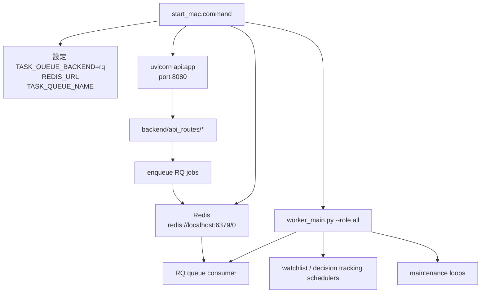
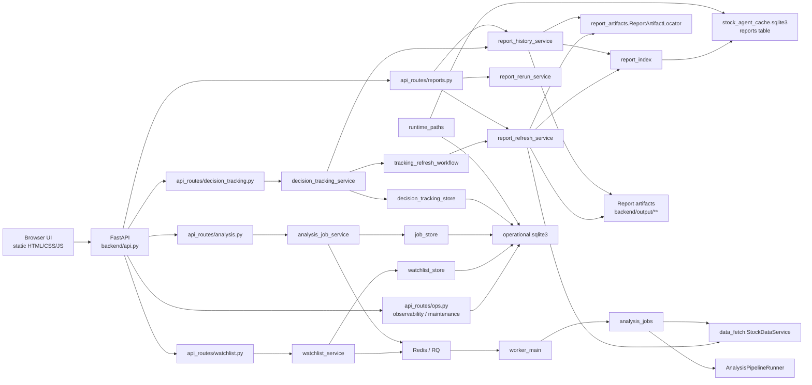
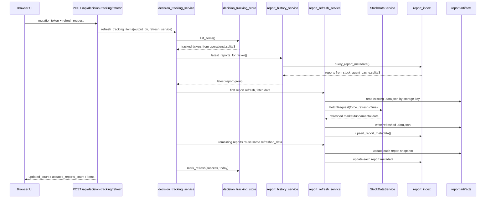
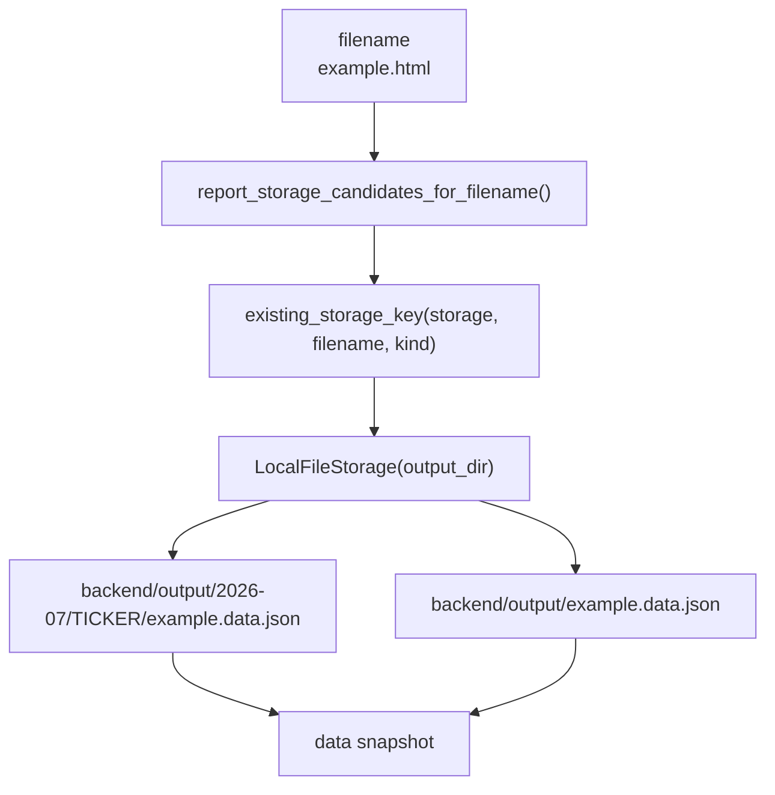

# 系統架構關聯圖

這份文件是維護用的 Runtime Truth Map。`docs/architecture.md` 描述系統設計；本文件描述日常查問題時應該沿著哪條路找 Module、資料庫和輸出檔，避免把 legacy 檔案或相似路徑當成目前系統真相。

## 目前 Runtime 真相

以下為本機預設設定。若環境變數覆寫，請以 `config` 實際輸出為準。

| 類別 | Canonical 位置 | 主要 Module | 備註 |
| --- | --- | --- | --- |
| API / UI 入口 | `start_mac.command` -> `uvicorn api:app --host ... --port 8080` | `backend/api.py`, `backend/api_routes/*` | 一般操作請用 `./start_mac.command` 或 `LAN_ACCESS=1 ./start_mac.command`。 |
| Worker / Scheduler / Maintenance | `worker_main.py --role all` | `backend/worker_main.py` | 由 `start_mac.command` 啟動，負責 RQ worker、排程和維護。 |
| Redis / RQ | `redis://localhost:6379/0` | `backend/task_queue.py` | API 只 enqueue，Worker consume。 |
| Report index | `backend/cache/stock_agent_cache.sqlite3` | `backend/report_index.py` | `reports` table 是報告列表、搜尋、追蹤卡片的索引。 |
| Operational state | `backend/cache/operational.sqlite3` | `backend/job_store.py`, `backend/decision_tracking_store.py`, `backend/watchlist_store.py`, `backend/provider_sla.py` | 分析任務、SSE events、telemetry、decision tracking、watchlist、provider SLA 的主要狀態。 |
| Report artifacts | `backend/output/**/<ticker>/*.{html,md,data.json}` | `backend/report_history_storage.py`, `backend/report_paths.py`, `storage.report_storage` | 不要手動假設 `backend/output/<filename>`；報告可能在月份和 ticker 子資料夾。 |
| Data fetch cache | Redis 或 `CACHE_DB_PATH` | `backend/cache_store.py`, `backend/cache_backends.py` | 依 `CACHE_BACKEND` 切換，目前本機常用 Redis。 |
| Legacy tracking DB | `backend/cache/decision_tracking.sqlite3` | legacy migration only | 不要用它判斷畫面狀態；目前 canonical 是 `operational.sqlite3`。 |

快速確認目前 runtime path：

```bash
$(scripts/project_python.sh) scripts/doctor_runtime.py
```

## 啟動與 Process 關聯



維護判斷：

```bash
lsof -nP -iTCP:8080 -sTCP:LISTEN
pgrep -fl 'start_mac.command|worker_main.py --role all|uvicorn api:app'
```

8080 應該看到 `start_mac.command` 啟動的 `uvicorn api:app`。若只看到手動啟動的臨時 uvicorn，表示可能不是正式 runtime。

## 核心 Module 關聯圖



讀圖規則：

- 畫面上的報告列表、最新追蹤價、資料可信度，大多來自 `report_index.reports` 的索引欄位。
- 追蹤清單本身的啟用狀態與 `last_refresh_date` 來自 `decision_tracking_store`，也就是 `operational.sqlite3`。
- 報告真實 data snapshot 在 `backend/output/**/<filename>.data.json`，路徑必須透過 storage helper 找。
- API route 不應該直接碰 SQLite 或自己拼 report artifact path。

## 追蹤股價刷新資料流



關鍵不變量：

- 同一個 ticker 有多份追蹤報告時，只應對外部 data fetch 執行一次 `force_refresh=True`。
- 每份報告仍要各自重建 `.data.json` 和 `report_index.reports.decision_tracking_json`。
- `needs_rerun` 代表結論本文需要重跑，不代表股價 snapshot 不可刷新。

## 報告 Artifact 查找規則



維護規則：

- 查報告檔請用 `report_history_storage.existing_storage_key()` 或 `load_storage_item()`。
- 不要直接寫 `Path(output_dir) / filename` 來找 HTML/Markdown/data snapshot。
- `report_index.data_snapshot_filename` 是檔名，不保證是完整相對路徑。

## 狀態資料歸屬

| 想查什麼 | 先看哪裡 | 不要先看哪裡 |
| --- | --- | --- |
| 追蹤清單是否今天刷新 | `operational.sqlite3` -> `decision_tracking_items` | `decision_tracking.sqlite3` |
| 追蹤卡片最新價 | `stock_agent_cache.sqlite3` -> `reports.decision_tracking_json` | Markdown 文字中的舊摘要 |
| 報告 snapshot 最新價 | `backend/output/**/<filename>.data.json` | `backend/output/<filename>.data.json` 固定路徑假設 |
| 分析任務進度 | `operational.sqlite3` -> `analysis_jobs`, `analysis_events` | RQ registry alone |
| Provider 健康度 | `operational.sqlite3` -> `provider_sla_*` | 外部 provider billing/dashboard |
| Watchlist 狀態 | `operational.sqlite3` -> `watchlist_*` | legacy JSON path |
| 報告列表/搜尋 | `stock_agent_cache.sqlite3` -> `reports` | filesystem scan alone |

## 新功能放置規則

- 新 API 行為放在 `backend/api_routes/*`，不要堆進 `backend/api.py`。
- 新長流程先建立 service/workflow Module，再由 route 注入依賴。
- Runtime path 真相走 `runtime_paths`，不要在新 Module 自己猜 `backend/cache/*.sqlite3`。
- 新持久狀態若屬 operational state，優先放 `TASK_DB_PATH` 管轄的 store Module。
- 新報告索引欄位才放 `report_index`；不要把任務狀態塞進 report index。
- 新 report artifact 行為走 `report_artifacts` / storage helper；不要新增另一套 path guessing。
- 新外部資料來源走 `data_fetch` / provider audit；不要在 UI route 裡直接呼叫 provider。

## 建議的下一步

1. 建立 `backend/runtime_paths.py`，把 canonical DB/path 命名集中，讓 caller 不再直接猜 `backend/cache/*.sqlite3`。
2. 建立 `backend/report_artifacts.py`，把 HTML/Markdown/data snapshot locator 變成明確 Interface。
3. 將追蹤刷新收斂為 `tracking_refresh_workflow`，讓 route 和 scheduler 共用同一條工作流。
4. 加架構測試：禁止新程式直接引用 legacy tracking DB、禁止 API route 直接拼 output path、禁止 tracking refresh 對同 ticker 重複 fetch。
