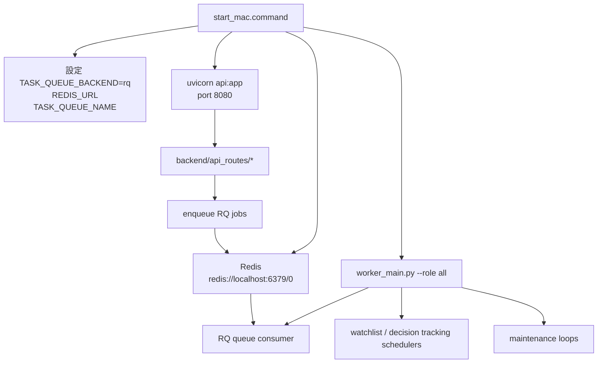
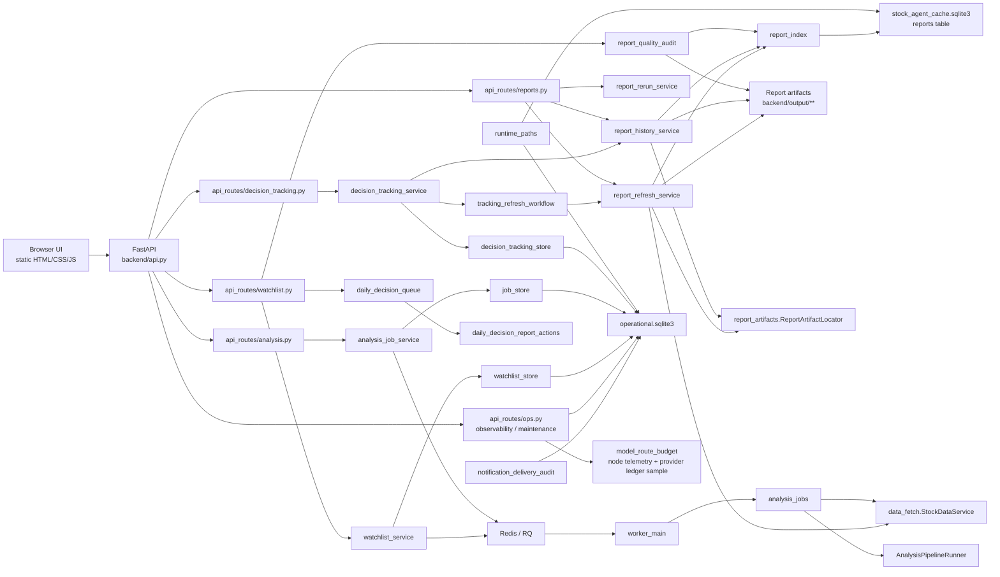
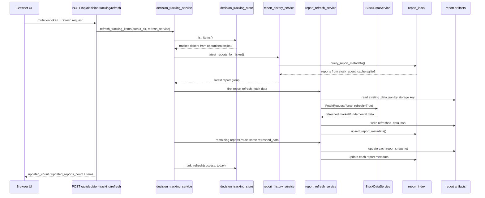
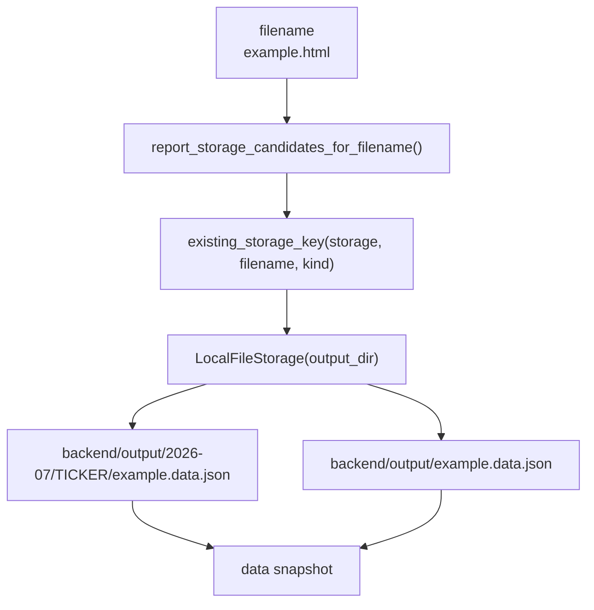

# 系統架構關聯圖

這份文件是維護用的 Runtime Truth Map。`docs/architecture.md` 描述系統設計；本文件描述日常查問題時應該沿著哪條路找 Module、資料庫和輸出檔，避免把 legacy 檔案或相似路徑當成目前系統真相。

## 目前 Runtime 真相

以下為本機預設設定。若環境變數覆寫，請以 `config` 實際輸出為準。

| 類別 | Canonical 位置 | 主要 Module | 備註 |
| --- | --- | --- | --- |
| API / UI 入口 | `start_mac.command` -> `uvicorn api:app --host ... --port 8080` | `backend/api.py`, `backend/api_routes/*` | 一般操作請用 `./start_mac.command` 或 `LAN_ACCESS=1 ./start_mac.command`。 |
| Worker / Scheduler / Maintenance | `worker_main.py --role all` | `backend/worker_main.py` | 由 `start_mac.command` 啟動，負責 RQ worker、排程和維護。 |
| Redis / RQ | `redis://localhost:6379/0` | `backend/task_queue.py` | API 只 enqueue，Worker consume。 |
| Report index | `backend/cache/stock_agent_cache.sqlite3` | `backend/report_index.py` | `reports` table 是報告列表、搜尋、追蹤卡片的索引。 |
| Operational state | `backend/cache/operational.sqlite3` | `backend/job_store.py`, `backend/decision_tracking_store.py`, `backend/watchlist_store.py`, `backend/provider_sla.py`, `backend/notification_delivery_audit.py` | 分析任務、SSE events、telemetry、decision tracking、watchlist、provider SLA、notification delivery audit 的主要狀態。 |
| Report artifacts | `backend/output/**/<ticker>/*.{html,md,data.json}` | `backend/report_history_storage.py`, `backend/report_paths.py`, `storage.report_storage` | 不要手動假設 `backend/output/<filename>`；報告可能在月份和 ticker 子資料夾。 |
| Data fetch cache | Redis 或 `CACHE_DB_PATH` | `backend/cache_store.py`, `backend/cache_backends.py` | 依 `CACHE_BACKEND` 切換，目前本機常用 Redis。 |
| Legacy tracking DB | `backend/cache/decision_tracking.sqlite3` | legacy migration only | 不要用它判斷畫面狀態；目前 canonical 是 `operational.sqlite3`。 |

快速確認目前 runtime path：

```bash
$(scripts/project_python.sh) scripts/doctor_runtime.py
```

## 啟動與 Process 關聯


```mermaid
flowchart TD
    Start["start_mac.command"] --> Env["設定 TASK_QUEUE_BACKEND=rq<br/>REDIS_URL<br/>TASK_QUEUE_NAME"]
    Start --> Redis["Redis<br/>redis://localhost:6379/0"]
    Start --> Worker["worker_main.py --role all"]
    Start --> API["uvicorn api:app<br/>port 8080"]

    Worker --> QueueConsumer["RQ queue consumer"]
    Worker --> Schedulers["watchlist / decision tracking schedulers"]
    Worker --> Maintenance["maintenance loops"]

    API --> Routers["backend/api_routes/*"]
    Routers --> QueueProducer["enqueue RQ jobs"]
    QueueProducer --> Redis
    Redis --> QueueConsumer
```

維護判斷：

```bash
lsof -nP -iTCP:8080 -sTCP:LISTEN
pgrep -fl 'start_mac.command|worker_main.py --role all|uvicorn api:app'
```

8080 應該看到 `start_mac.command` 啟動的 `uvicorn api:app`。若只看到手動啟動的臨時 uvicorn，表示可能不是正式 runtime。

## 核心 Module 關聯圖


```mermaid
flowchart LR
    UI["Browser UI<br/>static HTML/CSS/JS"] --> API["FastAPI<br/>backend/api.py"]
    API --> ReportsRoute["api_routes/reports.py"]
    API --> TrackingRoute["api_routes/decision_tracking.py"]
    API --> AnalysisRoute["api_routes/analysis.py"]
    API --> WatchlistRoute["api_routes/watchlist.py"]
    API --> OpsRoute["api_routes/ops.py<br/>observability / maintenance"]

    ReportsRoute --> ReportHistory["report_history_service"]
    ReportsRoute --> ReportRefresh["report_refresh_service"]
    ReportsRoute --> ReportRerun["report_rerun_service"]

    TrackingRoute --> TrackingService["decision_tracking_service"]
    TrackingService --> TrackingWorkflow["tracking_refresh_workflow"]
    TrackingService --> TrackingStore["decision_tracking_store"]
    TrackingService --> ReportHistory
    TrackingWorkflow --> ReportRefresh

    AnalysisRoute --> AnalysisJobSvc["analysis_job_service"]
    AnalysisJobSvc --> JobStore["job_store"]
    AnalysisJobSvc --> Queue["Redis / RQ"]
    Queue --> Worker["worker_main"]
    Worker --> AnalysisJobs["analysis_jobs"]
    AnalysisJobs --> DataFetch["data_fetch.StockDataService"]
    AnalysisJobs --> Runner["AnalysisPipelineRunner"]

    WatchlistRoute --> WatchlistSvc["watchlist_service"]
    WatchlistSvc --> WatchlistStore["watchlist_store"]
    WatchlistSvc --> Queue
    WatchlistRoute --> DailyQueue["daily_decision_queue"]
    DailyQueue --> ReportActions["daily_decision_report_actions"]
    WatchlistRoute --> QualityAudit["report_quality_audit"]
    QualityAudit --> ReportIndex
    QualityAudit --> Artifacts

    ReportHistory --> ArtifactLocator["report_artifacts.ReportArtifactLocator"]
    ReportHistory --> ReportIndex["report_index"]
    ReportHistory --> Artifacts["Report artifacts<br/>backend/output/**"]
    ReportRefresh --> ArtifactLocator
    ReportRefresh --> DataFetch
    ReportRefresh --> ReportIndex
    ReportRefresh --> Artifacts

    RuntimePaths["runtime_paths"] --> CacheDB
    RuntimePaths --> OpDB
    ReportIndex --> CacheDB["stock_agent_cache.sqlite3<br/>reports table"]
    TrackingStore --> OpDB["operational.sqlite3"]
    JobStore --> OpDB
    WatchlistStore --> OpDB
    OpsRoute --> OpDB
    OpsRoute --> RouteBudget["model_route_budget<br/>node telemetry + provider ledger sample"]
    NotificationAudit["notification_delivery_audit"] --> OpDB
```

讀圖規則：

- 畫面上的報告列表、最新追蹤價、資料可信度，大多來自 `report_index.reports` 的索引欄位。
- 追蹤清單本身的啟用狀態與 `last_refresh_date` 來自 `decision_tracking_store`，也就是 `operational.sqlite3`。
- 報告真實 data snapshot 在 `backend/output/**/<filename>.data.json`，路徑必須透過 storage helper 找。
- API route 不應該直接碰 SQLite 或自己拼 report artifact path。

## 追蹤股價刷新資料流


```mermaid
sequenceDiagram
    participant UI as Browser UI
    participant API as POST /api/decision-tracking/refresh
    participant Svc as decision_tracking_service
    participant Store as decision_tracking_store
    participant Hist as report_history_service
    participant Refresh as report_refresh_service
    participant Fetch as StockDataService
    participant Index as report_index
    participant Files as report artifacts

    UI->>API: mutation token + refresh request
    API->>Svc: refresh_tracking_items(output_dir, refresh_service)
    Svc->>Store: list_items()
    Store-->>Svc: tracked tickers from operational.sqlite3
    Svc->>Hist: latest_reports_for_ticker()
    Hist->>Index: query_report_metadata()
    Index-->>Hist: reports from stock_agent_cache.sqlite3
    Hist-->>Svc: latest report group
    Svc->>Refresh: first report refresh, fetch data
    Refresh->>Files: read existing .data.json by storage key
    Refresh->>Fetch: FetchRequest(force_refresh=True)
    Fetch-->>Refresh: refreshed market/fundamental data
    Refresh->>Files: write refreshed .data.json
    Refresh->>Index: upsert_report_metadata()
    Svc->>Refresh: remaining reports reuse same refreshed_data
    Refresh->>Files: update each report snapshot
    Refresh->>Index: update each report metadata
    Svc->>Store: mark_refresh(success, today)
    API-->>UI: updated_count / updated_reports_count / items
```

關鍵不變量：

- 同一個 ticker 有多份追蹤報告時，只應對外部 data fetch 執行一次 `force_refresh=True`。
- 每份報告仍要各自重建 `.data.json` 和 `report_index.reports.decision_tracking_json`。
- `needs_rerun` 代表結論本文需要重跑，不代表股價 snapshot 不可刷新。

## 報告 Artifact 查找規則


```mermaid
flowchart TD
    Filename["filename<br/>example.html"] --> Candidates["report_storage_candidates_for_filename()"]
    Candidates --> Existing["existing_storage_key(storage, filename, kind)"]
    Existing --> LocalStorage["LocalFileStorage(output_dir)"]
    LocalStorage --> Nested["backend/output/2026-07/TICKER/example.data.json"]
    LocalStorage --> LegacyFlat["backend/output/example.data.json"]
    Nested --> Snapshot["data snapshot"]
    LegacyFlat --> Snapshot
```

維護規則：

- 查報告檔請用 `report_history_storage.existing_storage_key()` 或 `load_storage_item()`。
- 不要直接寫 `Path(output_dir) / filename` 來找 HTML/Markdown/data snapshot。
- `report_index.data_snapshot_filename` 是檔名，不保證是完整相對路徑。

## 狀態資料歸屬

| 想查什麼 | 先看哪裡 | 不要先看哪裡 |
| --- | --- | --- |
| 追蹤清單是否今天刷新 | `operational.sqlite3` -> `decision_tracking_items` | `decision_tracking.sqlite3` |
| 追蹤卡片最新價 | `stock_agent_cache.sqlite3` -> `reports.decision_tracking_json` | Markdown 文字中的舊摘要 |
| 報告 snapshot 最新價 | `backend/output/**/<filename>.data.json` | `backend/output/<filename>.data.json` 固定路徑假設 |
| 分析任務進度 | `operational.sqlite3` -> `analysis_jobs`, `analysis_events` | RQ registry alone |
| Provider 健康度 | `operational.sqlite3` -> `provider_sla_*` | 外部 provider billing/dashboard |
| LLM 路由維運觀測 | `operational.sqlite3` -> `analysis_node_telemetry` + `api_usage_events` | 將 fallback 後的節點成功當成 provider 沒有錯誤 |
| Notification delivery 結果 | `operational.sqlite3` -> `notification_delivery_audit` | `stock_agent_cache.sqlite3` 或外部 channel dashboard |
| Watchlist 狀態 | `operational.sqlite3` -> `watchlist_*` | legacy JSON path |
| 報告列表/搜尋 | `stock_agent_cache.sqlite3` -> `reports` | filesystem scan alone |

## 新功能放置規則

- 新 API 行為放在 `backend/api_routes/*`，不要堆進 `backend/api.py`。
- 新長流程先建立 service/workflow Module，再由 route 注入依賴。
- Runtime path 真相走 `runtime_paths`，不要在新 Module 自己猜 `backend/cache/*.sqlite3`。
- 新持久狀態若屬 operational state，優先放 `TASK_DB_PATH` 管轄的 store Module。
- Notification delivery 的成功、失敗與重試稽核屬 operational state，走 `notification_delivery_audit`，不要寫進 report index。
- Provider SLA dashboard 的 window/metric normalization 留在 `provider_sla_observability`，alert/source-health projection 放 `provider_sla_dashboard_payload`，shape-safe queue/stuck helpers 放 `api_observability_payload_helpers`；`api_observability_service` 只負責聚合維運 API payload。
- Provider SLA dashboard 保留核心來源的 system-level `critical`；若同一 source 在選定視窗有可用 provider，alert 另標記 `current_source_has_healthy_entry=true`，並以 `core_critical_covered_count`/`core_critical_uncovered_count` 提供快速掃讀，讓操作人員看見備援覆蓋，但不把它誤當成單份報告已可重跑或已恢復。
- `model_route_budget.v1` 的 `failures`/`failure_rate` 只代表 `analysis_node_telemetry` 的節點結果；同一個 route 另以 `provider_error_count`、`provider_quota_error_count` 與 `provider_error_scope=recent_api_usage_events` 呈現 bounded ledger sample。provider error 透過 `api_usage_events.metadata_json.job_id` 回填 `analysis_jobs.pipeline_id`，只供唯讀維運警示，不改 model route、circuit、queue、rerun 或 report state。
- `daily_decision_queue` 只負責跨來源收集與排序；到期回測、重跑報告與報告日期解析由 `daily_decision_report_actions` 承接，兩者都只做純 payload shaping，不 enqueue、不寫 report/index/review state。
- `daily_decision_route_warnings` 的 `model_route_warning` item 使用 `operator_action_contract.navigation_context()` 輸出 `open-ops`、`查看路由`、`api-quota-panel`、`ops`；queue、notification message 與 delivery outbox 對同一 route warning 應保留相同 CTA/target metadata，明確自訂值仍優先。
- `review_candidate` 的 shared operator contract 輸出 `candidate-snapshot`、`查看股票快照`、`market-screener-panel`、`screener`；notification message 與 delivery outbox 必須沿用這組 metadata，避免候選通知退回舊的 `open-ops`、`查看候選` generic CTA。operator summary 仍保留候選專用的快照、追蹤、選擇分析模式三個按鈕，因為它們由既有 candidate callbacks 處理。
- `fix_notification_delivery` 是 queue-only repair action，必須直接帶出 `open-ops`、`查看通知通道`、`maintenance-panel`、`ops`；它仍以 `suppress_notification=true` 排除 notification message/outbox，但 queue API 與 operator UI 不應各自猜測維護面板 target。
- RQ queue observability 必須同時保留 per-queue registry counts；`failed_queue_count` 是總量，`failed_queue_attention_count` 依 `failure_ttl` 的 7 天門檻判定近期需處理量，供 ops status、Prometheus 與維運面板共用，不自動清除或重試 failed jobs。
- stale failed queue 的清理走 `queue_maintenance.cleanup_stale_failed_jobs`，由 `POST /api/maintenance/cleanup-failed-queue`、維護面板與 `scripts/maintenance.sh cleanup-failed-queue` 共用；預設 dry-run，只有 mutation token 加明確 `write=true` 才刪除能由 `ended_at`/`created_at` 證明已過期的 job，近期或無法判定年齡的 job 保留。
- 維護面板四個清理按鈕共用 `maintenance_action_helpers.js` 的 preview-confirmation gate；報告索引、任務紀錄、來源健康紀錄與 stale queue 都先用 `write=false` 取得候選數，取消、零候選或確認器不可用時不呼叫 `write=true`。
- `/api/watchlist/daily-dashboard` 的近期報告列表仍是 20 份 action scope；`report_quality_audit.v1` 另以 read-only 方式 audit 全部 latest-per-ticker/pipeline index rows，API 以 `selection_basis=latest_per_ticker_pipeline` 明示這個範圍。完整且未截斷的 latest audit gap 可投影成 `source=report_quality_audit` 的人工核對 action，但不改變 audit coverage。
- 同一個 latest audit envelope 的 `decision_freshness_summary` 以相同 `scope`/`selection_basis` 統計 current、needs-rerun 與 unknown conclusion freshness；它補足近期 20 份 action sample 看不到的全量 stale count，但不改 quality metadata coverage、repair queue 或 rerun side effect。
- 同一 envelope 的 `decision_freshness_items` 只提供有限 navigation sample，`items_total` 仍等於 full stale count，`items_returned/items_limit/items_truncated` 明示畫面展開範圍；shared bounded label 對 returned 超過 limit、缺失或矛盾的截斷旗標顯示「範圍資料需確認」，不把 total 冒充完整清單；target 沿用 history query，不新增 queue item、不觸發 rerun。
- `GET /api/watchlist/current-quality-summary` 以 ordinary report-history 的 current-rule projection 統計目前 `report_conformance`、`content_credibility` 與 `evidence_exit_gate`，三組分布各自保留 `audited_reports` 分母；watchlist 在快速 daily response 後背景載入，短 TTL 避免重複重算，只回傳最多 5 筆 non-passed navigation target，不把警示轉成 queue、review 或 rerun side effect。
- `report_current_quality_summary` 保留 index pagination、current-scope aggregation、cache 與 public builder；`report_current_quality_item_helpers` 只承接 status normalization、evidence residual accounting、blocker projection、quality action item 與排序 key 等純 projection。兩者的 import-boundary 由 `tests/test_import_boundaries.py` 守住，避免把 storage/orchestration 與 item shaping 再堆回同一模組。
- `evidence_exit_gate` 保留 sampling、snapshot flatten、candidate check 與 verdict orchestration；`evidence_exit_gate_claims` 承接 Markdown numeric claim extraction、non-claim guard、semantic path mapping、numeric normalization 與 best-match。claim helper 不寫 snapshot、artifact、index、review、rerun、repair 或 queue，主 gate 只消費其純函式輸出。
- operator summary 對 `source=report_quality_audit` 且帶有 filename 的 `manual_review` action 映射為「前往人工核對」，沿用 `StockAgentOpenHistoricalQualityAudit({query, pipeline})` 進入同一份 targeted historical audit；一般 `report_repair` manual review 仍開啟報告。此導覽只改變查詢位置，不核准 review、不重跑、不寫 artifact/index/queue state。
- 帶 filename 的一般 `report_repair` `manual_review` queue item 也使用 `operator_action_contract` 輸出 `view-report` 與既有 `action_label`、`active-jobs-panel/ops`；因此 queue、notification message/outbox 都能直接表達「開啟報告」的同一個下一步。沒有 filename 的 quality action 仍不套用 targeted history default，明確自訂 metadata 仍優先。
- `notification_plan.messages` 與 `delivery_outbox` 對同一組 `source=report_quality_audit`、`type=manual_review` 且有 filename 的 action 也輸出 `operator_action=quality-audit-review`、`operator_action_label=前往人工核對`；來源限定的 default 不覆蓋上游明確自訂 CTA，讓本機通知與工作台維持相同下一步語意。
- 同一組 quality-audit action 的 default `target_panel=history-quality-audit`、`target_tab=analysis`，對應 `#history-quality-audit` 與 `#home-tab-analysis`；明確傳入的 target metadata 仍優先，避免只依 target metadata 導覽的下游被送到維運面板。
- `decision_queue.items` 對帶 filename 的 `report_quality_audit` + `manual_review` action 也直接帶出 `operator_action`、`operator_action_label`、`target_panel`、`target_tab`；queue 與 notification message/outbox 共用 `operator_action_contract`，直接消費 queue 的下游不必自行重建品質稽核導覽。明確自訂 metadata 仍優先，缺 filename 的 quality action 不套用 targeted history default。
- `daily_decision_queue_summary.queue_response()` 保留 `monitor` 佔位項以維持 UI 相容，但 `summary.displayed_count` 與 canonical `summary.secondary_count` 只計真正 actionable items；無待辦時 `total_actionable=0`、`displayed_count=0`、`secondary_count=0`。頂層 `secondary_count` 是 backward-compatible alias，notification/UI 先讀 summary 再 fallback，避免健康狀態佔位或不同 response 層級造成分母漂移。
- `daily_decision_queue_summary.queue_response()` 先依既有 priority/source 規則排序，再以 `type`、ticker、filename/report filename 或 route、pipeline、horizon、warning id 做 deterministic tie-breaker；同分 queue 不依賴上游 iterator 順序。`filename` 與 `report_filename` 是同一 report artifact 的 aliases，notification message/outbox 會先收斂衝突值到單一 canonical filename。
- daily dashboard 的 `repair_queue.summary.sampled_reports` 是近期 repair action sample，與全量 `report_quality_audit` coverage 分開；`summary.action_required` 是 sample 內完整 actionable count，`items_limit`、`items_returned`、`items_truncated` 明示 bounded repair target list 是否只載入部分，不能用可見 `items[]` 數量冒充完整 queue。operator dashboard 與 watchlist daily board 共用 `report_quality_queue_scope_helpers.js`，只有在四個 bounded 欄位存在且一致時才顯示 `修復 queue：顯示 N / 共 M`；legacy 或矛盾 metadata 會維持既有文字，不自行推算。`report_quality_audit.repair_sample_overlap` 依 filename/pipeline 比對完整 audit gap items 與 sample，`complete` 才提供 sample 外 exact count，`partial` 只保留已返回 items 的 overlap，避免 pagination 未展開部分被誤算。repair sample 與 audit action 重疊時以 repair item 為準；partial/unavailable 與 historical quality gap 不進 daily queue，且不 enqueue rerun 或寫入任何狀態。
- `/api/watchlist/report-quality-audit/historical` 是獨立的 read-only historical scope，使用 `include_versions=True` 掃描符合 `q`/`pipeline` 篩選的 indexed versions，並以 `scope=all_historical_indexed_reports`、`selection_basis=all_indexed_versions` 明示範圍；它不進 daily decision queue，也不做 artifact/index/rerun side effect。
- historical audit response 的 `current_quality_summary` 是獨立的 latest current-rule projection，使用 `scope=historical_filter_current_latest`、`selection_basis=latest_per_ticker_pipeline` 與同一 `q`/`pipeline` 篩選；它有自己的 `audited_reports` 分母，不改 persisted coverage、不重建 gate，也不產生 artifact/review/index/queue/rerun side effect。history current-quality helper 會拒絕 `items_returned > items_total` 或與 `items[]` 長度不一致的 payload，避免矛盾 bounded target 滲入摘要。
- `report_current_quality_summary` 會在同一 current scope 彙總 persisted evidence gate 的 `failed_count` 與 `unverifiable_reason_counts`，並按共用 freshness bucket 追加 `evidence_mismatch_claims_by_freshness`／`evidence_mismatch_reports_by_freshness`；bounded `items[]` 在有 mismatch 時保留 `evidence_mismatch_freshness_status`。watchlist/history 由共用 helper 轉成白話標籤。這是 read-only diagnostics，不複製 sampled claim、不改 verdict/status，也不建立 artifact、review、index、queue 或 rerun side effect。
- `report_current_quality_summary.evidence_unverifiable_reports_by_freshness` 以報告為單位計算含不可驗證 residual 的 freshness 分母，與按 claim 原因計數的 `evidence_unverifiable_reason_counts_by_freshness` 分開；前端只有欄位存在時才顯示涉及報告數，legacy response 不從 claim 數猜報告數。
- `report_current_quality_summary.evidence_unverifiable_claims_by_freshness` 以 gate 的 `unverifiable_count` 與 reason map 總數較大值作 residual claim 分母；reason map 缺失時保留 claim/report 數並在前端標示「原因未記錄」，不補造 evidence reason 或改變 gate verdict。
- `report_current_quality_summary.quality_gate_action_scope` 明示 `quality_gate_action_counts` 是以 `quality_gate_repair_item` 逐份套用的目前品質投影，並以 `is_daily_queue=false` 表示它不是 daily decision queue；watchlist/history 透過 scope helper 顯示「唯讀品質投影，不等同今日待辦」。缺少 optional scope 的 legacy response 保留原 action 文案，不能把全量投影數字借作 queue 分母或宣稱已排入待辦。
- `report_current_quality_summary.quality_gate_action_counts_by_freshness` 以同一 latest current scope 將品質處理建議分成 `current`、`needs_rerun`、`unknown`；它與總數欄位使用同一份逐報告 action projection，前端只有收到 optional map 且各 action 加總能回到總數時才顯示「按資料新鮮度」分布。malformed 或算術矛盾的 map 只保留獨立可信的總數文案，legacy response 缺欄位時也保留總數文案。這是 read-only diagnostics，不改 action picker、daily queue、review 或 rerun state。
- 共用 `report_quality_evidence_helpers.js`、`report_quality_evidence_freshness_helpers.js`、`report_quality_action_scope_helpers.js` 與 `history_current_quality_helpers.js` 對 evidence/freshness/blocker/action summary 的計數採有限非負整數邊界；positive-entry 只接受大於零。fractional、NaN、Infinity 或其他 malformed optional count 逐欄不渲染，不能以 `floor` 產生假報告數；freshness 的報告數可保留合法 `0`，前提是同一 bucket 已有其他有效摘要內容。
- `report_quality_audit.artifact_quality_summary_by_status` 在 item pagination 前統計所有 missing-metadata row 的 artifact marker availability；`present` 只表示 Markdown/HTML 有可見摘要可供人工核對，不等於 gate pass，daily/historical UI 共享同一組統計。
- `watchlist_current_quality_helpers.js` 的主摘要與 bounded target 也對 `evidence_failed_count` 使用相同的有限正整數邊界；summary 或單一 target 的 fractional/malformed mismatch count 都只省略該段 evidence label，不影響同一 current-quality payload 的其他合法 status、blocker 或 action projection。
- `watchlist_panel_helpers.js` 的品質缺口 detail summary 對 field/provenance/rerun/context/artifact/pipeline counts 採逐欄有限非負整數；review status 四欄採全體有效才顯示進度，明確存在但 malformed 的 bounded `items_total/items_returned/items_limit` 只顯示範圍需確認，不以 `floor` 產生假完整度。
- `report_quality_audit.artifact_quality_summary_by_field` 同樣在 item pagination 前按 `report_conformance`、`evidence_exit_gate`、`content_credibility` 統計 marker；field count 保留零值，避免 `present` 被誤讀成三個品質欄位都可查。
- repeated quality audit 只在相同 `output_dir/scope/filter/index-row fingerprint` 下使用 15 秒 bounded process cache；`updated_at`、`file_mtime` 或 stored hash 變化即重新讀 artifact，cache 不取代 canonical report index/storage。
- `report_quality_audit` 只負責 indexed-row/storage orchestration，audit envelope/statistics 放 `report_quality_audit_payload`；revision review API 由 `api_routes/report_quality_review` 註冊，並由 watchlist route 注入 target/record callable，避免跨 route owner 直接耦合。
- `report_quality_audit_rows` 負責把 indexed row hydration 成 read-only quality row，透過注入的 storage loader 與 snapshot-integrity verifier 讀取資料；`report_quality_audit` 保留 scope、cache、filter、review 與 audit orchestration，不把 row-level JSON/Markdown parsing 再堆回 route 或 envelope。
- `price_parser` 保留數值抽取、context 與 target-price decision flow；`price_parser_patterns` 只擁有 regex/text constants，避免 pattern ownership 與 parsing algorithm 互相膨脹。`content_credibility_evidence_matrix_support` 只提供 shape-safe row/issue/check helpers，coverage policy 仍由 `content_credibility_evidence_matrix` 負責。
- quality audit 可唯讀解析 Markdown 的既有 Agent headings 只為判斷 preceding-context availability；`artifact_fallback_available` 只表示上下文可查，另以 `rerun_execution_status=full_rerun_required` 等欄位表達 freshness/局部重跑策略。這不是 gate reconstruction、不是 artifact repair，也不改 review ledger、rerun queue 或 report index。
- historical quality audit 另外以 report index 的 latest-per-ticker/pipeline 結果標記 `report_version_status=current|historical|unknown`，並以 `quality_metadata_missing_by_version_status` 呈現缺口分布；這是解讀範圍的 read-only evidence，不改歷史 artifact、review ledger、rerun queue 或 report index。
- historical quality audit 的 `version_status` filter 先在 report-index rows 縮小目前/歷史/未判定版本範圍，再讀取 snapshot/artifact 並套用 review/missing-field gap filters；只選版本時保留完整報告作為 coverage 分母，回應以 `report_version_status_filter` 記錄範圍。這是 GET-only navigation，不改 daily queue、artifact、review ledger、rerun 或 report index。
- 歷史 quality gap 的人工核准走 `backend/report_quality_review_store.py`，把 `report_quality_revision` 綁在 report identity 與 indexed row/artifact content hashes；index `updated_at`、filesystem mtime 只作 refresh signal，不作版本 identity。事件 append-only 寫入 canonical `operational.sqlite3` 的 `report_quality_review_events`；`approved_with_gap` 只代表「核對後保留缺口」，不代表 structured gate 通過，content revision 變更時必須重新審核。
- `POST /api/watchlist/report-quality-audit/review` 必須經 mutation token，且只留下 decision/note audit event；它明確回報 `artifact_written=false`、`report_index_written=false`、`rerun_enqueued=false`，不得從 HTML/Markdown 重建 gate 或自動修復歷史報告。
- historical audit item 的 `quality_review_history` 只讀取同一 filename/pipeline/revision 最近 20 筆 append-only 事件，按 event id 倒序呈現；舊 revision 事件不會進入目前報告的 review timeline。
- history workspace 只有在 `顯示舊版報告` 開啟時呼叫 historical audit，沿用目前的 `q`/pipeline 篩選；追蹤工作台的 `data-quality-history-audit` shortcut 只切換到分析頁並開啟既有 checkbox，不建立 queue action。摘要與五筆一批的 report target 由獨立 `history_quality_audit` module 渲染，`data-quality-audit-page` 以 `item_offset` 載入上一批/下一批，target 同步顯示 missing gate 與 quality provenance，CTA 只委派既有 `openReport()`，不把 read-only audit 轉成 daily action。摘要以 `verified_snapshot_reports` 作為完整度分母，將 invalid/unverified snapshot 分開呈現；有缺口的模式會顯示唯讀 `data-quality-audit-pipeline` 快速篩選，委派既有 history `pipeline` filter、重設頁碼與 preview 後重新載入；workspace 以 invocation-time filter snapshot 與 generation 同時丟棄過期 list/audit 回應，維持篩選範圍與摘要一致。
- `report_quality_audit` 使用 `report_index.query_report_metadata(..., row_mapper=...)`、`report_history_storage.load_storage_item()` 與 `verify_data_snapshot_integrity()`；不讀 preview/decision-tracking rendering，不回寫 artifact 或 report index。audit 失敗時由 route 降級為 `unavailable`，不遮蔽每日工作台。
- audit 的 coverage 分母固定是 `verified_snapshot_reports`，並另回報 invalid/unverified snapshot 數；單一 row 的 storage、JSON 或 integrity failure 在 row boundary 轉為 unverified，不中止其他 indexed rows。
- `report_refresh_service.refresh_report_data_snapshot()` 只刷新資料快照時，必須從既有 snapshot 保留 `report_lint`、`evidence_exit_gate`、`content_credibility`、`report_conformance` 與 sanitized `final_audit`；freshness/rerun 重新計算，但不可把原報告品質證據抹成空物件。
- 同一個 refresh flow 也必須保留既有 `evidence_matrix`：它是原分析的 evidence projection，不應因 refresh context 沒有分析輸入而靜默變成空陣列；若 context 明確提供 matrix，`build_data_snapshot()` 只做 sanitization，不重新推導或改寫品質 gate。
- 同一個 refresh flow 也必須保留既有 `rerun_context`：analyses、structured outputs、parsed recommendation 與 pipeline metadata 是局部重跑的原始輸入；沒有新的 top-level 分析 context 時，snapshot sanitizer 才能從 nested context 保留它，正常新分析 context 則優先。
- 品質 metadata repair 先以三個 gate 的 contract state allowlist 判定是否真的有結果；`not_recorded`/`unknown`/`N/A` 不算完整。data-only refresh 可在寫入 snapshot 前保存 optional `quality_metadata_refresh_provenance`，記下既有 `recorded_fields` 與 `missing_fields`；若目前缺口已在刷新前清單內，才標示 `quality_metadata_before_refresh`，否則沿用 `quality_metadata_after_refresh` 的中性 provenance。這只是責任分類，不代表可以從 HTML 摘要重建完整 gate payload，也不自動修復歷史 artifact。
- `content_credibility` 除了檢查目標價、資料信心與 evidence matrix，也要對齊同一份 context 的 `final_audit`：critical 或阻斷狀態為 blocked，warning 或其他非通過狀態為 warning，單純 corrections 不升級；歷史/API 讀取若沒有 raw `final_audit`，可從同一 snapshot 已記錄的 `report_conformance.decision_tree.final_audit` 做 read-only reconciliation，但不得把缺少的 content metadata 當成已補寫，也不取代 conformance 的 final-audit step。
- `content_credibility_projection` 在 snapshot 保存非空 `rerun_context.parsed` 且有 data/pipeline context 時，唯讀重跑現行 deterministic content checks；對已記錄 gate 只合併新 blocker/warning，保留舊 findings，對缺 gate 的 snapshot 只回報 `available` 而不可當成 coverage complete。`source=snapshot.rerun_context` 與 `persisted_status` 必須可追溯；projection 不寫 snapshot、artifact、index、review ledger、rerun 或 queue。
- indexed quality audit 的 row hydration 明確關閉 current-rule projection，因為 `report_quality_audit` 只消費 persisted gate metadata、snapshot integrity 與 artifact/context evidence；一般 report-history row 仍保留 projection，避免把 audit 的成本優化誤套到報告列表語意。
- `content_credibility` 的長線情境輸入若存在，依 canonical `熊市情境`、`基本情境`、`牛市情境` 做 read-only pairwise order check；熊市高於基本或基本高於牛市為 `scenario_target_order_conflict` blocked，明確存在但無法解析的情境值為 `unparseable_scenario_target` warning，缺少的情境鍵不補值，也不影響 v4 trade-setup contract。
- `content_credibility_scenario_range` 在 12 個月 recommendation target 與三個 canonical scenario target 都可解析時，重用 final-audit 的 `熊市 * 0.7` 到 `牛市 * 1.3` 可解釋範圍；超出範圍產生 `recommendation_target_outside_scenario_range` warning 並保留 target、bounds、scenario values。這是 historical/API 的 read-only trace，不取代 final-audit、scenario order blocker，也不建立 rerun、repair 或 queue side effect。
- `content_credibility_alignment` 若看到 recommendation map 但 normalized label 不在 `CANONICAL_RECOMMENDATIONS`，必須產生 `unrecognized_recommendation_label` warning 並略過方向比較；final-audit 的允許值檢查仍是獨立 structural contract，兩者不可把「無法判斷」投影成 passed。
- `content_credibility_evidence_confidence` 對 `not_recorded` evidence gate 只在 confidence `>=8/10` 時產生 `high_confidence_unrecorded_evidence` warning；它不把缺失證據升級成 rejected，低/未知信心維持非阻斷行為，避免把「尚未記錄」和「抽查拒絕」混成同一級別。
- `content_credibility_confidence_calibration` 重用 `build_confidence_calibration()` 與 cross-source conflict predicate；當資料可信度或未解衝突把信心上限壓低且 recommendation 超過上限時產生 `confidence_exceeds_data_trust_cap` warning，保留 raw/effective score、cap、reasons，不另造信心政策，也不把 calibrated/aligned/unavailable 升級。
- `confidence_downgrade_warning()` 是 structured-output 與 final-audit 的共用警示 formatter；`confidence_warning_key()` 只在 read-only final-audit projection 對 agent、data-trust、raw confidence、cap 完全相同的同義句去重，保留原始 `report_conformance` payload 與其他 warning。
- `content_credibility_confidence_calibration` 若無法解析 recommendation confidence，check 必須輸出 `status=unavailable` 而不是 `passed`；這只揭露校準不可完成，不新增 warning/blocker、不改整體 content-credibility status，也不改 shared confidence policy。
- `content_credibility_horizons` 重用 `forward_consistency_checker.check_target_price_sequence()` 對方向性 recommendation 的 3/6/12 個月目標價產生 read-only `horizon_target_sequence_conflict` warning；它補歷史/API 的可追蹤 trace，不取代 final-audit 的 critical findings，也不自行補缺少的 horizon 值。
- `execution_summary` 必須在 Markdown/HTML 顯示獨立 `Content credibility` marker；`report_quality_evidence` 同時辨識新 marker 與既有閱讀提示的 `內容一致性` 行，僅作 artifact evidence 摘要，不回推 snapshot gate、review、rerun 或 queue 狀態。
- `content_credibility_evidence_matrix` 依 parsed context 條件式要求 `最終投資建議`、`估值結論`、`護城河評分` 的 evidence row；每個存在的結論都要求 row status 為 `success`、`skipped_fresh_cache` 或 `degraded_enrichment` 且有非空 basis，缺 row 或不可用 row 分別產生對應的 `missing_*_evidence`／`unusable_*_evidence` warning。缺少該 parsed 結論不補 row，數字抽查仍由 `evidence_exit_gate` 負責。
- `content_credibility_evidence_confidence` 對非 `approved` 的 evidence gate warning 只帶入同一 gate 的 compact count/reason summary，包含 claim、sample、verified、failed、unverifiable 與 `unverifiable_reason_counts`；`verified` 是抽樣中已核對的 claim 數量。若 current projection 同時證明 `needs_rerun`，再帶入只含狀態、兩個時間戳與原因的 `evidence_freshness_context`，不帶 sampled claim raw text。current `confidence_evidence_alignment=passed` 且 `evidence_verdict=approved` 時，projection merge 會抑制同一批 stale evidence-alignment issue，其他 `caution`／`rejected` 仍保留。不改 evidence verdict、content status、snapshot、artifact、review、rerun 或 queue。
- `evidence_exit_gate` 的 sampled claim 保留 `verification_reason_code`、`candidate_count` 與 `unverifiable_reason_counts`，區分缺少 semantic path、缺少同路徑 snapshot、真實 mismatch 與 verified；這些是 read-only observability，不改 verdict、抽樣數量、snapshot、artifact 或 queue。
- `evidence_exit_gate.extract_numeric_claims()` 對 KV label 後接的月日範圍（例如 `08/17 - 08/18`）及直接接中文／英文文字的 compact token（例如 `08/17法說會後`）採 conservative non-claim guard，避免日期前綴被當成 scalar；以第三位數字禁止條件保留真正數值邊界，不放寬有單位數值或 canonical field 的核驗，也不改 snapshot/artifact。
- `evidence_exit_gate._path_markers_for_claim()` 對明示新聞／`market_catalysts`／`recent_catalysts` 的支撐、壓力、關卡或風險價格拒絕 generic `risk_price` fallback，避免同值碰撞被誤認為 canonical evidence；52 週高低點與 River Chart band 的專用分支先行保留。
- `evidence_exit_gate._path_markers_for_claim()` 將中文 `盤中速報` 與新聞／`market_catalysts`／`recent_catalysts`／`催化劑` 使用相同的支撐、壓力、關卡與風險價格來源邊界；同值 target candidate、current price 或 `risk_price` 不作 fallback，避免盤中提及價被誤升級。
- `evidence_exit_gate._check_claim()` 對上述無 canonical path 的新聞價格輸出 `verification_reason_code=news_source_not_canonical`，把來源邊界與一般 `missing_semantic_path` 分開；它只改 read-only diagnostics，不改 verdict、抽樣、snapshot、artifact 或 queue。
- `evidence_exit_gate._path_markers_for_claim()` 與 `_check_claim()` 將中文 `催化劑` 視為新聞來源邊界；即使日期／數值剛好撞上 `price_history`，也不建立 canonical path，並輸出 `news_source_not_canonical`，避免催化劑提及價被誤升級為歷史行情證據。
- `evidence_exit_gate._check_claim()` 對 `FactSet`、`券商研究` 與 `市場研究` marker 沒有同路徑 snapshot 的 claim 輸出 `research_source_not_canonical`；仍維持 `unverifiable`，不借用 `current_price`、DCF、EPS 或其他 provider 的同值欄位。
- `evidence_exit_gate._check_claim()` 對有 `short_balance` canonical marker、原文明示 null／N/A／未提供且 snapshot 沒有數值的 claim 輸出 `snapshot_field_unavailable`；仍維持 `unverifiable`，不把缺值當零，也不借用 margin balance 或其他籌碼欄位。
- `evidence_exit_gate._FIELD_HINTS` 對 `US CPI YoY`／`CPI YoY`／`美國 CPI 年增率` 只映射 `data.macro_indicators.indicators.us_cpi_yoy.value`；同值的全球市場、FRED summary text 或其他宏觀 path 不作 fallback，缺少該欄位仍維持 `unverifiable`。
- `evidence_exit_gate._FIELD_HINTS` 對 exact standalone English `Price` 只映射 `data.current_price`；`_label_matches_marker()` 對 `Price` 採 exact boundary，因此 `Price Target` 不會借用 current-price path。canonical current price 存在但數值不同時保留 `snapshot_value_mismatch`，這是 read-only evidence projection，不改 snapshot、artifact、index、review、rerun 或 queue state。
- `evidence_exit_gate._path_markers_for_claim()` 對同句明示 `S&P 500`、台股加權指數與 `Change 1d` 的國際市場敘述，將第一個變動值限定映射到 `global_market_context.items[spy].change_1d_pct`；不跨到 `^TWII` 或其他 symbol，缺 SPY field 時維持 `unverifiable`。
- `evidence_exit_gate._check_claim()` 對 exact analysis-rubric labels（品牌影響力、網路效應、轉換成本、成本優勢、專利技術、FOMO 評分、聰明錢派發評分、Score、評分）在沒有 canonical path 時輸出 `analysis_metadata_not_evidence`；這些 claim 仍是 `unverifiable`，不借用同值財務／行情欄位，也不改 snapshot、artifact、index、review、rerun 或 queue。
- `evidence_exit_gate._check_claim()` 對成長情境表第一欄的 `保守`／`悲觀`／`中性`／`基準`／`樂觀`，且上下文明示情境預測、年營收或 CAGR 的預測數字，在沒有 canonical projection path 時輸出 `analysis_metadata_not_evidence`；仍維持 `unverifiable`，不借用現況營收、分析師目標價或其他情境值。shared quality evidence helper 以白話「分析欄位不是證據」呈現。
- `evidence_exit_gate._check_claim()` 對 `券資比`／margin-short ratio 與 exact `潛在下行空間`／`potentialdownside` 在只有輸入／組成值、沒有 canonical ratio 或 `downside_pct` scalar 時輸出 `derived_metric_not_canonical`；仍維持 `unverifiable`，不自行推導、不借用 input path。若有 canonical `data.downside_pct`，仍走一般 matched/mismatch 判定；shared quality evidence helper 將此 reason 顯示為「衍生指標沒有 canonical 欄位」。
- `evidence_exit_gate._check_claim()` 對 exact normalized `防軋空停損點stoplosslevel`／`價格停損條件` 在沒有 canonical `risk_price`／stop-loss scalar 時輸出 `risk_control_not_canonical`；仍維持 `unverifiable`，不借用 current price、support/resistance 或其他同值欄位。若有 canonical risk field，仍走一般 matched/mismatch 判定；shared quality evidence helper 將此 reason 顯示為「風險控制沒有 canonical 欄位」。
- `evidence_exit_gate._check_claim()` 對 exact normalized `熊市情境`／`基本情境`／`牛市情境`／`熊基牛情境`，以及表格第一欄明示 `熊市`／`基本`／`牛市` 的情境目標，在沒有 canonical scenario scalar 時輸出 `scenario_target_not_canonical`；仍維持 `unverifiable`，不借用 `content_credibility`、DCF intrinsic value、current price 或其他 target path。若有同一路徑 canonical scenario field，仍走一般 matched/mismatch 判定；shared quality evidence helper 將此 reason 顯示為「情境目標沒有 canonical 欄位」。
- `evidence_exit_gate._check_claim()` 對 exact normalized `心理關卡`／`第二支撐`／`關鍵支撐區`／`近期支撐`／`支撐位` 在沒有 canonical technical-level／`risk_price` scalar 時輸出 `technical_level_not_canonical`；仍維持 `unverifiable`，不借用 current price、target candidates 或附近歷史數字。若有 `data.risk_price`，仍走一般 matched/mismatch 判定；明示 `Agent 3 評分` 的長敘述則輸出 `analysis_metadata_not_evidence`，shared quality evidence helper 分別顯示白話原因。
- `evidence_exit_gate._check_claim()` 對 legacy 的短／中／長期目標、長期潛力與 compact `最終投資建議` 的 `3/6/12個月` claim（包含 `NT$209.0；6個月` 這類幣別前綴 label），在 `rerun_context.parsed`、`structured_outputs` 都是空值且沒有 canonical path 時輸出 `verification_reason_code=legacy_conclusion_without_snapshot_path`；有 parsed/structured context 的同類 claim 仍是 `missing_semantic_path`，非投資建議月份 label 不進 legacy 分支。它只改善人工分流，仍保留 `unverifiable`／`caution`，不把 persisted content-credibility、conformance 或 analyst target 當成來源，也不改 verdict、snapshot、artifact 或 queue。
- `evidence_exit_gate._is_non_claim_match()` 對資料截止／抓取 metadata 的 `HH:MM` 分鐘 token 採同樣 conservative guard，只有 label 具有時間 metadata 語意且數字前緊接小時冒號時排除，避免時間欄位污染 evidence sample。
- `evidence_exit_gate._is_non_claim_match()` 對 fallback／error／不可用語意後緊接的 HTTP 4xx/5xx 狀態碼，以及 `30-day`／其他明示期間後綴採 conservative non-claim guard；真正帶金融單位的 `target price: 429 TWD` 仍保留，避免 provider failure metadata 與期間敘述污染 evidence sample。
- `evidence_exit_gate._is_non_claim_match()` 對 table 中已含數字與貨幣／單位的 value cell（例如 `NT$464 億 | 18%`）採窄範圍 non-claim guard，避免前一格數值被當成下一格 label；正常 `營收 | NT$464 億` 仍保留，這是 read-only extraction boundary，不改 snapshot、artifact、index、review、rerun 或 queue。
- `evidence_exit_gate.extract_numeric_claims()` 保留數字 horizon 前綴（例如 `3個月目標`、`6個月`），避免 regex 從數字後開始造成 `個月` 殘片；`資料信心分數`／`信心分數` 等 quality metadata 若沒有可核驗 evidence path，`_check_claim()` 輸出 `confidence_metadata_not_evidence`，仍維持 `unverifiable`，不借用其他 snapshot 數字，也不改 verdict、snapshot、artifact、review、rerun 或 queue。
- `evidence_exit_gate._path_markers_for_claim()` 對帶日期的月份低點／高點要求 reported value 與月份日期相鄰，才建立 `price_history[month=YYYY-MM].low|high`；同一句前面的支撐／壓力情境價不得借用後面的月份極值 path，避免同值或近鄰文字造成跨 claim 綁定。這是 read-only semantic mapping，不改 tolerance、verdict、snapshot、artifact、review、rerun 或 queue。
- 同一月份極值 marker 也接受明寫月份但省略年份的 `6 月`／`6 月份`，前提是 snapshot 該月份只有一個年份、reported value 緊接在月份語意前且 raw claim 非新聞／催化劑；跨年份與日期歧義不建立 path，保留人工確認。
- `evidence_exit_gate._path_markers_for_claim()` 對支撐／壓力／前高 claim 的明確 `月底收盤價`／`月末收盤價`／指定月份 `收盤價` 建立 `data.price_history[month-end=YYYY-MM]` marker，只有 snapshot 存在唯一月末節點且 reported value 與該月份相鄰數值一致時才核驗；第二個明確月底收盤值可獨立建立 claim。`月底的平台位置`、非收盤月底價、新聞／催化劑與年份歧義不進此 path，仍維持 `unverifiable`，不改 tolerance、verdict、snapshot、artifact、review、rerun 或 queue。
- `evidence_exit_gate._path_markers_for_claim()` 對含 `底部` 的價格 label 只有在 raw claim 明示日期、收盤／close 語意、TWD／元且相鄰數值一致時建立 `price_history[YYYY-MM-DD]` marker；`平台位置`、無收盤語意、新聞／催化劑與 mismatch 不建立 path，避免從底部 label 單獨推定價格來源。
- `evidence_exit_gate._path_markers_for_claim()` 對含有編號／階段／防線語意的支撐或壓力 label（例如 `波段壓力二`、`長期防線`）也可建立 `week_52_high`／`week_52_low` marker，但前提是 raw claim 明示 52 週最高／最低且 TWD／元數值相鄰並與 snapshot 一致；沒有 52 週 marker 的一般或編號式支撐／壓力／防線 label 不建立週高低點 path，仍是 `unverifiable`。
- `evidence_exit_gate._path_markers_for_claim()` 對 normalized `last5daysnetbuy` label 建立 `institutional_trading.last_5_trading_days_net_buy_thousand_shares` marker；只有 snapshot 有該專用 field 才可核驗，不能回退到同值的 `total_net_buy_thousand_shares`，缺少專用 field 仍是 `unverifiable`。
- `evidence_exit_gate._path_markers_for_claim()` 對 30 天法人交易的 exact `Foreign`／`外資` 與 `Investment Trust`／`投信` label 建立各自的 `net_buy_thousand_shares_by_category.foreign`／`investment_trust` marker；裸 `Total` 只有在前兩行同時呈現這兩個法人分類時才建立 `institutional_trading.total_net_buy_thousand_shares` marker，無分類上下文仍不建立總額 path，避免跨語意碰撞。
- `evidence_exit_gate._path_markers_for_claim()` 對 `Borrowed Short Return Today`／`Today's borrowed short return` 與同一 borrowed-short-sale claim 中的 compact `return` 建立 `chip_data.twse_margin_short_sales.borrowed_short_return_today` marker；精確 `vs Sale Today` 建立 `borrowed_short_sale_today` + `shares_to_thousands` marker，只有報告 unit=`k` 才把 raw shares 轉成千股，兩條 path 不互借。
- `evidence_exit_gate._path_markers_for_claim()` 對 `目標價`／`targetprice` 做 exact-vs-descriptive path 分流；描述性 label（例如 `航空運輸業，目標價`）只進 structured target path，不會進入 generic `valuation`／`dcf` path，避免同句附近的 bear intrinsic value 被誤當市場目標價來源。明示情境／DCF 仍由各自的 scenario／valuation marker 處理；無 canonical target path 維持 `unverifiable`，不改 snapshot、artifact、review、rerun 或 queue。
- `evidence_exit_gate.extract_numeric_claims()` 對千分位整數後接句點與下一句文字保留完整數值，避免 `1,177,000.` 回退成 `1,177`；`_path_markers_for_claim()` 對 `券資比`／margin-short ratio 不進 generic margin balance path，snapshot 只有融資／融券組成值而無 canonical ratio scalar 時維持 `unverifiable`／`missing_semantic_path`，不自行推導或改 verdict、snapshot、artifact、review、rerun 或 queue。
- `evidence_exit_gate` 對 `River Chart` claim 使用專用 `pe_river_chart.multiples` path hint，放在泛用 P/E hint 之前；這保留一般 P/E、River Chart 與其他 valuation fields 的來源邊界，不做最近數字 fallback。
- River Chart band claim 會從 raw text 保留倍數身份，例如 `43.2x（中高分位帶）` 映射到 `pe_river_chart.bands.43.2x`；不以整個 bands、multiples 或 generic P/E 的最近數字替代。
- `P/E 河流圖` 同時帶 `x` 區間／位階與價格單位的 legacy band-price claim（例如 `59.6x 區間：1,379.14 TWD`）限定對應 `pe_river_chart.bands` 集合，容許報告與 snapshot 的 band 倍數標示有小幅版本差異，但不回退到 `pe_ratio`；沒有 band series 仍維持 `unverifiable`。標準的 `x中高分位帶` 格式仍保留精確倍數 path。
- `evidence_exit_gate` 對 `Operating Cash Flow` 使用專用 `operating_cash_flow` path hint，與 `Free Cash Flow` 分開；只有同語意 snapshot path 可核驗，不因 B 單位或數值相同跨欄位配對。
- `evidence_exit_gate.extract_numeric_claims()` 對明確標示 EPS／每股盈餘的 claim，優先取與 EPS 語句相連的數值，避免「7 月底」等日期 token 被記成 EPS；一般 label 的既有 key-value 取值不變。修正抽取邊界不會把 `26` 對快照現有 EPS 值的真實 mismatch 降成通過，仍由 evidence gate 保留 `caution` 供人工核對。
- `content_credibility_inputs.first_price()` 先移除明確日曆日期與週期數字（包含 `8/18`、完整日期，以及 `1-2週`、`1至2週`、`1 to 2 weeks` 這類期間範圍），再呼叫既有價格 parser，避免交易計畫的日期／週期 token 污染目標價或停損價；同一 input boundary 另保留 `price_candidates()`，讓 mode-D 對多個非區間情境價格產生 read-only `ambiguous_trade_setup_price_inputs` warning 與候選值。百分比 token（例如 `10%`、`-4.5％`）在同一邊界先排除，不會成為價格候選；明示 PE/P/E、本益比、估值或 band 的 `28.2x`、`18x` 等 valuation multiple 也只在該語境下排除，沒有 metric context 的 `x/倍` 不廣泛 suppression；`content_credibility_price_context` 只在括號內移除明示高低點／壓力支撐的 reference price，並辨識 `至/到 + 52 週高低點 + 第二端` 的 contextual range；`_PRICE_RANGE_PATTERN` 仍允許 `NT$`、`$`、`TWD`、`元` 出現在兩端價格附近。current projection merge 以同一 issue id 的 current details 優先，避免 stale recorded details 蓋住目前 parser 結果；Neutral 政策、snapshot、index、artifact、gate persistence 或 queue 不因此改寫。
- `price_parser.extract_target_price_numbers()` 與 `report_target_price_detection` 對明確可判定的非價格 `time-to`／reached-queue 語句與字串開頭的直接目標價採 conservative fast path；商品／估值／修正幅度及含前置上下文的語句仍使用完整 fallback，避免效能優化改變價格語意。
- `content_credibility_data_confidence.evaluate_data_confidence_target_guardrail()` 只有在 data-confidence score 低於 `EXPLICIT_TARGET_PRICE_MIN_SCORE` 時才掃描明確目標價欄位；高分報告仍輸出相同 passed/non-fresh warning，低分報告仍保留 detected fields 與 blocking detail，避免 read-only history/quality projection 為不影響決策的掃描付出成本。
- `report_index_rows.row_to_report()` 每筆 row 只讀一次 data snapshot，並將同一個 read-only context 傳入 decision tracking、freshness、preview、content credibility、gate、integrity 與 metadata text helpers；projection 的 `None` 結果也要被視為已計算，避免重跑。這不使用全域快取，也不改 storage、artifact、index、review、rerun、repair 或 queue。
- `report_quality_audit.items[]` 必須保留 repair item 的 `detail`、`reason_codes`、`missing_quality_fields`、`severity` 與 `action_label`；gate 有 blocking detail 時優先呈現它，只有 warning 時才取第一個 warning message，避免泛用 summary 蓋掉可行動原因。indexed audit 可附 `artifact_quality_summary` 標示 Markdown/HTML 的可見 gate 摘要 marker，讓人工核對知道是否有 artifact evidence 可查；這些欄位不得重建 gate payload，也不得被當成通過證據。audit envelope 另保留 `items_returned`/`items_truncated`，讓人工核對能知道明細是否被限制；不得把截斷明細當成全量結果。歷史稽核 renderer 與 watchlist 主品質摘要另外以 shared bounded helper 核對 `items_total`、`items_returned`、`items_limit`、`items_truncated`；矛盾時保留 target 但標示範圍資料需確認，且優先於 history page-range label。
- watchlist 主品質摘要對 `quality_metadata_coverage_pct` 採 0 到 100 的有限數字邊界，越界值不渲染；這與歷史 renderer 的 coverage normalization 一致，避免錯誤百分比被當成 verified snapshot coverage。
- watchlist 主品質摘要對 `quality_metadata_missing_reports`、`snapshot_invalid_reports`、`snapshot_unverified_reports` 採有限非負整數邊界，格式錯誤或小數值不渲染；這與歷史 renderer 的 count normalization 一致，不讓 malformed report count 污染操作員摘要。
- watchlist 的 freshness/current-quality 與 history current-quality projection 對 aggregate count、distribution 與 bounded item totals 採有限非負整數邊界；fractional/malformed scope 直接 fail closed，不用 `floor` 把錯誤分布包裝成可信摘要。
- watchlist repair sample 的 `summary.sampled_reports` 也採有限非負整數邊界，fractional/malformed value 不渲染；bounded repair item scope 仍由 shared helper 獨立驗證，不能以 sample size 代替 queue item totals。
- watchlist `repair_sample_overlap` 的 gap、sample in/out 與 returned counts 也採有限非負整數邊界；任一 overlap count malformed 時不渲染交叉句，避免 `floor` 把部分統計變成貌似精確的 evidence。
- watchlist complete `repair_sample_overlap` 另要求 sample in/out 分割加總等於 gap；整數但算術矛盾時不渲染 exact split，partial scope 仍只顯示已返回項目與未展開提示。
- watchlist complete `repair_sample_overlap` 另要求 `audit_gap_items_returned == audit_gap_reports`；complete envelope 若缺少 gap items 不渲染 exact split，partial scope 仍不推算 sample 外數量。
- historical quality audit renderer 對 audit、gap、provenance、rerun、review、version、artifact、snapshot、pipeline 與 bounded item counts 採有限非負整數邊界，且核心 gap count 必須不大於 audited scope；若有 verified snapshot scope，還必須滿足 `missing <= verified <= audited`，若有 complete scope 則在 verified 存在時要求 `complete + missing = verified`，若 verified、invalid、unverified 三種 snapshot scope 都存在則必須加總等於 audited，若有 `items_total` 則必須等於 missing，若有 `items_returned` 則必須等於實際 `items[]` 長度，若 total、returned、offset 都存在則返回視窗不得超出 total。fractional/malformed 或彼此矛盾的值不渲染，核心範圍不完整時顯示「資料需確認」，不以 `floor` 產生假報告數。
- historical quality review helper 對 review `event_count`、`event_id` 與 review/missing-field/version filter counts 也採有限非負整數邊界；無效 ordinal 不渲染，當前篩選保留「資料需確認」入口，不以 `floor` 產生假審核次數或分母。
- `report_quality_audit.missing_quality_field_counts` 以 verified snapshot 為分母中的缺口摘要，分別統計 `report_conformance`、`evidence_exit_gate`、`content_credibility`；它只提供人工排序資訊，不轉成 rerun 或 repair side effect。
- `report_quality_audit.quality_metadata_missing_by_provenance` 只針對缺 metadata 的 verified rows 分成 `before_refresh`、`after_refresh` 與 `no_refresh_provenance`；`before_refresh` 需由 pre-refresh trace 覆蓋目前缺口，`after_refresh` 是有刷新 attribution 但無此覆蓋，`no_refresh_provenance` 沒有可用分類，三者都不是 gate 結果。明細另保留 `quality_metadata_provenance`、`quality_metadata_refresh_provenance`、`refreshed_from_report`、`snapshot_refreshed_at`，讓人工核對能回到 artifact/freshness 證據。
- `report_quality_audit.quality_metadata_missing_by_rerun_execution` 只統計 verified snapshot 的 quality metadata 缺口，沿用 `quality_metadata_repair_item()` 的 `rerun_execution_status`；沒有足夠 refresh provenance 的 item 進入 `not_evaluated`，不把未知誤報成 unavailable。它是人工排序摘要，不是 rerun enqueue 或 freshness override；`full_rerun_required` 優先於 artifact fallback，避免把可讀的 Markdown 前序段落誤當成可局部重跑的授權。
- `report_quality_audit.quality_metadata_missing_by_rerun_context` 只統計同一批 verified 缺口的上下文證據，分成 `present`、`partial`、`artifact_fallback_available`、`missing` 與 `not_evaluated`；它與 execution strategy 分開，僅供 read-only 工作準備與人工排序，不改 freshness、review、rerun、repair 或 queue。
- `report_quality_audit.quality_metadata_by_pipeline` 以 `pipeline_id` 分組保留 verified 分母、coverage basis、缺 gate counts、execution strategy 與 context readiness，讓一次 historical response 可完成模式優先級判斷；history/watchlist 以「模式上下文」呈現準備差異，詳細明細仍用 `q`/`pipeline` targeted audit，且不做 side effect。
- watchlist board 的品質缺口 CTA 只呼叫既有 `openReport(filename, ticker, pipeline)` preview path；它不進 daily decision queue、不呼叫 rerun API，也不寫入 artifact/index。相關 JS/CSS 使用獨立 cache-buster。
- watchlist board 的品質缺口 CTA 需將 audit item 的白話 `detail` 放入 tooltip、`title` 放入稽核標題的無障礙 `aria-label`，並以 `data-quality-reason-codes` 與 `data-quality-artifact-fields` 保留可追蹤 evidence context；這些欄位只供人工核對，不改變唯讀 preview 行為。
- watchlist board 的每筆品質 target 可將 filename/pipeline 傳給 history workspace 的 scoped review navigation；workspace 會重設 recommendation/data-trust/review-status filter、頁碼與 preview 後沿用既有 GET audit/list，不建立 review mutation、queue action 或 rerun。
- watchlist board 將已知 `quality_metadata_coverage_basis=verified_snapshot_reports` 映射為「已驗證快照覆蓋」，避免把 coverage 百分比誤讀成全索引分母；未知或缺失 basis 維持相容的泛稱。
- 品質 repair 的 metadata 缺口判定放在 `report_quality_metadata_repair.py`；helper 先做 top-level 與 nested gate 的 mapping-safe normalization，`report_quality_repair_items.py` 只保留相容匯出與其他 gate builders，避免新增 domain rule 使共用 helper 超過 import-boundary 責任上限。
- 新報告索引欄位才放 `report_index`；不要把任務狀態塞進 report index。
- 新 report artifact 行為走 `report_artifacts` / storage helper；不要新增另一套 path guessing。
- 新外部資料來源走 `data_fetch` / provider audit；不要在 UI route 裡直接呼叫 provider。

## 建議的下一步

1. 建立 `backend/runtime_paths.py`，把 canonical DB/path 命名集中，讓 caller 不再直接猜 `backend/cache/*.sqlite3`。
2. 建立 `backend/report_artifacts.py`，把 HTML/Markdown/data snapshot locator 變成明確 Interface。
3. 將追蹤刷新收斂為 `tracking_refresh_workflow`，讓 route 和 scheduler 共用同一條工作流。
4. 加架構測試：禁止新程式直接引用 legacy tracking DB、禁止 API route 直接拼 output path、禁止 tracking refresh 對同 ticker 重複 fetch。
